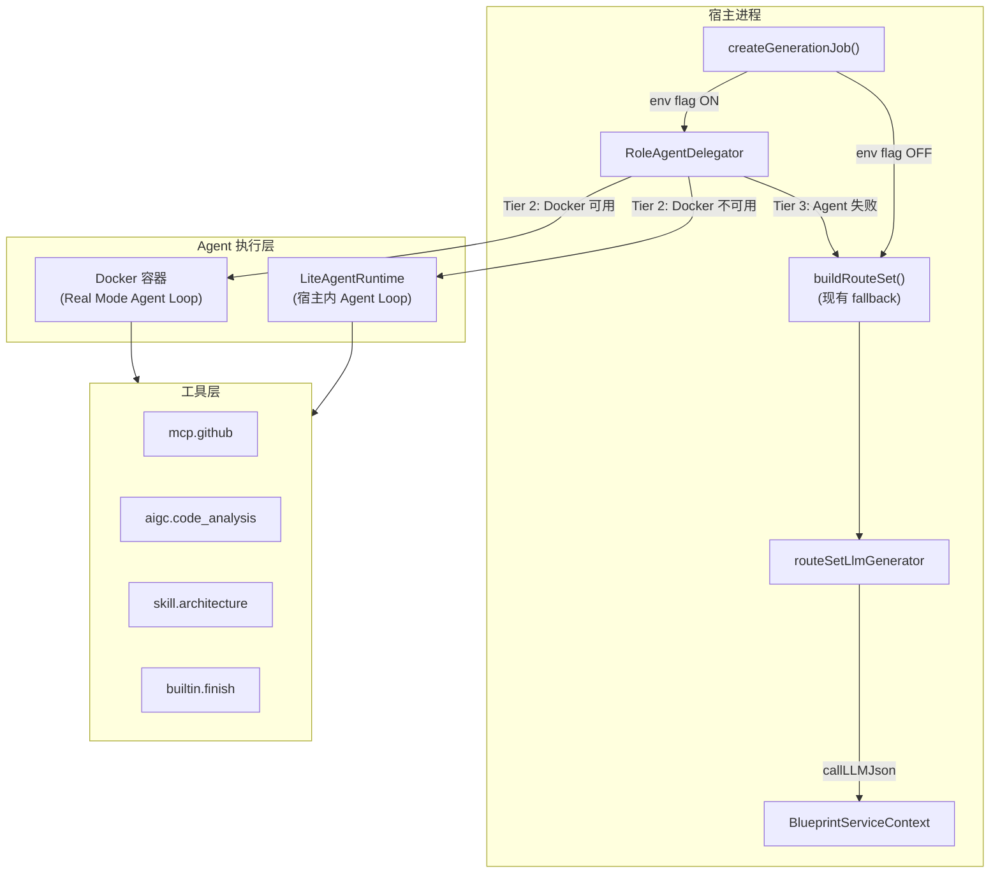
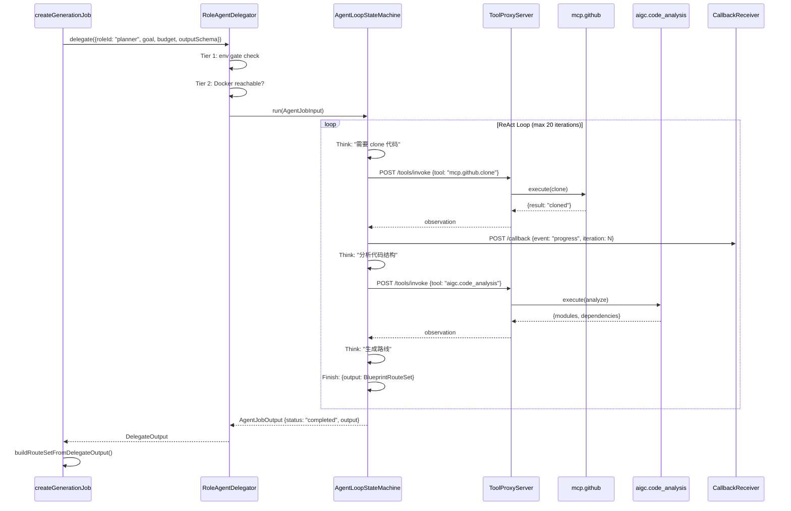

# Design Document: Autopilot Agent-Driven Pipeline

## Overview

本设计将 blueprint job 的 RouteSet 生成主流程从"宿主进程直接 `callLLMJson` 一次性生成"升级为"由 Planner 角色通过 `RoleAgentDelegator` 以自主 Agent 模式运行（ReAct Loop：clone → 分析 → 生成路线）"。

核心变更点：在 `createGenerationJob` 中，当 `BLUEPRINT_AGENT_DRIVEN_PIPELINE_ENABLED === "true"` 且 `ctx.roleAgentDelegator` 已装配时，用 `delegate()` 替代 `buildRouteSet()` 调用。现有 `buildRouteSet` / `routeSetLlmGenerator` 保留为三级降级的最终 fallback，确保零风险渐进切换。产物格式 `BlueprintRouteSet` 不变，`/api/blueprint/jobs` API 契约不变。

## Architecture

### 整体架构



### Agent 驱动链路时序



## Components and Interfaces

### Component 1: BlueprintServiceContext 扩展

**Purpose**: 在现有 context 上挂载 `RoleAgentDelegator` 实例

**Interface**:
```typescript
// server/routes/blueprint/context.ts 追加字段
export interface BlueprintServiceContext {
  // ... 现有字段 ...

  /**
   * 可选：Agent 驱动管线委派器。
   *
   * 当 `BLUEPRINT_AGENT_DRIVEN_PIPELINE_ENABLED === "true"` 时，
   * `createGenerationJob` 优先通过此委派器走 Agent 驱动链路生成 RouteSet。
   * 未注入或 env flag 关闭时走现有 `buildRouteSet` 链路。
   */
  roleAgentDelegator?: RoleAgentDelegator;
}
```

**Responsibilities**:
- 持有 `RoleAgentDelegator` 实例引用
- 在 `buildBlueprintServiceContext` 中按条件装配默认实例

### Component 2: Agent-Driven RouteSet 生成器

**Purpose**: 封装从 `DelegateOutput` 到 `BlueprintRouteSet` 的转换逻辑

**Interface**:
```typescript
// server/routes/blueprint/routeset/agent-driven-generator.ts

export interface AgentDrivenRouteSetInput {
  request: BlueprintGenerationRequest;
  jobId: string;
  createdAt: string;
  intake?: BlueprintIntake;
  clarificationSession?: BlueprintClarificationSession;
  projectContext?: BlueprintProjectDomainContext;
}

export interface AgentDrivenRouteSetOutput {
  routeSet: BlueprintRouteSet;
  executionMode: "real" | "lite";
  iterations: number;
  totalTokens: number;
  durationMs: number;
}

export type AgentDrivenRouteSetGenerator = (
  input: AgentDrivenRouteSetInput,
) => Promise<AgentDrivenRouteSetOutput>;

export function createAgentDrivenRouteSetGenerator(
  delegator: RoleAgentDelegator,
  fallbackGenerator: RouteSetLlmGenerator,
): AgentDrivenRouteSetGenerator;
```

**Responsibilities**:
- 构建 Planner 角色的 goal / systemPrompt / budget / outputSchema
- 调用 `delegator.delegate()`
- 将 `DelegateOutput.output` 验证并转换为 `BlueprintRouteSet`
- Agent 失败时 fallback 到 `routeSetLlmGenerator`

### Component 3: Planner Goal Builder

**Purpose**: 根据用户请求构建 Planner Agent 的目标描述和系统提示词

**Interface**:
```typescript
// server/routes/blueprint/routeset/planner-goal-builder.ts

export function buildPlannerGoal(
  request: BlueprintGenerationRequest,
  intake?: BlueprintIntake,
): string;

export function buildPlannerSystemPrompt(locale: string): string;

export function resolveAgentBudget(
  overrides?: Partial<AgentBudget>,
): AgentBudget;
```

**Responsibilities**:
- 从 `request.targetText`、`request.githubUrls`、`intake` 提取关键信息
- 生成结构化的 Planner 目标描述
- 提供默认预算配置（maxIterations: 20, maxTokens: 100K, timeoutMs: 5min）

### Component 4: RouteSet Output Schema Validator

**Purpose**: 验证 Agent 产出是否符合 `BlueprintRouteSet` schema

**Interface**:
```typescript
// server/routes/blueprint/routeset/agent-output-validator.ts

export const BlueprintRouteSetOutputSchema: Record<string, unknown>;

export function validateAndNormalizeAgentRouteSetOutput(
  raw: unknown,
  request: BlueprintGenerationRequest,
  routeSetId: string,
  primaryRouteId: string,
  createdAt: string,
): BlueprintRouteSet | null;
```

**Responsibilities**:
- 定义 Agent 输出的 JSON Schema
- 验证 Agent 产出结构
- 补齐 `routeSetId`、`primaryRouteId`、`provenance` 等宿主侧字段
- 验证失败返回 `null`，触发 fallback

## Data Models

### Model 1: AgentDrivenPipelineConfig

```typescript
export interface AgentDrivenPipelineConfig {
  /** 主开关，默认 "false" */
  enabled: boolean;
  /** Planner 角色 ID */
  plannerRoleId: string;
  /** 默认预算 */
  defaultBudget: AgentBudget;
  /** 输出 schema 版本 */
  outputSchemaVersion: string;
}
```

**Validation Rules**:
- `enabled` 仅当 `BLUEPRINT_AGENT_DRIVEN_PIPELINE_ENABLED === "true"` 时为 `true`
- `plannerRoleId` 默认为 `"planner"`
- `defaultBudget.maxIterations` 范围 [1, 50]
- `defaultBudget.maxTokens` 范围 [10000, 500000]
- `defaultBudget.timeoutMs` 范围 [30000, 600000]

### Model 2: AgentDrivenRouteSetProvenance

```typescript
export interface AgentDrivenRouteSetProvenance {
  /** 产出源标识 */
  generationSource: "agent" | "agent_fallback_lite" | "agent_fallback_llm";
  /** Agent 执行模式 */
  executionMode?: "real" | "lite";
  /** Agent 迭代次数 */
  iterations?: number;
  /** Agent token 消耗 */
  totalTokens?: number;
  /** Agent 执行耗时 */
  durationMs?: number;
  /** 降级原因（仅 fallback 时填充） */
  fallbackReason?: string;
}
```

**Validation Rules**:
- `generationSource` 必须是三个枚举值之一
- `executionMode` 仅在 `generationSource === "agent"` 时有值
- `fallbackReason` 长度截断到 400 字符

## Algorithmic Pseudocode

### Main Processing Algorithm: Agent-Driven RouteSet Generation

```typescript
async function generateRouteSetViaAgent(
  input: AgentDrivenRouteSetInput,
  delegator: RoleAgentDelegator,
  fallbackGenerator: RouteSetLlmGenerator,
): Promise<AgentDrivenRouteSetOutput> {
  const routeSetId = createId("blueprint-routeset");
  const primaryRouteId = `${routeSetId}:primary`;

  // Step 1: Build delegation input
  const delegateInput: DelegateInput = {
    roleId: "planner",
    stageId: "route_generation",
    jobId: input.jobId,
    goal: buildPlannerGoal(input.request, input.intake),
    systemPrompt: buildPlannerSystemPrompt("en"),
    context: {
      request: input.request,
      intake: input.intake,
      clarificationSession: input.clarificationSession,
      projectContext: input.projectContext,
      routeSetId,
      primaryRouteId,
    },
    budget: resolveAgentBudget(),
    outputSchema: BlueprintRouteSetOutputSchema,
  };

  // Step 2: Delegate to Agent
  const result = await delegator.delegate(delegateInput);

  // Step 3: Validate output
  if (result.status === "completed" && result.output != null) {
    const routeSet = validateAndNormalizeAgentRouteSetOutput(
      result.output,
      input.request,
      routeSetId,
      primaryRouteId,
      input.createdAt,
    );
    if (routeSet != null) {
      return {
        routeSet,
        executionMode: result.executionMode,
        iterations: result.iterations,
        totalTokens: result.totalTokens,
        durationMs: result.durationMs,
      };
    }
  }

  // Step 4: Fallback to existing routeSetLlmGenerator
  const fallbackResult = await fallbackGenerator({
    request: input.request,
    intake: input.intake,
    clarificationSession: input.clarificationSession,
    projectContext: input.projectContext,
    routeSetId,
    primaryRouteId,
    createdAt: input.createdAt,
  });

  return {
    routeSet: buildRouteSetFromFallback(
      fallbackResult,
      input,
      routeSetId,
      primaryRouteId,
    ),
    executionMode: result.executionMode,
    iterations: result.iterations,
    totalTokens: result.totalTokens,
    durationMs: result.durationMs,
  };
}
```

**Preconditions:**
- `delegator` 已正确装配（env gate 由 delegator 内部处理）
- `input.request` 非空且包含有效的 `targetText`
- `fallbackGenerator` 可用作最终兜底

**Postconditions:**
- 返回有效的 `AgentDrivenRouteSetOutput`
- `routeSet` 符合 `BlueprintRouteSet` schema
- 永不向调用方抛错（Agent 失败走 fallback）

**Loop Invariants:** N/A（无循环，Agent Loop 在 delegator 内部）

### Integration Algorithm: createGenerationJob 调用点替换

```typescript
// 在 createGenerationJob 内部，替换 buildRouteSet 调用点：

let routeSet: BlueprintRouteSet;
let agentDrivenMeta: AgentDrivenRouteSetProvenance | undefined;

if (
  ctx.roleAgentDelegator != null &&
  process.env.BLUEPRINT_AGENT_DRIVEN_PIPELINE_ENABLED === "true"
) {
  // Agent-driven path
  const agentResult = await generateRouteSetViaAgent(
    { request, jobId, createdAt, intake, clarificationSession, projectContext },
    ctx.roleAgentDelegator,
    options.routeSetLlmGenerator,
  );
  routeSet = agentResult.routeSet;
  agentDrivenMeta = {
    generationSource: "agent",
    executionMode: agentResult.executionMode,
    iterations: agentResult.iterations,
    totalTokens: agentResult.totalTokens,
    durationMs: agentResult.durationMs,
  };
} else {
  // Legacy path (unchanged)
  routeSet = await buildRouteSet(
    request, jobId, createdAt,
    clarificationSession, options.routeSetLlmGenerator,
    intake, projectContext,
  );
}
```

**Preconditions:**
- `ctx` 已通过 `buildBlueprintServiceContext` 构建
- `options.routeSetLlmGenerator` 始终可用

**Postconditions:**
- `routeSet` 始终为有效的 `BlueprintRouteSet`
- env flag 关闭时行为与现有完全一致
- `agentDrivenMeta` 仅在 Agent 路径时有值

### Context Assembly Algorithm: 装配 RoleAgentDelegator

```typescript
// 在 buildBlueprintServiceContext 中追加装配逻辑：

function assembleRoleAgentDelegator(
  ctx: Partial<BlueprintServiceContext>,
  routeSetLlmGenerator: RouteSetLlmGenerator,
): RoleAgentDelegator | undefined {
  // 仅在 env flag 开启时装配，避免无谓开销
  if (process.env.BLUEPRINT_AGENT_DRIVEN_PIPELINE_ENABLED !== "true") {
    return undefined;
  }

  return createRoleAgentDelegator({
    roleRuntimeContextStore: ctx.roleRuntimeContextStore,
    executorClient: ctx.executorClient,
    liteAgentRuntime: createLiteAgentRuntime({
      llmCall: createLlmCallFromContext(ctx),
      mcpToolAdapter: ctx.mcpToolAdapter,
      skillRegistry: ctx.skillRegistry,
      logger: ctx.logger,
      now: ctx.now,
    }),
    fallbackLlmCall: async (input: DelegateInput) => {
      // 退化为现有 routeSetLlmGenerator 的行为
      const result = await routeSetLlmGenerator({
        request: input.context.request as BlueprintGenerationRequest,
        intake: input.context.intake as BlueprintIntake | undefined,
        clarificationSession: input.context.clarificationSession as
          | BlueprintClarificationSession
          | undefined,
        projectContext: input.context.projectContext as
          | BlueprintProjectDomainContext
          | undefined,
        routeSetId: input.context.routeSetId as string,
        primaryRouteId: input.context.primaryRouteId as string,
        createdAt: new Date().toISOString(),
      });
      return result.routes;
    },
    logger: ctx.logger,
    now: ctx.now,
  });
}
```

**Preconditions:**
- `ctx.roleRuntimeContextStore` 可选（不存在时 delegator 内部退化为 builtin-only 工具集）
- `ctx.executorClient` 可选（不存在时 delegator 跳过 Real Mode）
- `routeSetLlmGenerator` 必须已构建

**Postconditions:**
- env flag 关闭时返回 `undefined`
- env flag 开启时返回完整装配的 `RoleAgentDelegator`

## Key Functions with Formal Specifications

### Function 1: buildPlannerGoal()

```typescript
function buildPlannerGoal(
  request: BlueprintGenerationRequest,
  intake?: BlueprintIntake,
): string
```

**Preconditions:**
- `request.targetText` 非空字符串
- `request.githubUrls` 为字符串数组或 undefined

**Postconditions:**
- 返回非空字符串
- 包含用户目标描述
- 如有 GitHub URL，包含仓库分析指令
- 如有 intake，包含已收集的项目上下文摘要

### Function 2: resolveAgentBudget()

```typescript
function resolveAgentBudget(
  overrides?: Partial<AgentBudget>,
): AgentBudget
```

**Preconditions:**
- `overrides` 可选，各字段为正整数或 undefined

**Postconditions:**
- 返回完整的 `AgentBudget` 对象
- 未覆盖字段使用 env 变量或硬编码默认值
- `maxIterations` ∈ [1, 50]
- `maxTokens` ∈ [10000, 500000]
- `timeoutMs` ∈ [30000, 600000]

### Function 3: validateAndNormalizeAgentRouteSetOutput()

```typescript
function validateAndNormalizeAgentRouteSetOutput(
  raw: unknown,
  request: BlueprintGenerationRequest,
  routeSetId: string,
  primaryRouteId: string,
  createdAt: string,
): BlueprintRouteSet | null
```

**Preconditions:**
- `raw` 为 Agent 产出的任意值
- `routeSetId`、`primaryRouteId`、`createdAt` 为有效字符串

**Postconditions:**
- 如果 `raw` 符合 RouteSet 结构：返回补齐宿主字段的 `BlueprintRouteSet`
- 如果 `raw` 不符合：返回 `null`
- 不抛错
- 返回的 `routeSet.id === routeSetId`
- 返回的 `routeSet.primaryRouteId === primaryRouteId`

## Example Usage

```typescript
// Example 1: Agent-driven path (env flag ON, Docker available)
// ctx.roleAgentDelegator is assembled, BLUEPRINT_AGENT_DRIVEN_PIPELINE_ENABLED="true"
const job = await createGenerationJob(request, {
  clarificationSession,
  routeSetLlmGenerator: ctx.routeSetLlmGenerator!,
  intake,
  context: ctx,
});
// → Agent Loop: clone → analyze → generate → BlueprintRouteSet
// → routeSet.provenance.generationSource === "agent"

// Example 2: Agent-driven path (Docker unavailable, Lite Mode)
// Docker unreachable → delegator falls to LiteAgentRuntime
// → routeSet.provenance.generationSource === "agent"
// → agentDrivenMeta.executionMode === "lite"

// Example 3: Agent fails, fallback to existing LLM generator
// Agent exceeds budget or produces invalid output
// → delegator internally falls to fallbackLlmCall
// → routeSet.provenance.generationSource === "agent_fallback_llm"

// Example 4: Env flag OFF (default, zero behavior change)
// BLUEPRINT_AGENT_DRIVEN_PIPELINE_ENABLED !== "true"
// → walks existing buildRouteSet() path
// → routeSet.provenance.generationSource === "llm" (unchanged)
```

## Correctness Properties

### Property 1: Feature flag isolation

*For any* value of `BLUEPRINT_AGENT_DRIVEN_PIPELINE_ENABLED` that is not exactly the string `"true"`, the system SHALL produce a `BlueprintRouteSet` via the existing `buildRouteSet()` path without invoking `RoleAgentDelegator.delegate()`.

**Validates: Requirements 1.2, 6.2**

### Property 2: Output schema invariance

*For any* execution path (agent-driven, lite mode, or fallback), the resulting `BlueprintRouteSet` SHALL pass the same structural validation as the existing `buildRouteSet()` output, and the `/api/blueprint/jobs` response shape SHALL remain unchanged.

**Validates: Requirements 6.3, 6.4**

### Property 3: Graceful degradation completeness

*For any* failure in the agent-driven path (Docker unreachable, Agent budget exceeded, Agent output invalid, LiteAgentRuntime error), the system SHALL produce a valid `BlueprintRouteSet` via fallback without propagating the error to the caller.

**Validates: Requirements 7.1, 7.2, 7.3, 7.4, 7.5**

### Property 4: Budget enforcement

*For any* agent-driven execution, the total iterations SHALL NOT exceed `resolveAgentBudget().maxIterations`, and the total duration SHALL NOT exceed `resolveAgentBudget().timeoutMs`.

**Validates: Requirements 3.5, 3.6, 7.2**

### Property 5: Provenance traceability

*For any* `BlueprintRouteSet` produced via the agent-driven path, the `provenance` object SHALL contain a `generationSource` value of `"agent"`, `"agent_fallback_lite"`, or `"agent_fallback_llm"`, enabling downstream consumers to distinguish the production method.

**Validates: Requirements 8.1, 8.2, 8.3, 8.4**

### Property 6: Context assembly idempotence

*For any* invocation of `buildBlueprintServiceContext` with the same dependencies, the resulting `ctx.roleAgentDelegator` SHALL be `undefined` when the env flag is off, and a valid `RoleAgentDelegator` instance when the env flag is on, regardless of call count.

**Validates: Requirements 2.3, 2.4**

### Property 7: Existing test compatibility

*For any* test suite running with `BUILD_TARGET=test` (which does not set `BLUEPRINT_AGENT_DRIVEN_PIPELINE_ENABLED`), the agent-driven path SHALL NOT be activated, preserving all existing test behavior unchanged.

**Validates: Requirements 1.5**

## Error Handling

### Error Scenario 1: Docker 不可达

**Condition**: `executorClient.assertReachable()` 抛错或超时
**Response**: `RoleAgentDelegator` 内部跳过 Real Mode，进入 Lite Mode
**Recovery**: LiteAgentRuntime 在宿主进程内执行 Agent Loop

### Error Scenario 2: Agent 产出 schema 校验失败

**Condition**: `validateAndNormalizeAgentRouteSetOutput()` 返回 `null`
**Response**: 记录 warn 日志，走 `routeSetLlmGenerator` fallback
**Recovery**: 使用现有 LLM 一次性调用生成 RouteSet

### Error Scenario 3: Agent 预算耗尽

**Condition**: iterations >= maxIterations 或 tokens >= maxTokens 或 timeout
**Response**: `AgentLoopStateMachine` 强制终止，返回 `status: "failed"`
**Recovery**: `generateRouteSetViaAgent` 检测到 failed 状态，走 fallback

### Error Scenario 4: RoleAgentDelegator 未装配

**Condition**: `ctx.roleAgentDelegator === undefined`（env flag 关闭或装配失败）
**Response**: 直接走现有 `buildRouteSet()` 路径
**Recovery**: 无需恢复，行为与升级前完全一致

## Testing Strategy

### Unit Testing Approach

- `buildPlannerGoal()`: 验证不同 request 组合下的 goal 文本结构
- `resolveAgentBudget()`: 验证 env 变量覆盖与默认值
- `validateAndNormalizeAgentRouteSetOutput()`: 验证合法/非法 Agent 输出的处理
- `assembleRoleAgentDelegator()`: 验证 env flag 开关对装配结果的影响

### Property-Based Testing Approach

**Property Test Library**: fast-check

- Property 1 (Feature flag isolation): 随机 env 值，验证 delegate 是否被调用
- Property 2 (Output schema invariance): 随机 Agent 输出，验证最终 RouteSet 结构
- Property 3 (Graceful degradation): 随机注入 Agent 失败，验证 fallback 产出

### Integration Testing Approach

- env flag OFF: 验证完整 `createGenerationJob` 行为不变
- env flag ON + mock delegator: 验证 Agent 路径端到端
- env flag ON + delegator 返回 failed: 验证 fallback 链路
- `BUILD_TARGET=test`: 验证默认不激活 Agent 路径

## Performance Considerations

| 维度 | 目标 | 策略 |
| --- | --- | --- |
| Agent 执行时间 | < 5 分钟 | timeout 预算 + 迭代上限 |
| Fallback 延迟 | < 现有 buildRouteSet 延迟 | Agent 失败后直接走 routeSetLlmGenerator |
| 内存开销 | 不显著增加 | Lite Mode 复用宿主进程，不额外分配容器 |
| 冷启动 | 无额外冷启动 | env flag OFF 时不装配 delegator |

## Security Considerations

- **HMAC 签名**: 容器 → 宿主回调复用现有 `CallbackReceiver` 的 HMAC-SHA256 验签
- **工具白名单**: Planner 角色只能调用其 `RoleCapabilityPackage` 声明的工具
- **Token 脱敏**: Agent trace 中不记录 LLM API Key
- **产物验证**: Agent 输出必须通过 `BlueprintRouteSetOutputSchema` 验证才接受
- **env flag 默认关闭**: 生产环境默认不走 Agent 路径，需显式开启

## Dependencies

| 依赖 | 来源 | 用途 |
| --- | --- | --- |
| `RoleAgentDelegator` | `server/routes/blueprint/role-agent-runtime/delegator.ts` | Agent 委派（已实现） |
| `LiteAgentRuntime` | `server/routes/blueprint/role-agent-runtime/lite-agent-runtime.ts` | 宿主内 Agent Loop（已实现） |
| `AgentLoopStateMachine` | `server/routes/blueprint/role-agent-runtime/state-machine.ts` | ReAct Loop 状态机（已实现） |
| `ToolProxyServer` | `server/routes/blueprint/role-agent-runtime/tool-proxy-server.ts` | 工具代理（已实现） |
| `CallbackReceiver` | `server/routes/blueprint/role-agent-runtime/callback-receiver.ts` | HMAC 回调（已实现） |
| `buildToolDefinitions` | `server/routes/blueprint/role-agent-runtime/tool-registration.ts` | 工具注册（已实现） |
| `RoleContainerLoader` | `server/routes/blueprint/role-container-loader/loader.ts` | 容器分配（已实现） |
| `routeSetLlmGenerator` | `server/routes/blueprint/routeset/route-llm-generator.ts` | 现有 LLM 生成器（保留为 fallback） |
| `buildRouteSet` | `server/routes/blueprint.ts` | 现有 RouteSet 构建（保留为 fallback） |
