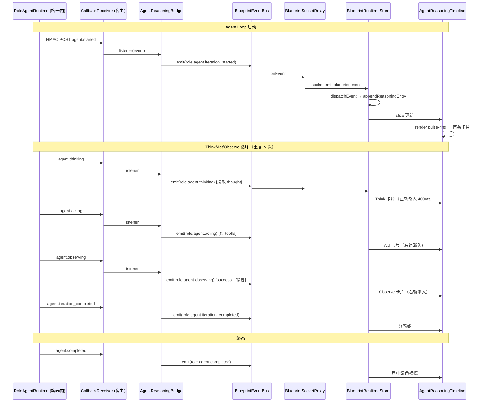

# Design Document

## Overview

本文档定义 `autopilot-agent-reasoning-stream` 特性的技术设计。Requirements phase 已完成 13 条需求（52 条 EARS AC），本设计在既有基础设施之上增量落地**Agent 思考过程的前端流式可视化**，不修改任何现有 bridge、delegator、runtime 的内部实现。

## 设计目标

把 `RoleAgentDelegator` 在 `autopilot-agent-driven-pipeline` 阶段产生的 `AgentTraceEntry[]` 通过既有 `CallbackReceiver.onProgress` 通道，桥接为 `BlueprintEventBus` 上的 `role.agent.*` 事件，再由 `BlueprintSocketRelay`（已建）推给 `BlueprintRealtimeStore`（已建）的新 `agentReasoning` slice，最终由新增的 `AgentReasoningTimeline` 组件消费，产出一条参考 MiroFish `Step3Simulation.vue` 模式的流式时间线。

## 四层数据映射

```
Layer 1  AgentTraceEntry          runtime 内部
         │
         ├── 由 RoleAgentRuntime / LiteAgentRuntime 产生
         ▼
Layer 2  AgentProgressEvent       HMAC callback 载荷
         │
         ├── 由 CallbackReceiver 分发
         ▼
Layer 3  role.agent.* event       BlueprintEventBus
         │
         ├── 由 Agent_Reasoning_Bridge 转译
         ▼
Layer 4  AgentReasoningEntry      前端 view model
         │
         ├── 由 BlueprintRealtimeStore.dispatchEvent 追加
         ▼
         AgentReasoningTimeline   渲染
```

### Layer 1：`AgentTraceEntry`（既有）

定义在 `shared/blueprint/agent-state.ts`。本特性**不修改**此层，只消费。关键字段：

- `iteration: number` 轮次，从 1 开始
- `phase: "idle" | "thinking" | "acting" | "observing" | "completed" | "failed"`
- `thought?: string` 思考原文
- `action?: { toolId: string; params: Record<string, unknown> }`
- `observation?: { toolId: string; result: unknown; durationMs: number }`
- `error?: string`
- `tokensUsed?: number`
- `timestamp: string` ISO

### Layer 2：`AgentProgressEvent`（既有）

定义在 `shared/blueprint/agent-events.ts`。本特性**不修改**。8 个事件类型：

- `agent.started`、`agent.thinking`、`agent.acting`、`agent.observing`、`agent.iteration_completed`、`agent.completed`、`agent.failed`、`agent.aborted`

### Layer 3：`role.agent.*` event（新增 7 项）

扩展 `shared/blueprint/events.ts` 的 `BlueprintGenerationEventType` union：

```ts
type AgentReasoningEventType =
  | "role.agent.iteration_started"
  | "role.agent.thinking"
  | "role.agent.acting"
  | "role.agent.observing"
  | "role.agent.iteration_completed"
  | "role.agent.error"
  | "role.agent.completed";
```

家族归属：`resolveBlueprintEventFamily` 的分词规则按第一个 `.` 前缀截取，这 7 个事件自动归入 `"role"` 家族，`BlueprintSocketRelay.DEFAULT_RELAY_FAMILIES` 无需修改。

#### Layer 2 → Layer 3 映射表

| AgentProgressEvent | role.agent.* | 说明 |
|---|---|---|
| `agent.started` | `role.agent.iteration_started` | `iteration=1`，初始化时间线 |
| `agent.thinking` | `role.agent.thinking` | 携带脱敏后 `thought` |
| `agent.acting` | `role.agent.acting` | 仅携带 `actionToolId`，去除 params |
| `agent.observing` | `role.agent.observing` | 仅携带 `observationSuccess` + 摘要 |
| `agent.iteration_completed` | `role.agent.iteration_completed` | 标记一轮结束 |
| `agent.completed` | `role.agent.completed` | 终态成功 |
| `agent.failed` | `role.agent.error` | `degraded` 字段由当前 Tier 推断 |
| `agent.aborted` | `role.agent.error` | `degraded:false`，`reason:"用户取消"` |

#### Payload shape

必填字段：`jobId / roleId / stageId / iteration / phase / timestamp`

可选字段（按事件类型按需填充，全部经过 Req 4 的脱敏）：`thought / actionToolId / observationSuccess / observationSummary / error / tokensUsed / budgetRemaining / degraded / reason`

**对应 Req 3.1, 3.2, 3.3, 3.4, 3.5**

### Layer 4：`AgentReasoningEntry`（新建 `shared/blueprint/agent-reasoning.ts`）

前端 view model，一条时间线卡片：

```ts
export type AgentReasoningPhase =
  | "thinking"
  | "acting"
  | "observing"
  | "iteration_started"
  | "iteration_completed"
  | "error"
  | "completed";

export interface AgentReasoningEntry {
  id: string;                  // `${jobId}:${iteration}:${phase}:${timestamp}`
  jobId: string;
  iteration: number;
  iterationLabel: string;      // `#${iteration}`
  phase: AgentReasoningPhase;
  timestamp: string;
  // 语义载荷（按 phase 分别出现）
  thought?: string;            // ≤280 UTF-8，已脱敏
  actionToolId?: string;
  observationSuccess?: boolean;
  observationSummary?: string; // ≤200 UTF-8
  error?: string;              // ≤200 UTF-8
  degraded?: boolean;
  reason?: string;             // "降级到 Lite 模式" / "用户取消" / "超时" / "一次性 LLM 回退"
  tokensUsed?: number;
  budgetRemaining?: number;
}
```

派生函数（放在同文件）：

- `buildEntryFromSocketEvent(event: BlueprintGenerationEvent): AgentReasoningEntry`

**对应 Req 3.4, 4.1, 4.2, 4.3, 4.4, 4.5**

## `createAgentReasoningBridge` 生命周期

### 签名

```ts
interface AgentReasoningBridgeDeps {
  eventBus: BlueprintEventBus;
  callbackReceiver?: CallbackReceiver;   // 注入式，未注入即走 no-op
  delegator?: RoleAgentDelegator;        // 用于 tier 推断（可选）
  logger: BlueprintLogger;
  now: () => Date;
}

interface AgentReasoningBridgeHandle {
  start: () => void;
  stop: () => void;
  getDiagnostics: () => AgentReasoningBridgeDiagnostics;
}

export function createAgentReasoningBridge(
  deps: AgentReasoningBridgeDeps
): AgentReasoningBridgeHandle;
```

### Env flag off 路径

当 `process.env.BLUEPRINT_AGENT_REASONING_STREAM_ENABLED !== "true"` **或** `BUILD_TARGET === "test"` **或** `deps.callbackReceiver == null` 时：

- `start() / stop()` 均为 no-op
- `getDiagnostics()` 返回 `{ enabled: false, totalForwarded: 0, droppedEntryCount: 0 }`
- 不向 `eventBus` 订阅任何事件
- 不向 `callbackReceiver` 注册任何 listener

### Env flag on 路径

`start()` 被调用时：

1. 调用 `callbackReceiver.onProgress((event) => this.forward(event))` 注册 listener
2. listener 内部：
   - try 解码 `AgentProgressEvent` → 产出 `BlueprintGenerationEvent`（`role.agent.*`）
   - 调用 `deps.eventBus.emit(event)` 注入总线
   - 递增 `totalForwarded` 计数
   - catch 异常：`logger.debug("[agent-reasoning-bridge] translation failed", { error })`，递增 `droppedEntryCount`，不重抛
3. 保存 unsubscribe handle，`stop()` 调用时执行
4. 可重入保护：`start()` 已启动时再次调用为 no-op；`stop()` 已停止时再次调用为 no-op

### 与现有 `attachDiagnosticsSubscriber` 的关系

`realtime-observation-bridge` 的 `attachDiagnosticsSubscriber` 是 EventBus 的**消费者**（订阅 emit 事件写诊断 store），本 bridge 是 EventBus 的**生产者**（调用 emit 注入事件）。两者对同一 eventBus 实例互不干扰，无需加锁。

**对应 Req 2.1, 2.2, 2.3, 2.4, 2.5**

## 时序图



### 降级路径时序

- **Tier 2 Real → Lite**：delegator 捕获 Real 抛错，切换到 `liteAgentRuntime.run()`。若 Lite runtime 也发 `AgentProgressEvent`，则继续走相同链路，bridge 会在检测到 `executionMode` 切换时额外 emit 一次 `role.agent.error`（`degraded:true`, `reason:"降级到 Lite 模式"`）作为"软分隔"。
- **Tier 3 fallback**：delegator 走 `executeFallback` → `routeSetLlmGenerator`，**没有 iteration loop**，不产出 Think/Act/Observe。bridge 只收到单个终态事件（完成或失败），前端渲染为一张居中横幅"一次性 LLM 回退"卡（Req 8.2）。
- **用户取消**：`delegator.cancel(jobId, reason)` → runtime 侧 `agent.aborted` → bridge emit `role.agent.error`（`degraded:false`, `reason:"用户取消"`）。
- **超时（180s）**：`BLUEPRINT_ROUTESET_LLM_TIMEOUT_MS` 触发 → runtime 侧 `agent.failed` → bridge emit `role.agent.error`（`reason:"超时"`）。

**对应 Req 8.1, 8.2, 8.3, 8.4, 8.5**

## `BlueprintRealtimeStore` 新 slice

### Shape

```ts
// 追加到既有 store state
interface AgentReasoningSliceState {
  jobId: string | null;
  entries: AgentReasoningEntry[];
  currentIteration: number;   // 当前活跃轮次（0 表示尚未开始）
  status: "idle" | "streaming" | "completed" | "failed" | "aborted";
}

// store state
{
  // ...existing slices (logEntries, agentProgress, rolePhases, capabilityStatuses, connectionState)
  agentReasoning: AgentReasoningSliceState;
}
```

初始态：`{ jobId: null, entries: [], currentIteration: 0, status: "idle" }`

### dispatchEvent 分支

在现有 `dispatchEvent(event: BlueprintGenerationEvent)` 内新增分支（不影响其他分支）：

```ts
if (event.type.startsWith("role.agent.")) {
  handleAgentReasoningEvent(event);
  // 继续 fallthrough 到 logEntries 分支（role.agent.* 也会追加到 logEntries 以兼容现有 BlueprintLogStream）
}
```

### `handleAgentReasoningEvent` 逻辑

1. 构造 entry：`buildEntryFromSocketEvent(event)`
2. 追加 `entries.push(entry)`
3. FIFO 截断：`while (entries.length > 500) entries.shift()`
4. `currentIteration` 派生：
   - `iteration_started` → `currentIteration = event.iteration`
   - `iteration_completed` → 保持不变（下一轮 `iteration_started` 会再次更新）
5. `status` 派生：
   - `iteration_started` → `"streaming"`
   - `completed` → `"completed"`
   - `error` + `reason === "用户取消"` → `"aborted"`
   - `error` + 其他 → `"failed"`

### subscribe 重置

```ts
subscribe(jobId: string): void {
  if (state.agentReasoning.jobId !== jobId) {
    state.agentReasoning = {
      jobId,
      entries: [],
      currentIteration: 0,
      status: "idle",
    };
  }
  // 继续调用既有 socket subscribe 逻辑
}
```

**对应 Req 5.1, 5.2, 5.3, 5.4, 5.5**

## `AgentReasoningTimeline` UI 组件

### 文件

`client/src/components/blueprint/AgentReasoningTimeline.tsx`

### Props

```ts
interface AgentReasoningTimelineProps {
  jobId: string;
  className?: string;
}
```

内部通过 `useBlueprintRealtimeStore((s) => s.agentReasoning)` 读取 slice。

### 布局结构（CSS Grid）

```
┌─────────────────────────────────────────────┐
│  ↓ Latest  (floating, shown when 非贴底)    │
├──────────┬──────────────┬───────────────────┤
│          │              │                   │
│ Thinking │  center axis │ Acting + Observ.  │
│   col    │     col      │       col         │
│          │              │                   │
├─── iteration-separator #N ──────────────────┤
│          │              │                   │
│  ...     │              │  ...              │
│          │              │                   │
├─────── centered banner (error/completed) ───┤
│  grid-column: 1 / -1                        │
└─────────────────────────────────────────────┘
```

CSS（Tailwind + inline style 组合）：

```tsx
<div
  ref={scrollRef}
  className="relative overflow-y-auto h-full"
  style={{ scrollBehavior: "smooth" }}
>
  {entries.length === 0 ? <PulseRingPlaceholder /> : null}

  <div className="grid grid-cols-[1fr_2px_1fr] gap-4 px-6 py-8 relative">
    <div className="absolute left-1/2 top-0 bottom-0 w-px bg-[#EAEAEA] -translate-x-1/2" />

    {groupedEntries.map((group) => (
      <React.Fragment key={group.iteration}>
        <div className="col-span-3 text-xs font-mono text-gray-400 flex items-center gap-2 my-4">
          <div className="flex-1 h-px bg-gray-200" />
          <span>#{group.iteration}</span>
          <div className="flex-1 h-px bg-gray-200" />
        </div>

        {group.entries.map((entry) =>
          entry.phase === "thinking" ? (
            <ReasoningCard entry={entry} column="left" key={entry.id} />
          ) : entry.phase === "acting" || entry.phase === "observing" ? (
            <ReasoningCard entry={entry} column="right" key={entry.id} />
          ) : entry.phase === "error" || entry.phase === "completed" ? (
            <ReasoningBanner entry={entry} key={entry.id} />
          ) : null
        )}
      </React.Fragment>
    ))}
  </div>

  {!atBottom && <LatestButton onClick={scrollToBottom} />}
</div>
```

### `<ReasoningCard>` 子组件

用 Framer Motion（已依赖）：

```tsx
import { motion } from "framer-motion";

const reducedMotion = useReducedMotion(); // 自定义 hook 读 matchMedia

<motion.div
  initial={reducedMotion ? false : { opacity: 0, y: 20 }}
  animate={{ opacity: 1, y: 0 }}
  transition={{
    duration: reducedMotion ? 0 : 0.4,
    ease: [0.165, 0.84, 0.44, 1],
  }}
  style={{ gridColumn: column === "left" ? "1" : "3" }}
  className={cardClassFor(entry.phase)}
>
  ...
</motion.div>
```

`cardClassFor(phase)` 按 Req 6.2 的 monochrome 映射返回 Tailwind class 组合。

### `<PulseRingPlaceholder>` 子组件

绝对居中 + CSS keyframes（不依赖 Framer Motion 以减小包体）：

```tsx
<div className="absolute inset-0 flex flex-col items-center justify-center gap-4 pointer-events-none">
  <div
    className="w-8 h-8 rounded-full border border-[#EAEAEA]"
    style={{
      animation: reducedMotion ? "none" : "reasoning-ripple 2s infinite",
    }}
  />
  <span className="text-sm text-gray-400">等待第一条思考...</span>
</div>
```

全局 CSS（写进 `index.css`）：

```css
@keyframes reasoning-ripple {
  0% { transform: scale(0.8); opacity: 1; border-color: #ccc; }
  100% { transform: scale(2.5); opacity: 0; border-color: #eaeaea; }
}

@media (prefers-reduced-motion: reduce) {
  .reasoning-ripple-disable { animation: none !important; }
}
```

### 自动滚动逻辑

```tsx
const scrollRef = useRef<HTMLDivElement>(null);
const [atBottom, setAtBottom] = useState(true);

useEffect(() => {
  const el = scrollRef.current;
  if (!el) return;
  const onScroll = () => {
    const dist = el.scrollHeight - el.scrollTop - el.clientHeight;
    setAtBottom(dist <= 32);
  };
  el.addEventListener("scroll", onScroll, { passive: true });
  return () => el.removeEventListener("scroll", onScroll);
}, []);

useEffect(() => {
  if (!atBottom || !scrollRef.current) return;
  requestAnimationFrame(() => {
    scrollRef.current!.scrollTop = scrollRef.current!.scrollHeight;
  });
}, [entries.length, atBottom]);
```

终态卡（`completed / error`）总是用 `scrollIntoView({ block: "nearest" })` 确保可见，但不改 `atBottom` 状态（Req 8.5）。

**对应 Req 6.1, 6.2, 6.3, 6.4, 6.5, 6.6, 7.1, 7.2, 7.3, 7.4, 7.5**

## 诊断端点扩展

### `BlueprintRuntimeDiagnosticsStore` 扩展

在 `server/routes/blueprint/runtime-enablement/diagnostics-store.ts` 新增：

```ts
type BridgeId =
  | "docker"
  | "mcpGithub"
  | "role"
  | "aigcNode"
  | "agentCrewStageActivation"
  | "roleContainerLoader"
  | "roleAutonomousAgent"
  | "agentReasoningBridge";  // 新增

interface AgentReasoningBridgeDiagnostics {
  bridgeId: "agentReasoningBridge";
  enabled: boolean;
  totalForwarded: number;
  droppedEntryCount: number;
  lastEventAt?: string;
  lastEventType?: string;
}
```

### 新增方法

```ts
recordAgentReasoningForwarded(eventType: string, now: Date): void;
recordAgentReasoningDropped(): void;
setAgentReasoningEnabled(enabled: boolean): void;
```

snapshot 时：

- env flag off：`{ bridgeId: "agentReasoningBridge", enabled: false, totalForwarded: 0, droppedEntryCount: 0 }`
- env flag on：返回真实计数

### `GET /api/blueprint/diagnostics` 响应

既有 `bridges` 对象的 key 顺序保持不变，`agentReasoningBridge` 追加到末尾。

**对应 Req 10.4, 10.5**

## 断连重连

- `BlueprintRealtimeStore.subscribe(jobId)` 的 reset 逻辑只在 **`jobId` 变化时**清空 `agentReasoning.entries`。Socket 重连（`jobId` 不变）不清空，继续追加。
- "仅显示重连后推理流" chip：在 `AgentReasoningTimeline` 顶部，当 `connectionState === "reconnected"` 且 `entries.length === 0` 时显示。chip 文案：`"仅显示重新连接后的推理流"`。
- 不引入任何 HTTP replay 接口或 backfill 逻辑。

**对应 Req 9.1, 9.2, 9.3, 9.4**

## 装配接线（`server/index.ts`）

```ts
// 既有接线（不变）
const blueprintServiceContext = buildBlueprintServiceContext({});

// 新增（env flag gated）
if (
  process.env.BLUEPRINT_AGENT_REASONING_STREAM_ENABLED === "true" &&
  process.env.BUILD_TARGET !== "test"
) {
  const { createAgentReasoningBridge } = await import(
    "./routes/blueprint/agent-reasoning-bridge.js"
  );
  const bridge = createAgentReasoningBridge({
    eventBus: blueprintServiceContext.eventBus,
    callbackReceiver: blueprintServiceContext.callbackReceiver, // 需从 ctx 暴露
    delegator: blueprintServiceContext.roleAgentDelegator,
    logger: blueprintServiceContext.logger,
    now: () => new Date(),
  });
  bridge.start();
  blueprintServiceContext.runtimeDiagnostics.setAgentReasoningEnabled(true);
}
```

`ctx.callbackReceiver` 在当前 `BlueprintServiceContext` 中已存在（由 `autopilot-role-autonomous-agent` spec 引入），无需扩展 ctx shape。

**对应 Req 1.1, 1.2, 1.3, 1.4, 1.5, 2.1**

## 测试策略

全部 example-based，禁 PBT。TS 基线 113 不扩大。

### `agent-reasoning-bridge.test.ts`（6 个测试）

1. `env flag off → start/stop no-op, no listener registered`
2. `callbackReceiver=undefined → no-op`
3. `agent.thinking event → emit role.agent.thinking with sanitized thought ≤280 chars`
4. `agent.acting event → emit role.agent.acting with actionToolId only`
5. `agent.failed event → emit role.agent.error with degraded field`
6. `listener throws → droppedEntryCount++, subsequent events still forwarded`

Mock 桩：
```ts
const mockCallbackReceiver = {
  onProgress: vi.fn((listener) => {
    mockCallbackReceiver.__listener = listener;
    return { unsubscribe: vi.fn() };
  }),
};
const mockEventBus = { emit: vi.fn(), subscribe: vi.fn() };
```

### `blueprint-realtime-store.agent-reasoning.test.ts`（5 个测试）

1. `role.agent.thinking event → appended to agentReasoning.entries`
2. `entries > 500 → FIFO truncate, logEntries untouched`
3. `subscribe(newJobId) → resets entries to []`
4. `iteration_started → currentIteration updates, status="streaming"`
5. `error with reason="用户取消" → status="aborted"`

### `AgentReasoningTimeline.test.tsx`（7 个测试）

用 React Testing Library + JSDOM，`matchMedia` mock：

1. `empty state → renders pulse-ring placeholder`
2. `prefers-reduced-motion: reduce → pulse-ring animation disabled`
3. `user scrolled to bottom → new entry triggers scrollTop update`
4. `user scrolled up >32px → new entry does NOT scroll, "↓ Latest" button appears`
5. `thinking entry → renders in left column`
6. `acting + observing entries → render in right column`
7. `error entry → renders as centered banner with red treatment; completed → green banner`

**对应 Req 11.1, 11.2, 11.3, 11.4, 11.5**

## 文件清单

| 文件 | 动作 | 职责 |
|---|---|---|
| `shared/blueprint/events.ts` | modify | 扩展 `BlueprintGenerationEventType` union + 7 项 |
| `shared/blueprint/agent-reasoning.ts` | new | `AgentReasoningEntry` + `AgentReasoningPhase` + `buildEntryFromSocketEvent` |
| `server/routes/blueprint/agent-reasoning-bridge.ts` | new | bridge 工厂、Layer 2→3 转译、脱敏 |
| `server/routes/blueprint/agent-reasoning-bridge.test.ts` | new | 6 个例子测试 |
| `server/routes/blueprint/runtime-enablement/diagnostics-store.ts` | modify | 追加 `agentReasoningBridge` bridge id + 3 个方法 |
| `server/routes/blueprint/runtime-enablement/diagnostics-store.test.ts` | modify | 扩展用例 |
| `server/routes/blueprint/context.ts` | modify | 仅类型层面，确保 `callbackReceiver` 对外可达 |
| `server/index.ts` | modify | 装配 bridge（env flag on 时） |
| `client/src/lib/blueprint-realtime-store.ts` | modify | 加 slice + `dispatchEvent` 分支 + `subscribe` reset |
| `client/src/lib/__tests__/blueprint-realtime-store.agent-reasoning.test.ts` | new | 5 个例子测试 |
| `client/src/components/blueprint/AgentReasoningTimeline.tsx` | new | 主组件 + `ReasoningCard` + `ReasoningBanner` + `PulseRingPlaceholder` |
| `client/src/components/blueprint/__tests__/AgentReasoningTimeline.test.tsx` | new | 7 个例子测试 |
| `client/src/index.css` | modify | 加 `reasoning-ripple` keyframes |
| `.env.example` | modify | `BLUEPRINT_AGENT_REASONING_STREAM_ENABLED=false` + 中文注释 |

**对应 Req 12.1, 12.2, 12.3, 12.4**

## 约束回指

- 中文注释 / 中文 commit：所有新文件顶部中文 docstring + 引用本 spec 名（Req 12.1）
- 禁 PBT（no `fast-check`）：全部 example-based Vitest（Req 11.4）
- 不扩大 TS 基线 113：新代码全量类型、不用 `any`、不引入 untyped 依赖（Req 11.5）
- 不改 5 条 bridge + delegator + runtime + callback-receiver 内部实现：bridge 只订阅 `onProgress`，不修改其 impl（Req 2.4）
- `BUILD_TARGET=test` 下 env flag 强制 false：装配判断两处（`server/index.ts` + bridge 内部）都检查（Req 1.3）
- 现有 `BlueprintLogStream` / 各 slice cap / `PetWorkers` / `tasks-store` / `mission-client` 不动：新 slice 独立，`role.agent.*` 事件也 fallthrough 写入 `logEntries` 保证 LogStream 兼容（Req 5.5, 10.1, 10.2, 10.3）
- 不扩展 12 家族目录：7 个新事件归入 `role` 家族（Req 3.2）

## MiroFish 参考来源对齐

本 design 的所有视觉与交互决策可回指到 requirements.md 的 Req 13：

- 双层信息架构 → 本特性 Timeline（feed 层）+ 现有 LogStream（logs 层）
- `timeline-item-enter-active` 400ms cubic-bezier → Framer Motion transition（本设计）
- `.pulse-ring` + `@keyframes ripple` → `reasoning-ripple` CSS keyframes（本设计）
- 左右双轨 → CSS Grid 三列 + `grid-column: 1 / -1` 横幅（本设计的改良）
- Timeline 不强制 autoscroll → 32px 阈值判定 + "↓ Latest" 按钮（本设计）
- HTTP 轮询 → **不复制**，走 Socket.IO 事件（本设计保持）
- `action_type` 详细渲染 → **不复制**，phase-based 卡片（本设计保持）

**对应 Req 13.1, 13.2, 13.3, 13.4, 13.5**
