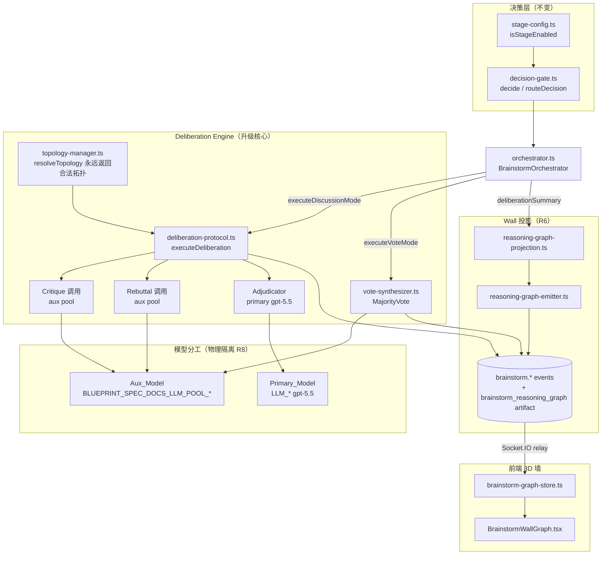
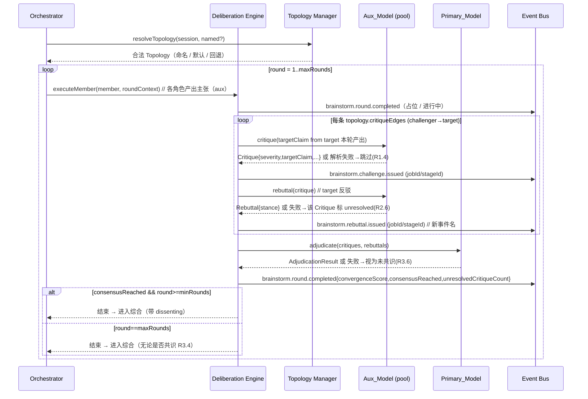

# Design Document

Autopilot Brainstorm Real Collaboration — 把 `deliberation-protocol.ts` 的「扇出 + 正则刮取」升级为 ChatDev 拓扑启发的真实多智能体协作引擎：结构化批评（Critique）→ 结构化反驳（Rebuttal）→ 主模型裁决（Adjudicator）/ 结构化多数投票（MajorityVote），并端到端把真实结构化对象喂给 3D 墙。

## Overview

### 问题陈述（grounded in real files）

`server/routes/blueprint/brainstorm/deliberation-protocol.ts` 当前是启发式实现：

- `outputFromMember()` 用 `/\b(?:challenge|disagree|risk|concern)[:\s-]+([^.;\n]+)/gi` 在每个 Agent **自己**的文本里正则匹配派生「挑战」；`referencedMembers` 用 `lower.includes(roleId)` 子串匹配角色名。
- `challengesFromOutputs()` 把正则命中转成 `ChallengeRecord`；`computeConvergenceScore()` 用「共享 agreementPoints + 交叉引用 - 是否含挑战」的文本相似度启发式打收敛分。
- `findRebuttalsForPriorChallenges()` 靠「target 角色文本里是否提到 challenger」+ 是否含 `resolved|mitigated|addressed` 关键词派生反驳。

结果是上游产生的可靠结构化「挑战」对象很少，墙面辩论图稀疏不可靠。

### 目标

在**不重写**既有子系统的前提下，把 deliberation 核心从「文本刮取」升级为「真实结构化交换」：

1. **Critique（R1）**：拓扑声明的 challenger→target 关系驱动一次专门的 Aux_Model LLM 调用，让 A 批评 B 的**某条具体主张**，产出 `Critique { id, challengerRoleId, targetRoleId, targetClaim, critique, severity }`。彻底移除自文本正则派生。
2. **Rebuttal（R2）**：被批评方对该条 Critique 发起一次 Aux_Model LLM 调用，产出 `Rebuttal { id, responderRoleId, challengeId, rebuttal, stance }`，`stance ∈ { concede, defend }`。
3. **Adjudicator（R3）**：每轮交换后由 **Primary_Model（gpt-5.5）** 裁决收敛/共识，返回 `AdjudicationResult { consensusReached, convergenceScore, unresolvedCritiqueIds, rationale }`，never-throws，替换 `computeConvergenceScore`。
4. **MajorityVote（R4）**：vote 模式下基于结构化投票按 `confidence` 加权裁决（参考 ChatDev `demo_majority_voting.yaml`）。
5. **Topology（R5）**：可声明的 Agent 交互图驱动「谁批评谁、谁综合、几轮」，含默认拓扑 + 可配置；非法/缺失回退到当前全并行行为。
6. **Wall feed（R6）**：结构化对象 → 一等 `brainstorm.*` 事件 + `BrainstormReasoningGraph` 语义边，保持 `isGraphRenderable` 不变量。
7. **保守伴随（R7-R10）**：jobId/stageId 每条 payload 必带；模型物理分工；绝不阻塞/替代确定性生成；绝不抛错；env-gated、`BUILD_TARGET=test` 默认关闭。
8. **诊断 + 工程基线（R11-R12）**：诊断端点扩展真实辩论计数；不扩大 TS 基线；fast-check 锁四条不变量。

### 复用边界（不从零重写）

| 模块 | 升级动作 |
| --- | --- |
| `orchestrator.ts` | 扩构造函数，注入 `adjudicatorCaller`（primary）；`executeDiscussionMode` 把新结构化结果映射到既有 `deliberationSummary`。`node.created/updated`（带 jobId）保持。 |
| `deliberation-protocol.ts` | **主升级目标**：用 Critique/Rebuttal/Adjudication 替换 `outputFromMember`/`challengesFromOutputs`/`computeConvergenceScore`/`findRebuttalsForPriorChallenges`。保留 `DeliberationRound`/`DeliberationResult` 形状（向后兼容）。 |
| `topology-manager.ts` | **新增**：解析/校验/回退 Topology。 |
| `vote-synthesizer.ts` | 扩展为结构化 `MajorityVote`（保留 `computeVoteResult`，补 stance/置信度/margin 已有）。 |
| `synthesizer.ts` / `synthesis-audit.ts` | 不变，继续走 primary。Adjudicator 复用 `synthesis-audit` 的 never-throw + 宽松 JSON 解析模式。 |
| `decision-gate.ts` / `stage-config.ts` | 不变，继续决定是否启动 / mode / roles / 拓扑选择键。 |
| `pipeline-integration.ts` / `stage-wrapper.ts` / `second-stage-companion.ts` | 不变的非阻塞伴随接线；`assembleBrainstormContext` 把 `primaryCaller` 传入 orchestrator 作 adjudicator。 |
| `reasoning-graph-projection.ts` | 扩展：Critique→`conflicts`、Rebuttal→`supports`、综合→`synthesizes`；继续输出前剔除悬挂边。 |
| `reasoning-graph-emitter.ts` | 不变（projection 升级即可）。 |
| `shared/blueprint/events.ts` | **加** `brainstorm.rebuttal.issued`（additive，留在 `brainstorm` 家族）。 |
| `shared/blueprint/brainstorm-contracts.ts` | **加** Critique/Rebuttal/MajorityVote/Topology/AdjudicationResult（additive）。 |
| client `brainstorm-graph-store.ts` | 扩展 `brainstorm.rebuttal.issued` 处理 + stance 区分（已有 `kind: challenge \| support`）。 |
| client `BrainstormWallGraph.tsx` / `brainstorm-wall-graph-logic.ts` | 消费结构化 challenge/support edge + vote outcome（已具备 `challengeEdges` / `voteOutcome`）。 |

> ChatDev（`./ChatDev-main`）仅作灵感来源（`workflow/*.py` 的图拓扑、`demo_majority_voting.yaml` 的投票模型），**绝不修改、绝不提交**。

## Architecture



### 结构化辩论轮次时序（discussion 模式）



### 优雅降级分层（Graceful Degradation Tiers, R9）

| Tier | 触发条件 | 行为 | 计入 |
| --- | --- | --- | --- |
| T0 正常 | env 开启 + 依赖就位 | 真实 Critique/Rebuttal/Adjudicator/MajorityVote | — |
| T1 单调用降级 | 单条 Critique/Rebuttal/裁决 LLM 失败或解析失败 | 跳过该条 / 标 unresolved / 该轮视为未共识，**继续其余**（R1.4/R2.6/R3.6/R4.4） | session 内计数 |
| T2 引擎降级 | 结构化引擎任一环节抛错 / 拓扑不可执行 / 无有效投票 | 回退到**当前启发式 deliberation**（保留旧函数为 fallback 路径）或综合阶段并标注（R4.5/R9.4） | `brainstorm.degraded` → `degradationCount` |
| T3 子系统降级 | orchestrator/pipeline 异常、session 超时/失败 | 回退 single-agent，确定性生成不受影响（R9.1/R9.3） | `brainstorm.degraded` |
| T4 关闭 | `BLUEPRINT_BRAINSTORM_ENABLED!="true"` 或 `BUILD_TARGET=test` 未 opt-in | 与本 spec 前行为字节级一致，无新副作用（R9.5/R10.2） | — |

确定性 SPEC 文档生成（`generateSpecDocuments`）始终是真相源；brainstorm 由 `second-stage-companion.ts` 以 fire-and-forget 非阻塞方式运行，`singleAgentFallback` 返回空串且 `StageResult.output` 被调用方丢弃（R9.2/R9.3）。

## Components and Interfaces

### 1. Topology Manager（新增 `topology-manager.ts`，R5）

纯同步、never-throws。核心契约：**任意输入恒返回一个合法可执行 Topology**。

```ts
export interface ResolveTopologyInput {
  participatingRoleIds: BrainstormRoleId[];   // 来自 session.crewMembers
  named?: BrainstormTopology | null;          // 可配置命名拓扑（来自 stage-config / decision）
}

export interface ResolveTopologyResult {
  topology: BrainstormTopology;               // 永远合法
  usedDefault: boolean;
  fallbackReason?: TopologyFallbackReason;     // "missing" | "unknown_role" | "cyclic" | "empty_edges" | "self_loop"
}

export function resolveTopology(input: ResolveTopologyInput): ResolveTopologyResult;
export function buildDefaultTopology(roleIds: BrainstormRoleId[]): BrainstormTopology;
export function validateTopology(t: BrainstormTopology, roleIds: BrainstormRoleId[]): TopologyFallbackReason | null;
```

校验规则（R5.4/R5.5）：

- 每条 `critiqueEdges[].challenger` 与 `.target` 必须属于 `participatingRoleIds`，否则 `unknown_role`。
- 无自环（challenger ≠ target），否则 `self_loop`。
- critique 关系图无环（保证轮次能收敛），否则 `cyclic`（用 DFS 检测有向环）。
- `minRounds <= maxRounds`、`maxRounds >= 1`，否则按默认值钳制。
- 任一校验失败 → 回退 `buildDefaultTopology(participatingRoleIds)`，并填 `fallbackReason`。

**默认拓扑**（R5.1）：把参与角色串成「环形批评链」的无环版本——每个角色批评列表中的下一个角色（最后一个不回指第一个，避免环），`synthesizerRoleId = "decider"`（若在场，否则首个角色），`minRounds=2, maxRounds=5`。当只有 1 个角色时 `critiqueEdges=[]`（退化为单 Agent 独白，等价当前全并行无交互）。

### 2. Deliberation Engine 升级（`deliberation-protocol.ts`，R1/R2/R3）

`executeDeliberation` 的新输入与产出（向后兼容 `DeliberationRound`/`DeliberationResult`，仅替换内部派生逻辑）：

```ts
export interface ExecuteDeliberationInput {
  session: BrainstormSession;
  stageContext: string;
  executeMember(member: CrewMemberInstance, context: string): Promise<void>;
  emitEvent: EventEmitterFn;
  config?: Partial<DeliberationConfig>;
  // 新增（全部可选，缺省即降级到当前启发式行为 R9.4）：
  topology?: BrainstormTopology;              // resolveTopology 的结果
  critiqueCaller?: StructuredCritiqueCaller;  // aux pool；缺省 → 走旧启发式
  rebuttalCaller?: StructuredRebuttalCaller;  // aux pool
  adjudicator?: AdjudicatorFn;                // primary gpt-5.5
}
```

子调用接口（均 never-throw 由引擎包裹，返回 `null` 表示该条失败）：

```ts
export type StructuredCritiqueCaller = (input: {
  challengerRoleId: BrainstormRoleId;
  target: { roleId: BrainstormRoleId; claims: string[] };  // claims 来自 target 本轮产出
  stageContext: string;
}) => Promise<Critique | null>;

export type StructuredRebuttalCaller = (input: {
  critique: Critique;
  responderClaim: string;
}) => Promise<Rebuttal | null>;

export type AdjudicatorFn = (input: {
  critiques: Critique[];
  rebuttals: Rebuttal[];
  roundNumber: number;
}) => Promise<AdjudicationResult>;  // never-throw：失败时返回 consensusReached=false
```

执行流程（每轮）：

1. 各角色按 topology 顺序产出主张（沿用 `executeMember` + `buildRoundContext`，aux pool）。
2. 从每个 target 角色的本轮产出抽取候选主张句（按句切分，过滤空白；`targetClaim` 必须来自 **target 文本**而非 challenger，R1.3）。
3. 对每条 `topology.critiqueEdges`：调用 `critiqueCaller`。`severity` 校验为 `{low,medium,high}`（R1.2），非法→`null`→跳过（R1.4）。**不再调用** `outputFromMember` 的关键词正则（R1.5）。
4. 对每条合法 Critique：若 target 角色可用，调用 `rebuttalCaller`；`stance="concede"`→标 Critique resolved（R2.4），`"defend"` 或失败→unresolved（R2.5/R2.6）。
5. 调用 `adjudicator`（primary）；`convergenceScore` 钳到 [0,1]（R3.2）；填 `DeliberationRound.convergenceScore`/`challenges`/`rebuttals`。
6. 终止条件：`consensusReached && round>=minRounds`（R3.3）或 `round==maxRounds`（R3.4）。
7. 未解决 Critique 作为 dissenting opinions 传给综合（R3.7）。
8. 「本轮零 Critique」记录并继续（R1.6）。

降级（R9.4）：当 `critiqueCaller/adjudicator` 缺省或 topology 不可执行时，引擎走保留下来的旧启发式路径（`outputFromMember`/`computeConvergenceScore` 改名为 `legacy*` 并标注 fallback-only），保证零变化回退。

### 3. Orchestrator 接线（`orchestrator.ts`，R8）

```ts
constructor(
  private readonly llmCaller: LLMCallerFn,          // aux pool（主张/Critique/Rebuttal/Vote）
  private readonly emitEvent: EventEmitterFn,
  private readonly adjudicatorCaller?: LLMCallerFn,  // 新增：primary gpt-5.5（裁决）
) {}
```

`executeDiscussionMode` 内：`resolveTopology` → 构造 `critiqueCaller`/`rebuttalCaller`（基于 `this.llmCaller` = aux）与 `adjudicator`（基于 `this.adjudicatorCaller` = primary），传入 `executeDeliberation`。物理隔离可注入、可区分（R8.3/R12.5）。`assembleBrainstormContext` 把 `primaryCaller` 作为第三参传入；pool 未配置时 aux 退化为 primary（R8.4），但两者仍是不同字段引用便于 spy 计数。

### 4. MajorityVote（`vote-synthesizer.ts`，R4）

复用 `computeVoteResult`（已按 `confidence` 加权 + `margin` + `isNarrow<0.15` + `minorityReasoning`）。升级点：

- `parseVote` 产出结构化 `MajorityVote.votes[]`，无效票忽略（R4.4），保留有效票裁决。
- 无任何有效票 → orchestrator 降级到综合并标注「无有效投票」（R4.5），不抛错。
- `executeVoteMode` 继续 emit `brainstorm.vote.completed`（payload 已含 `winningOption/margin/isNarrow/voteCount`，R6.4）。

### 5. Wall Projection（`reasoning-graph-projection.ts`，R6）

`projectSessionToReasoningGraph` 已有：challenge→`conflicts`、rebuttal→`supports`、synthesis→`synthesizes`、中心问题节点 + 悬挂边剔除。升级点：

- Critique 的 `targetClaim`/`severity` 进 `deliberationSummary.challenges[].summary`，投影时 `conflicts` 边 label 用「质疑·{severity}」。
- Rebuttal `stance` 进 `deliberationSummary.rebuttals[]`：`defend`→`supports`(label「坚持」)、`concede`→`supports`(label「让步」)。
- `isGraphRenderable` 不变量（每条边 source/target ∈ nodes，含 `central-question` 节点）在返回前的 dangling-edge guard 保持（R6.7/R12.3）。

### 6. 事件（`shared/blueprint/events.ts`，R6/R7）

**唯一新增事件名**（additive，留在 `brainstorm` 家族）：

```ts
| "brainstorm.rebuttal.issued"
```

在 `BlueprintGenerationEventType` union + `BlueprintEventName` 常量 + 新增 payload 接口三处同步追加。`resolveBlueprintEventFamily("brainstorm.rebuttal.issued")` 按首段 `.` 截取自动归 `"brainstorm"`，不扩展家族目录（R12.2）。

每条 `brainstorm.*` payload 必带非空 `jobId` 与 `stageId`；缺失则跳过该事件发出而非发残缺事件（R7.3）——由一个 `emitBrainstormEvent(emitEvent, type, payload)` 包装器统一守卫。

### 7. 客户端（`brainstorm-graph-store.ts` / `BrainstormWallGraph.tsx`，R6）

- store 已处理 `brainstorm.challenge.issued`/`brainstorm.round.completed`/`brainstorm.vote.completed` 与 `kind: challenge|support`。新增 `brainstorm.rebuttal.issued` case → `handleChallengeIssued({ kind: "support" })`（responder→challenger）。
- `handleChallengeIssued` 已守卫端点角色节点存在（`hasChallenger && hasTarget`），保证客户端侧图也不产生悬挂边。

### 8. 诊断（`pipeline-integration.ts` `getBrainstormDiagnostics`，R11）

扩展 brainstorm 诊断段（`server/routes/blueprint.ts` 已挂 `GET /api/blueprint/diagnostics`）：在既有 `enabled/activeSessionsCount/totalSessionsCompleted/degradationCount/averageSessionDurationMs/perStageConfig/pool` 之上，补**真实结构化辩论计数**：`critiqueCount/rebuttalCount/unresolvedCount/adjudicationCount/voteCount`（由 orchestrator 累计）。降级时 emit `brainstorm.degraded` 计入 `degradationCount`（R11.3）。

## Data Models

新增 shared 契约（`shared/blueprint/brainstorm-contracts.ts`，全部 additive，不破坏既有字段 R12.2）：

```ts
/** 批评严重度。 */
export type CritiqueSeverity = "low" | "medium" | "high";

/** 反驳立场。 */
export type RebuttalStance = "concede" | "defend";

/** 一个 challenger 对 target 某条具体主张的真实结构化批评（R1）。 */
export interface Critique {
  id: string;
  challengerRoleId: BrainstormRoleId;
  targetRoleId: BrainstormRoleId;
  /** 引用 target 本轮产出的一条具体主张文本（非 challenger 自身文本）。 */
  targetClaim: string;
  critique: string;
  severity: CritiqueSeverity;
  roundNumber: number;
  resolved: boolean;
}

/** 被批评方对某条 Critique 的真实结构化反驳（R2）。 */
export interface Rebuttal {
  id: string;
  responderRoleId: BrainstormRoleId;
  challengeId: string;        // === 所回应 Critique.id（R2.2）
  rebuttal: string;
  stance: RebuttalStance;
  roundNumber: number;
}

/** 主模型对一轮辩论是否收敛/达成共识的结构化裁决（R3）。 */
export interface AdjudicationResult {
  consensusReached: boolean;
  convergenceScore: number;   // 钳制到 [0,1]（R3.2）
  unresolvedCritiqueIds: string[];
  rationale: string;
}

/** 单个 Agent 的结构化投票（R4.1）。 */
export interface StructuredVote {
  roleId: BrainstormRoleId;
  chosenOption: string;
  confidence: number;         // [0,1]
  reasoning: string;
}

/** 结构化多数投票结果（R4，参考 ChatDev demo_majority_voting.yaml）。 */
export interface MajorityVote {
  winningOption: string;
  winningScore: number;       // 按 confidence 加权
  secondPlaceOption: string | null;
  margin: number;             // winning - second
  isNarrow: boolean;          // margin < 阈值（R4.3）
  votes: StructuredVote[];    // 仅有效票
  minorityReasoning: string[];
}

/** 一条 challenger→target 的批评关系（R5）。 */
export interface TopologyCritiqueEdge {
  challenger: BrainstormRoleId;
  target: BrainstormRoleId;
}

/** 可声明的 Agent 交互拓扑（R5）。 */
export interface BrainstormTopology {
  name: string;                          // "default" | 具名
  participants: BrainstormRoleId[];
  critiqueEdges: TopologyCritiqueEdge[]; // 谁批评谁
  synthesizerRoleId: BrainstormRoleId;   // 谁综合
  minRounds: number;
  maxRounds: number;
}
```

`BrainstormSession.deliberationSummary`（既有可选结构）继续作为 orchestrator→projection 的桥；新增计数字段 `critiqueCount/rebuttalCount/adjudicationCount` 以可选方式补到 `deliberationSummary`，保持向后兼容。`BrainstormDiagnostics` 追加可选 `critiqueCount?/rebuttalCount?/unresolvedCount?/adjudicationCount?/voteCount?`（additive）。

### 事件 payload 模型

```ts
/** brainstorm.challenge.issued（升级：补 targetClaim/severity）。 */
export interface BrainstormChallengeIssuedPayload {
  jobId: string; stageId: string; sessionId: string;
  challengerRoleId: BrainstormEventRoleId;
  targetRoleId: BrainstormEventRoleId;
  targetClaim: string;
  critiqueSummary: string;
  severity: CritiqueSeverity;
  roundNumber: number;
}

/** brainstorm.rebuttal.issued（新事件）。 */
export interface BrainstormRebuttalIssuedPayload {
  jobId: string; stageId: string; sessionId: string;
  responderRoleId: BrainstormEventRoleId;
  challengeId: string;
  rebuttalSummary: string;
  stance: RebuttalStance;
  roundNumber: number;
}

/** brainstorm.round.completed（升级：补 consensus/unresolved）。 */
export interface BrainstormRoundCompletedPayload {
  jobId: string; stageId: string; sessionId: string;
  roundNumber: number;
  convergenceScore: number;
  consensusReached: boolean;
  unresolvedCritiqueCount: number;
  participatingRoleIds: BrainstormEventRoleId[];
}
```

## Correctness Properties

*A property is a characteristic or behavior that should hold true across all valid executions of a system — essentially, a formal statement about what the system should do. Properties serve as the bridge between human-readable specifications and machine-verifiable correctness guarantees.*

These properties are derived from the prework analysis above; redundant criteria were consolidated (e.g. severity + stance validation merged; all never-throw criteria merged into one degradation property; vote tally/margin/invalid-vote merged). Each is implemented as a SINGLE fast-check property test with ≥100 iterations.

### Property 1: Structured parse validation enforces closed value sets

*For any* raw LLM string fed to the Critique parser or the Rebuttal parser, the parser SHALL return either `null` or a structurally valid object whose `severity` ∈ `{ "low", "medium", "high" }` (Critique) or whose `stance` ∈ `{ "concede", "defend" }` (Rebuttal) — never an object carrying an out-of-set value.

**Validates: Requirements 1.2, 2.3**

### Property 2: Rebuttal resolution correctness

*For any* Critique paired with a Rebuttal, the matched Critique is marked `resolved` if and only if the Rebuttal's `stance` is `"concede"`; a `"defend"` stance, an unparseable rebuttal, or a failed rebuttal call SHALL leave the Critique `unresolved` and retained for later rounds/adjudication.

**Validates: Requirements 2.4, 2.5, 2.6**

### Property 3: Deliberation always terminates within configured round bounds

*For any* session, topology, and adjudicator behavior, `executeDeliberation` SHALL execute at most `maxRounds` rounds and end early only when `consensusReached` is `true` AND the executed round count is at least `minRounds`.

**Validates: Requirements 3.3, 3.4**

### Property 4: Convergence score is clamped to [0, 1]

*For any* adjudicator output (including out-of-range, negative, NaN, or non-numeric values), the resulting round `convergenceScore` and `AdjudicationResult.convergenceScore` SHALL lie within the closed interval [0, 1].

**Validates: Requirements 3.2**

### Property 5: Degradation never throws

*For any* combination of failures across the aux pool key, Critique caller, Rebuttal caller, Adjudicator, Topology resolution, MajorityVote, and Wall projection (each independently throwing, timing out, or returning garbage), `executeDeliberation` and `executeStageWithBrainstorm` SHALL resolve with a degraded result and SHALL NOT throw; unaffected roles/critiques continue to make progress and the upgraded engine falls back to current heuristic deliberation behavior when structured components are unavailable.

**Validates: Requirements 1.4, 1.6, 2.6, 3.6, 8.5, 9.1, 9.4, 12.4**

### Property 6: Majority vote correctness

*For any* set of structured votes (with arbitrary valid and invalid entries), `MajorityVote.winningOption` SHALL be the option with the maximum confidence-weighted score over only the valid votes, `margin` SHALL equal winning minus second-place score, `isNarrow` SHALL be `true` exactly when `margin` is below the configured threshold, and invalid votes SHALL be ignored without throwing.

**Validates: Requirements 4.2, 4.3, 4.4**

### Property 7: Topology is always valid, executable, and honored

*For any* topology input (valid named, invalid, missing, off-roster role, self-loop, or cyclic), `resolveTopology` SHALL return a valid executable topology whose every `critiqueEdge` endpoint is a session participant (falling back to the default topology with a recorded reason when invalid), and the deliberation engine SHALL issue critiques corresponding exactly to the resolved topology's `critiqueEdges` rather than a fixed all-parallel fan-out.

**Validates: Requirements 5.2, 5.4, 5.5, 12.6**

### Property 8: Projection is always renderable with correct semantic edges

*For any* `BrainstormSession` state (any combination of branch nodes, edges, critiques, rebuttals, including empty, failed members, and missing synthesis), `projectSessionToReasoningGraph` SHALL produce a `BrainstormReasoningGraph` that passes `isGraphRenderable` (non-empty id/jobId, a central question node, and every edge's `source`/`target` referencing an existing node), mapping critiques to `conflicts` edges, rebuttals to `supports` edges, and synthesis to `synthesizes` edges.

**Validates: Requirements 6.5, 6.7, 12.3**

### Property 9: Brainstorm event completeness (jobId + stageId)

*For any* `brainstorm.*` event the subsystem attempts to emit, the emitted payload SHALL contain a non-empty `jobId` and a non-empty `stageId`; if either is missing the event SHALL be skipped (not emitted as a partial event).

**Validates: Requirements 7.1, 7.2, 7.3**

### Property 10: Model split routes debate to aux and synthesis/audit/adjudication to primary

*For any* executed brainstorm session with injected, distinguishable aux and primary callers, all agent-claim, Critique, Rebuttal, and vote calls SHALL be routed through the aux caller, while all synthesis, audit, and adjudication calls SHALL be routed through the primary caller.

**Validates: Requirements 8.1, 8.2, 12.5**

### Property 11: Critique targets the target role's claim

*For any* round outputs and topology critique edge, the `targetClaim` carried by a produced Critique SHALL be drawn from the target role's own round output text, never from the challenger's text.

**Validates: Requirements 1.3**

### Property 12: Rebuttal references its originating critique

*For any* produced Rebuttal, its `challengeId` SHALL equal the `id` of the Critique it responds to.

**Validates: Requirements 2.2**

### Property 13: Unresolved critiques surface as dissent

*For any* completed deliberation that ends without consensus, every unresolved Critique SHALL appear as a dissenting opinion passed to the synthesis phase.

**Validates: Requirements 3.7**

## Error Handling

All error handling follows the conservative side-channel doctrine (R9) and the degradation tiers above. Concretely:

- **Per-call guards (T1)**: `critiqueCaller`/`rebuttalCaller`/`adjudicator` are each wrapped so a throw, timeout, or unparseable response resolves to `null` (Critique/Rebuttal) or a `consensusReached=false` verdict (Adjudicator). The engine logs at debug and continues. Mirrors the existing `auditSynthesis` never-throw + lenient JSON-extraction pattern (`JSON.parse` → first `{...}` block → conservative default).
- **Severity/stance validation**: parsers reject out-of-set values (return `null`), so a malformed `severity`/`stance` is treated as a failed call, not a crash.
- **Engine fallback (T2)**: if structured callers are absent or topology is unexecutable, `executeDeliberation` runs the retained legacy heuristic path (`legacyOutputFromMember`/`legacyComputeConvergenceScore`) so behavior degrades to exactly the current implementation. `brainstorm.degraded` is emitted and `degradationCount` incremented.
- **Vote degradation**: zero valid votes → orchestrator skips MajorityVote, proceeds to synthesis annotated "no valid votes" (R4.5), no throw.
- **Subsystem fallback (T3)**: `executeStageWithBrainstorm` keeps its existing try/catch that degrades to `singleAgentFallback`; session timeout (120s watchdog) force-terminates to synthesis with partial results. Deterministic spec-doc generation is never replaced (R9.2).
- **Event guard**: `emitBrainstormEvent` drops events missing `jobId`/`stageId` (R7.3) — prevents the historical "node.created without jobId dropped by client" regression.
- **Projection guard**: `projectSessionToReasoningGraph` and `emitReasoningGraphArtifact` already swallow all failures (debug-logged) and the dangling-edge filter guarantees renderability even on malformed sessions.
- **Flag-off (T4)**: with `BLUEPRINT_BRAINSTORM_ENABLED!="true"` (or `BUILD_TARGET=test` without opt-in), `assembleBrainstormContext` returns `null` and the companion no-ops — byte-for-byte prior behavior, zero new side effects (R9.5/R10.2).

Secrets: aux pool keys and primary key are read only via the existing `parseKeyPoolFromEnv` / `LLM_*` config paths; no key values are placed in event payloads, logs, or projected graphs.

## Testing Strategy

PBT **is** appropriate here: the deliberation engine, topology manager, parsers, projection, and vote tally are pure (or purely injectable) functions with universal properties over large input spaces, and R12 explicitly mandates fast-check. Infrastructure-shaped criteria (HTTP non-blocking, env gating, diagnostics shape, TS baseline) use example/integration/smoke tests instead.

### Property-based tests (fast-check, ≥100 iterations each)

Library: **fast-check** (already used across the repo, e.g. `reasoning-graph-projection.test.ts` with `numRuns: 300`, `pipeline-degradation.property.test.ts`). Each test is tagged:

`// Feature: autopilot-brainstorm-real-collaboration, Property {n}: {property text}`

| Property | Test file | Generator focus |
| --- | --- | --- |
| P1 parse validation | `deliberation-protocol.parse.property.test.ts` | random raw critique/rebuttal JSON with arbitrary severity/stance |
| P2 rebuttal resolution | `deliberation-protocol.resolution.property.test.ts` | critique+rebuttal stance combos incl. failures |
| P3 termination | `deliberation-protocol.termination.property.test.ts` | random adjudication sequences + min/max round configs |
| P4 convergence clamp | `deliberation-protocol.adjudicate.property.test.ts` | adjudicator outputs incl. NaN/±∞/out-of-range |
| P5 degradation never-throws | `deliberation-degradation.property.test.ts` | independent throw/garbage across all callers + topology |
| P6 majority vote | `vote-synthesizer.property.test.ts` | random valid/invalid vote sets |
| P7 topology always valid | `topology-manager.property.test.ts` | arbitrary topologies (off-roster, self-loop, cyclic, empty) |
| P8 projection renderable | `reasoning-graph-projection.test.ts` (extend) | arbitrary sessions incl. structured critiques/rebuttals |
| P9 event completeness | `brainstorm-event-guard.property.test.ts` | payloads with missing/empty jobId/stageId |
| P10 model split | `model-split.property.test.ts` | injected distinct aux/primary spies, random session shapes |
| P11 critique targets claim | `deliberation-protocol.parse.property.test.ts` | random member outputs + critique edges |
| P12 rebuttal matches critique | `deliberation-protocol.resolution.property.test.ts` | generated critique/rebuttal pairs |
| P13 unresolved → dissent | `deliberation-protocol.dissent.property.test.ts` | sessions ending without consensus |

### Unit tests (specific examples / edge cases)

- Critique/Rebuttal/Adjudicator routing wiring (spies): R1.1, 2.1, 3.1.
- `buildDefaultTopology` shape and named-topology pass-through: R5.1, 5.3.
- Event field presence for `brainstorm.challenge.issued` / `brainstorm.rebuttal.issued` / `brainstorm.round.completed` / `brainstorm.vote.completed`: R6.1–6.4.
- Client store: dispatch event sequence → `challengeEdges`/`voteOutcome` populated, `brainstorm.rebuttal.issued` → support edge: R6.6.
- No-valid-votes degradation; zero-critique round: R4.5, 1.6.
- `resolveBlueprintEventFamily("brainstorm.rebuttal.issued") === "brainstorm"`; contracts additive: R12.2.
- Flag-off no-op (zero events, deterministic output unchanged): R9.5, 9.2.
- aux pool unconfigured → aux caller === primary caller: R8.4.

### Integration / smoke tests

- Stage HTTP response (`POST /api/blueprint/jobs` / route generation) returns independent of brainstorm completion — non-blocking (R9.3): integration with companion fire-and-forget.
- `GET /api/blueprint/diagnostics` brainstorm section exposes `critiqueCount/rebuttalCount/unresolvedCount/adjudicationCount/voteCount` + degradation, and reflects counts after a mocked session (R11.1–11.3): integration.
- `decision-gate` / `stage-config` unaffected when engine off (R10.1–10.4): unit.
- `node --run check` baseline error count not expanded (R12.1): smoke / CI guardrail.

### Regression

- All existing brainstorm tests stay green (`pipeline-integration.test.ts`, `reasoning-graph-projection.test.ts`, `reasoning-graph-emitter.test.ts`, `brainstorm-graph-store.*.test.ts`, `pool-llm-caller.test.ts`, `synthesis-audit.test.ts`, `diagnostics.test.ts`).
- With `BLUEPRINT_BRAINSTORM_ENABLED` off, second-stage behavior is byte-for-byte unchanged.
- No new event family; only `brainstorm.rebuttal.issued` added to the single source of truth (`shared/blueprint/events.ts`).
