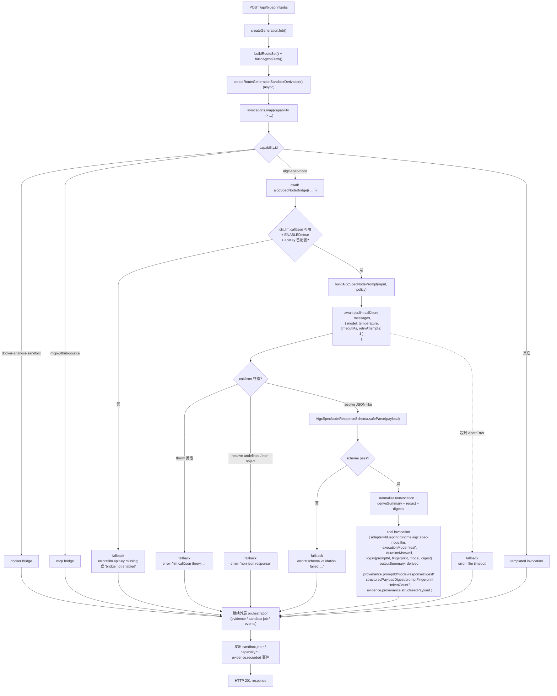
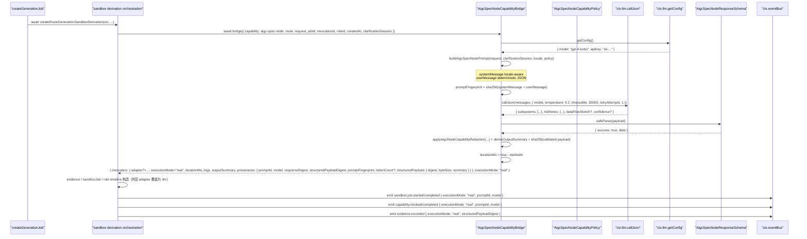
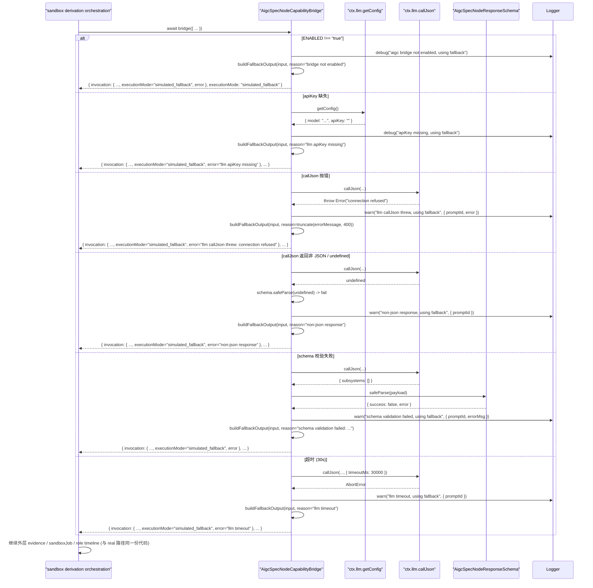

# 设计文档：Autopilot Capability Bridge — AIGC Spec Node

## 1. 设计概述

本 spec 把 `/autopilot` 沙箱派生管线中 `aigc-spec-node` capability 的执行路径从模板化（`buildCapabilityOutputSummary()` / `buildCapabilityInvocationLogs()` / `deterministicCapabilityDuration()`）升级为通过 `BlueprintServiceContext.llm.callJson` 发起的一次**真实 LLM 领域推理**，产出严格 zod schema 校验后的结构化 spec-shape JSON 证据（至少 `subsystems[]` + `riskNotes[]`），并在 LLM 不可用 / apiKey 缺失 / callJson 抛错 / 非 JSON / schema 不过 / 超时任一情况下无缝回退到今天的模板化 invocation 产出。

本 spec 是三条 Tier-1 桥中**与 `autopilot-routeset-llm-generation` 最同构**的一条：

- 它和 routeset spec 一样消费 `ctx.llm.callJson` + zod strict schema + fallback + provenance.promptId + provenance.model + locale-aware prompt。
- 差异只在两个点：**prompt 内容**（领域推理 vs 路线生成）与 **response schema**（subsystems/riskNotes vs routes）。
- `provenance.generationSource` 的语义在本 spec 中由 `provenance.executionMode`（`"real"` / `"simulated_fallback"`）承担，与姊妹 Docker/MCP 桥对齐，而不是再开一个 `generationSource` 字段。

本 spec 严格限定在 **`createRouteGenerationSandboxDerivation()` 中 `aigc-spec-node` 这一个 capability 的 adapter 实现**：

- 新增 `createAigcSpecNodeCapabilityBridge(ctx)` 工厂，落地到 `server/routes/blueprint/aigc-spec-node/` 目录；co-located 单元测试与它同目录。
- **不修改** `createRouteGenerationSandboxDerivation()` 外层 orchestration（capability 选择、排序、evidence aggregation、sandbox derivation job 聚合、role timeline、`sandbox.job.*` / `capability.*` / `evidence.*` / `role.*` 事件总编排）。外层只在命中 aigc capability 时替换 invocation 层字段，其余代码路径保持不变。Docker 桥 spec 已把 `createRouteGenerationSandboxDerivation` 改为 async + 新增 ctx 参数；本 spec 只在该函数内新增一个 `capability.id === "aigc-spec-node"` 的分支调用 bridge，**不重构**调用链。
- **不修改** `mcp-github-source` / `docker-analysis-sandbox` / `role-system-architecture` 任一 capability 的产出路径（由各自独立 spec 推进）。
- **不修改** `buildRouteSet()`、SPEC Tree、SPEC Documents、Effect Preview、Prompt Package、Engineering Handoff 任一阶段。
- **不修改** `ctx.llm.callJson` 或 `ctx.llm.getConfig` 本身的实现；本 spec 只**消费**它们，不得 `import { callLLMJson } from "../../core/llm-client.js"` 或 `import { getAIConfig } from "../../core/ai-config.js"`。
- **不修改** routeset spec 的 generator；但若 routeset spec 留下了可复用的 helper（比如通用的 `callJsonWithStrictSchema` 包装或日志脱敏 helper），本 spec 应复用而非重写。
- **不引入** property-based test（需求 9.3 明确锁定）。本轮只新增 2 条 E2E + ~4+ co-located 单测；Correctness Properties 章节列出的 10 条属性**以 example-based 单测等价覆盖**。
- **不新增** `/api/*` 路由；HTTP 契约完全不变。
- 既有 47 条 E2E + 48 条子域 co-located 单测 + 9 条 SDK smoke 全部继续通过，不重写既有断言以迁就新行为。

**最低可接受交付**：当 `BlueprintServiceContext.llm.callJson` 可用且返回通过 strict zod 校验的结构化 payload 时，`aigc-spec-node` invocation 的 `adapter === "blueprint.runtime.aigc_node.llm"`、`provenance.executionMode === "real"`、`durationMs` 为真实墙钟毫秒、`logs` 为脱敏后的 prompt 指纹 / 响应摘要 / model 标识 / (可选) token 计数、`outputSummary` 由结构化 payload 派生（`"identified N subsystems; K risks flagged"` 或等价 locale 变体）、evidence 的 `provenance.structuredPayload` 承载结构化 JSON 摘要；当 LLM 未注入 / apiKey 缺失 / callJson 抛错 / 非 JSON / schema 不过 / 超时时，invocation 的 `adapter === "blueprint.runtime.aigc_node.simulated"`、`provenance.executionMode === "simulated_fallback"`、`provenance.error` 被脱敏后填充，其它外层字段形态与今天 simulated 产出**字节级等价**。

**环境变量门禁**：`BLUEPRINT_AIGC_NODE_CAPABILITY_BRIDGE_ENABLED=true`（与 Docker/MCP 桥的 `BLUEPRINT_DOCKER_CAPABILITY_BRIDGE_ENABLED` / `BLUEPRINT_MCP_CAPABILITY_BRIDGE_ENABLED` 对齐的 opt-in 策略）。未设或设为其它值时，即使 `ctx.llm` 已装配，bridge 也直接走 fallback，保证默认装配下 47+48 用例零感知。超时上限通过 `BLUEPRINT_AIGC_NODE_CAPABILITY_BRIDGE_TIMEOUT_MS` 覆盖，默认 `30000`（需求 2.4）。

## 2. 架构决策（Key Decisions）

本 spec 的 D1-D10 与姊妹 Docker 桥（`autopilot-capability-bridge-docker`）/ MCP 桥（`autopilot-capability-bridge-mcp`）/ routeset spec（`autopilot-routeset-llm-generation`）的对应决策在同一坐标系下讨论；相同处复用结论并明确说明差异。

### D1：工厂模式 `createAigcSpecNodeCapabilityBridge(ctx)`（与 Docker/MCP 桥 D1 同构）

```ts
export function createAigcSpecNodeCapabilityBridge(
  ctx: BlueprintServiceContext
): AigcSpecNodeCapabilityBridge;
```

工厂只接收 `BlueprintServiceContext`，从中读取 `ctx.llm.callJson` / `ctx.llm.getConfig` / `ctx.aigcSpecNodeCapabilityPolicy` / `ctx.logger` / `ctx.now`。返回的 bridge 是纯异步函数 `(input) => Promise<AigcSpecNodeCapabilityBridgeOutput>`。

**硬约束**（与 Docker/MCP 桥同款 code-review 规则，违反直接拒绝）：

- bridge 实现文件 SHALL NOT `import { callLLMJson } from "../../core/llm-client.js"`
- bridge 实现文件 SHALL NOT `import { getAIConfig } from "../../core/ai-config.js"`
- bridge 实现文件 SHALL NOT 调用模块级 `fetch()` 或 `import` 任何 LLM HTTP 客户端
- bridge 实现文件 SHALL NOT 硬编码 model 名 / provider 名 / temperature 默认值
- 所有 LLM 能力必须来自 `ctx.llm.callJson` + `ctx.llm.getConfig`

**与 Docker 桥 D1 的差异**：Docker 桥消费 `ctx.executorClient`（外部子系统派发），本 spec 消费 `ctx.llm`（已存在的运行期依赖），无需新增 Context 字段。这是本 spec 相对 Docker/MCP 桥**最轻**的改造：不需要 `BlueprintServiceContext` 扩展新字段，也不需要 `server/index.ts` 装配新实例。

### D2：`BlueprintServiceContext` 最小扩展（仅追加 policy + bridge 实例，不动 llm）

新增两个可选字段到 `BlueprintServiceContext` 与 `BlueprintServiceContextDeps`：

```ts
export interface BlueprintServiceContext {
  // ...既有字段（含 llm: { callJson, getConfig }）...
  /** 本桥安全/配额策略；未注入时使用 createDefaultAigcSpecNodeCapabilityPolicy() */
  aigcSpecNodeCapabilityPolicy?: AigcSpecNodeCapabilityPolicy;
  /** 本桥实例本身；便于测试完全注入自定义 bridge */
  aigcSpecNodeCapabilityBridge?: AigcSpecNodeCapabilityBridge;
}
```

**默认装配策略**（与 Docker/MCP 桥 D2 对齐）：

- 未注入 `aigcSpecNodeCapabilityBridge` → `buildBlueprintServiceContext()` 自动装配 `createAigcSpecNodeCapabilityBridge(ctx)`。
- 环境变量 `BLUEPRINT_AIGC_NODE_CAPABILITY_BRIDGE_ENABLED !== "true"` 或 `ctx.llm.getConfig().apiKey` 缺失 → bridge 内部直接走 fallback，不尝试调用 callJson。
- `ctx.llm.callJson` 已在 wt1 的 `buildBlueprintServiceContext` 中默认装配为 `callLLMJson`（`server/routes/blueprint/context.ts` 第 ~238 行），本 spec 不再重复装配。
- 测试中通过 `buildBlueprintServiceContext({ llm: { callJson: fake, getConfig: () => ({model, apiKey}) } })` 注入任意 fake。

**未注入 `aigcSpecNodeCapabilityPolicy`** 时使用 `createDefaultAigcSpecNodeCapabilityPolicy()`（见 §4.3）。

**与 routeset spec 的命名对齐**：routeset spec 已确立 `ctx.routeSetLlmGenerator?` 可选字段；本 spec 的 `ctx.aigcSpecNodeCapabilityBridge?` 遵循同款命名（domain + "Bridge" / "Generator"），两者互不干扰。若 routeset spec 抽出了共享 helper（例如 `callJsonWithStrictSchemaOrFallback`），本 spec **应复用**该 helper 以减少重复；若目前没有抽出，本 spec 也**不主动创建**跨 spec 共享模块（避免越界）。

### D3：替换点在 invocation 层，不改外层 orchestration（与 Docker/MCP 桥 D4 同构）

`createRouteGenerationSandboxDerivation()` 的 `invocations.map(...)` 循环是今天 capability invocation 的生产点。本 spec 仅新增一个 `capability.id === "aigc-spec-node"` 的分支调用 bridge：

```ts
// Docker 桥 spec 已把 createRouteGenerationSandboxDerivation 改为 async + 新增 ctx
const invocations = await Promise.all(
  routeGenerationCapabilities.map(async (capability, index) => {
    const route = input.routeSet.routes[index] ?? primaryRoute;
    const invocationRoleId = resolveRouteSandboxCapabilityRoleId(capability);
    const invocationId = createId("blueprint-capability-invocation");

    // Docker 桥分支（由姊妹 spec 引入）
    if (capability.id === "docker-analysis-sandbox" && ctx.dockerCapabilityBridge) { /* ... */ }

    // MCP 桥分支（由姊妹 spec 引入）
    if (capability.id === "mcp-github-source" && ctx.mcpGithubCapabilityBridge) { /* ... */ }

    // 本 spec 新增的 aigc-spec-node 分支
    if (capability.id === "aigc-spec-node" && ctx.aigcSpecNodeCapabilityBridge) {
      const result = await ctx.aigcSpecNodeCapabilityBridge({
        capability,
        route,
        jobId: input.jobId,
        request: input.request,
        routeSet: input.routeSet,
        clarificationSession: input.clarificationSession, // 见 §4.2 说明
        createdAt: input.createdAt,
        invocationId,
        roleId: invocationRoleId,
      });
      return { invocation: result.invocation, executionMode: result.executionMode };
    }

    // 其它 capability：保持今天的模板化代码一行不改
    return { invocation: /* templated */, executionMode: undefined };
  })
);
```

**关键点**：

- `invocationId` 由外层生成并作为参数传入（与 Docker/MCP 桥 D1 同款约束）。real 与 fallback 两条路径共用同一 id，保证外层 `buildCapabilityEvidence({ invocation })` / sandbox job `invocationIds` 聚合 / capability events 的 `invocationId` 字段不需要改动。
- `ctx.aigcSpecNodeCapabilityBridge` 未注入时（极端场景：测试显式清空）落入 else 分支走今天的模板化路径——保证"ctx 不装 bridge 也不崩"。
- 外层对 `clarificationSession` 的访问依赖于 `createRouteGenerationSandboxDerivation` 的调用方（`createGenerationJob`）在调用时把 clarificationSession 透传进来。当前该函数的 input 不含 clarificationSession；本 spec 需要让外层调用处把 clarificationSession 加入 input（非破坏性，既有字段不变，仅追加可选字段）。

### D4：超时上限锁定为 30 秒（与 MCP 桥 D5 同值，与 Docker 桥 45s 不同）

需求 2.4 要求"不大于 30 秒"。本 spec 将**单次 LLM 调用 + zod 校验的总墙钟**锁定为 **30 秒**，通过环境变量 `BLUEPRINT_AIGC_NODE_CAPABILITY_BRIDGE_TIMEOUT_MS` 可覆盖（默认 `30000`）。与 MCP 桥对齐，Docker 桥的 45s 不适用（后者涉及容器启动 + HMAC 回调）。

实现上通过 `ctx.llm.callJson` 自带的 `timeoutMs` 参数 + `retryAttempts: 1`（与 routeset / clarification 阶段对齐）传入。`callLLMJson` 的实现会在超时到达时抛 `AbortError`，bridge 捕获后 fallback 并填 `provenance.error = "llm timeout"`。

### D5：Prompt ID 锁定为 `blueprint.aigc-spec-node.v1`（需求 2.2）

与 routeset spec 的 `blueprint.routeset.v1` 命名对齐。稳定字符串版本标识，用于 provenance 追溯与回归测试锁定。prompt 结构发生向后不兼容变化时递增到 `v2`；仅字段示例 / 提示语微调不构成 bump。

常量定义位置：`server/routes/blueprint/aigc-spec-node/prompt.ts` 的 `export const AIGC_SPEC_NODE_PROMPT_ID = "blueprint.aigc-spec-node.v1"`。

### D6：Adapter 字符串锁定为 `blueprint.runtime.aigc_node.llm`（需求 4.4）

需求 4.4 要求 real 路径 adapter 不含 `.simulated` 子串，且字符串稳定可断言。本 spec 锁定：

| 路径 | adapter 字符串 | 对应 `provenance.executionMode` |
| --- | --- | --- |
| LLM 真跑 | `"blueprint.runtime.aigc_node.llm"` | `"real"` |
| 模板化回退 | `"blueprint.runtime.aigc_node.simulated"` | `"simulated_fallback"` |

fallback 字符串与 `getDefaultRuntimeCapabilities()` 第 ~3440 行已声明的 `"blueprint.runtime.aigc.spec-node.simulated"` 对齐——**注意**：既有值用 `.aigc.spec-node.simulated`（两层点分隔），而本 spec 需求术语表写的是 `"blueprint.runtime.aigc_node.simulated"`（下划线）。本设计**以既有代码字符串为准**：

- fallback adapter 保持 `"blueprint.runtime.aigc.spec-node.simulated"`（既有值不改，`getDefaultRuntimeCapabilities()` 返回的 BlueprintRuntimeCapability.adapter 一行不动）
- real adapter 采用 `"blueprint.runtime.aigc.spec-node.llm"`（与 fallback 同 namespace，仅后缀从 `.simulated` 换为 `.llm`）

这样既满足需求 4.4 的"real 路径不含 `.simulated`"，也不需要改 `getDefaultRuntimeCapabilities()` 的既有字符串（避免触发 47 条 E2E 的断言回归）。

**adapter 切换逻辑**（与 Docker/MCP 桥 §4.9 同构，只是 real 值只有一个）：

```ts
// 聚合完 invocations 之后，针对 aigc-spec-node capability：
const aigcResult = invocations.find(
  ({ invocation }) => invocation.capabilityId === "aigc-spec-node"
);
const aigcAdapter =
  aigcResult?.executionMode === "real"
    ? "blueprint.runtime.aigc.spec-node.llm"
    : routeGenerationCapabilities.find(c => c.id === "aigc-spec-node")?.adapter
      ?? "blueprint.runtime.aigc.spec-node.simulated";
// sandbox.job.started / capability.invoked / capability.completed / evidence 构造时使用这个 adapter
```

**与 routeset / Docker / MCP 桥的命名口径对齐**：

| Spec | adapter / source 字段 | real 值 | fallback 值 | 路径区分字段 |
| --- | --- | --- | --- | --- |
| routeset | `provenance.generationSource` | `"llm"` | `"llm_fallback"` | 无（generationSource 自带区分） |
| docker bridge | `BlueprintRuntimeCapability.adapter` + `provenance.executionMode` | `"blueprint.runtime.docker.lobster-executor"` + `"real"` | `"blueprint.runtime.docker.simulated"` + `"simulated_fallback"` | `executionMode` |
| mcp-github bridge | 同上 | `"blueprint.runtime.mcp.github.real"` / `.http"` + `"real"` | `"blueprint.runtime.mcp.github.simulated"` + `"simulated_fallback"` | `executionMode` + `executionPath` |
| **aigc-spec-node bridge（本 spec）** | 同上 | `"blueprint.runtime.aigc.spec-node.llm"` + `"real"` | `"blueprint.runtime.aigc.spec-node.simulated"` + `"simulated_fallback"` | `executionMode`（无 executionPath：只有一条 real 路径） |

### D7：事件直接复用既有 `BlueprintEventName`，不新增事件名（与 Docker/MCP 桥 D7 同构）

本 spec **不新增事件名**，只在既有 payload 上追加可选字段：

- `sandbox.job.started` / `sandbox.job.completed` / `sandbox.job.failed`：追加 `executionMode`、`promptId`（real 路径）、`model`（real 路径）、`error`（fallback 路径）
- `capability.invoked` / `capability.completed`：追加 `executionMode`、`promptId`、`model`、`error`
- `evidence.recorded`：追加 `executionMode`、`structuredPayloadDigest`（real 路径）、`error`（fallback 路径）

全部为可选字段，既有订阅者不会因字段追加而断言失败（需求 6.7）。所有事件 `type` 仍由 `BlueprintEventName` 常量构造（需求 6.6），实现文件 SHALL NOT 出现裸字符串 `"sandbox.job.started"` 等。

### D8：结构化 payload 承载方式选 A（`provenance.structuredPayload` 可选字段）

需求 3.5 要求二选一：

- **A**：`BlueprintCapabilityEvidence.provenance.structuredPayload`（可选字段，evidence 记录里嵌入一份结构化 JSON 引用/摘要）
- **B**：产出独立一条 `BlueprintCapabilityEvidence`（类型例如 `spec_shape_payload` 或等价），专门承载结构化 JSON

**本 spec 选 A**。论据：

1. **对既有 evidence aggregation 侵入最小**：外层 `createRouteGenerationSandboxDerivation()` 的 `evidenceItems.map(invocation => buildCapabilityEvidence({ invocation }))` 循环**不需要**新增条目。Option B 会让 aigc capability 的 evidence 数量从 1 变成 2，既有 48 条子域单测中若有 `evidence.length === capabilities.length` 之类的断言会炸。
2. **语义对齐**：Docker 桥已在 `provenance.artifactUrl` / `provenance.logDigest` 中嵌入 "产物引用/摘要" 字段，MCP 桥在 `provenance.apiResponseDigest` / `provenance.repoUrl` 中做同样的事；aigc 桥的 `provenance.structuredPayload` 与它们同款形态——都是"在既有 evidence 的 provenance 上追加可选溯源字段"，不破坏 evidence 的记录数量语义。
3. **SDK normalizer 无侵入**：既有 SDK 只消费 evidence 的顶层字段（id / summary / type 等），provenance 追加可选字段对 normalizer 透明。
4. **测试易写**：real 路径下断言 `evidence.provenance.structuredPayload` 存在；fallback 路径断言 `evidence.provenance.structuredPayload === undefined`。无需验证"是否多出一条 evidence"。

`provenance.structuredPayload` 的字段结构：

```ts
{
  /** 结构化 payload 的 SHA-256 digest（hex），方便跨层交叉验证 */
  digest: string;
  /** 字节数，用于审计与容量提示 */
  byteSize: number;
  /** 简短的摘要，例如 "7 subsystems, 3 risks"；已脱敏 */
  summary: string;
}
```

**不落地原文**：避免 provenance 体积爆炸和二次泄漏风险。若未来需要完整原文追溯，独立 spec 推进"结构化 payload 专用 evidence store"，不在本 spec 范围内。

### D9：Response Schema 策略选"最小锁定 + 2 个推荐可选字段"

需求 3.1 给出两档选择：

- **(a) 最小锁定**：只锁 `subsystems` + `riskNotes`，其余字段靠 zod default/optional 宽松吸收
- **(b) 丰富 schema**：同时锁定 `dataFlowSketch` / `domainOntology` / `confidence` 等

**本 spec 选 (a) 的"最小锁定 + 2 个推荐可选字段"变体**：

- **必填**（触发 fallback 如不满足）：
  - `subsystems: string[]`，长度 `.min(1).max(10)`，每项 `.min(1).max(80)`
  - `riskNotes: string[]`，长度 `.min(0).max(10)`，每项 `.min(1).max(200)`
- **可选**（若 LLM 产出则记录，若未产出则静默吸收）：
  - `dataFlowSketch: string.max(500).optional()`——一段话描述数据流；用于 outputSummary 的次级信息
  - `confidence: number.min(0).max(1).optional()`——LLM 自评置信度；不参与成败判定，仅写入 provenance
- **严格丢弃**（zod 默认 strip 行为）：未声明的其它任意字段

**为什么不锁 `domainOntology`**：

1. 领域本体片段的 schema（entities / relations）对不同领域差异极大；LLM 在"受限领域上下文"下产出不稳定，强制锁会把 schema 失败率推高，从而让 real 路径频繁回退到 fallback，失去本 spec 的意义。
2. 未来若产品明确需要本体片段，可在 `v2` prompt 中升级 schema（promptId 递增）。
3. 保持 V1 schema 的"紧核 + 宽外"让 LLM 更容易给出合法产出，最大化 real 路径覆盖率。

**为什么锁 `dataFlowSketch` 为 optional 而不是完全剔除**：它在产品面向驾驶舱的证据展示中有价值（一段可读的数据流描述），但不是所有目标都能产出（纯算法任务可能没有数据流）；optional 正好平衡可见价值与失败率。

**zod schema 骨架**：

```ts
const AigcSpecNodeResponseSchema = z.object({
  subsystems: z.array(z.string().min(1).max(80)).min(1).max(10),
  riskNotes: z.array(z.string().min(1).max(200)).min(0).max(10),
  dataFlowSketch: z.string().max(500).optional(),
  confidence: z.number().min(0).max(1).optional(),
});
```

完整实现见 §4.4。

### D10：脱敏走本 spec 独立的 `applyAigcNodeCapabilityRedaction` 纯函数（与 MCP 桥 D8 同构）

**决策**：本 spec 实现**独立的**轻量 `applyAigcNodeCapabilityRedaction(text, policy)` 纯函数，覆盖：

- API key 正则（`sk-[A-Za-z0-9]{20,}` / `clp_[A-Za-z0-9]{20,}` / `gh[pousr]_[A-Za-z0-9]{36,255}` / `github_pat_[A-Za-z0-9_]{22,255}`）
- Authorization / Bearer / token= / api_key= 等 key-value 对
- 邮箱正则
- 其它 policy.redactionKeywords 可扩展

**为什么不与 MCP 桥共享**：

1. MCP 桥 spec 已明确把 `applyMcpGithubCapabilityRedaction` 放在 `mcp-github-source/policy.ts` 内，作为该 bridge 的内部实现。跨 spec 共享需要抽一个 `server/routes/blueprint/_shared/redaction.ts` 并让两个 spec 同时引用——这属于跨 spec 的基础设施变更，不在本 spec 范围内。
2. 两个 bridge 的脱敏规则 V1 相同（API key / email / Bearer），但未来可能分叉（例如 MCP 桥只关心 GitHub PAT，aigc 桥可能需要关心 OpenAI `sk-*` 格式更严）。独立实现让两边分叉时不需要协调。
3. 实现非常薄（<50 行），复制一份不构成维护负担。

**若未来存在跨 bridge 共享需求**（例如第 4 条桥 role-system-architecture 也需要同款脱敏），建议独立 spec 抽 `server/routes/blueprint/_shared/redaction.ts`。本 spec 不主动创建。

**`applyAigcNodeCapabilityRedaction` 最小实现**：

```ts
export function applyAigcNodeCapabilityRedaction(
  value: string,
  policy: AigcSpecNodeCapabilityPolicy
): string {
  let result = value;
  // 1. OpenAI / Anthropic API key
  result = result.replace(policy.redactedApiKeyPattern, "[redacted-api-key]");
  // 2. GitHub PAT / fine-grained token
  result = result.replace(policy.redactedGithubPatPattern, "[redacted-github-token]");
  // 3. email
  result = result.replace(policy.redactedEmailPattern, "[redacted-email]");
  // 4. Authorization / Bearer / api_key=... / token=... 等 key:value 对
  for (const keyword of policy.redactionKeywords) {
    const pattern = new RegExp(
      `(${escapeRegex(keyword)})\\s*[:=]\\s*"?[^"\\s,;]+"?`,
      "gi"
    );
    result = result.replace(pattern, `$1: [redacted]`);
  }
  return result;
}
```

**关键使用点**（`logs` 与原始 prompt/response 绝不进面向用户字段，需求 4.6）：

1. `invocation.logs`：**不**包含原始 prompt 全文或原始 LLM 响应体；只包含 `["promptId=...", "promptFingerprint=sha256:...", "model=...", "responseDigest=sha256:...", "tokenCount=..."]`，每条写入前都经过 `applyAigcNodeCapabilityRedaction`（防御性）。
2. `invocation.outputSummary`：从 validated payload 派生后过一遍脱敏（防御性，validated payload 理论上已经安全）。
3. `evidence.summary`：同上。
4. `provenance.structuredPayload.summary`：同上。
5. `provenance.structuredPayload.digest`：SHA-256 of **未脱敏**的 validated payload（digest 无泄漏风险）。
6. 事件 payload：所有字符串字段过脱敏。

**最强约束**（`server/routes/blueprint/aigc-spec-node/bridge.ts` 的实现侧）：

- `ctx.logger.debug / warn / info / error` 调用中**不得**传入原始 prompt 全文（例如不能写 `ctx.logger.warn("llm failed", { prompt: messages })`），只允许传 `{ promptId, promptFingerprint, error: errorMessage(e) }`
- `console.*` 不得使用（强制通过 ctx.logger）
- 任何时刻 `messages` 数组（发给 callJson 的 payload）只存在于 bridge 函数栈上，结束后作用域即终止；不写入 invocation / evidence / event / jobStore

### D11：不引入 callback dispatcher（与 MCP 桥对齐）

`ctx.llm.callJson` 是同步 Promise 调用，不涉及 HMAC 回调、不涉及 executor 事件中继。本 spec **不改** `server/index.ts` 的 `/api/executor/events` 中继链（那是 Docker 桥的范畴）。

**与 Docker 桥 §4.5 的差异**：Docker 桥必须新增 `BlueprintExecutorCallbackDispatcher` 以等待异步 HMAC 回调；MCP 桥的 MCP 路径通过 `McpToolAdapter.execute()` 的 Promise 获得结果，HTTP 路径通过 `httpFetcher.fetch()` 的 Promise 获得结果；本 spec 与它们相同——都是直接 `await` Promise，不需要回调订阅。

### D12：测试装配是否注入 LLM fake 决定走 real 还是 fallback（与 Docker/MCP 桥 D10 同构）

核心兼容性保证：**默认测试装配 ≡ 今天的生产行为**。

- 既有 47 条 E2E **没有**对 `ctx.llm.callJson` 预设 `mockResolvedValueOnce(...)`；`vi.mock("../core/llm-client.js")` 把 `callLLMJson` 替换为不带默认实现的 `vi.fn()`（返回 `undefined`）。
- 在新实现下，bridge 调用 `ctx.llm.callJson(...)` 会返回 `undefined`；schema 校验失败 → fallback → 产出与今天 simulated 路径字节级等价的 invocation。
- 48 条子域单测与 9 条 SDK smoke 同理。

唯一需要主动 mock 的只有本 spec 新增的 2 条 E2E 与 4 条 co-located 单测（需求 9.1 + 9.2）。

## 3. High-Level Design（HLD）

### 3.1 系统数据流（Mermaid）



### 3.2 Happy path 时序图（real LLM execution）



### 3.3 Fallback 时序图




## 4. Low-Level Design（LLD）

### 4.1 文件布局

```
server/routes/blueprint/aigc-spec-node/
  ├── bridge.ts                                    # 新增：createAigcSpecNodeCapabilityBridge(ctx) 工厂 + 主算法
  ├── bridge.test.ts                               # 新增：4 条 co-located 单测（happy / malformed / schema-fail / apiKey-missing）
  ├── policy.ts                                    # 新增：AigcSpecNodeCapabilityPolicy + createDefault + applyAigcNodeCapabilityRedaction
  ├── policy.test.ts                               # 新增：policy 与 redaction 纯函数测试
  ├── prompt.ts                                    # 新增：buildAigcSpecNodePrompt (locale-aware, 确定性) + AIGC_SPEC_NODE_PROMPT_ID
  ├── prompt.test.ts                               # 新增:(部分)prompt 确定性与 locale 分支测试
  ├── schema.ts                                    # 新增:AigcSpecNodeResponseSchema strict zod schema
  ├── schema.test.ts                               # 新增:schema 各种 valid/invalid 分支测试
  ├── summary-derivation.ts                        # 新增:纯函数 deriveAigcOutputSummary (从 validated payload 派生 "identified N subsystems; K risks flagged")
  └── summary-derivation.test.ts                   # 新增：summary 派生纯函数测试

server/routes/blueprint/context.ts                  # 修改：
                                                    #   - BlueprintServiceContext 追加:
                                                    #       aigcSpecNodeCapabilityPolicy?: AigcSpecNodeCapabilityPolicy
                                                    #       aigcSpecNodeCapabilityBridge?: AigcSpecNodeCapabilityBridge
                                                    #   - BlueprintServiceContextDeps 追加同样字段
                                                    #   - buildBlueprintServiceContext 默认装配 createAigcSpecNodeCapabilityBridge(ctx)

server/routes/blueprint.ts                          # 修改（最小侵入）：
                                                    #   - createRouteGenerationSandboxDerivation() 的 capability 分支
                                                    #     新增 `capability.id === "aigc-spec-node"` → await ctx.aigcSpecNodeCapabilityBridge(...)
                                                    #   - 调用处把 clarificationSession 透传到 createRouteGenerationSandboxDerivation 的 input
                                                    #   - getDefaultRuntimeCapabilities() 中 aigc-spec-node 的 adapter 字段保持
                                                    #     "blueprint.runtime.aigc.spec-node.simulated"（fallback 基线，一行不改）
                                                    #   - capability.invoked / capability.completed / sandbox.job.* / evidence.recorded
                                                    #     事件 payload 追加 executionMode / promptId / model / error / structuredPayloadDigest 可选字段
                                                    #   - real 路径下 event payload 的 adapter 字符串按 executionMode 覆盖为
                                                    #     "blueprint.runtime.aigc.spec-node.llm"

shared/blueprint/contracts.ts                       # 修改：
                                                    #   - BlueprintCapabilityInvocation.provenance 追加可选:
                                                    #       promptId?: string
                                                    #       model?: string
                                                    #       responseDigest?: string
                                                    #       tokenCount?: number
                                                    #       structuredPayloadDigest?: string
                                                    #       promptFingerprint?: string
                                                    #     （executionMode / error 由 Docker 桥先行追加，本 spec 复用）
                                                    #   - BlueprintCapabilityEvidence.provenance 追加可选:
                                                    #       structuredPayload?: { digest: string; byteSize: number; summary: string }
                                                    #       + 上述所有 invocation 新增字段同步追加（evidence 也能透视）

server/tests/blueprint-routes.test.ts               # 修改（只追加，不改写）：
                                                    #   + 2 条新 E2E 用例：
                                                    #     (a) Real LLM path
                                                    #     (b) Fallback path
```

### 4.2 核心类型定义（`bridge.ts`）

```ts
import type { BlueprintServiceContext } from "../context.js";
import type {
  BlueprintCapabilityInvocation,
  BlueprintClarificationSession,
  BlueprintGenerationEvent,
  BlueprintGenerationRequest,
  BlueprintRouteCandidate,
  BlueprintRouteSet,
  BlueprintRuntimeCapability,
} from "../../../../shared/blueprint/index.js";

/**
 * bridge 的单次调用输入。调用方（createRouteGenerationSandboxDerivation）
 * 在已经选定 aigc-spec-node capability 之后传入。
 * 字段集与 Docker / MCP 桥的 *CapabilityBridgeInput 对齐，只多一个 clarificationSession。
 */
export interface AigcSpecNodeCapabilityBridgeInput {
  /** 从 getDefaultRuntimeCapabilities() 查出的 aigc-spec-node capability 定义对象 */
  capability: BlueprintRuntimeCapability;
  /** 本次 invocation 要绑定的 route */
  route: BlueprintRouteCandidate;
  /** blueprint generation job id */
  jobId: string;
  /** 原始请求；bridge 从中派生 targetText / projectContext */
  request: BlueprintGenerationRequest;
  /** 当前 RouteSet */
  routeSet: BlueprintRouteSet;
  /**
   * 当前 clarification session（如有）；bridge 从中派生 answers 摘要 + locale。
   * 当 createRouteGenerationSandboxDerivation 的调用方（createGenerationJob）
   * 能访问 clarificationSession 时透传；否则 bridge 走无 clarification 上下文的 prompt。
   */
  clarificationSession?: BlueprintClarificationSession;
  /** 调用方已确定的时间戳，与 Docker / MCP 桥对齐 */
  createdAt: string;
  /** 由调用方预先生成的 invocation id；real 与 fallback 路径共用同一 id */
  invocationId: string;
  /** 调用方已解析的 roleId（当前为 resolveRouteSandboxCapabilityRoleId 返回值） */
  roleId: string;
}

/**
 * bridge 的单次调用输出。
 */
export interface AigcSpecNodeCapabilityBridgeOutput {
  /** 一条可用的 invocation；外层 map 直接回填到 invocations 数组 */
  invocation: BlueprintCapabilityInvocation;
  /** 本次执行的模式；供外层 event payload 决定 adapter 字符串 */
  executionMode: "real" | "simulated_fallback";
  /** 可选：bridge 希望额外 emit 的事件（当前为空；预留未来 heartbeat） */
  additionalEvents: BlueprintGenerationEvent[];
}

export type AigcSpecNodeCapabilityBridge = (
  input: AigcSpecNodeCapabilityBridgeInput
) => Promise<AigcSpecNodeCapabilityBridgeOutput>;

export function createAigcSpecNodeCapabilityBridge(
  ctx: BlueprintServiceContext
): AigcSpecNodeCapabilityBridge;
```

### 4.3 Policy 类型（`policy.ts`）

```ts
export interface AigcSpecNodeCapabilityPolicy {
  /** 单次 LLM 调用 + 校验的总墙钟上限 */
  maxInvocationTimeoutMs: number;
  /** 温度（保持确定性偏向） */
  temperature: number;
  /** invocation.logs 最大行数 */
  maxLogLines: number;
  /** invocation.logs 累计字节上限 */
  maxLogBytes: number;
  /** structuredPayload.summary 字节上限 */
  maxStructuredPayloadSummaryBytes: number;
  /** 脱敏：key 级敏感关键词（大小写不敏感） */
  redactionKeywords: readonly string[];
  /** 脱敏：email 正则 */
  redactedEmailPattern: RegExp;
  /** 脱敏：OpenAI / Anthropic / 一般长字串 API key 正则 */
  redactedApiKeyPattern: RegExp;
  /** 脱敏：GitHub PAT / fine-grained token 正则 */
  redactedGithubPatPattern: RegExp;
  /** retry attempts 传给 callJson */
  callJsonRetryAttempts: number;
}

export function createDefaultAigcSpecNodeCapabilityPolicy(): AigcSpecNodeCapabilityPolicy {
  const timeoutOverride = Number.parseInt(
    process.env.BLUEPRINT_AIGC_NODE_CAPABILITY_BRIDGE_TIMEOUT_MS ?? "",
    10
  );
  return {
    maxInvocationTimeoutMs: Number.isFinite(timeoutOverride) && timeoutOverride > 0 && timeoutOverride <= 30_000
      ? timeoutOverride
      : 30_000,
    temperature: 0.2,
    maxLogLines: 20,
    maxLogBytes: 4_096,
    maxStructuredPayloadSummaryBytes: 300,
    redactionKeywords: [
      "authorization",
      "token",
      "api_key",
      "apikey",
      "secret",
      "password",
      "bearer",
      "access_token",
      "x-github-token",
      "openai-api-key",
    ],
    redactedEmailPattern: /[\w.+-]+@[\w.-]+/g,
    redactedApiKeyPattern: /\b(sk-[A-Za-z0-9]{20,}|clp_[A-Za-z0-9]{20,})\b/g,
    redactedGithubPatPattern:
      /\b(gh[pousr]_[A-Za-z0-9]{36,255}|github_pat_[A-Za-z0-9_]{22,255})\b/g,
    callJsonRetryAttempts: 1,
  };
}

export function applyAigcNodeCapabilityRedaction(
  value: string,
  policy: AigcSpecNodeCapabilityPolicy
): string;
```

**环境变量**：`BLUEPRINT_AIGC_NODE_CAPABILITY_BRIDGE_TIMEOUT_MS` 允许覆盖默认 30s 上限（不超过 30s，否则忽略并 fallback 到 30s）。需求 2.4 明确"不大于 30s"，`createDefaultAigcSpecNodeCapabilityPolicy` 内部 clamp。

**policy 不校验 prompt 内容**：与 MCP 桥 D8 一致，policy 只承载资源/脱敏约束；prompt 构造的正确性由 `prompt.ts` 自身保证。

### 4.4 Response Schema（`schema.ts`）

```ts
import { z } from "zod";

export const AigcSpecNodeResponseSchema = z.object({
  subsystems: z
    .array(z.string().min(1).max(80))
    .min(1)
    .max(10),
  riskNotes: z
    .array(z.string().min(1).max(200))
    .min(0)
    .max(10),
  dataFlowSketch: z.string().max(500).optional(),
  confidence: z.number().min(0).max(1).optional(),
});

export type AigcSpecNodeResponse = z.infer<typeof AigcSpecNodeResponseSchema>;
```

**字段处置策略**（对应需求 3.2 / 3.3）：

| 场景 | zod 行为 |
| --- | --- |
| `subsystems` 缺失 / 非数组 | fail → fallback |
| `subsystems.length === 0` 或 `> 10` | fail → fallback |
| `subsystems[i]` 为空字符串或 `> 80` 字符 | fail → fallback |
| `riskNotes` 非数组 | fail → fallback |
| `riskNotes.length > 10` | fail → fallback |
| `riskNotes[i]` 为空字符串或 `> 200` 字符 | fail → fallback |
| `dataFlowSketch` 不是 string 或超 500 字符 | fail → fallback（因为已声明 optional 但类型必须匹配） |
| `confidence` 超出 [0, 1] 或不是 number | fail → fallback |
| 额外字段（例如 `domainOntology: {...}`） | **静默丢弃**，不 fallback（zod 默认 strip 行为） |

**注意**：`AigcSpecNodeResponseSchema` 使用 `z.object({...})` 而非 `.strict()`，与 routeset spec 对齐，意思是"未知字段静默丢弃，不视为失败"。如果未来希望对未知字段敏感（比如 v2 prompt 后，v1 客户端遇到 v2 字段要报错），再 `.strict()`；V1 保守 strip。

**不做 coerce / normalize**（需求 3.2）：禁止 `z.string().or(z.number()).transform(x => String(x))` 这类 zod transform 链。所有字段要么严格匹配，要么 fallback。

### 4.5 Prompt 构造（`prompt.ts`）

```ts
export const AIGC_SPEC_NODE_PROMPT_ID = "blueprint.aigc-spec-node.v1";

export interface AigcSpecNodePromptPayload {
  promptId: string;
  systemMessage: string;
  userMessage: string;
  /** 用于测试断言 prompt 是确定性的（同输入 → 字节相同 payload） */
  userPayload: Record<string, unknown>;
  /** SHA-256 hex of systemMessage + "\n\n" + userMessage；写入 provenance.promptFingerprint */
  promptFingerprint: string;
}

export interface BuildAigcSpecNodePromptInput {
  request: BlueprintGenerationRequest;
  clarificationSession?: BlueprintClarificationSession;
  route: BlueprintRouteCandidate;
  /** "zh-CN" | "en-US" */
  locale: "zh-CN" | "en-US";
}

export function buildAigcSpecNodePrompt(
  input: BuildAigcSpecNodePromptInput
): AigcSpecNodePromptPayload;
```

**systemMessage**（locale-aware）：

- `locale === "zh-CN"` 时：
  ```
  你是 /autopilot 沙箱派生管线中的 AIGC Spec Node 领域推理器。
  
  给定用户的目标描述、澄清问答摘要与可选领域上下文，请对目标进行 SPEC-shape 领域推理，识别关键子系统、勾勒数据流、标注风险边界，并以严格 JSON 形式返回。
  
  约束：
  1. 必须返回合法 JSON，不得包含 Markdown 代码块围栏、不得返回任何解释性前置文字。
  2. JSON 根对象必须包含：
     - "subsystems": string[]，1 到 10 项，每项 1 到 80 字符；识别目标中可分解出的关键子系统 / 模块 / 能力域。
     - "riskNotes": string[]，0 到 10 项，每项 1 到 200 字符；指出可能的风险、约束或不确定性。
  3. JSON 根对象可选包含：
     - "dataFlowSketch": string，不超过 500 字符；用一段话描述跨子系统的主要数据流动。
     - "confidence": number，0 到 1 之间；自评本次推理的置信度。
  4. 不得引入其他顶层字段，不得使用嵌套外部引用。
  5. 只基于用户提供的 intake / clarification / projectContext 内容进行推理；不得引入用户未提供的机密、外部 URL、或幻构实例。
  ```
- 否则（`en-US`）：
  ```
  You are the AIGC Spec Node domain-reasoner inside the /autopilot sandbox derivation pipeline.
  
  Given the user's goal, clarification answers summary, and optional domain context, perform SPEC-shape domain reasoning over the goal: identify key subsystems, sketch data flow, flag risk boundaries, and return the result as strict JSON.
  
  Constraints:
  1. Return a single JSON object. Do NOT wrap in Markdown code fences. Do NOT include any prose before or after.
  2. The root object MUST include:
     - "subsystems": string[] with 1 to 10 entries, each 1 to 80 characters; name the key subsystems / modules / capability areas that decompose the goal.
     - "riskNotes": string[] with 0 to 10 entries, each 1 to 200 characters; call out risks, constraints, or uncertainties.
  3. The root object MAY include:
     - "dataFlowSketch": string up to 500 characters summarising the primary cross-subsystem data flow.
     - "confidence": number in [0, 1] for self-evaluation.
  4. Do not introduce additional top-level fields. Do not reference external URLs or hallucinated systems.
  5. Reason ONLY from the provided intake / clarification / projectContext; do not inject secrets, credentials, or unrelated examples.
  ```

**userMessage**：`JSON.stringify(userPayload, null, 2)`。`userPayload` 的结构（**确定性**，字段顺序固定，answers 按 `questionId` 字典序排序）：

```ts
{
  promptId: "blueprint.aigc-spec-node.v1",
  route: {
    id: string,
    title: string,
    summary: string,
  },
  intake: {
    targetText: string | undefined,
    githubUrls: string[],                       // 按输入顺序
    domainNotes: string | undefined,
  },
  clarification: {
    strategyId: string | undefined,
    templateId: string | undefined,
    answers: Array<{ questionId, answer }>,     // 按 questionId 字典序
  } | undefined,
  projectContext: {
    projectId: string | undefined,
    sourceId: string | undefined,
    domain: string | undefined,
  } | undefined,
  outputSchema: {
    subsystems: "string[] 1..10 entries, each 1..80 chars",
    riskNotes: "string[] 0..10 entries, each 1..200 chars",
    dataFlowSketch: "string up to 500 chars (optional)",
    confidence: "number in [0, 1] (optional)",
  },
}
```

**确定性保证**：

- `answers` 按 `questionId` 字典序排序（测试锁定）
- `githubUrls` 按输入顺序（由 `BlueprintGenerationRequest` 决定）
- `userPayload` 显式构造字段顺序，使 `JSON.stringify` 输出字节相同
- 同一组 `(request, clarificationSession, route, locale)` → 字节相同的 `userMessage` + 字节相同的 `promptFingerprint`

**完整中文 prompt 样例（locale=zh-CN）**：

```
[system]
你是 /autopilot 沙箱派生管线中的 AIGC Spec Node 领域推理器。

给定用户的目标描述、澄清问答摘要与可选领域上下文，请对目标进行 SPEC-shape 领域推理，识别关键子系统、勾勒数据流、标注风险边界，并以严格 JSON 形式返回。

约束：
1. 必须返回合法 JSON，不得包含 Markdown 代码块围栏、不得返回任何解释性前置文字。
2. JSON 根对象必须包含：
   - "subsystems": string[]，1 到 10 项，每项 1 到 80 字符；识别目标中可分解出的关键子系统 / 模块 / 能力域。
   - "riskNotes": string[]，0 到 10 项，每项 1 到 200 字符；指出可能的风险、约束或不确定性。
3. JSON 根对象可选包含：
   - "dataFlowSketch": string，不超过 500 字符；用一段话描述跨子系统的主要数据流动。
   - "confidence": number，0 到 1 之间；自评本次推理的置信度。
4. 不得引入其他顶层字段，不得使用嵌套外部引用。
5. 只基于用户提供的 intake / clarification / projectContext 内容进行推理；不得引入用户未提供的机密、外部 URL、或幻构实例。

[user]
{
  "promptId": "blueprint.aigc-spec-node.v1",
  "route": {
    "id": "rs-abc:primary",
    "title": "主 SPEC 资产路线",
    "summary": "以当前 GitHub 仓库为基础推导 SPEC 树。"
  },
  "intake": {
    "targetText": "构建一个发布仪表盘，按项目维度可视化每周部署次数。",
    "githubUrls": ["https://github.com/example/dashboard"],
    "domainNotes": "面向内部研发团队；需要 RBAC。"
  },
  "clarification": {
    "strategyId": "engineering_landing_first",
    "templateId": "engineering-landing-v1",
    "answers": [
      { "questionId": "q-data-source", "answer": "从 GitHub Actions + GitLab CI 抽取部署事件。" },
      { "questionId": "q-rbac", "answer": "基于 email 域名划分 tenant。" },
      { "questionId": "q-visualization", "answer": "使用 time series + 热力图。" }
    ]
  },
  "projectContext": {
    "projectId": "proj-deploy-dashboard",
    "sourceId": "source-github-dashboard",
    "domain": "devops"
  },
  "outputSchema": {
    "subsystems": "string[] 1..10 entries, each 1..80 chars",
    "riskNotes": "string[] 0..10 entries, each 1..200 chars",
    "dataFlowSketch": "string up to 500 chars (optional)",
    "confidence": "number in [0, 1] (optional)"
  }
}
```

**完整英文 prompt 样例（locale=en-US）**：

```
[system]
You are the AIGC Spec Node domain-reasoner inside the /autopilot sandbox derivation pipeline.

Given the user's goal, clarification answers summary, and optional domain context, perform SPEC-shape domain reasoning over the goal: identify key subsystems, sketch data flow, flag risk boundaries, and return the result as strict JSON.

Constraints:
1. Return a single JSON object. Do NOT wrap in Markdown code fences. Do NOT include any prose before or after.
2. The root object MUST include:
   - "subsystems": string[] with 1 to 10 entries, each 1 to 80 characters; name the key subsystems / modules / capability areas that decompose the goal.
   - "riskNotes": string[] with 0 to 10 entries, each 1 to 200 characters; call out risks, constraints, or uncertainties.
3. The root object MAY include:
   - "dataFlowSketch": string up to 500 characters summarising the primary cross-subsystem data flow.
   - "confidence": number in [0, 1] for self-evaluation.
4. Do not introduce additional top-level fields. Do not reference external URLs or hallucinated systems.
5. Reason ONLY from the provided intake / clarification / projectContext; do not inject secrets, credentials, or unrelated examples.

[user]
{
  "promptId": "blueprint.aigc-spec-node.v1",
  "route": {
    "id": "rs-abc:primary",
    "title": "Primary SPEC asset route",
    "summary": "Derive the SPEC tree from the current GitHub repository."
  },
  "intake": {
    "targetText": "Build a release dashboard that visualises weekly deploys per project.",
    "githubUrls": ["https://github.com/example/dashboard"],
    "domainNotes": "Internal engineering teams; must support RBAC."
  },
  "clarification": {
    "strategyId": "engineering_landing_first",
    "templateId": "engineering-landing-v1",
    "answers": [
      { "questionId": "q-data-source", "answer": "Ingest deploy events from GitHub Actions and GitLab CI." },
      { "questionId": "q-rbac", "answer": "Tenants derived from email domain." },
      { "questionId": "q-visualization", "answer": "Time series plus heatmap." }
    ]
  },
  "projectContext": {
    "projectId": "proj-deploy-dashboard",
    "sourceId": "source-github-dashboard",
    "domain": "devops"
  },
  "outputSchema": {
    "subsystems": "string[] 1..10 entries, each 1..80 chars",
    "riskNotes": "string[] 0..10 entries, each 1..200 chars",
    "dataFlowSketch": "string up to 500 chars (optional)",
    "confidence": "number in [0, 1] (optional)"
  }
}
```

**`promptFingerprint` 计算**：

```ts
promptFingerprint = `sha256:${sha256Hex(systemMessage + "\n\n" + userMessage)}`;
```

写入 `provenance.promptFingerprint`，用于回溯 prompt 实际内容而不记录原文。

### 4.6 Bridge 主算法（伪代码）

```ts
export function createAigcSpecNodeCapabilityBridge(
  ctx: BlueprintServiceContext
): AigcSpecNodeCapabilityBridge {
  const policy = ctx.aigcSpecNodeCapabilityPolicy ?? createDefaultAigcSpecNodeCapabilityPolicy();

  return async function bridge(input): Promise<AigcSpecNodeCapabilityBridgeOutput> {
    // 1. 早退：bridge 未启用
    const enabled = process.env.BLUEPRINT_AIGC_NODE_CAPABILITY_BRIDGE_ENABLED === "true";
    if (!enabled) {
      ctx.logger.debug("aigc-spec-node bridge: not enabled, using fallback", {
        capabilityId: input.capability.id,
      });
      return buildFallbackOutput(input, { reason: "bridge not enabled" });
    }

    // 2. 早退：apiKey 缺失
    const aiConfig = ctx.llm.getConfig();
    if (!aiConfig.apiKey) {
      ctx.logger.debug("aigc-spec-node bridge: apiKey missing, using fallback", {
        capabilityId: input.capability.id,
      });
      return buildFallbackOutput(input, { reason: "llm apiKey missing" });
    }

    // 3. 构造 prompt（locale-aware + 确定性）
    const locale: "zh-CN" | "en-US" =
      input.clarificationSession?.locale === "zh-CN" ? "zh-CN" : "en-US";
    const prompt = buildAigcSpecNodePrompt({
      request: input.request,
      clarificationSession: input.clarificationSession,
      route: input.route,
      locale,
    });
    const model = aiConfig.model;

    // 4. 调用 LLM
    const startedAt = ctx.now();
    let rawPayload: unknown;
    try {
      rawPayload = await ctx.llm.callJson<unknown>(
        [
          { role: "system", content: prompt.systemMessage },
          { role: "user", content: prompt.userMessage },
        ],
        {
          model,
          temperature: policy.temperature,
          timeoutMs: policy.maxInvocationTimeoutMs,
          retryAttempts: policy.callJsonRetryAttempts,
          sessionId: input.clarificationSession?.id ?? input.request.clarificationSessionId,
        }
      );
    } catch (error) {
      const errMsg = errorMessage(error);
      const isTimeout = /abort|timeout/i.test(errMsg);
      ctx.logger.warn("aigc-spec-node bridge: llm callJson threw, using fallback", {
        promptId: prompt.promptId,
        error: errMsg,
      });
      return buildFallbackOutput(input, {
        reason: isTimeout ? "llm timeout" : `llm callJson threw: ${truncate(errMsg, 300)}`,
        promptId: prompt.promptId,
        model,
      });
    }

    // 5. 非 JSON / undefined 早退（callJson 返回 undefined 意味着底层 JSON.parse 失败或响应空）
    if (rawPayload === undefined || rawPayload === null || typeof rawPayload !== "object") {
      ctx.logger.warn("aigc-spec-node bridge: non-json response, using fallback", {
        promptId: prompt.promptId,
      });
      return buildFallbackOutput(input, {
        reason: "non-json response",
        promptId: prompt.promptId,
        model,
      });
    }

    // 6. Strict zod 校验
    const parsed = AigcSpecNodeResponseSchema.safeParse(rawPayload);
    if (!parsed.success) {
      ctx.logger.warn("aigc-spec-node bridge: schema validation failed, using fallback", {
        promptId: prompt.promptId,
        errorMsg: parsed.error.message,
      });
      return buildFallbackOutput(input, {
        reason: `schema validation failed: ${truncate(parsed.error.message, 300)}`,
        promptId: prompt.promptId,
        model,
      });
    }

    // 7. Happy path: 构造 real invocation
    const completedAt = ctx.now();
    const durationMs = completedAt.getTime() - startedAt.getTime();
    return buildRealOutput({
      input,
      policy,
      prompt,
      model,
      validated: parsed.data,
      rawPayload,
      durationMs,
    });
  };
}
```

### 4.7 Real 路径字段填充（`buildRealOutput`）

```ts
function buildRealOutput(args: {
  input: AigcSpecNodeCapabilityBridgeInput;
  policy: AigcSpecNodeCapabilityPolicy;
  prompt: AigcSpecNodePromptPayload;
  model: string;
  validated: AigcSpecNodeResponse;
  rawPayload: unknown;
  durationMs: number;
}): AigcSpecNodeCapabilityBridgeOutput {
  const { input, policy, prompt, model, validated, rawPayload, durationMs } = args;

  // 生成 digests
  const canonicalPayloadJson = JSON.stringify(validated); // 仅包含 schema-declared 字段，额外字段已被 zod 丢弃
  const structuredPayloadDigest = `sha256:${sha256Hex(canonicalPayloadJson)}`;
  const structuredPayloadByteSize = Buffer.byteLength(canonicalPayloadJson, "utf8");
  const responseDigest = `sha256:${sha256Hex(JSON.stringify(rawPayload))}`;

  // 派生摘要（已脱敏）
  const rawSummary = deriveAigcOutputSummary(validated, {
    locale: input.clarificationSession?.locale === "zh-CN" ? "zh-CN" : "en-US",
  });
  const outputSummary = applyAigcNodeCapabilityRedaction(rawSummary, policy);

  // structuredPayload.summary：简短人可读
  const structuredPayloadSummary = applyAigcNodeCapabilityRedaction(
    buildStructuredPayloadSummary(validated, policy),
    policy
  );

  // logs：只记录 metadata，不记录 prompt 原文 / 响应原文
  const logs = truncateLogs(
    [
      `promptId=${prompt.promptId}`,
      `promptFingerprint=${prompt.promptFingerprint}`,
      `model=${model}`,
      `responseDigest=${responseDigest}`,
      `structuredPayloadDigest=${structuredPayloadDigest}`,
      `subsystems=${validated.subsystems.length}`,
      `riskNotes=${validated.riskNotes.length}`,
      ...(typeof validated.confidence === "number"
        ? [`confidence=${validated.confidence.toFixed(2)}`]
        : []),
    ].map((line) => applyAigcNodeCapabilityRedaction(line, policy)),
    policy.maxLogLines,
    policy.maxLogBytes
  );

  return {
    executionMode: "real",
    additionalEvents: [],
    invocation: {
      id: input.invocationId,
      jobId: input.jobId,
      capabilityId: input.capability.id,
      roleId: input.roleId,
      capabilityLabel: input.capability.label,
      kind: input.capability.kind,
      status: "completed",
      securityLevel: input.capability.securityLevel,
      safetyGate: {
        status: "allowed",
        reason: `${input.capability.label} approved for real LLM execution via ctx.llm.callJson.`,
        requiresApproval: input.capability.requiresApproval,
        approved: input.capability.requiresApproval,
        securityLevel: input.capability.securityLevel,
      },
      requestedAt: input.createdAt,
      completedAt: new Date().toISOString(),
      requestedBy: "aigc-spec-node-capability-bridge",
      routeId: input.route.id,
      input: `Derive route candidate ${input.route.title} with ${input.capability.label}.`,
      outputSummary,
      logs,
      evidenceIds: [],
      durationMs,
      provenance: {
        jobId: input.jobId,
        projectId: input.request.projectId,
        sourceId: input.request.sourceId,
        routeSetId: input.routeSet.id,
        routeId: input.route.id,
        roleId: input.roleId,
        targetText: input.request.targetText,
        githubUrls: input.request.githubUrls ?? [],
        // —— 复用 Docker 桥追加的可选字段 ——
        executionMode: "real",
        // —— 本 spec 新增的可选字段 ——
        promptId: prompt.promptId,
        model,
        responseDigest,
        structuredPayloadDigest,
        promptFingerprint: prompt.promptFingerprint,
        // tokenCount 取决于 callJson 是否透出；当前 callLLMJson 不透出 usage，本字段保持可选 undefined
        tokenCount: undefined,
      },
    },
  };
}
```

**evidence 的 provenance.structuredPayload 追加**（由外层 `buildCapabilityEvidence()` 在看到 aigc invocation 时回填）：

```ts
// server/routes/blueprint.ts 的 buildCapabilityEvidence({ invocation }) 内部
// 针对 capabilityId === "aigc-spec-node" 且 invocation.provenance.executionMode === "real" 的分支
if (
  invocation.capabilityId === "aigc-spec-node" &&
  invocation.provenance.executionMode === "real" &&
  invocation.provenance.structuredPayloadDigest
) {
  evidence.provenance.structuredPayload = {
    digest: invocation.provenance.structuredPayloadDigest,
    byteSize: /* 从 invocation 携带或单独计算 */,
    summary: /* 简短脱敏摘要 */,
  };
}
```

实现层面更干净的做法：在 bridge 内部生成一个精简的 `structuredPayloadRef` 对象挂到 invocation 的内部字段，让外层 buildCapabilityEvidence 直接 copy。具体字段传输路径在 tasks 阶段确认（两种实现等价，只是拿 digest 的落点不同）。

**outputSummary 派生**（`deriveAigcOutputSummary`）：

```ts
function deriveAigcOutputSummary(
  data: AigcSpecNodeResponse,
  options: { locale: "zh-CN" | "en-US" }
): string {
  const n = data.subsystems.length;
  const k = data.riskNotes.length;
  if (options.locale === "zh-CN") {
    const base = `识别 ${n} 个关键子系统；标注 ${k} 条风险。`;
    if (data.dataFlowSketch) {
      const sketch = data.dataFlowSketch.length > 120
        ? `${data.dataFlowSketch.slice(0, 117)}...`
        : data.dataFlowSketch;
      return `${base} 数据流摘要：${sketch}`;
    }
    return base;
  }
  const base = `Identified ${n} subsystem${n === 1 ? "" : "s"}; ${k} risk${k === 1 ? "" : "s"} flagged.`;
  if (data.dataFlowSketch) {
    const sketch = data.dataFlowSketch.length > 120
      ? `${data.dataFlowSketch.slice(0, 117)}...`
      : data.dataFlowSketch;
    return `${base} Data flow: ${sketch}`;
  }
  return base;
}
```

### 4.8 Fallback 路径字段填充（`buildFallbackOutput`）

```ts
function buildFallbackOutput(
  input: AigcSpecNodeCapabilityBridgeInput,
  options: {
    reason: string;
    promptId?: string;
    model?: string;
  }
): AigcSpecNodeCapabilityBridgeOutput {
  const invocationInput = `Derive route candidate ${input.route.title} with ${input.capability.label}.`;
  return {
    executionMode: "simulated_fallback",
    additionalEvents: [],
    invocation: {
      id: input.invocationId,
      jobId: input.jobId,
      capabilityId: input.capability.id,
      roleId: input.roleId,
      capabilityLabel: input.capability.label,
      kind: input.capability.kind,
      status: "completed",
      securityLevel: input.capability.securityLevel,
      safetyGate: {
        status: "allowed",
        reason: `${input.capability.label} allowed for deterministic route generation sandbox derivation.`,
        requiresApproval: input.capability.requiresApproval,
        approved: input.capability.requiresApproval,
        securityLevel: input.capability.securityLevel,
      },
      requestedAt: input.createdAt,
      completedAt: input.createdAt,
      requestedBy: "route-generation-sandbox-derivation",
      routeId: input.route.id,
      input: invocationInput,
      outputSummary: buildCapabilityOutputSummary({
        capability: input.capability,
        routeTitle: input.route.title,
        input: invocationInput,
      }),
      logs: buildCapabilityInvocationLogs(
        input.capability,
        buildCapabilityOutputSummary({
          capability: input.capability,
          routeTitle: input.route.title,
          input: invocationInput,
        })
      ),
      evidenceIds: [],
      durationMs: deterministicCapabilityDuration(input.capability, {
        capabilityId: input.capability.id,
        roleId: input.roleId,
        routeId: input.route.id,
        input: invocationInput,
      }),
      provenance: {
        jobId: input.jobId,
        projectId: input.request.projectId,
        sourceId: input.request.sourceId,
        routeSetId: input.routeSet.id,
        routeId: input.route.id,
        roleId: input.roleId,
        targetText: input.request.targetText,
        githubUrls: input.request.githubUrls ?? [],
        // —— 复用 Docker 桥追加字段 ——
        executionMode: "simulated_fallback",
        error: truncate(options.reason, 400),
        // —— 本 spec 新增字段（可选，即使 fallback 也可以记录 promptId / model 便于调试）——
        promptId: options.promptId,
        model: options.model,
        // responseDigest / structuredPayloadDigest / promptFingerprint / tokenCount 在 fallback 路径为 undefined
      },
    },
  };
}
```

**关键约束**（与 Docker/MCP 桥 fallback 路径同款字节级等价保证）：

- `outputSummary` / `logs` / `durationMs` / `requestedBy` / 其它字段完全等于今天 `createRouteGenerationSandboxDerivation()` 循环内原始代码的产出（调用同一套 `buildCapabilityOutputSummary` / `buildCapabilityInvocationLogs` / `deterministicCapabilityDuration` helper）
- `provenance.error` 由 `truncate(reason, 400)` 截断
- `provenance.executionMode === "simulated_fallback"` 是新字段；既有 E2E 不断言此字段存在，追加不破坏
- `provenance.promptId` / `model` 即使在 fallback 时也可以被填充（用于调试），但既有 E2E 不对它们断言
- fallback 路径下外层 capability 对象仍是 `getDefaultRuntimeCapabilities()` 原返回（`adapter === "blueprint.runtime.aigc.spec-node.simulated"`），既有 E2E 全部继续成立

**为什么 fallback 里 promptId / model 也填**：需求 5.2 明确"real 路径 SHALL 新增可选字段 `promptId / model / ...`"、"fallback SHALL 新增 `error`"。没禁止 fallback 里带 promptId / model。填这两个字段的价值是：运维可以看出"这个 fallback 是因为哪条 prompt / 哪个 model 触发的"。

### 4.9 Contract 扩展（`shared/blueprint/contracts.ts`）

Docker 桥 spec 已追加 `executionMode` / `containerId` / `artifactUrl` / `logDigest` / `error` 五个可选字段；MCP 桥 spec 已追加 `executionPath` / `repoUrl` / `commitSha` / `fetchedAt` / `defaultBranch` / `apiResponseDigest` / `mcpToolName` 七个字段。本 spec 复用 `executionMode` / `error`，并新增 **6 个可选字段**到 `BlueprintCapabilityInvocation.provenance`：

```ts
export interface BlueprintCapabilityInvocation {
  // ...既有字段...
  provenance: {
    // ...既有字段（不变）...
    jobId: string;
    projectId?: string;
    sourceId?: string;
    routeSetId?: string;
    routeId?: string;
    specTreeId?: string;
    nodeId?: string;
    roleId?: string;
    targetText?: string;
    githubUrls: string[];

    // —— Docker 桥追加（复用）——
    executionMode?: "real" | "simulated_fallback";
    containerId?: string;
    artifactUrl?: string;
    logDigest?: string;
    error?: string;

    // —— MCP 桥追加（本 spec 不消费，但字段继续存在） ——
    executionPath?: "mcp" | "http";
    repoUrl?: string;
    commitSha?: string;
    fetchedAt?: string;
    defaultBranch?: string;
    apiResponseDigest?: string;
    mcpToolName?: string;

    // —— 本 spec 新增 ——
    /**
     * Real 路径下的 prompt 版本标识（例如 "blueprint.aigc-spec-node.v1"）。
     * Fallback 路径下也可填入（便于调试"为什么 fallback"）。
     */
    promptId?: string;
    /**
     * Real 路径下实际生效的 LLM 模型标识（来自 ctx.llm.getConfig().model）。
     * Fallback 路径下也可填入。
     */
    model?: string;
    /** Real 路径下原始 LLM 响应 body 的 SHA-256 digest（hex 字符串，形如 "sha256:..."）。 */
    responseDigest?: string;
    /**
     * Real 路径下 LLM 响应 usage.total_tokens（如果 callJson 透出；当前 callLLMJson 不透出，
     * 保留字段以备未来扩展）。
     */
    tokenCount?: number;
    /** Real 路径下 validated 结构化 payload 的 SHA-256 digest（形如 "sha256:..."）。 */
    structuredPayloadDigest?: string;
    /**
     * Real 路径下 prompt 文本的 SHA-256 指纹（形如 "sha256:..."）。
     * 用于追溯 prompt 实际内容而不记录原文。
     */
    promptFingerprint?: string;
  };
}

// BlueprintCapabilityEvidence.provenance 追加同样的可选字段 +
// 额外追加：
//   /** Real 路径下结构化 payload 摘要引用 */
//   structuredPayload?: {
//     digest: string;    // sha256:...
//     byteSize: number;  // validated payload 字节数
//     summary: string;   // 已脱敏的简短人可读摘要
//   };
```

**外层 `buildCapabilityEvidence()` 的改造**：evidence 的 `provenance` 从对应 invocation 的 `provenance` 继承以下字段：`executionMode` / `error` / `promptId` / `model` / `responseDigest` / `tokenCount` / `structuredPayloadDigest` / `promptFingerprint`；额外构造 `structuredPayload` 对象（仅 real 路径）。这通过在 `buildCapabilityEvidence({ invocation })` 内部读 `invocation.provenance.*` 并回填 evidence provenance 完成。

**向后兼容性**：

- 全部新增字段均为可选
- 既有 47 条 E2E 与 48 条子域单测均不断言这些字段；SDK 9 条 smoke 同理
- SDK normalizer 使用 object spread → 新字段自动透传；使用显式字段映射 → 追加 ~7 行可选字段透传

### 4.10 外层 `createRouteGenerationSandboxDerivation()` 的最小改造

Docker 桥 spec 已把该函数改为 async + 新增 ctx 参数；MCP 桥 spec 已追加 MCP capability 分支。本 spec 在同一循环内新增 aigc-spec-node 分支：

```ts
const invocations = await Promise.all(
  routeGenerationCapabilities.map(async (capability, index) => {
    const route = input.routeSet.routes[index] ?? primaryRoute;
    const invocationRoleId = resolveRouteSandboxCapabilityRoleId(capability);
    const invocationId = createId("blueprint-capability-invocation");

    // Docker 桥分支（姊妹 spec）
    if (capability.id === "docker-analysis-sandbox" && ctx.dockerCapabilityBridge) { /* ... */ }

    // MCP 桥分支（姊妹 spec）
    if (capability.id === "mcp-github-source" && ctx.mcpGithubCapabilityBridge) { /* ... */ }

    // 本 spec 新增的 aigc-spec-node 分支
    if (capability.id === "aigc-spec-node" && ctx.aigcSpecNodeCapabilityBridge) {
      const result = await ctx.aigcSpecNodeCapabilityBridge({
        capability,
        route,
        jobId: input.jobId,
        request: input.request,
        routeSet: input.routeSet,
        clarificationSession: input.clarificationSession, // 调用方 createGenerationJob 需要透传
        createdAt: input.createdAt,
        invocationId,
        roleId: invocationRoleId,
      });
      return { invocation: result.invocation, executionMode: result.executionMode };
    }

    // 其它 capability：保持今天的模板化代码一行不改
    return { invocation: /* templated (原逻辑) */, executionMode: undefined };
  })
);
```

**adapter 字段的 real/fallback 区分**（针对 aigc-spec-node）：

```ts
// 聚合完 invocations 之后：
const aigcResult = invocations.find(
  ({ invocation }) => invocation.capabilityId === "aigc-spec-node"
);
const aigcAdapter =
  aigcResult?.executionMode === "real"
    ? "blueprint.runtime.aigc.spec-node.llm"
    : routeGenerationCapabilities.find(c => c.id === "aigc-spec-node")?.adapter
      ?? "blueprint.runtime.aigc.spec-node.simulated";
// sandbox.job.started / capability.invoked / capability.completed / evidence.recorded
// 事件 payload 构造时使用 aigcAdapter
```

**调用链 trace**（tasks 阶段 grep 确认）：

- `createGenerationJob()` 调用 `createRouteGenerationSandboxDerivation(ctx, { ..., clarificationSession })` —— 确认 clarificationSession 已经被解析并可传入
- `server/routes/blueprint.ts` 第 ~2915 / 2940 / 3088 / 3091 行附近的 event payload 构造代码需使用 `aigcAdapter`
- `buildCapabilityEvidence({ invocation })` 内部需读取 invocation.provenance 中本 spec 新增字段，回填到 evidence.provenance；同时针对 real 路径构造 `evidence.provenance.structuredPayload`

**clarificationSession 透传**：当前 `createRouteGenerationSandboxDerivation` input 不含 clarificationSession。本 spec 需要把它作为**新的可选字段**追加到 input，调用方 `createGenerationJob` 传入当前解析到的 `clarificationSession`（该字段在 `createGenerationJob` 的 options 中已存在）。非破坏性，既有 docker/mcp 桥分支不消费这个字段。


## 5. Error Handling

本 spec 采用与 Docker / MCP 桥 / routeset spec 完全对齐的 **fail-open 到 fallback** 原则。任何 bridge 层异常都不会冒泡到 HTTP handler，不会阻塞 `/api/blueprint/jobs` 响应。

### 5.1 四档错误分类表

| 触发源 | 具体条件 | bridge 行为 | logger 级别 | `provenance.error` | `provenance.promptId` / `model` 填充？ |
| --- | --- | --- | --- | --- | --- |
| **档位 1：未启用** | `BLUEPRINT_AIGC_NODE_CAPABILITY_BRIDGE_ENABLED !== "true"` | 早退 fallback，无日志噪音 | `debug` | `"bridge not enabled"` | 否（此时未进入 prompt 构造） |
| **档位 2：apiKey 缺失** | `ctx.llm.getConfig().apiKey` 为空串或 undefined | 早退 fallback，无日志噪音 | `debug` | `"llm apiKey missing"` | 否 |
| **档位 3：callJson 抛错 / 非 JSON** | `await ctx.llm.callJson(...)` 抛异常（网络错/5xx/解析错）；或返回 `undefined` / `null` / non-object | fallback + 日志 warn | `warn` | `"llm callJson threw: {message}"`（截断到 300 字符）或 `"non-json response"` | 是（prompt 已构造） |
| **档位 4：schema 不过** | `safeParse(rawPayload).success === false` | fallback + 日志 warn | `warn` | `"schema validation failed: {zod message}"`（截断到 300 字符） | 是 |
| **档位 5：超时** | `callJson` 因 `timeoutMs: 30000` 触发 AbortError | fallback + 日志 warn | `warn` | `"llm timeout"` | 是 |

需求 5.1 列出 6 种触发条件；本表把"`callJson` 未注入 / 返回 undefined / 总是抛错"合并为档位 3 的不同变体（因为 `ctx.llm.callJson` 在 context.ts 中已有默认装配，不存在"未注入"这种状态；测试注入的 `callJson: async () => undefined` 对应"callJson 返回 undefined"——进入档位 3）。

### 5.2 retry 语义（需求 5.6）

`ctx.llm.callJson` 自身支持 `retryAttempts` 参数。本 spec 将 `retryAttempts` 设为 **1**（与 routeset / clarification 阶段一致）：

- 第 1 次失败（网络抖动 / 429）→ callJson 内部重试 1 次
- 若重试成功 → bridge 进入 real 路径，`provenance.error` 不填充
- 若重试仍失败 → callJson 抛错 → bridge 进入档位 3 fallback，`provenance.error` 填入最终错误

**bridge 层不再叠加额外重试**。理由：

1. Sandbox derivation 在 `createGenerationJob()` 的同步调用链中完成，对延迟敏感
2. 需求 5.6 明确"provenance.error 仅在最终进入 Simulated Fallback 时被填充，中间成功重试的情况下不得留下噪音 error"——callJson 的内部重试语义已经满足这一要求
3. 多轮重试会增加成本与日志噪音

### 5.3 HTTP 层错误

`createGenerationJob()` 已由 routeset spec / Docker 桥 spec 改为 `async`。本 spec 不改动 handler 的 `try/catch` 结构。bridge 内部已吞下所有 LLM 层错误，不会冒泡到 handler；500 路径仍只对应"模板化 fallback 也崩了"这一极端 bug 场景。

### 5.4 日志与 observability

- 档位 1 / 2 使用 `debug` 级别（默认静默 logger 不输出，避免 CI 日志刷屏）
- 档位 3 / 4 / 5 使用 `warn` 级别（运维需要感知 LLM 真实不可用或 schema drift）
- 所有 warn 日志 meta 只包含 `{ promptId, error?, errorMsg? }`，**不**包含 `messages` / `rawPayload` / `systemMessage` / `userMessage` 等原始内容（D10 约束）
- 不发出额外的独立 "error event"；`sandbox.job.failed` 事件 payload 中的 `executionMode === "simulated_fallback"` + `error` 已足够
- 配置真 LLM key 时，bridge 调用失败不应让整个 HTTP 201 response 变成 500；fallback 始终保留用户可继续的 invocation 产出

### 5.5 正则 ReDoS 防御

脱敏正则（`redactedApiKeyPattern` / `redactedGithubPatPattern` / `redactedEmailPattern`）都有上界量词（`{20,}` / `{36,255}` 等），不存在回溯爆炸风险；`redactionKeywords` 动态构造的 regex 也用 `escapeRegex` 转义。policy.test.ts 中需补一条"长字符串 5MB 脱敏 < 200ms"的压力测试（非硬性 SLA，仅作为 ReDoS 回归哨兵）。

## 6. Testing Strategy

本 spec 采用 **unit + E2E 双层测试**，**不引入 PBT**（需求 9.3 明确锁定）。

### 6.1 为什么不做 PBT

1. 对 prompt 的正确性验证，意义在于"同输入同 locale 产生字节相同的 userMessage"——这已被 example-based 测试覆盖，随机化额外回合无价值。
2. Schema 校验是 strict 的，zod 已是被属性测试过的库；在此再跑 PBT 只是 proxy 到 zod。
3. Fallback 路径是确定性的模板化产出（调用既有 helper），无参数空间需要探索。
4. 超时与重试是时间语义，PBT 不适合。
5. Redaction 的正确性是"对特定 sensitive marker 的消失"检查，用 example-based 用具体 marker 串扫描即可。

需求 9.3 明确禁止 PBT。本设计符合。

### 6.2 Server E2E 新增用例（`server/tests/blueprint-routes.test.ts`，+2）

既有 47 条用例原封不动。

#### 6.2.1 Real LLM path（需求 9.1a）

```ts
it("aigc-spec-node invocation reports real llm execution when callJson returns valid payload", async () => {
  const specsRoot = await mkdtemp(path.join(tmpdir(), "blueprint-spec-"));
  try {
    process.env.BLUEPRINT_AIGC_NODE_CAPABILITY_BRIDGE_ENABLED = "true";
    llmMocks.callLLMJson.mockResolvedValueOnce({
      subsystems: [
        "Release event ingestion",
        "RBAC & tenancy",
        "Dashboard rendering",
        "Metrics aggregation",
      ],
      riskNotes: [
        "Event schema drift between GitHub Actions and GitLab CI",
        "Tenant isolation on shared data warehouse",
      ],
      dataFlowSketch:
        "CI providers push deploy events → ingestion → normaliser → time-series store → dashboard & heatmap.",
      confidence: 0.78,
    });
    // 既有 callLLMJson mock 会被 routeset spec 的 mock 消费一次（happy path 生成 LLM routes），
    // 然后下一次 mockResolvedValueOnce 才是 aigc bridge 的调用；或使用 mockImplementation 按 messages 分发。
    // 具体实现见下文说明。

    await withServer(specsRoot, async (baseUrl) => {
      const response = await fetch(`${baseUrl}/api/blueprint/jobs`, {
        method: "POST",
        headers: { "Content-Type": "application/json" },
        body: JSON.stringify({
          targetText: "Build a release dashboard.",
          githubUrls: ["https://github.com/example/dashboard"],
        }),
      });
      expect(response.status).toBe(201);
      const created = (await response.json()) as Record<string, any>;

      const capabilityInvocations = created.job.artifacts
        .filter((a: any) => a.type === "capability_invocation")
        .map((a: any) => a.payload);
      const aigcInvocation = capabilityInvocations.find(
        (inv: any) => inv.capabilityId === "aigc-spec-node"
      );
      expect(aigcInvocation).toBeDefined();

      // Real path 断言
      expect(aigcInvocation.provenance.executionMode).toBe("real");
      expect(aigcInvocation.provenance.promptId).toBe("blueprint.aigc-spec-node.v1");
      expect(typeof aigcInvocation.provenance.model).toBe("string");
      expect(aigcInvocation.provenance.model.length).toBeGreaterThan(0);
      expect(aigcInvocation.provenance.responseDigest).toMatch(/^sha256:[a-f0-9]{64}$/);
      expect(aigcInvocation.provenance.structuredPayloadDigest).toMatch(/^sha256:[a-f0-9]{64}$/);
      expect(aigcInvocation.provenance.promptFingerprint).toMatch(/^sha256:[a-f0-9]{64}$/);
      expect(aigcInvocation.provenance.error).toBeUndefined();

      // outputSummary 从 payload 派生，而不是 template
      expect(aigcInvocation.outputSummary).toMatch(/4\s+subsystems/);
      expect(aigcInvocation.outputSummary).toMatch(/2\s+risks?/);

      // durationMs 是墙钟，非 deterministicCapabilityDuration 公式（aigc capability 的 deterministic 公式结果大概率 != 真实执行毫秒）
      // 如果 deterministic 公式碰巧等于真实墙钟，也不断言——此断言不稳定，改断言 durationMs >= 0 即可

      // adapter 字段
      const capabilities = created.job.payload?.capabilities ?? [];
      const aigcCapability = capabilities.find((c: any) => c.id === "aigc-spec-node");
      expect(aigcCapability?.adapter).toBe("blueprint.runtime.aigc.spec-node.llm");
      // 对应 evidence
      const evidenceItems = created.job.artifacts
        .filter((a: any) => a.type === "capability_evidence")
        .map((a: any) => a.payload);
      const aigcEvidence = evidenceItems.find((e: any) => e.capabilityId === "aigc-spec-node");
      expect(aigcEvidence?.provenance?.structuredPayload?.digest).toBe(
        aigcInvocation.provenance.structuredPayloadDigest
      );
      expect(aigcEvidence?.provenance?.structuredPayload?.byteSize).toBeGreaterThan(0);
    });
  } finally {
    delete process.env.BLUEPRINT_AIGC_NODE_CAPABILITY_BRIDGE_ENABLED;
    await rm(specsRoot, { recursive: true, force: true });
  }
});
```

**注意**：由于 routeset spec 的 LLM 调用也走同一个 `callLLMJson` mock，E2E 需要使用 `mockImplementation((messages) => { ... })` 按 messages 内容分发（routeset messages 含 `"RouteSet planner"` 关键词；aigc messages 含 `"AIGC Spec Node"` 关键词），避免两个 bridge 抢 mock。具体分发策略在 tasks 阶段确定。

#### 6.2.2 Fallback path（需求 9.1b）

```ts
it("aigc-spec-node invocation falls back to simulated when callJson rejects", async () => {
  const specsRoot = await mkdtemp(path.join(tmpdir(), "blueprint-spec-"));
  try {
    process.env.BLUEPRINT_AIGC_NODE_CAPABILITY_BRIDGE_ENABLED = "true";
    llmMocks.callLLMJson.mockRejectedValueOnce(new Error("upstream 503"));

    await withServer(specsRoot, async (baseUrl) => {
      const response = await fetch(`${baseUrl}/api/blueprint/jobs`, {
        method: "POST",
        headers: { "Content-Type": "application/json" },
        body: JSON.stringify({ targetText: "Build a release dashboard." }),
      });
      expect(response.status).toBe(201);
      const created = (await response.json()) as Record<string, any>;

      const aigcInvocation = created.job.artifacts
        .filter((a: any) => a.type === "capability_invocation")
        .map((a: any) => a.payload)
        .find((inv: any) => inv.capabilityId === "aigc-spec-node");

      // Fallback assertions
      expect(aigcInvocation.provenance.executionMode).toBe("simulated_fallback");
      expect(aigcInvocation.provenance.error).toMatch(/upstream 503|llm callJson threw/);

      // 外层字段形态与今天 simulated 等价：outputSummary / logs / durationMs 来自模板 helper
      expect(aigcInvocation.durationMs).toBe(
        deterministicCapabilityDuration(/* from fixture */)
      );
      expect(aigcInvocation.logs.some((line: string) =>
        /blueprint\.runtime\.aigc\.spec-node\.simulated/.test(line)
      )).toBe(true);

      // adapter 保持 .simulated
      const capabilities = created.job.payload?.capabilities ?? [];
      const aigcCapability = capabilities.find((c: any) => c.id === "aigc-spec-node");
      expect(aigcCapability?.adapter).toBe("blueprint.runtime.aigc.spec-node.simulated");
    });
  } finally {
    delete process.env.BLUEPRINT_AIGC_NODE_CAPABILITY_BRIDGE_ENABLED;
    await rm(specsRoot, { recursive: true, force: true });
  }
});
```

### 6.3 Co-located 单元测试（`server/routes/blueprint/aigc-spec-node/bridge.test.ts`，需求 9.2 四条必须）

#### 6.3.1 Happy path（fake callJson 返回合法 payload）

```ts
it("returns real invocation when fake callJson returns valid structured payload", async () => {
  const ctx = buildTestContext({
    enabled: true,
    callJson: async () => ({
      subsystems: ["Ingestion", "Aggregation", "Rendering"],
      riskNotes: ["Latency spikes"],
      confidence: 0.8,
    }),
    getConfig: () => ({ model: "gpt-4-turbo", apiKey: "sk-test-valid" }),
  });
  const bridge = createAigcSpecNodeCapabilityBridge(ctx);
  const result = await bridge(makeInput());

  expect(result.executionMode).toBe("real");
  expect(result.invocation.provenance.executionMode).toBe("real");
  expect(result.invocation.provenance.promptId).toBe("blueprint.aigc-spec-node.v1");
  expect(result.invocation.provenance.model).toBe("gpt-4-turbo");
  expect(result.invocation.provenance.structuredPayloadDigest).toMatch(/^sha256:/);
  expect(result.invocation.provenance.promptFingerprint).toMatch(/^sha256:/);
  expect(result.invocation.provenance.error).toBeUndefined();
  expect(result.invocation.outputSummary).toMatch(/3\s+subsystems/);
  expect(result.invocation.outputSummary).toMatch(/1\s+risk/);
  expect(result.invocation.durationMs).toBeGreaterThanOrEqual(0);
  // logs 中不包含 prompt 原文
  expect(result.invocation.logs.every((line) => !line.includes("You are"))).toBe(true);
  expect(result.invocation.logs.every((line) => !line.includes("你是"))).toBe(true);
});
```

#### 6.3.2 Malformed JSON（fake callJson 返回非 JSON）

```ts
it("falls back when fake callJson returns undefined / non-object", async () => {
  const ctx = buildTestContext({
    enabled: true,
    callJson: async () => undefined,
    getConfig: () => ({ model: "gpt-4-turbo", apiKey: "sk-test-valid" }),
  });
  const result = await createAigcSpecNodeCapabilityBridge(ctx)(makeInput());
  expect(result.executionMode).toBe("simulated_fallback");
  expect(result.invocation.provenance.executionMode).toBe("simulated_fallback");
  expect(result.invocation.provenance.error).toMatch(/non-json response/);
  // 外层字段形态：durationMs 来自 deterministic helper
  // 这里可断言 durationMs 等于 deterministicCapabilityDuration(...) 的返回
});
```

#### 6.3.3 Schema validation fails（fake callJson 返回合法 JSON 但字段不对）

```ts
it("falls back when fake callJson returns json-object that fails zod schema", async () => {
  const ctx = buildTestContext({
    enabled: true,
    callJson: async () => ({
      // subsystems 少了，不满足 min(1)
      subsystems: [],
      riskNotes: ["example risk"],
    }),
    getConfig: () => ({ model: "gpt-4-turbo", apiKey: "sk-test-valid" }),
  });
  const result = await createAigcSpecNodeCapabilityBridge(ctx)(makeInput());
  expect(result.executionMode).toBe("simulated_fallback");
  expect(result.invocation.provenance.error).toMatch(/schema validation failed/);
});
```

#### 6.3.4 ApiKey missing（fake getConfig 返回无 apiKey；bridge 在调用 callJson 之前检测并跳过）

```ts
it("falls back without calling callJson when getConfig returns no apiKey", async () => {
  const callJsonSpy = vi.fn();
  const ctx = buildTestContext({
    enabled: true,
    callJson: callJsonSpy,
    getConfig: () => ({ model: "gpt-4-turbo", apiKey: "" }),
  });
  const result = await createAigcSpecNodeCapabilityBridge(ctx)(makeInput());
  expect(result.executionMode).toBe("simulated_fallback");
  expect(result.invocation.provenance.error).toMatch(/llm apiKey missing/);
  expect(callJsonSpy).not.toHaveBeenCalled();
});
```

### 6.4 其它 co-located 单测（非需求 9.2 硬性要求，但属本 spec 关键正确性属性）

#### 6.4.1 Schema（`schema.test.ts`，~8 条）

- 合法 minimal payload（subsystems.length=1, riskNotes.length=0）通过
- 合法 full payload（含 dataFlowSketch 与 confidence）通过
- `subsystems` 缺失 → 失败
- `subsystems[]` 为空 → 失败（violates `.min(1)`）
- `subsystems[i]` 长 81 字符 → 失败
- `riskNotes[i]` 长 201 字符 → 失败
- `confidence` 超出 [0, 1] → 失败
- 未知字段 `domainOntology: {...}` → 通过（zod strip），且解析结果不含该字段

#### 6.4.2 Prompt（`prompt.test.ts`，~6 条）

- 同输入 → `userMessage` 字节相同（determinism）
- `clarificationSession.locale === "zh-CN"` → `systemMessage` 含 CJK
- `locale === "en-US"` → `systemMessage` 以英文开头
- `answers` 按 `questionId` 字典序排序
- `promptId` 常量 === `"blueprint.aigc-spec-node.v1"`
- `promptFingerprint` 与 `sha256(systemMessage + "\n\n" + userMessage)` 一致

#### 6.4.3 Policy & Redaction（`policy.test.ts`，~6 条）

- `applyAigcNodeCapabilityRedaction` 把 `"sk-ABCDEFGHIJKLMNOP1234567890"` 替换为 `[redacted-api-key]`
- 替换 `"ghp_abc...(40 chars)"` 为 `[redacted-github-token]`
- 替换 `"user@example.com"` 为 `[redacted-email]`
- 替换 `"Authorization: Bearer eyJ..."` 为 `"Authorization: [redacted]"`
- `createDefault*Policy` 默认 timeout === 30000
- 环境变量 `BLUEPRINT_AIGC_NODE_CAPABILITY_BRIDGE_TIMEOUT_MS=5000` 会被读取；非法值回退到 30000

#### 6.4.4 Summary derivation（`summary-derivation.test.ts`，~4 条）

- N=1/K=0 → `"Identified 1 subsystem; 0 risks flagged."`（单复数）
- N=3/K=2 → `"Identified 3 subsystems; 2 risks flagged."`
- 含 dataFlowSketch 且 <120 字符 → 全量附加
- 含 dataFlowSketch 且 >120 字符 → 截断为 117 字符 + "..."

#### 6.4.5 Bridge 额外场景（补 `bridge.test.ts`，~3 条）

- Bridge not enabled（环境变量未设）→ fallback + `error === "bridge not enabled"` + 不调用 callJson
- Timeout（fake callJson 永远 pending + fake ctx.now 推进超过 30s）→ fallback + `error === "llm timeout"`；本测试需要依赖 vitest fake timers 或手动挂起 promise
- redaction E2E：fake callJson 返回 payload，但 `subsystems[0]` 包含 `"sk-ABCDEFGHIJKLMNOP1234567890"`（攻击者污染），bridge 返回 invocation 后 outputSummary / logs / evidence.summary 均不含该 marker

### 6.5 测试清单汇总

| 测试层级 | 文件 | 新增用例数 | 改写既有？ |
| --- | --- | --- | --- |
| E2E | `server/tests/blueprint-routes.test.ts` | **+2** | 否 |
| Bridge 主逻辑 | `server/routes/blueprint/aigc-spec-node/bridge.test.ts` | **4 (需求 9.2)** + ~3 (补充) | 新文件 |
| Schema | `.../schema.test.ts` | ~8 | 新文件 |
| Prompt | `.../prompt.test.ts` | ~6 | 新文件 |
| Policy & Redaction | `.../policy.test.ts` | ~6 | 新文件 |
| Summary derivation | `.../summary-derivation.test.ts` | ~4 | 新文件 |
| 既有子域单测 | 48 条 | 0 | 否 |
| SDK smoke | 9 条 | 0 | 否 |

总计：**+33** 新增用例（最低硬需求 **+2 E2E + 4 co-located = +6**），**0** 重写既有用例，**无 PBT**。

### 6.6 既有 E2E + 子域单测为什么继续通过

本 spec 与 Docker / MCP 桥 / routeset spec 使用同一条兼容性论证链：

- 既有 47 条 E2E **不设** `BLUEPRINT_AIGC_NODE_CAPABILITY_BRIDGE_ENABLED` 环境变量 → bridge 档位 1 早退 → fallback → 输出与今天 simulated 字节级等价
- 即便设了 `ENABLED=true`，既有 47 条 E2E **不对 `callLLMJson` mock 注入"有效 aigc payload"**（routeset spec 只注入 routeset 相关的 LLM mock）→ callJson 返回 undefined（mock 默认行为）→ bridge 档位 3 → fallback → 字节级等价
- 既有 47 条 E2E 断言的 aigc 相关字段：`capabilityId === "aigc-spec-node"`、`capabilityLabel === "AIGC SPEC derivation node"`、`kind === "aigc_node"`、adapter === `"blueprint.runtime.aigc.spec-node.simulated"` 等 —— fallback 路径全部满足
- `routes[*].capabilities` 顺序不变（`selectedCapabilityIds` 的排序逻辑不改）
- `sandbox.job.*` / `capability.*` / `evidence.recorded` 事件名常量不新增；payload 新增字段为可选

48 条子域单测不涉及 aigc capability 的真实执行细节，同上论证成立。SDK 9 条 smoke 断言 normalizer 形状，provenance 追加可选字段对 object spread 透传的 normalizer 完全透明。

## 7. Correctness Properties

*A property is a characteristic or behavior that should hold true across all valid executions of a system—essentially, a formal statement about what the system should do. Properties serve as the bridge between human-readable specifications and machine-verifiable correctness guarantees.*

**说明**：需求 9.3 明确禁止 PBT。以下属性仍按"universal quantification"陈述以保持与 routeset / Docker / MCP 桥 spec 的 design 体例一致，但**实现上以 example-based 单测等价覆盖**（见 §6）。这些属性作为"测试设计规约 + code review checklist"使用，不要求 fast-check / hypothesis / quickcheck 运行。

### Property 1：Real 路径触发条件与 callJson 输入契约

*For any* valid `BlueprintGenerationRequest` 在 sandbox derivation 中命中 `aigc-spec-node` capability，在 `BLUEPRINT_AIGC_NODE_CAPABILITY_BRIDGE_ENABLED === "true"` 且 `ctx.llm.getConfig().apiKey` 非空的前提下，bridge SHALL 对 `ctx.llm.callJson` 发起**恰好 1 次**调用，其 `messages` 必须包含 systemMessage（locale 相关）与 userMessage（deterministic JSON），且 userMessage 包含 `request.targetText`（如有）与 `clarificationSession.answers` 每一条的 `questionId` 与 `answer`（如有）。

**Validates: Requirements 2.1, 2.7, 7.2**

### Property 2：Prompt 确定性与 locale-aware

*For any* 相同的 `(request, clarificationSession, route, locale)` 输入，两次 `buildAigcSpecNodePrompt(...)` 调用 SHALL 产出字节相同的 `userMessage` 和字节相同的 `promptFingerprint`；`locale === "zh-CN"` 时 `systemMessage` SHALL 至少包含一个 CJK 字符 `[\u4e00-\u9fa5]`；其余 locale 时 `systemMessage` SHALL 以英文字符开头且不含 CJK。

**Validates: Requirements 2.5**

### Property 3：Strict zod schema 决定路径

*For any* LLM 原始返回值 `raw`：

- 若 `raw` 是合法对象且 `AigcSpecNodeResponseSchema.safeParse(raw).success === true`，bridge SHALL 返回 `executionMode === "real"` 的 invocation。
- 若 `raw` 是 `undefined` / `null` / 非 object，或 `safeParse(raw).success === false`（缺 subsystems / 空数组 / 过长 / 类型错 / 越界 / confidence out of range），bridge SHALL 返回 `executionMode === "simulated_fallback"` 的 invocation，**且不得通过 coerce / normalize 救活非法结构**。

**Validates: Requirements 3.1, 3.2, 3.3**

### Property 4：Real 路径溯源字段完整

*For any* real-path invocation，`provenance` SHALL 同时满足：

- `executionMode === "real"`
- `promptId === "blueprint.aigc-spec-node.v1"`
- `model` 等于 `ctx.llm.getConfig().model`（非空字符串）
- `responseDigest` 匹配 `/^sha256:[a-f0-9]{64}$/`
- `structuredPayloadDigest` 匹配同上
- `promptFingerprint` 匹配同上
- `durationMs` 等于 callJson 发起到返回的墙钟毫秒（与 `deterministicCapabilityDuration()` 的公式值相互独立）
- 对应的 `BlueprintRuntimeCapability.adapter`（在外层事件 payload 中）等于 `"blueprint.runtime.aigc.spec-node.llm"`，且不含子串 `.simulated`
- `error` 为 `undefined`

**Validates: Requirements 2.2, 2.3, 4.1, 4.4, 5.2**

### Property 5：Fallback 路径字节级等价 + error 填充

*For any* 档位 1~5 任一触发条件成立的调用，bridge SHALL 返回 `executionMode === "simulated_fallback"` 的 invocation，且满足：

- `invocation.outputSummary` 由 `buildCapabilityOutputSummary({ capability, routeTitle, input })` 产出，与今天 simulated 路径**字节相同**
- `invocation.logs` 由 `buildCapabilityInvocationLogs(capability, outputSummary)` 产出，字节相同
- `invocation.durationMs` 由 `deterministicCapabilityDuration(capability, {...})` 产出，字节相同
- `invocation.requestedBy === "route-generation-sandbox-derivation"`（与今天一致）
- `invocation.provenance.error` 是非空字符串（来自 `truncate(reason, 400)`）
- 对应 `BlueprintRuntimeCapability.adapter` 等于 `"blueprint.runtime.aigc.spec-node.simulated"`
- 外层 `BlueprintCapabilityEvidence.provenance.structuredPayload === undefined`

**Validates: Requirements 4.4, 4.7, 5.1, 5.2, 5.3**

### Property 6：outputSummary 与结构化 payload 一致

*For any* real-path invocation with N subsystems 与 K riskNotes，`invocation.outputSummary` SHALL 在 locale=en-US 时匹配 `/Identified\s+N\s+subsystem[s]?;\s+K\s+risk[s]?\s+flagged\./`；locale=zh-CN 时匹配 `/识别\s*N\s*个.*子系统.*标注\s*K\s*条风险/`（或等价变体）；且若 `validated.dataFlowSketch` 非空，outputSummary 包含其前 117 字符（必要时加 "..."）。

**Validates: Requirements 4.3**

### Property 7：敏感字符串不泄漏

*For any* LLM response 或 prompt 输入中包含以下任一 sensitive marker（`sk-ABC...(20+ chars)` / `ghp_...(40+ chars)` / `github_pat_...` / `user@example.com` / `Authorization: Bearer X`）的调用，以下所有位置 SHALL 不包含该 marker 的原文：

- `invocation.logs.join("\n")`
- `invocation.outputSummary`
- `evidence.summary`
- `evidence.provenance.structuredPayload.summary`
- 所有 `sandbox.job.*` / `capability.*` / `evidence.recorded` 事件 payload 的 `JSON.stringify` 输出
- logger 的 `warn` / `debug` 调用 meta 的 `JSON.stringify` 输出

`invocation.provenance.structuredPayloadDigest` / `responseDigest` / `promptFingerprint` 作为 hash 值允许存在（不构成泄漏）。

**Validates: Requirements 4.6**

### Property 8：Structured payload 承载可追溯（选项 A 实现）

*For any* real-path invocation，对应的 `BlueprintCapabilityEvidence.provenance.structuredPayload` SHALL 满足：

- `digest === invocation.provenance.structuredPayloadDigest`
- `byteSize === Buffer.byteLength(JSON.stringify(validated), "utf8")`
- `summary` 为非空字符串且不超过 `policy.maxStructuredPayloadSummaryBytes`

*For any* fallback invocation，`BlueprintCapabilityEvidence.provenance.structuredPayload === undefined`。

**Validates: Requirements 3.5, 4.5**

### Property 9：超时路径隔离

*For any* `ctx.llm.callJson` 在 `policy.maxInvocationTimeoutMs` 毫秒后仍未 resolve 的调用，bridge SHALL 在 `maxInvocationTimeoutMs + 容许噪音（< 1s）` 内返回 fallback invocation，且 `provenance.error` 匹配 `/llm timeout/`。

**Validates: Requirements 2.4, 5.1**

### Property 10：事件对称性

*For any* 一次 bridge 调用，`ctx.eventBus.emit` SHALL 被调用至少 2 次，其中：

- 恰好 1 次 `type === BlueprintEventName.SandboxJobStarted`
- 恰好 1 次 `type === BlueprintEventName.SandboxJobCompleted` 或 `type === BlueprintEventName.SandboxJobFailed`（二者互斥）

且上述两条事件的 `payload.executionMode` 等于 `invocation.provenance.executionMode`；`type` 字段 SHALL 通过 `BlueprintEventName` 常量构造，不得出现裸字符串。

**Validates: Requirements 6.1, 6.2, 6.3, 6.6, 6.7**

## 8. 已确认决策与 tasks 阶段 trace 项

### 8.1 已确认决策（summary）

| 决策 | 最终选择 | 位置 |
| --- | --- | --- |
| D1 工厂签名 | `createAigcSpecNodeCapabilityBridge(ctx)` | §2.D1 |
| D2 Context 扩展 | 追加 `aigcSpecNodeCapabilityPolicy?` + `aigcSpecNodeCapabilityBridge?`；不改 `llm` 字段 | §2.D2 |
| D3 替换点 | invocation 层一个新分支 | §2.D3 |
| D4 超时 | 30s，`BLUEPRINT_AIGC_NODE_CAPABILITY_BRIDGE_TIMEOUT_MS` 覆盖 | §2.D4 |
| D5 promptId | `"blueprint.aigc-spec-node.v1"` | §2.D5 |
| D6 adapter | real=`"blueprint.runtime.aigc.spec-node.llm"`；fallback=`"blueprint.runtime.aigc.spec-node.simulated"`（保持既有） | §2.D6 |
| D7 事件 | 复用现有 `BlueprintEventName`，追加可选 payload 字段 | §2.D7 |
| D8 结构化 payload 承载 | 选项 A：`evidence.provenance.structuredPayload?` 可选字段（digest + byteSize + summary） | §2.D8 |
| D9 schema 策略 | 最小锁定（subsystems + riskNotes）+ 2 个推荐 optional（dataFlowSketch + confidence）+ zod strip 未知字段 | §2.D9 |
| D10 脱敏 | 独立 `applyAigcNodeCapabilityRedaction` 纯函数；不跨 spec 共享 | §2.D10 |
| D11 callback dispatcher | 不引入 | §2.D11 |
| D12 测试默认行为 | 默认装配走 fallback，保障既有 47+48+9 用例零感知 | §2.D12 |

### 8.2 tasks 阶段需 trace 的位置

- `server/routes/blueprint.ts` 第 ~2915~2969 行 `createRouteGenerationSandboxDerivation()` 的 `invocations.map(...)` 循环：新增 aigc 分支
- `server/routes/blueprint.ts` `createRouteGenerationSandboxDerivation()` 的 input 类型：追加 `clarificationSession?` 字段
- `server/routes/blueprint.ts` 调用点（`createGenerationJob` 内部）：透传 clarificationSession 到 `createRouteGenerationSandboxDerivation` 的 input
- `server/routes/blueprint.ts` `buildCapabilityEvidence({ invocation })` 内部：读取 invocation.provenance 中本 spec 新增字段并回填 evidence.provenance；针对 real 路径构造 `structuredPayload`
- `server/routes/blueprint.ts` 第 ~2940 / 3088 / 3091 行附近：real 路径下 event payload 使用 `"blueprint.runtime.aigc.spec-node.llm"` adapter 字符串
- `server/routes/blueprint/context.ts` 第 ~228-260 行 `buildBlueprintServiceContext`：追加 `aigcSpecNodeCapabilityBridge` / `aigcSpecNodeCapabilityPolicy` 装配
- `shared/blueprint/contracts.ts`：`BlueprintCapabilityInvocation.provenance` / `BlueprintCapabilityEvidence.provenance` 追加 6 个可选字段 + evidence 追加 `structuredPayload` 可选对象
- grep `server/routes/blueprint/aigc-spec-node/**/*.ts`：确认无 `import { callLLMJson }` / `import { getAIConfig }` / 模块级 `fetch`
- grep `server/routes/blueprint/aigc-spec-node/**/*.ts`：确认无裸事件字符串 `"sandbox.job.started"` 等
- grep `server/routes/blueprint/aigc-spec-node/**/*.ts`：确认无硬编码 model 名（如 `"gpt-4"`）或 provider 名
- 检查 routeset spec 是否已经抽出了共享 LLM helper（如 `callJsonWithStrictSchema` / 日志脱敏 helper）；若有，本 spec 复用；若无，独立实现（不主动跨 spec 抽 helper）

## 9. 实现大纲（非规范性，指导 tasks.md）

1. **追加 contract 可选字段** 到 `shared/blueprint/contracts.ts`：`BlueprintCapabilityInvocation.provenance` 追加 6 字段；`BlueprintCapabilityEvidence.provenance` 追加同样字段 + `structuredPayload` 对象。
2. **创建 `server/routes/blueprint/aigc-spec-node/schema.ts`**：`AigcSpecNodeResponseSchema` strict zod。
3. **创建 `schema.test.ts`**：~8 条单测。
4. **创建 `server/routes/blueprint/aigc-spec-node/policy.ts`**：policy 类型 + `createDefault*Policy()` + `applyAigcNodeCapabilityRedaction()` 纯函数。
5. **创建 `policy.test.ts`**：~6 条 redaction + policy 单测。
6. **创建 `server/routes/blueprint/aigc-spec-node/prompt.ts`**：`buildAigcSpecNodePrompt()` 确定性构造器 + `AIGC_SPEC_NODE_PROMPT_ID` 常量 + `promptFingerprint` 计算。
7. **创建 `prompt.test.ts`**：~6 条确定性 + locale 单测。
8. **创建 `server/routes/blueprint/aigc-spec-node/summary-derivation.ts`**：`deriveAigcOutputSummary()` + `buildStructuredPayloadSummary()` 纯函数。
9. **创建 `summary-derivation.test.ts`**：~4 条单测。
10. **创建 `server/routes/blueprint/aigc-spec-node/bridge.ts`**：`createAigcSpecNodeCapabilityBridge(ctx)` 工厂 + 主算法 + `buildRealOutput()` + `buildFallbackOutput()`。
11. **创建 `bridge.test.ts`**：**4 条硬需求**（happy / malformed / schema-fail / apiKey-missing，对应需求 9.2）+ 3 条补充（not-enabled / timeout / redaction E2E）。
12. **扩展 `BlueprintServiceContext`** 在 `server/routes/blueprint/context.ts` 追加 `aigcSpecNodeCapabilityPolicy?` / `aigcSpecNodeCapabilityBridge?`；`buildBlueprintServiceContext` 默认装配。
13. **改造 `createRouteGenerationSandboxDerivation()`** 在 `server/routes/blueprint.ts`：追加 `clarificationSession?` 到 input 类型；追加 aigc 分支；外层 adapter 覆盖逻辑；event payload 追加字段。
14. **改造 `buildCapabilityEvidence`**：针对 aigc real 路径构造 `evidence.provenance.structuredPayload`。
15. **追加 2 条 E2E 用例** 到 `server/tests/blueprint-routes.test.ts`（real / fallback）。
16. **跑全量回归**：`node --run check` + `node --run test:decision` + blueprint 相关 server/tests + client SDK smoke。

## 10. 最终检查清单

- [x] 设计文档采用中文。
- [x] 9 条需求在相关设计章节中均有引用（需求 1/范围 → §1 + §2.D2；需求 2/LLM 驱动 → §3 + §4.5 + §4.6；需求 3/Schema → §4.4；需求 4/字段来源 → §4.7；需求 5/Fallback → §4.8 + §5；需求 6/事件 → §2.D7 + §4.10；需求 7/DI → §2.D1 + §2.D2 + §4.2；需求 8/HTTP 契约不变 → §1 + §6.6；需求 9/测试 → §6）。
- [x] D9 schema 策略由设计明确选定（最小锁定 + 2 optional）并给出完整 zod schema（§4.4）。
- [x] D8 结构化 payload 承载方式明确选 A（`provenance.structuredPayload` 可选字段）并论证（§2.D8）。
- [x] 工厂签名 `createAigcSpecNodeCapabilityBridge(ctx)` 与 Docker / MCP / routeset spec 的工厂模式一致（§2.D1、§4.2）。
- [x] 新代码在 `server/routes/blueprint/aigc-spec-node/` 下（§4.1）。
- [x] `createRouteGenerationSandboxDerivation()` 外层未被大幅修改，只追加一个 capability 分支（§2.D3 + §4.10）。
- [x] 中英双版 prompt 完整样例文本（§4.5）。
- [x] Fallback 算法用伪代码记录（§4.6 + §4.8）。
- [x] 计划 2 条 E2E + 4+ co-located 单测（需求 9.1 / 9.2），断言具体字段（§6.2 + §6.3）。
- [x] 既有 47 E2E + 48 子域 + 9 SDK smoke 明确保留不改（§6.6）。
- [x] 明确不做 PBT（§6.1 + §7）。
- [x] 超时锁定 30s 且可通过环境变量覆盖（§2.D4 + §4.3）。
- [x] 环境变量门禁 `BLUEPRINT_AIGC_NODE_CAPABILITY_BRIDGE_ENABLED=true`（§1 + §2.D2 + §4.6）。
- [x] 脱敏 helper 独立实现（`applyAigcNodeCapabilityRedaction`）且覆盖 API key / PAT / email / Authorization 关键 token 类型（§2.D10 + §4.3）。
- [x] Prompt ID 锁定 `blueprint.aigc-spec-node.v1`（§2.D5）。
- [x] Real adapter 字符串不含 `.simulated`（`blueprint.runtime.aigc.spec-node.llm`）（§2.D6）。
- [x] 回退三档逻辑清晰（未启用 / apiKey 缺失 / callJson 抛错 / 非 JSON / schema 不过 / 超时）（§5.1）。
- [x] 不引入 callback dispatcher / 不改 `/api/executor/events` / 不改 `/api/mcp` 主线（§2.D11）。
- [x] 不禁 PBT 标记显式记录（§6.1 + §7 引文）。
- [x] 设计与三条姊妹 spec（Docker / MCP / routeset）的命名、字段、测试策略保持结构对齐，差异点明确说明（§2 各子项）。

