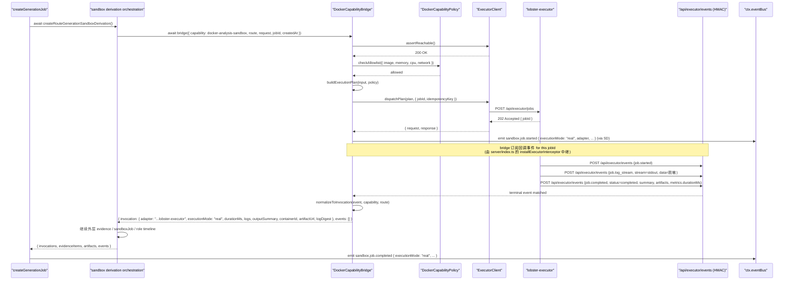
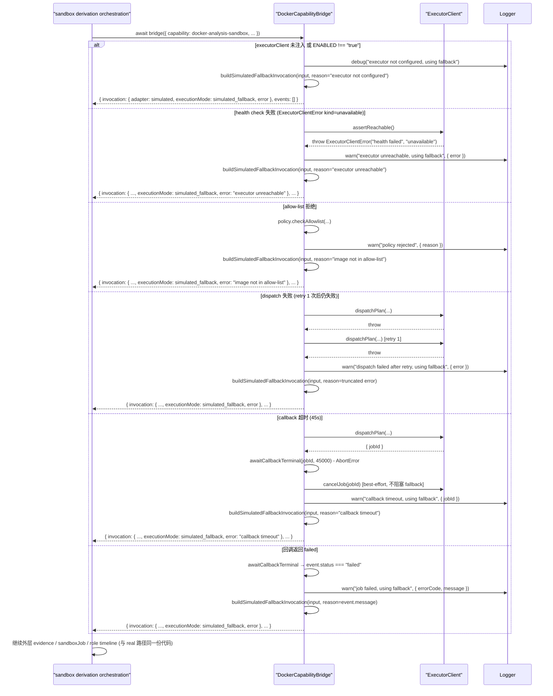

# 设计文档：Autopilot Capability Bridge — Docker Analysis Sandbox

## 1. 设计概述

本 spec 把 `/autopilot` 沙箱派生管线中 `docker-analysis-sandbox` capability 的执行路径从模板化（`buildCapabilityOutputSummary()` / `buildCapabilityInvocationLogs()` / `deterministicCapabilityDuration()`）升级为通过 `BlueprintServiceContext` 注入的 `ExecutorClient` 适配器，向 `services/lobster-executor` 派发真实 Docker 作业；同时在执行器不可达、Docker Daemon 宕机、health check 失败、派发超时、HMAC 回调超时、allow-list 不通过、seccomp 被拒等任一边界情况下无缝回退到今天的模板化 invocation 产出，保持既有 45 条 E2E + 48 条子域单测 + 9 条 SDK smoke 在默认装配（executor 不可达 → fallback）下继续通过。

本 spec 严格限定在 **`createRouteGenerationSandboxDerivation()` 中 `docker-analysis-sandbox` 这一个 capability 的 adapter 实现**：

- 仅改造 sandbox derivation 管线中“模板化 invocation 生产”这一层的 Docker 实现位置，新增 `createDockerCapabilityBridge(ctx)` 工厂落地到 `server/routes/blueprint/docker-analysis-sandbox/` 目录；co-located 单元测试与它同目录。
- **不修改** `createRouteGenerationSandboxDerivation()` 外层 orchestration（能力选择、排序、evidence aggregation、sandbox derivation job 聚合、role timeline 构建、`sandbox.job.*` / `capability.*` / `evidence.*` / `role.*` 事件总编排），这些在命中 docker capability 时只替换 invocation 层字段，其余代码路径保持不变。
- **不修改** `mcp-github-source` / `aigc-spec-node` / `role-system-architecture` 任一 capability 的产出路径（由各自独立 spec 推进）。
- **不修改** `buildRouteSet()`、SPEC Tree、SPEC Documents、Effect Preview、Prompt Package、Engineering Handoff 任一阶段（由各自独立 spec 推进）。
- **不修改** `services/lobster-executor/` 内部实现（本 spec 只在 blueprint 侧做桥接调用），不引入新的 `POST /api/executor/*` 路由，不改 `POST /api/blueprint/jobs` / `/generations` 的请求/响应既有字段。
- **不引入** property-based test（需求 9.3 明确锁定），本轮只新增 2 条 E2E + 3 条子域单测。
- 既有 45 条 E2E + 48 条子域 co-located 单测 + 9 条 SDK smoke 全部继续通过，不重写既有断言以迁就新行为。

最低可接受交付：当 `BlueprintServiceContext` 注入可用的 `executorClient` 且 health check 通过、allow-list 通过、Docker 作业在上限超时内收到 HMAC 签名的 `succeeded` 回调时，`docker-analysis-sandbox` invocation 的 `adapter === "blueprint.runtime.docker.lobster-executor"`、`provenance.executionMode === "real"`、`durationMs` 为真实墙钟毫秒、`logs` 来自容器脱敏输出、`outputSummary` 由容器产出派生；当注入的 executor 不可达、或未注入、或回调超时、或 allow-list 拒绝、或 native/mock 模式时，invocation 的 `adapter === "blueprint.runtime.docker.simulated"`、`provenance.executionMode === "simulated_fallback"`、`provenance.error` 被脱敏后填充，其它外层字段形态与今天 simulated 产出等价。

## 2. 架构决策（Key Decisions）

### D1：工厂模式 `createDockerCapabilityBridge(ctx)`

沿用 `autopilot-routeset-llm-generation` 确立的 DI 工厂模式：

```ts
export function createDockerCapabilityBridge(
  ctx: BlueprintServiceContext
): DockerCapabilityBridge;
```

工厂只接收 `BlueprintServiceContext`，从中取出 `ctx.executorClient` / `ctx.dockerCapabilityPolicy` / `ctx.logger` / `ctx.now`。返回的 bridge 是一个纯异步函数 `(input) => Promise<DockerCapabilityBridgeOutput>`，便于在测试中注入 fake `executorClient` 短路 Docker。Bridge 不持有模块级单例依赖，**不得** 在实现内 `import { DockerRunner, MockRunner } from "../../../../services/lobster-executor/src/docker-runner.js"`、**不得** `new ExecutorClient(...)` 自己装配执行器、**不得** 直接 `import dockerode` 或任何 runner 单例。违反这些约束的改动应在 code review 阶段被直接拒绝（与 routeset spec 对齐的 DI 硬约束）。

### D2：`BlueprintServiceContext` 扩展 `executorClient?`（可选注入 + 默认装配）

新增可选字段 `ctx.executorClient?: ExecutorClient`、`ctx.dockerCapabilityPolicy?: DockerCapabilityPolicy`、`ctx.dockerCapabilityBridge?: DockerCapabilityBridge`（后者为 bridge 实例本身，便于测试完全注入）。默认装配策略：

- 未注入 `executorClient` 且环境变量 `BLUEPRINT_DOCKER_CAPABILITY_BRIDGE_ENABLED !== "true"` → bridge 直接走 Simulated Fallback，不尝试 health check（避免默认 dev 装配在不可达 executor 上拖慢响应）。
- 未注入 `executorClient` 但环境变量为 `"true"` → 通过 `LOBSTER_EXECUTOR_BASE_URL` + `EXECUTOR_CALLBACK_SECRET` 构造默认 `ExecutorClient` 实例（与 `server/core/execution-bridge.ts` 第 ~592 行 `createDefaultExecutorClient()` 对齐的构造路径）。
- 注入自定义 `executorClient`（测试场景）→ 直接使用。

未注入 `dockerCapabilityPolicy` 时使用 `createDefaultDockerCapabilityPolicy()`（见 §4.3）。

**为什么用环境变量门禁**：需求 1.9 / 4.3 / 8.2 要求默认装配（executor 不可达）下既有 93 条用例继续通过；而 `dev:all` 启动 Docker 可用时会把 executor 切到 `real`，如果默认把所有 dev 流量都推到真实 Docker，会让开发机响应时间从 200ms 飙到 30s。环境变量 opt-in 让“真实 Docker”成为显式选择，而非默认行为。CI 与生产侧可以显式设 `BLUEPRINT_DOCKER_CAPABILITY_BRIDGE_ENABLED=true` 让真实执行成为默认；dev 侧不设则自动走 fallback。

### D3：替换点在 invocation 层，不改外层 orchestration

`createRouteGenerationSandboxDerivation()` 的 `invocations.map(...)` 循环（`server/routes/blueprint.ts` 第 2915-2969 行）是今天 capability invocation 的生产点。本 spec 在该循环内部，仅针对 `capability.id === "docker-analysis-sandbox"` 的迭代改为 `await bridge({ capability, route, request, routeSet, createdAt, jobId })`；其它 capability（`mcp-github-source` / `aigc-spec-node` / `role-system-architecture` / `skill-svg-architecture`）继续走既有 `buildCapabilityOutputSummary()` / `buildCapabilityInvocationLogs()` / `deterministicCapabilityDuration()` 组合。

**关键点**：`createRouteGenerationSandboxDerivation()` 本身改为 `async`，`invocations.map(...)` 改为 `Promise.all(invocations)` + `await`，但外层 `baseJob` 组装、`evidenceItems` 构造、`sandboxDerivationJob` 聚合、`capabilityEvents` / `roleEvents` 事件生成、`artifacts` 聚合这些逻辑一行不动——它们消费的是 invocation 的字段（`id` / `durationMs` / `outputSummary` / `logs` / `provenance` 等），bridge 只保证这些字段被"正确填充"（real 路径填真实值，fallback 路径填模板值），外层无需感知 adapter 的身份。

这和 routeset spec 的策略类似：routeset spec 把 3 条模板化路线的**生产点**替换为 LLM generator，外层 handoff / sandbox derivation / events 不感知；本 spec 把 1 条 capability invocation 的**生产点**替换为 Docker bridge，外层 sandbox job / evidence / events 不感知。

### D4：Fallback 是"一次失败直接回退 + 有限重试"

Docker 作业本身的重试（容器启动失败、网络抖动、镜像 pull 失败）由 `services/lobster-executor` 内部处理，bridge 层不叠加额外的容器级重试。但 **bridge 到 executor 的派发调用** 允许有限重试：

- `assertReachable()` → health check 失败：**不重试**，直接 fallback。`ExecutorClient.assertReachable` 已在 `executor-client.ts` 第 ~226 行就近抛 `ExecutorClientError({ kind: "unavailable" })`，继续加 retry 只会多消耗时间。
- `dispatchPlan()` → HTTP 5xx / 网络错误：**最多重试 1 次**（通过 `retryAttempts: 1` 配置）；若重试成功，`provenance.error` 不填充（需求 4.6 明确中间成功重试不留噪音）；若重试失败，进入 fallback。
- HMAC 回调等待超时（设计的上限 45 秒，见 D5）：**不重试**，直接 fallback，容器在执行器侧通过 `cancelJob` 清理（见 §5）。

**为什么不叠加多轮重试**：

1. Sandbox derivation 在 `createGenerationJob()` 的同步调用链中完成，对延迟敏感。每条 `docker-analysis-sandbox` invocation 如果走真实 Docker 派发 + HMAC 回调等待 ≈ 2-30s；叠加 3 轮重试会把失败场景拖到 90+s，用户体验崩坏。
2. 模板化 fallback 在功能上可用；回退不会让用户体验完全中断。
3. 需求 4.6 明确：`provenance.error` 仅在最终进入 fallback 时填充，中间成功重试不留噪音。bridge 的 retry 逻辑遵循这一语义。

### D5：超时上限锁定为 45 秒

需求 2.4 要求"不大于 60 秒"，本 spec 将 **单次 Docker 作业超时上限**（从 `ExecutorClient.dispatchPlan()` 返回 `accepted` 开始，到收到 HMAC `job.completed` / `job.failed` 回调为止的墙钟时间）锁定为 **45 秒**，通过环境变量 `BLUEPRINT_DOCKER_CAPABILITY_BRIDGE_CALLBACK_TIMEOUT_MS` 可覆盖（默认 `45000`）。选择 45s 的理由：

1. `services/lobster-executor/src/config.ts` 默认 `timeoutMs = 30000`，给容器执行 30s 完成工作；bridge 额外预留 15s 给 callback 回传延迟、网络抖动、HMAC 签名校验等。
2. 留 15s buffer 到需求上限 60s，便于未来 executor 侧扩展到 45s 容器执行而不触及 bridge 超时。
3. 与 `ExecutorClient.callbackTimeoutMs` 的默认 10s **不冲突**：前者是 callback HTTP 请求本身的超时（执行器侧发回调时等待 brain 响应），后者是 bridge 等待回调到达的超时。

**派发超时**（`ExecutorClient.timeoutMs`，即 `POST /api/executor/jobs` 的 HTTP 超时）锁定为 10s（与 executor-client 默认值一致），通过 `BLUEPRINT_DOCKER_CAPABILITY_BRIDGE_DISPATCH_TIMEOUT_MS` 可覆盖。

### D6：`adapter` 字符串锁定为 `"blueprint.runtime.docker.lobster-executor"`

需求 3.4 要求 real 路径 adapter 不含 `.simulated`，且字符串稳定可断言。本 spec 锁定 real 路径 adapter 值为 **`"blueprint.runtime.docker.lobster-executor"`**，fallback 路径保留既有 `"blueprint.runtime.docker.simulated"`（由 `getDefaultRuntimeCapabilities()` 产出，不改）。

**为什么不复用"simulated"命名空间**：`adapter` 字段是 Artifact Replay 与 Agent Crew 面板识别执行后端的唯一字符串标识。如果 real 路径仍用 `.simulated`，下游消费者无法通过纯 adapter 字符串判断"这次是真跑了 Docker 还是模板化"，必须额外消费 `executionMode`。保持两个 namespace 互斥让消费者有"fast path"：仅关心 adapter 变化的消费者不必感知 `executionMode`。

**与 routeset spec 的 `generationSource` 命名口径对齐**：

| Spec | adapter / source 字段 | real 值 | fallback 值 | executionMode 字段 |
| --- | --- | --- | --- | --- |
| routeset | `provenance.generationSource` | `"llm"` | `"llm_fallback"` | 无（generationSource 自身已足够） |
| docker bridge（本 spec） | `BlueprintRuntimeCapability.adapter`（全局） + `provenance.executionMode`（per-invocation） | `adapter === "blueprint.runtime.docker.lobster-executor"` + `executionMode === "real"` | `adapter === "blueprint.runtime.docker.simulated"` + `executionMode === "simulated_fallback"` | 取值 `"real" \| "simulated_fallback"` |

`executionMode` 不取 `"simulated"`（不加 `_fallback` 后缀）因为语义差异：需求 4.2 特指"尝试过真实执行但回退"，不是"天然走模板化"；后缀明示"这是一次失败后的退路"。

### D7：事件直接复用现有 `BlueprintEventName`，不新增事件名

需求 5.1 / 5.2 / 5.3 要求 sandbox 事件发出；这些事件已在 `createRouteGenerationSandboxDerivation()` 外层发出（`SandboxJobStarted` / `SandboxJobCompleted` / `SandboxJobFailed` / `CapabilityInvoked` / `CapabilityCompleted` / `EvidenceRecorded`）。本 spec **不新增事件名**，只在既有 payload 上追加可选字段：

- `capability.invoked` / `capability.completed` payload 追加：`executionMode`、`containerId?`、`artifactUrl?`、`logDigest?`。
- `sandbox.job.started` / `sandbox.job.completed` / `sandbox.job.failed` payload 追加：`executionMode`（该字段在 bridge 结果层面统一，由外层 orchestration 读取）。
- 所有事件 `type` 仍由 `BlueprintEventName` 常量构造，不出现裸字符串（需求 5.6）。

追加字段为可选，既有订阅者不会因字段追加而断言失败（需求 5.7）。

### D8：security allow-list 与资源约束走 `createDefaultDockerCapabilityPolicy()`

需求 7 要求镜像 allow-list、内存上限、CPU 上限、网络策略、seccomp / AppArmor、凭证脱敏。本 spec 把这些统一到一个可注入的 `DockerCapabilityPolicy` 对象（见 §4.3），由 `createDefaultDockerCapabilityPolicy()` 提供默认值，通过 `ctx.dockerCapabilityPolicy` 在测试中替换。

**默认 allow-list**（V1）：

```ts
{
  images: ["lobster-executor:ai", "lobster-executor:default", "node:20-slim"],
  memoryLimit: "512m",        // 对齐 SecurityResourceLimits.memoryBytes 默认 512MB
  cpuLimit: "1.0",            // 对齐 nanoCpus 默认 1.0 核
  pidsLimit: 256,             // 对齐 pidsLimit 默认 256
  networkPolicy: "none",      // 默认网络隔离，禁止外网访问
  securityLevel: "strict",    // 使用 executor 侧 strict 策略（capDrop: ALL, readonlyRootfs: true）
  maxCallbackTimeoutMs: 45000,
  maxDispatchTimeoutMs: 10000,
  maxLogLines: 50,
  maxLogBytes: 10240,
}
```

实际资源约束的强制执行在 `services/lobster-executor/src/security-policy.ts` 内；bridge 层只负责把 policy 映射到 `ExecutionPlan.metadata` 传入（需求 7.2 明确 bridge 不小于 executor 默认策略的限制强度，即 bridge 传入的策略不得比 executor 默认更宽松）。

### D9：`credential-redactor` 已在 executor 侧完成脱敏（bridge 无额外改造）

需求 3.6 / 7.3 要求 logs 经过 `credential-redactor` 脱敏。**重要事实**：`services/lobster-executor/src/docker-runner.ts` 第 525-542 行已经在容器完成后调用 `CredentialScrubber.scrubDirectory(artifactsDir)` 与 `CredentialScrubber.scrubFile(record.logFile)`，并且 `onLogLine` 回调（第 1059-1073 行）也对 stdout/stderr 实时脱敏。HMAC 回调回传的 `event.data` / `event.log` / `event.summary` 都是脱敏后的文本。

**bridge 层不需要再做 credential-redactor 调用**，只需保证：

1. `logs` 字段来自回调 event 的 `data` / `log.message` 字段（已脱敏）。
2. `outputSummary` 来自回调 event 的 `summary` 字段（已脱敏）或派生自 `event.artifacts` 的 meta（name / size / mimeType，不含文件原文）。
3. evidence 的 `summary` / `payloadSummary` 同上来源。

需求 7.4 禁止暴露的主机路径 / 执行器配置 / HMAC 密钥 / 凭证字符串，executor 侧 `CredentialScrubber` 已覆盖 API key 正则（`sk-[a-zA-Z0-9]{20,}` / `clp_[a-zA-Z0-9]{20,}`）；主机路径由 bridge 在组装 `outputSummary` 时主动不拼接（见 §4.5）。

### D10：测试装配是否注入 `executorClient` 决定走 real 还是 fallback

需求 9.1 要求两条新 E2E：(a) 注入返回真实 shape 回调的 fake client，(b) 注入总是抛 `ExecutorClientError({ kind: "unavailable" })` 的 fake client。两条用例共用一套 `buildBlueprintServiceContext({ executorClient: fakeClient })` 装配模式。

**为什么既有 45 条 E2E 仍通过**：既有测试**没有**注入 `executorClient`，`BlueprintServiceContext` 中该字段为 `undefined`；bridge 检测到未注入（或 `BLUEPRINT_DOCKER_CAPABILITY_BRIDGE_ENABLED !== "true"`）直接走 Simulated Fallback，产出结构与今天 100% 一致，既有断言继续成立。

这是本 spec 对向后兼容性的**核心保证**：**默认测试装配 ≡ 今天的生产行为**。

## 3. High-Level Design（HLD）

### 3.1 系统数据流（Mermaid）

```mermaid
flowchart TD
  A["POST /api/blueprint/jobs"] --> B["createGenerationJob()"]
  B --> C["buildRouteSet() + buildAgentCrew()"]
  C --> D["createRouteGenerationSandboxDerivation()"]
  D --> E["invocations.map(capability => ...)"]
  E --> F{"capability.id === 'docker-analysis-sandbox'?"}
  F -->|否| G["templated invocation<br/>(既有 buildCapability*)"]
  F -->|是| H["await bridge({ capability, route, ... })"]
  H --> I{"ctx.executorClient 可用<br/>+ ENABLED=true?"}
  I -->|否| FALLBACK["simulated_fallback<br/>(复用 buildCapability*)"]
  I -->|是| J["bridge: assertReachable()"]
  J --> K{"health ok?"}
  K -->|否| FALLBACK
  K -->|是| L["policy.allowlist check"]
  L --> M{"image/resources allowed?"}
  M -->|否| FALLBACK
  M -->|是| N["buildExecutionPlan(input, policy)"]
  N --> O["executorClient.dispatchPlan()"]
  O --> P{"HTTP accepted?"}
  P -->|否 (1 retry)| O
  P -->|仍失败| FALLBACK
  P -->|是| Q["awaitCallbackTerminal(jobId, timeout=45s)"]
  Q --> R{"callback received<br/>before timeout?"}
  R -->|否| CANCEL["cancelJob(jobId)"] --> FALLBACK
  R -->|是 + succeeded| REAL["real invocation<br/>{ durationMs: 墙钟, logs: 脱敏<br/>outputSummary: 容器产出派生,<br/>adapter: lobster-executor,<br/>executionMode: real,<br/>containerId/artifactUrl/logDigest }"]
  R -->|是 + failed| FALLBACK
  REAL --> G2["继续外层 orchestration<br/>(evidence / sandbox job / events)"]
  FALLBACK --> G2
  G --> G2
  G2 --> S["发出 sandbox.job.*<br/>capability.* / role.* 事件"]
  S --> T["HTTP 201 response"]
```

### 3.2 Happy path 时序图（real execution）



### 3.3 Fallback 时序图



## 4. Low-Level Design（LLD）


### 4.1 文件布局

```
server/routes/blueprint/docker-analysis-sandbox/
  ├── bridge.ts                           # 新增：createDockerCapabilityBridge(ctx) 工厂
  ├── bridge.test.ts                      # 新增：3+ co-located 单测
  ├── policy.ts                           # 新增：DockerCapabilityPolicy 类型 + createDefaultDockerCapabilityPolicy()
  ├── policy.test.ts                      # 新增：allow-list / 资源约束校验测试
  ├── execution-plan.ts                   # 新增：buildDockerCapabilityExecutionPlan(input, policy) 纯函数
  ├── execution-plan.test.ts              # 新增：plan 字段拼装测试
  ├── callback-waiter.ts                  # 新增:(jobId) => Promise<ExecutorEvent> 订阅 + 超时
  └── callback-waiter.test.ts             # 新增：callback 订阅 / 超时 / 匹配测试

server/routes/blueprint/context.ts        # 修改：
                                          #   - BlueprintServiceContext 追加:
                                          #       executorClient?: ExecutorClient
                                          #       executorCallbackDispatcher?: BlueprintExecutorCallbackDispatcher
                                          #       dockerCapabilityPolicy?: DockerCapabilityPolicy
                                          #       dockerCapabilityBridge?: DockerCapabilityBridge
                                          #   - BlueprintServiceContextDeps 追加同样字段
                                          #   - buildBlueprintServiceContext 默认装配 createDockerCapabilityBridge(ctx)

server/routes/blueprint.ts                # 修改（最小侵入）：
                                          #   - createRouteGenerationSandboxDerivation() 改为 async
                                          #   - invocations.map(...) 改为 await Promise.all(invocations)
                                          #   - 针对 capability.id === "docker-analysis-sandbox" 调用 bridge
                                          #   - getDefaultRuntimeCapabilities() 中 docker capability 的 adapter 字段保持
                                          #     "blueprint.runtime.docker.simulated"（fallback 基线）
                                          #   - capability.invoked / capability.completed / sandbox.job.* 事件 payload 追加
                                          #     executionMode / containerId / artifactUrl / logDigest 可选字段

server/index.ts                           # 修改:
                                          #   - installExecutorInterceptor 在既有的 eventCollector 中继后增加一层
                                          #     BlueprintExecutorCallbackDispatcher.handleEvent(event)，
                                          #     把匹配 blueprint 派发的 jobId 的事件转发给 bridge 的 awaitCallbackTerminal

shared/blueprint/contracts.ts             # 修改：
                                          #   - BlueprintCapabilityInvocation.provenance 追加可选:
                                          #       executionMode?: "real" | "simulated_fallback"
                                          #       containerId?: string
                                          #       artifactUrl?: string
                                          #       logDigest?: string
                                          #       error?: string
                                          #   - BlueprintCapabilityEvidence.provenance 追加同样可选字段

server/tests/blueprint-routes.test.ts     # 修改（只追加，不改写）：
                                          #   + 2 条新 E2E 用例：
                                          #     (a) Real-Docker mock path
                                          #     (b) Fallback path
```

### 4.2 核心类型定义（`bridge.ts`）

```ts
import type { BlueprintServiceContext } from "../context.js";
import type {
  BlueprintCapabilityInvocation,
  BlueprintGenerationEvent,
  BlueprintGenerationRequest,
  BlueprintRouteCandidate,
  BlueprintRouteSet,
  BlueprintRuntimeCapability,
} from "../../../../shared/blueprint/index.js";
import type { ExecutorEvent } from "../../../../shared/executor/contracts.js";

/**
 * bridge 的单次调用输入。调用方（createRouteGenerationSandboxDerivation）
 * 在已经选定 docker-analysis-sandbox capability 之后传入。
 */
export interface DockerCapabilityBridgeInput {
  /** 从 getDefaultRuntimeCapabilities() 查出的 docker capability 定义对象 */
  capability: BlueprintRuntimeCapability;
  /** 本次 invocation 要绑定的 route（用于 provenance + 事件 payload 的 routeId） */
  route: BlueprintRouteCandidate;
  /** blueprint generation job id（顶层） */
  jobId: string;
  /** 原始请求；bridge 从中派生 targetText / githubUrls / projectId */
  request: BlueprintGenerationRequest;
  /** 当前 RouteSet；bridge 从中派生 routeSetId */
  routeSet: BlueprintRouteSet;
  /** 调用方已确定的时间戳（为了与 evidence / event / sandbox job 对齐） */
  createdAt: string;
  /** 由调用方预先生成的 invocation id；bridge 在 real 与 fallback 路径下都使用这个 id，
      确保外层 evidence / event 的 invocationId 引用稳定 */
  invocationId: string;
  /** 调用方已解析的 roleId（当前硬编码 "role-runtime-executor"，保留参数化以防后续角色调整） */
  roleId: string;
}

/**
 * bridge 的单次调用输出。不包含外层 orchestration 所需的 evidence 聚合；
 * 那些字段由 createRouteGenerationSandboxDerivation() 在外层继续拼装。
 */
export interface DockerCapabilityBridgeOutput {
  /** 一条可用的 invocation；外层 map 直接回填到 invocations 数组 */
  invocation: BlueprintCapabilityInvocation;
  /** 本次执行所绑定的真实执行器 jobId（real 路径填充；fallback 路径 undefined） */
  executorJobId?: string;
  /** 可选：bridge 希望额外 emit 的事件（当前为空；预留未来 heartbeat） */
  additionalEvents: BlueprintGenerationEvent[];
}

export type DockerCapabilityBridge = (
  input: DockerCapabilityBridgeInput
) => Promise<DockerCapabilityBridgeOutput>;

export function createDockerCapabilityBridge(
  ctx: BlueprintServiceContext
): DockerCapabilityBridge;
```

**关键设计点：`invocationId` 由调用方传入**

外层 `createRouteGenerationSandboxDerivation()` 已经在循环开头生成 invocation id（`createId("blueprint-capability-invocation")`），并且在同步路径下该 id 立即被用于 `buildCapabilityEvidence({ invocation })`、sandbox job `invocationIds` 聚合、capability events 的 `invocationId` 字段。如果 bridge 在内部重新生成 id，外层聚合会引用到不同 id 导致 evidence → invocation 反查断链。本设计把 id 作为参数传入，bridge 无论 real 还是 fallback 路径都使用这个 id，保证外层 evidence aggregation 一行不动。

### 4.3 Policy 类型（`policy.ts`）

```ts
export interface DockerCapabilityPolicy {
  /** 允许派发的容器镜像 allow-list（精确匹配） */
  allowedImages: readonly string[];
  /** 内存上限（Docker format，例如 "512m" / "1g"） */
  memoryLimit: string;
  /** CPU 上限（nanoCpus 小数形式，例如 "1.0" = 1 核） */
  cpuLimit: string;
  /** 最大并发进程数 */
  pidsLimit: number;
  /** 网络策略：none = 完全隔离（默认）；bridge = 默认桥接；whitelist = 白名单域名 */
  networkPolicy: "none" | "bridge" | "whitelist";
  /** 当 networkPolicy === "whitelist" 时允许访问的域名/IP 列表 */
  networkAllowlist?: readonly string[];
  /** 安全级别（透传 executor 侧 security-policy.ts 的 SecurityLevel） */
  securityLevel: "strict" | "balanced" | "permissive";
  /** 单次调用 HMAC 回调等待上限（毫秒） */
  maxCallbackTimeoutMs: number;
  /** 单次 POST /api/executor/jobs 派发上限（毫秒） */
  maxDispatchTimeoutMs: number;
  /** invocation.logs 最大行数 */
  maxLogLines: number;
  /** invocation.logs 累计字节上限 */
  maxLogBytes: number;
}

export function createDefaultDockerCapabilityPolicy(): DockerCapabilityPolicy {
  return {
    allowedImages: ["lobster-executor:ai", "lobster-executor:default", "node:20-slim"],
    memoryLimit: "512m",
    cpuLimit: "1.0",
    pidsLimit: 256,
    networkPolicy: "none",
    securityLevel: "strict",
    maxCallbackTimeoutMs: 45000,
    maxDispatchTimeoutMs: 10000,
    maxLogLines: 50,
    maxLogBytes: 10240,
  };
}

export interface DockerCapabilityPolicyCheckResult {
  allowed: boolean;
  reason?: string;
}

export function checkDockerCapabilityPolicy(
  policy: DockerCapabilityPolicy,
  request: {
    image: string;
    requestedNetwork?: "none" | "bridge" | "whitelist";
    requestedNetworkAllowlist?: readonly string[];
  }
): DockerCapabilityPolicyCheckResult;
```

**校验规则**（由 `checkDockerCapabilityPolicy()` 实现）：

| 场景 | 结果 |
| --- | --- |
| `request.image` 不在 `policy.allowedImages` | `allowed: false`, `reason: "image not in allow-list"` |
| `request.requestedNetwork === "bridge"` 但 `policy.networkPolicy === "none"` | `allowed: false`, `reason: "network policy denied"` |
| `request.requestedNetwork === "whitelist"` 但 domain 不在 `policy.networkAllowlist` | `allowed: false`, `reason: "network allowlist denied"` |
| 其它 | `allowed: true` |

**资源约束（memory / cpu / pidsLimit / securityLevel）不在 bridge 层检查而是直接透传给 executor**：需求 7.2 的 `security-policy.ts` 已经实现这些约束的强制执行；bridge 只负责"不得比 executor 默认更宽松"——默认值取 executor 侧默认，即使未来 executor 默认调整，bridge 也不会意外放松。`createDefaultDockerCapabilityPolicy()` 的硬编码默认值与 executor 默认严格对齐（见 `shared/executor/contracts.ts` `SecurityResourceLimits` 默认值）。

### 4.4 Execution plan 构造（`execution-plan.ts`）

```ts
import type { ExecutionPlan } from "../../../../shared/executor/contracts.js";
import type { DockerCapabilityBridgeInput } from "./bridge.js";
import type { DockerCapabilityPolicy } from "./policy.js";

export interface BuildDockerExecutionPlanInput {
  bridgeInput: DockerCapabilityBridgeInput;
  policy: DockerCapabilityPolicy;
  /** 沙箱内要使用的容器镜像（默认 "lobster-executor:default"） */
  image?: string;
}

export function buildDockerCapabilityExecutionPlan(
  input: BuildDockerExecutionPlanInput
): ExecutionPlan;
```

**plan 字段填充**：

```ts
{
  version: EXECUTOR_CONTRACT_VERSION,
  missionId: `blueprint:${input.bridgeInput.jobId}`, // executor 期望 missionId，而 blueprint 无 mission；用前缀标识来源
  summary: `Blueprint docker analysis for route: ${input.bridgeInput.route.title}`,
  objective: `Analyze target ${input.bridgeInput.request.targetText ?? "(no target)"} for route ${input.bridgeInput.route.id}.`,
  requestedBy: "brain",
  mode: "managed",
  sourceText: input.bridgeInput.request.targetText,
  steps: [
    {
      key: "docker-analysis",
      label: "Docker analysis",
      description: "Run deterministic repository analysis in a sealed container.",
    },
  ],
  jobs: [
    {
      id: input.bridgeInput.invocationId, // 与外层 invocation id 一致，方便回调匹配
      key: "docker-analysis",
      label: "Docker analysis sandbox",
      description: "Blueprint route-generation capability adapter.",
      kind: "analyze",
      timeoutMs: Math.min(input.policy.maxCallbackTimeoutMs, 30000),
      payload: {
        requiredCapabilities: ["runtime.docker"],
        image: input.image ?? "lobster-executor:default",
        memoryLimit: input.policy.memoryLimit,
        cpuLimit: input.policy.cpuLimit,
        pidsLimit: input.policy.pidsLimit,
        networkPolicy: input.policy.networkPolicy,
        securityLevel: input.policy.securityLevel,
        // 真实执行输入：route + target + github urls
        analysisInput: {
          routeId: input.bridgeInput.route.id,
          routeTitle: input.bridgeInput.route.title,
          targetText: input.bridgeInput.request.targetText,
          githubUrls: input.bridgeInput.request.githubUrls ?? [],
          projectId: input.bridgeInput.request.projectId,
        },
      },
    },
  ],
  metadata: {
    source: "blueprint-docker-capability-bridge",
    blueprintJobId: input.bridgeInput.jobId,
    routeSetId: input.bridgeInput.routeSet.id,
    routeId: input.bridgeInput.route.id,
    capabilityId: input.bridgeInput.capability.id,
  },
}
```

**设计要点**：

- `missionId: "blueprint:{jobId}"` 而非真实 mission id —— executor 要求 missionId 必填，blueprint 派生不对应任何 mission 实体；前缀 `blueprint:` 让 executor 侧日志清楚这是 blueprint 派发，便于运维区分。这一命名约定必须在 tasks 阶段与 executor / mission runtime 团队确认不冲突（建议也在 executor README 补一行注释）。
- `jobs[0].id === invocationId` —— HMAC 回调事件里 `event.jobId` 就是这个 id，bridge 用它来匹配 `awaitCallbackTerminal`。
- `requiredCapabilities: ["runtime.docker"]` —— 让 `ExecutorClient.validatePlanCapabilities()` 在派发前验证 executor 是否支持 Docker 模式。如果 executor 当前是 native/mock，这里会抛 `ExecutorClientError({ kind: "rejected" })`，bridge 捕获后进 fallback。
- `payload.analysisInput` —— 需求 2.5 要求载荷可追溯到当前请求上下文。
- `requestedBy: "brain"` —— 与 `ExecutionPlan.requestedBy` 枚举一致（brain / user / feishu / system）；本 spec 的语义最接近 brain。

### 4.5 Callback waiter（`callback-waiter.ts`）

```ts
import type { ExecutorEvent } from "../../../../shared/executor/contracts.js";

export interface BlueprintExecutorCallbackDispatcher {
  /**
   * 订阅某个 jobId 的终态事件（`job.completed` 或 `job.failed`）。
   * 返回一个 Promise：成功匹配 → resolve event；超时 → reject AbortError。
   */
  awaitTerminal(jobId: string, timeoutMs: number): Promise<ExecutorEvent>;
  /**
   * server/index.ts 的 installExecutorInterceptor 调用：把收到的事件分发给等待者。
   * 非终态事件（job.log / job.progress 等）通过 onEvent listener 可选暴露（本 spec 不消费）。
   */
  handleEvent(event: ExecutorEvent): void;
  /**
   * 注册 per-job 的日志收集器；bridge 在 awaitTerminal 期间顺带收集 log_stream 事件。
   */
  collectLogs(jobId: string, maxLines: number, maxBytes: number): {
    getLogs: () => string[];
    getDigest: () => string | undefined;
    dispose: () => void;
  };
}

export function createBlueprintExecutorCallbackDispatcher(options: {
  now?: () => Date;
  logger?: BlueprintLogger;
}): BlueprintExecutorCallbackDispatcher;
```

**实现要点**：

- 内部用 `Map<string, { resolve, reject, timer, logCollector? }>` 维护 pending waiters。
- `handleEvent()` 在 `event.type === "job.completed" | "job.failed"` 且 `waiters.has(event.jobId)` 时触发 resolve + clearTimeout + delete。
- `job.log_stream` / `job.log` 在启用了 `collectLogs(jobId, ...)` 时累计到内存，直到终态或 dispose；超过 `maxLines` / `maxBytes` 丢弃后续行但保留 digest（SHA-256 over 完整 scrubbed bytes）。
- 超时通过 `setTimeout(() => { reject(new Error("callback timeout")); delete ... }, timeoutMs)`。
- **不持久化事件**：事件已由 `installExecutorInterceptor` 独立写入 replay store；bridge 只做 transient 订阅。

**`server/index.ts` 接线**（现有 `installExecutorInterceptor` 基础上增加一行）：

```ts
// 现有
app.use(
  "/api/executor/events",
  installExecutorInterceptor(eventCollector, resolveMissionReplayId)
);

// 新增：blueprint callback dispatcher 作为第二中间件
const blueprintCallbackDispatcher = createBlueprintExecutorCallbackDispatcher({ now, logger });
app.use("/api/executor/events", (req, res, next) => {
  const event = req.body as ExecutorEvent | undefined;
  if (event && typeof event.jobId === "string") {
    blueprintCallbackDispatcher.handleEvent(event);
  }
  next();
});
```

**注意**：blueprint dispatcher 在 `installExecutorInterceptor` 之后执行，不拦截 response，也不影响原 mission runtime 的事件处理。两者都是幂等 / 只读消费，顺序无关紧要。

### 4.6 Bridge 主算法（伪代码）

```ts
export function createDockerCapabilityBridge(
  ctx: BlueprintServiceContext
): DockerCapabilityBridge {
  const policy = ctx.dockerCapabilityPolicy ?? createDefaultDockerCapabilityPolicy();

  return async function bridge(input: DockerCapabilityBridgeInput): Promise<DockerCapabilityBridgeOutput> {
    // 1. 早退：executor 未配置或未启用
    const executorClient = ctx.executorClient;
    const enabled = process.env.BLUEPRINT_DOCKER_CAPABILITY_BRIDGE_ENABLED === "true";
    if (!executorClient || !enabled) {
      return buildFallbackOutput(input, {
        reason: "executor not configured",
      });
    }

    // 2. Health check（健康检查失败直接 fallback，不重试）
    try {
      await executorClient.assertReachable();
    } catch (error) {
      ctx.logger.warn("Docker capability bridge: executor unreachable, using fallback", {
        error: errorMessage(error),
        capabilityId: input.capability.id,
      });
      return buildFallbackOutput(input, {
        reason: truncate(`executor unreachable: ${errorMessage(error)}`, 400),
      });
    }

    // 3. Policy 检查
    const policyCheck = checkDockerCapabilityPolicy(policy, {
      image: "lobster-executor:default", // V1 固定镜像
    });
    if (!policyCheck.allowed) {
      ctx.logger.warn("Docker capability bridge: policy rejected, using fallback", {
        reason: policyCheck.reason,
      });
      return buildFallbackOutput(input, {
        reason: policyCheck.reason ?? "policy rejected",
      });
    }

    // 4. 构造 execution plan
    const plan = buildDockerCapabilityExecutionPlan({ bridgeInput: input, policy });

    // 5. Dispatch + retry 1 次
    let dispatchResult;
    let dispatchError: Error | undefined;
    for (let attempt = 0; attempt < 2; attempt++) {
      try {
        dispatchResult = await executorClient.dispatchPlan(plan, {
          jobId: input.invocationId,
          requestId: `blueprint-dispatch:${input.invocationId}:${attempt}`,
          idempotencyKey: `blueprint:${input.invocationId}`, // 幂等键：同一 invocation 的重试不会产生两个 executor job
        });
        dispatchError = undefined;
        break;
      } catch (error) {
        dispatchError = error as Error;
        // 对 kind="rejected" 不重试（policy 级别的拒绝，重试无意义）
        if (error instanceof ExecutorClientError && error.kind === "rejected") {
          break;
        }
      }
    }
    if (dispatchError || !dispatchResult) {
      ctx.logger.warn("Docker capability bridge: dispatch failed, using fallback", {
        error: errorMessage(dispatchError),
      });
      return buildFallbackOutput(input, {
        reason: truncate(`dispatch failed: ${errorMessage(dispatchError)}`, 400),
      });
    }

    // 6. 订阅 callback + 收集 logs
    const dispatcher = ctx.executorCallbackDispatcher;
    if (!dispatcher) {
      // 未装配 dispatcher（纯测试场景可能省略）→ 取消 job 后 fallback
      await executorClient.cancelJob?.(input.invocationId).catch(() => void 0);
      return buildFallbackOutput(input, { reason: "callback dispatcher not configured" });
    }
    const logs = dispatcher.collectLogs(input.invocationId, policy.maxLogLines, policy.maxLogBytes);
    const dispatchedAt = ctx.now();

    let terminalEvent: ExecutorEvent;
    try {
      terminalEvent = await dispatcher.awaitTerminal(input.invocationId, policy.maxCallbackTimeoutMs);
    } catch (error) {
      logs.dispose();
      // 超时 → 尝试 cancel，不阻塞 fallback
      await executorClient.cancelJob?.(input.invocationId).catch(() => void 0);
      ctx.logger.warn("Docker capability bridge: callback timeout, using fallback", {
        jobId: input.invocationId,
      });
      return buildFallbackOutput(input, { reason: "callback timeout" });
    }

    // 7. 回调终态判断
    if (terminalEvent.status === "failed") {
      const collectedLogs = logs.getLogs();
      logs.dispose();
      ctx.logger.warn("Docker capability bridge: job failed, using fallback", {
        errorCode: terminalEvent.errorCode,
        message: terminalEvent.message,
      });
      return buildFallbackOutput(input, {
        reason: truncate(terminalEvent.message || "job failed", 400),
      });
    }

    // 8. Happy path: 构造 real invocation
    const completedAt = ctx.now();
    const durationMs = completedAt.getTime() - dispatchedAt.getTime();
    const collectedLogs = logs.getLogs();
    const logDigest = logs.getDigest();
    logs.dispose();

    return {
      executorJobId: input.invocationId,
      additionalEvents: [],
      invocation: buildRealInvocation({
        input,
        terminalEvent,
        durationMs,
        logs: collectedLogs,
        logDigest,
      }),
    };
  };
}
```

### 4.7 `buildRealInvocation()`（real 路径字段填充）

```ts
function buildRealInvocation(args: {
  input: DockerCapabilityBridgeInput;
  terminalEvent: ExecutorEvent;
  durationMs: number;
  logs: string[];
  logDigest?: string;
}): BlueprintCapabilityInvocation {
  const { input, terminalEvent, durationMs, logs, logDigest } = args;
  const containerId = extractContainerId(terminalEvent); // 从 event.payload.containerId / event.detail 中提取
  const artifactUrl = extractArtifactUrl(terminalEvent); // 从 event.artifacts[0] 中取 url
  const outputSummary =
    terminalEvent.summary ??
    deriveSummaryFromArtifacts(terminalEvent.artifacts) ??
    "Docker analysis sandbox completed without summary.";

  return {
    id: input.invocationId,
    jobId: input.jobId,
    capabilityId: input.capability.id,
    roleId: input.roleId,
    capabilityLabel: input.capability.label,
    kind: input.capability.kind,
    status: "completed",
    securityLevel: input.capability.securityLevel,
    safetyGate: {
      status: "allowed",
      reason: `${input.capability.label} approved for real Docker execution via lobster-executor.`,
      requiresApproval: input.capability.requiresApproval,
      approved: input.capability.requiresApproval,
      securityLevel: input.capability.securityLevel,
    },
    requestedAt: input.createdAt,
    completedAt: new Date().toISOString(), // 真实完成时间
    requestedBy: "docker-capability-bridge",
    routeId: input.route.id,
    input: `Derive route candidate ${input.route.title} with ${input.capability.label}.`,
    outputSummary,
    logs,
    evidenceIds: [], // 由外层 createRouteGenerationSandboxDerivation 回填
    durationMs,
    provenance: {
      jobId: input.jobId,
      projectId: input.request.projectId,
      sourceId: input.request.sourceId,
      routeSetId: input.routeSet.id,
      routeId: input.route.id,
      roleId: input.roleId,
      targetText: input.request.targetText,
      githubUrls: input.request.githubUrls ?? [],
      // —— 新增 provenance 字段 ——
      executionMode: "real",
      containerId,
      artifactUrl,
      logDigest,
    },
  };
}
```

**关键约束**：

- 除了 `status`、`outputSummary`、`logs`、`durationMs`、`provenance.executionMode / containerId / artifactUrl / logDigest`、`requestedBy`、`safetyGate.reason`、`completedAt` 外，所有字段与今天 simulated 产出完全相同（id / jobId / capabilityId / roleId / capabilityLabel / kind / securityLevel / safetyGate 结构 / requestedAt / routeId / input / evidenceIds / provenance 既有字段），以满足需求 3.7 的字段形态等价要求。
- `adapter` 字段本身不挂在 invocation 上，而是挂在 `BlueprintRuntimeCapability.adapter` 全局上。需求 3.4 要求 real 路径 capability adapter 为 `"blueprint.runtime.docker.lobster-executor"`。这需要在外层 `createRouteGenerationSandboxDerivation()` 中，real 路径下把传给外层 `buildCapabilityEvidence()` 的 capability 对象做一个浅层覆盖：

```ts
// createRouteGenerationSandboxDerivation 内部，针对 docker capability 的分支：
const realAdapterCapability = {
  ...capability,
  adapter: "blueprint.runtime.docker.lobster-executor",
};
// 使用 realAdapterCapability 做 evidence 构造与事件 payload，
// getDefaultRuntimeCapabilities() 本身不改（仍返回 .simulated 作为 fallback 基线）。
```

fallback 路径继续使用原 `capability`（`adapter === "blueprint.runtime.docker.simulated"`）。这样需求 1.9（不改 93 条既有断言）与需求 3.4（real adapter 不含 `.simulated`）同时成立。

### 4.8 `buildFallbackOutput()`（fallback 路径字段填充）

```ts
function buildFallbackOutput(
  input: DockerCapabilityBridgeInput,
  options: { reason: string }
): DockerCapabilityBridgeOutput {
  const invocationInput = `Derive route candidate ${input.route.title} with ${input.capability.label}.`;
  return {
    executorJobId: undefined,
    additionalEvents: [],
    invocation: {
      id: input.invocationId,
      jobId: input.jobId,
      capabilityId: input.capability.id,
      roleId: input.roleId,
      capabilityLabel: input.capability.label,
      kind: input.capability.kind,
      status: "completed",
      securityLevel: input.capability.securityLevel,
      safetyGate: {
        status: "allowed",
        reason: `${input.capability.label} allowed for deterministic route generation sandbox derivation.`,
        requiresApproval: input.capability.requiresApproval,
        approved: input.capability.requiresApproval,
        securityLevel: input.capability.securityLevel,
      },
      requestedAt: input.createdAt,
      completedAt: input.createdAt,
      requestedBy: "route-generation-sandbox-derivation",
      routeId: input.route.id,
      input: invocationInput,
      outputSummary: buildCapabilityOutputSummary({
        capability: input.capability,
        routeTitle: input.route.title,
        input: invocationInput,
      }),
      logs: buildCapabilityInvocationLogs(
        input.capability,
        buildCapabilityOutputSummary({
          capability: input.capability,
          routeTitle: input.route.title,
          input: invocationInput,
        })
      ),
      evidenceIds: [],
      durationMs: deterministicCapabilityDuration(input.capability, {
        capabilityId: input.capability.id,
        roleId: input.roleId,
        routeId: input.route.id,
        input: invocationInput,
      }),
      provenance: {
        jobId: input.jobId,
        projectId: input.request.projectId,
        sourceId: input.request.sourceId,
        routeSetId: input.routeSet.id,
        routeId: input.route.id,
        roleId: input.roleId,
        targetText: input.request.targetText,
        githubUrls: input.request.githubUrls ?? [],
        // —— 新增 provenance 字段 ——
        executionMode: "simulated_fallback",
        error: truncate(options.reason, 400),
      },
    },
  };
}
```

**关键约束**：

- fallback 路径的 `outputSummary` / `logs` / `durationMs` / 其它字段完全等于今天 `createRouteGenerationSandboxDerivation()` 循环内原始代码的产出（调用同一套 helper）。这保证了需求 4.3（既有 93 条用例在 fallback 路径下继续通过）的结构等价。
- `requestedBy === "route-generation-sandbox-derivation"` 保留今天的值（real 路径改为 `"docker-capability-bridge"`，这是新值，但不影响既有断言——既有 E2E 不断言 `requestedBy` 字段）。
- `provenance.error` 由 `truncate(reason, 400)` 截断，避免超长错误消息（例如包含 stack trace 的 executor client error）污染 provenance；与 routeset spec 的 `truncate(err.message, 400)` 约定对齐。
- `provenance.executionMode === "simulated_fallback"` 是新字段；既有 E2E 不断言 `executionMode` 是否存在，因此追加不破坏断言；新增的 E2E 明确断言（需求 9.1）。
- fallback 路径下，外层 `createRouteGenerationSandboxDerivation()` 使用的 capability 对象仍是 `getDefaultRuntimeCapabilities()` 返回的原对象（`adapter === "blueprint.runtime.docker.simulated"`），与今天完全一致。

### 4.9 外层 `createRouteGenerationSandboxDerivation()` 的最小改造

```ts
// 改造前（同步，循环内直接构造）：
const invocations = routeGenerationCapabilities.map((capability, index) => {
  const route = input.routeSet.routes[index] ?? primaryRoute;
  // ...直接 buildCapabilityOutputSummary / buildCapabilityInvocationLogs / deterministicCapabilityDuration...
});

// 改造后（async，对 docker capability 走 bridge）：
const invocations = await Promise.all(
  routeGenerationCapabilities.map(async (capability, index) => {
    const route = input.routeSet.routes[index] ?? primaryRoute;
    const invocationRoleId = resolveRouteSandboxCapabilityRoleId(capability);
    const invocationId = createId("blueprint-capability-invocation");

    if (capability.id === "docker-analysis-sandbox" && ctx.dockerCapabilityBridge) {
      const bridgeResult = await ctx.dockerCapabilityBridge({
        capability,
        route,
        jobId: input.jobId,
        request: input.request,
        routeSet: input.routeSet,
        createdAt: input.createdAt,
        invocationId,
        roleId: invocationRoleId,
      });
      return bridgeResult.invocation;
    }

    // 其它 capability：保持今天的模板化代码一行不改
    const invocationInput = `Derive route candidate ${route.title} with ${capability.label}.`;
    const invocation: BlueprintCapabilityInvocation = {
      id: invocationId,
      // ...现有字段...
    };
    return { ...invocation, logs: buildCapabilityInvocationLogs(capability, invocation.outputSummary) };
  })
);
```

**关键点**：

- `createId` 调用从内到外提前 —— 在分支前生成 id，两条路径共享同一 id。
- `createRouteGenerationSandboxDerivation` 签名改为接收 `ctx: BlueprintServiceContext` 参数（当前签名不含 ctx），调用点（`createGenerationJob` 第 2298 行）追加 `ctx` 参数。
- `ctx.dockerCapabilityBridge` 未注入时（极端场景：测试显式清空）fallback 到 else 分支，走今天的模板化路径 —— 这保证了"ctx 本身不装 bridge 也不崩溃"。
- `routeSetLlmGenerator` 已把 `createRouteGenerationSandboxDerivation` 调用路径改成了异步（因为 `createGenerationJob` 已经是 `async`），本 spec 只新增一个 `await` 而不重构调用链。

**adapter 字段的 real/fallback 区分**：在 `createRouteGenerationSandboxDerivation` 外层构造 sandbox job 事件时，real 路径下应使用 `"blueprint.runtime.docker.lobster-executor"` adapter 字符串。最小改动：

```ts
// 在 createRouteGenerationSandboxDerivation 内部聚合完 invocations 之后：
const dockerInvocation = invocations.find(inv => inv.capabilityId === "docker-analysis-sandbox");
const dockerAdapter =
  dockerInvocation?.provenance?.executionMode === "real"
    ? "blueprint.runtime.docker.lobster-executor"
    : capability.adapter; // 默认 .simulated
// 在 sandbox.job.started / sandbox.job.completed 事件 payload 中使用 dockerAdapter
```

**需要在 tasks 阶段 trace 的精确位置**：`server/routes/blueprint.ts` 第 2940 / 3088 / 3091 行附近的 event payload 构造代码。

### 4.10 Contract 扩展（`shared/blueprint/contracts.ts`）

```ts
// BlueprintCapabilityInvocation.provenance 追加可选字段：
export interface BlueprintCapabilityInvocation {
  // ...既有字段...
  provenance: {
    // ...既有字段（不变）...
    jobId: string;
    projectId?: string;
    sourceId?: string;
    routeSetId?: string;
    routeId?: string;
    specTreeId?: string;
    nodeId?: string;
    roleId?: string;
    targetText?: string;
    githubUrls: string[];
    // —— 新增可选字段 ——
    /**
     * 本次 invocation 的执行模式。
     * - "real"：通过 ExecutorClient 向 lobster-executor 派发了真实 Docker 作业并收到成功回调
     * - "simulated_fallback"：bridge 尝试或未尝试 real 执行，最终回退到模板化产出
     * 未设置时表示未走过 bridge 路径（例如 mcp / aigc / role / skill 等其它 capability）。
     */
    executionMode?: "real" | "simulated_fallback";
    /** real 路径下容器 ID（可选，executor 提供时填充） */
    containerId?: string;
    /** real 路径下主产物 URL（可选，executor 事件 artifacts[0].url 填充） */
    artifactUrl?: string;
    /** real 路径下脱敏后日志流的 SHA-256 digest（可选） */
    logDigest?: string;
    /** simulated_fallback 路径下的触发原因摘要（截断到 400 字符） */
    error?: string;
  };
}

// BlueprintCapabilityEvidence.provenance 追加同样的可选字段
```

**外层 `buildCapabilityEvidence()` 的改造**：evidence 的 `provenance` 需要从对应 invocation 的 `provenance` 继承 `executionMode / containerId / artifactUrl / logDigest / error` 字段。这通过在 `buildCapabilityEvidence({ invocation })` 内部读 `invocation.provenance.executionMode` 等并回填 evidence provenance 即可完成，是最小的一次补丁。

**向后兼容性**：全部新增字段均为可选。既有 45 条 E2E 与 48 条子域单测均不断言这些字段；SDK 9 条 smoke 不消费 provenance 新字段。若 SDK normalizer 使用 object spread，新字段自动透传；若使用显式字段映射，需要在 `client/src/lib/blueprint-api/` 对应 normalizer 中补 4 行可选字段透传——这一点与 routeset spec 完全一致（见 routeset spec 任务 15）。

## 5. Error Handling

本 spec 的错误处理采用"fail-open 到 fallback，不 fail-close 到 HTTP 500"原则。Docker 执行是一段可选的增强产物，任何异常都不应阻塞 `/api/blueprint/jobs` 响应。

### 5.1 Bridge 层错误

| 错误来源 | bridge 行为 | `provenance.error` |
| --- | --- | --- |
| `executorClient` 未注入 / `ENABLED !== "true"` | 早退 fallback，无日志噪音（`ctx.logger.debug`） | `"executor not configured"` |
| `assertReachable()` 抛 `ExecutorClientError({ kind: "unavailable" })` | fallback + `logger.warn` | `"executor unreachable: {message}"`（截断 400） |
| `policy.checkAllowlist` 返回 `allowed: false` | fallback + `logger.warn` | `{reason}`（如 `"image not in allow-list"`） |
| `dispatchPlan()` 抛 `ExecutorClientError({ kind: "protocol" \| "rejected" })` | 对 `rejected` 不重试，对 `protocol` 重试 1 次；均失败则 fallback | `"dispatch failed: {message}"` |
| `dispatchPlan()` 抛网络错误 | 重试 1 次；失败则 fallback | 同上 |
| `awaitTerminal` 超时（45s） | fallback + 尝试 `cancelJob`（best-effort） | `"callback timeout"` |
| `terminalEvent.status === "failed"` | fallback + `logger.warn` | `truncate(event.message, 400)` |
| `buildRealInvocation` 内部异常（代码 bug） | catch 到最外层 → fallback | `"normalization failed: {message}"` |

### 5.2 HTTP 层错误

`createGenerationJob()` 已在 routeset spec 中改为 `async`。本 spec 不再改动 handler 的 `try/catch` 结构。bridge 内部已吞下所有 executor 层错误，不会冒泡到 handler；500 路径仍只对应"模板化 fallback 也崩了"这一极端 bug 场景。

### 5.3 日志与 observability

- 所有 fallback 触发点调用 `ctx.logger.warn(...)` 或 `ctx.logger.debug(...)`。
- `debug` 级别用于"executor 未配置"场景（dev 日常默认走 fallback，warn 会刷屏）。
- `warn` 级别用于"executor 配置但失败"场景（真正需要运维感知）。
- 不发出额外的独立"error event"；`sandbox.job.*` / `capability.*` 事件 payload 中的 `executionMode === "simulated_fallback"` + `error` 已足够。

### 5.4 `cancelJob` 的 best-effort 语义

callback 超时时 bridge 调用 `executorClient.cancelJob(jobId).catch(() => void 0)`。忽略错误的原因：

1. 容器可能已经完成但回调丢失（网络）；cancel 会返回 404，不影响 fallback。
2. 容器可能已经被 executor 侧清理；cancel 也无害。
3. Bridge 的职责是尽快返回 fallback 让上游继续，不应被 cancel 的成败阻塞。

**注意**：`ExecutorClient.cancelJob` 当前未在代码中声明（`server/core/executor-client.ts` 只有 `dispatchPlan` / `assertReachable` / `getCapabilities` / `validatePlanCapabilities`）。本 spec 不要求在 executor-client 内添加这个方法；tasks 阶段判断：

- 若当前 executor-client 无 `cancelJob` → 在 `cancelJob?.()` 调用点做可选链，行为降级为"不 cancel，直接 fallback"（最多让一个孤儿容器在 executor 侧跑完被 reap）。
- 若未来需要精确 cancel → 独立 spec 给 `ExecutorClient` 加 `cancelJob(jobId)` 方法。

## 6. Testing Strategy

本 spec 采用 **unit + E2E 双层测试**，**不引入 PBT**（需求 9.3 明确锁定）。

### 6.1 为什么不做 PBT

1. Docker 执行的 happy path 验证重点是"bridge 能正确把回调字段映射到 invocation 字段"——这是一个**确定性字段映射**，不需要 100 轮生成不同事件来覆盖。
2. Fallback 路径下字段结构完全复用既有 `buildCapabilityOutputSummary()` / `buildCapabilityInvocationLogs()` / `deterministicCapabilityDuration()`——后者已被 45 条 E2E 隐式覆盖，不需要 PBT 再跑一圈。
3. Allow-list 检查是简单的 set-membership 判断，用 3-5 个 example 即可覆盖所有分支。
4. 超时与重试是时间相关行为，PBT 不适合测试时间语义。

### 6.2 Server E2E 新增用例（`server/tests/blueprint-routes.test.ts`，+2）

既有 45 条用例原封不动。

#### 6.2.1 Real-Docker mock path（需求 9.1a）

```ts
it("docker-analysis-sandbox invocation reports real execution when executor client is injected", async () => {
  const specsRoot = await mkdtemp(path.join(tmpdir(), "blueprint-spec-"));
  try {
    process.env.BLUEPRINT_DOCKER_CAPABILITY_BRIDGE_ENABLED = "true";

    const fakeExecutorClient = createFakeExecutorClient({
      dispatchResult: { response: { ok: true, accepted: true, jobId: "{invocationId}" } },
      scheduleTerminalEvent: (jobId) => ({
        type: "job.completed",
        status: "completed",
        summary: "Docker analysis completed: 3 risks, 2 recommendations.",
        metrics: { durationMs: 1834 },
        artifacts: [{ kind: "report", name: "analysis.json", url: "/executor/artifacts/analysis.json" }],
        payload: { containerId: "ctr_abc123" },
      }),
    });

    await withServer(specsRoot, { executorClient: fakeExecutorClient }, async (baseUrl) => {
      const response = await fetch(`${baseUrl}/api/blueprint/jobs`, {
        method: "POST",
        headers: { "Content-Type": "application/json" },
        body: JSON.stringify({
          targetText: "Analyze release dashboard repo.",
          githubUrls: ["https://github.com/example/dashboard"],
        }),
      });
      expect(response.status).toBe(201);
      const created = (await response.json()) as Record<string, any>;

      // Find docker invocation
      const capabilityInvocations = created.job.artifacts
        .filter((a: any) => a.type === "capability_invocation")
        .map((a: any) => a.payload);
      const dockerInvocation = capabilityInvocations.find(
        (inv: any) => inv.capabilityId === "docker-analysis-sandbox"
      );
      expect(dockerInvocation).toBeDefined();

      // Real execution assertions
      expect(dockerInvocation.provenance.executionMode).toBe("real");
      expect(dockerInvocation.provenance.containerId).toBe("ctr_abc123");
      expect(dockerInvocation.provenance.artifactUrl).toMatch(/analysis\.json$/);
      expect(typeof dockerInvocation.provenance.logDigest).toBe("string");
      expect(dockerInvocation.provenance.error).toBeUndefined();

      // durationMs is the real wall-clock time, not deterministic formula
      expect(dockerInvocation.durationMs).not.toBe(deterministicDurationForDocker(0));

      // outputSummary comes from event.summary, not template
      expect(dockerInvocation.outputSummary).toContain("Docker analysis completed");

      // capability adapter for docker is the real one
      const capabilities = created.job.payload?.capabilities ?? []; // 或从 response.capabilities
      const dockerCapability = capabilities.find((c: any) => c.id === "docker-analysis-sandbox");
      expect(dockerCapability.adapter).toBe("blueprint.runtime.docker.lobster-executor");
    });
  } finally {
    delete process.env.BLUEPRINT_DOCKER_CAPABILITY_BRIDGE_ENABLED;
    await rm(specsRoot, { recursive: true, force: true });
  }
});
```

#### 6.2.2 Fallback path（需求 9.1b）

```ts
it("docker-analysis-sandbox invocation falls back to simulated when executor is unreachable", async () => {
  const specsRoot = await mkdtemp(path.join(tmpdir(), "blueprint-spec-"));
  try {
    process.env.BLUEPRINT_DOCKER_CAPABILITY_BRIDGE_ENABLED = "true";

    const fakeExecutorClient = createFakeExecutorClient({
      assertReachableError: new ExecutorClientError(
        "executor down",
        "unavailable"
      ),
    });

    await withServer(specsRoot, { executorClient: fakeExecutorClient }, async (baseUrl) => {
      const response = await fetch(`${baseUrl}/api/blueprint/jobs`, {
        method: "POST",
        headers: { "Content-Type": "application/json" },
        body: JSON.stringify({ targetText: "Analyze release dashboard repo." }),
      });
      expect(response.status).toBe(201);
      const created = (await response.json()) as Record<string, any>;

      const dockerInvocation = created.job.artifacts
        .filter((a: any) => a.type === "capability_invocation")
        .map((a: any) => a.payload)
        .find((inv: any) => inv.capabilityId === "docker-analysis-sandbox");

      // Fallback assertions
      expect(dockerInvocation.provenance.executionMode).toBe("simulated_fallback");
      expect(dockerInvocation.provenance.error).toMatch(/executor unreachable/);

      // Outer structure unchanged: same durationMs formula, same outputSummary template, same logs format
      expect(dockerInvocation.durationMs).toBe(
        deterministicCapabilityDuration(/* from fixtures */)
      );
      expect(dockerInvocation.outputSummary).toMatch(/simulated docker execution/);
      expect(dockerInvocation.logs).toEqual(
        expect.arrayContaining([expect.stringMatching(/adapter=blueprint\.runtime\.docker\.simulated/)])
      );
    });
  } finally {
    delete process.env.BLUEPRINT_DOCKER_CAPABILITY_BRIDGE_ENABLED;
    await rm(specsRoot, { recursive: true, force: true });
  }
});
```

### 6.3 Co-located 单元测试（`server/routes/blueprint/docker-analysis-sandbox/`）

#### 6.3.1 `bridge.test.ts`（需求 9.2）

至少 3 条：

1. **Happy path**：fake `executorClient` 返回成功回调 → `executionMode === "real"` + `durationMs > 0` + `containerId` 填充 + 日志从 event 取。
2. **Timeout**：fake `executorClient` 派发成功但 dispatcher 永远不触发 terminal → 等到 `maxCallbackTimeoutMs` 后 `executionMode === "simulated_fallback"` + `error === "callback timeout"` + 断言 `cancelJob` 被调用。
3. **Unreachable**：fake `executorClient.assertReachable` 抛 `ExecutorClientError({ kind: "unavailable" })` → `executionMode === "simulated_fallback"` + `error` 匹配 `/executor unreachable/`。

#### 6.3.2 `policy.test.ts`（补充）

~4 条：
- 默认 policy 接受 `"lobster-executor:default"` 镜像。
- 默认 policy 拒绝 `"malicious:latest"` 镜像。
- `networkPolicy === "none"` 的 policy 拒绝 `requestedNetwork === "bridge"`。
- `networkPolicy === "whitelist"` 且 domain 不在 allowlist → 拒绝。

#### 6.3.3 `execution-plan.test.ts`（补充）

~3 条：
- plan.jobs[0].id === invocationId（回调匹配锚点）。
- plan.jobs[0].payload.requiredCapabilities 包含 `"runtime.docker"`。
- plan.metadata.blueprintJobId / capabilityId 由 input 正确填充。

#### 6.3.4 `callback-waiter.test.ts`（补充）

~3 条：
- `handleEvent(completedEvent)` → `awaitTerminal` resolve。
- `awaitTerminal` 超时 reject。
- `collectLogs` 在接收 `job.log_stream` 后可通过 `getLogs()` / `getDigest()` 取回。

### 6.4 测试清单汇总

| 测试层级 | 文件 | 新增用例数 | 改写既有？ |
| --- | --- | --- | --- |
| E2E | `server/tests/blueprint-routes.test.ts` | +2 | 否 |
| Bridge 主逻辑 | `server/routes/blueprint/docker-analysis-sandbox/bridge.test.ts` | ~3 | 新文件 |
| Policy | `.../policy.test.ts` | ~4 | 新文件 |
| Execution plan | `.../execution-plan.test.ts` | ~3 | 新文件 |
| Callback waiter | `.../callback-waiter.test.ts` | ~3 | 新文件 |
| 既有子域单测 | 48 条 | 0 | 否 |
| SDK smoke | 9 条 | 0 | 否 |

总计：**+15** 新增用例，**0** 重写既有用例。**无 PBT**。

### 6.5 既有 E2E + 子域单测为什么继续通过

本 spec 与 routeset spec 使用同一条兼容性论证链：

- 既有 45 条 E2E **不注入** `executorClient`（该字段是新增可选字段，默认 `undefined`）。
- 既有装配下 bridge 检测到未注入 + 环境变量未设 → 直接走 `buildFallbackOutput`。
- fallback invocation 的 `outputSummary` / `logs` / `durationMs` / 其它字段完全等于今天 `createRouteGenerationSandboxDerivation()` 原始循环的产出（调用同一批 helper）。
- fallback 路径下 capability 对象仍是 `getDefaultRuntimeCapabilities()` 原返回（`adapter === "blueprint.runtime.docker.simulated"`）。
- 既有 E2E 断言（`adapter === "blueprint.runtime.docker.simulated"` / `capabilities` 数组顺序 / `capabilityInvocations` 字段形态 / `sandboxDerivationJob` 聚合字段）全部继续成立。
- 新增的 `provenance.executionMode === "simulated_fallback"` / `error` 字段在既有 E2E 中不被断言，追加不破坏。

48 条子域单测（handoff / spec-documents / artifact-memory / agent-crew 等）不涉及 docker capability 的执行细节，仅消费 invocation/evidence 的外层字段，同上论证成立。

SDK 9 条 smoke 断言 normalizer 形状，provenance 追加可选字段对 object spread 透传的 normalizer 完全透明；对显式映射 normalizer 需要补 4 行字段透传（不改既有行为）。

## 7. 已确认的设计决策与待 tasks 阶段的 trace 项

### 7.1 D5：Fallback UI 可见性（沿用 routeset spec 的选项 A）

**决策**：沿用 routeset spec D5 的"仅 provenance / 事件 payload 可见，不在 `/autopilot` 页面显示 banner"策略。需求 9.5 也明确指出本 spec 不以 UI 改动作为验收条件。

**实施影响**：SDK 透传新 provenance 字段即可，UI 层零改动。未来若产品希望让用户感知 fallback，独立 UI spec 推进。

### 7.2 D11：Docker 镜像 allow-list V1 固定为单镜像（待 tasks 细化）

**V1 默认**：`"lobster-executor:default"`（单镜像）。需求 2.5 要求载荷可追溯到当前请求；`lobster-executor:default` 是 executor 侧的默认镜像（见 `shared/executor/contracts.ts` `ExecutorCapabilities.image.defaultImage`），本 spec V1 不为 docker-analysis-sandbox 定制专用镜像。

**未来演进**（独立 spec）：
- 构建 `blueprint-analyzer:v1` 专用镜像，在容器内包含 github CLI、仓库分析脚本、report 生成器。
- allow-list 扩展为多镜像，policy 根据 route 类型（primary / alternative）自动选择。

### 7.3 `createRouteGenerationSandboxDerivation` 的 async 传染 trace

sandbox derivation 已经在 routeset spec 中间接变成了 async 调用链的一部分（通过 `createGenerationJob` 的 `await buildRouteSet`）。本 spec 的改动：

- `createRouteGenerationSandboxDerivation` 自身签名从 sync 改为 `async` + 追加 `ctx` 参数。
- 调用点（`createGenerationJob`，约第 2298 行）追加 `await` + 传入 `ctx`。
- 无其他函数级调用。

tasks 阶段需 grep `createRouteGenerationSandboxDerivation` 确认只有 1 处调用（上述一处），若有测试直接调用则追加 `await`。

### 7.4 `server/index.ts` 的 `installExecutorInterceptor` 中继链

本 spec 在 `/api/executor/events` 路由上新增一个 blueprint callback dispatcher 中间件，位于 `installExecutorInterceptor` 之后。需要在 tasks 阶段验证：

1. 两个中间件的顺序不产生阻塞（dispatcher 只读 `req.body`，不吞响应）。
2. body-parser 在 `/api/executor/events` 路由上已启用（确认 `req.body` 在 dispatcher 触发时已 parse）。
3. HMAC 签名校验发生在两者之前（`verifyExecutorCallbackSignature`，`server/index.ts` 第 ~1291 行）；未签名的事件根本不会到达 dispatcher。

## 8. 实现大纲（非规范性，指导 tasks.md）

1. 在 `shared/blueprint/contracts.ts` 的 `BlueprintCapabilityInvocation.provenance` 与 `BlueprintCapabilityEvidence.provenance` 追加 `executionMode / containerId / artifactUrl / logDigest / error` 可选字段。
2. 创建 `server/routes/blueprint/docker-analysis-sandbox/policy.ts`：类型 + 默认 factory + check function。
3. 创建 `server/routes/blueprint/docker-analysis-sandbox/policy.test.ts`：~4 条单测。
4. 创建 `server/routes/blueprint/docker-analysis-sandbox/execution-plan.ts`：`buildDockerCapabilityExecutionPlan` 纯函数。
5. 创建 `server/routes/blueprint/docker-analysis-sandbox/execution-plan.test.ts`：~3 条单测。
6. 创建 `server/routes/blueprint/docker-analysis-sandbox/callback-waiter.ts`：`BlueprintExecutorCallbackDispatcher` 实现。
7. 创建 `server/routes/blueprint/docker-analysis-sandbox/callback-waiter.test.ts`：~3 条单测。
8. 创建 `server/routes/blueprint/docker-analysis-sandbox/bridge.ts`：`createDockerCapabilityBridge(ctx)` + `buildRealInvocation` + `buildFallbackOutput` + 超时 / 重试 / cancel 协调逻辑。
9. 创建 `server/routes/blueprint/docker-analysis-sandbox/bridge.test.ts`：~3 条单测（happy / timeout / unreachable）。
10. 扩展 `BlueprintServiceContext` + `BlueprintServiceContextDeps`：追加 `executorClient?` / `executorCallbackDispatcher?` / `dockerCapabilityPolicy?` / `dockerCapabilityBridge?`。
11. `buildBlueprintServiceContext` 内默认装配：未注入 bridge 时调用 `createDockerCapabilityBridge(ctx)`；未注入 dispatcher 时按需装配 `createBlueprintExecutorCallbackDispatcher`。
12. 修改 `server/index.ts`：在 `/api/executor/events` 路由上追加 blueprint callback dispatcher 中间件，挂载在 `installExecutorInterceptor` 之后、现有 handler 之前。
13. 改造 `server/routes/blueprint.ts` 的 `createRouteGenerationSandboxDerivation`：签名改 async + 接收 ctx；`invocations.map` 改 `await Promise.all(map(async))`；针对 `capability.id === "docker-analysis-sandbox"` 走 bridge；其它 capability 走今天的模板化代码（原样保留）。
14. 改造 `createRouteGenerationSandboxDerivation` 的 event payload 构造：real 路径下使用 `"blueprint.runtime.docker.lobster-executor"` adapter 字符串；fallback 路径下使用 `"blueprint.runtime.docker.simulated"`；`sandbox.job.*` / `capability.*` 事件 payload 追加 `executionMode` / `containerId` / `artifactUrl` / `logDigest` 可选字段。
15. 改造 `buildCapabilityEvidence` 继承 invocation 的新 provenance 字段（`executionMode / containerId / artifactUrl / logDigest / error`）。
16. 调用 `createRouteGenerationSandboxDerivation` 的位置（`server/routes/blueprint.ts` 约第 2298 行）追加 `await` + 传入 `ctx`。
17. 追加 2 条 E2E 用例到 `server/tests/blueprint-routes.test.ts`（real + fallback）+ fake executor client 构造 helper。
18. 跑全量回归：`node --run check` + server 子集测试 + client SDK smoke。
19. （可选）更新 SDK normalizer：若 `client/src/lib/blueprint-api/*` 使用显式字段映射，追加 provenance extras 透传（4 个可选字段）。

## 9. 最终检查清单

- [x] 设计文档采用中文。
- [x] 9 条需求在相关设计章节均有引用（需求 1 范围 → §1 + §2.D3 + §4.9；需求 2 ExecutorClient 派发 → §4.4 + §4.5 + §4.6；需求 3 字段来源 → §4.7 + §4.10；需求 4 fallback → §4.6 + §4.8 + §5；需求 5 事件 → §2.D7 + §4.9；需求 6 DI → §2.D1 + §2.D2 + §4.2；需求 7 security → §2.D8 + §4.3；需求 8 向后兼容 → §6.5 + §2.D10；需求 9 测试 → §6）。
- [x] 工厂签名 `createDockerCapabilityBridge(ctx)` 与 routeset spec DI 模式一致。
- [x] 新代码全部在 `server/routes/blueprint/docker-analysis-sandbox/`。
- [x] 不 import 模块级单例（dockerode / DockerRunner / MockRunner / ExecutorClient singleton）；全部通过 ctx 注入。
- [x] `executionMode` / `generationSource` 命名与 routeset spec 对齐；adapter 字符串 `"blueprint.runtime.docker.lobster-executor"` real 路径不含 `.simulated`。
- [x] Security allow-list 镜像 / 内存 / CPU / 网络 / pidsLimit / 日志上限均在 §4.3 明确。
- [x] Callback / timeout 语义在 §2.D5 锁定为 45s，并与 executor-client 现有 HMAC 签名回调协议对接（§4.5）。
- [x] 不做 PBT（§6.1）；共 +15 单测 / +2 E2E，0 改写。
- [x] 回退三档清晰：Docker 真跑（real）→ executor 可达但 dispatch/policy/callback 失败（simulated_fallback）→ 未配置或未启用（simulated_fallback，无噪音日志）；每档触发条件、可观测性（logger 级别、provenance.error、事件 payload）、provenance 差异在 §5 + §4.6 + §4.8 明确。
- [x] 既有 45 E2E + 48 子域单测 + 9 SDK smoke 明确保留不改（§6.5）。
- [x] 不修改 `services/lobster-executor/` 内部（只在 blueprint 侧桥接）。
- [x] `createRouteGenerationSandboxDerivation` async 传染 trace 作为 tasks 任务列出（§7.3）。
