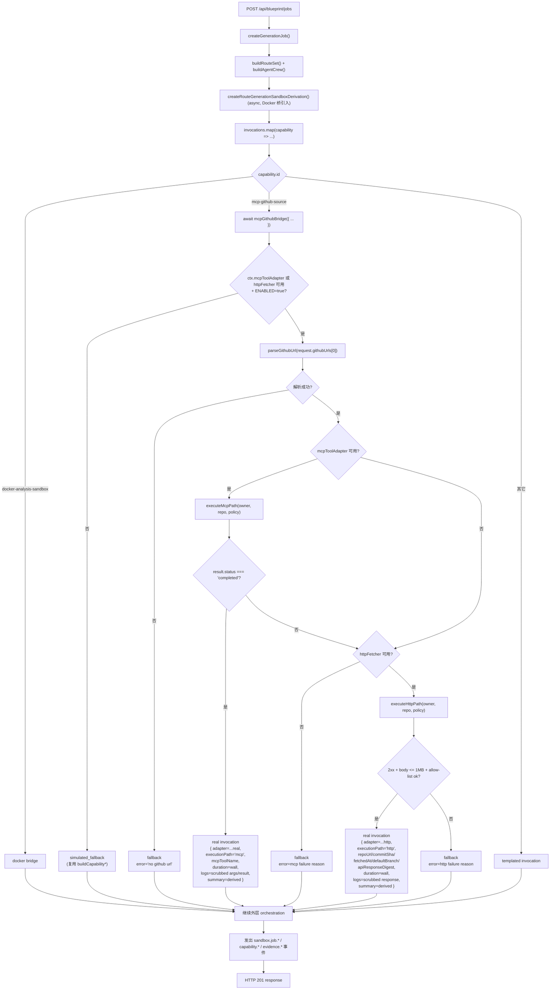
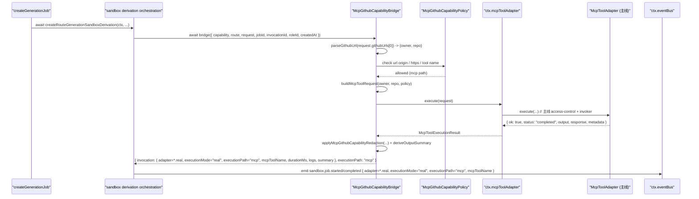
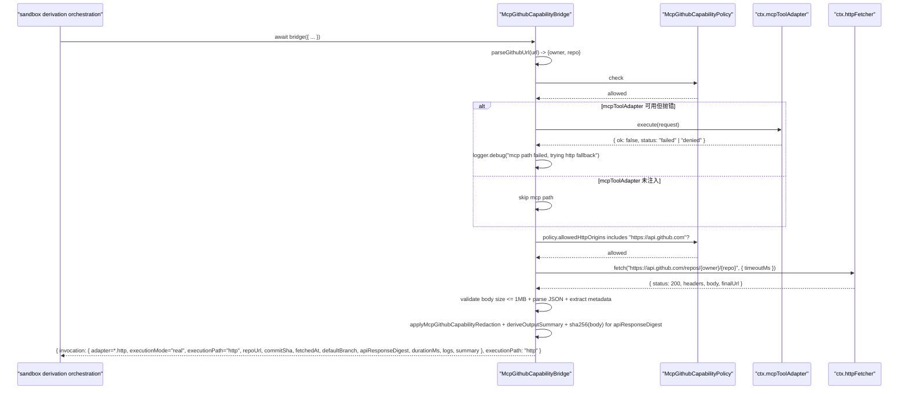
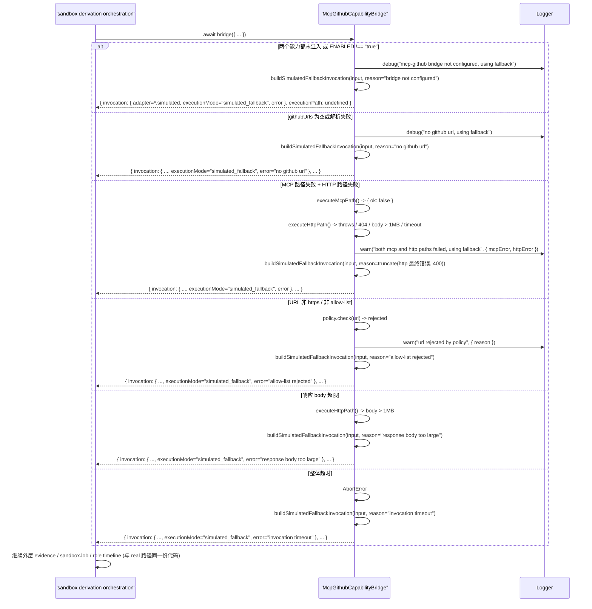

# 设计文档：Autopilot Capability Bridge — MCP GitHub Source

## 1. 设计概述

本 spec 把 `/autopilot` 沙箱派生管线中 `mcp-github-source` capability 的执行路径从模板化（`buildCapabilityOutputSummary()` / `buildCapabilityInvocationLogs()` / `deterministicCapabilityDuration()`）升级为通过 `BlueprintServiceContext` 注入的 **MCP 适配器**（复用主线 `McpToolAdapter.execute(request)` 能力）或 **HTTP fetcher**（对 `https://api.github.com/repos/{owner}/{repo}` 发起 HTTPS GET），形成"MCP 真跑 → HTTP 真跑 → 模板化回退"三档降级；任一档均保持既有 47 条 E2E + 48 条子域单测在默认装配（MCP 与 HTTP 均未注入）下继续通过。

本 spec 与姊妹 spec `autopilot-capability-bridge-docker` 严格对齐：

- 工厂签名：`createMcpGithubCapabilityBridge(ctx: BlueprintServiceContext)`
- `BlueprintServiceContext` 扩展方式：新增可选字段（`mcpToolAdapter?` / `httpFetcher?` / `mcpGithubCapabilityPolicy?` / `mcpGithubCapabilityBridge?`），均不改变 `buildBlueprintServiceContext()` 既有行为
- `invocationId` 由外层 `createRouteGenerationSandboxDerivation()` 生成并作为参数传入；real / fallback 两条路径共享同一 id，外层 evidence aggregation 一行不改
- Fallback 路径完全复用现有 helper，输出结构与今天 simulated 产出字段级等价
- 新 provenance 字段追加到 `shared/blueprint/contracts.ts`，Docker spec 已追加的 `executionMode` / `error` 字段直接复用；本 spec 只新增 mcp / http 专属可选字段 `repoUrl` / `commitSha` / `fetchedAt` / `defaultBranch` / `apiResponseDigest` / `mcpToolName`
- 落点目录：`server/routes/blueprint/mcp-github-source/`
- 测试策略：+3 E2E（MCP real、HTTP real、fallback）+ 多条 co-located 单测，**禁止 PBT**（需求 9.3 明确锁定）
- 环境变量门禁：`BLUEPRINT_MCP_CAPABILITY_BRIDGE_ENABLED=true`（对齐 Docker 桥的 `BLUEPRINT_DOCKER_CAPABILITY_BRIDGE_ENABLED`）

最低可接受交付：

- 注入可用的 `mcpToolAdapter`：`mcp-github-source` invocation 的 `adapter === "blueprint.runtime.mcp.github.real"`、`provenance.executionMode === "real"`、`provenance.mcpToolName` 填充，`durationMs` 为真实墙钟毫秒，`logs` 来自脱敏后的 MCP 工具 args / result，`outputSummary` 由 MCP 工具 result 派生
- MCP 适配器未注入或抛错但 `httpFetcher` 可用且命中 allow-list：降级到 HTTP 路径，`adapter === "blueprint.runtime.mcp.github.http"`、`executionMode === "real"`、`provenance.repoUrl / commitSha / fetchedAt / defaultBranch / apiResponseDigest` 填充，`outputSummary` 由仓库元数据派生
- 两条 real 路径均不可用 / `githubUrls` 为空 / URL 解析失败 / allow-list 拒绝 / body 超限 / 超时：fallback 到模板化产出，`adapter === "blueprint.runtime.mcp.github.simulated"`、`executionMode === "simulated_fallback"`、`provenance.error` 填入脱敏后的原因摘要；其它外层字段形态与今天 simulated 产出等价

本 spec 的狭窄范围：

- 仅改造 `createRouteGenerationSandboxDerivation()` 中 `mcp-github-source` 这一个 capability 的 adapter 实现，其它 3 个 capability（`docker-analysis-sandbox` / `aigc-spec-node` / `role-system-architecture`）由姊妹 spec 或独立 spec 推进
- 不修改 `buildRouteSet()`、SPEC Tree、SPEC Documents、Effect Preview、Prompt Package、Engineering Handoff 任一阶段
- 不修改 `McpToolAdapter` 内部实现（只消费其 `execute(request)` 接口）
- 不新增 `/api/mcp/*` 路由、不新增 `POST /api/blueprint/jobs` 请求 / 响应字段
- 不修改既有 47 条 E2E 与 48 条子域单测的任一断言，本 spec 只新增用例

## 2. 架构决策（Key Decisions）

本 spec 的 D1-D10 与姊妹 Docker 桥 design 的 D1-D10 在同一坐标系下讨论；相同处复用结论，差异处明确说明。

### D1：工厂模式 `createMcpGithubCapabilityBridge(ctx)`

与 Docker 桥 D1 一致，采用 DI 工厂模式：

```ts
export function createMcpGithubCapabilityBridge(
  ctx: BlueprintServiceContext
): McpGithubCapabilityBridge;
```

工厂只接收 `BlueprintServiceContext`，从中读取 `ctx.mcpToolAdapter` / `ctx.httpFetcher` / `ctx.mcpGithubCapabilityPolicy` / `ctx.logger` / `ctx.now`。返回的 bridge 是一个纯异步函数 `(input) => Promise<McpGithubCapabilityBridgeOutput>`，便于在测试中注入 fake 适配器短路 MCP / HTTP。

**硬约束**（与 Docker 桥同款 code-review 规则）：

- bridge 实现文件 SHALL NOT `import` `server/tool/api/mcp-tool-adapter.ts` 的 `McpToolAdapter` / `InternalMcpToolInvoker` 类或单例
- bridge 实现文件 SHALL NOT `new McpToolAdapter(...)` 自行装配
- bridge 实现文件 SHALL NOT 调用模块级 `fetch()`、`import` `undici` / `node-fetch` / `got` 等 HTTP 客户端单例
- 所有 MCP / HTTP 能力必须来自 `ctx` 上注入的显式字段

**与 Docker 桥 D1 的差异**：本 spec 有两条 real 实现路径（MCP 优先 + HTTP 降级），而 Docker 桥只有 ExecutorClient 一条。因此本 spec 的 bridge 内部包含两次尝试 + 一次回退的三段式决策（见 D3）。

### D2：`BlueprintServiceContext` 扩展（两种能力均为可选）

新增可选字段到 `BlueprintServiceContext` 与 `BlueprintServiceContextDeps`：

```ts
export interface BlueprintServiceContext {
  // ...既有字段...
  /** MCP 工具执行入口；主线由 server/index.ts 装配为复用 McpToolAdapter 实例的 thin wrapper */
  mcpToolAdapter?: McpToolAdapterDependency;
  /** HTTPS GET 专用的薄 fetcher；未注入时 bridge 不直接使用全局 fetch */
  httpFetcher?: BlueprintHttpFetcher;
  /** 本桥安全策略；未注入时使用 createDefaultMcpGithubCapabilityPolicy() */
  mcpGithubCapabilityPolicy?: McpGithubCapabilityPolicy;
  /** 本桥实例本身；便于测试完全注入 */
  mcpGithubCapabilityBridge?: McpGithubCapabilityBridge;
}
```

两个能力的最小接口形状：

```ts
/**
 * MCP 工具执行入口。签名仅暴露 `execute(request) => Promise<result>`，
 * 与主线 `McpToolAdapter.execute` 完全兼容；bridge 只消费 result 的最小字段（`ok`、`output`、`response`、`status`、`error`、`metadata`）。
 */
export interface McpToolAdapterDependency {
  execute(
    request: McpToolExecutionRequest
  ): Promise<McpToolExecutionResult>;
}

/**
 * HTTPS GET 专用 fetcher。故意不暴露 body / method / credentials，
 * 避免把本桥变成通用 HTTP 客户端。
 */
export interface BlueprintHttpFetcher {
  fetch(
    url: string,
    options?: {
      /** 请求级超时；bridge 传入 policy.maxFetchTimeoutMs */
      timeoutMs?: number;
      /** 脱敏后的请求头（default: {"Accept": "application/vnd.github+json", "User-Agent": "blueprint-mcp-github-bridge/1.0"}） */
      headers?: Record<string, string>;
      /** AbortSignal：允许外层取消 */
      signal?: AbortSignal;
    }
  ): Promise<BlueprintHttpResponse>;
}

export interface BlueprintHttpResponse {
  status: number;
  statusText?: string;
  /** 头部 map；值不保留原始 Set-Cookie 等潜在敏感字段 */
  headers: Record<string, string>;
  /** 响应 body 原文；fetcher 内部 SHALL 拒绝超过 policy.maxResponseBodyBytes 的响应并抛 McpGithubFetcherError */
  body: string;
  /** 真实访问的最终 URL（redirect 之后） */
  finalUrl: string;
}
```

**默认装配策略**（与 Docker 桥 D2 对齐）：

- 未注入 `mcpToolAdapter` 且未注入 `httpFetcher` 且环境变量 `BLUEPRINT_MCP_CAPABILITY_BRIDGE_ENABLED !== "true"` → bridge 直接 fallback，不记录 warn（debug 级别）
- 注入任一字段或环境变量为 `"true"` → 进入 real 路径尝试；若 MCP 适配器可用则先试 MCP，再试 HTTP
- `server/index.ts` 主线装配时：若环境变量为 `"true"`，把现有 `mcpToolAdapter` 实例（`server/index.ts` 已装配的 `McpToolAdapter`，对应 `/api/mcp` 主线执行入口）传入 `buildBlueprintServiceContext`；HTTP fetcher 可选装配为 `createDefaultBlueprintHttpFetcher()`（基于 `undici.fetch` 的薄包装，实现在 `server/routes/blueprint/mcp-github-source/http-fetcher.ts`，仅由主线 composition root 装配）

**未注入 `mcpGithubCapabilityPolicy`** 时使用 `createDefaultMcpGithubCapabilityPolicy()`（见 §4.3）。

### D3：三段式降级策略（MCP 优先 → HTTP 降级 → 模板化回退）

**决策**：采用需求 2.2 列出的选项 (c) 三段式，不是纯 MCP 也不是纯 HTTP。

**论据**：

1. 需求 2.2 允许三种实现；三段式最贴近需求 4.6"中间成功降级不留 error 噪音"的语义
2. V1 阶段主仓的 MCP 工具目录中是否存在一个"github 仓库检查"工具不可知；若只选 MCP 路径，未注册 GitHub 工具时整条 real 路径会永久退化到 fallback。三段式让 HTTP 路径成为"MCP 工具目录尚未就绪"时的 V1 可用 real 路径
3. MCP 路径复用主线权限 / 审计 / 治理链路，长期应是首选；HTTP 路径是"轻量 V1 启动"与"当 MCP 工具暂不可用"的备用
4. 两条路径都走相同的 policy 校验、相同的 allow-list、相同的脱敏管道，只有出口（MCP `execute` vs HTTP GET）不同

**降级触发条件**：

| 阶段 | 进入条件 | 降级到下一档的触发 |
| --- | --- | --- |
| MCP 真跑 | `ctx.mcpToolAdapter` 已注入 且 `policy.mcpToolName` 已配置 | MCP 工具不可达 / 超时 / 抛异常 / result.status 为 `"failed"` / `"denied"` / `"approval_required"` |
| HTTP 真跑 | `ctx.httpFetcher` 已注入 且 `githubUrls[0]` 能解析 且 URL 命中 allow-list | HTTP fetcher 抛错 / 响应非 2xx / response body > 1MB / URL 非 https / URL 非 allow-list 内 |
| 模板化 fallback | 前两档均不可用或均失败 | （终点，不再降级） |

**中间成功降级语义**：

- MCP 成功 → 直接返回 real-MCP 结果，`provenance.error` 不填充
- MCP 失败 + HTTP 成功 → 返回 real-HTTP 结果，`provenance.error` 不填充；`ctx.logger.debug("mcp path failed, using http fallback", ...)` 记录降级（不刷 warn）
- MCP 失败 + HTTP 失败 → 进入 fallback，`provenance.error` 填入**最后一次**失败原因的脱敏摘要（例如 `"http fetch failed: 404 Not Found"`）；前一次 MCP 失败的原因合并到一条事件 log 但不进 provenance

**差异说明（与 Docker 桥 D4）**：Docker 桥只有一档 real + 一次 dispatch 重试；本 spec 有两档 real + 每档内部不再做重试（MCP adapter 内部若有重试语义由主线 `McpToolAdapter` 消费；HTTP fetcher 的失败直接算失败，留给三段式整体降级）。

### D4：替换点在 invocation 层，不改外层 orchestration

与 Docker 桥 D3 完全对齐。`createRouteGenerationSandboxDerivation()` 的 `invocations.map(...)` 循环（`server/routes/blueprint.ts` 第 2915-2969 行）是今天 capability invocation 的生产点。本 spec 在该循环内部，仅针对 `capability.id === "mcp-github-source"` 的迭代改为 `await bridge({ capability, route, request, routeSet, createdAt, jobId, invocationId, roleId })`；其它 capability 保持今天的模板化代码原样。

**关键点**：`createRouteGenerationSandboxDerivation()` 已由 Docker 桥 spec 改为 `async`，本 spec 只新增一个 `capability.id === "mcp-github-source"` 的分支 + 对 bridge 的 `await`，**不重构调用链**。

**adapter 字段分流**：`getDefaultRuntimeCapabilities()` 返回的 `mcp-github-source` capability 仍保持 `adapter === "blueprint.runtime.mcp.github.simulated"`（作为 fallback 基线，不改）。real 路径下 bridge 返回 invocation 时，在外层 orchestration 处理事件 payload / evidence adapter 标识时，按 `provenance.executionMode` + bridge 返回的 `executionPath` 覆盖为 `"blueprint.runtime.mcp.github.real"`（MCP 路径）或 `"blueprint.runtime.mcp.github.http"`（HTTP 路径）。覆盖逻辑与 Docker 桥 §4.9 的"adapter 字段的 real/fallback 区分"完全同构，只是 real 值有两个候选而不是一个。

### D5：超时上限锁定为 30 秒

需求 2.4 要求"不大于 30 秒"，本 spec 将 **单次 capability 调用超时上限**锁定为 **30 秒**，通过环境变量 `BLUEPRINT_MCP_CAPABILITY_BRIDGE_TIMEOUT_MS` 可覆盖（默认 `30000`）。该上限统一约束 MCP 与 HTTP 两条路径：

- MCP 路径：`McpToolExecutionRequest.timeoutMs = policy.maxInvocationTimeoutMs - elapsed`（主线 `McpToolAdapter.execute` 接受 `timeoutMs` 字段并在内部强制）
- HTTP 路径：`httpFetcher.fetch(url, { timeoutMs: policy.maxInvocationTimeoutMs - elapsed })`
- 三段式总墙钟：`policy.maxInvocationTimeoutMs` 是 MCP + HTTP 两段的总上限；超过则进入 fallback 并填 `provenance.error = "invocation timeout"`

**与 Docker 桥 D5 的差异**：Docker 桥锁定 45s（容器启动 + HMAC 回调），本 spec 锁定 30s（两段轻量调用；MCP 工具内部 + 一次 GitHub API GET 不应超过这个量级）。

### D6：adapter 字符串锁定

与 Docker 桥 D6 对齐的 namespace 分离策略。本 spec 锁定 3 个 adapter 字符串：

| 路径 | adapter 字符串 | 对应 `provenance.executionMode` | 对应 `provenance.executionPath` |
| --- | --- | --- | --- |
| MCP 真跑 | `"blueprint.runtime.mcp.github.real"` | `"real"` | `"mcp"` |
| HTTP 真跑 | `"blueprint.runtime.mcp.github.http"` | `"real"` | `"http"` |
| 模板化回退 | `"blueprint.runtime.mcp.github.simulated"` | `"simulated_fallback"` | （未设置） |

**executionPath 字段的必要性**：

- `executionMode` 只能区分 `"real"` / `"simulated_fallback"`；当需求 9.1 要求断言 "MCP 路径 provenance 里见到 `mcpToolName`、HTTP 路径 provenance 里见到 `repoUrl`" 时，消费者可以通过 `executionPath` 精确判断
- adapter 字符串本身也能区分两条 real 路径，但 `executionPath` 是一个更短、更稳定的结构化字段，比较 string 时不需要关心后缀
- 既有 E2E 不断言 `executionPath`，新增不破坏

**与 Docker 桥 D6 的差异**：Docker 桥只有一条 real 路径，不需要 `executionPath`；本 spec 的三段式让 `executionPath` 成为必要的结构化补充。

**与 routeset spec 的 `generationSource` 命名口径对齐**：

| Spec | adapter / source | real 值 | fallback 值 | execution* 字段 |
| --- | --- | --- | --- | --- |
| routeset | `provenance.generationSource` | `"llm"` | `"llm_fallback"` | 无 |
| docker bridge | `BlueprintRuntimeCapability.adapter` + `provenance.executionMode` | `"blueprint.runtime.docker.lobster-executor"` + `"real"` | `"blueprint.runtime.docker.simulated"` + `"simulated_fallback"` | `executionMode` |
| mcp-github bridge（本 spec） | `BlueprintRuntimeCapability.adapter` + `provenance.executionMode` + `provenance.executionPath` | `"blueprint.runtime.mcp.github.real"` / `"blueprint.runtime.mcp.github.http"` + `"real"` + `"mcp"` / `"http"` | `"blueprint.runtime.mcp.github.simulated"` + `"simulated_fallback"` | `executionMode`、`executionPath` |

### D7：事件直接复用现有 `BlueprintEventName`

与 Docker 桥 D7 完全对齐。本 spec **不新增事件名**，只在既有 payload 上追加可选字段。

现有事件：`SandboxJobStarted` / `SandboxJobCompleted` / `SandboxJobFailed` / `CapabilityInvoked` / `CapabilityCompleted` / `CapabilityFailed` / `EvidenceRecorded`。

追加可选字段：

- `capability.invoked` / `capability.completed` / `sandbox.job.*` payload：追加 `executionMode`、`executionPath`（real 路径）、`repoUrl`（HTTP 路径）、`mcpToolName`（MCP 路径）、`error`（fallback 路径）
- 全部为可选字段，既有订阅者不会因追加而断言失败（需求 5.7）
- 所有事件 `type` 仍由 `BlueprintEventName` 常量构造（需求 5.6），实现文件 SHALL NOT 出现裸字符串 `"sandbox.job.started"` 等

### D8：Allow-list + 脱敏走 `createDefaultMcpGithubCapabilityPolicy()`

需求 7 要求明确 URL allow-list（仅 https、仅 `api.github.com`）、响应 body 上限（建议 1MB）、MCP 工具 args / result 与 HTTP 响应 body 的脱敏。本 spec 把这些统一到一个可注入的 `McpGithubCapabilityPolicy`（见 §4.3），由 `createDefaultMcpGithubCapabilityPolicy()` 提供默认值，通过 `ctx.mcpGithubCapabilityPolicy` 在测试中替换。

**默认值**（V1）：

```ts
{
  allowedHttpOrigins: ["https://api.github.com"],
  requireHttps: true,
  maxResponseBodyBytes: 1_048_576,        // 1MB
  maxInvocationTimeoutMs: 30_000,         // 30s（D5）
  mcpToolName: "github.get_repository",    // 锁定 MCP 工具约定（见 D9）
  mcpServerId: "github",
  maxLogLines: 50,
  maxLogBytes: 10_240,
  redactionKeywords: [
    "authorization",
    "x-github-token",
    "token",
    "api_key",
    "apikey",
    "secret",
    "password",
    "bearer",
    "access_token",
  ],
  redactedEmailPattern: /[\w.+-]+@[\w.-]+/g,
  redactedGithubPatPattern: /\b(gh[pousr]_[A-Za-z0-9]{36,255}|github_pat_[A-Za-z0-9_]{22,255})\b/g,
}
```

**脱敏策略**：

- `logs` / `outputSummary` / evidence `summary` 在写入前经过 `applyMcpGithubCapabilityRedaction(text, policy)` 过滤
- MCP 路径：对 `McpToolExecutionRequest.arguments` 做 key 级脱敏（`"token"` 等敏感 key 整值置 `"[redacted]"`），对 `McpToolExecutionResult.output` / `response` 做 value 级脱敏（regex 扫描 PAT / email）
- HTTP 路径：对请求头（Authorization 等）做整头剔除（bridge 不传认证头，见 §4.7），对响应 body 做 value 级脱敏
- 差异化说明：本 spec 与 Docker 桥 D9 都需要脱敏，但 Docker 桥依赖 executor 侧 `CredentialScrubber` 已有实现；本 spec 的桥接层需要自己实现轻量 `applyMcpGithubCapabilityRedaction` 纯函数，因为：
  1. MCP 工具 args / result 在 MCP 主线不会被自动脱敏（`McpToolAdapter.execute` 返回的 `response` 字段是原始 payload）
  2. HTTP 响应 body 是纯网络数据，不经过 executor 侧路径
  3. `services/lobster-executor/src/credential-scrubber.ts` 是 Docker 容器内的产物扫描工具，API 是 `scrubFile` / `scrubDirectory`，不直接适配内存 string 脱敏

**`applyMcpGithubCapabilityRedaction` 最小实现**：

```ts
export function applyMcpGithubCapabilityRedaction(
  value: string,
  policy: McpGithubCapabilityPolicy
): string {
  let result = value;
  // 1. GitHub PAT / fine-grained token
  result = result.replace(policy.redactedGithubPatPattern, "[redacted-github-token]");
  // 2. email
  result = result.replace(policy.redactedEmailPattern, "[redacted-email]");
  // 3. Authorization / Bearer / api_key / token= 等 key:value 对
  for (const keyword of policy.redactionKeywords) {
    const pattern = new RegExp(
      `(${escapeRegex(keyword)})\\s*[:=]\\s*"?[^"\\s,;]+"?`,
      "gi"
    );
    result = result.replace(pattern, `$1: [redacted]`);
  }
  return result;
}
```

本函数为纯函数、无副作用、无外部依赖，可以在 policy.test.ts 内单独覆盖。未来如果项目引入统一的 server 侧 `credential-scrubber`，本桥可以无缝切换到那个更强的实现（通过 `policy.redactor` 字段注入）。

### D9：MCP 工具名约定锁定为 `"github.get_repository"`

需求 2.2a 要求 design 从已注册 MCP 工具目录中挑选一个 GitHub 仓库检查工具并在 design 中明确工具名。

**决策**：`policy.mcpToolName` 默认值为 `"github.get_repository"`，`policy.mcpServerId` 默认值为 `"github"`。

**论据**：

1. V1 主仓尚未为 blueprint 特化注册 GitHub MCP 工具；但 MCP 工具目录的命名约定（见 `shared/mcp-*` 与 `server/permission/checkers/mcp-checker.ts`）是 `{serverId}.{toolName}` 或 `{serverId}/{toolName}` 形式
2. `github.get_repository` 与 GitHub 官方 GraphQL / REST 工具命名约定一致（`GET /repos/{owner}/{repo}` 对应），未来 MCP GitHub Connector 若登记则应采用此名
3. 即便 V1 尚未注册该工具，MCP 路径的调用会在主线 `McpToolAdapter.execute` 的 access-control 或 invoker 步骤失败，返回 `status: "failed"` 或 `"denied"`，自动触发 D3 的 MCP → HTTP 降级。这是三段式存在的核心理由

**可配置性**：`mcpToolName` / `mcpServerId` 在 policy 中暴露，测试可注入任意 tool name；生产侧部署时若 MCP 工具实际注册为 `github.inspect_repo` 等其它名字，运维通过环境变量 / policy 注入覆盖即可，无需重构 bridge。

**约束**：real-MCP 路径的 `MCPToolExecutionRequest` 字段填充（由 §4.6 明确）：

```ts
{
  serverId: policy.mcpServerId,              // "github"
  toolName: policy.mcpToolName,              // "github.get_repository"
  input: `Inspect GitHub repository ${owner}/${repo} for route ${route.id}.`,
  arguments: { owner, repo },                 // 从 parseGithubUrl 解析而来
  context: [],                                // V1 不携带 workflow context；未来可对接 agent crew timeline
  workflowId: undefined,                      // 非 mission runtime 上下文
  stage: "route_generation",                  // 对应 capability 的 stage
  metadata: {
    bridge: "blueprint-mcp-github-capability-bridge",
    invocationId: input.invocationId,
    jobId: input.jobId,
    routeId: input.route.id,
  },
  agentId: input.roleId,                      // role-runtime-executor
  token: undefined,                           // 不传 token；治理由 McpToolAdapter 侧 policy 决定
  timeoutMs: Math.min(policy.maxInvocationTimeoutMs, 30_000),
  requireApproval: false,                    // 默认不要求审批；若主线权限引擎返回 approval_required 会被三段式视为失败并降级
}
```

### D10：测试装配是否注入 `mcpToolAdapter` / `httpFetcher` 决定走哪一档

与 Docker 桥 D10 对齐的核心兼容性保证：**默认测试装配 ≡ 今天的生产行为**。

- 既有 47 条 E2E 不注入 `mcpToolAdapter` 也不注入 `httpFetcher` → bridge 检测到两条 real 路径都不可用 + 环境变量未设 → 直接走 `buildFallbackOutput()`，产出结构与今天 100% 一致
- 48 条子域单测与 9 条 SDK smoke 同理

## 3. High-Level Design（HLD）

### 3.1 系统数据流（Mermaid）



### 3.2 Happy path 时序图（MCP real execution）



### 3.3 Happy path 时序图（HTTP real execution，MCP 不可用时的降级）



### 3.4 Fallback 时序图



## 4. Low-Level Design（LLD）

### 4.1 文件布局

```
server/routes/blueprint/mcp-github-source/
  ├── bridge.ts                               # 新增：createMcpGithubCapabilityBridge(ctx) 工厂
  ├── bridge.test.ts                          # 新增：3+ co-located 单测
  ├── policy.ts                               # 新增：McpGithubCapabilityPolicy + createDefault + check/redact helper
  ├── policy.test.ts                          # 新增：allow-list / 脱敏 / redact 单测
  ├── url-parser.ts                           # 新增：parseGithubUrl() 纯函数
  ├── url-parser.test.ts                      # 新增：owner/repo 解析与边界用例
  ├── mcp-request.ts                          # 新增：buildMcpToolRequest(ownerRepo, policy, input) 纯函数
  ├── mcp-request.test.ts                     # 新增：字段填充与透传测试
  ├── http-fetcher.ts                         # 新增：createDefaultBlueprintHttpFetcher()（undici 薄包装）+ BlueprintHttpFetcher 类型导出
  ├── http-fetcher.test.ts                    # 新增：超时 / body size / https 断言测试
  ├── summary-derivation.ts                   # 新增：纯函数 deriveMcpOutputSummary / deriveHttpOutputSummary
  └── summary-derivation.test.ts              # 新增：真实 GitHub JSON shape → summary

server/routes/blueprint/context.ts            # 修改：
                                              #   - BlueprintServiceContext 追加:
                                              #       mcpToolAdapter?: McpToolAdapterDependency
                                              #       httpFetcher?: BlueprintHttpFetcher
                                              #       mcpGithubCapabilityPolicy?: McpGithubCapabilityPolicy
                                              #       mcpGithubCapabilityBridge?: McpGithubCapabilityBridge
                                              #   - BlueprintServiceContextDeps 追加同样字段
                                              #   - buildBlueprintServiceContext 默认装配 createMcpGithubCapabilityBridge(ctx)

server/routes/blueprint.ts                    # 修改（最小侵入）：
                                              #   - createRouteGenerationSandboxDerivation() 的 capability 分支
                                              #     新增 `capability.id === "mcp-github-source"` → await ctx.mcpGithubCapabilityBridge(...)
                                              #   - getDefaultRuntimeCapabilities() 中 mcp-github-source 的 adapter 字段保持
                                              #     "blueprint.runtime.mcp.github.simulated"（fallback 基线）
                                              #   - capability.invoked / capability.completed / sandbox.job.* 事件 payload 追加
                                              #     executionMode / executionPath / repoUrl / mcpToolName 可选字段
                                              #   - real 路径下 event payload 的 adapter 字符串按 executionPath 覆盖为
                                              #     "blueprint.runtime.mcp.github.real" / "blueprint.runtime.mcp.github.http"

server/index.ts                               # 修改:
                                              #   - 若环境变量 BLUEPRINT_MCP_CAPABILITY_BRIDGE_ENABLED === "true"
                                              #     把主线已装配的 mcpToolAdapter 实例传入 buildBlueprintServiceContext
                                              #   - 可选装配 createDefaultBlueprintHttpFetcher()
                                              #   - 不新增路由，不改动 /api/mcp

shared/blueprint/contracts.ts                 # 修改：
                                              #   - BlueprintCapabilityInvocation.provenance 追加可选:
                                              #       executionPath?: "mcp" | "http"
                                              #       repoUrl?: string
                                              #       commitSha?: string
                                              #       fetchedAt?: string
                                              #       defaultBranch?: string
                                              #       apiResponseDigest?: string
                                              #       mcpToolName?: string
                                              #     （executionMode / error 已由 Docker 桥追加，直接复用）
                                              #   - BlueprintCapabilityEvidence.provenance 追加同样可选字段

server/tests/blueprint-routes.test.ts         # 修改（只追加，不改写）：
                                              #   + 3 条新 E2E 用例：
                                              #     (a) Real-MCP path
                                              #     (b) Real-HTTP path
                                              #     (c) Fallback path
```

### 4.2 核心类型定义（`bridge.ts`）

```ts
import type { BlueprintServiceContext } from "../context.js";
import type {
  BlueprintCapabilityInvocation,
  BlueprintGenerationEvent,
  BlueprintGenerationRequest,
  BlueprintRouteCandidate,
  BlueprintRouteSet,
  BlueprintRuntimeCapability,
} from "../../../../shared/blueprint/index.js";

/**
 * bridge 的单次调用输入。调用方（createRouteGenerationSandboxDerivation）
 * 在已经选定 mcp-github-source capability 之后传入。
 * 字段集与 Docker 桥的 DockerCapabilityBridgeInput 完全对齐。
 */
export interface McpGithubCapabilityBridgeInput {
  capability: BlueprintRuntimeCapability;
  route: BlueprintRouteCandidate;
  jobId: string;
  request: BlueprintGenerationRequest;
  routeSet: BlueprintRouteSet;
  createdAt: string;
  /** 由调用方预先生成的 invocation id；bridge 在 real 与 fallback 路径下都使用这个 id */
  invocationId: string;
  /** 调用方已解析的 roleId（当前硬编码为 resolveRouteSandboxCapabilityRoleId 返回值） */
  roleId: string;
}

/**
 * bridge 的单次调用输出。
 */
export interface McpGithubCapabilityBridgeOutput {
  /** 一条可用的 invocation；外层 map 直接回填到 invocations 数组 */
  invocation: BlueprintCapabilityInvocation;
  /** 本次执行走的实际路径；供外层 event payload 决定 adapter 字符串 */
  executionPath?: "mcp" | "http";
  /** 可选：bridge 希望额外 emit 的事件（当前为空；预留未来 heartbeat） */
  additionalEvents: BlueprintGenerationEvent[];
}

export type McpGithubCapabilityBridge = (
  input: McpGithubCapabilityBridgeInput
) => Promise<McpGithubCapabilityBridgeOutput>;

export function createMcpGithubCapabilityBridge(
  ctx: BlueprintServiceContext
): McpGithubCapabilityBridge;
```

**关键设计点：`invocationId` 由调用方传入**

与 Docker 桥完全一致。外层 `createRouteGenerationSandboxDerivation()` 生成 invocation id，所有路径（MCP real / HTTP real / fallback）共享同一 id；这保证外层 `buildCapabilityEvidence({ invocation })` / sandbox job `invocationIds` 聚合 / capability event `invocationId` 字段不需要修改。

### 4.3 Policy 类型（`policy.ts`）

```ts
export interface McpGithubCapabilityPolicy {
  /** 允许发起 HTTP fetch 的源清单（精确前缀匹配） */
  allowedHttpOrigins: readonly string[];
  /** 是否强制 https；默认 true */
  requireHttps: boolean;
  /** HTTP 响应 body 字节上限 */
  maxResponseBodyBytes: number;
  /** 单次 capability 调用总上限（MCP + HTTP 两段的总墙钟） */
  maxInvocationTimeoutMs: number;
  /** MCP 路径调用的工具名（例如 "github.get_repository"） */
  mcpToolName: string;
  /** MCP 路径调用的 serverId（例如 "github"） */
  mcpServerId: string;
  /** invocation.logs 最大行数 */
  maxLogLines: number;
  /** invocation.logs 累计字节上限 */
  maxLogBytes: number;
  /** 脱敏：key 级敏感关键词（大小写不敏感） */
  redactionKeywords: readonly string[];
  /** 脱敏：email 匹配正则 */
  redactedEmailPattern: RegExp;
  /** 脱敏：GitHub PAT / fine-grained token 匹配正则 */
  redactedGithubPatPattern: RegExp;
}

export function createDefaultMcpGithubCapabilityPolicy(): McpGithubCapabilityPolicy;

export interface McpGithubCapabilityPolicyCheckResult {
  allowed: boolean;
  reason?: string;
}

/** 校验一个 URL 是否允许 fetch */
export function checkMcpGithubHttpPolicy(
  policy: McpGithubCapabilityPolicy,
  url: string
): McpGithubCapabilityPolicyCheckResult;

/** 脱敏字符串或结构化 JSON 的字符串表示 */
export function applyMcpGithubCapabilityRedaction(
  value: string,
  policy: McpGithubCapabilityPolicy
): string;

/** 从 MCP 调用 arguments 做 key 级整值脱敏 */
export function redactMcpArguments(
  args: Record<string, unknown>,
  policy: McpGithubCapabilityPolicy
): Record<string, unknown>;
```

**`checkMcpGithubHttpPolicy` 校验规则**：

| 场景 | 结果 |
| --- | --- |
| URL 无法 parse | `allowed: false`, `reason: "invalid url"` |
| `policy.requireHttps` 且 URL scheme 不是 `https:` | `allowed: false`, `reason: "https required"` |
| URL origin 不在 `policy.allowedHttpOrigins` | `allowed: false`, `reason: "allow-list rejected"` |
| 其它 | `allowed: true` |

**`checkMcpGithubHttpPolicy` 在 URL 解析前做的归一化**：

- 必须使用 `new URL(raw)` 解析，失败直接拒绝（避免相对 URL / 裸 hostname 混入）
- 归一化 origin 为 `{protocol}//{host}`（忽略端口差异时可由 policy 扩展，V1 不支持）
- allow-list 比较采用 `url.origin === allowedOrigin`，不允许 substring 前缀攻击

**`applyMcpGithubCapabilityRedaction` 行为**：见 D8。

**`redactMcpArguments` 行为**：

- 遍历 arguments 的浅层 key；若 key 命中 `redactionKeywords`（大小写不敏感），整值替换为 `"[redacted]"`
- 非敏感 key 的 value 原样保留；若 value 是 string 再走一次 `applyMcpGithubCapabilityRedaction`
- 不做深层嵌套扫描（V1 足够覆盖 `{owner, repo}` 平铺载荷场景；未来可扩展）

**为什么资源上限不由 bridge 校验 memory/cpu**：MCP 路径的资源由主线 `McpToolAdapter` + 权限引擎统一控制，bridge 不重叠；HTTP 路径只关心响应 body size（由 fetcher 强制，见 §4.8）。

### 4.4 URL 解析（`url-parser.ts`）

需求列出本 spec 特有的步骤：解析 `BlueprintGenerationRequest.githubUrls[0]` → `{owner, repo}`，并构造 REST API URL。单独抽纯函数方便测试与复用。

```ts
/**
 * 解析用户提供的 GitHub URL（形如 https://github.com/owner/repo / .../tree/main / .git 后缀）。
 * 解析失败返回 null；bridge 在 null 时走 fallback 并填 error="no github url"。
 */
export function parseGithubUrl(raw: string): { owner: string; repo: string } | null;

/**
 * 根据解析结果构造 REST API URL。
 * 默认 https://api.github.com/repos/{owner}/{repo}。
 */
export function buildGithubRepoApiUrl(
  ownerRepo: { owner: string; repo: string },
  options?: { apiBase?: string }
): string;
```

**`parseGithubUrl` 规则**：

1. 必须能被 `new URL(raw)` 解析
2. scheme 必须是 `https:` 或 `http:`（后者在 policy 校验阶段会被拒，但这里不做 scheme 检查，避免 url-parser 与 policy 职责耦合）
3. host 必须是 `github.com` 或 `www.github.com`
4. path segments 至少有 `[owner, repo]` 两段
5. `repo` 尾部去 `.git` 后缀（如果存在）
6. `owner` 不能是 `"orgs"` / `"marketplace"` / `"features"` 等 GitHub 系统入口（黑名单，V1 仅保留最基本的几个）
7. 任一规则不满足 → 返回 `null`

**`buildGithubRepoApiUrl` 规则**：

- 默认 apiBase 为 `"https://api.github.com"`（从 policy 读取时使用 `policy.allowedHttpOrigins[0]`，bridge 在调用此函数前应该 pass 一个 policy-agreed apiBase）
- 返回 `${apiBase}/repos/${encodeURIComponent(owner)}/${encodeURIComponent(repo)}`
- 虽然 GitHub owner / repo 名字不包含特殊字符，但 URL-encode 防御性更强，测试需覆盖 owner 含 `.` 等边界

### 4.5 MCP request 构造（`mcp-request.ts`）

```ts
import type { McpToolExecutionRequest } from "../../../tool/api/mcp-tool-adapter.js";
import type { McpGithubCapabilityBridgeInput } from "./bridge.js";
import type { McpGithubCapabilityPolicy } from "./policy.js";

export interface BuildMcpToolRequestInput {
  bridgeInput: McpGithubCapabilityBridgeInput;
  policy: McpGithubCapabilityPolicy;
  ownerRepo: { owner: string; repo: string };
  /** 剩余可用超时（policy.maxInvocationTimeoutMs - elapsed） */
  remainingTimeoutMs: number;
}

export function buildMcpToolRequest(
  input: BuildMcpToolRequestInput
): McpToolExecutionRequest;
```

**字段填充**：见 D9。

**关键约束**：

- `agentId: input.bridgeInput.roleId`（`"role-runtime-executor"`），让主线 `McpToolAdapter` 的 permission check / audit log 能归属到正确 agent
- `token: undefined`：bridge 不传任何认证令牌；GitHub API 可以匿名访问公开仓库（60 req/hour rate limit），私有仓库 V1 不支持。未来如需支持私有仓库，token 应通过 `ctx.mcpToolAdapter` 实现内部的凭证管理器注入，而不是在 bridge 这一层传递
- `timeoutMs`：传入剩余预算；主线 `McpToolAdapter` 在 `normalizeTimeoutMs` 中会 clamp 到 `[1, 120_000]` 范围

**为什么 arguments 只传 `{owner, repo}`**：符合 GitHub REST API `GET /repos/{owner}/{repo}` 的最小输入；MCP 工具若希望扩展可通过 `metadata` 字段传辅助信息；如果工具实际 schema 要求 `{repository: "owner/repo"}` 格式，由 policy 的未来扩展字段 `mcpToolArgumentsShape: "owner_repo_fields" | "repository_string"` 控制，V1 锁定前者。

### 4.6 HTTP fetch 构造（`http-fetcher.ts`）

```ts
export interface BlueprintHttpFetcher {
  fetch(
    url: string,
    options?: {
      timeoutMs?: number;
      headers?: Record<string, string>;
      signal?: AbortSignal;
    }
  ): Promise<BlueprintHttpResponse>;
}

export class McpGithubFetcherError extends Error {
  constructor(
    message: string,
    public readonly kind:
      | "timeout"
      | "network"
      | "non_2xx"
      | "body_too_large"
      | "invalid_url"
  ) {
    super(message);
    this.name = "McpGithubFetcherError";
  }
}

export interface CreateDefaultBlueprintHttpFetcherOptions {
  /** 默认最大 body 字节数；bridge 传入 policy.maxResponseBodyBytes */
  maxResponseBodyBytes: number;
  /** 默认超时；bridge 在每次 fetch 传入 remainingTimeoutMs */
  defaultTimeoutMs: number;
}

/**
 * 默认 fetcher：基于 undici.fetch 的薄包装。
 * - 强制 https（如果 URL 不是 https 直接抛 invalid_url）
 * - AbortController 注入
 * - 响应 body 按 chunked 读取，累计字节超过 maxResponseBodyBytes 立即 abort 并抛 body_too_large
 * - HTTP status 非 2xx 抛 non_2xx
 * - 网络错误抛 network
 * - 超时抛 timeout
 */
export function createDefaultBlueprintHttpFetcher(
  options: CreateDefaultBlueprintHttpFetcherOptions
): BlueprintHttpFetcher;
```

**实现要点**：

- `http-fetcher.ts` 内部 `import { fetch } from "undici"`；**这是整个 bridge 代码树里唯一允许 import HTTP 客户端的文件**，符合需求 6.2 的禁止约束（bridge.ts 本身仍然不 import）
- 这也意味着 fetcher 的装配位置在 `server/index.ts`（composition root）或测试的 `buildBlueprintServiceContext({ httpFetcher: ... })`，而 bridge.ts 只消费 `BlueprintHttpFetcher` 接口
- 响应 body 流式读取：使用 `response.body` 的 ReadableStream 累计 chunk size，超过阈值立即 `controller.abort()` 并释放 reader，避免一次性把 >1MB 的 body 全部装入内存再检查
- `finalUrl` 取 `response.url`（`undici` / `fetch` 标准行为，redirect 后的最终 URL）
- **不 follow 非 https redirect**：`redirect: "follow"` + 在 response 收到后再次校验 `new URL(response.url).protocol === "https:"`；如非 https 抛 invalid_url
- **headers**：bridge 调用时传入 `{"Accept": "application/vnd.github+json", "User-Agent": "blueprint-mcp-github-bridge/1.0"}`；**不传 Authorization / Cookie 等任何敏感头**；fetcher 内部白名单的请求 header key（避免误传 cookie）

### 4.7 Summary 派生（`summary-derivation.ts`）

```ts
import type { McpToolExecutionResult } from "../../../tool/api/mcp-tool-adapter.js";
import type { McpGithubCapabilityPolicy } from "./policy.js";

export interface GithubRepoMetadata {
  name?: string;
  fullName?: string;
  description?: string;
  language?: string;
  defaultBranch?: string;
  stargazersCount?: number;
  pushedAt?: string;
  htmlUrl?: string;
  visibility?: string;
}

/** 从 GitHub REST API /repos/{owner}/{repo} 的 JSON body 中提取元数据 */
export function extractGithubMetadataFromJson(
  body: string
): GithubRepoMetadata | null;

/** 从 MCP 工具 result 中提取元数据（result 结构期望与 REST API 对齐） */
export function extractGithubMetadataFromMcpResult(
  result: McpToolExecutionResult
): GithubRepoMetadata | null;

/** 基于元数据生成对用户可见的 outputSummary */
export function deriveGithubOutputSummary(
  metadata: GithubRepoMetadata,
  policy: McpGithubCapabilityPolicy
): string;

/** 对 response body 计算 sha-256 digest（用作 apiResponseDigest） */
export function sha256Digest(text: string): string;
```

**`deriveGithubOutputSummary` 模板**（需求 3.3 给出的示例）：

```
repo {fullName} · {language ?? "unknown"} · {stargazersCount ?? 0}★ · default branch {defaultBranch ?? "main"} · last pushed {pushedAt ?? "unknown"}
```

派生后的 summary 再经过 `applyMcpGithubCapabilityRedaction(summary, policy)` 二次脱敏（保险）；但由于元数据字段已在 `extractGithubMetadataFromJson` 阶段只取白名单字段（不取 `owner.email` 等敏感字段），通常不会触发 redaction。

**`extractGithubMetadataFromMcpResult` 容错策略**：

- MCP 工具的 result shape 由工具自行定义；本 bridge 无法预知所有变体
- 首次尝试：`result.response` 若是对象且包含 GitHub REST API 风格字段（`name` / `full_name` / `default_branch` / `stargazers_count` / `pushed_at` / `html_url` / `visibility` / `language`），直接映射
- 降级 1：`result.response` 是 string → 视为 JSON 尝试 `JSON.parse` → 映射
- 降级 2：`result.output` 是 string → 同上
- 降级 3：都失败 → 返回 `null`；bridge 视为"MCP path succeeded but metadata unrecognized"，仍然走 real-MCP 路径，但 `outputSummary` 回退到一个更中性的字符串：`"GitHub repository inspected via MCP tool {toolName}; metadata shape unrecognized."`，并填入 `provenance.mcpToolName` 但不填 `repoUrl` / `commitSha` / `defaultBranch`

**`commitSha` 的来源**：

- GitHub REST `/repos/{owner}/{repo}` 响应本身不直接包含最近一次 commit SHA；若需要真实 SHA，需要额外调用 `GET /repos/{owner}/{repo}/branches/{defaultBranch}` 或 `GET /repos/{owner}/{repo}/commits/{defaultBranch}`
- V1 不做第二次 fetch（会把 30s 上限压更紧、把 1MB 上限算两次、测试场景增多）；`commitSha` 字段的来源约定为：
  1. MCP 工具 result 如果主动返回 `commit_sha` / `latest_commit_sha` 字段 → 填入
  2. HTTP 路径：从响应头 `etag` 推导，GitHub REST 的 ETag 通常形如 `"W/\"<sha1>\""`；提取 sha1 填入 `commitSha`（最稳定的 V1 策略）
  3. 都没有 → 字段保持 `undefined`
- 未来可独立 spec 升级为"第二次 fetch 最近 commit"

### 4.8 Bridge 主算法（伪代码）

```ts
export function createMcpGithubCapabilityBridge(
  ctx: BlueprintServiceContext
): McpGithubCapabilityBridge {
  const policy = ctx.mcpGithubCapabilityPolicy ?? createDefaultMcpGithubCapabilityPolicy();

  return async function bridge(input): Promise<McpGithubCapabilityBridgeOutput> {
    const enabled = process.env.BLUEPRINT_MCP_CAPABILITY_BRIDGE_ENABLED === "true";
    const mcpAdapter = ctx.mcpToolAdapter;
    const httpFetcher = ctx.httpFetcher;

    // 1. 早退：bridge 未启用
    if (!enabled || (!mcpAdapter && !httpFetcher)) {
      return buildFallbackOutput(input, { reason: "bridge not configured" });
    }

    // 2. URL 解析
    const firstUrl = input.request.githubUrls?.[0];
    if (!firstUrl) {
      return buildFallbackOutput(input, { reason: "no github url" });
    }
    const ownerRepo = parseGithubUrl(firstUrl);
    if (!ownerRepo) {
      return buildFallbackOutput(input, { reason: "no github url" });
    }

    // 3. 建立整体超时预算
    const startedAt = ctx.now();
    const deadline = startedAt.getTime() + policy.maxInvocationTimeoutMs;
    const remainingMs = () => Math.max(0, deadline - ctx.now().getTime());
    let mcpError: string | undefined;

    // 4. MCP 路径（如果可用）
    if (mcpAdapter) {
      try {
        const mcpRequest = buildMcpToolRequest({
          bridgeInput: input,
          policy,
          ownerRepo,
          remainingTimeoutMs: Math.min(remainingMs(), policy.maxInvocationTimeoutMs),
        });
        const mcpResult = await mcpAdapter.execute(mcpRequest);
        if (mcpResult.status === "completed" && mcpResult.ok) {
          const elapsed = ctx.now().getTime() - startedAt.getTime();
          return buildRealMcpOutput({ input, policy, ownerRepo, mcpResult, durationMs: elapsed });
        }
        mcpError = `mcp status=${mcpResult.status}${mcpResult.error ? `: ${mcpResult.error}` : ""}`;
        ctx.logger.debug("mcp-github bridge: mcp path non-success, trying http fallback", {
          status: mcpResult.status,
          error: mcpResult.error,
        });
      } catch (error) {
        mcpError = `mcp threw: ${errorMessage(error)}`;
        ctx.logger.debug("mcp-github bridge: mcp path threw, trying http fallback", {
          error: errorMessage(error),
        });
      }
    }

    // 5. 检查预算
    if (remainingMs() <= 0) {
      return buildFallbackOutput(input, {
        reason: truncate(`invocation timeout${mcpError ? ` after ${mcpError}` : ""}`, 400),
      });
    }

    // 6. HTTP 路径（如果 fetcher 可用）
    if (httpFetcher) {
      const apiUrl = buildGithubRepoApiUrl(ownerRepo, {
        apiBase: policy.allowedHttpOrigins[0],
      });
      const policyCheck = checkMcpGithubHttpPolicy(policy, apiUrl);
      if (!policyCheck.allowed) {
        ctx.logger.warn("mcp-github bridge: http url rejected by policy, using fallback", {
          reason: policyCheck.reason,
        });
        return buildFallbackOutput(input, {
          reason: policyCheck.reason ?? "allow-list rejected",
        });
      }
      try {
        const httpResponse = await httpFetcher.fetch(apiUrl, {
          timeoutMs: remainingMs(),
          headers: {
            Accept: "application/vnd.github+json",
            "User-Agent": "blueprint-mcp-github-bridge/1.0",
          },
        });
        const elapsed = ctx.now().getTime() - startedAt.getTime();
        return buildRealHttpOutput({
          input,
          policy,
          ownerRepo,
          apiUrl,
          httpResponse,
          durationMs: elapsed,
        });
      } catch (error) {
        ctx.logger.warn("mcp-github bridge: http path failed, using fallback", {
          mcpError,
          httpError: errorMessage(error),
        });
        const combined = mcpError
          ? `http: ${errorMessage(error)}; mcp: ${mcpError}`
          : `http: ${errorMessage(error)}`;
        return buildFallbackOutput(input, { reason: truncate(combined, 400) });
      }
    }

    // 7. 两条路径都没跑到成功
    return buildFallbackOutput(input, {
      reason: truncate(mcpError ?? "no real path available", 400),
    });
  };
}
```

### 4.9 Real 路径字段填充

#### 4.9.1 `buildRealMcpOutput()`

```ts
function buildRealMcpOutput(args: {
  input: McpGithubCapabilityBridgeInput;
  policy: McpGithubCapabilityPolicy;
  ownerRepo: { owner: string; repo: string };
  mcpResult: McpToolExecutionResult;
  durationMs: number;
}): McpGithubCapabilityBridgeOutput {
  const { input, policy, ownerRepo, mcpResult, durationMs } = args;
  const metadata = extractGithubMetadataFromMcpResult(mcpResult);
  const summary = metadata
    ? applyMcpGithubCapabilityRedaction(deriveGithubOutputSummary(metadata, policy), policy)
    : `GitHub repository ${ownerRepo.owner}/${ownerRepo.repo} inspected via MCP tool ${policy.mcpToolName}; metadata shape unrecognized.`;
  const logs = buildMcpPathLogs({ mcpResult, policy });
  const commitSha = typeof (mcpResult.response as any)?.commit_sha === "string"
    ? (mcpResult.response as any).commit_sha
    : typeof (mcpResult.response as any)?.latest_commit_sha === "string"
    ? (mcpResult.response as any).latest_commit_sha
    : undefined;

  return {
    executionPath: "mcp",
    additionalEvents: [],
    invocation: {
      id: input.invocationId,
      jobId: input.jobId,
      capabilityId: input.capability.id,
      roleId: input.roleId,
      capabilityLabel: input.capability.label,
      kind: input.capability.kind,
      status: "completed",
      securityLevel: input.capability.securityLevel,
      safetyGate: {
        status: "allowed",
        reason: `${input.capability.label} approved for real MCP execution via ${policy.mcpToolName}.`,
        requiresApproval: input.capability.requiresApproval,
        approved: input.capability.requiresApproval,
        securityLevel: input.capability.securityLevel,
      },
      requestedAt: input.createdAt,
      completedAt: new Date().toISOString(),
      requestedBy: "mcp-github-capability-bridge",
      routeId: input.route.id,
      input: `Derive route candidate ${input.route.title} with ${input.capability.label}.`,
      outputSummary: summary,
      logs,
      evidenceIds: [],
      durationMs,
      provenance: {
        jobId: input.jobId,
        projectId: input.request.projectId,
        sourceId: input.request.sourceId,
        routeSetId: input.routeSet.id,
        routeId: input.route.id,
        roleId: input.roleId,
        targetText: input.request.targetText,
        githubUrls: input.request.githubUrls ?? [],
        // —— 新增 provenance 字段 ——
        executionMode: "real",
        executionPath: "mcp",
        repoUrl: `https://github.com/${ownerRepo.owner}/${ownerRepo.repo}`,
        commitSha,
        fetchedAt: new Date().toISOString(),
        defaultBranch: metadata?.defaultBranch,
        apiResponseDigest: undefined, // MCP 路径 V1 不计算（result shape 不稳定）
        mcpToolName: policy.mcpToolName,
      },
    },
  };
}

function buildMcpPathLogs(args: {
  mcpResult: McpToolExecutionResult;
  policy: McpGithubCapabilityPolicy;
}): string[] {
  const { mcpResult, policy } = args;
  const scrubbedOutput = applyMcpGithubCapabilityRedaction(
    mcpResult.output ?? "",
    policy
  );
  return truncateLogs(
    [
      `tool=${mcpResult.metadata.serverId}/${mcpResult.metadata.toolName}`,
      `status=${mcpResult.status}`,
      `timeoutMs=${mcpResult.metadata.timeoutMs}`,
      `output=${scrubbedOutput.slice(0, 400)}`,
    ],
    policy.maxLogLines,
    policy.maxLogBytes
  );
}
```

#### 4.9.2 `buildRealHttpOutput()`

```ts
function buildRealHttpOutput(args: {
  input: McpGithubCapabilityBridgeInput;
  policy: McpGithubCapabilityPolicy;
  ownerRepo: { owner: string; repo: string };
  apiUrl: string;
  httpResponse: BlueprintHttpResponse;
  durationMs: number;
}): McpGithubCapabilityBridgeOutput {
  const { input, policy, ownerRepo, apiUrl, httpResponse, durationMs } = args;
  const metadata = extractGithubMetadataFromJson(httpResponse.body);
  const summary = metadata
    ? applyMcpGithubCapabilityRedaction(deriveGithubOutputSummary(metadata, policy), policy)
    : `GitHub repository ${ownerRepo.owner}/${ownerRepo.repo} fetched via HTTP; JSON shape unrecognized.`;
  const digest = sha256Digest(httpResponse.body);
  const etagCommitSha = extractCommitShaFromEtag(httpResponse.headers.etag);
  const logs = buildHttpPathLogs({ apiUrl, httpResponse, policy });

  return {
    executionPath: "http",
    additionalEvents: [],
    invocation: {
      id: input.invocationId,
      jobId: input.jobId,
      capabilityId: input.capability.id,
      roleId: input.roleId,
      capabilityLabel: input.capability.label,
      kind: input.capability.kind,
      status: "completed",
      securityLevel: input.capability.securityLevel,
      safetyGate: {
        status: "allowed",
        reason: `${input.capability.label} approved for real HTTP execution via GitHub REST API.`,
        requiresApproval: input.capability.requiresApproval,
        approved: input.capability.requiresApproval,
        securityLevel: input.capability.securityLevel,
      },
      requestedAt: input.createdAt,
      completedAt: new Date().toISOString(),
      requestedBy: "mcp-github-capability-bridge",
      routeId: input.route.id,
      input: `Derive route candidate ${input.route.title} with ${input.capability.label}.`,
      outputSummary: summary,
      logs,
      evidenceIds: [],
      durationMs,
      provenance: {
        jobId: input.jobId,
        projectId: input.request.projectId,
        sourceId: input.request.sourceId,
        routeSetId: input.routeSet.id,
        routeId: input.route.id,
        roleId: input.roleId,
        targetText: input.request.targetText,
        githubUrls: input.request.githubUrls ?? [],
        // —— 新增 provenance 字段 ——
        executionMode: "real",
        executionPath: "http",
        repoUrl: `https://github.com/${ownerRepo.owner}/${ownerRepo.repo}`,
        commitSha: etagCommitSha,
        fetchedAt: new Date().toISOString(),
        defaultBranch: metadata?.defaultBranch,
        apiResponseDigest: digest,
        mcpToolName: undefined,
      },
    },
  };
}

function buildHttpPathLogs(args: {
  apiUrl: string;
  httpResponse: BlueprintHttpResponse;
  policy: McpGithubCapabilityPolicy;
}): string[] {
  const { apiUrl, httpResponse, policy } = args;
  const scrubbedBody = applyMcpGithubCapabilityRedaction(
    httpResponse.body.slice(0, 1024),
    policy
  );
  return truncateLogs(
    [
      `method=GET`,
      `url=${apiUrl}`,
      `status=${httpResponse.status}`,
      `content-type=${httpResponse.headers["content-type"] ?? "unknown"}`,
      `body=${scrubbedBody}`,
    ],
    policy.maxLogLines,
    policy.maxLogBytes
  );
}
```

**关键约束**（两条 real 路径共同遵守）：

- invocation 的 `id` / `jobId` / `capabilityId` / `roleId` / `capabilityLabel` / `kind` / `securityLevel` / `routeId` / `evidenceIds` / `requestedAt` / `input` 与今天 simulated 路径等价，外层断言不需改
- `adapter` 字段挂在 `BlueprintRuntimeCapability.adapter` 而不是 invocation 自身；real 路径下外层 `createRouteGenerationSandboxDerivation()` 根据 bridge 返回的 `executionPath` 覆盖：

```ts
// createRouteGenerationSandboxDerivation 的 mcp-github-source 分支后：
const mcpGithubAdapter =
  bridgeResult.executionPath === "mcp"
    ? "blueprint.runtime.mcp.github.real"
    : bridgeResult.executionPath === "http"
    ? "blueprint.runtime.mcp.github.http"
    : capability.adapter; // .simulated
// 在 sandbox.job.started/completed / capability.invoked/completed 事件 payload 中使用 mcpGithubAdapter
```

### 4.10 Fallback 路径字段填充（`buildFallbackOutput()`）

```ts
function buildFallbackOutput(
  input: McpGithubCapabilityBridgeInput,
  options: { reason: string }
): McpGithubCapabilityBridgeOutput {
  const invocationInput = `Derive route candidate ${input.route.title} with ${input.capability.label}.`;
  return {
    executionPath: undefined,
    additionalEvents: [],
    invocation: {
      id: input.invocationId,
      jobId: input.jobId,
      capabilityId: input.capability.id,
      roleId: input.roleId,
      capabilityLabel: input.capability.label,
      kind: input.capability.kind,
      status: "completed",
      securityLevel: input.capability.securityLevel,
      safetyGate: {
        status: "allowed",
        reason: `${input.capability.label} allowed for deterministic route generation sandbox derivation.`,
        requiresApproval: input.capability.requiresApproval,
        approved: input.capability.requiresApproval,
        securityLevel: input.capability.securityLevel,
      },
      requestedAt: input.createdAt,
      completedAt: input.createdAt,
      requestedBy: "route-generation-sandbox-derivation",
      routeId: input.route.id,
      input: invocationInput,
      outputSummary: buildCapabilityOutputSummary({
        capability: input.capability,
        routeTitle: input.route.title,
        input: invocationInput,
      }),
      logs: buildCapabilityInvocationLogs(
        input.capability,
        buildCapabilityOutputSummary({
          capability: input.capability,
          routeTitle: input.route.title,
          input: invocationInput,
        })
      ),
      evidenceIds: [],
      durationMs: deterministicCapabilityDuration(input.capability, {
        capabilityId: input.capability.id,
        roleId: input.roleId,
        routeId: input.route.id,
        input: invocationInput,
      }),
      provenance: {
        jobId: input.jobId,
        projectId: input.request.projectId,
        sourceId: input.request.sourceId,
        routeSetId: input.routeSet.id,
        routeId: input.route.id,
        roleId: input.roleId,
        targetText: input.request.targetText,
        githubUrls: input.request.githubUrls ?? [],
        // —— 新增 provenance 字段 ——
        executionMode: "simulated_fallback",
        executionPath: undefined,
        error: truncate(options.reason, 400),
      },
    },
  };
}
```

**关键约束**（与 Docker 桥 §4.8 完全对齐的兼容性保证）：

- `outputSummary` / `logs` / `durationMs` / 其它字段完全等于今天 `createRouteGenerationSandboxDerivation()` 原始代码的产出（调用同一套 helper）
- `requestedBy === "route-generation-sandbox-derivation"` 保留今天的值（real 路径改为 `"mcp-github-capability-bridge"`）；既有 E2E 不断言 `requestedBy`，追加不破坏
- `provenance.error` 由 `truncate(reason, 400)` 截断，与 Docker 桥与 routeset spec 对齐
- fallback 路径下，外层 `createRouteGenerationSandboxDerivation()` 使用的 capability 对象仍是 `getDefaultRuntimeCapabilities()` 原返回（`adapter === "blueprint.runtime.mcp.github.simulated"`），既有 E2E 断言此 adapter 的用例全部继续成立

### 4.11 外层 `createRouteGenerationSandboxDerivation()` 的最小改造

Docker 桥 spec 已把该函数改为 async。本 spec 只新增一个 capability 分支：

```ts
const invocations = await Promise.all(
  routeGenerationCapabilities.map(async (capability, index) => {
    const route = input.routeSet.routes[index] ?? primaryRoute;
    const invocationRoleId = resolveRouteSandboxCapabilityRoleId(capability);
    const invocationId = createId("blueprint-capability-invocation");

    // Docker 桥分支（由姊妹 spec 引入）
    if (capability.id === "docker-analysis-sandbox" && ctx.dockerCapabilityBridge) {
      const dockerResult = await ctx.dockerCapabilityBridge({ ... });
      return { invocation: dockerResult.invocation, executionPath: undefined };
    }

    // 本 spec 新增的 mcp-github-source 分支
    if (capability.id === "mcp-github-source" && ctx.mcpGithubCapabilityBridge) {
      const mcpResult = await ctx.mcpGithubCapabilityBridge({
        capability,
        route,
        jobId: input.jobId,
        request: input.request,
        routeSet: input.routeSet,
        createdAt: input.createdAt,
        invocationId,
        roleId: invocationRoleId,
      });
      return { invocation: mcpResult.invocation, executionPath: mcpResult.executionPath };
    }

    // 其它 capability：保持今天的模板化代码一行不改
    // ...现有 buildCapabilityOutputSummary / buildCapabilityInvocationLogs / deterministicCapabilityDuration 分支...
    return { invocation: /* templated */, executionPath: undefined };
  })
);
```

**adapter 字段的 real/fallback 区分**（针对 mcp-github-source）：

```ts
// 聚合完 invocations 之后：
const mcpGithubResult = invocations.find(
  ({ invocation }) => invocation.capabilityId === "mcp-github-source"
);
const mcpGithubAdapter = (() => {
  const path = mcpGithubResult?.executionPath;
  if (path === "mcp") return "blueprint.runtime.mcp.github.real";
  if (path === "http") return "blueprint.runtime.mcp.github.http";
  return routeGenerationCapabilities.find(c => c.id === "mcp-github-source")?.adapter
    ?? "blueprint.runtime.mcp.github.simulated";
})();
// sandbox.job.started / capability.invoked / capability.completed / evidence 构造时使用这个 adapter
```

**待 tasks 阶段精确 trace 的位置**：`server/routes/blueprint.ts` 第 2940 / 3088 / 3091 行附近的 event payload 构造代码 + `buildCapabilityEvidence` 内部对 `capability.adapter` 的透传点。

### 4.12 Contract 扩展（`shared/blueprint/contracts.ts`）

Docker 桥 spec 已追加 `executionMode` / `containerId` / `artifactUrl` / `logDigest` / `error` 五个可选字段；本 spec 复用 `executionMode` / `error`，并新增 6 个可选字段：

```ts
export interface BlueprintCapabilityInvocation {
  // ...既有字段...
  provenance: {
    // ...既有字段（不变）...
    jobId: string;
    projectId?: string;
    sourceId?: string;
    routeSetId?: string;
    routeId?: string;
    specTreeId?: string;
    nodeId?: string;
    roleId?: string;
    targetText?: string;
    githubUrls: string[];

    // —— Docker 桥已追加（复用）——
    executionMode?: "real" | "simulated_fallback";
    containerId?: string;
    artifactUrl?: string;
    logDigest?: string;
    error?: string;

    // —— 本 spec 新增 ——
    /**
     * Real 路径下 bridge 实际走的实现路径。
     * - "mcp"：通过 ctx.mcpToolAdapter.execute() 调用主线 MCP 工具
     * - "http"：通过 ctx.httpFetcher.fetch() 访问 GitHub REST API
     * 未设置时表示未走过 mcp-github bridge 的 real 路径。
     */
    executionPath?: "mcp" | "http";
    /** real 路径下的规范化仓库 URL（例如 https://github.com/{owner}/{repo}） */
    repoUrl?: string;
    /** real 路径下的最近 commit SHA（来自 MCP 工具 result 或 HTTP ETag） */
    commitSha?: string;
    /** real 路径下的抓取时间（ISO8601） */
    fetchedAt?: string;
    /** real 路径下的默认分支（来自响应元数据） */
    defaultBranch?: string;
    /** HTTP real 路径下响应 body 的 SHA-256 digest（hex 字符串） */
    apiResponseDigest?: string;
    /** MCP real 路径下调用的工具名（来自 policy.mcpToolName） */
    mcpToolName?: string;
  };
}

// BlueprintCapabilityEvidence.provenance 追加同样的可选字段
```

**外层 `buildCapabilityEvidence()` 的改造**：evidence 的 `provenance` 需要从对应 invocation 的 `provenance` 继承 `executionMode / executionPath / repoUrl / commitSha / fetchedAt / defaultBranch / apiResponseDigest / mcpToolName / error` 字段。这通过在 `buildCapabilityEvidence({ invocation })` 内部读 `invocation.provenance.*` 并回填 evidence provenance 即可完成，是最小的一次补丁（Docker 桥 spec 已做同类改造，本 spec 追加 6 个字段到白名单）。

**向后兼容性**：

- 全部新增字段均为可选
- 既有 47 条 E2E 与 48 条子域单测均不断言这些字段；SDK 9 条 smoke 同理
- SDK normalizer 使用 object spread → 新字段自动透传；使用显式字段映射 → 追加 6 行可选字段透传

## 5. Error Handling

本 spec 采用与 Docker 桥完全对齐的 **fail-open 到 fallback** 原则。任何 bridge 层异常都不会冒泡到 HTTP handler，不会阻塞 `/api/blueprint/jobs` 响应。

### 5.1 Bridge 层错误

| 错误来源 | bridge 行为 | `provenance.error` |
| --- | --- | --- |
| `ctx.mcpToolAdapter` 与 `ctx.httpFetcher` 都未注入 且 `ENABLED !== "true"` | 早退 fallback，无日志噪音（`logger.debug`） | `"bridge not configured"` |
| `githubUrls` 为空 或 `parseGithubUrl(url) === null` | fallback + `logger.debug` | `"no github url"` |
| MCP `execute()` 抛异常 | 不直接 fallback；若 httpFetcher 可用则降级到 HTTP 路径；否则 fallback + `logger.warn` | `"mcp threw: {message}"`（仅当 HTTP 也不可用或失败） |
| MCP `execute()` 返回 `status in {"failed", "denied", "approval_required"}` | 同上（降级到 HTTP 或 fallback） | `"mcp status={status}: {error}"` |
| HTTP fetcher 抛 `McpGithubFetcherError({ kind: "timeout" })` | fallback + `logger.warn`（合并 mcpError） | `"http: {message}; mcp: {mcpError}"`（两段信息合并截断） |
| HTTP fetcher 抛 `McpGithubFetcherError({ kind: "non_2xx" })` | 同上 | `"http: HTTP {status}: ..."` |
| HTTP fetcher 抛 `McpGithubFetcherError({ kind: "body_too_large" })` | 同上 | `"http: response body too large: ..."` |
| HTTP URL 被 policy 拒绝（非 https / 非 allow-list） | fallback + `logger.warn` | `"allow-list rejected"` / `"https required"` / `"invalid url"` |
| 整体墙钟超时（`remainingMs() <= 0`） | fallback + `logger.warn` | `"invocation timeout"` 或 `"invocation timeout after {mcpError}"` |
| `buildRealMcpOutput` / `buildRealHttpOutput` 内部异常（代码 bug） | catch 到 bridge 外层 → fallback | `"normalization failed: {message}"` |

### 5.2 HTTP 层错误

与 Docker 桥一致：`createGenerationJob()` 的 `try/catch` 结构不变，bridge 内部吞下所有 MCP / HTTP 错误。500 路径仍只对应"模板化 fallback 也崩了"的极端 bug 场景。

### 5.3 日志级别

- `debug`：MCP 路径失败但 HTTP 降级接管成功、bridge 未启用、`no github url`
- `warn`：两条 real 路径都失败、policy 拒绝、整体超时
- 不发出额外的 "error event"；`sandbox.job.failed` 事件在 bridge 最终走 fallback 时由**外层 orchestration** 根据 `provenance.executionMode === "simulated_fallback"` 决定是否发出（需求 5.3）

### 5.4 为什么不提供 MCP-level 重试 / 路径内部重试

- 需求 4.6 允许"有限次数的重试或在两条路径之间自动降级"；本 spec 选择"不做 MCP 内部重试，只做 MCP → HTTP 降级"
- 论据：MCP `McpToolAdapter` 内部若设计了 retry（例如内部 invoker 层的 backoff），那是主线责任；bridge 不叠加
- HTTP 路径也不叠加重试（V1 策略）；GitHub API 的 429 / 5xx 场景留给未来独立 spec 处理
- 这保持与 Docker 桥"1 retry 极简"口径一致的克制风格

## 6. Testing Strategy

本 spec 采用 **unit + E2E 双层测试**，**不引入 PBT**（需求 9.3 明确锁定）。

### 6.1 为什么不做 PBT

1. 两条 real 路径的验证重点是"bridge 能正确把 MCP result / HTTP body 映射到 invocation 字段" —— 这是确定性字段映射，不需要 100 轮生成不同输入来覆盖
2. Fallback 路径字段结构完全复用既有 `buildCapabilityOutputSummary()` / `buildCapabilityInvocationLogs()` / `deterministicCapabilityDuration()`，已被 47 条 E2E 隐式覆盖
3. Policy 校验是 set-membership + regex 判断，用 5-6 个 example 足够覆盖所有分支
4. 超时语义不适合 PBT（时间相关）
5. 需求 9.3 明确拒绝 PBT，本 spec 按 example-based 测试执行

### 6.2 Server E2E 新增用例（`server/tests/blueprint-routes.test.ts`，+3）

既有 47 条用例原封不动。

#### 6.2.1 Real-MCP path（需求 9.1a）

```ts
it("mcp-github-source invocation reports real MCP execution when mcpToolAdapter is injected", async () => {
  const specsRoot = await mkdtemp(path.join(tmpdir(), "blueprint-spec-"));
  try {
    process.env.BLUEPRINT_MCP_CAPABILITY_BRIDGE_ENABLED = "true";
    const fakeMcp: McpToolAdapterDependency = {
      execute: vi.fn().mockResolvedValue({
        ok: true,
        status: "completed",
        targetLabel: "github/get_repository",
        operation: "mcp_tool",
        resource: "mcp:github/get_repository",
        output: '{"name":"dashboard","full_name":"example/dashboard","language":"TypeScript","default_branch":"main","stargazers_count":42,"pushed_at":"2026-04-01T00:00:00Z","html_url":"https://github.com/example/dashboard","visibility":"public","commit_sha":"abc123def456"}',
        response: {
          name: "dashboard",
          full_name: "example/dashboard",
          language: "TypeScript",
          default_branch: "main",
          stargazers_count: 42,
          pushed_at: "2026-04-01T00:00:00Z",
          html_url: "https://github.com/example/dashboard",
          visibility: "public",
          commit_sha: "abc123def456",
        },
        governance: {
          approval: { required: false, status: "not_required", source: "none" },
        },
        metadata: {
          serverId: "github",
          toolName: "github.get_repository",
          timeoutMs: 30_000,
          fallbackUsed: false,
        },
      }),
    };

    await withServer(specsRoot, { mcpToolAdapter: fakeMcp }, async (baseUrl) => {
      const response = await fetch(`${baseUrl}/api/blueprint/jobs`, {
        method: "POST",
        headers: { "Content-Type": "application/json" },
        body: JSON.stringify({
          targetText: "Analyze release dashboard repo.",
          githubUrls: ["https://github.com/example/dashboard"],
        }),
      });
      expect(response.status).toBe(201);
      const created = (await response.json()) as Record<string, any>;

      const invocations = created.job.artifacts
        .filter((a: any) => a.type === "capability_invocation")
        .map((a: any) => a.payload);
      const mcpGithubInvocation = invocations.find(
        (inv: any) => inv.capabilityId === "mcp-github-source"
      );
      expect(mcpGithubInvocation).toBeDefined();

      expect(mcpGithubInvocation.provenance.executionMode).toBe("real");
      expect(mcpGithubInvocation.provenance.executionPath).toBe("mcp");
      expect(mcpGithubInvocation.provenance.mcpToolName).toBe("github.get_repository");
      expect(mcpGithubInvocation.provenance.repoUrl).toBe(
        "https://github.com/example/dashboard"
      );
      expect(mcpGithubInvocation.provenance.defaultBranch).toBe("main");
      expect(mcpGithubInvocation.provenance.commitSha).toBe("abc123def456");
      expect(mcpGithubInvocation.provenance.error).toBeUndefined();

      // adapter 是 real 版本
      const capabilities = created.job.payload?.capabilities ?? [];
      const mcpCapability = capabilities.find((c: any) => c.id === "mcp-github-source");
      expect(mcpCapability.adapter).toBe("blueprint.runtime.mcp.github.real");
      expect(mcpCapability.adapter).not.toContain(".simulated");

      // summary 从 metadata 派生
      expect(mcpGithubInvocation.outputSummary).toContain("example/dashboard");
      expect(mcpGithubInvocation.outputSummary).toContain("TypeScript");
    });
  } finally {
    delete process.env.BLUEPRINT_MCP_CAPABILITY_BRIDGE_ENABLED;
    await rm(specsRoot, { recursive: true, force: true });
  }
});
```

#### 6.2.2 Real-HTTP path（需求 9.1b）

```ts
it("mcp-github-source invocation reports real HTTP execution when httpFetcher is injected and mcp path fails", async () => {
  const specsRoot = await mkdtemp(path.join(tmpdir(), "blueprint-spec-"));
  try {
    process.env.BLUEPRINT_MCP_CAPABILITY_BRIDGE_ENABLED = "true";
    const fakeFetcher: BlueprintHttpFetcher = {
      fetch: vi.fn().mockResolvedValue({
        status: 200,
        statusText: "OK",
        headers: {
          "content-type": "application/json; charset=utf-8",
          etag: 'W/"abc123def4567890abc123def456789012345678"',
        },
        body: JSON.stringify({
          name: "dashboard",
          full_name: "example/dashboard",
          description: "Release dashboard",
          language: "TypeScript",
          default_branch: "main",
          stargazers_count: 42,
          pushed_at: "2026-04-01T00:00:00Z",
          html_url: "https://github.com/example/dashboard",
          visibility: "public",
        }),
        finalUrl: "https://api.github.com/repos/example/dashboard",
      }),
    };

    await withServer(specsRoot, { httpFetcher: fakeFetcher }, async (baseUrl) => {
      const response = await fetch(`${baseUrl}/api/blueprint/jobs`, {
        method: "POST",
        headers: { "Content-Type": "application/json" },
        body: JSON.stringify({
          targetText: "Analyze release dashboard repo.",
          githubUrls: ["https://github.com/example/dashboard"],
        }),
      });
      expect(response.status).toBe(201);
      const created = (await response.json()) as Record<string, any>;

      const mcpGithubInvocation = created.job.artifacts
        .filter((a: any) => a.type === "capability_invocation")
        .map((a: any) => a.payload)
        .find((inv: any) => inv.capabilityId === "mcp-github-source");

      expect(mcpGithubInvocation.provenance.executionMode).toBe("real");
      expect(mcpGithubInvocation.provenance.executionPath).toBe("http");
      expect(mcpGithubInvocation.provenance.repoUrl).toBe(
        "https://github.com/example/dashboard"
      );
      expect(mcpGithubInvocation.provenance.defaultBranch).toBe("main");
      expect(mcpGithubInvocation.provenance.fetchedAt).toMatch(
        /^\d{4}-\d{2}-\d{2}T/
      );
      expect(typeof mcpGithubInvocation.provenance.apiResponseDigest).toBe("string");
      expect(mcpGithubInvocation.provenance.apiResponseDigest).toMatch(/^[a-f0-9]{64}$/);
      expect(mcpGithubInvocation.provenance.commitSha).toMatch(/^[a-f0-9]+$/);
      expect(mcpGithubInvocation.provenance.mcpToolName).toBeUndefined();

      const capabilities = created.job.payload?.capabilities ?? [];
      const mcpCapability = capabilities.find((c: any) => c.id === "mcp-github-source");
      expect(mcpCapability.adapter).toBe("blueprint.runtime.mcp.github.http");
      expect(mcpCapability.adapter).not.toContain(".simulated");
    });
  } finally {
    delete process.env.BLUEPRINT_MCP_CAPABILITY_BRIDGE_ENABLED;
    await rm(specsRoot, { recursive: true, force: true });
  }
});
```

#### 6.2.3 Fallback path（需求 9.1c）

```ts
it("mcp-github-source invocation falls back to simulated when http fetcher throws and mcp is not injected", async () => {
  const specsRoot = await mkdtemp(path.join(tmpdir(), "blueprint-spec-"));
  try {
    process.env.BLUEPRINT_MCP_CAPABILITY_BRIDGE_ENABLED = "true";
    const throwingFetcher: BlueprintHttpFetcher = {
      fetch: vi.fn().mockRejectedValue(
        new McpGithubFetcherError("upstream 500", "non_2xx")
      ),
    };

    await withServer(specsRoot, { httpFetcher: throwingFetcher }, async (baseUrl) => {
      const response = await fetch(`${baseUrl}/api/blueprint/jobs`, {
        method: "POST",
        headers: { "Content-Type": "application/json" },
        body: JSON.stringify({
          targetText: "Analyze release dashboard repo.",
          githubUrls: ["https://github.com/example/dashboard"],
        }),
      });
      expect(response.status).toBe(201);
      const created = (await response.json()) as Record<string, any>;

      const mcpGithubInvocation = created.job.artifacts
        .filter((a: any) => a.type === "capability_invocation")
        .map((a: any) => a.payload)
        .find((inv: any) => inv.capabilityId === "mcp-github-source");

      expect(mcpGithubInvocation.provenance.executionMode).toBe("simulated_fallback");
      expect(mcpGithubInvocation.provenance.error).toMatch(/http:/);
      expect(mcpGithubInvocation.provenance.executionPath).toBeUndefined();

      // 外层结构与 simulated 产出等价
      const capabilities = created.job.payload?.capabilities ?? [];
      const mcpCapability = capabilities.find((c: any) => c.id === "mcp-github-source");
      expect(mcpCapability.adapter).toBe("blueprint.runtime.mcp.github.simulated");
      expect(mcpGithubInvocation.outputSummary).toMatch(/simulated mcp execution/);
      expect(mcpGithubInvocation.logs).toEqual(
        expect.arrayContaining([
          expect.stringMatching(/adapter=blueprint\.runtime\.mcp\.github\.simulated/),
        ])
      );
    });
  } finally {
    delete process.env.BLUEPRINT_MCP_CAPABILITY_BRIDGE_ENABLED;
    await rm(specsRoot, { recursive: true, force: true });
  }
});
```

### 6.3 Co-located 单元测试（`server/routes/blueprint/mcp-github-source/`）

#### 6.3.1 `bridge.test.ts`（需求 9.2 至少 3 条）

至少 5 条（happy MCP、happy HTTP、降级、timeout、unreachable/missing）：

1. **Happy MCP path**：fake `mcpToolAdapter` 返回 completed → `executionPath === "mcp"` + `mcpToolName` 填充 + `durationMs > 0`
2. **Happy HTTP path**：未注入 mcp，fake `httpFetcher` 返回 200 + 合法 JSON → `executionPath === "http"` + `repoUrl / fetchedAt / apiResponseDigest` 填充
3. **MCP fails, HTTP succeeds**：fake `mcpToolAdapter.execute` 抛错，fake `httpFetcher` 返回成功 → `executionPath === "http"` + `provenance.error` 未填充（中间成功降级不留噪音）
4. **Both fail → fallback**：fake mcp 抛错，fake fetcher 抛错 → `executionMode === "simulated_fallback"` + `error` 合并两端原因
5. **Unreachable/missing**：`mcpToolAdapter` / `httpFetcher` 均未注入，`githubUrls` 为空 → `executionMode === "simulated_fallback"` + `error === "bridge not configured"` / `"no github url"`

#### 6.3.2 `policy.test.ts`（补充）

~6 条：
- `checkMcpGithubHttpPolicy` 接受 `https://api.github.com/repos/a/b`
- `checkMcpGithubHttpPolicy` 拒绝 `http://api.github.com/repos/a/b`（https 要求）
- `checkMcpGithubHttpPolicy` 拒绝 `https://evil.example/...`（allow-list）
- `checkMcpGithubHttpPolicy` 拒绝 `not a url`（invalid）
- `applyMcpGithubCapabilityRedaction` 替换 `Authorization: Bearer ghp_xxx` 为 `Authorization: [redacted]`
- `applyMcpGithubCapabilityRedaction` 替换 `ghp_abcdefg...{36}` 为 `[redacted-github-token]`
- `applyMcpGithubCapabilityRedaction` 替换 `user@example.com` 为 `[redacted-email]`
- `redactMcpArguments` 对 `{token: "abc", owner: "foo"}` 返回 `{token: "[redacted]", owner: "foo"}`

#### 6.3.3 `url-parser.test.ts`（补充）

~6 条：
- `parseGithubUrl("https://github.com/owner/repo")` → `{owner, repo}`
- `parseGithubUrl("https://github.com/owner/repo.git")` → 去 `.git`
- `parseGithubUrl("https://github.com/owner/repo/tree/main")` → 仍返回 `{owner, repo}`
- `parseGithubUrl("https://github.com/orgs/foo")` → `null`（系统入口黑名单）
- `parseGithubUrl("not a url")` → `null`
- `parseGithubUrl("https://github.com/owner")` → `null`（缺 repo）
- `buildGithubRepoApiUrl({owner: "a", repo: "b"})` → `https://api.github.com/repos/a/b`

#### 6.3.4 `mcp-request.test.ts`（补充）

~3 条：
- `buildMcpToolRequest` 的 `serverId === policy.mcpServerId`、`toolName === policy.mcpToolName`
- `buildMcpToolRequest` 的 `arguments === {owner, repo}`、不含 `token`
- `buildMcpToolRequest` 的 `timeoutMs = min(remainingTimeoutMs, 30000)`

#### 6.3.5 `http-fetcher.test.ts`（补充）

~4 条（用 `MockAgent` / nock 或本地 http server）：
- 正常 200 + 小 body → 返回 `{status, body, finalUrl}`
- body 超过 `maxResponseBodyBytes` → 抛 `McpGithubFetcherError({ kind: "body_too_large" })`
- 超时 → 抛 `McpGithubFetcherError({ kind: "timeout" })`
- 非 https URL → 抛 `McpGithubFetcherError({ kind: "invalid_url" })`

#### 6.3.6 `summary-derivation.test.ts`（补充）

~4 条：
- `extractGithubMetadataFromJson` 正确解析 `{name, full_name, default_branch, stargazers_count, pushed_at}`
- `extractGithubMetadataFromMcpResult` 对 `result.response` 为对象时映射
- `deriveGithubOutputSummary` 模板渲染包含 fullName / language / stars / defaultBranch / pushedAt
- `sha256Digest` 返回 64 字符 hex

### 6.4 测试清单汇总

| 测试层级 | 文件 | 新增用例数 | 改写既有？ |
| --- | --- | --- | --- |
| E2E | `server/tests/blueprint-routes.test.ts` | +3 | 否 |
| Bridge 主逻辑 | `server/routes/blueprint/mcp-github-source/bridge.test.ts` | ~5 | 新文件 |
| Policy | `.../policy.test.ts` | ~6 | 新文件 |
| URL parser | `.../url-parser.test.ts` | ~6 | 新文件 |
| MCP request | `.../mcp-request.test.ts` | ~3 | 新文件 |
| HTTP fetcher | `.../http-fetcher.test.ts` | ~4 | 新文件 |
| Summary derivation | `.../summary-derivation.test.ts` | ~4 | 新文件 |
| 既有 E2E | 47 条 | 0 | 否 |
| 既有子域单测 | 48 条 | 0 | 否 |
| SDK smoke | 9 条（与 Docker 桥同） | 0 | 否 |

总计：**+31** 新增用例，**0** 改写既有用例。**无 PBT**。

### 6.5 既有 E2E + 子域单测为什么继续通过

与 Docker 桥完全一致的兼容性论证：

- 既有 47 条 E2E **不注入** `mcpToolAdapter` 也不注入 `httpFetcher`（均为新增可选字段，默认 `undefined`）
- 既有装配下 bridge 检测到两条 real 路径都不可用 + 环境变量未设 → 直接走 `buildFallbackOutput()`
- fallback invocation 的 `outputSummary` / `logs` / `durationMs` / 其它字段完全等于今天 `createRouteGenerationSandboxDerivation()` 原始循环的产出
- fallback 路径下 capability 对象仍是 `getDefaultRuntimeCapabilities()` 原返回（`adapter === "blueprint.runtime.mcp.github.simulated"`）
- 既有 E2E 断言（`adapter === "blueprint.runtime.mcp.github.simulated"` / `capabilities` 数组顺序 / `capabilityInvocations` 字段形态 / `sandboxDerivationJob` 聚合字段）全部继续成立
- 新增的 `provenance.executionMode === "simulated_fallback"` / `executionPath` / `error` 字段在既有 E2E 中不被断言，追加不破坏

48 条子域单测（handoff / spec-documents / artifact-memory / agent-crew 等）不涉及 mcp-github-source 执行细节，仅消费 invocation/evidence 的外层字段，论证同上。

SDK 9 条 smoke 断言 normalizer 形状，本 spec 新增的 6 个可选字段对 object spread 透传的 normalizer 完全透明；对显式映射 normalizer 需要补 6 行字段透传。

## 7. 已确认的设计决策与待 tasks 阶段的 trace 项

### 7.1 D5：Fallback UI 可见性（沿用 routeset spec / Docker 桥的选项 A）

**决策**：沿用"仅 provenance / 事件 payload 可见，不在 `/autopilot` 页面显示 banner"策略。需求 9.5 明确本 spec 不以 UI 改动作为验收条件。

### 7.2 D9：MCP 工具名约定（`github.get_repository`）

`policy.mcpToolName` 默认 `"github.get_repository"`、`policy.mcpServerId` 默认 `"github"`；可通过 policy 覆盖。V1 主仓若尚未注册该工具，MCP 路径将在主线 `McpToolAdapter.execute` 的 access-control 或 invoker 步骤失败，自动触发 MCP → HTTP 降级。这是三段式存在的核心理由。

### 7.3 `createRouteGenerationSandboxDerivation` 的 mcp-github 分支 trace

Docker 桥 spec 已将该函数改为 async。本 spec 只新增一个分支 + 对 bridge 的 await：

- grep `capability.id === "docker-analysis-sandbox"` 分支所在位置
- 在其紧随之后新增 `capability.id === "mcp-github-source"` 分支
- event payload 构造的 adapter 字符串按 `bridgeResult.executionPath` 覆盖
- `buildCapabilityEvidence` 内部对 `capability.adapter` 的透传点（与 Docker 桥共用点）

### 7.4 默认 HTTP fetcher 的装配位置

- `createDefaultBlueprintHttpFetcher` 只在 `server/routes/blueprint/mcp-github-source/http-fetcher.ts` 中 `import { fetch } from "undici"`
- 装配在 `server/index.ts` 的 composition root：若 `BLUEPRINT_MCP_CAPABILITY_BRIDGE_ENABLED === "true"`，同时装配 `mcpToolAdapter`（复用主线实例）与 `httpFetcher`（默认 fetcher）
- 测试可以通过 `buildBlueprintServiceContext({ httpFetcher: fakeFetcher })` 替换

### 7.5 不依赖 executor callback dispatcher

Docker 桥依赖 `BlueprintExecutorCallbackDispatcher` 做 HMAC 回调等待；本 spec **不需要**任何 callback 等待机制：

- MCP 路径是同步的 `Promise<McpToolExecutionResult>`，主线 `McpToolAdapter` 内部已完成 HMAC / 权限 / 审计
- HTTP 路径是一次同步 `fetch()`
- 不改动 `server/index.ts` 的 `/api/executor/events` 中继链

### 7.6 需求映射回查（9 条需求 → 设计章节）

| 需求 | 主要引用章节 |
| --- | --- |
| 需求 1（范围边界与独立性） | §1 + §2.D4 + §4.11 |
| 需求 2（MCP 或 HTTP 发起真实调用） | §2.D3 + §4.5 + §4.6 + §4.8 |
| 需求 3（真实 Invocation 与 Evidence 字段来源） | §4.9 + §4.12 |
| 需求 4（Simulated Fallback） | §2.D3 + §4.8 + §4.10 + §5 |
| 需求 5（事件发射语义） | §2.D7 + §4.11 |
| 需求 6（DI 与可测试性） | §2.D1 + §2.D2 + §4.2 |
| 需求 7（Allow-list + 脱敏） | §2.D8 + §4.3 + §4.6 |
| 需求 8（向后兼容） | §4.12 + §6.5 |
| 需求 9（测试门槛） | §6 |

## 8. 实现大纲（非规范性，指导 tasks.md）

1. 在 `shared/blueprint/contracts.ts` 的 `BlueprintCapabilityInvocation.provenance` 与 `BlueprintCapabilityEvidence.provenance` 追加可选字段 `executionPath` / `repoUrl` / `commitSha` / `fetchedAt` / `defaultBranch` / `apiResponseDigest` / `mcpToolName`（`executionMode` / `error` 由 Docker 桥 spec 追加，已存在则复用）。
2. 创建 `server/routes/blueprint/mcp-github-source/policy.ts`：`McpGithubCapabilityPolicy` 类型 + `createDefaultMcpGithubCapabilityPolicy()` + `checkMcpGithubHttpPolicy()` + `applyMcpGithubCapabilityRedaction()` + `redactMcpArguments()`。
3. 创建 `server/routes/blueprint/mcp-github-source/policy.test.ts`：~6 条单测。
4. 创建 `server/routes/blueprint/mcp-github-source/url-parser.ts`：`parseGithubUrl()` + `buildGithubRepoApiUrl()`。
5. 创建 `server/routes/blueprint/mcp-github-source/url-parser.test.ts`：~6 条单测。
6. 创建 `server/routes/blueprint/mcp-github-source/mcp-request.ts`：`buildMcpToolRequest()`。
7. 创建 `server/routes/blueprint/mcp-github-source/mcp-request.test.ts`：~3 条单测。
8. 创建 `server/routes/blueprint/mcp-github-source/http-fetcher.ts`：`BlueprintHttpFetcher` 类型 + `BlueprintHttpResponse` + `McpGithubFetcherError` + `createDefaultBlueprintHttpFetcher()`（undici 薄包装）。
9. 创建 `server/routes/blueprint/mcp-github-source/http-fetcher.test.ts`：~4 条单测。
10. 创建 `server/routes/blueprint/mcp-github-source/summary-derivation.ts`：`extractGithubMetadataFromJson()` + `extractGithubMetadataFromMcpResult()` + `deriveGithubOutputSummary()` + `sha256Digest()` + `extractCommitShaFromEtag()`。
11. 创建 `server/routes/blueprint/mcp-github-source/summary-derivation.test.ts`：~4 条单测。
12. 创建 `server/routes/blueprint/mcp-github-source/bridge.ts`：`createMcpGithubCapabilityBridge(ctx)` + `buildRealMcpOutput()` + `buildRealHttpOutput()` + `buildFallbackOutput()` + 三段式降级算法。
13. 创建 `server/routes/blueprint/mcp-github-source/bridge.test.ts`：~5 条单测。
14. 扩展 `BlueprintServiceContext` + `BlueprintServiceContextDeps`：追加 `mcpToolAdapter?` / `httpFetcher?` / `mcpGithubCapabilityPolicy?` / `mcpGithubCapabilityBridge?`。
15. `buildBlueprintServiceContext` 内默认装配：未注入 bridge 时调用 `createMcpGithubCapabilityBridge(ctx)`；未注入 policy 时调用 `createDefaultMcpGithubCapabilityPolicy()`。
16. 修改 `server/index.ts`：若环境变量为 `"true"`，把主线已装配的 `mcpToolAdapter` 实例传入 `buildBlueprintServiceContext`；可选装配 `createDefaultBlueprintHttpFetcher({ maxResponseBodyBytes: 1_048_576, defaultTimeoutMs: 30_000 })`。
17. 改造 `server/routes/blueprint.ts` 的 `createRouteGenerationSandboxDerivation`：在 Docker 桥分支之后新增 `capability.id === "mcp-github-source"` 分支 → 调用 bridge；其它 capability 保持不变。
18. 改造 `createRouteGenerationSandboxDerivation` 的 event payload adapter 字符串构造：real 路径按 `executionPath` 覆盖为 `"blueprint.runtime.mcp.github.real"` / `"blueprint.runtime.mcp.github.http"`；fallback 保留 `"blueprint.runtime.mcp.github.simulated"`；`sandbox.job.*` / `capability.*` 事件 payload 追加 `executionMode` / `executionPath` / `repoUrl` / `mcpToolName` 可选字段。
19. 改造 `buildCapabilityEvidence` 继承 invocation 的新 provenance 字段（`executionMode / executionPath / repoUrl / commitSha / fetchedAt / defaultBranch / apiResponseDigest / mcpToolName / error`）。
20. 追加 3 条 E2E 用例到 `server/tests/blueprint-routes.test.ts`（MCP real / HTTP real / fallback）+ fake mcp adapter + fake fetcher 构造 helper。
21. 跑全量回归：`node --run check` + server 子集测试 + client SDK smoke。
22. （可选）更新 SDK normalizer：若 `client/src/lib/blueprint-api/*` 使用显式字段映射，追加 6 个可选 provenance 字段透传。

## 9. 最终检查清单

- [x] 设计文档采用中文
- [x] 9 条需求在相关设计章节均有引用（见 §7.6 需求映射回查表）
- [x] 工厂签名 `createMcpGithubCapabilityBridge(ctx)` 与 Docker 桥 DI 模式一致
- [x] 新代码全部在 `server/routes/blueprint/mcp-github-source/`
- [x] 不 import 模块级单例（`McpToolAdapter` / `InternalMcpToolInvoker` / `undici` 在 bridge.ts 内）；全部通过 ctx 注入
- [x] `executionMode` / `executionPath` / adapter 字符串命名与 Docker 桥与 routeset spec 对齐；real 路径 adapter 不含 `.simulated` 子串
- [x] HTTP allow-list 仅 https + 仅 `api.github.com`（默认）+ body ≤ 1MB + invocation 墙钟 ≤ 30s 在 §4.3 明确
- [x] Callback / 超时语义：本 spec 采用三段式降级，MCP 失败自动降级到 HTTP 再降级到 fallback；单次 invocation 总超时锁定 30s（与 Docker 桥 45s 区分）
- [x] 不做 PBT（§6.1）；共 +31 新增用例（+3 E2E + ~28 co-located），0 改写既有
- [x] 回退三档清晰：MCP 真跑（real-mcp）→ HTTP 真跑（real-http）→ 模板化回退（simulated_fallback）；每档触发条件、可观察性（logger 级别、provenance.error、事件 payload）、provenance 差异在 §5 + §4.8 + §4.9 + §4.10 明确
- [x] 既有 47 E2E + 48 子域单测 + 9 SDK smoke 明确保留不改（§6.5）
- [x] `githubUrls` 为空：立即 fallback + `provenance.error === "no github url"` + 不重试（§4.8 步骤 2）
- [x] 不修改 `McpToolAdapter` 内部实现（只消费 `execute(request)` 接口）
- [x] 不新增 `/api/mcp/*` 路由、不改动 `POST /api/blueprint/jobs` 请求 / 响应字段
- [x] 不引入裸字符串事件名；所有事件通过 `BlueprintEventName` 常量构造（§2.D7）
- [x] `credential-redactor` 以轻量纯函数 `applyMcpGithubCapabilityRedaction()` 实现；未来可无缝切换到统一 server 侧 credential-scrubber（§2.D8）
- [x] 不依赖 executor callback dispatcher（§7.5）；不改动 `server/index.ts` 的 `/api/executor/events` 中继链
- [x] `createRouteGenerationSandboxDerivation` 分支插入位置、event adapter 覆盖、`buildCapabilityEvidence` 透传作为 tasks 任务列出（§7.3）
