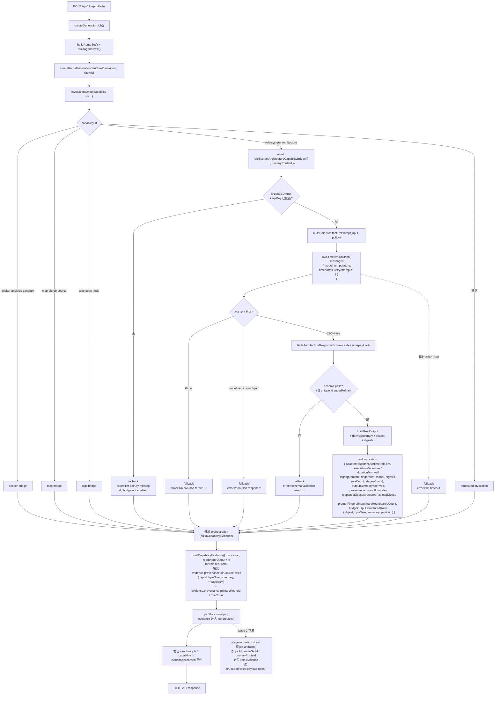
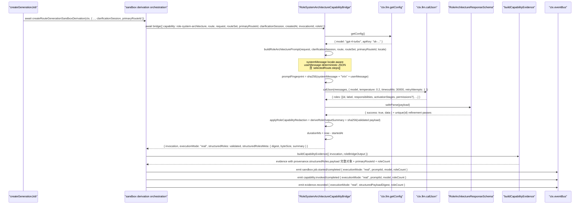
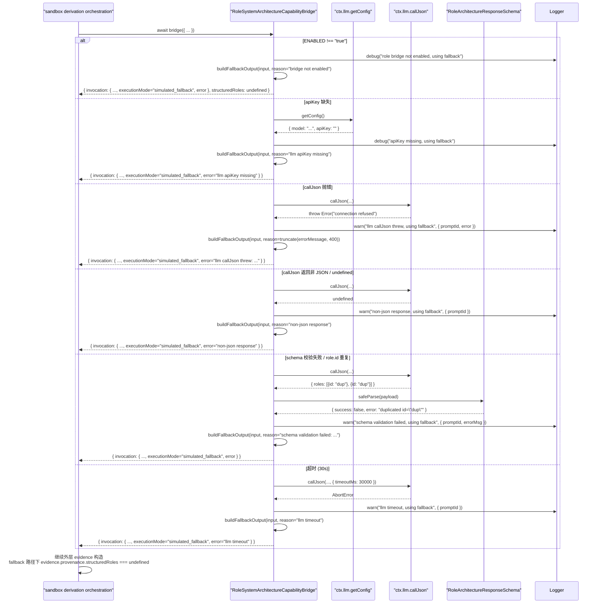
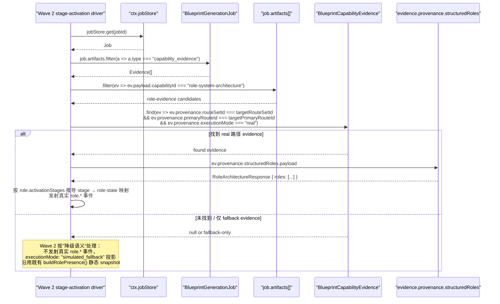

# 设计文档：Autopilot Capability Bridge — Role System Architecture

## 1. 设计概述

本 spec 把 `/autopilot` 沙箱派生管线中 `role-system-architecture` capability 的执行路径从模板化（`buildCapabilityOutputSummary()` / `buildCapabilityInvocationLogs()` / `deterministicCapabilityDuration()`）升级为通过 `BlueprintServiceContext.llm.callJson` 发起的一次**真实 LLM 角色架构推理**，产出严格 zod schema 校验后的**结构化角色 JSON**（`roles: Array<{ id, label, responsibilities, activationStages, permissions? }>`），并以**可被下游 Wave 2 `autopilot-agent-crew-stage-activation` 通过 `jobId` / `routeSetId` / `primaryRouteId` 稳定检索**的方式写入 evidence store；在 LLM 不可用 / apiKey 缺失 / callJson 抛错 / 非 JSON / schema 不过 / 超时任一情况下无缝回退到今天的模板化 invocation 产出。

本 spec 是 Tier 1/2 capability 桥体系中的**第 4 条、也是下游 Wave 2 的硬前置**。下游 spec `autopilot-agent-crew-stage-activation` 的 R3.1 / R3.6 / R4.6 / R9.3 明确要求消费本桥写入的结构化角色 JSON，按角色的 `activationStages` 推导每阶段 role-state 映射并真实发射 `role.*` 事件。因此本桥不仅要完成"真实 LLM 驱动的角色架构推理"，还必须把结构化角色 JSON 以**下游可检索**的方式落入 evidence。

### 1.1 与姊妹 aigc-node 桥的本质差异

| 维度 | aigc-node 桥 | **role 桥（本 spec）** |
| --- | --- | --- |
| 产出 JSON 内容 | `subsystems[]` / `riskNotes[]` / `dataFlowSketch?` / `confidence?` | **`roles: Array<{ id, label, responsibilities, activationStages, permissions? }>`** |
| 下游消费 | evidence 自闭环（`evidence.provenance.structuredPayload` 仅存 digest） | **必须可检索** — 下游 stage-activation 必须通过 `jobId / routeSetId / primaryRouteId` 回取完整 role JSON |
| contract 对齐 | 独立 schema | 必须与 `shared/blueprint/contracts.ts` 中 `BlueprintAgentRole[]` 形态对齐（不修改既有类型，只读对齐） |
| 角色数上限 | - | `roles.length ∈ [1, 9]`（对齐 `BlueprintAgentRole[]` 9 分类） |
| 关键 prompt 输入 | targetText / clarification / projectContext | 加上 **`selectedRoute.steps[]`**（要知道路线分几阶段才能产 `activationStages`） |
| 测试 | +2 E2E + 4 硬需求单测 | +2 E2E + **5 硬需求单测**（R9.2 四条 + R9.3 新增的"检索可行性"专测） |

### 1.2 最低可接受交付

当 `BlueprintServiceContext.llm.callJson` 可用且返回通过 strict zod 校验的结构化角色 payload 时：

- `role-system-architecture` invocation 的 `adapter === "blueprint.runtime.role.llm"`（由外层事件 payload 按 executionMode 覆盖）
- `provenance.executionMode === "real"`
- `durationMs` 为真实墙钟毫秒
- `logs` 为脱敏后的 `promptId` / `promptFingerprint` / `model` / `responseDigest` / `structuredPayloadDigest` / `roleCount` / `stagesCount`
- `outputSummary` 由结构化 payload 派生（`"Composed N role(s) across K stage(s)"` 或中文等价变体）
- `BlueprintCapabilityEvidence.provenance.structuredRoles.payload` 承载**完整**的结构化角色 JSON 对象（不仅是 digest）+ `digest` / `byteSize` / `summary` 三个元字段
- `BlueprintCapabilityEvidence.provenance.primaryRouteId` 作为下游主检索键之一稳定填充

当 LLM 未注入 / apiKey 缺失 / callJson 抛错 / 非 JSON / schema 不过 / 超时时：

- `adapter === "blueprint.runtime.role.system-architecture.simulated"`（与既有 `getDefaultRuntimeCapabilities()` 声明的字符串严格一致，**不改既有值**）
- `provenance.executionMode === "simulated_fallback"`
- `provenance.error` 被脱敏后填充
- 其它外层字段形态与今天 simulated 产出**字节级等价**
- `evidence.provenance.structuredRoles === undefined`（下游据此判断降级）

### 1.3 下游契约声明（与 Wave 2 的公共契约）

本 spec 向下游 `autopilot-agent-crew-stage-activation` 承诺：

**当本桥以 real 路径完成一次调用时，下游 stage-activation driver SHALL 能够通过扫 blueprint job 的 `artifacts[]`（类型 `capability_evidence`）+ `capabilityId === "role-system-architecture"` + `executionMode === "real"` + `primaryRouteId` 匹配，稳定检索到 `evidence.provenance.structuredRoles.payload` 中完整的 `RoleArchitectureResponse` 对象。**

契约详细定义见 §7。

### 1.4 环境变量门禁

- `BLUEPRINT_ROLE_CAPABILITY_BRIDGE_ENABLED=true` 开启本桥（与 Docker / MCP / aigc 桥同模式）
- 未设或设为其它值时，即使 `ctx.llm` 已装配，bridge 也直接走 fallback，保证默认装配下既有 52 条 E2E + 48 条子域单测零感知
- 超时上限通过 `BLUEPRINT_ROLE_CAPABILITY_BRIDGE_TIMEOUT_MS` 覆盖，默认 `30000`（需求 2.5）

### 1.5 严格限定范围

本 spec 严格限定在 `createRouteGenerationSandboxDerivation()` 中 `role-system-architecture` 这一个 capability 的 adapter 实现：

- 新增 `createRoleSystemArchitectureCapabilityBridge(ctx)` 工厂，落地到 `server/routes/blueprint/role-system-architecture/` 目录
- **不修改** `createRouteGenerationSandboxDerivation()` 外层 orchestration（capability 选择、排序、evidence aggregation、role timeline、事件总编排）
- **不修改** `docker-analysis-sandbox` / `mcp-github-source` / `aigc-spec-node` 任一 capability 的产出路径（由各自独立 spec 推进）
- **不修改** `buildRouteSet()`、SPEC Tree、SPEC Documents、Effect Preview、Prompt Package、Engineering Handoff 任一阶段
- **不修改** `shared/blueprint/contracts.ts` 中 `BlueprintAgentRole` / `BlueprintRolePresence` 类型定义本身（只读对齐）
- **不修改** `ctx.llm.callJson` 或 `ctx.llm.getConfig` 本身的实现；本 spec 只**消费**它们，不得 `import { callLLMJson }` 或 `import { getAIConfig }`
- **不新增** `roleEvidenceStore` DI 字段（采方案 A — 见 D8），继续复用既有 `jobStore` + `BlueprintCapabilityEvidence` 机制
- **不实现** 下游 Wave 2 `autopilot-agent-crew-stage-activation` 的驱动逻辑（按阶段 `role.*` 事件的实际产生、面板订阅等）
- **不引入** property-based test（需求 9.4 明确锁定）。本轮新增 2 条 E2E + ~30 条 co-located 单测
- **不新增** `/api/*` 路由；HTTP 契约完全不变
- 既有 52 条 E2E（基线 45 + Docker 桥 +2 + MCP 桥 +3 + aigc 桥 +2）+ 48 条子域 co-located 单测 + 9 条 SDK smoke 全部继续通过，不重写既有断言


## 2. 架构决策（Key Decisions）

本 spec 的 D1-D12 与姊妹桥（Docker / MCP / aigc-node）/ routeset spec 在同一坐标系下讨论；相同处复用结论并明确说明差异。

### D1：工厂模式 `createRoleSystemArchitectureCapabilityBridge(ctx)`

```ts
export function createRoleSystemArchitectureCapabilityBridge(
  ctx: BlueprintServiceContext
): RoleSystemArchitectureCapabilityBridge;
```

工厂只接收 `BlueprintServiceContext`，从中读取 `ctx.llm.callJson` / `ctx.llm.getConfig` / `ctx.roleSystemArchitectureCapabilityPolicy` / `ctx.logger` / `ctx.now`。返回的 bridge 是纯异步函数 `(input) => Promise<RoleSystemArchitectureCapabilityBridgeOutput>`。

**硬约束**（与三条姊妹桥同款 code-review 规则，违反直接拒绝）：

- bridge 实现文件 SHALL NOT `import { callLLMJson } from "../../../core/llm-client.js"`
- bridge 实现文件 SHALL NOT `import { getAIConfig } from "../../../core/ai-config.js"`
- bridge 实现文件 SHALL NOT 调用模块级 `fetch()` 或 `import` 任何 LLM HTTP 客户端
- bridge 实现文件 SHALL NOT 硬编码 model 名 / provider 名 / temperature 默认值
- 所有 LLM 能力必须来自 `ctx.llm.callJson` + `ctx.llm.getConfig`

**与 aigc-node 桥 D1 的差异**：无结构性差异，仅类型前缀不同。LLM 能力本身无需扩展 `BlueprintServiceContext`（沿用 wt1 默认装配）。

### D2：`BlueprintServiceContext` 最轻扩展（仅追加 policy + bridge 实例，不追加 evidence store）

新增两个可选字段到 `BlueprintServiceContext` 与 `BlueprintServiceContextDeps`：

```ts
export interface BlueprintServiceContext {
  // ...既有字段（含 llm: { callJson, getConfig }）...
  /** 本桥安全/配额策略；未注入时使用 createDefaultRoleSystemArchitectureCapabilityPolicy() */
  roleSystemArchitectureCapabilityPolicy?: RoleSystemArchitectureCapabilityPolicy;
  /** 本桥实例本身；便于测试完全注入自定义 bridge */
  roleSystemArchitectureCapabilityBridge?: RoleSystemArchitectureCapabilityBridge;
}
```

**默认装配策略**（与姊妹桥 D2 对齐）：

- 未注入 `roleSystemArchitectureCapabilityBridge` → `buildBlueprintServiceContext()` 自动装配 `createRoleSystemArchitectureCapabilityBridge(ctx)`
- 环境变量 `BLUEPRINT_ROLE_CAPABILITY_BRIDGE_ENABLED !== "true"` 或 `ctx.llm.getConfig().apiKey` 缺失 → bridge 内部直接走 fallback，不尝试调用 callJson
- `ctx.llm.callJson` 已在 wt1 的 `buildBlueprintServiceContext` 中默认装配，本 spec 不重复装配
- 测试中通过 `buildBlueprintServiceContext({ llm: { callJson: fake, getConfig: () => ({ model, apiKey }) } })` 注入任意 fake

未注入 `roleSystemArchitectureCapabilityPolicy` 时使用 `createDefaultRoleSystemArchitectureCapabilityPolicy()`（见 §4.3）。

**为什么不新增 `roleEvidenceStore?` DI 字段**：见 D8。结论是"复用既有 `BlueprintCapabilityEvidence` + `jobStore`"即可，下游通过扫 blueprint job 的 `artifacts[]` 回取 role evidence，不新增 DI 入口。

### D3：替换点在 invocation 层，不改外层 orchestration

`createRouteGenerationSandboxDerivation()` 的 `invocations.map(...)` 循环是今天 capability invocation 的生产点。本 spec 仅新增一个 `capability.id === "role-system-architecture"` 的分支调用 bridge：

```ts
// Docker 桥 spec 已把 createRouteGenerationSandboxDerivation 改为 async + 新增 ctx 参数
// aigc-node 桥 spec 已把 input 追加 clarificationSession?
const invocations = await Promise.all(
  routeGenerationCapabilities.map(async (capability, index) => {
    const route = input.routeSet.routes[index] ?? primaryRoute;
    const invocationRoleId = resolveRouteSandboxCapabilityRoleId(capability);
    const invocationId = createId("blueprint-capability-invocation");

    if (capability.id === "docker-analysis-sandbox" && ctx.dockerCapabilityBridge) { /* ... */ }
    if (capability.id === "mcp-github-source" && ctx.mcpGithubCapabilityBridge) { /* ... */ }
    if (capability.id === "aigc-spec-node" && ctx.aigcSpecNodeCapabilityBridge) { /* ... */ }

    // 本 spec 新增的 role-system-architecture 分支
    if (
      capability.id === "role-system-architecture" &&
      ctx.roleSystemArchitectureCapabilityBridge
    ) {
      const result = await ctx.roleSystemArchitectureCapabilityBridge({
        capability,
        route,
        jobId: input.jobId,
        request: input.request,
        routeSet: input.routeSet,
        primaryRouteId: primaryRoute.id, // ← 本 spec 独有输入字段
        clarificationSession: input.clarificationSession, // 复用 aigc-node 桥追加的字段
        createdAt: input.createdAt,
        invocationId,
        roleId: invocationRoleId,
      });
      return {
        invocation: result.invocation,
        executionMode: result.executionMode,
        structuredRoles: result.structuredRoles,
        structuredRolesMeta: result.structuredRolesMeta,
      };
    }

    // 其它 capability：保持今天的模板化代码一行不改
    return { invocation: /* templated */, executionMode: undefined };
  })
);
```

**关键点**：

- `invocationId` 由外层生成并作为参数传入（与 Docker / MCP / aigc 桥 D3 同款）；real 与 fallback 共用同一 id
- `primaryRouteId` 是本 spec 特有输入字段；下游 stage-activation 以 `primaryRouteId` 为检索键之一，本桥必须把它写入 `evidence.provenance.primaryRouteId`
- `clarificationSession` 由 aigc-node 桥 spec 已经在 `createRouteGenerationSandboxDerivation` input 追加，本 spec 复用，不再重复扩展

### D4：超时上限锁定为 30 秒

需求 2.5 要求"不大于 30 秒"。本 spec 将**单次 LLM 调用 + zod 校验的总墙钟**锁定为 **30 秒**，通过环境变量 `BLUEPRINT_ROLE_CAPABILITY_BRIDGE_TIMEOUT_MS` 可覆盖（默认 `30000`）。与 aigc-node / MCP 桥对齐。

实现上通过 `ctx.llm.callJson` 自带的 `timeoutMs` 参数 + `retryAttempts: 1`（与 routeset / clarification / aigc 桥对齐）传入。`callLLMJson` 的实现会在超时到达时抛 `AbortError`，bridge 捕获后 fallback 并填 `provenance.error = "llm timeout"`。

### D5：Prompt ID 锁定为 `blueprint.role-architecture.v1`（需求 2.3）

与 routeset spec 的 `blueprint.routeset.v1` / aigc-node 桥的 `blueprint.aigc-spec-node.v1` 命名对齐。稳定字符串版本标识，用于 provenance 追溯与回归测试锁定。prompt 结构 / response schema 发生向后不兼容变化时递增到 `v2`；仅字段示例 / 提示语微调不构成 bump。

常量定义位置：`server/routes/blueprint/role-system-architecture/prompt.ts` 的 `export const ROLE_ARCHITECTURE_PROMPT_ID = "blueprint.role-architecture.v1"`。

**下游消费契约提示**：下游 Wave 2 stage-activation 的实现应**以 `promptId` 为本桥结构化角色 JSON 的 schema 版本标识**；任何 schema 向后不兼容变化必须 bump 到 `v2`，使下游可以显式处理版本差异。

### D6：Adapter 字符串锁定（real / fallback 不同子串，real 不含 `.simulated`）

需求 4.4 要求 real 路径 adapter 不含 `.simulated` 子串。通过 grep `server/routes/blueprint.ts` 确认既有 `getDefaultRuntimeCapabilities()` 第 ~3447 行声明的 fallback 字符串为 `"blueprint.runtime.role.system-architecture.simulated"`。

本 spec 锁定：

| 路径 | adapter 字符串 | 对应 `provenance.executionMode` |
| --- | --- | --- |
| LLM 真跑 | **`"blueprint.runtime.role.llm"`** | `"real"` |
| 模板化回退 | `"blueprint.runtime.role.system-architecture.simulated"` | `"simulated_fallback"` |

Fallback 字符串与 `getDefaultRuntimeCapabilities()` 既有值**严格一致**（不改一行既有代码），避免触发既有 52 条 E2E 的断言回归。Real 字符串选用短名 `blueprint.runtime.role.llm` 与 requirements 4.4 建议值一致，且不含 `.simulated` 子串。

**adapter 切换逻辑**（与 Docker / MCP / aigc 桥 §4.10 同构）：

```ts
// 聚合完 invocations 之后，针对 role-system-architecture capability：
const roleResult = invocations.find(
  ({ invocation }) => invocation.capabilityId === "role-system-architecture"
);
const roleAdapter =
  roleResult?.executionMode === "real"
    ? "blueprint.runtime.role.llm"
    : routeGenerationCapabilities.find(
        (c) => c.id === "role-system-architecture"
      )?.adapter ?? "blueprint.runtime.role.system-architecture.simulated";
// sandbox.job.started / capability.invoked / capability.completed / evidence.recorded
// 事件 payload 构造时使用这个 roleAdapter
```

**与姊妹桥的命名口径对齐**：

| Spec | `adapter` real 值 | fallback 值 |
| --- | --- | --- |
| docker bridge | `"blueprint.runtime.docker.lobster-executor"` | `"blueprint.runtime.docker.simulated"` |
| mcp-github bridge | `"blueprint.runtime.mcp.github.real"` / `.http` | `"blueprint.runtime.mcp.github.simulated"` |
| aigc-spec-node bridge | `"blueprint.runtime.aigc.spec-node.llm"` | `"blueprint.runtime.aigc.spec-node.simulated"` |
| **role bridge（本 spec）** | **`"blueprint.runtime.role.llm"`** | `"blueprint.runtime.role.system-architecture.simulated"` |

### D7：事件直接复用既有 `BlueprintEventName`，不新增事件名

本 spec **不新增事件名**，只在既有 payload 上追加可选字段：

- `sandbox.job.started` / `sandbox.job.completed` / `sandbox.job.failed`：追加 `executionMode`、`promptId`（real）、`model`（real）、`roleCount`（real）、`error`（fallback）
- `capability.invoked` / `capability.completed`：追加 `executionMode`、`promptId`、`model`、`roleCount`、`error`
- `evidence.recorded`：追加 `executionMode`、`structuredPayloadDigest`（real）、`roleCount`（real）、`error`（fallback）

全部为可选字段，既有订阅者不会因字段追加而断言失败（需求 6.7）。所有事件 `type` 仍由 `BlueprintEventName` 常量构造（需求 6.6），实现文件 SHALL NOT 出现裸字符串 `"sandbox.job.started"` 等。

**与 aigc-node 桥 D7 的差异**：本 spec 在事件 payload 中追加 `roleCount`（= `roles.length`），aigc-node 桥追加的是 `subsystemsCount`。命名不同但字段形态一致。

### D8：Evidence Store 可检索契约 — **方案 A（复用既有 evidence 机制，本 spec 明确选定）**

这是本 spec 相对姊妹桥**最关键、也是与 aigc-node 桥最本质**的差异。需求 4.6 + 9.3 明确要求：下游 Wave 2 必须能通过 `jobId` / `routeSetId` / `primaryRouteId` 从 evidence store 稳定检索到结构化角色 JSON。

#### 三种方案对比

- **方案 A（推荐，本 spec 采用）**：复用既有 `BlueprintCapabilityEvidence` 机制 — 把完整 `roles[]` JSON 存在 `evidence.provenance.structuredRoles.payload`（完整对象，不是 digest）。同时保留 `digest` / `byteSize` / `summary` 三个元字段（与 aigc-node 桥的 `structuredPayload` 结构对齐）。下游通过扫 blueprint job 的 `artifacts[]`（类型 `capability_evidence`）筛 `capabilityId === "role-system-architecture"` + `executionMode === "real"` + `primaryRouteId` 匹配即可检索。
- **方案 B**：新增独立 `roleEvidenceStore` DI 字段。**不选**。
- **方案 C**：挂到 `jobStore.save()` 的自定义 metadata。**不选**。

#### 方案 A 的论证

1. **不新增 DI**：不需要在 `BlueprintServiceContext` 上追加 `roleEvidenceStore?` 字段、不需要新数据表、不需要新 API；沿用今天 `jobStore.get(jobId)` → `job.artifacts[]` → `capability_evidence` 的消费路径
2. **对 48 子域 / 52 E2E 不侵入**：`evidence.provenance` 追加的是**可选字段**（`primaryRouteId?` / `roleCount?` / `structuredRoles?`），既有 E2E 不断言这些字段，SDK normalizer 透明透传
3. **role JSON 规模可接受**：roles 最多 9 个，每个 responsibilities 最多 10 项 × 200 字符，permissions 最多 10 项 × 120 字符；严格上界 `~9 × (80 + 10 × 200 + 10 × 120 + 10 × 64)` ≈ 36KB；现实规模（3-5 角色、每角色 2-4 条职责）约 1-5KB。对 `jobStore` 现有承载（单 job 几十 KB artifact）无压力
4. **下游检索接口成本最低**：下游 stage-activation 只需写一个 helper `findRoleArchitectureEvidence(job, { routeSetId, primaryRouteId, requireReal })` 扫 `job.artifacts[]`，无需学习新 DI

#### 方案 B 被拒绝的原因

- 需要在 `BlueprintServiceContext` / `BlueprintServiceContextDeps` 追加 `roleEvidenceStore?` 字段、在 `server/index.ts` 装配新实例、为 48 条子域测试补 fake；代价过大
- 下游 spec 需要学习一条新 DI 入口，且与 `jobStore.get(jobId)` 回路分叉，增加心智负担
- 一旦落地，后续 3 条姊妹桥若也想做可检索，将被迫跟进，扩大侵入面

#### 方案 C 被拒绝的原因

- `jobStore` 契约不变是 blueprint 主线的核心稳定锚；往 `jobStore.save()` 塞自定义 metadata 会污染现有持久化路径
- 下游消费也不直观：不得不规定"metadata 字段命名 + 读取方式"这类契约项

#### 方案 A 的字段形态

```ts
evidence.provenance = {
  // ...既有字段（jobId / projectId / sourceId / routeSetId / routeId / specTreeId / nodeId / targetText / githubUrls）...

  // —— Docker / MCP / aigc-node 桥已追加字段（本 spec 复用）——
  executionMode?: "real" | "simulated_fallback";
  error?: string;
  promptId?: string;
  model?: string;
  responseDigest?: string;
  tokenCount?: number;
  structuredPayloadDigest?: string;
  promptFingerprint?: string;

  // —— 本 spec 新增 ——
  /** 当前选中的 primary route id；下游 Wave 2 stage-activation 的主检索键之一 */
  primaryRouteId?: string;
  /** Real 路径下产出的 roles 数组长度（即 validated.roles.length）；fallback 下 undefined */
  roleCount?: number;
  /** Real 路径下承载完整结构化角色 JSON 的对象；fallback 下 undefined */
  structuredRoles?: {
    digest: string;    // sha256:... of JSON.stringify(validated)
    byteSize: number;  // Buffer.byteLength(JSON.stringify(validated), "utf8")
    summary: string;   // 已脱敏的简短人可读摘要，≤ maxStructuredPayloadSummaryBytes
    payload: RoleArchitectureResponse; // 完整 validated 对象（本 spec 独有）
  };
};
```

**为什么独立命名 `structuredRoles` 而不复用 aigc-node 桥的 `structuredPayload`**：aigc-node 桥的 `structuredPayload` 仅承载 `{ digest, byteSize, summary }`（不含 `payload`）；本 spec 需要携带完整对象。为了让两个字段语义稳定、互不覆盖、下游类型更精确（`RoleArchitectureResponse` vs aigc 桥的 subsystems/riskNotes），本 spec 使用独立字段名 `structuredRoles`。这与 R3.5 / R4.5 / R5.2 / R5.4 的"独立可选字段"口径一致。

### D9：Response Schema（严格 zod，对齐 requirements R3.1）

按 requirements R3.1 展开：

```ts
import { z } from "zod";

const AgentRoleSchema = z.object({
  id: z
    .string()
    .min(1)
    .max(64)
    .regex(/^[a-z][a-z0-9-]{0,63}$/), // lowercase kebab-case，首字符必须是小写字母
  label: z.string().min(1).max(80),
  responsibilities: z.array(z.string().min(1).max(200)).min(1).max(10),
  activationStages: z.array(z.string().min(1).max(64)).min(1).max(10),
  permissions: z.array(z.string().min(1).max(120)).min(0).max(10).optional(),
});

const RoleArchitectureResponseSchema = z
  .object({
    roles: z.array(AgentRoleSchema).min(1).max(9), // 与 BlueprintAgentRole[] 9 分类对齐
  })
  .superRefine((data, ctx) => {
    // roles[].id 必须在单次响应内唯一
    const ids = data.roles.map((r) => r.id);
    const seen = new Set<string>();
    for (let i = 0; i < ids.length; i++) {
      if (seen.has(ids[i])) {
        ctx.addIssue({
          code: z.ZodIssueCode.custom,
          path: ["roles", i, "id"],
          message: `roles[].id must be unique within a single response; duplicated id="${ids[i]}"`,
        });
        return;
      }
      seen.add(ids[i]);
    }
  });

export type RoleArchitectureResponse = z.infer<typeof RoleArchitectureResponseSchema>;
export type AgentRoleEntry = z.infer<typeof AgentRoleSchema>;
```

#### 字段处置策略（对应 R3.2 / R3.3）

| 场景 | schema 行为 |
| --- | --- |
| `roles` 缺失 / 非数组 | fail → fallback |
| `roles.length === 0` 或 `> 9` | fail → fallback |
| `roles[i].id` 不匹配 `/^[a-z][a-z0-9-]{0,63}$/`（例如 大写 / 空串 / 长度 > 64） | fail → fallback |
| `roles[i].id` 在数组内重复 | fail → fallback（`.superRefine()` 触发） |
| `roles[i].label` 为空 或 > 80 字符 | fail → fallback |
| `roles[i].responsibilities` 非数组 / 空 / > 10 / 单项为空 / 单项 > 200 字符 | fail → fallback |
| `roles[i].activationStages` 非数组 / 空 / > 10 / 单项为空 / 单项 > 64 字符 | fail → fallback |
| `roles[i].permissions` 单项越界 / > 10 | fail → fallback |
| 未声明的顶层 / 嵌套字段（例如 `group: "planning"` / `collaborationNotes: [...]`） | **静默丢弃**（zod 默认 strip 行为） |

**注意**：`RoleArchitectureResponseSchema` 使用 `z.object({...}).superRefine(...)` 而非 `.strict()`。未知字段静默丢弃，与 aigc-node 桥 schema 风格对齐。

**为什么 `activationStages` 是 `z.array(z.string())` 而不是 `z.enum(BlueprintGenerationStage)`**：

1. `BlueprintGenerationStage` 枚举属 `shared/blueprint/contracts.ts` 的真值；若 LLM 因训练语料漂移产出新阶段标签，强制 enum 会把 schema 失败率推高
2. 下游 Wave 2 stage-activation 会基于**当前 primary route 的 stages**（`selectedRoute.stagesSummary`）做二次过滤，不合法 stage 会被自动忽略（属下游消费策略，见 R2.3 / R2.4）
3. 保持 string 形态让本桥 schema 相对 `BlueprintGenerationStage` 枚举**弱耦合**：若上游扩展枚举，本 spec schema 不需要同步改动

**`roles.length.max(9)` 的理由**：需求术语表明确"与 `BlueprintAgentRole[]` 的 9 分类对齐"。上限 9 覆盖 `group = "decision" | "planning" | "execution" | "quality" | "presentation" | "memory"` 6 类 + 潜在扩展空间。

**不做 coerce / normalize**（需求 3.2）：禁止 `z.string().or(z.number()).transform(...)` 这类 zod transform 链。所有字段要么严格匹配，要么 fallback。

### D10：脱敏走本 spec 独立的 `applyRoleCapabilityRedaction` 纯函数（与 aigc-node 桥 D10 同构）

**决策**：本 spec 实现独立的轻量 `applyRoleCapabilityRedaction(text, policy)` 纯函数，覆盖：

- API key 正则（`sk-[A-Za-z0-9]{20,}` / `clp_[A-Za-z0-9]{20,}` / `gh[pousr]_[A-Za-z0-9]{36,255}` / `github_pat_[A-Za-z0-9_]{22,255}`）
- Authorization / Bearer / token= / api_key= 等 key-value 对
- 邮箱正则

**为什么不与 aigc-node 桥共享**：同 aigc-node 桥 D10 论据（跨 spec 共享需抽 `_shared/redaction.ts` 超出本 spec 范围；两边未来可能分叉；实现薄、复制低维护负担）。

**关键使用点**（`logs` 与原始 prompt / response 绝不进面向用户字段，R4.7）：

1. `invocation.logs`：**不**包含原始 prompt 全文或原始 LLM 响应体；只包含 `["promptId=...", "promptFingerprint=...", "model=...", "responseDigest=...", "structuredPayloadDigest=...", "primaryRouteId=...", "roleCount=N", "stagesCount=K", ...]`，每条写入前都过 `applyRoleCapabilityRedaction`（防御性）
2. `invocation.outputSummary`：从 validated payload 派生后过一遍脱敏
3. `evidence.summary`：同上
4. `evidence.provenance.structuredRoles.summary`：同上
5. `evidence.provenance.structuredRoles.payload`：**不脱敏原文**（下游需要完整字段；脱敏会破坏契约）。通过 prompt 约束（§4.5 约束 5）要求 LLM 对敏感标识抽象化，作为风险缓解
6. `digest` / `responseDigest` / `promptFingerprint`：SHA-256 of **未脱敏**的 validated payload（digest 无泄漏风险）
7. 事件 payload：所有字符串字段（`error` / `summary` 相关）过脱敏

**最强约束**（`server/routes/blueprint/role-system-architecture/bridge.ts` 实现侧）：

- `ctx.logger.debug / warn / info / error` 调用中**不得**传入原始 prompt 全文
- `console.*` 不得使用（强制通过 `ctx.logger`）
- `messages` 数组只存在于 bridge 函数栈上，结束后作用域即终止；不写入 invocation / evidence / event / jobStore

### D11：不引入 callback dispatcher（与 aigc-node / MCP 桥对齐）

`ctx.llm.callJson` 是同步 Promise 调用，不涉及 HMAC 回调、不涉及 executor 事件中继。本 spec **不改** `server/index.ts` 的 `/api/executor/events` 中继链。

### D12：测试默认装配 ≡ 生产行为

核心兼容性保证：**默认测试装配 ≡ 今天的生产行为**。

- 既有 52 条 E2E（基线 45 + Docker 桥 +2 + MCP 桥 +3 + aigc 桥 +2）**没有**对 `ctx.llm.callJson` 预设针对 role capability 的 `mockResolvedValueOnce(...)`；`vi.mock("../core/llm-client.js")` 把 `callLLMJson` 替换为不带默认实现的 `vi.fn()`（返回 `undefined`）
- 在新实现下，bridge 调用 `ctx.llm.callJson(...)` 返回 `undefined`；schema 校验失败 → fallback → 产出与今天 simulated 路径字节级等价的 invocation
- 48 条子域单测与 9 条 SDK smoke 同理

唯一需要主动 mock 的只有本 spec 新增的 2 条 E2E 与 5 条硬需求单测（R9.1 + R9.2 + R9.3）。本 spec 追加 2 E2E 后基线应从 52 → 54。


## 3. High-Level Design（HLD）

### 3.1 系统数据流（Mermaid）



### 3.2 Happy path 时序图（real LLM execution）



### 3.3 Fallback 时序图



### 3.4 Evidence 可检索时序图（本 spec 特有）

本图展示下游 Wave 2 `autopilot-agent-crew-stage-activation` 如何从 evidence store 检索本桥产出的结构化角色 JSON。**本 spec 不实现下游消费代码**，仅保证本图表达的检索路径在 real 路径下 100% 成立。



**下游检索的稳定契约**（本 spec 对 Wave 2 的承诺）：

1. `jobStore.get(jobId)` 在 job 完成时必然返回已 populate 的 `job.artifacts[]`（既有契约，不改）
2. 本桥 real 路径下必然产出 **exactly 1 条** `capabilityId === "role-system-architecture"` 的 evidence（`executionMode === "real"`）
3. 该 evidence 的 `provenance.routeSetId` / `primaryRouteId` / `jobId` 稳定填充
4. 该 evidence 的 `provenance.structuredRoles.payload` 是完整的 `RoleArchitectureResponse` 对象，`roles: Array<{ id, label, responsibilities, activationStages, permissions? }>`
5. Fallback 路径下 `evidence.provenance.structuredRoles === undefined`；下游据此降级
6. 字段顺序与类型由 `RoleArchitectureResponseSchema` 锁定；任何 schema 变更**必须** bump `promptId` `v1 → v2`

详见 §7 Downstream Contract for Wave 2。


## 4. Low-Level Design（LLD）

### 4.1 文件布局

```
server/routes/blueprint/role-system-architecture/
  ├── bridge.ts                           # 新增：createRoleSystemArchitectureCapabilityBridge(ctx) 工厂 + 主算法
  ├── bridge.test.ts                      # 新增：5 条硬需求单测 + 补充（not-enabled / timeout / redaction）
  ├── policy.ts                           # 新增：RoleSystemArchitectureCapabilityPolicy + createDefault + applyRoleCapabilityRedaction
  ├── policy.test.ts                      # 新增：policy 与 redaction 纯函数测试
  ├── prompt.ts                           # 新增：buildRoleArchitecturePrompt + ROLE_ARCHITECTURE_PROMPT_ID
  ├── prompt.test.ts                      # 新增：prompt 确定性与 locale 分支测试
  ├── schema.ts                           # 新增：RoleArchitectureResponseSchema strict zod + unique-id superRefine
  ├── schema.test.ts                      # 新增：schema 各种 valid/invalid 分支测试
  ├── summary-derivation.ts               # 新增：deriveRoleOutputSummary + buildStructuredRolesSummary 纯函数
  └── summary-derivation.test.ts          # 新增：summary 派生纯函数测试

server/routes/blueprint/context.ts         # 修改：
                                           #   - BlueprintServiceContext 追加:
                                           #       roleSystemArchitectureCapabilityPolicy?: RoleSystemArchitectureCapabilityPolicy
                                           #       roleSystemArchitectureCapabilityBridge?: RoleSystemArchitectureCapabilityBridge
                                           #   - BlueprintServiceContextDeps 追加同样字段
                                           #   - buildBlueprintServiceContext 默认装配 createRoleSystemArchitectureCapabilityBridge(ctx)

server/routes/blueprint.ts                 # 修改（最小侵入）：
                                           #   - createRouteGenerationSandboxDerivation() 的 capability 分支
                                           #     新增 `capability.id === "role-system-architecture"` → await ctx.roleSystemArchitectureCapabilityBridge(...)
                                           #   - input 追加 primaryRouteId?（默认 = primaryRoute.id；clarificationSession 由 aigc 桥已追加）
                                           #   - getDefaultRuntimeCapabilities() 中 role-system-architecture 的 adapter
                                           #     保持 "blueprint.runtime.role.system-architecture.simulated"（fallback 基线，一行不改）
                                           #   - capability.invoked / capability.completed / sandbox.job.* / evidence.recorded
                                           #     事件 payload 追加 executionMode / promptId / model / roleCount / error / structuredPayloadDigest 可选字段
                                           #   - real 路径下 event payload 的 adapter 字符串按 executionMode 覆盖为
                                           #     "blueprint.runtime.role.llm"
                                           #   - buildCapabilityEvidence({ invocation, roleBridgeOutput? }) 针对 role real 路径，填充
                                           #     evidence.provenance.structuredRoles = { digest, byteSize, summary, payload }
                                           #     并追加 evidence.provenance.primaryRouteId / roleCount

shared/blueprint/contracts.ts              # 修改（仅追加可选字段）：
                                           #   - BlueprintCapabilityInvocation.provenance 追加可选:
                                           #       primaryRouteId?: string
                                           #       roleCount?: number
                                           #     （promptId / model / responseDigest / structuredPayloadDigest / promptFingerprint / tokenCount / executionMode / error
                                           #      已由 Docker / aigc 桥追加，本 spec 复用）
                                           #   - BlueprintCapabilityEvidence.provenance 追加可选:
                                           #       primaryRouteId?: string
                                           #       roleCount?: number
                                           #       structuredRoles?: { digest, byteSize, summary, payload: RoleArchitectureResponse }
                                           #   - （注意：与 aigc-node 桥的 structuredPayload 字段分开命名为 structuredRoles，
                                           #     以便两桥字段语义独立 / 下游类型精确）

shared/blueprint/role-architecture.ts      # 新增：
                                           #   - 纯类型定义 RoleArchitectureResponse（与 schema.ts 的 z.infer 等价）
                                           #   - 不依赖 zod；shared/blueprint/index.ts barrel 重新导出

server/tests/blueprint-routes.test.ts      # 修改（只追加，不改写）：
                                           #   + 2 条新 E2E 用例：
                                           #     (a) Real LLM path + downstream-retrieval sanity
                                           #     (b) Fallback path
```

### 4.2 核心类型定义（`bridge.ts`）

```ts
import type { BlueprintServiceContext } from "../context.js";
import type {
  BlueprintCapabilityInvocation,
  BlueprintClarificationSession,
  BlueprintGenerationEvent,
  BlueprintGenerationRequest,
  BlueprintRouteCandidate,
  BlueprintRouteSet,
  BlueprintRuntimeCapability,
  RoleArchitectureResponse,
} from "../../../../shared/blueprint/index.js";

/**
 * bridge 的单次调用输入。
 * 字段集与 Docker / MCP / aigc-node 桥的 *CapabilityBridgeInput 对齐，
 * 额外追加 primaryRouteId（下游 Wave 2 stage-activation 的主检索键）。
 */
export interface RoleSystemArchitectureCapabilityBridgeInput {
  capability: BlueprintRuntimeCapability;
  route: BlueprintRouteCandidate;
  jobId: string;
  request: BlueprintGenerationRequest;
  routeSet: BlueprintRouteSet;
  /**
   * 当前 RouteSet 中被选中作为 primary 的 route id。
   * 下游 Wave 2 stage-activation 以此作为主检索键之一；
   * bridge 必须把该字段写入 invocation.provenance.primaryRouteId 与 evidence.provenance.primaryRouteId。
   */
  primaryRouteId: string;
  clarificationSession?: BlueprintClarificationSession;
  createdAt: string;
  invocationId: string;
  roleId: string;
}

/**
 * bridge 的单次调用输出。
 * structuredRoles / structuredRolesMeta 供外层 buildCapabilityEvidence 回填到
 * evidence.provenance.structuredRoles；Fallback 路径下为 undefined。
 */
export interface RoleSystemArchitectureCapabilityBridgeOutput {
  invocation: BlueprintCapabilityInvocation;
  executionMode: "real" | "simulated_fallback";
  structuredRoles?: RoleArchitectureResponse;
  structuredRolesMeta?: {
    digest: string;
    byteSize: number;
    summary: string;
  };
  additionalEvents: BlueprintGenerationEvent[];
}

export type RoleSystemArchitectureCapabilityBridge = (
  input: RoleSystemArchitectureCapabilityBridgeInput
) => Promise<RoleSystemArchitectureCapabilityBridgeOutput>;

export function createRoleSystemArchitectureCapabilityBridge(
  ctx: BlueprintServiceContext
): RoleSystemArchitectureCapabilityBridge;
```

### 4.3 Policy 类型（`policy.ts`）

```ts
export interface RoleSystemArchitectureCapabilityPolicy {
  /** 单次 LLM 调用 + 校验的总墙钟上限 */
  maxInvocationTimeoutMs: number;
  /** 温度（保持确定性偏向） */
  temperature: number;
  /** invocation.logs 最大行数 */
  maxLogLines: number;
  /** invocation.logs 累计字节上限 */
  maxLogBytes: number;
  /** structuredRoles.summary 字节上限 */
  maxStructuredPayloadSummaryBytes: number;
  /** 脱敏：key 级敏感关键词（大小写不敏感） */
  redactionKeywords: readonly string[];
  /** 脱敏：email 正则 */
  redactedEmailPattern: RegExp;
  /** 脱敏：OpenAI / Anthropic / 一般长字串 API key 正则 */
  redactedApiKeyPattern: RegExp;
  /** 脱敏：GitHub PAT / fine-grained token 正则 */
  redactedGithubPatPattern: RegExp;
  /** retry attempts 传给 callJson */
  callJsonRetryAttempts: number;
}

export function createDefaultRoleSystemArchitectureCapabilityPolicy(): RoleSystemArchitectureCapabilityPolicy {
  const timeoutOverride = Number.parseInt(
    process.env.BLUEPRINT_ROLE_CAPABILITY_BRIDGE_TIMEOUT_MS ?? "",
    10
  );
  return {
    maxInvocationTimeoutMs:
      Number.isFinite(timeoutOverride) && timeoutOverride > 0 && timeoutOverride <= 30_000
        ? timeoutOverride
        : 30_000,
    temperature: 0.2,
    maxLogLines: 20,
    maxLogBytes: 4_096,
    maxStructuredPayloadSummaryBytes: 300,
    redactionKeywords: [
      "authorization",
      "token",
      "api_key",
      "apikey",
      "secret",
      "password",
      "bearer",
      "access_token",
      "x-github-token",
      "openai-api-key",
    ],
    redactedEmailPattern: /[\w.+-]+@[\w.-]+/g,
    redactedApiKeyPattern: /\b(sk-[A-Za-z0-9]{20,}|clp_[A-Za-z0-9]{20,})\b/g,
    redactedGithubPatPattern:
      /\b(gh[pousr]_[A-Za-z0-9]{36,255}|github_pat_[A-Za-z0-9_]{22,255})\b/g,
    callJsonRetryAttempts: 1,
  };
}

export function applyRoleCapabilityRedaction(
  value: string,
  policy: RoleSystemArchitectureCapabilityPolicy
): string;
```

**环境变量**：`BLUEPRINT_ROLE_CAPABILITY_BRIDGE_TIMEOUT_MS` 允许覆盖默认 30s 上限（不超过 30s，否则忽略并 fallback 到 30s）。

### 4.4 Response Schema（`schema.ts`）

```ts
import { z } from "zod";

const AgentRoleSchema = z.object({
  id: z
    .string()
    .min(1)
    .max(64)
    .regex(/^[a-z][a-z0-9-]{0,63}$/, "id must be lowercase kebab-case"),
  label: z.string().min(1).max(80),
  responsibilities: z.array(z.string().min(1).max(200)).min(1).max(10),
  activationStages: z.array(z.string().min(1).max(64)).min(1).max(10),
  permissions: z.array(z.string().min(1).max(120)).min(0).max(10).optional(),
});

export const RoleArchitectureResponseSchema = z
  .object({
    roles: z.array(AgentRoleSchema).min(1).max(9),
  })
  .superRefine((data, ctx) => {
    const seen = new Set<string>();
    for (let i = 0; i < data.roles.length; i++) {
      const id = data.roles[i].id;
      if (seen.has(id)) {
        ctx.addIssue({
          code: z.ZodIssueCode.custom,
          path: ["roles", i, "id"],
          message: `duplicated id="${id}" within roles[]`,
        });
        return;
      }
      seen.add(id);
    }
  });

export type RoleArchitectureResponse = z.infer<typeof RoleArchitectureResponseSchema>;
export type AgentRoleEntry = z.infer<typeof AgentRoleSchema>;
```

**字段处置策略**：见 §2.D9 已列出的处置矩阵；未声明字段（例如 `group` / `collaborationNotes` / `confidence`）静默丢弃。

### 4.5 Prompt 构造（`prompt.ts`）

```ts
export const ROLE_ARCHITECTURE_PROMPT_ID = "blueprint.role-architecture.v1";

export interface RoleArchitecturePromptPayload {
  promptId: string;
  systemMessage: string;
  userMessage: string;
  userPayload: Record<string, unknown>;
  /** SHA-256 hex of systemMessage + "\n\n" + userMessage；写入 provenance.promptFingerprint */
  promptFingerprint: string;
}

export interface BuildRoleArchitecturePromptInput {
  request: BlueprintGenerationRequest;
  clarificationSession?: BlueprintClarificationSession;
  route: BlueprintRouteCandidate;
  routeSet: BlueprintRouteSet;
  primaryRouteId: string;
  locale: "zh-CN" | "en-US";
}

export function buildRoleArchitecturePrompt(
  input: BuildRoleArchitecturePromptInput
): RoleArchitecturePromptPayload;
```

#### systemMessage（locale-aware）

- `locale === "zh-CN"` 时：
  ```
  你是 /autopilot 沙箱派生管线中的 Role System Architecture 角色架构推理器。

  给定用户的目标描述、澄清问答摘要、所选主路线的 steps / stages 摘要与可选领域上下文，请规划完成该路线所需的 Agent 角色车队，识别每个角色在哪些阶段活跃、负责什么职责、需要哪些权限，并以严格 JSON 形式返回。

  约束：
  1. 必须返回合法 JSON，不得包含 Markdown 代码块围栏、不得返回任何解释性前置文字。
  2. JSON 根对象必须包含：
     - "roles": 数组，长度 1 到 9 项。每个角色必须包含：
       - "id": 字符串，必须匹配 /^[a-z][a-z0-9-]{0,63}$/（lowercase kebab-case，最多 64 字符），在 roles 数组内必须唯一。
       - "label": 字符串，1 到 80 字符；人可读短标签（例如 "Planner" / "数据工程师"）。
       - "responsibilities": 字符串数组，1 到 10 项，每项 1 到 200 字符；描述该角色在本次任务中的核心职责。
       - "activationStages": 字符串数组，1 到 10 项，每项 1 到 64 字符；取值应来自当前 primary route 的 stagesSummary 中的 stage 标识。
       - "permissions": 字符串数组（可选），0 到 10 项，每项 1 到 120 字符；该角色需要的权限范围摘要。
  3. 不得引入其他顶层字段。不得引入 "group" 字段（由下游归类）。不得引用外部 URL。
  4. 只基于用户提供的 intake / clarification / selectedRoute.steps / projectContext 内容进行推理；不得引入用户未提供的机密、外部 URL、真实邮箱、或 API 密钥字面量。如果角色职责中确有人名 / 邮箱 / 凭据风险，请用抽象描述（例如 "数据所有者" / "运行时密钥"）替代。
  5. activationStages 必须尽量覆盖主路线所有相关阶段，以便下游按阶段驱动 role 状态切换。
  ```
- 否则（`en-US`）：
  ```
  You are the Role System Architecture reasoner inside the /autopilot sandbox derivation pipeline.

  Given the user's goal, clarification answers, the selected primary route's steps / stages summary, and optional domain context, plan the Agent role fleet required to complete this route: identify which role is active in which stages, what each role is responsible for, and what permissions each needs. Return the result as strict JSON.

  Constraints:
  1. Return a single JSON object. Do NOT wrap in Markdown code fences. Do NOT include any prose before or after.
  2. The root object MUST include:
     - "roles": array of 1..9 entries. Each role entry MUST include:
       - "id": string matching /^[a-z][a-z0-9-]{0,63}$/ (lowercase kebab-case, up to 64 chars), UNIQUE across the roles array.
       - "label": string, 1..80 chars; human-readable short label (e.g. "Planner", "Data engineer").
       - "responsibilities": string[] with 1..10 entries, each 1..200 chars; describe the role's core duties in this task.
       - "activationStages": string[] with 1..10 entries, each 1..64 chars; values should come from the primary route's stagesSummary stage identifiers.
       - "permissions": string[] (optional), 0..10 entries, each 1..120 chars; summarise the permissions this role needs.
  3. Do NOT introduce additional top-level fields. Do NOT include a "group" field. Do NOT reference external URLs.
  4. Reason ONLY from the provided intake / clarification / selectedRoute.steps / projectContext. Do NOT inject secrets, real emails, API keys, or hallucinated names. If a responsibility implies sensitive identifiers, abstract them (e.g. "data owner", "runtime secret").
  5. activationStages MUST cover the primary route's relevant stages so that downstream can drive per-stage role state transitions.
  ```

#### userMessage

`JSON.stringify(userPayload, null, 2)`；`userPayload` 结构（**确定性**，字段顺序固定，answers 按 `questionId` 字典序排序）：

```ts
{
  promptId: "blueprint.role-architecture.v1",
  selectedRoute: {
    id: string,
    title: string,
    summary: string,
    /**
     * primary route 的 steps 摘要（来自 route.steps，每个 step 只取 title + description + role）。
     * 这是 role 桥相对 aigc-node 桥的关键输入差异 —— role 桥需要知道路线分几个阶段、
     * 每个阶段负责什么，才能产出 activationStages 字段。
     */
    steps: Array<{ title: string; description: string; role: string }>,
    /**
     * primary route 的 stages 摘要（来自 route.stages 如果存在；
     * 否则从 route.steps[].stage 派生 unique set）。
     */
    stagesSummary: Array<{ stage: string; label: string }>,
  },
  alternativeRoutes: Array<{
    id: string,
    title: string,
    summary: string,
  }>,                                          // 简化摘要（不含 steps 细节），减少 prompt 体积
  intake: {
    targetText: string | undefined,
    githubUrls: string[],                      // 按输入顺序
    domainNotes: string | undefined,
  },
  clarification: {
    strategyId: string | undefined,
    templateId: string | undefined,
    answers: Array<{ questionId, answer }>,    // 按 questionId 字典序
  } | undefined,
  projectContext: {
    projectId: string | undefined,
    sourceId: string | undefined,
    domain: string | undefined,
  } | undefined,
  outputSchema: {
    roles: "array[1..9] of { id, label, responsibilities, activationStages, permissions? }",
    "roles[].id": "matches /^[a-z][a-z0-9-]{0,63}$/, unique",
    "roles[].activationStages": "should come from selectedRoute.stagesSummary[].stage",
  },
}
```

**确定性保证**：

- `answers` 按 `questionId` 字典序排序（测试锁定）
- `githubUrls` 按输入顺序
- `selectedRoute.steps` 保持 route.steps 原始顺序（steps 有序，不再排序）
- `alternativeRoutes` 按原始 routeSet 顺序
- `userPayload` 显式构造字段顺序，使 `JSON.stringify` 输出字节相同
- 同一组 `(request, clarificationSession, route, routeSet, primaryRouteId, locale)` → 字节相同的 `userMessage` + 字节相同的 `promptFingerprint`

#### 完整中文 prompt 样例（locale=zh-CN）

````
[system]
你是 /autopilot 沙箱派生管线中的 Role System Architecture 角色架构推理器。

给定用户的目标描述、澄清问答摘要、所选主路线的 steps / stages 摘要与可选领域上下文，请规划完成该路线所需的 Agent 角色车队，识别每个角色在哪些阶段活跃、负责什么职责、需要哪些权限，并以严格 JSON 形式返回。

约束：
1. 必须返回合法 JSON，不得包含 Markdown 代码块围栏、不得返回任何解释性前置文字。
2. JSON 根对象必须包含：
   - "roles": 数组，长度 1 到 9 项。每个角色必须包含 id / label / responsibilities / activationStages / permissions?。
   - id 匹配 /^[a-z][a-z0-9-]{0,63}$/；在 roles 数组内唯一。
3. 不得引入其他顶层字段；不得引入 "group" 字段；不得引用外部 URL。
4. 不得引入用户未提供的机密、外部 URL、真实邮箱、或 API 密钥字面量。
5. activationStages 必须尽量覆盖主路线所有相关阶段。

[user]
{
  "promptId": "blueprint.role-architecture.v1",
  "selectedRoute": {
    "id": "rs-abc:primary",
    "title": "主 SPEC 资产路线",
    "summary": "以当前 GitHub 仓库为基础推导 SPEC 树并组织部署仪表盘落地。",
    "steps": [
      { "title": "理解业务目标", "description": "解析用户输入并提取核心子目标。", "role": "product" },
      { "title": "规划 SPEC 树", "description": "基于路线分解 SPEC 节点。", "role": "planner" },
      { "title": "构造 Runtime Capability", "description": "为每个 SPEC 节点选择 capability。", "role": "architect" },
      { "title": "交付工程蓝图", "description": "汇总 evidence 并产出交付材料。", "role": "delivery" }
    ],
    "stagesSummary": [
      { "stage": "clarification", "label": "澄清" },
      { "stage": "route_generation", "label": "路线生成" },
      { "stage": "spec_tree", "label": "SPEC 树" },
      { "stage": "prompt_packaging", "label": "Prompt 打包" },
      { "stage": "engineering_landing", "label": "工程落地" }
    ]
  },
  "alternativeRoutes": [
    { "id": "rs-abc:alt-fast", "title": "快速 SPEC 路线", "summary": "跳过深度澄清，直接落地最小 SPEC。" },
    { "id": "rs-abc:alt-deep", "title": "深度 SPEC 路线", "summary": "强调细粒度澄清与完整 Prompt 包。" }
  ],
  "intake": {
    "targetText": "构建一个发布仪表盘，按项目维度可视化每周部署次数。",
    "githubUrls": ["https://github.com/example/dashboard"],
    "domainNotes": "面向内部研发团队；需要 RBAC。"
  },
  "clarification": {
    "strategyId": "engineering_landing_first",
    "templateId": "engineering-landing-v1",
    "answers": [
      { "questionId": "q-data-source", "answer": "从 GitHub Actions + GitLab CI 抽取部署事件。" },
      { "questionId": "q-rbac", "answer": "基于 email 域名划分 tenant。" },
      { "questionId": "q-visualization", "answer": "使用 time series + 热力图。" }
    ]
  },
  "projectContext": {
    "projectId": "proj-deploy-dashboard",
    "sourceId": "source-github-dashboard",
    "domain": "devops"
  },
  "outputSchema": {
    "roles": "array[1..9] of { id, label, responsibilities, activationStages, permissions? }",
    "roles[].id": "matches /^[a-z][a-z0-9-]{0,63}$/, unique",
    "roles[].activationStages": "should come from selectedRoute.stagesSummary[].stage"
  }
}
````

#### 完整英文 prompt 样例（locale=en-US）

````
[system]
You are the Role System Architecture reasoner inside the /autopilot sandbox derivation pipeline.

Given the user's goal, clarification answers, the selected primary route's steps / stages summary, and optional domain context, plan the Agent role fleet required to complete this route: identify which role is active in which stages, what each role is responsible for, and what permissions each needs. Return the result as strict JSON.

Constraints:
1. Return a single JSON object. Do NOT wrap in Markdown code fences. Do NOT include any prose before or after.
2. The root object MUST include "roles": array of 1..9 entries, each with { id, label, responsibilities, activationStages, permissions? }.
3. id matches /^[a-z][a-z0-9-]{0,63}$/ and is unique across roles[].
4. Do NOT introduce additional top-level fields. Do NOT include "group". Do NOT reference external URLs.
5. Reason ONLY from the provided intake / clarification / selectedRoute.steps / projectContext. Abstract away sensitive identifiers.
6. activationStages MUST cover the primary route's relevant stages for downstream per-stage role transitions.

[user]
{
  "promptId": "blueprint.role-architecture.v1",
  "selectedRoute": {
    "id": "rs-abc:primary",
    "title": "Primary SPEC asset route",
    "summary": "Derive the SPEC tree from the current GitHub repository and land the release dashboard.",
    "steps": [
      { "title": "Understand business intent", "description": "Parse user intake and extract sub-goals.", "role": "product" },
      { "title": "Plan the SPEC tree", "description": "Decompose SPEC nodes along the chosen route.", "role": "planner" },
      { "title": "Assemble runtime capabilities", "description": "Pick capabilities for each SPEC node.", "role": "architect" },
      { "title": "Deliver engineering blueprint", "description": "Consolidate evidence and produce the handoff.", "role": "delivery" }
    ],
    "stagesSummary": [
      { "stage": "clarification", "label": "Clarification" },
      { "stage": "route_generation", "label": "Route generation" },
      { "stage": "spec_tree", "label": "SPEC tree" },
      { "stage": "prompt_packaging", "label": "Prompt packaging" },
      { "stage": "engineering_landing", "label": "Engineering landing" }
    ]
  },
  "alternativeRoutes": [
    { "id": "rs-abc:alt-fast", "title": "Fast SPEC route", "summary": "Skip deep clarification and ship a minimal SPEC." },
    { "id": "rs-abc:alt-deep", "title": "Deep SPEC route", "summary": "Emphasise fine-grained clarification and a full prompt pack." }
  ],
  "intake": {
    "targetText": "Build a release dashboard that visualises weekly deploys per project.",
    "githubUrls": ["https://github.com/example/dashboard"],
    "domainNotes": "Internal engineering teams; must support RBAC."
  },
  "clarification": {
    "strategyId": "engineering_landing_first",
    "templateId": "engineering-landing-v1",
    "answers": [
      { "questionId": "q-data-source", "answer": "Ingest deploy events from GitHub Actions and GitLab CI." },
      { "questionId": "q-rbac", "answer": "Tenants derived from email domain." },
      { "questionId": "q-visualization", "answer": "Time series plus heatmap." }
    ]
  },
  "projectContext": {
    "projectId": "proj-deploy-dashboard",
    "sourceId": "source-github-dashboard",
    "domain": "devops"
  },
  "outputSchema": {
    "roles": "array[1..9] of { id, label, responsibilities, activationStages, permissions? }",
    "roles[].id": "matches /^[a-z][a-z0-9-]{0,63}$/, unique",
    "roles[].activationStages": "should come from selectedRoute.stagesSummary[].stage"
  }
}
````

#### `promptFingerprint` 计算

```ts
promptFingerprint = `sha256:${sha256Hex(systemMessage + "\n\n" + userMessage)}`;
```

写入 `provenance.promptFingerprint`，用于回溯 prompt 实际内容而不记录原文。

### 4.6 Bridge 主算法（伪代码）

```ts
export function createRoleSystemArchitectureCapabilityBridge(
  ctx: BlueprintServiceContext
): RoleSystemArchitectureCapabilityBridge {
  const policy =
    ctx.roleSystemArchitectureCapabilityPolicy ??
    createDefaultRoleSystemArchitectureCapabilityPolicy();

  return async function bridge(input): Promise<RoleSystemArchitectureCapabilityBridgeOutput> {
    // 1. 早退：bridge 未启用
    const enabled = process.env.BLUEPRINT_ROLE_CAPABILITY_BRIDGE_ENABLED === "true";
    if (!enabled) {
      ctx.logger.debug("role bridge: not enabled, using fallback", {
        capabilityId: input.capability.id,
      });
      return buildFallbackOutput(input, { reason: "bridge not enabled" });
    }

    // 2. 早退：apiKey 缺失
    const aiConfig = ctx.llm.getConfig();
    if (!aiConfig.apiKey) {
      ctx.logger.debug("role bridge: apiKey missing, using fallback", {
        capabilityId: input.capability.id,
      });
      return buildFallbackOutput(input, { reason: "llm apiKey missing" });
    }

    // 3. 构造 prompt（locale-aware + 确定性）
    const locale: "zh-CN" | "en-US" =
      input.clarificationSession?.locale === "zh-CN" ? "zh-CN" : "en-US";
    const prompt = buildRoleArchitecturePrompt({
      request: input.request,
      clarificationSession: input.clarificationSession,
      route: input.route,
      routeSet: input.routeSet,
      primaryRouteId: input.primaryRouteId,
      locale,
    });
    const model = aiConfig.model;

    // 4. 调用 LLM
    const startedAt = ctx.now();
    let rawPayload: unknown;
    try {
      rawPayload = await ctx.llm.callJson<unknown>(
        [
          { role: "system", content: prompt.systemMessage },
          { role: "user", content: prompt.userMessage },
        ],
        {
          model,
          temperature: policy.temperature,
          timeoutMs: policy.maxInvocationTimeoutMs,
          retryAttempts: policy.callJsonRetryAttempts,
          sessionId:
            input.clarificationSession?.id ?? input.request.clarificationSessionId,
        }
      );
    } catch (error) {
      const errMsg = errorMessage(error);
      const isTimeout = /abort|timeout/i.test(errMsg);
      ctx.logger.warn("role bridge: llm callJson threw, using fallback", {
        promptId: prompt.promptId,
        error: errMsg,
      });
      return buildFallbackOutput(input, {
        reason: isTimeout
          ? "llm timeout"
          : `llm callJson threw: ${truncate(errMsg, 300)}`,
        promptId: prompt.promptId,
        model,
      });
    }

    // 5. 非 JSON / undefined 早退
    if (
      rawPayload === undefined ||
      rawPayload === null ||
      typeof rawPayload !== "object"
    ) {
      ctx.logger.warn("role bridge: non-json response, using fallback", {
        promptId: prompt.promptId,
      });
      return buildFallbackOutput(input, {
        reason: "non-json response",
        promptId: prompt.promptId,
        model,
      });
    }

    // 6. Strict zod 校验（含 unique role.id superRefine）
    const parsed = RoleArchitectureResponseSchema.safeParse(rawPayload);
    if (!parsed.success) {
      ctx.logger.warn("role bridge: schema validation failed, using fallback", {
        promptId: prompt.promptId,
        errorMsg: parsed.error.message,
      });
      return buildFallbackOutput(input, {
        reason: `schema validation failed: ${truncate(parsed.error.message, 300)}`,
        promptId: prompt.promptId,
        model,
      });
    }

    // 7. Happy path: 构造 real invocation + structuredRoles + meta
    const completedAt = ctx.now();
    const durationMs = completedAt.getTime() - startedAt.getTime();
    return buildRealOutput({
      input,
      policy,
      prompt,
      model,
      validated: parsed.data,
      rawPayload,
      durationMs,
    });
  };
}
```

### 4.7 Real 路径字段填充（`buildRealOutput`）

```ts
function buildRealOutput(args: {
  input: RoleSystemArchitectureCapabilityBridgeInput;
  policy: RoleSystemArchitectureCapabilityPolicy;
  prompt: RoleArchitecturePromptPayload;
  model: string;
  validated: RoleArchitectureResponse;
  rawPayload: unknown;
  durationMs: number;
}): RoleSystemArchitectureCapabilityBridgeOutput {
  const { input, policy, prompt, model, validated, rawPayload, durationMs } = args;

  // 计算 digests
  const canonicalPayloadJson = JSON.stringify(validated); // zod-stripped
  const structuredPayloadDigest = `sha256:${sha256Hex(canonicalPayloadJson)}`;
  const structuredRolesByteSize = Buffer.byteLength(canonicalPayloadJson, "utf8");
  const responseDigest = `sha256:${sha256Hex(JSON.stringify(rawPayload))}`;

  // 派生摘要（已脱敏）
  const locale: "zh-CN" | "en-US" =
    input.clarificationSession?.locale === "zh-CN" ? "zh-CN" : "en-US";
  const rawSummary = deriveRoleOutputSummary(validated, { locale });
  const outputSummary = applyRoleCapabilityRedaction(rawSummary, policy);

  const structuredRolesSummary = applyRoleCapabilityRedaction(
    buildStructuredRolesSummary(validated, policy),
    policy
  );

  // logs：只记录 metadata，不记录 prompt 原文 / 响应原文
  const stagesCount = new Set(
    validated.roles.flatMap((r) => r.activationStages)
  ).size;
  const logs = truncateLogs(
    [
      `promptId=${prompt.promptId}`,
      `promptFingerprint=${prompt.promptFingerprint}`,
      `model=${model}`,
      `responseDigest=${responseDigest}`,
      `structuredPayloadDigest=${structuredPayloadDigest}`,
      `primaryRouteId=${input.primaryRouteId}`,
      `roleCount=${validated.roles.length}`,
      `stagesCount=${stagesCount}`,
    ].map((line) => applyRoleCapabilityRedaction(line, policy)),
    policy.maxLogLines,
    policy.maxLogBytes
  );

  return {
    executionMode: "real",
    additionalEvents: [],
    structuredRoles: validated,
    structuredRolesMeta: {
      digest: structuredPayloadDigest,
      byteSize: structuredRolesByteSize,
      summary: structuredRolesSummary,
    },
    invocation: {
      id: input.invocationId,
      jobId: input.jobId,
      capabilityId: input.capability.id,
      roleId: input.roleId,
      capabilityLabel: input.capability.label,
      kind: input.capability.kind,
      status: "completed",
      securityLevel: input.capability.securityLevel,
      safetyGate: {
        status: "allowed",
        reason: `${input.capability.label} approved for real LLM execution via ctx.llm.callJson.`,
        requiresApproval: input.capability.requiresApproval,
        approved: input.capability.requiresApproval,
        securityLevel: input.capability.securityLevel,
      },
      requestedAt: input.createdAt,
      completedAt: new Date().toISOString(),
      requestedBy: "role-system-architecture-capability-bridge",
      routeId: input.route.id,
      input: `Plan role fleet for route candidate ${input.route.title}.`,
      outputSummary,
      logs,
      evidenceIds: [],
      durationMs,
      provenance: {
        jobId: input.jobId,
        projectId: input.request.projectId,
        sourceId: input.request.sourceId,
        routeSetId: input.routeSet.id,
        routeId: input.route.id,
        roleId: input.roleId,
        targetText: input.request.targetText,
        githubUrls: input.request.githubUrls ?? [],
        // —— Docker / aigc 桥已追加字段 ——
        executionMode: "real",
        promptId: prompt.promptId,
        model,
        responseDigest,
        structuredPayloadDigest,
        promptFingerprint: prompt.promptFingerprint,
        tokenCount: undefined,
        // —— 本 spec 新增字段 ——
        primaryRouteId: input.primaryRouteId,
        roleCount: validated.roles.length,
      },
    },
  };
}
```

### 4.8 Evidence 写入（外层 `buildCapabilityEvidence` 接线）

外层 `server/routes/blueprint.ts` 的 `buildCapabilityEvidence()` 接受 `roleBridgeOutput?` 参数，把 bridge 产出的完整结构化角色 JSON 挂到 `evidence.provenance.structuredRoles`：

```ts
// server/routes/blueprint.ts 内改造：
function buildCapabilityEvidence(input: {
  job: BlueprintGenerationJob;
  capability: BlueprintRuntimeCapability;
  invocation: BlueprintCapabilityInvocation;
  routeSet?: BlueprintRouteSet;
  specTree?: BlueprintSpecTree;
  createdAt: string;
  tags: string[];
  /** 本 spec 新增：role 桥 real 路径下传入的 structured roles + meta */
  roleBridgeOutput?: {
    structuredRoles: RoleArchitectureResponse;
    structuredRolesMeta: { digest: string; byteSize: number; summary: string };
  };
}): BlueprintCapabilityEvidence {
  // ...既有字段构造保持不变...
  const evidence: BlueprintCapabilityEvidence = {
    // ...既有字段...
    provenance: {
      jobId: input.job.id,
      projectId: input.job.projectId,
      sourceId: input.job.sourceId,
      routeSetId: input.routeSet?.id,
      routeId: input.invocation.routeId,
      specTreeId: input.specTree?.id,
      nodeId: input.invocation.nodeId,
      targetText: input.job.request.targetText,
      githubUrls: input.job.request.githubUrls ?? [],
    },
  };

  // 继承 invocation.provenance 的 Docker / aigc / role 桥可选字段
  const invProv = input.invocation.provenance as any;
  if (invProv.executionMode) evidence.provenance.executionMode = invProv.executionMode;
  if (invProv.error) evidence.provenance.error = invProv.error;
  if (invProv.promptId) evidence.provenance.promptId = invProv.promptId;
  if (invProv.model) evidence.provenance.model = invProv.model;
  if (invProv.responseDigest) evidence.provenance.responseDigest = invProv.responseDigest;
  if (typeof invProv.tokenCount === "number") evidence.provenance.tokenCount = invProv.tokenCount;
  if (invProv.structuredPayloadDigest) evidence.provenance.structuredPayloadDigest = invProv.structuredPayloadDigest;
  if (invProv.promptFingerprint) evidence.provenance.promptFingerprint = invProv.promptFingerprint;

  // 本 spec 新增：role real 路径下写入 structuredRoles + primaryRouteId + roleCount
  if (
    input.invocation.capabilityId === "role-system-architecture" &&
    invProv.executionMode === "real"
  ) {
    if (invProv.primaryRouteId) evidence.provenance.primaryRouteId = invProv.primaryRouteId;
    if (typeof invProv.roleCount === "number") evidence.provenance.roleCount = invProv.roleCount;
    if (input.roleBridgeOutput) {
      evidence.provenance.structuredRoles = {
        digest: input.roleBridgeOutput.structuredRolesMeta.digest,
        byteSize: input.roleBridgeOutput.structuredRolesMeta.byteSize,
        summary: input.roleBridgeOutput.structuredRolesMeta.summary,
        payload: input.roleBridgeOutput.structuredRoles,
      };
    }
  }

  // Fallback 路径：填充 primaryRouteId（让下游也知道"是哪条路线 fallback 了"），
  // 但不填充 structuredRoles / roleCount
  if (
    input.invocation.capabilityId === "role-system-architecture" &&
    invProv.executionMode === "simulated_fallback" &&
    invProv.primaryRouteId
  ) {
    evidence.provenance.primaryRouteId = invProv.primaryRouteId;
  }

  return evidence;
}
```

外层 `createRouteGenerationSandboxDerivation()` 聚合完 invocations 后，按 invocationId 建立 role-bridge-output 映射，再在 `buildCapabilityEvidence` 调用时回查：

```ts
const roleBridgeOutputs = new Map<string, {
  structuredRoles: RoleArchitectureResponse;
  structuredRolesMeta: { digest: string; byteSize: number; summary: string };
}>();
for (const result of invocations) {
  if (result.structuredRoles && result.structuredRolesMeta) {
    roleBridgeOutputs.set(result.invocation.id, {
      structuredRoles: result.structuredRoles,
      structuredRolesMeta: result.structuredRolesMeta,
    });
  }
}

const evidenceItems = invocations.map(({ invocation }) =>
  buildCapabilityEvidence({
    invocation,
    capability: /* resolved */,
    job: baseJob,
    routeSet: input.routeSet,
    createdAt: input.createdAt,
    tags: [],
    roleBridgeOutput: roleBridgeOutputs.get(invocation.id),
  })
);
```

#### outputSummary 派生（`deriveRoleOutputSummary`）

```ts
function deriveRoleOutputSummary(
  data: RoleArchitectureResponse,
  options: { locale: "zh-CN" | "en-US" }
): string {
  const n = data.roles.length;
  const k = new Set(data.roles.flatMap((r) => r.activationStages)).size;
  if (options.locale === "zh-CN") {
    return `规划 ${n} 个角色；覆盖 ${k} 个阶段。`;
  }
  return `Composed ${n} role${n === 1 ? "" : "s"}; covering ${k} stage${k === 1 ? "" : "s"}.`;
}
```

#### structuredRoles.summary 派生（`buildStructuredRolesSummary`）

```ts
function buildStructuredRolesSummary(
  data: RoleArchitectureResponse,
  policy: RoleSystemArchitectureCapabilityPolicy
): string {
  // 取前 3 个 role 的 id 作为摘要
  const ids = data.roles.slice(0, 3).map((r) => r.id).join(", ");
  const more = data.roles.length > 3 ? `, +${data.roles.length - 3} more` : "";
  const base = `roles=${data.roles.length} [${ids}${more}]`;
  return base.length > policy.maxStructuredPayloadSummaryBytes
    ? base.slice(0, policy.maxStructuredPayloadSummaryBytes - 3) + "..."
    : base;
}
```

### 4.9 Fallback 路径字段填充（`buildFallbackOutput`）

```ts
function buildFallbackOutput(
  input: RoleSystemArchitectureCapabilityBridgeInput,
  options: { reason: string; promptId?: string; model?: string }
): RoleSystemArchitectureCapabilityBridgeOutput {
  const invocationInput = `Plan role fleet for route candidate ${input.route.title}.`;
  return {
    executionMode: "simulated_fallback",
    additionalEvents: [],
    structuredRoles: undefined,
    structuredRolesMeta: undefined,
    invocation: {
      id: input.invocationId,
      jobId: input.jobId,
      capabilityId: input.capability.id,
      roleId: input.roleId,
      capabilityLabel: input.capability.label,
      kind: input.capability.kind,
      status: "completed",
      securityLevel: input.capability.securityLevel,
      safetyGate: {
        status: "allowed",
        reason: `${input.capability.label} allowed for deterministic route generation sandbox derivation.`,
        requiresApproval: input.capability.requiresApproval,
        approved: input.capability.requiresApproval,
        securityLevel: input.capability.securityLevel,
      },
      requestedAt: input.createdAt,
      completedAt: input.createdAt,
      requestedBy: "route-generation-sandbox-derivation",
      routeId: input.route.id,
      input: invocationInput,
      outputSummary: buildCapabilityOutputSummary({
        capability: input.capability,
        routeTitle: input.route.title,
        input: invocationInput,
      }),
      logs: buildCapabilityInvocationLogs(
        input.capability,
        buildCapabilityOutputSummary({
          capability: input.capability,
          routeTitle: input.route.title,
          input: invocationInput,
        })
      ),
      evidenceIds: [],
      durationMs: deterministicCapabilityDuration(input.capability, {
        capabilityId: input.capability.id,
        roleId: input.roleId,
        routeId: input.route.id,
        input: invocationInput,
      }),
      provenance: {
        jobId: input.jobId,
        projectId: input.request.projectId,
        sourceId: input.request.sourceId,
        routeSetId: input.routeSet.id,
        routeId: input.route.id,
        roleId: input.roleId,
        targetText: input.request.targetText,
        githubUrls: input.request.githubUrls ?? [],
        // —— Docker / aigc 桥追加字段 ——
        executionMode: "simulated_fallback",
        error: truncate(options.reason, 400),
        promptId: options.promptId,
        model: options.model,
        // responseDigest / structuredPayloadDigest / promptFingerprint / tokenCount 在 fallback 路径为 undefined
        // —— 本 spec 新增字段（fallback 仍填充 primaryRouteId，让下游能定位"是哪条路线 fallback 了"） ——
        primaryRouteId: input.primaryRouteId,
        roleCount: undefined,
      },
    },
  };
}
```

**关键约束**（与 Docker / MCP / aigc 桥 fallback 路径同款字节级等价保证）：

- `outputSummary` / `logs` / `durationMs` / `requestedBy` / 其它字段完全等于今天 `createRouteGenerationSandboxDerivation()` 循环内原始代码的产出
- `provenance.error` 由 `truncate(reason, 400)` 截断
- `provenance.executionMode === "simulated_fallback"` 是新字段；既有 E2E 不断言此字段存在
- `provenance.primaryRouteId` 即使在 fallback 时也填充
- Fallback 路径下外层 capability 对象仍是 `getDefaultRuntimeCapabilities()` 原返回（`adapter === "blueprint.runtime.role.system-architecture.simulated"`），既有 52 条 E2E 全部继续成立
- `evidence.provenance.structuredRoles` 在 fallback 路径下为 `undefined`

### 4.10 Contract 扩展（`shared/blueprint/contracts.ts` 与 `shared/blueprint/role-architecture.ts`）

Docker / MCP / aigc-node 桥 spec 已累计追加的 provenance 字段，本 spec 复用。本 spec 新增：

```ts
// shared/blueprint/role-architecture.ts（新增文件，纯类型声明，不依赖 zod）
export interface AgentRoleEntry {
  id: string;
  label: string;
  responsibilities: string[];
  activationStages: string[];
  permissions?: string[];
}

export interface RoleArchitectureResponse {
  roles: AgentRoleEntry[];
}

// shared/blueprint/index.ts barrel：
export type { AgentRoleEntry, RoleArchitectureResponse } from "./role-architecture.js";
```

**为什么 shared 侧独立定义纯 interface 而不是从 zod schema 反向 import**：

1. shared 层不应引入 zod 依赖（shared 被前端 / SDK / Browser Runtime 同构消费，zod 引入会增加客户端 bundle）
2. server 侧 `schema.ts` 的 `z.infer` 与 shared 侧 interface 形态等价（tasks 阶段需加一条 type-level 等价性测试 `type _AssertEqual = Expect<Equal<RoleArchitectureResponse, z.infer<typeof RoleArchitectureResponseSchema>>>`）

```ts
// shared/blueprint/contracts.ts：追加可选字段
export interface BlueprintCapabilityInvocation {
  // ...既有字段...
  provenance: {
    // ...既有字段...
    // —— Docker / aigc 桥已追加字段（复用） ——
    executionMode?: "real" | "simulated_fallback";
    containerId?: string;
    artifactUrl?: string;
    logDigest?: string;
    error?: string;
    executionPath?: "mcp" | "http";
    repoUrl?: string;
    commitSha?: string;
    fetchedAt?: string;
    defaultBranch?: string;
    apiResponseDigest?: string;
    mcpToolName?: string;
    promptId?: string;
    model?: string;
    responseDigest?: string;
    tokenCount?: number;
    structuredPayloadDigest?: string;
    promptFingerprint?: string;
    // —— 本 spec 新增 ——
    primaryRouteId?: string;
    roleCount?: number;
  };
}

export interface BlueprintCapabilityEvidence {
  // ...既有字段...
  provenance: {
    // ...既有字段...
    // —— Docker / MCP / aigc 桥已追加字段（复用） ——
    executionMode?: "real" | "simulated_fallback";
    error?: string;
    promptId?: string;
    model?: string;
    responseDigest?: string;
    tokenCount?: number;
    structuredPayloadDigest?: string;
    promptFingerprint?: string;
    // —— 本 spec 新增 ——
    primaryRouteId?: string;
    roleCount?: number;
    /** Real 路径下承载完整结构化角色 JSON 的对象；fallback 下 undefined */
    structuredRoles?: {
      digest: string;    // sha256:...
      byteSize: number;  // Buffer.byteLength(JSON.stringify(payload), "utf8")
      summary: string;   // 已脱敏的简短人可读摘要
      payload: RoleArchitectureResponse; // 完整 validated 对象（本 spec 独有）
    };
  };
}
```

**向后兼容性**：

- 全部新增字段均为可选
- 既有 52 条 E2E + 48 条子域单测均不断言这些字段；SDK 9 条 smoke 同理
- SDK normalizer 使用 object spread → 新字段自动透传；显式字段映射 normalizer → 追加 ~3 行可选字段透传

### 4.11 外层 `createRouteGenerationSandboxDerivation()` 的最小改造

input 类型追加 `primaryRouteId?`（非破坏性；若调用方 `createGenerationJob` 未提供，默认 = `primaryRoute.id`）：

```ts
const primaryRouteId = input.primaryRouteId ?? primaryRoute.id;

const invocations = await Promise.all(
  routeGenerationCapabilities.map(async (capability, index) => {
    const route = input.routeSet.routes[index] ?? primaryRoute;
    const invocationRoleId = resolveRouteSandboxCapabilityRoleId(capability);
    const invocationId = createId("blueprint-capability-invocation");

    if (capability.id === "docker-analysis-sandbox" && ctx.dockerCapabilityBridge) { /* ... */ }
    if (capability.id === "mcp-github-source" && ctx.mcpGithubCapabilityBridge) { /* ... */ }
    if (capability.id === "aigc-spec-node" && ctx.aigcSpecNodeCapabilityBridge) { /* ... */ }

    if (
      capability.id === "role-system-architecture" &&
      ctx.roleSystemArchitectureCapabilityBridge
    ) {
      const result = await ctx.roleSystemArchitectureCapabilityBridge({
        capability,
        route,
        jobId: input.jobId,
        request: input.request,
        routeSet: input.routeSet,
        primaryRouteId,
        clarificationSession: input.clarificationSession,
        createdAt: input.createdAt,
        invocationId,
        roleId: invocationRoleId,
      });
      return {
        invocation: result.invocation,
        executionMode: result.executionMode,
        structuredRoles: result.structuredRoles,
        structuredRolesMeta: result.structuredRolesMeta,
      };
    }

    // 其它 capability：保持今天的模板化代码一行不改
    return { invocation: /* templated */, executionMode: undefined };
  })
);
```

**调用链 trace**（tasks 阶段 grep 确认）：

- `createGenerationJob()` 调用 `createRouteGenerationSandboxDerivation(ctx, { ..., clarificationSession, primaryRouteId })`：确认 `primaryRouteId` 已被透传（默认取 `routeSet.primaryRouteId`）
- `server/routes/blueprint.ts` 第 ~2915 / 2940 / 3088 / 3091 行附近的 event payload 构造代码需使用 `roleAdapter`
- `buildCapabilityEvidence({ invocation, roleBridgeOutput? })` 内部需根据 invocation.capabilityId + executionMode 填充 `evidence.provenance.structuredRoles` 与 `primaryRouteId` / `roleCount`


## 5. Error Handling

本 spec 采用与 Docker / MCP / aigc-node 桥 / routeset spec 完全对齐的 **fail-open 到 fallback** 原则。任何 bridge 层异常都不会冒泡到 HTTP handler，不会阻塞 `/api/blueprint/jobs` 响应。

### 5.1 五档错误分类表

| 触发源 | 具体条件 | bridge 行为 | logger 级别 | `provenance.error` | `provenance.promptId` / `model` 填充？ | `evidence.provenance.structuredRoles` |
| --- | --- | --- | --- | --- | --- | --- |
| **档位 1：未启用** | `BLUEPRINT_ROLE_CAPABILITY_BRIDGE_ENABLED !== "true"` | 早退 fallback，无日志噪音 | `debug` | `"bridge not enabled"` | 否 | `undefined` |
| **档位 2：apiKey 缺失** | `ctx.llm.getConfig().apiKey` 为空串或 undefined | 早退 fallback，无日志噪音 | `debug` | `"llm apiKey missing"` | 否 | `undefined` |
| **档位 3：callJson 抛错 / 非 JSON** | `await ctx.llm.callJson(...)` 抛异常（网络错 / 5xx / 解析错）；或返回 `undefined` / `null` / non-object | fallback + 日志 warn | `warn` | `"llm callJson threw: {message}"`（截断到 300 字符）或 `"non-json response"` | 是 | `undefined` |
| **档位 4：schema 不过（含 unique id superRefine 不过）** | `safeParse(rawPayload).success === false` | fallback + 日志 warn | `warn` | `"schema validation failed: {zod message}"`（截断到 300 字符） | 是 | `undefined` |
| **档位 5：超时** | `callJson` 因 `timeoutMs: 30000` 触发 AbortError | fallback + 日志 warn | `warn` | `"llm timeout"` | 是 | `undefined` |

**与 aigc-node 桥 §5.1 的差异**：档位 4 额外覆盖"role.id 重复"这一 superRefine 失败场景（aigc-node 桥 schema 没有 `.superRefine()` 约束）。错误消息通过 zod custom issue `message` 透出。

### 5.2 Evidence 写入失败如何处理（本 spec 特有）

本 spec 通过复用既有 evidence 机制（方案 A）把结构化角色 JSON 写入 evidence store。Evidence 写入失败的可能性：

- **`jobStore.save()` 抛错**：`jobStore` 是 blueprint 主线的通用持久化层（既有 52 E2E 证实稳定）；evidence 写入失败意味着整个 `createGenerationJob()` 失败 — 这属于 handler-level error，不是 bridge 的范畴
- **evidence 对象构造失败**：`buildCapabilityEvidence` 内部只新增"读取 invocation.provenance 中若干字段 + 可选赋值到 evidence.provenance"的纯数据转换，**不涉及 I/O**，不可能独立失败
- **structuredRoles 对象过大**：严格上界下单个 payload 约 36KB，现实规模 1-5KB；远小于 `jobStore` 已承载的其它 artifact

#### 明确决策：evidence 写入失败 → bridge **继续返回 real invocation + 降级一档**

**选择**：evidence 写入失败属于外层 handler-level error，不由 bridge 处理。bridge 在其职责范围内（产出 invocation + structuredRoles + meta）已经完成，**不降级**到 simulated_fallback。理由：

1. Bridge 的失败边界是"LLM 层 / schema 层 / 超时层"；evidence 持久化由外层 orchestration / jobStore 管控，bridge 不拥有 jobStore 访问权
2. 若让 bridge 降级，语义上会把"持久化失败"与"LLM 失败"混为一谈，下游检索时无法区分
3. 实际生产中 `jobStore.save()` 失败概率极低；一旦发生，整个 `POST /api/blueprint/jobs` 会返回 500，此时 bridge 的产出是否 real 已经不重要

若未来发现外层持久化层不稳定，建议在外层 `createGenerationJob()` try/catch 中独立告警，不在 bridge 内处理。

### 5.3 retry 语义（需求 5.6）

`ctx.llm.callJson` 自身支持 `retryAttempts` 参数。本 spec 将 `retryAttempts` 设为 **1**（与 routeset / clarification / aigc 桥一致）：

- 第 1 次失败（网络抖动 / 429）→ callJson 内部重试 1 次
- 若重试成功 → bridge 进入 real 路径，`provenance.error` 不填充
- 若重试仍失败 → callJson 抛错 → bridge 进入档位 3 fallback，`provenance.error` 填入最终错误

**bridge 层不再叠加额外重试**（理由同 aigc-node 桥 §5.2）。

### 5.4 HTTP 层错误

`createGenerationJob()` 已由 routeset spec / Docker 桥 spec 改为 `async`。本 spec 不改动 handler 的 `try/catch` 结构。bridge 内部已吞下所有 LLM 层错误。

### 5.5 日志与 observability

- 档位 1 / 2 使用 `debug` 级别（默认静默 logger 不输出，避免 CI 日志刷屏）
- 档位 3 / 4 / 5 使用 `warn` 级别
- 所有 warn 日志 meta 只包含 `{ promptId, error?, errorMsg? }`
- 不发出额外的独立 "error event"；`sandbox.job.failed` 事件 payload 中的 `executionMode === "simulated_fallback"` + `error` 已足够

### 5.6 正则 ReDoS 防御

脱敏正则（`redactedApiKeyPattern` / `redactedGithubPatPattern` / `redactedEmailPattern`）都有上界量词；`redactionKeywords` 动态构造的 regex 也用 `escapeRegex` 转义。policy.test.ts 中补一条"长字符串 5MB 脱敏 < 200ms"的压力测试。

Role id 正则 `/^[a-z][a-z0-9-]{0,63}$/` 有上界量词 `{0,63}`，无嵌套分组，无回溯爆炸风险。schema.test.ts 补一条"超长 role.id（1000 字符）"的压力测试。


## 6. Testing Strategy

本 spec 采用 **unit + E2E 双层测试**，**不引入 PBT**（需求 9.4 明确锁定）。

### 6.1 为什么不做 PBT

与 aigc-node 桥 §6.1 同理：

1. Prompt 确定性 → example-based 测试锁定
2. Schema 校验是 strict 的，zod 已是被属性测试过的库
3. Fallback 路径调用既有 helper，无参数空间需要探索
4. 超时与重试是时间语义
5. Redaction 用具体 marker 扫描即可

需求 9.4 明确禁止 PBT。本设计符合。

### 6.2 Server E2E 新增用例（`server/tests/blueprint-routes.test.ts`，+2）

既有 52 条用例原封不动（基线 45 + Docker 桥 +2 + MCP 桥 +3 + aigc 桥 +2 = 52）。本 spec 追加 2 条 → 54。

#### 6.2.1 Real LLM path + downstream retrieval sanity（需求 9.1a + 9.3）

```ts
it("role-system-architecture invocation reports real llm execution and writes retrievable structured roles to evidence", async () => {
  const specsRoot = await mkdtemp(path.join(tmpdir(), "blueprint-spec-"));
  try {
    process.env.BLUEPRINT_ROLE_CAPABILITY_BRIDGE_ENABLED = "true";
    // 使用 mockImplementation 按 messages 分发（routeset / aigc / role 三个桥都走同一 mock）
    llmMocks.callLLMJson.mockImplementation((messages: any) => {
      const joined = JSON.stringify(messages);
      if (/RouteSet planner|route planner/i.test(joined)) {
        return Promise.resolve(buildRoutesetFixture());
      }
      if (/AIGC Spec Node|domain-reasoner/i.test(joined)) {
        return Promise.resolve(buildAigcFixture());
      }
      if (/Role System Architecture|角色架构推理器/i.test(joined)) {
        return Promise.resolve({
          roles: [
            {
              id: "planner",
              label: "Planner",
              responsibilities: [
                "Decompose user goals into SPEC-level subtrees.",
                "Prioritise deliverable ordering against constraints.",
              ],
              activationStages: ["clarification", "route_generation", "spec_tree"],
              permissions: ["read_domain_context", "select_route"],
            },
            {
              id: "architect",
              label: "Architect",
              responsibilities: [
                "Map SPEC nodes to runtime capabilities.",
                "Document capability binding justifications.",
              ],
              activationStages: ["spec_tree", "prompt_packaging", "runtime_capability"],
              permissions: ["bind_capabilities", "author_specs"],
            },
            {
              id: "reviewer",
              label: "Reviewer",
              responsibilities: ["Check evidence completeness and risk flags."],
              activationStages: ["prompt_packaging", "engineering_handoff"],
            },
          ],
        });
      }
      return Promise.resolve(undefined);
    });

    await withServer(specsRoot, async (baseUrl) => {
      const response = await fetch(`${baseUrl}/api/blueprint/jobs`, {
        method: "POST",
        headers: { "Content-Type": "application/json" },
        body: JSON.stringify({
          targetText: "Build a release dashboard.",
          githubUrls: ["https://github.com/example/dashboard"],
        }),
      });
      expect(response.status).toBe(201);
      const created = (await response.json()) as Record<string, any>;

      const capabilityInvocations = created.job.artifacts
        .filter((a: any) => a.type === "capability_invocation")
        .map((a: any) => a.payload);
      const roleInvocation = capabilityInvocations.find(
        (inv: any) => inv.capabilityId === "role-system-architecture"
      );
      expect(roleInvocation).toBeDefined();

      // Real path 断言
      expect(roleInvocation.provenance.executionMode).toBe("real");
      expect(roleInvocation.provenance.promptId).toBe("blueprint.role-architecture.v1");
      expect(typeof roleInvocation.provenance.model).toBe("string");
      expect(roleInvocation.provenance.responseDigest).toMatch(/^sha256:[a-f0-9]{64}$/);
      expect(roleInvocation.provenance.structuredPayloadDigest).toMatch(/^sha256:[a-f0-9]{64}$/);
      expect(roleInvocation.provenance.promptFingerprint).toMatch(/^sha256:[a-f0-9]{64}$/);
      expect(roleInvocation.provenance.error).toBeUndefined();
      expect(typeof roleInvocation.provenance.primaryRouteId).toBe("string");
      expect(roleInvocation.provenance.roleCount).toBe(3);

      // outputSummary 派生
      expect(roleInvocation.outputSummary).toMatch(/Composed\s+3\s+role/);
      // adapter 覆盖为 .llm
      const capabilities = created.job.payload?.capabilities ?? [];
      const roleCapability = capabilities.find((c: any) => c.id === "role-system-architecture");
      expect(roleCapability?.adapter).toBe("blueprint.runtime.role.llm");

      // Evidence 可检索性断言（下游 Wave 2 契约 — R9.3）
      const evidenceItems = created.job.artifacts
        .filter((a: any) => a.type === "capability_evidence")
        .map((a: any) => a.payload);
      const roleEvidence = evidenceItems.find(
        (e: any) => e.capabilityId === "role-system-architecture"
      );
      expect(roleEvidence).toBeDefined();
      expect(roleEvidence.provenance.executionMode).toBe("real");
      expect(roleEvidence.provenance.jobId).toBe(created.job.id);
      expect(roleEvidence.provenance.routeSetId).toBeDefined();
      expect(roleEvidence.provenance.primaryRouteId).toBe(
        roleInvocation.provenance.primaryRouteId
      );
      expect(roleEvidence.provenance.roleCount).toBe(3);
      expect(roleEvidence.provenance.structuredRoles?.digest).toBe(
        roleInvocation.provenance.structuredPayloadDigest
      );
      expect(roleEvidence.provenance.structuredRoles?.byteSize).toBeGreaterThan(0);
      // 完整结构化角色 JSON 可被下游检索
      const payload = roleEvidence.provenance.structuredRoles?.payload;
      expect(payload).toBeDefined();
      expect(payload.roles).toHaveLength(3);
      expect(payload.roles.map((r: any) => r.id)).toEqual(["planner", "architect", "reviewer"]);
      expect(payload.roles[0].activationStages).toContain("route_generation");

      // 下游检索路径 sanity：以 jobId + routeSetId + primaryRouteId 三元组为键应当能唯一定位
      const retrieved = evidenceItems.find(
        (e: any) =>
          e.capabilityId === "role-system-architecture" &&
          e.provenance.routeSetId === roleEvidence.provenance.routeSetId &&
          e.provenance.primaryRouteId === roleEvidence.provenance.primaryRouteId &&
          e.provenance.executionMode === "real"
      );
      expect(retrieved).toBe(roleEvidence);
    });
  } finally {
    delete process.env.BLUEPRINT_ROLE_CAPABILITY_BRIDGE_ENABLED;
    await rm(specsRoot, { recursive: true, force: true });
  }
});
```

#### 6.2.2 Fallback path（需求 9.1b）

```ts
it("role-system-architecture invocation falls back to simulated when callJson rejects", async () => {
  const specsRoot = await mkdtemp(path.join(tmpdir(), "blueprint-spec-"));
  try {
    process.env.BLUEPRINT_ROLE_CAPABILITY_BRIDGE_ENABLED = "true";
    llmMocks.callLLMJson.mockImplementation((messages: any) => {
      const joined = JSON.stringify(messages);
      if (/Role System Architecture|角色架构推理器/i.test(joined)) {
        return Promise.reject(new Error("upstream 503"));
      }
      return Promise.resolve(undefined);
    });

    await withServer(specsRoot, async (baseUrl) => {
      const response = await fetch(`${baseUrl}/api/blueprint/jobs`, {
        method: "POST",
        headers: { "Content-Type": "application/json" },
        body: JSON.stringify({ targetText: "Build a release dashboard." }),
      });
      expect(response.status).toBe(201);
      const created = (await response.json()) as Record<string, any>;

      const roleInvocation = created.job.artifacts
        .filter((a: any) => a.type === "capability_invocation")
        .map((a: any) => a.payload)
        .find((inv: any) => inv.capabilityId === "role-system-architecture");

      // Fallback assertions
      expect(roleInvocation.provenance.executionMode).toBe("simulated_fallback");
      expect(roleInvocation.provenance.error).toMatch(/upstream 503|llm callJson threw/);
      expect(typeof roleInvocation.provenance.primaryRouteId).toBe("string");
      expect(roleInvocation.provenance.roleCount).toBeUndefined();
      expect(roleInvocation.durationMs).toBeGreaterThanOrEqual(0);

      // adapter 保持 .simulated
      const capabilities = created.job.payload?.capabilities ?? [];
      const roleCapability = capabilities.find((c: any) => c.id === "role-system-architecture");
      expect(roleCapability?.adapter).toBe("blueprint.runtime.role.system-architecture.simulated");

      // Evidence 的 structuredRoles === undefined
      const evidenceItems = created.job.artifacts
        .filter((a: any) => a.type === "capability_evidence")
        .map((a: any) => a.payload);
      const roleEvidence = evidenceItems.find(
        (e: any) => e.capabilityId === "role-system-architecture"
      );
      expect(roleEvidence.provenance.structuredRoles).toBeUndefined();
      // primaryRouteId 仍填充（fallback 路径下也可定位是哪条路线）
      expect(typeof roleEvidence.provenance.primaryRouteId).toBe("string");
    });
  } finally {
    delete process.env.BLUEPRINT_ROLE_CAPABILITY_BRIDGE_ENABLED;
    await rm(specsRoot, { recursive: true, force: true });
  }
});
```

### 6.3 Co-located 单元测试（`server/routes/blueprint/role-system-architecture/bridge.test.ts`，R9.2 + R9.3 硬需求 5 条）

#### 6.3.1 Happy path（R9.2 happy）

- 注入 fake `callJson` 返回合法 payload（3 个角色）
- 断言 `result.executionMode === "real"`
- 断言 `result.structuredRoles.roles.length === 3`
- 断言 `result.structuredRolesMeta.digest` 匹配 `/^sha256:[a-f0-9]{64}$/`
- 断言 `invocation.provenance.promptId === "blueprint.role-architecture.v1"`
- 断言 `invocation.provenance.primaryRouteId === input.primaryRouteId`
- 断言 `invocation.provenance.roleCount === 3`
- 断言 `invocation.outputSummary` 匹配 `/Composed\s+3\s+role/`
- 断言 logs 每行不包含 `"You are"` / `"你是"` / `"system"` 等 prompt 原文子串

#### 6.3.2 Malformed JSON（R9.2 malformed）

- fake `callJson: async () => undefined`
- 断言 `result.executionMode === "simulated_fallback"`
- 断言 `provenance.error` 匹配 `/non-json response/`
- 断言 `outputSummary` / `logs` / `durationMs` 来自 `buildCapabilityOutputSummary` / `buildCapabilityInvocationLogs` / `deterministicCapabilityDuration`

#### 6.3.3 Schema validation fails（R9.2 schema-fail，3 个子场景）

- fake `callJson` 返回 `{ roles: [] }`（空数组）→ fallback + error 含 `"schema"`
- fake `callJson` 返回 `{ roles: [{ id: "dup", ... }, { id: "dup", ... }] }`（id 重复）→ fallback + error 含 `"duplicated id"`
- fake `callJson` 返回 `{ roles: [{ id: "X", ... }] }`（大写 id，正则不匹配）→ fallback + error 含 `"schema"` 或 `"lowercase kebab-case"`

#### 6.3.4 ApiKey missing（R9.2 apiKey-missing）

- callJson spy + fake `getConfig: () => ({ model, apiKey: "" })`
- 断言 fallback + `error === "llm apiKey missing"`
- 断言 callJson spy **未被调用**

#### 6.3.5 Downstream retrieval feasibility（R9.3 — 本 spec 独有硬需求）

本测试在 bridge 单元层面验证：real 路径下 bridge 产出的 `structuredRoles` / `structuredRolesMeta` 足以让外层 `buildCapabilityEvidence` 构造出完整的 `evidence.provenance.structuredRoles.payload`，下游通过 `{ jobId, routeSetId, primaryRouteId }` 三元组可稳定检索。

```ts
it("real-path bridge output carries structured roles + meta sufficient for downstream retrieval by (jobId, routeSetId, primaryRouteId)", async () => {
  const ctx = buildTestContext({
    enabled: true,
    callJson: async () => ({
      roles: [
        {
          id: "planner",
          label: "Planner",
          responsibilities: ["Plan SPEC tree decomposition."],
          activationStages: ["clarification", "route_generation"],
        },
        {
          id: "reviewer",
          label: "Reviewer",
          responsibilities: ["Validate evidence completeness."],
          activationStages: ["prompt_packaging"],
        },
      ],
    }),
    getConfig: () => ({ model: "gpt-4-turbo", apiKey: "sk-test-valid" }),
  });
  const input = makeInput({ primaryRouteId: "rs-abc:primary" });
  const result = await createRoleSystemArchitectureCapabilityBridge(ctx)(input);

  expect(result.executionMode).toBe("real");
  // Bridge output 字段完备
  expect(result.structuredRoles).toBeDefined();
  expect(result.structuredRoles!.roles).toHaveLength(2);
  expect(result.structuredRolesMeta!.digest).toMatch(/^sha256:[a-f0-9]{64}$/);
  expect(result.structuredRolesMeta!.byteSize).toBeGreaterThan(0);
  expect(result.structuredRolesMeta!.summary.length).toBeGreaterThan(0);

  // Invocation provenance 携带检索键
  expect(result.invocation.provenance.primaryRouteId).toBe("rs-abc:primary");
  expect(result.invocation.provenance.roleCount).toBe(2);
  expect(result.invocation.provenance.structuredPayloadDigest).toBe(
    result.structuredRolesMeta!.digest
  );

  // 模拟外层 buildCapabilityEvidence 的回填逻辑（直接调用外层函数或用 helper 替代）
  const evidence = simulateBuildCapabilityEvidence({
    invocation: result.invocation,
    roleBridgeOutput: {
      structuredRoles: result.structuredRoles!,
      structuredRolesMeta: result.structuredRolesMeta!,
    },
    job: { id: input.jobId, projectId: undefined, sourceId: undefined, request: input.request },
    routeSet: input.routeSet,
    capability: input.capability,
    createdAt: input.createdAt,
    tags: [],
  });

  // 下游按 (jobId, routeSetId, primaryRouteId) 三元组回取
  expect(evidence.provenance.jobId).toBe(input.jobId);
  expect(evidence.provenance.routeSetId).toBe(input.routeSet.id);
  expect(evidence.provenance.primaryRouteId).toBe("rs-abc:primary");
  expect(evidence.provenance.executionMode).toBe("real");
  expect(evidence.provenance.structuredRoles?.payload.roles).toEqual(
    result.structuredRoles!.roles
  );
});
```

### 6.4 其它 co-located 单测（补充覆盖）

#### 6.4.1 Bridge 补充（`bridge.test.ts`）

- **Not enabled**：未设环境变量 → fallback + `error === "bridge not enabled"` + callJson 未被调用 + `ctx.logger.debug` 被调用
- **Timeout**：fake `callJson: async () => { throw new Error("Request aborted due to timeout") }` → fallback + `error === "llm timeout"`
- **Redaction E2E**：fake `callJson` 返回 payload，但 `roles[0].responsibilities[0]` 包含 `"contact user@example.com"` / `"token=sk-ABCDEFGHIJKLMNOP1234567890"`；断言 `invocation.outputSummary` / `invocation.logs.join("\n")` 均不含原文 marker；`structuredPayloadDigest` / `responseDigest` / `promptFingerprint` 作为 hash 允许存在；**注意**：`structuredRoles.payload` 本身不脱敏（见 §4.3 D10 讨论）

#### 6.4.2 Schema（`schema.test.ts`，~10 条）

- 合法 minimal payload（`roles.length === 1`, responsibilities 1 项, activationStages 1 项, 无 permissions）通过
- 合法 full payload（9 角色, 每个角色带 permissions）通过
- `roles` 缺失 → 失败
- `roles.length === 0` → 失败
- `roles.length === 10` → 失败（violates `.max(9)`）
- `roles[0].id === "X"`（uppercase）→ 失败（正则不匹配）
- `roles[0].id === ""`（空串）→ 失败（violates `.min(1)`）
- `roles[0].id` 长 65 字符 → 失败
- `roles[0].id` 在数组内重复 → 失败（`.superRefine()`）
- `roles[0].responsibilities[0]` 长 201 字符 → 失败
- `roles[0].activationStages` 空数组 → 失败
- 未知字段 `group: "planning"` / `collaborationNotes: [...]` → 通过（zod strip），解析结果不含这些字段

#### 6.4.3 Prompt（`prompt.test.ts`，~7 条）

- 同输入 → `userMessage` 字节相同（determinism）
- `clarificationSession.locale === "zh-CN"` → `systemMessage` 含 CJK
- `locale === "en-US"` → `systemMessage` 以英文开头
- `answers` 按 `questionId` 字典序排序
- `promptId` 常量 === `"blueprint.role-architecture.v1"`
- `promptFingerprint` 与 `sha256(systemMessage + "\n\n" + userMessage)` 一致
- `selectedRoute.steps` 保持 route.steps 原始顺序（不排序）；`userPayload.selectedRoute.steps` 确实包含 `title` / `description` / `role` 三个字段

#### 6.4.4 Policy & Redaction（`policy.test.ts`，~6 条）

- `applyRoleCapabilityRedaction` 替换 `sk-ABC...` / `ghp_...` / `github_pat_...` / email / Authorization
- `createDefaultRoleSystemArchitectureCapabilityPolicy()` 默认 timeout === 30000
- 环境变量 `BLUEPRINT_ROLE_CAPABILITY_BRIDGE_TIMEOUT_MS=5000` 会被读取；非法值回退到 30000
- ReDoS 哨兵：5MB 字符串脱敏 < 200ms

#### 6.4.5 Summary derivation（`summary-derivation.test.ts`，~4 条）

- N=1 / stages=1 → `"Composed 1 role; covering 1 stage."`（单复数）
- N=3 / stages=5 → `"Composed 3 roles; covering 5 stages."`
- 中文 locale 返回中文变体 `"规划 3 个角色；覆盖 5 个阶段。"`
- `buildStructuredRolesSummary` 截断至 `policy.maxStructuredPayloadSummaryBytes`（当 role 数多导致 summary 超长时）

### 6.5 测试清单汇总

| 测试层级 | 文件 | 新增用例数 | 改写既有？ |
| --- | --- | --- | --- |
| E2E | `server/tests/blueprint-routes.test.ts` | **+2** | 否 |
| Bridge 主逻辑 | `bridge.test.ts` | **5 (R9.2 四条 + R9.3 一条)** + 3 (补充) | 新文件 |
| Schema | `schema.test.ts` | ~10 | 新文件 |
| Prompt | `prompt.test.ts` | ~7 | 新文件 |
| Policy & Redaction | `policy.test.ts` | ~6 | 新文件 |
| Summary derivation | `summary-derivation.test.ts` | ~4 | 新文件 |
| 既有 E2E | 52 条 | 0 | 否 |
| 既有子域单测 | 48 条 | 0 | 否 |
| SDK smoke | 9 条 | 0 | 否 |

总计：**+37** 新增用例（最低硬需求 **+2 E2E + 5 co-located = +7**，即 R9.2 的 4 条 + R9.3 的 1 条），**0** 重写既有用例，**无 PBT**。E2E 基线从 52 → 54。

### 6.6 既有 E2E + 子域单测为什么继续通过

本 spec 与 Docker / MCP / aigc-node 桥 spec 使用同一条兼容性论证链：

- 既有 52 条 E2E **不设** `BLUEPRINT_ROLE_CAPABILITY_BRIDGE_ENABLED` 环境变量 → bridge 档位 1 早退 → fallback → 输出与今天 simulated 字节级等价
- 即便设了 `ENABLED=true`，既有 52 条 E2E **不对 `callLLMJson` mock 注入"有效 role payload"**（routeset / aigc 桥 spec 只注入各自相关的 LLM mock）→ callJson 返回 undefined → bridge 档位 3 → fallback → 字节级等价
- 既有 52 条 E2E 断言的 role 相关字段：`capabilityId === "role-system-architecture"`、`capabilityLabel === "System architecture role"`、`kind === "role"`、adapter === `"blueprint.runtime.role.system-architecture.simulated"` 等 — fallback 路径全部满足
- `routes[*].capabilities` 顺序不变
- `sandbox.job.*` / `capability.*` / `evidence.recorded` 事件名常量不新增；payload 新增字段为可选

48 条子域单测不涉及 role capability 的真实执行细节，同上论证成立。SDK 9 条 smoke 断言 normalizer 形状，provenance 追加可选字段对 object spread 透传的 normalizer 完全透明。


## 7. Downstream Contract for Wave 2（本 spec 独有章节）

本章节是本 spec 相对其它 Tier 1/2 桥最关键的独特部分：**它显式声明本桥写入 evidence store 的结构化角色 JSON 是下游 Wave 2 `autopilot-agent-crew-stage-activation` 的公共契约**。

### 7.1 契约主张

本 spec 向下游承诺：

**当本桥以 real 路径完成一次调用时，下游 Wave 2 stage-activation driver 可以通过 `jobId` / `routeSetId` / `primaryRouteId` 三元组从 evidence store 稳定检索到完整的、向 `BlueprintAgentRole[]` 形态对齐的结构化角色 JSON。**

形式化描述：

```ts
// 下游 Wave 2 helper（参考实现，仅作契约说明，不在本 spec 交付范围内）
function findRoleArchitectureEvidence(
  job: BlueprintGenerationJob,
  options: {
    routeSetId?: string;
    primaryRouteId?: string;
    requireReal?: boolean;
  }
): BlueprintCapabilityEvidence | undefined {
  const candidates = job.artifacts
    .filter((a) => a.type === "capability_evidence")
    .map((a) => a.payload as BlueprintCapabilityEvidence)
    .filter((e) => e.capabilityId === "role-system-architecture");

  return candidates.find((e) => {
    if (options.requireReal && e.provenance.executionMode !== "real") return false;
    if (options.routeSetId && e.provenance.routeSetId !== options.routeSetId) return false;
    if (options.primaryRouteId && e.provenance.primaryRouteId !== options.primaryRouteId) return false;
    return true;
  });
}

const evidence = findRoleArchitectureEvidence(job, {
  routeSetId: job.routeSet?.id,
  primaryRouteId: selectedPrimaryRouteId,
  requireReal: true,
});

if (evidence?.provenance.structuredRoles?.payload) {
  const roles = evidence.provenance.structuredRoles.payload.roles;
  // roles: Array<{ id, label, responsibilities, activationStages, permissions? }>
  // 按 role.activationStages 推导 stage → role-state 映射
}
```

### 7.2 字段保证

本桥承诺下列字段的**形态与类型**在 `promptId === "blueprint.role-architecture.v1"` 期间稳定不变（一旦 bump `promptId` → `v2` 才允许破坏性变更）：

#### 顶层（`evidence.provenance`）

- `jobId: string`（既有字段，Docker / aigc 桥已确保稳定）
- `routeSetId: string`（既有字段）
- `routeId: string`（既有字段；可能与 `primaryRouteId` 相同或不同 — 下游以 `primaryRouteId` 为主键）
- `primaryRouteId: string`（本 spec 新增；real / fallback 都填充）
- `roleCount: number | undefined`（real 路径 = `roles.length`；fallback 路径 = `undefined`）
- `executionMode: "real" | "simulated_fallback"`
- `promptId: "blueprint.role-architecture.v1"`（real 路径必然填充；fallback 可能填充）
- `model: string`（real 路径必然填充）
- `structuredPayloadDigest: string`（real 路径必然填充，形如 `sha256:...`）

#### 结构化 payload（`evidence.provenance.structuredRoles.payload`）

Real 路径下必然存在，形态严格等于 `RoleArchitectureResponse`：

```ts
{
  roles: Array<{
    id: string;         // 匹配 /^[a-z][a-z0-9-]{0,63}$/，数组内唯一
    label: string;      // 1..80 字符
    responsibilities: string[];   // 1..10 项，每项 1..200 字符
    activationStages: string[];   // 1..10 项，每项 1..64 字符
    permissions?: string[];       // 可选，0..10 项，每项 1..120 字符
  }>;
}
```

#### 不变的约束

- `roles.length >= 1`（经 zod `.min(1)` 保证）
- `roles[*].id` 在同一 payload 内唯一（经 `.superRefine()` 保证）
- 未知顶层字段（例如 `group` / `collaborationNotes` / `confidence`）**不会**出现（经 zod default strip 保证）

### 7.3 检索键集合

下游 Wave 2 应以下列**三元组**作为主检索键：

| 键 | 来源 | 稳定性 |
| --- | --- | --- |
| `jobId` | `evidence.provenance.jobId` | 每 job 唯一；从 `POST /api/blueprint/jobs` 响应或 `jobStore.list()` 获得 |
| `routeSetId` | `evidence.provenance.routeSetId` | 每 job 的 RouteSet id；从 `job.routeSet?.id` 获得 |
| `primaryRouteId` | `evidence.provenance.primaryRouteId` | 当前选中 primary route id；由本 spec 外层 `createRouteGenerationSandboxDerivation` 的 input.primaryRouteId 注入（默认 = `primaryRoute.id`） |

三元组**唯一确定** real-path evidence。Fallback 路径下 `structuredRoles === undefined`，下游据此判断降级。

### 7.4 找不到时的降级约定

下游 Wave 2 在遇到以下任一情况时，按"Simulated Fallback"降级（不发射真实 `role.*` 事件，沿用今天 `buildRolePresence()` 静态 snapshot 或选择 `CrewContextUpdated` 降级事件，由 Wave 2 R5.2 子方案决定）：

| 场景 | 下游应做 | 与 Wave 2 requirements 的关联 |
| --- | --- | --- |
| `jobStore.get(jobId)` 返回 `null` | 降级 | Wave 2 R5.1 条件之一 |
| job 存在但无 `role-system-architecture` evidence | 降级 | Wave 2 R5.1 |
| evidence 存在但 `executionMode === "simulated_fallback"` | 降级 | Wave 2 R5.1 |
| evidence 存在但 `structuredRoles === undefined` | 降级 | Wave 2 R5.1 |
| evidence 存在但 `structuredRoles.payload === undefined`（schema 变更） | 降级 + 运维告警（real 与 payload 不一致） | 本 spec 7.5 Schema 版本升级约定 |
| evidence 存在但 `promptId` 版本不支持 | 降级 + 记录 schema-drift 告警 | 本 spec 7.5 |
| evidence 存在且形态完备 | 按 `payload.roles[*].activationStages` 推导 stage → role-state 映射，发射 `role.*` 事件 | Wave 2 R2.3 / R3.1 |

### 7.5 Schema 版本升级约定

任何对 `RoleArchitectureResponseSchema` 的**向后不兼容变更**必须 bump `promptId` 从 `v1` → `v2`：

- 新增必填字段 → 兼容变更（下游可忽略新字段，继续用 `v1` 逻辑），**不需要** bump
- 删除现有必填字段 → **必须 bump**
- 修改字段类型（例如 `string` → `number`）→ **必须 bump**
- 修改字段约束使其更严格（例如 `.min(1)` → `.min(3)`）→ **必须 bump**
- 修改字段约束使其更宽松（例如 `.max(9)` → `.max(12)`）→ 兼容变更，**不需要** bump
- 修改 `.superRefine()` 规则 → 视情况而定；更严格需 bump

下游 Wave 2 应**显式检查 `evidence.provenance.promptId`**。若遇到 `promptId === "v2"` 而下游仅支持 `v1`：降级 + 告警。

### 7.6 Evidence 写入失败时 bridge 的行为

**明确决策**：evidence 写入失败（`jobStore.save()` 抛错）不由 bridge 处理。Bridge 在其职责范围内（产出 invocation + structuredRoles + meta）已经完成，不降级；失败由外层 handler 层的 `createGenerationJob()` try/catch 处理，会把 HTTP 响应退回为 500。

此时对下游的语义：

- 下游永远不会观察到"bridge 返回 real invocation + 但 jobStore 没持久化"这种中间态：要么整个 job 被持久化（下游能检索到 evidence），要么 HTTP 请求失败（下游根本不会触发对此 job 的消费）
- Bridge 不需要在 fallback 路径上为"evidence 写入失败"设专门的 error 值

此决策与 §5.2 对齐。

### 7.7 对下游的稳定性保证总结

| 保证项 | 形式 |
| --- | --- |
| Evidence 可检索 | 以 `jobId` / `routeSetId` / `primaryRouteId` 三元组可从 `job.artifacts[]` 稳定找到 real-path evidence |
| 字段顺序 | `JSON.stringify(evidence.provenance.structuredRoles.payload)` 的字段顺序由 `RoleArchitectureResponseSchema` 的 `z.object({ roles })` 定义 |
| 字段命名稳定 | 在 `v1` 内不改名、不删除既有字段 |
| 类型稳定 | 在 `v1` 内不修改字段类型 |
| Fallback 信号稳定 | `structuredRoles === undefined` 始终等价于"本 job 本桥未以 real 路径成功落地"，下游据此降级 |


## 8. Correctness Properties（10 条，example-based 覆盖，禁 PBT）

*A property is a characteristic or behavior that should hold true across all valid executions of a system—essentially, a formal statement about what the system should do. Properties serve as the bridge between human-readable specifications and machine-verifiable correctness guarantees.*

**说明**：需求 9.4 明确禁止 PBT。以下属性仍按"universal quantification"陈述以保持与姊妹桥 spec 的 design 体例一致，但**实现上以 example-based 单测等价覆盖**（见 §6）。

### Property 1：Real 路径触发条件与 callJson 输入契约

*For any* valid `BlueprintGenerationRequest` 在 sandbox derivation 中命中 `role-system-architecture` capability，在 `BLUEPRINT_ROLE_CAPABILITY_BRIDGE_ENABLED === "true"` 且 `ctx.llm.getConfig().apiKey` 非空的前提下，bridge SHALL 对 `ctx.llm.callJson` 发起**恰好 1 次**调用，其 `messages` 必须包含 systemMessage（locale 相关）与 userMessage（deterministic JSON），且 userMessage 必须包含 `selectedRoute.steps[]`（带 title / description / role）与 `selectedRoute.stagesSummary[]`（带 stage / label）。

**Validates: Requirements 2.1, 2.2, 7.2, 7.4**

### Property 2：Prompt 确定性与 locale-aware

*For any* 相同的 `(request, clarificationSession, route, routeSet, primaryRouteId, locale)` 输入，两次 `buildRoleArchitecturePrompt(...)` 调用 SHALL 产出字节相同的 `userMessage` 和字节相同的 `promptFingerprint`；`locale === "zh-CN"` 时 `systemMessage` SHALL 至少包含一个 CJK 字符 `[\u4e00-\u9fa5]`；其余 locale 时 `systemMessage` SHALL 以英文字符开头且不含 CJK。

**Validates: Requirements 2.6**

### Property 3：Strict zod schema 决定路径

*For any* LLM 原始返回值 `raw`：

- 若 `raw` 是合法对象且 `RoleArchitectureResponseSchema.safeParse(raw).success === true`（包含 `.superRefine()` 唯一性检查），bridge SHALL 返回 `executionMode === "real"` 的 invocation。
- 若 `raw` 是 `undefined` / `null` / 非 object，或 `safeParse(raw).success === false`（缺 roles / 空数组 / 长度越界 / id 非 lowercase kebab-case / id 重复 / activationStages 为空 / label 越界 / responsibilities 越界 / permissions 越界），bridge SHALL 返回 `executionMode === "simulated_fallback"` 的 invocation，**且不得通过 coerce / normalize 救活非法结构**。

**Validates: Requirements 3.1, 3.2, 3.3**

### Property 4：Real 路径溯源字段完整

*For any* real-path invocation，`provenance` SHALL 同时满足：

- `executionMode === "real"`
- `promptId === "blueprint.role-architecture.v1"`
- `model` 等于 `ctx.llm.getConfig().model`（非空字符串）
- `responseDigest` 匹配 `/^sha256:[a-f0-9]{64}$/`
- `structuredPayloadDigest` 匹配同上
- `promptFingerprint` 匹配同上
- `primaryRouteId` 等于 input.primaryRouteId
- `roleCount` 等于 `validated.roles.length`
- `durationMs` 等于 callJson 发起到返回的墙钟毫秒
- 对应的 `BlueprintRuntimeCapability.adapter`（在外层事件 payload 中）等于 `"blueprint.runtime.role.llm"`，且不含子串 `.simulated`
- `error` 为 `undefined`

**Validates: Requirements 2.3, 2.4, 4.1, 4.2, 4.3, 4.4, 5.2**

### Property 5：Fallback 路径字节级等价 + error 填充

*For any* 档位 1~5 任一触发条件成立的调用，bridge SHALL 返回 `executionMode === "simulated_fallback"` 的 invocation，且满足：

- `invocation.outputSummary` 由 `buildCapabilityOutputSummary({ capability, routeTitle, input })` 产出，与今天 simulated 路径**字节相同**
- `invocation.logs` 由 `buildCapabilityInvocationLogs(capability, outputSummary)` 产出，字节相同
- `invocation.durationMs` 由 `deterministicCapabilityDuration(capability, {...})` 产出，字节相同
- `invocation.requestedBy === "route-generation-sandbox-derivation"`
- `invocation.provenance.error` 是非空字符串（来自 `truncate(reason, 400)`）
- `invocation.provenance.primaryRouteId` 仍填充
- `invocation.provenance.roleCount` 为 undefined
- 对应 `BlueprintRuntimeCapability.adapter` 等于 `"blueprint.runtime.role.system-architecture.simulated"`
- 外层 `BlueprintCapabilityEvidence.provenance.structuredRoles === undefined`

**Validates: Requirements 4.4, 4.8, 5.1, 5.2, 5.3, 5.4**

### Property 6：outputSummary 与结构化 payload 一致

*For any* real-path invocation with N roles 与 K unique stages（`K = |∪{activationStages}|`），`invocation.outputSummary` SHALL 在 locale=en-US 时匹配 `/Composed\s+N\s+role[s]?;\s+covering\s+K\s+stage[s]?\./`；locale=zh-CN 时匹配 `/规划\s*N\s*个角色；覆盖\s*K\s*个阶段。/`。

**Validates: Requirements 4.3**

### Property 7：敏感字符串不泄漏

*For any* LLM response 或 prompt 输入中包含以下任一 sensitive marker（`sk-ABC...(20+ chars)` / `ghp_...(36+ chars)` / `github_pat_...` / `user@example.com` / `Authorization: Bearer X`）的调用，以下所有位置 SHALL 不包含该 marker 的原文：

- `invocation.logs.join("\n")`
- `invocation.outputSummary`
- `evidence.summary`
- `evidence.provenance.structuredRoles.summary`
- 所有 `sandbox.job.*` / `capability.*` / `evidence.recorded` 事件 payload 的 `JSON.stringify` 输出
- logger 的 `warn` / `debug` 调用 meta 的 `JSON.stringify` 输出

`evidence.provenance.structuredRoles.payload` **不脱敏**（下游需要完整字段；见 §4.3 D10 讨论）；`structuredPayloadDigest` / `responseDigest` / `promptFingerprint` 作为 hash 允许存在（不构成泄漏）。

**Validates: Requirements 4.7**

### Property 8：Structured payload 承载可追溯（D8 方案 A）

*For any* real-path invocation，对应的 `BlueprintCapabilityEvidence.provenance.structuredRoles` SHALL 满足：

- `digest === invocation.provenance.structuredPayloadDigest`
- `byteSize === Buffer.byteLength(JSON.stringify(validated), "utf8")`
- `summary` 为非空字符串且不超过 `policy.maxStructuredPayloadSummaryBytes`
- `payload` 是完整的 `RoleArchitectureResponse` 对象（含 `roles[]`）

*For any* fallback invocation，`BlueprintCapabilityEvidence.provenance.structuredRoles === undefined`。

**Validates: Requirements 3.5, 4.5, 4.6**

### Property 9：下游检索三元组唯一确定 real-path evidence

*For any* `BlueprintGenerationJob` 其 sandbox derivation 包含 real-path role-system-architecture invocation，下游通过三元组 `{ jobId: job.id, routeSetId: job.routeSet.id, primaryRouteId: primaryRoute.id }` 扫 `job.artifacts[]`，SHALL 恰好找到 1 条满足 `capabilityId === "role-system-architecture"` + `executionMode === "real"` + 三元组匹配的 evidence；该 evidence 的 `structuredRoles.payload.roles` 与 bridge 返回的 `structuredRoles.roles` 完全相等。

**Validates: Requirements 4.6, 9.3**

### Property 10：超时路径隔离

*For any* `ctx.llm.callJson` 在 `policy.maxInvocationTimeoutMs` 毫秒后仍未 resolve 的调用，bridge SHALL 在 `maxInvocationTimeoutMs + 容许噪音（< 1s）` 内返回 fallback invocation，且 `provenance.error` 匹配 `/llm timeout/`。

**Validates: Requirements 2.5, 5.1**


## 9. 已确认决策与 tasks 阶段 trace 项

### 9.1 已确认决策（D1-D12 summary）

| 决策 | 最终选择 | 位置 |
| --- | --- | --- |
| D1 工厂签名 | `createRoleSystemArchitectureCapabilityBridge(ctx)` | §2.D1 |
| D2 Context 扩展 | 追加 `roleSystemArchitectureCapabilityPolicy?` + `roleSystemArchitectureCapabilityBridge?`；不改 `llm`；**不**追加 `roleEvidenceStore?`（采方案 A） | §2.D2 |
| D3 替换点 | invocation 层一个新分支；input 追加 `primaryRouteId` | §2.D3 |
| D4 超时 | 30s，`BLUEPRINT_ROLE_CAPABILITY_BRIDGE_TIMEOUT_MS` 覆盖 | §2.D4 |
| D5 promptId | `"blueprint.role-architecture.v1"` | §2.D5 |
| D6 adapter | real=`"blueprint.runtime.role.llm"`；fallback=`"blueprint.runtime.role.system-architecture.simulated"`（保持既有 `getDefaultRuntimeCapabilities()` 字符串） | §2.D6 |
| D7 事件 | 复用现有 `BlueprintEventName`，追加可选 payload 字段（含 `roleCount`） | §2.D7 |
| D8 evidence 可检索 | **方案 A** — 扩展 `evidence.provenance.structuredRoles` 对象，含 `payload: RoleArchitectureResponse` 完整对象；下游通过 `jobStore.get(jobId) → artifacts → capability_evidence` 路径检索；方案 B/C 明确不选 | §2.D8 + §7 |
| D9 schema | `roles: Array<{id/label/responsibilities/activationStages/permissions?}>`, `.min(1).max(9)`；id 匹配 `/^[a-z][a-z0-9-]{0,63}$/`；unique id superRefine | §2.D9 + §4.4 |
| D10 脱敏 | 独立 `applyRoleCapabilityRedaction` 纯函数；不跨 spec 共享；payload 本身不脱敏（通过 prompt 约束缓解） | §2.D10 |
| D11 callback dispatcher | 不引入 | §2.D11 |
| D12 测试默认行为 | 默认装配走 fallback，保障既有 52+48+9 用例零感知 | §2.D12 |

### 9.2 tasks 阶段需 trace 的位置

- `server/routes/blueprint.ts` 第 ~2865-2975 行 `createRouteGenerationSandboxDerivation()` 的 `invocations.map(...)` 循环：新增 role 分支，追加 `primaryRouteId` 透传
- `server/routes/blueprint.ts` `createRouteGenerationSandboxDerivation()` 的 input 类型：追加 `primaryRouteId?` 字段（默认 = `primaryRoute.id`）
- `server/routes/blueprint.ts` 调用点（`createGenerationJob` 内部）：透传 `primaryRouteId` 到 `createRouteGenerationSandboxDerivation` 的 input
- `server/routes/blueprint.ts` `buildCapabilityEvidence` 函数签名：追加 `roleBridgeOutput?` 参数；内部针对 role real 路径填充 `evidence.provenance.structuredRoles`；追加 `primaryRouteId` / `roleCount` 可选字段透传
- `server/routes/blueprint.ts` 第 ~2940 / 3088 / 3091 行附近：real 路径下 event payload 使用 `"blueprint.runtime.role.llm"` adapter 字符串
- `server/routes/blueprint/context.ts`：追加 `roleSystemArchitectureCapabilityBridge` / `roleSystemArchitectureCapabilityPolicy` 装配（仿 aigc-node 桥）
- `shared/blueprint/contracts.ts`：`BlueprintCapabilityInvocation.provenance` / `BlueprintCapabilityEvidence.provenance` 追加 `primaryRouteId?` / `roleCount?`；`evidence.provenance.structuredRoles?: { digest, byteSize, summary, payload: RoleArchitectureResponse }` 对象
- `shared/blueprint/role-architecture.ts` 新增纯类型定义；`shared/blueprint/index.ts` barrel 重新导出
- grep `server/routes/blueprint/role-system-architecture/**/*.ts`：确认无 `import { callLLMJson }` / `import { getAIConfig }` / 模块级 `fetch` / 硬编码 model 名
- grep `server/routes/blueprint/role-system-architecture/**/*.ts`：确认无裸事件字符串 `"sandbox.job.started"` 等
- 确认 `getDefaultRuntimeCapabilities()` 第 ~3447 行 `role-system-architecture` 的 `adapter: "blueprint.runtime.role.system-architecture.simulated"` 字符串**一行不改**
- 确认不改 `shared/blueprint/contracts.ts` 中 `BlueprintAgentRole` / `BlueprintRolePresence` 类型本身（只读对齐）


## 10. 实现大纲 + 最终检查清单

### 10.1 实现大纲（非规范性，指导 tasks.md）

1. **追加 shared 类型定义** 到 `shared/blueprint/role-architecture.ts`：`RoleArchitectureResponse` / `AgentRoleEntry` 纯 interface；`shared/blueprint/index.ts` 重新导出
2. **追加 contract 可选字段** 到 `shared/blueprint/contracts.ts`：`BlueprintCapabilityInvocation.provenance` 追加 `primaryRouteId?` / `roleCount?`；`BlueprintCapabilityEvidence.provenance` 追加 `primaryRouteId?` / `roleCount?` / `structuredRoles?`（含 `payload: RoleArchitectureResponse`）
3. **创建 `server/routes/blueprint/role-system-architecture/schema.ts`**：`RoleArchitectureResponseSchema` strict zod + `.superRefine(unique id)`；type-level 等价测试确认与 shared interface 一致
4. **创建 `schema.test.ts`**：~10 条单测（含 unique id / id 正则 / 9 个角色上限 / zod strip 未知字段）
5. **创建 `policy.ts`**：policy 类型 + `createDefaultRoleSystemArchitectureCapabilityPolicy()` + `applyRoleCapabilityRedaction()` 纯函数
6. **创建 `policy.test.ts`**：~6 条 redaction + policy 单测
7. **创建 `prompt.ts`**：`buildRoleArchitecturePrompt()` 确定性构造器 + `ROLE_ARCHITECTURE_PROMPT_ID` 常量 + `promptFingerprint` 计算
8. **创建 `prompt.test.ts`**：~7 条确定性 + locale 单测
9. **创建 `summary-derivation.ts`**：`deriveRoleOutputSummary()` + `buildStructuredRolesSummary()` 纯函数
10. **创建 `summary-derivation.test.ts`**：~4 条单测
11. **创建 `bridge.ts`**：`createRoleSystemArchitectureCapabilityBridge(ctx)` 工厂 + 主算法 + `buildRealOutput()` + `buildFallbackOutput()`
12. **创建 `bridge.test.ts`**：**5 条硬需求**（happy / malformed / schema-fail / apiKey-missing / downstream-retrieval）+ 3 条补充（not-enabled / timeout / redaction E2E）
13. **扩展 `BlueprintServiceContext`** 在 `server/routes/blueprint/context.ts` 追加 `roleSystemArchitectureCapabilityPolicy?` / `roleSystemArchitectureCapabilityBridge?`；`buildBlueprintServiceContext` 默认装配
14. **改造 `createRouteGenerationSandboxDerivation()`** 在 `server/routes/blueprint.ts`：追加 `primaryRouteId?` 到 input 类型；追加 role 分支；外层 adapter 覆盖逻辑；event payload 追加字段；调用方 `createGenerationJob` 透传 `primaryRouteId`
15. **改造 `buildCapabilityEvidence`**：接收 `roleBridgeOutput?` 参数；针对 role real 路径构造 `evidence.provenance.structuredRoles`；追加 `primaryRouteId` / `roleCount` 可选字段
16. **追加 2 条 E2E 用例** 到 `server/tests/blueprint-routes.test.ts`（real path + downstream retrieval sanity / fallback path）
17. **跑全量回归**：`node --run check` + `node --run test:decision` + blueprint 相关 server/tests + client SDK smoke；确认既有 52 E2E + 48 子域 + 9 SDK smoke 全部通过；新增 7（硬需求）+ ~30（补充）+ 2（E2E）= ~39 条全部通过

### 10.2 最终检查清单

- [x] 设计文档采用中文
- [x] 9 条需求在相关设计章节中均有引用（需求 1/范围 → §1 + §2.D2；需求 2/LLM 驱动 → §3 + §4.5 + §4.6；需求 3/Schema → §4.4；需求 4/字段来源与可检索性 → §4.7 + §4.8 + §4.10 + §7；需求 5/Fallback → §4.9 + §5；需求 6/事件 → §2.D7 + §4.11；需求 7/DI → §2.D1 + §2.D2 + §4.2；需求 8/HTTP 契约不变 → §1 + §6.6；需求 9/测试 → §6 + §7 + §8）
- [x] D8 evidence 可检索方案 A 明确选定并论证；方案 B/C 明确不选（§2.D8 + §7）
- [x] D9 schema 严格对齐 requirements R3.1 字段约束（§4.4）；unique id 通过 superRefine 保证
- [x] 工厂签名 `createRoleSystemArchitectureCapabilityBridge(ctx)` 与三条姊妹桥同构（§2.D1）
- [x] 新代码在 `server/routes/blueprint/role-system-architecture/` 下（§4.1）
- [x] bridge.ts 禁止 import LLM 客户端单例 / 硬编码 model 名（§2.D1 硬约束 + §9.2 trace）
- [x] 不改 `BlueprintAgentRole` / `BlueprintRolePresence` 既有定义（只读对齐）（§1 + §4.4）
- [x] 不改既有 52 E2E + 48 子域 + 9 SDK smoke（§6.6）
- [x] 不新增 HTTP 路由（§1）
- [x] `createRouteGenerationSandboxDerivation()` 外层只追加一个 capability 分支 + `primaryRouteId?` 字段（§2.D3 + §4.11）
- [x] 中英双版完整 prompt 样例文本（§4.5）；包含 `selectedRoute.steps[]` 与 stages 摘要
- [x] Fallback 算法用伪代码记录（§4.6 + §4.9）
- [x] 2 条 E2E（含下游检索 sanity）+ 5 条硬需求 co-located 单测（R9.2 四条 + R9.3 一条）+ ~30 条补充单测（§6.2 + §6.3 + §6.4）
- [x] 禁止 PBT（§6.1；需求 9.4 锁定）
- [x] 超时锁定 30s，可通过环境变量 `BLUEPRINT_ROLE_CAPABILITY_BRIDGE_TIMEOUT_MS` 覆盖（§2.D4 + §4.3）
- [x] 环境变量门禁 `BLUEPRINT_ROLE_CAPABILITY_BRIDGE_ENABLED=true`（§1 + §2.D2 + §4.6）
- [x] 独立脱敏 helper `applyRoleCapabilityRedaction`，覆盖 API key / PAT / email / Authorization（§2.D10 + §4.3）
- [x] Prompt ID 锁定 `blueprint.role-architecture.v1`（§2.D5）
- [x] Real adapter `"blueprint.runtime.role.llm"` 不含 `.simulated`（§2.D6）
- [x] Fallback adapter 与 `getDefaultRuntimeCapabilities()` 既有值一致（`"blueprint.runtime.role.system-architecture.simulated"`，不改一行代码）（§2.D6）
- [x] 回退五档逻辑清晰（未启用 / apiKey 缺失 / callJson 抛错 / 非 JSON / schema 不过 / 超时）（§5.1）
- [x] Evidence 写入失败的行为明确（§5.2 + §7.6）：bridge 不降级；由外层 handler 返回 500
- [x] 不引入 callback dispatcher / 不改 `/api/executor/events` / 不改 `/api/mcp` 主线（§2.D11）
- [x] 下游 Wave 2 契约显式声明：字段保证 / 检索键 / 降级语义 / 版本升级约定（§7）
- [x] 设计与四条姊妹 spec（routeset / Docker / MCP / aigc-node）的命名、字段、测试策略保持结构对齐，差异点明确说明（§2 各子项 + §1.1 差异矩阵）

