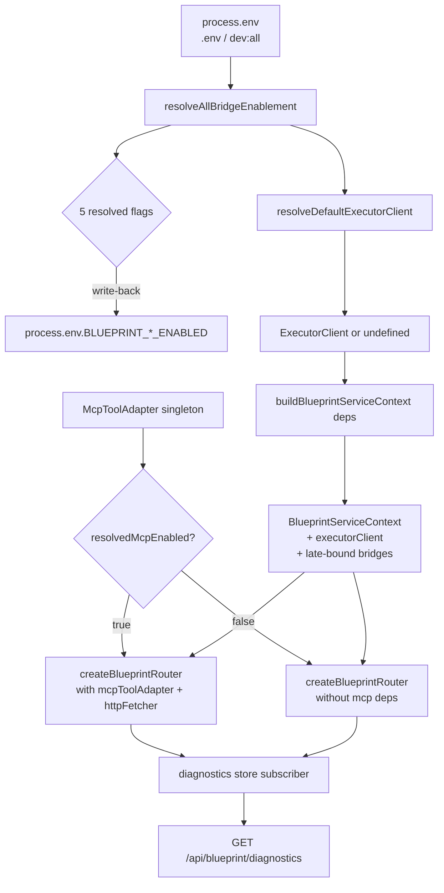
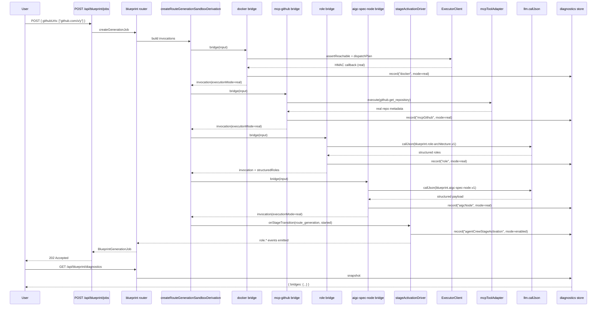
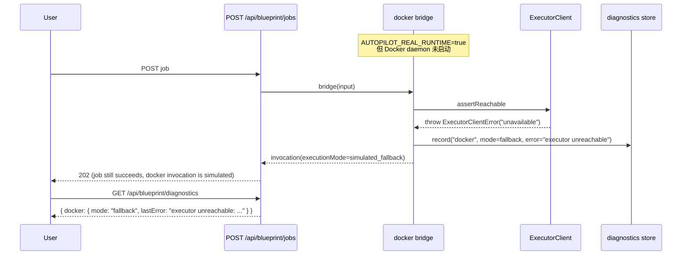

# 设计文档：Autopilot Capability Runtime Enablement

## 1. 设计概述

本 spec 把已经落地的 5 条 `/autopilot` capability bridge 从“代码存在但默认关闭”推进为“默认在真实部署中通电”，使一次真实 GitHub 提交（例如 `https://github.com/666ghj/MiroFish`）能真正触发：

- Docker 沙箱执行（`docker-analysis-sandbox`）
- MCP GitHub 元数据抓取（`mcp-github-source`）
- LLM 角色推理（`role-system-architecture`）
- LLM AIGC 子系统推理（`aigc-spec-node`）
- Stage-driven role state machine（`agent-crew-stage-activation` 驱动 `role.activated / watching / reviewing / sleeping`）

而不是像今天这样，全部在默认装配下走 `buildCapabilityOutputSummary()` 模板化 fallback。

本 spec **不引入任何新 capability、不修改任何共享 contract、不改写 invocation / evidence / role / stage 的对外字段形态**。它只做一件事：在 `server/routes/blueprint/context.ts` / `server/index.ts` / `.env.example` / `.kiro/steering/project-overview.md` 这几个“装配层”和“文档层”文件上，把默认状态从 opt-in 翻成 opt-out + 单一 master switch + 优雅降级 + 可观测诊断端点。

核心约束（与既有 spec 不可违背的兼容性论证链对齐）：

- 既有 5140+ 测试全部沿用“fake executorClient / fake callJson / fake mcpToolAdapter + 显式 `vi.stubEnv(..., "true")` 或显式不 stub”模式；本 spec 的默认翻转必须保留“测试可再次关掉”的能力，并提供一条兼容路径，避免在 CI 里误触真实 Docker / 真实 MCP / 真实 LLM。
- 不改 `BlueprintCapabilityInvocation` / `BlueprintCapabilityEvidence` / `BlueprintAgentCrew` / `BlueprintRolePresence` 任一字段。
- 不改 `POST /api/blueprint/jobs` / `POST /api/blueprint/generations` / `POST /api/executor/events` / `POST /api/executor/jobs` 的请求/响应 schema。
- 不改任一 capability bridge 内部早退链（`tier 1: env gate` → `tier 2: dependency missing` → `tier 3: runtime error`）。本 spec 只改“env gate 的默认取值语义”与“dependency 的默认装配行为”。
- `dev:frontend` 必须继续只加载浏览器运行时，不因本 spec 的默认装配而尝试构造 `ExecutorClient` 或在构建产物里拉进 Docker / MCP 依赖。
- 当真实依赖不可用（executor 不可达、apiKey 缺失、MCP adapter 初始化失败）时，必须无缝回退到 simulated 且**服务器启动不失败、测试不失败**。

最低可接受交付：当开发者在一台装有 Docker + 配置了 `LLM_API_KEY` 的机器上执行 `pnpm run dev:all` 并提交 `https://github.com/666ghj/MiroFish`，生成的 `BlueprintGenerationJob` 应满足——

- `docker-analysis-sandbox` invocation 的 `provenance.executionMode === "real"`，`containerId` / `artifactUrl` / `durationMs` 为真实值。
- `mcp-github-source` invocation 的 `provenance.executionMode === "real"`，`executionPath === "mcp" | "http"`，`repoUrl` / `commitSha` 填充。
- `role-system-architecture` invocation 的 `provenance.executionMode === "real"`，`promptId === "blueprint.role-architecture.v1"`，`structuredRoles` 非空。
- `aigc-spec-node` invocation 的 `provenance.executionMode === "real"`，`structuredPayload` 包含真实 LLM JSON。
- `role.*` 事件的 `activationDriverExecutionMode === "real"`。
- `GET /api/blueprint/diagnostics` 返回所有桥的 `mode` 字段为 `"real"` 或 `"enabled"`。

当同一台机器关闭 Docker 后重跑同一个 URL，`GET /api/blueprint/diagnostics` 应返回 `docker: { mode: "fallback", lastError: "executor unreachable: ..." }`，其余桥仍为 `real`，任务仍能生成，只是 docker invocation 为 `simulated_fallback`。

## 2. 架构决策（Key Decisions）

### D1：引入单一 master switch `AUTOPILOT_REAL_RUNTIME`，不改现有 5 个 bridge-level env flag

五个现有的 `BLUEPRINT_*_CAPABILITY_BRIDGE_ENABLED` env flag 保持原名、原语义、原作用域——它们是 bridge 内部 **tier 1 early-exit** 的唯一门禁，既有单测（`bridge.test.ts` / `driver.test.ts` / `blueprint-routes.test.ts` 中 `vi.stubEnv(flag, "true" | "false")` 的 ~20 处用例）继续可工作。

本 spec 新增一层 **“env resolver”**，位于 `server/routes/blueprint/context.ts` 中一个纯函数：

```
resolveBridgeEnablement(envFlag, masterSwitch, buildTarget): "true" | "false" | undefined
```

解析优先级（从高到低）：

1. `BUILD_TARGET === "test"` → 返回 `"false"`（硬锁为关闭，保证既有测试的默认兼容性）
2. `envFlag` 已显式设置（非 `undefined` 且非空字符串）→ 返回原值（开发者显式设置永远最优先）
3. `masterSwitch === "true"` → 返回 `"true"`
4. `masterSwitch === "false"` → 返回 `"false"`
5. 其它 → 返回 `undefined`（走 bridge 内部的"未启用"默认语义）

resolver 的调用位置是 `server/index.ts` 启动时一次性计算 + 在进程启动初期设置 `process.env[envFlag] = resolved`（只在当前 Node 进程内生效）。选择“启动期写入 env”而不是“每次 bridge 调用时动态注入 ctx”的理由：

- bridge 的 tier-1 门禁今天就是 `process.env.BLUEPRINT_XXX_ENABLED === "true"`，直接写回 env 让 5 个 bridge 的实现代码**不用动一行**。
- `vi.stubEnv(flag, "...")` 继续覆盖启动期写入的值（vitest 的 env stub 在 test 生命周期内优先级高于 process-wide set）。
- 不引入第二条“启用状态真相源”，避免 bridge-level test vs integration test 的状态漂移。

**兼容性论证**：

- 默认 `.env.example` 中 **不设** `AUTOPILOT_REAL_RUNTIME`。
- `dev:all` / `dev:frontend` 脚本通过 `scripts/dev/` 注入 `AUTOPILOT_REAL_RUNTIME=true`（见 D4）。
- 生产部署由 ops 显式设置 `AUTOPILOT_REAL_RUNTIME=true` 或显式 opt-out。
- 测试执行器注入 `BUILD_TARGET=test`（`vitest.config.*.ts` setup 文件或 CI 环境变量）→ resolver 强制返回 `"false"` → 现有 5140+ 测试在无感知状态下继续走 fallback，除非显式 `vi.stubEnv(flag, "true")` 打开。

### D2：`BlueprintServiceContext.executorClient` 改为“条件默认构造 + 懒 health check”

今天 `buildBlueprintServiceContext(deps)` 对 `deps.executorClient` 只做透传：

```
executorClient: deps.executorClient,  // 未注入时保持 undefined
```

本 spec 改为：

```
executorClient: deps.executorClient ?? resolveDefaultExecutorClient({
  enabled: resolvedDockerBridgeEnabled,
  baseUrl: process.env.LOBSTER_EXECUTOR_BASE_URL,
  callbackSecret: process.env.EXECUTOR_CALLBACK_SECRET,
}),
```

其中 `resolveDefaultExecutorClient()` 是一个纯函数：

- `enabled === false` → 返回 `undefined`（保持今天的 dev 默认行为：不拖慢响应、不做多余 health check）。
- `enabled === true` 且 `baseUrl` 有值 → 构造 `new ExecutorClient({ baseUrl, callbackUrl })`。
- `enabled === true` 但 `baseUrl` 未设 → 返回 `undefined` + `logger.warn("executor base url missing, docker bridge will fallback")`。

**不在启动时做 health check**。理由：

- Docker bridge 内部 `isBridgeConfigured(ctx)` 已经会在每次调用时检查 `executorClient` 非空；`executorClient.assertReachable()` 在派发前被调用（`bridge.ts` Step 2），失败自然进入 fallback 路径 + `logger.warn("executor unreachable")`。
- 在启动时阻塞式 health check 会让 `npm run dev:all` 首次启动慢 2-10 秒（Docker 冷启动时间），且 Docker 可用性在 dev 机器上本来就不稳定。
- **但是**，启动时的 `resolveDefaultExecutorClient()` 会发起**非阻塞**的 fire-and-forget health probe（`executorClient.assertReachable().catch(err => diagnostics.recordDockerProbe("fail", err))`），把结果写入 diagnostics store（D5）。这样 `GET /api/blueprint/diagnostics` 在启动后几秒内就能报告 `docker.mode === "fallback"` 而不需要等到第一次用户请求。

### D3：`mcpToolAdapter` / `httpFetcher` 改为 default-on 注入

今天 `server/index.ts` 的装配是：

```
const mcpBridgeEnabled = process.env.BLUEPRINT_MCP_CAPABILITY_BRIDGE_ENABLED === "true";
if (mcpBridgeEnabled) {
  const blueprintHttpFetcher = createDefaultBlueprintHttpFetcher({ ... });
  app.use("/api/blueprint", createBlueprintRouter({
    blueprintServiceContext, mcpToolAdapter, httpFetcher: blueprintHttpFetcher,
  }));
} else {
  app.use("/api/blueprint", createBlueprintRouter({ blueprintServiceContext }));
}
```

本 spec 改为：

```
const resolvedMcpEnabled = resolveBridgeEnablement(
  "BLUEPRINT_MCP_CAPABILITY_BRIDGE_ENABLED",
  process.env.AUTOPILOT_REAL_RUNTIME,
  process.env.BUILD_TARGET,
);

const blueprintHttpFetcher = resolvedMcpEnabled === "true"
  ? createDefaultBlueprintHttpFetcher({ maxResponseBodyBytes: 1_048_576, defaultTimeoutMs: 30_000 })
  : undefined;

app.use("/api/blueprint", createBlueprintRouter({
  blueprintServiceContext,
  mcpToolAdapter: resolvedMcpEnabled === "true" ? mcpToolAdapter : undefined,
  httpFetcher: blueprintHttpFetcher,
}));
```

**关键**：

- `mcpToolAdapter` 本身在 `server/index.ts` 仍然始终构造（因为 `/api/mcp` 主路由也依赖它），本 spec 不改这一点。
- 只是“是否把它传给 blueprint router”从 `if (mcpBridgeEnabled)` 翻成 `resolvedMcpEnabled === "true"`。
- `resolvedMcpEnabled` 默认受 `AUTOPILOT_REAL_RUNTIME=true` 驱动为 `"true"`，所以 dev 默认装配下 blueprint bridge 会拿到真实 `mcpToolAdapter`。
- 测试环境 `BUILD_TARGET=test` 下 resolver 返回 `"false"`，blueprint router 拿到 `undefined`，bridge 内部 tier-2 dependency check 命中 → fallback。既有测试行为等价。

### D4：`scripts/dev/dev-all.js` / `dev-frontend.js` 注入 `AUTOPILOT_REAL_RUNTIME=true`

`dev:all` 对应服务端 + 前端双栈开发，Docker 可能可用也可能不可用，但用户意图通常是“我要跑真实流程”。在 `scripts/dev/dev-all.js` 子进程 env 注入：

```
env: {
  ...process.env,
  AUTOPILOT_REAL_RUNTIME: process.env.AUTOPILOT_REAL_RUNTIME ?? "true",
},
```

这样：

- 用户显式 `AUTOPILOT_REAL_RUNTIME=false pnpm run dev:all` → resolver 从 env 读到显式关闭 → 所有桥回 fallback。
- 用户 `pnpm run dev:all` → 默认 "true" → 所有桥尝试 real，失败自然 fallback + warn。

`dev:frontend` 不注入 `AUTOPILOT_REAL_RUNTIME`，因为该模式只启动 Vite dev server，不启动 Node server，本 spec 的默认 wiring 改动对该模式无影响。

GitHub Pages 静态构建 (`npm run build:pages`) 同样不受影响，因为它不跑 `server/index.ts`。

### D5：新增 `GET /api/blueprint/diagnostics` 端点 + 内存 diagnostics store

新增一个模块级的 `BlueprintRuntimeDiagnosticsStore`（位于 `server/routes/blueprint/diagnostics/store.ts`），以 `Map<string, BridgeDiagnosticEntry>` 形态维护每条桥的“最近一次执行模式”。

schema：

```ts
interface BridgeDiagnosticEntry {
  mode: "real" | "fallback" | "enabled" | "disabled" | "unknown";
  enabledByConfig: boolean;           // resolveBridgeEnablement 解析结果
  dependencyReady: boolean;            // executorClient / mcpAdapter / apiKey 是否就位
  lastInvocationAt?: string;           // ISO 时间
  lastMode?: "real" | "simulated_fallback";
  lastError?: string;                  // 最近一次 fallback 的 reason（已脱敏）
  totalInvocations: number;
  realInvocations: number;
  fallbackInvocations: number;
}
```

bridge 每次调用后，向 store 写入一次聚合（通过 ctx.logger 层的 hook 或 bridge output 回调）。`/api/blueprint/diagnostics` 返回：

```json
{
  "masterSwitch": "true" | "false" | null,
  "buildTarget": "test" | "dev" | "production" | null,
  "bridges": {
    "docker": { ... },
    "mcpGithub": { ... },
    "role": { ... },
    "aigcNode": { ... },
    "agentCrewStageActivation": { ... }
  },
  "generatedAt": "2026-05-12T03:45:00.000Z"
}
```

**不新增 invocation / evidence / event 字段**，所有诊断数据只暴露在这一个新 HTTP 端点上。

存储策略：in-memory、进程重启即丢失、每个 bridge 只保留最近一次状态 + 计数器。不持久化、不发 socket、不打 audit。这是“看一眼当前系统是真跑还是模拟”的最小诊断面，不是 observability pipeline 的一部分。

### D6：优雅降级语义——三层早退一致化

所有五条桥（docker / mcp / role / aigcNode / stageActivation）在遇到以下任一条件时 **不得抛错 / 不得阻塞启动 / 不得让 /api/blueprint/jobs 返回 5xx**：

1. resolver 返回的 enablement 为 `"false"` → 走 fallback（与今天行为一致）
2. 依赖缺失（executorClient / mcpToolAdapter / apiKey / structuredRoles）→ 走 fallback（与今天行为一致）
3. 运行时错误（assertReachable throws / dispatchPlan 5xx / callJson throws / llm timeout）→ 走 fallback 并在 provenance.error 填充脱敏 reason（与今天行为一致）

本 spec 验证这三层在“默认 opt-in on”场景下全部可用，并在 `blueprint-routes.test.ts` 中显式补 “dev 默认装配但 Docker / MCP / LLM 全挂” 的退化路径集成测试（见 tasks §2）。

### D7：测试策略——`BUILD_TARGET=test` 自动关闭 + 少量显式 opt-in 测试打开

今天测试之所以能通过 5140+，是因为 5 个 env flag 默认 off 时 bridge 走 fallback，测试断言的是 fallback 形态。本 spec 翻转默认后有两种方案：

方案 A（否决）：`BLUEPRINT_*_CAPABILITY_BRIDGE_ENABLED` 直接默认 `"true"`，让每个测试显式 stub false。否决理由：要改 5140 条测试里 ~50-100 个隐式依赖 fallback 的用例，改动面不可控。

方案 B（采用）：resolver 检测 `BUILD_TARGET === "test"` 直接强制关闭，等价于今天的“env 未设”。这样：

- 对 5140 个既有测试完全透明。
- 已经显式 `vi.stubEnv(flag, "true")` 的 ~20 个测试继续工作（`vi.stubEnv` 在 test 生命周期内优先级最高，覆盖 resolver 的 process.env 写入）。
- 生产 / dev 默认 on，测试默认 off，真相源单一。

`vitest.config.server.ts` / `vitest.config.ts` 在 setup 文件里注入：

```ts
// vitest.setup.ts
if (!process.env.BUILD_TARGET) {
  process.env.BUILD_TARGET = "test";
}
```

或者通过 `defineConfig({ test: { env: { BUILD_TARGET: "test" } } })`。

### D8：资源与启动顺序

`server/index.ts` 现有启动顺序：

```
1. initRAG()
2. initEnrichmentBridge()
3. buildBlueprintServiceContext({})  ← 当前无 deps
4. mcpToolAdapter = new McpToolAdapter(...)
5. if (mcpBridgeEnabled) createBlueprintRouter({ ..., mcpToolAdapter, httpFetcher })
6. else createBlueprintRouter({ blueprintServiceContext })
```

本 spec 改为：

```
1. initRAG()
2. initEnrichmentBridge()
3. resolveAllBridgeEnablement() 一次性计算 5 个 flag 的最终取值并写回 process.env
4. buildBlueprintServiceContext({ executorClient: resolveDefaultExecutorClient(...) })
   - 注意：executorClient 现在默认构造（如果 master switch=on 且 baseUrl 有值）
   - buildBlueprintServiceContext 内部 late-bind 所有 bridge 时它们会看到 ctx.executorClient 非空
5. mcpToolAdapter = new McpToolAdapter(...)
6. createBlueprintRouter({ blueprintServiceContext, mcpToolAdapter?, httpFetcher? })
   - 根据 resolvedMcpEnabled 传递或不传
7. diagnostics store 订阅 ctx.eventBus，开始记录 bridge 事件
8. /api/blueprint/diagnostics 挂载（在 createBlueprintRouter 内部添加）
```

### D9：不新增 bridge、不新增 contract、不新增 event

反复强调：

- 不加 capability 类型。
- 不加 `BlueprintCapabilityInvocation` / `BlueprintCapabilityEvidence` / `BlueprintAgentCrew` / `BlueprintRolePresence` 字段。
- 不加 `BlueprintEventName` 常量。
- 不加新的 HTTP 路由（只加 `GET /api/blueprint/diagnostics` 一个只读端点）。
- 不改任何 bridge 的内部实现逻辑（只改 bridge 外层的装配与默认值）。

## 3. 系统架构（High-Level Design）

### 3.1 启动期组件关系



### 3.2 运行期请求数据流



### 3.3 容错退化路径



### 3.4 默认状态决策矩阵

| 场景 | `AUTOPILOT_REAL_RUNTIME` | `BLUEPRINT_DOCKER_*` | `BUILD_TARGET` | `executorClient` | docker bridge 实际行为 |
| --- | --- | --- | --- | --- | --- |
| `dev:all` 默认 | (注入 "true") | unset | unset | ExecutorClient 实例 | 真实 Docker（若可达），否则 fallback |
| `dev:all AUTOPILOT_REAL_RUNTIME=false` | "false" | unset | unset | undefined | fallback |
| 生产部署 默认 | unset | unset | "production" | undefined | fallback（ops 需显式开启） |
| 生产部署 opt-in | "true" | unset | "production" | ExecutorClient 实例 | 真实 Docker |
| vitest 默认 | (任意) | unset | "test" | undefined | fallback（兼容既有 5140 测试） |
| vitest 用例显式 opt-in | (任意) | 被 vi.stubEnv 覆盖为 "true" | "test" | 被 test 注入的 fake | 走 fake（测试断言真实路径） |
| `dev:frontend` | 不注入 | 不生效 | 不生效 | N/A（无 Node server） | N/A |
| GitHub Pages | N/A | N/A | N/A | N/A | N/A |

### 3.5 组件所有权图

| 组件 | 文件 | 本 spec 改动 |
| --- | --- | --- |
| master switch resolver | `server/routes/blueprint/runtime-enablement/resolver.ts` (新增) | 新建 |
| default executor factory | `server/routes/blueprint/runtime-enablement/executor-factory.ts` (新增) | 新建 |
| diagnostics store | `server/routes/blueprint/runtime-enablement/diagnostics-store.ts` (新增) | 新建 |
| diagnostics route handler | `server/routes/blueprint.ts` (改造) | 在 router 内新增 `GET /diagnostics` |
| context 默认装配 | `server/routes/blueprint/context.ts` (改造) | 修改 `buildBlueprintServiceContext` |
| composition root | `server/index.ts` (改造) | 翻转 `mcpBridgeEnabled` 默认、注入 executorClient |
| dev scripts | `scripts/dev/dev-all.js` (改造) | 注入 `AUTOPILOT_REAL_RUNTIME=true` |
| env example | `.env.example` (改造) | 注释说明 master switch + 5 flags |
| steering | `.kiro/steering/project-overview.md` (改造) | 更新 runtime current state 段落 |
| 测试 setup | `vitest.setup.ts` (可能新建或扩展) | 注入 `BUILD_TARGET=test` |

## 4. 接口与核心数据结构（Low-Level Design）

### 4.1 `resolveBridgeEnablement` 纯函数

**签名：**

```typescript
export type BridgeEnablementKey =
  | "BLUEPRINT_DOCKER_CAPABILITY_BRIDGE_ENABLED"
  | "BLUEPRINT_MCP_CAPABILITY_BRIDGE_ENABLED"
  | "BLUEPRINT_ROLE_CAPABILITY_BRIDGE_ENABLED"
  | "BLUEPRINT_AIGC_NODE_CAPABILITY_BRIDGE_ENABLED"
  | "BLUEPRINT_AGENT_CREW_STAGE_ACTIVATION_ENABLED";

export interface ResolveBridgeEnablementInput {
  /** 具体桥的环境变量名。 */
  envFlag: BridgeEnablementKey;
  /** 当前 `process.env[envFlag]`，未设为 `undefined`。 */
  explicitEnvValue: string | undefined;
  /** `process.env.AUTOPILOT_REAL_RUNTIME`，未设为 `undefined`。 */
  masterSwitch: string | undefined;
  /** `process.env.BUILD_TARGET`，未设为 `undefined`。 */
  buildTarget: string | undefined;
}

export function resolveBridgeEnablement(
  input: ResolveBridgeEnablementInput
): "true" | "false" | undefined;
```

**前置条件 (Preconditions):**

- 所有字符串输入均为 `string | undefined`（不能是 `null`）。
- `envFlag` 必须是 `BridgeEnablementKey` 联合之一（编译期保障）。

**后置条件 (Postconditions):**

- 返回值为 `"true"`、`"false"` 或 `undefined`，不抛异常。
- 对同一 input 多次调用返回相同值（纯函数、无副作用）。
- 不读取 `process.env`（全部入参，便于测试）。

**算法（Structured Pseudocode）：**

```pascal
ALGORITHM resolveBridgeEnablement(input)
INPUT: input = { envFlag, explicitEnvValue, masterSwitch, buildTarget }
OUTPUT: "true" | "false" | undefined

BEGIN
  // 步骤 1：测试环境硬锁
  IF buildTarget = "test" THEN
    // 除非 explicitEnvValue 为 "true"（允许单测显式 opt-in）
    IF explicitEnvValue = "true" THEN
      RETURN "true"
    END IF
    RETURN "false"
  END IF

  // 步骤 2：开发者显式值最优先
  IF explicitEnvValue ≠ undefined AND explicitEnvValue ≠ "" THEN
    RETURN explicitEnvValue
  END IF

  // 步骤 3：master switch
  IF masterSwitch = "true" THEN
    RETURN "true"
  END IF
  IF masterSwitch = "false" THEN
    RETURN "false"
  END IF

  // 步骤 4：未知状态（等价于今天的"未设"）
  RETURN undefined
END
```

**Loop Invariants:** N/A（无循环）。

### 4.2 `resolveAllBridgeEnablement` 副作用函数

**签名：**

```typescript
export interface ResolvedBridgeEnablement {
  docker: "true" | "false" | undefined;
  mcpGithub: "true" | "false" | undefined;
  role: "true" | "false" | undefined;
  aigcNode: "true" | "false" | undefined;
  agentCrewStageActivation: "true" | "false" | undefined;
}

/**
 * 启动期一次性计算所有 5 条桥的 enablement，并把解析结果写回 `process.env`。
 * 写回后，既有 bridge 的 tier-1 `process.env.X === "true"` 判断自然获得新默认值。
 */
export function resolveAllBridgeEnablement(
  env: NodeJS.ProcessEnv
): ResolvedBridgeEnablement;
```

**前置条件:**
- `env` 参数传入的就是 `process.env`（允许测试传入 fake env 对象）。

**后置条件:**
- 对每个 `envFlag`：若 `resolveBridgeEnablement` 返回非 `undefined` 值且与当前 `env[envFlag]` 不同，则写回 `env[envFlag] = resolved`。
- 若 resolved 为 `undefined` 且当前 `env[envFlag]` 也未设，不做任何操作。
- 函数返回值为 5 个桥的解析结果（用于 composition root 决策 `mcpToolAdapter` 传递、`executorClient` 构造等）。

**算法：**

```pascal
ALGORITHM resolveAllBridgeEnablement(env)
BEGIN
  masterSwitch ← env["AUTOPILOT_REAL_RUNTIME"]
  buildTarget ← env["BUILD_TARGET"]

  FOR each key IN ["BLUEPRINT_DOCKER_CAPABILITY_BRIDGE_ENABLED",
                   "BLUEPRINT_MCP_CAPABILITY_BRIDGE_ENABLED",
                   "BLUEPRINT_ROLE_CAPABILITY_BRIDGE_ENABLED",
                   "BLUEPRINT_AIGC_NODE_CAPABILITY_BRIDGE_ENABLED",
                   "BLUEPRINT_AGENT_CREW_STAGE_ACTIVATION_ENABLED"] DO
    resolved ← resolveBridgeEnablement({
      envFlag: key,
      explicitEnvValue: env[key],
      masterSwitch: masterSwitch,
      buildTarget: buildTarget,
    })

    IF resolved ≠ undefined AND env[key] ≠ resolved THEN
      env[key] ← resolved
    END IF
  END FOR

  RETURN {
    docker: env["BLUEPRINT_DOCKER_CAPABILITY_BRIDGE_ENABLED"] = "true" ? "true" : ...,
    mcpGithub: ...,
    role: ...,
    aigcNode: ...,
    agentCrewStageActivation: ...,
  }
END
```

**Loop Invariants:**
- 循环的每次迭代后，被处理的 env key 的值要么保持不变（若 resolver 返回 undefined），要么等于 resolver 的决策值。
- 循环从不删除 env key，只可能覆盖或保持。

### 4.3 `resolveDefaultExecutorClient` 工厂

**签名：**

```typescript
export interface ResolveExecutorClientInput {
  /** 解析后的 docker 桥启用状态。 */
  dockerEnabled: "true" | "false" | undefined;
  /** `process.env.LOBSTER_EXECUTOR_BASE_URL`。 */
  baseUrl: string | undefined;
  /** server 自身的 callback URL（通常来自 `buildServerBaseUrl(request)` 或 config）。 */
  callbackUrl: string;
  /** 可选 logger，默认 silent。 */
  logger?: BlueprintLogger;
  /** 可选 probe hook（fire-and-forget），用于 diagnostics store 订阅。 */
  onProbeResult?: (result: { reachable: boolean; error?: string }) => void;
}

export function resolveDefaultExecutorClient(
  input: ResolveExecutorClientInput
): ExecutorClient | undefined;
```

**前置条件:**
- 若 `dockerEnabled === "true"`，`baseUrl` 通常应非空；为空时函数返回 `undefined` 并 warn。
- `callbackUrl` 必须是合法 URL 字符串（调用方负责构造）。

**后置条件:**
- 若 `dockerEnabled !== "true"` → 返回 `undefined`，不发 probe。
- 若 `dockerEnabled === "true"` 且 `baseUrl` 为空或非法 → 返回 `undefined`，`logger.warn("executor base url missing")`，不发 probe。
- 若 `dockerEnabled === "true"` 且 `baseUrl` 合法 → 返回 `new ExecutorClient({ baseUrl, callbackUrl })`，并以 `setImmediate` 或 microtask 调度一次 `assertReachable()`，结果通过 `onProbeResult` 回调（不阻塞启动）。

**算法：**

```pascal
ALGORITHM resolveDefaultExecutorClient(input)
BEGIN
  IF input.dockerEnabled ≠ "true" THEN
    RETURN undefined
  END IF

  IF input.baseUrl = undefined OR input.baseUrl = "" THEN
    input.logger?.warn("executor base url missing, docker bridge will fallback")
    RETURN undefined
  END IF

  TRY
    client ← new ExecutorClient({ baseUrl: input.baseUrl, callbackUrl: input.callbackUrl })
  CATCH error
    input.logger?.warn("executor client construction failed: " + error.message)
    RETURN undefined
  END TRY

  // Fire-and-forget probe
  IF input.onProbeResult ≠ undefined THEN
    queueMicrotask(() ⇒ {
      client.assertReachable()
        .then(() ⇒ input.onProbeResult({ reachable: true }))
        .catch(err ⇒ input.onProbeResult({ reachable: false, error: err.message }))
    })
  END IF

  RETURN client
END
```

**Loop Invariants:** N/A。

### 4.4 `BlueprintRuntimeDiagnosticsStore`

**数据结构：**

```typescript
export type BridgeId =
  | "docker"
  | "mcpGithub"
  | "role"
  | "aigcNode"
  | "agentCrewStageActivation";

export interface BridgeDiagnosticEntry {
  bridgeId: BridgeId;
  mode: "real" | "fallback" | "enabled" | "disabled" | "unknown";
  enabledByConfig: boolean;
  dependencyReady: boolean;
  lastInvocationAt: string | undefined;
  lastMode: "real" | "simulated_fallback" | undefined;
  lastError: string | undefined;
  totalInvocations: number;
  realInvocations: number;
  fallbackInvocations: number;
}

export interface BlueprintRuntimeDiagnosticsSnapshot {
  masterSwitch: string | null;
  buildTarget: string | null;
  bridges: Record<BridgeId, BridgeDiagnosticEntry>;
  generatedAt: string;
}

export interface BlueprintRuntimeDiagnosticsStore {
  recordBridgeInvocation(
    bridgeId: BridgeId,
    result: { mode: "real" | "simulated_fallback"; error?: string }
  ): void;
  recordBridgeConfiguration(
    bridgeId: BridgeId,
    config: { enabledByConfig: boolean; dependencyReady: boolean }
  ): void;
  snapshot(now: () => Date): BlueprintRuntimeDiagnosticsSnapshot;
}

export function createBlueprintRuntimeDiagnosticsStore(): BlueprintRuntimeDiagnosticsStore;
```

**约束：**
- 纯内存、进程级 singleton 或由 `buildBlueprintServiceContext` 装配的 per-ctx 实例（本 spec 选择 per-ctx，便于测试隔离）。
- `recordBridgeInvocation` 必须为 O(1)，不做任何 I/O。
- `snapshot()` 返回深拷贝，调用方不得污染内部状态。
- 错误字符串被截断到 400 字符并脱敏（复用 `applyAgentCrewRedaction` 或类似工具；本 spec 不引入新的脱敏逻辑）。

### 4.5 `buildBlueprintServiceContext` 的改造点

**新增 deps 字段：**

```typescript
export interface BlueprintServiceContextDeps {
  // ... 既有字段保持不变 ...

  /**
   * 可选：注入 diagnostics store 实例。未提供时 `buildBlueprintServiceContext`
   * 默认装配 `createBlueprintRuntimeDiagnosticsStore()`。
   */
  runtimeDiagnostics?: BlueprintRuntimeDiagnosticsStore;

  /**
   * 可选：是否自动构造默认 ExecutorClient。
   * 未提供时通过 `resolveDefaultExecutorClient({ dockerEnabled: process.env.BLUEPRINT_DOCKER_CAPABILITY_BRIDGE_ENABLED, ... })` 决定。
   * 测试中可通过显式 `executorClient: fake` 继续 override。
   */
  autoResolveExecutorClient?: boolean;  // 默认 true
}
```

**新增 ctx 字段：**

```typescript
export interface BlueprintServiceContext {
  // ... 既有字段保持不变 ...

  /** 运行时诊断 store，默认装配。 */
  runtimeDiagnostics: BlueprintRuntimeDiagnosticsStore;
}
```

**装配算法（修改点）：**

```pascal
ALGORITHM buildBlueprintServiceContext(deps)
BEGIN
  // ... 既有步骤 1-N（now / logger / jobStore / llm / ...） ...

  // 新增步骤：diagnostics store
  runtimeDiagnostics ← deps.runtimeDiagnostics ?? createBlueprintRuntimeDiagnosticsStore()

  // 新增步骤：executor client 默认解析
  IF deps.executorClient = undefined AND (deps.autoResolveExecutorClient ≠ false) THEN
    executorClient ← resolveDefaultExecutorClient({
      dockerEnabled: process.env["BLUEPRINT_DOCKER_CAPABILITY_BRIDGE_ENABLED"],
      baseUrl: process.env["LOBSTER_EXECUTOR_BASE_URL"],
      callbackUrl: deriveCallbackUrl(),  // 复用 buildCallbackUrl 工具
      logger: logger,
      onProbeResult: (result) ⇒ {
        runtimeDiagnostics.recordBridgeConfiguration("docker", {
          enabledByConfig: process.env["BLUEPRINT_DOCKER_CAPABILITY_BRIDGE_ENABLED"] = "true",
          dependencyReady: result.reachable,
        })
      },
    })
  ELSE
    executorClient ← deps.executorClient
  END IF

  // 其余字段装配（保持不变）
  baseCtx ← { ..., executorClient: executorClient, runtimeDiagnostics: runtimeDiagnostics, ... }

  // bridge late-bind（保持不变，但 bridge 工厂在包装 invocation 回调时会调
  // runtimeDiagnostics.recordBridgeInvocation(...)；此处由每个 bridge 在其
  // 内部 Step 5/6 完成，无需本 spec 改 bridge 代码——改由 ctx 级事件拦截器实现，
  // 见 §4.6）
  ...

  RETURN ctx
END
```

**前置条件:** 
- `deps.executorClient` 与 `deps.autoResolveExecutorClient` 不同时冲突（`executorClient !== undefined` 时 `autoResolveExecutorClient` 被忽略）。

**后置条件:**
- 返回的 ctx 必定有非 undefined 的 `runtimeDiagnostics`。
- `ctx.executorClient` 在测试未注入且 `BUILD_TARGET=test` 时保持 undefined（因为 docker flag 经 resolver 被强制为 "false"，`resolveDefaultExecutorClient` 返回 undefined）。
- 在 dev 默认装配下（master switch 注入 "true"），`ctx.executorClient` 为真实 `ExecutorClient` 实例。

### 4.6 Diagnostics 事件订阅机制

bridge 内部不改动，diagnostics 的 invocation 记录通过 `ctx.eventBus` 订阅实现：

```typescript
/**
 * 挂载在 ctx.eventBus 上的订阅者：把 capability.invoked / capability.completed /
 * sandbox.job.completed / role.* 事件翻译为 diagnostics store 记录。
 * 不改 bridge 实现，不改事件 payload。
 */
export function attachDiagnosticsSubscriber(
  eventBus: BlueprintEventBus,
  store: BlueprintRuntimeDiagnosticsStore
): () => void;
```

**算法：**

```pascal
ALGORITHM attachDiagnosticsSubscriber(eventBus, store)
BEGIN
  unsubscribe ← eventBus.subscribe((event) ⇒ {
    IF event.type = "capability.completed" OR event.type = "capability.failed" THEN
      capabilityId ← event.payload?.capabilityId
      executionMode ← event.payload?.provenance?.executionMode  // "real" | "simulated_fallback"
      error ← event.payload?.provenance?.error

      bridgeId ← mapCapabilityIdToBridgeId(capabilityId)
      // "docker-analysis-sandbox" → "docker"
      // "mcp-github-source" → "mcpGithub"
      // "role-system-architecture" → "role"
      // "aigc-spec-node" → "aigcNode"

      IF bridgeId ≠ undefined AND executionMode ≠ undefined THEN
        store.recordBridgeInvocation(bridgeId, { mode: executionMode, error: error })
      END IF
    END IF

    IF event.family = "role" AND event.activationDriverExecutionMode ≠ undefined THEN
      store.recordBridgeInvocation("agentCrewStageActivation", {
        mode: event.activationDriverExecutionMode = "real" ? "real" : "simulated_fallback",
        error: event.fallbackReason,
      })
    END IF
  })

  RETURN unsubscribe
END
```

此订阅挂在 `buildBlueprintServiceContext` 末尾或 `createBlueprintRouter` 内。

### 4.7 `GET /api/blueprint/diagnostics` 路由

**路径：** `GET /api/blueprint/diagnostics`

**查询参数：** 无

**响应 200 JSON:**

```json
{
  "masterSwitch": "true",
  "buildTarget": null,
  "bridges": {
    "docker": {
      "bridgeId": "docker",
      "mode": "real",
      "enabledByConfig": true,
      "dependencyReady": true,
      "lastInvocationAt": "2026-05-12T03:45:00.000Z",
      "lastMode": "real",
      "lastError": null,
      "totalInvocations": 3,
      "realInvocations": 3,
      "fallbackInvocations": 0
    },
    "mcpGithub": { ... },
    "role": { ... },
    "aigcNode": { ... },
    "agentCrewStageActivation": { ... }
  },
  "generatedAt": "2026-05-12T03:45:00.123Z"
}
```

**处理函数签名：**

```typescript
function handleDiagnostics(
  ctx: BlueprintServiceContext
): express.RequestHandler;
```

**算法：**

```pascal
ALGORITHM handleDiagnostics(ctx)
BEGIN
  RETURN (req, res) ⇒ {
    TRY
      snapshot ← ctx.runtimeDiagnostics.snapshot(ctx.now)
      res.status(200).json(snapshot)
    CATCH error
      ctx.logger.error("diagnostics snapshot failed", { error: errorMessage(error) })
      res.status(500).json({ error: "diagnostics unavailable" })
    END TRY
  }
END
```

### 4.8 `server/index.ts` composition root 改造

**改动点（伪代码 diff）：**

```pascal
// 启动期早段插入
resolvedEnablement ← resolveAllBridgeEnablement(process.env)

// 既有 buildBlueprintServiceContext({}) 改为：
blueprintServiceContext ← buildBlueprintServiceContext({
  // autoResolveExecutorClient 默认 true，无需显式传
  // executorClient 会按 resolvedEnablement.docker 自动解析
  now: () ⇒ new Date(),
})

// 既有 mcpBridgeEnabled 分支改为：
IF resolvedEnablement.mcpGithub = "true" THEN
  blueprintHttpFetcher ← createDefaultBlueprintHttpFetcher({
    maxResponseBodyBytes: 1_048_576,
    defaultTimeoutMs: 30_000,
  })
  app.use("/api/blueprint", createBlueprintRouter({
    blueprintServiceContext: blueprintServiceContext,
    mcpToolAdapter: mcpToolAdapter,
    httpFetcher: blueprintHttpFetcher,
  }))
  blueprintServiceContext.runtimeDiagnostics.recordBridgeConfiguration("mcpGithub", {
    enabledByConfig: true,
    dependencyReady: true,
  })
ELSE
  app.use("/api/blueprint", createBlueprintRouter({
    blueprintServiceContext: blueprintServiceContext,
  }))
  blueprintServiceContext.runtimeDiagnostics.recordBridgeConfiguration("mcpGithub", {
    enabledByConfig: resolvedEnablement.mcpGithub = "true",
    dependencyReady: false,
  })
END IF

// role / aigcNode / agentCrewStageActivation 不需要 composition root 改动——
// 它们只依赖 ctx.llm（已默认装配）与各自的 env flag。resolvedEnablement 已
// 把 flag 写回 process.env，bridge 的 tier-1 门禁会自动放行。
```

**前置条件:**
- 在调用 `buildBlueprintServiceContext` 之前，`resolveAllBridgeEnablement(process.env)` 必须已执行。

**后置条件:**
- blueprint router 装配完成后，`blueprintServiceContext.runtimeDiagnostics` 对 5 条桥都有 configuration 记录。
- `/api/blueprint/diagnostics` 可立即返回有效 snapshot（即使没有任何 job 跑过）。

### 4.9 `dev-all.js` 脚本改造

**改动点：** 在子进程 env 注入 `AUTOPILOT_REAL_RUNTIME`。

```pascal
PROCEDURE spawnServerProcess(options)
BEGIN
  env ← { ...process.env }

  // 新增：默认启用 real runtime，除非用户显式关闭
  IF env["AUTOPILOT_REAL_RUNTIME"] = undefined THEN
    env["AUTOPILOT_REAL_RUNTIME"] ← "true"
  END IF

  spawn("node", ["server/index.ts"], { env: env, ... })
END
```

### 4.10 脱敏策略

所有 `provenance.error` / `lastError` 字段在写入 diagnostics 前复用既有 `applyAgentCrewRedaction` 或 `applyAigcNodeCapabilityRedaction`（两者在本仓已存在）。本 spec 不新增脱敏函数，不处理新的凭证类型。

最大长度 400 字符（复用既有 `ERROR_REASON_MAX_LENGTH` 常量值）。

## 5. 错误处理

### 5.1 启动期错误

| 场景 | 行为 | 降级表现 |
| --- | --- | --- |
| `resolveAllBridgeEnablement` 抛错 | 被 `server/index.ts` try/catch 包裹，fallback 为全部桥 `disabled` | 服务器正常启动，所有桥走 fallback |
| `resolveDefaultExecutorClient` 构造失败 | `logger.warn` + 返回 undefined | docker 桥走 fallback |
| executor probe 失败 | `onProbeResult({ reachable: false, error })` 写入 diagnostics | 首次 job 仍尝试 assertReachable，失败再 fallback |
| `createBlueprintRuntimeDiagnosticsStore` 抛错 | 不可能（纯 Map 构造），但 try/catch 兜底 | `ctx.runtimeDiagnostics` 回落 no-op stub |

### 5.2 运行期错误

| 场景 | 行为 |
| --- | --- |
| `recordBridgeInvocation` 抛错 | try/catch 吞错，logger.warn；不影响请求 |
| `/api/blueprint/diagnostics` snapshot 失败 | 返回 500 + `{ error: "diagnostics unavailable" }` |
| event subscriber 抛错 | 事件总线本身 try/catch，不传播；logger.warn |

### 5.3 默认 on 但依赖缺失的典型退化

| 场景 | `executorClient` | `mcpToolAdapter` in ctx | `apiKey` | 影响 |
| --- | --- | --- | --- | --- |
| Docker daemon 未启动 | 构造成功，assertReachable 失败 | N/A | N/A | docker invocation = simulated_fallback |
| `LOBSTER_EXECUTOR_BASE_URL` 未设 | undefined | N/A | N/A | docker invocation = simulated_fallback |
| `LLM_API_KEY` 未设 | N/A | N/A | "" | role / aigcNode invocation = simulated_fallback |
| mcp http fetcher 超时 | N/A | 构造成功但 execute 抛错 | N/A | mcp invocation = simulated_fallback |
| `apiKey` 错误（401） | N/A | N/A | 错 | role / aigcNode invocation = simulated_fallback |

全部场景：**服务器启动成功 + job 创建成功 + diagnostics 报告对应 bridge 为 fallback + 相关 logger.warn 被调用**。

## 6. 测试策略

### 6.1 单元测试（co-located，新增）

| 文件 | 覆盖范围 |
| --- | --- |
| `server/routes/blueprint/runtime-enablement/resolver.test.ts` | `resolveBridgeEnablement` 的 10+ 场景 |
| `server/routes/blueprint/runtime-enablement/executor-factory.test.ts` | `resolveDefaultExecutorClient` 的 6 场景 |
| `server/routes/blueprint/runtime-enablement/diagnostics-store.test.ts` | store 的 record / snapshot |
| `server/routes/blueprint/runtime-enablement/subscriber.test.ts` | event subscriber 映射逻辑 |

所有单测 example-based，**不引入 PBT**（与既有 bridge spec 的 §9.3 对齐）。

### 6.2 集成测试（append 到 `blueprint-routes.test.ts`）

追加 3-4 条 E2E：

1. **Default on path**：`vi.stubEnv("BUILD_TARGET", "production")` + `vi.stubEnv("AUTOPILOT_REAL_RUNTIME", "true")` + 注入 fake executorClient / fake mcpToolAdapter / fake callJson → 断言 `provenance.executionMode === "real"`，diagnostics 显示 `{ docker: "real", mcpGithub: "real", ... }`。
2. **Master switch off**：`vi.stubEnv("BUILD_TARGET", "production")` + `vi.stubEnv("AUTOPILOT_REAL_RUNTIME", "false")` + 注入同样 fakes → 断言所有 invocation 为 `simulated_fallback`，diagnostics 显示 `{ docker: "disabled", ... }`。
3. **Executor unreachable graceful fallback**：`AUTOPILOT_REAL_RUNTIME=true` + fake executorClient 的 `assertReachable` 抛错 → 断言 docker 单独 fallback，其余桥仍为 real，job 仍返回 202。
4. **Diagnostics endpoint smoke**：`GET /api/blueprint/diagnostics` 返回 5 个桥的 snapshot，schema 正确。

### 6.3 回归保护

既有 5140+ 测试全部不改。`vitest.setup.ts` 注入 `BUILD_TARGET=test` 保证 resolver 在测试中强制 "false" → bridge 默认 fallback → 既有断言保留。

已经显式 `vi.stubEnv("BLUEPRINT_XXX_ENABLED", "true")` 的 ~20 个测试保持原行为（stubEnv 覆盖 resolver 的 process.env 写入）。

## 7. 正确性属性（Correctness Properties）

本 spec 必须上持以下不变量（在设计与实现中严格保证）：

### P1：启动期不可阻塞
**∀** 启动环境 `env`（`AUTOPILOT_REAL_RUNTIME`、`LOBSTER_EXECUTOR_BASE_URL`、`LLM_API_KEY` 任意组合）：`server/index.ts` 的 `createServer()` **必须**在 **< 5 秒**内完成所有同步初始化并开始监听，**不得**在启动时等待 executor health check、MCP 初始化或 LLM 可用性。

### P2：启动成功不依赖外部服务
**∀** 启动 `env`：即使 Docker daemon 未启动、`LOBSTER_EXECUTOR_BASE_URL` 不可达、`LLM_API_KEY` 未设、MCP adapter 抛错，服务器**必须**成功启动并接受 HTTP 请求；对 `POST /api/blueprint/jobs` 的请求必须返回 2xx 而不是 5xx。

### P3：测试兼容性不变
**∀** 既有测试 `T`（5140+ 条）：在不引入 `vi.stubEnv("AUTOPILOT_REAL_RUNTIME", ...)` 与不引入 `vi.stubEnv("BUILD_TARGET", "production")` 的前提下，`T` 的断言结果与本 spec 实施前**必须完全相同**。

### P4：显式 opt-in 权威不变
**∀** 桥 `B`、**∀** env 状态：若开发者显式设置 `process.env[B.envFlag]` 为非空值 `V`（`"true"` 或 `"false"`），则 bridge `B` 的 tier-1 门禁**必须**使用 `V` 而不是 master switch 的值。`vi.stubEnv(B.envFlag, V)` 等价于显式设置。

### P5：Diagnostics 真实性
**∀** 成功响应的 `GET /api/blueprint/diagnostics`：对任一桥 `B`，若 `diagnostics.bridges[B].mode === "real"`，则**至少存在一次** `B` 的 invocation 的 `provenance.executionMode === "real"` 发生在 `lastInvocationAt` 之前；若 `mode === "fallback"`，则 `lastMode === "simulated_fallback"`。

### P6：优雅降级不抛错
**∀** 运行时错误 `E`（executor unreachable / apiKey missing / MCP init fails / callJson throws / dispatchPlan timeout）：bridge `B` 调用必须返回 invocation 对象且 `provenance.executionMode === "simulated_fallback"`、`provenance.error` 为非空字符串，**不得**抛异常到 `createRouteGenerationSandboxDerivation` 调用方，**不得**让 `POST /api/blueprint/jobs` 返回 5xx。

### P7：Invocation / Evidence / Role contract 形态不变
**∀** 桥 `B`：`B` 返回的 `BlueprintCapabilityInvocation` / `BlueprintCapabilityEvidence` 的顶层字段集合（不含 `provenance` 的**可选**字段）**必须**与本 spec 实施前完全相同。`BlueprintRolePresence` / `BlueprintAgentCrew` 结构不变。`BlueprintEventName` 枚举值不新增。

### P8：默认装配不加新外部请求
**∀** 启动：若 `AUTOPILOT_REAL_RUNTIME !== "true"` 且 `BUILD_TARGET === "test"`，`resolveDefaultExecutorClient` **必须**返回 `undefined`，**不得**构造 `ExecutorClient`、**不得**发起任何 HTTP 请求。

### P9：Composition root 操作幂等
**∀** 多次调用 `resolveAllBridgeEnablement(env)`：返回值相同，`env` 变更幂等（第二次调用后不再修改 env）。
