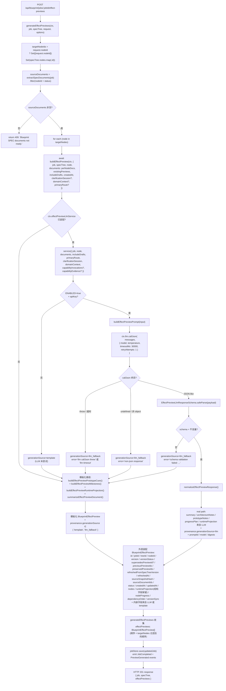
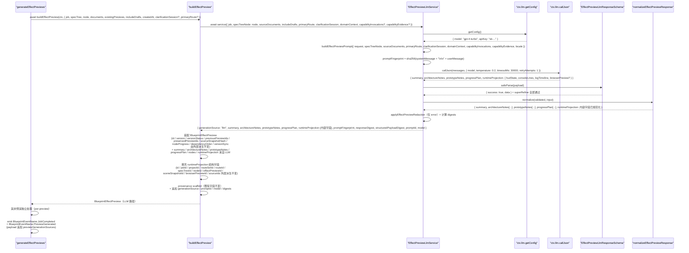
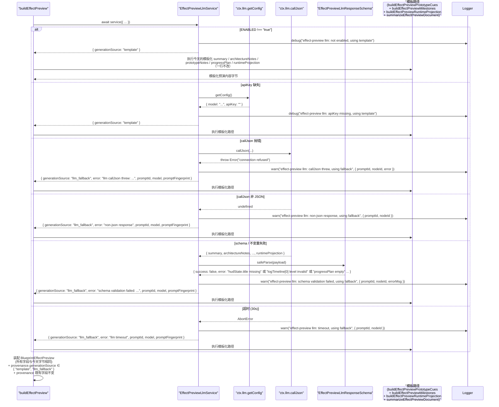

# 设计文档：Autopilot Effect Preview LLM 驱动生成

## 1. 设计概述

本 spec 把 `/autopilot` 的 **Effect Preview 生成阶段**从当前 `server/routes/blueprint.ts` 的 `generateEffectPreviews()`（~第 8678 行）+ `buildEffectPreview()`（~第 11316 行）+ `buildEffectPreviewRuntimeProjection()` + `buildEffectPreviewPrototypeCues()` + `buildEffectPreviewMilestones()` + `buildEffectPreviewNodeProgress()` + `buildEffectPreviewDependencyOrder()` 联合产出的硬编码效果预演，升级为由 `BlueprintServiceContext.llm.callJson` 按 `(nodeId, includeDrafts 语义下的 sourceDocuments 快照)` **逐份**发起 LLM 推理、通过严格 zod schema 校验后渲染为结构化 `BlueprintEffectPreview` 的真实产物；在 LLM 不可用 / apiKey 缺失 / callJson 抛错 / 非 JSON / schema 不过 / 预演级不变量违反（`progressPlan` 为空 / `runtimeProjection.hudState.title` 缺失 / `runtimeProjection.logTimeline` 为空 / `hud` / `console` / `logTimeline` id 不唯一 / 字符串越界 / 枚举值不可解析等）/ 超时任一情况下，**完全复用**既有 `buildEffectPreview()` / `buildEffectPreviewRuntimeProjection()` / `buildEffectPreviewPrototypeCues()` / `buildEffectPreviewMilestones()` / `buildEffectPreviewNodeProgress()` / `buildEffectPreviewDependencyOrder()` / `summarizeEffectPreviewDocument()` 作为确定性 fallback 路径。

本 spec 是 `autopilot-routeset-llm-generation`（RouteSet LLM）、`autopilot-spec-tree-llm`（SPEC Tree LLM）与 `autopilot-spec-documents-llm`（SPEC Documents LLM，直接上游 spec）之后的**下一阶段**，负责把 SPEC Documents → Effect Preview 这一步从「模板派生」真正升级为「LLM 派生」。整体实现模式完全复用前三条姊妹 spec 已经验证过的同一条主线：`ctx.llm.callJson` → strict zod schema（含 `.superRefine()` 跨字段不变量）→ 成功路径返回 LLM 渲染预演 / 失败路径回退到模板 → 在 `BlueprintEffectPreview.provenance` 追加 `generationSource` / `promptId` / `model` / `error` 可选字段。

### 1.1 与姊妹 spec 的本质差异

| 维度 | routeset LLM spec | spec-tree LLM spec | spec-documents LLM spec（直接上游） | **effect-preview LLM（本 spec）** |
| --- | --- | --- | --- | --- |
| 产出 JSON 内容 | 单次调用产出 `routes: Array<{...}>`（平铺） | 单次调用产出整棵 `nodes: Array<{id, parentId?, ...}>`（嵌套树） | 每份文档一次独立调用；产出 `title / summary / sections` | **每份预演一次独立调用**；产出 `summary / architectureNotes / prototypeNotes / progressPlan / runtimeProjection`（含 `hudState / consoleLines / logTimeline / browserPreview?`） |
| 调用单位 | 整个 RouteSet 一次 | 整棵 SPEC Tree 一次 | 每个 `(nodeId, type)` 对一次 | **每个 `(nodeId, includeDrafts 语义下的 sourceDocuments 快照)` 一次**；一次 `generateEffectPreviews()` 请求可能触发 N 次独立 LLM 调用（每个 target node 一次） |
| 输入依赖 | `intake + clarificationSession + githubUrls` | 多 + `routeSet + primaryRoute` | 多 + `specTreeNode + primaryRoute + 可选 upstreamEvidence` | **多 + `specTreeNode`（`type: "effect_preview"` 或任意 node）+ `sourceDocuments: BlueprintSpecDocument[]`（节点归属的 SPEC Documents）+ `selectedRoute?` + 可选 `capabilityInvocations / capabilityEvidence`** |
| 下游消费 | SPEC Tree、Sandbox Derivation、Agent Crew | SPEC Documents、Effect Preview、Prompt Package、Engineering Handoff | Effect Preview / Prompt Package / Engineering Handoff（作为 `sourceDocumentId`） | **Prompt Package（`extractEffectPreviews(job)` 被 `generateImplementationPromptPackages()` 消费）、Engineering Landing Plan、Artifact Replay、任务墙面 HUD、`hudState` / `logTimeline` 驱动的前端驾驶舱** |
| Schema 难点 | `kind` 枚举、primary 唯一 | 节点 `id` 全树唯一、`parentId` 可解析、深度 ≤ 4 | `sections.id` 文档内唯一、长度 2..20、`body` 1..8000 | **`hudState.title` 必填、`logTimeline` 非空、`progressPlan` 非空；`hudState.status` ∈ `{"preview", "completed"}` / `hudState.stage` ∈ `BlueprintGenerationStage` / `logTimeline[*].level` ∈ `{"info", "warning", "success"}`；可选 `progressPlan[*].title` 文档内唯一；`architectureNotes` 1..8、`prototypeNotes` 1..12、`progressPlan` 1..20、`consoleLines` / `logTimeline` 各 ≤ 40** |
| Fallback 数据源 | `buildTemplatedRoutes()` | `buildSpecTreeFromRouteSet()` + `createDownstreamSpecTreeNodes()` | `buildSpecDocument()` + heading/body/sections/role findings 模板 | **`buildEffectPreview()` + `buildEffectPreviewRuntimeProjection()` + `buildEffectPreviewPrototypeCues()` + `buildEffectPreviewMilestones()` + `buildEffectPreviewNodeProgress()` + `buildEffectPreviewDependencyOrder()` + `summarizeEffectPreviewDocument()` 联合产出（一行不改）** |
| 事件 payload | `route.generated` | 复用既有 `spec.tree.updated` / `spec.tree.versioned`（若已 emit） | 不新增事件名；仅 emit `JobCompleted` | **复用既有 `BlueprintEventName.PreviewGenerated`（`preview.generated`）**，主路径当前已 emit；在 payload 上追加可选 `generationSource` / `promptId` / `model` / `error` |
| 混合 provenance | N/A（单次调用） | N/A（单次调用） | 多份文档彼此独立 | **多份预演彼此独立**：一次请求中部分走 LLM 成功、部分走 fallback，各自 provenance 独立、响应体 `effectPreviews[*]` 数组顺序保持今天口径（需求 5.6 / 4.7） |
| 测试 | +2 E2E + 子域单测 | +2 E2E + ~40 co-located 单测 | +2 E2E + ~30-40 co-located 单测 | **+2 E2E + ~30-40 co-located 单测**（最低硬需求：R9.1 两条 + R9.2 四条 = +6） |

### 1.2 最低可接受交付

当 `BlueprintServiceContext.llm.callJson` 可用且 LLM 为**某一份预演**返回通过 strict zod 校验的结构化结果时，该预演的最终产出满足：

- `BlueprintEffectPreview.summary` 明显**不同**于模板化输出（不再是 `` `Preview the expected effect of ${node.title} using ${documentTitles.join(", ")}.` `` 固定句式），而是由 LLM 推导出的对该节点预期效果的真实描述
- `BlueprintEffectPreview.architectureNotes` 不再是三行固定模板（`"Anchor implementation around ..."` / `"Respect upstream dependencies: ..."` / `"Expected asset outputs: ..."`），而是由 LLM 推导出的 1..8 条架构要点
- `BlueprintEffectPreview.prototypeNotes` 不再来自 `buildEffectPreviewPrototypeCues()` 的固定文案推导
- `BlueprintEffectPreview.progressPlan` 不再来自 `buildEffectPreviewMilestones()` 的模板式 milestone 组合
- `BlueprintEffectPreview.runtimeProjection.hudState.title` / `hudState.summary` / `hudState.badges` / `logTimeline` 等运行时投影字段来自 LLM 推导，而不是 `buildEffectPreviewRuntimeProjection()` 的固定模板
- `BlueprintEffectPreview.provenance.generationSource === "llm"`
- `BlueprintEffectPreview.provenance.promptId === "blueprint.effect-preview.v1"`
- `BlueprintEffectPreview.provenance.model` 等于 `ctx.llm.getConfig().model`
- `BlueprintEffectPreview.provenance.responseDigest` / `structuredPayloadDigest` / `promptFingerprint` 匹配 `/^sha256:[a-f0-9]{64}$/`
- `BlueprintEffectPreview.provenance.error` 为 `undefined`
- `BlueprintEffectPreview` 所有既有字段（`id` / `jobId` / `treeId` / `nodeId` / `version` / `versionStatus` / `supersedesPreviewId?` / `previousPreviewIds` / `preservedPreviewIds` / `refreshedFromSpecTreeVersion` / `refreshedAt` / `sourceSnapshotHash` / `sourceDocumentIds` / `status` / `createdAt` / `updatedAt?` / `nodeProgress?` / `dependencyOrder?` / `versionSync?`）形态完全符合现有 `BlueprintEffectPreview` 类型
- `BlueprintEffectPreview.runtimeProjection` 的结构字段（`id` / `jobId` / `projectId?` / `routeSetId` / `routeId?` / `specTreeId` / `nodeId` / `effectPreviewId` / `sceneSnapshotId` / `browserPreviewId` / `sourceIds`）由外层派生保持不变；**LLM 输出只取代 `hudState` 语义字段、`logTimeline` 内容、可选 `browserPreview` 语义字段、`summary` / `architectureNotes` / `prototypeNotes` / `progressPlan` / `nodes[*].steps` / `nodes[*].milestones` / `nodes[*].prototypeCues` 等内容字段**
- `BlueprintEffectPreview.provenance` 的既有字段（`jobId` / `projectId` / `sourceId` / `targetText` / `githubUrls` / `treeVersion` / `nodeType` / `nodeTitle` / `nodeSummary` / `sourceStatus` / `includeDrafts` / `sourceDocumentStatuses`）**一字段不改**

当 LLM 未注入 / apiKey 缺失 / callJson 抛错 / 非 JSON / schema 不过 / 不变量违反 / 超时时，该预演的最终产出满足：

- `BlueprintEffectPreview.summary` / `architectureNotes` / `prototypeNotes` / `progressPlan` / `runtimeProjection.hudState` / `runtimeProjection.logTimeline` / `nodes` 与今天不走 LLM 的行为**字节级等价**（完全复用 `buildEffectPreview()` + `buildEffectPreviewRuntimeProjection()` + `buildEffectPreviewPrototypeCues()` + `buildEffectPreviewMilestones()` 的产出）
- `BlueprintEffectPreview.provenance.generationSource === "llm_fallback"`（当 LLM 被尝试过时）或 `"template"`（当 LLM 从未被尝试 / apiKey 未配置时）
- `BlueprintEffectPreview.provenance.error` 被脱敏后填充（仅 `"llm_fallback"` 情况下）
- 其它 `BlueprintEffectPreview` 既有字段与 provenance 既有字段与今天**字节相同**

当一次 `generateEffectPreviews()` 请求中部分预演走 LLM 成功、部分走 fallback 时：

- 响应体 `effectPreviews[*]` 数组的**顺序**、**长度**与 **`nodeId` 覆盖集合**与今天完全一致（需求 5.6）
- 每份预演的 `provenance.generationSource / promptId / model / error` **彼此独立**，不会因为其中一份走 fallback 而把其他走 LLM 成功的预演污染为 `"llm_fallback"`（需求 4.7）

_Requirements: 1.1, 1.2, 1.3, 1.4, 1.5, 1.6, 1.7_

### 1.3 环境变量门禁

- `BLUEPRINT_EFFECT_PREVIEW_LLM_ENABLED=true` 开启本 LLM 路径（与 RouteSet / SPEC Tree / SPEC Documents / 四条桥 spec 同模式）
- 未设或设为其它值时，即使 `ctx.llm` 已装配，service 也直接走 fallback 模板路径，保证默认装配下既有 47 条 E2E + 48 条子域 co-located 单测 + 9 条 SDK smoke 零感知
- 单次 LLM 调用的墙钟上限通过 `BLUEPRINT_EFFECT_PREVIEW_LLM_TIMEOUT_MS` 覆盖，默认 `30000`；非法值或 `> 30000` 时回退到 `30000`（需求 2.8）
- 环境变量命名与 RouteSet (`BLUEPRINT_ROUTESET_LLM_ENABLED`) / SPEC Tree (`BLUEPRINT_SPEC_TREE_LLM_ENABLED`) / SPEC Documents (`BLUEPRINT_SPEC_DOCUMENTS_LLM_ENABLED`) 独立，不交叉开关

### 1.4 严格限定范围

本 spec 严格限定在 `generateEffectPreviews()` → `buildEffectPreview()` 的数据派生路径上：

- 新增 `createEffectPreviewLlmService(ctx)` 工厂，落地到 `server/routes/blueprint/effect-preview/` 目录，co-located 单元测试同目录
- **不修改** `createRouteGenerationSandboxDerivation()` / `buildSpecTreeFromRouteSet()` / `generateSpecDocuments()` / `buildSpecDocument()` 或其它上游生成路径
- **不修改** `docker-analysis-sandbox` / `mcp-github-source` / `aigc-spec-node` / `role-system-architecture` 任一 capability adapter 的实际行为（需求 1.3 / 9.4）
- **不修改** RouteSet（已有 spec）、SPEC Tree（已有 spec）、SPEC Documents（已有 spec）、Prompt Package、Engineering Handoff 任一阶段的生成路径（需求 1.4 / 9.5）
- **不修改** `ctx.llm.callJson` 或 `ctx.llm.getConfig` 本身的实现；本 spec 只**消费**它们，不得 `import { callLLMJson }` 或 `import { getAIConfig }`（需求 7.1）
- **不修改** `shared/blueprint/contracts.ts` 中 `BlueprintEffectPreview` / `BlueprintEffectPreviewRuntimeProjection` / `BlueprintEffectPreviewHudState` / `BlueprintEffectPreviewLogEntry` / `BlueprintEffectPreviewStatus` / `BlueprintEffectPreviewVersionStatus` 类型定义本身；仅**追加**可选 provenance 字段（需求 4.2 / 8.2）
- **不修改**前端 Effect Preview 相关工作台 UI 组件或任务墙面 HUD（需求 1.6）；`generationSource` 是否在前端可见属可选后续 UI spec
- **不修改** GitHub Pages 静态预览或浏览器端 runtime（需求 1.7）
- **不新增** `/api/*` 路由；HTTP 契约完全不变（需求 8.1）
- **不引入** property-based test（需求 9.3 明确锁定）。本轮新增 **2 条 E2E + ~30-40 条 co-located 单测**（最低硬需求：R9.1 + R9.2 = +6 条）
- 既有端到端 E2E 用例（47 条）、既有子域 co-located 单测（48 条）、既有 SDK smoke（9 条）**全部继续通过**，不重写既有断言（需求 8.3 / 8.5 / 9.6）

_Requirements: 1.1, 1.2, 1.3, 1.4, 1.5, 1.6, 1.7, 8.1, 8.2, 8.3, 8.4, 8.5, 9.4, 9.5, 9.6, 9.7, 9.8_


## 2. 架构决策（Key Decisions）

本 spec 的 D1-D10 与 RouteSet / SPEC Tree / SPEC Documents / 四条桥 spec 在同一坐标系下讨论；相同处复用结论并明确说明差异。

### D1：工厂模式 `createEffectPreviewLlmService(ctx)`（per-preview service）

```ts
export function createEffectPreviewLlmService(
  ctx: BlueprintServiceContext
): EffectPreviewLlmService;
```

工厂只接收 `BlueprintServiceContext`，从中读取 `ctx.llm.callJson` / `ctx.llm.getConfig` / `ctx.effectPreviewLlmPolicy` / `ctx.logger` / `ctx.now`。返回的 service 是纯异步函数 `(input) => Promise<EffectPreviewLlmServiceOutput>`，**每次调用仅负责一份预演**（即单个 `(nodeId, sourceDocuments 快照)` 对）。一次 `generateEffectPreviews()` 请求触发的 N 份预演 → N 次独立 service 调用，互不影响（需求 2.2）。

**硬约束**（与六条姊妹 spec 同款 code-review 规则，违反直接拒绝）：

- service 实现文件 SHALL NOT `import { callLLMJson } from "../../core/llm-client.js"`
- service 实现文件 SHALL NOT `import { getAIConfig } from "../../core/ai-config.js"`
- service 实现文件 SHALL NOT 调用模块级 `fetch()` 或 `import` 任何 LLM HTTP 客户端
- service 实现文件 SHALL NOT 硬编码 model 名 / provider 名 / temperature 默认值
- service 实现文件 SHALL NOT `import` 模块级 `eventBus` / `jobStore` 单例
- 所有 LLM 能力必须来自 `ctx.llm.callJson` + `ctx.llm.getConfig`

_Requirements: 7.1, 7.2, 7.3, 7.4, 7.5_

### D2：`BlueprintServiceContext` 最轻扩展

新增两个可选字段到 `BlueprintServiceContext` 与 `BlueprintServiceContextDeps`：

```ts
export interface BlueprintServiceContext {
  // ...既有字段（含 llm: { callJson, getConfig }、RouteSet / SPEC Tree / SPEC Documents / 4 条桥字段）...
  /** 本 service 安全 / schema 上界 / 脱敏策略；未注入时使用 createDefaultEffectPreviewLlmPolicy() */
  effectPreviewLlmPolicy?: EffectPreviewLlmPolicy;
  /** 本 service 实例本身；便于测试完全注入自定义 service */
  effectPreviewLlmService?: EffectPreviewLlmService;
}
```

**默认装配策略**（与姊妹 spec D2 对齐）：

- 未注入 `effectPreviewLlmService` → `buildBlueprintServiceContext()` 自动装配 `createEffectPreviewLlmService(ctx)`
- 环境变量 `BLUEPRINT_EFFECT_PREVIEW_LLM_ENABLED !== "true"` → service 内部直接走 template 路径，不尝试调用 `callJson`
- `ctx.llm.getConfig().apiKey` 缺失 → service 内部直接走 template 路径，不尝试调用 `callJson`（与 SPEC Tree / SPEC Documents D2 对齐）
- 测试中通过 `buildBlueprintServiceContext({ llm: { callJson: fake, getConfig: () => ({ model, apiKey }) } })` 注入任意 fake LLM
- 测试中通过 `buildBlueprintServiceContext({ effectPreviewLlmService: fakeService })` 完全短路 LLM，用于锁定 service 外层行为

未注入 `effectPreviewLlmPolicy` 时使用 `createDefaultEffectPreviewLlmPolicy()`（见 §4.3）。

_Requirements: 2.1, 7.1, 7.2, 7.3_

### D3：替换点在 `buildEffectPreview()` 调用链，不改 `generateEffectPreviews()` 外层编排

`buildEffectPreview()` 是今天 Effect Preview 内容构造的唯一入口（`generateEffectPreviews()` 在 `targetNodes.map(node => ... buildEffectPreview({...}))` 中调用它）。本 spec 的改造方式是把它改为 **async 版本并内嵌 LLM 调用**，在 LLM 成功时用 LLM 产出的内容字段替换模板化产出：

```ts
// 旧签名（保持不变）
function buildEffectPreview(input: {...}): BlueprintEffectPreview;

// 新签名
async function buildEffectPreview(
  ctx: BlueprintServiceContext,
  input: {
    job: BlueprintGenerationJob;
    specTree: BlueprintSpecTree;
    node: BlueprintSpecTreeNode;
    documents: BlueprintSpecDocument[];
    existingPreviews: BlueprintEffectPreview[];
    includeDrafts: boolean;
    createdAt: string;
    clarificationSession?: BlueprintClarificationSession;
    domainContext?: BlueprintProjectDomainContext;
    primaryRoute?: BlueprintRouteCandidate;
  }
): Promise<BlueprintEffectPreview>;
```

实现内部：

1. 先不变地计算 `id` / `version` / `versionStatus` / `previousPreviewIds` / `preservedPreviewIds` / `sourceSnapshotHash` / `nodeProgress` / `dependencyOrder` / `versionSync` / `sourceDocumentIds` / `sourceStatus` / `status` 等 scaffold（这些字段由 spec tree / sourceDocuments 派生，与 LLM 无关）
2. 调用 `await ctx.effectPreviewLlmService?.({ ...per-preview input })`
3. 若 service 返回 `generationSource === "llm"` → 用 LLM 产出的 `summary / architectureNotes / prototypeNotes / progressPlan / renderedHudState / renderedLogTimeline / renderedBrowserPreview? / renderedPreviewNode` 替换模板化产出；`runtimeProjection` 的结构字段（`id` / `jobId` / `projectId?` / `routeSetId` / `routeId?` / `specTreeId` / `nodeId` / `effectPreviewId` / `sceneSnapshotId` / `browserPreviewId` / `sourceIds`）仍由外层派生不变；provenance scaffold 追加 LLM 字段
4. 若 service 未装配或返回 fallback → 执行今天的模板化代码路径**一行不改**（`buildEffectPreviewPrototypeCues()` + `buildEffectPreviewMilestones()` + `buildEffectPreviewRuntimeProjection()` + `summarizeEffectPreviewDocument()`），并在 `provenance` 上标注 `generationSource === "template"` 或 `"llm_fallback"`

`generateEffectPreviews()` 本身的外层编排（`targetNodeIds` 过滤、`includeDrafts` 语义、`sourceDocuments` 过滤、早退 409 `"Blueprint SPEC documents not ready."`、`replacedNodeIds` 计算、`previewArtifacts` 拼装、`job.artifacts` 合并、`BlueprintEventName.JobCompleted` + `BlueprintEventName.PreviewGenerated` emit、`options.store.save(updatedJob)`、响应体装配）**一行不改**；只需要把内部的 `buildEffectPreview({...})` 同步调用改为 `await buildEffectPreview(ctx, {...})`，并把 `.map(...).filter(...)` 改为 `await Promise.all(...).then(previews => previews.filter(...))` 以保持同级并发。

**关键点**：

- LLM 调用的**单位是单份预演**（`(nodeId, sourceDocuments 快照)` 对），不是整个 `generateEffectPreviews()` 请求；N 份预演 → N 次独立 service 调用（需求 2.2）
- 每份预演的 LLM 调用失败 **不影响**其他预演；混合 provenance 下响应体顺序、长度、`nodeId` 覆盖集合保持今天口径（需求 5.6）
- `BlueprintEffectPreview` 的 `id` / `jobId` / `treeId` / `nodeId` / `version` / `versionStatus` / `supersedesPreviewId?` / `previousPreviewIds` / `preservedPreviewIds` / `refreshedFromSpecTreeVersion` / `refreshedAt` / `sourceSnapshotHash` / `sourceDocumentIds` / `status` / `createdAt` / `updatedAt?` / `nodeProgress?` / `dependencyOrder?` / `versionSync?` 由外层构造不变；**LLM 输出只取代 `summary` / `architectureNotes` / `prototypeNotes` / `progressPlan` / `nodes[0].summary` / `nodes[0].steps` / `nodes[0].milestones` / `nodes[0].prototypeCues` / `runtimeProjection.hudState` 内容字段 / `runtimeProjection.logTimeline` 内容字段 / `runtimeProjection.browserPreview` 语义字段**
- 既有 provenance 字段（`jobId` / `projectId` / `sourceId` / `targetText` / `githubUrls` / `treeVersion` / `nodeType` / `nodeTitle` / `nodeSummary` / `sourceStatus` / `includeDrafts` / `sourceDocumentStatuses`）在 real / fallback / template 三条路径上都**保持与今天字节相同**（需求 2.7 / 4.2 / 5.4）

_Requirements: 2.2, 2.6, 2.7, 5.2, 5.4, 5.6_

### D4：超时上限锁定为 30 秒

需求 2.8 要求「单次 LLM 调用超时上限控制在 30 秒以内」。本 spec 将**单次（单份预演）LLM 调用 + zod 校验 + 预演不变量检查的总墙钟**锁定为 **30 秒**，通过环境变量 `BLUEPRINT_EFFECT_PREVIEW_LLM_TIMEOUT_MS` 可覆盖（默认 `30000`，`> 30000` 或非法值时回退到 `30000`）。与 RouteSet / SPEC Tree / SPEC Documents / 四条桥 spec 对齐。

实现上通过 `ctx.llm.callJson` 自带的 `timeoutMs` 参数 + `retryAttempts: 1` 传入。`callLLMJson` 实现会在超时到达时抛 `AbortError`，service 捕获后 fallback 并填 `provenance.error = "llm timeout"`。

**注意：该 30s 上限是针对单份预演的**。一次 `generateEffectPreviews()` 请求生成 N 份预演时，总墙钟为 `O(max(每份超时))`（并发），而不是 `O(sum(每份超时))`（串行）。这与 `generateEffectPreviews()` 当前 `.map(...)` 的同步编排语义（所有预演在同一 tick 内构造）保持一致；改为 `Promise.all(...)` 后，LLM 调用在不同 tick 并发执行，单预演超时仍 ≤ 30s。

_Requirements: 2.8, 5.1_

### D5：Prompt ID 锁定为 `blueprint.effect-preview.v1`（需求 3.1）

与 RouteSet spec 的 `blueprint.routeset.v1` / SPEC Tree spec 的 `blueprint.spec-tree.v1` / SPEC Documents spec 的 `blueprint.spec-documents.v1` / aigc-node 桥的 `blueprint.aigc-spec-node.v1` / role 桥的 `blueprint.role-architecture.v1` 命名对齐。稳定字符串版本标识，用于 provenance 追溯与回归测试锁定。prompt 结构 / response schema 发生向后不兼容变化时递增到 `v2`；仅字段示例 / 提示语微调不构成 bump。

常量定义位置：`server/routes/blueprint/effect-preview/prompt.ts` 的 `export const EFFECT_PREVIEW_PROMPT_ID = "blueprint.effect-preview.v1"`。

_Requirements: 3.1_

### D6：Provenance 扩展策略

Effect Preview 的真相字段全部挂在 `BlueprintEffectPreview.provenance`（每份预演独立），不涉及 `BlueprintCapabilityInvocation` / `BlueprintCapabilityEvidence`（那是桥 spec 的真相源），也不涉及 `BlueprintSpecTree.provenance` / `BlueprintSpecDocument.provenance`（那是上游 spec 的真相源）。本 spec 向 `BlueprintEffectPreview.provenance` **追加**以下可选字段（全部可选、不改既有字段）：

| 字段 | 类型 | 填充条件 |
| --- | --- | --- |
| `generationSource` | `"llm" \| "llm_fallback" \| "template"` | 总是填充；区分三种路径 |
| `promptId` | `string` | 当 `generationSource` ∈ `{"llm", "llm_fallback"}` 时填充（当 LLM 被尝试过） |
| `model` | `string` | 当 LLM 被调用过时填充 |
| `responseDigest` | `string` | Real 路径必然填充，形如 `sha256:...` |
| `structuredPayloadDigest` | `string` | Real 路径必然填充，形如 `sha256:...` |
| `promptFingerprint` | `string` | Real / fallback（LLM 被调用过时）均填充，形如 `sha256:...` |
| `error` | `string` | 仅 `generationSource === "llm_fallback"` 时填充，已脱敏 |

与 RouteSet / SPEC Tree / SPEC Documents / aigc-node / role 桥的命名口径严格对齐（需求 4.3）。既有 `provenance` 字段（`jobId` / `projectId` / `sourceId` / `targetText` / `githubUrls` / `treeVersion` / `nodeType` / `nodeTitle` / `nodeSummary` / `sourceStatus` / `includeDrafts` / `sourceDocumentStatuses`）**一字段不改**（需求 4.2 / 4.5 / 4.6）。

**混合 provenance 保证**（需求 4.7）：一次 `generateEffectPreviews()` 请求中多份预演的 `provenance.generationSource / promptId / model / error` **彼此独立**；部分走 LLM 成功、部分走 fallback 不会互相污染。

**Adapter 命名（若在事件或 provenance 中携带）**：

| 路径 | adapter 字符串 | `generationSource` |
| --- | --- | --- |
| LLM 真跑 | `"blueprint.effect-preview.llm"` | `"llm"` |
| 模板化回退 / template | 不携带或保留既有命名 | `"llm_fallback"` / `"template"` |

Real 路径 adapter 不得包含 `.simulated` 子串（需求 4.4）。

_Requirements: 4.1, 4.2, 4.3, 4.4, 4.5, 4.6, 4.7_

### D7：复用既有 `BlueprintEventName.PreviewGenerated`，不新增事件名

`shared/blueprint/events.ts` 中已声明 `BlueprintEventName.PreviewGenerated: "preview.generated"` 与 `BlueprintEventName.PreviewRefreshed: "preview.refreshed"`。经 grep 确认 `server/routes/blueprint.ts` 的 `generateEffectPreviews()` 主路径**当前已 emit `PreviewGenerated`**（~第 8796 行），payload 为 `{ specTreeId, nodeIds, previewIds, sourceDocumentIds, includeDrafts, sourceIds: {...} }`。因此本 spec 的事件策略是**在既有 emit 点的 payload 上追加可选字段**（需求 6.1 / 6.2）：

1. **不新增事件名**；严格复用 `BlueprintEventName.PreviewGenerated`
2. 在既有 `payload` 上**追加可选字段**：
   - `generationSource: "llm" | "llm_fallback" | "template"`（当请求结果为混合 provenance 时，此字段含义是"至少一份走了 LLM 成功"→ `"llm"`；"全部 fallback / template"→ 对应统一值；具体聚合策略由 design §4.8 给出，默认策略为每份预演单独在 `provenance` 上有字段，事件 payload 仅暴露**聚合摘要**，即 `previewGenerationSources: Array<{ nodeId: string, generationSource: "llm" | "llm_fallback" | "template" }>`，不做单值聚合）
   - `previewGenerationSources: Array<{ nodeId, generationSource }>`（每份预演独立汇总，用于前端驾驶舱/监控聚合展示）
   - `promptId?: string`（当任一预演走过 LLM 时填充，取 `blueprint.effect-preview.v1`）
   - `model?: string`（当任一预演走过 LLM 时填充）
3. 是否在 `BlueprintEventName.PreviewRefreshed` 路径上 emit **由 design §4.8 / 实现阶段基于仓库现状判定**；当前 `generateEffectPreviews()` 主路径不 emit `PreviewRefreshed`，因此本 spec 不承诺在该事件上同步追加字段——若未来某个 refresh 流程开始 emit `PreviewRefreshed`，该流程 spec 可按同样的可选字段策略追加

**所有新增字段都是可选字段**（需求 6.5），既有订阅者（含 `blueprint-routes.test.ts` 断言 `preview.generated` 的用例）不会因字段追加而断言失败。所有事件 `type` 仍由 `BlueprintEventName` 常量构造（需求 6.4），实现文件 SHALL NOT 出现裸字符串 `"preview.generated"` / `"preview.refreshed"`。

_Requirements: 6.1, 6.2, 6.3, 6.4, 6.5_

### D8：Strict zod schema + `.superRefine()` 跨字段不变量

本 spec 的 schema 包含两个层级：**预演级语义字段**（`summary / architectureNotes / prototypeNotes / progressPlan`）与**运行时投影字段**（`runtimeProjection.hudState / consoleLines / logTimeline / browserPreview?`）。`.superRefine()` 处理跨字段不变量（主要是各 id 数组内唯一）。

**顶层字段约束**（基于需求 3.3）：

- `summary: string`，1..500 字符（trim 后非空）
- `architectureNotes: Array<string>`，长度 1..8；每项 1..400 字符（trim 后非空）
- `prototypeNotes: Array<string>`，长度 1..12；每项 1..400 字符（trim 后非空）
- `progressPlan: Array<MilestoneSchema>`，长度 1..20
- `runtimeProjection: RuntimeProjectionSchema`（必填）

**Milestone 级约束**（对齐 `BlueprintEffectPreviewMilestone`）：

- `title: string`，1..200 字符（trim 后非空）
- `summary: string`，1..500 字符（trim 后非空）
- `target: string`，1..200 字符（trim 后非空）

**Runtime Projection 子字段约束**：

- `hudState`：
  - `title: string`，1..200 字符（trim 后非空，必填）
  - `summary: string`，1..500 字符（trim 后非空）
  - `status?: BlueprintEffectPreviewStatus`（可选；合法值 `"preview" | "completed"`）
  - `stage?: BlueprintGenerationStage`（可选；合法值包含 `"intake" | "routeset" | "spec_tree" | "spec_document" | "effect_preview" | "prompt_package" | ...`）
  - `progressPercent: number`，`[0, 100]` 闭区间
  - `activeNodeId?: string`（可选，默认由外层回填为当前 `node.id`）
  - `badges?: Array<string>`，长度 0..8；每项 1..64 字符
- `consoleLines: Array<string>`，长度 1..40；每项 1..500 字符（trim 后非空）
- `logTimeline: Array<LogEntrySchema>`，长度 1..40
- `browserPreview?`（可选）：
  - `title: string`，1..200 字符
  - `summary: string`，1..500 字符
  - `url?: string`，0..1024 字符

**LogEntry 级约束**：

- `id?: string`（可选；若缺失由外层补齐；trim 后最长 64 字符）
- `level: "info" | "warning" | "success"`
- `message: string`，1..500 字符（trim 后非空）
- `timestamp?: string`（可选；若缺失由外层补齐 `createdAt`）

**预演级不变量**（`.superRefine()` 跨字段，需求 3.4）：

1. **`architectureNotes` / `progressPlan` / `consoleLines` / `logTimeline` 至少非空**（顶层 `.min(1)` 已覆盖；此处冗余断言）
2. **所有 `logTimeline[*].id` 在本预演内唯一**（不区分大小写、trim 后比较；若缺失不参与唯一性检查，由外层补齐前缀 id）
3. **所有 `consoleLines[*]` trim 后非空**（`.min(1)` 无法覆盖全空格字符串，需 superRefine）
4. **所有字符串字段 trim 后非空**（`title` / `summary` / `architectureNotes[*]` / `prototypeNotes[*]` / `progressPlan[*].title/summary/target` / `hudState.title/summary` / `consoleLines[*]` / `logTimeline[*].message` / 可选 `browserPreview.title/summary`）
5. **`hudState.status`（若提供）必须落入 `{"preview", "completed"}`**
6. **`hudState.stage`（若提供）必须落入 `BlueprintGenerationStage` 的受支持集合**
7. **`logTimeline[*].level` 必须落入 `{"info", "warning", "success"}`**
8. **`progressPlan[*].title` 在本预演内唯一（不区分大小写、trim 后比较）**——可选不变量；默认开启，tasks 阶段若发现 LLM 频繁返回相同 title 的不同 milestone 可降级为警告
9. **`hudState.progressPercent ∈ [0, 100]` 闭区间**

**Schema 结构**（见 §4.4 详细展开）：

```ts
const MilestoneSchema = z.object({
  title: z.string().min(1).max(200),
  summary: z.string().min(1).max(500),
  target: z.string().min(1).max(200),
});

const LogEntrySchema = z.object({
  id: z.string().min(1).max(64).optional(),
  level: z.enum(["info", "warning", "success"]),
  message: z.string().min(1).max(500),
  timestamp: z.string().min(1).max(64).optional(),
});

const HudStateSchema = z.object({
  title: z.string().min(1).max(200),
  summary: z.string().min(1).max(500),
  status: z.enum(["preview", "completed"]).optional(),
  stage: z
    .enum(["intake", "routeset", "spec_tree", "spec_document", "effect_preview", "prompt_package", "engineering_handoff"])
    .optional(),
  progressPercent: z.number().min(0).max(100),
  activeNodeId: z.string().min(1).max(128).optional(),
  badges: z.array(z.string().min(1).max(64)).max(8).optional(),
});

const BrowserPreviewSchema = z.object({
  title: z.string().min(1).max(200),
  summary: z.string().min(1).max(500),
  url: z.string().max(1024).optional(),
});

const RuntimeProjectionSchema = z.object({
  hudState: HudStateSchema,
  consoleLines: z.array(z.string().min(1).max(500)).min(1).max(40),
  logTimeline: z.array(LogEntrySchema).min(1).max(40),
  browserPreview: BrowserPreviewSchema.optional(),
});

export const EffectPreviewLlmResponseSchema = z
  .object({
    summary: z.string().min(1).max(500),
    architectureNotes: z.array(z.string().min(1).max(400)).min(1).max(8),
    prototypeNotes: z.array(z.string().min(1).max(400)).min(1).max(12),
    progressPlan: z.array(MilestoneSchema).min(1).max(20),
    runtimeProjection: RuntimeProjectionSchema,
  })
  .superRefine((data, ctx) => {
    // 1) 所有字符串字段 trim 后非空
    // 2) logTimeline[*].id（若提供）唯一
    // 3) consoleLines[*] trim 后非空
    // 4) progressPlan[*].title trim + 大小写不敏感 后唯一
    // 5) hudState.status / stage / level 落入受支持集合（由 z.enum 覆盖，此处冗余）
  });
```

**字段处置策略**：

| 场景 | schema 行为 |
| --- | --- |
| `summary` / `architectureNotes` / `progressPlan` / `runtimeProjection` 缺失 | fail → fallback |
| `architectureNotes.length > 8` 或 `progressPlan.length > 20` 或 `consoleLines.length > 40` 或 `logTimeline.length > 40` | fail → fallback |
| `architectureNotes.length === 0` 或 `progressPlan.length === 0` 或 `consoleLines.length === 0` 或 `logTimeline.length === 0` | fail（顶层 `.min(1)`） → fallback |
| `hudState.title` 缺失 | fail → fallback |
| `logTimeline[*].level` 不在 `{"info","warning","success"}` | fail（zod enum） → fallback |
| `hudState.status` 不在 `{"preview","completed"}` | fail（zod enum） → fallback |
| `hudState.stage` 不在 `BlueprintGenerationStage` 集合 | fail（zod enum） → fallback |
| `hudState.progressPercent` 不在 `[0, 100]` | fail（顶层 `.min/max`） → fallback |
| `logTimeline[*].id` 重复 | fail（`.superRefine()`） → fallback |
| `progressPlan[*].title` 重复 | fail（`.superRefine()`） → fallback |
| 字符串超限 | fail → fallback |
| trim 后全空格 | fail（`.superRefine()`） → fallback |
| 未声明的 milestone / logEntry 顶层字段 | 静默丢弃（zod 默认 strip） |
| 未声明的顶层响应字段 | 静默丢弃 |

**注意**：`EffectPreviewLlmResponseSchema` 使用 `z.object({...}).superRefine(...)` 而非 `.strict()`。未知字段静默丢弃（需求 3.6），与 RouteSet / SPEC Tree / SPEC Documents / role 桥 schema 风格对齐。

**不做 coerce / normalize 在 zod 层面**（需求 3.3 / 3.4）：禁止 `z.string().or(z.number()).transform(...)` 这类 zod transform 链。所有字段要么严格匹配，要么 fallback。**但** zod 校验通过后，在 `buildRealOutput` 内部做一次规范化（需求 3.6）：trim 所有字符串字段首尾空白、强制 `status` / `stage` / `level` 落回受支持集合（若提供；已由 zod enum 保证，此处为冗余防御）、裁剪过长字符串至 schema 允许的上界（防御性，schema 已限长）、为缺失的 `logTimeline[*].id` 补齐 `createId("blueprint-effect-preview-log")` 前缀、为缺失的 `logTimeline[*].timestamp` 补齐 `input.createdAt`。

_Requirements: 3.1, 3.2, 3.3, 3.4, 3.5, 3.6, 5.1_

### D9：脱敏走本 spec 独立的 `applyEffectPreviewRedaction` 纯函数

**决策**：本 spec 实现独立的轻量 `applyEffectPreviewRedaction(text, policy)` 纯函数，覆盖：

- API key 正则（`sk-[A-Za-z0-9]{20,}` / `clp_[A-Za-z0-9]{20,}` / `gh[pousr]_[A-Za-z0-9]{36,255}` / `github_pat_[A-Za-z0-9_]{22,255}`）
- Authorization / Bearer / token= / api_key= 等 key-value 对
- 邮箱正则

**关键使用点**（防御性）：

1. `provenance.error`：从 `zod error.message` / LLM 抛错 message / 超时原因派生，进入前过脱敏
2. `logger.warn` meta：任何 `{ promptId, errorMsg }` 字段进入前过脱敏
3. `BlueprintEffectPreview.summary` / `architectureNotes[*]` / `prototypeNotes[*]` / `progressPlan[*].*` / `runtimeProjection.hudState.*` / `runtimeProjection.logTimeline[*].message` / `runtimeProjection.browserPreview.*`（LLM 产出的内容字段）：**不**强制脱敏原文——下游 Prompt Package / Engineering Handoff / Artifact Replay / 任务墙面 HUD 需要完整字段；schema prompt 侧已约束 LLM 不得返回真实凭据字面量；LLM 响应若被迫包含敏感串仍会落库，但发生概率极低且与 SPEC Tree / SPEC Documents / role 桥一致
4. `promptFingerprint` / `responseDigest` / `structuredPayloadDigest`：SHA-256 of 未脱敏原文（digest 无泄漏风险）

**为什么不把内容字段原文也脱敏**：与 SPEC Documents §D9 / role 桥 §D10 同论据——下游 Prompt Package / Engineering Handoff 需要完整预演内容；脱敏会破坏产品体验。通过 prompt 约束（见 §4.5）要求 LLM 对敏感标识抽象化，作为风险缓解。

_Requirements: 4.1（error 文本脱敏子项）_

### D10：测试默认装配 ≡ 生产行为

核心兼容性保证：**默认测试装配 ≡ 今天的生产行为**（需求 8.6）。

- 既有 E2E **不设** `BLUEPRINT_EFFECT_PREVIEW_LLM_ENABLED` 环境变量 → service 早退 → template 路径 → 输出与今天模板化路径字节级等价
- 即便设了 `ENABLED=true`，既有 E2E **不对 `callLLMJson` 预设针对 Effect Preview 的 mock**（RouteSet / SPEC Tree / SPEC Documents / 桥 spec 只注入各自相关的 LLM mock）→ callJson 为 Effect Preview prompt 调用时返回 undefined → service 进入 fallback → 字节级等价
- 既有 E2E 断言的 Effect Preview 字段（`summary` 起始 `"Preview the expected effect of"`、`architectureNotes` 起始 `"Anchor implementation around"`、`progressPlan[*].title` 与 `buildEffectPreviewMilestones()` 一致、`runtimeProjection.hudState.title` 与 `buildEffectPreviewRuntimeProjection()` 一致）在 fallback / template 路径下全部满足
- `BlueprintEffectPreviewsResponse.effectPreviews[*]` 数组顺序在 fallback 路径下与今天完全相同（需求 5.6）

唯一需要主动 mock 的只有本 spec 新增的 2 条 E2E（R9.1）与 4 条硬需求单测（R9.2）。

_Requirements: 8.1, 8.3, 8.4, 8.6_


## 3. 架构（High-Level Design）

### 3.1 系统数据流（Mermaid）



### 3.2 Happy path 时序图（real LLM execution，单份预演）



### 3.3 Fallback 时序图（单份预演）



_Requirements: 2.1, 2.2, 2.6, 2.7, 2.8, 3.5, 4.1, 4.5, 4.6, 4.7, 5.1, 5.2, 5.3, 5.4, 5.5, 5.6_


## 4. 组件与接口（Low-Level Design）

### 4.1 文件布局

```
server/routes/blueprint/effect-preview/
  ├── service.ts                        # 新增：createEffectPreviewLlmService(ctx) 工厂 + 主算法
  ├── service.test.ts                   # 新增：R9.2 四条硬需求 + 补充（not-enabled / timeout / redaction / per-preview isolation / status normalization / logger meta）
  ├── policy.ts                         # 新增：EffectPreviewLlmPolicy + createDefault + applyEffectPreviewRedaction
  ├── policy.test.ts                    # 新增：policy + redaction 纯函数测试
  ├── prompt.ts                         # 新增：buildEffectPreviewPrompt + EFFECT_PREVIEW_PROMPT_ID
  ├── prompt.test.ts                    # 新增：prompt 确定性 + locale 分支 + 可选 capabilityInvocations / evidence 分支
  ├── schema.ts                         # 新增：EffectPreviewLlmResponseSchema strict zod + .superRefine 不变量
  ├── schema.test.ts                    # 新增：schema 各种 valid/invalid 分支 + 预演不变量
  ├── normalize.ts                      # 新增：normalizeEffectPreviewResponse 纯函数（trim / 填充 logTimeline id & timestamp / 裁剪过长 badges 等）
  └── normalize.test.ts                 # 新增：normalize 的各类边界用例

server/routes/blueprint/context.ts       # 修改（仅追加两个可选字段与默认装配）：
                                         #   - BlueprintServiceContext 追加:
                                         #       effectPreviewLlmPolicy?: EffectPreviewLlmPolicy
                                         #       effectPreviewLlmService?: EffectPreviewLlmService
                                         #   - BlueprintServiceContextDeps 追加同样字段
                                         #   - buildBlueprintServiceContext 默认装配 createEffectPreviewLlmService(ctx)

server/routes/blueprint.ts               # 修改（最小侵入）：
                                         #   - buildEffectPreview() 改为 async(ctx, input)
                                         #   - input 追加 clarificationSession? / domainContext? / primaryRoute? 透传
                                         #   - 在模板化内容构造之前 await ctx.effectPreviewLlmService?.(...)
                                         #   - LLM 成功 → 用 LLM 内容字段替换
                                         #   - LLM 失败或未装配 → 走今天的模板化路径一行不改
                                         #   - provenance 新字段以可选方式追加
                                         #   - generateEffectPreviews() 改为 async(ctx, ...)
                                         #   - 内部 .map(...) 改为 await Promise.all(...).then(previews => previews.filter(...))
                                         #   - HTTP handler 调用点追加 await
                                         #   - PreviewGenerated event payload 追加可选 previewGenerationSources / promptId / model

shared/blueprint/contracts.ts            # 修改（仅追加可选字段）：
                                         #   - BlueprintEffectPreview.provenance 追加可选:
                                         #       generationSource?: "llm" | "llm_fallback" | "template"
                                         #       promptId?: string
                                         #       model?: string
                                         #       responseDigest?: string
                                         #       structuredPayloadDigest?: string
                                         #       promptFingerprint?: string
                                         #       error?: string

server/tests/blueprint-routes.test.ts    # 修改（只追加，不改写）：
                                         #   + 2 条新 E2E 用例：
                                         #     (a) Real LLM path
                                         #     (b) Fallback path
```

_Requirements: 1.2, 7.1, 7.2_

### 4.2 核心类型定义（`service.ts`）

```ts
import type { BlueprintServiceContext } from "../context.js";
import type {
  BlueprintCapabilityEvidence,
  BlueprintCapabilityInvocation,
  BlueprintClarificationSession,
  BlueprintEffectPreviewBrowserPreview,
  BlueprintEffectPreviewHudState,
  BlueprintEffectPreviewLogEntry,
  BlueprintEffectPreviewMilestone,
  BlueprintEffectPreviewStatus,
  BlueprintGenerationJob,
  BlueprintGenerationStage,
  BlueprintProjectDomainContext,
  BlueprintRouteCandidate,
  BlueprintSpecDocument,
  BlueprintSpecTreeNode,
} from "../../../../shared/blueprint/index.js";

/**
 * service 的单次调用输入（单份预演）。
 * 一次 generateEffectPreviews() 请求的 N 份预演 → N 次独立 service 调用。
 */
export interface EffectPreviewLlmServiceInput {
  jobId: string;
  job: BlueprintGenerationJob;
  /** 目标 SPEC Tree 节点；每份预演绑定到唯一节点（type 通常为 "effect_preview" 或任意节点） */
  specTreeNode: BlueprintSpecTreeNode;
  /** 该节点归属的 SPEC Documents（已按 includeDrafts 语义过滤） */
  sourceDocuments: BlueprintSpecDocument[];
  /** 该节点关联的主路线（若节点关联 route 或 specTree.selectedRouteId 可解析） */
  primaryRoute?: BlueprintRouteCandidate;
  /** 澄清会话（locale 解析来源） */
  clarificationSession?: BlueprintClarificationSession;
  domainContext?: BlueprintProjectDomainContext;
  /** 可选 capability invocations（来自 RouteSet 沙箱派生管线；本 spec 范围内为可选输入） */
  capabilityInvocations?: BlueprintCapabilityInvocation[];
  /** 可选 capability evidence（来自桥 spec 的产出；本 spec 范围内为可选输入） */
  capabilityEvidence?: BlueprintCapabilityEvidence[];
  includeDrafts: boolean;
  createdAt: string;
}

/**
 * service 的单次调用输出。
 * Real path: 返回内容字段 + provenance 扩展字段
 * Fallback path: 返回 generationSource / error / 可选 promptId / model；内容字段为 undefined（由外层走模板路径）
 * Template path: 返回 generationSource="template"；其它字段全 undefined
 */
export interface EffectPreviewLlmServiceOutput {
  generationSource: "llm" | "llm_fallback" | "template";
  /** Real path 下填充；fallback / template 路径下 undefined */
  summary?: string;
  architectureNotes?: string[];
  prototypeNotes?: string[];
  progressPlan?: BlueprintEffectPreviewMilestone[];
  renderedHudState?: Pick<
    BlueprintEffectPreviewHudState,
    "title" | "summary" | "status" | "stage" | "progressPercent" | "activeNodeId" | "badges"
  >;
  renderedConsoleLines?: string[];
  renderedLogTimeline?: Array<
    Pick<BlueprintEffectPreviewLogEntry, "id" | "level" | "message" | "occurredAt">
  >;
  renderedBrowserPreview?: Pick<
    BlueprintEffectPreviewBrowserPreview,
    "title" | "summary" | "url"
  >;
  /** Real / fallback 有 LLM 调用时填充 */
  promptId?: string;
  model?: string;
  promptFingerprint?: string;
  /** Real path 必填 */
  responseDigest?: string;
  structuredPayloadDigest?: string;
  /** llm_fallback 路径填充 */
  error?: string;
}

export type EffectPreviewLlmService = (
  input: EffectPreviewLlmServiceInput
) => Promise<EffectPreviewLlmServiceOutput>;

export function createEffectPreviewLlmService(
  ctx: BlueprintServiceContext
): EffectPreviewLlmService;
```

**注意**：`renderedHudState` / `renderedLogTimeline` / `renderedBrowserPreview` 只承载 LLM 产出的**内容字段**；外层 `buildEffectPreview()` 会把它们与外层派生的**结构字段**（`id` / `jobId` / `projectId?` / `routeSetId` / `routeId?` / `specTreeId` / `nodeId` / `effectPreviewId` / `sceneSnapshotId` / `browserPreviewId` / `sourceIds` / `activeNodeId` 若 LLM 未提供）合并装配为完整的 `BlueprintEffectPreviewRuntimeProjection`。

_Requirements: 2.1, 2.2, 2.3, 2.4, 2.6, 7.1, 7.2, 7.4_

### 4.3 Policy 类型（`policy.ts`）

```ts
export interface EffectPreviewLlmPolicy {
  /** 单次 LLM 调用 + 校验的总墙钟上限；不超过 30_000 */
  maxInvocationTimeoutMs: number;
  /** 温度（保持确定性偏向） */
  temperature: number;
  /** retry attempts 传给 callJson */
  callJsonRetryAttempts: number;
  /** 顶层字段上界 */
  maxSummaryLength: number;
  minArchitectureNotes: number;
  maxArchitectureNotes: number;
  maxArchitectureNoteLength: number;
  minPrototypeNotes: number;
  maxPrototypeNotes: number;
  maxPrototypeNoteLength: number;
  minProgressPlan: number;
  maxProgressPlan: number;
  /** Milestone 级上界 */
  maxMilestoneTitle: number;
  maxMilestoneSummary: number;
  maxMilestoneTarget: number;
  /** Runtime projection 上界 */
  maxHudStateTitle: number;
  maxHudStateSummary: number;
  maxHudStateBadges: number;
  maxHudStateBadgeLength: number;
  minConsoleLines: number;
  maxConsoleLines: number;
  maxConsoleLineLength: number;
  minLogTimeline: number;
  maxLogTimeline: number;
  maxLogMessageLength: number;
  maxLogIdLength: number;
  maxBrowserPreviewTitle: number;
  maxBrowserPreviewSummary: number;
  maxBrowserPreviewUrlLength: number;
  /** 脱敏：key 级敏感关键词（大小写不敏感） */
  redactionKeywords: readonly string[];
  redactedEmailPattern: RegExp;
  redactedApiKeyPattern: RegExp;
  redactedGithubPatPattern: RegExp;
  /** error message 截断上界 */
  maxErrorLength: number;
}

export function createDefaultEffectPreviewLlmPolicy(): EffectPreviewLlmPolicy {
  const timeoutOverride = Number.parseInt(
    process.env.BLUEPRINT_EFFECT_PREVIEW_LLM_TIMEOUT_MS ?? "",
    10
  );
  return {
    maxInvocationTimeoutMs:
      Number.isFinite(timeoutOverride) && timeoutOverride > 0 && timeoutOverride <= 30_000
        ? timeoutOverride
        : 30_000,
    temperature: 0.2,
    callJsonRetryAttempts: 1,
    maxSummaryLength: 500,
    minArchitectureNotes: 1,
    maxArchitectureNotes: 8,
    maxArchitectureNoteLength: 400,
    minPrototypeNotes: 1,
    maxPrototypeNotes: 12,
    maxPrototypeNoteLength: 400,
    minProgressPlan: 1,
    maxProgressPlan: 20,
    maxMilestoneTitle: 200,
    maxMilestoneSummary: 500,
    maxMilestoneTarget: 200,
    maxHudStateTitle: 200,
    maxHudStateSummary: 500,
    maxHudStateBadges: 8,
    maxHudStateBadgeLength: 64,
    minConsoleLines: 1,
    maxConsoleLines: 40,
    maxConsoleLineLength: 500,
    minLogTimeline: 1,
    maxLogTimeline: 40,
    maxLogMessageLength: 500,
    maxLogIdLength: 64,
    maxBrowserPreviewTitle: 200,
    maxBrowserPreviewSummary: 500,
    maxBrowserPreviewUrlLength: 1024,
    redactionKeywords: [
      "authorization",
      "token",
      "api_key",
      "apikey",
      "secret",
      "password",
      "bearer",
      "access_token",
      "x-github-token",
      "openai-api-key",
    ],
    redactedEmailPattern: /[\w.+-]+@[\w.-]+/g,
    redactedApiKeyPattern: /\b(sk-[A-Za-z0-9]{20,}|clp_[A-Za-z0-9]{20,})\b/g,
    redactedGithubPatPattern:
      /\b(gh[pousr]_[A-Za-z0-9]{36,255}|github_pat_[A-Za-z0-9_]{22,255})\b/g,
    maxErrorLength: 400,
  };
}

export function applyEffectPreviewRedaction(
  value: string,
  policy: EffectPreviewLlmPolicy
): string;
```

**环境变量**：`BLUEPRINT_EFFECT_PREVIEW_LLM_TIMEOUT_MS` 允许覆盖默认 30s 上限（不超过 30s，否则忽略并 fallback 到 30s）。

_Requirements: 2.8, 3.4, 4.1（error 文本脱敏）_

### 4.4 Response Schema（`schema.ts`）

```ts
import { z } from "zod";

const MilestoneSchema = z.object({
  title: z.string().min(1).max(200),
  summary: z.string().min(1).max(500),
  target: z.string().min(1).max(200),
});

const LogEntrySchema = z.object({
  id: z.string().min(1).max(64).optional(),
  level: z.enum(["info", "warning", "success"]),
  message: z.string().min(1).max(500),
  timestamp: z.string().min(1).max(64).optional(),
});

const HudStateSchema = z.object({
  title: z.string().min(1).max(200),
  summary: z.string().min(1).max(500),
  status: z.enum(["preview", "completed"]).optional(),
  stage: z
    .enum([
      "intake",
      "routeset",
      "spec_tree",
      "spec_document",
      "effect_preview",
      "prompt_package",
      "engineering_handoff",
    ])
    .optional(),
  progressPercent: z.number().min(0).max(100),
  activeNodeId: z.string().min(1).max(128).optional(),
  badges: z.array(z.string().min(1).max(64)).max(8).optional(),
});

const BrowserPreviewSchema = z.object({
  title: z.string().min(1).max(200),
  summary: z.string().min(1).max(500),
  url: z.string().max(1024).optional(),
});

const RuntimeProjectionSchema = z.object({
  hudState: HudStateSchema,
  consoleLines: z.array(z.string().min(1).max(500)).min(1).max(40),
  logTimeline: z.array(LogEntrySchema).min(1).max(40),
  browserPreview: BrowserPreviewSchema.optional(),
});

export const EffectPreviewLlmResponseSchema = z
  .object({
    summary: z.string().min(1).max(500),
    architectureNotes: z.array(z.string().min(1).max(400)).min(1).max(8),
    prototypeNotes: z.array(z.string().min(1).max(400)).min(1).max(12),
    progressPlan: z.array(MilestoneSchema).min(1).max(20),
    runtimeProjection: RuntimeProjectionSchema,
  })
  .superRefine((data, ctx) => {
    // (1) summary trim 后非空
    if (data.summary.trim().length === 0) {
      ctx.addIssue({
        code: z.ZodIssueCode.custom,
        path: ["summary"],
        message: "summary must not be empty after trim",
      });
      return;
    }
    // (2) architectureNotes / prototypeNotes trim 后非空
    for (let i = 0; i < data.architectureNotes.length; i++) {
      if (data.architectureNotes[i].trim().length === 0) {
        ctx.addIssue({
          code: z.ZodIssueCode.custom,
          path: ["architectureNotes", i],
          message: "architectureNotes[i] must not be empty after trim",
        });
        return;
      }
    }
    for (let i = 0; i < data.prototypeNotes.length; i++) {
      if (data.prototypeNotes[i].trim().length === 0) {
        ctx.addIssue({
          code: z.ZodIssueCode.custom,
          path: ["prototypeNotes", i],
          message: "prototypeNotes[i] must not be empty after trim",
        });
        return;
      }
    }
    // (3) progressPlan 每项 trim 后非空 + title 唯一
    const titleSeen = new Set<string>();
    for (let i = 0; i < data.progressPlan.length; i++) {
      const m = data.progressPlan[i];
      if (
        m.title.trim().length === 0 ||
        m.summary.trim().length === 0 ||
        m.target.trim().length === 0
      ) {
        ctx.addIssue({
          code: z.ZodIssueCode.custom,
          path: ["progressPlan", i],
          message: "progressPlan[i] fields must not be empty after trim",
        });
        return;
      }
      const key = m.title.trim().toLowerCase();
      if (titleSeen.has(key)) {
        ctx.addIssue({
          code: z.ZodIssueCode.custom,
          path: ["progressPlan", i, "title"],
          message: `duplicated progressPlan title="${m.title}"`,
        });
        return;
      }
      titleSeen.add(key);
    }
    // (4) hudState trim 检查
    if (
      data.runtimeProjection.hudState.title.trim().length === 0 ||
      data.runtimeProjection.hudState.summary.trim().length === 0
    ) {
      ctx.addIssue({
        code: z.ZodIssueCode.custom,
        path: ["runtimeProjection", "hudState"],
        message: "hudState.title / summary must not be empty after trim",
      });
      return;
    }
    // (5) consoleLines / logTimeline 内容 trim 检查
    for (let i = 0; i < data.runtimeProjection.consoleLines.length; i++) {
      if (data.runtimeProjection.consoleLines[i].trim().length === 0) {
        ctx.addIssue({
          code: z.ZodIssueCode.custom,
          path: ["runtimeProjection", "consoleLines", i],
          message: "consoleLines[i] must not be empty after trim",
        });
        return;
      }
    }
    // (6) logTimeline[*].id 唯一（若提供）
    const logIdSeen = new Set<string>();
    for (let i = 0; i < data.runtimeProjection.logTimeline.length; i++) {
      const entry = data.runtimeProjection.logTimeline[i];
      if (entry.message.trim().length === 0) {
        ctx.addIssue({
          code: z.ZodIssueCode.custom,
          path: ["runtimeProjection", "logTimeline", i, "message"],
          message: "logTimeline[i].message must not be empty after trim",
        });
        return;
      }
      if (entry.id !== undefined) {
        const key = entry.id.trim().toLowerCase();
        if (logIdSeen.has(key)) {
          ctx.addIssue({
            code: z.ZodIssueCode.custom,
            path: ["runtimeProjection", "logTimeline", i, "id"],
            message: `duplicated logTimeline id="${entry.id}"`,
          });
          return;
        }
        logIdSeen.add(key);
      }
    }
    // (7) browserPreview（若提供）trim 检查
    if (data.runtimeProjection.browserPreview) {
      const bp = data.runtimeProjection.browserPreview;
      if (bp.title.trim().length === 0 || bp.summary.trim().length === 0) {
        ctx.addIssue({
          code: z.ZodIssueCode.custom,
          path: ["runtimeProjection", "browserPreview"],
          message: "browserPreview.title / summary must not be empty after trim",
        });
        return;
      }
    }
  });

export type EffectPreviewLlmResponse = z.infer<typeof EffectPreviewLlmResponseSchema>;
```

**字段处置策略**：见 §2.D8 已列出的处置矩阵；未声明字段静默丢弃。

_Requirements: 3.1, 3.2, 3.3, 3.4, 3.5_

### 4.5 Prompt 构造（`prompt.ts`）

```ts
export const EFFECT_PREVIEW_PROMPT_ID = "blueprint.effect-preview.v1";

export interface EffectPreviewPromptPayload {
  promptId: string;
  systemMessage: string;
  userMessage: string;
  userPayload: Record<string, unknown>;
  /** SHA-256 hex of systemMessage + "\n\n" + userMessage */
  promptFingerprint: string;
}

export interface BuildEffectPreviewPromptInput {
  job: BlueprintGenerationJob;
  specTreeNode: BlueprintSpecTreeNode;
  sourceDocuments: BlueprintSpecDocument[];
  primaryRoute?: BlueprintRouteCandidate;
  clarificationSession?: BlueprintClarificationSession;
  domainContext?: BlueprintProjectDomainContext;
  capabilityInvocations?: BlueprintCapabilityInvocation[];
  capabilityEvidence?: BlueprintCapabilityEvidence[];
  includeDrafts: boolean;
  locale: "zh-CN" | "en-US";
}

export function buildEffectPreviewPrompt(
  input: BuildEffectPreviewPromptInput
): EffectPreviewPromptPayload;
```

#### systemMessage（locale-aware）

- `locale === "zh-CN"` 时（节选）：
  ```
  你是 /autopilot 管线中的 Effect Preview 生成器，当前任务是为给定的 SPEC Tree
  节点产出一份"完成后长什么样"的效果预演。

  给定用户的目标描述、澄清问答摘要、所选主路线的 steps / stages 摘要、目标节点的
  id / title / summary / type / dependencies / outputs / priority、节点归属的
  SPEC Documents 摘要，以及可选的 capability invocations 与 capability evidence
  摘要，请以严格 JSON 形式返回该节点完成后的预演内容。

  约束：
  1. 必须返回合法 JSON，不得包含 Markdown 代码块围栏、不得返回任何解释性前置文字。
  2. JSON 根对象必须包含：
     - "summary": 预演概要（字符串，trim 后非空，1..500 字符）
     - "architectureNotes": 架构要点数组，长度 1..8，每项 1..400 字符
     - "prototypeNotes": 原型/交互提示数组，长度 1..12，每项 1..400 字符
     - "progressPlan": 进度计划数组，长度 1..20，每项为 { title, summary, target } 三元组
     - "runtimeProjection": 运行时投影 { hudState, consoleLines, logTimeline, browserPreview? }
  3. runtimeProjection.hudState 必须包含：
     - "title": HUD 顶部标题（字符串，1..200，trim 后非空）
     - "summary": HUD 概要（字符串，1..500，trim 后非空）
     - "progressPercent": 0 到 100 的浮点或整数
     - （可选）"status": "preview" 或 "completed"
     - （可选）"stage": "intake" / "routeset" / "spec_tree" / "spec_document" /
        "effect_preview" / "prompt_package" / "engineering_handoff"
     - （可选）"badges": 状态徽章数组（长度 0..8，每项 1..64 字符）
     - （可选）"activeNodeId": 当前活动节点 id
  4. runtimeProjection.consoleLines：操作员可见的 console 行数组，长度 1..40，
     每项 1..500 字符，trim 后非空。
  5. runtimeProjection.logTimeline：时间线事件数组，长度 1..40，每项：
     - "level": "info" / "warning" / "success"
     - "message": 1..500 字符，trim 后非空
     - （可选）"id": 本预演内唯一的 kebab/字符串标识，<=64 字符
     - （可选）"timestamp": ISO 8601 或形如 "+00:12.345" 的偏移
  6. （可选）runtimeProjection.browserPreview：{ title, summary, url? }
     用于浏览器端镜像 / 截图卡片；若节点无浏览器可视化效果可省略。
  7. progressPlan[*].title 在本预演内唯一（不区分大小写）。
  8. 不得引用外部 URL、真实邮箱、API 密钥字面量；敏感标识请抽象化。
  9. 预演内容应围绕 specTreeNode 的 title / summary / outputs / dependencies、
     sourceDocuments 的 summary 与 primaryRoute 的 steps 推导，体现"节点完成后
     用户将看到什么、操作员将观察到什么"。
  ```
- 否则（`en-US`）：对应英文版本，约束等价。

#### userMessage

`JSON.stringify(userPayload, null, 2)`；`userPayload` 结构（**确定性**，字段顺序固定）：

```ts
{
  promptId: "blueprint.effect-preview.v1",
  specTreeNode: {
    id: string,
    type: BlueprintSpecTreeNodeType,
    title: string,
    summary: string,
    status: BlueprintSpecTreeNodeStatus,
    priority: number,
    dependencies: string[],           // 原始顺序
    outputs: string[],                // 原始顺序
    routeId: string | undefined,
    routeStepId: string | undefined,
  },
  sourceDocuments: Array<{
    id: string,
    type: BlueprintSpecDocumentType,
    title: string,
    summary: string,
    status: BlueprintSpecDocumentStatus,
    contentSnippet: string,            // 截断到 policy 上界（由 design §4.6 给出具体值）
  }>,
  primaryRoute: {
    id: string,
    title: string,
    summary: string,
    rationale: string,
    steps: Array<{ id, title, description, role }>,
    capabilities: Array<{ id, label }>,
  } | undefined,
  intake: {
    targetText: string | undefined,
    githubUrls: string[],
  },
  clarification: {
    strategyId: string | undefined,
    templateId: string | undefined,
    answers: Array<{ questionId, answer }>,  // questionId 字典序
  } | undefined,
  projectContext: {
    projectId?: string,
    sourceId?: string,
    domain?: string,
    notes?: string,
  } | undefined,
  upstreamEvidence: {
    capabilityInvocations?: Array<{ id, capability, adapter, status, summary }>,  // id 字典序
    capabilityEvidence?: Array<{ id, label, summary, kind }>,                     // id 字典序
  } | undefined,
  includeDrafts: boolean,
  outputSchema: {
    summary: "string (1..500, trim 后非空)",
    architectureNotes: "array[1..8] of string (each 1..400, trim 后非空)",
    prototypeNotes: "array[1..12] of string (each 1..400, trim 后非空)",
    progressPlan: "array[1..20] of { title, summary, target } (title unique per preview)",
    runtimeProjection: {
      hudState: "{ title (1..200), summary (1..500), progressPercent (0..100), status?, stage?, badges?, activeNodeId? }",
      consoleLines: "array[1..40] of string (each 1..500, trim 后非空)",
      logTimeline: "array[1..40] of { level: 'info'|'warning'|'success', message (1..500), id?, timestamp? }",
      browserPreview: "optional { title (1..200), summary (1..500), url? }",
    },
  },
}
```

**确定性保证**：

- `answers` 按 `questionId` 字典序
- `githubUrls` 按请求输入顺序
- `primaryRoute.steps` 保留原始顺序
- `sourceDocuments` 按 `id` 字典序
- `upstreamEvidence.capabilityInvocations` / `capabilityEvidence` 按 `id` 字典序
- `userPayload` 显式字段顺序 → `JSON.stringify` 字节稳定
- 同一组 `(job, specTreeNode, sourceDocuments, primaryRoute, clarificationSession, domainContext, capabilityInvocations, capabilityEvidence, includeDrafts, locale)` → 字节相同 `userMessage` + `promptFingerprint`

_Requirements: 2.2, 2.5, 3.1, 3.2_

### 4.6 Service 主算法（伪代码）

```ts
export function createEffectPreviewLlmService(
  ctx: BlueprintServiceContext
): EffectPreviewLlmService {
  const policy = ctx.effectPreviewLlmPolicy ?? createDefaultEffectPreviewLlmPolicy();

  return async function service(input): Promise<EffectPreviewLlmServiceOutput> {
    // 1. 早退：未启用 → template
    const enabled = process.env.BLUEPRINT_EFFECT_PREVIEW_LLM_ENABLED === "true";
    if (!enabled) {
      ctx.logger.debug("effect-preview llm: not enabled, using template");
      return { generationSource: "template" };
    }

    // 2. 早退：apiKey 缺失 → template
    const aiConfig = ctx.llm.getConfig();
    if (!aiConfig.apiKey) {
      ctx.logger.debug("effect-preview llm: apiKey missing, using template");
      return { generationSource: "template" };
    }

    // 3. 构造 prompt
    const locale: "zh-CN" | "en-US" =
      input.clarificationSession?.locale === "zh-CN" ? "zh-CN" : "en-US";
    const prompt = buildEffectPreviewPrompt({
      job: input.job,
      specTreeNode: input.specTreeNode,
      sourceDocuments: input.sourceDocuments,
      primaryRoute: input.primaryRoute,
      clarificationSession: input.clarificationSession,
      domainContext: input.domainContext,
      capabilityInvocations: input.capabilityInvocations,
      capabilityEvidence: input.capabilityEvidence,
      includeDrafts: input.includeDrafts,
      locale,
    });
    const model = aiConfig.model;

    // 4. 调用 LLM
    let rawPayload: unknown;
    try {
      rawPayload = await ctx.llm.callJson<unknown>(
        [
          { role: "system", content: prompt.systemMessage },
          { role: "user", content: prompt.userMessage },
        ],
        {
          model,
          temperature: policy.temperature,
          timeoutMs: policy.maxInvocationTimeoutMs,
          retryAttempts: policy.callJsonRetryAttempts,
          sessionId:
            input.clarificationSession?.id ?? input.job.request?.clarificationSessionId,
        }
      );
    } catch (error) {
      const errMsg = errorMessage(error);
      const isTimeout = /abort|timeout/i.test(errMsg);
      ctx.logger.warn("effect-preview llm: callJson threw, using fallback", {
        promptId: prompt.promptId,
        nodeId: input.specTreeNode.id,
        error: applyEffectPreviewRedaction(errMsg, policy),
      });
      return {
        generationSource: "llm_fallback",
        promptId: prompt.promptId,
        model,
        promptFingerprint: prompt.promptFingerprint,
        error: applyEffectPreviewRedaction(
          isTimeout ? "llm timeout" : `llm callJson threw: ${errMsg}`,
          policy
        ).slice(0, policy.maxErrorLength),
      };
    }

    // 5. 非 JSON / undefined 早退
    if (
      rawPayload === undefined ||
      rawPayload === null ||
      typeof rawPayload !== "object"
    ) {
      ctx.logger.warn("effect-preview llm: non-json response, using fallback", {
        promptId: prompt.promptId,
        nodeId: input.specTreeNode.id,
      });
      return {
        generationSource: "llm_fallback",
        promptId: prompt.promptId,
        model,
        promptFingerprint: prompt.promptFingerprint,
        error: "non-json response",
      };
    }

    // 6. Strict zod 校验 + .superRefine 不变量
    const parsed = EffectPreviewLlmResponseSchema.safeParse(rawPayload);
    if (!parsed.success) {
      const errorMsg = parsed.error.message;
      ctx.logger.warn("effect-preview llm: schema validation failed, using fallback", {
        promptId: prompt.promptId,
        nodeId: input.specTreeNode.id,
        errorMsg: applyEffectPreviewRedaction(errorMsg, policy),
      });
      return {
        generationSource: "llm_fallback",
        promptId: prompt.promptId,
        model,
        promptFingerprint: prompt.promptFingerprint,
        error: applyEffectPreviewRedaction(
          `schema validation failed: ${errorMsg}`,
          policy
        ).slice(0, policy.maxErrorLength),
      };
    }

    // 7. Happy path: 规范化
    const normalized = normalizeEffectPreviewResponse(parsed.data, input, policy);
    const canonicalJson = JSON.stringify(normalized);
    const structuredPayloadDigest = `sha256:${sha256Hex(canonicalJson)}`;
    const responseDigest = `sha256:${sha256Hex(JSON.stringify(rawPayload))}`;

    return {
      generationSource: "llm",
      summary: normalized.summary,
      architectureNotes: normalized.architectureNotes,
      prototypeNotes: normalized.prototypeNotes,
      progressPlan: normalized.progressPlan,
      renderedHudState: normalized.renderedHudState,
      renderedConsoleLines: normalized.renderedConsoleLines,
      renderedLogTimeline: normalized.renderedLogTimeline,
      renderedBrowserPreview: normalized.renderedBrowserPreview,
      promptId: prompt.promptId,
      model,
      promptFingerprint: prompt.promptFingerprint,
      responseDigest,
      structuredPayloadDigest,
    };
  };
}
```

`normalizeEffectPreviewResponse()` 做的事情（需求 3.6）：

- trim 所有字符串字段首尾空白
- 为缺失的 `logTimeline[*].id` 补齐 `createId("blueprint-effect-preview-log")` 前缀（保持本预演内唯一）
- 为缺失的 `logTimeline[*].timestamp` / `occurredAt` 补齐 `input.createdAt`
- 为 `hudState.activeNodeId` 缺失时补齐 `input.specTreeNode.id`
- 把 LLM 返回的 `progressPlan` 映射为 `BlueprintEffectPreviewMilestone`：补齐 `id` (createId) + `sourceDocumentIds`（从 input.sourceDocuments.map(d => d.id) 派生）
- 强制 `status` / `stage` / `level` 落回受支持集合——已由 zod enum 保证，此处为冗余防御
- 裁剪过长字符串至 schema 允许的上界——已由 zod max 保证，此处为冗余防御

_Requirements: 2.1, 2.2, 2.3, 2.4, 2.6, 2.7, 2.8, 3.5, 3.6, 4.1, 4.5, 5.1_

### 4.7 `buildEffectPreview()` 的改造（`server/routes/blueprint.ts`）

```ts
// 旧签名
function buildEffectPreview(input: {...}): BlueprintEffectPreview;

// 新签名
async function buildEffectPreview(
  ctx: BlueprintServiceContext,
  input: {
    job: BlueprintGenerationJob;
    specTree: BlueprintSpecTree;
    node: BlueprintSpecTreeNode;
    documents: BlueprintSpecDocument[];
    existingPreviews: BlueprintEffectPreview[];
    includeDrafts: boolean;
    createdAt: string;
    clarificationSession?: BlueprintClarificationSession;
    domainContext?: BlueprintProjectDomainContext;
    primaryRoute?: BlueprintRouteCandidate;
    capabilityInvocations?: BlueprintCapabilityInvocation[];
    capabilityEvidence?: BlueprintCapabilityEvidence[];
  }
): Promise<BlueprintEffectPreview>;
```

改造后的核心路径：

```ts
async function buildEffectPreview(ctx, input) {
  // 1. 派生与 LLM 无关的外层结构字段（与今天完全一致）
  const sourceDocumentIds = input.documents.map(d => d.id);
  const sourceStatus = resolveEffectPreviewSourceStatus(input.documents);
  const status: BlueprintEffectPreviewStatus =
    input.includeDrafts && sourceStatus !== "accepted" ? "preview" : "completed";
  const previewId = createId("blueprint-effect-preview");
  const previousPreviews = [...input.existingPreviews].sort((l, r) =>
    (l.version ?? 1) - (r.version ?? 1) || l.createdAt.localeCompare(r.createdAt));
  const latestPreviousPreview = previousPreviews[previousPreviews.length - 1];
  const previousPreviewIds = previousPreviews.map(p => p.id);
  const preservedPreviewIds = [...previousPreviewIds];
  const version = previousPreviews.length > 0
    ? Math.max(...previousPreviews.map(p => p.version ?? 1)) + 1
    : 1;
  const sourceSnapshotHash = buildEffectPreviewSourceSnapshotHash({
    specTree: input.specTree,
    node: input.node,
    documents: input.documents,
  });
  const nodeProgress = buildEffectPreviewNodeProgress(input.specTree, input.node);
  const dependencyOrder = buildEffectPreviewDependencyOrder(input.specTree, input.node);

  // 2. 尝试 LLM 路径
  const serviceResult = await ctx.effectPreviewLlmService?.({
    jobId: input.job.id,
    job: input.job,
    specTreeNode: input.node,
    sourceDocuments: input.documents,
    primaryRoute: input.primaryRoute,
    clarificationSession: input.clarificationSession,
    domainContext: input.domainContext,
    capabilityInvocations: input.capabilityInvocations,
    capabilityEvidence: input.capabilityEvidence,
    includeDrafts: input.includeDrafts,
    createdAt: input.createdAt,
  });

  let summary: string;
  let architectureNotes: string[];
  let prototypeCues: BlueprintEffectPreviewPrototypeCue[];  // fallback 路径产出
  let prototypeNotes: string[];
  let progressPlan: BlueprintEffectPreviewMilestone[];
  let previewNode: BlueprintEffectPreviewNode;
  let runtimeProjection: BlueprintEffectPreviewRuntimeProjection;
  let provenanceExtras: EffectPreviewLlmProvenanceExtras;

  if (
    serviceResult?.generationSource === "llm" &&
    serviceResult.summary &&
    serviceResult.architectureNotes &&
    serviceResult.prototypeNotes &&
    serviceResult.progressPlan &&
    serviceResult.renderedHudState &&
    serviceResult.renderedConsoleLines &&
    serviceResult.renderedLogTimeline
  ) {
    // 真跑成功 → 用 LLM 输出替换模板化内容字段
    summary = serviceResult.summary;
    architectureNotes = serviceResult.architectureNotes;
    prototypeNotes = serviceResult.prototypeNotes;
    progressPlan = serviceResult.progressPlan;
    previewNode = {
      id: createId("blueprint-effect-preview-node"),
      nodeId: input.node.id,
      nodeTitle: input.node.title,
      nodeType: input.node.type,
      summary: serviceResult.summary,
      sourceDocumentIds,
      steps: input.documents.map((document, index) => ({
        id: createId("blueprint-effect-preview-step"),
        title: `Apply ${document.type} document`,
        summary: summarizeEffectPreviewDocument(document, index),
        sourceDocumentIds: [document.id],
      })),
      milestones: progressPlan,
      prototypeCues: progressPlan.map((milestone, i) => ({
        id: createId("blueprint-effect-preview-cue"),
        title: prototypeNotes[i] ?? milestone.title,
        surface: "ui",
        cue: prototypeNotes[i] ?? milestone.summary,
        sourceDocumentIds,
      })),
    };
    // 用 LLM hudState / consoleLines / logTimeline / browserPreview 内容
    // + 外层派生结构字段（id / ids / 等）组装完整 runtimeProjection
    runtimeProjection = assembleRuntimeProjectionFromLlm({
      id: previewId,
      job: input.job,
      specTree: input.specTree,
      node: input.node,
      status,
      sourceDocumentIds,
      createdAt: input.createdAt,
      hudStateFromLlm: serviceResult.renderedHudState,
      consoleLinesFromLlm: serviceResult.renderedConsoleLines,
      logTimelineFromLlm: serviceResult.renderedLogTimeline,
      browserPreviewFromLlm: serviceResult.renderedBrowserPreview,
    });
    provenanceExtras = {
      generationSource: "llm",
      promptId: serviceResult.promptId,
      model: serviceResult.model,
      responseDigest: serviceResult.responseDigest,
      structuredPayloadDigest: serviceResult.structuredPayloadDigest,
      promptFingerprint: serviceResult.promptFingerprint,
    };
  } else {
    // template / llm_fallback → 执行今天的模板化代码一行不改
    const documentTitles = input.documents.map(d => d.title);
    summary = `Preview the expected effect of ${input.node.title} using ${documentTitles.join(", ")}.`;
    architectureNotes = [
      `Anchor implementation around ${input.node.title}.`,
      input.node.dependencies.length > 0
        ? `Respect upstream dependencies: ${input.node.dependencies.join(", ")}.`
        : "No explicit upstream dependencies are recorded for this node.",
      input.node.outputs.length > 0
        ? `Expected asset outputs: ${input.node.outputs.join(", ")}.`
        : "No explicit downstream outputs are recorded for this node.",
    ];
    prototypeCues = buildEffectPreviewPrototypeCues(input.node, sourceDocumentIds);
    progressPlan = buildEffectPreviewMilestones(input.node, input.documents);
    prototypeNotes = prototypeCues.map(cue => cue.cue);
    previewNode = {
      id: createId("blueprint-effect-preview-node"),
      nodeId: input.node.id,
      nodeTitle: input.node.title,
      nodeType: input.node.type,
      summary: input.node.summary,
      sourceDocumentIds,
      steps: input.documents.map((document, index) => ({
        id: createId("blueprint-effect-preview-step"),
        title: `Apply ${document.type} document`,
        summary: summarizeEffectPreviewDocument(document, index),
        sourceDocumentIds: [document.id],
      })),
      milestones: progressPlan,
      prototypeCues,
    };
    runtimeProjection = buildEffectPreviewRuntimeProjection({
      id: previewId,
      job: input.job,
      specTree: input.specTree,
      node: input.node,
      status,
      sourceDocumentIds,
      createdAt: input.createdAt,
      progressPlan,
      prototypeCues,
    });
    provenanceExtras = {
      generationSource: serviceResult?.generationSource ?? "template",
      promptId: serviceResult?.promptId,
      model: serviceResult?.model,
      promptFingerprint: serviceResult?.promptFingerprint,
      error: serviceResult?.error,
    };
  }

  const versionSync: BlueprintEffectPreviewVersionSync = {
    version,
    versionStatus: "current",
    supersedesPreviewId: latestPreviousPreview?.id,
    previousPreviewIds,
    preservedPreviewIds,
    refreshedFromSpecTreeVersion: input.specTree.version,
    refreshedAt: input.createdAt,
    sourceSnapshotHash,
    nodeProgress,
    dependencyOrder,
  };

  return {
    id: previewId,
    jobId: input.job.id,
    treeId: input.specTree.id,
    nodeId: input.node.id,
    version,
    versionStatus: "current",
    supersedesPreviewId: versionSync.supersedesPreviewId,
    previousPreviewIds,
    preservedPreviewIds,
    refreshedFromSpecTreeVersion: input.specTree.version,
    refreshedAt: input.createdAt,
    sourceSnapshotHash,
    sourceDocumentIds,
    status,
    createdAt: input.createdAt,
    updatedAt: input.createdAt,
    summary,
    architectureNotes,
    prototypeNotes,
    progressPlan,
    nodes: [previewNode],
    runtimeProjection,
    nodeProgress,
    dependencyOrder,
    versionSync,
    provenance: {
      // 既有字段全部保持不变
      jobId: input.job.id,
      projectId: input.job.projectId,
      sourceId: input.job.sourceId,
      targetText: input.job.request.targetText,
      githubUrls: input.job.request.githubUrls ?? [],
      treeVersion: input.specTree.version,
      nodeType: input.node.type,
      nodeTitle: input.node.title,
      nodeSummary: input.node.summary,
      sourceStatus,
      includeDrafts: input.includeDrafts,
      sourceDocumentStatuses: Object.fromEntries(
        input.documents.map(d => [d.id, normalizeSpecDocumentStatus(d.status)])
      ),
      // 新增可选字段追加
      ...provenanceExtras,
    },
  };
}
```

`generateEffectPreviews()` 的改造（最小侵入）：

```ts
// 旧签名
function generateEffectPreviews(
  job: BlueprintGenerationJob,
  specTree: BlueprintSpecTree,
  request: BlueprintGenerateEffectPreviewsRequest,
  options: CreateGenerationJobOptions
): GenerateEffectPreviewsResult;

// 新签名
async function generateEffectPreviews(
  ctx: BlueprintServiceContext,
  job: BlueprintGenerationJob,
  specTree: BlueprintSpecTree,
  request: BlueprintGenerateEffectPreviewsRequest,
  options: CreateGenerationJobOptions
): Promise<GenerateEffectPreviewsResult>;
```

实现内部：把原本的 `.map(...).filter(...)` 改为：

```ts
const routeById = new Map(
  job.routeSet?.routes.map(route => [route.id, route] as const) ?? []
);
const previewCandidates = await Promise.all(
  targetNodes.map(async node => {
    const documents = sourceDocuments.filter(d => d.nodeId === node.id);
    if (documents.length === 0) return null;
    const primaryRoute = node.routeId
      ? routeById.get(node.routeId)
      : specTree.selectedRouteId
        ? routeById.get(specTree.selectedRouteId)
        : undefined;
    return buildEffectPreview(ctx, {
      job,
      specTree,
      node,
      documents,
      existingPreviews: existingPreviews.filter(p => p.nodeId === node.id),
      includeDrafts,
      createdAt,
      clarificationSession: job.clarificationSession,
      domainContext: job.projectContext,
      primaryRoute,
    });
  })
);
const previews = previewCandidates.filter(
  (p): p is BlueprintEffectPreview => p !== null
);
```

`BlueprintEventName.PreviewGenerated` 的 emit 追加可选字段：

```ts
createGenerationEvent({
  jobId: job.id,
  projectId: job.projectId,
  stage: "effect_preview",
  status: "completed",
  type: BlueprintEventName.PreviewGenerated,
  message: "Effect preview assets generated for replay visibility.",
  occurredAt: createdAt,
  specTreeId: specTree.id,
  nodeId: previews[0]?.nodeId,
  artifactId: previewArtifacts[0]?.id,
  payload: {
    // ...既有字段不变（specTreeId / nodeIds / previewIds / sourceDocumentIds / includeDrafts / sourceIds）...
    specTreeId: specTree.id,
    nodeIds: previews.map(p => p.nodeId),
    previewIds: previews.map(p => p.id),
    sourceDocumentIds: uniqueStrings(previews.flatMap(p => p.sourceDocumentIds)),
    includeDrafts,
    sourceIds: {
      projectId: job.projectId,
      specTreeId: specTree.id,
      nodeIds: previews.map(p => p.nodeId),
      effectPreviewIds: previews.map(p => p.id),
      specDocumentIds: uniqueStrings(previews.flatMap(p => p.sourceDocumentIds)),
    },
    // —— 本 spec 新增（全部可选） ——
    previewGenerationSources: previews.map(p => ({
      nodeId: p.nodeId,
      generationSource: p.provenance.generationSource ?? "template",
    })),
    promptId: previews.some(p => p.provenance.generationSource !== "template")
      ? "blueprint.effect-preview.v1"
      : undefined,
    model: previews
      .map(p => p.provenance.model)
      .find((m): m is string => typeof m === "string"),
  },
})
```

HTTP handler 调用点同步改为 `await generateEffectPreviews(ctx, job, specTree, parsed.request, {...})`。

**向后兼容性保证**：

- fallback / template 路径下，`summary / architectureNotes / prototypeNotes / progressPlan / nodes / runtimeProjection` 与今天完全字节等价（需求 5.1 / 5.2 / 5.4 / 5.5）
- 所有其它 `BlueprintEffectPreview` 字段（`id` / `jobId` / `treeId` / `nodeId` / `version` / `versionStatus` / `supersedesPreviewId` / `previousPreviewIds` / `preservedPreviewIds` / `refreshedFromSpecTreeVersion` / `refreshedAt` / `sourceSnapshotHash` / `sourceDocumentIds` / `status` / `createdAt` / `updatedAt` / `nodeProgress` / `dependencyOrder` / `versionSync`）在三条路径上都不变
- `generateEffectPreviews()` 的外层编排（`preservedArtifacts` / `BlueprintEventName.JobCompleted` + `PreviewGenerated` emit / `options.store.save(updatedJob)` / 响应装配）**一行不改**
- 响应体 `effectPreviews[*]` 数组顺序由 `targetNodes` 过滤后的顺序决定；LLM 并发不改变顺序（`Promise.all` 保留索引）
- 既有 `preview.generated` event 订阅者不感知新增 payload 字段（全部可选）

_Requirements: 2.5, 2.6, 2.7, 5.1, 5.2, 5.3, 5.4, 5.5, 5.6, 8.1, 8.2, 8.3_

### 4.8 Contract 扩展（`shared/blueprint/contracts.ts`）

```ts
export interface BlueprintEffectPreview {
  // ...既有字段不变...
  provenance: {
    // ...既有字段（jobId / projectId / sourceId / targetText / githubUrls /
    //  treeVersion / nodeType / nodeTitle / nodeSummary / sourceStatus /
    //  includeDrafts / sourceDocumentStatuses）
    //  全部保持不变...

    // —— 本 spec 新增（全部可选） ——
    generationSource?: "llm" | "llm_fallback" | "template";
    promptId?: string;
    model?: string;
    responseDigest?: string;
    structuredPayloadDigest?: string;
    promptFingerprint?: string;
    error?: string;
  };
}
```

**向后兼容性**：

- 全部新增字段均为可选
- 既有 E2E 与子域单测均不断言这些字段；SDK normalizer 若使用 object spread → 新字段自动透传
- 显式字段映射的 normalizer 追加 ~3 行可选字段透传即可（需求 8.4）
- **`BlueprintEffectPreviewVersionSnapshot.provenance` 不追加这些字段**：version snapshot 是预演审阅 / 版本化产出的快照（若存在 `/effect-previews/:previewId/versions` 等接口），不在本 spec 改造范围；若未来独立 UI spec 需要在 version snapshot 上保留 `generationSource`，可单独追加（同样以可选字段方式）

_Requirements: 4.1, 4.2, 4.3, 4.4, 4.5, 4.6, 8.2, 8.4_


## 5. Error Handling

本 spec 采用与 RouteSet / SPEC Tree / SPEC Documents / 四条桥 spec 完全对齐的 **fail-open 到 fallback** 原则。任何单份预演 service 层异常都不会冒泡到 HTTP handler，不会阻塞 `/api/blueprint/jobs/:jobId/effect-previews` 响应，也不会污染其它预演的 provenance（需求 4.7 / 5.6）。

### 5.1 六档错误分类表

| 触发源 | 具体条件 | service 行为 | logger 级别 | `provenance.generationSource` | `provenance.error` |
| --- | --- | --- | --- | --- | --- |
| **档位 1：未启用** | `BLUEPRINT_EFFECT_PREVIEW_LLM_ENABLED !== "true"` | 早退 template，无日志噪音 | `debug` | `"template"` | undefined |
| **档位 2：apiKey 缺失** | `ctx.llm.getConfig().apiKey` 为空串或 undefined | 早退 template，无日志噪音（需求 4.5 允许不填 error） | `debug` | `"template"` | undefined |
| **档位 3：callJson 抛错 / 非 JSON** | `await ctx.llm.callJson(...)` 抛异常；或返回 `undefined` / `null` / non-object | fallback + 日志 warn | `warn` | `"llm_fallback"` | `"llm callJson threw: ..."`（≤400 字符，已脱敏） / `"non-json response"` |
| **档位 4：schema 基本失败** | 字段缺失 / 类型错 / 长度越界 / 枚举越界（`architectureNotes.length > 8`、`progressPlan` 为空、`logTimeline` 为空、`hudState.title` 缺失、`hudState.progressPercent` 越界、`logTimeline[*].level` 不合法等） | fallback + 日志 warn | `warn` | `"llm_fallback"` | `"schema validation failed: ..."` |
| **档位 5：schema `.superRefine` 不变量失败** | `summary` / `architectureNotes[*]` / `prototypeNotes[*]` / `progressPlan[*]` / `hudState.*` / `consoleLines[*]` / `logTimeline[*].message` trim 后为空 / `progressPlan[*].title` 重复 / `logTimeline[*].id` 重复 | fallback + 日志 warn | `warn` | `"llm_fallback"` | `"schema validation failed: ..."` |
| **档位 6：超时** | `callJson` 因 `timeoutMs: 30000` 触发 AbortError | fallback + 日志 warn | `warn` | `"llm_fallback"` | `"llm timeout"` |

**与 SPEC Documents §5.1 的差异**：

- 本 spec 档位 5 的预演级不变量比 SPEC Documents 更多（额外有 `hudState.title` 必填、`logTimeline` level 枚举、`progressPlan.title` 唯一等）
- 每份预演独立走一遍该六档流程；一次 `generateEffectPreviews()` 请求可能同时出现多种档位，彼此独立、互不污染（需求 4.7 / 5.6）

_Requirements: 3.5, 5.1, 5.2, 5.3_

### 5.2 retry 语义

`ctx.llm.callJson` 自身支持 `retryAttempts` 参数。本 spec 将 `retryAttempts` 设为 **1**（与 RouteSet / SPEC Tree / SPEC Documents / 桥 spec 一致）：

- 第 1 次失败（网络抖动 / 429）→ callJson 内部重试 1 次
- 重试成功 → service 进入 real 路径，`provenance.error` 不填充（需求 4.6）
- 重试仍失败 → callJson 抛错 → service 进入档位 3 fallback

**service 层不再叠加额外重试**（理由同 SPEC Tree / SPEC Documents / role 桥）：多次 in-service retry 会把单份预演耗时从 30s 放大到 60s+，与需求 2.8 的超时上限冲突；且每份预演独立，总体 N 份预演并发执行，即使单份最终 fallback，整体响应时间也被控制在 ~30s。

_Requirements: 4.6, 5.1_

### 5.3 HTTP 层错误

`generateEffectPreviews()` HTTP handler 调用点追加 `await`，handler 本身不需要改 `try/catch` 结构——service 内部已吞下所有 LLM 层错误；`Promise.all(...)` 在本 spec 的实现中**不会 reject**，因为每个 `buildEffectPreview()` 都保证返回一个合法的 `BlueprintEffectPreview`（LLM 失败时走 fallback）。

既有 409 `"Blueprint SPEC documents not ready."` 早退分支保持不变。

_Requirements: 5.3_

### 5.4 日志与 observability

- 档位 1 / 2 使用 `debug` 级别（默认静默 logger 不输出，避免 CI 日志刷屏；每份预演都走一次 early exit，N 份预演可能产生 N 条 debug 日志，都是 no-op）
- 档位 3 / 4 / 5 / 6 使用 `warn` 级别
- 所有 warn 日志 meta 只包含 `{ promptId, nodeId, error? }` 或 `{ promptId, nodeId, errorMsg }`（已脱敏）
- `nodeId` 便于在混合 provenance 场景下定位具体失败的预演
- 不发出额外的独立 "error event"；`provenance.error` + `previewGenerationSources` event payload 已足够

_Requirements: 4.7（logger meta 脱敏）_

### 5.5 正则 ReDoS 防御

脱敏正则与 schema 字段正则（`logTimeline[*].id` 若有 regex 约束则使用有界量词）都有上界量词，无嵌套分组回溯爆炸风险。`schema.test.ts` 补一条「超长 hudState.activeNodeId（1000 字符）」的压力测试，以及「5KB consoleLine」的压力测试（单条 console line 超过 500 上限立即 fail）。`policy.test.ts` 补一条「长字符串 5MB 脱敏 < 200ms」压力测试。

_Requirements: 9.8_


## 6. Testing Strategy

本 spec 采用 **unit + E2E 双层测试**，**不引入 PBT**（需求 9.3 明确锁定）。明确锁定 **"Requirement 9.3 + design §6.1 lock"**：本阶段测试策略为 example-based only；若 tasks 阶段出现任何被标注为 PBT 的任务，必须显式写出要验证的不变量，否则应改为 example-based。

### 6.1 为什么不做 PBT

与 SPEC Tree §6.1 / SPEC Documents §6.1 / role 桥 §6.1 同理：

1. **Prompt 确定性** → example-based snapshot / 字节对比锁定，不需要 PBT 探索空间
2. **Schema 校验是 strict 的**，zod 已是被属性测试过的库；`.superRefine` 预演不变量可用分类代表用例覆盖（缺 hudState.title / progressPlan 空 / logTimeline 空 / level 非法 / progressPercent 越界 / 各字段 trim 为空 / 重复 progressPlan title / 重复 logTimeline id）
3. **Fallback 路径调用既有 template helper**，无参数空间需要探索
4. **运行时投影装配**是结构拼接，确定性；用代表性用例覆盖更清晰
5. **混合 provenance** 的组合空间有限（N 份预演 × 3 种 generationSource），枚举代表性组合即可覆盖核心等价类

_Requirement 9.3 + design §6.1 lock: PBT 禁止；仅 example-based test。_

### 6.2 Server E2E 新增用例（`server/tests/blueprint-routes.test.ts`，+2）

既有 47 条 E2E 用例原封不动。本 spec 追加 2 条。

#### 6.2.1 Real LLM path（需求 9.1a）

```ts
it("generateEffectPreviews produces LLM-driven content when effect-preview llm is enabled", async () => {
  const specsRoot = await mkdtemp(path.join(tmpdir(), "blueprint-spec-"));
  try {
    process.env.BLUEPRINT_EFFECT_PREVIEW_LLM_ENABLED = "true";
    llmMocks.callLLMJson.mockImplementation((messages: any) => {
      const joined = JSON.stringify(messages);
      // 同时覆盖 RouteSet / role / aigc / spec-tree / spec-documents / effect-preview 六个 prompt 家族
      if (/RouteSet planner|route planner/i.test(joined)) return Promise.resolve(buildRoutesetFixture());
      if (/Role System Architecture/i.test(joined)) return Promise.resolve(buildRoleFixture());
      if (/AIGC Spec Node/i.test(joined)) return Promise.resolve(buildAigcFixture());
      if (/SPEC Tree|SPEC 资产树/i.test(joined)) return Promise.resolve(buildSpecTreeFixture());
      if (/SPEC Document|SPEC 文档生成器/i.test(joined)) return Promise.resolve(buildSpecDocumentsFixture());
      if (/Effect Preview|效果预演生成器/i.test(joined)) {
        return Promise.resolve({
          summary: "Release dashboard preview surfaces deploy metrics and RBAC context.",
          architectureNotes: [
            "Dashboard composes a metrics grid wired to deploy_event stream.",
            "Tenant scope gates every widget render via session.tenantId resolver.",
            "Audit badge mirrors last audit entry timestamp for transparency.",
          ],
          prototypeNotes: [
            "Top banner shows latest deployment with commit SHA and actor.",
            "Right rail lists cross-tenant denials for admin review.",
            "Bottom timeline renders last 20 deploy events with color-coded outcomes.",
          ],
          progressPlan: [
            { title: "Ingest deploy signals", summary: "Connect CI webhooks.", target: "Deploy event stream online" },
            { title: "Render tenant-scoped grid", summary: "Guard every widget by session scope.", target: "Grid renders per tenant" },
            { title: "Wire audit badge", summary: "Show last audit entry timestamp.", target: "Audit signal visible on dashboard" },
          ],
          runtimeProjection: {
            hudState: {
              title: "Release Dashboard Preview",
              summary: "Dashboard under active preview with deploy feed engaged.",
              status: "preview",
              stage: "effect_preview",
              progressPercent: 62,
              badges: ["multi-tenant", "rbac-gated", "audit-wired"],
            },
            consoleLines: [
              "[deploy] webhook accepted build#4821 (tenant=acme)",
              "[tenant-guard] granted scope=dashboard.view to actor=alice@acme",
              "[audit] linked audit=aud-0x91f to preview render",
            ],
            logTimeline: [
              { level: "info", message: "Preview boot with sample deploy feed" },
              { level: "success", message: "Tenant scope resolved for acme" },
              { level: "warning", message: "Audit badge lagged by 2s during preview refresh" },
            ],
            browserPreview: {
              title: "Dashboard · Release preview",
              summary: "Deploy feed mounted in preview tab; commit SHA visible.",
              url: "preview://autopilot/effect-preview/release-dashboard",
            },
          },
        });
      }
      return Promise.resolve(undefined);
    });

    await withServer(specsRoot, async (baseUrl) => {
      // 1) 创建 job & 触发 spec-tree / spec-documents / effect-preview 的完整链路
      const createJob = await fetch(`${baseUrl}/api/blueprint/jobs`, { ... });
      const jobId: string = (await createJob.json()).job.id;

      // 触发 SPEC Documents 生成（fallback 或 real 皆可，本 E2E 重点是 effect-preview）
      await fetch(`${baseUrl}/api/blueprint/jobs/${jobId}/spec-documents`, {
        method: "POST", headers: {...}, body: JSON.stringify({ includeDrafts: true }),
      });

      // 触发 Effect Previews 生成
      const gen = await fetch(
        `${baseUrl}/api/blueprint/jobs/${jobId}/effect-previews`,
        { method: "POST", headers: {...}, body: JSON.stringify({ includeDrafts: true }) }
      );
      expect(gen.status).toBe(201);
      const body = (await gen.json()) as Record<string, any>;
      const effectPreviews: any[] = body.effectPreviews;
      expect(effectPreviews.length).toBeGreaterThan(0);

      for (const preview of effectPreviews) {
        expect(preview.provenance.generationSource).toBe("llm");
        expect(preview.provenance.promptId).toBe("blueprint.effect-preview.v1");
        expect(typeof preview.provenance.model).toBe("string");
        expect(preview.provenance.responseDigest).toMatch(/^sha256:[a-f0-9]{64}$/);
        expect(preview.provenance.structuredPayloadDigest).toMatch(/^sha256:[a-f0-9]{64}$/);
        expect(preview.provenance.promptFingerprint).toMatch(/^sha256:[a-f0-9]{64}$/);
        expect(preview.provenance.error).toBeUndefined();

        // 验证内容明显来自 LLM（不再是模板化）
        expect(preview.summary).toContain("Release dashboard preview");
        expect(preview.summary).not.toMatch(/^Preview the expected effect of/);
        expect(preview.architectureNotes[0]).not.toMatch(/^Anchor implementation around/);
        expect(preview.runtimeProjection.hudState.title).toBe("Release Dashboard Preview");
        expect(preview.runtimeProjection.logTimeline.length).toBeGreaterThanOrEqual(3);
      }
    });
  } finally {
    delete process.env.BLUEPRINT_EFFECT_PREVIEW_LLM_ENABLED;
    await rm(specsRoot, { recursive: true, force: true });
  }
});
```

#### 6.2.2 Fallback path（需求 9.1b）

```ts
it("generateEffectPreviews falls back to template when effect-preview llm call throws", async () => {
  const specsRoot = await mkdtemp(path.join(tmpdir(), "blueprint-spec-"));
  try {
    process.env.BLUEPRINT_EFFECT_PREVIEW_LLM_ENABLED = "true";
    llmMocks.callLLMJson.mockImplementation((messages: any) => {
      const joined = JSON.stringify(messages);
      if (/Effect Preview|效果预演生成器/i.test(joined)) {
        return Promise.reject(new Error("upstream 503"));
      }
      return Promise.resolve(undefined);
    });

    await withServer(specsRoot, async (baseUrl) => {
      const jobId = await setupJobWithSpecDocuments(baseUrl);
      const gen = await fetch(
        `${baseUrl}/api/blueprint/jobs/${jobId}/effect-previews`,
        { method: "POST", headers: {...}, body: JSON.stringify({ includeDrafts: true }) }
      );
      expect(gen.status).toBe(201);
      const body = (await gen.json()) as Record<string, any>;
      const effectPreviews: any[] = body.effectPreviews;

      for (const preview of effectPreviews) {
        expect(preview.provenance.generationSource).toBe("llm_fallback");
        expect(preview.provenance.error).toMatch(/upstream 503|llm callJson threw/);
        // content 回退到模板化
        expect(preview.summary).toMatch(/^Preview the expected effect of/);
        expect(preview.architectureNotes[0]).toMatch(/^Anchor implementation around/);
      }
    });
  } finally {
    delete process.env.BLUEPRINT_EFFECT_PREVIEW_LLM_ENABLED;
    await rm(specsRoot, { recursive: true, force: true });
  }
});
```

_Requirements: 9.1_

### 6.3 Co-located 单元测试（硬需求 R9.2 四条）

位于 `server/routes/blueprint/effect-preview/service.test.ts`：

#### 6.3.1 Happy path（R9.2 happy）

- 注入 fake `callJson` 返回合法 payload（`summary` / 3 条 `architectureNotes` / 3 条 `prototypeNotes` / 3 个 `progressPlan` milestones / 完整 `runtimeProjection`）
- 断言 `result.generationSource === "llm"`
- 断言 `result.summary` / `architectureNotes` / `prototypeNotes` / `progressPlan` / `renderedHudState` / `renderedConsoleLines` / `renderedLogTimeline` 均来自 LLM
- 断言 `result.promptId === "blueprint.effect-preview.v1"`
- 断言 `result.structuredPayloadDigest` / `responseDigest` / `promptFingerprint` 匹配 `/^sha256:[a-f0-9]{64}$/`
- 断言 `result.error` 为 undefined

#### 6.3.2 Malformed JSON（R9.2 malformed）

- fake `callJson: async () => undefined` / `async () => "garbage string"` / `async () => 42`
- 断言 `result.generationSource === "llm_fallback"`
- 断言 `result.error` 匹配 `/non-json response/`
- 断言 `result.summary` / `architectureNotes` / ... 均为 undefined（外层将走模板路径）

#### 6.3.3 Schema validation fails（R9.2 schema-fail，多子场景）

- 缺 `summary`：`{ architectureNotes: [...], ..., runtimeProjection: {...} }` → fallback
- `progressPlan` 为空：`{ ..., progressPlan: [] }` → fallback
- `logTimeline` 为空：`runtimeProjection.logTimeline: []` → fallback
- `hudState.title` 缺失：`runtimeProjection.hudState: { summary, progressPercent }` → fallback
- `hudState.progressPercent` 超出：`progressPercent: 150` → fallback
- `logTimeline[*].level` 非法：`level: "critical"` → fallback
- `hudState.status` 非法：`status: "archived"` → fallback
- `hudState.stage` 非法：`stage: "unknown"` → fallback
- `architectureNotes.length > 8`：9 项 → fallback
- `progressPlan.length > 20`：21 项 → fallback
- `consoleLines.length > 40`：41 项 → fallback
- `logTimeline.length > 40`：41 项 → fallback
- 重复 `progressPlan[*].title`：两项 `title: "Apply"` → fallback
- 重复 `logTimeline[*].id`：两项 `id: "log-1"` → fallback
- `summary` trim 后全空格 → fallback
- `consoleLines[0]` trim 后为空 → fallback
- 单条 `consoleLine` 超过 500 字符 → fallback

所有断言形式：
- `result.generationSource === "llm_fallback"`
- `result.error` 包含 `"schema validation failed"` 或具体约束描述

#### 6.3.4 ApiKey missing（R9.2 apiKey-missing）

- callJson spy + fake `getConfig: () => ({ model, apiKey: "" })`
- **需求 9.2 要求 design 阶段锁定此场景的默认口径**：本 spec 锁定为 `generationSource === "template"`（与 SPEC Tree / SPEC Documents D2 对齐）
- 断言 `result.generationSource === "template"`
- 断言 callJson spy **未被调用**
- 断言 `result.error` 为 undefined
- 断言 `result.promptId` 为 undefined
- 断言 `result.model` 为 undefined
- 断言 `result.summary` / `architectureNotes` / ... 均为 undefined

_Requirements: 9.2_

### 6.4 其它 co-located 单测（补充覆盖）

#### 6.4.1 Service 补充（`service.test.ts`，~6 条）

- **Not enabled**：未设环境变量 → `generationSource === "template"` + callJson 未被调用 + `ctx.logger.debug` 被调用
- **Timeout**：fake `callJson: async () => { throw new Error("Request aborted due to timeout") }` → `generationSource === "llm_fallback"` + `error === "llm timeout"`
- **Redaction E2E**：fake `callJson` 抛错 message 包含 `"sk-ABCDEFGHIJKLMNOP1234567890"` → 断言 `result.error` 不含该原文
- **Per-preview isolation**：两次独立 service 调用（同一 job、不同 `node`）中一个走 real、一个走 fallback → 各自 provenance 独立
- **Browser preview optional**：LLM 返回不含 `browserPreview` → real path 的 `result.renderedBrowserPreview === undefined`；LLM 返回含 `browserPreview` → real path 字段被填充
- **Logger meta contains nodeId**：fallback 场景下断言 `ctx.logger.warn` 被调用且 meta 包含 `{ nodeId, promptId }`

#### 6.4.2 Schema（`schema.test.ts`，~15 条）

- 合法最小 payload（单项 `architectureNotes` + 单项 `progressPlan` + 单项 `logTimeline` + 单项 `consoleLines`）通过
- 合法最大 payload（8 项 `architectureNotes` + 12 项 `prototypeNotes` + 20 项 `progressPlan` + 40 项 `consoleLines` + 40 项 `logTimeline`）通过
- 合法 payload + `hudState.status: "preview"` / `"completed"` 全部通过
- `hudState.stage` 全部受支持值通过
- 缺 `summary` / `architectureNotes` / `progressPlan` / `runtimeProjection` → 失败
- 缺 `runtimeProjection.hudState.title` → 失败
- `progressPercent` 越界（`-1` / `101`）→ 失败
- `logTimeline[*].level` 不合法 → 失败
- 长度越界（`architectureNotes.length = 9` / `progressPlan.length = 21` / `consoleLines.length = 41` / `logTimeline.length = 41`）→ 失败
- 超长字符串（`summary` 501 / `architectureNotes[0]` 401 / `consoleLines[0]` 501 / `logTimeline[0].message` 501）→ 失败
- 各字段 trim 后全空格 → 失败
- 重复 `progressPlan[*].title` → 失败
- 重复 `logTimeline[*].id` → 失败
- 未知顶层字段 / milestone 字段 → 通过（zod strip）
- 超长 `hudState.activeNodeId`（1000 字符）→ 失败，且 `safeParse` 返回时间 < 100ms（ReDoS 哨兵）

#### 6.4.3 Prompt（`prompt.test.ts`，~10 条）

- 同输入 → `userMessage` 字节相同（determinism）
- `clarificationSession.locale === "zh-CN"` → `systemMessage` 含 CJK
- `locale === "en-US"` → `systemMessage` 以英文开头
- `answers` 按 `questionId` 字典序排序
- `sourceDocuments` 按 `id` 字典序排序
- `capabilityInvocations` / `capabilityEvidence` 按 `id` 字典序排序（若提供）
- 缺少 `capabilityInvocations` / `capabilityEvidence` 时 `userPayload.upstreamEvidence` 为 undefined
- `promptId` 常量 === `"blueprint.effect-preview.v1"`
- `promptFingerprint` 与 `sha256(systemMessage + "\n\n" + userMessage)` 一致
- `primaryRoute.steps` 保留原始顺序
- `userPayload.outputSchema` 包含 `runtimeProjection.logTimeline` 的长度 1..40 + level 枚举提示

#### 6.4.4 Policy & Redaction（`policy.test.ts`，~6 条）

- `applyEffectPreviewRedaction` 替换 `sk-ABC...` / `ghp_...` / `github_pat_...` / email / Authorization
- `createDefaultEffectPreviewLlmPolicy()` 默认 timeout === 30000
- 环境变量 `BLUEPRINT_EFFECT_PREVIEW_LLM_TIMEOUT_MS=5000` 会被读取；非法值 / `> 30000` 回退到 30000
- ReDoS 哨兵：5MB 字符串脱敏 < 200ms

#### 6.4.5 Normalize（`normalize.test.ts`，~6 条）

- 合法 validated payload 经 normalize 后：所有字符串 trim、`logTimeline[*].id` 缺失时补齐唯一前缀、`logTimeline[*].occurredAt` 缺失时补齐 `input.createdAt`、`hudState.activeNodeId` 缺失时补齐 `input.specTreeNode.id`、`progressPlan[*].id` / `sourceDocumentIds` 补齐
- 输入 `logTimeline` 全部缺 `id` → 输出的 `id` 两两不同（uniqueness 保证）
- 输入 `logTimeline` 部分有 `id` → 保留原 `id`，缺失项补齐唯一前缀
- 输入 `hudState.activeNodeId` 已提供 → 保留原值
- 输入 `progressPlan[*]` 合法 → `id` 为 `createId("blueprint-effect-preview-milestone")` 前缀，`sourceDocumentIds` 来自 input
- `renderedBrowserPreview` 存在 → 保留；不存在 → 输出 undefined

### 6.5 测试清单汇总

| 测试层级 | 文件 | 新增用例数 | 改写既有？ |
| --- | --- | --- | --- |
| E2E | `server/tests/blueprint-routes.test.ts` | **+2**（happy + fallback） | 否 |
| Service 主逻辑 | `service.test.ts` | **4 (R9.2 硬需求)** + ~6 (补充) | 新文件 |
| Schema | `schema.test.ts` | ~15 | 新文件 |
| Prompt | `prompt.test.ts` | ~10 | 新文件 |
| Policy & Redaction | `policy.test.ts` | ~6 | 新文件 |
| Normalize | `normalize.test.ts` | ~6 | 新文件 |
| 既有 E2E | 全部 | 0 | 否 |
| 既有子域单测 | 全部 | 0 | 否 |
| SDK smoke | 全部 | 0 | 否 |

总计：**~49** 新增用例（最低硬需求 **+2 E2E + 4 co-located = +6**，即 R9.2 的 4 条 + R9.1 的 2 条），**0** 重写既有用例，**无 PBT**。

_Requirements: 9.1, 9.2, 9.3, 9.6_

### 6.6 既有 E2E + 子域单测为什么继续通过

本 spec 与 RouteSet / SPEC Tree / SPEC Documents / 四条桥 spec 使用同一条兼容性论证链：

- 既有 47 条 E2E **不设** `BLUEPRINT_EFFECT_PREVIEW_LLM_ENABLED` → service 档位 1 早退 → `generationSource === "template"` → 走今天的模板化路径 → 输出字节级等价
- 即便设了 `ENABLED=true`，既有 E2E **不对 `callLLMJson` 为 Effect Preview prompt 注入 mock** → callJson 为 Effect Preview prompt 调用时返回 undefined → service 档位 3 → fallback → 走模板化路径
- 既有 E2E 断言的 Effect Preview 字段（`summary` 起始 `"Preview the expected effect of"`、`architectureNotes[0]` 起始 `"Anchor implementation around"`、`progressPlan[*].title` 来自 `buildEffectPreviewMilestones()`、`runtimeProjection.hudState.title` 来自 `buildEffectPreviewRuntimeProjection()`、`status ∈ {"preview","completed"}`、`version >= 1`、`versionStatus === "current"`）在 fallback / template 路径下全部满足
- `BlueprintEffectPreviewsResponse.effectPreviews[*]` 数组顺序在 fallback / template 路径下与今天完全相同（`Promise.all` 保留索引顺序 → 等价于今天 `.map` + `.filter(Boolean)` 产出的顺序）
- `BlueprintEffectPreview.provenance` 新增字段均为可选，object-spread normalizer 透明透传
- `preview.generated` event payload 新增字段均为可选，既有订阅者不感知

既有 48 条子域 co-located 单测不涉及 Effect Preview LLM 生成细节，同上论证成立。9 条 SDK smoke 断言 normalizer 形状，provenance 追加可选字段对 object spread 透传的 normalizer 完全透明。

_Requirements: 8.1, 8.3, 8.4, 8.5, 8.6_

### 6.7 锁定：Requirement 9.3 + design §6.1 lock

本 design 显式声明：

> **Requirement 9.3 + design §6.1 lock**：本阶段测试策略为 example-based only；若 tasks 阶段出现任何被标注为 PBT 的任务，必须显式写出要验证的不变量，否则应改为 example-based。

该锁不能在 tasks 阶段默默取消。如果未来 tasks 阶段确实发现某些不变量更适合 PBT 覆盖（例如「任意有效 LLM payload → normalize 后再 reparse 仍能通过 schema」），该 PBT 任务必须：

1. 在 tasks.md 中显式标注 `[PBT]`
2. 给出要验证的不变量原文
3. 明确其不变量不能被 example-based test 覆盖的论据

否则视为违反本 lock。

_Requirements: 9.3_


## 7. Contract（下游消费契约）

Effect Preview 的「下游」主要是三个消费方：

1. **Prompt Package 生成** — `generateImplementationPromptPackages()` 通过 `extractEffectPreviews(job)` 读取预演，作为 prompt 构造的 `sourcePreviewIds` / `sourcePreviewStatuses` 依据
2. **Engineering Landing Plan** — 读取预演 ID / runtime projection 作为 handoff 产物
3. **Artifact Replay / 任务墙面 HUD** — 读取 `runtimeProjection.hudState` / `consoleLines` / `logTimeline` / `browserPreview` 渲染驾驶舱

本章节记录本 spec 向下游提供的**稳定契约**，供后续 spec 引用。

### 7.1 契约主张

当本 service 以 real 路径完成一次调用，且外层 `buildEffectPreview()` 成功装配时：

**下游 spec 可以直接读取 `BlueprintEffectPreview` 并假设：**

1. `summary` / `architectureNotes` / `prototypeNotes` / `progressPlan` / `runtimeProjection.hudState` 内容字段 / `runtimeProjection.logTimeline` 内容字段均来自 LLM
2. `runtimeProjection` 的**结构字段**（`id` / `jobId` / `projectId?` / `routeSetId` / `routeId?` / `specTreeId` / `nodeId` / `effectPreviewId` / `sceneSnapshotId` / `browserPreviewId` / `sourceIds`）仍由外层派生，与 fallback 路径一致
3. `status` ∈ `{"preview", "completed"}` / `version >= 1` / `versionStatus ∈ {"current","archived","accepted","rejected"}`
4. `provenance.generationSource === "llm"` + `promptId === "blueprint.effect-preview.v1"`
5. `provenance` 既有字段（`jobId` / `projectId` / `sourceId` / `targetText` / `githubUrls` / `treeVersion` / `nodeType` / `nodeTitle` / `nodeSummary` / `sourceStatus` / `includeDrafts` / `sourceDocumentStatuses`）**与 fallback 路径完全一致**

当 service 返回 fallback（`generationSource ∈ {"llm_fallback", "template"}`）时：

**下游 spec 拿到的 Effect Preview 与今天模板化产出字节相同**（需求 5.4 / 5.5 保证）：

- `summary` 为 `"Preview the expected effect of ${node.title} using ${documentTitles.join(", ")}."`
- `architectureNotes[0]` 为 `"Anchor implementation around ${node.title}."`
- `progressPlan[*]` 来自 `buildEffectPreviewMilestones(node, documents)`
- `runtimeProjection.hudState` 来自 `buildEffectPreviewRuntimeProjection()`
- 所有固定字符串原样保留

### 7.2 字段保证（稳定契约）

本 spec 承诺下列字段在 `promptId === "blueprint.effect-preview.v1"` 期间稳定不变（bump 到 `v2` 才允许破坏性变更）：

| 字段 | 类型 | 稳定性 |
| --- | --- | --- |
| `BlueprintEffectPreview.id` | `string` | 稳定；格式由 `createId("blueprint-effect-preview")` 决定 |
| `BlueprintEffectPreview.jobId` / `treeId` / `nodeId` | `string` | 稳定 |
| `BlueprintEffectPreview.version` | `number` | 稳定；`>= 1` |
| `BlueprintEffectPreview.versionStatus` | `"current"` 在新建时 | 稳定 |
| `BlueprintEffectPreview.status` | `"preview" \| "completed"` | 稳定 |
| `BlueprintEffectPreview.sourceDocumentIds` | `string[]` | 稳定（来自 input.documents） |
| `BlueprintEffectPreview.summary` | `string` (1..500) | 稳定 |
| `BlueprintEffectPreview.architectureNotes` | `string[]` (1..8) | 稳定 |
| `BlueprintEffectPreview.prototypeNotes` | `string[]` (1..12) | 稳定 |
| `BlueprintEffectPreview.progressPlan` | `BlueprintEffectPreviewMilestone[]` (1..20) | 稳定 |
| `BlueprintEffectPreview.nodes[0].milestones / prototypeCues / steps` | — | 稳定 |
| `BlueprintEffectPreview.runtimeProjection.hudState.title / summary / progressPercent` | — | 稳定 |
| `BlueprintEffectPreview.runtimeProjection.logTimeline[*].level / message` | — | 稳定 |
| `BlueprintEffectPreview.runtimeProjection.consoleLines` | — | 稳定 |
| `BlueprintEffectPreview.runtimeProjection.browserPreview?` | — | 稳定（可选） |
| `BlueprintEffectPreview.createdAt` / `updatedAt` | `string` (ISO) | 稳定 |
| `BlueprintEffectPreview.provenance.generationSource` | `"llm" \| "llm_fallback" \| "template"` | 稳定 |
| `BlueprintEffectPreview.provenance.promptId` | `"blueprint.effect-preview.v1"` | 稳定 |

### 7.3 Schema 版本升级约定

- 新增可选字段 → 兼容变更，不需要 bump
- 新增必填字段 → 兼容变更（下游可忽略），不需要 bump
- 删除既有字段 / 修改字段类型 / 严格化现有约束 → **必须 bump** `v1 → v2`
- 宽松化现有约束（例如 `maxLogTimeline: 40 → 80`）→ 兼容变更，但下游消费方可显式校验 `promptId` 判断是否启用新行为

下游 spec 应**显式检查 `provenance.promptId`**。若遇到 `v2`+ 而下游仅支持 `v1`：降级（使用 fallback path 等价语义）+ 告警。

_Requirements: 4.2, 4.3, 4.6_


## 8. Determinism（确定性保证）

本 spec 的确定性锚点与 RouteSet / SPEC Tree / SPEC Documents / role 桥对齐：

### 8.1 Prompt 确定性

- `buildEffectPreviewPrompt()` 构造的 `userPayload` 字段顺序**显式固定**，`JSON.stringify` 字节稳定
- `clarificationSession.answers` 按 `questionId` 字典序排序
- `sourceDocuments` 按 `id` 字典序排序
- `capabilityInvocations` / `capabilityEvidence` 按 `id` 字典序
- `primaryRoute.steps` 保留 route.steps 原始顺序（不排序）
- `githubUrls` 按请求输入顺序
- 同一组 `(job, specTreeNode, sourceDocuments, primaryRoute, clarificationSession, domainContext, capabilityInvocations, capabilityEvidence, includeDrafts, locale)` → 字节相同 `userMessage` + 字节相同 `promptFingerprint`

### 8.2 Service 确定性

- `createId("blueprint-effect-preview")` 调用集中在 `buildEffectPreview()` 外层，测试时可注入 fake id generator
- 除 LLM 调用外，service 主路径为纯函数
- Service **不**依赖 `Math.random` / `Date.now()` 直接调用；所有时间读取走 `ctx.now` 或 `input.createdAt`
- `Promise.all` 保留索引顺序 → 响应体 `effectPreviews[*]` 与 fallback / template 路径下顺序一致

### 8.3 Fallback 路径确定性

- fallback 路径调用的是今天 `buildEffectPreviewPrototypeCues()` / `buildEffectPreviewMilestones()` / `buildEffectPreviewRuntimeProjection()` / `summarizeEffectPreviewDocument()` 四个函数，**一行不改**
- fallback 路径下 `summary / architectureNotes / prototypeNotes / progressPlan / nodes / runtimeProjection` 与今天完全一致（需求 5.1 / 5.2 / 5.4）
- 响应体 `effectPreviews[*]` 数组顺序在 fallback / 混合 provenance 路径下与今天完全相同（需求 5.6）

### 8.4 Digest 可复现

- `structuredPayloadDigest = sha256(JSON.stringify(normalized))` — `normalized` 是 zod-stripped + trim 规范化后的 canonical 形式
- `responseDigest = sha256(JSON.stringify(rawPayload))` — 未 strip 的原始响应；用于追溯 LLM 原始字节
- `promptFingerprint = sha256(systemMessage + "\n\n" + userMessage)` — 不变

_Requirements: 2.4, 4.1, 5.6_


## 9. Non-functional Requirements（非功能需求）

### 9.1 向后兼容

- 所有 `BlueprintEffectPreview.provenance` 新增字段均为 **可选**；既有 E2E + 子域单测 + SDK smoke 零感知
- `BlueprintEffectPreview` 既有字段完全不改；fallback 路径下输出字节级等价
- `BlueprintEffectPreviewRuntimeProjection` / `BlueprintEffectPreviewHudState` / `BlueprintEffectPreviewLogEntry` / `BlueprintEffectPreviewBrowserPreview` / `BlueprintEffectPreviewMilestone` / `BlueprintEffectPreviewNode` / `BlueprintEffectPreviewStep` / `BlueprintEffectPreviewPrototypeCue` 类型定义**完全不改**
- `BlueprintEffectPreviewVersionSync` / `BlueprintEffectPreviewVersionStatus` 完全不改
- 既有 HTTP 契约（URL / 方法 / 请求 / 响应既有字段）完全不变（需求 8.1）
- `server/tests/blueprint-routes.test.ts` 既有 47 条 E2E + 48 条 co-located 子域单测 + 9 条 SDK smoke **不得被改写或删除**（需求 8.3 / 8.5 / 9.6）

### 9.2 性能

- 单份预演 LLM 调用超时 30s（与 RouteSet / SPEC Tree / SPEC Documents / 桥 spec 对齐）
- N 份预演通过 `Promise.all` 并发执行；总墙钟 ≈ `O(max(每份))` 而非 `O(sum(每份))`
- Fallback 路径 < 2ms 每份（纯字符串拼接 + 现有模板 helper）
- `schema.superRefine` 对 20 milestone + 40 logEntry + 40 consoleLine 预演的不变量检查 < 3ms
- `normalizeEffectPreviewResponse` < 1ms 每份

### 9.3 安全与隐私

- API key / PAT / email 走 `applyEffectPreviewRedaction`（`provenance.error` / logger meta）
- LLM 响应的内容字段（`summary` / `architectureNotes` / `prototypeNotes` / `progressPlan` / `runtimeProjection` 内容）不脱敏原文（下游 Prompt Package / Engineering Handoff / Artifact Replay / 任务墙面 HUD 需要完整字段；prompt 约束已要求 LLM 抽象化敏感标识）
- Digest 不泄漏（SHA-256 单向哈希）

### 9.4 可观测性

- Service debug / warn 日志由 `ctx.logger` 统一落地
- Real / fallback / template 三种路径通过 `provenance.generationSource` + `provenance.error` 在 observability 侧可直接查询
- 混合 provenance 场景下，每份预演的 `{ nodeId, generationSource }` 可从 `BlueprintEffectPreviewsResponse.effectPreviews[*]` 与 `preview.generated` event payload 的 `previewGenerationSources` 同时聚合出来
- `preview.generated` event payload 追加的可选 `previewGenerationSources` / `promptId` / `model` 为聚合摘要，前端驾驶舱与监控面板可直接消费

### 9.5 可测试性

- Service 工厂只依赖 `BlueprintServiceContext`；测试中通过 `buildBlueprintServiceContext({ llm: {...} })` 注入任意 fake
- 所有纯函数（`buildEffectPreviewPrompt` / `applyEffectPreviewRedaction` / `normalizeEffectPreviewResponse` / schema parse）可单独单测
- Service 不依赖 `ctx.jobStore` / `ctx.blueprintStores`（保持最小依赖面；需求 7.5）

_Requirements: 7.4, 7.5, 8.1, 8.2, 8.3, 8.4, 8.5, 8.6, 9.8_


## 10. 实现路线图与手动验证

### 10.1 实现路线图（4 个检查点）

本 spec 的实现按 4 个检查点串行推进，每个检查点结束时都必须有绿色测试作为质量门禁。与 SPEC Tree / SPEC Documents / role / aigc-node 桥 spec 的 4 阶段结构对齐。

#### 检查点 A：纯函数 helpers + schema + prompt + 单测（低风险，先做）

目标：把所有不依赖 `BlueprintServiceContext` 的纯函数与 schema 先落地并测通，作为后续 service 主体的基础。

1. 新增 `server/routes/blueprint/effect-preview/policy.ts`：`EffectPreviewLlmPolicy` + `createDefaultEffectPreviewLlmPolicy()` + `applyEffectPreviewRedaction()`
2. 新增 `server/routes/blueprint/effect-preview/policy.test.ts`：~6 条单测（redaction 分支 / timeout 环境变量 / ReDoS 哨兵）
3. 新增 `server/routes/blueprint/effect-preview/schema.ts`：`EffectPreviewLlmResponseSchema` strict zod + `.superRefine` 预演不变量
4. 新增 `server/routes/blueprint/effect-preview/schema.test.ts`：~15 条单测（合法 / 各类非法 / ReDoS 哨兵）
5. 新增 `server/routes/blueprint/effect-preview/prompt.ts`：`buildEffectPreviewPrompt()` + `EFFECT_PREVIEW_PROMPT_ID` + `promptFingerprint`
6. 新增 `server/routes/blueprint/effect-preview/prompt.test.ts`：~10 条单测（确定性 / locale / 可选 capability 输入分支 / `outputSchema`）
7. 新增 `server/routes/blueprint/effect-preview/normalize.ts`：`normalizeEffectPreviewResponse()` 纯函数
8. 新增 `server/routes/blueprint/effect-preview/normalize.test.ts`：~6 条单测
9. **检查点**：`node --run check` 通过；新增 ~37 条单测全绿

_Requirements: 1.2, 2.4, 3.1, 3.2, 3.3, 3.4, 3.6_

#### 检查点 B：Service 工厂 + context 扩展 + 单测（依赖 A）

目标：把 service 主算法落地并测通，**不接线到 `buildEffectPreview()`**，E2E 仍走今天的模板化路径。

10. 新增 `server/routes/blueprint/effect-preview/service.ts`：`createEffectPreviewLlmService(ctx)` 工厂 + 主算法
11. 扩展 `server/routes/blueprint/context.ts`：`BlueprintServiceContext` / `BlueprintServiceContextDeps` 追加 `effectPreviewLlmPolicy?` / `effectPreviewLlmService?`；`buildBlueprintServiceContext` 默认装配 `createEffectPreviewLlmService(ctx)`
12. 新增 `server/routes/blueprint/effect-preview/service.test.ts`：
    - R9.2 四条硬需求（happy / malformed / schema-fail / apiKey-missing）
    - 补充 6 条（not-enabled / timeout / redaction E2E / per-preview isolation / browser-preview optional / logger meta 含 nodeId）
13. **检查点**：既有所有测试继续通过；新增 ~10 条 service 单测全绿；**E2E 行为零变化**（因 `buildEffectPreview` 尚未调用 service）

_Requirements: 2.1, 2.2, 2.3, 2.4, 2.6, 2.7, 2.8, 4.1, 4.5, 5.1, 7.1, 7.2, 7.3, 7.5_

#### 检查点 C：外层 hook 接线 + E2E fallback（依赖 B）

目标：改造 `buildEffectPreview()` 为 async 并接入 service；改造 `generateEffectPreviews()` 为 async 并并发执行；E2E 默认走 fallback，结果与今天字节相同。

14. `server/routes/blueprint.ts`：
    - 把 `buildEffectPreview()` 改为 `async(ctx, input)`；追加 `clarificationSession?` / `domainContext?` / `primaryRoute?` / `capabilityInvocations?` / `capabilityEvidence?` 入参
    - 在模板化内容构造之前 `await ctx.effectPreviewLlmService?.(...)`
    - LLM 成功 → 用 LLM 内容字段替换 `summary / architectureNotes / prototypeNotes / progressPlan / runtimeProjection 内容字段`；LLM 失败 / 未装配 → 走今天的模板化路径（调用 `buildEffectPreviewPrototypeCues` / `buildEffectPreviewMilestones` / `buildEffectPreviewRuntimeProjection` / `summarizeEffectPreviewDocument`，**一行不改**）
    - 填充 `provenance` 新增可选字段
    - 把 `generateEffectPreviews()` 改为 `async(ctx, job, specTree, request, options)`，内部 `.map(...).filter(...)` 改为 `await Promise.all(...).then(previews => previews.filter(Boolean))`，保留索引顺序
    - `PreviewGenerated` event payload 追加可选 `previewGenerationSources` / `promptId` / `model`
    - HTTP handler 调用点追加 `await`，从 `deps` 或外部装配取得 `ctx`
    - 确保 `job.clarificationSession` / `job.projectContext` / `job.routeSet` 能从 job 对象上读到（若不可读取，使用 undefined 而不抛错；不依赖新字段）
15. 扩展 `shared/blueprint/contracts.ts`：`BlueprintEffectPreview.provenance` 追加 7 个可选字段（`generationSource?` / `promptId?` / `model?` / `responseDigest?` / `structuredPayloadDigest?` / `promptFingerprint?` / `error?`）
16. 跑既有全量 E2E + 子域单测 + SDK smoke；确认零回归（因默认未设 `BLUEPRINT_EFFECT_PREVIEW_LLM_ENABLED` → service 档位 1 早退 → template 路径）
17. **检查点**：既有 47 条 E2E + 48 条子域 + 9 SDK smoke 全部继续通过；`provenance.generationSource === "template"` 在新增 fallback-guard 场景下可断言

_Requirements: 2.5, 2.6, 2.7, 4.1, 4.2, 4.3, 4.4, 4.5, 4.6, 4.7, 5.2, 5.3, 5.4, 5.5, 5.6, 6.1, 6.2, 6.3, 6.4, 6.5, 8.1, 8.2, 8.3_

#### 检查点 D：E2E real + fallback 用例落地（依赖 C）

目标：补齐 2 条 E2E 用例（real + fallback），打通 LLM 驱动的 happy path 端到端证据。

18. `server/tests/blueprint-routes.test.ts`：
    - 追加 E2E 用例 1（real LLM path；断言 `provenance.generationSource === "llm"` + LLM summary / architectureNotes / progressPlan / runtimeProjection.hudState.title 可见 + 不含模板固定前缀）
    - 追加 E2E 用例 2（fallback path；断言 `provenance.generationSource === "llm_fallback"` + `error` 填充 + summary / architectureNotes 回退到模板化）
19. （可选）跑 `BLUEPRINT_EFFECT_PREVIEW_LLM_ENABLED=true` + 真实 LLM apiKey 的本地手动场景，确认内容观感符合预期
20. 跑全量回归：`node --run check` + `node --run test`；确认基线 + 新增全部通过
21. **检查点**：所有测试绿（E2E 新增 2 条 + co-located 新增 ~49 条）；`node --run check` 类型债不扩大

_Requirements: 9.1, 9.2, 9.6_

### 10.2 最终检查清单（Manual-Verification Checklist）

完成 spec 后，按以下清单逐项人工核对：

- [ ] `shared/blueprint/contracts.ts` 中 `BlueprintEffectPreview.provenance` 追加 7 个可选字段（`generationSource` / `promptId` / `model` / `responseDigest` / `structuredPayloadDigest` / `promptFingerprint` / `error`）；无任何字段被重命名或类型变更
- [ ] `BlueprintEffectPreviewRuntimeProjection` / `BlueprintEffectPreviewHudState` / `BlueprintEffectPreviewLogEntry` / `BlueprintEffectPreviewBrowserPreview` / `BlueprintEffectPreviewMilestone` / `BlueprintEffectPreviewNode` 等结构类型完全未改动
- [ ] `policy.ts` / `schema.ts` / `prompt.ts` / `normalize.ts` / `service.ts` 五个文件均落地并通过各自 co-located 子域单测
- [ ] `BlueprintServiceContext` 追加 2 个可选字段（`effectPreviewLlmPolicy?` / `effectPreviewLlmService?`）；`buildBlueprintServiceContext` 默认装配 `createEffectPreviewLlmService(ctx)`；未装配时保留向后兼容（template 路径）
- [ ] `buildEffectPreview()` 改为 `async(ctx, input)`；`generateEffectPreviews()` 改为 `async(ctx, job, specTree, request, options)`；所有调用点已补 `await`
- [ ] `generateEffectPreviews()` 内部 `.map(...).filter(...)` 改为 `Promise.all(...).then(previews => previews.filter(Boolean))`；响应体 `effectPreviews[*]` 数组顺序与今天一致
- [ ] `buildEffectPreviewPrototypeCues()` / `buildEffectPreviewMilestones()` / `buildEffectPreviewRuntimeProjection()` / `summarizeEffectPreviewDocument()` / `buildEffectPreviewNodeProgress()` / `buildEffectPreviewDependencyOrder()` 六个模板 helper 一行未改；模板化路径字节级等价今天
- [ ] `BlueprintEventName.PreviewGenerated` event payload 追加可选 `previewGenerationSources` / `promptId` / `model`；既有 payload 字段不变；既有订阅者断言不失效
- [ ] 单测清单：R9.2 四条硬需求（happy / malformed / schema-fail / apiKey-missing）+ ~37 条纯函数单测 + ~6 条 service 补充 ≈ **49+** 条 co-located
- [ ] E2E 追加 2 条（real + fallback），既有 47 条 E2E 基线数不被重写
- [ ] 禁止：`import { callLLMJson }` / `import { getAIConfig }` / 模块级 `fetch` / 硬编码 model 名 / temperature 默认值 / provider 名
- [ ] `service.ts` / 其它实现文件不 `import` 模块级 eventBus / jobStore 单例
- [ ] 实现文件不出现裸事件字符串 `"preview.generated"` / `"preview.refreshed"`；所有事件 type 走 `BlueprintEventName` 常量
- [ ] Real 路径 adapter 字符串（若在事件 / provenance 携带）不含 `.simulated` 子串；推荐 `"blueprint.effect-preview.llm"`
- [ ] Fallback 路径下 `ctx.llm.callJson` 未被调用（档位 1 / 档位 2 场景；可通过 spy 断言）
- [ ] 既有 47 条 E2E + 48 条子域 + 9 SDK smoke 在 env 不开的默认装配下继续通过，不改写任何既有断言
- [ ] `BLUEPRINT_EFFECT_PREVIEW_LLM_ENABLED=true` 作为独立开关；不复用 RouteSet / SPEC Tree / SPEC Documents / role bridge 的环境变量
- [ ] `BLUEPRINT_EFFECT_PREVIEW_LLM_TIMEOUT_MS` 环境变量 > 30000 或非法值时回退到 30000
- [ ] `promptId === "blueprint.effect-preview.v1"` 作为 schema 版本锚点；tasks 中任何 schema 变更都需判断是否 bump
- [ ] **Requirement 9.3 + design §6.1 lock**：本阶段测试策略为 example-based only；tasks.md 中不得出现 PBT 任务
- [ ] 每份预演的 LLM 调用独立；一次 `generateEffectPreviews()` 请求中混合 provenance（部分 real、部分 fallback）互不污染，响应体 `effectPreviews[*]` 顺序保持今天口径
- [ ] `node --run check` 未引入新增 TypeScript 错误
- [ ] 代码评审阶段确认 `buildEffectPreview()` / `generateEffectPreviews()` 改造**仅**在 fallback / template 路径下字节级等价今天，而在 real 路径下明显产出不同 summary / architectureNotes / runtimeProjection 内容
- [ ] 手动场景 1：本地运行 `BLUEPRINT_EFFECT_PREVIEW_LLM_ENABLED=true` + 有效 LLM apiKey → 先 `POST /api/blueprint/jobs`（先走 SPEC Tree / SPEC Documents fallback 或 real 皆可），再 `POST /api/blueprint/jobs/:jobId/effect-previews` → 响应 `effectPreviews[*].provenance.generationSource === "llm"` + `summary` 不以 `"Preview the expected effect of"` 开头
- [ ] 手动场景 2：本地运行 `BLUEPRINT_EFFECT_PREVIEW_LLM_ENABLED=true` + 无 apiKey → 响应 `effectPreviews[*].provenance.generationSource === "template"` + 内容回退到模板化（`summary` 以固定句式开头）
- [ ] 手动场景 3：本地运行 `BLUEPRINT_EFFECT_PREVIEW_LLM_ENABLED=true` + mock LLM 为 Effect Preview prompt 抛错 → 响应 `effectPreviews[*].provenance.generationSource === "llm_fallback"` + `error` 填充
- [ ] 手动场景 4：本地不设 `BLUEPRINT_EFFECT_PREVIEW_LLM_ENABLED` → 响应 `effectPreviews[*].provenance.generationSource === "template"` + 与今天字节相同
- [ ] 手动场景 5：一次请求中同时请求 N 个 node 的预演（`includeDrafts: true`），其中 1 份 LLM 返回有效 payload、1 份 LLM 抛错、1 份 LLM 返回非 JSON → 响应 `effectPreviews.length === N`，顺序与 `targetNodes` 一致，各自 `provenance.generationSource` 独立正确，`preview.generated` event payload 的 `previewGenerationSources` 摘要与响应体一致
- [ ] 手动场景 6：本地运行 `BLUEPRINT_EFFECT_PREVIEW_LLM_TIMEOUT_MS=500` + mock LLM 超时 → 响应 `provenance.generationSource === "llm_fallback"` + `error === "llm timeout"`

---

**本 design 到此结束。tasks.md 将在 spec workflow 推进到 tasks 阶段时另行产出。**
