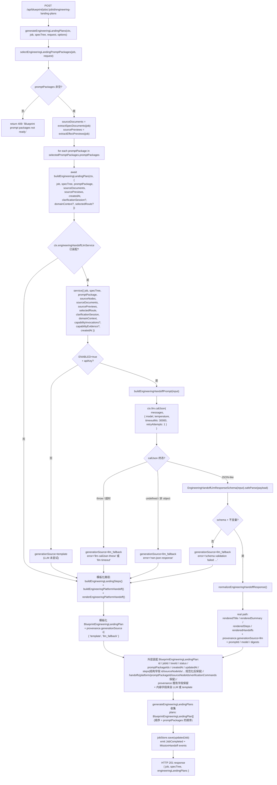
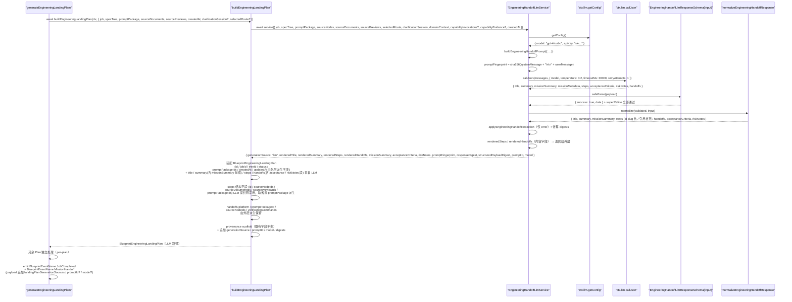
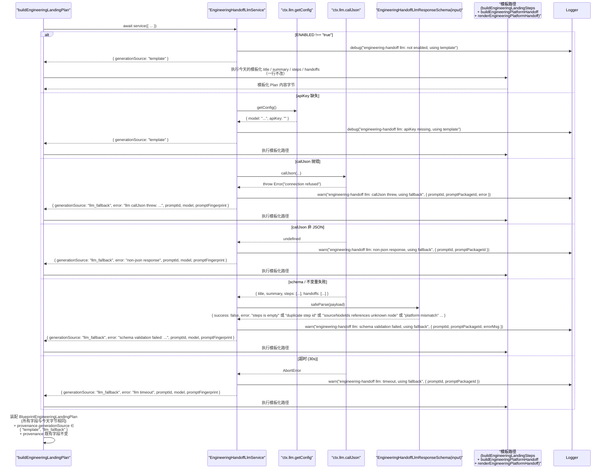

# 设计文档：Autopilot Engineering Handoff LLM 驱动生成

## 1. 设计概述

本 spec 把 `/autopilot` 的 **Engineering Handoff 生成阶段**从当前 `server/routes/blueprint.ts` 的 `generateEngineeringLandingPlans()`（~第 9036 行）+ `buildEngineeringLandingPlan()`（~第 10604 行）+ `buildEngineeringLandingSteps()` + `buildEngineeringPlatformHandoff()` + `buildEngineeringLandingVerificationCommands()` + `buildEngineeringLandingFileScopes()` + `renderEngineeringPlatformHandoff()` + `resolveEngineeringLandingPlanStatus()` + `resolveEngineeringStepRiskLevel()` 联合产出的硬编码工程落地交接单（Engineering Landing Plan），升级为由 `BlueprintServiceContext.llm.callJson` 按 `(promptPackage, sourceNodes, sourceDocuments, sourcePreviews, upstreamEvidence?)` **逐份**发起 LLM 推理、通过严格 zod schema 校验后渲染为结构化 `BlueprintEngineeringLandingPlan` 的真实产物；在 LLM 不可用 / apiKey 缺失 / callJson 抛错 / 非 JSON / schema 不过 / 计划级不变量违反（`steps` 为空 / `handoffs` 为空 / `acceptanceCriteria` 为空 / `steps[*].id` 重复 / `mode` 或 `riskLevel` 枚举不合法 / `sourceNodeIds` / `sourceDocumentIds` / `sourcePreviewIds` / `promptPackageIds` 引用不可解析 / 字符串越界 / trim 后全空格等）/ 超时任一情况下，**完全复用**既有 `buildEngineeringLandingPlan()` / `buildEngineeringLandingSteps()` / `buildEngineeringPlatformHandoff()` / `buildEngineeringLandingVerificationCommands()` / `buildEngineeringLandingFileScopes()` / `renderEngineeringPlatformHandoff()` / `resolveEngineeringLandingPlanStatus()` / `resolveEngineeringStepRiskLevel()` / `buildEngineeringSourceDocumentStatuses()` / `buildEngineeringSourcePreviewStatuses()` 作为确定性 fallback 路径。

本 spec 是 `autopilot-routeset-llm-generation`（RouteSet LLM）、`autopilot-spec-tree-llm`（SPEC Tree LLM）、`autopilot-spec-documents-llm`（SPEC Documents LLM）、`autopilot-effect-preview-llm`（Effect Preview LLM）与 `autopilot-prompt-package-llm`（Prompt Package LLM，直接上游 spec）之后的**最终阶段**，负责把 Prompt Package → Engineering Landing Plan 这一步从「模板派生」真正升级为「LLM 派生」。整体实现模式完全复用前五条姊妹 spec 已经验证过的同一条主线：`ctx.llm.callJson` → strict zod schema（含 `.superRefine()` 跨字段不变量）→ 成功路径返回 LLM 渲染 Plan / 失败路径回退到模板 → 在 `BlueprintEngineeringLandingPlan.provenance` 追加 `generationSource` / `promptId` / `model` / `responseDigest` / `structuredPayloadDigest` / `promptFingerprint` / `error` 可选字段。

### 1.1 与姊妹 spec 的本质差异

| 维度 | routeset LLM | spec-tree LLM | spec-documents LLM | effect-preview LLM | prompt-package LLM（直接上游） | **engineering-handoff LLM（本 spec）** |
| --- | --- | --- | --- | --- | --- | --- |
| 产出 JSON 内容 | `routes: Array<{...}>`（平铺） | 整棵 `nodes: Array<{id, parentId?, ...}>`（嵌套树） | 每份文档：`title / summary / sections` | 每份预演：`summary / architectureNotes / prototypeNotes / progressPlan / runtimeProjection` | 每份 Package：`title / summary / prompts / sections` | **每份 Plan：`title / summary / missionSummary / missionMetadata / steps: Array<{ id, title, summary, mode, fileScopes?, verificationCommands?, riskLevel?, sourceNodeIds?, sourceDocumentIds?, sourcePreviewIds?, promptPackageIds? }> / acceptanceCriteria: string[] / riskNotes: Array<{ level, message }> / handoffs: Array<{ platform, promptPackageId?, summary? }>`** |
| 调用单位 | RouteSet 一次 | SPEC Tree 一次 | `(nodeId, type)` 一次 | `(nodeId, sourceDocuments 快照)` 一次 | `(nodeIds, targetPlatform, sourceDocuments, sourcePreviews)` 一次 | **每份 `BlueprintEngineeringLandingPlan` 一次**；一次 `generateEngineeringLandingPlans()` 请求通常对应 1 份 Plan（一个 seed 节点 + 一个 promptPackage），若 `selectEngineeringLandingPromptPackages()` 命中 M 份 promptPackages 则触发 M 次独立 LLM 调用，每份 Plan 各自独立走 LLM 路径或 fallback 路径 |
| 输入依赖 | `intake + clarificationSession + githubUrls` | 多 + `routeSet + primaryRoute` | 多 + `specTreeNode + primaryRoute + 可选 upstreamEvidence` | 多 + `specTreeNode + sourceDocuments + selectedRoute? + 可选 capability*` | 多 + `specTreeNodes + sourceDocuments + sourcePreviews + targetPlatform + selectedRoute? + 可选 capability*` | **多 + `promptPackage: BlueprintImplementationPromptPackage`（单份，直接上游）+ `sourceNodes: BlueprintSpecTreeNode[]`（按 `promptPackage.nodeIds` 过滤）+ `sourceDocuments: BlueprintSpecDocument[]`（按 `promptPackage.sourceDocumentIds` 过滤）+ `sourcePreviews: BlueprintEffectPreview[]`（按 `promptPackage.sourcePreviewIds` 过滤）+ `selectedRoute?` + 可选 `clarificationSession` / `domainContext` / `capabilityInvocations` / `capabilityEvidence`** |
| 下游消费 | SPEC Tree、Sandbox Derivation、Agent Crew | SPEC Documents、Effect Preview、Prompt Package、Engineering Handoff | Effect Preview / Prompt Package / Engineering Handoff | Prompt Package / Engineering Landing Plan / Artifact Replay / 任务墙面 HUD | Engineering Landing Plan / Artifact Replay / 任务墙面 HUD / 外部落地（Codex 等） | **Artifact Replay、任务墙面 HUD、`BlueprintEngineeringRun` 执行链路（独立 spec，超出本 spec 范围）、`mission.handoff` event 订阅者（含 Agent Crew 面板、监控面板）** |
| Schema 难点 | `kind` 枚举、primary 唯一 | 节点 `id` 全树唯一、`parentId` 可解析、深度 ≤ 4 | `sections.id` 文档内唯一、长度 2..20、`body` 1..8000 | `hudState.title` 必填、`logTimeline` 非空 + level 枚举、`progressPlan` 非空 | `prompts.length` 1..12、prompt `id` / variable `name` / section `heading` 唯一、`required` 严格 boolean | **`steps.length` 1..30、`handoffs.length` 1..10、`acceptanceCriteria.length` 1..20、`riskNotes.length` 0..20；`steps[*].id` 在 Plan 内唯一（trim + lowercase）；`steps[*].mode` ∈ `{"automatic","manual","handoff"}`；`steps[*].riskLevel` ∈ `{"low","medium","high"}`；`riskNotes[*].level` ∈ `{"info","warning","critical"}`；`handoffs[*].platform` ∈ `BlueprintImplementationPromptTargetPlatform`；`sourceNodeIds` / `sourceDocumentIds` / `sourcePreviewIds` / `promptPackageIds` 若提供必须能在输入集合中解析** |
| Fallback 数据源 | `buildTemplatedRoutes()` | `buildSpecTreeFromRouteSet()` + `createDownstreamSpecTreeNodes()` | `buildSpecDocument()` + heading / body / sections 模板 | `buildEffectPreview()` + 多个 builder | `buildImplementationPromptPackage()` + `buildImplementationPromptSections()` + `renderImplementationPromptContent()` + `buildImplementationPromptTarget()` | **`buildEngineeringLandingPlan()` + `buildEngineeringLandingSteps()` + `buildEngineeringPlatformHandoff()` + `buildEngineeringLandingVerificationCommands()` + `buildEngineeringLandingFileScopes()` + `renderEngineeringPlatformHandoff()` + `resolveEngineeringLandingPlanStatus()` + `resolveEngineeringStepRiskLevel()` + `buildEngineeringSourceDocumentStatuses()` + `buildEngineeringSourcePreviewStatuses()` 联合产出（一行不改）** |
| 事件 payload | `route.generated` | `spec.tree.updated` / `spec.tree.versioned` | 不新增；仅 `JobCompleted` | `preview.generated` | `prompt.packaged` | **复用既有 `BlueprintEventName.MissionHandoff`（`mission.handoff`）**，`generateEngineeringLandingPlans()` 主路径当前已 emit（~第 9099 行）；在 payload 上追加可选 `landingPlanGenerationSources: Array<{ landingPlanId, promptPackageId, generationSource }>` / `promptId` / `model`；不新增事件名（需求 6.2） |
| 混合 provenance | N/A | N/A | 多份文档独立 | 多份预演独立 | 多份 Package 独立 | **多份 Plan 彼此独立**：一次请求中部分走 LLM 成功、部分走 fallback，各自 provenance 独立、响应体 `engineeringLandingPlans[*]` 数组顺序保持今天口径（需求 5.6 / 4.7） |
| 测试 | +2 E2E + 子域单测 | +2 E2E + ~40 co-located 单测 | +2 E2E + ~30-40 co-located 单测 | +2 E2E + ~30-40 co-located 单测 | +2 E2E + ~30-40 co-located 单测 | **+2 E2E + ~30-40 co-located 单测**（最低硬需求：R9.1 两条 + R9.2 四条 = +6） |

### 1.2 最低可接受交付

当 `BlueprintServiceContext.llm.callJson` 可用且 LLM 为**某一份 Plan** 返回通过 strict zod 校验的结构化结果时，该 Plan 的最终产出满足：

- `BlueprintEngineeringLandingPlan.title` 明显**不同**于模板化输出（不再是 `` `Engineering landing plan: ${targetLabel}` `` 固定格式），而是由 LLM 推导出的面向该 Plan（结合目标平台 + 节点集合 + SPEC 文档 + 效果预演 + Prompt Package 内容）的真实标题
- `BlueprintEngineeringLandingPlan.summary` 不再是固定的 `` `Land ${promptPackage.title} for ${targetLabel} using ${sourceNodeTitle}, ${N} SPEC document(s), and ${M} effect preview(s).` `` 模板，而是由 LLM 推导出的对该 Plan 的具体摘要
- `BlueprintEngineeringLandingPlan.steps` 不再是固定的 3 条模板 steps（`"Bind landing sources"` / `"Apply repository bridge"` / `"Capture run evidence"`），而是由 LLM 推导出的真实工程落地步骤；每条 step 的 `title` / `summary` / `mode` / `fileScopes` / `verificationCommands` / `riskLevel` / `sourceNodeIds` / `sourceDocumentIds` / `sourcePreviewIds` / `promptPackageIds` 均来自 LLM 推导（或由外层按 schema 规范化）
- `BlueprintEngineeringLandingPlan.handoffs[0].summary` / `content` 不再来自 `buildEngineeringPlatformHandoff()` + `renderEngineeringPlatformHandoff()` 的固定 Markdown 拼装，而是由 LLM 推导出的真实 handoff 描述（platform / promptPackageId / sourceNodeIds / verificationCommands 由外层派生保持不变）
- Plan 的 `missionSummary` / `acceptanceCriteria` / `riskNotes` 作为可选扩展落点挂在 `BlueprintEngineeringLandingPlan.summary` 的语义内（详见 §D11）并**不新增必填字段**到 `BlueprintEngineeringLandingPlan` 顶层
- `BlueprintEngineeringLandingPlan.provenance.generationSource === "llm"`
- `BlueprintEngineeringLandingPlan.provenance.promptId === "blueprint.engineering-handoff.v1"`
- `BlueprintEngineeringLandingPlan.provenance.model` 等于 `ctx.llm.getConfig().model`
- `BlueprintEngineeringLandingPlan.provenance.responseDigest` / `structuredPayloadDigest` / `promptFingerprint` 匹配 `/^sha256:[a-f0-9]{64}$/`
- `BlueprintEngineeringLandingPlan.provenance.error` 为 `undefined`
- `BlueprintEngineeringLandingPlan` 所有既有字段（`id` / `jobId` / `treeId` / `status` / `promptPackageIds` / `createdAt` / `updatedAt`）形态完全符合现有 `BlueprintEngineeringLandingPlan` 类型
- `BlueprintEngineeringLandingPlan.provenance` 的既有字段（`jobId` / `projectId` / `sourceId` / `targetText` / `githubUrls` / `treeVersion` / `promptPackageIds` / `sourceNodeIds` / `sourceDocumentIds` / `sourcePreviewIds` / `sourceDocumentStatus` / `sourcePreviewStatus` / `sourceDocumentStatuses` / `sourcePreviewStatuses` / `promptPackagePlatforms`）**一字段不改**

当 LLM 未注入 / apiKey 缺失 / callJson 抛错 / 非 JSON / schema 不过 / 不变量违反 / 超时时，该 Plan 的最终产出满足：

- `BlueprintEngineeringLandingPlan.title` / `summary` / `steps` / `handoffs` 与今天不走 LLM 的行为**字节级等价**（完全复用 `buildEngineeringLandingPlan()` + 其内部 helpers 的产出）
- `BlueprintEngineeringLandingPlan.provenance.generationSource === "llm_fallback"`（当 LLM 被尝试过时）或 `"template"`（当 LLM 从未被尝试 / apiKey 未配置时）
- `BlueprintEngineeringLandingPlan.provenance.error` 被脱敏后填充（仅 `"llm_fallback"` 情况下）
- 其它 `BlueprintEngineeringLandingPlan` 既有字段与 provenance 既有字段与今天**字节相同**

当一次 `generateEngineeringLandingPlans()` 请求中部分 Plan 走 LLM 成功、部分走 fallback 时：

- 响应体 `engineeringLandingPlans[*]` 数组的**顺序**、**长度**与 **`promptPackageIds` 覆盖集合**与今天完全一致（需求 5.6）
- 每份 Plan 的 `provenance.generationSource / promptId / model / error` **彼此独立**，不会因为其中一份走 fallback 而把其他走 LLM 成功的 Plan 污染为 `"llm_fallback"`（需求 4.7）

_Requirements: 1.1, 1.2, 1.3, 1.4, 1.5, 1.6, 1.7, 1.8_

### 1.3 环境变量门禁

- `BLUEPRINT_ENGINEERING_HANDOFF_LLM_ENABLED=true` 开启本 LLM 路径（与 RouteSet / SPEC Tree / SPEC Documents / Effect Preview / Prompt Package / 四条桥 spec 同模式）
- 未设或设为其它值时，即使 `ctx.llm` 已装配，service 也直接走 fallback 模板路径，保证默认装配下既有 47 条 E2E + 48 条子域 co-located 单测 + 9 条 SDK smoke 零感知
- 单次 LLM 调用的墙钟上限通过 `BLUEPRINT_ENGINEERING_HANDOFF_LLM_TIMEOUT_MS` 覆盖，默认 `30000`；非法值或 `> 30000` 时回退到 `30000`（需求 2.8）
- 环境变量命名与 RouteSet (`BLUEPRINT_ROUTESET_LLM_ENABLED`) / SPEC Tree (`BLUEPRINT_SPEC_TREE_LLM_ENABLED`) / SPEC Documents (`BLUEPRINT_SPEC_DOCUMENTS_LLM_ENABLED`) / Effect Preview (`BLUEPRINT_EFFECT_PREVIEW_LLM_ENABLED`) / Prompt Package (`BLUEPRINT_PROMPT_PACKAGE_LLM_ENABLED`) 独立，不交叉开关

### 1.4 严格限定范围

本 spec 严格限定在 `generateEngineeringLandingPlans()` → `buildEngineeringLandingPlan()` 的数据派生路径上：

- 新增 `createEngineeringHandoffLlmService(ctx)` 工厂，落地到 `server/routes/blueprint/engineering-handoff/` 目录，co-located 单元测试同目录
- **不修改** `createRouteGenerationSandboxDerivation()` / `buildSpecTreeFromRouteSet()` / `generateSpecDocuments()` / `generateEffectPreviews()` / `generateImplementationPromptPackages()` / `buildImplementationPromptPackage()` 或其它上游生成路径
- **不修改** `docker-analysis-sandbox` / `mcp-github-source` / `aigc-spec-node` / `role-system-architecture` 任一 capability adapter 的实际行为（需求 1.3 / 9.4）
- **不修改** RouteSet（已有 spec）、SPEC Tree（已有 spec）、SPEC Documents（已有 spec）、Effect Preview（已有 spec）、Prompt Package（已有 spec）任一阶段的生成路径（需求 1.4 / 9.5）
- **不修改** `ctx.llm.callJson` 或 `ctx.llm.getConfig` 本身的实现；本 spec 只**消费**它们，不得 `import { callLLMJson }` 或 `import { getAIConfig }`（需求 7.1）
- **不修改** `shared/blueprint/contracts.ts` 中 `BlueprintEngineeringLandingPlan` / `BlueprintEngineeringLandingStep` / `BlueprintPlatformHandoff` / `BlueprintEngineeringLandingStepMode` / `BlueprintEngineeringLandingRiskLevel` / `BlueprintEngineeringLandingPlanStatus` 类型定义本身；仅**追加**可选 provenance 字段（需求 4.2 / 8.2）
- **不修改** `BlueprintEngineeringRun` 对象或 mission engineering 执行链路（需求 1.8 / 9.9）
- **不修改**前端 Engineering Handoff 相关工作台 UI 组件（含 `mission.handoff` 相关面板）；`generationSource` 在前端是否可见属可选后续 UI spec（需求 1.6）
- **不修改** GitHub Pages 静态预览或浏览器端 runtime（需求 1.7）
- **不新增** `/api/*` 路由；HTTP 契约完全不变（需求 8.1）
- **不新增**事件名；仅复用既有 `BlueprintEventName.MissionHandoff`（需求 6.2）
- **不引入** property-based test（需求 9.3 明确锁定）。本轮新增 **2 条 E2E + ~30-40 条 co-located 单测**（最低硬需求：R9.1 + R9.2 = +6 条）
- 既有端到端 E2E 用例（47 条）、既有子域 co-located 单测（48 条）、既有 SDK smoke（9 条）**全部继续通过**，不重写既有断言（需求 8.3 / 8.5 / 9.6）

_Requirements: 1.1, 1.2, 1.3, 1.4, 1.5, 1.6, 1.7, 1.8, 8.1, 8.2, 8.3, 8.4, 8.5, 9.4, 9.5, 9.6, 9.7, 9.8, 9.9_


## 2. 架构决策（Key Decisions）

本 spec 的 D1-D11 与 RouteSet / SPEC Tree / SPEC Documents / Effect Preview / Prompt Package / 四条桥 spec 在同一坐标系下讨论；相同处复用结论并明确说明差异。

### D1：工厂模式 `createEngineeringHandoffLlmService(ctx)`（per-plan service）

```ts
export function createEngineeringHandoffLlmService(
  ctx: BlueprintServiceContext
): EngineeringHandoffLlmService;
```

工厂只接收 `BlueprintServiceContext`，从中读取 `ctx.llm.callJson` / `ctx.llm.getConfig` / `ctx.engineeringHandoffLlmPolicy` / `ctx.logger` / `ctx.now`。返回的 service 是纯异步函数 `(input) => Promise<EngineeringHandoffLlmServiceOutput>`，**每次调用仅负责一份 Plan**（即单份 `promptPackage` 对应的 `BlueprintEngineeringLandingPlan`）。一次 `generateEngineeringLandingPlans()` 请求若涉及 M 份 promptPackages → M 次独立 service 调用，互不影响（需求 2.2）。

**硬约束**（与五条姊妹 spec 同款 code-review 规则，违反直接拒绝）：

- service 实现文件 SHALL NOT `import { callLLMJson } from "../../core/llm-client.js"`
- service 实现文件 SHALL NOT `import { getAIConfig } from "../../core/ai-config.js"`
- service 实现文件 SHALL NOT 调用模块级 `fetch()` 或 `import` 任何 LLM HTTP 客户端
- service 实现文件 SHALL NOT 硬编码 model 名 / provider 名 / temperature 默认值
- service 实现文件 SHALL NOT `import` 模块级 `eventBus` / `jobStore` 单例
- 所有 LLM 能力必须来自 `ctx.llm.callJson` + `ctx.llm.getConfig`

_Requirements: 7.1, 7.2, 7.3, 7.4, 7.5_

### D2：`BlueprintServiceContext` 最轻扩展

新增两个可选字段到 `BlueprintServiceContext` 与 `BlueprintServiceContextDeps`：

```ts
export interface BlueprintServiceContext {
  // ...既有字段（含 llm: { callJson, getConfig }、RouteSet / SPEC Tree / SPEC Documents / Effect Preview / Prompt Package / 4 条桥字段）...
  /** 本 service 安全 / schema 上界 / 脱敏策略；未注入时使用 createDefaultEngineeringHandoffLlmPolicy() */
  engineeringHandoffLlmPolicy?: EngineeringHandoffLlmPolicy;
  /** 本 service 实例本身；便于测试完全注入自定义 service */
  engineeringHandoffLlmService?: EngineeringHandoffLlmService;
}
```

**默认装配策略**（与姊妹 spec D2 对齐）：

- 未注入 `engineeringHandoffLlmService` → `buildBlueprintServiceContext()` 自动装配 `createEngineeringHandoffLlmService(ctx)`
- 环境变量 `BLUEPRINT_ENGINEERING_HANDOFF_LLM_ENABLED !== "true"` → service 内部直接走 template 路径，不尝试调用 `callJson`
- `ctx.llm.getConfig().apiKey` 缺失 → service 内部直接走 template 路径，不尝试调用 `callJson`（与 SPEC Tree / SPEC Documents / Effect Preview / Prompt Package D2 对齐）
- 测试中通过 `buildBlueprintServiceContext({ llm: { callJson: fake, getConfig: () => ({ model, apiKey }) } })` 注入任意 fake LLM
- 测试中通过 `buildBlueprintServiceContext({ engineeringHandoffLlmService: fakeService })` 完全短路 LLM，用于锁定 service 外层行为

未注入 `engineeringHandoffLlmPolicy` 时使用 `createDefaultEngineeringHandoffLlmPolicy()`（见 §4.3）。

_Requirements: 2.1, 7.1, 7.2, 7.3_

### D3：替换点在 `buildEngineeringLandingPlan()` 调用链，不改 `generateEngineeringLandingPlans()` 外层编排

`buildEngineeringLandingPlan()` 是今天 Engineering Landing Plan 内容构造的唯一入口（`generateEngineeringLandingPlans()` 在 `selectedPromptPackages.promptPackages.map(promptPackage => buildEngineeringLandingPlan({...}))` 中调用它）。本 spec 的改造方式是把它改为 **async 版本并内嵌 LLM 调用**，在 LLM 成功时用 LLM 产出的内容字段替换模板化产出：

```ts
// 旧签名（保持不变）
function buildEngineeringLandingPlan(input: {...}): BlueprintEngineeringLandingPlan;

// 新签名
async function buildEngineeringLandingPlan(
  ctx: BlueprintServiceContext,
  input: {
    job: BlueprintGenerationJob;
    specTree: BlueprintSpecTree;
    promptPackage: BlueprintImplementationPromptPackage;
    sourceDocuments: BlueprintSpecDocument[];
    sourcePreviews: BlueprintEffectPreview[];
    createdAt: string;
    clarificationSession?: BlueprintClarificationSession;
    domainContext?: BlueprintProjectDomainContext;
    selectedRoute?: BlueprintRouteCandidate;
  }
): Promise<BlueprintEngineeringLandingPlan>;
```

实现内部：

1. 先不变地计算 `sourceNodeIds` / `sourceDocumentIds` / `sourcePreviewIds` / `promptPackageIds` / `sourceNodes` / 过滤后的 `sourceDocuments` / `sourcePreviews` / `verificationCommands` / `status` 等 scaffold（这些字段由 input 派生，与 LLM 无关）
2. 调用 `await ctx.engineeringHandoffLlmService?.({ ...per-plan input })`
3. 若 service 返回 `generationSource === "llm"` → 用 LLM 产出的 `renderedTitle` / `renderedSummary` / `renderedSteps` / `renderedHandoffs` 替换模板化产出；其余 scaffold 字段（`id` / `jobId` / `treeId` / `status` / `promptPackageIds` / `createdAt` / `updatedAt` / `provenance` 既有字段）仍由外层派生不变；provenance scaffold 追加 LLM 字段
4. 若 service 未装配或返回 fallback → 执行今天的模板化代码路径**一行不改**（`buildEngineeringLandingSteps()` + `buildEngineeringPlatformHandoff()` + `renderEngineeringPlatformHandoff()`），并在 `provenance` 上标注 `generationSource === "template"` 或 `"llm_fallback"`

`generateEngineeringLandingPlans()` 本身的外层编排（`selectEngineeringLandingPromptPackages()` 选择 / 404 / 409 早退、`extractSpecDocuments(job)` / `extractEffectPreviews(job)` 读取、`generatedKeys` 计算、`planArtifacts` 拼装、`preservedArtifacts` 合并、`BlueprintEventName.JobCompleted` + `BlueprintEventName.MissionHandoff` emit、`options.store.save(updatedJob)`、响应体装配）**一行不改**；只需要把内部的 `selectedPromptPackages.promptPackages.map(promptPackage => buildEngineeringLandingPlan({...}))` 同步调用改为 `await Promise.all(selectedPromptPackages.promptPackages.map(async promptPackage => buildEngineeringLandingPlan(ctx, {...})))` 以保持同级并发并维持数组顺序。

**关键点**：

- LLM 调用的**单位是单份 Plan**（对应单份 `promptPackage`），不是整个 `generateEngineeringLandingPlans()` 请求；M 份 Plan → M 次独立 service 调用（需求 2.2）
- 每份 Plan 的 LLM 调用失败 **不影响**其他 Plan；混合 provenance 下响应体顺序、长度、`promptPackageIds` 覆盖集合保持今天口径（需求 5.6）
- `BlueprintEngineeringLandingPlan` 的 `id` / `jobId` / `treeId` / `status` / `promptPackageIds` / `createdAt` / `updatedAt` 由外层构造不变；**LLM 输出只取代 `title` / `summary` / `steps[*].title` / `steps[*].summary` / `steps[*].mode` / `steps[*].fileScopes` / `steps[*].verificationCommands` / `steps[*].riskLevel` / `handoffs[*].title` / `handoffs[*].summary` / `handoffs[*].content` 内容字段**
- `steps[*]` 的**结构字段**（`id` / `sourceNodeIds` / `sourceDocumentIds` / `sourcePreviewIds` / `promptPackageIds`）在外层按「LLM 提供优先，否则按 promptPackage 派生」的规则装配（见 §4.8）；LLM 提供的这些字段必须能在输入集合中解析（否则 schema `.superRefine` 失败走 fallback）
- `handoffs[*].platform` / `handoffs[*].promptPackageId` / `handoffs[*].sourceNodeIds` / `handoffs[*].verificationCommands` 仍由外层派生（对应 `promptPackage.targetPlatform` / `promptPackage.id` / `promptPackage.nodeIds` / `buildEngineeringLandingVerificationCommands()`），保持下游 `BlueprintEngineeringRun` 与 Artifact Replay 消费者看到的字段形态不变
- 既有 provenance 字段（`jobId` / `projectId` / `sourceId` / `targetText` / `githubUrls` / `treeVersion` / `promptPackageIds` / `sourceNodeIds` / `sourceDocumentIds` / `sourcePreviewIds` / `sourceDocumentStatus` / `sourcePreviewStatus` / `sourceDocumentStatuses` / `sourcePreviewStatuses` / `promptPackagePlatforms`）在 real / fallback / template 三条路径上都**保持与今天字节相同**（需求 2.7 / 4.2 / 5.4）

_Requirements: 2.2, 2.6, 2.7, 5.2, 5.4, 5.6_

### D4：超时上限锁定为 30 秒

需求 2.8 要求「单次 LLM 调用超时上限控制在 30 秒以内」。本 spec 将**单次（单份 Plan）LLM 调用 + zod 校验 + Plan 不变量检查的总墙钟**锁定为 **30 秒**，通过环境变量 `BLUEPRINT_ENGINEERING_HANDOFF_LLM_TIMEOUT_MS` 可覆盖（默认 `30000`，`> 30000` 或非法值时回退到 `30000`）。与 RouteSet / SPEC Tree / SPEC Documents / Effect Preview / Prompt Package / 四条桥 spec 对齐。

实现上通过 `ctx.llm.callJson` 自带的 `timeoutMs` 参数 + `retryAttempts: 1` 传入。`callLLMJson` 实现会在超时到达时抛 `AbortError`，service 捕获后 fallback 并填 `provenance.error = "llm timeout"`。

**注意：该 30s 上限是针对单份 Plan 的**。一次 `generateEngineeringLandingPlans()` 请求生成 M 份 Plan 时，总墙钟为 `O(max(每份超时))`（并发，通过 `Promise.all(...)`），而不是 `O(sum(每份超时))`（串行）。这与 `generateEngineeringLandingPlans()` 当前 `.map(...)` 的同步编排语义（所有 Plan 在同一 tick 内构造）保持一致；改为 `Promise.all(...)` 后，LLM 调用在不同 tick 并发执行，单 Plan 超时仍 ≤ 30s。

_Requirements: 2.8, 5.1_

### D5：Prompt ID 锁定为 `blueprint.engineering-handoff.v1`（需求 3.1）

与 RouteSet spec 的 `blueprint.routeset.v1` / SPEC Tree spec 的 `blueprint.spec-tree.v1` / SPEC Documents spec 的 `blueprint.spec-documents.v1` / Effect Preview spec 的 `blueprint.effect-preview.v1` / Prompt Package spec 的 `blueprint.prompt-package.v1` / aigc-node 桥的 `blueprint.aigc-spec-node.v1` / role 桥的 `blueprint.role-architecture.v1` 命名对齐。稳定字符串版本标识，用于 provenance 追溯与回归测试锁定。prompt 结构 / response schema 发生向后不兼容变化时递增到 `v2`；仅字段示例 / 提示语微调不构成 bump。

常量定义位置：`server/routes/blueprint/engineering-handoff/prompt.ts` 的 `export const ENGINEERING_HANDOFF_PROMPT_ID = "blueprint.engineering-handoff.v1"`。

_Requirements: 3.1_

### D6：Provenance 扩展策略

Engineering Handoff 的真相字段全部挂在 `BlueprintEngineeringLandingPlan.provenance`（每份 Plan 独立），不涉及 `BlueprintCapabilityInvocation` / `BlueprintCapabilityEvidence`（那是桥 spec 的真相源），也不涉及 `BlueprintImplementationPromptPackage.provenance`（那是上游 Prompt Package spec 的真相源）。本 spec 向 `BlueprintEngineeringLandingPlan.provenance` **追加**以下可选字段（全部可选、不改既有字段）：

| 字段 | 类型 | 填充条件 |
| --- | --- | --- |
| `generationSource` | `"llm" \| "llm_fallback" \| "template"` | 总是填充；区分三种路径 |
| `promptId` | `string` | 当 `generationSource` ∈ `{"llm", "llm_fallback"}` 时填充（当 LLM 被尝试过） |
| `model` | `string` | 当 LLM 被调用过时填充 |
| `responseDigest` | `string` | Real 路径必然填充，形如 `sha256:...` |
| `structuredPayloadDigest` | `string` | Real 路径必然填充，形如 `sha256:...` |
| `promptFingerprint` | `string` | Real / fallback（LLM 被调用过时）均填充，形如 `sha256:...` |
| `error` | `string` | 仅 `generationSource === "llm_fallback"` 时填充，已脱敏 |

与 RouteSet / SPEC Tree / SPEC Documents / Effect Preview / Prompt Package / aigc-node / role 桥的命名口径严格对齐（需求 4.3）。既有 `provenance` 字段（`jobId` / `projectId` / `sourceId` / `targetText` / `githubUrls` / `treeVersion` / `promptPackageIds` / `sourceNodeIds` / `sourceDocumentIds` / `sourcePreviewIds` / `sourceDocumentStatus` / `sourcePreviewStatus` / `sourceDocumentStatuses` / `sourcePreviewStatuses` / `promptPackagePlatforms`）**一字段不改**（需求 4.2 / 4.5 / 4.6）。

**混合 provenance 保证**（需求 4.7）：一次 `generateEngineeringLandingPlans()` 请求中多份 Plan 的 `provenance.generationSource / promptId / model / error` **彼此独立**；部分走 LLM 成功、部分走 fallback 不会互相污染。

**Adapter 命名（若在事件或 provenance 中携带）**：

| 路径 | adapter 字符串 | `generationSource` |
| --- | --- | --- |
| LLM 真跑 | `"blueprint.engineering-handoff.llm"` | `"llm"` |
| 模板化回退 / template | 不携带或保留既有命名 | `"llm_fallback"` / `"template"` |

Real 路径 adapter 不得包含 `.simulated` 子串（需求 4.4）。

_Requirements: 4.1, 4.2, 4.3, 4.4, 4.5, 4.6, 4.7_

### D7：复用既有 `BlueprintEventName.MissionHandoff`，不新增事件名

`shared/blueprint/events.ts` 中已声明 `BlueprintEventName.MissionHandoff: "mission.handoff"`。经 grep 确认 `server/routes/blueprint.ts` 的 `generateEngineeringLandingPlans()` 主路径**当前已 emit `MissionHandoff`**（~第 9099 行），payload 为 `{ specTreeId, landingPlanIds, promptPackageIds, targetPlatforms, sourceNodeIds, sourceDocumentIds, sourcePreviewIds, sourceIds: {...} }`。因此本 spec 的事件策略是**在既有 emit 点的 payload 上追加可选字段**（需求 6.1 / 6.2）：

1. **不新增事件名**；严格复用 `BlueprintEventName.MissionHandoff`
2. 在既有 `payload` 上**追加可选字段**：
   - `landingPlanGenerationSources: Array<{ landingPlanId, promptPackageId, generationSource }>`（每份 Plan 独立汇总，用于前端驾驶舱 / 监控聚合展示；与 Prompt Package spec 的 `promptPackageGenerationSources` / Effect Preview spec 的 `previewGenerationSources` 口径一致）
   - `promptId?: string`（当任一 Plan 走过 LLM 时填充，取 `blueprint.engineering-handoff.v1`）
   - `model?: string`（当任一 Plan 走过 LLM 时填充）
3. 聚合策略与 Prompt Package / Effect Preview 对齐：事件 payload 不做单值聚合（`generationSource` 不单独出现在 top-level payload 上），而是每份 Plan 在 `landingPlanGenerationSources` 数组里独立携带；单值由前端 / 监控侧消费时自行聚合

**所有新增字段都是可选字段**（需求 6.5），既有订阅者（含 `blueprint-routes.test.ts` 断言 `mission.handoff` 的用例）不会因字段追加而断言失败。所有事件 `type` 仍由 `BlueprintEventName` 常量构造（需求 6.4），实现文件 SHALL NOT 出现裸字符串 `"mission.handoff"`。

_Requirements: 6.1, 6.2, 6.3, 6.4, 6.5_

### D8：Strict zod schema + `.superRefine()` 跨字段不变量

本 spec 的 schema 包含三个层级：**Plan 级语义字段**（`title` / `summary` / `missionSummary` / `missionMetadata`）、**Steps**（`steps: Array<{ id?, title, summary, mode, fileScopes?, verificationCommands?, riskLevel?, sourceNodeIds?, sourceDocumentIds?, sourcePreviewIds?, promptPackageIds? }>`）、**Handoffs / Acceptance / RiskNotes**（`handoffs: Array<{ platform, promptPackageId?, summary? }>` / `acceptanceCriteria: string[]` / `riskNotes: Array<{ level, message }>`）。`.superRefine()` 处理跨字段不变量（id 唯一、引用可解析、枚举合法）。

**顶层字段约束**（基于需求 3.3）：

- `title: string`，1..200 字符（trim 后非空）
- `summary: string`，1..500 字符（trim 后非空）
- `missionSummary: string`，1..1000 字符（trim 后非空）
- `missionMetadata: object` — 对象类型，允许空对象；已知可选字段 `targetPlatform?: string`、`sourceNodeIds?: string[]`、`sourceDocumentIds?: string[]`、`sourcePreviewIds?: string[]`、`promptPackageIds?: string[]`；未知字段 schema 层面 strip
- `steps: Array<StepSchema>`，长度 1..30（需求 3.3）
- `acceptanceCriteria: Array<string>`，每项 1..500，长度 1..20（需求 3.3）
- `riskNotes: Array<RiskNoteSchema>`，长度 0..20（需求 3.3）
- `handoffs: Array<HandoffSchema>`，长度 1..10（需求 3.3）

**Step 级约束**（对齐 `BlueprintEngineeringLandingStep` 的 `mode` / `riskLevel` 枚举；`id` / `sourceNodeIds` / `sourceDocumentIds` / `sourcePreviewIds` / `promptPackageIds` 由 LLM 提供或外层补齐，LLM 提供时必须可解析）：

- `id?: string`，1..128 字符（trim 后非空；建议 kebab-case 但不强制）
- `title: string`，1..200 字符（trim 后非空）
- `summary: string`，1..500 字符（trim 后非空）
- `mode: "automatic" | "manual" | "handoff"` — 与 `BlueprintEngineeringLandingStepMode` 枚举严格对齐
- `fileScopes?: Array<string>`，每项 1..200，长度 0..50
- `verificationCommands?: Array<string>`，每项 1..500，长度 0..20
- `riskLevel?: "low" | "medium" | "high"` — 与 `BlueprintEngineeringLandingRiskLevel` 枚举严格对齐
- `sourceNodeIds?: Array<string>`，每项 1..128，长度 0..50
- `sourceDocumentIds?: Array<string>`，每项 1..128，长度 0..50
- `sourcePreviewIds?: Array<string>`，每项 1..128，长度 0..20
- `promptPackageIds?: Array<string>`，每项 1..128，长度 0..10

**Handoff 级约束**（platform 枚举受限于 `BlueprintImplementationPromptTargetPlatform`）：

- `platform: "codex" | "claude" | "cursor" | "kiro" | "trae" | "windsurf"` — 严格枚举
- `promptPackageId?: string`，1..128 字符
- `summary?: string`，1..500 字符（trim 后非空）

**RiskNote 级约束**：

- `level: "info" | "warning" | "critical"` — 严格枚举
- `message: string`，1..500 字符（trim 后非空）

**Plan 级不变量**（`.superRefine()` 跨字段，需求 3.4）：

1. **`steps[*].id` 在本 Plan 内唯一**（不区分大小写 / trim 后比较）；缺省 id 由 normalize 阶段 slug 化派生并确保唯一
2. **所有字符串字段 trim 后非空**（`title` / `summary` / `missionSummary` / `steps[*].title` / `steps[*].summary` / `acceptanceCriteria[*]` / `riskNotes[*].message` / `handoffs[*].summary?` / `steps[*].verificationCommands[*]` / `steps[*].fileScopes[*]`）——避免 `.min(1)` 对全空格字符串误判为通过
3. **`steps[*].sourceNodeIds` / `sourceDocumentIds` / `sourcePreviewIds` / `promptPackageIds` 若提供必须能在输入集合解析**（需求 3.4）：
   - `sourceNodeIds[i]` ∈ `input.promptPackage.nodeIds` ∪ `input.sourceNodes.map(.id)`
   - `sourceDocumentIds[i]` ∈ `input.promptPackage.sourceDocumentIds` ∪ `input.sourceDocuments.map(.id)`
   - `sourcePreviewIds[i]` ∈ `input.promptPackage.sourcePreviewIds` ∪ `input.sourcePreviews.map(.id)`
   - `promptPackageIds[i]` ∈ `[input.promptPackage.id]`（本 Plan 只对单份 promptPackage；多 Package 聚合 Plan 超出本 spec 范围）
4. **`handoffs[*].platform` 必须与 `input.promptPackage.targetPlatform` 一致**（避免 LLM 返回不匹配的目标平台）——若不一致走 fallback
5. **`handoffs[*].promptPackageId` 若提供必须等于 `input.promptPackage.id`**
6. **`steps[*].mode` / `riskLevel`（若提供） / `riskNotes[*].level` / `handoffs[*].platform` 必须落入各自枚举集合**——由 `z.enum(...)` 严格覆盖，`.superRefine` 这一步为冗余断言

**Schema 结构**（见 §4.4 详细展开）：

```ts
const StepModeSchema = z.enum(["automatic", "manual", "handoff"]);
const RiskLevelSchema = z.enum(["low", "medium", "high"]);
const RiskNoteLevelSchema = z.enum(["info", "warning", "critical"]);
const PlatformSchema = z.enum([
  "codex", "claude", "cursor", "kiro", "trae", "windsurf",
]);

const StepSchema = z.object({
  id: z.string().min(1).max(128).optional(),
  title: z.string().min(1).max(200),
  summary: z.string().min(1).max(500),
  mode: StepModeSchema,
  fileScopes: z.array(z.string().min(1).max(200)).min(0).max(50).optional(),
  verificationCommands: z.array(z.string().min(1).max(500)).min(0).max(20).optional(),
  riskLevel: RiskLevelSchema.optional(),
  sourceNodeIds: z.array(z.string().min(1).max(128)).min(0).max(50).optional(),
  sourceDocumentIds: z.array(z.string().min(1).max(128)).min(0).max(50).optional(),
  sourcePreviewIds: z.array(z.string().min(1).max(128)).min(0).max(20).optional(),
  promptPackageIds: z.array(z.string().min(1).max(128)).min(0).max(10).optional(),
});

const HandoffSchema = z.object({
  platform: PlatformSchema,
  promptPackageId: z.string().min(1).max(128).optional(),
  summary: z.string().min(1).max(500).optional(),
});

const RiskNoteSchema = z.object({
  level: RiskNoteLevelSchema,
  message: z.string().min(1).max(500),
});

const MissionMetadataSchema = z.object({
  targetPlatform: z.string().min(1).max(64).optional(),
  sourceNodeIds: z.array(z.string().min(1).max(128)).min(0).max(50).optional(),
  sourceDocumentIds: z.array(z.string().min(1).max(128)).min(0).max(50).optional(),
  sourcePreviewIds: z.array(z.string().min(1).max(128)).min(0).max(20).optional(),
  promptPackageIds: z.array(z.string().min(1).max(128)).min(0).max(10).optional(),
});

export const EngineeringHandoffLlmResponseSchema = z
  .object({
    title: z.string().min(1).max(200),
    summary: z.string().min(1).max(500),
    missionSummary: z.string().min(1).max(1000),
    missionMetadata: MissionMetadataSchema.default({}),
    steps: z.array(StepSchema).min(1).max(30),
    acceptanceCriteria: z.array(z.string().min(1).max(500)).min(1).max(20),
    riskNotes: z.array(RiskNoteSchema).min(0).max(20),
    handoffs: z.array(HandoffSchema).min(1).max(10),
  })
  .superRefine((data, ctx) => {
    // (1) title / summary / missionSummary trim 后非空
    // (2) steps[*].id 唯一（若提供；不区分大小写 / trim 后比较）
    // (3) steps[*].sourceNodeIds / sourceDocumentIds / sourcePreviewIds / promptPackageIds 引用可解析
    //     （通过 superRefine 的 ctx 外挂 resolver 方式，见 §4.4）
    // (4) handoffs[*].platform === input.promptPackage.targetPlatform
    //     （同样通过外挂 resolver）
    // (5) 所有字符串字段 trim 后非空
  });
```

**注意**：引用可解析与 platform 一致性校验依赖 `input`（即 promptPackage / sourceNodes / sourceDocuments / sourcePreviews 的可见集合），无法在纯 schema 层完成；实现上通过一层 `createEngineeringHandoffLlmResponseSchema(input)` 工厂，把可见集合闭包进 `superRefine` 的 resolver。详见 §4.4。

**字段处置策略**：

| 场景 | schema 行为 |
| --- | --- |
| `title` / `summary` / `missionSummary` / `steps` / `acceptanceCriteria` / `handoffs` 缺失 | fail → fallback |
| `steps.length === 0` 或 `steps.length > 30` | fail → fallback |
| `handoffs.length === 0` 或 `handoffs.length > 10` | fail → fallback |
| `acceptanceCriteria.length === 0` 或 `> 20` | fail → fallback |
| `riskNotes.length > 20` | fail → fallback |
| `steps[*].mode` / `riskLevel` / `riskNotes[*].level` / `handoffs[*].platform` 枚举越界 | fail → fallback |
| `steps[*].id` 重复（若提供） | fail（`.superRefine`） → fallback |
| `steps[*].sourceNodeIds` 引用不存在 | fail（`.superRefine`） → fallback |
| `steps[*].sourceDocumentIds` 引用不存在 | fail（`.superRefine`） → fallback |
| `steps[*].sourcePreviewIds` 引用不存在 | fail（`.superRefine`） → fallback |
| `steps[*].promptPackageIds` 不等于 `[input.promptPackage.id]` | fail（`.superRefine`） → fallback |
| `handoffs[*].platform` 与 `input.promptPackage.targetPlatform` 不一致 | fail（`.superRefine`） → fallback |
| `handoffs[*].promptPackageId` 与 `input.promptPackage.id` 不一致（若提供） | fail（`.superRefine`） → fallback |
| 字符串 trim 后全空格 | fail（`.superRefine`） → fallback |
| 各字段长度越界 | fail → fallback |
| 未声明的顶层 / step / handoff / riskNote / missionMetadata 字段 | 静默丢弃（zod 默认 strip） |

**注意**：`EngineeringHandoffLlmResponseSchema` 使用 `z.object({...}).superRefine(...)` 而非 `.strict()`。未知字段静默丢弃（需求 3.6），与 RouteSet / SPEC Tree / SPEC Documents / Effect Preview / Prompt Package / role 桥 schema 风格对齐。

**不做 coerce / normalize 在 zod 层面**（需求 3.3 / 3.4）：禁止 `z.string().or(z.number()).transform(...)` 这类 zod transform 链。所有字段要么严格匹配，要么 fallback。**但** zod 校验通过后，在 `buildRealOutput` 内部做一次规范化（需求 3.6）：trim 所有字符串字段首尾空白；对缺失的 `steps[*].id` 由 title slug 化生成并去重（`-2` / `-3` 后缀）；对 `fileScopes` / `verificationCommands` / `sourceNodeIds` / `sourceDocumentIds` / `sourcePreviewIds` / `promptPackageIds` 去重；为缺失的 `riskLevel` 补齐默认值（沿用今天 `resolveEngineeringStepRiskLevel(status, mode)` 的派生规则）；为缺失的 `sourceNodeIds` / `sourceDocumentIds` / `sourcePreviewIds` / `promptPackageIds` 按 promptPackage 默认集合派生（对齐今天 `buildEngineeringLandingSteps()` 的 scaffold 语义）；裁剪过长字符串至 schema 允许的上界（防御性，schema 已限长）。

_Requirements: 3.1, 3.2, 3.3, 3.4, 3.5, 3.6, 5.1_

### D9：脱敏走本 spec 独立的 `applyEngineeringHandoffRedaction` 纯函数

**决策**：本 spec 实现独立的轻量 `applyEngineeringHandoffRedaction(text, policy)` 纯函数，覆盖：

- API key 正则（`sk-[A-Za-z0-9]{20,}` / `clp_[A-Za-z0-9]{20,}` / `gh[pousr]_[A-Za-z0-9]{36,255}` / `github_pat_[A-Za-z0-9_]{22,255}`）
- Authorization / Bearer / token= / api_key= 等 key-value 对
- 邮箱正则

**关键使用点**（防御性）：

1. `provenance.error`：从 `zod error.message` / LLM 抛错 message / 超时原因派生，进入前过脱敏
2. `logger.warn` meta：任何 `{ promptId, landingPlanId?, promptPackageId?, errorMsg }` 字段进入前过脱敏
3. `BlueprintEngineeringLandingPlan.title` / `summary` / `steps[*].title` / `steps[*].summary` / `handoffs[*].title` / `handoffs[*].summary` / `handoffs[*].content`（LLM 产出的内容字段）：**不**强制脱敏原文——下游 `BlueprintEngineeringRun` 执行链路 / Artifact Replay / 任务墙面 HUD / 外部平台需要完整字段；schema prompt 侧已约束 LLM 不得返回真实凭据字面量；LLM 响应若被迫包含敏感串仍会落库，但发生概率极低且与 SPEC Tree / SPEC Documents / Effect Preview / Prompt Package / role 桥一致
4. `promptFingerprint` / `responseDigest` / `structuredPayloadDigest`：SHA-256 of 未脱敏原文（digest 无泄漏风险）

**为什么不把内容字段原文也脱敏**：与 Prompt Package §D9 / Effect Preview §D9 / role 桥 §D10 同论据——下游 `BlueprintEngineeringRun` 消费 Plan 的 `handoffs[*].content` 作为 runtime 交接单正文，脱敏会破坏产品体验。通过 prompt 约束（见 §4.5）要求 LLM 对敏感标识抽象化，作为风险缓解。

_Requirements: 4.1（error 文本脱敏子项）_

### D10：测试默认装配 ≡ 生产行为

核心兼容性保证：**默认测试装配 ≡ 今天的生产行为**（需求 8.6）。

- 既有 E2E **不设** `BLUEPRINT_ENGINEERING_HANDOFF_LLM_ENABLED` 环境变量 → service 早退 → template 路径 → 输出与今天模板化路径字节级等价
- 即便设了 `ENABLED=true`，既有 E2E **不对 `callLLMJson` 预设针对 Engineering Handoff 的 mock**（RouteSet / SPEC Tree / SPEC Documents / Effect Preview / Prompt Package / 桥 spec 只注入各自相关的 LLM mock）→ callJson 为 Engineering Handoff prompt 调用时返回 undefined → service 进入 fallback → 字节级等价
- 既有 E2E 断言的 Plan 字段（`title` 起始 `"Engineering landing plan:"`、`summary` 命中今天固定句式、`steps.length === 3`、`steps[0].title === "Bind landing sources"`、`steps[1].title === "Apply repository bridge"`、`steps[2].title === "Capture run evidence"`、`handoffs[0].title` 起始 `"Platform handoff:"` 等）在 fallback / template 路径下全部满足
- `BlueprintEngineeringLandingPlansResponse.engineeringLandingPlans[*]` 数组顺序在 fallback 路径下与今天完全相同（需求 5.6；`Promise.all` 保留索引顺序 → 等价于今天 `.map(...)` 产出的顺序）

唯一需要主动 mock 的只有本 spec 新增的 2 条 E2E（R9.1）与 4 条硬需求单测（R9.2）。

_Requirements: 8.1, 8.3, 8.4, 8.6_

### D11：`missionSummary` / `acceptanceCriteria` / `riskNotes` 的落点策略（兼容性）

需求 2.4 要求 LLM 返回 `missionSummary` / `acceptanceCriteria` / `riskNotes`，同时需求 8.2 要求**不得**改变 `BlueprintEngineeringLandingPlan` 顶层类型（也不得改变 `BlueprintEngineeringLandingStep` / `BlueprintPlatformHandoff` 的必填契约）。为在不破坏既有类型的前提下持久化这三项，本 spec 采用以下落点策略：

1. **`missionSummary`**：写入 `BlueprintEngineeringLandingPlan.summary` 的**前缀块**（real 路径下 `summary` 格式为 `${llmSummary}\n\n**Mission summary**\n${missionSummary}`），`summary` 整体仍受 500 字符上限约束（见 §4.3 policy）。若 LLM 提供 `missionSummary` 但合并后 `summary.length > 500`，normalize 阶段优先保留 `missionSummary` 并截断 `summary` 的补充说明。
2. **`acceptanceCriteria`**：作为 `handoffs[0].content` 的**验收标准块**嵌入（real 路径下 `content` 渲染增加 `## Acceptance criteria\n- ...\n- ...` 段）；不改 `handoffs[*]` 顶层字段。
3. **`riskNotes`**：作为 `handoffs[0].content` 的**风险提示块**嵌入（real 路径下 `content` 渲染增加 `## Risk notes\n- **${level}**: ${message}\n- ...` 段）；同样不改 `handoffs[*]` 顶层字段。

这一落点在 fallback 路径下对 `summary` / `handoffs[0].content` 都**不生效**（不注入前缀块、不追加 acceptance / risk 段），保证 fallback 路径输出与今天字节级等价（需求 5.4）。

**为什么不新增 `BlueprintEngineeringLandingPlan.missionSummary` / `acceptanceCriteria` / `riskNotes` 顶层字段**：

- 顶层新增会改变类型签名，违反需求 8.2
- 既有 E2E 的 `blueprint-routes.test.ts` 对 `summary` / `handoffs[0].content` 做的断言大多使用 `toMatch(/pattern/)`，real 路径在模板前缀之外追加新内容不会破坏既有 fallback 断言
- Artifact Replay / 任务墙面 HUD 当前读取 `summary` / `handoffs[*].content` 即可看到新增段落，无需前端改造

_Requirements: 2.3, 2.4, 4.2, 8.2_


## 3. 架构（High-Level Design）

### 3.1 系统数据流（Mermaid）



### 3.2 Happy path 时序图（real LLM execution，单份 Plan）



### 3.3 Fallback 时序图（单份 Plan）



_Requirements: 2.1, 2.2, 2.6, 2.7, 2.8, 3.5, 4.1, 4.5, 4.6, 4.7, 5.1, 5.2, 5.3, 5.4, 5.5, 5.6_


## 4. 组件与接口（Low-Level Design）

### 4.1 文件布局

```
server/routes/blueprint/engineering-handoff/
  ├── service.ts                        # 新增：createEngineeringHandoffLlmService(ctx) 工厂 + 主算法
  ├── service.test.ts                   # 新增：R9.2 四条硬需求 + 补充（not-enabled / timeout / redaction / per-plan isolation / platform mismatch / logger meta）
  ├── policy.ts                         # 新增：EngineeringHandoffLlmPolicy + createDefault + applyEngineeringHandoffRedaction
  ├── policy.test.ts                    # 新增：policy + redaction 纯函数测试
  ├── prompt.ts                         # 新增：buildEngineeringHandoffPrompt + ENGINEERING_HANDOFF_PROMPT_ID
  ├── prompt.test.ts                    # 新增：prompt 确定性 + locale 分支 + 可选 capabilityInvocations / evidence 分支
  ├── schema.ts                         # 新增：createEngineeringHandoffLlmResponseSchema(input) strict zod + .superRefine 跨字段不变量
  ├── schema.test.ts                    # 新增：schema 各种 valid/invalid 分支 + Plan 不变量 + 引用可解析
  ├── normalize.ts                      # 新增：normalizeEngineeringHandoffResponse 纯函数（trim / slug 化 id / 去重 / 引用补齐 / riskLevel 默认派生）
  ├── normalize.test.ts                 # 新增：normalize 的各类边界用例
  └── render.ts                         # 新增：renderEngineeringHandoffSummary + renderEngineeringHandoffContent 纯函数
  └── render.test.ts                    # 新增：render 确定性 + missionSummary 前缀 / acceptance / risk 注入

server/routes/blueprint/context.ts       # 修改（仅追加两个可选字段与默认装配）：
                                         #   - BlueprintServiceContext 追加:
                                         #       engineeringHandoffLlmPolicy?: EngineeringHandoffLlmPolicy
                                         #       engineeringHandoffLlmService?: EngineeringHandoffLlmService
                                         #   - BlueprintServiceContextDeps 追加同样字段
                                         #   - buildBlueprintServiceContext 默认装配 createEngineeringHandoffLlmService(ctx)

server/routes/blueprint.ts               # 修改（最小侵入）：
                                         #   - buildEngineeringLandingPlan() 改为 async(ctx, input)
                                         #   - input 追加 clarificationSession? / domainContext? / selectedRoute? / capabilityInvocations? / capabilityEvidence? 透传
                                         #   - 在模板化 steps / handoffs 构造之前 await ctx.engineeringHandoffLlmService?.(...)
                                         #   - LLM 成功 → 用 LLM 内容字段替换 title / summary / steps[*].title / summary / mode / fileScopes / verificationCommands / riskLevel / handoffs[0].title / summary / content
                                         #   - LLM 失败或未装配 → 走今天的模板化路径一行不改
                                         #   - provenance 新字段以可选方式追加
                                         #   - generateEngineeringLandingPlans() 改为 async(ctx, ...)
                                         #   - 内部 promptPackages.map(...) 改为 await Promise.all(...)
                                         #   - HTTP handler 调用点追加 await
                                         #   - MissionHandoff event payload 追加可选 landingPlanGenerationSources / promptId / model

shared/blueprint/contracts.ts            # 修改（仅追加可选字段）：
                                         #   - BlueprintEngineeringLandingPlan.provenance 追加可选:
                                         #       generationSource?: "llm" | "llm_fallback" | "template"
                                         #       promptId?: string
                                         #       model?: string
                                         #       responseDigest?: string
                                         #       structuredPayloadDigest?: string
                                         #       promptFingerprint?: string
                                         #       error?: string

server/tests/blueprint-routes.test.ts    # 修改（只追加，不改写）：
                                         #   + 2 条新 E2E 用例：
                                         #     (a) Real LLM path
                                         #     (b) Fallback path
```

_Requirements: 1.2, 7.1, 7.2_

### 4.2 核心类型定义（`service.ts`）

```ts
import type { BlueprintServiceContext } from "../context.js";
import type {
  BlueprintCapabilityEvidence,
  BlueprintCapabilityInvocation,
  BlueprintClarificationSession,
  BlueprintEffectPreview,
  BlueprintEngineeringLandingPlanStatus,
  BlueprintEngineeringLandingRiskLevel,
  BlueprintEngineeringLandingStepMode,
  BlueprintGenerationJob,
  BlueprintImplementationPromptPackage,
  BlueprintImplementationPromptTargetPlatform,
  BlueprintProjectDomainContext,
  BlueprintRouteCandidate,
  BlueprintSpecDocument,
  BlueprintSpecTree,
  BlueprintSpecTreeNode,
} from "../../../../shared/blueprint/index.js";

/** LLM 产出的单条 step（content 字段视角）。 */
export interface RenderedEngineeringStep {
  id?: string;
  title: string;
  summary: string;
  mode: BlueprintEngineeringLandingStepMode;
  fileScopes?: string[];
  verificationCommands?: string[];
  riskLevel?: BlueprintEngineeringLandingRiskLevel;
  sourceNodeIds?: string[];
  sourceDocumentIds?: string[];
  sourcePreviewIds?: string[];
  promptPackageIds?: string[];
}

/** LLM 产出的单条 handoff（content 字段视角）。 */
export interface RenderedEngineeringHandoff {
  platform: BlueprintImplementationPromptTargetPlatform;
  promptPackageId?: string;
  summary?: string;
}

/** LLM 产出的 risk note。 */
export interface RenderedEngineeringRiskNote {
  level: "info" | "warning" | "critical";
  message: string;
}

/**
 * service 的单次调用输入（单份 Plan）。
 * 一次 generateEngineeringLandingPlans() 请求的 M 份 promptPackages → M 次独立 service 调用。
 */
export interface EngineeringHandoffLlmServiceInput {
  jobId: string;
  job: BlueprintGenerationJob;
  specTree: BlueprintSpecTree;
  /** 本次 Plan 对应的单份 Prompt Package（直接上游） */
  promptPackage: BlueprintImplementationPromptPackage;
  /** 按 promptPackage.nodeIds 过滤的 source nodes */
  sourceNodes: BlueprintSpecTreeNode[];
  /** 按 promptPackage.sourceDocumentIds 过滤的 SPEC 文档 */
  sourceDocuments: BlueprintSpecDocument[];
  /** 按 promptPackage.sourcePreviewIds 过滤的效果预演 */
  sourcePreviews: BlueprintEffectPreview[];
  /** 主路线（若 specTree.selectedRouteId 可解析） */
  selectedRoute?: BlueprintRouteCandidate;
  /** 澄清会话（locale 解析来源） */
  clarificationSession?: BlueprintClarificationSession;
  domainContext?: BlueprintProjectDomainContext;
  /** 可选 capability invocations（来自 RouteSet 沙箱派生管线） */
  capabilityInvocations?: BlueprintCapabilityInvocation[];
  /** 可选 capability evidence（来自桥 spec 的产出） */
  capabilityEvidence?: BlueprintCapabilityEvidence[];
  /** 由外层计算的初始 plan status；用于默认 riskLevel 派生 */
  status: BlueprintEngineeringLandingPlanStatus;
  createdAt: string;
}

/**
 * service 的单次调用输出。
 * Real path: 返回内容字段 + provenance 扩展字段
 * Fallback path: 返回 generationSource / error / 可选 promptId / model；内容字段为 undefined（由外层走模板路径）
 * Template path: 返回 generationSource="template"；其它字段全 undefined
 */
export interface EngineeringHandoffLlmServiceOutput {
  generationSource: "llm" | "llm_fallback" | "template";
  /** Real path 下填充；fallback / template 路径下 undefined */
  renderedTitle?: string;
  renderedSummary?: string;
  /** 已被 render 规范化合并 missionSummary 前缀后的 summary 字符串 */
  renderedSummaryWithMissionPrefix?: string;
  /** LLM 产出 + normalize 后的 steps（content 字段，结构字段由外层合并） */
  renderedSteps?: RenderedEngineeringStep[];
  /** LLM 产出 + normalize 后的 handoffs（content 字段，结构字段由外层合并） */
  renderedHandoffs?: RenderedEngineeringHandoff[];
  /** LLM 产出的 mission summary 原文 */
  missionSummary?: string;
  /** LLM 产出的 acceptance criteria 列表 */
  acceptanceCriteria?: string[];
  /** LLM 产出的 risk notes 列表 */
  riskNotes?: RenderedEngineeringRiskNote[];
  /** LLM 产出的 mission metadata（可选字段由外层解码；strip 未知字段） */
  missionMetadata?: Record<string, unknown>;
  /** Real / fallback 有 LLM 调用时填充 */
  promptId?: string;
  model?: string;
  promptFingerprint?: string;
  /** Real path 必填 */
  responseDigest?: string;
  structuredPayloadDigest?: string;
  /** llm_fallback 路径填充 */
  error?: string;
}

export type EngineeringHandoffLlmService = (
  input: EngineeringHandoffLlmServiceInput
) => Promise<EngineeringHandoffLlmServiceOutput>;

export function createEngineeringHandoffLlmService(
  ctx: BlueprintServiceContext
): EngineeringHandoffLlmService;
```

**注意**：`renderedSteps` / `renderedHandoffs` 只承载 LLM 产出的**内容字段**；外层 `buildEngineeringLandingPlan()` 会把它们与外层派生的**结构字段**（`id` / `sourceNodeIds` / `sourceDocumentIds` / `sourcePreviewIds` / `promptPackageIds` / `handoffs[*].platform` / `handoffs[*].promptPackageId` / `handoffs[*].sourceNodeIds` / `handoffs[*].verificationCommands`）合并装配为完整的 `BlueprintEngineeringLandingStep[]` / `BlueprintPlatformHandoff[]`。`acceptanceCriteria` / `riskNotes` / `missionSummary` 由外层在 `summary` 前缀 / `handoffs[0].content` 追加段的方式持久化（§D11）。

_Requirements: 2.1, 2.2, 2.3, 2.4, 2.6, 7.1, 7.2, 7.4_

### 4.3 Policy 类型（`policy.ts`）

```ts
export interface EngineeringHandoffLlmPolicy {
  /** 单次 LLM 调用 + 校验的总墙钟上限；不超过 30_000 */
  maxInvocationTimeoutMs: number;
  /** 温度（保持确定性偏向） */
  temperature: number;
  /** retry attempts 传给 callJson */
  callJsonRetryAttempts: number;
  /** 顶层字段上界 */
  maxTitleLength: number;
  maxSummaryLength: number;          // 500（与 today 模板 summary 语义空间对齐）
  maxMissionSummaryLength: number;   // 1000
  /** steps 上界 */
  minSteps: number;                  // 1
  maxSteps: number;                  // 30
  maxStepIdLength: number;           // 128
  maxStepTitleLength: number;        // 200
  maxStepSummaryLength: number;      // 500
  maxFileScopesPerStep: number;      // 50
  maxFileScopeLength: number;        // 200
  maxVerificationCommandsPerStep: number; // 20
  maxVerificationCommandLength: number;   // 500
  maxSourceNodeIdsPerStep: number;   // 50
  maxSourceDocumentIdsPerStep: number; // 50
  maxSourcePreviewIdsPerStep: number; // 20
  maxPromptPackageIdsPerStep: number; // 10
  /** handoffs 上界 */
  minHandoffs: number;               // 1
  maxHandoffs: number;               // 10
  maxHandoffSummaryLength: number;   // 500
  /** acceptance / risk 上界 */
  minAcceptanceCriteria: number;     // 1
  maxAcceptanceCriteria: number;     // 20
  maxAcceptanceCriterionLength: number; // 500
  maxRiskNotes: number;              // 20
  maxRiskNoteMessageLength: number;  // 500
  /** 脱敏：key 级敏感关键词（大小写不敏感） */
  redactionKeywords: readonly string[];
  redactedEmailPattern: RegExp;
  redactedApiKeyPattern: RegExp;
  redactedGithubPatPattern: RegExp;
  /** error message 截断上界 */
  maxErrorLength: number;
}

export function createDefaultEngineeringHandoffLlmPolicy(): EngineeringHandoffLlmPolicy {
  const timeoutOverride = Number.parseInt(
    process.env.BLUEPRINT_ENGINEERING_HANDOFF_LLM_TIMEOUT_MS ?? "",
    10
  );
  return {
    maxInvocationTimeoutMs:
      Number.isFinite(timeoutOverride) && timeoutOverride > 0 && timeoutOverride <= 30_000
        ? timeoutOverride
        : 30_000,
    temperature: 0.2,
    callJsonRetryAttempts: 1,
    maxTitleLength: 200,
    maxSummaryLength: 500,
    maxMissionSummaryLength: 1000,
    minSteps: 1,
    maxSteps: 30,
    maxStepIdLength: 128,
    maxStepTitleLength: 200,
    maxStepSummaryLength: 500,
    maxFileScopesPerStep: 50,
    maxFileScopeLength: 200,
    maxVerificationCommandsPerStep: 20,
    maxVerificationCommandLength: 500,
    maxSourceNodeIdsPerStep: 50,
    maxSourceDocumentIdsPerStep: 50,
    maxSourcePreviewIdsPerStep: 20,
    maxPromptPackageIdsPerStep: 10,
    minHandoffs: 1,
    maxHandoffs: 10,
    maxHandoffSummaryLength: 500,
    minAcceptanceCriteria: 1,
    maxAcceptanceCriteria: 20,
    maxAcceptanceCriterionLength: 500,
    maxRiskNotes: 20,
    maxRiskNoteMessageLength: 500,
    redactionKeywords: [
      "authorization",
      "token",
      "api_key",
      "apikey",
      "secret",
      "password",
      "bearer",
      "access_token",
      "x-github-token",
      "openai-api-key",
    ],
    redactedEmailPattern: /[\w.+-]+@[\w.-]+/g,
    redactedApiKeyPattern: /\b(sk-[A-Za-z0-9]{20,}|clp_[A-Za-z0-9]{20,})\b/g,
    redactedGithubPatPattern:
      /\b(gh[pousr]_[A-Za-z0-9]{36,255}|github_pat_[A-Za-z0-9_]{22,255})\b/g,
    maxErrorLength: 400,
  };
}

export function applyEngineeringHandoffRedaction(
  value: string,
  policy: EngineeringHandoffLlmPolicy
): string;
```

**环境变量**：`BLUEPRINT_ENGINEERING_HANDOFF_LLM_TIMEOUT_MS` 允许覆盖默认 30s 上限（不超过 30s，否则忽略并 fallback 到 30s）。

_Requirements: 2.8, 3.4, 4.1（error 文本脱敏）_

### 4.4 Response Schema（`schema.ts`）

由于 `steps[*].sourceNodeIds` / `sourceDocumentIds` / `sourcePreviewIds` / `promptPackageIds` 的解析性 + `handoffs[*].platform` 与 `promptPackage.targetPlatform` 的一致性校验都依赖 `input`，本 spec 的 schema 不能是一个静态常量，必须是一个**以 input 为闭包的工厂**：

```ts
import { z } from "zod";
import type {
  BlueprintImplementationPromptPackage,
  BlueprintSpecDocument,
  BlueprintSpecTreeNode,
  BlueprintEffectPreview,
} from "../../../../shared/blueprint/index.js";

const StepModeSchema = z.enum(["automatic", "manual", "handoff"]);
const RiskLevelSchema = z.enum(["low", "medium", "high"]);
const RiskNoteLevelSchema = z.enum(["info", "warning", "critical"]);
const PlatformSchema = z.enum([
  "codex", "claude", "cursor", "kiro", "trae", "windsurf",
]);

const StepSchema = z.object({
  id: z.string().min(1).max(128).optional(),
  title: z.string().min(1).max(200),
  summary: z.string().min(1).max(500),
  mode: StepModeSchema,
  fileScopes: z.array(z.string().min(1).max(200)).min(0).max(50).optional(),
  verificationCommands: z.array(z.string().min(1).max(500)).min(0).max(20).optional(),
  riskLevel: RiskLevelSchema.optional(),
  sourceNodeIds: z.array(z.string().min(1).max(128)).min(0).max(50).optional(),
  sourceDocumentIds: z.array(z.string().min(1).max(128)).min(0).max(50).optional(),
  sourcePreviewIds: z.array(z.string().min(1).max(128)).min(0).max(20).optional(),
  promptPackageIds: z.array(z.string().min(1).max(128)).min(0).max(10).optional(),
});

const HandoffSchema = z.object({
  platform: PlatformSchema,
  promptPackageId: z.string().min(1).max(128).optional(),
  summary: z.string().min(1).max(500).optional(),
});

const RiskNoteSchema = z.object({
  level: RiskNoteLevelSchema,
  message: z.string().min(1).max(500),
});

const MissionMetadataSchema = z.object({
  targetPlatform: z.string().min(1).max(64).optional(),
  sourceNodeIds: z.array(z.string().min(1).max(128)).min(0).max(50).optional(),
  sourceDocumentIds: z.array(z.string().min(1).max(128)).min(0).max(50).optional(),
  sourcePreviewIds: z.array(z.string().min(1).max(128)).min(0).max(20).optional(),
  promptPackageIds: z.array(z.string().min(1).max(128)).min(0).max(10).optional(),
});

export interface EngineeringHandoffSchemaInput {
  promptPackage: BlueprintImplementationPromptPackage;
  sourceNodes: BlueprintSpecTreeNode[];
  sourceDocuments: BlueprintSpecDocument[];
  sourcePreviews: BlueprintEffectPreview[];
}

export function createEngineeringHandoffLlmResponseSchema(
  input: EngineeringHandoffSchemaInput
) {
  const resolvableNodeIds = new Set<string>([
    ...input.promptPackage.nodeIds,
    ...input.sourceNodes.map(node => node.id),
  ]);
  const resolvableDocumentIds = new Set<string>([
    ...input.promptPackage.sourceDocumentIds,
    ...input.sourceDocuments.map(doc => doc.id),
  ]);
  const resolvablePreviewIds = new Set<string>([
    ...input.promptPackage.sourcePreviewIds,
    ...input.sourcePreviews.map(preview => preview.id),
  ]);
  const resolvablePromptPackageIds = new Set<string>([input.promptPackage.id]);
  const expectedPlatform = input.promptPackage.targetPlatform;

  return z
    .object({
      title: z.string().min(1).max(200),
      summary: z.string().min(1).max(500),
      missionSummary: z.string().min(1).max(1000),
      missionMetadata: MissionMetadataSchema.default({}),
      steps: z.array(StepSchema).min(1).max(30),
      acceptanceCriteria: z.array(z.string().min(1).max(500)).min(1).max(20),
      riskNotes: z.array(RiskNoteSchema).min(0).max(20),
      handoffs: z.array(HandoffSchema).min(1).max(10),
    })
    .superRefine((data, ctx) => {
      // (1) 顶层字符串字段 trim 后非空
      if (data.title.trim().length === 0) {
        ctx.addIssue({
          code: z.ZodIssueCode.custom,
          path: ["title"],
          message: "title must not be empty after trim",
        });
        return;
      }
      if (data.summary.trim().length === 0) {
        ctx.addIssue({
          code: z.ZodIssueCode.custom,
          path: ["summary"],
          message: "summary must not be empty after trim",
        });
        return;
      }
      if (data.missionSummary.trim().length === 0) {
        ctx.addIssue({
          code: z.ZodIssueCode.custom,
          path: ["missionSummary"],
          message: "missionSummary must not be empty after trim",
        });
        return;
      }

      // (2) steps[*].id 唯一（若提供；trim + lowercase）
      const stepIdSeen = new Set<string>();
      for (let i = 0; i < data.steps.length; i++) {
        const step = data.steps[i];
        if (step.title.trim().length === 0 || step.summary.trim().length === 0) {
          ctx.addIssue({
            code: z.ZodIssueCode.custom,
            path: ["steps", i],
            message: "steps[i] title / summary must not be empty after trim",
          });
          return;
        }
        if (step.id) {
          const key = step.id.trim().toLowerCase();
          if (stepIdSeen.has(key)) {
            ctx.addIssue({
              code: z.ZodIssueCode.custom,
              path: ["steps", i, "id"],
              message: `duplicated step id="${step.id}"`,
            });
            return;
          }
          stepIdSeen.add(key);
        }

        // (3) 引用可解析
        for (const [field, set] of [
          ["sourceNodeIds", resolvableNodeIds],
          ["sourceDocumentIds", resolvableDocumentIds],
          ["sourcePreviewIds", resolvablePreviewIds],
          ["promptPackageIds", resolvablePromptPackageIds],
        ] as const) {
          const ids = step[field];
          if (!ids) continue;
          for (let j = 0; j < ids.length; j++) {
            if (!set.has(ids[j])) {
              ctx.addIssue({
                code: z.ZodIssueCode.custom,
                path: ["steps", i, field, j],
                message: `${field}[${j}]="${ids[j]}" cannot be resolved`,
              });
              return;
            }
          }
        }

        // verificationCommands / fileScopes trim 后非空
        for (const field of ["verificationCommands", "fileScopes"] as const) {
          const values = step[field];
          if (!values) continue;
          for (let j = 0; j < values.length; j++) {
            if (values[j].trim().length === 0) {
              ctx.addIssue({
                code: z.ZodIssueCode.custom,
                path: ["steps", i, field, j],
                message: `${field}[${j}] must not be empty after trim`,
              });
              return;
            }
          }
        }
      }

      // (4) handoffs[*].platform / promptPackageId 一致性
      for (let i = 0; i < data.handoffs.length; i++) {
        const handoff = data.handoffs[i];
        if (handoff.platform !== expectedPlatform) {
          ctx.addIssue({
            code: z.ZodIssueCode.custom,
            path: ["handoffs", i, "platform"],
            message: `platform="${handoff.platform}" does not match promptPackage.targetPlatform="${expectedPlatform}"`,
          });
          return;
        }
        if (
          handoff.promptPackageId &&
          handoff.promptPackageId !== input.promptPackage.id
        ) {
          ctx.addIssue({
            code: z.ZodIssueCode.custom,
            path: ["handoffs", i, "promptPackageId"],
            message: `promptPackageId="${handoff.promptPackageId}" does not match input.promptPackage.id`,
          });
          return;
        }
        if (handoff.summary && handoff.summary.trim().length === 0) {
          ctx.addIssue({
            code: z.ZodIssueCode.custom,
            path: ["handoffs", i, "summary"],
            message: "handoff.summary must not be empty after trim",
          });
          return;
        }
      }

      // (5) acceptanceCriteria / riskNotes trim 后非空
      for (let i = 0; i < data.acceptanceCriteria.length; i++) {
        if (data.acceptanceCriteria[i].trim().length === 0) {
          ctx.addIssue({
            code: z.ZodIssueCode.custom,
            path: ["acceptanceCriteria", i],
            message: "acceptanceCriteria[i] must not be empty after trim",
          });
          return;
        }
      }
      for (let i = 0; i < data.riskNotes.length; i++) {
        if (data.riskNotes[i].message.trim().length === 0) {
          ctx.addIssue({
            code: z.ZodIssueCode.custom,
            path: ["riskNotes", i, "message"],
            message: "riskNotes[i].message must not be empty after trim",
          });
          return;
        }
      }
    });
}

export type EngineeringHandoffLlmResponse = z.infer<
  ReturnType<typeof createEngineeringHandoffLlmResponseSchema>
>;
```

**字段处置策略**：见 §2.D8 已列出的处置矩阵；未声明字段静默丢弃。

_Requirements: 3.1, 3.2, 3.3, 3.4, 3.5_

### 4.5 Prompt 构造（`prompt.ts`）

```ts
export const ENGINEERING_HANDOFF_PROMPT_ID = "blueprint.engineering-handoff.v1";

export interface EngineeringHandoffPromptPayload {
  promptId: string;
  systemMessage: string;
  userMessage: string;
  userPayload: Record<string, unknown>;
  /** SHA-256 hex of systemMessage + "\n\n" + userMessage */
  promptFingerprint: string;
}

export interface BuildEngineeringHandoffPromptInput {
  job: BlueprintGenerationJob;
  specTree: BlueprintSpecTree;
  promptPackage: BlueprintImplementationPromptPackage;
  sourceNodes: BlueprintSpecTreeNode[];
  sourceDocuments: BlueprintSpecDocument[];
  sourcePreviews: BlueprintEffectPreview[];
  selectedRoute?: BlueprintRouteCandidate;
  clarificationSession?: BlueprintClarificationSession;
  domainContext?: BlueprintProjectDomainContext;
  capabilityInvocations?: BlueprintCapabilityInvocation[];
  capabilityEvidence?: BlueprintCapabilityEvidence[];
  status: BlueprintEngineeringLandingPlanStatus;
  locale: "zh-CN" | "en-US";
}

export function buildEngineeringHandoffPrompt(
  input: BuildEngineeringHandoffPromptInput
): EngineeringHandoffPromptPayload;
```

#### systemMessage（locale-aware）

- `locale === "zh-CN"` 时（节选）：

  ```
  你是 /autopilot 管线中的 Engineering Handoff 生成器，当前任务是把上游 SPEC
  Tree 节点、SPEC 文档、效果预演与 Prompt Package 聚合为一份可以直接交付工程团队
  执行的 Engineering Landing Plan（工程落地交接单）。

  给定用户的目标描述、澄清问答摘要、所选主路线 steps / stages 摘要、目标节点集合
  （id / title / summary / type / dependencies / outputs / priority）、节点归属
  的 SPEC Documents 摘要、相关效果预演摘要、Prompt Package 的 title / summary /
  content / sections / targetPlatform 摘要，以及可选的 capability invocations
  与 capability evidence 摘要，请以严格 JSON 形式返回该 Plan 的结构化内容。

  约束：
  1. 必须返回合法 JSON，不得包含 Markdown 代码块围栏、不得返回任何解释性前置文字。
  2. JSON 根对象必须包含：
     - "title": Plan 标题（字符串，trim 后非空，1..200 字符）
     - "summary": Plan 概要（字符串，trim 后非空，1..500 字符）
     - "missionSummary": 面向工程团队的 mission 全局叙述（1..1000 字符，trim 后非空）
     - "missionMetadata": 对象；可包含 targetPlatform / sourceNodeIds / sourceDocumentIds / sourcePreviewIds / promptPackageIds
     - "steps": 工程落地步骤数组，长度 1..30
     - "acceptanceCriteria": 验收标准字符串数组，长度 1..20
     - "riskNotes": 风险提示数组，长度 0..20
     - "handoffs": 平台交接数组，长度 1..10
  3. 每个 step 必须包含：
     - "title": 步骤标题（1..200 字符，trim 后非空）
     - "summary": 步骤概要（1..500 字符，trim 后非空）
     - "mode": 步骤执行模式，必须是 "automatic" / "manual" / "handoff" 之一
  4. 每个 step 可选字段：
     - "id": 步骤唯一 id（1..128 字符，建议 kebab-case；不区分大小写去重）
     - "fileScopes": 涉及文件路径数组（长度 0..50；每项 1..200 字符）
     - "verificationCommands": 验证命令数组（长度 0..20；每项 1..500 字符）
     - "riskLevel": "low" / "medium" / "high"
     - "sourceNodeIds" / "sourceDocumentIds" / "sourcePreviewIds" / "promptPackageIds":
       引用上游对象的 id 数组；必须能在给定输入集合中解析（见 inputs 字段）
  5. 每个 handoff 必须包含：
     - "platform": 必须等于 promptPackage.targetPlatform（即本次请求给定的目标平台）
     - 可选 "promptPackageId"（必须等于 promptPackage.id）
     - 可选 "summary"（1..500 字符，trim 后非空）
  6. 每个 riskNote 必须包含：
     - "level": "info" / "warning" / "critical"
     - "message": 1..500 字符，trim 后非空
  7. steps[*].id 若提供，在本 Plan 内唯一（不区分大小写 / trim 后比较）。
  8. 不得引用外部 URL 真实凭据、真实邮箱、API 密钥字面量；敏感标识请抽象化。
  9. Plan 内容应围绕目标平台（targetPlatform）的执行语义 + 目标节点 + SPEC 文档
     + 效果预演 + Prompt Package 的 prompts 与 sections 推导，让工程团队拿到
     这份 Plan 后可以立刻按 steps / verification / acceptance / risk 落地。
  ```

- 否则（`en-US`）：对应英文版本，约束等价。

#### userMessage

`JSON.stringify(userPayload, null, 2)`；`userPayload` 结构（**确定性**，字段顺序固定）：

```ts
{
  promptId: "blueprint.engineering-handoff.v1",
  targetPlatform: BlueprintImplementationPromptTargetPlatform,
  promptPackage: {
    id: string,
    title: string,
    summary: string,
    targetPlatform: string,
    targetLabel: string,
    contentSnippet: string,       // 截断到 policy 上界
    sectionsSnippet: Array<{ id, kind, title, contentSnippet }>, // 按 id 字典序
  },
  sourceNodes: Array<{
    id: string,
    type: BlueprintSpecTreeNodeType,
    title: string,
    summary: string,
    status: BlueprintSpecTreeNodeStatus,
    priority: number,
    dependencies: string[],
    outputs: string[],
  }>,                              // 按 id 字典序
  sourceDocuments: Array<{
    id: string,
    nodeId: string,
    type: BlueprintSpecDocumentType,
    title: string,
    summary: string,
    status: BlueprintSpecDocumentStatus,
    contentSnippet: string,
  }>,                              // 按 id 字典序
  sourcePreviews: Array<{
    id: string,
    nodeId: string,
    status: BlueprintEffectPreviewStatus,
    summary: string,
    architectureNotesSnippet: string,
    runtimeHudTitle: string | undefined,
  }>,                              // 按 id 字典序
  selectedRoute: {
    id: string,
    title: string,
    summary: string,
    rationale: string,
    steps: Array<{ id, title, description, role }>,
    capabilities: Array<{ id, label }>,
  } | undefined,
  intake: {
    targetText: string | undefined,
    githubUrls: string[],
  },
  clarification: {
    strategyId: string | undefined,
    templateId: string | undefined,
    answers: Array<{ questionId, answer }>,  // questionId 字典序
  } | undefined,
  projectContext: {
    projectId?: string,
    sourceId?: string,
    domain?: string,
    notes?: string,
  } | undefined,
  upstreamEvidence: {
    capabilityInvocations?: Array<{ id, capability, adapter, status, summary }>, // id 字典序
    capabilityEvidence?: Array<{ id, label, summary, kind }>,                    // id 字典序
  } | undefined,
  status: BlueprintEngineeringLandingPlanStatus,
  resolvableIds: {
    nodeIds: string[],             // promptPackage.nodeIds ∪ sourceNodes.id（字典序 + dedup）
    documentIds: string[],         // 同上
    previewIds: string[],          // 同上
    promptPackageIds: string[],    // [promptPackage.id]
  },
  outputSchema: {
    title: "string (1..200, trim 后非空)",
    summary: "string (1..500, trim 后非空)",
    missionSummary: "string (1..1000, trim 后非空)",
    missionMetadata: "object (targetPlatform? / sourceNodeIds? / sourceDocumentIds? / sourcePreviewIds? / promptPackageIds?)",
    steps: "array[1..30] of { id?, title (1..200), summary (1..500), mode: 'automatic'|'manual'|'handoff', fileScopes? (0..50), verificationCommands? (0..20), riskLevel? 'low'|'medium'|'high', sourceNodeIds? / sourceDocumentIds? / sourcePreviewIds? / promptPackageIds? (IDs must resolve to resolvableIds)}",
    acceptanceCriteria: "array[1..20] of string (1..500)",
    riskNotes: "array[0..20] of { level: 'info'|'warning'|'critical', message (1..500) }",
    handoffs: "array[1..10] of { platform (MUST equal promptPackage.targetPlatform), promptPackageId? (MUST equal promptPackage.id), summary? (1..500) }",
  },
}
```

**注意**：`userPayload` 的 JSON 字段顺序通过一个内部常量 `USER_PAYLOAD_KEY_ORDER` 固定下来，保证同输入 → 字节相同输出；Node 默认 JSON.stringify 按插入顺序写入，本实现显式用 `buildUserPayload(...)` 返回一个新对象，字段按固定次序 set，保证确定性（参考 §8.1）。

_Requirements: 2.3, 2.4, 2.5, 3.2_

### 4.6 Normalize（`normalize.ts`）

```ts
export interface NormalizedEngineeringHandoff {
  title: string;
  summary: string;
  missionSummary: string;
  missionMetadata: Record<string, unknown>;
  steps: Array<{
    id: string;
    title: string;
    summary: string;
    mode: BlueprintEngineeringLandingStepMode;
    fileScopes: string[];
    verificationCommands: string[];
    riskLevel: BlueprintEngineeringLandingRiskLevel;
    sourceNodeIds: string[];
    sourceDocumentIds: string[];
    sourcePreviewIds: string[];
    promptPackageIds: string[];
  }>;
  acceptanceCriteria: string[];
  riskNotes: Array<{ level: "info" | "warning" | "critical"; message: string }>;
  handoffs: Array<{
    platform: BlueprintImplementationPromptTargetPlatform;
    promptPackageId: string;
    summary?: string;
  }>;
}

export function normalizeEngineeringHandoffResponse(
  validated: EngineeringHandoffLlmResponse,
  input: EngineeringHandoffLlmServiceInput,
  policy: EngineeringHandoffLlmPolicy
): NormalizedEngineeringHandoff;
```

规范化步骤（需求 3.6）：

1. trim 所有字符串字段首尾空白
2. 为缺失的 `steps[*].id` 由 `title` slug 化生成（`toLowerCase()` + 将 `/\s+/` 替换为 `-`）；去重时追加数字后缀（`-2`、`-3`、……），保持 LLM 提供的 id 优先权
3. 去重 `fileScopes` / `verificationCommands` / `sourceNodeIds` / `sourceDocumentIds` / `sourcePreviewIds` / `promptPackageIds`（保留顺序，按首次出现）
4. 为缺失的 `sourceNodeIds` 按 `input.promptPackage.nodeIds` 默认派生
5. 为缺失的 `sourceDocumentIds` 按 `input.promptPackage.sourceDocumentIds` 默认派生
6. 为缺失的 `sourcePreviewIds` 按 `input.promptPackage.sourcePreviewIds` 默认派生
7. 为缺失的 `promptPackageIds` 默认派生为 `[input.promptPackage.id]`
8. 为缺失的 `fileScopes` 按 `buildEngineeringLandingFileScopes(mode)` 派生（沿用今天口径）
9. 为缺失的 `verificationCommands` 按 `buildEngineeringLandingVerificationCommands()` 派生（沿用今天口径）
10. 为缺失的 `riskLevel` 按 `resolveEngineeringStepRiskLevel(input.status, mode)` 派生（沿用今天口径）
11. 为缺失的 `handoffs[*].promptPackageId` 默认派生为 `input.promptPackage.id`
12. 防御性裁剪：若 LLM 返回字符串仍然超过 policy 上限（schema 通过但 policy 更严时），截断到上限
13. `missionMetadata` 未知字段在 schema 层已被 strip；normalize 只是强类型化返回

_Requirements: 3.6_

### 4.7 Render（`render.ts`）

```ts
/**
 * 把 LLM 的 summary 与 missionSummary 合并为 BlueprintEngineeringLandingPlan.summary。
 * 当合并后超过 policy.maxSummaryLength 时，优先保留 missionSummary（截断 summary 补充段）。
 */
export function renderEngineeringHandoffSummary(input: {
  summary: string;
  missionSummary: string;
  policy: EngineeringHandoffLlmPolicy;
}): string;

/**
 * 把 LLM 的 handoff 内容（summary / acceptanceCriteria / riskNotes）渲染为
 * BlueprintPlatformHandoff.content 的 Markdown 字符串（在 real 路径中使用）。
 */
export function renderEngineeringHandoffContent(input: {
  title: string;
  summary: string;
  handoffSummary?: string;
  acceptanceCriteria: string[];
  riskNotes: Array<{ level: "info" | "warning" | "critical"; message: string }>;
  promptPackage: BlueprintImplementationPromptPackage;
  sourceNodes: BlueprintSpecTreeNode[];
  sourceDocumentIds: string[];
  sourcePreviewIds: string[];
  steps: NormalizedEngineeringHandoff["steps"];
  verificationCommands: string[];
}): string;
```

渲染规则（需求 2.4 的稳定渲染规则）：

`renderEngineeringHandoffSummary` 规则：

- 合并前：`summary` 来自 LLM 的 `summary` 字段
- 合并后：
  ```
  ${summary}

  **Mission summary**
  ${missionSummary}
  ```
- 若合并后长度 > `policy.maxSummaryLength`（500），优先保留 `missionSummary`：截断 `summary` 使整体恰好达到上界

`renderEngineeringHandoffContent` 规则（基于今天 `renderEngineeringPlatformHandoff()` 的骨架 + 追加 acceptance / risk 段）：

```
# ${title}

${handoffSummary ?? summary}

## Source nodes

- ${sourceNodes[0].title} (id: ${sourceNodes[0].id})
- ...

## Source documents

- ${sourceDocumentIds[0]}
- ...

## Source effect previews

- ${sourcePreviewIds[0]}
- ...

## Steps

1. **${steps[0].title}** (${steps[0].mode}, risk: ${steps[0].riskLevel})
   ${steps[0].summary}
   Verification: ${steps[0].verificationCommands.join(", ")}
2. ...

## Verification commands

- ${verificationCommands[0]}
- ...

## Acceptance criteria

- ${acceptanceCriteria[0]}
- ...

## Risk notes

- **${riskNotes[0].level}**: ${riskNotes[0].message}
- ...

## Prompt package

- id: ${promptPackage.id}
- platform: ${promptPackage.targetPlatform}
- title: ${promptPackage.title}
```

渲染是纯函数 + 确定性：同输入字节 → 字节相同输出。该渲染规则用于 real path；fallback / template path 仍使用今天的 `renderEngineeringPlatformHandoff()`，两套渲染 helper 并存但**不交叉调用**。

_Requirements: 2.4_

### 4.8 外层接线（`buildEngineeringLandingPlan()`）

改造示意（需求 2.7 / 5.2）：

```ts
async function buildEngineeringLandingPlan(
  ctx: BlueprintServiceContext,
  input: {
    job: BlueprintGenerationJob;
    specTree: BlueprintSpecTree;
    promptPackage: BlueprintImplementationPromptPackage;
    sourceDocuments: BlueprintSpecDocument[];
    sourcePreviews: BlueprintEffectPreview[];
    createdAt: string;
    clarificationSession?: BlueprintClarificationSession;
    domainContext?: BlueprintProjectDomainContext;
    selectedRoute?: BlueprintRouteCandidate;
    capabilityInvocations?: BlueprintCapabilityInvocation[];
    capabilityEvidence?: BlueprintCapabilityEvidence[];
  }
): Promise<BlueprintEngineeringLandingPlan> {
  const sourceNodeIds = uniqueStrings(input.promptPackage.nodeIds);
  const sourceDocumentIds = uniqueStrings(input.promptPackage.sourceDocumentIds);
  const sourcePreviewIds = uniqueStrings(input.promptPackage.sourcePreviewIds);
  const promptPackageIds = [input.promptPackage.id];
  const sourceNodes = input.specTree.nodes.filter(node =>
    sourceNodeIds.includes(node.id)
  );
  const filteredSourceDocuments = input.sourceDocuments.filter(document =>
    sourceDocumentIds.includes(document.id)
  );
  const filteredSourcePreviews = input.sourcePreviews.filter(preview =>
    sourcePreviewIds.includes(preview.id)
  );
  const verificationCommands = buildEngineeringLandingVerificationCommands();
  const status = resolveEngineeringLandingPlanStatus(input.promptPackage);
  const targetLabel = input.promptPackage.target.label;

  // ---------- 模板化路径输出（始终先构造，作为 fallback 数据源） ----------
  const templatedTitle = `Engineering landing plan: ${targetLabel}`;
  const sourceNodeTitle =
    sourceNodes.length === 1
      ? sourceNodes[0].title
      : `${sourceNodes.length} source node(s)`;
  const templatedSummary = `Land ${input.promptPackage.title} for ${targetLabel} using ${sourceNodeTitle}, ${sourceDocumentIds.length} SPEC document(s), and ${sourcePreviewIds.length} effect preview(s).`;
  const templatedSteps = buildEngineeringLandingSteps({
    promptPackage: input.promptPackage,
    status,
    sourceNodeIds,
    sourceDocumentIds,
    sourcePreviewIds,
    promptPackageIds,
    verificationCommands,
  });
  const templatedHandoffs = [
    buildEngineeringPlatformHandoff({
      promptPackage: input.promptPackage,
      sourceNodes,
      sourceDocumentIds,
      sourcePreviewIds,
      steps: templatedSteps,
      verificationCommands,
    }),
  ];

  // ---------- LLM service 调用（per-plan） ----------
  const llmOutput = await ctx.engineeringHandoffLlmService?.({
    jobId: input.job.id,
    job: input.job,
    specTree: input.specTree,
    promptPackage: input.promptPackage,
    sourceNodes,
    sourceDocuments: filteredSourceDocuments,
    sourcePreviews: filteredSourcePreviews,
    selectedRoute: input.selectedRoute,
    clarificationSession: input.clarificationSession,
    domainContext: input.domainContext,
    capabilityInvocations: input.capabilityInvocations,
    capabilityEvidence: input.capabilityEvidence,
    status,
    createdAt: input.createdAt,
  });

  const useLlm = llmOutput?.generationSource === "llm";
  const title = useLlm ? llmOutput!.renderedTitle! : templatedTitle;
  const summary = useLlm
    ? llmOutput!.renderedSummaryWithMissionPrefix!
    : templatedSummary;
  const steps = useLlm
    ? mergeLlmStepsWithScaffolds({
        renderedSteps: llmOutput!.renderedSteps!,
        scaffoldSteps: templatedSteps,
        defaults: {
          sourceNodeIds,
          sourceDocumentIds,
          sourcePreviewIds,
          promptPackageIds,
          verificationCommands,
          status,
        },
      })
    : templatedSteps;
  const handoffs = useLlm
    ? mergeLlmHandoffsWithScaffolds({
        renderedHandoffs: llmOutput!.renderedHandoffs!,
        scaffoldHandoffs: templatedHandoffs,
        acceptanceCriteria: llmOutput!.acceptanceCriteria ?? [],
        riskNotes: llmOutput!.riskNotes ?? [],
        title: llmOutput!.renderedTitle!,
        summary: llmOutput!.renderedSummaryWithMissionPrefix!,
        promptPackage: input.promptPackage,
        sourceNodes,
        sourceDocumentIds,
        sourcePreviewIds,
        steps,
        verificationCommands,
      })
    : templatedHandoffs;

  return {
    id: createId("blueprint-engineering-plan"),
    jobId: input.job.id,
    treeId: input.specTree.id,
    status,
    title,
    summary,
    promptPackageIds,
    steps,
    handoffs,
    createdAt: input.createdAt,
    updatedAt: input.createdAt,
    provenance: {
      jobId: input.job.id,
      projectId: input.job.projectId,
      sourceId: input.job.sourceId,
      targetText: input.job.request.targetText,
      githubUrls: input.job.request.githubUrls ?? [],
      treeVersion: input.specTree.version,
      promptPackageIds,
      sourceNodeIds,
      sourceDocumentIds,
      sourcePreviewIds,
      sourceDocumentStatus: input.promptPackage.provenance.sourceDocumentStatus,
      sourcePreviewStatus: input.promptPackage.provenance.sourcePreviewStatus,
      sourceDocumentStatuses: buildEngineeringSourceDocumentStatuses(
        input.promptPackage,
        filteredSourceDocuments,
        sourceDocumentIds
      ),
      sourcePreviewStatuses: buildEngineeringSourcePreviewStatuses(
        input.promptPackage,
        filteredSourcePreviews,
        sourcePreviewIds
      ),
      promptPackagePlatforms: {
        [input.promptPackage.id]: input.promptPackage.targetPlatform,
      },
      // 追加可选 LLM provenance 字段
      ...(llmOutput?.generationSource && { generationSource: llmOutput.generationSource }),
      ...(llmOutput?.promptId && { promptId: llmOutput.promptId }),
      ...(llmOutput?.model && { model: llmOutput.model }),
      ...(llmOutput?.responseDigest && { responseDigest: llmOutput.responseDigest }),
      ...(llmOutput?.structuredPayloadDigest && {
        structuredPayloadDigest: llmOutput.structuredPayloadDigest,
      }),
      ...(llmOutput?.promptFingerprint && { promptFingerprint: llmOutput.promptFingerprint }),
      ...(llmOutput?.error && { error: llmOutput.error }),
    },
  };
}
```

`mergeLlmStepsWithScaffolds` 纯函数说明：

- 将 `renderedSteps[i]` 的 `title` / `summary` / `mode` / `fileScopes` / `verificationCommands` / `riskLevel` 用于覆盖；结构字段 `id` / `sourceNodeIds` / `sourceDocumentIds` / `sourcePreviewIds` / `promptPackageIds` 优先使用 LLM 提供值（normalize 已保证可解析 / 去重），缺省则按 `defaults` 派生
- `renderedSteps.length !== scaffoldSteps.length` 时只以 `renderedSteps` 的长度为准（scaffold 只用于字段缺省值）
- 每个 step 额外补齐必填字段 `id`（normalize 保证非空）/ `fileScopes`（normalize 默认 `buildEngineeringLandingFileScopes(mode)`）/ `verificationCommands`（normalize 默认 `defaults.verificationCommands`）/ `riskLevel`（normalize 默认 `resolveEngineeringStepRiskLevel(status, mode)`）

`mergeLlmHandoffsWithScaffolds` 纯函数说明：

- `handoffs[0]` 的 `platform` / `promptPackageId` / `sourceNodeIds` / `verificationCommands` 一律从外层派生（保持与今天模板化输出一致，避免下游 `BlueprintEngineeringRun` 消费混乱）
- `handoffs[0].title` = LLM 的 `renderedTitle` 或 `` `Platform handoff: ${promptPackage.target.label}` ``（若 LLM 未提供）
- `handoffs[0].summary` = LLM 的 `renderedHandoffs[0].summary` 或模板 summary
- `handoffs[0].content` = `renderEngineeringHandoffContent({...})`（注入 `acceptanceCriteria` / `riskNotes` 段）；若 LLM 没产出这两项则回退到模板内容
- 若 LLM 返回 `renderedHandoffs.length > 1` → 多余的 handoff 只取内容字段（`summary`），结构字段仍由外层按 `promptPackage` 派生（保持与 fallback 字段形态一致）

_Requirements: 2.4, 2.6, 2.7, 4.2, 5.2_


## 5. Error Handling

本 spec 采用与 RouteSet / SPEC Tree / SPEC Documents / Effect Preview / Prompt Package / 四条桥 spec 完全对齐的 **fail-open 到 fallback** 原则。任何单份 Plan service 层异常都不会冒泡到 HTTP handler，不会阻塞 `/api/blueprint/jobs/:jobId/engineering-landing-plans` 响应，也不会污染其它 Plan 的 provenance（需求 4.7 / 5.6）。

### 5.1 六档错误分类表

| 触发源 | 具体条件 | service 行为 | logger 级别 | `provenance.generationSource` | `provenance.error` |
| --- | --- | --- | --- | --- | --- |
| **档位 1：未启用** | `BLUEPRINT_ENGINEERING_HANDOFF_LLM_ENABLED !== "true"` | 早退 template，无日志噪音 | `debug` | `"template"` | undefined |
| **档位 2：apiKey 缺失** | `ctx.llm.getConfig().apiKey` 为空串或 undefined | 早退 template，无日志噪音（需求 4.5 允许不填 error） | `debug` | `"template"` | undefined |
| **档位 3：callJson 抛错 / 非 JSON** | `await ctx.llm.callJson(...)` 抛异常；或返回 `undefined` / `null` / non-object | fallback + 日志 warn | `warn` | `"llm_fallback"` | `"llm callJson threw: ..."`（≤400 字符，已脱敏） / `"non-json response"` |
| **档位 4：schema 基本失败** | 字段缺失 / 类型错 / 长度越界 / 枚举越界（`steps.length > 30`、`handoffs` 为空、`acceptanceCriteria` 为空、`mode` / `riskLevel` / `level` / `platform` 非枚举、字符串超限等） | fallback + 日志 warn | `warn` | `"llm_fallback"` | `"schema validation failed: ..."` |
| **档位 5：schema `.superRefine` 不变量失败** | `steps[*].id` 重复 / `sourceNodeIds` 等引用不可解析 / `handoffs[*].platform` 与 promptPackage 不一致 / `handoffs[*].promptPackageId` 不匹配 / 各字符串字段 trim 后为空 | fallback + 日志 warn | `warn` | `"llm_fallback"` | `"schema validation failed: ..."` |
| **档位 6：超时** | `callJson` 因 `timeoutMs: 30000` 触发 AbortError | fallback + 日志 warn | `warn` | `"llm_fallback"` | `"llm timeout"` |

**与 Prompt Package §5.1 的差异**：

- 本 spec 档位 5 的 Plan 级不变量关注的是 **id 唯一、引用可解析、platform 一致性**（对下游 `BlueprintEngineeringRun` 执行链路最关键的三类校验），而不是 Prompt Package 的 prompt id / variable name / section heading 唯一
- 每份 Plan 独立走一遍该六档流程；一次 `generateEngineeringLandingPlans()` 请求可能同时出现多种档位，彼此独立、互不污染（需求 4.7 / 5.6）

_Requirements: 3.5, 5.1, 5.2, 5.3_

### 5.2 retry 语义

`ctx.llm.callJson` 自身支持 `retryAttempts` 参数。本 spec 将 `retryAttempts` 设为 **1**（与 RouteSet / SPEC Tree / SPEC Documents / Effect Preview / Prompt Package / 桥 spec 一致）：

- 第 1 次失败（网络抖动 / 429）→ callJson 内部重试 1 次
- 重试成功 → service 进入 real 路径，`provenance.error` 不填充（需求 4.6）
- 重试仍失败 → callJson 抛错 → service 进入档位 3 fallback

**service 层不再叠加额外重试**（理由同 Prompt Package 5.2）：多次 in-service retry 会把单份 Plan 耗时从 30s 放大到 60s+，与需求 2.8 的超时上限冲突；且每份 Plan 独立，总体 M 份 Plan 并发执行，即使单份最终 fallback，整体响应时间也被控制在 ~30s。

_Requirements: 4.6, 5.1_

### 5.3 HTTP 层错误

`generateEngineeringLandingPlans()` HTTP handler 调用点追加 `await`，handler 本身不需要改 `try/catch` 结构——service 内部已吞下所有 LLM 层错误；`Promise.all(...)` 在本 spec 的实现中**不会 reject**，因为每个 `buildEngineeringLandingPlan()` 都保证返回一个合法的 `BlueprintEngineeringLandingPlan`（LLM 失败时走 fallback）。

既有 409 `"Blueprint prompt packages not ready."` 与既有 404 `"Blueprint prompt package not found."` 两条早退分支保持不变。

_Requirements: 5.3_

### 5.4 日志与 observability

- 档位 1 / 2 使用 `debug` 级别（默认静默 logger 不输出，避免 CI 日志刷屏；每份 Plan 都走一次 early exit，M 份 Plan 可能产生 M 条 debug 日志，都是 no-op）
- 档位 3 / 4 / 5 / 6 使用 `warn` 级别
- 所有 warn 日志 meta 只包含 `{ promptId, promptPackageId, error? }` 或 `{ promptId, promptPackageId, errorMsg }`（已脱敏）
- `promptPackageId` 便于在混合 provenance 场景下定位具体失败的 Plan
- 不发出额外的独立 "error event"；`provenance.error` + `landingPlanGenerationSources` event payload 已足够

_Requirements: 4.7（logger meta 脱敏）_

### 5.5 正则 ReDoS 防御

脱敏正则与 schema 字段正则都有上界量词，无嵌套分组回溯爆炸风险。`schema.test.ts` 补一条「超长 step.id（1000 字符）」的压力测试，以及「10KB step.summary」的压力测试（超过 500 上限立即 fail）。`policy.test.ts` 补一条「长字符串 5MB 脱敏 < 200ms」压力测试。

_Requirements: 9.8_


## 6. Testing Strategy

本 spec 采用 **unit + E2E 双层测试**，**不引入 PBT**（需求 9.3 明确锁定）。明确锁定 **"Requirement 9.3 + design §6.1 lock"**：本阶段测试策略为 example-based only；若 tasks 阶段出现任何被标注为 PBT 的任务，必须显式写出要验证的不变量，否则应改为 example-based。

### 6.1 为什么不做 PBT

与 SPEC Tree §6.1 / SPEC Documents §6.1 / Effect Preview §6.1 / Prompt Package §6.1 / role 桥 §6.1 同理：

1. **Prompt 确定性** → example-based snapshot / 字节对比锁定，不需要 PBT 探索空间
2. **Schema 校验是 strict 的**，zod 已是被属性测试过的库；`.superRefine` Plan 不变量可用分类代表用例覆盖（重复 step id / 引用不可解析 / platform mismatch / 枚举越界 / 各字段 trim 为空 / steps 空 / handoffs 空 / acceptanceCriteria 空）
3. **Fallback 路径调用既有 template helper**，无参数空间需要探索
4. **Render 渲染**是纯函数拼接，确定性；用代表性用例覆盖更清晰
5. **混合 provenance** 的组合空间有限（M 份 Plan × 3 种 generationSource），枚举代表性组合即可覆盖核心等价类

_Requirement 9.3 + design §6.1 lock: PBT 禁止；仅 example-based test。_

### 6.2 Server E2E 新增用例（`server/tests/blueprint-routes.test.ts`，+2）

既有 47 条 E2E 用例原封不动。本 spec 追加 2 条。

#### 6.2.1 Real LLM path（需求 9.1a）

```ts
it("generateEngineeringLandingPlans produces LLM-driven content when engineering-handoff llm is enabled", async () => {
  const specsRoot = await mkdtemp(path.join(tmpdir(), "blueprint-spec-"));
  try {
    process.env.BLUEPRINT_ENGINEERING_HANDOFF_LLM_ENABLED = "true";
    llmMocks.callLLMJson.mockImplementation((messages: any) => {
      const joined = JSON.stringify(messages);
      if (/Engineering Handoff|Engineering Handoff 生成器/i.test(joined)) {
        return Promise.resolve({
          title: "Release Dashboard Engineering Landing Plan (Codex)",
          summary:
            "Land the tenant-scoped release dashboard via Codex with phased automation and manual review gates.",
          missionSummary:
            "Ship the release dashboard feature end-to-end: scaffold routes, implement realtime deploy feed, verify with tests, and hand off Codex prompts to the engineering squad.",
          missionMetadata: {
            targetPlatform: "codex",
            sourceNodeIds: ["release-dashboard"],
          },
          steps: [
            {
              id: "scaffold-dashboard-route",
              title: "Scaffold dashboard route and layout",
              summary:
                "Create app/dashboard/page.tsx and layout.tsx; wire tenant-scoped data loading.",
              mode: "automatic",
              fileScopes: ["app/dashboard/page.tsx", "app/dashboard/layout.tsx"],
              verificationCommands: ["pnpm --filter dashboard test"],
              riskLevel: "medium",
            },
            {
              id: "implement-deploy-feed",
              title: "Implement realtime deploy feed widget",
              summary:
                "Create app/dashboard/_components/DeployFeed.tsx consuming the deploy webhook stream.",
              mode: "manual",
              fileScopes: ["app/dashboard/_components/DeployFeed.tsx"],
              verificationCommands: ["pnpm --filter dashboard test --reporter=verbose"],
              riskLevel: "high",
            },
            {
              id: "codex-handoff",
              title: "Hand off Codex prompt package to engineering squad",
              summary:
                "Share the Codex prompt package with the squad lead; capture run evidence back into the plan.",
              mode: "handoff",
              riskLevel: "low",
            },
          ],
          acceptanceCriteria: [
            "Dashboard renders tenant-scoped deploys within 200ms P95.",
            "DeployFeed widget updates within 1s of webhook arrival.",
            "All verification commands return green on CI.",
          ],
          riskNotes: [
            { level: "warning", message: "Webhook stream can back-pressure when tenant count exceeds 50." },
            { level: "info", message: "Cache hit ratio target ≥ 0.8 for dashboard queries." },
          ],
          handoffs: [
            {
              platform: "codex",
              summary:
                "Execute the Codex prompt package to land the dashboard feature and return run evidence.",
            },
          ],
        });
      }
      // 其他 prompt 家族的 mock ...
      return Promise.resolve(undefined);
    });

    await withServer(specsRoot, async (baseUrl) => {
      const jobId = await setupJobWithPromptPackages(baseUrl);

      const gen = await fetch(
        `${baseUrl}/api/blueprint/jobs/${jobId}/engineering-landing-plans`,
        { method: "POST", headers: {...}, body: JSON.stringify({}) }
      );
      expect(gen.status).toBe(201);
      const body = (await gen.json()) as Record<string, any>;
      const plans: any[] = body.engineeringLandingPlans;
      expect(plans.length).toBeGreaterThan(0);

      for (const plan of plans) {
        expect(plan.provenance.generationSource).toBe("llm");
        expect(plan.provenance.promptId).toBe("blueprint.engineering-handoff.v1");
        expect(typeof plan.provenance.model).toBe("string");
        expect(plan.provenance.responseDigest).toMatch(/^sha256:[a-f0-9]{64}$/);
        expect(plan.provenance.structuredPayloadDigest).toMatch(/^sha256:[a-f0-9]{64}$/);
        expect(plan.provenance.promptFingerprint).toMatch(/^sha256:[a-f0-9]{64}$/);
        expect(plan.provenance.error).toBeUndefined();

        // 验证内容明显来自 LLM（不再是模板化）
        expect(plan.title).toBe("Release Dashboard Engineering Landing Plan (Codex)");
        expect(plan.title).not.toMatch(/^Engineering landing plan:/);
        expect(plan.summary).toContain("Mission summary");
        expect(plan.summary).not.toMatch(/^Land .+ using \d+ source node/);
        expect(plan.steps).toHaveLength(3);
        expect(plan.steps.map((s: any) => s.title)).toEqual([
          "Scaffold dashboard route and layout",
          "Implement realtime deploy feed widget",
          "Hand off Codex prompt package to engineering squad",
        ]);
        expect(plan.handoffs[0].content).toContain("Acceptance criteria");
        expect(plan.handoffs[0].content).toContain("Risk notes");
      }
    });
  } finally {
    delete process.env.BLUEPRINT_ENGINEERING_HANDOFF_LLM_ENABLED;
    await rm(specsRoot, { recursive: true, force: true });
  }
});
```

#### 6.2.2 Fallback path（需求 9.1b）

```ts
it("generateEngineeringLandingPlans falls back to template when engineering-handoff llm call throws", async () => {
  const specsRoot = await mkdtemp(path.join(tmpdir(), "blueprint-spec-"));
  try {
    process.env.BLUEPRINT_ENGINEERING_HANDOFF_LLM_ENABLED = "true";
    llmMocks.callLLMJson.mockImplementation((messages: any) => {
      const joined = JSON.stringify(messages);
      if (/Engineering Handoff|Engineering Handoff 生成器/i.test(joined)) {
        return Promise.reject(new Error("upstream 503"));
      }
      return Promise.resolve(undefined);
    });

    await withServer(specsRoot, async (baseUrl) => {
      const jobId = await setupJobWithPromptPackages(baseUrl);
      const gen = await fetch(
        `${baseUrl}/api/blueprint/jobs/${jobId}/engineering-landing-plans`,
        { method: "POST", headers: {...}, body: JSON.stringify({}) }
      );
      expect(gen.status).toBe(201);
      const body = (await gen.json()) as Record<string, any>;
      const plans: any[] = body.engineeringLandingPlans;

      for (const plan of plans) {
        expect(plan.provenance.generationSource).toBe("llm_fallback");
        expect(plan.provenance.error).toMatch(/upstream 503|llm callJson threw/);
        // 内容回退到模板化
        expect(plan.title).toMatch(/^Engineering landing plan:/);
        expect(plan.summary).toMatch(/^Land .+/);
        expect(plan.steps).toHaveLength(3);
        expect(plan.steps.map((s: any) => s.title)).toEqual([
          "Bind landing sources",
          "Apply repository bridge",
          "Capture run evidence",
        ]);
      }
    });
  } finally {
    delete process.env.BLUEPRINT_ENGINEERING_HANDOFF_LLM_ENABLED;
    await rm(specsRoot, { recursive: true, force: true });
  }
});
```

_Requirements: 9.1_

### 6.3 Co-located 单元测试（硬需求 R9.2 四条）

位于 `server/routes/blueprint/engineering-handoff/service.test.ts`：

#### 6.3.1 Happy path（R9.2 happy）

- 注入 fake `callJson` 返回合法 payload（`title` / `summary` / `missionSummary` / `missionMetadata` / 3 个 steps / 3 个 acceptanceCriteria / 2 个 riskNotes / 1 个 handoff）
- 断言 `result.generationSource === "llm"`
- 断言 `result.renderedTitle` / `renderedSummaryWithMissionPrefix` / `renderedSteps` / `renderedHandoffs` / `missionSummary` / `acceptanceCriteria` / `riskNotes` 均来自 LLM
- 断言 `result.promptId === "blueprint.engineering-handoff.v1"`
- 断言 `result.structuredPayloadDigest` / `responseDigest` / `promptFingerprint` 匹配 `/^sha256:[a-f0-9]{64}$/`
- 断言 `result.error` 为 undefined

#### 6.3.2 Malformed JSON（R9.2 malformed）

- fake `callJson: async () => undefined` / `async () => "garbage string"` / `async () => 42`
- 断言 `result.generationSource === "llm_fallback"`
- 断言 `result.error` 匹配 `/non-json response/`
- 断言 `result.renderedTitle` / `renderedSummaryWithMissionPrefix` / ... 均为 undefined（外层将走模板路径）

#### 6.3.3 Schema validation fails（R9.2 schema-fail，多子场景）

- 缺 `steps`：`{ title, summary, missionSummary, acceptanceCriteria, handoffs }` → fallback
- `steps` 为空数组 → fallback
- `handoffs` 为空数组 → fallback
- `acceptanceCriteria` 为空数组 → fallback
- `steps.length > 30`：31 项 → fallback
- `handoffs.length > 10`：11 项 → fallback
- 重复 `steps[*].id`：两项 `id: "scaffold-dashboard-route"` → fallback
- `steps[0].mode` 非枚举：`mode: "invalid"` → fallback
- `steps[0].riskLevel` 非枚举：`riskLevel: "extreme"` → fallback
- `riskNotes[0].level` 非枚举：`level: "fatal"` → fallback
- `handoffs[0].platform` 与 promptPackage 不一致（LLM 返回 `"claude"` 但 promptPackage 是 `"codex"`） → fallback
- `handoffs[0].promptPackageId` 与 input 不一致 → fallback
- `steps[0].sourceNodeIds` 指向不存在的 node → fallback
- `steps[0].sourceDocumentIds` 指向不存在的文档 → fallback
- `steps[0].sourcePreviewIds` 指向不存在的预演 → fallback
- `steps[0].promptPackageIds` ≠ `[input.promptPackage.id]` → fallback
- `title` trim 后全空格 → fallback
- `missionSummary` trim 后全空格 → fallback
- `steps[0].title` / `summary` 超限 → fallback
- `missionSummary` > 1000 字符 → fallback
- `acceptanceCriteria[0]` trim 后为空 → fallback

所有断言形式：
- `result.generationSource === "llm_fallback"`
- `result.error` 包含 `"schema validation failed"` 或具体约束描述

#### 6.3.4 ApiKey missing（R9.2 apiKey-missing）

- callJson spy + fake `getConfig: () => ({ model, apiKey: "" })`
- **需求 9.2 要求 design 阶段锁定此场景的默认口径**：本 spec 锁定为 `generationSource === "template"`（与 SPEC Tree / SPEC Documents / Effect Preview / Prompt Package D2 对齐）
- 断言 `result.generationSource === "template"`
- 断言 callJson spy **未被调用**
- 断言 `result.error` 为 undefined
- 断言 `result.promptId` 为 undefined
- 断言 `result.model` 为 undefined
- 断言 `result.renderedTitle` / `renderedSummaryWithMissionPrefix` / ... 均为 undefined

_Requirements: 9.2_

### 6.4 其它 co-located 单测（补充覆盖）

#### 6.4.1 Service 补充（`service.test.ts`，~6 条）

- **Not enabled**：未设环境变量 → `generationSource === "template"` + callJson 未被调用 + `ctx.logger.debug` 被调用
- **Timeout**：fake `callJson: async () => { throw new Error("Request aborted due to timeout") }` → `generationSource === "llm_fallback"` + `error === "llm timeout"`
- **Redaction E2E**：fake `callJson` 抛错 message 包含 `"sk-ABCDEFGHIJKLMNOP1234567890"` → 断言 `result.error` 不含该原文
- **Per-plan isolation**：两次独立 service 调用（同一 job、不同 `promptPackage`）中一个走 real、一个走 fallback → 各自 provenance 独立
- **Platform mismatch recovery**：LLM 返回 `handoffs[0].platform === "claude"` 但 promptPackage 是 `"codex"` → fallback + error 描述 platform mismatch
- **Logger meta contains promptPackageId**：fallback 场景下断言 `ctx.logger.warn` 被调用且 meta 包含 `{ promptPackageId, promptId }`

#### 6.4.2 Schema（`schema.test.ts`，~18 条）

- 合法最小 payload（单项 step + 单项 handoff + 单项 acceptanceCriteria + 空 riskNotes + 最小 missionMetadata）通过
- 合法最大 payload（30 项 steps + 10 项 handoffs + 20 项 acceptanceCriteria + 20 项 riskNotes）通过
- 缺 `title` / `summary` / `missionSummary` / `steps` / `handoffs` / `acceptanceCriteria` → 失败
- 缺 `steps[*].title` / `summary` / `mode` → 失败
- `steps[*].mode: "invalid"` → 失败
- `steps[*].riskLevel: "extreme"` → 失败
- `riskNotes[*].level: "fatal"` → 失败
- `handoffs[*].platform: "notaplatform"` → 失败
- 长度越界（`steps.length = 31` / `handoffs.length = 11` / `acceptanceCriteria.length = 21` / `riskNotes.length = 21`）→ 失败
- 超长字符串（`title` 201 / `summary` 501 / `missionSummary` 1001 / `steps.summary` 501 / `acceptanceCriteria[0]` 501 / `riskNotes[0].message` 501）→ 失败
- 各字段 trim 后全空格 → 失败
- 重复 `steps[*].id`（大小写不敏感） → 失败
- 缺省 `steps[*].id` 允许通过（normalize 补齐）
- `steps[*].sourceNodeIds` 指向不存在的 node → 失败
- `steps[*].sourceDocumentIds` 指向不存在的文档 → 失败
- `steps[*].sourcePreviewIds` 指向不存在的预演 → 失败
- `steps[*].promptPackageIds` ≠ `[promptPackage.id]` → 失败
- `handoffs[*].platform !== promptPackage.targetPlatform` → 失败
- `handoffs[*].promptPackageId !== promptPackage.id`（若提供） → 失败
- 未知顶层字段 / step 字段 / handoff 字段 → 通过（zod strip）
- 超长 `steps[0].id`（1000 字符）→ 失败，且 `safeParse` 返回时间 < 100ms（ReDoS 哨兵）

#### 6.4.3 Prompt（`prompt.test.ts`，~10 条）

- 同输入 → `userMessage` 字节相同（determinism）
- `clarificationSession.locale === "zh-CN"` → `systemMessage` 含 CJK
- `locale === "en-US"` → `systemMessage` 以英文开头
- `answers` 按 `questionId` 字典序排序
- `sourceNodes` / `sourceDocuments` / `sourcePreviews` 按 `id` 字典序排序
- `capabilityInvocations` / `capabilityEvidence` 按 `id` 字典序排序（若提供）
- 缺少 `capabilityInvocations` / `capabilityEvidence` 时 `userPayload.upstreamEvidence` 为 undefined
- `promptId` 常量 === `"blueprint.engineering-handoff.v1"`
- `promptFingerprint` 与 `sha256(systemMessage + "\n\n" + userMessage)` 一致
- `selectedRoute.steps` 保留原始顺序
- `userPayload.resolvableIds.nodeIds` 含 `promptPackage.nodeIds ∪ sourceNodes.id` 去重排序
- `userPayload.outputSchema` 包含 `steps` 长度 1..30 + `handoffs` platform 约束 + `riskNotes.level` 枚举

#### 6.4.4 Policy & Redaction（`policy.test.ts`，~6 条）

- `applyEngineeringHandoffRedaction` 替换 `sk-ABC...` / `ghp_...` / `github_pat_...` / email / Authorization
- `createDefaultEngineeringHandoffLlmPolicy()` 默认 timeout === 30000
- 环境变量 `BLUEPRINT_ENGINEERING_HANDOFF_LLM_TIMEOUT_MS=5000` 会被读取；非法值 / `> 30000` 回退到 30000
- ReDoS 哨兵：5MB 字符串脱敏 < 200ms

#### 6.4.5 Normalize（`normalize.test.ts`，~7 条）

- 合法 validated payload 经 normalize 后：所有字符串 trim、`steps[*].id` slug 化（缺省生成 / 重复补后缀）、`fileScopes` / `verificationCommands` / `sourceNodeIds` 去重、`riskLevel` 缺省按 `resolveEngineeringStepRiskLevel(status, mode)` 派生
- 输入 `steps[*].id` 全部缺省 → 输出按 `title` slug 化且两两不同
- 输入 `steps[*].id` 含空白 → slug 化（`"Scaffold Dashboard"` → `"scaffold-dashboard"`）
- 输入 `steps[*].fileScopes` 重复 → 去重保留首次
- 输入 `steps[*].sourceNodeIds` 缺省 → 按 `input.promptPackage.nodeIds` 派生
- 输入 `steps[*].verificationCommands` 缺省 → 按 `buildEngineeringLandingVerificationCommands()` 派生
- 输入 `steps[*].riskLevel` 缺省 → 按 `resolveEngineeringStepRiskLevel(input.status, mode)` 派生
- 输入 `handoffs[*].promptPackageId` 缺省 → 派生为 `input.promptPackage.id`

#### 6.4.6 Render（`render.test.ts`，~5 条）

- 同输入字节 → 字节相同输出（determinism）
- `renderEngineeringHandoffSummary` 将 `summary + "\n\n**Mission summary**\n" + missionSummary` 合并
- 合并后长度 > 500 时优先保留 `missionSummary`（截断 summary 的补充段）
- `renderEngineeringHandoffContent` 输出包含 `"## Source nodes"` / `"## Steps"` / `"## Verification commands"` / `"## Acceptance criteria"` / `"## Risk notes"` / `"## Prompt package"` 六个章节
- `riskNotes[0].level` 在输出中以 `- **warning**:` 形式呈现
- 空 `riskNotes` / 空 `acceptanceCriteria` 时对应章节仍保留标题但列表为空（或省略该章节；由 render.test.ts 锁定）

### 6.5 测试清单汇总

| 测试层级 | 文件 | 新增用例数 | 改写既有？ |
| --- | --- | --- | --- |
| E2E | `server/tests/blueprint-routes.test.ts` | **+2**（happy + fallback） | 否 |
| Service 主逻辑 | `service.test.ts` | **4 (R9.2 硬需求)** + ~6 (补充) | 新文件 |
| Schema | `schema.test.ts` | ~18 | 新文件 |
| Prompt | `prompt.test.ts` | ~10 | 新文件 |
| Policy & Redaction | `policy.test.ts` | ~6 | 新文件 |
| Normalize | `normalize.test.ts` | ~7 | 新文件 |
| Render | `render.test.ts` | ~5 | 新文件 |
| 既有 E2E | 全部 | 0 | 否 |
| 既有子域单测 | 全部 | 0 | 否 |
| SDK smoke | 全部 | 0 | 否 |

总计：**~58** 新增用例（最低硬需求 **+2 E2E + 4 co-located = +6**，即 R9.2 的 4 条 + R9.1 的 2 条），**0** 重写既有用例，**无 PBT**。

_Requirements: 9.1, 9.2, 9.3, 9.6_

### 6.6 既有 E2E + 子域单测为什么继续通过

本 spec 与 RouteSet / SPEC Tree / SPEC Documents / Effect Preview / Prompt Package / 四条桥 spec 使用同一条兼容性论证链：

- 既有 47 条 E2E **不设** `BLUEPRINT_ENGINEERING_HANDOFF_LLM_ENABLED` → service 档位 1 早退 → `generationSource === "template"` → 走今天的模板化路径 → 输出字节级等价
- 即便设了 `ENABLED=true`，既有 E2E **不对 `callLLMJson` 为 Engineering Handoff prompt 注入 mock** → callJson 为 Engineering Handoff prompt 调用时返回 undefined → service 档位 3 → fallback → 走模板化路径
- 既有 E2E 断言的 Plan 字段（`title` 起始 `"Engineering landing plan:"`、`summary` 命中今天固定句式、`steps[0].title === "Bind landing sources"`、`handoffs[0].title` 起始 `"Platform handoff:"`）在 fallback / template 路径下全部满足
- `BlueprintEngineeringLandingPlansResponse.engineeringLandingPlans[*]` 数组顺序在 fallback / template 路径下与今天完全相同（`Promise.all` 保留索引顺序 → 等价于今天 `.map(...)` 产出的顺序）
- `BlueprintEngineeringLandingPlan.provenance` 新增字段均为可选，object-spread normalizer 透明透传
- `mission.handoff` event payload 新增字段均为可选，既有订阅者不感知

既有 48 条子域 co-located 单测不涉及 Engineering Handoff LLM 生成细节，同上论证成立。9 条 SDK smoke 断言 normalizer 形状，provenance 追加可选字段对 object spread 透传的 normalizer 完全透明。

_Requirements: 8.1, 8.3, 8.4, 8.5, 8.6_

### 6.7 锁定：Requirement 9.3 + design §6.1 lock

本 design 显式声明：

> **Requirement 9.3 + design §6.1 lock**：本阶段测试策略为 example-based only；若 tasks 阶段出现任何被标注为 PBT 的任务，必须显式写出要验证的不变量，否则应改为 example-based。

该锁不能在 tasks 阶段默默取消。如果未来 tasks 阶段确实发现某些不变量更适合 PBT 覆盖（例如「任意有效 LLM payload → normalize 后再 reparse 仍能通过 schema」），该 PBT 任务必须：

1. 在 tasks.md 中显式标注 `[PBT]`
2. 给出要验证的不变量原文
3. 明确其不变量不能被 example-based test 覆盖的论据

否则视为违反本 lock。

_Requirements: 9.3_


## 7. Contract（下游消费契约）

Engineering Landing Plan 的「下游」主要是三个消费方：

1. **`BlueprintEngineeringRun` 执行链路** — 独立 spec 负责承接 Plan 的 `steps` / `handoffs` / `verificationCommands`，产出 `BlueprintEngineeringRun` 对象。本 spec **不改动** `BlueprintEngineeringRun` 类型或 run 执行链路（需求 1.8 / 9.9）
2. **Artifact Replay / 任务墙面 HUD** — 读取 Plan 的 `title` / `summary` / `steps` / `handoffs` 渲染 Artifact 面板与墙面 HUD（Plan 作为 `"engineering_plan"` 类型 artifact 落入 `job.artifacts`）
3. **`mission.handoff` event 订阅者** — 含 Agent Crew 面板、监控面板、驾驶舱聚合视图，消费 event payload 上的 `landingPlanGenerationSources`、`promptId`、`model` 摘要

本章节记录本 spec 向下游提供的**稳定契约**，供后续 spec 引用。

### 7.1 契约主张

当本 service 以 real 路径完成一次调用，且外层 `buildEngineeringLandingPlan()` 成功装配时：

**下游 spec 可以直接读取 `BlueprintEngineeringLandingPlan` 并假设：**

1. `title` / `summary` / `steps[*].title` / `steps[*].summary` / `handoffs[*].title` / `handoffs[*].summary` / `handoffs[*].content` 内容字段均来自 LLM（`summary` 已合并 `missionSummary` 前缀；`handoffs[*].content` 已注入 `acceptanceCriteria` / `riskNotes` 段）
2. `steps[*]` 的**结构字段**（`id` / `sourceNodeIds` / `sourceDocumentIds` / `sourcePreviewIds` / `promptPackageIds` / `fileScopes` / `verificationCommands` / `riskLevel`）经 normalize 保证：`id` 非空且在 Plan 内唯一、各引用集合可解析、`verificationCommands` 与 `fileScopes` 回退到今天的 helper 派生
3. `handoffs[*]` 的**结构字段**（`platform` / `promptPackageId` / `sourceNodeIds` / `verificationCommands`）仍由外层派生，与 fallback 路径一致
4. `targetPlatform` 等于 `promptPackage.targetPlatform`（schema superRefine 保证）
5. `provenance.generationSource === "llm"` + `promptId === "blueprint.engineering-handoff.v1"`
6. `provenance` 既有字段（`jobId` / `projectId` / `sourceId` / `targetText` / `githubUrls` / `treeVersion` / `promptPackageIds` / `sourceNodeIds` / `sourceDocumentIds` / `sourcePreviewIds` / `sourceDocumentStatus` / `sourcePreviewStatus` / `sourceDocumentStatuses` / `sourcePreviewStatuses` / `promptPackagePlatforms`）**与 fallback 路径完全一致**
7. `steps[*].mode ∈ {"automatic","manual","handoff"}`、`steps[*].riskLevel ∈ {"low","medium","high"}`
8. `handoffs[*].content` 按稳定渲染规则（§4.7）生成；可通过 regex 断言 `"## Source nodes"` / `"## Steps"` / `"## Verification commands"` / `"## Acceptance criteria"` / `"## Risk notes"` / `"## Prompt package"` 等稳定锚点

当 service 返回 fallback（`generationSource ∈ {"llm_fallback", "template"}`）时：

**下游 spec 拿到的 Plan 与今天模板化产出字节相同**（需求 5.4 / 5.5 保证）：

- `title` 为 `` `Engineering landing plan: ${targetLabel}` ``
- `summary` 为固定 `` `Land ${promptPackage.title} for ${targetLabel} using ${sourceNodeTitle}, ${N} SPEC document(s), and ${M} effect preview(s).` ``
- `steps` 为固定 3 条（`"Bind landing sources"` / `"Apply repository bridge"` / `"Capture run evidence"`）
- `handoffs[0].title` 为 `` `Platform handoff: ${targetLabel}` ``
- `handoffs[0].content` 来自今天 `renderEngineeringPlatformHandoff(...)` 的固定 Markdown 拼装

### 7.2 字段保证（稳定契约）

本 spec 承诺下列字段在 `promptId === "blueprint.engineering-handoff.v1"` 期间稳定不变（bump 到 `v2` 才允许破坏性变更）：

| 字段 | 类型 | 稳定性 |
| --- | --- | --- |
| `BlueprintEngineeringLandingPlan.id` | `string` | 稳定；格式由 `createId("blueprint-engineering-plan")` 决定 |
| `BlueprintEngineeringLandingPlan.jobId` / `treeId` | `string` | 稳定 |
| `BlueprintEngineeringLandingPlan.status` | `BlueprintEngineeringLandingPlanStatus` | 稳定；由 `resolveEngineeringLandingPlanStatus(promptPackage)` 派生 |
| `BlueprintEngineeringLandingPlan.promptPackageIds` | `string[]` | 稳定（`[promptPackage.id]`） |
| `BlueprintEngineeringLandingPlan.title` | `string` (1..200) | 稳定 |
| `BlueprintEngineeringLandingPlan.summary` | `string` (1..500) | 稳定（real 路径含 missionSummary 前缀） |
| `BlueprintEngineeringLandingPlan.steps` | `BlueprintEngineeringLandingStep[]` (1..30) | 稳定 |
| `BlueprintEngineeringLandingPlan.handoffs` | `BlueprintPlatformHandoff[]` (1..10) | 稳定 |
| `BlueprintEngineeringLandingPlan.createdAt` / `updatedAt` | `string` (ISO) | 稳定 |
| `BlueprintEngineeringLandingPlan.provenance.generationSource` | `"llm" \| "llm_fallback" \| "template"` | 稳定 |
| `BlueprintEngineeringLandingPlan.provenance.promptId` | `"blueprint.engineering-handoff.v1"` | 稳定 |

### 7.3 Schema 版本升级约定

- 新增可选字段 → 兼容变更，不需要 bump
- 新增必填字段 → 兼容变更（下游可忽略），不需要 bump
- 删除既有字段 / 修改字段类型 / 严格化现有约束 → **必须 bump** `v1 → v2`
- 宽松化现有约束（例如 `maxSteps: 30 → 50`）→ 兼容变更，但下游消费方可显式校验 `promptId` 判断是否启用新行为

下游 spec 应**显式检查 `provenance.promptId`**。若遇到 `v2`+ 而下游仅支持 `v1`：降级（使用 fallback path 等价语义）+ 告警。

_Requirements: 4.2, 4.3, 4.6_


## 8. Determinism（确定性保证）

本 spec 的确定性锚点与 RouteSet / SPEC Tree / SPEC Documents / Effect Preview / Prompt Package / role 桥对齐：

### 8.1 Prompt 确定性

- `buildEngineeringHandoffPrompt()` 构造的 `userPayload` 字段顺序**显式固定**，`JSON.stringify` 字节稳定
- `clarificationSession.answers` 按 `questionId` 字典序排序
- `sourceNodes` / `sourceDocuments` / `sourcePreviews` 按 `id` 字典序排序
- `capabilityInvocations` / `capabilityEvidence` 按 `id` 字典序
- `selectedRoute.steps` 保留 route.steps 原始顺序（不排序）
- `githubUrls` 按请求输入顺序
- `resolvableIds.nodeIds` / `documentIds` / `previewIds` 按字典序 + 去重
- 同一组 `(job, specTree, promptPackage, sourceNodes, sourceDocuments, sourcePreviews, selectedRoute, clarificationSession, domainContext, capabilityInvocations, capabilityEvidence, status, locale)` → 字节相同 `userMessage` + 字节相同 `promptFingerprint`

### 8.2 Service 确定性

- `createId("blueprint-engineering-plan")` / `createId("blueprint-engineering-step")` / `createId("blueprint-platform-handoff")` 调用集中在 `buildEngineeringLandingPlan()` 外层与 `mergeLlmStepsWithScaffolds` / `mergeLlmHandoffsWithScaffolds` 内，测试时可注入 fake id generator
- 除 LLM 调用外，service 主路径为纯函数
- Service **不**依赖 `Math.random` / `Date.now()` 直接调用；所有时间读取走 `ctx.now` 或 `input.createdAt`
- `Promise.all` 保留索引顺序 → 响应体 `engineeringLandingPlans[*]` 与 fallback / template 路径下顺序一致

### 8.3 Fallback 路径确定性

- fallback 路径调用的是今天 `buildEngineeringLandingSteps()` / `buildEngineeringPlatformHandoff()` / `renderEngineeringPlatformHandoff()` / `buildEngineeringLandingVerificationCommands()` / `buildEngineeringLandingFileScopes()` / `resolveEngineeringLandingPlanStatus()` / `resolveEngineeringStepRiskLevel()` / `buildEngineeringSourceDocumentStatuses()` / `buildEngineeringSourcePreviewStatuses()` 九个函数，**一行不改**
- fallback 路径下 `title / summary / steps / handoffs` 与今天完全一致（需求 5.1 / 5.2 / 5.4）
- 响应体 `engineeringLandingPlans[*]` 数组顺序在 fallback / 混合 provenance 路径下与今天完全相同（需求 5.6）

### 8.4 Digest 可复现

- `structuredPayloadDigest = sha256(JSON.stringify(normalized))` — `normalized` 是 zod-stripped + trim + slug 化 + 去重 + 缺省派生后的 canonical 形式
- `responseDigest = sha256(JSON.stringify(rawPayload))` — 未规范化的原始响应；用于追溯 LLM 原始字节
- `promptFingerprint = sha256(systemMessage + "\n\n" + userMessage)` — 不变

_Requirements: 2.4, 4.1, 5.6_


## 9. Non-functional Requirements（非功能需求）

### 9.1 向后兼容

- 所有 `BlueprintEngineeringLandingPlan.provenance` 新增字段均为 **可选**；既有 E2E + 子域单测 + SDK smoke 零感知
- `BlueprintEngineeringLandingPlan` 既有字段完全不改；fallback 路径下输出字节级等价
- `BlueprintEngineeringLandingStep` / `BlueprintPlatformHandoff` / `BlueprintEngineeringLandingStepMode` / `BlueprintEngineeringLandingRiskLevel` / `BlueprintEngineeringLandingPlanStatus` 类型定义**完全不改**
- `BlueprintEngineeringRun` 类型与 run 执行链路**完全不改**（需求 1.8 / 9.9）
- 既有 HTTP 契约（URL / 方法 / 请求 / 响应既有字段）完全不变（需求 8.1）
- `server/tests/blueprint-routes.test.ts` 既有 47 条 E2E + 48 条 co-located 子域单测 + 9 条 SDK smoke **不得被改写或删除**（需求 8.3 / 8.5 / 9.6）

### 9.2 性能

- 单份 Plan LLM 调用超时 30s（与 RouteSet / SPEC Tree / SPEC Documents / Effect Preview / Prompt Package / 桥 spec 对齐）
- M 份 Plan 通过 `Promise.all` 并发执行；总墙钟 ≈ `O(max(每份))` 而非 `O(sum(每份))`
- Fallback 路径 < 3ms 每份（纯字符串拼接 + 现有模板 helper）
- `schema.superRefine` 对 30 steps × 50 sourceNodeIds × 20 verificationCommands Plan 的不变量检查 < 10ms
- `normalizeEngineeringHandoffResponse` < 3ms 每份
- `renderEngineeringHandoffContent` < 3ms 每份

### 9.3 安全与隐私

- API key / PAT / email 走 `applyEngineeringHandoffRedaction`（`provenance.error` / logger meta）
- LLM 响应的内容字段（`title` / `summary` / `steps[*].title` / `summary` / `handoffs[*].title` / `summary` / `content`）不脱敏原文（下游 `BlueprintEngineeringRun` / Artifact Replay / 任务墙面 HUD 需要完整字段；prompt 约束已要求 LLM 抽象化敏感标识）
- Digest 不泄漏（SHA-256 单向哈希）

### 9.4 可观测性

- Service debug / warn 日志由 `ctx.logger` 统一落地
- Real / fallback / template 三种路径通过 `provenance.generationSource` + `provenance.error` 在 observability 侧可直接查询
- 混合 provenance 场景下，每份 Plan 的 `{ landingPlanId, promptPackageId, generationSource }` 可从 `BlueprintEngineeringLandingPlansResponse.engineeringLandingPlans[*]` 与 `mission.handoff` event payload 的 `landingPlanGenerationSources` 同时聚合出来
- `mission.handoff` event payload 追加的可选 `landingPlanGenerationSources` / `promptId` / `model` 为聚合摘要，前端驾驶舱与监控面板可直接消费

### 9.5 可测试性

- Service 工厂只依赖 `BlueprintServiceContext`；测试中通过 `buildBlueprintServiceContext({ llm: {...} })` 注入任意 fake
- 所有纯函数（`buildEngineeringHandoffPrompt` / `applyEngineeringHandoffRedaction` / `normalizeEngineeringHandoffResponse` / `renderEngineeringHandoffSummary` / `renderEngineeringHandoffContent` / schema parse）可单独单测
- Service 不依赖 `ctx.jobStore` / `ctx.blueprintStores`（保持最小依赖面；需求 7.5）

_Requirements: 7.4, 7.5, 8.1, 8.2, 8.3, 8.4, 8.5, 8.6, 9.8_


## 10. 实现路线图与手动验证

### 10.1 实现路线图（4 个检查点）

本 spec 的实现按 4 个检查点串行推进，每个检查点结束时都必须有绿色测试作为质量门禁。与 SPEC Tree / SPEC Documents / Effect Preview / Prompt Package / role / aigc-node 桥 spec 的 4 阶段结构对齐。

#### 检查点 A：纯函数 helpers + schema + prompt + 单测（低风险，先做）

目标：把所有不依赖 `BlueprintServiceContext` 的纯函数与 schema 先落地并测通，作为后续 service 主体的基础。

1. 新增 `server/routes/blueprint/engineering-handoff/policy.ts`：`EngineeringHandoffLlmPolicy` + `createDefaultEngineeringHandoffLlmPolicy()` + `applyEngineeringHandoffRedaction()`
2. 新增 `server/routes/blueprint/engineering-handoff/policy.test.ts`：~6 条单测（redaction 分支 / timeout 环境变量 / ReDoS 哨兵）
3. 新增 `server/routes/blueprint/engineering-handoff/schema.ts`：`createEngineeringHandoffLlmResponseSchema(input)` 工厂 + `.superRefine` Plan 不变量
4. 新增 `server/routes/blueprint/engineering-handoff/schema.test.ts`：~18 条单测（合法 / 各类非法 / ReDoS 哨兵 / 引用可解析 / platform 一致性）
5. 新增 `server/routes/blueprint/engineering-handoff/prompt.ts`：`buildEngineeringHandoffPrompt()` + `ENGINEERING_HANDOFF_PROMPT_ID` + `promptFingerprint`
6. 新增 `server/routes/blueprint/engineering-handoff/prompt.test.ts`：~10 条单测（确定性 / locale / 可选 capability 输入分支 / `outputSchema` / `resolvableIds`）
7. 新增 `server/routes/blueprint/engineering-handoff/normalize.ts`：`normalizeEngineeringHandoffResponse()` 纯函数
8. 新增 `server/routes/blueprint/engineering-handoff/normalize.test.ts`：~7 条单测
9. 新增 `server/routes/blueprint/engineering-handoff/render.ts`：`renderEngineeringHandoffSummary()` + `renderEngineeringHandoffContent()` 纯函数
10. 新增 `server/routes/blueprint/engineering-handoff/render.test.ts`：~5 条单测
11. **检查点**：`node --run check` 通过；新增 ~46 条单测全绿

_Requirements: 1.2, 2.4, 3.1, 3.2, 3.3, 3.4, 3.6_

#### 检查点 B：Service 工厂 + context 扩展 + 单测（依赖 A）

目标：把 service 主算法落地并测通，**不接线到 `buildEngineeringLandingPlan()`**，E2E 仍走今天的模板化路径。

12. 新增 `server/routes/blueprint/engineering-handoff/service.ts`：`createEngineeringHandoffLlmService(ctx)` 工厂 + 主算法
13. 扩展 `server/routes/blueprint/context.ts`：`BlueprintServiceContext` / `BlueprintServiceContextDeps` 追加 `engineeringHandoffLlmPolicy?` / `engineeringHandoffLlmService?`；`buildBlueprintServiceContext` 默认装配 `createEngineeringHandoffLlmService(ctx)`
14. 新增 `server/routes/blueprint/engineering-handoff/service.test.ts`：
    - R9.2 四条硬需求（happy / malformed / schema-fail / apiKey-missing）
    - 补充 6 条（not-enabled / timeout / redaction E2E / per-plan isolation / platform mismatch recovery / logger meta 含 promptPackageId）
15. **检查点**：既有所有测试继续通过；新增 ~10 条 service 单测全绿；**E2E 行为零变化**（因 `buildEngineeringLandingPlan` 尚未调用 service）

_Requirements: 2.1, 2.2, 2.3, 2.4, 2.6, 2.7, 2.8, 4.1, 4.5, 5.1, 7.1, 7.2, 7.3, 7.5_

#### 检查点 C：外层 hook 接线 + E2E fallback（依赖 B）

目标：改造 `buildEngineeringLandingPlan()` 为 async 并接入 service；改造 `generateEngineeringLandingPlans()` 为 async 并并发执行；E2E 默认走 fallback，结果与今天字节相同。

16. `server/routes/blueprint.ts`：
    - 把 `buildEngineeringLandingPlan()` 改为 `async(ctx, input)`；追加 `clarificationSession?` / `domainContext?` / `selectedRoute?` / `capabilityInvocations?` / `capabilityEvidence?` 入参
    - 在模板化 steps / handoffs 构造之前 `await ctx.engineeringHandoffLlmService?.(...)`
    - LLM 成功 → 用 LLM 内容字段替换 `title` / `summary`（含 missionSummary 前缀）/ `steps[*].title` / `summary` / `mode` / `fileScopes` / `verificationCommands` / `riskLevel` / `handoffs[*].title` / `summary` / `content`（注入 acceptance / risk 段）；LLM 失败 / 未装配 → 走今天的模板化路径（调用 `buildEngineeringLandingSteps` / `buildEngineeringPlatformHandoff` / `renderEngineeringPlatformHandoff`，**一行不改**）
    - 填充 `provenance` 新增可选字段
    - 把 `generateEngineeringLandingPlans()` 改为 `async(ctx, job, specTree, request, options)`，内部 `selectedPromptPackages.promptPackages.map(...)` 改为 `await Promise.all(selectedPromptPackages.promptPackages.map(...))`，保留索引顺序
    - `MissionHandoff` event payload 追加可选 `landingPlanGenerationSources` / `promptId` / `model`
    - HTTP handler 调用点追加 `await`，从 `deps` 或外部装配取得 `ctx`
    - 确保 `job.clarificationSession` / `job.projectContext` / `job.routeSet` 能从 job 对象上读到（若不可读取，使用 undefined 而不抛错；不依赖新字段）
17. 扩展 `shared/blueprint/contracts.ts`：`BlueprintEngineeringLandingPlan.provenance` 追加 7 个可选字段（`generationSource?` / `promptId?` / `model?` / `responseDigest?` / `structuredPayloadDigest?` / `promptFingerprint?` / `error?`）
18. 跑既有全量 E2E + 子域单测 + SDK smoke；确认零回归（因默认未设 `BLUEPRINT_ENGINEERING_HANDOFF_LLM_ENABLED` → service 档位 1 早退 → template 路径）
19. **检查点**：既有 47 条 E2E + 48 条子域 + 9 SDK smoke 全部继续通过；`provenance.generationSource === "template"` 在新增 fallback-guard 场景下可断言

_Requirements: 2.5, 2.6, 2.7, 4.1, 4.2, 4.3, 4.4, 4.5, 4.6, 4.7, 5.2, 5.3, 5.4, 5.5, 5.6, 6.1, 6.2, 6.3, 6.4, 6.5, 8.1, 8.2, 8.3_

#### 检查点 D：E2E real + fallback 用例落地（依赖 C）

目标：补齐 2 条 E2E 用例（real + fallback），打通 LLM 驱动的 happy path 端到端证据。

20. `server/tests/blueprint-routes.test.ts`：
    - 追加 E2E 用例 1（real LLM path；断言 `provenance.generationSource === "llm"` + LLM 产出的 title / summary / steps / handoffs 可见 + 不含模板固定前缀 + `handoffs[0].content` 含 `"Acceptance criteria"` / `"Risk notes"`）
    - 追加 E2E 用例 2（fallback path；断言 `provenance.generationSource === "llm_fallback"` + `error` 填充 + title / summary / steps / handoffs 回退到模板化）
21. （可选）跑 `BLUEPRINT_ENGINEERING_HANDOFF_LLM_ENABLED=true` + 真实 LLM apiKey 的本地手动场景，确认内容观感符合预期
22. 跑全量回归：`node --run check` + `node --run test`；确认基线 + 新增全部通过
23. **检查点**：所有测试绿（E2E 新增 2 条 + co-located 新增 ~56 条）；`node --run check` 类型债不扩大

_Requirements: 9.1, 9.2, 9.6_

### 10.2 最终检查清单（Manual-Verification Checklist）

完成 spec 后，按以下清单逐项人工核对：

- [ ] `shared/blueprint/contracts.ts` 中 `BlueprintEngineeringLandingPlan.provenance` 追加 7 个可选字段（`generationSource` / `promptId` / `model` / `responseDigest` / `structuredPayloadDigest` / `promptFingerprint` / `error`）；无任何字段被重命名或类型变更
- [ ] `BlueprintEngineeringLandingStep` / `BlueprintPlatformHandoff` / `BlueprintEngineeringLandingStepMode` / `BlueprintEngineeringLandingRiskLevel` / `BlueprintEngineeringLandingPlanStatus` 类型完全未改动
- [ ] `BlueprintEngineeringRun` 类型与 mission engineering 执行链路完全未改动（需求 1.8 / 9.9）
- [ ] `policy.ts` / `schema.ts` / `prompt.ts` / `normalize.ts` / `render.ts` / `service.ts` 六个文件均落地并通过各自 co-located 子域单测
- [ ] `BlueprintServiceContext` 追加 2 个可选字段（`engineeringHandoffLlmPolicy?` / `engineeringHandoffLlmService?`）；`buildBlueprintServiceContext` 默认装配 `createEngineeringHandoffLlmService(ctx)`；未装配时保留向后兼容（template 路径）
- [ ] `buildEngineeringLandingPlan()` 改为 `async(ctx, input)`；`generateEngineeringLandingPlans()` 改为 `async(ctx, job, specTree, request, options)`；所有调用点已补 `await`
- [ ] `generateEngineeringLandingPlans()` 内部 `selectedPromptPackages.promptPackages.map(...)` 改为 `Promise.all(...)`；响应体 `engineeringLandingPlans[*]` 数组顺序与今天一致
- [ ] `buildEngineeringLandingSteps()` / `buildEngineeringPlatformHandoff()` / `renderEngineeringPlatformHandoff()` / `buildEngineeringLandingVerificationCommands()` / `buildEngineeringLandingFileScopes()` / `resolveEngineeringLandingPlanStatus()` / `resolveEngineeringStepRiskLevel()` / `buildEngineeringSourceDocumentStatuses()` / `buildEngineeringSourcePreviewStatuses()` 九个模板 helper 一行未改；模板化路径字节级等价今天
- [ ] `BlueprintEventName.MissionHandoff` event payload 追加可选 `landingPlanGenerationSources` / `promptId` / `model`；既有 payload 字段不变；既有订阅者断言不失效
- [ ] 单测清单：R9.2 四条硬需求（happy / malformed / schema-fail / apiKey-missing）+ ~46 条纯函数单测 + ~10 条 service 补充 ≈ **60+** 条 co-located
- [ ] E2E 追加 2 条（real + fallback），既有 47 条 E2E 基线数不被重写
- [ ] 禁止：`import { callLLMJson }` / `import { getAIConfig }` / 模块级 `fetch` / 硬编码 model 名 / temperature 默认值 / provider 名
- [ ] `service.ts` / 其它实现文件不 `import` 模块级 eventBus / jobStore 单例
- [ ] 实现文件不出现裸事件字符串 `"mission.handoff"`；所有事件 type 走 `BlueprintEventName` 常量
- [ ] Real 路径 adapter 字符串（若在事件 / provenance 携带）不含 `.simulated` 子串；推荐 `"blueprint.engineering-handoff.llm"`
- [ ] Fallback 路径下 `ctx.llm.callJson` 未被调用（档位 1 / 档位 2 场景；可通过 spy 断言）
- [ ] 既有 47 条 E2E + 48 条子域 + 9 SDK smoke 在 env 不开的默认装配下继续通过，不改写任何既有断言
- [ ] `BLUEPRINT_ENGINEERING_HANDOFF_LLM_ENABLED=true` 作为独立开关；不复用 RouteSet / SPEC Tree / SPEC Documents / Effect Preview / Prompt Package / role bridge 的环境变量
- [ ] `BLUEPRINT_ENGINEERING_HANDOFF_LLM_TIMEOUT_MS` 环境变量 > 30000 或非法值时回退到 30000
- [ ] `promptId === "blueprint.engineering-handoff.v1"` 作为 schema 版本锚点；tasks 中任何 schema 变更都需判断是否 bump
- [ ] **Requirement 9.3 + design §6.1 lock**：本阶段测试策略为 example-based only；tasks.md 中不得出现 PBT 任务
- [ ] 每份 Plan 的 LLM 调用独立；一次 `generateEngineeringLandingPlans()` 请求中混合 provenance（部分 real、部分 fallback）互不污染，响应体 `engineeringLandingPlans[*]` 顺序保持今天口径
- [ ] `handoffs[*].platform` 与 `promptPackage.targetPlatform` 一致性由 schema `.superRefine` 保证；LLM 返回不一致自动 fallback
- [ ] `steps[*].sourceNodeIds` / `sourceDocumentIds` / `sourcePreviewIds` / `promptPackageIds` 引用可解析性由 schema `.superRefine` 保证；LLM 返回不可解析自动 fallback
- [ ] `missionSummary` / `acceptanceCriteria` / `riskNotes` 落点遵循 §D11：real 路径下注入到 `summary` 前缀 / `handoffs[0].content` 追加段；fallback 路径下不注入
- [ ] `node --run check` 未引入新增 TypeScript 错误
- [ ] 代码评审阶段确认 `buildEngineeringLandingPlan()` / `generateEngineeringLandingPlans()` 改造**仅**在 fallback / template 路径下字节级等价今天，而在 real 路径下明显产出不同 title / summary / steps / handoffs 内容
- [ ] 手动场景 1：本地运行 `BLUEPRINT_ENGINEERING_HANDOFF_LLM_ENABLED=true` + 有效 LLM apiKey → 先 `POST /api/blueprint/jobs`（先走上游 SPEC Tree / SPEC Documents / Effect Preview / Prompt Package fallback 或 real 皆可），再 `POST /api/blueprint/jobs/:jobId/engineering-landing-plans` → 响应 `engineeringLandingPlans[*].provenance.generationSource === "llm"` + `title` 不以 `"Engineering landing plan:"` 开头 + `handoffs[0].content` 含 `"Acceptance criteria"` / `"Risk notes"` 锚点
- [ ] 手动场景 2：本地运行 `BLUEPRINT_ENGINEERING_HANDOFF_LLM_ENABLED=true` + 无 apiKey → 响应 `engineeringLandingPlans[*].provenance.generationSource === "template"` + 内容回退到模板化（`title` 以固定前缀开头 / `steps` 长度为 3 且 title 为固定模板值）
- [ ] 手动场景 3：本地运行 `BLUEPRINT_ENGINEERING_HANDOFF_LLM_ENABLED=true` + mock LLM 为 Engineering Handoff prompt 抛错 → 响应 `engineeringLandingPlans[*].provenance.generationSource === "llm_fallback"` + `error` 填充
- [ ] 手动场景 4：本地不设 `BLUEPRINT_ENGINEERING_HANDOFF_LLM_ENABLED` → 响应 `engineeringLandingPlans[*].provenance.generationSource === "template"` + 与今天字节相同
- [ ] 手动场景 5：一次请求中同时请求 M 份 promptPackages 对应的 Plan，其中 1 份 LLM 返回有效 payload、1 份 LLM 抛错、1 份 LLM 返回非 JSON → 响应 `engineeringLandingPlans.length === M`，顺序与 promptPackages 一致，各自 `provenance.generationSource` 独立正确，`mission.handoff` event payload 的 `landingPlanGenerationSources` 摘要与响应体一致
- [ ] 手动场景 6：本地运行 `BLUEPRINT_ENGINEERING_HANDOFF_LLM_TIMEOUT_MS=500` + mock LLM 超时 → 响应 `provenance.generationSource === "llm_fallback"` + `error === "llm timeout"`
- [ ] 手动场景 7：mock LLM 返回 `handoffs[0].platform === "claude"` 但 promptPackage 是 `"codex"` → 响应 `provenance.generationSource === "llm_fallback"` + `error` 描述 platform mismatch

---

**本 design 到此结束。tasks.md 将在 spec workflow 推进到 tasks 阶段时另行产出。**
