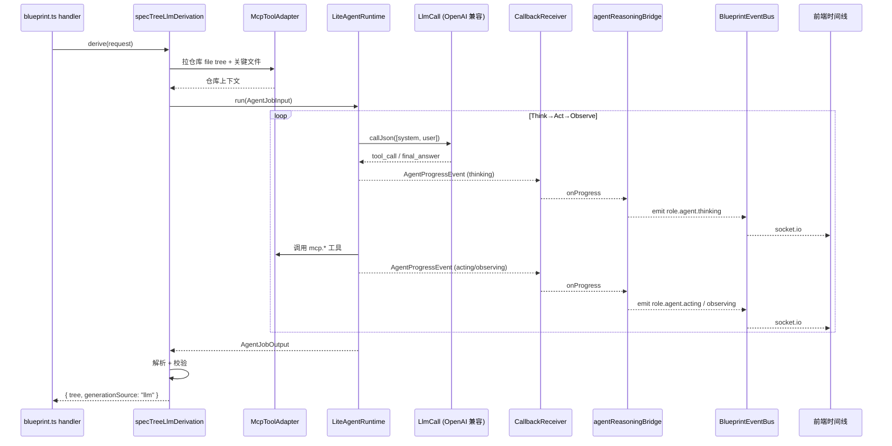

# 设计文档：Autopilot LLM-Driven Spec Generation

## Overview

本特性把 Autopilot 蓝图管线中的 `spec_tree` 和 `spec_docs` 两个阶段从“模板/模拟生成”升级为**真实 LLM 推理驱动**，并复用既有 `LiteAgentRuntime` 的 Think→Act→Observe 循环，让节点级推理事件经过既有 `agentReasoningBridge` 自然流入前端推理时间线。

设计的核心约束有四条，决定了所有后续模块边界：

1. **不修改既有桥接的内部实现**。`agent-reasoning-bridge.ts`、`callback-receiver.ts`、`lite-agent-runtime.ts`、`llm-call.ts` 一律以 `import type` 形式耦合。新模块只通过它们的公共工厂 / 监听接口接入。
2. **依赖注入而非模块单例**。新模块的所有运行期能力（`LlmCall`、`McpToolAdapter`、`LiteAgentRuntime`、`DiagnosticsStore`、`Logger`、`now()`）通过 `BlueprintServiceContext` 装配，符合既有契约风格（参见 `spec-tree/service.ts`、`mcp-github-source/bridge.ts`）。
3. **三级降级链**。Real LLM + 完整仓库上下文 → Real LLM + 路由上下文 → 模板/模拟回退。任一层失败都不阻断管线，错误信息脱敏后写入诊断 store。
4. **测试期硬锁**。`BUILD_TARGET=test` 时所有 LLM 旗标强制视为 `false`，保留既有 5140+ 测试默认兼容性；个别集成测试可通过 `vi.stubEnv("BLUEPRINT_*_ENABLED", "true")` 单独打开。

> **与既有 `spec-tree/service.ts` / `spec-documents/service.ts` 的关系**：现有 service 走单次 `callJson` 直调路径，本特性引入的 `spec-tree-llm-derivation.ts` / `spec-docs-llm-generation.ts` 是 **Agent 循环驱动版本**，在 `BLUEPRINT_SPEC_TREE_LLM_ENABLED=true` 时优先选用，未启用时继续走既有 service 或模板路径，互不破坏。

## Architecture

### 整体定位

```
┌────────────────────────────────────────────────────────────────────────┐
│ server/routes/blueprint.ts (handler around line 9300 / 9128)           │
│                                                                        │
│  spec_tree 生成入口                       spec_docs 生成入口            │
│      │                                        │                        │
│      ▼                                        ▼                        │
│  env-gated branch                         env-gated branch              │
│      │                                        │                        │
│      ▼ (true)                                 ▼ (true)                  │
└──┬───────────────────────────────────────────┬─────────────────────────┘
   │                                            │
   ▼                                            ▼
┌─────────────────────────────┐    ┌──────────────────────────────────┐
│ spec-tree-llm-derivation.ts │    │ spec-docs-llm-generation.ts      │
│   createSpecTreeLlmDerivation│    │   createSpecDocsLlmGeneration    │
│                              │    │                                  │
│   1) 拉仓库上下文 via MCP    │    │   1) 取节点上下文 + 父子链     │
│   2) 走 Agent 循环          │    │   2) 走 Agent 循环 (按节点)      │
│   3) 解析 + 校验 JSON       │    │   3) 解析 + 校验 JSON           │
│   4) 三级降级链             │    │   4) 三级降级链                 │
└────────────┬─────────────────┘    └──────────────┬───────────────────┘
             │                                     │
             ▼                                     ▼
       ┌──────────────────────────────────────────────────┐
       │ LiteAgentRuntime.run(AgentJobInput)              │
       │                                                  │
       │  Think → Act → Observe → Think → ...             │
       │      │       │      │                            │
       │      ▼       ▼      ▼                            │
       │   AgentProgressEvent (HMAC 回调载荷)             │
       └──────────────────┬───────────────────────────────┘
                          │
                          ▼
       ┌──────────────────────────────────────────────────┐
       │ CallbackReceiver.onProgress(listener)            │
       └──────────────────┬───────────────────────────────┘
                          │
                          ▼
       ┌──────────────────────────────────────────────────┐
       │ agentReasoningBridge (既有，不改内部)            │
       │   AgentProgressEvent → role.agent.* 事件         │
       └──────────────────┬───────────────────────────────┘
                          │
                          ▼
       ┌──────────────────────────────────────────────────┐
       │ BlueprintEventBus → Socket.IO → 前端时间线       │
       └──────────────────────────────────────────────────┘
```

### 端到端事件链（Happy Path）

下图说明真实事件如何从 LLM 调用一路流到前端时间线，**不需要 agent-reasoning-bridge 做任何改动**：



### 三级降级链

```
┌──────────────────────────────────────────────────────────────────┐
│ Tier 1: Real LLM + Full Repo Context                              │
│   - BLUEPRINT_SPEC_TREE_LLM_ENABLED === "true"                    │
│   - LlmCall.apiKey 非空                                           │
│   - MCP fetch 成功                                                │
│   - Lite Agent 循环成功完成                                        │
│   - JSON schema 通过                                              │
│   ⇒ generationSource = "llm"                                      │
└────────────────────────────┬─────────────────────────────────────┘
                             │ 任一上游失败
                             ▼
┌──────────────────────────────────────────────────────────────────┐
│ Tier 2: Real LLM + Route-Only Context                             │
│   - LLM 旗标 + apiKey 仍可用                                      │
│   - MCP 不可达 / fetch 超时 / file tree 解析失败                   │
│   - 仍走 Lite Agent 循环，prompt 中省略仓库结构                    │
│   ⇒ generationSource = "llm" (degraded=true 写入诊断)             │
└────────────────────────────┬─────────────────────────────────────┘
                             │ Agent 循环失败 / parse 失败 / 超时
                             ▼
┌──────────────────────────────────────────────────────────────────┐
│ Tier 3: Template / Simulated Fallback                             │
│   - 旗标关闭 / apiKey 缺失 / Lite Agent 失败 / parse 失败          │
│   ⇒ generationSource = "template"                                 │
│   ⇒ fallbackReason 脱敏后写入诊断 store                            │
└──────────────────────────────────────────────────────────────────┘
```

## Components and Interfaces

### 1. `server/routes/blueprint/llm-spec-prompts.ts`

**职责**：集中管理 prompt 模板、版本号、JSON schema、脱敏规则。所有 prompt-building 逻辑在此。

```typescript
import { z } from "zod";
import type {
  BlueprintRouteCandidate,
  BlueprintRouteSet,
  BlueprintSpecTreeNode,
} from "../../../shared/blueprint/index.js";

/** Prompt 版本号；schema 破坏性变更时升级到 v2。 */
export const SPEC_TREE_PROMPT_ID = "blueprint.spec-tree-llm.v1" as const;
export const SPEC_DOCS_PROMPT_ID = "blueprint.spec-docs-llm.v1" as const;

/** Spec Tree LLM 响应 schema —— 只校验 LLM 输出层结构，不做扁平化。 */
export const SpecTreeLlmResponseSchema = z.object({
  rootTitle: z.string().min(1).max(200),
  rootSummary: z.string().min(1).max(2000),
  nodes: z
    .array(
      z.object({
        id: z.string().min(1).max(64),
        parentId: z.string().min(1).max(64).optional(),
        title: z.string().min(1).max(200),
        summary: z.string().min(1).max(2000),
        type: z.enum([
          "root",
          "module",
          "submodule",
          "route_step",
          "alternative_route",
        ]),
        priority: z.number().int().min(0).max(100),
      })
    )
    .min(1)
    .max(64),
});

/** Spec Docs LLM 响应 schema —— 单节点产出三个文档段落。 */
export const SpecDocsLlmResponseSchema = z.object({
  requirements: z.string().min(1).max(20000),
  design: z.string().min(1).max(20000),
  tasks: z.string().min(1).max(20000),
});

export interface BuildSpecTreePromptInput {
  request: { targetText: string; githubUrls: string[] };
  routeSet: Pick<BlueprintRouteSet, "id" | "routes">;
  primaryRoute: BlueprintRouteCandidate;
  /** 仓库 file tree 摘要（已截断到 maxRepoTokens 内）。可选。 */
  repoTreeDigest?: string;
  /** 关键配置文件原文（package.json/tsconfig.json/...）。可选。 */
  keyFiles?: Array<{ path: string; content: string }>;
}

export interface BuildSpecDocsPromptInput {
  node: Pick<
    BlueprintSpecTreeNode,
    "id" | "title" | "summary" | "type" | "parentId"
  >;
  parentSummary?: string;
  siblingSummaries: ReadonlyArray<{ id: string; title: string; summary: string }>;
  primaryRouteSummary: string;
  /** 该节点相关的仓库片段，可选。 */
  relevantRepoExcerpts?: ReadonlyArray<{ path: string; excerpt: string }>;
}

export interface PromptPayload {
  promptId: string;
  systemMessage: string;
  userMessage: string;
  /** sha256(systemMessage + "\n\n" + userMessage)，用于 provenance.promptFingerprint。 */
  promptFingerprint: string;
}

export function buildSpecTreePrompt(input: BuildSpecTreePromptInput): PromptPayload;
export function buildSpecDocsPrompt(input: BuildSpecDocsPromptInput): PromptPayload;

/** 从 LLM 响应字符串/对象中提取并通过 schema 校验。 */
export function parseSpecTreeLlmResponse(
  raw: unknown
): { ok: true; data: z.infer<typeof SpecTreeLlmResponseSchema> } | { ok: false; reason: string };

export function parseSpecDocsLlmResponse(
  raw: unknown
): { ok: true; data: z.infer<typeof SpecDocsLlmResponseSchema> } | { ok: false; reason: string };
```

**关键设计点：**

- prompt **JSON 模式**通过在 system message 中明确要求 `"You MUST respond with a valid JSON object matching the schema..."`，并在 `LiteAgentRuntime` 的 `LlmCallInput.responseFormat = "json_object"`（如可用）/ 模型默认 JSON 模式触发。
- schema 严格化：`min/max` 限制都是为了防止 LLM 失控产出超长 token；溢出即视为 invalid。
- prompt fingerprint 用于 provenance，方便回放与对账。

### 2. `server/routes/blueprint/spec-tree-llm-derivation.ts`

**职责**：编排 SPEC 树的 LLM 推导。装配 MCP 仓库抓取、Lite Agent 循环、schema 校验、降级链。

```typescript
import type {
  BlueprintRouteSet,
  BlueprintSpecTree,
  BlueprintSpecTreeNode,
} from "../../../shared/blueprint/index.js";
import type { LlmCallFn } from "./role-agent-runtime/llm-call.js";
import type { LiteAgentRuntime } from "./role-agent-runtime/lite-agent-runtime.js";
import type { McpToolAdapterDependency } from "./context.js";
import type { BlueprintLogger } from "./context.js";
import type { BlueprintRuntimeDiagnosticsStore } from "./runtime-enablement/diagnostics-store.js";

/** 工厂依赖（DI 容器，符合 BlueprintServiceContext 风格）。 */
export interface SpecTreeLlmDerivationDeps {
  /** 直接 LLM 调用函数；当 liteAgentRuntime 不可用时退路使用。 */
  llmCall: LlmCallFn;
  /** MCP GitHub 适配器；用于抓取仓库结构与关键文件。可选。 */
  mcpToolAdapter?: McpToolAdapterDependency;
  /** Lite Agent 运行时；用于驱动 Think→Act→Observe 循环。可选。 */
  liteAgentRuntime?: LiteAgentRuntime;
  /** 诊断 store；记录 specTreeLlm entry 的所有计数与最近错误。 */
  diagnostics: BlueprintRuntimeDiagnosticsStore;
  logger: BlueprintLogger;
  now: () => Date;
}

/** 推导请求。 */
export interface SpecTreeLlmDerivationRequest {
  jobId: string;
  routeSet: BlueprintRouteSet;
  selectedRouteId: string;
  githubUrls: ReadonlyArray<string>;
  targetText: string;
}

/** 推导结果。tree 字段在 fallback 路径上为 undefined。 */
export interface SpecTreeLlmDerivationResult {
  /** 真实 LLM 路径返回构造好的 SpecTree；fallback 时为 undefined，由调用方走模板。 */
  tree?: BlueprintSpecTree;
  generationSource: "llm" | "template";
  /** Tier 标记：full / route-only / fallback。 */
  contextTier: "full" | "route-only" | "fallback";
  /** 真实 LLM 路径填充：promptId / model / promptFingerprint / responseDigest。 */
  promptId?: string;
  model?: string;
  promptFingerprint?: string;
  responseDigest?: string;
  /** Fallback 路径填充：脱敏后的失败原因（≤ 400 字符）。 */
  fallbackReason?: string;
}

export interface SpecTreeLlmDerivation {
  derive(
    request: SpecTreeLlmDerivationRequest
  ): Promise<SpecTreeLlmDerivationResult>;
}

export function createSpecTreeLlmDerivation(
  deps: SpecTreeLlmDerivationDeps
): SpecTreeLlmDerivation;
```

**内部流程（按降级层级）：**

1. **Tier 1 — Real LLM + Full Repo**
   - 调用 `mcpToolAdapter.execute(...)` 拉取 file tree + 关键文件（package.json / tsconfig.json / Cargo.toml / pom.xml 中存在的）。
   - 命中 `BLUEPRINT_SPEC_TREE_LLM_MAX_REPO_TOKENS`（默认 32000）时按文件优先级截断（package.json > tsconfig.json > 入口文件 > 其他）。
   - 构造 `AgentJobInput`，工具集合 `tools` 至少包含 `mcp.github`（已加载的 MCP 适配器名）+ `builtin.finish`。
   - `liteAgentRuntime.run(input)` 驱动 ReAct 循环。每一步 `AgentProgressEvent` 经回调链路自然到达前端。
   - 解析最终 answer JSON，校验 schema，扁平化为 `BlueprintSpecTreeNode[]`，包装成 `BlueprintSpecTree`。

2. **Tier 2 — Real LLM + Route-Only**
   - MCP 调用失败 / 没有 `mcpToolAdapter` / file tree 解析失败 时进入。
   - 不带 `repoTreeDigest`，prompt 只包含路由摘要 + 步骤。
   - **诊断**：`diagnostics.recordBridgeInvocation("specTreeLlm", { mode: "real", error: "mcp unavailable: <reason>" })`。

3. **Tier 3 — Template Fallback**
   - 任何下列情况触发：旗标关闭、apiKey 缺失、Agent 循环抛错、超时（`BLUEPRINT_SPEC_TREE_LLM_TIMEOUT_MS`）、JSON parse 失败、schema 失败、节点关系构造失败（孤儿 / 环 / 无 root）。
   - 返回 `{ generationSource: "template", contextTier: "fallback", fallbackReason: <脱敏> }`，调用方走既有模板路径。
   - **诊断**：`diagnostics.recordBridgeInvocation("specTreeLlm", { mode: "simulated_fallback", error: ... })`。

**关键设计点：**

- **Lite Agent vs 直接 LLM call**：`liteAgentRuntime` 优先（产生真实 Think→Act→Observe 事件流）；若未注入则回退到 `llmCall` 直调（只生成 final answer，没有中间事件，但仍标 `generationSource: "llm"`）。
- **超时**：用 `Promise.race` 把 `liteAgentRuntime.run()` 与 `setTimeout(reject, BLUEPRINT_SPEC_TREE_LLM_TIMEOUT_MS)` 竞速；超时即降级。
- **schema 失败 → fallback**：`zod.safeParse(...)` 不通过即视为 Tier 3，写入 `fallbackReason: "schema validation failed: <issue.message>"`（脱敏后截断到 400）。
- **重复 jobId 防护**：`derive()` 不持有 jobId 缓存；同一 jobId 的二次调用由调用方控制（既有 handler 已经有去重）。

### 3. `server/routes/blueprint/spec-docs-llm-generation.ts`

**职责**：按节点逐个生成 requirements / design / tasks 文档。深度优先、根节点先行。

```typescript
import type {
  BlueprintSpecTreeNode,
  BlueprintRouteCandidate,
} from "../../../shared/blueprint/index.js";
import type {
  SpecTreeLlmDerivationDeps, // 共享相同的依赖形状
} from "./spec-tree-llm-derivation.js";

export interface SpecDocsLlmGenerationDeps extends SpecTreeLlmDerivationDeps {}

export interface SpecDocsLlmGenerationRequest {
  jobId: string;
  /** 已确定的 SPEC 树节点；调用方按 root-first DFS 顺序传入。 */
  nodes: ReadonlyArray<BlueprintSpecTreeNode>;
  primaryRoute: BlueprintRouteCandidate;
  /** 相关仓库片段（可选）；按 nodeId 索引到具体节点。 */
  repoExcerptsByNodeId?: ReadonlyMap<
    string,
    ReadonlyArray<{ path: string; excerpt: string }>
  >;
}

export interface SpecDocsLlmNodeOutput {
  nodeId: string;
  generationSource: "llm" | "template";
  contextTier: "full" | "route-only" | "fallback";
  /** 真实路径返回三个 markdown 段落。 */
  requirements?: string;
  design?: string;
  tasks?: string;
  /** 真实路径 provenance。 */
  promptId?: string;
  model?: string;
  promptFingerprint?: string;
  responseDigest?: string;
  /** Fallback 时填充。 */
  fallbackReason?: string;
}

export interface SpecDocsLlmGenerationResult {
  /** 与 request.nodes 顺序一致；逐节点结果。 */
  perNode: ReadonlyArray<SpecDocsLlmNodeOutput>;
  /** 全部节点都成功为 "llm"；任一节点退化即为 "mixed"；全部 fallback 为 "template"。 */
  overallSource: "llm" | "mixed" | "template";
}

export interface SpecDocsLlmGeneration {
  generate(
    request: SpecDocsLlmGenerationRequest
  ): Promise<SpecDocsLlmGenerationResult>;
}

export function createSpecDocsLlmGeneration(
  deps: SpecDocsLlmGenerationDeps
): SpecDocsLlmGeneration;
```

**关键设计点：**

- **节点串行**：requirement 2.4 要求 root-first DFS，便于父节点上下文影响子节点。实现就是 `for (const node of request.nodes) { await generateOne(node, accumulatedParents) }`。
- **每节点独立超时**：`BLUEPRINT_SPEC_DOCS_LLM_TIMEOUT_MS`（默认 180000ms）作用于单节点，不累计。
- **每节点独立降级**：单节点失败只影响该节点（`generationSource: "template"`），其他节点继续走 LLM 路径。结果中 `overallSource = "mixed"`。
- **诊断聚合**：每个节点的 `recordBridgeInvocation("specDocsLlm", ...)` 都各算一次，方便观察"几个节点降级了"。
- **父节点摘要传递**：`generateOne` 维护一个 `parentSummaryMap: Map<nodeId, summary>`，子节点 prompt 中带入 `parentSummary`，从而满足 requirement 2.3 / 2.4。

### 4. `server/routes/blueprint/runtime-enablement/diagnostics-store.ts`（扩展）

**新增 BridgeId**：在 `BridgeId` union 中加入 `"specTreeLlm"` 与 `"specDocsLlm"`，并把它们追加到 `BRIDGE_IDS` 常量数组（保持顺序为追加）。

**新增字段**：现有 entry 形态已经能完整承载所需字段（`enabledByConfig` / `dependencyReady` / `totalInvocations` / `realInvocations` / `fallbackInvocations` / `lastMode` / `lastError`），无需增字段。

**写入方式**：复用既有 `recordBridgeInvocation(bridgeId, { mode, error? })` 与 `recordBridgeConfiguration(bridgeId, { enabledByConfig, dependencyReady })`。**不需要新加方法**，新模块直接调用现有 API。

**snapshot 兼容**：`snapshot()` 已经按 `BRIDGE_IDS` 列表全量返回，新桥追加后自动出现在 `GET /api/blueprint/diagnostics` 输出中。前端原有 6 桥消费代码不受影响（只多看到两个新 key）。

### 5. `server/routes/blueprint/context.ts`（扩展）

新增字段，**全部可选**，不破坏既有装配路径：

```typescript
export interface BlueprintServiceContext {
  // ...既有字段不变...

  /**
   * SPEC Tree LLM 推导器（Agent 循环驱动版本）。
   * 默认装配在 buildBlueprintServiceContext 内，由 createSpecTreeLlmDerivation(ctx) 构造；
   * 测试可通过 deps.specTreeLlmDerivation 注入 fake 完全短路 LLM。
   */
  specTreeLlmDerivation?: SpecTreeLlmDerivation;

  /** SPEC Docs LLM 生成器（按节点 Agent 循环）。装配规则同上。 */
  specDocsLlmGeneration?: SpecDocsLlmGeneration;
}

export interface BlueprintServiceContextDeps {
  // ...既有字段不变...
  specTreeLlmDerivation?: SpecTreeLlmDerivation;
  specDocsLlmGeneration?: SpecDocsLlmGeneration;
}
```

**装配顺序**（在 `buildBlueprintServiceContext` 内）：
1. 既有：`runtimeDiagnostics`、`llm`、`mcpToolAdapter`、`logger`、`now`、`liteAgentRuntime`（来自 `createLiteAgentRuntime(...)`，已有装配）。
2. 新增：在所有依赖就位后构造 `specTreeLlmDerivation` 与 `specDocsLlmGeneration`：
   ```typescript
   const specTreeLlmDerivation =
     deps.specTreeLlmDerivation ??
     createSpecTreeLlmDerivation({
       llmCall: ctx.llm.callJson, // 直接复用，避免新增 LlmCall 实例
       mcpToolAdapter: ctx.mcpToolAdapter,
       liteAgentRuntime: ctx.liteAgentRuntime, // 既有字段
       diagnostics: ctx.runtimeDiagnostics,
       logger: ctx.logger,
       now: ctx.now,
     });
   ```
3. 同时调用 `runtimeDiagnostics.recordBridgeConfiguration("specTreeLlm", { enabledByConfig, dependencyReady })`，便于 `/diagnostics` 端点首屏显示正确 mode。

> **注意**：`ctx.llm.callJson` 的签名（`callLLMJson`）与新模块中“`LlmCall` 类型”不完全相同；如果新模块需要 `LlmCallFn`（来自 `role-agent-runtime/llm-call.ts`），装配时改为 `llmCall: createLlmCall(...)`，与既有 `liteAgentRuntime` 共用同一份。具体由实现阶段最简化决定，design 层面不强行绑定。

### 6. `server/routes/blueprint.ts`（扩展）

只在两个既有 handler 中插入 env-gated 分支，**不动 handler 上下游签名**：

**spec_tree handler（约 line 9300）：**

```typescript
// ...既有：解析 routeSet / selectedRouteId / githubUrls...

// 新增分支（伪代码示意，实际落地由 implementation 任务负责）：
const llmEnabled = process.env.BLUEPRINT_SPEC_TREE_LLM_ENABLED === "true";
const isTest = process.env.BUILD_TARGET === "test";
const derivation = ctx.specTreeLlmDerivation;

let derivedTree: BlueprintSpecTree | undefined;
let generationSource: "llm" | "template" = "template";

if (llmEnabled && !isTest && derivation) {
  const result = await derivation.derive({
    jobId: job.id,
    routeSet,
    selectedRouteId,
    githubUrls,
    targetText: request.targetText,
  });
  if (result.generationSource === "llm" && result.tree) {
    derivedTree = result.tree;
    generationSource = "llm";
    // provenance 写入 artifact.payload.provenance: { generationSource, promptId, model, ... }
  }
  // 失败 → 走既有模板分支，generationSource 保持 "template"
}

if (!derivedTree) {
  derivedTree = buildTemplateSpecTree(/* 既有模板逻辑 */);
}
```

**spec_docs handler（约 line 9128）：**与上同构，调用 `ctx.specDocsLlmGeneration.generate(...)`，把 `perNode[i].requirements/design/tasks` 写入对应 artifact。

**关键约束：**
- 既有模板路径**完全保留**，只新增前置 LLM 分支。
- `generationSource` 字段写入 artifact `provenance`，符合既有 `BlueprintSpecTree.provenance.generationSource: "llm" | "llm_fallback" | "template"` 字段（contracts.ts 已有）。
- 当 LLM 推导失败但仍保留了 promptId/model/error 时，可写 `generationSource: "llm_fallback"`（这是既有契约接受的值）。design 层倾向把 fallback 也作为 `"template"` 处理以最大化兼容；具体细节实现层再敲定。

## Data Models

### Diagnostics Entry（扩展，无新结构）

直接复用 `BridgeDiagnosticEntry`：

```typescript
{
  bridgeId: "specTreeLlm",
  mode: "real" | "fallback" | "enabled" | "disabled" | "unknown",
  enabledByConfig: boolean,        // 由 BLUEPRINT_SPEC_TREE_LLM_ENABLED 决定
  dependencyReady: boolean,        // mcpToolAdapter && liteAgentRuntime && apiKey 三者俱全
  lastInvocationAt?: string,
  lastMode?: "real" | "simulated_fallback",
  lastError?: string,              // 已通过 applyAgentCrewRedaction 脱敏 + 400 字截断
  totalInvocations: number,
  realInvocations: number,
  fallbackInvocations: number,
}
```

`specDocsLlm` 同构。

### Provenance Block（写入 artifact.payload.provenance）

`BlueprintSpecTree.provenance` 已有以下字段（contracts.ts）：
- `generationSource: "llm" | "llm_fallback" | "template"`
- `promptId?: string`
- `model?: string`
- `responseDigest?: string`
- `structuredPayloadDigest?: string`
- `promptFingerprint?: string`
- `error?: string`（fallback 路径）

新模块直接产出这些字段，无需扩展 shared 契约。`BlueprintSpecDocument` / `BlueprintSpecDocumentVersionSnapshot` 同样已有对应字段。

### AgentJobInput（构造）

新模块构造 `AgentJobInput`（来自 `shared/blueprint/agent-job.ts`）的关键字段：

```typescript
{
  jobId: <derivation jobId>,
  roleId: "blueprint-spec-tree-llm" | "blueprint-spec-docs-llm",
  systemPrompt: <由 buildSpecTreePrompt 产出>,
  userPrompt: <由 buildSpecTreePrompt 产出>,
  tools: [
    { id: "mcp.github", description: "Fetch repository structure...", schema: {...} },
    { id: "builtin.finish", description: "Return final JSON answer", schema: {...} },
  ],
  context: { workspaceDir: undefined }, // Lite Mode 由 runtime 自动填充
  budget: { maxIterations: 8, maxTokens: 16000, maxDurationMs: <env timeout> },
}
```

### 环境旗标

| 旗标 | 默认 | 作用 |
|---|---|---|
| `BLUEPRINT_SPEC_TREE_LLM_ENABLED` | `false` | spec_tree 阶段是否启用 LLM 推导 |
| `BLUEPRINT_SPEC_DOCS_LLM_ENABLED` | `false` | spec_docs 阶段是否启用 LLM 生成 |
| `BLUEPRINT_SPEC_TREE_LLM_TIMEOUT_MS` | `180000` | spec_tree 单次 Agent 循环超时 |
| `BLUEPRINT_SPEC_DOCS_LLM_TIMEOUT_MS` | `180000` | spec_docs 单节点超时 |
| `BLUEPRINT_SPEC_TREE_LLM_MAX_REPO_TOKENS` | `32000` | 仓库上下文截断阈值 |
| `BUILD_TARGET=test` | — | 强制把上述 LLM 旗标视作 false（除非测试 stubEnv） |

`.env.example` 同步补充：

```dotenv
# === Autopilot LLM-driven SPEC generation ===
# 启用 spec_tree 阶段的真实 LLM 推导（默认关闭，opt-in）
BLUEPRINT_SPEC_TREE_LLM_ENABLED=false
# 启用 spec_docs 阶段的真实 LLM 生成
BLUEPRINT_SPEC_DOCS_LLM_ENABLED=false
# 单次推理超时
BLUEPRINT_SPEC_TREE_LLM_TIMEOUT_MS=180000
BLUEPRINT_SPEC_DOCS_LLM_TIMEOUT_MS=180000
# 仓库上下文截断（按 token 估算）
BLUEPRINT_SPEC_TREE_LLM_MAX_REPO_TOKENS=32000
```

## Error Handling

### 错误分类与处理矩阵

| 错误类别 | 触发条件 | 处理 |
|---|---|---|
| 旗标关闭 | env flag 非 `"true"` 或 `BUILD_TARGET=test` | 直接返回 `generationSource: "template"`，不调诊断 |
| apiKey 缺失 | `getAIConfig().apiKey` 为空 | 同上 |
| MCP 不可达 | `mcpToolAdapter == undefined` 或 `execute()` 抛错 / 返回 `status !== "completed"` | Tier 2 降级，`contextTier: "route-only"`，warn log，诊断写 real（带 error 注释） |
| MCP 超时 | wall-clock 超过 timeout 的 1/3（仓库抓取预算） | 同上 |
| Lite Agent 抛错 | `liteAgentRuntime.run()` reject | Tier 3 fallback，`recordBridgeInvocation(..., { mode: "simulated_fallback", error })` |
| Lite Agent 总超时 | 整体 `Promise.race` 超时 | 同上，`fallbackReason: "agent timeout after Nms"` |
| LLM 非 JSON | rawPayload 非对象 / 非字符串 | 同上 |
| schema 不通过 | `safeParse` 失败 | 同上，error 包含 issue.message（脱敏） |
| 节点关系无效 | 孤儿节点 / 环 / 无 root | 同上，`fallbackReason: "tree construction failed: <reason>"` |
| 不可恢复错误（非超时） | 网络中断、provider 不可用 | requirement 1.5 要求**不**触发 timeout-specific abort，而是按错误正常上抛后捕获，最终落 Tier 3 fallback |

### 脱敏

复用 `applyAgentCrewRedaction(text, REDACTION_POLICY)`（已在 diagnostics store / agent-reasoning-bridge 内沿用），统一过滤 API key、邮箱、GitHub PAT 等敏感字符串。错误消息写入诊断前同步截断到 400 字符。

### 错误日志层级

- `debug`：env-off 早退、apiKey 缺失（频繁）、单次降级原因。
- `warn`：MCP 路径失败但 LLM 路径继续、schema 校验失败、超时。
- **不上 error**：所有 LLM 失败都属于业务上"软失败"，不应让 PM2 / pm-restart 误以为服务故障。

### 失败传播边界

- 新模块 `derive()` / `generate()` **绝不抛错**；任何异常都被捕获并转成 `generationSource: "template"`。
- handler 端不需要 `try/catch` 包裹新分支，但仍按既有规范保留模板路径 fallback。
- 若 `recordBridgeInvocation` / `recordBridgeConfiguration` 自身抛错（理论上不会，纯内存操作），用 `try/catch` 静默吞掉并 debug log，不污染主流程。

## Testing Strategy

### PBT 适用性评估

**本特性不引入 property-based testing**，原因：

- 核心行为是**LLM 调用 + 解析 + 降级编排**，行为不随输入空间变化产生新的 invariant —— 给 PBT 100 个随机 routeSet 不会比 5 个手写示例发现更多 bug。
- `LlmCall` 必须 mock；mocked LLM 的输出由测试构造，不存在真实输入空间。
- prompt fingerprint / 摘要 / 截断这些纯函数级别的细节即使适合 PBT，也会和既有 `spec-tree/service.ts` 已有的测试重复。
- 用户在任务清单中已明确："No PBT, only example-based tests"。

因此 design 跳过 Correctness Properties 章节，直接列出**例子驱动**测试方案。

### 测试文件与范围

#### `server/routes/blueprint/__tests__/spec-tree-llm-derivation.test.ts`

**框架**：vitest + 手写 fake `llmCall` / `mcpToolAdapter` / `liteAgentRuntime` / `diagnostics`。

**测试用例（最小集，每条对应一个验收条件）：**

| # | 场景 | 输入 | 预期 |
|---|---|---|---|
| 1 | happy path Tier 1 | LLM 返回合法 JSON，MCP 返回 file tree | `generationSource: "llm"`, `contextTier: "full"`, `tree.nodes.length > 0`, `provenance.promptFingerprint` 非空 |
| 2 | env-off 早退 | 旗标 = `"false"` | `generationSource: "template"`, 不调 `liteAgentRuntime.run`, 不调 `recordBridgeInvocation` |
| 3 | `BUILD_TARGET=test` 强锁 | 旗标 = `"true"`, BUILD_TARGET = "test" | 同 #2 |
| 4 | apiKey 缺失 | `getConfig().apiKey === ""` | 同 #2 |
| 5 | MCP 不可用 → Tier 2 | mcpToolAdapter = undefined | `generationSource: "llm"`, `contextTier: "route-only"`, prompt 不含 repo digest |
| 6 | MCP 抛错 → Tier 2 | adapter.execute reject | 同 #5 |
| 7 | LLM 抛错 → Tier 3 | liteAgentRuntime.run reject | `generationSource: "template"`, `fallbackReason` 含 "agent threw" |
| 8 | 超时 → Tier 3 | run 永不 resolve, 设短 timeout | `generationSource: "template"`, `fallbackReason` 含 "timeout" |
| 9 | 非 JSON → Tier 3 | run 返回 `output: "not json"` | `fallbackReason: "non-json response"` |
| 10 | schema 失败 → Tier 3 | run 返回结构不全的 JSON | `fallbackReason` 含 "schema validation failed" |
| 11 | 树关系失败 → Tier 3 | schema 通过但根节点缺失 | `fallbackReason` 含 "tree construction failed" |
| 12 | 诊断 store 写入 | Tier 1 成功 | `recordBridgeInvocation("specTreeLlm", { mode: "real" })` 被调用 1 次 |
| 13 | 错误脱敏 | LLM 错误消息含 `sk-test-1234` | `fallbackReason` 不含原始 key |
| 14 | 错误截断 | LLM 抛 1000 字错误 | `fallbackReason.length <= 400` |
| 15 | promptFingerprint 稳定 | 同样输入连调两次 | 两次 fingerprint 相等 |

#### `server/routes/blueprint/__tests__/spec-docs-llm-generation.test.ts`

| # | 场景 | 预期 |
|---|---|---|
| 1 | 单节点 happy path | `perNode[0].generationSource === "llm"`, 三段 markdown 都非空 |
| 2 | 多节点全成功 | `overallSource: "llm"`, 顺序与输入一致 |
| 3 | 父子上下文传递 | 第二个节点的 prompt 包含第一个节点的 summary（通过 capture mock 验证 user message） |
| 4 | 部分节点降级 | 第二个节点 LLM 抛错 | `perNode[1].generationSource: "template"`, `overallSource: "mixed"` |
| 5 | 全部降级 | 所有节点都失败 | `overallSource: "template"` |
| 6 | env-off | 旗标关闭 | 全节点 `generationSource: "template"` |
| 7 | 单节点超时不阻塞 | 节点 0 超时 | 节点 1 仍按 LLM 路径走 |
| 8 | 诊断 store 多次写入 | 3 节点全成功 | `recordBridgeInvocation("specDocsLlm")` 调用 3 次 |
| 9 | schema 失败 | LLM 返回缺 `tasks` | 该节点降级，fallbackReason 含 "schema" |
| 10 | 节点串行 | 用 mock 计时验证节点 1 在节点 0 完成后才开始 | 调用顺序断言 |

### 集成测试（既有 `agent-reasoning-bridge.test.ts` 扩展）

不新增独立集成测试文件，但**手动验证条目**：

- `BLUEPRINT_SPEC_TREE_LLM_ENABLED=true` + `BLUEPRINT_AGENT_REASONING_STREAM_ENABLED=true` + 真实 OpenAI key，启动 `dev:all`，提交一个 spec_tree 请求，前端 `agent-reasoning-timeline` 出现 `role.agent.thinking` / `role.agent.acting(toolId="mcp.github")` / `role.agent.observing` 事件，并最终 `role.agent.completed`。
- `GET /api/blueprint/diagnostics` 返回 `bridges.specTreeLlm.mode === "real"`、`realInvocations >= 1`。

### 测试执行命令

```bash
# 单元测试（mock 全部）
node --run check                         # 类型检查不能扩大基线
npx vitest run server/routes/blueprint/__tests__/spec-tree-llm-derivation.test.ts
npx vitest run server/routes/blueprint/__tests__/spec-docs-llm-generation.test.ts

# 全量回归
npx vitest run                           # 5140+ 既有测试不能挂
```

## Risk and Mitigation

| 风险 | 影响 | 缓解 |
|---|---|---|
| `agent-reasoning-bridge.ts` 内部行为发生变化 | 真实事件流不再到达前端 | 不修改其内部，订阅其公共 `ProgressListener`；在集成测试中加一条手动 smoke |
| MCP `mcpToolAdapter.execute` 在大仓库上拖慢整体 | 用户感知 spec_tree 长时间无响应 | 给 MCP 抓取阶段设独立超时（≤ 整体 timeout 的 1/3），失败即 Tier 2 |
| LLM 输出无效 JSON 频繁触发 fallback | 用户看不到 LLM 价值 | prompt 中明确要求 JSON 模式 + schema 例子；`temperature` 取 0.2~0.4 |
| diagnostics entry 数量从 8 增到 10，前端兼容 | 现有展示组件硬编码 8 个 | 既有前端按 key map 渲染，不依赖固定数量；新 key 自动出现，无破坏 |
| `LlmCall` 的 `LlmCallFn` 与 `callLLMJson` 签名差异 | 装配阶段类型不齐 | 新模块统一用 `LlmCallFn`（与 `liteAgentRuntime` 同源），装配时复用 `createLlmCall(...)` 实例 |
| TS 基线 113 个错误 | 新代码引入更多错误 | 新模块全量类型，禁止 `any`；接口对外通过 `import type`；CI 跑 `node --run check` 比对基线 |
| 5140+ 既有测试 | `BUILD_TARGET=test` 下默认旗标关闭 | 在新模块的 `isEnvOff` 检查中显式短路；不在测试 setup 修改 process.env |
| 父节点上下文 token 累积爆炸（spec_docs 大树） | LLM 超 token 限制 | `parentSummaryMap` 只存 ≤ 200 字摘要，不存全文 |
| 同 jobId 二次调用并发触发两次 LLM | 浪费 token + 双倍诊断写入 | `derive()` / `generate()` 不持有去重；调用方既有 handler 已 idempotent，不在新模块再做一层 |
| `liteAgentRuntime` 未注入但旗标开启 | 无法走真实事件流 | 退路：`llmCall` 直调，仍标 `generationSource: "llm"`，但前端不会看到中间事件，warn log 提示 |
| MCP 工具白名单冲突 | Lite Agent 在循环中调用未注册的 `mcp.github` | 工厂在构造 `AgentJobInput.tools` 前先检查 `mcpToolAdapter` 存在，缺失即不放进 tools，由 prompt 引导走纯 LLM 推导 |

---

## 设计决策记录（ADR-style 摘要）

### D-1：复用 LiteAgentRuntime 而非新建 Agent 循环
- **背景**：requirement 3 要求 Think→Act→Observe 真实事件经 `agent-reasoning-bridge` 流入前端时间线。
- **方案**：直接调 `LiteAgentRuntime.run(input)`，让既有 `progress-emitter` → `callbackReceiver` → `agentReasoningBridge` 链路自然产生事件。
- **替代**：自建一个 mini ReAct loop。被否决：会绕过 `agentReasoningBridge`，需要自己复刻 7 种事件家族，与 design §架构强约束 #1 矛盾。

### D-2：新模块独立于 `spec-tree/service.ts`
- **背景**：现有 `spec-tree/service.ts` 是单次 `callJson` 直调路径，已经有大量既有测试与契约依赖。
- **方案**：新模块 `spec-tree-llm-derivation.ts` 走 Agent 循环路径，共存而非替换；handler 优先 derivation，fallback 时仍可走既有 service 或模板。
- **替代**：扩展既有 service。被否决：会改动 `service.ts` 的签名与行为，破坏现有 5140+ 测试基线。

### D-3：诊断 entry 复用既有结构
- **背景**：requirement 4.x / 总览要求 `specTreeLlm` / `specDocsLlm` 出现在 `/diagnostics`。
- **方案**：`BridgeDiagnosticEntry` 现有 7 个字段已经覆盖所需统计；只在 `BridgeId` union 与 `BRIDGE_IDS` 数组追加两条。
- **替代**：新增 `LlmServiceDiagnosticEntry`。被否决：会让前端按 union 分支处理，增加复杂度，与既有 6 桥风格不一致。

### D-4：spec_docs 节点串行而非并行
- **背景**：requirement 2.4 明确要求 root-first DFS，让父节点文档影响子节点。
- **方案**：`for...of await`，单节点失败立刻 fallback 该节点，不阻断兄弟节点。
- **替代**：`Promise.all` 并行。被否决：父子上下文传递无法保证；并发挤爆 LLM provider rate limit。

### D-5：env-off 早退**不**写诊断
- **背景**：requirement 4.2 + diagnostics store 设计的 `mode: "disabled"` 语义。
- **方案**：env-off 直接返回 `template`，不调 `recordBridgeInvocation`；仅在装配阶段调一次 `recordBridgeConfiguration({ enabledByConfig: false })`，让 `/diagnostics` 显示 `mode: "disabled"`。
- **替代**：每次都记一次 `mode: "simulated_fallback"`。被否决：会污染 `fallbackInvocations` 计数，让真实降级率不可观测。
