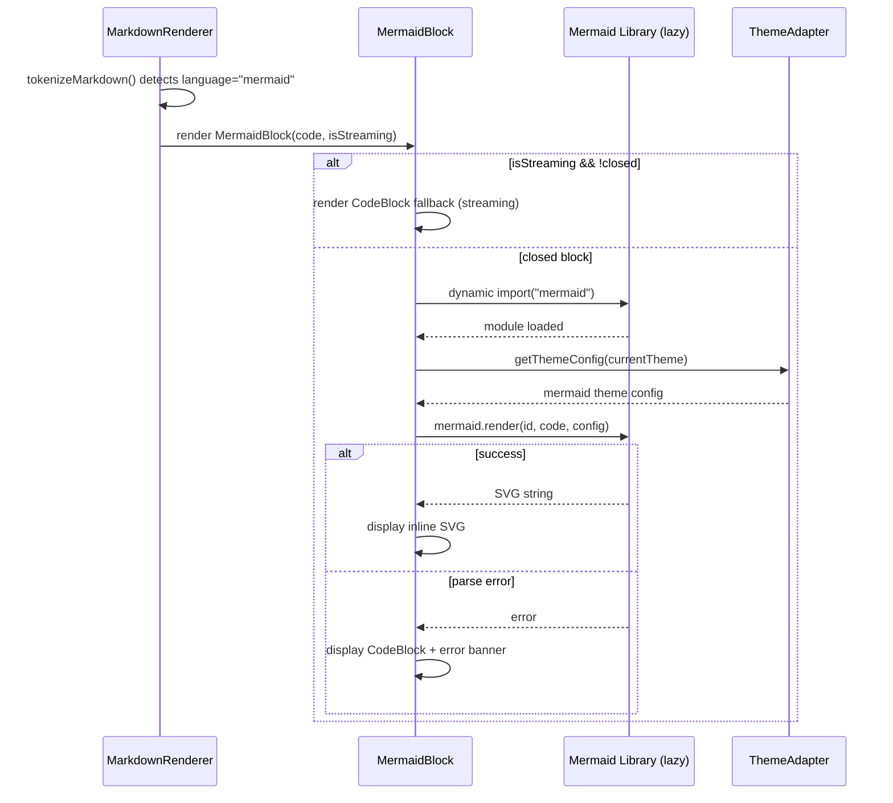

# Design Document: Autopilot Mermaid Diagram Rendering

## Overview

This design describes how Mermaid diagram rendering is integrated into the existing `StreamingDocRenderer` / `MarkdownRenderer` pipeline. The approach introduces a new `MermaidBlock` React component that replaces the existing `CodeBlock` for mermaid-annotated fenced code blocks, lazy-loads the `mermaid` npm package, and renders SVG diagrams inline within the document preview panel.

The design preserves all existing rendering behavior for non-mermaid code blocks and maintains streaming compatibility by deferring diagram rendering until a mermaid code block is fully closed.

## Architecture

### Component Hierarchy

```
StreamingDocRenderer
  └── AutopilotSpecDocumentsWorkbench
        └── WorkbenchDocMain
              └── MarkdownRenderer
                    ├── CodeBlock (non-mermaid code blocks — unchanged)
                    └── MermaidBlock (new — mermaid code blocks)
                          ├── Loading state → placeholder skeleton
                          ├── Success state → inline SVG
                          ├── Error state → CodeBlock + error banner
                          └── Click handler → MermaidFullscreenOverlay (deferred)
```

### Data Flow



## Components and Interfaces

### MermaidBlock Component

**File:** `client/src/pages/autopilot/right-rail/streaming-doc/MermaidBlock.tsx`

```typescript
export interface MermaidBlockProps {
  /** Raw mermaid diagram source (content between fences). */
  code: string;
  /** Whether this block is still being streamed (not yet closed). */
  isStreaming?: boolean;
  /** Whether the code block fence has been closed. */
  closed?: boolean;
}
```

### Mermaid Loader Module

**File:** `client/src/pages/autopilot/right-rail/streaming-doc/mermaid-loader.ts`

```typescript
/**
 * Lazily loads and initializes the mermaid library.
 * Subsequent calls return the cached module.
 */
export async function getMermaid(): Promise<typeof import("mermaid")>;

/**
 * Renders a mermaid diagram string to SVG HTML.
 * Handles initialization, theme configuration, and error propagation.
 */
export async function renderMermaidDiagram(
  code: string,
  theme: "light" | "dark"
): Promise<string>;
```

### MermaidFullscreenOverlay Component (Deferred)

**File:** `client/src/pages/autopilot/right-rail/streaming-doc/MermaidFullscreenOverlay.tsx`

```typescript
export interface MermaidFullscreenOverlayProps {
  svgHtml: string;
  open: boolean;
  onClose: () => void;
}
```

### Modified Interface: MarkdownRenderer renderToken

The existing `renderToken()` function gains a mermaid detection branch. No new exports or interface changes are introduced.

## Data Models

This feature does not introduce new persistent data models. The existing `MarkdownToken` type with `kind: "code"` already carries `language` and `closed` fields which are sufficient for mermaid detection and streaming state tracking.

### Mermaid Render State (Component-local)

```typescript
type MermaidRenderState = "streaming" | "loading" | "rendered" | "error";
```

| State | Condition | Rendered Output |
|-------|-----------|-----------------|
| `streaming` | `isStreaming === true` or `closed === false` | `CodeBlock` with streaming indicator |
| `loading` | Library being imported | Skeleton placeholder |
| `rendered` | SVG successfully produced | Inline SVG container |
| `error` | Mermaid parse failure or import failure | Error banner + `CodeBlock` fallback |

## Detailed Design

### 1. Detection Layer (MarkdownRenderer modification)

The existing `renderToken()` function in `MarkdownRenderer.tsx` handles `case "code"` by rendering a `CodeBlock`. The modification adds a branch:

```typescript
case "code": {
  const isMermaid = token.language?.toLowerCase().trim() === "mermaid";
  if (isMermaid) {
    return (
      <MermaidBlock
        key={key}
        code={token.code}
        isStreaming={isStreaming && !token.closed && isLast}
        closed={token.closed}
      />
    );
  }
  return (
    <CodeBlock
      key={key}
      code={token.code}
      language={token.language}
      isStreaming={isStreaming && !token.closed && isLast}
    />
  );
}
```

This is the only change to `MarkdownRenderer.tsx`. The tokenization logic (`tokenizeMarkdown`) remains unchanged — it already captures the `language` field from the fence annotation.

### 2. MermaidBlock Component

**File:** `client/src/pages/autopilot/right-rail/streaming-doc/MermaidBlock.tsx`

#### Props Interface

```typescript
export interface MermaidBlockProps {
  /** Raw mermaid diagram source (content between fences). */
  code: string;
  /** Whether this block is still being streamed (not yet closed). */
  isStreaming?: boolean;
  /** Whether the code block fence has been closed. */
  closed?: boolean;
}
```

#### State Machine

The component manages four states:

| State | Condition | Rendered Output |
|-------|-----------|-----------------|
| `streaming` | `isStreaming === true` or `closed === false` | `CodeBlock` with streaming indicator |
| `loading` | Library being imported | Skeleton placeholder |
| `rendered` | SVG successfully produced | Inline SVG container |
| `error` | Mermaid parse failure or import failure | Error banner + `CodeBlock` fallback |

#### Rendering Logic

```typescript
const MermaidBlock: FC<MermaidBlockProps> = ({ code, isStreaming, closed }) => {
  const { theme } = useTheme();
  const [state, setState] = useState<"streaming" | "loading" | "rendered" | "error">("streaming");
  const [svgHtml, setSvgHtml] = useState<string>("");
  const [errorMsg, setErrorMsg] = useState<string>("");
  const containerRef = useRef<HTMLDivElement>(null);
  const renderIdRef = useRef(0);

  useEffect(() => {
    // If still streaming or not closed, stay in streaming state
    if (isStreaming || !closed) {
      setState("streaming");
      return;
    }

    // Attempt render
    let cancelled = false;
    const currentRender = ++renderIdRef.current;

    setState("loading");

    renderMermaidDiagram(code, theme).then(
      (svg) => {
        if (cancelled || currentRender !== renderIdRef.current) return;
        setSvgHtml(svg);
        setState("rendered");
      },
      (err) => {
        if (cancelled || currentRender !== renderIdRef.current) return;
        setErrorMsg(err instanceof Error ? err.message : String(err));
        setState("error");
      }
    );

    return () => { cancelled = true; };
  }, [code, isStreaming, closed, theme]);

  // ... render based on state
};
```

#### SVG Container Styling

```typescript
// Rendered state
<div
  ref={containerRef}
  className="my-2 overflow-x-auto rounded border border-slate-200 bg-white p-3 dark:border-slate-700 dark:bg-slate-900"
  data-testid="mermaid-diagram"
  dangerouslySetInnerHTML={{ __html: svgHtml }}
  onClick={handleFullscreenClick}
/>
```

The SVG is constrained to `max-width: 100%` via CSS on the inner `<svg>` element. Vertical overflow is handled by the container's natural height expansion.

### 3. Mermaid Library Lazy Loader

**File:** `client/src/pages/autopilot/right-rail/streaming-doc/mermaid-loader.ts`

This module encapsulates the dynamic import and initialization of the mermaid library:

```typescript
import type { MermaidConfig } from "mermaid";

let mermaidModule: typeof import("mermaid") | null = null;
let initPromise: Promise<typeof import("mermaid")> | null = null;
let renderCounter = 0;

/**
 * Lazily loads and initializes the mermaid library.
 * Subsequent calls return the cached module.
 */
export async function getMermaid(): Promise<typeof import("mermaid")> {
  if (mermaidModule) return mermaidModule;
  if (!initPromise) {
    initPromise = import("mermaid").then((mod) => {
      mermaidModule = mod;
      return mod;
    });
  }
  return initPromise;
}

/**
 * Renders a mermaid diagram string to SVG HTML.
 * Handles initialization, theme configuration, and error propagation.
 */
export async function renderMermaidDiagram(
  code: string,
  theme: "light" | "dark"
): Promise<string> {
  const mermaid = await getMermaid();

  const config: MermaidConfig = {
    startOnLoad: false,
    theme: theme === "dark" ? "dark" : "default",
    securityLevel: "strict",
    fontFamily: "var(--font-mono, monospace)",
  };

  mermaid.default.initialize(config);

  const id = `mermaid-diagram-${++renderCounter}`;
  const { svg } = await mermaid.default.render(id, code);
  return svg;
}
```

Key design decisions:
- **Singleton pattern**: The mermaid module is loaded once and cached.
- **Security level**: Set to `strict` to prevent XSS via diagram content.
- **Unique IDs**: Each render call gets a unique ID to avoid DOM conflicts.
- **Theme re-initialization**: `mermaid.initialize()` is called before each render to apply the current theme, which is lightweight (no re-import).

### 4. Theme Adapter

Theme detection uses the existing `useTheme()` hook from `client/src/contexts/ThemeContext.tsx`. The theme value (`"light"` or `"dark"`) is passed to `renderMermaidDiagram()` which maps it to mermaid's built-in theme names:

| App Theme | Mermaid Theme |
|-----------|---------------|
| `light` | `"default"` |
| `dark` | `"dark"` |

When the theme changes, the `useEffect` in `MermaidBlock` re-triggers because `theme` is in the dependency array, causing a re-render of the diagram with the new theme.

### 5. Streaming Compatibility

The existing tokenizer already tracks whether a code block is `closed` (fence terminated). The `MermaidBlock` component uses this information:

- **Not closed / streaming**: Renders using `CodeBlock` with `language="mermaid"` and `isStreaming={true}`, showing the partial content as raw text with a streaming cursor.
- **Closed**: Triggers the mermaid render pipeline.

This ensures no partial/invalid mermaid syntax is sent to the parser during streaming.

### 6. Fullscreen Overlay (Deferred)

**File:** `client/src/pages/autopilot/right-rail/streaming-doc/MermaidFullscreenOverlay.tsx`

A simple modal overlay using Radix Dialog:

```typescript
export interface MermaidFullscreenOverlayProps {
  svgHtml: string;
  open: boolean;
  onClose: () => void;
}
```

Features:
- Full viewport overlay with dark backdrop
- SVG rendered at natural size with pan (CSS `overflow: auto`) and zoom (CSS `transform: scale()` via scroll wheel)
- Close button in top-right corner
- Escape key dismissal

This component is optional and can be deferred to a later iteration.

### 7. Bundle Impact

| Concern | Mitigation |
|---------|-----------|
| Mermaid library size (~800KB parsed) | Dynamic import — not in initial bundle |
| Code splitting | Vite automatically creates a separate chunk for the dynamic import |
| Multiple renders | Singleton module cache — import happens once |
| Re-render cost | Unique render IDs + cancellation prevent stale renders |

### 8. Error Handling

| Scenario | Behavior |
|----------|----------|
| Dynamic import fails (network error) | Show CodeBlock fallback + "Failed to load diagram renderer" message |
| Mermaid parse error (invalid syntax) | Show CodeBlock fallback + mermaid error message |
| Empty code block | Show empty state with "Empty diagram" indicator |
| Extremely large diagram (>10000 chars) | Render normally — mermaid handles this internally |

## File Changes Summary

| File | Change Type | Description |
|------|-------------|-------------|
| `client/src/pages/autopilot/right-rail/streaming-doc/MermaidBlock.tsx` | New | Main mermaid rendering component |
| `client/src/pages/autopilot/right-rail/streaming-doc/mermaid-loader.ts` | New | Lazy loader and render utility |
| `client/src/pages/autopilot/right-rail/streaming-doc/MermaidFullscreenOverlay.tsx` | New (deferred) | Fullscreen diagram overlay |
| `client/src/pages/autopilot/right-rail/streaming-doc/MarkdownRenderer.tsx` | Modified | Add mermaid branch in `renderToken()` |
| `package.json` | Modified | Add `mermaid` to dependencies |

## Error Handling

| Scenario | Behavior |
|----------|----------|
| Dynamic import fails (network error) | Show CodeBlock fallback + "Failed to load diagram renderer" message; reset `initPromise` to allow retry |
| Mermaid parse error (invalid syntax) | Show CodeBlock fallback + mermaid error message in banner above code |
| Empty code block | Show "Empty diagram" indicator without calling mermaid.render() |
| Extremely large diagram (>10000 chars) | Render normally — mermaid handles this internally |
| Component unmount during async render | Cancellation flag prevents stale state updates |
| Theme change during render | New render ID supersedes in-flight render; stale result is discarded |

## Non-Goals

1. Server-side mermaid rendering or pre-processing
2. Editing mermaid diagrams inline
3. Exporting diagrams as PNG/PDF
4. Custom mermaid theme beyond dark/light
5. Modifying the `tokenizeMarkdown()` function or token types
6. Adding mermaid support outside the Autopilot document preview panel

## Testing Strategy

### Unit Tests

- `MermaidBlock` renders CodeBlock when `isStreaming=true`
- `MermaidBlock` renders CodeBlock when `closed=false`
- `MermaidBlock` shows loading placeholder during import
- `MermaidBlock` renders SVG on successful parse
- `MermaidBlock` shows error banner + CodeBlock on parse failure
- `mermaid-loader.ts` caches module after first import
- `MarkdownRenderer` routes mermaid blocks to `MermaidBlock`
- `MarkdownRenderer` routes non-mermaid blocks to `CodeBlock`
- Theme change triggers re-render

### Integration Tests

- Full document with mixed mermaid and code blocks renders correctly
- Streaming document transitions from raw code to rendered diagram when block closes
- Dark/light theme switch updates all rendered diagrams

## Correctness Properties

### Property 1: Non-mermaid preservation invariant

**Validates: Requirements 6.1, 6.2, 6.3**

For any document containing code blocks with language ≠ "mermaid", the rendered output is identical to the output before this feature was added. The detection branch only activates for `language?.toLowerCase().trim() === "mermaid"`.

### Property 2: Re-render idempotence

**Validates: Requirements 2.1, 2.2, 4.3**

Rendering the same mermaid code with the same theme twice produces identical SVG output. The mermaid library is deterministic for a given input and configuration.

### Property 3: Detection accuracy round-trip

**Validates: Requirements 1.1, 1.2, 1.3, 1.4**

For any code block token with `language === "mermaid"` (case-insensitive), the detection logic routes to `MermaidBlock`; for all other language values (including undefined), it routes to `CodeBlock`.

### Property 4: Error containment

**Validates: Requirements 3.1, 3.2, 3.3**

A mermaid parse failure in one block does not affect the rendering of other blocks (mermaid or otherwise) in the same document. Each `MermaidBlock` instance manages its own state independently.
