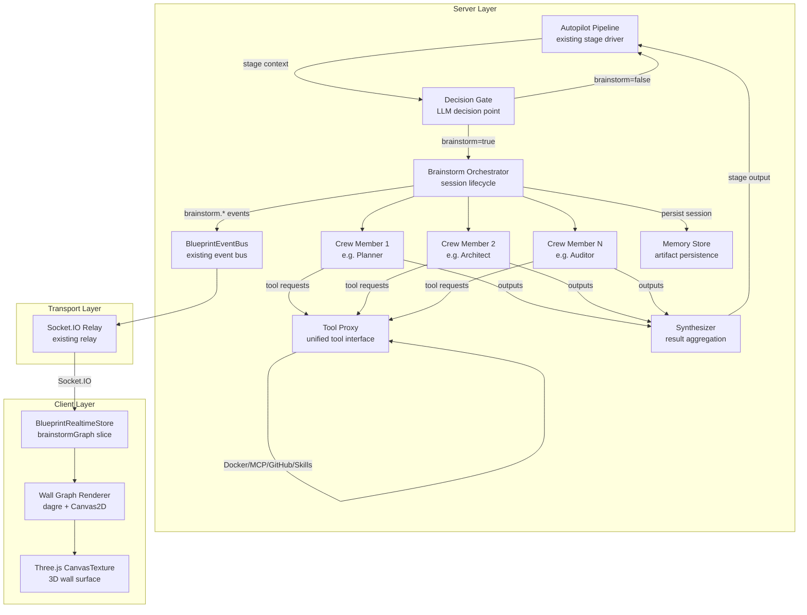
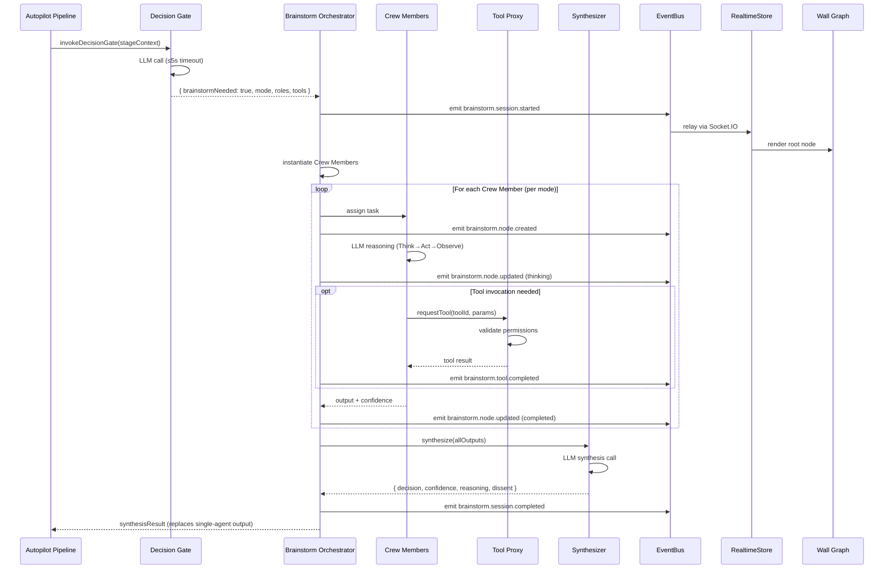
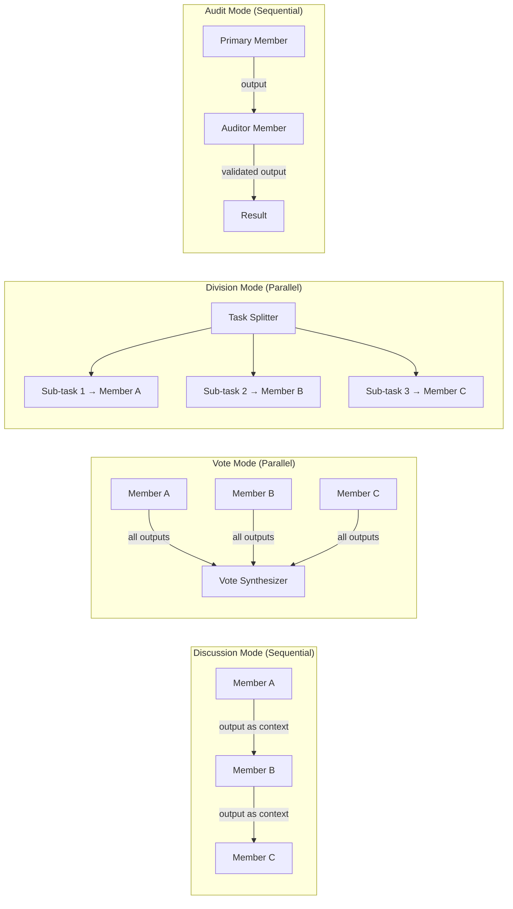
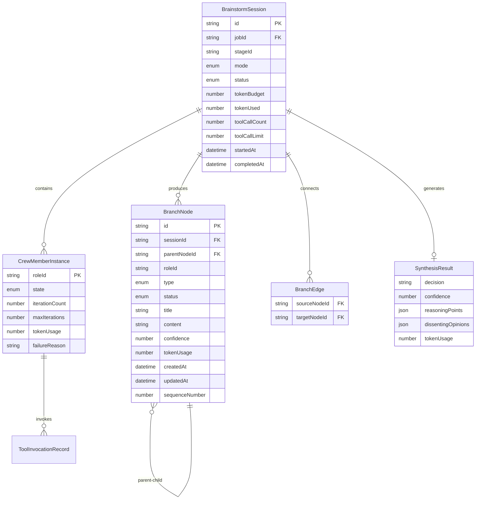
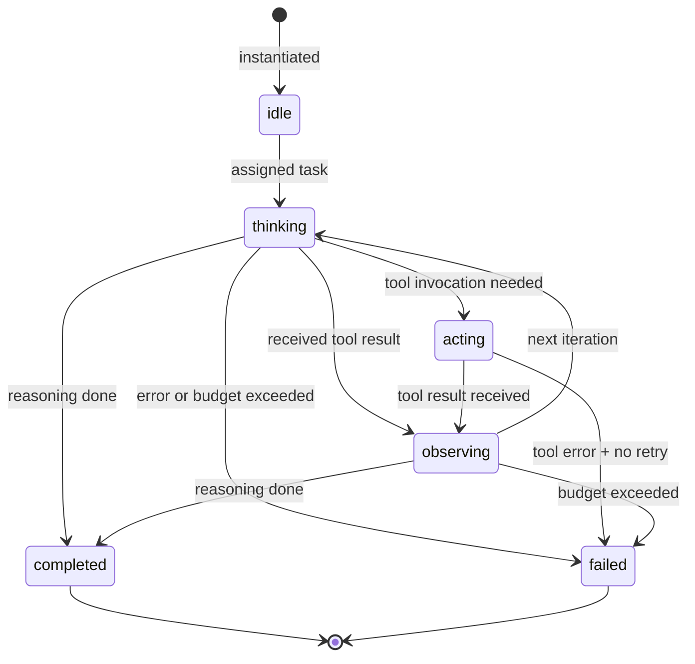
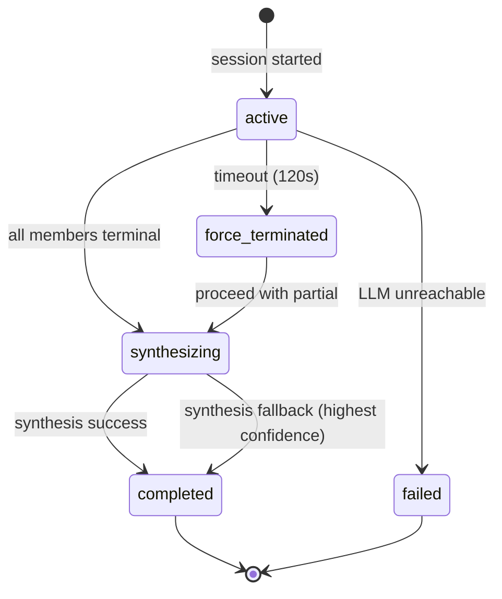
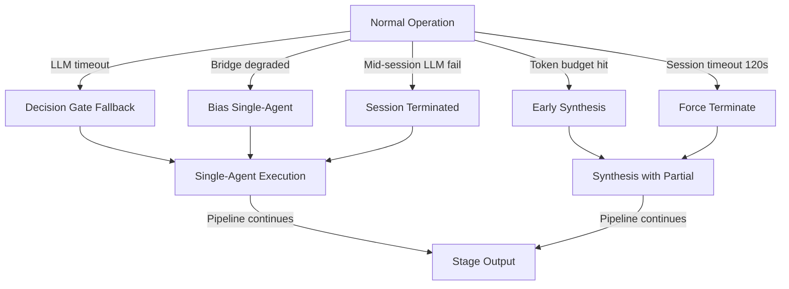

# Design Document: Autopilot Multi-Agent Brainstorm

## Overview

本设计将 WhyBuddy `/autopilot` 蓝图驾驶舱从单 Agent 线性执行扩展为多智能体协作决策系统。核心思路是在现有 `BlueprintEventBus` → `BlueprintRealtimeStore` → `BlueprintWallTexture` 数据管线之上，新增一层 **Brainstorm Orchestrator**，由 LLM 自主决策是否启动多分支推理、选择协作模式、分配角色、调用工具链，并将协作过程实时推送到 3D 墙面思维导图。

**设计原则：**
- **Compatibility-first**：不修改现有 `RoleAgentDelegator` / `BlueprintEventBus` / `BlueprintWallTexture` 的内部实现，通过组合和扩展接入
- **Event-driven**：所有协作状态变更通过 `brainstorm.*` 事件家族流经统一事件总线
- **Graceful degradation**：任何基础设施故障（LLM 不可达、Docker 不可用、超时）均回退到单 Agent 线性执行
- **Bounded resources**：Token 预算、工具调用限制、节点数上限、会话超时四重保护

## Architecture

### High-Level Architecture



### Sequence Flow: Brainstorm Session Lifecycle



### Collaboration Mode Flows



## Components and Interfaces

### 1. Decision Gate

The Decision Gate is a lightweight LLM call that determines whether multi-agent brainstorming is needed for a given pipeline stage.

```typescript
// shared/blueprint/brainstorm-contracts.ts

export type CollaborationMode = "discussion" | "vote" | "division" | "audit";

export type BrainstormRoleId =
  | "decider"
  | "planner"
  | "architect"
  | "executor"
  | "auditor"
  | "ui_previewer";

export type ToolCategory = "docker" | "mcp" | "github" | "skills";

export interface DecisionGateInput {
  jobId: string;
  stageId: string;
  stageContext: string;
  /** Current system degradation state from capability bridges */
  degradedBridges: string[];
  /** Previous stage outputs for context continuity */
  previousStageOutputs?: string[];
}

export interface DecisionGateOutput {
  brainstormNeeded: boolean;
  recommendedMode: CollaborationMode;
  requiredRoles: BrainstormRoleId[];
  requiredToolCategories: ToolCategory[];
  reasoning: string;
}

export interface DecisionGate {
  decide(input: DecisionGateInput): Promise<DecisionGateOutput>;
}
```

**Algorithm: Decision Gate Invocation**

1. Build stage context from current pipeline state
2. Check system degradation status from capability bridges
3. If any bridge is in fallback → bias `brainstormNeeded` toward `false`
4. Invoke LLM with structured output schema (JSON mode)
5. Parse and validate response against `DecisionGateOutput` schema
6. If LLM call fails or exceeds 5s timeout → return `{ brainstormNeeded: false }` + emit degradation event

### 2. Brainstorm Orchestrator

The central coordinator managing session lifecycle, crew member instantiation, mode execution, and synthesis.

```typescript
// server/routes/blueprint/brainstorm/orchestrator.ts

export type CrewMemberState =
  | "idle"
  | "thinking"
  | "acting"
  | "observing"
  | "completed"
  | "failed";

export interface CrewMemberInstance {
  roleId: BrainstormRoleId;
  state: CrewMemberState;
  iterationCount: number;
  maxIterations: number;
  tokenUsage: number;
  output?: CrewMemberOutput;
  failureReason?: string;
}

export interface CrewMemberOutput {
  content: string;
  confidence: number; // 0-1
  toolInvocations: ToolInvocationRecord[];
  tokenUsage: number;
}

export interface BrainstormSession {
  id: string;
  jobId: string;
  stageId: string;
  mode: CollaborationMode;
  crewMembers: Map<BrainstormRoleId, CrewMemberInstance>;
  branchNodes: BranchNode[];
  edges: BranchEdge[];
  status: "active" | "synthesizing" | "completed" | "failed" | "force_terminated";
  tokenBudget: number;
  tokenUsed: number;
  toolCallCount: number;
  toolCallLimit: number;
  startedAt: Date;
  completedAt?: Date;
  synthesisResult?: SynthesisResult;
}

export interface BrainstormOrchestrator {
  startSession(config: SessionConfig): Promise<BrainstormSession>;
  getSession(sessionId: string): BrainstormSession | undefined;
  getActiveSessions(): BrainstormSession[];
  getDiagnostics(): BrainstormDiagnostics;
}

export interface SessionConfig {
  jobId: string;
  stageId: string;
  mode: CollaborationMode;
  roles: BrainstormRoleId[];
  toolCategories: ToolCategory[];
  stageContext: string;
  tokenBudget?: number; // defaults to BRAINSTORM_MAX_TOKENS
  toolCallLimit?: number; // defaults to BRAINSTORM_MAX_TOOL_CALLS
}
```

**Algorithm: Session Execution by Mode**

```
FUNCTION executeSession(session, mode):
  SWITCH mode:
    CASE "discussion":
      orderedMembers = session.crewMembers in activation order
      context = session.stageContext
      FOR EACH member IN orderedMembers:
        IF session.tokenUsed >= session.tokenBudget: BREAK
        output = await executeMember(member, context)
        context = context + output.content
      END FOR

    CASE "vote":
      prompt = session.stageContext
      results = await Promise.allSettled(
        session.crewMembers.map(m => executeMember(m, prompt))
      )
      // All members get identical prompt

    CASE "division":
      subTasks = await splitTask(session.stageContext, session.crewMembers.size)
      assignments = zip(session.crewMembers, subTasks)
      results = await Promise.allSettled(
        assignments.map(([member, task]) => executeMember(member, task))
      )

    CASE "audit":
      primaryMember = session.crewMembers.find(m => m.roleId !== "auditor")
      auditorMember = session.crewMembers.find(m => m.roleId === "auditor")
      primaryOutput = await executeMember(primaryMember, session.stageContext)
      auditOutput = await executeMember(auditorMember, primaryOutput.content)
  END SWITCH

  RETURN proceedToSynthesis(session)
END FUNCTION
```

### 3. Branch Node Model

```typescript
// shared/blueprint/brainstorm-contracts.ts

export type BranchNodeType =
  | "decision"
  | "thinking"
  | "action"
  | "observation"
  | "synthesis"
  | "error";

export type BranchNodeStatus =
  | "pending"
  | "active"
  | "completed"
  | "failed";

export interface BranchNode {
  id: string;
  sessionId: string;
  parentNodeId: string | null; // null for root node
  roleId: BrainstormRoleId;
  type: BranchNodeType;
  status: BranchNodeStatus;
  title: string;
  content?: string;
  confidence?: number;
  tokenUsage?: number;
  createdAt: string; // ISO timestamp
  updatedAt: string;
  sequenceNumber: number; // for replay ordering
}

export interface BranchEdge {
  sourceNodeId: string;
  targetNodeId: string;
}
```

### 4. Tool Proxy

```typescript
// server/routes/blueprint/brainstorm/tool-proxy.ts

export interface ToolInvocationRequest {
  sessionId: string;
  roleId: BrainstormRoleId;
  toolCategory: ToolCategory;
  toolId: string;
  params: Record<string, unknown>;
}

export interface ToolInvocationResult {
  success: boolean;
  output?: unknown;
  error?: string;
  durationMs: number;
}

export interface ToolInvocationRecord {
  requestId: string;
  toolCategory: ToolCategory;
  toolId: string;
  success: boolean;
  durationMs: number;
}

export interface ToolPermissionScope {
  allowedCategories: ToolCategory[];
  allowedToolIds?: string[]; // if empty, all tools in allowed categories
  maxCallsPerMember: number;
}

export interface BrainstormToolProxy {
  invoke(request: ToolInvocationRequest): Promise<ToolInvocationResult>;
  getPermissionScope(roleId: BrainstormRoleId): ToolPermissionScope;
  getSessionToolCount(sessionId: string): number;
  isWithinLimit(sessionId: string): boolean;
}
```

**Algorithm: Tool Invocation**

```
FUNCTION invoke(request):
  // 1. Check session tool limit
  IF getSessionToolCount(request.sessionId) >= session.toolCallLimit:
    RETURN { success: false, error: "Tool call limit exceeded" }

  // 2. Validate permissions
  scope = getPermissionScope(request.roleId)
  IF request.toolCategory NOT IN scope.allowedCategories:
    RETURN { success: false, error: "Permission denied" }

  // 3. Route to appropriate bridge
  SWITCH request.toolCategory:
    CASE "docker":
      IF dockerNotReachable:
        emit brainstorm.degraded event
        RETURN simulatedResponse(request)
      result = await ctx.dockerCapabilityBridge(request)
    CASE "mcp":
      result = await ctx.mcpToolAdapter.invoke(request)
    CASE "github":
      result = await ctx.mcpGithubCapabilityBridge(request)
    CASE "skills":
      result = await ctx.skillRegistry.invoke(request)

  // 4. Emit event
  IF result.success:
    emit brainstorm.tool.completed
  ELSE:
    emit brainstorm.tool.failed

  RETURN result
END FUNCTION
```

### 5. Synthesis Engine

```typescript
// server/routes/blueprint/brainstorm/synthesizer.ts

export interface SynthesisInput {
  sessionId: string;
  mode: CollaborationMode;
  crewOutputs: Array<{
    roleId: BrainstormRoleId;
    content: string;
    confidence: number;
  }>;
  stageContext: string;
}

export interface SynthesisResult {
  decision: string;
  confidence: number; // 0-1
  reasoningPoints: Array<{
    roleId: BrainstormRoleId;
    point: string;
  }>;
  dissentingOpinions: Array<{
    roleId: BrainstormRoleId;
    opinion: string;
  }>;
  tokenUsage: number;
}

export interface BrainstormSynthesizer {
  synthesize(input: SynthesisInput): Promise<SynthesisResult>;
}
```

**Algorithm: Synthesis with Fallback**

```
FUNCTION synthesize(input):
  TRY:
    result = await llm.callJson(synthesisPrompt, input)
    validate result against SynthesisResult schema
    RETURN result
  CATCH error:
    // Fallback: pick highest-confidence individual output
    bestOutput = input.crewOutputs.sort(by confidence DESC)[0]
    emit brainstorm.degraded event
    RETURN {
      decision: bestOutput.content,
      confidence: bestOutput.confidence,
      reasoningPoints: [{ roleId: bestOutput.roleId, point: bestOutput.content }],
      dissentingOpinions: [],
      tokenUsage: 0
    }
END FUNCTION
```

### 6. Event Integration

New events added to `shared/blueprint/events.ts` under the `brainstorm` family:

```typescript
// New event family addition
export type BlueprintGenerationEventFamily =
  | /* existing 12 families */
  | "brainstorm"; // 13th family

// New event types
export type BlueprintGenerationEventType =
  | /* existing types */
  // Brainstorm session lifecycle
  | "brainstorm.session.started"
  | "brainstorm.session.completed"
  | "brainstorm.session.failed"
  | "brainstorm.mode.selected"
  // Brainstorm node lifecycle
  | "brainstorm.node.created"
  | "brainstorm.node.updated"
  // Brainstorm tool events
  | "brainstorm.tool.completed"
  | "brainstorm.tool.failed"
  // Brainstorm degradation
  | "brainstorm.degraded";
```

**Event Payload Schemas:**

```typescript
export interface BrainstormNodeCreatedPayload {
  sessionId: string;
  nodeId: string;
  parentNodeId: string | null;
  roleId: BrainstormRoleId;
  nodeType: BranchNodeType;
  status: BranchNodeStatus;
  title: string;
  sequenceNumber: number;
}

export interface BrainstormNodeUpdatedPayload {
  sessionId: string;
  nodeId: string;
  status: BranchNodeStatus;
  content?: string;
  confidence?: number;
  tokenUsage?: number;
}

export interface BrainstormSessionCompletedPayload {
  sessionId: string;
  synthesisDecision: string;
  synthesisConfidence: number;
  totalTokenUsage: number;
  totalDurationMs: number;
  crewMemberCount: number;
  nodeCount: number;
}

export interface BrainstormDegradedPayload {
  sessionId: string;
  reason: string;
  affectedComponent: string;
  fallbackAction: string;
}
```

### 7. Frontend Store Slice

```typescript
// Extension to client/src/lib/blueprint-realtime-store.ts

export interface BrainstormGraphSlice {
  sessionId: string | null;
  sessionStatus: "idle" | "active" | "synthesizing" | "completed" | "failed";
  nodes: BranchNode[];
  edges: BranchEdge[];
  sessionMetadata: {
    mode: CollaborationMode | null;
    roles: BrainstormRoleId[];
    startedAt: string | null;
    completedAt: string | null;
    totalTokenUsage: number;
  };
}

// Selectors
export interface BrainstormGraphSelectors {
  selectAllNodes(): BranchNode[];
  selectNodesByRole(roleId: BrainstormRoleId): BranchNode[];
  selectNodesByStatus(status: BranchNodeStatus): BranchNode[];
  selectSessionMetadata(): BrainstormGraphSlice["sessionMetadata"];
  selectIsActive(): boolean;
}
```

**Store Dispatch Logic:**

```
ON brainstorm.session.started:
  SET sessionId, sessionStatus = "active", reset nodes/edges

ON brainstorm.node.created:
  IF nodes.length >= 500: DROP oldest node (FIFO)
  APPEND node to nodes[]
  IF parentNodeId != null: APPEND edge { source: parentNodeId, target: nodeId }

ON brainstorm.node.updated:
  FIND node by nodeId
  UPDATE node.status, node.content, node.confidence, node.tokenUsage

ON brainstorm.session.completed:
  SET sessionStatus = "completed"
  SET sessionMetadata.completedAt, totalTokenUsage
  FREEZE session (reject further updates)
```

### 8. Wall Graph Renderer

The `BrainstormWallGraph` component follows the same pattern as `BlueprintWallTexture`: dagre layout → Canvas2D drawing → Three.js CanvasTexture.

```typescript
// client/src/components/three/scene-fusion/BrainstormWallGraph.tsx

export interface BrainstormWallGraphProps {
  nodes: BranchNode[];
  edges: BranchEdge[];
  sessionStatus: BrainstormGraphSlice["sessionStatus"];
}

// Node type → color mapping
const BRAINSTORM_NODE_COLORS: Record<BranchNodeType, string> = {
  decision: "#0d9488",   // teal
  thinking: "#6366f1",   // indigo
  action: "#f59e0b",     // amber
  observation: "#ec4899", // pink
  synthesis: "#10b981",  // emerald
  error: "#ef4444",      // red
};

// Layout constants
const BRAINSTORM_NODE_W = 180;
const BRAINSTORM_NODE_H = 56;
const BRAINSTORM_PADDING = 30;
```

**Algorithm: Incremental Layout + Render**

```
FUNCTION onNodesChanged(nodes, edges):
  // 1. Compute dagre layout (LR direction)
  graph = new dagre.graphlib.Graph()
  graph.setGraph({ rankdir: "LR", nodesep: 50, ranksep: 140 })
  FOR EACH node IN nodes:
    graph.setNode(node.id, { width: NODE_W, height: NODE_H })
  FOR EACH edge IN edges:
    graph.setEdge(edge.sourceNodeId, edge.targetNodeId)
  dagre.layout(graph)

  // 2. Compute adaptive scale (same logic as BlueprintWallTexture)
  scale = computeAdaptiveScale(graph, wallWidth, wallHeight)

  // 3. Draw to Canvas2D
  ctx.clearRect(0, 0, W, H)
  drawBackground(ctx)
  drawEdges(ctx, edges, scale)  // bezier dashed lines
  drawNodes(ctx, nodes, scale)  // card shapes with colors

  // 4. Mark new nodes for fade-in animation
  FOR EACH node WHERE node.createdAt > lastRenderTime:
    node.opacity = 0 → animate to 1 over 300ms

  // 5. Update Three.js CanvasTexture
  texture.needsUpdate = true
END FUNCTION
```

### 9. Memory & Replay

```typescript
// server/routes/blueprint/brainstorm/memory-store.ts

export interface BrainstormSessionArtifact {
  sessionId: string;
  jobId: string;
  stageId: string;
  mode: CollaborationMode;
  roles: BrainstormRoleId[];
  startedAt: string;
  completedAt: string;
  nodes: BranchNode[];
  edges: BranchEdge[];
  synthesisResult: SynthesisResult | null;
  tokenUsageByRole: Record<BrainstormRoleId, number>;
  totalTokenUsage: number;
  totalDurationMs: number;
}

export interface BrainstormMemoryStore {
  persist(artifact: BrainstormSessionArtifact): void;
  retrieve(jobId: string, sessionId: string): BrainstormSessionArtifact | null;
  listByJob(jobId: string): BrainstormSessionArtifact[];
}
```

**Replay API:**

```
GET /api/blueprint/jobs/:id/brainstorm/:sessionId

Response: {
  session: BrainstormSessionArtifact,
  replayTimeline: Array<{
    sequenceNumber: number,
    timestamp: string,
    eventType: "node.created" | "node.updated",
    payload: BranchNode
  }>
}
```

### 10. Diagnostics Extension

```typescript
// Extension to GET /api/blueprint/diagnostics

export interface BrainstormDiagnostics {
  enabled: boolean;
  activeSessionsCount: number;
  totalSessionsCompleted: number;
  degradationCount: number;
  averageSessionDurationMs: number;
  tokenBudget: number;
  toolCallLimit: number;
}
```

### 11. Role Registry

```typescript
// server/routes/blueprint/brainstorm/role-registry.ts

export interface BrainstormRoleDefinition {
  id: BrainstormRoleId;
  name: string;
  nameZh: string;
  systemPrompt: string;
  maxIterations: number;
  toolPermissions: ToolPermissionScope;
}

export const BRAINSTORM_ROLE_REGISTRY: Record<BrainstormRoleId, BrainstormRoleDefinition> = {
  decider: {
    id: "decider",
    name: "Decider",
    nameZh: "决策者",
    systemPrompt: "You are a senior decision maker...",
    maxIterations: 3,
    toolPermissions: { allowedCategories: ["mcp", "github"], maxCallsPerMember: 5 },
  },
  planner: {
    id: "planner",
    name: "Planner",
    nameZh: "规划师",
    systemPrompt: "You are a strategic planner...",
    maxIterations: 5,
    toolPermissions: { allowedCategories: ["mcp", "github", "skills"], maxCallsPerMember: 8 },
  },
  architect: {
    id: "architect",
    name: "Architect",
    nameZh: "架构师",
    systemPrompt: "You are a system architect...",
    maxIterations: 5,
    toolPermissions: { allowedCategories: ["docker", "mcp", "github", "skills"], maxCallsPerMember: 10 },
  },
  executor: {
    id: "executor",
    name: "Executor",
    nameZh: "执行者",
    systemPrompt: "You are a hands-on executor...",
    maxIterations: 8,
    toolPermissions: { allowedCategories: ["docker", "mcp", "github", "skills"], maxCallsPerMember: 15 },
  },
  auditor: {
    id: "auditor",
    name: "Auditor",
    nameZh: "审计员",
    systemPrompt: "You are a quality auditor...",
    maxIterations: 3,
    toolPermissions: { allowedCategories: ["mcp", "github"], maxCallsPerMember: 5 },
  },
  ui_previewer: {
    id: "ui_previewer",
    name: "UI Previewer",
    nameZh: "UI 预览师",
    systemPrompt: "You are a UI/UX specialist...",
    maxIterations: 4,
    toolPermissions: { allowedCategories: ["docker", "mcp", "skills"], maxCallsPerMember: 8 },
  },
};
```


## Data Models

### Core Domain Entities



### State Machine: Crew Member Lifecycle



### State Machine: Brainstorm Session Lifecycle



### Environment Variables

| Variable | Default | Description |
|----------|---------|-------------|
| `BRAINSTORM_MAX_TOKENS` | `50000` | Maximum total token budget per brainstorm session |
| `BRAINSTORM_MAX_TOOL_CALLS` | `20` | Maximum tool invocations per session |
| `BRAINSTORM_SESSION_TIMEOUT_MS` | `120000` | Force-termination timeout (120 seconds) |
| `BRAINSTORM_DECISION_GATE_TIMEOUT_MS` | `5000` | Decision gate LLM call timeout |
| `BLUEPRINT_BRAINSTORM_ENABLED` | `"false"` | Master enable switch for brainstorm orchestrator |

### Integration Points with Existing Systems

| Existing System | Integration Method | Notes |
|----------------|-------------------|-------|
| `BlueprintEventBus` | New `brainstorm` event family (13th) | Events flow through existing `emit` → `jobStore.save` → `fanOut` pipeline |
| `BlueprintSocketRelay` | Add `"brainstorm"` to `DEFAULT_RELAY_FAMILIES` | Socket.IO relay picks up brainstorm events automatically |
| `BlueprintRealtimeStore` | New `brainstormGraph` slice | Parallel to existing `agentReasoning` / `logEntries` slices |
| `BlueprintWallTexture` | Sibling component `BrainstormWallGraph` | Same dagre + Canvas2D + CanvasTexture pattern |
| `RoleAgentDelegator` | Crew members delegate to existing delegator | Reuses Real/Lite/Fallback three-tier degradation |
| `CapabilityBridge` system | Tool Proxy routes through existing bridges | Docker/MCP/GitHub/Skills bridges unchanged |
| `BlueprintServiceContext` | New `brainstormOrchestrator` field on ctx | Lazy-assembled like `roleAgentDelegator` |
| Diagnostics endpoint | New `brainstormOrchestrator` entry | Same pattern as `roleContainerLoader` / `agentReasoningBridge` |
| Artifact memory store | Brainstorm sessions stored as job artifacts | Same retention policy as other blueprint artifacts |

## Correctness Properties

*A property is a characteristic or behavior that should hold true across all valid executions of a system—essentially, a formal statement about what the system should do. Properties serve as the bridge between human-readable specifications and machine-verifiable correctness guarantees.*

### Property 1: Decision Gate schema completeness

*For any* valid LLM response that successfully parses as a Decision Gate output, the result SHALL contain all required fields: `brainstormNeeded` (boolean), `recommendedMode` (valid CollaborationMode), `requiredRoles` (non-empty array of valid BrainstormRoleId), and `requiredToolCategories` (array of valid ToolCategory).

**Validates: Requirements 1.2**

### Property 2: Decision Gate routing correctness

*For any* Decision Gate output, if `brainstormNeeded` is `false` the orchestrator SHALL route to single-agent execution, and if `brainstormNeeded` is `true` the orchestrator SHALL spawn a BrainstormSession with matching mode, roles, and tool categories.

**Validates: Requirements 1.3, 1.4**

### Property 3: Decision Gate failure fallback

*For any* error thrown during Decision Gate LLM invocation (timeout, network error, parse error, or any exception), the orchestrator SHALL fall back to single-agent execution and emit a `brainstorm.degraded` event.

**Validates: Requirements 1.6, 10.4**

### Property 4: Crew Member instantiation matches decision

*For any* set of role IDs specified in the Decision Gate output, the Brainstorm Session SHALL instantiate exactly those roles as Crew Members—no more, no fewer.

**Validates: Requirements 2.2**

### Property 5: Crew Member state invariant

*For any* Crew Member at any point during a Brainstorm Session, its state SHALL be exactly one of: `idle`, `thinking`, `acting`, `observing`, `completed`, or `failed`.

**Validates: Requirements 2.3**

### Property 6: Terminal state triggers synthesis

*For any* Brainstorm Session where all active Crew Members have reached a terminal state (`completed` or `failed`), the orchestrator SHALL proceed to the synthesis phase.

**Validates: Requirements 2.6**

### Property 7: Discussion mode sequential context chaining

*For any* Brainstorm Session in `discussion` mode with N crew members, member[i] SHALL receive the concatenated outputs of members[0..i-1] as context, ensuring sequential execution order.

**Validates: Requirements 3.1**

### Property 8: Vote mode identical prompt invariant

*For any* Brainstorm Session in `vote` mode, all crew members SHALL receive an identical prompt (the stage context), regardless of the number of members or their roles.

**Validates: Requirements 3.2**

### Property 9: Token budget enforcement

*For any* Brainstorm Session, the total token usage SHALL never exceed `BRAINSTORM_MAX_TOKENS`. When the budget is reached, no new crew member iterations SHALL be spawned.

**Validates: Requirements 3.6, 10.2**

### Property 10: Tool permission validation

*For any* tool invocation request from a Crew Member, the Tool Proxy SHALL reject the request if the tool category is not in the member's `allowedCategories` permission scope.

**Validates: Requirements 4.2**

### Property 11: Tool call limit enforcement

*For any* Brainstorm Session, the total number of tool invocations SHALL never exceed `BRAINSTORM_MAX_TOOL_CALLS`. Requests beyond the limit SHALL be rejected.

**Validates: Requirements 4.5**

### Property 12: Event schema completeness for node creation

*For any* Branch Node created during collaboration, the emitted `brainstorm.node.created` event SHALL contain all required fields: nodeId, parentNodeId, roleId, nodeType, and status.

**Validates: Requirements 5.3**

### Property 13: Event causal ordering

*For any* sequence of events emitted within a single Brainstorm Session, parent node events SHALL precede child node events (causal ordering guarantee).

**Validates: Requirements 5.6**

### Property 14: Store node addition invariant

*For any* `brainstorm.node.created` event dispatched to the store, the `brainstormGraph.nodes` array SHALL grow by exactly one, and if `parentNodeId` is non-null, the `edges` array SHALL grow by exactly one.

**Validates: Requirements 6.2**

### Property 15: Store bounded queue invariant

*For any* sequence of node additions to the brainstorm store, the `nodes` array SHALL never exceed 500 elements per active session.

**Validates: Requirements 6.4**

### Property 16: Session finalization freezes updates

*For any* session marked as completed via `brainstorm.session.completed`, subsequent `brainstorm.node.created` and `brainstorm.node.updated` events for that session SHALL be rejected (no state mutation).

**Validates: Requirements 6.5**

### Property 17: Node type color mapping uniqueness

*For any* two distinct `BranchNodeType` values, they SHALL map to distinct colors in the Wall Graph renderer.

**Validates: Requirements 7.3**

### Property 18: Title truncation invariant

*For any* Branch Node title, the displayed title in the Wall Graph SHALL be at most 22 characters. Titles longer than 22 characters SHALL be truncated with an ellipsis.

**Validates: Requirements 7.5**

### Property 19: Adaptive scaling fits wall bounds

*For any* graph with N nodes (1 ≤ N ≤ 500), the computed dagre layout scaled by the adaptive scale factor SHALL fit entirely within the wall bounds (W × H).

**Validates: Requirements 7.7**

### Property 20: Synthesis receives all crew outputs

*For any* Brainstorm Session reaching the synthesis phase, the synthesis LLM call SHALL receive the outputs of ALL crew members that reached `completed` state as context.

**Validates: Requirements 8.1**

### Property 21: Synthesis output schema completeness

*For any* valid synthesis result, it SHALL contain: a non-empty `decision` string, a `confidence` score in range [0, 1], at least one `reasoningPoint`, and a `dissentingOpinions` array (possibly empty).

**Validates: Requirements 8.2**

### Property 22: Session persistence round-trip

*For any* completed Brainstorm Session, persisting it to the memory store and then retrieving it by `jobId` + `sessionId` SHALL yield an equivalent session artifact (all nodes, edges, synthesis, and metadata preserved).

**Validates: Requirements 8.4, 9.1, 9.2**

### Property 23: Synthesis fallback selects highest confidence

*For any* set of crew member outputs with varying confidence scores, when the synthesis LLM call fails, the orchestrator SHALL select the output with the highest confidence score as the fallback result.

**Validates: Requirements 8.5**

### Property 24: Timeout force-termination

*For any* Brainstorm Session that has been running for more than 120 seconds without reaching synthesis, the orchestrator SHALL force-terminate remaining active Crew Members and proceed to synthesis with partial results.

**Validates: Requirements 10.5**

### Property 25: Degradation event emission

*For any* fallback path activation (LLM failure, Docker unreachable, timeout, budget exceeded), the orchestrator SHALL emit a `brainstorm.degraded` event containing the degradation reason and affected component.

**Validates: Requirements 10.1, 10.4**

### Property 26: Degraded mode biases toward single-agent

*For any* system state where one or more capability bridges report fallback mode, the Decision Gate SHALL output `brainstormNeeded: false` with higher probability than in non-degraded state.

**Validates: Requirements 10.3**

## Error Handling

### Error Categories and Recovery Strategies

| Error Category | Trigger | Recovery | Event |
|---------------|---------|----------|-------|
| Decision Gate timeout | LLM call > 5s | Fall back to single-agent | `brainstorm.degraded` |
| Decision Gate parse error | Invalid LLM JSON | Fall back to single-agent | `brainstorm.degraded` |
| LLM unreachable mid-session | Network/provider error | Terminate session, single-agent fallback | `brainstorm.degraded` |
| Token budget exceeded | `tokenUsed >= tokenBudget` | Stop iterations, proceed to synthesis | `brainstorm.degraded` |
| Tool call limit exceeded | `toolCallCount >= toolCallLimit` | Reject further tool calls | (inline rejection) |
| Session timeout | Running > 120s | Force-terminate, synthesize partial | `brainstorm.degraded` |
| Crew Member failure | Error or iteration budget | Mark failed, continue session | `brainstorm.node.updated` |
| Synthesis LLM failure | Synthesis call error | Use highest-confidence output | `brainstorm.degraded` |
| Docker unreachable | Docker bridge fallback | Simulated tool responses | `brainstorm.degraded` |
| All Crew Members failed | Every member in `failed` state | Synthesize with empty outputs, degrade | `brainstorm.degraded` |

### Degradation Cascade



### Error Propagation Rules

1. **No error blocks the pipeline**: Every error path eventually produces a stage output (either from synthesis or single-agent fallback)
2. **Degradation events are always emitted**: Every fallback path emits `brainstorm.degraded` for observability
3. **Crew Member failures are isolated**: One member's failure does not terminate the session
4. **Resource limits are hard caps**: Token budget and tool call limits are never exceeded, even partially

## Testing Strategy

### Property-Based Testing (PBT)

This feature is well-suited for property-based testing because:
- The orchestrator has clear input/output behavior with universal properties
- State machines have invariants that should hold across all valid input sequences
- The store has bounded-queue and schema properties that hold for all inputs
- Permission validation and budget enforcement are pure logic testable across all inputs

**PBT Library**: `fast-check` (already in project dependencies)
**Minimum iterations**: 100 per property test
**Tag format**: `Feature: autopilot-multi-agent-brainstorm, Property {N}: {title}`

### Test Categories

| Category | Scope | Tool | Count (est.) |
|----------|-------|------|------|
| Property tests | Orchestrator logic, store invariants, schema validation | fast-check | 26 |
| Unit tests | Individual component behavior, edge cases | Vitest | ~40 |
| Integration tests | Event bus relay, Socket.IO, API endpoints | Vitest + supertest | ~15 |
| Smoke tests | Diagnostics endpoint, role registry, env flags | Vitest | ~5 |

### Property Test Implementation Plan

Each correctness property (1-26) maps to a single `fast-check` property test:

```typescript
// Example: Property 9 - Token budget enforcement
import { fc } from "fast-check";

it("Property 9: Token budget enforcement", () => {
  fc.assert(
    fc.property(
      fc.integer({ min: 1000, max: 100000 }), // tokenBudget
      fc.array(fc.integer({ min: 100, max: 5000 }), { minLength: 1, maxLength: 20 }), // member token usages
      (budget, usages) => {
        const session = createSession({ tokenBudget: budget });
        let totalUsed = 0;
        for (const usage of usages) {
          totalUsed += usage;
          const canContinue = session.checkBudget(totalUsed);
          if (totalUsed > budget) {
            expect(canContinue).toBe(false);
          }
        }
        expect(session.tokenUsed).toBeLessThanOrEqual(budget);
      }
    ),
    { numRuns: 100 }
  );
});
```

### Unit Test Focus Areas

- Decision Gate prompt construction and response parsing
- Collaboration mode execution logic (discussion/vote/division/audit)
- Tool Proxy permission validation
- Store event dispatch and state transitions
- Wall Graph layout computation and color mapping
- Synthesis fallback selection logic
- Session timeout and force-termination
- Diagnostics aggregation

### Integration Test Focus Areas

- End-to-end event flow: Orchestrator → EventBus → Socket.IO → Store
- Replay API endpoint response format
- Diagnostics endpoint brainstormOrchestrator entry
- Capability bridge delegation through Tool Proxy
- Session persistence and retrieval round-trip
