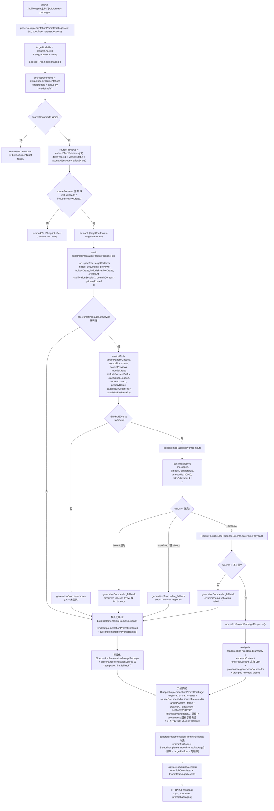
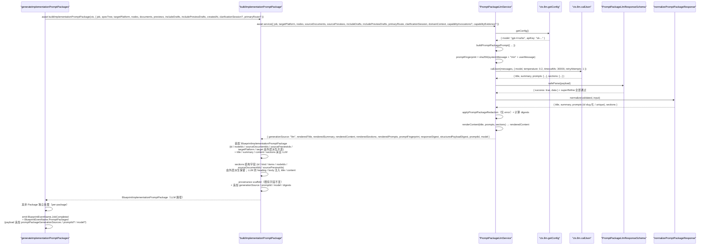
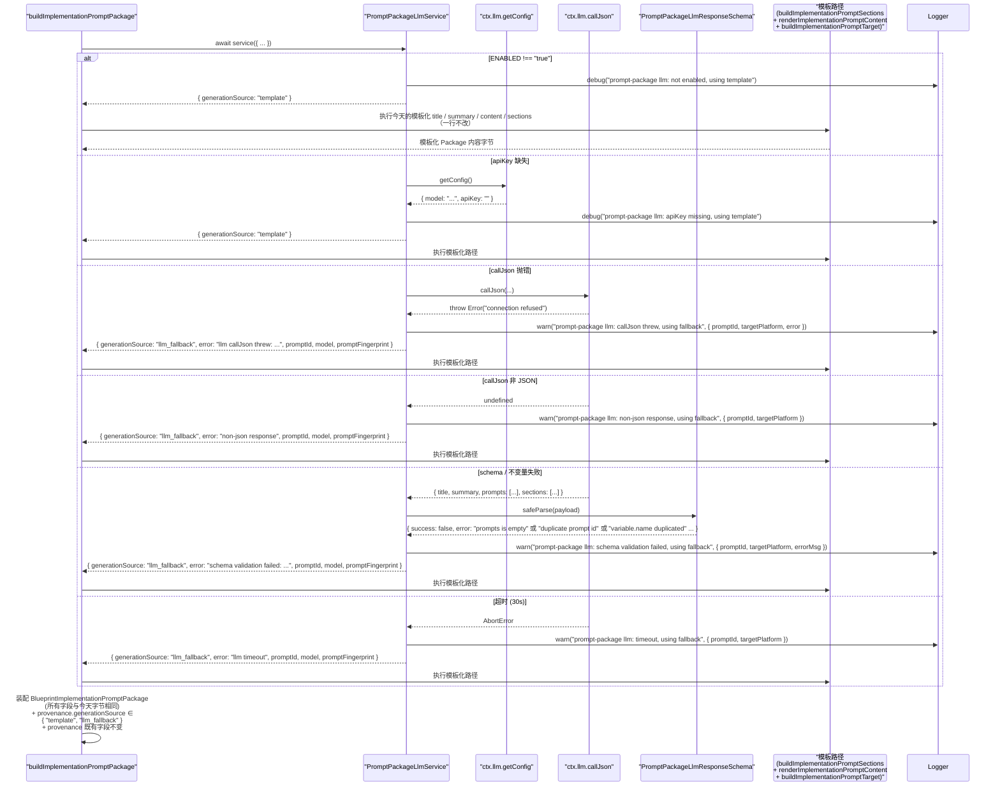

# 设计文档：Autopilot Prompt Package LLM 驱动生成

## 1. 设计概述

本 spec 把 `/autopilot` 的 **Prompt Package 生成阶段**从当前 `server/routes/blueprint.ts` 的 `generateImplementationPromptPackages()`（~第 8846 行）+ `buildImplementationPromptPackage()`（~第 10526 行）+ `buildImplementationPromptSections()` + `renderImplementationPromptContent()` + `buildImplementationPromptTarget()` 联合产出的硬编码 Prompt Package，升级为由 `BlueprintServiceContext.llm.callJson` 按 `(nodeIds, targetPlatform, includeDrafts 语义下的 sourceDocuments 与 sourcePreviews 快照)` **逐份**发起 LLM 推理、通过严格 zod schema 校验后渲染为结构化 `BlueprintImplementationPromptPackage` 的真实产物；在 LLM 不可用 / apiKey 缺失 / callJson 抛错 / 非 JSON / schema 不过 / 预演级不变量违反（`prompts` 为空 / `sections` 为空 / `prompts[*].id` 重复 / `variables[*].name` 重复 / `sections[*].heading` 重复 / 字符串越界 / trim 后全空格 / `required` 非 boolean 等）/ 超时任一情况下，**完全复用**既有 `buildImplementationPromptPackage()` / `buildImplementationPromptSections()` / `renderImplementationPromptContent()` / `buildImplementationPromptTarget()` / `resolvePromptDocumentSourceStatus()` / `resolvePromptPreviewSourceStatus()` 作为确定性 fallback 路径。

本 spec 是 `autopilot-routeset-llm-generation`（RouteSet LLM）、`autopilot-spec-tree-llm`（SPEC Tree LLM）、`autopilot-spec-documents-llm`（SPEC Documents LLM）与 `autopilot-effect-preview-llm`（Effect Preview LLM，直接上游 spec）之后的**下一阶段**，负责把 SPEC Documents + Effect Preview → Prompt Package 这一步从「模板派生」真正升级为「LLM 派生」。整体实现模式完全复用前四条姊妹 spec 已经验证过的同一条主线：`ctx.llm.callJson` → strict zod schema（含 `.superRefine()` 跨字段不变量）→ 成功路径返回 LLM 渲染 Prompt Package / 失败路径回退到模板 → 在 `BlueprintImplementationPromptPackage.provenance` 追加 `generationSource` / `promptId` / `model` / `responseDigest` / `structuredPayloadDigest` / `promptFingerprint` / `error` 可选字段。

### 1.1 与姊妹 spec 的本质差异

| 维度 | routeset LLM spec | spec-tree LLM spec | spec-documents LLM spec | effect-preview LLM spec（直接上游） | **prompt-package LLM（本 spec）** |
| --- | --- | --- | --- | --- | --- |
| 产出 JSON 内容 | 单次调用产出 `routes: Array<{...}>`（平铺） | 单次调用产出整棵 `nodes: Array<{id, parentId?, ...}>`（嵌套树） | 每份文档一次独立调用；产出 `title / summary / sections` | 每份预演一次独立调用；产出 `summary / architectureNotes / prototypeNotes / progressPlan / runtimeProjection` | **每份 Package 一次独立调用**；产出 `title / summary / prompts: Array<{id, title, systemPrompt, userPrompt, variables, examples?}> / sections: Array<{heading, body}>` |
| 调用单位 | 整个 RouteSet 一次 | 整棵 SPEC Tree 一次 | 每个 `(nodeId, type)` 对一次 | 每个 `(nodeId, sourceDocuments 快照)` 对一次 | **每个 `(nodeIds, targetPlatform, includeDrafts, includePreviewDrafts)` 组合一次**；一次 `generateImplementationPromptPackages()` 请求若涉及 M 个 `targetPlatforms` 则触发 M 次独立 LLM 调用，每份 Package 各自独立走 LLM 路径或 fallback 路径 |
| 输入依赖 | `intake + clarificationSession + githubUrls` | 多 + `routeSet + primaryRoute` | 多 + `specTreeNode + primaryRoute + 可选 upstreamEvidence` | 多 + `specTreeNode + sourceDocuments + selectedRoute? + 可选 capability*` | **多 + `specTreeNodes: BlueprintSpecTreeNode[]`（targetNodeIds 命中的节点集合）+ `sourceDocuments: BlueprintSpecDocument[]`（按 `includeDrafts` 过滤）+ `sourcePreviews: BlueprintEffectPreview[]`（按 `includePreviewDrafts` 过滤）+ `targetPlatform` + `selectedRoute?` + 可选 `capabilityInvocations / capabilityEvidence`** |
| 下游消费 | SPEC Tree、Sandbox Derivation、Agent Crew | SPEC Documents、Effect Preview、Prompt Package、Engineering Handoff | Effect Preview / Prompt Package / Engineering Handoff（作为 `sourceDocumentId`） | Prompt Package（`extractEffectPreviews(job)` 被 `generateImplementationPromptPackages()` 消费）、Engineering Landing Plan、Artifact Replay、任务墙面 HUD | **Engineering Landing Plan（`generateEngineeringLandingPlans()` 通过 `selectEngineeringLandingPromptPackages()` 与 `extractImplementationPromptPackages(job)` 消费 Prompt Package 并推导 steps / handoffs / verification）、Artifact Replay、任务墙面 HUD、外部落地（Codex / Claude / Cursor / Kiro / Trae / Windsurf 等平台）** |
| Schema 难点 | `kind` 枚举、primary 唯一 | 节点 `id` 全树唯一、`parentId` 可解析、深度 ≤ 4 | `sections.id` 文档内唯一、长度 2..20、`body` 1..8000 | `hudState.title` 必填、`logTimeline` 非空 + level 枚举、`progressPlan` 非空 | **`prompts.length` 1..12、每个 prompt `id` 在 Package 内唯一（不区分大小写 / trim）、每个 prompt `variables[*].name` 在该 prompt 内唯一、`sections[*].heading` 在 Package 内唯一、`required` 必须是 boolean（不接受字符串 `"true"` / `"false"`）、`systemPrompt` / `userPrompt` / `body` ≤ 4000 / 4000 / 5000** |
| Fallback 数据源 | `buildTemplatedRoutes()` | `buildSpecTreeFromRouteSet()` + `createDownstreamSpecTreeNodes()` | `buildSpecDocument()` + heading/body/sections/role findings 模板 | `buildEffectPreview()` + `buildEffectPreviewRuntimeProjection()` + `buildEffectPreviewPrototypeCues()` + `buildEffectPreviewMilestones()` + `summarizeEffectPreviewDocument()` | **`buildImplementationPromptPackage()` + `buildImplementationPromptSections()` + `renderImplementationPromptContent()` + `buildImplementationPromptTarget()` + `resolvePromptDocumentSourceStatus()` + `resolvePromptPreviewSourceStatus()` 联合产出（一行不改）** |
| 事件 payload | `route.generated` | 复用既有 `spec.tree.updated` / `spec.tree.versioned`（若已 emit） | 不新增事件名；仅 emit `JobCompleted` | 复用既有 `BlueprintEventName.PreviewGenerated`（`preview.generated`），主路径当前已 emit；payload 追加可选 `generationSource` 等 | **复用既有 `BlueprintEventName.PromptPackaged`（`prompt.packaged`）**，`generateImplementationPromptPackages()` 主路径当前已 emit（~第 8989 行）；在 payload 上追加可选 `promptPackageGenerationSources: Array<{ promptPackageId, targetPlatform, generationSource }>` / `promptId` / `model` |
| 混合 provenance | N/A（单次调用） | N/A（单次调用） | 多份文档彼此独立 | 多份预演彼此独立 | **多份 Package 彼此独立**：一次请求中部分走 LLM 成功、部分走 fallback，各自 provenance 独立、响应体 `promptPackages[*]` 数组顺序保持今天口径（需求 5.6 / 4.7） |
| 测试 | +2 E2E + 子域单测 | +2 E2E + ~40 co-located 单测 | +2 E2E + ~30-40 co-located 单测 | +2 E2E + ~30-40 co-located 单测 | **+2 E2E + ~30-40 co-located 单测**（最低硬需求：R9.1 两条 + R9.2 四条 = +6） |

### 1.2 最低可接受交付

当 `BlueprintServiceContext.llm.callJson` 可用且 LLM 为**某一份 Package** 返回通过 strict zod 校验的结构化结果时，该 Package 的最终产出满足：

- `BlueprintImplementationPromptPackage.title` 明显**不同**于模板化输出（不再是 `` `Implementation prompt package: ${target.label}` `` 固定格式），而是由 LLM 推导出的面向该目标平台 + 节点集合 + SPEC 文档 + 效果预演的真实标题
- `BlueprintImplementationPromptPackage.summary` 不再是 `` `Implementation prompt package for ${target.label} using SPEC documents and effect previews.` `` 两种固定句式之一，而是由 LLM 推导出的对该 Package 的具体摘要
- `BlueprintImplementationPromptPackage.content` 不再来自 `renderImplementationPromptContent()` 的固定 Markdown 拼装，而是由本 spec 按「`# ${title}` → 每份 prompt 块（`## Prompt: ${prompts[i].title}` / systemPrompt 块 / userPrompt 块 / variables 表 / examples 块）→ 每个 section 块（`## ${heading}` + `body`）」的**稳定渲染规则**从 LLM 产出装配
- `BlueprintImplementationPromptPackage.sections: BlueprintImplementationPromptSection[]` 的 `title` / `content` 字段不再来自 `buildImplementationPromptSections()` 的固定模板，而是从 LLM 返回的 `sections[*].heading` / `sections[*].body` 派生；`id` / `kind` / `items` / `nodeIds` / `sourceDocumentIds` / `sourcePreviewIds` 由外层派生保持不变
- Package 内追加一条 `implementation` kind section（title = `"Reusable Prompts"` 或 locale-aware 等价文案，content = 渲染后的 prompts 总览表），以 section 形式把 LLM 产出的 `prompts[]` 资产清单持久化进 `BlueprintImplementationPromptPackage.sections`，无需对 `BlueprintImplementationPromptPackage` 顶层类型做破坏性扩展
- `BlueprintImplementationPromptPackage.provenance.generationSource === "llm"`
- `BlueprintImplementationPromptPackage.provenance.promptId === "blueprint.prompt-package.v1"`
- `BlueprintImplementationPromptPackage.provenance.model` 等于 `ctx.llm.getConfig().model`
- `BlueprintImplementationPromptPackage.provenance.responseDigest` / `structuredPayloadDigest` / `promptFingerprint` 匹配 `/^sha256:[a-f0-9]{64}$/`
- `BlueprintImplementationPromptPackage.provenance.error` 为 `undefined`
- `BlueprintImplementationPromptPackage` 所有既有字段（`id` / `jobId` / `treeId` / `nodeIds` / `sourceDocumentIds` / `sourcePreviewIds` / `targetPlatform` / `target` / `createdAt` / `updatedAt`）形态完全符合现有 `BlueprintImplementationPromptPackage` 类型
- `BlueprintImplementationPromptPackage.provenance` 的既有字段（`jobId` / `projectId` / `sourceId` / `targetText` / `githubUrls` / `treeVersion` / `nodeIds` / `sourceDocumentIds` / `sourcePreviewIds` / `targetPlatform` / `sourceDocumentStatus` / `sourcePreviewStatus` / `includeDrafts` / `includePreviewDrafts` / `sourceDocumentStatuses` / `sourcePreviewStatuses`）**一字段不改**

当 LLM 未注入 / apiKey 缺失 / callJson 抛错 / 非 JSON / schema 不过 / 不变量违反 / 超时时，该 Package 的最终产出满足：

- `BlueprintImplementationPromptPackage.title` / `summary` / `content` / `sections` 与今天不走 LLM 的行为**字节级等价**（完全复用 `buildImplementationPromptPackage()` + `buildImplementationPromptSections()` + `renderImplementationPromptContent()` + `buildImplementationPromptTarget()` 的产出）
- `BlueprintImplementationPromptPackage.provenance.generationSource === "llm_fallback"`（当 LLM 被尝试过时）或 `"template"`（当 LLM 从未被尝试 / apiKey 未配置时）
- `BlueprintImplementationPromptPackage.provenance.error` 被脱敏后填充（仅 `"llm_fallback"` 情况下）
- 其它 `BlueprintImplementationPromptPackage` 既有字段与 provenance 既有字段与今天**字节相同**

当一次 `generateImplementationPromptPackages()` 请求中部分 Package 走 LLM 成功、部分走 fallback 时：

- 响应体 `promptPackages[*]` 数组的**顺序**、**长度**与 **`targetPlatform` 覆盖集合**与今天完全一致（需求 5.6）
- 每份 Package 的 `provenance.generationSource / promptId / model / error` **彼此独立**，不会因为其中一份走 fallback 而把其他走 LLM 成功的 Package 污染为 `"llm_fallback"`（需求 4.7）

_Requirements: 1.1, 1.2, 1.3, 1.4, 1.5, 1.6, 1.7_

### 1.3 环境变量门禁

- `BLUEPRINT_PROMPT_PACKAGE_LLM_ENABLED=true` 开启本 LLM 路径（与 RouteSet / SPEC Tree / SPEC Documents / Effect Preview / 四条桥 spec 同模式）
- 未设或设为其它值时，即使 `ctx.llm` 已装配，service 也直接走 fallback 模板路径，保证默认装配下既有 47 条 E2E + 48 条子域 co-located 单测 + 9 条 SDK smoke 零感知
- 单次 LLM 调用的墙钟上限通过 `BLUEPRINT_PROMPT_PACKAGE_LLM_TIMEOUT_MS` 覆盖，默认 `30000`；非法值或 `> 30000` 时回退到 `30000`（需求 2.8）
- 环境变量命名与 RouteSet (`BLUEPRINT_ROUTESET_LLM_ENABLED`) / SPEC Tree (`BLUEPRINT_SPEC_TREE_LLM_ENABLED`) / SPEC Documents (`BLUEPRINT_SPEC_DOCUMENTS_LLM_ENABLED`) / Effect Preview (`BLUEPRINT_EFFECT_PREVIEW_LLM_ENABLED`) 独立，不交叉开关

### 1.4 严格限定范围

本 spec 严格限定在 `generateImplementationPromptPackages()` → `buildImplementationPromptPackage()` 的数据派生路径上：

- 新增 `createPromptPackageLlmService(ctx)` 工厂，落地到 `server/routes/blueprint/prompt-package/` 目录，co-located 单元测试同目录
- **不修改** `createRouteGenerationSandboxDerivation()` / `buildSpecTreeFromRouteSet()` / `generateSpecDocuments()` / `generateEffectPreviews()` / `buildEffectPreview()` 或其它上游生成路径
- **不修改** `docker-analysis-sandbox` / `mcp-github-source` / `aigc-spec-node` / `role-system-architecture` 任一 capability adapter 的实际行为（需求 1.3 / 9.4）
- **不修改** RouteSet（已有 spec）、SPEC Tree（已有 spec）、SPEC Documents（已有 spec）、Effect Preview（已有 spec）、Engineering Handoff 任一阶段的生成路径（需求 1.4 / 9.5）
- **不修改** `ctx.llm.callJson` 或 `ctx.llm.getConfig` 本身的实现；本 spec 只**消费**它们，不得 `import { callLLMJson }` 或 `import { getAIConfig }`（需求 7.1）
- **不修改** `shared/blueprint/contracts.ts` 中 `BlueprintImplementationPromptPackage` / `BlueprintImplementationPromptSection` / `BlueprintImplementationPromptItem` / `BlueprintImplementationPromptTarget` / `BlueprintImplementationPromptTargetPlatform` / `BlueprintImplementationPromptSourceStatus` / `BlueprintImplementationPromptSectionKind` / `BlueprintImplementationPromptItemKind` 类型定义本身；仅**追加**可选 provenance 字段（需求 4.2 / 8.2）
- **不修改**前端 Prompt Package 相关工作台 UI 组件；`generationSource` 在前端是否可见属可选后续 UI spec（需求 1.6）
- **不修改** GitHub Pages 静态预览或浏览器端 runtime（需求 1.7）
- **不新增** `/api/*` 路由；HTTP 契约完全不变（需求 8.1）
- **不引入** property-based test（需求 9.3 明确锁定）。本轮新增 **2 条 E2E + ~30-40 条 co-located 单测**（最低硬需求：R9.1 + R9.2 = +6 条）
- 既有端到端 E2E 用例（47 条）、既有子域 co-located 单测（48 条）、既有 SDK smoke（9 条）**全部继续通过**，不重写既有断言（需求 8.3 / 8.5 / 9.6）

_Requirements: 1.1, 1.2, 1.3, 1.4, 1.5, 1.6, 1.7, 8.1, 8.2, 8.3, 8.4, 8.5, 9.4, 9.5, 9.6, 9.7, 9.8_


## 2. 架构决策（Key Decisions）

本 spec 的 D1-D10 与 RouteSet / SPEC Tree / SPEC Documents / Effect Preview / 四条桥 spec 在同一坐标系下讨论；相同处复用结论并明确说明差异。

### D1：工厂模式 `createPromptPackageLlmService(ctx)`（per-package service）

```ts
export function createPromptPackageLlmService(
  ctx: BlueprintServiceContext
): PromptPackageLlmService;
```

工厂只接收 `BlueprintServiceContext`，从中读取 `ctx.llm.callJson` / `ctx.llm.getConfig` / `ctx.promptPackageLlmPolicy` / `ctx.logger` / `ctx.now`。返回的 service 是纯异步函数 `(input) => Promise<PromptPackageLlmServiceOutput>`，**每次调用仅负责一份 Package**（即单个 `(nodeIds, targetPlatform, sourceDocuments, sourcePreviews)` 组合）。一次 `generateImplementationPromptPackages()` 请求若涉及 M 个 `targetPlatforms` → M 次独立 service 调用，互不影响（需求 2.2）。

**硬约束**（与五条姊妹 spec 同款 code-review 规则，违反直接拒绝）：

- service 实现文件 SHALL NOT `import { callLLMJson } from "../../core/llm-client.js"`
- service 实现文件 SHALL NOT `import { getAIConfig } from "../../core/ai-config.js"`
- service 实现文件 SHALL NOT 调用模块级 `fetch()` 或 `import` 任何 LLM HTTP 客户端
- service 实现文件 SHALL NOT 硬编码 model 名 / provider 名 / temperature 默认值
- service 实现文件 SHALL NOT `import` 模块级 `eventBus` / `jobStore` 单例
- 所有 LLM 能力必须来自 `ctx.llm.callJson` + `ctx.llm.getConfig`

_Requirements: 7.1, 7.2, 7.3, 7.4, 7.5_

### D2：`BlueprintServiceContext` 最轻扩展

新增两个可选字段到 `BlueprintServiceContext` 与 `BlueprintServiceContextDeps`：

```ts
export interface BlueprintServiceContext {
  // ...既有字段（含 llm: { callJson, getConfig }、RouteSet / SPEC Tree / SPEC Documents / Effect Preview / 4 条桥字段）...
  /** 本 service 安全 / schema 上界 / 脱敏策略；未注入时使用 createDefaultPromptPackageLlmPolicy() */
  promptPackageLlmPolicy?: PromptPackageLlmPolicy;
  /** 本 service 实例本身；便于测试完全注入自定义 service */
  promptPackageLlmService?: PromptPackageLlmService;
}
```

**默认装配策略**（与姊妹 spec D2 对齐）：

- 未注入 `promptPackageLlmService` → `buildBlueprintServiceContext()` 自动装配 `createPromptPackageLlmService(ctx)`
- 环境变量 `BLUEPRINT_PROMPT_PACKAGE_LLM_ENABLED !== "true"` → service 内部直接走 template 路径，不尝试调用 `callJson`
- `ctx.llm.getConfig().apiKey` 缺失 → service 内部直接走 template 路径，不尝试调用 `callJson`（与 SPEC Tree / SPEC Documents / Effect Preview D2 对齐）
- 测试中通过 `buildBlueprintServiceContext({ llm: { callJson: fake, getConfig: () => ({ model, apiKey }) } })` 注入任意 fake LLM
- 测试中通过 `buildBlueprintServiceContext({ promptPackageLlmService: fakeService })` 完全短路 LLM，用于锁定 service 外层行为

未注入 `promptPackageLlmPolicy` 时使用 `createDefaultPromptPackageLlmPolicy()`（见 §4.3）。

_Requirements: 2.1, 7.1, 7.2, 7.3_

### D3：替换点在 `buildImplementationPromptPackage()` 调用链，不改 `generateImplementationPromptPackages()` 外层编排

`buildImplementationPromptPackage()` 是今天 Prompt Package 内容构造的唯一入口（`generateImplementationPromptPackages()` 在 `targetPlatforms.map(targetPlatform => buildImplementationPromptPackage({...}))` 中调用它）。本 spec 的改造方式是把它改为 **async 版本并内嵌 LLM 调用**，在 LLM 成功时用 LLM 产出的内容字段替换模板化产出：

```ts
// 旧签名（保持不变）
function buildImplementationPromptPackage(input: {...}): BlueprintImplementationPromptPackage;

// 新签名
async function buildImplementationPromptPackage(
  ctx: BlueprintServiceContext,
  input: {
    job: BlueprintGenerationJob;
    specTree: BlueprintSpecTree;
    targetPlatform: BlueprintImplementationPromptTargetPlatform;
    nodes: BlueprintSpecTreeNode[];
    documents: BlueprintSpecDocument[];
    previews: BlueprintEffectPreview[];
    includeDrafts: boolean;
    includePreviewDrafts: boolean;
    createdAt: string;
    clarificationSession?: BlueprintClarificationSession;
    domainContext?: BlueprintProjectDomainContext;
    primaryRoute?: BlueprintRouteCandidate;
  }
): Promise<BlueprintImplementationPromptPackage>;
```

实现内部：

1. 先不变地计算 `nodeIds` / `sourceDocumentIds` / `sourcePreviewIds` / `target`（通过 `buildImplementationPromptTarget(platform)`）等 scaffold（这些字段由 input 派生，与 LLM 无关）
2. 调用 `await ctx.promptPackageLlmService?.({ ...per-package input })`
3. 若 service 返回 `generationSource === "llm"` → 用 LLM 产出的 `renderedTitle` / `renderedSummary` / `renderedContent` / `renderedSections` 替换模板化产出；其余 scaffold 字段（`id` / `jobId` / `treeId` / `nodeIds` / `sourceDocumentIds` / `sourcePreviewIds` / `targetPlatform` / `target` / `createdAt` / `updatedAt` / `provenance` 既有字段）仍由外层派生不变；provenance scaffold 追加 LLM 字段
4. 若 service 未装配或返回 fallback → 执行今天的模板化代码路径**一行不改**（`buildImplementationPromptSections()` + `renderImplementationPromptContent()`），并在 `provenance` 上标注 `generationSource === "template"` 或 `"llm_fallback"`

`generateImplementationPromptPackages()` 本身的外层编排（`targetNodeIds` 过滤、`includeDrafts` / `includePreviewDrafts` 语义、`sourceDocuments` / `sourcePreviews` 过滤、409 早退 `"Blueprint SPEC documents not ready."` / `"Blueprint effect previews not ready."`、`generatedKeys` 计算、`packageArtifacts` 拼装、`preservedArtifacts` 合并、`BlueprintEventName.JobCompleted` + `BlueprintEventName.PromptPackaged` emit、`options.store.save(updatedJob)`、响应体装配）**一行不改**；只需要把内部的 `.map(targetPlatform => buildImplementationPromptPackage({...}))` 同步调用改为 `await Promise.all(targetPlatforms.map(async targetPlatform => buildImplementationPromptPackage(ctx, {...})))` 以保持同级并发并维持数组顺序。

**关键点**：

- LLM 调用的**单位是单份 Package**（`(nodeIds, targetPlatform, sourceDocuments, sourcePreviews, includeDrafts, includePreviewDrafts)` 组合），不是整个 `generateImplementationPromptPackages()` 请求；M 份 Package → M 次独立 service 调用（需求 2.2）
- 每份 Package 的 LLM 调用失败 **不影响**其他 Package；混合 provenance 下响应体顺序、长度、`targetPlatform` 覆盖集合保持今天口径（需求 5.6）
- `BlueprintImplementationPromptPackage` 的 `id` / `jobId` / `treeId` / `nodeIds` / `sourceDocumentIds` / `sourcePreviewIds` / `targetPlatform` / `target` / `createdAt` / `updatedAt` 由外层构造不变；**LLM 输出只取代 `title` / `summary` / `content` / `sections[*].title` / `sections[*].content` 内容字段**
- `sections[*].id` / `sections[*].kind` / `sections[*].items` / `sections[*].nodeIds` / `sections[*].sourceDocumentIds` / `sections[*].sourcePreviewIds` 仍由外层派生（参考今天 `buildImplementationPromptSections()` 的 section scaffold 逻辑，保持其 5 个 kind 覆盖：`context` / `implementation` / `constraints` / `verification` / `handoff`，并可将 LLM 产出的 `prompts[]` 资产清单额外挂成一个 `implementation` kind 的聚合 section）
- 既有 provenance 字段（`jobId` / `projectId` / `sourceId` / `targetText` / `githubUrls` / `treeVersion` / `nodeIds` / `sourceDocumentIds` / `sourcePreviewIds` / `targetPlatform` / `sourceDocumentStatus` / `sourcePreviewStatus` / `includeDrafts` / `includePreviewDrafts` / `sourceDocumentStatuses` / `sourcePreviewStatuses`）在 real / fallback / template 三条路径上都**保持与今天字节相同**（需求 2.7 / 4.2 / 5.4）

_Requirements: 2.2, 2.6, 2.7, 5.2, 5.4, 5.6_

### D4：超时上限锁定为 30 秒

需求 2.8 要求「单次 LLM 调用超时上限控制在 30 秒以内」。本 spec 将**单次（单份 Package）LLM 调用 + zod 校验 + Package 不变量检查的总墙钟**锁定为 **30 秒**，通过环境变量 `BLUEPRINT_PROMPT_PACKAGE_LLM_TIMEOUT_MS` 可覆盖（默认 `30000`，`> 30000` 或非法值时回退到 `30000`）。与 RouteSet / SPEC Tree / SPEC Documents / Effect Preview / 四条桥 spec 对齐。

实现上通过 `ctx.llm.callJson` 自带的 `timeoutMs` 参数 + `retryAttempts: 1` 传入。`callLLMJson` 实现会在超时到达时抛 `AbortError`，service 捕获后 fallback 并填 `provenance.error = "llm timeout"`。

**注意：该 30s 上限是针对单份 Package 的**。一次 `generateImplementationPromptPackages()` 请求生成 M 份 Package 时，总墙钟为 `O(max(每份超时))`（并发，通过 `Promise.all(...)`），而不是 `O(sum(每份超时))`（串行）。这与 `generateImplementationPromptPackages()` 当前 `.map(...)` 的同步编排语义（所有 Package 在同一 tick 内构造）保持一致；改为 `Promise.all(...)` 后，LLM 调用在不同 tick 并发执行，单 Package 超时仍 ≤ 30s。

_Requirements: 2.8, 5.1_

### D5：Prompt ID 锁定为 `blueprint.prompt-package.v1`（需求 3.1）

与 RouteSet spec 的 `blueprint.routeset.v1` / SPEC Tree spec 的 `blueprint.spec-tree.v1` / SPEC Documents spec 的 `blueprint.spec-documents.v1` / Effect Preview spec 的 `blueprint.effect-preview.v1` / aigc-node 桥的 `blueprint.aigc-spec-node.v1` / role 桥的 `blueprint.role-architecture.v1` 命名对齐。稳定字符串版本标识，用于 provenance 追溯与回归测试锁定。prompt 结构 / response schema 发生向后不兼容变化时递增到 `v2`；仅字段示例 / 提示语微调不构成 bump。

常量定义位置：`server/routes/blueprint/prompt-package/prompt.ts` 的 `export const PROMPT_PACKAGE_PROMPT_ID = "blueprint.prompt-package.v1"`。

**注意**：此处的 `promptId` 指的是 **LLM 生成器本身使用的 meta-prompt 版本标识**（写入 `BlueprintImplementationPromptPackage.provenance.promptId`）；与生成器最终产出、供下游工程落地使用的 `prompts[*].id`（写入 `BlueprintImplementationPromptPackage.content` 中渲染的 prompt 块和 `sections[*].items` 中可选挂载点）是**两个不同层面**的概念（需求 3.1）。

_Requirements: 3.1_

### D6：Provenance 扩展策略

Prompt Package 的真相字段全部挂在 `BlueprintImplementationPromptPackage.provenance`（每份 Package 独立），不涉及 `BlueprintCapabilityInvocation` / `BlueprintCapabilityEvidence`（那是桥 spec 的真相源），也不涉及 `BlueprintSpecTree.provenance` / `BlueprintSpecDocument.provenance` / `BlueprintEffectPreview.provenance`（那是上游 spec 的真相源）。本 spec 向 `BlueprintImplementationPromptPackage.provenance` **追加**以下可选字段（全部可选、不改既有字段）：

| 字段 | 类型 | 填充条件 |
| --- | --- | --- |
| `generationSource` | `"llm" \| "llm_fallback" \| "template"` | 总是填充；区分三种路径 |
| `promptId` | `string` | 当 `generationSource` ∈ `{"llm", "llm_fallback"}` 时填充（当 LLM 被尝试过） |
| `model` | `string` | 当 LLM 被调用过时填充 |
| `responseDigest` | `string` | Real 路径必然填充，形如 `sha256:...` |
| `structuredPayloadDigest` | `string` | Real 路径必然填充，形如 `sha256:...` |
| `promptFingerprint` | `string` | Real / fallback（LLM 被调用过时）均填充，形如 `sha256:...` |
| `error` | `string` | 仅 `generationSource === "llm_fallback"` 时填充，已脱敏 |

与 RouteSet / SPEC Tree / SPEC Documents / Effect Preview / aigc-node / role 桥的命名口径严格对齐（需求 4.3）。既有 `provenance` 字段（`jobId` / `projectId` / `sourceId` / `targetText` / `githubUrls` / `treeVersion` / `nodeIds` / `sourceDocumentIds` / `sourcePreviewIds` / `targetPlatform` / `sourceDocumentStatus` / `sourcePreviewStatus` / `includeDrafts` / `includePreviewDrafts` / `sourceDocumentStatuses` / `sourcePreviewStatuses`）**一字段不改**（需求 4.2 / 4.5 / 4.6）。

**混合 provenance 保证**（需求 4.7）：一次 `generateImplementationPromptPackages()` 请求中多份 Package 的 `provenance.generationSource / promptId / model / error` **彼此独立**；部分走 LLM 成功、部分走 fallback 不会互相污染。

**Adapter 命名（若在事件或 provenance 中携带）**：

| 路径 | adapter 字符串 | `generationSource` |
| --- | --- | --- |
| LLM 真跑 | `"blueprint.prompt-package.llm"` | `"llm"` |
| 模板化回退 / template | 不携带或保留既有命名 | `"llm_fallback"` / `"template"` |

Real 路径 adapter 不得包含 `.simulated` 子串（需求 4.4）。

_Requirements: 4.1, 4.2, 4.3, 4.4, 4.5, 4.6, 4.7_

### D7：复用既有 `BlueprintEventName.PromptPackaged`，不新增事件名

`shared/blueprint/events.ts` 中已声明 `BlueprintEventName.PromptPackaged: "prompt.packaged"`。经 grep 确认 `server/routes/blueprint.ts` 的 `generateImplementationPromptPackages()` 主路径**当前已 emit `PromptPackaged`**（~第 8989 行），payload 为 `{ specTreeId, nodeIds, promptPackageIds, sourceDocumentIds, sourcePreviewIds, targetPlatforms, includeDrafts, includePreviewDrafts, sourceIds: {...} }`。因此本 spec 的事件策略是**在既有 emit 点的 payload 上追加可选字段**（需求 6.1 / 6.2）：

1. **不新增事件名**；严格复用 `BlueprintEventName.PromptPackaged`
2. 在既有 `payload` 上**追加可选字段**：
   - `promptPackageGenerationSources: Array<{ promptPackageId, targetPlatform, generationSource }>`（每份 Package 独立汇总，用于前端驾驶舱 / 监控聚合展示；与 Effect Preview spec 的 `previewGenerationSources` 口径一致）
   - `promptId?: string`（当任一 Package 走过 LLM 时填充，取 `blueprint.prompt-package.v1`）
   - `model?: string`（当任一 Package 走过 LLM 时填充）
3. 聚合策略与 Effect Preview 对齐：事件 payload 不做单值聚合（`generationSource` 不单独出现在 top-level payload 上），而是每份 Package 在 `promptPackageGenerationSources` 数组里独立携带；单值由前端 / 监控侧消费时自行聚合

**所有新增字段都是可选字段**（需求 6.5），既有订阅者（含 `blueprint-routes.test.ts` 断言 `prompt.packaged` 的用例）不会因字段追加而断言失败。所有事件 `type` 仍由 `BlueprintEventName` 常量构造（需求 6.4），实现文件 SHALL NOT 出现裸字符串 `"prompt.packaged"`。

_Requirements: 6.1, 6.2, 6.3, 6.4, 6.5_

### D8：Strict zod schema + `.superRefine()` 跨字段不变量

本 spec 的 schema 包含两个层级：**Package 级语义字段**（`title` / `summary` / `sections`）与**Prompt 资产清单**（`prompts: Array<{ id, title, systemPrompt, userPrompt, variables, examples? }>`）。`.superRefine()` 处理跨字段不变量（主要是各 id / name / heading 数组内唯一）。

**顶层字段约束**（基于需求 3.3）：

- `title: string`，1..200 字符（trim 后非空）
- `summary: string`，1..500 字符（trim 后非空）
- `prompts: Array<PromptSchema>`，长度 1..12
- `sections: Array<SectionSchema>`，长度 1..20

**Prompt 级约束**（对齐需求 3.3）：

- `id: string`，1..128 字符（trim 后非空；建议 kebab-case 但不强制）
- `title: string`，1..200 字符（trim 后非空）
- `systemPrompt: string`，1..4000 字符（trim 后非空）
- `userPrompt: string`，1..4000 字符（trim 后非空）
- `variables: Array<VariableSchema>`，长度 0..30
- `examples: Array<ExampleSchema>` 可选，长度 0..10

**Variable 级约束**：

- `name: string`，1..64 字符（trim 后非空）
- `description: string`，1..500 字符（trim 后非空）
- `required: boolean`（**严格 boolean**，不接受 string `"true"` / `"false"`；zod 默认不做 coerce）

**Example 级约束**：

- `title?: string`，0..200 字符（若提供，trim 后非空）
- `input?: string`，0..4000 字符（若提供，trim 后非空）
- `output?: string`，0..4000 字符（若提供，trim 后非空）

**Section 级约束**（对齐 `BlueprintImplementationPromptSection` 的 `title` / `content` 语义；`id` / `kind` / `items` / `nodeIds` / `sourceDocumentIds` / `sourcePreviewIds` 由外层装配，LLM 不产出）：

- `heading: string`，1..200 字符（trim 后非空）
- `body: string`，1..5000 字符（trim 后非空）

**Package 级不变量**（`.superRefine()` 跨字段，需求 3.4）：

1. **`prompts[*].id` 在本 Package 内唯一**（不区分大小写 / trim 后比较）
2. **每个 prompt 的 `variables[*].name` 在该 prompt 内唯一**（不区分大小写 / trim 后比较）
3. **`sections[*].heading` 在本 Package 内唯一**（不区分大小写 / trim 后比较）
4. **所有字符串字段 trim 后非空**（`title` / `summary` / `prompts[*].id/title/systemPrompt/userPrompt` / `variables[*].name/description` / `examples[*].title?/input?/output?` / `sections[*].heading/body`）——避免 `.min(1)` 对全空格字符串误判为通过
5. **`variables[*].required` 必须是 `typeof === "boolean"`**——由 `z.boolean()` 严格覆盖，不接受 `"true"` / `"false"` / `0` / `1`；此处为冗余断言
6. **`examples` 若缺省在 superRefine 阶段不强制；若提供则每项至少有一个 `title` / `input` / `output` 非空**——避免 LLM 返回 `{ }` 空 object 却通过 zod optional

**Schema 结构**（见 §4.4 详细展开）：

```ts
const VariableSchema = z.object({
  name: z.string().min(1).max(64),
  description: z.string().min(1).max(500),
  required: z.boolean(),
});

const ExampleSchema = z.object({
  title: z.string().min(1).max(200).optional(),
  input: z.string().min(1).max(4000).optional(),
  output: z.string().min(1).max(4000).optional(),
});

const PromptSchema = z.object({
  id: z.string().min(1).max(128),
  title: z.string().min(1).max(200),
  systemPrompt: z.string().min(1).max(4000),
  userPrompt: z.string().min(1).max(4000),
  variables: z.array(VariableSchema).min(0).max(30),
  examples: z.array(ExampleSchema).min(0).max(10).optional(),
});

const SectionSchema = z.object({
  heading: z.string().min(1).max(200),
  body: z.string().min(1).max(5000),
});

export const PromptPackageLlmResponseSchema = z
  .object({
    title: z.string().min(1).max(200),
    summary: z.string().min(1).max(500),
    prompts: z.array(PromptSchema).min(1).max(12),
    sections: z.array(SectionSchema).min(1).max(20),
  })
  .superRefine((data, ctx) => {
    // 1) 所有字符串字段 trim 后非空
    // 2) prompts[*].id 在 Package 内唯一（trim + lowercase）
    // 3) 每个 prompt 的 variables[*].name 在该 prompt 内唯一（trim + lowercase）
    // 4) sections[*].heading 在 Package 内唯一（trim + lowercase）
    // 5) examples[*] 至少一个 title / input / output 非空
  });
```

**字段处置策略**：

| 场景 | schema 行为 |
| --- | --- |
| `title` / `summary` / `prompts` / `sections` 缺失 | fail → fallback |
| `prompts.length === 0` 或 `prompts.length > 12` | fail → fallback |
| `sections.length === 0` 或 `sections.length > 20` | fail → fallback |
| `variables.length > 30` | fail → fallback |
| `examples.length > 10` | fail → fallback |
| `prompts[*].id` 重复 | fail（`.superRefine()`） → fallback |
| `variables[*].name` 在单个 prompt 内重复 | fail（`.superRefine()`） → fallback |
| `sections[*].heading` 重复 | fail（`.superRefine()`） → fallback |
| `variables[*].required` 非 boolean（例如 `"true"`） | fail（`z.boolean()`） → fallback |
| `systemPrompt` / `userPrompt` / `body` 超限（> 4000 / 4000 / 5000） | fail → fallback |
| `title` / `summary` / `heading` / `variable name` 超限 | fail → fallback |
| trim 后全空格 | fail（`.superRefine()`） → fallback |
| 未声明的顶层 / prompt / section / variable / example 字段 | 静默丢弃（zod 默认 strip） |
| `examples[*]` 为 `{}` 空 object | fail（`.superRefine()`） → fallback |

**注意**：`PromptPackageLlmResponseSchema` 使用 `z.object({...}).superRefine(...)` 而非 `.strict()`。未知字段静默丢弃（需求 3.6），与 RouteSet / SPEC Tree / SPEC Documents / Effect Preview / role 桥 schema 风格对齐。

**不做 coerce / normalize 在 zod 层面**（需求 3.3 / 3.4）：禁止 `z.string().or(z.number()).transform(...)` 这类 zod transform 链。所有字段要么严格匹配，要么 fallback。**但** zod 校验通过后，在 `buildRealOutput` 内部做一次规范化（需求 3.6）：trim 所有字符串字段首尾空白；对 `prompts[*].id` 做轻量 slug 化（替换空白为 `-`，小写化）并去重补数字后缀；对 `variables[*].name` / `sections[*].heading` 去重补数字后缀；为 `examples` 缺省补齐空数组；裁剪过长字符串至 schema 允许的上界（防御性，schema 已限长）。

_Requirements: 3.1, 3.2, 3.3, 3.4, 3.5, 3.6, 5.1_

### D9：脱敏走本 spec 独立的 `applyPromptPackageRedaction` 纯函数

**决策**：本 spec 实现独立的轻量 `applyPromptPackageRedaction(text, policy)` 纯函数，覆盖：

- API key 正则（`sk-[A-Za-z0-9]{20,}` / `clp_[A-Za-z0-9]{20,}` / `gh[pousr]_[A-Za-z0-9]{36,255}` / `github_pat_[A-Za-z0-9_]{22,255}`）
- Authorization / Bearer / token= / api_key= 等 key-value 对
- 邮箱正则

**关键使用点**（防御性）：

1. `provenance.error`：从 `zod error.message` / LLM 抛错 message / 超时原因派生，进入前过脱敏
2. `logger.warn` meta：任何 `{ promptId, errorMsg }` 字段进入前过脱敏
3. `BlueprintImplementationPromptPackage.title` / `summary` / `content` / `sections[*].title` / `sections[*].content`（LLM 产出的内容字段）：**不**强制脱敏原文——下游 Engineering Landing Plan / Artifact Replay / 外部平台（Codex / Claude / Cursor / Kiro / Trae / Windsurf）需要完整字段；schema prompt 侧已约束 LLM 不得返回真实凭据字面量；LLM 响应若被迫包含敏感串仍会落库，但发生概率极低且与 SPEC Tree / SPEC Documents / Effect Preview / role 桥一致
4. `promptFingerprint` / `responseDigest` / `structuredPayloadDigest`：SHA-256 of 未脱敏原文（digest 无泄漏风险）

**为什么不把内容字段原文也脱敏**：与 SPEC Documents §D9 / Effect Preview §D9 / role 桥 §D10 同论据——下游 Engineering Landing Plan 消费 Prompt Package 的 `content` 作为 handoff 正文，脱敏会破坏产品体验。通过 prompt 约束（见 §4.5）要求 LLM 对敏感标识抽象化，作为风险缓解。

_Requirements: 4.1（error 文本脱敏子项）_

### D10：测试默认装配 ≡ 生产行为

核心兼容性保证：**默认测试装配 ≡ 今天的生产行为**（需求 8.6）。

- 既有 E2E **不设** `BLUEPRINT_PROMPT_PACKAGE_LLM_ENABLED` 环境变量 → service 早退 → template 路径 → 输出与今天模板化路径字节级等价
- 即便设了 `ENABLED=true`，既有 E2E **不对 `callLLMJson` 预设针对 Prompt Package 的 mock**（RouteSet / SPEC Tree / SPEC Documents / Effect Preview / 桥 spec 只注入各自相关的 LLM mock）→ callJson 为 Prompt Package prompt 调用时返回 undefined → service 进入 fallback → 字节级等价
- 既有 E2E 断言的 Prompt Package 字段（`title` 起始 `"Implementation prompt package:"`、`summary` 命中 `"Implementation prompt package for ... using SPEC documents"` 或 `"Document-only implementation prompt package"` 两种固定句式、`sections[*].kind ∈ {"context","implementation","constraints","verification","handoff"}`、`content` 起始 `# Implementation prompt package:`）在 fallback / template 路径下全部满足
- `BlueprintImplementationPromptPackagesResponse.promptPackages[*]` 数组顺序在 fallback 路径下与今天完全相同（需求 5.6；`Promise.all` 保留索引顺序 → 等价于今天 `.map(...)` 产出的顺序）

唯一需要主动 mock 的只有本 spec 新增的 2 条 E2E（R9.1）与 4 条硬需求单测（R9.2）。

_Requirements: 8.1, 8.3, 8.4, 8.6_


## 3. 架构（High-Level Design）

### 3.1 系统数据流（Mermaid）



### 3.2 Happy path 时序图（real LLM execution，单份 Package）



### 3.3 Fallback 时序图（单份 Package）



_Requirements: 2.1, 2.2, 2.6, 2.7, 2.8, 3.5, 4.1, 4.5, 4.6, 4.7, 5.1, 5.2, 5.3, 5.4, 5.5, 5.6_


## 4. 组件与接口（Low-Level Design）

### 4.1 文件布局

```
server/routes/blueprint/prompt-package/
  ├── service.ts                        # 新增：createPromptPackageLlmService(ctx) 工厂 + 主算法
  ├── service.test.ts                   # 新增：R9.2 四条硬需求 + 补充（not-enabled / timeout / redaction / per-package isolation / variable required boolean / logger meta）
  ├── policy.ts                         # 新增：PromptPackageLlmPolicy + createDefault + applyPromptPackageRedaction
  ├── policy.test.ts                    # 新增：policy + redaction 纯函数测试
  ├── prompt.ts                         # 新增：buildPromptPackagePrompt + PROMPT_PACKAGE_PROMPT_ID
  ├── prompt.test.ts                    # 新增：prompt 确定性 + locale 分支 + 可选 capabilityInvocations / evidence 分支
  ├── schema.ts                         # 新增：PromptPackageLlmResponseSchema strict zod + .superRefine 不变量
  ├── schema.test.ts                    # 新增：schema 各种 valid/invalid 分支 + Package 不变量
  ├── normalize.ts                      # 新增：normalizePromptPackageResponse 纯函数（trim / slug 化 id / 去重 name / heading / 补 examples 等）
  ├── normalize.test.ts                 # 新增：normalize 的各类边界用例
  ├── render.ts                         # 新增：renderPromptPackageContent 纯函数（把 LLM 的 prompts + sections 渲染为最终 content）
  └── render.test.ts                    # 新增：render 确定性 + prompts / sections 组合

server/routes/blueprint/context.ts       # 修改（仅追加两个可选字段与默认装配）：
                                         #   - BlueprintServiceContext 追加:
                                         #       promptPackageLlmPolicy?: PromptPackageLlmPolicy
                                         #       promptPackageLlmService?: PromptPackageLlmService
                                         #   - BlueprintServiceContextDeps 追加同样字段
                                         #   - buildBlueprintServiceContext 默认装配 createPromptPackageLlmService(ctx)

server/routes/blueprint.ts               # 修改（最小侵入）：
                                         #   - buildImplementationPromptPackage() 改为 async(ctx, input)
                                         #   - input 追加 clarificationSession? / domainContext? / primaryRoute? 透传
                                         #   - 在模板化内容构造之前 await ctx.promptPackageLlmService?.(...)
                                         #   - LLM 成功 → 用 LLM 内容字段替换 title / summary / content / sections[*].title / sections[*].content
                                         #   - LLM 失败或未装配 → 走今天的模板化路径一行不改
                                         #   - provenance 新字段以可选方式追加
                                         #   - generateImplementationPromptPackages() 改为 async(ctx, ...)
                                         #   - 内部 targetPlatforms.map(...) 改为 await Promise.all(...)
                                         #   - HTTP handler 调用点追加 await
                                         #   - PromptPackaged event payload 追加可选 promptPackageGenerationSources / promptId / model

shared/blueprint/contracts.ts            # 修改（仅追加可选字段）：
                                         #   - BlueprintImplementationPromptPackage.provenance 追加可选:
                                         #       generationSource?: "llm" | "llm_fallback" | "template"
                                         #       promptId?: string
                                         #       model?: string
                                         #       responseDigest?: string
                                         #       structuredPayloadDigest?: string
                                         #       promptFingerprint?: string
                                         #       error?: string

server/tests/blueprint-routes.test.ts    # 修改（只追加，不改写）：
                                         #   + 2 条新 E2E 用例：
                                         #     (a) Real LLM path
                                         #     (b) Fallback path
```

_Requirements: 1.2, 7.1, 7.2_

### 4.2 核心类型定义（`service.ts`）

```ts
import type { BlueprintServiceContext } from "../context.js";
import type {
  BlueprintCapabilityEvidence,
  BlueprintCapabilityInvocation,
  BlueprintClarificationSession,
  BlueprintEffectPreview,
  BlueprintGenerationJob,
  BlueprintImplementationPromptSection,
  BlueprintImplementationPromptTargetPlatform,
  BlueprintProjectDomainContext,
  BlueprintRouteCandidate,
  BlueprintSpecDocument,
  BlueprintSpecTree,
  BlueprintSpecTreeNode,
} from "../../../../shared/blueprint/index.js";

/** LLM 产出的可复用 prompt 资产清单的单项。 */
export interface RenderedPromptAsset {
  id: string;
  title: string;
  systemPrompt: string;
  userPrompt: string;
  variables: Array<{
    name: string;
    description: string;
    required: boolean;
  }>;
  examples?: Array<{
    title?: string;
    input?: string;
    output?: string;
  }>;
}

/**
 * service 的单次调用输入（单份 Package）。
 * 一次 generateImplementationPromptPackages() 请求的 M 个 targetPlatforms → M 次独立 service 调用。
 */
export interface PromptPackageLlmServiceInput {
  jobId: string;
  job: BlueprintGenerationJob;
  specTree: BlueprintSpecTree;
  targetPlatform: BlueprintImplementationPromptTargetPlatform;
  /** 目标节点集合（已按 targetNodeIds 过滤） */
  nodes: BlueprintSpecTreeNode[];
  /** 按 includeDrafts 语义过滤的 SPEC 文档 */
  sourceDocuments: BlueprintSpecDocument[];
  /** 按 includePreviewDrafts 语义过滤的效果预演 */
  sourcePreviews: BlueprintEffectPreview[];
  /** 主路线（若 specTree.selectedRouteId 可解析） */
  primaryRoute?: BlueprintRouteCandidate;
  /** 澄清会话（locale 解析来源） */
  clarificationSession?: BlueprintClarificationSession;
  domainContext?: BlueprintProjectDomainContext;
  /** 可选 capability invocations（来自 RouteSet 沙箱派生管线） */
  capabilityInvocations?: BlueprintCapabilityInvocation[];
  /** 可选 capability evidence（来自桥 spec 的产出） */
  capabilityEvidence?: BlueprintCapabilityEvidence[];
  includeDrafts: boolean;
  includePreviewDrafts: boolean;
  createdAt: string;
}

/**
 * service 的单次调用输出。
 * Real path: 返回内容字段 + provenance 扩展字段
 * Fallback path: 返回 generationSource / error / 可选 promptId / model；内容字段为 undefined（由外层走模板路径）
 * Template path: 返回 generationSource="template"；其它字段全 undefined
 */
export interface PromptPackageLlmServiceOutput {
  generationSource: "llm" | "llm_fallback" | "template";
  /** Real path 下填充；fallback / template 路径下 undefined */
  renderedTitle?: string;
  renderedSummary?: string;
  /** 已经渲染好的 content 字符串（LLM 的 prompts + sections → 稳定 Markdown） */
  renderedContent?: string;
  /**
   * 外层应注入 sections 结构字段（id / kind / items / nodeIds / sourceDocumentIds / sourcePreviewIds）
   * 后生成最终 BlueprintImplementationPromptSection[]；service 只产出 heading / body 内容字段
   */
  renderedSections?: Array<{ heading: string; body: string }>;
  /**
   * 可复用 prompt 资产清单；外层可选择把它挂在一个聚合 `implementation` kind section
   * 的 items 下，以不破坏 BlueprintImplementationPromptPackage 顶层类型的形式持久化
   */
  renderedPrompts?: RenderedPromptAsset[];
  /** Real / fallback 有 LLM 调用时填充 */
  promptId?: string;
  model?: string;
  promptFingerprint?: string;
  /** Real path 必填 */
  responseDigest?: string;
  structuredPayloadDigest?: string;
  /** llm_fallback 路径填充 */
  error?: string;
}

export type PromptPackageLlmService = (
  input: PromptPackageLlmServiceInput
) => Promise<PromptPackageLlmServiceOutput>;

export function createPromptPackageLlmService(
  ctx: BlueprintServiceContext
): PromptPackageLlmService;
```

**注意**：`renderedSections` 只承载 LLM 产出的**内容字段**（`heading` / `body`）；外层 `buildImplementationPromptPackage()` 会把它们与外层派生的**结构字段**（`id` / `kind` / `items` / `nodeIds` / `sourceDocumentIds` / `sourcePreviewIds`）合并装配为完整的 `BlueprintImplementationPromptSection[]`。`renderedPrompts` 以聚合形式传给外层，外层在构造 section 列表时，会把它们渲染为一个 `implementation` kind 的 "Reusable Prompts" 聚合 section 的 `content` 字段（或挂入 `items[]`），从而在不破坏 `BlueprintImplementationPromptPackage` 顶层类型的前提下把 prompt 资产清单持久化下来。

_Requirements: 2.1, 2.2, 2.3, 2.4, 2.6, 7.1, 7.2, 7.4_

### 4.3 Policy 类型（`policy.ts`）

```ts
export interface PromptPackageLlmPolicy {
  /** 单次 LLM 调用 + 校验的总墙钟上限；不超过 30_000 */
  maxInvocationTimeoutMs: number;
  /** 温度（保持确定性偏向） */
  temperature: number;
  /** retry attempts 传给 callJson */
  callJsonRetryAttempts: number;
  /** 顶层字段上界 */
  maxTitleLength: number;
  maxSummaryLength: number;
  /** prompts 上界 */
  minPrompts: number;
  maxPrompts: number;
  maxPromptIdLength: number;
  maxPromptTitleLength: number;
  maxSystemPromptLength: number;
  maxUserPromptLength: number;
  maxVariablesPerPrompt: number;
  maxVariableNameLength: number;
  maxVariableDescriptionLength: number;
  maxExamplesPerPrompt: number;
  maxExampleTitleLength: number;
  maxExampleInputLength: number;
  maxExampleOutputLength: number;
  /** sections 上界 */
  minSections: number;
  maxSections: number;
  maxSectionHeadingLength: number;
  maxSectionBodyLength: number;
  /** 脱敏：key 级敏感关键词（大小写不敏感） */
  redactionKeywords: readonly string[];
  redactedEmailPattern: RegExp;
  redactedApiKeyPattern: RegExp;
  redactedGithubPatPattern: RegExp;
  /** error message 截断上界 */
  maxErrorLength: number;
}

export function createDefaultPromptPackageLlmPolicy(): PromptPackageLlmPolicy {
  const timeoutOverride = Number.parseInt(
    process.env.BLUEPRINT_PROMPT_PACKAGE_LLM_TIMEOUT_MS ?? "",
    10
  );
  return {
    maxInvocationTimeoutMs:
      Number.isFinite(timeoutOverride) && timeoutOverride > 0 && timeoutOverride <= 30_000
        ? timeoutOverride
        : 30_000,
    temperature: 0.2,
    callJsonRetryAttempts: 1,
    maxTitleLength: 200,
    maxSummaryLength: 500,
    minPrompts: 1,
    maxPrompts: 12,
    maxPromptIdLength: 128,
    maxPromptTitleLength: 200,
    maxSystemPromptLength: 4000,
    maxUserPromptLength: 4000,
    maxVariablesPerPrompt: 30,
    maxVariableNameLength: 64,
    maxVariableDescriptionLength: 500,
    maxExamplesPerPrompt: 10,
    maxExampleTitleLength: 200,
    maxExampleInputLength: 4000,
    maxExampleOutputLength: 4000,
    minSections: 1,
    maxSections: 20,
    maxSectionHeadingLength: 200,
    maxSectionBodyLength: 5000,
    redactionKeywords: [
      "authorization",
      "token",
      "api_key",
      "apikey",
      "secret",
      "password",
      "bearer",
      "access_token",
      "x-github-token",
      "openai-api-key",
    ],
    redactedEmailPattern: /[\w.+-]+@[\w.-]+/g,
    redactedApiKeyPattern: /\b(sk-[A-Za-z0-9]{20,}|clp_[A-Za-z0-9]{20,})\b/g,
    redactedGithubPatPattern:
      /\b(gh[pousr]_[A-Za-z0-9]{36,255}|github_pat_[A-Za-z0-9_]{22,255})\b/g,
    maxErrorLength: 400,
  };
}

export function applyPromptPackageRedaction(
  value: string,
  policy: PromptPackageLlmPolicy
): string;
```

**环境变量**：`BLUEPRINT_PROMPT_PACKAGE_LLM_TIMEOUT_MS` 允许覆盖默认 30s 上限（不超过 30s，否则忽略并 fallback 到 30s）。

_Requirements: 2.8, 3.4, 4.1（error 文本脱敏）_

### 4.4 Response Schema（`schema.ts`）

```ts
import { z } from "zod";

const VariableSchema = z.object({
  name: z.string().min(1).max(64),
  description: z.string().min(1).max(500),
  required: z.boolean(),
});

const ExampleSchema = z.object({
  title: z.string().min(1).max(200).optional(),
  input: z.string().min(1).max(4000).optional(),
  output: z.string().min(1).max(4000).optional(),
});

const PromptSchema = z.object({
  id: z.string().min(1).max(128),
  title: z.string().min(1).max(200),
  systemPrompt: z.string().min(1).max(4000),
  userPrompt: z.string().min(1).max(4000),
  variables: z.array(VariableSchema).min(0).max(30),
  examples: z.array(ExampleSchema).min(0).max(10).optional(),
});

const SectionSchema = z.object({
  heading: z.string().min(1).max(200),
  body: z.string().min(1).max(5000),
});

export const PromptPackageLlmResponseSchema = z
  .object({
    title: z.string().min(1).max(200),
    summary: z.string().min(1).max(500),
    prompts: z.array(PromptSchema).min(1).max(12),
    sections: z.array(SectionSchema).min(1).max(20),
  })
  .superRefine((data, ctx) => {
    // (1) title / summary trim 后非空
    if (data.title.trim().length === 0) {
      ctx.addIssue({
        code: z.ZodIssueCode.custom,
        path: ["title"],
        message: "title must not be empty after trim",
      });
      return;
    }
    if (data.summary.trim().length === 0) {
      ctx.addIssue({
        code: z.ZodIssueCode.custom,
        path: ["summary"],
        message: "summary must not be empty after trim",
      });
      return;
    }
    // (2) prompts[*].id 在 Package 内唯一（trim + lowercase）
    const promptIdSeen = new Set<string>();
    for (let i = 0; i < data.prompts.length; i++) {
      const p = data.prompts[i];
      if (
        p.id.trim().length === 0 ||
        p.title.trim().length === 0 ||
        p.systemPrompt.trim().length === 0 ||
        p.userPrompt.trim().length === 0
      ) {
        ctx.addIssue({
          code: z.ZodIssueCode.custom,
          path: ["prompts", i],
          message: "prompts[i] id / title / systemPrompt / userPrompt must not be empty after trim",
        });
        return;
      }
      const idKey = p.id.trim().toLowerCase();
      if (promptIdSeen.has(idKey)) {
        ctx.addIssue({
          code: z.ZodIssueCode.custom,
          path: ["prompts", i, "id"],
          message: `duplicated prompt id="${p.id}"`,
        });
        return;
      }
      promptIdSeen.add(idKey);

      // (3) 每个 prompt 的 variables[*].name 在该 prompt 内唯一
      const varNameSeen = new Set<string>();
      for (let j = 0; j < p.variables.length; j++) {
        const v = p.variables[j];
        if (v.name.trim().length === 0 || v.description.trim().length === 0) {
          ctx.addIssue({
            code: z.ZodIssueCode.custom,
            path: ["prompts", i, "variables", j],
            message: "variables[j] name / description must not be empty after trim",
          });
          return;
        }
        const nameKey = v.name.trim().toLowerCase();
        if (varNameSeen.has(nameKey)) {
          ctx.addIssue({
            code: z.ZodIssueCode.custom,
            path: ["prompts", i, "variables", j, "name"],
            message: `duplicated variable name="${v.name}" in prompt="${p.id}"`,
          });
          return;
        }
        varNameSeen.add(nameKey);
      }

      // (4) examples[*] 至少一个 title / input / output 非空
      if (p.examples) {
        for (let k = 0; k < p.examples.length; k++) {
          const e = p.examples[k];
          const hasAny =
            (e.title && e.title.trim().length > 0) ||
            (e.input && e.input.trim().length > 0) ||
            (e.output && e.output.trim().length > 0);
          if (!hasAny) {
            ctx.addIssue({
              code: z.ZodIssueCode.custom,
              path: ["prompts", i, "examples", k],
              message: "examples[k] must have at least one non-empty title/input/output",
            });
            return;
          }
        }
      }
    }
    // (5) sections[*].heading 在 Package 内唯一（trim + lowercase）
    const headingSeen = new Set<string>();
    for (let i = 0; i < data.sections.length; i++) {
      const s = data.sections[i];
      if (s.heading.trim().length === 0 || s.body.trim().length === 0) {
        ctx.addIssue({
          code: z.ZodIssueCode.custom,
          path: ["sections", i],
          message: "sections[i] heading / body must not be empty after trim",
        });
        return;
      }
      const key = s.heading.trim().toLowerCase();
      if (headingSeen.has(key)) {
        ctx.addIssue({
          code: z.ZodIssueCode.custom,
          path: ["sections", i, "heading"],
          message: `duplicated section heading="${s.heading}"`,
        });
        return;
      }
      headingSeen.add(key);
    }
  });

export type PromptPackageLlmResponse = z.infer<typeof PromptPackageLlmResponseSchema>;
```

**字段处置策略**：见 §2.D8 已列出的处置矩阵；未声明字段静默丢弃。

_Requirements: 3.1, 3.2, 3.3, 3.4, 3.5_

### 4.5 Prompt 构造（`prompt.ts`）

```ts
export const PROMPT_PACKAGE_PROMPT_ID = "blueprint.prompt-package.v1";

export interface PromptPackagePromptPayload {
  promptId: string;
  systemMessage: string;
  userMessage: string;
  userPayload: Record<string, unknown>;
  /** SHA-256 hex of systemMessage + "\n\n" + userMessage */
  promptFingerprint: string;
}

export interface BuildPromptPackagePromptInput {
  job: BlueprintGenerationJob;
  specTree: BlueprintSpecTree;
  targetPlatform: BlueprintImplementationPromptTargetPlatform;
  nodes: BlueprintSpecTreeNode[];
  sourceDocuments: BlueprintSpecDocument[];
  sourcePreviews: BlueprintEffectPreview[];
  primaryRoute?: BlueprintRouteCandidate;
  clarificationSession?: BlueprintClarificationSession;
  domainContext?: BlueprintProjectDomainContext;
  capabilityInvocations?: BlueprintCapabilityInvocation[];
  capabilityEvidence?: BlueprintCapabilityEvidence[];
  includeDrafts: boolean;
  includePreviewDrafts: boolean;
  locale: "zh-CN" | "en-US";
}

export function buildPromptPackagePrompt(
  input: BuildPromptPackagePromptInput
): PromptPackagePromptPayload;
```

#### systemMessage（locale-aware）

- `locale === "zh-CN"` 时（节选）：
  ```
  你是 /autopilot 管线中的 Prompt Package 生成器，当前任务是为给定的 SPEC Tree
  节点集合、SPEC 文档、效果预演，以及指定目标平台（Codex / Claude / Cursor / Kiro /
  Trae / Windsurf 之一）产出一份可落地复用的 Prompt Package。

  给定用户的目标描述、澄清问答摘要、所选主路线的 steps / stages 摘要、目标节点
  的 id / title / summary / type / dependencies / outputs / priority、节点归属的
  SPEC Documents 摘要、相关效果预演摘要，以及可选的 capability invocations 与
  capability evidence 摘要，请以严格 JSON 形式返回该 Package 的结构化内容。

  约束：
  1. 必须返回合法 JSON，不得包含 Markdown 代码块围栏、不得返回任何解释性前置文字。
  2. JSON 根对象必须包含：
     - "title": Package 标题（字符串，trim 后非空，1..200 字符）
     - "summary": Package 概要（字符串，trim 后非空，1..500 字符）
     - "prompts": 可复用 prompt 资产数组，长度 1..12
     - "sections": Package 正文 section 数组，长度 1..20
  3. 每个 prompt 必须包含：
     - "id": Package 内唯一字符串（建议 kebab-case，1..128 字符，trim 后非空）
     - "title": prompt 标题（1..200 字符）
     - "systemPrompt": 系统提示词（1..4000 字符，trim 后非空）
     - "userPrompt": 用户提示词（1..4000 字符，trim 后非空）
     - "variables": 变量占位符数组（长度 0..30）
     - （可选）"examples": 示例输入输出数组（长度 0..10）
  4. 每个 variable 必须包含：
     - "name": prompt 内唯一字符串（1..64 字符，trim 后非空）
     - "description": 变量用途说明（1..500 字符，trim 后非空）
     - "required": 严格布尔值（true 或 false；不得返回 "true" / "false" 字符串）
  5. 每个 example 至少包含 "title" / "input" / "output" 中的一个非空字段。
  6. 每个 section 必须包含：
     - "heading": Package 内唯一标题（1..200 字符，trim 后非空，不区分大小写比较）
     - "body": 正文内容（1..5000 字符，trim 后非空）
  7. prompts[*].id 在 Package 内唯一（不区分大小写 / trim 后比较）。
  8. 每个 prompt 的 variables[*].name 在该 prompt 内唯一（不区分大小写 / trim 后比较）。
  9. sections[*].heading 在 Package 内唯一。
  10. 不得引用外部 URL 真实凭据、真实邮箱、API 密钥字面量；敏感标识请抽象化。
  11. prompt 内容应围绕目标平台（targetPlatform）的执行语义 + 目标节点 + SPEC 文档
      + 效果预演推导，让下游工程落地可以直接复制使用。
  ```
- 否则（`en-US`）：对应英文版本，约束等价。

#### userMessage

`JSON.stringify(userPayload, null, 2)`；`userPayload` 结构（**确定性**，字段顺序固定）：

```ts
{
  promptId: "blueprint.prompt-package.v1",
  targetPlatform: BlueprintImplementationPromptTargetPlatform,
  nodes: Array<{
    id: string,
    type: BlueprintSpecTreeNodeType,
    title: string,
    summary: string,
    status: BlueprintSpecTreeNodeStatus,
    priority: number,
    dependencies: string[],
    outputs: string[],
    routeId: string | undefined,
    routeStepId: string | undefined,
  }>,                                  // 按 id 字典序排序
  sourceDocuments: Array<{
    id: string,
    nodeId: string,
    type: BlueprintSpecDocumentType,
    title: string,
    summary: string,
    status: BlueprintSpecDocumentStatus,
    contentSnippet: string,            // 截断到 policy 上界（由 design §4.6 给出具体值）
  }>,                                  // 按 id 字典序排序
  sourcePreviews: Array<{
    id: string,
    nodeId: string,
    status: BlueprintEffectPreviewStatus,
    summary: string,
    architectureNotesSnippet: string,
    runtimeHudTitle: string | undefined,
  }>,                                  // 按 id 字典序排序
  primaryRoute: {
    id: string,
    title: string,
    summary: string,
    rationale: string,
    steps: Array<{ id, title, description, role }>,
    capabilities: Array<{ id, label }>,
  } | undefined,
  intake: {
    targetText: string | undefined,
    githubUrls: string[],
  },
  clarification: {
    strategyId: string | undefined,
    templateId: string | undefined,
    answers: Array<{ questionId, answer }>,  // questionId 字典序
  } | undefined,
  projectContext: {
    projectId?: string,
    sourceId?: string,
    domain?: string,
    notes?: string,
  } | undefined,
  upstreamEvidence: {
    capabilityInvocations?: Array<{ id, capability, adapter, status, summary }>,  // id 字典序
    capabilityEvidence?: Array<{ id, label, summary, kind }>,                     // id 字典序
  } | undefined,
  includeDrafts: boolean,
  includePreviewDrafts: boolean,
  outputSchema: {
    title: "string (1..200, trim 后非空)",
    summary: "string (1..500, trim 后非空)",
    prompts: "array[1..12] of { id (unique, 1..128), title (1..200), systemPrompt (1..4000), userPrompt (1..4000), variables (0..30), examples? (0..10) }",
    sections: "array[1..20] of { heading (unique, 1..200), body (1..5000) }",
    variables: "each item: { name (unique per prompt, 1..64), description (1..500), required: boolean }",
    examples: "each item (optional): { title?, input?, output? } with at least one non-empty",
  },
}
```

**注意**：`userPayload` 的 JSON 字段顺序通过一个内部常量 `USER_PAYLOAD_KEY_ORDER` 固定下来，保证同输入 → 字节相同输出；Node 默认 JSON.stringify 按插入顺序写入，本实现显式用 `buildUserPayload(...)` 返回一个新对象，字段按固定次序 set，保证确定性（参考 §8.1）。

_Requirements: 2.3, 2.4, 2.5, 3.2_

### 4.6 Normalize（`normalize.ts`）

```ts
export interface NormalizedPromptPackage {
  title: string;
  summary: string;
  prompts: RenderedPromptAsset[];
  sections: Array<{ heading: string; body: string }>;
}

export function normalizePromptPackageResponse(
  validated: PromptPackageLlmResponse,
  input: PromptPackageLlmServiceInput,
  policy: PromptPackageLlmPolicy
): NormalizedPromptPackage;
```

规范化步骤（需求 3.6）：

1. trim 所有字符串字段首尾空白
2. 对 `prompts[*].id` 做轻量 slug 化（`toLowerCase()` + 将 `/\s+/` 替换为 `-`）；去重时追加数字后缀（`-2`、`-3`、……），保持原始 id 优先权
3. 对每个 prompt 的 `variables[*].name` 做去重（trim + lowercase 比较，保留原始大小写；重名追加数字后缀）
4. 对 `sections[*].heading` 做去重（trim + lowercase 比较，保留原始大小写；重名追加数字后缀）
5. 为 `examples` 缺省（`undefined`）补齐空数组 `[]`
6. 防御性裁剪：若 LLM 返回的 `prompts.length > policy.maxPrompts` 或 `sections.length > policy.maxSections`（虽然 schema 已限长，schema 这一步通过后仍做截断）→ 截断到上界并告警
7. 单条 `systemPrompt` / `userPrompt` / `body` / `example.input` / `example.output` 超限时做防御性截断到上界（schema 已限长，此处为冗余防御）

_Requirements: 3.6_

### 4.7 Render（`render.ts`）

```ts
export function renderPromptPackageContent(input: {
  title: string;
  summary: string;
  prompts: RenderedPromptAsset[];
  sections: Array<{ heading: string; body: string }>;
  targetLabel: string;
}): string;
```

渲染规则（需求 2.4 的稳定渲染规则）：

```
# ${title}

${summary}

**Target platform**: ${targetLabel}

## Reusable Prompts

### Prompt: ${prompts[0].title} (id: ${prompts[0].id})

**System prompt**

${prompts[0].systemPrompt}

**User prompt**

${prompts[0].userPrompt}

**Variables**

- `${prompts[0].variables[0].name}` (required: ${prompts[0].variables[0].required}): ${prompts[0].variables[0].description}
...

**Examples** (optional)

- **${prompts[0].examples[0].title ?? "Example 1"}**
  - Input: ${prompts[0].examples[0].input ?? "(n/a)"}
  - Output: ${prompts[0].examples[0].output ?? "(n/a)"}
...

### Prompt: ${prompts[1].title} (id: ${prompts[1].id})
...

## ${sections[0].heading}

${sections[0].body}

## ${sections[1].heading}

${sections[1].body}
...
```

渲染是纯函数 + 确定性：同输入字节 → 字节相同输出。该渲染规则用于 real path；fallback / template path 仍使用今天的 `renderImplementationPromptContent()`，两套渲染 helper 并存但**不交叉调用**。

_Requirements: 2.4_

### 4.8 外层接线（`buildImplementationPromptPackage()`）

改造示意（需求 2.7 / 5.2）：

```ts
async function buildImplementationPromptPackage(
  ctx: BlueprintServiceContext,
  input: {
    job: BlueprintGenerationJob;
    specTree: BlueprintSpecTree;
    targetPlatform: BlueprintImplementationPromptTargetPlatform;
    nodes: BlueprintSpecTreeNode[];
    documents: BlueprintSpecDocument[];
    previews: BlueprintEffectPreview[];
    includeDrafts: boolean;
    includePreviewDrafts: boolean;
    createdAt: string;
    clarificationSession?: BlueprintClarificationSession;
    domainContext?: BlueprintProjectDomainContext;
    primaryRoute?: BlueprintRouteCandidate;
  }
): Promise<BlueprintImplementationPromptPackage> {
  const nodeIds = uniqueStrings(input.nodes.map(node => node.id));
  const sourceDocumentIds = input.documents.map(document => document.id);
  const sourcePreviewIds = input.previews.map(preview => preview.id);
  const target = buildImplementationPromptTarget(input.targetPlatform);

  const templatedTitle = `Implementation prompt package: ${target.label}`;
  const templatedSummary =
    input.previews.length > 0
      ? `Implementation prompt package for ${target.label} using SPEC documents and effect previews.`
      : `Document-only implementation prompt package for ${target.label}.`;
  const templatedSections = buildImplementationPromptSections({
    ...input,
    target,
    nodeIds,
    sourceDocumentIds,
    sourcePreviewIds,
  });

  // LLM service 调用（per-package）
  const llmOutput = await ctx.promptPackageLlmService?.({
    jobId: input.job.id,
    job: input.job,
    specTree: input.specTree,
    targetPlatform: input.targetPlatform,
    nodes: input.nodes,
    sourceDocuments: input.documents,
    sourcePreviews: input.previews,
    primaryRoute: input.primaryRoute,
    clarificationSession: input.clarificationSession,
    domainContext: input.domainContext,
    includeDrafts: input.includeDrafts,
    includePreviewDrafts: input.includePreviewDrafts,
    createdAt: input.createdAt,
  });

  const useLlm = llmOutput?.generationSource === "llm";
  const title = useLlm ? llmOutput!.renderedTitle! : templatedTitle;
  const summary = useLlm ? llmOutput!.renderedSummary! : templatedSummary;
  const sections = useLlm
    ? mergeLlmSectionsWithScaffolds({
        renderedSections: llmOutput!.renderedSections!,
        renderedPrompts: llmOutput!.renderedPrompts ?? [],
        scaffoldSections: templatedSections, // 保留 id / kind / items / nodeIds / sourceDocumentIds / sourcePreviewIds 等结构字段
      })
    : templatedSections;
  const content = useLlm
    ? llmOutput!.renderedContent!
    : renderImplementationPromptContent({
        title,
        target,
        sections,
        sourceDocumentIds,
        sourcePreviewIds,
      });

  return {
    id: createId("blueprint-prompt-package"),
    jobId: input.job.id,
    treeId: input.specTree.id,
    nodeIds,
    sourceDocumentIds,
    sourcePreviewIds,
    targetPlatform: input.targetPlatform,
    target,
    title,
    summary,
    content,
    sections,
    createdAt: input.createdAt,
    updatedAt: input.createdAt,
    provenance: {
      jobId: input.job.id,
      projectId: input.job.projectId,
      sourceId: input.job.sourceId,
      targetText: input.job.request.targetText,
      githubUrls: input.job.request.githubUrls ?? [],
      treeVersion: input.specTree.version,
      nodeIds,
      sourceDocumentIds,
      sourcePreviewIds,
      targetPlatform: input.targetPlatform,
      sourceDocumentStatus: resolvePromptDocumentSourceStatus(input.documents),
      sourcePreviewStatus: resolvePromptPreviewSourceStatus(input.previews),
      includeDrafts: input.includeDrafts,
      includePreviewDrafts: input.includePreviewDrafts,
      sourceDocumentStatuses: Object.fromEntries(
        input.documents.map(document => [
          document.id,
          normalizeSpecDocumentStatus(document.status),
        ])
      ),
      sourcePreviewStatuses: Object.fromEntries(
        input.previews.map(preview => [preview.id, preview.status])
      ),
      // 追加可选 LLM provenance 字段
      ...(llmOutput?.generationSource && { generationSource: llmOutput.generationSource }),
      ...(llmOutput?.promptId && { promptId: llmOutput.promptId }),
      ...(llmOutput?.model && { model: llmOutput.model }),
      ...(llmOutput?.responseDigest && { responseDigest: llmOutput.responseDigest }),
      ...(llmOutput?.structuredPayloadDigest && {
        structuredPayloadDigest: llmOutput.structuredPayloadDigest,
      }),
      ...(llmOutput?.promptFingerprint && { promptFingerprint: llmOutput.promptFingerprint }),
      ...(llmOutput?.error && { error: llmOutput.error }),
    },
  };
}
```

`mergeLlmSectionsWithScaffolds({ renderedSections, renderedPrompts, scaffoldSections })` 纯函数说明：

- 优先使用 `renderedSections` 的 `heading` / `body` 覆盖 `scaffoldSections` 同索引位置的 `title` / `content`（数量按较小者对齐）
- 若 `renderedSections.length > scaffoldSections.length` → 为多出的部分创建新 section scaffold，`kind` 默认为 `"implementation"`，`id` 由 `createId("blueprint-prompt-section")` 生成，`items` / `nodeIds` / `sourceDocumentIds` / `sourcePreviewIds` 为空数组或从输入派生
- 若 `scaffoldSections.length > renderedSections.length` → 保留多余的 scaffold（避免丢失模板的 `constraints` / `verification` / `handoff` 等 kind section），但其 `title` / `content` 保持 fallback 模板值
- 若 `renderedPrompts` 非空 → 额外追加一个 `implementation` kind 的 "Reusable Prompts" section，其 `title` = `"Reusable Prompts"`（locale-aware）、`content` = prompts 的 Markdown 渲染表、`items` = prompts 逐项映射为 `BlueprintImplementationPromptItem[]`（`kind = "instruction"`、`title = prompts[i].title`、`content = ${systemPrompt}\n\n${userPrompt}`）

_Requirements: 2.4, 2.6, 2.7, 4.2, 5.2_


## 5. Error Handling

本 spec 采用与 RouteSet / SPEC Tree / SPEC Documents / Effect Preview / 四条桥 spec 完全对齐的 **fail-open 到 fallback** 原则。任何单份 Package service 层异常都不会冒泡到 HTTP handler，不会阻塞 `/api/blueprint/jobs/:jobId/prompt-packages` 响应，也不会污染其它 Package 的 provenance（需求 4.7 / 5.6）。

### 5.1 六档错误分类表

| 触发源 | 具体条件 | service 行为 | logger 级别 | `provenance.generationSource` | `provenance.error` |
| --- | --- | --- | --- | --- | --- |
| **档位 1：未启用** | `BLUEPRINT_PROMPT_PACKAGE_LLM_ENABLED !== "true"` | 早退 template，无日志噪音 | `debug` | `"template"` | undefined |
| **档位 2：apiKey 缺失** | `ctx.llm.getConfig().apiKey` 为空串或 undefined | 早退 template，无日志噪音（需求 4.5 允许不填 error） | `debug` | `"template"` | undefined |
| **档位 3：callJson 抛错 / 非 JSON** | `await ctx.llm.callJson(...)` 抛异常；或返回 `undefined` / `null` / non-object | fallback + 日志 warn | `warn` | `"llm_fallback"` | `"llm callJson threw: ..."`（≤400 字符，已脱敏） / `"non-json response"` |
| **档位 4：schema 基本失败** | 字段缺失 / 类型错 / 长度越界 / 枚举越界（`prompts.length > 12`、`sections` 为空、`variables.length > 30`、`required` 非 boolean、`systemPrompt > 4000` 等） | fallback + 日志 warn | `warn` | `"llm_fallback"` | `"schema validation failed: ..."` |
| **档位 5：schema `.superRefine` 不变量失败** | `prompts[*].id` 重复 / `variables[*].name` 在同 prompt 内重复 / `sections[*].heading` 重复 / 各字符串字段 trim 后为空 / `examples[*]` 全字段为空 | fallback + 日志 warn | `warn` | `"llm_fallback"` | `"schema validation failed: ..."` |
| **档位 6：超时** | `callJson` 因 `timeoutMs: 30000` 触发 AbortError | fallback + 日志 warn | `warn` | `"llm_fallback"` | `"llm timeout"` |

**与 Effect Preview §5.1 的差异**：

- 本 spec 档位 5 的 Package 级不变量关注的是 **prompt 资产唯一性**（id / variable name / section heading），而不是 Effect Preview 的 hudState 必填 / logTimeline level 枚举
- 每份 Package 独立走一遍该六档流程；一次 `generateImplementationPromptPackages()` 请求可能同时出现多种档位，彼此独立、互不污染（需求 4.7 / 5.6）

_Requirements: 3.5, 5.1, 5.2, 5.3_

### 5.2 retry 语义

`ctx.llm.callJson` 自身支持 `retryAttempts` 参数。本 spec 将 `retryAttempts` 设为 **1**（与 RouteSet / SPEC Tree / SPEC Documents / Effect Preview / 桥 spec 一致）：

- 第 1 次失败（网络抖动 / 429）→ callJson 内部重试 1 次
- 重试成功 → service 进入 real 路径，`provenance.error` 不填充（需求 4.6）
- 重试仍失败 → callJson 抛错 → service 进入档位 3 fallback

**service 层不再叠加额外重试**（理由同 Effect Preview 5.2）：多次 in-service retry 会把单份 Package 耗时从 30s 放大到 60s+，与需求 2.8 的超时上限冲突；且每份 Package 独立，总体 M 份 Package 并发执行，即使单份最终 fallback，整体响应时间也被控制在 ~30s。

_Requirements: 4.6, 5.1_

### 5.3 HTTP 层错误

`generateImplementationPromptPackages()` HTTP handler 调用点追加 `await`，handler 本身不需要改 `try/catch` 结构——service 内部已吞下所有 LLM 层错误；`Promise.all(...)` 在本 spec 的实现中**不会 reject**，因为每个 `buildImplementationPromptPackage()` 都保证返回一个合法的 `BlueprintImplementationPromptPackage`（LLM 失败时走 fallback）。

既有 409 `"Blueprint SPEC documents not ready."` / `"Blueprint effect previews not ready."` 两条早退分支保持不变。

_Requirements: 5.3_

### 5.4 日志与 observability

- 档位 1 / 2 使用 `debug` 级别（默认静默 logger 不输出，避免 CI 日志刷屏；每份 Package 都走一次 early exit，M 份 Package 可能产生 M 条 debug 日志，都是 no-op）
- 档位 3 / 4 / 5 / 6 使用 `warn` 级别
- 所有 warn 日志 meta 只包含 `{ promptId, targetPlatform, error? }` 或 `{ promptId, targetPlatform, errorMsg }`（已脱敏）
- `targetPlatform` 便于在混合 provenance 场景下定位具体失败的 Package
- 不发出额外的独立 "error event"；`provenance.error` + `promptPackageGenerationSources` event payload 已足够

_Requirements: 4.7（logger meta 脱敏）_

### 5.5 正则 ReDoS 防御

脱敏正则与 schema 字段正则都有上界量词，无嵌套分组回溯爆炸风险。`schema.test.ts` 补一条「超长 prompt.id（1000 字符）」的压力测试，以及「5KB systemPrompt」的压力测试（超过 4000 上限立即 fail）。`policy.test.ts` 补一条「长字符串 5MB 脱敏 < 200ms」压力测试。

_Requirements: 9.8_


## 6. Testing Strategy

本 spec 采用 **unit + E2E 双层测试**，**不引入 PBT**（需求 9.3 明确锁定）。明确锁定 **"Requirement 9.3 + design §6.1 lock"**：本阶段测试策略为 example-based only；若 tasks 阶段出现任何被标注为 PBT 的任务，必须显式写出要验证的不变量，否则应改为 example-based。

### 6.1 为什么不做 PBT

与 SPEC Tree §6.1 / SPEC Documents §6.1 / Effect Preview §6.1 / role 桥 §6.1 同理：

1. **Prompt 确定性** → example-based snapshot / 字节对比锁定，不需要 PBT 探索空间
2. **Schema 校验是 strict 的**，zod 已是被属性测试过的库；`.superRefine` Package 不变量可用分类代表用例覆盖（重复 prompt id / 重复 variable name / 重复 section heading / variable required 非 boolean / prompts 空 / sections 空 / examples 全空 / 各字段 trim 为空）
3. **Fallback 路径调用既有 template helper**，无参数空间需要探索
4. **Render 渲染**是纯函数拼接，确定性；用代表性用例覆盖更清晰
5. **混合 provenance** 的组合空间有限（M 份 Package × 3 种 generationSource），枚举代表性组合即可覆盖核心等价类

_Requirement 9.3 + design §6.1 lock: PBT 禁止；仅 example-based test。_

### 6.2 Server E2E 新增用例（`server/tests/blueprint-routes.test.ts`，+2）

既有 47 条 E2E 用例原封不动。本 spec 追加 2 条。

#### 6.2.1 Real LLM path（需求 9.1a）

```ts
it("generateImplementationPromptPackages produces LLM-driven content when prompt-package llm is enabled", async () => {
  const specsRoot = await mkdtemp(path.join(tmpdir(), "blueprint-spec-"));
  try {
    process.env.BLUEPRINT_PROMPT_PACKAGE_LLM_ENABLED = "true";
    llmMocks.callLLMJson.mockImplementation((messages: any) => {
      const joined = JSON.stringify(messages);
      if (/Prompt Package|Prompt Package 生成器/i.test(joined)) {
        return Promise.resolve({
          title: "Release Dashboard Implementation Pack (Codex)",
          summary: "Codex-ready prompt package for shipping the tenant-scoped release dashboard.",
          prompts: [
            {
              id: "dashboard-root-setup",
              title: "Dashboard root page scaffold",
              systemPrompt: "You are a senior web engineer creating the release dashboard root page...",
              userPrompt: "Implement the dashboard root page at app/dashboard/page.tsx with ...",
              variables: [
                { name: "tenantId", description: "Current tenant identifier", required: true },
                { name: "featureFlag", description: "Gate dashboard launch", required: false },
              ],
              examples: [
                { title: "Happy path", input: "tenantId=acme", output: "<DashboardRoot tenantId='acme' />" },
              ],
            },
            {
              id: "deploy-feed-widget",
              title: "Deploy feed widget",
              systemPrompt: "You are implementing a realtime deploy feed widget...",
              userPrompt: "Create app/dashboard/_components/DeployFeed.tsx...",
              variables: [
                { name: "streamEndpoint", description: "Deploy webhook stream endpoint", required: true },
              ],
            },
          ],
          sections: [
            { heading: "Target platform overview", body: "Use Codex to execute these prompts ..." },
            { heading: "Source node mapping", body: "This package targets the release-dashboard node ..." },
            { heading: "Verification commands", body: "Run `node --run check` and `npm run test` after ..." },
          ],
        });
      }
      // 其他 prompt 家族的 mock ...
      return Promise.resolve(undefined);
    });

    await withServer(specsRoot, async (baseUrl) => {
      const jobId = await setupJobWithSpecDocumentsAndEffectPreviews(baseUrl);

      const gen = await fetch(
        `${baseUrl}/api/blueprint/jobs/${jobId}/prompt-packages`,
        { method: "POST", headers: {...}, body: JSON.stringify({ includeDrafts: true, includePreviewDrafts: true }) }
      );
      expect(gen.status).toBe(201);
      const body = (await gen.json()) as Record<string, any>;
      const promptPackages: any[] = body.promptPackages;
      expect(promptPackages.length).toBeGreaterThan(0);

      for (const pkg of promptPackages) {
        expect(pkg.provenance.generationSource).toBe("llm");
        expect(pkg.provenance.promptId).toBe("blueprint.prompt-package.v1");
        expect(typeof pkg.provenance.model).toBe("string");
        expect(pkg.provenance.responseDigest).toMatch(/^sha256:[a-f0-9]{64}$/);
        expect(pkg.provenance.structuredPayloadDigest).toMatch(/^sha256:[a-f0-9]{64}$/);
        expect(pkg.provenance.promptFingerprint).toMatch(/^sha256:[a-f0-9]{64}$/);
        expect(pkg.provenance.error).toBeUndefined();

        // 验证内容明显来自 LLM（不再是模板化）
        expect(pkg.title).toBe("Release Dashboard Implementation Pack (Codex)");
        expect(pkg.title).not.toMatch(/^Implementation prompt package:/);
        expect(pkg.summary).toContain("Codex-ready prompt package");
        expect(pkg.summary).not.toMatch(/^Implementation prompt package for/);
        expect(pkg.content).toContain("Reusable Prompts");
        expect(pkg.content).toContain("dashboard-root-setup");
      }
    });
  } finally {
    delete process.env.BLUEPRINT_PROMPT_PACKAGE_LLM_ENABLED;
    await rm(specsRoot, { recursive: true, force: true });
  }
});
```

#### 6.2.2 Fallback path（需求 9.1b）

```ts
it("generateImplementationPromptPackages falls back to template when prompt-package llm call throws", async () => {
  const specsRoot = await mkdtemp(path.join(tmpdir(), "blueprint-spec-"));
  try {
    process.env.BLUEPRINT_PROMPT_PACKAGE_LLM_ENABLED = "true";
    llmMocks.callLLMJson.mockImplementation((messages: any) => {
      const joined = JSON.stringify(messages);
      if (/Prompt Package|Prompt Package 生成器/i.test(joined)) {
        return Promise.reject(new Error("upstream 503"));
      }
      return Promise.resolve(undefined);
    });

    await withServer(specsRoot, async (baseUrl) => {
      const jobId = await setupJobWithSpecDocumentsAndEffectPreviews(baseUrl);
      const gen = await fetch(
        `${baseUrl}/api/blueprint/jobs/${jobId}/prompt-packages`,
        { method: "POST", headers: {...}, body: JSON.stringify({ includeDrafts: true, includePreviewDrafts: true }) }
      );
      expect(gen.status).toBe(201);
      const body = (await gen.json()) as Record<string, any>;
      const promptPackages: any[] = body.promptPackages;

      for (const pkg of promptPackages) {
        expect(pkg.provenance.generationSource).toBe("llm_fallback");
        expect(pkg.provenance.error).toMatch(/upstream 503|llm callJson threw/);
        // content 回退到模板化
        expect(pkg.title).toMatch(/^Implementation prompt package:/);
        expect(pkg.summary).toMatch(/^(Implementation prompt package for|Document-only implementation prompt package)/);
      }
    });
  } finally {
    delete process.env.BLUEPRINT_PROMPT_PACKAGE_LLM_ENABLED;
    await rm(specsRoot, { recursive: true, force: true });
  }
});
```

_Requirements: 9.1_

### 6.3 Co-located 单元测试（硬需求 R9.2 四条）

位于 `server/routes/blueprint/prompt-package/service.test.ts`：

#### 6.3.1 Happy path（R9.2 happy）

- 注入 fake `callJson` 返回合法 payload（`title` / `summary` / 2 个 prompts / 3 个 sections）
- 断言 `result.generationSource === "llm"`
- 断言 `result.renderedTitle` / `renderedSummary` / `renderedContent` / `renderedSections` / `renderedPrompts` 均来自 LLM
- 断言 `result.promptId === "blueprint.prompt-package.v1"`
- 断言 `result.structuredPayloadDigest` / `responseDigest` / `promptFingerprint` 匹配 `/^sha256:[a-f0-9]{64}$/`
- 断言 `result.error` 为 undefined

#### 6.3.2 Malformed JSON（R9.2 malformed）

- fake `callJson: async () => undefined` / `async () => "garbage string"` / `async () => 42`
- 断言 `result.generationSource === "llm_fallback"`
- 断言 `result.error` 匹配 `/non-json response/`
- 断言 `result.renderedTitle` / `renderedSummary` / ... 均为 undefined（外层将走模板路径）

#### 6.3.3 Schema validation fails（R9.2 schema-fail，多子场景）

- 缺 `prompts`：`{ title, summary, sections: [...] }` → fallback
- `prompts` 为空：`{ ..., prompts: [] }` → fallback
- `sections` 为空：`{ ..., sections: [] }` → fallback
- `prompts.length > 12`：13 项 → fallback
- `sections.length > 20`：21 项 → fallback
- 重复 `prompts[*].id`：两项 `id: "main-setup"` → fallback
- 同 prompt 内重复 `variables[*].name`：两项 `name: "tenantId"` → fallback
- 重复 `sections[*].heading`：两项 `heading: "Overview"` → fallback
- `variables[*].required` 非 boolean：`required: "true"` 字符串 → fallback
- `variables[*].required` 为 0 / 1：`required: 1` → fallback
- `systemPrompt` 超过 4000 字符 → fallback
- `userPrompt` 超过 4000 字符 → fallback
- `sections[*].body` 超过 5000 字符 → fallback
- `title` trim 后全空格 → fallback
- `prompts[0].id` trim 后为空 → fallback
- `examples[0]` 为 `{}` → fallback
- `variables.length > 30`：31 项 → fallback
- `examples.length > 10`：11 项 → fallback

所有断言形式：
- `result.generationSource === "llm_fallback"`
- `result.error` 包含 `"schema validation failed"` 或具体约束描述

#### 6.3.4 ApiKey missing（R9.2 apiKey-missing）

- callJson spy + fake `getConfig: () => ({ model, apiKey: "" })`
- **需求 9.2 要求 design 阶段锁定此场景的默认口径**：本 spec 锁定为 `generationSource === "template"`（与 SPEC Tree / SPEC Documents / Effect Preview D2 对齐）
- 断言 `result.generationSource === "template"`
- 断言 callJson spy **未被调用**
- 断言 `result.error` 为 undefined
- 断言 `result.promptId` 为 undefined
- 断言 `result.model` 为 undefined
- 断言 `result.renderedTitle` / `renderedSummary` / ... 均为 undefined

_Requirements: 9.2_

### 6.4 其它 co-located 单测（补充覆盖）

#### 6.4.1 Service 补充（`service.test.ts`，~6 条）

- **Not enabled**：未设环境变量 → `generationSource === "template"` + callJson 未被调用 + `ctx.logger.debug` 被调用
- **Timeout**：fake `callJson: async () => { throw new Error("Request aborted due to timeout") }` → `generationSource === "llm_fallback"` + `error === "llm timeout"`
- **Redaction E2E**：fake `callJson` 抛错 message 包含 `"sk-ABCDEFGHIJKLMNOP1234567890"` → 断言 `result.error` 不含该原文
- **Per-package isolation**：两次独立 service 调用（同一 job、不同 `targetPlatform`）中一个走 real、一个走 fallback → 各自 provenance 独立
- **Examples optional**：LLM 返回 prompt 不含 `examples` → real path 的 `result.renderedPrompts![0].examples` 为 `[]`（normalize 补齐）
- **Logger meta contains targetPlatform**：fallback 场景下断言 `ctx.logger.warn` 被调用且 meta 包含 `{ targetPlatform, promptId }`

#### 6.4.2 Schema（`schema.test.ts`，~18 条）

- 合法最小 payload（单项 prompt + 单项 section + 空 variables + 无 examples）通过
- 合法最大 payload（12 项 prompts + 20 项 sections + 每个 prompt 30 项 variables + 10 项 examples）通过
- 合法 payload + `variables[*].required: true` / `false` 全部通过
- 缺 `title` / `summary` / `prompts` / `sections` → 失败
- 缺 `prompts[*].id` / `title` / `systemPrompt` / `userPrompt` / `variables` → 失败
- `variables[*].required: "true"` 字符串 → 失败
- `variables[*].required: 1` → 失败
- `variables[*].required: null` → 失败
- 长度越界（`prompts.length = 13` / `sections.length = 21` / `variables.length = 31` / `examples.length = 11`）→ 失败
- 超长字符串（`title` 201 / `systemPrompt` 4001 / `userPrompt` 4001 / `body` 5001 / `variable.name` 65）→ 失败
- 各字段 trim 后全空格 → 失败
- 重复 `prompts[*].id`（大小写不敏感） → 失败
- 同 prompt 内重复 `variables[*].name`（大小写不敏感） → 失败
- 不同 prompt 之间同名 `variables[*].name` → 通过（作用域限于单个 prompt）
- 重复 `sections[*].heading`（大小写不敏感） → 失败
- `examples[0]` 为空 object `{}` → 失败
- 未知顶层字段 / prompt 字段 / section 字段 → 通过（zod strip）
- 超长 `prompts[0].id`（1000 字符）→ 失败，且 `safeParse` 返回时间 < 100ms（ReDoS 哨兵）

#### 6.4.3 Prompt（`prompt.test.ts`，~10 条）

- 同输入 → `userMessage` 字节相同（determinism）
- `clarificationSession.locale === "zh-CN"` → `systemMessage` 含 CJK
- `locale === "en-US"` → `systemMessage` 以英文开头
- `answers` 按 `questionId` 字典序排序
- `nodes` / `sourceDocuments` / `sourcePreviews` 按 `id` 字典序排序
- `capabilityInvocations` / `capabilityEvidence` 按 `id` 字典序排序（若提供）
- 缺少 `capabilityInvocations` / `capabilityEvidence` 时 `userPayload.upstreamEvidence` 为 undefined
- `promptId` 常量 === `"blueprint.prompt-package.v1"`
- `promptFingerprint` 与 `sha256(systemMessage + "\n\n" + userMessage)` 一致
- `primaryRoute.steps` 保留原始顺序
- `userPayload.outputSchema` 包含 `prompts` 长度 1..12 + `sections` 长度 1..20 + `variables.required: boolean` 提示

#### 6.4.4 Policy & Redaction（`policy.test.ts`，~6 条）

- `applyPromptPackageRedaction` 替换 `sk-ABC...` / `ghp_...` / `github_pat_...` / email / Authorization
- `createDefaultPromptPackageLlmPolicy()` 默认 timeout === 30000
- 环境变量 `BLUEPRINT_PROMPT_PACKAGE_LLM_TIMEOUT_MS=5000` 会被读取；非法值 / `> 30000` 回退到 30000
- ReDoS 哨兵：5MB 字符串脱敏 < 200ms

#### 6.4.5 Normalize（`normalize.test.ts`，~7 条）

- 合法 validated payload 经 normalize 后：所有字符串 trim、`prompts[*].id` slug 化 + 去重、`variables[*].name` 去重、`sections[*].heading` 去重、`examples` 缺省补齐空数组
- 输入 `prompts[*].id` 全部相同（如 `"setup"` × 3）→ 输出两两不同（`"setup"`、`"setup-2"`、`"setup-3"`）
- 输入 `prompts[*].id` 含空白 → slug 化（`"Main Setup"` → `"main-setup"`）
- 输入 `variables[*].name` 在同 prompt 内全部相同（如 `"id"` × 3）→ 输出两两不同（保留原始大小写，追加数字后缀）
- 输入 `sections[*].heading` 全部相同 → 输出两两不同
- 输入 `examples` 为 undefined → 输出为 `[]`
- 输入 `systemPrompt` 5000 字符（schema 已通过但 policy 降到 3500） → 截断到 policy 上界（防御性测试；现实 schema 上限 4000 通过但 policy 上限更严时）

#### 6.4.6 Render（`render.test.ts`，~5 条）

- 同输入字节 → 字节相同输出（determinism）
- 含单 prompt + 无 examples → 输出仅含 variables 块，不含 examples 块
- 含 3 prompts + 每个各 2 sections → 输出按顺序渲染每个 prompt 块 + 每个 section 块
- `targetLabel` 被包含在 `**Target platform**:` 行中
- `sections[*].heading` 作为 `## ${heading}` 输出，`body` 紧随其后

### 6.5 测试清单汇总

| 测试层级 | 文件 | 新增用例数 | 改写既有？ |
| --- | --- | --- | --- |
| E2E | `server/tests/blueprint-routes.test.ts` | **+2**（happy + fallback） | 否 |
| Service 主逻辑 | `service.test.ts` | **4 (R9.2 硬需求)** + ~6 (补充) | 新文件 |
| Schema | `schema.test.ts` | ~18 | 新文件 |
| Prompt | `prompt.test.ts` | ~10 | 新文件 |
| Policy & Redaction | `policy.test.ts` | ~6 | 新文件 |
| Normalize | `normalize.test.ts` | ~7 | 新文件 |
| Render | `render.test.ts` | ~5 | 新文件 |
| 既有 E2E | 全部 | 0 | 否 |
| 既有子域单测 | 全部 | 0 | 否 |
| SDK smoke | 全部 | 0 | 否 |

总计：**~58** 新增用例（最低硬需求 **+2 E2E + 4 co-located = +6**，即 R9.2 的 4 条 + R9.1 的 2 条），**0** 重写既有用例，**无 PBT**。

_Requirements: 9.1, 9.2, 9.3, 9.6_

### 6.6 既有 E2E + 子域单测为什么继续通过

本 spec 与 RouteSet / SPEC Tree / SPEC Documents / Effect Preview / 四条桥 spec 使用同一条兼容性论证链：

- 既有 47 条 E2E **不设** `BLUEPRINT_PROMPT_PACKAGE_LLM_ENABLED` → service 档位 1 早退 → `generationSource === "template"` → 走今天的模板化路径 → 输出字节级等价
- 即便设了 `ENABLED=true`，既有 E2E **不对 `callLLMJson` 为 Prompt Package prompt 注入 mock** → callJson 为 Prompt Package prompt 调用时返回 undefined → service 档位 3 → fallback → 走模板化路径
- 既有 E2E 断言的 Prompt Package 字段（`title` 起始 `"Implementation prompt package:"`、`summary` 命中两种固定句式之一、`content` 起始 `# Implementation prompt package:`、`sections[*].kind ∈ {"context","implementation","constraints","verification","handoff"}`）在 fallback / template 路径下全部满足
- `BlueprintImplementationPromptPackagesResponse.promptPackages[*]` 数组顺序在 fallback / template 路径下与今天完全相同（`Promise.all` 保留索引顺序 → 等价于今天 `.map(...)` 产出的顺序）
- `BlueprintImplementationPromptPackage.provenance` 新增字段均为可选，object-spread normalizer 透明透传
- `prompt.packaged` event payload 新增字段均为可选，既有订阅者不感知

既有 48 条子域 co-located 单测不涉及 Prompt Package LLM 生成细节，同上论证成立。9 条 SDK smoke 断言 normalizer 形状，provenance 追加可选字段对 object spread 透传的 normalizer 完全透明。

_Requirements: 8.1, 8.3, 8.4, 8.5, 8.6_

### 6.7 锁定：Requirement 9.3 + design §6.1 lock

本 design 显式声明：

> **Requirement 9.3 + design §6.1 lock**：本阶段测试策略为 example-based only；若 tasks 阶段出现任何被标注为 PBT 的任务，必须显式写出要验证的不变量，否则应改为 example-based。

该锁不能在 tasks 阶段默默取消。如果未来 tasks 阶段确实发现某些不变量更适合 PBT 覆盖（例如「任意有效 LLM payload → normalize 后再 reparse 仍能通过 schema」），该 PBT 任务必须：

1. 在 tasks.md 中显式标注 `[PBT]`
2. 给出要验证的不变量原文
3. 明确其不变量不能被 example-based test 覆盖的论据

否则视为违反本 lock。

_Requirements: 9.3_


## 7. Contract（下游消费契约）

Prompt Package 的「下游」主要是三个消费方：

1. **Engineering Landing Plan 生成** — `generateEngineeringLandingPlans()` 通过 `selectEngineeringLandingPromptPackages()` 与 `extractImplementationPromptPackages(job)` 读取 Prompt Package，作为 handoff 正文 / steps / verification 的派生依据（`buildEngineeringLandingPlan()` 在 `server/routes/blueprint.ts` ~第 10610 行）
2. **Artifact Replay / 任务墙面 HUD** — 读取 Prompt Package 的 `title` / `summary` / `content` 渲染 Artifact 面板与墙面 HUD
3. **外部落地平台** — Codex / Claude / Cursor / Kiro / Trae / Windsurf 等平台通过 `content` 字段（Markdown 形式）直接复制 / 粘贴 / 注入使用

本章节记录本 spec 向下游提供的**稳定契约**，供后续 spec 引用。

### 7.1 契约主张

当本 service 以 real 路径完成一次调用，且外层 `buildImplementationPromptPackage()` 成功装配时：

**下游 spec 可以直接读取 `BlueprintImplementationPromptPackage` 并假设：**

1. `title` / `summary` / `content` / `sections[*].title` / `sections[*].content` 内容字段均来自 LLM
2. `sections[*]` 的**结构字段**（`id` / `kind` / `items` / `nodeIds` / `sourceDocumentIds` / `sourcePreviewIds`）仍由外层派生，与 fallback 路径一致
3. `targetPlatform ∈ {"codex","claude","cursor","kiro","trae","windsurf"}`、`target.executionMode ∈ {"agent","chat","workspace"}`
4. `provenance.generationSource === "llm"` + `promptId === "blueprint.prompt-package.v1"`
5. `provenance` 既有字段（`jobId` / `projectId` / `sourceId` / `targetText` / `githubUrls` / `treeVersion` / `nodeIds` / `sourceDocumentIds` / `sourcePreviewIds` / `targetPlatform` / `sourceDocumentStatus` / `sourcePreviewStatus` / `includeDrafts` / `includePreviewDrafts` / `sourceDocumentStatuses` / `sourcePreviewStatuses`）**与 fallback 路径完全一致**
6. `content` 按稳定渲染规则（§4.7）生成；可通过 regex 断言 `# ${title}` / `## Reusable Prompts` / `### Prompt: ...` / `## ${heading}` 等稳定锚点

当 service 返回 fallback（`generationSource ∈ {"llm_fallback", "template"}`）时：

**下游 spec 拿到的 Prompt Package 与今天模板化产出字节相同**（需求 5.4 / 5.5 保证）：

- `title` 为 `` `Implementation prompt package: ${target.label}` ``
- `summary` 为两种固定句式之一
- `content` 来自 `renderImplementationPromptContent(...)` 的固定 Markdown 拼装
- `sections` 来自 `buildImplementationPromptSections(...)` 的固定模板 scaffold

### 7.2 字段保证（稳定契约）

本 spec 承诺下列字段在 `promptId === "blueprint.prompt-package.v1"` 期间稳定不变（bump 到 `v2` 才允许破坏性变更）：

| 字段 | 类型 | 稳定性 |
| --- | --- | --- |
| `BlueprintImplementationPromptPackage.id` | `string` | 稳定；格式由 `createId("blueprint-prompt-package")` 决定 |
| `BlueprintImplementationPromptPackage.jobId` / `treeId` | `string` | 稳定 |
| `BlueprintImplementationPromptPackage.nodeIds` | `string[]` | 稳定（按 uniqueStrings 去重） |
| `BlueprintImplementationPromptPackage.sourceDocumentIds` | `string[]` | 稳定 |
| `BlueprintImplementationPromptPackage.sourcePreviewIds` | `string[]` | 稳定 |
| `BlueprintImplementationPromptPackage.targetPlatform` | `BlueprintImplementationPromptTargetPlatform` | 稳定 |
| `BlueprintImplementationPromptPackage.target` | `BlueprintImplementationPromptTarget` | 稳定；从 `buildImplementationPromptTarget(platform)` 派生 |
| `BlueprintImplementationPromptPackage.title` | `string` (1..200) | 稳定 |
| `BlueprintImplementationPromptPackage.summary` | `string` (1..500) | 稳定 |
| `BlueprintImplementationPromptPackage.content` | `string` | 稳定（real 路径按 §4.7 渲染规则；fallback 按今天模板） |
| `BlueprintImplementationPromptPackage.sections` | `BlueprintImplementationPromptSection[]` (1..20) | 稳定 |
| `BlueprintImplementationPromptPackage.createdAt` / `updatedAt` | `string` (ISO) | 稳定 |
| `BlueprintImplementationPromptPackage.provenance.generationSource` | `"llm" \| "llm_fallback" \| "template"` | 稳定 |
| `BlueprintImplementationPromptPackage.provenance.promptId` | `"blueprint.prompt-package.v1"` | 稳定 |

### 7.3 Schema 版本升级约定

- 新增可选字段 → 兼容变更，不需要 bump
- 新增必填字段 → 兼容变更（下游可忽略），不需要 bump
- 删除既有字段 / 修改字段类型 / 严格化现有约束 → **必须 bump** `v1 → v2`
- 宽松化现有约束（例如 `maxPrompts: 12 → 20`）→ 兼容变更，但下游消费方可显式校验 `promptId` 判断是否启用新行为

下游 spec 应**显式检查 `provenance.promptId`**。若遇到 `v2`+ 而下游仅支持 `v1`：降级（使用 fallback path 等价语义）+ 告警。

_Requirements: 4.2, 4.3, 4.6_


## 8. Determinism（确定性保证）

本 spec 的确定性锚点与 RouteSet / SPEC Tree / SPEC Documents / Effect Preview / role 桥对齐：

### 8.1 Prompt 确定性

- `buildPromptPackagePrompt()` 构造的 `userPayload` 字段顺序**显式固定**，`JSON.stringify` 字节稳定
- `clarificationSession.answers` 按 `questionId` 字典序排序
- `nodes` / `sourceDocuments` / `sourcePreviews` 按 `id` 字典序排序
- `capabilityInvocations` / `capabilityEvidence` 按 `id` 字典序
- `primaryRoute.steps` 保留 route.steps 原始顺序（不排序）
- `githubUrls` 按请求输入顺序
- 同一组 `(job, specTree, targetPlatform, nodes, sourceDocuments, sourcePreviews, primaryRoute, clarificationSession, domainContext, capabilityInvocations, capabilityEvidence, includeDrafts, includePreviewDrafts, locale)` → 字节相同 `userMessage` + 字节相同 `promptFingerprint`

### 8.2 Service 确定性

- `createId("blueprint-prompt-package")` / `createId("blueprint-prompt-section")` 调用集中在 `buildImplementationPromptPackage()` 外层与 `mergeLlmSectionsWithScaffolds()` 内，测试时可注入 fake id generator
- 除 LLM 调用外，service 主路径为纯函数
- Service **不**依赖 `Math.random` / `Date.now()` 直接调用；所有时间读取走 `ctx.now` 或 `input.createdAt`
- `Promise.all` 保留索引顺序 → 响应体 `promptPackages[*]` 与 fallback / template 路径下顺序一致

### 8.3 Fallback 路径确定性

- fallback 路径调用的是今天 `buildImplementationPromptSections()` / `renderImplementationPromptContent()` / `buildImplementationPromptTarget()` / `resolvePromptDocumentSourceStatus()` / `resolvePromptPreviewSourceStatus()` 五个函数，**一行不改**
- fallback 路径下 `title / summary / content / sections` 与今天完全一致（需求 5.1 / 5.2 / 5.4）
- 响应体 `promptPackages[*]` 数组顺序在 fallback / 混合 provenance 路径下与今天完全相同（需求 5.6）

### 8.4 Digest 可复现

- `structuredPayloadDigest = sha256(JSON.stringify(normalized))` — `normalized` 是 zod-stripped + trim + slug 化 + 去重规范化后的 canonical 形式
- `responseDigest = sha256(JSON.stringify(rawPayload))` — 未规范化的原始响应；用于追溯 LLM 原始字节
- `promptFingerprint = sha256(systemMessage + "\n\n" + userMessage)` — 不变

_Requirements: 2.4, 4.1, 5.6_


## 9. Non-functional Requirements（非功能需求）

### 9.1 向后兼容

- 所有 `BlueprintImplementationPromptPackage.provenance` 新增字段均为 **可选**；既有 E2E + 子域单测 + SDK smoke 零感知
- `BlueprintImplementationPromptPackage` 既有字段完全不改；fallback 路径下输出字节级等价
- `BlueprintImplementationPromptSection` / `BlueprintImplementationPromptItem` / `BlueprintImplementationPromptTarget` / `BlueprintImplementationPromptTargetPlatform` / `BlueprintImplementationPromptSectionKind` / `BlueprintImplementationPromptItemKind` / `BlueprintImplementationPromptSourceStatus` 类型定义**完全不改**
- 既有 HTTP 契约（URL / 方法 / 请求 / 响应既有字段）完全不变（需求 8.1）
- `server/tests/blueprint-routes.test.ts` 既有 47 条 E2E + 48 条 co-located 子域单测 + 9 条 SDK smoke **不得被改写或删除**（需求 8.3 / 8.5 / 9.6）

### 9.2 性能

- 单份 Package LLM 调用超时 30s（与 RouteSet / SPEC Tree / SPEC Documents / Effect Preview / 桥 spec 对齐）
- M 份 Package 通过 `Promise.all` 并发执行；总墙钟 ≈ `O(max(每份))` 而非 `O(sum(每份))`
- Fallback 路径 < 2ms 每份（纯字符串拼接 + 现有模板 helper）
- `schema.superRefine` 对 12 prompts × 30 variables × 10 examples + 20 sections Package 的不变量检查 < 5ms
- `normalizePromptPackageResponse` < 2ms 每份
- `renderPromptPackageContent` < 2ms 每份

### 9.3 安全与隐私

- API key / PAT / email 走 `applyPromptPackageRedaction`（`provenance.error` / logger meta）
- LLM 响应的内容字段（`title` / `summary` / `content` / `sections[*].title` / `sections[*].content`）不脱敏原文（下游 Engineering Landing Plan / Artifact Replay / 外部平台需要完整字段；prompt 约束已要求 LLM 抽象化敏感标识）
- Digest 不泄漏（SHA-256 单向哈希）

### 9.4 可观测性

- Service debug / warn 日志由 `ctx.logger` 统一落地
- Real / fallback / template 三种路径通过 `provenance.generationSource` + `provenance.error` 在 observability 侧可直接查询
- 混合 provenance 场景下，每份 Package 的 `{ promptPackageId, targetPlatform, generationSource }` 可从 `BlueprintImplementationPromptPackagesResponse.promptPackages[*]` 与 `prompt.packaged` event payload 的 `promptPackageGenerationSources` 同时聚合出来
- `prompt.packaged` event payload 追加的可选 `promptPackageGenerationSources` / `promptId` / `model` 为聚合摘要，前端驾驶舱与监控面板可直接消费

### 9.5 可测试性

- Service 工厂只依赖 `BlueprintServiceContext`；测试中通过 `buildBlueprintServiceContext({ llm: {...} })` 注入任意 fake
- 所有纯函数（`buildPromptPackagePrompt` / `applyPromptPackageRedaction` / `normalizePromptPackageResponse` / `renderPromptPackageContent` / schema parse）可单独单测
- Service 不依赖 `ctx.jobStore` / `ctx.blueprintStores`（保持最小依赖面；需求 7.5）

_Requirements: 7.4, 7.5, 8.1, 8.2, 8.3, 8.4, 8.5, 8.6, 9.8_


## 10. 实现路线图与手动验证

### 10.1 实现路线图（4 个检查点）

本 spec 的实现按 4 个检查点串行推进，每个检查点结束时都必须有绿色测试作为质量门禁。与 SPEC Tree / SPEC Documents / Effect Preview / role / aigc-node 桥 spec 的 4 阶段结构对齐。

#### 检查点 A：纯函数 helpers + schema + prompt + 单测（低风险，先做）

目标：把所有不依赖 `BlueprintServiceContext` 的纯函数与 schema 先落地并测通，作为后续 service 主体的基础。

1. 新增 `server/routes/blueprint/prompt-package/policy.ts`：`PromptPackageLlmPolicy` + `createDefaultPromptPackageLlmPolicy()` + `applyPromptPackageRedaction()`
2. 新增 `server/routes/blueprint/prompt-package/policy.test.ts`：~6 条单测（redaction 分支 / timeout 环境变量 / ReDoS 哨兵）
3. 新增 `server/routes/blueprint/prompt-package/schema.ts`：`PromptPackageLlmResponseSchema` strict zod + `.superRefine` Package 不变量
4. 新增 `server/routes/blueprint/prompt-package/schema.test.ts`：~18 条单测（合法 / 各类非法 / ReDoS 哨兵）
5. 新增 `server/routes/blueprint/prompt-package/prompt.ts`：`buildPromptPackagePrompt()` + `PROMPT_PACKAGE_PROMPT_ID` + `promptFingerprint`
6. 新增 `server/routes/blueprint/prompt-package/prompt.test.ts`：~10 条单测（确定性 / locale / 可选 capability 输入分支 / `outputSchema`）
7. 新增 `server/routes/blueprint/prompt-package/normalize.ts`：`normalizePromptPackageResponse()` 纯函数
8. 新增 `server/routes/blueprint/prompt-package/normalize.test.ts`：~7 条单测
9. 新增 `server/routes/blueprint/prompt-package/render.ts`：`renderPromptPackageContent()` 纯函数
10. 新增 `server/routes/blueprint/prompt-package/render.test.ts`：~5 条单测
11. **检查点**：`node --run check` 通过；新增 ~46 条单测全绿

_Requirements: 1.2, 2.4, 3.1, 3.2, 3.3, 3.4, 3.6_

#### 检查点 B：Service 工厂 + context 扩展 + 单测（依赖 A）

目标：把 service 主算法落地并测通，**不接线到 `buildImplementationPromptPackage()`**，E2E 仍走今天的模板化路径。

12. 新增 `server/routes/blueprint/prompt-package/service.ts`：`createPromptPackageLlmService(ctx)` 工厂 + 主算法
13. 扩展 `server/routes/blueprint/context.ts`：`BlueprintServiceContext` / `BlueprintServiceContextDeps` 追加 `promptPackageLlmPolicy?` / `promptPackageLlmService?`；`buildBlueprintServiceContext` 默认装配 `createPromptPackageLlmService(ctx)`
14. 新增 `server/routes/blueprint/prompt-package/service.test.ts`：
    - R9.2 四条硬需求（happy / malformed / schema-fail / apiKey-missing）
    - 补充 6 条（not-enabled / timeout / redaction E2E / per-package isolation / examples optional / logger meta 含 targetPlatform）
15. **检查点**：既有所有测试继续通过；新增 ~10 条 service 单测全绿；**E2E 行为零变化**（因 `buildImplementationPromptPackage` 尚未调用 service）

_Requirements: 2.1, 2.2, 2.3, 2.4, 2.6, 2.7, 2.8, 4.1, 4.5, 5.1, 7.1, 7.2, 7.3, 7.5_

#### 检查点 C：外层 hook 接线 + E2E fallback（依赖 B）

目标：改造 `buildImplementationPromptPackage()` 为 async 并接入 service；改造 `generateImplementationPromptPackages()` 为 async 并并发执行；E2E 默认走 fallback，结果与今天字节相同。

16. `server/routes/blueprint.ts`：
    - 把 `buildImplementationPromptPackage()` 改为 `async(ctx, input)`；追加 `clarificationSession?` / `domainContext?` / `primaryRoute?` / `capabilityInvocations?` / `capabilityEvidence?` 入参
    - 在模板化内容构造之前 `await ctx.promptPackageLlmService?.(...)`
    - LLM 成功 → 用 LLM 内容字段替换 `title / summary / content / sections[*].title / sections[*].content`；LLM 失败 / 未装配 → 走今天的模板化路径（调用 `buildImplementationPromptSections` / `renderImplementationPromptContent` / `buildImplementationPromptTarget`，**一行不改**）
    - 填充 `provenance` 新增可选字段
    - 把 `generateImplementationPromptPackages()` 改为 `async(ctx, job, specTree, request, options)`，内部 `targetPlatforms.map(...)` 改为 `await Promise.all(targetPlatforms.map(...))`，保留索引顺序
    - `PromptPackaged` event payload 追加可选 `promptPackageGenerationSources` / `promptId` / `model`
    - HTTP handler 调用点追加 `await`，从 `deps` 或外部装配取得 `ctx`
    - 确保 `job.clarificationSession` / `job.projectContext` / `job.routeSet` 能从 job 对象上读到（若不可读取，使用 undefined 而不抛错；不依赖新字段）
17. 扩展 `shared/blueprint/contracts.ts`：`BlueprintImplementationPromptPackage.provenance` 追加 7 个可选字段（`generationSource?` / `promptId?` / `model?` / `responseDigest?` / `structuredPayloadDigest?` / `promptFingerprint?` / `error?`）
18. 跑既有全量 E2E + 子域单测 + SDK smoke；确认零回归（因默认未设 `BLUEPRINT_PROMPT_PACKAGE_LLM_ENABLED` → service 档位 1 早退 → template 路径）
19. **检查点**：既有 47 条 E2E + 48 条子域 + 9 SDK smoke 全部继续通过；`provenance.generationSource === "template"` 在新增 fallback-guard 场景下可断言

_Requirements: 2.5, 2.6, 2.7, 4.1, 4.2, 4.3, 4.4, 4.5, 4.6, 4.7, 5.2, 5.3, 5.4, 5.5, 5.6, 6.1, 6.2, 6.3, 6.4, 6.5, 8.1, 8.2, 8.3_

#### 检查点 D：E2E real + fallback 用例落地（依赖 C）

目标：补齐 2 条 E2E 用例（real + fallback），打通 LLM 驱动的 happy path 端到端证据。

20. `server/tests/blueprint-routes.test.ts`：
    - 追加 E2E 用例 1（real LLM path；断言 `provenance.generationSource === "llm"` + LLM 产出的 title / summary / content 可见 + 不含模板固定前缀 + `content` 含 `"Reusable Prompts"` 与 LLM 生成的 prompt id）
    - 追加 E2E 用例 2（fallback path；断言 `provenance.generationSource === "llm_fallback"` + `error` 填充 + title / summary / content 回退到模板化）
21. （可选）跑 `BLUEPRINT_PROMPT_PACKAGE_LLM_ENABLED=true` + 真实 LLM apiKey 的本地手动场景，确认内容观感符合预期
22. 跑全量回归：`node --run check` + `node --run test`；确认基线 + 新增全部通过
23. **检查点**：所有测试绿（E2E 新增 2 条 + co-located 新增 ~56 条）；`node --run check` 类型债不扩大

_Requirements: 9.1, 9.2, 9.6_

### 10.2 最终检查清单（Manual-Verification Checklist）

完成 spec 后，按以下清单逐项人工核对：

- [ ] `shared/blueprint/contracts.ts` 中 `BlueprintImplementationPromptPackage.provenance` 追加 7 个可选字段（`generationSource` / `promptId` / `model` / `responseDigest` / `structuredPayloadDigest` / `promptFingerprint` / `error`）；无任何字段被重命名或类型变更
- [ ] `BlueprintImplementationPromptSection` / `BlueprintImplementationPromptItem` / `BlueprintImplementationPromptTarget` / `BlueprintImplementationPromptTargetPlatform` / `BlueprintImplementationPromptSectionKind` / `BlueprintImplementationPromptItemKind` / `BlueprintImplementationPromptSourceStatus` 类型完全未改动
- [ ] `policy.ts` / `schema.ts` / `prompt.ts` / `normalize.ts` / `render.ts` / `service.ts` 六个文件均落地并通过各自 co-located 子域单测
- [ ] `BlueprintServiceContext` 追加 2 个可选字段（`promptPackageLlmPolicy?` / `promptPackageLlmService?`）；`buildBlueprintServiceContext` 默认装配 `createPromptPackageLlmService(ctx)`；未装配时保留向后兼容（template 路径）
- [ ] `buildImplementationPromptPackage()` 改为 `async(ctx, input)`；`generateImplementationPromptPackages()` 改为 `async(ctx, job, specTree, request, options)`；所有调用点已补 `await`
- [ ] `generateImplementationPromptPackages()` 内部 `targetPlatforms.map(...)` 改为 `Promise.all(...)`；响应体 `promptPackages[*]` 数组顺序与今天一致
- [ ] `buildImplementationPromptSections()` / `renderImplementationPromptContent()` / `buildImplementationPromptTarget()` / `resolvePromptDocumentSourceStatus()` / `resolvePromptPreviewSourceStatus()` 五个模板 helper 一行未改；模板化路径字节级等价今天
- [ ] `BlueprintEventName.PromptPackaged` event payload 追加可选 `promptPackageGenerationSources` / `promptId` / `model`；既有 payload 字段不变；既有订阅者断言不失效
- [ ] 单测清单：R9.2 四条硬需求（happy / malformed / schema-fail / apiKey-missing）+ ~46 条纯函数单测 + ~10 条 service 补充 ≈ **60+** 条 co-located
- [ ] E2E 追加 2 条（real + fallback），既有 47 条 E2E 基线数不被重写
- [ ] 禁止：`import { callLLMJson }` / `import { getAIConfig }` / 模块级 `fetch` / 硬编码 model 名 / temperature 默认值 / provider 名
- [ ] `service.ts` / 其它实现文件不 `import` 模块级 eventBus / jobStore 单例
- [ ] 实现文件不出现裸事件字符串 `"prompt.packaged"`；所有事件 type 走 `BlueprintEventName` 常量
- [ ] Real 路径 adapter 字符串（若在事件 / provenance 携带）不含 `.simulated` 子串；推荐 `"blueprint.prompt-package.llm"`
- [ ] Fallback 路径下 `ctx.llm.callJson` 未被调用（档位 1 / 档位 2 场景；可通过 spy 断言）
- [ ] 既有 47 条 E2E + 48 条子域 + 9 SDK smoke 在 env 不开的默认装配下继续通过，不改写任何既有断言
- [ ] `BLUEPRINT_PROMPT_PACKAGE_LLM_ENABLED=true` 作为独立开关；不复用 RouteSet / SPEC Tree / SPEC Documents / Effect Preview / role bridge 的环境变量
- [ ] `BLUEPRINT_PROMPT_PACKAGE_LLM_TIMEOUT_MS` 环境变量 > 30000 或非法值时回退到 30000
- [ ] `promptId === "blueprint.prompt-package.v1"` 作为 schema 版本锚点；tasks 中任何 schema 变更都需判断是否 bump
- [ ] `promptId`（meta-prompt 版本标识）与 `prompts[*].id`（LLM 产出给下游工程使用的资产 id）语义区分清晰，未在实现中混用
- [ ] **Requirement 9.3 + design §6.1 lock**：本阶段测试策略为 example-based only；tasks.md 中不得出现 PBT 任务
- [ ] 每份 Package 的 LLM 调用独立；一次 `generateImplementationPromptPackages()` 请求中混合 provenance（部分 real、部分 fallback）互不污染，响应体 `promptPackages[*]` 顺序保持今天口径
- [ ] `node --run check` 未引入新增 TypeScript 错误
- [ ] 代码评审阶段确认 `buildImplementationPromptPackage()` / `generateImplementationPromptPackages()` 改造**仅**在 fallback / template 路径下字节级等价今天，而在 real 路径下明显产出不同 title / summary / content / sections 内容
- [ ] 手动场景 1：本地运行 `BLUEPRINT_PROMPT_PACKAGE_LLM_ENABLED=true` + 有效 LLM apiKey → 先 `POST /api/blueprint/jobs`（先走 SPEC Tree / SPEC Documents / Effect Preview fallback 或 real 皆可），再 `POST /api/blueprint/jobs/:jobId/prompt-packages` → 响应 `promptPackages[*].provenance.generationSource === "llm"` + `title` 不以 `"Implementation prompt package:"` 开头 + `content` 含 `"Reusable Prompts"` 锚点
- [ ] 手动场景 2：本地运行 `BLUEPRINT_PROMPT_PACKAGE_LLM_ENABLED=true` + 无 apiKey → 响应 `promptPackages[*].provenance.generationSource === "template"` + 内容回退到模板化（`title` 以固定前缀开头）
- [ ] 手动场景 3：本地运行 `BLUEPRINT_PROMPT_PACKAGE_LLM_ENABLED=true` + mock LLM 为 Prompt Package prompt 抛错 → 响应 `promptPackages[*].provenance.generationSource === "llm_fallback"` + `error` 填充
- [ ] 手动场景 4：本地不设 `BLUEPRINT_PROMPT_PACKAGE_LLM_ENABLED` → 响应 `promptPackages[*].provenance.generationSource === "template"` + 与今天字节相同
- [ ] 手动场景 5：一次请求中同时请求 M 个 targetPlatforms 的 Package（`includeDrafts: true` / `includePreviewDrafts: true`），其中 1 份 LLM 返回有效 payload、1 份 LLM 抛错、1 份 LLM 返回非 JSON → 响应 `promptPackages.length === M`，顺序与 `targetPlatforms` 一致，各自 `provenance.generationSource` 独立正确，`prompt.packaged` event payload 的 `promptPackageGenerationSources` 摘要与响应体一致
- [ ] 手动场景 6：本地运行 `BLUEPRINT_PROMPT_PACKAGE_LLM_TIMEOUT_MS=500` + mock LLM 超时 → 响应 `provenance.generationSource === "llm_fallback"` + `error === "llm timeout"`

---

**本 design 到此结束。tasks.md 将在 spec workflow 推进到 tasks 阶段时另行产出。**
