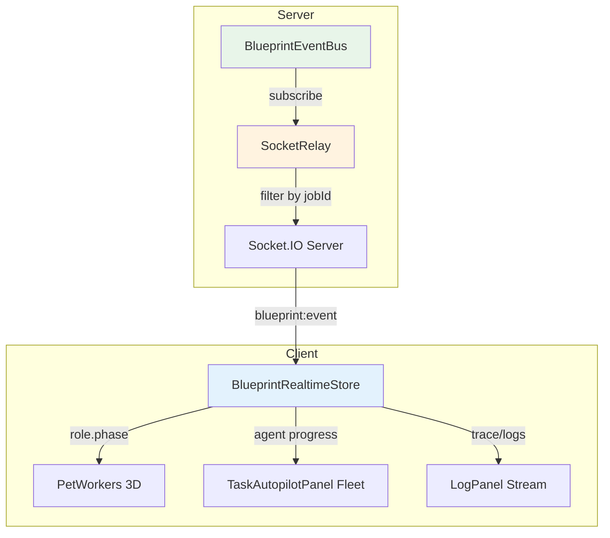
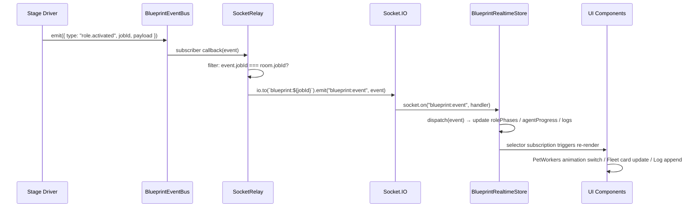
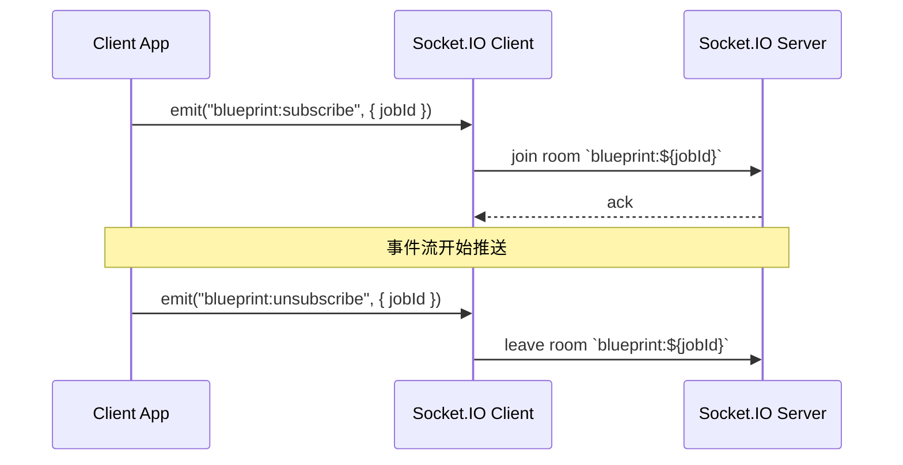

# Design Document: autopilot-realtime-observation-bridge

## Overview

本 spec 解决 Step 5（3D 运行台与观察面）与 Step 2（Agent Crew）、Step 3（能力网络）之间的实时联动缺口。当前服务端 `eventBus.emit()` 已经产出完整的 blueprint 事件流（12 家族），但前端消费侧尚未完全接上这些事件流，导致 3D 场景、HUD 面板和日志面板无法实时反映 Agent 执行状态。

本设计将打通 `eventBus → Socket.IO relay → 前端 store → UI 组件` 这条链路，让 Step 5 从"延后展示层"变成"伴随式观察层"。

## Architecture



## Sequence Diagrams

### 主流程：事件从服务端到前端渲染



### 客户端订阅与退订



## Components and Interfaces

### Component 1: SocketRelay（服务端中继模块）

**Purpose**: 订阅 `BlueprintEventBus`，将事件按 jobId 隔离推送到对应 Socket.IO room。

**Interface**:
```typescript
interface BlueprintSocketRelay {
  /** 启动中继，订阅 eventBus 并绑定 Socket.IO 连接事件 */
  start(): void;
  /** 停止中继，清理订阅 */
  stop(): void;
}

interface BlueprintSocketRelayDeps {
  eventBus: BlueprintEventBus;
  io: SocketIOServer;
  logger?: BlueprintLogger;
  /** 可选：事件过滤策略，默认推送所有家族 */
  familyFilter?: Set<BlueprintGenerationEventFamily>;
}

function createBlueprintSocketRelay(deps: BlueprintSocketRelayDeps): BlueprintSocketRelay;
```

**Responsibilities**:
- 订阅 `eventBus` 的所有事件
- 按 `event.jobId` 路由到对应 Socket.IO room（`blueprint:${jobId}`）
- 处理客户端 `blueprint:subscribe` / `blueprint:unsubscribe` 事件
- 可选的家族过滤：默认推送 `role` / `capability` / `crew` / `job` / `evidence` / `sandbox` 六个家族
- 不推送 `clarification` / `route` / `spec` / `preview` / `prompt` / `mission`（这些由现有 HTTP 轮询或专用通道处理）

### Component 2: BlueprintRealtimeStore（前端 Zustand store）

**Purpose**: 接收 Socket.IO 推送的 blueprint 事件，维护实时状态供 UI 组件消费。

**Interface**:
```typescript
interface BlueprintRealtimeState {
  /** 当前订阅的 jobId */
  subscribedJobId: string | null;

  /** 角色阶段映射：roleId → phase */
  rolePhases: Record<string, RolePhase>;

  /** Agent 进度事件队列（最近 50 条） */
  agentProgress: AgentProgressEntry[];

  /** 能力调用状态：capabilityId → status */
  capabilityStatuses: Record<string, CapabilityStatus>;

  /** 流式日志条目（最近 200 条） */
  logEntries: BlueprintLogEntry[];

  /** Fleet 角色卡片实时状态 */
  fleetRoleCards: FleetRoleRealtimeCard[];

  /** 连接状态 */
  connectionState: "disconnected" | "connecting" | "connected";
}

type RolePhase =
  | "idle"
  | "activated"
  | "thinking"
  | "acting"
  | "observing"
  | "reviewing"
  | "sleeping"
  | "completed"
  | "failed";

interface AgentProgressEntry {
  id: string;
  roleId: string;
  type: "thinking" | "acting" | "observing" | "completed" | "failed";
  message?: string;
  timestamp: number;
}

type CapabilityStatus = "idle" | "invoking" | "completed" | "failed";

interface BlueprintLogEntry {
  id: string;
  timestamp: number;
  level: "info" | "warn" | "error" | "debug";
  source: string;
  message: string;
  metadata?: Record<string, unknown>;
}

interface FleetRoleRealtimeCard {
  roleId: string;
  roleName: string;
  phase: RolePhase;
  currentAction?: string;
  capabilities: string[];
  lastUpdated: number;
}

interface BlueprintRealtimeActions {
  /** 订阅指定 jobId 的事件流 */
  subscribe(jobId: string): void;
  /** 退订当前 jobId */
  unsubscribe(): void;
  /** 处理收到的事件（内部） */
  dispatchEvent(event: BlueprintGenerationEvent): void;
  /** 重置状态 */
  reset(): void;
}
```

**Responsibilities**:
- 管理 Socket.IO 连接的 subscribe/unsubscribe 生命周期
- 将收到的事件分发到对应状态切片（rolePhases / agentProgress / capabilityStatuses / logEntries）
- 维护有界队列（agentProgress 最多 50 条，logEntries 最多 200 条）
- 提供细粒度 selector 供 UI 组件订阅，避免全量 re-render

### Component 3: PetWorkers 3D 动画绑定

**Purpose**: 根据 `rolePhases` 驱动 3D Agent 宠物的动画切换。

**Interface**:
```typescript
/** 角色阶段到动画类型的映射 */
function mapRolePhaseToAnimation(phase: RolePhase): AgentAnimationType;

/** 角色阶段到状态类别的映射（影响光效和边框） */
function mapRolePhaseToStatusCategory(phase: RolePhase): StatusCategory;
```

**Responsibilities**:
- 从 `BlueprintRealtimeStore.rolePhases` 读取当前角色阶段
- 映射到 `AgentAnimationType`（typing / reading / discussing / examining 等）
- 尊重 `prefers-reduced-motion`：降级为静态状态指示器
- 平滑过渡：使用 spring 插值避免动画跳变

### Component 4: TaskAutopilotPanel Fleet 实时更新

**Purpose**: 让 Fleet 卡片实时反映 Agent 进度。

**Interface**:
```typescript
/** 从 BlueprintRealtimeStore 派生 Fleet 卡片数据 */
function useFleetRealtimeCards(): AutopilotFleetRoleCard[];
```

**Responsibilities**:
- 合并 `TaskAutopilotPanel` 现有的静态 Fleet 数据与 `BlueprintRealtimeStore` 的实时状态
- 增量更新：只更新变化的卡片，不全量替换
- 当 store 中有实时数据时优先使用实时数据，否则 fallback 到静态投影

## Data Models

### 事件过滤策略

```typescript
/** 默认推送到前端的事件家族 */
const DEFAULT_RELAY_FAMILIES: Set<BlueprintGenerationEventFamily> = new Set([
  "role",
  "capability",
  "crew",
  "job",
  "evidence",
  "sandbox",
]);

/** 事件到前端状态切片的路由表 */
const EVENT_DISPATCH_MAP: Record<string, (state: Draft, event: Event) => void> = {
  "role.activated":       (s, e) => s.rolePhases[e.roleId] = "activated",
  "role.watching":        (s, e) => s.rolePhases[e.roleId] = "thinking",
  "role.capability_invoked": (s, e) => s.rolePhases[e.roleId] = "acting",
  "role.review_started":  (s, e) => s.rolePhases[e.roleId] = "reviewing",
  "role.review_completed":(s, e) => s.rolePhases[e.roleId] = "observing",
  "role.sleeping":        (s, e) => s.rolePhases[e.roleId] = "sleeping",
  "role.completed":       (s, e) => s.rolePhases[e.roleId] = "completed",
  "capability.invoked":   (s, e) => s.capabilityStatuses[e.capId] = "invoking",
  "capability.completed": (s, e) => s.capabilityStatuses[e.capId] = "completed",
  "capability.failed":    (s, e) => s.capabilityStatuses[e.capId] = "failed",
  "crew.context.updated": (s, e) => /* update fleet cards */,
  "job.stage":            (s, e) => /* append to agentProgress */,
};
```

### Socket.IO 频道设计

| 频道/事件名 | 方向 | 说明 |
|---|---|---|
| `blueprint:subscribe` | Client → Server | 客户端加入 jobId room |
| `blueprint:unsubscribe` | Client → Server | 客户端离开 jobId room |
| `blueprint:event` | Server → Client | 推送单条 blueprint 事件 |
| `blueprint:batch` | Server → Client | 批量推送（高频场景，≤10 条/批） |

**Room 命名**: `blueprint:${jobId}`

## Algorithmic Pseudocode

### 服务端中继算法

```typescript
function createBlueprintSocketRelay(deps: BlueprintSocketRelayDeps): BlueprintSocketRelay {
  const { eventBus, io, logger, familyFilter } = deps;
  const allowedFamilies = familyFilter ?? DEFAULT_RELAY_FAMILIES;
  let unsubscribe: (() => void) | null = null;

  function handleEvent(event: BlueprintGenerationEvent): void {
    // 1. 家族过滤
    const family = resolveBlueprintEventFamily(event.type);
    if (!allowedFamilies.has(family)) return;

    // 2. 按 jobId 路由到 room
    const room = `blueprint:${event.jobId}`;
    const roomSockets = io.sockets.adapter.rooms.get(room);
    if (!roomSockets || roomSockets.size === 0) return;

    // 3. 构造精简 payload（不推送完整 event，只推送前端需要的字段）
    const payload = {
      type: event.type,
      jobId: event.jobId,
      timestamp: event.timestamp ?? Date.now(),
      payload: event.payload,
    };

    // 4. 推送
    io.to(room).emit("blueprint:event", payload);
  }

  function handleConnection(socket: Socket): void {
    socket.on("blueprint:subscribe", ({ jobId }: { jobId: string }) => {
      if (!jobId || typeof jobId !== "string") return;
      socket.join(`blueprint:${jobId}`);
      logger?.info?.(`Socket ${socket.id} joined blueprint:${jobId}`);
    });

    socket.on("blueprint:unsubscribe", ({ jobId }: { jobId: string }) => {
      if (!jobId || typeof jobId !== "string") return;
      socket.leave(`blueprint:${jobId}`);
      logger?.info?.(`Socket ${socket.id} left blueprint:${jobId}`);
    });
  }

  return {
    start() {
      unsubscribe = eventBus.subscribe(handleEvent);
      io.on("connection", handleConnection);
    },
    stop() {
      unsubscribe?.();
      unsubscribe = null;
      io.off("connection", handleConnection);
    },
  };
}
```

### 前端事件分发算法

```typescript
function dispatchEvent(event: BlueprintRelayedEvent): void {
  const { type, payload, timestamp } = event;

  // Role phase 更新
  if (type.startsWith("role.")) {
    const roleId = payload?.roleId ?? payload?.role?.id;
    if (roleId) {
      const phase = mapEventTypeToPhase(type);
      if (phase) set(state => { state.rolePhases[roleId] = phase; });
    }
  }

  // Capability 状态更新
  if (type.startsWith("capability.")) {
    const capId = payload?.capabilityId ?? payload?.id;
    if (capId) {
      const status = mapCapabilityEventToStatus(type);
      set(state => { state.capabilityStatuses[capId] = status; });
    }
  }

  // 日志追加（所有事件都可以产生日志条目）
  const logEntry = buildLogEntry(event);
  if (logEntry) {
    set(state => {
      state.logEntries.push(logEntry);
      if (state.logEntries.length > 200) {
        state.logEntries = state.logEntries.slice(-200);
      }
    });
  }

  // Fleet 卡片更新
  if (type === "crew.context.updated" || type.startsWith("role.")) {
    rebuildFleetCards();
  }
}

function mapEventTypeToPhase(type: string): RolePhase | null {
  switch (type) {
    case "role.activated": return "activated";
    case "role.watching": return "thinking";
    case "role.capability_invoked": return "acting";
    case "role.review_started": return "reviewing";
    case "role.review_completed": return "observing";
    case "role.sleeping": return "sleeping";
    case "role.completed": return "completed";
    case "role.container.provisioning": return "activated";
    case "role.container.ready": return "activated";
    case "role.container.failed": return "failed";
    default: return null;
  }
}
```

### PetWorkers 动画映射

```typescript
function mapRolePhaseToAnimation(phase: RolePhase): AgentAnimationType {
  switch (phase) {
    case "thinking": return "reading";
    case "acting": return "typing";
    case "observing": return "examining";
    case "reviewing": return "discussing";
    case "activated": return "noting";
    case "sleeping": return "listening";
    case "completed": return "organizing";
    case "failed": return "examining";
    default: return "listening"; // idle
  }
}

function mapRolePhaseToStatusCategory(phase: RolePhase): StatusCategory {
  switch (phase) {
    case "thinking":
    case "activated": return "thinking";
    case "acting": return "working";
    case "reviewing":
    case "observing": return "reviewing";
    case "completed": return "done";
    case "failed": return "error";
    default: return "idle";
  }
}
```

## Key Functions with Formal Specifications

### Function: createBlueprintSocketRelay

```typescript
function createBlueprintSocketRelay(deps: BlueprintSocketRelayDeps): BlueprintSocketRelay
```

**Preconditions:**
- `deps.eventBus` 是有效的 `BlueprintEventBus` 实例
- `deps.io` 是已初始化的 Socket.IO Server 实例
- `deps.familyFilter`（如提供）是非空 Set

**Postconditions:**
- 返回的 relay 调用 `start()` 后，eventBus 上的事件会被转发到对应 room
- 调用 `stop()` 后，不再转发任何事件
- 不改变 eventBus 的既有行为（只读订阅）
- 不改变 Socket.IO 的初始化方式

### Function: dispatchEvent

```typescript
function dispatchEvent(event: BlueprintRelayedEvent): void
```

**Preconditions:**
- `event.type` 是有效的 `BlueprintGenerationEventType`
- `event.jobId` 与当前 `subscribedJobId` 匹配

**Postconditions:**
- 状态更新是增量的，不全量替换
- `logEntries` 长度不超过 200
- `agentProgress` 长度不超过 50
- 无副作用（不触发网络请求）

## Example Usage

```typescript
// === 服务端：启动中继 ===
import { createBlueprintSocketRelay } from "./socket-relay.js";

const relay = createBlueprintSocketRelay({
  eventBus: ctx.eventBus,
  io: getSocketIO(),
  logger: ctx.logger,
});
relay.start();

// === 前端：订阅 jobId ===
import { useBlueprintRealtimeStore } from "@/lib/blueprint-realtime-store";

function AutopilotObservationBridge({ jobId }: { jobId: string }) {
  const subscribe = useBlueprintRealtimeStore(s => s.subscribe);
  const unsubscribe = useBlueprintRealtimeStore(s => s.unsubscribe);

  useEffect(() => {
    subscribe(jobId);
    return () => unsubscribe();
  }, [jobId, subscribe, unsubscribe]);

  return null; // 纯副作用组件
}

// === 前端：PetWorkers 消费实时状态 ===
function usePetWorkerPhase(roleId: string): RolePhase {
  return useBlueprintRealtimeStore(
    s => s.rolePhases[roleId] ?? "idle"
  );
}

// === 前端：Fleet 卡片消费 ===
function useFleetRealtimeCards(): FleetRoleRealtimeCard[] {
  return useBlueprintRealtimeStore(s => s.fleetRoleCards);
}
```

## Correctness Properties

1. **事件隔离性**: ∀ event ∈ BlueprintEvents, event 只推送到 `blueprint:${event.jobId}` room 中的客户端，不广播给其他 jobId 的订阅者。

2. **增量更新**: ∀ dispatchEvent(e), 只修改与 e.type 相关的状态切片，不触发无关切片的变更。

3. **有界队列**: ∀ state ∈ BlueprintRealtimeState, `state.logEntries.length ≤ 200` ∧ `state.agentProgress.length ≤ 50`。

4. **幂等订阅**: 对同一 jobId 多次调用 `subscribe(jobId)` 不会产生重复事件推送。

5. **无侵入性**: relay 模块不改变 `eventBus.emit()` 的行为，不改变 Socket.IO 的初始化方式，不引入新的 WebSocket 库。

6. **动画无障碍**: 当 `prefers-reduced-motion: reduce` 时，3D 动画切换降级为静态状态指示（颜色/图标变化），不播放运动动画。

## Error Handling

### Error Scenario 1: Socket.IO 连接断开

**Condition**: 客户端网络中断或服务端重启
**Response**: `connectionState` 切换为 `"disconnected"`，UI 显示连接状态指示器
**Recovery**: Socket.IO 自动重连后，重新发送 `blueprint:subscribe` 恢复订阅

### Error Scenario 2: 事件格式异常

**Condition**: 收到的事件缺少 `type` 或 `jobId` 字段
**Response**: 静默丢弃，记录 warn 级别日志
**Recovery**: 无需恢复，不影响后续事件处理

### Error Scenario 3: Room 无订阅者

**Condition**: eventBus 产出事件但对应 room 无客户端
**Response**: `handleEvent` 中检查 room size，为 0 时直接 return，不执行 emit
**Recovery**: 无需恢复，节省带宽

## Testing Strategy

### Unit Testing Approach

- `createBlueprintSocketRelay`: 验证事件过滤、room 路由、subscribe/unsubscribe 生命周期
- `dispatchEvent`: 验证各事件类型到状态切片的映射正确性
- `mapRolePhaseToAnimation`: 验证所有 phase 到 animation 的映射覆盖
- 有界队列：验证超出上限时的截断行为

### Property-Based Testing Approach

**Property Test Library**: fast-check

- 对任意 `BlueprintGenerationEventType`，`resolveBlueprintEventFamily` 返回值必须属于 12 家族之一
- 对任意事件序列，`logEntries.length` 始终 ≤ 200
- 对任意 `RolePhase`，`mapRolePhaseToAnimation` 返回值必须是有效的 `AgentAnimationType`

### Integration Testing Approach

- 端到端：服务端 emit 事件 → Socket.IO 推送 → 前端 store 更新 → UI 组件 re-render
- 重连场景：断开连接后重连，验证订阅自动恢复

## Performance Considerations

- **批量推送**: 高频事件（如 `capability.invoked` 连续触发）使用 `blueprint:batch` 批量推送，每 100ms 聚合一次，减少 Socket.IO 帧数
- **选择性订阅**: 前端 store 使用细粒度 selector，避免无关组件 re-render
- **Room 检查**: 服务端在 emit 前检查 room 是否有订阅者，避免无效序列化
- **日志截断**: 前端维护滑动窗口（200 条），避免内存无限增长

## Security Considerations

- Socket.IO room 按 jobId 隔离，客户端只能订阅自己有权访问的 jobId
- 事件 payload 不包含敏感信息（API key、token 等），只包含状态摘要
- 服务端不信任客户端传入的 jobId 格式，做基本校验（非空字符串、合理长度）

## Dependencies

- **现有依赖（不新增）**:
  - `socket.io`（服务端已初始化）
  - `socket.io-client`（前端已使用）
  - `zustand`（前端状态管理）
  - `shared/blueprint/events.ts`（事件类型定义）

- **内部依赖**:
  - `server/routes/blueprint/context.ts` → `BlueprintEventBus`
  - `server/core/socket.ts` → `getSocketIO()`
  - `client/src/lib/tasks-store.ts` → 现有 mission socket 模式参考
  - `client/src/components/three/PetWorkers.tsx` → 动画系统
  - `client/src/components/tasks/TaskAutopilotPanel.tsx` → Fleet 卡片
