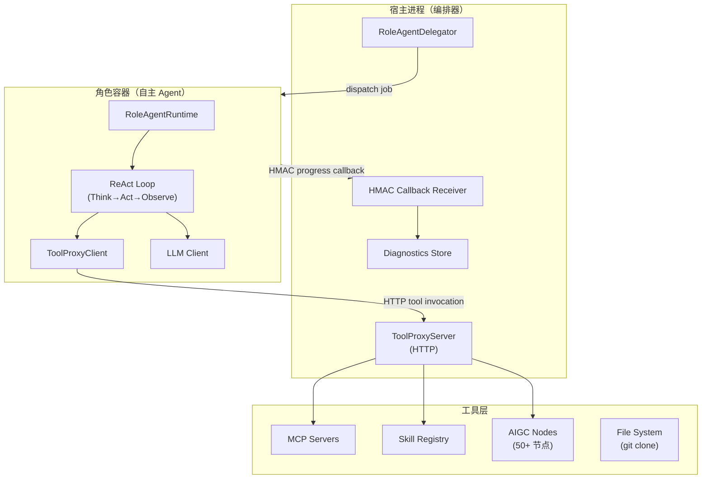
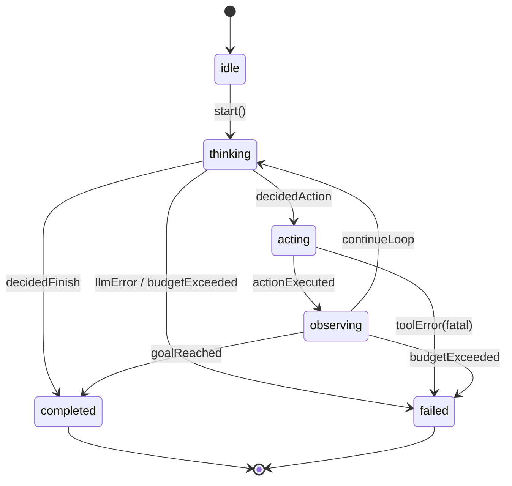
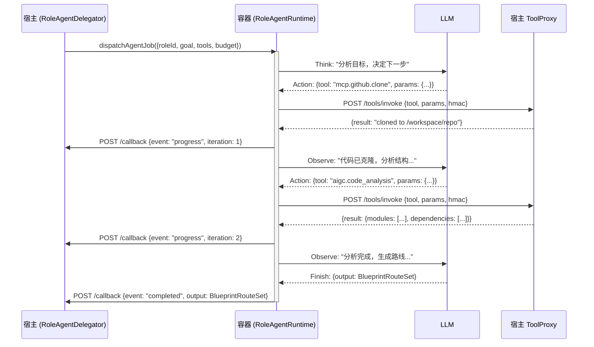
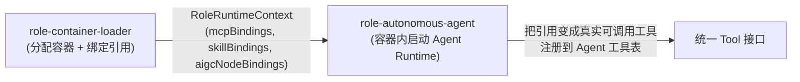
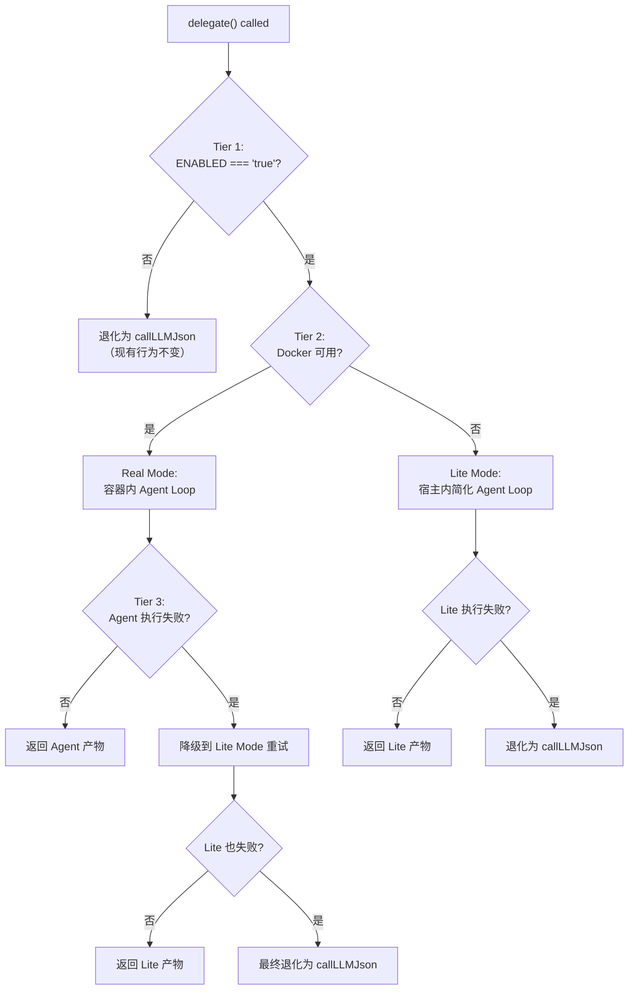

# 设计文档：Autopilot Role Autonomous Agent

## 1. 设计概述

本 spec 把 `/autopilot` 流水线从"宿主进程固定代码驱动 + 单次 LLM 调用"升级为"每个角色在自己的 Docker 容器内作为自主 Agent 运行"。

**从**：宿主 `callLLMJson(prompt)` → 拿回 JSON → 固定下一步
**到**：宿主委派给角色容器 → 容器内 Agent ReAct Loop（Think → Act → Observe → 重复）→ 产物回传

用户提交 `https://github.com/666ghj/MiroFish` 后：

1. **Planner** 角色容器启动 → Agent Loop → 自主决定 git clone → 分析代码 → 生成路线
2. **Clarifier** 角色容器 → Agent Loop → 根据代码内容自主生成澄清问题
3. **Architect** 角色容器 → Agent Loop → 自主生成 Spec 树
4. 每个角色容器内拥有：LLM 推理 + MCP 工具 + Skills + AIGC 节点编排（50+ 节点作为工具箱）
5. LLM 自主决策下一步做什么，不是固定代码流程

### 1.1 与既有 spec 的关系

| 能力 | 由谁负责 | 本 spec 是否修改 |
| --- | --- | --- |
| 容器分配与绑定 MCP/Skill/AIGC 引用 | `autopilot-role-container-loader` | 不改；本 spec 在容器内启动 Agent Runtime 把引用变成真实可调用工具 |
| 5 条 capability bridge 默认开启 | `autopilot-capability-runtime-enablement` | 不改 |
| `BlueprintAgentRole` / `BlueprintRolePresence` 类型 | `shared/blueprint/contracts.ts` | 仅追加可选字段 `agentConfig?: RoleAgentConfig` |
| 角色目录静态数据 | `blueprint-agent-crew-fabric` | 不改 |
| `callLLMJson` 实现 | `server/core/llm-client.ts` | 不改；Agent Runtime 内部复用 |
| Docker executor | `services/lobster-executor` | 不改；复用既有镜像 |
| `shared/blueprint/contracts.ts` 对外 API schema | 共享契约 | **不改**——产物格式不变 |

### 1.2 核心约束

- **产物格式不变**：澄清问题 / 路线 / Spec 树的 JSON 结构不变，只是产出方式从模板/单次 LLM 变成容器 Agent 自主产出
- **不改 `shared/blueprint/contracts.ts` 对外 API schema**
- **Graceful degradation**：Docker 不可用 → lite mode 在宿主跑简化 Agent Loop
- **预算控制**：max iterations / max tokens / timeout 三重保护

### 1.3 最低可接受交付（MAC）

当 `BLUEPRINT_ROLE_AUTONOMOUS_AGENT_ENABLED=true` 且 Docker 可用时：

- Planner 角色容器内 Agent Runtime 启动，自主执行 git clone → 代码分析 → 路线生成，产物回传宿主
- Agent Loop 状态机经历 `idle → thinking → acting → observing → ... → completed`
- 宿主通过 HMAC 回调收到进度事件
- 容器通过 HTTP 调宿主工具代理
- 产物格式与现有 `BlueprintRouteSet` / `BlueprintClarificationSession` / `BlueprintSpecTree` 完全兼容
- `GET /api/blueprint/diagnostics` 新增 `roleAutonomousAgent` entry

---

## 2. 架构

### 2.1 整体架构



### 2.2 Agent Loop 状态机



### 2.3 通信协议



### 2.4 与 role-container-loader 的关系



---

## 3. 组件和接口

### 3.1 RoleAgentRuntime（容器内核心组件）

**职责**：在容器内运行 ReAct Agent Loop，自主决策下一步动作

```typescript
export interface RoleAgentRuntime {
  /** 启动 Agent Loop，直到完成或失败 */
  run(input: AgentJobInput): Promise<AgentJobOutput>;
  /** 获取当前状态 */
  getState(): AgentLoopState;
  /** 强制终止 */
  abort(reason: string): void;
}

export interface AgentJobInput {
  jobId: string;
  roleId: string;
  stageId: string;
  goal: string;
  systemPrompt: string;
  tools: AgentToolDefinition[];
  budget: AgentBudget;
  context: AgentContext;
  callbackUrl: string;
  callbackSecret: string;
}

export interface AgentJobOutput {
  jobId: string;
  roleId: string;
  status: "completed" | "failed" | "aborted";
  output: unknown; // 符合角色产物 schema 的 JSON
  iterations: number;
  totalTokens: number;
  durationMs: number;
  trace: AgentTraceEntry[];
  error?: string;
}
```

### 3.2 AgentToolDefinition（统一工具接口）

**职责**：MCP/Skill/AIGC 节点统一为 Tool 接口

```typescript
export interface AgentToolDefinition {
  id: string;
  name: string;
  description: string;
  category: "mcp" | "skill" | "aigc_node" | "builtin";
  inputSchema: Record<string, unknown>; // JSON Schema
  outputSchema?: Record<string, unknown>;
  /** 工具调用是否需要通过宿主代理 */
  requiresProxy: boolean;
  /** 超时（毫秒） */
  timeoutMs: number;
}

export interface AgentToolInvocation {
  toolId: string;
  params: Record<string, unknown>;
  requestId: string;
}

export interface AgentToolResult {
  requestId: string;
  toolId: string;
  success: boolean;
  result?: unknown;
  error?: string;
  durationMs: number;
}
```

### 3.3 RoleAgentDelegator（宿主侧委派器）

**职责**：替换现有 `callLLMJson` 调用点，将任务委派给角色容器内的 Agent

```typescript
export interface RoleAgentDelegator {
  /** 委派任务给角色 Agent */
  delegate(input: DelegateInput): Promise<DelegateOutput>;
  /** 获取委派状态 */
  getStatus(jobId: string): DelegateStatus | undefined;
  /** 取消委派 */
  cancel(jobId: string, reason: string): Promise<void>;
  /** 诊断快照 */
  getDiagnostics(): RoleAgentDelegatorDiagnostics;
}

export interface DelegateInput {
  roleId: string;
  stageId: string;
  jobId: string;
  goal: string;
  /** 角色系统提示词 */
  systemPrompt: string;
  /** 上下文数据（GitHub URLs、已有产物等） */
  context: Record<string, unknown>;
  /** 预算控制 */
  budget: AgentBudget;
  /** 期望产物的 JSON Schema（用于验证 Agent 输出） */
  outputSchema?: Record<string, unknown>;
}

export interface DelegateOutput {
  jobId: string;
  status: "completed" | "failed" | "aborted";
  output: unknown;
  executionMode: "real" | "lite";
  iterations: number;
  totalTokens: number;
  durationMs: number;
  trace: AgentTraceEntry[];
  error?: string;
}
```

### 3.4 AgentBudget（预算控制）

```typescript
export interface AgentBudget {
  /** 最大迭代次数（Think→Act→Observe 为一次） */
  maxIterations: number; // 默认 20
  /** 最大 token 消耗 */
  maxTokens: number; // 默认 100_000
  /** 总超时（毫秒） */
  timeoutMs: number; // 默认 300_000 (5 分钟)
  /** 单次工具调用超时 */
  toolTimeoutMs: number; // 默认 60_000
  /** 是否允许并行工具调用 */
  allowParallelTools: boolean; // 默认 false
}
```

### 3.5 ToolProxyServer（宿主侧工具代理）

**职责**：容器内 Agent 通过 HTTP 调用宿主工具代理，代理转发到真实 MCP/Skill/AIGC

```typescript
export interface ToolProxyServer {
  /** 启动代理服务 */
  start(port: number): Promise<void>;
  /** 注册可用工具 */
  registerTools(roleId: string, tools: AgentToolDefinition[]): void;
  /** 处理工具调用请求 */
  handleInvocation(req: ToolProxyRequest): Promise<ToolProxyResponse>;
  /** 关闭 */
  shutdown(): Promise<void>;
}

export interface ToolProxyRequest {
  roleId: string;
  jobId: string;
  toolId: string;
  params: Record<string, unknown>;
  requestId: string;
  hmacSignature: string;
  timestamp: string;
}

export interface ToolProxyResponse {
  requestId: string;
  success: boolean;
  result?: unknown;
  error?: string;
  durationMs: number;
}
```

### 3.6 AgentLoopState（状态机）

```typescript
export type AgentLoopPhase =
  | "idle"
  | "thinking"
  | "acting"
  | "observing"
  | "completed"
  | "failed";

export interface AgentLoopState {
  phase: AgentLoopPhase;
  iteration: number;
  tokensUsed: number;
  startedAt: string;
  lastTransitionAt: string;
  currentAction?: AgentToolInvocation;
  history: AgentTraceEntry[];
  error?: string;
}

export interface AgentTraceEntry {
  iteration: number;
  phase: AgentLoopPhase;
  timestamp: string;
  thought?: string;
  action?: { toolId: string; params: Record<string, unknown> };
  observation?: { toolId: string; result: unknown; durationMs: number };
  tokensUsed: number;
  error?: string;
}
```

---

## 4. 数据模型

### 4.1 RoleAgentConfig（角色 Agent 配置）

```typescript
export interface RoleAgentConfig {
  /** Agent 系统提示词模板 ID */
  systemPromptId: string;
  /** 默认预算 */
  defaultBudget: Partial<AgentBudget>;
  /** 允许使用的工具类别 */
  allowedToolCategories: Array<"mcp" | "skill" | "aigc_node" | "builtin">;
  /** 产物输出 schema ID（用于验证 Agent 最终输出） */
  outputSchemaId: string;
  /** 是否启用 ReAct 模式（false 则退化为单次调用） */
  reactEnabled: boolean;
  /** 温度参数 */
  temperature?: number;
  /** 最大并行工具调用数 */
  maxParallelTools?: number;
}
```

### 4.2 AgentProgressEvent（进度回调事件）

```typescript
export type AgentProgressEventType =
  | "agent.started"
  | "agent.thinking"
  | "agent.acting"
  | "agent.observing"
  | "agent.iteration_completed"
  | "agent.completed"
  | "agent.failed"
  | "agent.aborted";

export interface AgentProgressEvent {
  type: AgentProgressEventType;
  jobId: string;
  roleId: string;
  stageId: string;
  iteration: number;
  timestamp: string;
  phase: AgentLoopPhase;
  thought?: string;
  action?: { toolId: string };
  observation?: { toolId: string; success: boolean };
  output?: unknown;
  error?: string;
  tokensUsed: number;
  budgetRemaining: {
    iterations: number;
    tokens: number;
    timeMs: number;
  };
}
```

### 4.3 Lite Mode 简化 Agent

```typescript
export interface LiteAgentRuntime {
  /** 在宿主进程内运行简化 Agent Loop（无 Docker） */
  run(input: AgentJobInput): Promise<AgentJobOutput>;
}
```

Lite mode 与 real mode 的差异：

| 维度 | Real Mode | Lite Mode |
| --- | --- | --- |
| 执行环境 | Docker 容器 | 宿主 Node 进程 |
| 工具调用 | HTTP → ToolProxy → 真实服务 | 直接调用进程内 adapter |
| 隔离性 | 完全隔离 | 共享进程内存 |
| 并行性 | 可多容器并行 | 串行执行 |
| 文件系统 | 容器内独立 /workspace | 临时目录 |
| 网络 | 受 allowlist 限制 | 不限制 |

---

## 5. 错误处理

### 5.1 错误场景与恢复策略

| 错误场景 | 响应 | 恢复 |
| --- | --- | --- |
| LLM 调用超时 | 重试 1 次，仍失败则标记 iteration 为 error | 跳过当前 iteration，继续下一轮 |
| LLM 返回非法 JSON | 重试 1 次（附加格式提示） | 仍失败则标记 failed |
| 工具调用超时 | 返回 timeout error 作为 observation | Agent 自主决定是否重试 |
| 工具调用失败 | 返回 error 作为 observation | Agent 自主决定替代方案 |
| 预算耗尽（iterations） | 强制进入 completed/failed | 收集已有产物作为部分结果 |
| 预算耗尽（tokens） | 强制进入 completed/failed | 同上 |
| 预算耗尽（timeout） | 强制 abort | 同上 |
| 容器崩溃 | 宿主检测到回调中断 | 降级到 lite mode 重试 |
| HMAC 签名验证失败 | 拒绝回调 | 记录安全事件 |

### 5.2 Graceful Degradation 三级



---

## Correctness Properties

*A property is a characteristic or behavior that should hold true across all valid executions of a system-essentially, a formal statement about what the system should do. Properties serve as the bridge between human-readable specifications and machine-verifiable correctness guarantees.*

### Property 1: State machine transition validity

*For any* sequence of events (LLM responses, tool results, budget checks) fed to the AgentLoopState, the resulting phase transitions SHALL only follow edges defined in the state diagram (idle→thinking, thinking→acting, thinking→completed, thinking→failed, acting→observing, acting→failed, observing→thinking, observing→completed, observing→failed), and no other transitions SHALL occur.

**Validates: Requirements 1.1, 1.2, 1.3, 1.4, 1.5, 1.6, 1.8, 1.9**

### Property 2: Budget enforcement terminates the loop

*For any* AgentBudget configuration and any sequence of LLM/tool interactions, the Agent Loop SHALL terminate before exceeding maxIterations iterations, before exceeding maxTokens cumulative tokens, and the iteration count in the final output SHALL be less than or equal to maxIterations.

**Validates: Requirements 2.1, 2.2, 2.5**

### Property 3: Trace completeness

*For any* completed or failed Agent execution, the number of AgentTraceEntry records SHALL equal the number of iterations performed, and each entry SHALL contain a valid timestamp, iteration number, and phase.

**Validates: Requirements 1.10, 2.6**

### Property 4: Environment gate early exit

*For any* value of BLUEPRINT_ROLE_AUTONOMOUS_AGENT_ENABLED that is not exactly the string "true", the RoleAgentDelegator SHALL return a result without dispatching to a container or running the Agent Loop.

**Validates: Requirements 3.1, 6.1, 10.1**

### Property 5: HMAC signature validation

*For any* callback or tool invocation request, if the HMAC-SHA256 signature does not match the expected value computed from the payload and shared secret, the receiver SHALL reject the request.

**Validates: Requirements 4.3, 5.1, 5.2, 5.3**

### Property 6: Tool whitelist enforcement

*For any* tool invocation request where the toolId is not in the set of tools declared for the requesting role, the ToolProxyServer SHALL reject the request with an authorization error.

**Validates: Requirements 4.4**

### Property 7: Credential exclusion from traces

*For any* AgentTraceEntry produced during execution, the serialized entry SHALL NOT contain any substring matching known API key patterns (e.g., "sk-", "Bearer ").

**Validates: Requirements 5.4**

### Property 8: Tool registration completeness

*For any* RoleRuntimeContext containing N MCP bindings, M Skill bindings, and K AIGC node bindings, the buildToolDefinitions function SHALL produce exactly N + M + K + 2 (builtin) tool definitions, each with all required fields (id, name, description, category, inputSchema, requiresProxy, timeoutMs) populated, and the builtin tools "finish" and "think" SHALL always be present.

**Validates: Requirements 7.1, 7.2, 7.3, 7.4, 7.5**

### Property 9: Diagnostics counter invariant

*For any* diagnostics snapshot, totalDelegations SHALL equal realDelegations + liteDelegations + fallbackDelegations.

**Validates: Requirements 8.4**

### Property 10: Output schema validation round-trip

*For any* Agent output accepted by the RoleAgentDelegator, the output SHALL pass validation against the declared outputSchema for the role (BlueprintRouteSet, BlueprintClarificationSession, or BlueprintSpecTree).

**Validates: Requirements 9.1, 9.2, 9.3, 5.5, 9.5**

### Property 11: Environment variable to budget mapping

*For any* numeric string value set in BLUEPRINT_AGENT_MAX_ITERATIONS, BLUEPRINT_AGENT_MAX_TOKENS, or BLUEPRINT_AGENT_TIMEOUT_MS, the resulting AgentBudget SHALL contain the parsed numeric value in the corresponding field.

**Validates: Requirements 10.2, 10.3, 10.4**

---

## 6. 测试策略

### 6.1 单元测试

- Agent Loop 状态机转换（每个 phase 转换路径）
- 预算控制（iterations/tokens/timeout 各自触发）
- 工具注册协议（MCP/Skill/AIGC → 统一 Tool 接口转换）
- HMAC 签名验证
- LLM 响应解析（合法/非法 JSON）

### 6.2 集成测试

- Real mode：fake Docker + fake LLM → 验证完整 Agent Loop
- Lite mode：进程内 Agent Loop → 验证产物格式兼容
- Degradation：Docker 不可用 → 自动降级到 lite
- ToolProxy：容器 → HTTP → 宿主 → MCP/Skill 完整链路

### 6.3 测试策略与前序 spec 一致

- `BUILD_TARGET=test` 默认关闭（Tier 1 早退）
- 显式 `vi.stubEnv("BLUEPRINT_ROLE_AUTONOMOUS_AGENT_ENABLED", "true")` 打开
- 不新增 PBT

---

## 7. 性能考量

| 维度 | 目标 | 策略 |
| --- | --- | --- |
| 单角色 Agent 执行时间 | < 5 分钟 | timeout 预算 + 迭代上限 |
| 容器启动延迟 | < 10 秒 | 预热镜像 + 复用 loader 已分配容器 |
| 工具调用延迟 | < 5 秒/次 | ToolProxy 本地网络 + 连接池 |
| Token 消耗 | < 100K/角色 | token 预算 + 摘要压缩历史 |
| 并发角色数 | 3-5 个 | 宿主资源预算 + 串行降级 |

---

## 8. 安全考量

- **HMAC 签名**：容器 → 宿主回调必须携带 HMAC-SHA256 签名
- **工具白名单**：每个角色只能调用其 `RoleCapabilityPackage` 声明的工具
- **网络隔离**：容器网络受 `networkPolicy` 限制
- **Token 脱敏**：Agent trace 中的 LLM API Key 不记录
- **产物验证**：Agent 输出必须通过 `outputSchema` 验证才接受

---

## 9. 依赖

| 依赖 | 来源 | 用途 |
| --- | --- | --- |
| `autopilot-role-container-loader` | 本仓库 spec | 容器分配与能力绑定 |
| `autopilot-capability-runtime-enablement` | 本仓库 spec | 主开关与诊断端点 |
| `services/lobster-executor` | 本仓库 | Docker 容器生命周期 |
| `server/core/llm-client.ts` | 本仓库 | LLM 调用 |
| `McpToolAdapter` | 本仓库主线 | MCP 工具执行 |
| `plugin-skill-system` | L12 spec | Skill 注册与调用 |
| AIGC 节点 runtime | Web-AIGC 主线 | 50+ 节点作为工具 |

---

## 10. 关键算法

### 10.1 ReAct Agent Loop 核心算法

```typescript
async function runAgentLoop(input: AgentJobInput): Promise<AgentJobOutput> {
  const state: AgentLoopState = {
    phase: "idle",
    iteration: 0,
    tokensUsed: 0,
    startedAt: new Date().toISOString(),
    lastTransitionAt: new Date().toISOString(),
    history: [],
  };

  const startTime = Date.now();

  while (true) {
    // 预算检查
    if (state.iteration >= input.budget.maxIterations) {
      return finalize(state, "budget_iterations_exceeded");
    }
    if (state.tokensUsed >= input.budget.maxTokens) {
      return finalize(state, "budget_tokens_exceeded");
    }
    if (Date.now() - startTime >= input.budget.timeoutMs) {
      return finalize(state, "budget_timeout_exceeded");
    }

    // Phase: Thinking
    state.phase = "thinking";
    state.iteration++;
    emitProgress(input, state);

    const thinkResult = await callLLM({
      systemPrompt: input.systemPrompt,
      messages: buildMessages(state.history, input.context),
      tools: input.tools.map(toFunctionSchema),
      temperature: 0.1,
    });

    state.tokensUsed += thinkResult.tokensUsed;

    if (thinkResult.type === "finish") {
      // Agent 决定完成
      state.phase = "completed";
      return buildOutput(input, state, thinkResult.output);
    }

    if (thinkResult.type === "error") {
      // LLM 错误，重试一次
      const retry = await callLLM({ /* same params + format hint */ });
      if (retry.type === "error") {
        state.phase = "failed";
        state.error = retry.error;
        return buildOutput(input, state, null);
      }
    }

    // Phase: Acting
    state.phase = "acting";
    const action = thinkResult.action!;
    emitProgress(input, state);

    const toolResult = await invokeToolViaProxy(
      input.callbackUrl,
      action,
      input.budget.toolTimeoutMs,
    );

    // Phase: Observing
    state.phase = "observing";
    state.history.push({
      iteration: state.iteration,
      phase: "observing",
      timestamp: new Date().toISOString(),
      thought: thinkResult.thought,
      action: { toolId: action.toolId, params: action.params },
      observation: {
        toolId: action.toolId,
        result: toolResult.result ?? toolResult.error,
        durationMs: toolResult.durationMs,
      },
      tokensUsed: thinkResult.tokensUsed,
    });

    emitProgress(input, state);
  }
}
```

### 10.2 宿主侧委派算法

```typescript
async function delegate(input: DelegateInput): Promise<DelegateOutput> {
  // Tier 1: env gate
  if (process.env.BLUEPRINT_ROLE_AUTONOMOUS_AGENT_ENABLED !== "true") {
    return fallbackToCallLLMJson(input);
  }

  // 解析角色工具集
  const roleCtx = ctx.roleRuntimeContextStore.get({
    roleId: input.roleId,
    stageId: input.stageId,
    jobId: input.jobId,
  });

  const tools = buildToolDefinitions(roleCtx);

  // Tier 2: Docker 可用性
  const dockerAvailable = await ctx.executorClient?.assertReachable()
    .then(() => true)
    .catch(() => false) ?? false;

  if (dockerAvailable) {
    // Real mode: 容器内 Agent
    try {
      const result = await dispatchToContainer({
        ...input,
        tools,
        mode: "real",
      });
      return result;
    } catch (err) {
      // Tier 3: 降级到 lite
      ctx.logger.warn("real agent failed, falling back to lite", { err });
    }
  }

  // Lite mode: 宿主内 Agent
  try {
    const result = await runLiteAgent({ ...input, tools });
    return { ...result, executionMode: "lite" };
  } catch (err) {
    // 最终退化: callLLMJson
    ctx.logger.warn("lite agent failed, falling back to callLLMJson", { err });
    return fallbackToCallLLMJson(input);
  }
}
```

### 10.3 工具注册协议（MCP/Skill/AIGC → 统一 Tool）

```typescript
function buildToolDefinitions(roleCtx: RoleRuntimeContext): AgentToolDefinition[] {
  const tools: AgentToolDefinition[] = [];

  // MCP 工具
  for (const mcpId of roleCtx.mcp.list()) {
    tools.push({
      id: `mcp.${mcpId}`,
      name: `mcp_${mcpId}`,
      description: `MCP server: ${mcpId}`,
      category: "mcp",
      inputSchema: getMcpInputSchema(mcpId),
      requiresProxy: true,
      timeoutMs: 30_000,
    });
  }

  // Skill 工具
  for (const skillId of roleCtx.skill.list()) {
    tools.push({
      id: `skill.${skillId}`,
      name: `skill_${skillId}`,
      description: getSkillDescription(skillId),
      category: "skill",
      inputSchema: getSkillInputSchema(skillId),
      requiresProxy: true,
      timeoutMs: 60_000,
    });
  }

  // AIGC 节点工具
  for (const nodeId of roleCtx.aigcNode.list()) {
    tools.push({
      id: `aigc.${nodeId}`,
      name: `aigc_${nodeId}`,
      description: getAigcNodeDescription(nodeId),
      category: "aigc_node",
      inputSchema: getAigcNodeInputSchema(nodeId),
      requiresProxy: true,
      timeoutMs: 120_000,
    });
  }

  // 内置工具
  tools.push(
    { id: "builtin.finish", name: "finish", description: "完成任务并返回最终产物", category: "builtin", inputSchema: { type: "object", properties: { output: {} } }, requiresProxy: false, timeoutMs: 1_000 },
    { id: "builtin.think", name: "think", description: "记录思考过程（不执行动作）", category: "builtin", inputSchema: { type: "object", properties: { thought: { type: "string" } } }, requiresProxy: false, timeoutMs: 1_000 },
  );

  return tools;
}
```

---

## 11. 新增 env flag

| 变量名 | 默认 | 语义 |
| --- | --- | --- |
| `BLUEPRINT_ROLE_AUTONOMOUS_AGENT_ENABLED` | `"false"` | Tier-1 门禁。显式 `"true"` 打开 |
| `BLUEPRINT_AGENT_MAX_ITERATIONS` | `20` | 全局默认最大迭代次数 |
| `BLUEPRINT_AGENT_MAX_TOKENS` | `100000` | 全局默认最大 token |
| `BLUEPRINT_AGENT_TIMEOUT_MS` | `300000` | 全局默认超时（5 分钟） |
| `BLUEPRINT_AGENT_TOOL_PROXY_PORT` | `0`（随机） | ToolProxy 监听端口 |

主 switch `AUTOPILOT_REAL_RUNTIME=true` 经 `resolveBridgeEnablement` 解析后把本 flag 默认取值从 `"false"` 翻成 `"true"`；`BUILD_TARGET=test` 强制锁回 `"false"`。

---

## 12. 诊断扩展

`GET /api/blueprint/diagnostics` 新增第 7 条 bridge entry：`roleAutonomousAgent`

```json
{
  "bridgeId": "roleAutonomousAgent",
  "mode": "real" | "lite" | "disabled",
  "enabledByConfig": true,
  "dependencyReady": true,
  "lastInvocationAt": "2026-06-01T12:00:00.000Z",
  "lastMode": "real",
  "lastError": null,
  "totalDelegations": 15,
  "realDelegations": 12,
  "liteDelegations": 3,
  "fallbackDelegations": 0,
  "averageIterations": 8.5,
  "averageTokensPerDelegation": 45000,
  "averageDurationMs": 120000
}
```
