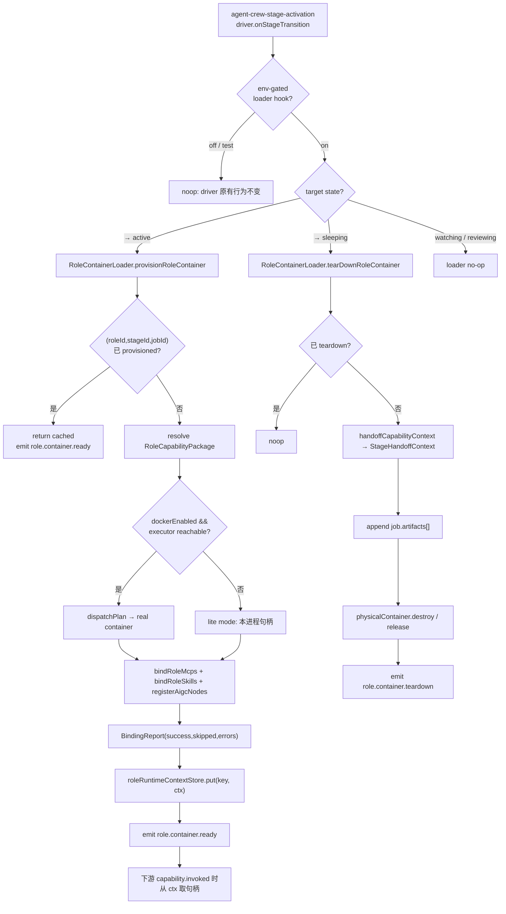
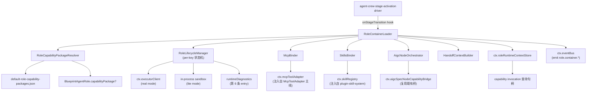
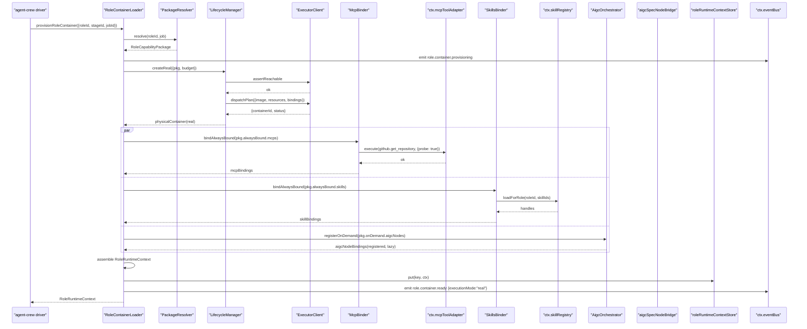
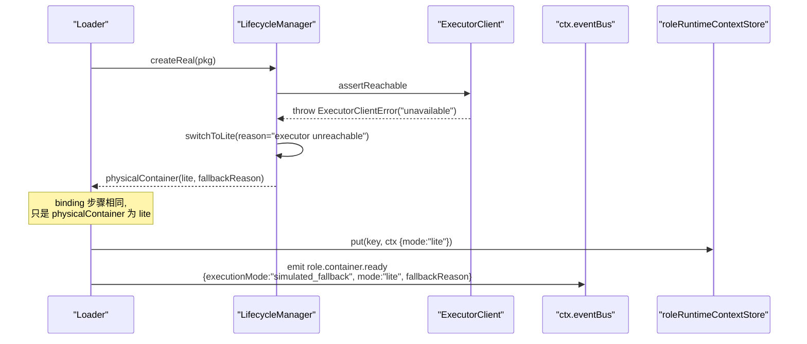
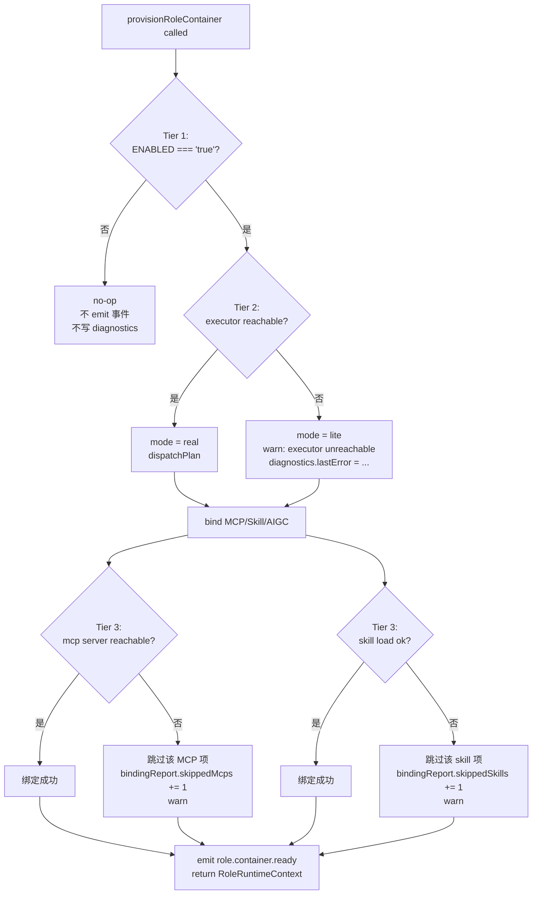

# 设计文档：Autopilot Role Container Loader

## 1. 设计概述

本 spec 把 `/autopilot` 的“角色（Agent Role）”从静态目录升级为**真实复合代理（composite agent）**：每当某个角色在某一阶段（stage）被激活时，系统 **按需装配一个容器（或在 Docker 不可用时回退到 lite 模式）**，并把该角色声明的 **MCP 服务器集合、Skill 集合、AIGC 节点集合** 动态加载到该容器所属的运行时上下文中，供该角色在此阶段内作为一个统一能力包调用。

本 spec 是在 `autopilot-capability-runtime-enablement` 之上的能力纵切扩展：

- `autopilot-capability-runtime-enablement` 负责把 5 条 capability bridge（docker / mcp-github / role / aigc-node / stage-activation）从 opt-in off 翻成 opt-out on，并建立主 switch + BUILD_TARGET + 诊断端点的运行时装配规范。
- 本 spec **不替代**任何既有桥，**不引入新的 capability kind**，而是在“角色被激活”的边界新增一个组织层——`RoleContainerLoader`——它按 per-role `RoleCapabilityPackage` 声明，调用主线 `McpToolAdapter`、`plugin-skill-system`、AIGC 节点 runtime，完成“本次激活所需的完整能力集”动态绑定。

本 spec 也是对 `blueprint-agent-crew-fabric` 的**运行时扩展**：该 spec 定义了角色、角色能力矩阵、阶段激活策略和 `role.*` 事件名的**静态语义**；本 spec 把这套静态语义接上**真实容器生命周期**与**真实能力绑定执行**，并引入 `role.container.*` 4 个新事件常量用于追踪这段生命周期。

### 1.1 与既有 spec 的边界（强约束）

| 能力 | 由谁负责 | 本 spec 是否修改 |
| --- | --- | --- |
| 5 条 capability bridge 的 tier-1/2/3 早退 | 各自 `autopilot-capability-bridge-*` spec | 不改 |
| bridge env flag 默认解析与 `resolveBridgeEnablement` | `autopilot-capability-runtime-enablement` | 不改（只新增一个并列 flag） |
| `BlueprintAgentRole` / `BlueprintRolePresence` / `BlueprintAgentCrew` 类型 | `blueprint-agent-crew-fabric` + `shared/blueprint/contracts.ts` | 仅**追加**一个可选字段 `capabilityPackage?` |
| 角色目录静态数据、角色能力矩阵默认值 | `blueprint-agent-crew-fabric` | 不改 |
| `agent-crew-stage-activation/driver.ts` 的内部算法 | 同上 spec | 不改；只在 `onStageTransition` 入口处新增 env-gated hook 调用 |
| `McpToolAdapter` 实现 | `/api/mcp` 主线 | 不改；通过注入消费 |
| `plugin-skill-system` 实现 | L12 skill-system | 不改；通过注入消费 |
| Docker executor 镜像构建 | `services/lobster-executor` | 不改；复用既有 `lobster-executor:ai` / `lobster-executor:default` |
| `secure-sandbox` 多租户隔离 | L23 spec | 不在本 spec 范围内 |
| HTTP 端点 | 复用 `/api/mcp` / `/api/skills`；不新增 | 只新增 1 个诊断接入点（6th bridge diagnostics entry） |
| UI 改动 | 不在范围 | 不改 |

### 1.2 最低可接受交付（MAC）

当：

- `BLUEPRINT_ROLE_CONTAINER_LOADER_ENABLED=true`（由本 spec 新增的 env flag 驱动，默认 off，可通过 `AUTOPILOT_REAL_RUNTIME=true` 主 switch + `BUILD_TARGET !== "test"` 间接打开）
- Docker 可用、`LOBSTER_EXECUTOR_BASE_URL` 已配置
- 某角色 `role-blueprint-architect` 在 `route_generation` 阶段被 `agent-crew-stage-activation/driver.ts` 判定需进入 `active`
- 该角色的 `RoleCapabilityPackage` 绑定 `alwaysBound: { mcps: ["github"], skills: ["blueprint-architecture"] }`、`onDemand: { aigcNodes: ["subsystem-decompose"] }`

则：

- `RoleContainerLoader.provisionRoleContainer({ roleId, stageId, jobId })` 将调用 `ExecutorClient.dispatchPlan(...)` 真实拉起 `lobster-executor:ai` 容器（containerId 为真实值）
- 事件总线按顺序 emit：`role.container.provisioning` → `role.container.ready`（带 `executionMode: "real"`、`bindingSummary.mcpCount / skillCount / aigcNodeCount`）
- `bindRoleMcps` 调用 `ctx.mcpToolAdapter.execute(github.get_repository)` 等校验性心跳（visibility probe），**不产生实际业务副作用**
- `bindRoleSkills` 调用 `ctx.skillRegistry.loadForRole(...)`（由 L12 注入）装载 Skill 上下文
- 后续该角色本阶段内发起的 capability invocation 会查 `ctx.roleRuntimeContextStore.get({ roleId, stageId, jobId })`，从中拿到已绑定的 MCP / Skill / AIGC 节点句柄集
- 当该角色在 stage transition 被判定进入 `sleeping` 或 job 进入终态时，`tearDownRoleContainer({ roleId, stageId, jobId })` 触发容器回收，emit `role.container.teardown`
- 诊断端点 `GET /api/blueprint/diagnostics` 新增第 6 条 bridge entry：`roleContainerLoader`，带 `mode / enabledByConfig / dependencyReady / lastInvocationAt / totalProvisions / realProvisions / liteProvisions / teardownCount`

同时当 Docker 不可达（`ExecutorClient.assertReachable()` 抛错）时：

- `provisionRoleContainer` 自动回退到 `mode: "lite"`，不调 `dispatchPlan`；仍绑定 MCP / Skill / AIGC 节点，但绑定时复用主线本进程的 `McpToolAdapter` / `SkillRegistry` 实例，在宿主 Node 进程中完成
- emit `role.container.ready` 带 `executionMode: "simulated_fallback"`、`mode: "lite"`、`fallbackReason: "executor unreachable"`
- 角色仍可在本阶段完成 capability invocation；下游 LLM 路径完全不感知 lite 与 real 的差异

并且当：

- 某个 MCP 服务器不可达（`ctx.mcpToolAdapter.execute(...)` 抛 `server_unavailable`）
- 某个 Skill 加载失败（`ctx.skillRegistry.loadForRole(...)` 抛错）

则相应绑定项被**跳过并记录 warning**，**不影响容器本身 ready 状态**，其它已绑定项继续可用，`bindingReport` 中列出被跳过项与原因。

### 1.3 兼容性保证（硬承诺）

- 5140+ 既有测试在**未 opt-in**本 spec 时零感知通过
- `BlueprintAgentRole` / `BlueprintRolePresence` / `BlueprintAgentCrew` / `BlueprintCapabilityInvocation` / `BlueprintCapabilityEvidence` 顶层字段集**严格不变**；本 spec 仅在 `BlueprintAgentRole` 上追加**可选字段** `capabilityPackage?: RoleCapabilityPackage`
- 既有 6 条 `role.*` 事件（`role.activated` / `role.watching` / `role.capability_invoked` / `role.review_started` / `role.review_completed` / `role.sleeping`）语义、顺序、payload 顶层字段全部保持不变
- 本 spec 不新增任何 `/api/*` HTTP 路由；诊断面板通过扩展既有 `/api/blueprint/diagnostics` 的 `bridges` 字段新增一个 key
- 本 spec 不引入新的持久化存储；`RoleRuntimeContextStore` 为纯内存，per-ctx，进程重启即丢
- 本 spec 不引入 property-based test（PBT），所有新增测试 example-based，与 `autopilot-capability-bridge-*` 系列 §9.3 的规范对齐

### 1.4 新增 env flag

| 变量名 | 默认 | 语义 |
| --- | --- | --- |
| `BLUEPRINT_ROLE_CONTAINER_LOADER_ENABLED` | unset → `"false"`（与既有 5 桥同款 opt-in 语义） | tier-1 门禁。显式 `"true"` 打开，显式 `"false"` 关闭，unset 视作 `"false"` |
| `BLUEPRINT_ROLE_CONTAINER_LOADER_MODE_OVERRIDE` | unset | 可选：强制 `"real"` / `"lite"`，测试与调试用；生产通常不设 |
| `BLUEPRINT_ROLE_CONTAINER_PROVISION_TIMEOUT_MS` | `30000` | 单次 provision 总超时（Docker dispatch + MCP / Skill 绑定） |

主 switch `AUTOPILOT_REAL_RUNTIME=true` 经 `resolveBridgeEnablement` 解析后把 `BLUEPRINT_ROLE_CONTAINER_LOADER_ENABLED` 的默认取值从 `"false"` 翻成 `"true"`；`BUILD_TARGET=test` 强制锁回 `"false"`，除非用例显式 `vi.stubEnv(..., "true")` opt-in。该语义与前序 5 桥完全一致。

### 1.5 范围边界（不做事项）

- 不做多租户隔离：由 `secure-sandbox`（L23）承载
- 不做容器镜像构建：复用 `services/lobster-executor` 中既有镜像
- 不做 UI / 面板改动：诊断只从已有 `/api/blueprint/diagnostics` 的 JSON 投影
- 不做跨 job 容器复用：本 spec 每个 `(roleId, stageId, jobId)` 一个独立容器生命周期
- 不做 MCP / Skill 的热更新：容器 ready 后，绑定集合在本次激活生命周期内冻结；新增仅能通过新一次 provision
- 不做节点级别的权限模型变更：沿用 `agent-permission-model`（L25）

---

## 2. 关键架构决策（Key Decisions）

### D1：Loader 作为组织层，不是新 bridge

`RoleContainerLoader` **不**出现在 `routeGenerationCapabilities[]` 中。它**不是** capability，而是 capability 调用的**前置组织层**。角色被激活 → loader 装配 → 本阶段内后续 capability invocation 看到 `ctx.roleRuntimeContextStore` 的已绑定句柄。

因此本 spec **不扩展** `createRouteGenerationSandboxDerivation()` 的 `invocations.map(...)` 分支；替换点在 `agent-crew-stage-activation/driver.ts` 的 `onStageTransition` 入口处（见 §3.5）。

### D2：复合容器模型（Composite Agent Container）

一次 `provisionRoleContainer` 产出的是一个**逻辑容器**，其组成为：

```text
RoleContainer
├── physicalContainer:
│     - real mode → Docker container (via ExecutorClient)
│     - lite mode → 宿主 Node 进程内的虚拟 sandbox（复用 in-process adapters）
├── mcpBindings: Map<mcpServerId, McpSessionHandle>
├── skillBindings: Map<skillId, SkillHandle>
├── aigcNodeBindings: Map<aigcNodeId, AigcNodeHandle>
└── runtimeContext: RoleRuntimeContext
```

real / lite 模式差异**仅**体现在 `physicalContainer` 层：

- real：向 `ExecutorClient.dispatchPlan({ image: "lobster-executor:ai" | "lobster-executor:default", bindings: ... })` 派发作业
- lite：不派发作业；直接在本进程持有 `McpToolAdapter` / `SkillRegistry` 的已有实例作为逻辑句柄

上层 capability invocation **不感知**差异：`RoleRuntimeContext.mcp.execute(...)` / `.skill.invoke(...)` / `.aigcNode.orchestrate(...)` 在两种模式下都通过同一套接口路由。

### D3：绑定三段式（alwaysBound / onDemand / shared）

`RoleCapabilityPackage` 声明三类绑定：

- `alwaysBound`：角色 active 即加载；失败跳过（warn），不阻塞 ready
- `onDemand`：角色 active 时仅登记引用；首次 invocation 时再加载；二次加载命中缓存
- `shared`：跨角色共享实例（例如“全局 github MCP”）；由 loader 从进程级 singleton 池取

这三类在 `bindRoleMcps` / `bindRoleSkills` / `orchestrateAigcInvocation` 的入口处按标签筛选后批量处理。

### D4：Per-role AIGC Orchestration 作为**一次性复合能力**

当角色声明绑定多个 AIGC 节点（例如 `["subsystem-decompose", "risk-evaluate", "cost-estimate"]`）时，`orchestrateAigcInvocation` 把这批节点作为**单个逻辑调用**串行（或可配置并行）执行，向上暴露一个合并的 `OrchestratedAigcResult`：

```ts
{
  success: boolean;
  nodeResults: Array<{ nodeId; success; executionMode; durationMs; error? }>;
  mergedOutputSummary: string;
  partialFailures: number;
}
```

**关键**：单节点失败不阻塞整体；partial failure 反映在 `success: false` + `partialFailures > 0` + `nodeResults` 明细上。这和 D3 的绑定级降级在语义上对齐：**跳过而不是抛错**。

### D5：Stage handoff 通过 `StageHandoffContext`

阶段切换时（角色进入 `sleeping` 之前），loader 把本阶段 `RoleRuntimeContext` 折叠成 `StageHandoffContext` 快照挂到 `job.artifacts[]`（类型 `role_runtime_handoff`），包含：

- 本阶段内所有 capability invocation 的 `(capabilityId, invocationId)` 列表
- 本阶段内所有 MCP session 的使用计数与最终状态
- 本阶段内所有 Skill handle 的入/出参摘要（脱敏）
- 下一阶段角色在恢复时的 `warmStartHint`

这样下一个阶段的 loader `provisionRoleContainer` 在启动时看到 `StageHandoffContext` 的话可以**复用** Skill 缓存、MCP session（在 TTL 内）。

### D6：Graceful degradation 三级

| Tier | 触发条件 | 降级路径 |
| --- | --- | --- |
| Tier 1（env gate） | `BLUEPRINT_ROLE_CONTAINER_LOADER_ENABLED !== "true"` | 完全 no-op：不装配、不 emit 事件、不写 diagnostics |
| Tier 2（dependency） | `ctx.executorClient === undefined`（或不传 `mcpToolAdapter` / `skillRegistry`） | lite mode 自动启用；MCP 不可用时跳过 MCP 绑定；skill 不可用时跳过 skill 绑定 |
| Tier 3（runtime error） | `dispatchPlan` 失败 / `execute` 抛 `server_unavailable` / `loadForRole` 抛错 | 单项跳过并 warn；**整体不抛错**；已加载项继续可用；诊断如实记录 `lastError` |

和前序 5 桥完全同构。

### D7：事件名新增但不新增家族

在 `shared/blueprint/events.ts` 追加 4 个 `role.container.*` 常量，归入既有 `role` 家族（不扩展 `BlueprintGenerationEventFamily`）：

| 常量 | 字符串值 |
| --- | --- |
| `RoleContainerProvisioning` | `"role.container.provisioning"` |
| `RoleContainerReady` | `"role.container.ready"` |
| `RoleContainerTeardown` | `"role.container.teardown"` |
| `RoleContainerFailed` | `"role.container.failed"` |

事件 payload 可选字段（追加式）：`containerMode: "real" | "lite"` / `bindingSummary` / `fallbackReason?` / `executionMode`。既有 6 条 `role.*` 事件完全不动。

### D8：Idempotency key

所有 loader API 以 `(roleId, stageId, jobId)` 为幂等主键。重复 `provisionRoleContainer(sameKey)` 命中缓存直接返回已有 `RoleRuntimeContext`，不重复拉容器、不重复 emit 首次 `role.container.provisioning` 事件（但 subsequent 调用会 emit 一条 `role.container.ready` 以同步订阅者）。

`tearDownRoleContainer(sameKey)` 在已 teardown 状态下返回 no-op；多次调用幂等。

### D9：诊断扩展（第 6 条 entry）

`autopilot-capability-runtime-enablement` 定义了 `GET /api/blueprint/diagnostics` 的 5-bridge snapshot 模板。本 spec 在同一 JSON 对象的 `bridges` map 中新增 1 个 key：`"roleContainerLoader"`，字段集与其它 5 条同构但语义为 loader 专属：

```json
{
  "bridgeId": "roleContainerLoader",
  "mode": "real" | "lite" | "disabled" | "unknown",
  "enabledByConfig": true,
  "dependencyReady": true,
  "lastInvocationAt": "2026-06-01T12:00:00.000Z",
  "lastMode": "real" | "lite" | null,
  "lastError": null,
  "totalProvisions": 12,
  "realProvisions": 9,
  "liteProvisions": 3,
  "teardownCount": 11,
  "orphanContainerWarning": 0
}
```

这是对既有 `BridgeDiagnosticEntry` 结构的**超集**（复用 5 个必填字段 + 增加 4 个 loader 专属字段），不改 5-bridge snapshot 的投影契约。

### D10：资源预算

每个 `RoleCapabilityPackage` 可声明 `resourceBudget`：

```ts
{
  memoryMb?: number;       // default 512
  cpuShares?: number;       // default 512
  provisionTimeoutMs?: number; // default 30_000
  networkPolicy?: "isolated" | "allowlist" | "open"; // default "allowlist"
  allowlistDomains?: string[];
}
```

real mode 下这些值透传到 `ExecutorClient.dispatchPlan({ resources: ... })`；lite mode 下仅在 `bindingReport` 元数据中记录，不强制隔离（lite 本身就不是隔离边界）。

### D11：不改 `BlueprintAgentRole` 必填字段

`shared/blueprint/contracts.ts` 中 `BlueprintAgentRole` 追加一个**可选**字段：

```ts
export interface BlueprintAgentRole {
  // ...既有 9 个必填字段...
  /**
   * 可选：角色的运行时能力包声明。由 `autopilot-role-container-loader` spec 消费。
   * 未声明时 loader 使用 `resolveFallbackPackage(roleId)`（基于 roleId 与默认目录查询）。
   */
  capabilityPackage?: RoleCapabilityPackage;
}
```

静态数据源（如既有 `default-agent-crew-roles.json` 等）**不强制**立即为每个角色补该字段；未声明时 loader 查 `default-role-capability-packages.json`（本 spec 新增）按 `roleId` 做 fallback 匹配；再未命中则使用空包 `{ alwaysBound: {}, onDemand: {}, shared: {} }` 并 emit warning。

### D12：测试策略与前序 spec 一致

- `BUILD_TARGET=test` 默认关闭 loader（Tier 1 早退）
- 显式 `vi.stubEnv("BLUEPRINT_ROLE_CONTAINER_LOADER_ENABLED", "true")` + 注入 fake `executorClient` / fake `mcpToolAdapter` / fake `skillRegistry` 打开 real / lite 路径
- 新增 ~8-10 条 co-located 单测（capability-package / loader / lifecycle-manager / mcp-binder / skills-binder / aigc-orchestrator / handoff-context 各自 1-2 条 example-based 测试）
- 新增 3-4 条 E2E（real / lite / MCP 不可达单项跳过 / 幂等 provision & teardown）
- 不新增 PBT

---

## 3. 架构图（High-Level Design）

### 3.1 Role Lifecycle 总览



### 3.2 组件关系图



### 3.3 Real Mode 绑定数据流



### 3.4 Lite Mode 降级数据流



### 3.5 集成点：driver 的 env-gated hook

在 `server/routes/blueprint/agent-crew-stage-activation/driver.ts` 的 `onStageTransition(input)` 末尾（所有 role.* 事件已 emit 之后）追加：

```ts
// env-gated hook，对 5140+ 既有测试完全透明
if (ctx.roleContainerLoader && process.env.BLUEPRINT_ROLE_CONTAINER_LOADER_ENABLED === "true") {
  try {
    ctx.roleContainerLoader.onStageTransitionHook(input, stageRoleStateMap);
  } catch (err) {
    ctx.logger.warn("role container loader hook threw, ignored", { err: String(err).slice(0, 400) });
  }
}
```

`onStageTransitionHook` 负责扫 `stageRoleStateMap`，对新进入 `active` 的角色调 `provisionRoleContainer`，对新进入 `sleeping` 的角色调 `tearDownRoleContainer`。

**关键兼容性承诺**：driver 本身的 role.* 事件发射逻辑**零改动**；loader hook 是**新增的可选**代码路径，未 opt-in 时整体保持现有行为，5140+ 测试零感知。

### 3.6 Tier 1/2/3 降级决策树



---

## 4. 核心接口与低级设计（Low-Level Design）

### 4.1 `RoleCapabilityPackage` 数据模型

```ts
export interface RoleCapabilityPackageBinding {
  /** MCP server id，对齐 `/api/mcp` 注册目录。 */
  mcps: string[];
  /** Skill id，对齐 `plugin-skill-system` 注册目录。 */
  skills: string[];
  /** AIGC 节点 id，对齐 `aigc-spec-node` / Web-AIGC runtime extra adapters 目录。 */
  aigcNodes: string[];
}

export interface RoleResourceBudget {
  memoryMb: number;          // [128, 4096]；默认 512
  cpuShares: number;          // [128, 2048]；默认 512
  provisionTimeoutMs: number; // [1_000, 120_000]；默认 30_000
  networkPolicy: "isolated" | "allowlist" | "open"; // 默认 "allowlist"
  allowlistDomains: string[]; // 仅 networkPolicy="allowlist" 时生效
}

export interface RoleCapabilityPackage {
  /** alwaysBound：容器 ready 前必须尝试加载（单项失败跳过不阻塞整体）。 */
  alwaysBound: Partial<RoleCapabilityPackageBinding>;
  /** onDemand：ready 时仅注册引用；首次 invoke 时加载。 */
  onDemand: Partial<RoleCapabilityPackageBinding>;
  /** shared：跨角色共享的 process-wide singleton（lite mode 总使用 shared）。 */
  shared: Partial<RoleCapabilityPackageBinding>;
  /** 资源预算；未声明项使用 `createDefaultRoleResourceBudget()`。 */
  resourceBudget?: Partial<RoleResourceBudget>;
  /** 镜像标签。默认 `lobster-executor:default`；声明 AIGC 节点时推荐 `lobster-executor:ai`。 */
  containerImage?: "lobster-executor:default" | "lobster-executor:ai";
}
```

### 4.2 `RoleContainerLifecycle` 状态机

```ts
export type RoleContainerLifecycleState =
  | "uninitialized"     // 尚未开始 provision
  | "provisioning"       // dispatchPlan / 绑定中
  | "ready"              // 容器就绪，可用
  | "degrading"          // 某项 Tier 3 错误发生，但整体仍可用
  | "tearing_down"       // 正在释放
  | "torn_down"          // 已释放
  | "failed";            // 不可恢复失败（Tier 2 全链失败）

export interface RoleContainerLifecycle {
  key: RoleContainerKey;
  state: RoleContainerLifecycleState;
  mode: "real" | "lite";
  physicalContainerId?: string;  // real mode 专有
  provisionedAt?: string;         // ISO 时间
  readyAt?: string;
  teardownAt?: string;
  bindingReport: BindingReport;
  fallbackReason?: string;
  lastError?: string;
}

export interface RoleContainerKey {
  roleId: string;
  stageId: BlueprintGenerationStage;
  jobId: string;
}
```

### 4.3 `RoleRuntimeContext`

```ts
export interface RoleRuntimeContext {
  key: RoleContainerKey;
  mode: "real" | "lite";
  package: RoleCapabilityPackage;
  mcp: {
    execute(serverId: string, request: McpToolExecutionRequest): Promise<McpToolExecutionResult>;
    list(): string[];  // 当前可用 MCP id
  };
  skill: {
    invoke(skillId: string, input: unknown): Promise<unknown>;
    list(): string[];
  };
  aigcNode: {
    orchestrate(nodeIds: string[], input: unknown): Promise<OrchestratedAigcResult>;
    list(): string[];
  };
  resourceBudget: RoleResourceBudget;
}
```

### 4.4 `StageHandoffContext`

```ts
export interface StageHandoffContext {
  key: RoleContainerKey;
  capabilitiesInvoked: Array<{ capabilityId: string; invocationId: string; executionMode: "real" | "simulated_fallback" }>;
  mcpSessions: Array<{ serverId: string; invocationCount: number; lastStatus: "ok" | "failed" }>;
  skillHandles: Array<{ skillId: string; invocationCount: number; inputDigest: string; outputDigest: string }>;
  aigcNodeResults: Array<{ nodeId: string; partialFailure: boolean }>;
  warmStartHint?: string;  // 供下一阶段 provision 参考；默认 undefined
  generatedAt: string;
}
```

### 4.5 Loader 接口

```ts
export interface RoleContainerLoader {
  /** 幂等：相同 key 命中缓存直接返回已有 ctx。 */
  provisionRoleContainer(input: RoleContainerKey): Promise<RoleRuntimeContext>;

  /** 幂等：相同 key 在 torn_down 状态下返回 void。 */
  tearDownRoleContainer(input: RoleContainerKey): Promise<StageHandoffContext | undefined>;

  /** driver hook 的内部入口；不对外直接使用。 */
  onStageTransitionHook(
    input: AgentCrewStageActivationInput,
    stageRoleStateMap: Map<string, BlueprintRolePresenceState>
  ): void;

  /** 诊断快照。 */
  getDiagnostics(): RoleContainerLoaderDiagnostics;
}
```

### 4.6 结构化伪代码：`provisionRoleContainer`

```pascal
ALGORITHM provisionRoleContainer(input)
INPUT: input = { roleId, stageId, jobId }
OUTPUT: RoleRuntimeContext

BEGIN
  ASSERT input.roleId ≠ "" AND input.stageId ≠ "" AND input.jobId ≠ ""

  // Tier 1 gate
  IF process.env.BLUEPRINT_ROLE_CONTAINER_LOADER_ENABLED ≠ "true" THEN
    RETURN stubRoleRuntimeContext(input)  // noop context (lite, empty bindings)
  END IF

  key ← canonicalKey(input)

  // 幂等性
  cached ← ctx.roleRuntimeContextStore.get(key)
  IF cached ≠ null AND cached.lifecycle.state IN {"ready","degrading"} THEN
    ctx.eventBus.emit(role.container.ready, { key, mode: cached.mode, cached: true })
    RETURN cached
  END IF

  // 解析 package
  pkg ← resolveCapabilityPackage(input.roleId, ctx.currentJob(input.jobId))
  budget ← mergeBudget(pkg.resourceBudget, defaults)

  // emit provisioning
  provenance ← { key, startedAt: ctx.now() }
  ctx.eventBus.emit(role.container.provisioning, { key, bindingSummary: summarize(pkg) })

  // Tier 2 / 2.5：决定 mode
  modeDecision ← determineMode(ctx.executorClient, budget)
  // determineMode: dockerEnabled AND executor reachable → "real"；否则 "lite"

  // 物理容器
  TRY
    IF modeDecision = "real" THEN
      physicalContainer ← lifecycleManager.createReal({
        image: pkg.containerImage ?? "lobster-executor:default",
        resources: budget,
        networkPolicy: budget.networkPolicy,
        allowlistDomains: budget.allowlistDomains,
      })
    ELSE
      physicalContainer ← lifecycleManager.createLite({ fallbackReason: "executor unreachable" })
    END IF
  CATCH err
    // Tier 2 全链失败（极少数情况）→ 降级到 lite
    ctx.logger.warn("physical container creation failed, falling back to lite", { err: redact(err) })
    physicalContainer ← lifecycleManager.createLite({ fallbackReason: redact(err) })
    modeDecision ← "lite"
  END TRY

  // 批量绑定（Tier 3 per-item graceful）
  bindingReport ← initBindingReport()

  PARALLEL
    mcpBindings ← bindRoleMcps(pkg.alwaysBound.mcps ?? [], ctx.mcpToolAdapter, bindingReport)
    skillBindings ← bindRoleSkills(pkg.alwaysBound.skills ?? [], ctx.skillRegistry, input.roleId, bindingReport)
    aigcNodeBindings ← registerAigcNodes(pkg.onDemand.aigcNodes ?? [], ctx.aigcSpecNodeCapabilityBridge, bindingReport)
  END PARALLEL

  // shared 绑定：取 process-wide singleton
  mcpBindings ← mcpBindings ∪ resolveSharedMcps(pkg.shared.mcps ?? [])
  skillBindings ← skillBindings ∪ resolveSharedSkills(pkg.shared.skills ?? [])

  // 组装 RoleRuntimeContext
  roleRuntimeCtx ← {
    key,
    mode: modeDecision,
    package: pkg,
    mcp: createMcpFacade(mcpBindings, modeDecision),
    skill: createSkillFacade(skillBindings, modeDecision),
    aigcNode: createAigcFacade(aigcNodeBindings, pkg.onDemand.aigcNodes ?? [], modeDecision),
    resourceBudget: budget,
    lifecycle: {
      key,
      state: bindingReport.hasSkipped ? "degrading" : "ready",
      mode: modeDecision,
      physicalContainerId: physicalContainer.id,
      provisionedAt: provenance.startedAt,
      readyAt: ctx.now(),
      bindingReport,
      fallbackReason: physicalContainer.fallbackReason,
    },
  }

  ctx.roleRuntimeContextStore.put(key, roleRuntimeCtx)

  // diagnostics
  ctx.runtimeDiagnostics.recordBridgeInvocation("roleContainerLoader", {
    mode: modeDecision = "real" ? "real" : "simulated_fallback",
    error: physicalContainer.fallbackReason,
  })

  // emit ready
  ctx.eventBus.emit(role.container.ready, {
    key,
    containerMode: modeDecision,
    executionMode: modeDecision = "real" ? "real" : "simulated_fallback",
    fallbackReason: physicalContainer.fallbackReason,
    bindingSummary: {
      mcpCount: mcpBindings.size,
      skillCount: skillBindings.size,
      aigcNodeCount: aigcNodeBindings.size,
      skippedMcps: bindingReport.skippedMcps.length,
      skippedSkills: bindingReport.skippedSkills.length,
    },
  })

  RETURN roleRuntimeCtx
END
```

**Preconditions：**

- `input.roleId` / `input.stageId` / `input.jobId` 非空
- `ctx.now` 可用
- `ctx.eventBus` / `ctx.roleRuntimeContextStore` / `ctx.runtimeDiagnostics` 已装配

**Postconditions：**

- 若 Tier 1 off，返回 stub context 且不产生副作用
- 若 Tier 1 on，返回 `roleRuntimeCtx`，其 `lifecycle.state ∈ {ready, degrading}`
- 对相同 key 多次调用幂等：首次之后不重复 `dispatchPlan`
- `bindingReport` 精确反映成功/跳过/错误计数
- `eventBus` 按顺序 emit `role.container.provisioning`（首次）→ `role.container.ready`

**Loop Invariants：** 无显式循环；并行绑定中各自子函数携带自己的不变量（见 4.7 / 4.8）。

### 4.7 结构化伪代码：`bindRoleMcps`

```pascal
ALGORITHM bindRoleMcps(mcpIds, mcpToolAdapter, bindingReport)
INPUT: mcpIds: string[]
       mcpToolAdapter: McpToolAdapterDependency | undefined
       bindingReport: BindingReport (mutable)
OUTPUT: Map<mcpId, McpSessionHandle>

BEGIN
  result ← new Map()

  IF mcpToolAdapter = undefined THEN
    FOR each id IN mcpIds DO
      bindingReport.skippedMcps.push({ id, reason: "mcpToolAdapter missing" })
    END FOR
    RETURN result
  END IF

  FOR each mcpId IN mcpIds DO
    ASSERT 所有之前绑定成功的 mcp 仍在 result 中
    TRY
      probeRequest ← { serverId: mcpId, tool: "meta.ping", params: {}, timeoutMs: 5_000 }
      probeResult ← AWAIT mcpToolAdapter.execute(probeRequest)
      IF probeResult.success = true THEN
        handle ← { serverId: mcpId, sessionToken: probeResult.sessionToken, createdAt: ctx.now() }
        result.set(mcpId, handle)
      ELSE
        bindingReport.skippedMcps.push({ id: mcpId, reason: truncate(probeResult.error, 400) })
        ctx.logger.warn("mcp binding skipped", { mcpId, reason: probeResult.error })
      END IF
    CATCH err
      bindingReport.skippedMcps.push({ id: mcpId, reason: truncate(errorMessage(err), 400) })
      ctx.logger.warn("mcp binding threw", { mcpId, err: redact(err) })
    END TRY
  END FOR

  RETURN result
END
```

**Loop Invariant：** 每轮迭代结束后，`result` 中仅包含已成功绑定的 MCP；所有失败或跳过项均记录在 `bindingReport.skippedMcps`；函数永不抛错。

### 4.8 结构化伪代码：`bindRoleSkills`

```pascal
ALGORITHM bindRoleSkills(skillIds, skillRegistry, roleId, bindingReport)
INPUT: skillIds: string[]
       skillRegistry: SkillRegistry | undefined
       roleId: string
       bindingReport: BindingReport (mutable)
OUTPUT: Map<skillId, SkillHandle>

BEGIN
  result ← new Map()

  IF skillRegistry = undefined THEN
    FOR each id IN skillIds DO
      bindingReport.skippedSkills.push({ id, reason: "skillRegistry missing" })
    END FOR
    RETURN result
  END IF

  FOR each skillId IN skillIds DO
    TRY
      handle ← AWAIT skillRegistry.loadForRole({ roleId, skillId })
      IF handle = null THEN
        bindingReport.skippedSkills.push({ id: skillId, reason: "skill not registered" })
      ELSE
        result.set(skillId, handle)
      END IF
    CATCH err
      bindingReport.skippedSkills.push({ id: skillId, reason: truncate(errorMessage(err), 400) })
      ctx.logger.warn("skill binding failed", { skillId, err: redact(err) })
    END TRY
  END FOR

  RETURN result
END
```

**Loop Invariant：** 每轮后，已成功加载的 Skill 句柄驻留在 `result`；跳过项全记于 `bindingReport.skippedSkills`；函数永不抛错。

### 4.9 结构化伪代码：`orchestrateAigcInvocation`

```pascal
ALGORITHM orchestrateAigcInvocation(nodeIds, input, ctx, runtimeCtx)
INPUT: nodeIds: string[]
       input: unknown
       ctx: BlueprintServiceContext
       runtimeCtx: RoleRuntimeContext
OUTPUT: OrchestratedAigcResult

BEGIN
  ASSERT nodeIds.length > 0
  ASSERT runtimeCtx.lifecycle.state IN {"ready","degrading"}

  results ← []
  partialFailures ← 0
  mode ← runtimeCtx.package.resourceBudget?.orchestrationMode ?? "serial"

  IF mode = "serial" THEN
    accumulated ← input
    FOR each nodeId IN nodeIds DO
      ASSERT ∀ r IN results, r.nodeId 已执行
      startedAt ← ctx.now()
      TRY
        nodeResult ← AWAIT invokeSingleAigcNode(nodeId, accumulated, ctx, runtimeCtx)
        durationMs ← ctx.now() - startedAt
        results.push({ nodeId, success: true, executionMode: nodeResult.executionMode, durationMs })
        accumulated ← mergeAccumulated(accumulated, nodeResult.output)
      CATCH err
        durationMs ← ctx.now() - startedAt
        partialFailures ← partialFailures + 1
        results.push({ nodeId, success: false, executionMode: "simulated_fallback", durationMs, error: truncate(errorMessage(err), 400) })
        ctx.logger.warn("aigc node failed, continuing orchestration", { nodeId, err: redact(err) })
      END TRY
    END FOR
  ELSE IF mode = "parallel" THEN
    promises ← nodeIds.map(id => invokeSingleAigcNodeSafely(id, input, ctx, runtimeCtx))
    results ← AWAIT Promise.all(promises)
    partialFailures ← results.filter(r => !r.success).length
  END IF

  success ← (partialFailures = 0)

  RETURN {
    success,
    nodeResults: results,
    mergedOutputSummary: buildMergedSummary(results),
    partialFailures,
  }
END
```

**Preconditions：** `runtimeCtx` 已 ready；`nodeIds` 非空。

**Postconditions：**

- `results.length = nodeIds.length`
- `success ⇔ (partialFailures = 0)`
- 单节点失败不抛错；错误仅体现在 `nodeResults[i].success = false`

**Loop Invariant（serial mode）：** 每轮迭代开始前，`results` 包含此前所有节点的执行记录；`accumulated` 包含所有已成功节点的输出合并。

### 4.10 结构化伪代码：`tearDownRoleContainer`

```pascal
ALGORITHM tearDownRoleContainer(key)
INPUT: key = { roleId, stageId, jobId }
OUTPUT: StageHandoffContext | undefined

BEGIN
  // Tier 1 gate：保持与 provision 对称
  IF process.env.BLUEPRINT_ROLE_CONTAINER_LOADER_ENABLED ≠ "true" THEN
    RETURN undefined
  END IF

  existing ← ctx.roleRuntimeContextStore.get(key)

  IF existing = null THEN
    ctx.logger.debug("tearDown: no context for key, noop", { key })
    RETURN undefined
  END IF

  IF existing.lifecycle.state IN {"torn_down","tearing_down"} THEN
    RETURN existing.lastHandoffContext
  END IF

  existing.lifecycle.state ← "tearing_down"

  // 构造 handoff
  handoff ← handoffCapabilityContext(existing)

  // append to job.artifacts[]
  TRY
    ctx.jobStore.appendArtifact(key.jobId, {
      id: createId("role-runtime-handoff"),
      type: "role_runtime_handoff",
      payload: handoff,
      createdAt: ctx.now(),
    })
  CATCH err
    ctx.logger.warn("handoff append failed", { key, err: redact(err) })
  END TRY

  // 物理释放
  TRY
    IF existing.mode = "real" AND existing.lifecycle.physicalContainerId ≠ undefined THEN
      AWAIT ctx.executorClient.cancelJob(existing.lifecycle.physicalContainerId)
    END IF
    // lite mode: 无物理资源，仅释放 Map 引用
  CATCH err
    // orphan container warning
    ctx.runtimeDiagnostics.noteOrphanContainer("roleContainerLoader", { key, err: redact(err) })
    ctx.logger.warn("container release failed, marked as orphan", { key, err: redact(err) })
  END TRY

  existing.lifecycle.state ← "torn_down"
  existing.lifecycle.teardownAt ← ctx.now()
  existing.lastHandoffContext ← handoff

  ctx.runtimeDiagnostics.recordTeardown("roleContainerLoader", { key, mode: existing.mode })

  ctx.eventBus.emit(role.container.teardown, {
    key,
    containerMode: existing.mode,
    executionMode: existing.mode = "real" ? "real" : "simulated_fallback",
    handoffArtifactAppended: true,
  })

  RETURN handoff
END
```

**Preconditions：** `key` 非空。

**Postconditions：**

- 幂等：多次调用同 key 返回同一 `handoff`；不重复释放容器
- 无论 provision 路径是 real 或 lite，teardown 都将 lifecycle 推进到 `torn_down`
- 物理释放失败不抛错；通过 `noteOrphanContainer` 记录，后续可由诊断端点观察

### 4.11 结构化伪代码：`handoffCapabilityContext`

```pascal
ALGORITHM handoffCapabilityContext(roleRuntimeCtx)
INPUT: roleRuntimeCtx: RoleRuntimeContext
OUTPUT: StageHandoffContext

BEGIN
  ASSERT roleRuntimeCtx.lifecycle.state ≠ "torn_down"  // 由调用方保证

  invokedCapabilities ← roleRuntimeCtx.tracker.capabilitiesInvoked.snapshot()
  mcpSessionsSnapshot ← []
  FOR each (serverId, handle) IN roleRuntimeCtx.mcp.bindings DO
    mcpSessionsSnapshot.push({
      serverId,
      invocationCount: handle.invocationCount,
      lastStatus: handle.lastStatus,
    })
  END FOR

  skillHandlesSnapshot ← []
  FOR each (skillId, handle) IN roleRuntimeCtx.skill.bindings DO
    skillHandlesSnapshot.push({
      skillId,
      invocationCount: handle.invocationCount,
      inputDigest: sha256(redactedInputs(handle.lastInput)).slice(0,16),
      outputDigest: sha256(redactedOutputs(handle.lastOutput)).slice(0,16),
    })
  END FOR

  aigcSnapshot ← []
  FOR each (nodeId, handle) IN roleRuntimeCtx.aigcNode.bindings DO
    aigcSnapshot.push({ nodeId, partialFailure: handle.lastPartialFailure ?? false })
  END FOR

  handoff ← {
    key: roleRuntimeCtx.key,
    capabilitiesInvoked: invokedCapabilities,
    mcpSessions: mcpSessionsSnapshot,
    skillHandles: skillHandlesSnapshot,
    aigcNodeResults: aigcSnapshot,
    warmStartHint: deriveWarmStartHint(roleRuntimeCtx),
    generatedAt: ctx.now(),
  }

  RETURN handoff
END
```

**Postconditions：** 返回的 `handoff` 为**快照**深拷贝；调用方后续修改 `roleRuntimeCtx` 不影响 handoff。

### 4.12 `onStageTransitionHook`（driver 集成侧）

```pascal
PROCEDURE onStageTransitionHook(input, stageRoleStateMap)
BEGIN
  FOR each (roleId, targetState) IN stageRoleStateMap DO
    key ← { roleId, stageId: input.stageId, jobId: input.jobId }
    SWITCH targetState
      CASE "active":
        // 异步 fire-and-forget；失败仅 warn
        provisionRoleContainer(key)
          .then(ctx => ctx.logger.debug("role container provisioned", { key }))
          .catch(err => ctx.logger.warn("provision failed (graceful)", { key, err: redact(err) }))
      CASE "sleeping":
        tearDownRoleContainer(key)
          .catch(err => ctx.logger.warn("teardown failed (graceful)", { key, err: redact(err) }))
      DEFAULT:
        // watching / reviewing：无 loader 动作
        continue
    END SWITCH
  END FOR
END
```

Hook 本身为**同步返回 void**，内部异步 provision / teardown 以 fire-and-forget 方式发起；driver 原有的 `role.*` 事件不会因 loader 状态变化而顺序漂移。

---

## 5. 错误处理

### 5.1 启动期

| 场景 | 行为 |
| --- | --- |
| env flag 未设 | Tier 1 gate 关闭；loader 构造仍执行，但所有 public API 早退 |
| `executorClient === undefined` | 所有 provision 走 lite mode |
| `mcpToolAdapter === undefined` | 所有 MCP 绑定被跳过（不影响容器 ready） |
| `skillRegistry === undefined` | 所有 Skill 绑定被跳过（不影响容器 ready） |

### 5.2 运行期

| 场景 | 行为 |
| --- | --- |
| `dispatchPlan` 派发超时 | Tier 3：降级到 lite 并重试绑定；记录 diagnostics.lastError |
| 单个 MCP 不可达 | 跳过该项；warn；`bindingReport.skippedMcps` 记录；其它 MCP / Skill / AIGC 继续 |
| 单个 Skill 加载失败 | 跳过该项；warn；`bindingReport.skippedSkills` 记录 |
| 单个 AIGC 节点 orchestration 失败 | `OrchestratedAigcResult.partialFailures++`；其它节点继续 |
| teardown 时物理容器释放失败 | `noteOrphanContainer`；diagnostics 计数；不抛错 |
| driver hook 抛错 | 外层 try/catch 吞掉 + warn；driver 自身语义不受影响 |

### 5.3 诊断端点响应

当 loader 完全未开启（Tier 1 off）时，`GET /api/blueprint/diagnostics` 的 `bridges.roleContainerLoader.mode` 返回 `"disabled"`，计数器全 0，`lastInvocationAt = null`。与其它 5 条 bridge 的 disabled 语义同构。

---

## 6. 测试策略

### 6.1 单元测试（co-located，新增）

| 文件 | 覆盖 |
| --- | --- |
| `capability-package.test.ts` | `RoleCapabilityPackage` 解析与 fallback 匹配的 6 场景 |
| `loader.test.ts` | `provisionRoleContainer` / `tearDownRoleContainer` 幂等、lite 回退、错误吞掉、诊断写入 |
| `lifecycle-manager.test.ts` | real / lite 构造、state 推进、orphan 计数 |
| `mcp-binder.test.ts` | 成功绑定、单项跳过、mcpToolAdapter 缺失、执行抛错 |
| `skills-binder.test.ts` | 同上但针对 skillRegistry |
| `aigc-orchestrator.test.ts` | serial / parallel 模式；部分失败 / 全失败 |
| `handoff-context.test.ts` | 快照深拷贝、脱敏摘要、warmStartHint |

### 6.2 E2E（追加到 `blueprint-routes.test.ts` 或新建 `role-container-loader-e2e.test.ts`）

1. **Real mode happy path**：`vi.stubEnv("BLUEPRINT_ROLE_CONTAINER_LOADER_ENABLED","true")` + fake executor + fake mcpToolAdapter + fake skillRegistry → 断言事件顺序、`bindingReport` 正确、诊断 `mode="real"` `realProvisions=1`
2. **Lite mode fallback**：同上但 `fakeExecutor.assertReachable` 抛错 → 断言 `mode="lite"` `fallbackReason` 非空、其它绑定成功
3. **Partial binding failure**：MCP `github` probe 返回 `success:false` → 断言 `bindingReport.skippedMcps` 含 `github`、其它绑定正常、容器仍 ready
4. **Idempotent provisioning**：同 key 两次 `provisionRoleContainer` → 断言 `dispatchPlan` 只调一次、cached 返回、事件幂等

### 6.3 回归保护

- `BUILD_TARGET=test` 默认关闭 loader，5140+ 既有测试零感知
- 显式 `vi.stubEnv` 用例打开本 spec 新路径
- 测试完毕 `vi.unstubAllEnvs()`

### 6.4 不做 PBT

和前序 5 桥完全一致；example-based only。

---

## 7. 正确性属性（Correctness Properties）

### P1：幂等 provisioning
**∀** key `K = (roleId, stageId, jobId)`：连续 N 次 `provisionRoleContainer(K)` 返回的 `roleRuntimeCtx` 对象引用相同（或 deep-equal），`executorClient.dispatchPlan` 被调用**至多 1 次**，`role.container.provisioning` 事件**至多** emit 1 次。

### P2：保证 teardown
**∀** 已 ready / degrading 的 key `K`：调用 `tearDownRoleContainer(K)` 后，存储中对应条目的 `lifecycle.state = "torn_down"`；`eventBus` 至少 emit 一次 `role.container.teardown`；如果 real mode，physical container 尝试被释放（成功或被记为 orphan）。

### P3：无 orphan 容器（best-effort）
**∀** job 进入终态（`completed` / `failed`）：所有该 job 的 `(roleId, stageId)` key 上未 teardown 的容器必须在 job 终结 hook 中收到 `tearDownRoleContainer` 调用；teardown 成功则不计入 orphan；teardown 释放失败则 diagnostics `orphanContainerWarning` 递增但整体不阻塞。

### P4：Handoff 保留上下文
**∀** 非空 ready 状态下的 teardown：返回的 `StageHandoffContext` 包含 **所有** 本阶段期间被 `mcp.execute` / `skill.invoke` / `aigcNode.orchestrate` 调用过的条目（按 invocation 计数器），且 `generatedAt` 为 teardown 时刻。

### P5：Tier 1 零副作用
**∀** `BLUEPRINT_ROLE_CONTAINER_LOADER_ENABLED !== "true"`：`provisionRoleContainer` / `tearDownRoleContainer` 的任何调用都不得触发 `executorClient` / `mcpToolAdapter` / `skillRegistry` / `eventBus.emit` / `runtimeDiagnostics.record*` 中的任一方法。

### P6：优雅降级不抛错
**∀** Tier 2 / Tier 3 错误（executor 不可达 / MCP 不可达 / Skill 加载失败 / dispatchPlan 超时）：public API `provisionRoleContainer` / `tearDownRoleContainer` **永不**抛异常到调用方；返回的 `roleRuntimeCtx.lifecycle.state ∈ {"ready","degrading","torn_down"}`；绑定失败项仅记录在 `bindingReport`。

### P7：契约不变
**∀** `BlueprintAgentRole` / `BlueprintRolePresence` / `BlueprintAgentCrew` 实例：本 spec 只追加**可选**字段 `capabilityPackage?`；其它顶层字段集合、类型、序列化形态严格不变。

### P8：事件家族不变
新增 4 个 `role.container.*` 事件常量归入既有 `role` 家族；`BlueprintGenerationEventFamily` union 不扩展；`resolveBlueprintEventFamily("role.container.ready") = "role"`。

### P9：诊断面超集
`GET /api/blueprint/diagnostics` 的 `bridges` map 在本 spec 落地后变为 6-entry；前 5 条 bridge 的 entry 结构严格不变（投影冻结），第 6 条 `roleContainerLoader` 为**新增** entry；响应 schema 对前 5 条的消费者向后兼容。

---

## 8. 组件所有权图

| 组件 | 文件 | 说明 |
| --- | --- | --- |
| `RoleCapabilityPackage` 类型与解析 | `server/routes/blueprint/role-container-loader/capability-package.ts` | 新建 |
| `RoleContainerLoader` 主体 | `server/routes/blueprint/role-container-loader/loader.ts` | 新建 |
| `RoleLifecycleManager` 状态机 | `server/routes/blueprint/role-container-loader/lifecycle-manager.ts` | 新建 |
| `McpBinder` | `server/routes/blueprint/role-container-loader/mcp-binder.ts` | 新建 |
| `SkillsBinder` | `server/routes/blueprint/role-container-loader/skills-binder.ts` | 新建 |
| `AigcNodeOrchestrator` | `server/routes/blueprint/role-container-loader/aigc-orchestrator.ts` | 新建 |
| `HandoffContextBuilder` | `server/routes/blueprint/role-container-loader/handoff-context.ts` | 新建 |
| 默认 package 目录 | `server/routes/blueprint/role-container-loader/default-role-capability-packages.json` | 新建 |
| 4 新事件常量 | `shared/blueprint/events.ts` | 追加 |
| `capabilityPackage?` 可选字段 | `shared/blueprint/contracts.ts` | 追加可选字段 |
| `roleContainerLoader?` DI 字段 | `server/routes/blueprint/context.ts` | 追加可选字段 + 默认装配条件调用 |
| driver hook | `server/routes/blueprint/agent-crew-stage-activation/driver.ts` | 在 `onStageTransition` 末尾新增 env-gated hook |
| 第 6 条 diagnostics entry | `server/routes/blueprint/runtime-enablement/diagnostics-store.ts` | 扩展 `BridgeId` union + entry schema |
| `.env.example` | 根 `.env.example` | 追加 3 个新 flag 与中文说明 |
| steering | `.kiro/steering/project-overview.md` | 追加 1-3 段说明 |
