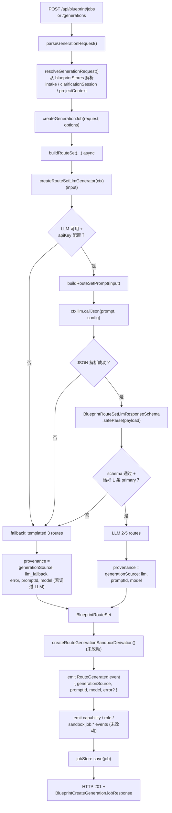
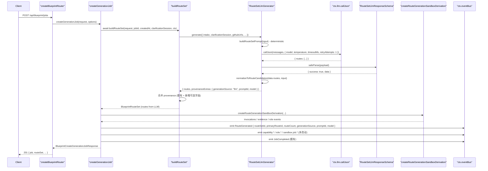
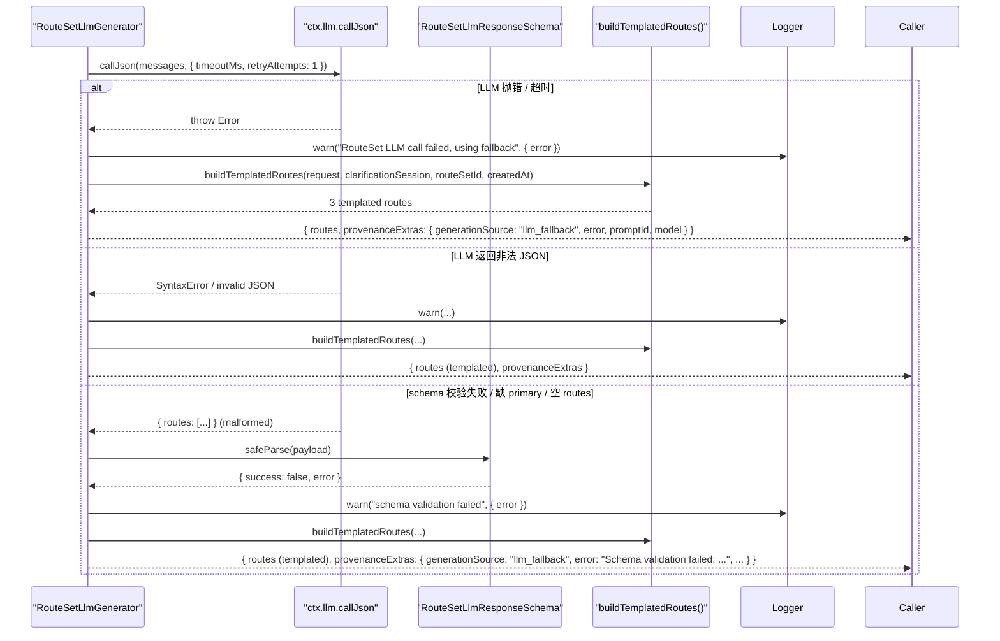

# 设计文档：Autopilot RouteSet LLM 驱动生成

## 1. 设计概述

本 spec 把 `/autopilot` 的 RouteSet 生成阶段从当前 `buildRouteSet()`（`server/routes/blueprint.ts` 第 2425 行）硬编码的 3 条候选路线（primary SPEC asset / documentation-first conservative / preview-first exploratory）升级为由 LLM 产出、经严格 schema 校验、带 provenance 追溯、失败回退到模板的结构化结果。整体实现模式复用澄清阶段已经验证过的同一条主线：`BlueprintServiceContext.llm.callJson` → schema 校验 → 成功路径返回 LLM routes / 失败路径回退到模板 → 在 provenance 与 `route.generated` 事件 payload 上附加 `generationSource` / `promptId` / `model` / `error` 可选字段。

本 spec 严格限定在 **RouteSet 这一阶段**：

- 仅改造 `buildRouteSet()` 的数据派生路径，新增一个 `createRouteSetLlmGenerator(ctx)` 工厂，落地到 `server/routes/blueprint/routeset/` 目录；co-located 单元测试与它同目录。
- **不修改** `createRouteGenerationSandboxDerivation()` 的模板化能力调用 / evidence / role 事件派生逻辑；LLM 产出的 routes 仍被完整送入这套管线，使 Artifact Replay / Agent Crew / `sandbox.job.*` 事件流下游消费者完全无感知。
- **不修改** SPEC Tree、SPEC Documents、Effect Preview、Prompt Package、Engineering Handoff 的生成路径，这些阶段的 LLM 驱动属于各自独立 spec。
- **不改动** `POST /api/blueprint/jobs` 与 `POST /api/blueprint/generations` 的 URL、HTTP 方法、请求体结构、响应体既有字段（`routeSet.routes[*]` 的 `id` / `kind` / `title` / `summary` / `rationale` / `riskLevel` / `costLevel` / `complexity` / `estimatedEffort` / `capabilities` / `steps`）、以及 `provenance` 既有字段；新增均为可选字段追加。
- **不引入** property-based test（本 spec 明确不做 PBT，见需求 9.3）；本轮只新增 2+ 条 E2E 测试与一组 co-located 子域单元测试。
- 既有 45 条 E2E + 48 条子域 co-located 单测 + 9 条 SDK smoke 全部继续通过，不重写既有断言以迁就新行为。

最低可接受交付：一次 `POST /api/blueprint/jobs`（或 `/generations`），当 LLM 可用且返回有效 JSON 时 `routeSet.routes` 来自 LLM，`routeSet.provenance.generationSource === "llm"`；当 LLM 抛错、超时、返回非法 JSON、schema 不通过、缺 primary、空 routes 时 `routeSet.routes` 退回到现有模板化 3 条路线，`routeSet.provenance.generationSource === "llm_fallback"` 且 `provenance.error` 被填充。


## 2. 架构决策（Key Decisions）

### D1：严格 schema（锁定，由用户决策）

LLM 响应采用 **strict schema** 策略（基于项目已依赖的 `zod@^4.1.12`，见 `package.json` 第 112 行）：

- 字段名固定（`id` / `kind` / `title` / `summary` / `rationale` / `riskLevel` / `costLevel` / `complexity` / `estimatedEffort` / `capabilities`），不容忍驼峰 / 下划线差异。
- `kind` / `riskLevel` / `costLevel` / `complexity` 使用受限枚举（见 4.2 节），任意越界值 **立即触发 fallback**（不 coerce、不 normalize）。
- 字符串长度、数组长度、primary route 数量（恰好 1 条）使用 `.min()` / `.max()` / `.refine()` 强制。
- 缺字段 → fallback；类型不匹配 → fallback；超长字符串 → fallback（不裁剪）。
- 额外字段（schema 未声明）→ 静默丢弃（zod 的默认 strip 行为，不使用 `.strict()`），**不**触发 fallback。这一行为在 4.2 节显式标注。

**为什么是 strict**：RouteSet 是下游 SPEC Tree、SPEC Documents、Sandbox Derivation 的输入源；coerce/normalize 会把 LLM 的意图偏差隐藏在最终响应里，使得下游阶段拿到 "看起来有效但语义错位" 的 routes，反而比显式 fallback 到模板更危险。Strict + fallback 让 "LLM 要么给结构化路线、要么完全不掺和" 的边界清晰可审计。

### D2：新建文件，不复用 wt1 的 "re-export view" 模式

本 spec 是新增功能，不是把既有代码拆分为子视图。新代码物理落地到 `server/routes/blueprint/routeset/`（新文件：`route-llm-generator.ts` / `route-schema.ts` / `route-prompt.ts` + 对应 `.test.ts`），与 wt1 的 `handoff-projection.ts` 同目录。`buildRouteSet()` 主函数保留在 `server/routes/blueprint.ts`，只在内部改为 `async` 并调用 `ctx.routeSetLlmGenerator(...)`。

### D3：工厂模式 `createRouteSetLlmGenerator(ctx)`

沿用 wt1 已确立的工厂模式：

```ts
export function createRouteSetLlmGenerator(
  ctx: BlueprintServiceContext
): RouteSetLlmGenerator;
```

工厂只接收 `BlueprintServiceContext`，从中取出 `ctx.llm.callJson` / `ctx.llm.getConfig` / `ctx.logger`。返回的 generator 是一个纯异步函数 `(input) => Promise<output>`，便于在测试中注入 mock LLM（见 5.2 节）。generator 不持有模块级单例依赖，也不在实现内 `import { callLLMJson } from "../../core/llm-client.js"`（违反需求 6.1）。

### D4：Fallback 是"一次失败直接回退"，不做 retry-loop

LLM 调用层面的 retry（网络抖动、429）由 `callLLMJson` 的 `retryAttempts` 参数处理（与澄清阶段一致，设为 `1`）。一旦 `callLLMJson` 最终抛出或返回无法通过 schema 校验的 JSON，generator **立即** 回退到模板化 3 条路线，不在 generator 层再加一圈重试。原因：

1. RouteSet 在 `createGenerationJob()` 同步调用链中完成，对延迟敏感（`POST /api/blueprint/jobs` 期望秒级响应）。
2. 模板化 3 条路线在功能上可用，回退不会让用户体验完全崩坏。
3. 多轮 retry 会增加 LLM 成本、日志噪音与 provenance 复杂度（需求 4.5 已明确：`provenance.error` 仅在最终进入回退时填充）。
4. 未来若需要 retry loop，可以作为独立 spec 推进，不阻塞本轮。

### D5：Fallback UI 可见性 — 开放问题（推荐默认：仅 provenance 可见）

**问题**：当 `generationSource === "llm_fallback"` 时，是否应该在 `/autopilot` 的 RouteSet 展示面上给用户一个可见提示（例如 "LLM 暂不可用，已使用模板化推荐路线"）？

- **选项 A（推荐默认）**：仅在 `routeSet.provenance.generationSource` 与 `route.generated` 事件 payload 上携带 `"llm_fallback"`，前端不做任何视觉提示。
- **选项 B**：在 RouteSet 卡片上添加一个轻量 badge/banner，让用户知道当前是回退状态。

**推荐选项 A 的理由**：

1. 需求 9.7 明确指出 UI 改动不是本 spec 的验收条件，应尽量不扩大改动面。
2. 对普通用户而言，"LLM 在背后出错" 是实现细节；界面上突然出现 warning 会放大用户焦虑，而模板化 3 条路线本身就是可用的兜底。
3. provenance 字段对 observability / 运维 triage 已经足够；`generationSource` 在事件流里立刻可见，支持日志 / 监控查询。
4. 如果未来产品希望把 fallback 暴露给用户（例如允许用户手动重试 LLM），应作为独立 UI spec 推进，避免这一 spec 的边界扩大。

**最终决策在 tasks 阶段 / 用户确认时锁定**，design 只记录推荐默认为 A。

### D6：Locale-aware prompt — 开放问题（推荐默认：locale-aware）

**问题**：prompt 是否应该基于 `clarificationSession.locale` 指定 LLM 返回的 `title` / `summary` / `rationale` 的语言？

- **选项 A（推荐默认）**：当 `clarificationSession?.locale === "zh-CN"` 时，prompt system message 指示 LLM 产出中文；否则指示产出英文。
- **选项 B**：prompt 统一要求英文输出；前端在渲染时做翻译或 i18n。

**推荐选项 A 的理由**：

1. 澄清阶段（`server/routes/blueprint.ts` 第 ~13100 行的 `callLLMJson` 调用）已经在消费 `locale: "zh-CN"`，并产出中文 prompt payload。RouteSet 紧跟澄清阶段，跨阶段语言切换对用户是不连贯的体验。
2. 模板化回退路线当前是英文（例如 `"Primary SPEC asset route"`）——选项 A 实际上会让 happy path 产出中文 / fallback 产出英文，形成语义提示 "中文 ≈ LLM"；但这个副作用在 D5 选项 A 下不暴露给用户，属于可接受的内部不一致。更好的做法是在后续工作中把模板化路线也做 i18n，但不在本 spec 范围内。
3. 前端端翻译成本高，且不在本 spec 范围内。

**最终决策在 tasks 阶段 / 用户确认时锁定**，design 只记录推荐默认为 A，并"subject to confirmation"。

### D7：`promptId = "blueprint.routeset.v1"`

稳定的字符串 prompt 版本标识，用于 provenance 追溯与回归测试锁定。当 prompt system/user message 的**结构**（我们发给 LLM 的 payload 骨架、schema 约束、outputSchema 描述）发生**向后不兼容**变化时，递增到 `v2`。仅字段示例 / 提示语微调不构成 bump。

与 clarification 的 `promptId` 命名对齐：clarification 使用 `stableId("blueprint-clarification-llm-prompt", ...)` 生成 per-session id。本 spec 采用更简单的版本字符串常量（全局相同），因为 RouteSet 的 prompt 与 session 的一一对应关系不如 clarification 紧密——RouteSet 的可变性主要由 `intake + clarification.answers + githubUrls + domainContext` 承载，不是 `promptId` 本身。

### D8：模型选择走 `ctx.llm.getConfig().model`

RouteSet generator 不硬编码模型名，与 clarification 阶段保持一致：`const aiConfig = ctx.llm.getConfig(); const model = aiConfig.model;`。实际使用的 model 写入 `provenance.model` 与 `route.generated` 事件 payload 的 `model` 字段。当 `aiConfig.apiKey` 缺失时，generator 进入 fallback 路径并把 `error` 设为 `"LLM provider is not configured; using templated RouteSet."`（命名与 clarification 的 `"LLM provider is not configured; using strategy template questions."` 对齐）。

### D9：扩展 `route.generated` 事件 payload，不引入新事件名

`shared/blueprint/events.ts` 已有 `BlueprintEventName.RouteGenerated = "route.generated"`（第 117 行）。本 spec 在事件 payload 上**追加可选字段** `generationSource` / `promptId` / `model` / `error`，不新增 `route.llm_generated` / `route.llm_fallback` 等新事件名。理由：

1. 需求 7.4 要求既有消费者不得因字段追加而断言失败；追加可选字段而非新增事件名是最小侵入。
2. 需求 7.2 要求与 clarification `.*` 事件命名、字段形态一致；clarification 也是在既有事件上追加 `generationSource`，不是引入新事件名。
3. Artifact Replay 与 Agent Crew 面板对 `route.generated` 有既有订阅，新增事件名会让它们需要额外订阅声明；追加字段则完全零改动。

**注意**：当前 `server/routes/blueprint.ts` 的 `createGenerationJob()` 发出的是 `BlueprintEventName.JobCompleted`（第 ~2325 行 "RouteSet generated from sandbox derivation evidence..." 事件），**没有**显式 `route.generated` 事件。设计阶段需要明确：是在 `createGenerationJob()` 内新增一条 `route.generated` 事件（首选），还是把 `generationSource` 搭挂在现有的 `JobCompleted` 事件 payload 上。推荐 **前者**（新增一条 `BlueprintEventName.RouteGenerated` 事件），因为：

- 事件名本身就明示了语义边界（`route.generated` → RouteSet 生成完毕）。
- 前端 / Artifact Replay 可以只订阅 `route.*` 家族，不必过滤 `JobCompleted` 的 payload。
- 追加的这条事件用 `type: RouteGenerated`、`stage: "route_generation"`、`status: "completed"`、`artifactId: routeArtifact.id`，与现有家族命名口径一致。


## 3. High-Level Design（HLD）

### 3.1 系统数据流（Mermaid）



### 3.2 Happy path 时序图



### 3.3 Fallback path 时序图




## 4. Low-Level Design（LLD）

### 4.1 文件布局

```
server/routes/blueprint/routeset/
  ├── route-llm-generator.ts        # 新增：工厂 + 主生成器
  ├── route-llm-generator.test.ts   # 新增：co-located 单测
  ├── route-schema.ts               # 新增：zod strict schema
  ├── route-schema.test.ts          # 新增：schema 断言
  ├── route-prompt.ts               # 新增：prompt 构造 (确定性)
  ├── route-prompt.test.ts          # 新增：prompt snapshot (确定性断言)
  ├── handoff-projection.ts         # 既有 (wt1)
  └── handoff-projection.test.ts    # 既有 (wt1)

server/routes/blueprint/context.ts   # 修改：BlueprintServiceContext 追加可选 routeSetLlmGenerator
server/routes/blueprint.ts           # 修改：
                                     #   - BlueprintRouterDeps 追加 routeSetLlmGenerator
                                     #   - CreateGenerationJobOptions 追加 routeSetLlmGenerator
                                     #   - buildRouteSet() 改为 async 并调用 generator
                                     #   - createGenerationJob() 改为 async
                                     #   - 所有 createGenerationJob() 调用点追加 await
                                     #   - 新增 BlueprintEventName.RouteGenerated emit

shared/blueprint/contracts.ts        # 修改：BlueprintRouteSet.provenance 追加可选字段
                                     #   generationSource / promptId / model / error
                                     # 同时：route.generated 事件 payload 追加相同可选字段

server/tests/blueprint-routes.test.ts # 修改（只追加，不改写）：
                                      #   + 2 条新 E2E 用例（happy path / fallback path）
```

### 4.2 Zod schema（`route-schema.ts`）

项目已依赖 `zod@^4.1.12`。以下是 `BlueprintRouteSetLlmResponseSchema` 的完整形态：

```ts
import { z } from "zod";

/** 与 shared/blueprint/contracts.ts 的枚举对齐（复制为 zod 枚举，不从 contracts import） */
const RouteKindEnum = z.enum(["primary", "alternative"]);
const RiskLevelEnum = z.enum(["low", "medium", "high"]);
const CostLevelEnum = z.enum(["low", "medium", "high"]);
// 注意：BlueprintRouteComplexity = "light" | "balanced" | "deep"
const ComplexityEnum = z.enum(["light", "balanced", "deep"]);

const CapabilityUsageSchema = z.object({
  id: z.string().min(1).max(80),
  label: z.string().min(1).max(120),
  purpose: z.string().min(1).max(240),
  // kind 的完整枚举来自 BlueprintRuntimeCapabilityKind。
  // 为降低 LLM 失败率允许字符串并在 generator 内做二次校验/对齐到
  // 现有 capabilities 注册表（见 4.4 节 normalize 步骤）。
  kind: z.string().min(1).max(40),
});

const BlueprintRouteCandidateLlmSchema = z.object({
  id: z.string().min(1).max(120),
  kind: RouteKindEnum,
  title: z.string().min(1).max(120),
  summary: z.string().min(1).max(400),
  rationale: z.string().min(1).max(600),
  riskLevel: RiskLevelEnum,
  costLevel: CostLevelEnum,
  complexity: ComplexityEnum,
  estimatedEffort: z.string().min(1).max(80),
  capabilities: z.array(CapabilityUsageSchema).min(1).max(8),
});

export const BlueprintRouteSetLlmResponseSchema = z
  .object({
    routes: z.array(BlueprintRouteCandidateLlmSchema).min(2).max(5),
    // 可选字段：LLM 偶尔会产出这些但我们不强求
    summary: z.string().optional(),
  })
  .refine(
    (data) =>
      data.routes.filter((route) => route.kind === "primary").length === 1,
    { message: "Exactly one primary route is required." }
  );

export type BlueprintRouteSetLlmResponse = z.infer<
  typeof BlueprintRouteSetLlmResponseSchema
>;
```

**字段处置策略**（对应需求 3.3 / 3.4 / 3.5）：

| 场景 | 行为 |
| --- | --- |
| `routes` 缺失或非数组 | safeParse 失败 → fallback |
| `routes` 长度 < 2 或 > 5 | safeParse 失败 → fallback |
| 任一 route 缺少必填字段 | safeParse 失败 → fallback |
| `kind` 越界（如 `"secondary"`） | safeParse 失败 → fallback（不 coerce 到 `"alternative"`） |
| `riskLevel` / `costLevel` / `complexity` 越界 | safeParse 失败 → fallback |
| `primary` 路线数量 ≠ 1 | refine 失败 → fallback |
| 字符串超长（如 `title > 120`） | safeParse 失败 → fallback（不裁剪） |
| `capabilities` 为空数组 | safeParse 失败 → fallback |
| 额外字段（如 `{ routes: [...], experimentalScore: 0.9 }`） | zod 默认 strip → 保留已声明字段、静默丢弃、**不** fallback |

**注意 `steps` / `outputs` 字段**：`BlueprintRouteCandidate` 在 `shared/blueprint/contracts.ts` 还有 `steps: BlueprintRouteStep[]` 和 `outputs: string[]` 两个字段，当前 `buildRouteCandidate()` 在服务端内部根据 `clarificationContext` + `includeGithubStep` + `route` 等自动生成。**本 spec 不要求 LLM 产出 `steps` / `outputs`**，它们在 normalize 阶段由服务端补齐（见 4.4 节），以减小 LLM 响应复杂度与 schema 失败面积。

### 4.3 工厂函数签名（`route-llm-generator.ts`）

```ts
import type {
  BlueprintIntake,
  BlueprintClarificationSession,
  BlueprintProjectDomainContext,
  BlueprintRouteCandidate,
  BlueprintGenerationRequest,
} from "../../../../shared/blueprint/index.js";
import type { BlueprintServiceContext } from "../context.js";

export interface RouteSetLlmGeneratorInput {
  request: BlueprintGenerationRequest;
  intake?: BlueprintIntake;
  clarificationSession?: BlueprintClarificationSession;
  projectContext?: BlueprintProjectDomainContext;
  /** RouteSet id，由调用方（buildRouteSet）生成，传入以便生成器可以给每条 route 构造 `${routeSetId}:xxx` id */
  routeSetId: string;
  /** 调用方已决定的 primary route id，generator 必须把产出的 primary route 赋这个 id */
  primaryRouteId: string;
  /** ISO 时间戳 */
  createdAt: string;
}

export interface RouteSetLlmProvenanceExtras {
  generationSource: "llm" | "llm_fallback" | "template";
  promptId?: string;
  model?: string;
  error?: string;
}

export interface RouteSetLlmGeneratorOutput {
  routes: BlueprintRouteCandidate[];
  provenanceExtras: RouteSetLlmProvenanceExtras;
}

export type RouteSetLlmGenerator = (
  input: RouteSetLlmGeneratorInput
) => Promise<RouteSetLlmGeneratorOutput>;

export function createRouteSetLlmGenerator(
  ctx: BlueprintServiceContext
): RouteSetLlmGenerator;
```

**`BlueprintServiceContext` 扩展**（`server/routes/blueprint/context.ts`）：

```ts
// 追加字段
export interface BlueprintServiceContext {
  // ...既有字段...
  /** 可选的 RouteSet LLM 生成器。未注入时 buildRouteSet 使用模板化产出。 */
  routeSetLlmGenerator?: RouteSetLlmGenerator;
}

export interface BlueprintServiceContextDeps {
  // ...既有字段...
  routeSetLlmGenerator?: RouteSetLlmGenerator;
}
```

**`BlueprintRouterDeps` 扩展**（`server/routes/blueprint.ts`）：

```ts
export interface BlueprintRouterDeps {
  specsRoot?: string;
  now?: () => Date;
  jobStore?: BlueprintJobStore;
  generateClarificationQuestions?: BlueprintClarificationQuestionGenerator;
  routeSetLlmGenerator?: RouteSetLlmGenerator; // 新增
}
```

**默认装配**：在 `createBlueprintRouter` 内部，`routeSetLlmGenerator` 未注入时使用 `createRouteSetLlmGenerator(ctx)` 创建默认实例（从 `ctx.llm.callJson` 读取 LLM 能力）。测试中通过注入自定义 generator 可以完全短路 LLM。


### 4.4 Prompt 结构（`route-prompt.ts`）

```ts
export const ROUTE_SET_PROMPT_ID = "blueprint.routeset.v1";

export interface RouteSetPromptPayload {
  promptId: string;
  systemMessage: string;
  userMessage: string;
  /** 用于测试断言 prompt 是确定性的（同输入 → 字节相同的 payload） */
  userPayload: Record<string, unknown>;
}

export function buildRouteSetPrompt(input: {
  request: BlueprintGenerationRequest;
  intake?: BlueprintIntake;
  clarificationSession?: BlueprintClarificationSession;
  projectContext?: BlueprintProjectDomainContext;
  locale?: "zh-CN" | "en-US"; // D6 开放问题
}): RouteSetPromptPayload;
```

**system message**（locale-aware，D6 选项 A）：

- `locale === "zh-CN"`（默认推荐）：
  > 你是 `/autopilot` 的 RouteSet 规划器。根据用户的 intake、澄清答案和可选 GitHub 上下文，产出结构化 JSON 路线候选。返回恰好 1 条 `primary` 路线与 1-4 条 `alternative` 路线，用中文填写 `title` / `summary` / `rationale`。只返回 JSON，不要返回任何额外文本。

- 否则（`en-US`）：
  > You are the `/autopilot` RouteSet planner. Given the user intake, clarification answers, and optional GitHub context, produce structured route candidates as JSON. Return exactly 1 `primary` route and 1-4 `alternative` routes. Only return JSON, no prose.

**user message**：`JSON.stringify(userPayload, null, 2)`。`userPayload` 的结构（**确定性**，字段顺序固定，answers 按 `questionId` 字典序排序）：

```ts
{
  promptId: "blueprint.routeset.v1",
  intake: {
    targetText: string | undefined,
    githubUrls: string[], // 按输入顺序
    sources: Array<{ id, slug, url }>, // 按 id 字典序
    domainNotes: string | undefined,
    assets: Array<{ id, title, summary, tags }>, // 按 id 字典序
  },
  clarification: {
    strategyId: string | undefined,
    templateId: string | undefined,
    answers: Array<{ questionId, answer, routeDimension, readinessSignal }>, // 按 questionId 字典序
  } | undefined,
  projectContext: {
    projectId: string | undefined,
    sourceId: string | undefined,
    domain: string | undefined,
  } | undefined,
  outputSchema: {
    routes: [
      {
        id: "string (route-level unique id within this RouteSet)",
        kind: "primary | alternative",
        title: "short label, e.g. 'Primary SPEC asset route'",
        summary: "1-2 sentence summary of the route",
        rationale: "why this route is a good fit for the intake + clarification",
        riskLevel: "low | medium | high",
        costLevel: "low | medium | high",
        complexity: "light | balanced | deep",
        estimatedEffort: "e.g. '1-3 analysis passes'",
        capabilities: [
          {
            id: "capability id, e.g. 'docker-analysis-sandbox'",
            label: "capability label",
            purpose: "1-sentence purpose",
            kind: "docker | mcp | aigc_node | skill | role"
          }
        ]
      }
    ]
  }
}
```

**确定性保证**：

- `answers` 按 `questionId` 字典序排序（测试锁定）。
- `sources` / `assets` 按 `id` 字典序排序。
- `githubUrls` 按输入顺序（由 `BlueprintGenerationRequest` 决定）。
- `userPayload` 使用 `JSON.stringify(payload, Object.keys(payload).sort(), 2)` 或显式构造字段顺序；测试用 `toMatchSnapshot()` 锁定。
- 同一组 `(request, intake, clarificationSession, projectContext, locale)` → 字节相同的 `userMessage`，满足需求 3.2。

### 4.5 Normalize 步骤（happy path 内部）

LLM schema 校验通过后，generator 在返回给 caller 前做以下轻量规范化：

1. **赋 id**：如果 LLM 产出的 route `id` 不符合 `buildRouteCandidate` 期望的 `${routeSetId}:xxx` 格式，按 `kind` 重写：
   - `kind === "primary"` → 使用 caller 传入的 `primaryRouteId`
   - `kind === "alternative"` → `${routeSetId}:alternative-${index}`（index 从 0 开始）
2. **对齐 `capabilities`**：LLM 产出的 `capabilities[*].id` / `kind` 如果不在现有 `getDefaultRuntimeCapabilities()` 返回的 capabilities 注册表内，**不** fallback；而是在 normalize 时用 capabilities 注册表里最接近的项补齐 `label` / `kind`（LLM 产出的 id 被保留，normalize 只补全缺失字段）。具体映射由 tasks 阶段决定。
3. **补齐 `steps` / `outputs`**：调用既有 `buildRouteCandidate({ ..., clarificationContext, includeGithubStep })` 逻辑，把 LLM 产出的 route "骨架"（`kind` / `title` / `summary` / `rationale` / `riskLevel` / `costLevel` / `complexity` / `estimatedEffort` / `capabilities`）注入到 `buildRouteCandidate` 的核心字段，`steps` / `outputs` 继续由服务端自动生成。这一步要求对 `buildRouteCandidate` 做一个**小的签名扩展**——允许接收一个可选的 `externalOverrides?: Partial<BlueprintRouteCandidate>`，由 LLM 字段覆盖默认。

### 4.6 Fallback 算法（伪代码）

```ts
async function generate(input: RouteSetLlmGeneratorInput) {
  const config = ctx.llm.getConfig();
  const promptId = ROUTE_SET_PROMPT_ID;
  const model = config.model;

  // 早退：LLM 未配置
  if (!config.apiKey) {
    return {
      routes: buildTemplatedRoutes(input),
      provenanceExtras: {
        generationSource: "llm_fallback",
        promptId,
        model,
        error: "LLM provider is not configured; using templated RouteSet.",
      },
    };
  }

  try {
    const prompt = buildRouteSetPrompt({
      request: input.request,
      intake: input.intake,
      clarificationSession: input.clarificationSession,
      projectContext: input.projectContext,
      locale: input.clarificationSession?.locale === "zh-CN" ? "zh-CN" : "en-US", // D6 选项 A
    });

    const payload = await ctx.llm.callJson<unknown>(
      [
        { role: "system", content: prompt.systemMessage },
        { role: "user", content: prompt.userMessage },
      ],
      {
        model,
        temperature: 0.2,
        maxTokens: 2000,
        retryAttempts: 1,
        timeoutMs: Number(process.env.BLUEPRINT_ROUTESET_LLM_TIMEOUT_MS || 30000),
        sessionId: input.request.clarificationSessionId ?? input.request.intakeId,
      }
    );

    const parsed = BlueprintRouteSetLlmResponseSchema.safeParse(payload);
    if (!parsed.success) {
      ctx.logger.warn("RouteSet LLM schema validation failed", {
        error: parsed.error.message,
        promptId,
      });
      return {
        routes: buildTemplatedRoutes(input),
        provenanceExtras: {
          generationSource: "llm_fallback",
          promptId,
          model,
          error: `Schema validation failed: ${truncate(parsed.error.message, 400)}`,
        },
      };
    }

    const normalized = normalizeToRouteCandidates(parsed.data.routes, input);
    return {
      routes: normalized,
      provenanceExtras: {
        generationSource: "llm",
        promptId,
        model,
      },
    };
  } catch (error) {
    const errMsg = errorMessage(error);
    ctx.logger.warn("RouteSet LLM call failed, using fallback", {
      error: errMsg,
      promptId,
    });
    return {
      routes: buildTemplatedRoutes(input),
      provenanceExtras: {
        generationSource: "llm_fallback",
        promptId,
        model,
        error: truncate(errMsg, 400),
      },
    };
  }
}
```

**未来 feature flag 路径**（需求 4.4）：如果未来通过环境变量（如 `BLUEPRINT_ROUTESET_LLM_ENABLED=false`）显式关闭 LLM，generator 在 `config.apiKey` 检查前先判断 flag：

```ts
if (process.env.BLUEPRINT_ROUTESET_LLM_ENABLED === "false") {
  return {
    routes: buildTemplatedRoutes(input),
    provenanceExtras: { generationSource: "template" }, // 注意：不含 promptId / model / error
  };
}
```

本轮不实现这个 flag，只在 `generationSource` 类型中保留 `"template"` 值以备将来使用。


### 4.7 `buildRouteSet()` 改造（diff 示意）

**改造前**（同步，硬编码 3 条路线）：

```ts
function buildRouteSet(
  request: BlueprintGenerationRequest,
  requestId: string,
  createdAt: string,
  clarificationSession?: BlueprintClarificationSession
): BlueprintRouteSet {
  const routeSetId = createId("blueprint-routeset");
  const primaryRouteId = `${routeSetId}:primary`;
  // ... 硬编码 3 个 buildRouteCandidate() 调用
  return { id: routeSetId, ..., routes: [...], provenance: {...} };
}
```

**改造后**（async，调用 generator，fallback-aware）：

```ts
async function buildRouteSet(
  request: BlueprintGenerationRequest,
  requestId: string,
  createdAt: string,
  clarificationSession: BlueprintClarificationSession | undefined,
  generator: RouteSetLlmGenerator
): Promise<BlueprintRouteSet> {
  const routeSetId = createId("blueprint-routeset");
  const primaryRouteId = `${routeSetId}:primary`;
  const clarificationContext = buildClarificationRouteContext(request, clarificationSession);

  const { routes, provenanceExtras } = await generator({
    request,
    clarificationSession,
    // intake / projectContext 在 createGenerationJob 的 options 中已解析好，透传进来
    intake: options.intake,
    projectContext: options.context,
    routeSetId,
    primaryRouteId,
    createdAt,
  });

  return {
    id: routeSetId,
    requestId,
    createdAt,
    primaryRouteId,
    routes,
    nextAsset: {
      type: "spec_tree",
      menu: "deduction",
      description:
        "Use the selected RouteSet path as the source asset for the Deduction menu and SPEC tree workbench.",
    },
    provenance: {
      // ——既有字段（原封不动保留，不重命名，不删除）——
      projectId: request.projectId,
      sourceId: request.sourceId,
      targetText: request.targetText,
      githubUrls: request.githubUrls ?? [],
      clarificationSessionId: request.clarificationSessionId,
      clarificationStrategyId: clarificationContext.strategyId,
      clarificationTemplateId: clarificationContext.templateId,
      clarificationReadinessSignals: clarificationContext.readinessSignals,
      clarificationRouteDimensions: clarificationContext.routeDimensions,
      clarificationAnsweredQuestionIds: clarificationContext.answeredQuestionIds,
      clarificationEvidenceIds: clarificationContext.evidenceIds,
      clarificationSourceIds: clarificationContext.sourceIds,
      clarificationRouteReadySummary: clarificationContext.routeReadySummary,
      // ——新增可选字段（追加不修改）——
      generationSource: provenanceExtras.generationSource,
      promptId: provenanceExtras.promptId,
      model: provenanceExtras.model,
      error: provenanceExtras.error,
    },
  };
}
```

**调用点改造**：`createGenerationJob()` 也必须改为 `async`，并在内部 `await buildRouteSet(...)`。`createGenerationJob()` 的所有调用点需要追加 `await`。经过 grep（`createGenerationJob\(`），调用点仅在 `server/routes/blueprint.ts` 内 `handleCreateGenerationJob`（第 ~568 行）处，该处已经是 Express handler，改造后需要用 `async` handler 或 `.then()`：

```ts
const handleCreateGenerationJob = async (req: Request, res: Response) => {
  // ...parsed / resolved 校验逻辑原封不动...
  try {
    const result = await createGenerationJob(resolved.request, {
      now: deps.now,
      store: jobStore,
      context: resolved.context,
      intake: resolved.intake,
      clarificationSession: resolved.clarificationSession,
      routeSetLlmGenerator: resolvedRouteSetLlmGenerator, // 新增
    });
    res.status(201).json(result);
  } catch (error) {
    // LLM fallback 不会抛到这里（generator 内部已兜底），这里只处理未预期错误
    res.status(500).json({
      error: "Failed to create blueprint generation job.",
      message: errorMessage(error),
    });
  }
};
```

`CreateGenerationJobOptions` 追加字段：

```ts
interface CreateGenerationJobOptions {
  now?: () => Date;
  store: BlueprintJobStore;
  context?: BlueprintProjectDomainContext;
  intake?: BlueprintIntake;
  clarificationSession?: BlueprintClarificationSession;
  routeSetLlmGenerator: RouteSetLlmGenerator; // 新增，必填（调用方负责从 deps 或默认工厂解析）
}
```

**调用链 trace**（需要追加 `await` 的位置）：

- `server/routes/blueprint.ts` 第 ~568 行 `handleCreateGenerationJob` — 改 `async` + `await`。
- 如有其他测试文件直接调用 `createGenerationJob(...)`，需要改为 `await createGenerationJob(...)` 并把外层改 `async`。经过 grep `createGenerationJob\(`，只有 `server/routes/blueprint.ts` 内部 1 处调用（第 568 行）；其他匹配都是 `CreateGenerationJobOptions` 类型引用，不是函数调用。这降低了 async 传染的风险面。

### 4.8 事件 payload 扩展

**既有（隐式）`route.generated` payload** — 当前 `createGenerationJob()` 没有显式发出 `route.generated` 事件，但 `BlueprintEventName.RouteGenerated` 已在 `shared/blueprint/events.ts` 中定义。本 spec 在 `createGenerationJob()` 内部、`createRouteGenerationSandboxDerivation()` 调用前 emit 一条：

```ts
events.push(
  createGenerationEvent({
    jobId,
    projectId: request.projectId,
    stage: "route_generation",
    status: "completed",
    type: BlueprintEventName.RouteGenerated,
    message: "RouteSet routes generated.",
    occurredAt: createdAt,
    artifactId: routeArtifact.id,
    payload: {
      routeSetId: routeSet.id,
      primaryRouteId: routeSet.primaryRouteId,
      routeCount: routeSet.routes.length,
      // ——新增可选字段——
      generationSource: routeSet.provenance.generationSource,
      promptId: routeSet.provenance.promptId,
      model: routeSet.provenance.model,
      error: routeSet.provenance.error,
    },
  })
);
```

`payload` 本身是 `Record<string, unknown>`（`createGenerationEvent` 的签名），新增字段不涉及类型层改动。既有事件消费者（`BlueprintGenerationEvent` 类型）拿到 `payload` 是 generic 结构，追加字段不破坏类型契约。

### 4.9 `shared/blueprint/contracts.ts` 变更

**追加 `BlueprintRouteSet.provenance` 可选字段**：

```ts
export interface BlueprintRouteSet {
  id: string;
  requestId: string;
  createdAt: string;
  primaryRouteId: string;
  routes: BlueprintRouteCandidate[];
  nextAsset: {
    type: "spec_tree";
    menu: "deduction";
    description: string;
  };
  provenance: {
    // ——既有字段（不变）——
    projectId?: string;
    sourceId?: string;
    targetText?: string;
    githubUrls: string[];
    clarificationSessionId?: string;
    clarificationStrategyId?: BlueprintClarificationStrategyId;
    clarificationTemplateId?: string;
    clarificationReadinessSignals?: BlueprintClarificationReadinessSignalId[];
    clarificationRouteDimensions?: BlueprintClarificationRouteDimension[];
    clarificationAnsweredQuestionIds?: string[];
    clarificationEvidenceIds?: string[];
    clarificationSourceIds?: string[];
    clarificationRouteReadySummary?: string;
    // ——新增字段（可选）——
    /** RouteSet 的产出源。"llm" = 完全来自 LLM；"llm_fallback" = 尝试过 LLM 但回退到模板；"template" = 未尝试 LLM（如 feature flag 关闭）。 */
    generationSource?: "llm" | "llm_fallback" | "template";
    /** RouteSet prompt 版本标识，见 D7。 */
    promptId?: string;
    /** 实际调用的 LLM 模型名。 */
    model?: string;
    /** 进入 fallback 的原因（LLM 错误信息或 schema 校验错误摘要）。 */
    error?: string;
  };
}
```

**SDK smoke 影响**：`client/src/lib/blueprint-api/` 的 9 条 smoke 测试只断言 routeSet 的 happy-path 结构，不深入 `provenance`。可选字段追加不会破坏既有 normalizer；如果 `client/src/lib/blueprint-api/routeset.ts` 或 `blueprint-api.ts` 存在 `normalizeRouteSet()` 类的函数，本 spec 只需确认它使用 object spread 或显式字段映射——若是前者，新增字段会自动透传；若是后者，需要补一行映射但不能删除既有行为。


## 5. Error Handling

本 spec 的错误处理遵循"fail-open 到模板，不 fail-close 到 HTTP 500"的原则。RouteSet 是一段低风险的规划产物，任何异常都不应阻塞用户拿到响应。

### 5.1 LLM 调用层错误

| 错误类型 | `callLLMJson` 的行为 | Generator 的行为 | `provenance.error` |
| --- | --- | --- | --- |
| 网络错误 | 抛出 `Error("network: ...")` | catch → fallback | `"network: ..."` |
| 超时（`timeoutMs = 30000`） | 抛出 `AbortError` | catch → fallback | `"Request aborted: ..."` |
| HTTP 4xx / 5xx | 抛出含状态码的 Error | catch → fallback | `"HTTP 503: ..."` |
| 429 限流 | `retryAttempts=1` 自动重试 1 次；仍失败则抛出 | catch → fallback | `"HTTP 429: ..."` |
| JSON 解析失败 | 抛出 `SyntaxError` | catch → fallback | `"Invalid JSON: ..."` |
| `apiKey` 缺失 | 不调用 LLM | 早退 → fallback | `"LLM provider is not configured; ..."` |

`callLLMJson` 已有的 retry 语义不变（与澄清阶段一致 `retryAttempts: 1`），本 spec 不叠加额外重试。

### 5.2 Schema 校验错误

| 场景 | `safeParse` 行为 | Generator 行为 | `provenance.error` |
| --- | --- | --- | --- |
| LLM 返回非对象 | `success: false` | fallback | `"Schema validation failed: expected object, got ..."` |
| `routes` 缺失 | `success: false` | fallback | `"Schema validation failed: routes is required"` |
| `routes` 空数组 / `<2` | `success: false` | fallback | `"Schema validation failed: routes.length < 2"` |
| `kind` 越界 | `success: false` | fallback | `"Schema validation failed: routes.0.kind invalid"` |
| Primary 数量 ≠ 1 | `success: false`（refine） | fallback | `"Schema validation failed: Exactly one primary route is required."` |

`provenance.error` 使用 `truncate(err.message, 400)`（截断到 400 字符），避免 zod 的详细错误长文本把 provenance 撑爆。

### 5.3 Normalize 阶段错误

Normalize 阶段（4.5 节）被设计为"**不会失败**"：

- `id` 重写：直接基于 `routeSetId` + `kind` + index 生成，无失败点。
- `capabilities` 对齐：如果 LLM 产出的 capability id 不在注册表内，generator 保留 LLM 值并用默认项补齐（而非抛错）。
- `steps` / `outputs` 补齐：调用既有 `buildRouteCandidate()`，这是一个同步纯函数，已在 45 条 E2E 中被验证。

如果 normalize 内部意外抛错（代码 bug），外层的 `try/catch` 会捕获并 fallback，`error` 字段包含 `"Normalization failed: ..."`。

### 5.4 HTTP 层错误

`createGenerationJob()` 改为 `async` 后，`handleCreateGenerationJob` 需要 `try/catch`：

```ts
try {
  const result = await createGenerationJob(resolved.request, options);
  res.status(201).json(result);
} catch (error) {
  res.status(500).json({
    error: "Failed to create blueprint generation job.",
    message: errorMessage(error),
  });
}
```

正常情况下不会触发这条路径——generator 内部已经吞掉所有 LLM 错误。500 只对应"generator 抛出了未预期的异常"（例如 template fallback 都崩了），属于真 bug，不应静默兜底。

### 5.5 日志与 observability

- 所有 fallback 触发处调用 `ctx.logger.warn("...", { error, promptId })`，不使用 `console.*`。
- `logger` 从 `ctx.logger` 注入；默认 `createSilentBlueprintLogger()` 在生产用无 side-effect logger；测试中可注入 mock logger 断言 warn 调用。
- 不发出额外的独立 "error event"；`route.generated` 事件 payload 中的 `error` 字段已经足够。

## 6. Testing Strategy

本 spec 采用 **unit + E2E 双层测试**，**不引入 PBT**。

### 6.1 为什么不做 PBT（需求 9.3）

1. RouteSet generator 的输入空间（intake + clarification answers + githubUrls + domainContext）虽然有结构，但它的"正确行为"依赖 LLM 的语义质量，无法通过代码属性表达（例如"for all intakes, LLM produces a relevant primary route"不是可编码的属性）。
2. Schema 校验本身是 strict 的，zod 已经是被属性测试过的库，我们在上层再跑 PBT 只是 proxy 到 zod，价值有限。
3. Fallback 路径是确定性的 3 条硬编码路线，没有参数空间需要探索。
4. E2E + 结构化 unit test 已经能覆盖所有关键分支。

### 6.2 Server E2E 新增用例（`server/tests/blueprint-routes.test.ts`，+2）

既有 45 条用例原封不动；只追加 2 条。

#### 6.2.1 Happy path — LLM 驱动成功

```ts
it("route set is generated by LLM when llm returns valid JSON", async () => {
  const specsRoot = await mkdtemp(path.join(tmpdir(), "blueprint-spec-"));
  try {
    llmMocks.callLLMJson.mockResolvedValueOnce({
      routes: [
        {
          id: "llm-primary",
          kind: "primary",
          title: "LLM-derived balanced route",
          summary: "LLM proposes a balanced path for the target.",
          rationale: "Matches clarification constraints and GitHub repo scope.",
          riskLevel: "medium",
          costLevel: "medium",
          complexity: "balanced",
          estimatedEffort: "2-3 analysis passes",
          capabilities: [
            {
              id: "docker-analysis-sandbox",
              label: "Docker analysis sandbox",
              purpose: "Analyze the repo under a sealed container.",
              kind: "docker",
            },
          ],
        },
        {
          id: "llm-alt-1",
          kind: "alternative",
          title: "LLM-derived docs-first route",
          summary: "LLM proposes docs-first conservative path.",
          rationale: "Lower risk, slower cadence.",
          riskLevel: "low",
          costLevel: "low",
          complexity: "light",
          estimatedEffort: "1-2 review passes",
          capabilities: [
            {
              id: "aigc-spec-node",
              label: "AIGC spec node",
              purpose: "Freeze spec documents first.",
              kind: "aigc_node",
            },
          ],
        },
      ],
    });

    await withServer(specsRoot, async (baseUrl) => {
      const response = await fetch(`${baseUrl}/api/blueprint/jobs`, {
        method: "POST",
        headers: { "Content-Type": "application/json" },
        body: JSON.stringify({
          targetText: "Build a release dashboard.",
          githubUrls: ["https://github.com/example/dashboard"],
        }),
      });
      expect(response.status).toBe(201);
      const created = (await response.json()) as Record<string, any>;

      // Routes come from LLM (not templated)
      expect(created.routeSet.routes).toHaveLength(2);
      expect(created.routeSet.routes[0].title).toBe("LLM-derived balanced route");
      expect(created.routeSet.routes[0].kind).toBe("primary");

      // Provenance indicates LLM path
      expect(created.routeSet.provenance.generationSource).toBe("llm");
      expect(created.routeSet.provenance.promptId).toBe("blueprint.routeset.v1");
      expect(typeof created.routeSet.provenance.model).toBe("string");
      expect(created.routeSet.provenance.error).toBeUndefined();
    });
  } finally {
    await rm(specsRoot, { recursive: true, force: true });
  }
});
```

#### 6.2.2 Fallback path — LLM 失败回退

```ts
it("route set falls back to templated routes when llm throws", async () => {
  const specsRoot = await mkdtemp(path.join(tmpdir(), "blueprint-spec-"));
  try {
    llmMocks.callLLMJson.mockRejectedValueOnce(new Error("Connection timeout"));

    await withServer(specsRoot, async (baseUrl) => {
      const response = await fetch(`${baseUrl}/api/blueprint/jobs`, {
        method: "POST",
        headers: { "Content-Type": "application/json" },
        body: JSON.stringify({
          targetText: "Build an editable SPEC tree workbench.",
        }),
      });
      expect(response.status).toBe(201);
      const created = (await response.json()) as Record<string, any>;

      // Fell back to 3 templated routes
      expect(created.routeSet.routes).toHaveLength(3);
      expect(created.routeSet.routes[0].title).toBe("Primary SPEC asset route");

      // Provenance indicates fallback
      expect(created.routeSet.provenance.generationSource).toBe("llm_fallback");
      expect(created.routeSet.provenance.promptId).toBe("blueprint.routeset.v1");
      expect(typeof created.routeSet.provenance.model).toBe("string");
      expect(created.routeSet.provenance.error).toMatch(/Connection timeout/);
    });
  } finally {
    await rm(specsRoot, { recursive: true, force: true });
  }
});
```

**关键断言点**：

- Happy path：`routes.length === 2`（来自 mock，不是 3）；`title` 匹配 mock 值；`generationSource === "llm"`；`error` 未定义。
- Fallback path：`routes.length === 3`（模板化）；`title === "Primary SPEC asset route"`（模板文案原文）；`generationSource === "llm_fallback"`；`error` 是非空字符串并包含原始错误信息的一部分。

### 6.3 Co-located 单元测试（`server/routes/blueprint/routeset/`）

#### 6.3.1 `route-schema.test.ts`

```ts
describe("BlueprintRouteSetLlmResponseSchema", () => {
  it("accepts a valid response with 1 primary and 1 alternative", () => {
    const payload = { routes: [makePrimary(), makeAlt(0)] };
    const result = BlueprintRouteSetLlmResponseSchema.safeParse(payload);
    expect(result.success).toBe(true);
  });

  it("rejects response without routes field", () => {
    const result = BlueprintRouteSetLlmResponseSchema.safeParse({});
    expect(result.success).toBe(false);
  });

  it("rejects response with zero primary routes", () => {
    const payload = { routes: [makeAlt(0), makeAlt(1)] };
    const result = BlueprintRouteSetLlmResponseSchema.safeParse(payload);
    expect(result.success).toBe(false);
    expect(result.error?.message).toMatch(/Exactly one primary/);
  });

  it("rejects response with two primary routes", () => {
    const payload = { routes: [makePrimary(), makePrimary()] };
    const result = BlueprintRouteSetLlmResponseSchema.safeParse(payload);
    expect(result.success).toBe(false);
  });

  it("rejects route with out-of-enum kind", () => {
    const payload = {
      routes: [{ ...makePrimary(), kind: "secondary" }, makeAlt(0)],
    };
    const result = BlueprintRouteSetLlmResponseSchema.safeParse(payload);
    expect(result.success).toBe(false);
  });

  it("rejects route with out-of-enum riskLevel", () => {
    const payload = {
      routes: [{ ...makePrimary(), riskLevel: "critical" }, makeAlt(0)],
    };
    const result = BlueprintRouteSetLlmResponseSchema.safeParse(payload);
    expect(result.success).toBe(false);
  });

  it("rejects route with empty capabilities", () => {
    const payload = {
      routes: [{ ...makePrimary(), capabilities: [] }, makeAlt(0)],
    };
    const result = BlueprintRouteSetLlmResponseSchema.safeParse(payload);
    expect(result.success).toBe(false);
  });

  it("silently strips extra unknown fields", () => {
    const payload = {
      routes: [makePrimary(), makeAlt(0)],
      experimentalScore: 0.9, // 额外字段
    };
    const result = BlueprintRouteSetLlmResponseSchema.safeParse(payload);
    expect(result.success).toBe(true);
    expect((result.data as any).experimentalScore).toBeUndefined();
  });

  it("rejects title exceeding 120 chars without coercing", () => {
    const payload = {
      routes: [{ ...makePrimary(), title: "a".repeat(121) }, makeAlt(0)],
    };
    const result = BlueprintRouteSetLlmResponseSchema.safeParse(payload);
    expect(result.success).toBe(false);
  });
});
```

#### 6.3.2 `route-prompt.test.ts`

```ts
describe("buildRouteSetPrompt", () => {
  it("produces byte-identical userMessage for identical inputs", () => {
    const input = makePromptInput();
    const prompt1 = buildRouteSetPrompt(input);
    const prompt2 = buildRouteSetPrompt(input);
    expect(prompt1.userMessage).toBe(prompt2.userMessage);
  });

  it("produces different userMessage when clarification answers change", () => {
    const base = makePromptInput();
    const variant = {
      ...base,
      clarificationSession: {
        ...base.clarificationSession!,
        answers: [...base.clarificationSession!.answers, newAnswer()],
      },
    };
    const p1 = buildRouteSetPrompt(base);
    const p2 = buildRouteSetPrompt(variant);
    expect(p1.userMessage).not.toBe(p2.userMessage);
  });

  it("orders answers by questionId lexicographically", () => {
    const input = makePromptInput({
      answers: [mkAnswer("q-c"), mkAnswer("q-a"), mkAnswer("q-b")],
    });
    const prompt = buildRouteSetPrompt(input);
    const payload = JSON.parse(prompt.userMessage);
    expect(payload.clarification.answers.map((a: any) => a.questionId)).toEqual([
      "q-a",
      "q-b",
      "q-c",
    ]);
  });

  it("uses zh-CN system message when locale is zh-CN", () => {
    const prompt = buildRouteSetPrompt({ ...makePromptInput(), locale: "zh-CN" });
    expect(prompt.systemMessage).toContain("RouteSet");
    expect(prompt.systemMessage).toMatch(/[\u4e00-\u9fa5]/); // contains CJK
  });

  it("uses en-US system message when locale is en-US", () => {
    const prompt = buildRouteSetPrompt({ ...makePromptInput(), locale: "en-US" });
    expect(prompt.systemMessage).toMatch(/^You are the \/autopilot RouteSet planner/);
  });

  it("always sets promptId to blueprint.routeset.v1", () => {
    const prompt = buildRouteSetPrompt(makePromptInput());
    expect(prompt.promptId).toBe("blueprint.routeset.v1");
  });
});
```

#### 6.3.3 `route-llm-generator.test.ts`

```ts
describe("createRouteSetLlmGenerator", () => {
  it("returns LLM routes with generationSource=llm on happy path", async () => {
    const ctx = makeTestContext({
      callJson: async () => validLlmResponse(),
    });
    const generator = createRouteSetLlmGenerator(ctx);
    const result = await generator(makeInput());
    expect(result.routes.length).toBeGreaterThanOrEqual(2);
    expect(result.provenanceExtras.generationSource).toBe("llm");
    expect(result.provenanceExtras.promptId).toBe("blueprint.routeset.v1");
    expect(result.provenanceExtras.error).toBeUndefined();
  });

  it("falls back to 3 templated routes when LLM throws", async () => {
    const ctx = makeTestContext({
      callJson: async () => {
        throw new Error("network unreachable");
      },
    });
    const generator = createRouteSetLlmGenerator(ctx);
    const result = await generator(makeInput());
    expect(result.routes).toHaveLength(3);
    expect(result.routes[0].title).toBe("Primary SPEC asset route");
    expect(result.provenanceExtras.generationSource).toBe("llm_fallback");
    expect(result.provenanceExtras.error).toMatch(/network unreachable/);
  });

  it("falls back when LLM returns malformed JSON-like object", async () => {
    const ctx = makeTestContext({ callJson: async () => ({}) });
    const generator = createRouteSetLlmGenerator(ctx);
    const result = await generator(makeInput());
    expect(result.routes).toHaveLength(3);
    expect(result.provenanceExtras.generationSource).toBe("llm_fallback");
    expect(result.provenanceExtras.error).toMatch(/Schema validation failed/);
  });

  it("falls back when LLM returns routes with no primary", async () => {
    const ctx = makeTestContext({
      callJson: async () => ({
        routes: [
          { ...validAlt(0), kind: "alternative" },
          { ...validAlt(1), kind: "alternative" },
        ],
      }),
    });
    const result = await createRouteSetLlmGenerator(ctx)(makeInput());
    expect(result.routes).toHaveLength(3);
    expect(result.provenanceExtras.generationSource).toBe("llm_fallback");
    expect(result.provenanceExtras.error).toMatch(/primary/i);
  });

  it("falls back early when apiKey is missing", async () => {
    const ctx = makeTestContext({
      getConfig: () => ({ model: "gpt-4", apiKey: "" }),
    });
    const result = await createRouteSetLlmGenerator(ctx)(makeInput());
    expect(result.routes).toHaveLength(3);
    expect(result.provenanceExtras.generationSource).toBe("llm_fallback");
    expect(result.provenanceExtras.error).toMatch(/not configured/i);
  });

  it("populates provenanceExtras.model with configured model on LLM happy", async () => {
    const ctx = makeTestContext({
      callJson: async () => validLlmResponse(),
      getConfig: () => ({ model: "gpt-4-turbo", apiKey: "k" }),
    });
    const result = await createRouteSetLlmGenerator(ctx)(makeInput());
    expect(result.provenanceExtras.model).toBe("gpt-4-turbo");
  });

  it("normalizes primary route id to the caller-supplied primaryRouteId", async () => {
    const ctx = makeTestContext({ callJson: async () => validLlmResponse() });
    const input = makeInput({ primaryRouteId: "rs-abc:primary" });
    const result = await createRouteSetLlmGenerator(ctx)(input);
    const primary = result.routes.find((r) => r.kind === "primary");
    expect(primary?.id).toBe("rs-abc:primary");
  });
});
```

### 6.4 SDK smoke（`client/src/lib/blueprint-api/`）

9 条 smoke 继续通过，不需要修改断言。

- SDK 当前对 `routeSet.provenance` 不做深度解析，新增可选字段对 normalizer 是 "透明字段"。
- 如果发现 `blueprint-api.ts` 使用显式字段映射（只复制 provenance 的某些字段），需要补一行映射 `generationSource / promptId / model / error`，但不得修改既有映射行为。

### 6.5 测试清单汇总

| 测试层级 | 文件 | 新增用例数 | 改写既有？ |
| --- | --- | --- | --- |
| E2E | `server/tests/blueprint-routes.test.ts` | +2 | 否（既有 45 条原封不动） |
| Schema | `server/routes/blueprint/routeset/route-schema.test.ts` | ~9 | 新文件 |
| Prompt | `server/routes/blueprint/routeset/route-prompt.test.ts` | ~6 | 新文件 |
| Generator | `server/routes/blueprint/routeset/route-llm-generator.test.ts` | ~7 | 新文件 |
| 子域单测 | 既有 48 条 | 0 | 否 |
| SDK smoke | 既有 9 条 | 0 | 否 |

总计：`+24` 新增用例，`0` 重写既有用例。


## 7. 向后兼容性分析

本 spec 的核心兼容性承诺：**既有 45 条 E2E + 48 条子域 co-located 单测 + 9 条 SDK smoke 全部继续通过，不修改任一条断言**。下面逐层论证这一承诺为什么成立。

### 7.1 既有 E2E 默认走 fallback 路径，行为等价

`server/tests/blueprint-routes.test.ts` 顶部已经 `vi.mock("../core/llm-client.js")` 并把 `callLLMJson` 替换为一个不带默认实现的 `vi.fn()`（第 8-18 行）。这意味着：

- 既有的 45 条用例**没有**为 `callLLMJson.mockResolvedValueOnce(...)` 注入任何值。
- 在新实现下，RouteSet generator 调用 `ctx.llm.callJson(...)` 会触发 mock 的默认行为：返回 `undefined`。
- `BlueprintRouteSetLlmResponseSchema.safeParse(undefined)` → `success: false`。
- Generator 进入 fallback 路径 → 返回模板化 3 条路线。
- 响应 `routeSet.routes` 结构与今天不走 LLM 的 3 条路线完全一致（因为 fallback 调用的就是既有 `buildRouteCandidate()` 逻辑）。
- 既有断言 `created.routeSet.routes[0].title === "Primary SPEC asset route"`、`routes[1].title === "Documentation-first conservative route"` 等都继续成立。

**关键保证**：既有测试断言的都是 `routes[*]` 的**业务字段**（`title` / `kind` / `rationale` / `capabilities`），**不**断言 `provenance.generationSource`。fallback 路径产出的业务字段与今天 100% 相同，所以这些断言不会动。

**唯一需要额外确认的断言**：

- 第 374 行 `expect(created.routeSet.routes).toHaveLength(3)` — fallback 产出 3 条，匹配。
- 第 375 行 `expect(created.routeSet.routes[0]).toMatchObject({ kind: "primary", title: "Primary SPEC asset route" })` — fallback 产出第一条是 templated primary，匹配。
- 第 421 行 `expect(fetched.routeSet.routes.map((route: any) => route.kind)).toEqual([...])` — fallback 的 kind 序列 `["primary", "alternative", "alternative"]` 匹配。
- 第 1338-1346 行 `capabilities[0].id === "mcp-github-source"`、`provenance.projectId / sourceId` — fallback 路径 `buildRouteCandidate()` + `buildRouteSet()` 既有 provenance 拼装逻辑原封不动保留，匹配。
- 第 1409-1434 行 provenance 的 clarification 相关字段 — 同上，保留原有拼装。

### 7.2 既有子域单测

48 条 co-located 单测覆盖 `intake / clarification / jobs / agent-crew / routeset-handoff / spec-documents / downstream / artifact-memory` 子域。它们：

- 大多不涉及 `createGenerationJob` 的整体流程。
- 涉及 `buildRouteSet` 间接调用的测试（routeset/handoff-projection）只验证 RouteSet 结构和 handoff 语义，不断言 LLM 相关字段。
- 若有测试直接 mock LLM，本 spec 的新路径同样走 fallback，结构一致。

### 7.3 SDK smoke

9 条 smoke 来自 `client/src/lib/blueprint-api/index.test.ts` 等，断言 normalizer 的输入输出形状。`provenance` 追加可选字段不破坏结构断言；若 normalizer 使用 object spread，新增字段自动透传；若显式映射，需要补一行（见 6.4 节）。

### 7.4 为什么"既有测试 -> fallback"是安全默认而非风险

**这是测试默认走 fallback 的关键意义**：
- 无论 LLM 是否配置、mock 是否预设值、生产环境是否连通，`ctx.llm.callJson` 的默认行为在测试环境下都是 "返回 undefined / 抛错"。
- Generator 捕获这些情况并回退到今天的 3 条模板路线。
- 这意味着 **"本 spec 在测试中的默认行为 ≡ 今天的生产行为"**——新增代码路径不主动改变任何既有断言。
- 仅在**新增的 2 条 E2E 用例**中显式 `llmMocks.callLLMJson.mockResolvedValueOnce(...)` 注入 LLM happy 响应，验证新路径。

### 7.5 Contract-level 兼容性清单

| Artifact | 改动类型 | 向后兼容？ |
| --- | --- | --- |
| `POST /api/blueprint/jobs` URL | 不变 | ✅ |
| `POST /api/blueprint/generations` URL | 不变 | ✅ |
| 请求体 `BlueprintGenerationRequest` | 不变 | ✅ |
| 响应体顶层（`{ job, routeSet, intake, clarificationSession }`） | 不变 | ✅ |
| `routeSet.routes[*]` 业务字段 | 不变（LLM 产出的字段名与 `BlueprintRouteCandidate` 一致） | ✅ |
| `routeSet.provenance.*` 既有字段 | 不变 | ✅ |
| `routeSet.provenance.{generationSource,promptId,model,error}` | 新增可选 | ✅（消费者不解析这些字段时完全无感） |
| `BlueprintEventName.RouteGenerated` | 既有常量 | ✅ |
| `route.generated` 事件 payload 既有字段 | 不变 | ✅ |
| `route.generated` 事件 payload 新增字段 | 可选 | ✅ |
| `createGenerationJob()` 函数签名 | sync → async（内部变化） | ⚠️ 仅内部；所有调用点都在本 spec 中追加 `await` |
| `buildRouteSet()` 函数签名 | sync → async + 追加 generator 参数 | ⚠️ 仅内部；调用点追加 `await` 并传入 generator |
| `BlueprintRouterDeps` | 追加可选字段 `routeSetLlmGenerator` | ✅（未注入时使用默认工厂，行为与今天一致） |
| `BlueprintServiceContext` | 追加可选字段 | ✅ |

⚠️ 项是内部函数签名改动，不是外部 HTTP contract；由于 `createGenerationJob()` 和 `buildRouteSet()` 都是 private helper（只在 blueprint.ts 内部被 `handleCreateGenerationJob` 调用），同文件内改造即可，无跨文件兼容性风险。

## 8. 已确认的设计决策与待 tasks 阶段的 trace 项

### 8.1 D5：Fallback UI 可见性（**已确认：选项 A**）

**最终决策**：选项 A（仅 `routeSet.provenance.generationSource === "llm_fallback"` + `route.generated` 事件 payload 可见，不在 `/autopilot` 页面显示 banner）。

**实施影响**：
- SDK `client/src/lib/blueprint-api/` 只需要透传新 provenance 字段（见 §6.4）。
- `/autopilot` UI 层不做任何改动。
- 未来如果产品希望用户感知 fallback，另开 UI spec 即可——本 spec 不锁死这个决定。

### 8.2 D6：Locale-aware prompt（**已确认：选项 A**）

**最终决策**：选项 A（基于 `clarificationSession.locale` 决定 LLM 输出语言）。`locale === "zh-CN"` 时 prompt 指示 LLM 产出中文 `title` / `summary` / `rationale`；否则英文。

**实施影响**：
- `buildRouteSetPrompt()` 接收 locale 参数（见 §4.4）。
- Generator 在调用 prompt 构造器时传入 `input.clarificationSession?.locale === "zh-CN" ? "zh-CN" : "en-US"`（见 §4.6 伪代码）。
- 模板化 fallback 路线保持英文（当前行为），在 D5=A 下不暴露给用户。

### 8.3 `buildRouteSet()` sync → async 改造的 trace 深度

**当前设定**：只在 `server/routes/blueprint.ts` 内部改造 `buildRouteSet()` + `createGenerationJob()`，`handleCreateGenerationJob` 改为 `async`。grep `createGenerationJob\(` 显示只有一个调用点，理论上改造范围可控。

**需要在 tasks 阶段显式确认**：
- 是否有测试文件直接调用 `createGenerationJob(...)`（非 HTTP）？
- 是否有脚本、CLI 工具、或其他路由文件调用它？
- 如果有，它们是否已经在 `async` 上下文中，还是需要额外调整？

tasks.md 中应为此专门列一条"trace all callers of createGenerationJob and buildRouteSet"的任务。

## 9. 实现大纲（非规范性，指导 tasks.md）

本节列出大致任务（具体任务拆分留给 tasks.md）：

1. **追加 provenance 可选字段** 到 `shared/blueprint/contracts.ts` 的 `BlueprintRouteSet.provenance` 类型。
2. **创建 `server/routes/blueprint/routeset/route-schema.ts`**：zod strict schema + 导出类型。
3. **创建 `server/routes/blueprint/routeset/route-schema.test.ts`**：~9 条 schema 单测。
4. **创建 `server/routes/blueprint/routeset/route-prompt.ts`**：确定性 prompt 构造器 + `ROUTE_SET_PROMPT_ID` 常量。
5. **创建 `server/routes/blueprint/routeset/route-prompt.test.ts`**：~6 条 prompt 单测（含 locale 分支、字典序断言）。
6. **创建 `server/routes/blueprint/routeset/route-llm-generator.ts`**：工厂函数 `createRouteSetLlmGenerator(ctx)` + `generate(input)` 主逻辑 + `buildTemplatedRoutes()` 模板回退 + `normalizeToRouteCandidates()` 规范化。
7. **创建 `server/routes/blueprint/routeset/route-llm-generator.test.ts`**：~7 条 generator 单测（happy / 各种 fallback 分支 / normalize）。
8. **扩展 `BlueprintServiceContext`** 在 `server/routes/blueprint/context.ts` 追加 `routeSetLlmGenerator?` 字段；`buildBlueprintServiceContext` 默认装配 `createRouteSetLlmGenerator(ctx)`。
9. **扩展 `BlueprintRouterDeps`** 在 `server/routes/blueprint.ts` 追加 `routeSetLlmGenerator?`；在 `createBlueprintRouter` 内部解析 generator 实例（deps 优先，否则 fall back 到默认）。
10. **改造 `buildRouteSet()` 为 async**，接收 generator 参数，保留所有既有 provenance 字段不变，追加新字段。
11. **改造 `createGenerationJob()` 为 async**，`await buildRouteSet(...)`，在 events 中追加 `RouteGenerated` 事件（带 provenance extras）。
12. **trace 所有 `createGenerationJob` / `buildRouteSet` 调用点**，追加 `await`；必要时改 handler 为 `async`。
13. **更新 `handleCreateGenerationJob`** 为 `async`，加 `try/catch`，500 兜底。
14. **追加 2 条 E2E 用例** 到 `server/tests/blueprint-routes.test.ts`（happy path 与 fallback path）。
15. **跑全量回归**：`node --run check` + server 子集测试 + client SDK smoke 测试。
16. **（可选）更新 SDK normalizer**：若 SDK 使用显式映射，追加 provenance extras 字段透传。
17. **（可选）更新 `/autopilot` UI**：D5 选项 B 才需要。

## 10. 最终检查清单

- [x] 设计文档采用中文。
- [x] 9 条需求在相关设计章节中均有引用（需求 1/范围 → §1 + §2.D2；需求 2/LLM 驱动 → §3 + §4.3；需求 3/Schema → §4.2；需求 4/Fallback → §4.6 + §5；需求 5/向后兼容 → §7；需求 6/Context 注入 → §4.3 + §2.D3；需求 7/事件 → §2.D9 + §4.8；需求 8/沙箱派生 → §1 + §3.1 + §2.D2；需求 9/测试 → §6）。
- [x] D1 严格 schema 决策由用户锁定并在 §4.2 给出完整 zod schema。
- [x] 工厂签名 `createRouteSetLlmGenerator(ctx)` 与 wt1 模式一致（§4.3）。
- [x] 新代码在 `server/routes/blueprint/routeset/` 下（§4.1）。
- [x] `createRouteGenerationSandboxDerivation()` 未被修改（§1 + §2.D2）。
- [x] Fallback 算法用伪代码记录（§4.6）。
- [x] 计划 2+ E2E 用例，断言具体字段（§6.2）。
- [x] 既有 45 E2E + 48 子域 + 9 SDK smoke 明确保留不改（§7）。
- [x] D5、D6 开放问题与推荐默认已记录（§8.1、§8.2）。
- [x] 明确不做 PBT（§6.1）。
- [x] Feature flag / `generationSource === "template"` 未来路径已记录（§4.6 末尾）。
- [x] `buildRouteSet()` sync → async 改造作为内部 breaking change 被标注，trace 任务放入 tasks.md（§8.3、§9.12）。
