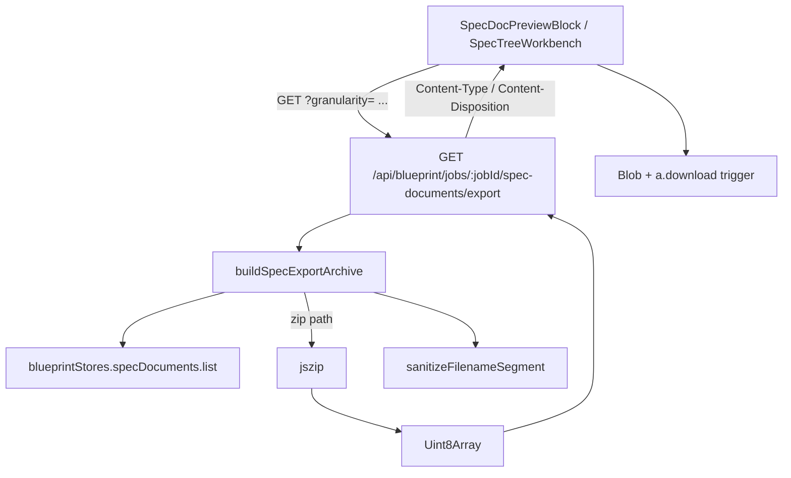

# 设计文档：Autopilot SPEC Document Export

## 概述

把 `BlueprintSpecDocument.content` 暴露为可下载文件的最小切片：后端
新增一个 GET 路由根据 `granularity / nodeId / type` 三参数返回 markdown
或 zip；前端在 `SpecDocPreviewBlock` 与 `SpecTreeWorkbench` 各自加按钮，
通过 fetch + `URL.createObjectURL` + `<a download>` 触发浏览器下载。

不改 `BlueprintSpecDocument` 数据形态、不修改 prompt / parser / runtime
主线、不引入新顶层依赖。zip 复用既有 `jszip` 依赖。

## 架构



数据流：

1. 用户在 `SpecDocPreviewBlock` / `SpecTreeWorkbench` 点击导出按钮
2. 前端调用 `fetch('/api/blueprint/jobs/<jobId>/spec-documents/export?...')`
3. 服务端 `Route` 读取 query 参数，校验 granularity 枚举 + 必要字段
4. `Service` 从 `blueprintStores.specDocuments.list({ jobId })` 拿到 `BlueprintSpecDocument[]`
5. 按 granularity 分流：
   - `single` → 直接把 content 作为 `text/markdown` 响应体写出
   - `node` / `tree` → 调 `jszip` 组装文件 + `MANIFEST.json`，返回 `application/zip`
6. 前端读 `response.blob() + Content-Disposition` 头解析 filename，触发下载

## 组件与接口

### 1. shared / 类型导出（无新增）

不新增 `shared/blueprint/contracts.ts` 字段；仅在 `client/src/lib/blueprint-api/`
添加导出 helper（如 `exportSpecDocuments(...)`）。

### 2. 后端：服务层 `server/routes/blueprint/spec-documents/export-archive.ts`（新增）

```typescript
export type SpecExportGranularity = "single" | "node" | "tree";

export interface SpecExportRequest {
  jobId: string;
  granularity: SpecExportGranularity;
  nodeId?: string;
  type?: BlueprintSpecDocumentType;
}

export interface SpecExportArchiveResult {
  /** "text/markdown; charset=utf-8" 或 "application/zip"。 */
  contentType: string;
  /** 用于 Content-Disposition 的 ASCII filename。 */
  filename: string;
  /** 单文档 markdown 时为 string；zip 时为 Uint8Array。 */
  body: string | Uint8Array;
}

/**
 * 把 BlueprintSpecDocument[] 组装成可下载产物。永不抛错；找不到资源
 * 时返回 { kind: "not_found", message }，由 route 层映射到 HTTP 404。
 * 参数缺失时返回 { kind: "invalid_request", message } → HTTP 400。
 */
export type BuildSpecExportResult =
  | { kind: "ok"; archive: SpecExportArchiveResult }
  | { kind: "not_found"; message: string }
  | { kind: "invalid_request"; message: string };

export async function buildSpecExportArchive(
  request: SpecExportRequest,
  deps: {
    listSpecDocuments: (jobId: string) => Promise<BlueprintSpecDocument[]>;
    listJobs: () => Promise<BlueprintGenerationJob[]>;
    now: () => Date;
  },
): Promise<BuildSpecExportResult>;
```

### 3. 后端：纯函数 `sanitizeFilenameSegment`（新增）

```typescript
/**
 * 把 raw 字符串转成可放进文件名的安全片段。
 * - 替换 < > : " / \ | ? * 为 "-"
 * - 把连续空白合并成单个 "_"
 * - 去首尾空白，截断到 80 字符
 * - 空结果用 "untitled"
 */
export function sanitizeFilenameSegment(raw: string): string;
```

### 4. 后端：路由扩展 `server/routes/blueprint.ts`

在既有 spec-documents 路由附近挂载新 GET 端点：

```typescript
router.get(
  "/jobs/:jobId/spec-documents/export",
  async (req, res) => {
    const result = await buildSpecExportArchive(
      {
        jobId: req.params.jobId,
        granularity: req.query.granularity as string,
        nodeId: typeof req.query.nodeId === "string" ? req.query.nodeId : undefined,
        type: typeof req.query.type === "string" ? req.query.type : undefined,
      },
      { listSpecDocuments, listJobs, now: deps.now },
    );

    if (result.kind === "invalid_request") {
      return res.status(400).json({ error: result.message });
    }
    if (result.kind === "not_found") {
      return res.status(404).json({ error: result.message });
    }

    res.setHeader("Content-Type", result.archive.contentType);
    res.setHeader(
      "Content-Disposition",
      `attachment; filename="${result.archive.filename}"`,
    );
    if (typeof result.archive.body === "string") {
      res.send(result.archive.body);
    } else {
      res.send(Buffer.from(result.archive.body));
    }
  },
);
```

### 5. 前端：导出 API 客户端 `client/src/lib/blueprint-api/exportSpecDocuments.ts`（新增）

```typescript
export interface ExportSpecDocumentsArgs {
  jobId: string;
  granularity: "single" | "node" | "tree";
  nodeId?: string;
  type?: "requirements" | "design" | "tasks";
  signal?: AbortSignal;
}

/**
 * 调用后端导出路由并触发浏览器下载。
 * 失败时 throw（含描述性 message）；调用方负责把错误归一到 UI inline 状态。
 * 不依赖 jsdom；通过 document.createElement("a") + URL.createObjectURL 触发下载。
 */
export async function exportSpecDocumentsToDownload(
  args: ExportSpecDocumentsArgs,
): Promise<void>;
```

### 6. 前端：单文档下载按钮（在 `SpecDocPreviewBlock.tsx` 内联）

无独立组件；在 `document` 存在分支的 type badge 行追加一个 `<button>`，
带 `data-testid="spec-doc-export-button"` 与 `onClick(stopPropagation)`，
内部状态机 `idle | downloading | error`：

```typescript
const [exportState, setExportState] = useState<"idle" | "downloading" | "error">("idle");
```

### 7. 前端：节点 / 树级导出按钮（在 `SpecTreeWorkbench.tsx` 内联）

- 节点级：`SpecTreeNodeRow` 展开区底部加 `导出本节点 .zip` 按钮，
  `data-testid="spec-tree-node-export-button"`。
- 整树级：`SpecTreeWorkbench` 顶部 CTA 行追加 `导出全部 SPEC` 按钮，
  `data-testid="spec-tree-workbench-export-all"`。

两者复用 `exportSpecDocumentsToDownload` 与同样的 `idle | downloading | error`
状态机。整树按钮当 `Array.from(docsByNodeId.values()).every(arr => arr.length === 0)`
时 disabled。

## 数据模型

无新增持久化字段。仅引入服务端临时 `BuildSpecExportResult` 与
`SpecExportArchiveResult`，request scope 内消亡。

zip 内 `MANIFEST.json` 形态：

```json
{
  "jobId": "<job uuid>",
  "exportedAt": "2026-05-14T01:23:45.000Z",
  "granularity": "tree",
  "nodeIds": ["root-node-id", "module-a", "..."],
  "documents": [
    {
      "nodeId": "root-node-id",
      "nodeTitle": "Original node title",
      "type": "requirements",
      "filename": "Original-node-title/requirements.md",
      "generationSource": "llm"
    }
  ]
}
```

## 正确性属性

### Property 1: Filename_Sanitizer 安全性

*For any* 任意 `string` 输入，`sanitizeFilenameSegment` 返回值必须满足：
- 不含字符 `< > : " / \ | ? *`
- 不以空白字符开头或结尾
- 长度 ≤ 80
- 输入为空字符串或全空白时返回 `"untitled"`

**Validates: Requirements 4.1**

### Property 2: 导出请求参数闭合

*For any* `SpecExportRequest`，若 `granularity` 不在枚举中，或
`granularity = single` 而 `nodeId` 或 `type` 缺失，或 `granularity = node`
而 `nodeId` 缺失，则 `buildSpecExportArchive` 必须返回
`{ kind: "invalid_request" }`，且不读取 store。

**Validates: Requirements 1.7**

### Property 3: 单文档导出内容字节相等

*For any* 已存在的 `(jobId, nodeId, type)`，`granularity = single` 路径
返回的 `archive.body` 必须等于 store 中对应 `BlueprintSpecDocument.content`
字符串（无 BOM、无截断、无重新编码）。

**Validates: Requirements 1.2**

### Property 4: 节点级 zip 包含全部已生成 type

*For any* 已存在的 `(jobId, nodeId)`，`granularity = node` 返回的 zip
必须恰好包含该节点已生成的全部 `requirements / design / tasks`
markdown，每个文件的内容等于对应 `BlueprintSpecDocument.content`，
zip 内目录结构为 `<sanitized-node-title>/<type>.md` + `MANIFEST.json`。

**Validates: Requirements 1.3, 1.9**

### Property 5: 整树 zip 完整性

*For any* `granularity = tree` 请求，zip 必须包含 store 中该 job 全部
`BlueprintSpecDocument`，每个文件路径为
`<sanitized-node-title>/<type>.md`，文件总数等于
`documents.length + 1`（额外一份 `MANIFEST.json`）。

**Validates: Requirements 1.4, 1.9**

## 错误处理

| 场景 | 状态码 | 响应体 |
| --- | --- | --- |
| job 不存在 | 404 | `{ error: "blueprint job not found", jobId }` |
| single 文档不存在 | 404 | `{ error: "spec document not found", jobId, nodeId, type }` |
| node 节点 0 文档 / tree 0 文档 | 404 | `{ error: "no spec documents to export", jobId, nodeId? }` |
| granularity 缺失或越界 | 400 | `{ error: "granularity must be one of single, node, tree" }` |
| single 缺 nodeId/type | 400 | `{ error: "single export requires nodeId and type" }` |
| node 缺 nodeId | 400 | `{ error: "node export requires nodeId" }` |
| zip 组装抛错（理论上 jszip 不抛） | 500 | `{ error: "failed to build export archive" }` |

前端：
- 任何 4xx / 5xx / 网络错误 → 状态机进入 `error`，按钮恢复 enabled，
  显示一个 8px tooltip / inline 文案提示失败原因
- 不抛进 React 树外，不破坏 workbench

脱敏：导出 zip / markdown 内容直接来自 store，已在生成路径做过脱敏；
导出层不做二次脱敏，避免内容意外被改写。

## 测试策略

### 单元测试

- `server/routes/blueprint/__tests__/sanitize-filename-segment.test.ts`
  - 6 用例：保留字符替换 / 空白合并 / 截断 80 / 空结果 / 全 emoji /
    Windows 保留字符 + 中文混排
- `server/routes/blueprint/__tests__/spec-documents-export-archive.test.ts`
  - 单文档 happy / single 缺字段 / single 文档不存在
  - 节点级 happy / 节点级 0 文档
  - 整树 happy / 整树空 job
  - granularity 越界 / job 不存在
- `server/tests/blueprint-routes.test.ts` 追加 1 条端到端：
  发起 `tree` granularity，验证响应 Content-Type / Content-Disposition
  / zip 内文件数

### 前端测试

- `client/src/pages/autopilot/right-rail/spec-tree-workbench/__tests__/SpecDocPreviewBlock.test.tsx`
  追加 3 用例：
  - document 存在 → 渲染 export button + aria-label
  - document undefined → 不渲染 export button
  - downloading 状态 → 按钮 aria-disabled
- `client/src/lib/blueprint-api/__tests__/exportSpecDocuments.test.ts`
  覆盖：成功路径调用 `fetch` 并触发 a.click；失败抛错；解析
  `Content-Disposition` filename。
- 不引入 jsdom；用 `vi.fn()` mock fetch + 局部 patch
  `document.createElement` 即可。

### 回归命令

```bash
node ./node_modules/vitest/vitest.mjs run \
  server/routes/blueprint/__tests__/sanitize-filename-segment.test.ts \
  server/routes/blueprint/__tests__/spec-documents-export-archive.test.ts \
  server/tests/blueprint-routes.test.ts \
  --config vitest.config.server.ts

node ./node_modules/vitest/vitest.mjs run \
  client/src/pages/autopilot/right-rail/spec-tree-workbench/__tests__ \
  client/src/lib/blueprint-api/__tests__/exportSpecDocuments.test.ts

node --run check  # 期望 116
```

### 不做事项

- 不引入 new top-level npm dependency；继续用 `jszip`。
- 不改 `BlueprintSpecDocument.content` 字段。
- 不引入 jsdom / @testing-library/react。
- 不修改受保护文件。
