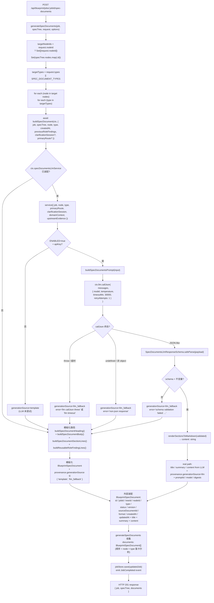
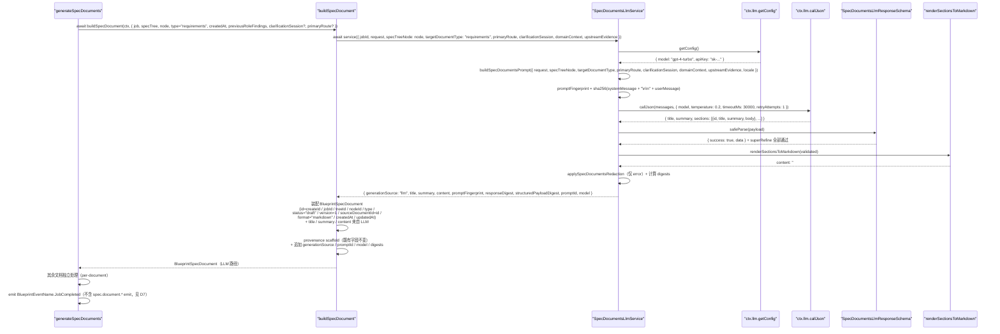
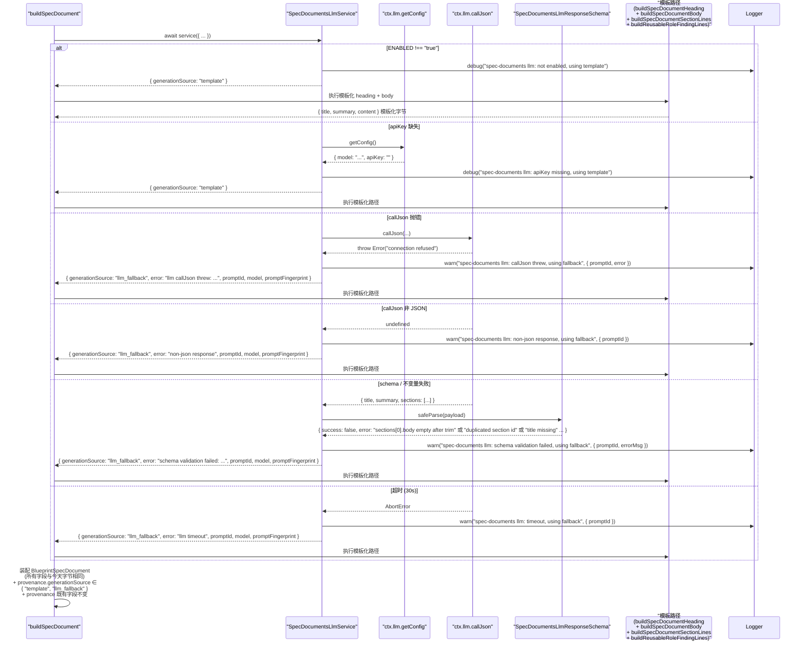

# 设计文档：Autopilot SPEC Documents LLM 驱动生成

## 1. 设计概述

本 spec 把 `/autopilot` 的 **SPEC Documents 生成阶段**从当前 `server/routes/blueprint.ts` 的 `generateSpecDocuments()`（~第 8571 行）+ `buildSpecDocument()`（~第 11704 行）+ `buildSpecDocumentHeading()` + `buildSpecDocumentBody()` + `buildSpecDocumentSectionLines()` + `buildReusableRoleFindingLines()` 联合产出的硬编码 Markdown 文档，升级为由 `BlueprintServiceContext.llm.callJson` 按 `(nodeId, type)` 对**逐份**发起 LLM 推理、通过严格 zod schema 校验后渲染为稳定 Markdown 的结构化产物；在 LLM 不可用 / apiKey 缺失 / callJson 抛错 / 非 JSON / schema 不过 / 文档不变量违反（`sections` 为空、`sections.id` 不唯一、`body` trim 后为空、字段越界、`status` 不可解析等）/ 超时任一情况下，**完全复用**既有 `buildSpecDocument()` / `buildSpecDocumentHeading()` / `buildSpecDocumentBody()` / `buildSpecDocumentSectionLines()` / `buildReusableRoleFindingLines()` 作为确定性 fallback 路径。

本 spec 是 `autopilot-routeset-llm-generation`（RouteSet LLM）与 `autopilot-spec-tree-llm`（SPEC Tree LLM，直接上游 spec）之后的**下一阶段**，负责把 SPEC Tree → SPEC Documents 这一步从「模板派生」真正升级为「LLM 派生」。整体实现模式完全复用前两条姊妹 spec 已经验证过的同一条主线：`ctx.llm.callJson` → strict zod schema（含 `.superRefine()` 跨字段不变量）→ 成功路径返回 LLM 渲染文档 / 失败路径回退到模板 → 在 `BlueprintSpecDocument.provenance` 追加 `generationSource` / `promptId` / `model` / `error` 可选字段。

### 1.1 与姊妹 spec 的本质差异

| 维度 | routeset LLM spec | spec-tree LLM spec（直接上游） | **spec-documents LLM（本 spec）** |
| --- | --- | --- | --- |
| 产出 JSON 内容 | 单次调用产出 `routes: Array<{...}>`（平铺） | 单次调用产出整棵 `nodes: Array<{id, parentId?, ...}>`（嵌套树） | **每份文档一次独立调用**；产出 `title / summary / sections: Array<{id, title, summary, body}>` |
| 调用单位 | 整个 RouteSet 一次 | 整棵 SPEC Tree 一次 | **每个 `(nodeId, type)` 对一次**；一次 `generateSpecDocuments()` 请求可能触发 N × M 次独立 LLM 调用 |
| 输入依赖 | `intake + clarificationSession + githubUrls` | 多 + `routeSet + primaryRoute`（RouteSet 已落地） | **多 + `specTreeNode`（文档归属的 SPEC Tree 节点）+ `primaryRoute` + 可选 `upstreamEvidence` 摘要** |
| 下游消费 | SPEC Tree、Sandbox Derivation、Agent Crew | SPEC Documents、Effect Preview、Prompt Package、Engineering Handoff | **Effect Preview / Prompt Package / Engineering Handoff（作为 `sourceDocumentId`）、SPEC Document 审阅 / 版本化 / 接受 / 拒绝链路** |
| Schema 难点 | `kind` 枚举、primary 唯一 | 节点 `id` 全树唯一、`parentId` 可解析、深度 ≤ 4、节点总数 ∈ [3..50]（`.superRefine()` 多条） | **`sections.id` 文档内唯一（`.superRefine()`）、`sections` 长度 ∈ [2..20]、`body` 1..8000 字符、`title` / `summary` / 每个 `section.body` trim 后非空** |
| Fallback 数据源 | `buildTemplatedRoutes()`（RouteSet spec 内 helper） | `buildSpecTreeFromRouteSet()` + `createDownstreamSpecTreeNodes()` 联合产出 | **`buildSpecDocument()` + `buildSpecDocumentHeading()` + `buildSpecDocumentBody()` + `buildSpecDocumentSectionLines()` + `buildReusableRoleFindingLines()` 联合产出**（一行不改） |
| 事件 payload | `route.generated` | 复用既有 `spec.tree.updated` / `spec.tree.versioned`（若已 emit） | **不新增事件名**；`generateSpecDocuments()` 主路径当前仅 emit `JobCompleted`，未 emit `spec.document.*`（grep 确认），因此 provenance 字段足够（需求 6.2） |
| 混合 provenance | N/A（单次调用） | N/A（单次调用） | **多份文档彼此独立**：一次请求中部分走 LLM 成功、部分走 fallback 时，各自 provenance 独立、响应体 `documents[*]` 数组顺序保持今天口径（需求 5.6 / 4.7） |
| 测试 | +2 E2E + 子域单测 | +2 E2E + ~40 co-located 单测 | **+2 E2E + ~30-40 co-located 单测**（最低硬需求：R9.1 两条 + R9.2 四条 = +6） |

### 1.2 最低可接受交付

当 `BlueprintServiceContext.llm.callJson` 可用且 LLM 为**某一份文档**返回通过 strict zod 校验的结构化结果时，该文档的最终产出满足：

- `BlueprintSpecDocument.content` 明显**不同**于模板化输出（不再是 `"## Summary"` + `"## Inputs"` + `"## Derived Content"` + `"## Reused Role Findings"` 固定骨架 + 每类型 3 行模板式 bullet），而是由 LLM 推导出的 `title / summary / sections` 渲染的 Markdown
- `BlueprintSpecDocument.title` 与 `BlueprintSpecDocument.summary` 同样来自 LLM
- `BlueprintSpecDocument.provenance.generationSource === "llm"`
- `BlueprintSpecDocument.provenance.promptId === "blueprint.spec-documents.v1"`
- `BlueprintSpecDocument.provenance.model` 等于 `ctx.llm.getConfig().model`
- `BlueprintSpecDocument.provenance.responseDigest` / `structuredPayloadDigest` / `promptFingerprint` 匹配 `/^sha256:[a-f0-9]{64}$/`
- `BlueprintSpecDocument.provenance.error` 为 `undefined`
- `BlueprintSpecDocument` 所有既有字段（`id` / `jobId` / `treeId` / `nodeId` / `type` / `status` / `version` / `sourceDocumentId` / `format` / `createdAt` / `updatedAt` / `reviewedAt?` / `acceptedAt?` / `rejectedAt?` / `reviewedBy?` / `reviewNote?`）形态完全符合现有 `BlueprintSpecDocument` 类型
- `BlueprintSpecDocument.provenance` 的既有字段（`jobId` / `projectId` / `sourceId` / `targetText` / `githubUrls` / `treeVersion` / `nodeType` / `nodeTitle` / `nodeSummary` / `dependencies` / `outputs` / `reusedRoleFindingIds?` / `reusedRoleIds?` / `reusedEvidenceIds?`）**一字段不改**

当 LLM 未注入 / apiKey 缺失 / callJson 抛错 / 非 JSON / schema 不过 / 文档不变量违反 / 超时时，该文档的最终产出满足：

- `BlueprintSpecDocument.title / summary / content` 与今天不走 LLM 的行为**字节级等价**（完全复用 `buildSpecDocument()` + `buildSpecDocumentBody()` + `buildSpecDocumentSectionLines()` + `buildReusableRoleFindingLines()` 的产出）
- `BlueprintSpecDocument.provenance.generationSource === "llm_fallback"`（当 LLM 被尝试过时）或 `"template"`（当 LLM 从未被尝试 / apiKey 未配置时）
- `BlueprintSpecDocument.provenance.error` 被脱敏后填充（仅 `"llm_fallback"` 情况下）
- 其它 `BlueprintSpecDocument` 既有字段与 provenance 既有字段与今天**字节相同**

当一次 `generateSpecDocuments()` 请求中部分文档走 LLM 成功、部分走 fallback 时：

- 响应体 `documents[*]` 数组的**顺序**、**长度**与 **`(nodeId, type)` 组合**与今天完全一致（需求 5.6）
- 每份文档的 `provenance.generationSource / promptId / model / error` **彼此独立**，不会因为其中一份走 fallback 而把其他走 LLM 成功的文档污染为 `"llm_fallback"`（需求 4.7）

_Requirements: 1.1, 1.2, 1.3, 1.4, 1.5, 1.6, 1.7_

### 1.3 环境变量门禁

- `BLUEPRINT_SPEC_DOCUMENTS_LLM_ENABLED=true` 开启本 LLM 路径（与 RouteSet / SPEC Tree / 四条桥 spec 同模式）
- 未设或设为其它值时，即使 `ctx.llm` 已装配，service 也直接走 fallback 模板路径，保证默认装配下既有 47 条 E2E + 48 条子域 co-located 单测 + 9 条 SDK smoke 零感知
- 单次 LLM 调用的墙钟上限通过 `BLUEPRINT_SPEC_DOCUMENTS_LLM_TIMEOUT_MS` 覆盖，默认 `30000`；非法值或 `> 30000` 时回退到 `30000`（需求 2.8）
- 环境变量命名与 RouteSet (`BLUEPRINT_ROUTESET_LLM_ENABLED`) / SPEC Tree (`BLUEPRINT_SPEC_TREE_LLM_ENABLED`) 独立，不交叉开关

### 1.4 严格限定范围

本 spec 严格限定在 `generateSpecDocuments()` → `buildSpecDocument()` 的数据派生路径上：

- 新增 `createSpecDocumentsLlmService(ctx)` 工厂，落地到 `server/routes/blueprint/spec-documents/` 目录，co-located 单元测试同目录
- **不修改** `createRouteGenerationSandboxDerivation()` / `buildSpecTreeFromRouteSet()` 或其它上游生成路径
- **不修改** `docker-analysis-sandbox` / `mcp-github-source` / `aigc-spec-node` / `role-system-architecture` 任一 capability adapter 的实际行为（需求 1.3 / 9.4）
- **不修改** RouteSet（已有 spec）、SPEC Tree（已有 spec）、Effect Preview、Prompt Package、Engineering Handoff 任一阶段的生成路径（需求 1.4 / 9.5）
- **不修改** `ctx.llm.callJson` 或 `ctx.llm.getConfig` 本身的实现；本 spec 只**消费**它们，不得 `import { callLLMJson }` 或 `import { getAIConfig }`（需求 7.1）
- **不修改** `shared/blueprint/contracts.ts` 中 `BlueprintSpecDocument` / `BlueprintSpecDocumentVersionSnapshot` / `BlueprintSpecDocumentType` / `BlueprintSpecDocumentStatus` 类型定义本身；仅**追加**可选 provenance 字段（需求 4.2 / 8.2）
- **不修改** `SpecDocumentWorkbenchPanel` 或前端任何 SPEC Document UI（需求 1.6）；`generationSource` 是否在前端可见属可选后续 UI spec
- **不修改** GitHub Pages 静态预览或浏览器端 runtime（需求 1.7）
- **不新增** `/api/*` 路由；HTTP 契约完全不变（需求 8.1）
- **不引入** property-based test（需求 9.3 明确锁定）。本轮新增 **2 条 E2E + ~30-40 条 co-located 单测**（最低硬需求：R9.1 + R9.2 = +6 条）
- 既有端到端 E2E 用例（47 条）、既有子域 co-located 单测（48 条）、既有 SDK smoke（9 条）**全部继续通过**，不重写既有断言（需求 8.3 / 8.5 / 9.6）

_Requirements: 1.1, 1.2, 1.3, 1.4, 1.5, 1.6, 1.7, 8.1, 8.2, 8.3, 8.4, 8.5, 9.4, 9.5, 9.6, 9.7, 9.8_


## 2. 架构决策（Key Decisions）

本 spec 的 D1-D10 与 RouteSet / SPEC Tree / 四条桥 spec 在同一坐标系下讨论；相同处复用结论并明确说明差异。

### D1：工厂模式 `createSpecDocumentsLlmService(ctx)`（per-document service）

```ts
export function createSpecDocumentsLlmService(
  ctx: BlueprintServiceContext
): SpecDocumentsLlmService;
```

工厂只接收 `BlueprintServiceContext`，从中读取 `ctx.llm.callJson` / `ctx.llm.getConfig` / `ctx.specDocumentsLlmPolicy` / `ctx.logger` / `ctx.now`。返回的 service 是纯异步函数 `(input) => Promise<SpecDocumentsLlmServiceOutput>`，**每次调用仅负责一份文档**（即单个 `(nodeId, type)` 对）。一次 `generateSpecDocuments()` 请求触发的 N × M 份文档 → N × M 次独立 service 调用，互不影响（需求 2.2）。

**硬约束**（与五条姊妹 spec 同款 code-review 规则，违反直接拒绝）：

- service 实现文件 SHALL NOT `import { callLLMJson } from "../../core/llm-client.js"`
- service 实现文件 SHALL NOT `import { getAIConfig } from "../../core/ai-config.js"`
- service 实现文件 SHALL NOT 调用模块级 `fetch()` 或 `import` 任何 LLM HTTP 客户端
- service 实现文件 SHALL NOT 硬编码 model 名 / provider 名 / temperature 默认值
- service 实现文件 SHALL NOT `import` 模块级 `eventBus` / `jobStore` 单例
- 所有 LLM 能力必须来自 `ctx.llm.callJson` + `ctx.llm.getConfig`

_Requirements: 7.1, 7.2, 7.3, 7.4, 7.5_

### D2：`BlueprintServiceContext` 最轻扩展

新增两个可选字段到 `BlueprintServiceContext` 与 `BlueprintServiceContextDeps`：

```ts
export interface BlueprintServiceContext {
  // ...既有字段（含 llm: { callJson, getConfig }、RouteSet / SPEC Tree / 4 条桥字段）...
  /** 本 service 安全 / schema 上界 / 脱敏策略；未注入时使用 createDefaultSpecDocumentsLlmPolicy() */
  specDocumentsLlmPolicy?: SpecDocumentsLlmPolicy;
  /** 本 service 实例本身；便于测试完全注入自定义 service */
  specDocumentsLlmService?: SpecDocumentsLlmService;
}
```

**默认装配策略**（与姊妹 spec D2 对齐）：

- 未注入 `specDocumentsLlmService` → `buildBlueprintServiceContext()` 自动装配 `createSpecDocumentsLlmService(ctx)`
- 环境变量 `BLUEPRINT_SPEC_DOCUMENTS_LLM_ENABLED !== "true"` → service 内部直接走 template 路径，不尝试调用 `callJson`
- `ctx.llm.getConfig().apiKey` 缺失 → service 内部直接走 template 路径，不尝试调用 `callJson`（与 SPEC Tree D2 对齐）
- 测试中通过 `buildBlueprintServiceContext({ llm: { callJson: fake, getConfig: () => ({ model, apiKey }) } })` 注入任意 fake LLM
- 测试中通过 `buildBlueprintServiceContext({ specDocumentsLlmService: fakeService })` 完全短路 LLM，用于锁定 service 外层行为

未注入 `specDocumentsLlmPolicy` 时使用 `createDefaultSpecDocumentsLlmPolicy()`（见 §4.3）。

_Requirements: 2.1, 7.1, 7.2, 7.3_

### D3：替换点在 `buildSpecDocument()` 调用链，不改 `generateSpecDocuments()` 外层编排

`buildSpecDocument()` 是今天 SPEC Document 内容构造的唯一入口（`generateSpecDocuments()` 在 `specTree.nodes.flatMap(...).targetTypes.map(type => buildSpecDocument({...}))` 中调用它）。本 spec 的改造方式是把它改为 **async 版本并内嵌 LLM 调用**，在 LLM 成功时用 LLM 产出的 `title / summary / sections` 渲染后的 Markdown 替换模板化的 `body` / `heading`：

```ts
// 旧签名（保持不变）
function buildSpecDocument(input: {...}): BlueprintSpecDocument;

// 新签名
async function buildSpecDocument(
  ctx: BlueprintServiceContext,
  input: {
    job: BlueprintGenerationJob;
    specTree: BlueprintSpecTree;
    node: BlueprintSpecTreeNode;
    type: BlueprintSpecDocumentType;
    createdAt: string;
    previousRoleFindings?: BlueprintRoleTimelineEntry[];
    clarificationSession?: BlueprintClarificationSession;
    domainContext?: BlueprintProjectDomainContext;
    primaryRoute?: BlueprintRouteCandidate;
  }
): Promise<BlueprintSpecDocument>;
```

实现内部：

1. 先不变地计算 `id` / `createdAt` / `sourceDocumentId` 等 scaffold
2. 调用 `await ctx.specDocumentsLlmService?.({ ...per-document input })`
3. 若 service 返回 `generationSource === "llm"` → 用 LLM 产出的 `title / summary / renderedContent` 替换模板化 `heading / node.summary / body`，provenance scaffold 追加 LLM 字段
4. 若 service 未装配或返回 fallback → 执行今天的模板化代码路径**一行不改**（`buildSpecDocumentHeading()` + `buildSpecDocumentBody()` + `buildSpecDocumentSectionLines()` + `buildReusableRoleFindingLines()`），并在 `provenance` 上标注 `generationSource === "template"` 或 `"llm_fallback"`

`generateSpecDocuments()` 本身的外层编排（`targetNodeIds` 过滤、`SPEC_DOCUMENT_TYPES` 默认值、`generatedDocumentKeys` / `preservedArtifacts` 计算、`job.artifacts` 拼装、`BlueprintEventName.JobCompleted` emit、`options.store.save(updatedJob)`、响应体装配）**一行不改**；只需要把内部的 `buildSpecDocument({...})` 同步调用改为 `await buildSpecDocument(ctx, {...})`，并把 `.flatMap(...)` 改为 `Promise.all(...)` 以保持同级并发。

**关键点**：

- LLM 调用的**单位是单份文档**（`(nodeId, type)` 对），不是整个 `generateSpecDocuments()` 请求；N × M 份文档 → N × M 次独立 service 调用（需求 2.2）
- 每份文档的 LLM 调用失败 **不影响**其他文档；混合 provenance 下响应体顺序、长度、`(nodeId, type)` 组合保持今天口径（需求 5.6）
- `BlueprintSpecDocument` 的 `id` / `jobId` / `treeId` / `nodeId` / `type` / `status` / `version` / `sourceDocumentId` / `format` / `createdAt` / `updatedAt` 由外层构造不变；**LLM 输出只取代 `title` / `summary` / `content` 三个字段**
- 既有 provenance 字段（`jobId` / `projectId` / `sourceId` / `targetText` / `githubUrls` / `treeVersion` / `nodeType` / `nodeTitle` / `nodeSummary` / `dependencies` / `outputs` / `reusedRoleFindingIds` / `reusedRoleIds` / `reusedEvidenceIds`）在 real / fallback / template 三条路径上都**保持与今天字节相同**（需求 2.7 / 4.2 / 5.4）

_Requirements: 2.2, 2.6, 2.7, 5.2, 5.4, 5.6_

### D4：超时上限锁定为 30 秒

需求 2.8 要求「单次 LLM 调用超时上限控制在 30 秒以内」。本 spec 将**单次（单份文档）LLM 调用 + zod 校验 + 文档不变量检查的总墙钟**锁定为 **30 秒**，通过环境变量 `BLUEPRINT_SPEC_DOCUMENTS_LLM_TIMEOUT_MS` 可覆盖（默认 `30000`，`> 30000` 或非法值时回退到 `30000`）。与 RouteSet / SPEC Tree / 四条桥 spec 对齐。

实现上通过 `ctx.llm.callJson` 自带的 `timeoutMs` 参数 + `retryAttempts: 1` 传入。`callLLMJson` 实现会在超时到达时抛 `AbortError`，service 捕获后 fallback 并填 `provenance.error = "llm timeout"`。

**注意：该 30s 上限是针对单份文档的**。一次 `generateSpecDocuments()` 请求生成 N × M 份文档时，总墙钟为 `O(max(每份超时))`（并发），而不是 `O(sum(每份超时))`（串行）。这与 `generateSpecDocuments()` 当前 `.flatMap(...)` 的同步编排语义（所有文档在同一 tick 内构造）保持一致；改为 `Promise.all(...)` 后，LLM 调用在不同 tick 并发执行，单文档超时仍 ≤ 30s。

_Requirements: 2.8, 5.1_

### D5：Prompt ID 锁定为 `blueprint.spec-documents.v1`（需求 3.1）

与 RouteSet spec 的 `blueprint.routeset.v1` / SPEC Tree spec 的 `blueprint.spec-tree.v1` / aigc-node 桥的 `blueprint.aigc-spec-node.v1` / role 桥的 `blueprint.role-architecture.v1` 命名对齐。稳定字符串版本标识，用于 provenance 追溯与回归测试锁定。prompt 结构 / response schema 发生向后不兼容变化时递增到 `v2`；仅字段示例 / 提示语微调不构成 bump。

常量定义位置：`server/routes/blueprint/spec-documents/prompt.ts` 的 `export const SPEC_DOCUMENTS_PROMPT_ID = "blueprint.spec-documents.v1"`。

_Requirements: 3.1_

### D6：Provenance 扩展策略

SPEC Document 的真相字段全部挂在 `BlueprintSpecDocument.provenance`（每份文档独立），不涉及 `BlueprintCapabilityInvocation` / `BlueprintCapabilityEvidence`（那是桥 spec 的真相源），也不涉及 `BlueprintSpecTree.provenance`（那是 SPEC Tree spec 的真相源）。本 spec 向 `BlueprintSpecDocument.provenance` **追加**以下可选字段（全部可选、不改既有字段）：

| 字段 | 类型 | 填充条件 |
| --- | --- | --- |
| `generationSource` | `"llm" \| "llm_fallback" \| "template"` | 总是填充；区分三种路径 |
| `promptId` | `string` | 当 `generationSource` ∈ `{"llm", "llm_fallback"}` 时填充（当 LLM 被尝试过） |
| `model` | `string` | 当 LLM 被调用过时填充 |
| `responseDigest` | `string` | Real 路径必然填充，形如 `sha256:...` |
| `structuredPayloadDigest` | `string` | Real 路径必然填充，形如 `sha256:...` |
| `promptFingerprint` | `string` | Real / fallback（LLM 被调用过时）均填充，形如 `sha256:...` |
| `error` | `string` | 仅 `generationSource === "llm_fallback"` 时填充，已脱敏 |

与 RouteSet / SPEC Tree / aigc-node / role 桥的命名口径严格对齐（需求 4.3）。既有 `provenance` 字段（`jobId` / `projectId` / `sourceId` / `targetText` / `githubUrls` / `treeVersion` / `nodeType` / `nodeTitle` / `nodeSummary` / `dependencies` / `outputs` / `reusedRoleFindingIds` / `reusedRoleIds` / `reusedEvidenceIds`）**一字段不改**（需求 4.2 / 4.5 / 4.6）。

**混合 provenance 保证**（需求 4.7）：一次 `generateSpecDocuments()` 请求中多份文档的 `provenance.generationSource / promptId / model / error` **彼此独立**；部分走 LLM 成功、部分走 fallback 不会互相污染。

**Adapter 命名（若在事件或 provenance 中携带）**：

| 路径 | adapter 字符串 | `generationSource` |
| --- | --- | --- |
| LLM 真跑 | `"blueprint.spec-documents.llm"` | `"llm"` |
| 模板化回退 / template | 不携带或保留既有命名 | `"llm_fallback"` / `"template"` |

Real 路径 adapter 不得包含 `.simulated` 子串（需求 4.4）。

_Requirements: 4.1, 4.2, 4.3, 4.4, 4.5, 4.6, 4.7_

### D7：事件复用既有 `BlueprintEventName`，不新增事件名

本 spec **不新增事件名**。`shared/blueprint/events.ts` 中已声明 `BlueprintEventName.SpecDocumentVersioned: "spec.document.versioned"` 与 `BlueprintEventName.SpecDocumentReviewed: "spec.document.reviewed"`，但经 grep 确认 `server/routes/blueprint.ts` 的 **`generateSpecDocuments()` 主路径当前并未 emit 任一 `spec.document.*` 事件**——主路径只 emit 一条 `BlueprintEventName.JobCompleted`，payload 为 `{ specTreeId, nodeCount, documentCount }`。

因此本 spec 的事件策略明确为：

1. **不单独新增事件名**（需求 6.2 明确允许此降级）
2. **不为本 spec 在 `generateSpecDocuments()` 主路径新增 `spec.document.*` emit 点**；该 emit 点的引入属于独立 UI / observability spec 的范围
3. SPEC Document 的 `generationSource` 仅通过 **`BlueprintSpecDocument.provenance`** 暴露给下游（Effect Preview / Prompt Package / Engineering Handoff / Artifact Replay）
4. **如果** design / tasks 阶段发现 `JobCompleted` event payload 是 SPEC Document 生成结果的自然落点，可在其 payload 上**追加可选字段**（例如 `documentGenerationSources: Array<{ nodeId, type, generationSource }>`），但这不是必须项；当前最低可接受交付不要求（需求 6.5）

**所有新增字段都是可选字段**（需求 6.5），既有订阅者不会因字段追加而断言失败。所有事件 `type` 仍由 `BlueprintEventName` 常量构造（需求 6.4），实现文件 SHALL NOT 出现裸字符串 `"spec.document.versioned"` / `"spec.document.reviewed"`。

与 SPEC Tree spec §D7 的判断完全同理。

_Requirements: 6.1, 6.2, 6.3, 6.4, 6.5_

### D8：Strict zod schema + `.superRefine()` 跨字段不变量

本 spec 的 schema 比 RouteSet（平铺 `routes`）简单，比 SPEC Tree（嵌套树 + 深度 / 循环 / 连通性）简单，但仍需 `.superRefine()` 处理**文档内 `sections.id` 唯一性**约束。

**顶层字段约束**：

- `title: string`，1..200 字符（trim 后非空）
- `summary: string`，1..500 字符（trim 后非空）
- `sections: Array<SectionSchema>`，长度 2..20
- `status?: BlueprintSpecDocumentStatus` 可选（受限于 `{ draft, reviewing, accepted, rejected }` 等既有集合）

**Section 级约束**：

- `id: string`，匹配 `/^[a-z][a-z0-9-]{0,63}$/`（lowercase kebab-case，1..64 字符）
- `title: string`，1..200 字符（trim 后非空）
- `summary: string`，1..500 字符（trim 后非空）
- `body: string`，1..8000 字符（trim 后非空）

**文档级不变量**（`.superRefine()` 跨字段）：

- **`sections` 数组非空**（长度 ≥ 2 已由顶层 `.min(2)` 保证；此处冗余断言不变量被引用方注意）
- **所有 `sections[*].id` 在同一份文档内唯一**（不区分大小写；trim 后比较）
- **`title` / `summary` / 每个 `section.title` / `section.summary` / `section.body` trim 后非空**（`.min(1)` 无法覆盖全空格字符串，需 superRefine）
- **`status`（若提供）必须落入 `BlueprintSpecDocumentStatus` 的受支持集合**

**Schema 结构**（见 §4.4 详细展开）：

```ts
const SpecDocumentsLlmSectionSchema = z.object({
  id: z.string().regex(/^[a-z][a-z0-9-]{0,63}$/),
  title: z.string().min(1).max(200),
  summary: z.string().min(1).max(500),
  body: z.string().min(1).max(8000),
});

export const SpecDocumentsLlmResponseSchema = z
  .object({
    title: z.string().min(1).max(200),
    summary: z.string().min(1).max(500),
    sections: z.array(SpecDocumentsLlmSectionSchema).min(2).max(20),
    status: z.enum(["draft", "reviewing", "accepted", "rejected", ...]).optional(),
  })
  .superRefine((data, ctx) => {
    // 1) title trim 后非空
    // 2) summary trim 后非空
    // 3) sections[*].id 唯一（trim + 大小写不敏感）
    // 4) sections[*].title / summary / body trim 后非空
    // 5) status（若提供）落入受支持集合
  });
```

**字段处置策略**：

| 场景 | schema 行为 |
| --- | --- |
| `title` / `summary` / `sections` 缺失 | fail → fallback |
| `sections.length < 2` 或 `> 20` | fail → fallback |
| `section.id` 不匹配正则 | fail → fallback |
| `section.id` 在同一文档内重复 | fail（`.superRefine()` 触发） → fallback |
| `section.body.length > 8000` | fail（顶层 `.max`） → fallback |
| `title` / `summary` / `section.*` 超限 | fail → fallback |
| trim 后全空格 | fail（`.superRefine()`） → fallback |
| `status` 不可解析 | fail（zod enum） → fallback |
| 未声明的 section 顶层字段 | 静默丢弃（zod 默认 strip） |
| 未声明的顶层响应字段 | 静默丢弃 |

**注意**：`SpecDocumentsLlmResponseSchema` 使用 `z.object({...}).superRefine(...)` 而非 `.strict()`。未知字段静默丢弃（需求 3.6），与 RouteSet / SPEC Tree / role 桥 schema 风格对齐。

**不做 coerce / normalize 在 zod 层面**（需求 3.3 / 3.4）：禁止 `z.string().or(z.number()).transform(...)` 这类 zod transform 链。所有字段要么严格匹配，要么 fallback。**但** zod 校验通过后，在 `buildRealOutput` 内部做一次规范化（需求 3.6）：trim `title` / `summary` / `section.title` / `section.summary` / `section.body` 首尾空白、强制 `status` 落回受支持集合（若提供）、裁剪过长字符串至 schema 允许的上界（防御性，schema 已限长）。

_Requirements: 3.1, 3.2, 3.3, 3.4, 3.5, 3.6, 5.1_

### D9：脱敏走本 spec 独立的 `applySpecDocumentsRedaction` 纯函数

**决策**：本 spec 实现独立的轻量 `applySpecDocumentsRedaction(text, policy)` 纯函数，覆盖：

- API key 正则（`sk-[A-Za-z0-9]{20,}` / `clp_[A-Za-z0-9]{20,}` / `gh[pousr]_[A-Za-z0-9]{36,255}` / `github_pat_[A-Za-z0-9_]{22,255}`）
- Authorization / Bearer / token= / api_key= 等 key-value 对
- 邮箱正则

**关键使用点**（防御性）：

1. `provenance.error`：从 `zod error.message` / LLM 抛错 message / 超时原因派生，进入前过脱敏
2. `logger.warn` meta：任何 `{ promptId, errorMsg }` 字段进入前过脱敏
3. `BlueprintSpecDocument.title` / `summary` / `content`（LLM 产出的 Markdown）：**不**强制脱敏原文——下游 Effect Preview / Prompt Package / Engineering Handoff 需要完整字段；schema prompt 侧已约束 LLM 不得返回真实凭据字面量；LLM 响应若被迫包含敏感串仍会落库，但发生概率极低且与 RouteSet / SPEC Tree / role 桥一致
4. `promptFingerprint` / `responseDigest` / `structuredPayloadDigest`：SHA-256 of 未脱敏原文（digest 无泄漏风险）

**为什么不把 `content` 原文也脱敏**：与 SPEC Tree D9 / role 桥 D10 同论据——下游 Effect Preview / Prompt Package 需要完整文档内容；脱敏会破坏产品体验。通过 prompt 约束（见 §4.5）要求 LLM 对敏感标识抽象化，作为风险缓解。

_Requirements: 4.1（error 文本脱敏子项）_

### D10：测试默认装配 ≡ 生产行为

核心兼容性保证：**默认测试装配 ≡ 今天的生产行为**（需求 8.6）。

- 既有 E2E **不设** `BLUEPRINT_SPEC_DOCUMENTS_LLM_ENABLED` 环境变量 → service 早退 → template 路径 → 输出与今天模板化路径字节级等价
- 即便设了 `ENABLED=true`，既有 E2E **不对 `callLLMJson` 预设针对 SPEC Documents 的 mock**（RouteSet / SPEC Tree / 桥 spec 只注入各自相关的 LLM mock）→ callJson 为 SPEC Documents prompt 调用时返回 undefined → service 进入 fallback → 字节级等价
- 既有 E2E 断言的 SPEC Document 字段（`title === "Requirements: ${nodeTitle}"` / `"Design: ${nodeTitle}"` / `"Tasks: ${nodeTitle}"`、`content` 起始 `# Requirements: ...` + 固定段落 `## Summary` / `## Inputs` / `## Derived Content` / `## Reused Role Findings`）在 fallback / template 路径下全部满足
- `BlueprintSpecDocumentsResponse.documents[*]` 数组顺序在 fallback 路径下与今天完全相同（需求 5.6）

唯一需要主动 mock 的只有本 spec 新增的 2 条 E2E（R9.1）与 4 条硬需求单测（R9.2）。

_Requirements: 8.1, 8.3, 8.4, 8.6_


## 3. 架构（High-Level Design）

### 3.1 系统数据流（Mermaid）



### 3.2 Happy path 时序图（real LLM execution，单份文档）



### 3.3 Fallback 时序图（单份文档）



_Requirements: 2.1, 2.2, 2.6, 2.7, 2.8, 3.5, 4.1, 4.5, 4.6, 4.7, 5.1, 5.2, 5.3, 5.4, 5.5, 5.6_


## 4. 组件与接口（Low-Level Design）

### 4.1 文件布局

```
server/routes/blueprint/spec-documents/
  ├── service.ts                        # 新增：createSpecDocumentsLlmService(ctx) 工厂 + 主算法
  ├── service.test.ts                   # 新增：R9.2 四条硬需求 + 补充（not-enabled / timeout / redaction / empty body / duplicate section id）
  ├── policy.ts                         # 新增：SpecDocumentsLlmPolicy + createDefault + applySpecDocumentsRedaction
  ├── policy.test.ts                    # 新增：policy + redaction 纯函数测试
  ├── prompt.ts                         # 新增：buildSpecDocumentsPrompt + SPEC_DOCUMENTS_PROMPT_ID
  ├── prompt.test.ts                    # 新增：prompt 确定性 + locale 分支 + 三类 document type 分支测试
  ├── schema.ts                         # 新增：SpecDocumentsLlmResponseSchema strict zod + .superRefine 不变量
  ├── schema.test.ts                    # 新增：schema 各种 valid/invalid 分支 + 文档不变量
  ├── render.ts                         # 新增：renderSectionsToMarkdown 纯函数
  └── render.test.ts                    # 新增：Markdown 渲染确定性测试

server/routes/blueprint/context.ts       # 修改（仅追加两个可选字段与默认装配）：
                                         #   - BlueprintServiceContext 追加:
                                         #       specDocumentsLlmPolicy?: SpecDocumentsLlmPolicy
                                         #       specDocumentsLlmService?: SpecDocumentsLlmService
                                         #   - BlueprintServiceContextDeps 追加同样字段
                                         #   - buildBlueprintServiceContext 默认装配 createSpecDocumentsLlmService(ctx)

server/routes/blueprint.ts               # 修改（最小侵入）：
                                         #   - buildSpecDocument() 改为 async(ctx, input)
                                         #   - generateSpecDocuments() 内部 .flatMap + .map 改为 async + Promise.all
                                         #   - generateSpecDocuments() 改为 async，其 HTTP handler 调用点追加 await
                                         #   - input 追加 clarificationSession? / domainContext? / primaryRoute? 透传
                                         #   - 在模板化 heading + body 之前 await ctx.specDocumentsLlmService?.(...)
                                         #   - LLM 成功 → 用 LLM title / summary / content 替换模板化产出
                                         #   - LLM 失败或未装配 → 走今天的模板化路径一行不改
                                         #   - provenance 新字段以可选方式追加

shared/blueprint/contracts.ts            # 修改（仅追加可选字段）：
                                         #   - BlueprintSpecDocument.provenance 追加可选:
                                         #       generationSource?: "llm" | "llm_fallback" | "template"
                                         #       promptId?: string
                                         #       model?: string
                                         #       responseDigest?: string
                                         #       structuredPayloadDigest?: string
                                         #       promptFingerprint?: string
                                         #       error?: string

server/tests/blueprint-routes.test.ts    # 修改（只追加，不改写）：
                                         #   + 2 条新 E2E 用例：
                                         #     (a) Real LLM path
                                         #     (b) Fallback path
```

_Requirements: 1.2, 7.1, 7.2_

### 4.2 核心类型定义（`service.ts`）

```ts
import type { BlueprintServiceContext } from "../context.js";
import type {
  BlueprintClarificationSession,
  BlueprintGenerationJob,
  BlueprintGenerationRequest,
  BlueprintProjectDomainContext,
  BlueprintRouteCandidate,
  BlueprintSpecDocumentStatus,
  BlueprintSpecDocumentType,
  BlueprintSpecTreeNode,
} from "../../../../shared/blueprint/index.js";

/**
 * service 的单次调用输入（单份文档）。
 * 一次 generateSpecDocuments() 请求的 N × M 份文档 → N × M 次独立 service 调用。
 */
export interface SpecDocumentsLlmServiceInput {
  jobId: string;
  job: BlueprintGenerationJob;
  request: BlueprintGenerationRequest;
  /** 目标 SPEC Tree 节点；每份文档绑定到唯一节点 */
  specTreeNode: BlueprintSpecTreeNode;
  /** 目标文档类型：requirements / design / tasks */
  targetDocumentType: BlueprintSpecDocumentType;
  /** 该节点关联的主路线（routeId 解析；若节点未关联 route 则为 undefined） */
  primaryRoute?: BlueprintRouteCandidate;
  clarificationSession?: BlueprintClarificationSession;
  domainContext?: BlueprintProjectDomainContext;
  /** 可选上游证据：当前 collectReusableRoleFindings() 返回的 BlueprintRoleTimelineEntry[] */
  upstreamEvidence?: {
    reusableRoleFindings: Array<{ id: string; label: string; summary: string }>;
  };
  createdAt: string;
}

/**
 * service 的单次调用输出。
 * Real path: 返回 title / summary / content + provenance 扩展字段
 * Fallback path: 返回 generationSource / error / 可选 promptId / model；title / summary / content 为 undefined（由外层走模板路径）
 * Template path: 返回 generationSource="template"；其它字段全 undefined
 */
export interface SpecDocumentsLlmServiceOutput {
  generationSource: "llm" | "llm_fallback" | "template";
  /** Real path 下填充；fallback / template 路径下 undefined */
  title?: string;
  summary?: string;
  content?: string;
  /** Real path 可选填充；LLM 返回的 status（已规范化）；若 LLM 未返回则 undefined */
  status?: BlueprintSpecDocumentStatus;
  /** Real / fallback 有 LLM 调用时填充 */
  promptId?: string;
  model?: string;
  promptFingerprint?: string;
  /** Real path 必填 */
  responseDigest?: string;
  structuredPayloadDigest?: string;
  /** llm_fallback 路径填充 */
  error?: string;
}

export type SpecDocumentsLlmService = (
  input: SpecDocumentsLlmServiceInput
) => Promise<SpecDocumentsLlmServiceOutput>;

export function createSpecDocumentsLlmService(
  ctx: BlueprintServiceContext
): SpecDocumentsLlmService;
```

_Requirements: 2.1, 2.2, 2.3, 2.6, 7.1, 7.2, 7.4_

### 4.3 Policy 类型（`policy.ts`）

```ts
export interface SpecDocumentsLlmPolicy {
  /** 单次 LLM 调用 + 校验的总墙钟上限；不超过 30_000 */
  maxInvocationTimeoutMs: number;
  /** 温度（保持确定性偏向） */
  temperature: number;
  /** retry attempts 传给 callJson */
  callJsonRetryAttempts: number;
  /** sections 数组下界 */
  minSectionCount: number;
  /** sections 数组上界 */
  maxSectionCount: number;
  /** 单 section.body 最大长度 */
  maxSectionBodyLength: number;
  /** title 最大长度 */
  maxTitleLength: number;
  /** summary 最大长度 */
  maxSummaryLength: number;
  /** section.id 最大长度 */
  maxSectionIdLength: number;
  /** section.title 最大长度 */
  maxSectionTitleLength: number;
  /** section.summary 最大长度 */
  maxSectionSummaryLength: number;
  /** 脱敏：key 级敏感关键词（大小写不敏感） */
  redactionKeywords: readonly string[];
  /** 脱敏：email 正则 */
  redactedEmailPattern: RegExp;
  /** 脱敏：通用长字串 API key 正则 */
  redactedApiKeyPattern: RegExp;
  /** 脱敏：GitHub PAT 正则 */
  redactedGithubPatPattern: RegExp;
  /** error message 截断上界 */
  maxErrorLength: number;
}

export function createDefaultSpecDocumentsLlmPolicy(): SpecDocumentsLlmPolicy {
  const timeoutOverride = Number.parseInt(
    process.env.BLUEPRINT_SPEC_DOCUMENTS_LLM_TIMEOUT_MS ?? "",
    10
  );
  return {
    maxInvocationTimeoutMs:
      Number.isFinite(timeoutOverride) && timeoutOverride > 0 && timeoutOverride <= 30_000
        ? timeoutOverride
        : 30_000,
    temperature: 0.2,
    callJsonRetryAttempts: 1,
    minSectionCount: 2,
    maxSectionCount: 20,
    maxSectionBodyLength: 8_000,
    maxTitleLength: 200,
    maxSummaryLength: 500,
    maxSectionIdLength: 64,
    maxSectionTitleLength: 200,
    maxSectionSummaryLength: 500,
    redactionKeywords: [
      "authorization",
      "token",
      "api_key",
      "apikey",
      "secret",
      "password",
      "bearer",
      "access_token",
      "x-github-token",
      "openai-api-key",
    ],
    redactedEmailPattern: /[\w.+-]+@[\w.-]+/g,
    redactedApiKeyPattern: /\b(sk-[A-Za-z0-9]{20,}|clp_[A-Za-z0-9]{20,})\b/g,
    redactedGithubPatPattern:
      /\b(gh[pousr]_[A-Za-z0-9]{36,255}|github_pat_[A-Za-z0-9_]{22,255})\b/g,
    maxErrorLength: 400,
  };
}

export function applySpecDocumentsRedaction(
  value: string,
  policy: SpecDocumentsLlmPolicy
): string;
```

**环境变量**：`BLUEPRINT_SPEC_DOCUMENTS_LLM_TIMEOUT_MS` 允许覆盖默认 30s 上限（不超过 30s，否则忽略并 fallback 到 30s）。

_Requirements: 2.8, 3.4, 4.1（error 文本脱敏）_

### 4.4 Response Schema（`schema.ts`）

```ts
import { z } from "zod";
import type { BlueprintSpecDocumentStatus } from "../../../../shared/blueprint/index.js";

const SECTION_ID_PATTERN = /^[a-z][a-z0-9-]{0,63}$/;

/**
 * `BlueprintSpecDocumentStatus` 的已知受支持值子集。
 * LLM 返回的 `status` 只允许落在此集合；其它值直接 fail。
 */
const SUPPORTED_STATUSES = [
  "draft",
  "reviewing",
  "accepted",
  "rejected",
] as const satisfies readonly BlueprintSpecDocumentStatus[];

const SpecDocumentsLlmSectionSchema = z.object({
  id: z
    .string()
    .min(1)
    .max(64)
    .regex(SECTION_ID_PATTERN, "section.id must be lowercase kebab-case"),
  title: z.string().min(1).max(200),
  summary: z.string().min(1).max(500),
  body: z.string().min(1).max(8_000),
});

export const SpecDocumentsLlmResponseSchema = z
  .object({
    title: z.string().min(1).max(200),
    summary: z.string().min(1).max(500),
    sections: z.array(SpecDocumentsLlmSectionSchema).min(2).max(20),
    status: z.enum(SUPPORTED_STATUSES).optional(),
  })
  .superRefine((data, ctx) => {
    // (a) title / summary trim 后非空
    if (data.title.trim().length === 0) {
      ctx.addIssue({
        code: z.ZodIssueCode.custom,
        path: ["title"],
        message: "title must not be empty after trim",
      });
      return;
    }
    if (data.summary.trim().length === 0) {
      ctx.addIssue({
        code: z.ZodIssueCode.custom,
        path: ["summary"],
        message: "summary must not be empty after trim",
      });
      return;
    }

    // (b) 每个 section.title / summary / body trim 后非空
    for (let i = 0; i < data.sections.length; i++) {
      const section = data.sections[i];
      if (section.title.trim().length === 0) {
        ctx.addIssue({
          code: z.ZodIssueCode.custom,
          path: ["sections", i, "title"],
          message: "section.title must not be empty after trim",
        });
        return;
      }
      if (section.summary.trim().length === 0) {
        ctx.addIssue({
          code: z.ZodIssueCode.custom,
          path: ["sections", i, "summary"],
          message: "section.summary must not be empty after trim",
        });
        return;
      }
      if (section.body.trim().length === 0) {
        ctx.addIssue({
          code: z.ZodIssueCode.custom,
          path: ["sections", i, "body"],
          message: "section.body must not be empty after trim",
        });
        return;
      }
    }

    // (c) sections[*].id 唯一（trim + 大小写不敏感）
    const seen = new Set<string>();
    for (let i = 0; i < data.sections.length; i++) {
      const key = data.sections[i].id.trim().toLowerCase();
      if (seen.has(key)) {
        ctx.addIssue({
          code: z.ZodIssueCode.custom,
          path: ["sections", i, "id"],
          message: `duplicated section id="${data.sections[i].id}"`,
        });
        return;
      }
      seen.add(key);
    }
  });

export type SpecDocumentsLlmResponse = z.infer<typeof SpecDocumentsLlmResponseSchema>;
export type SpecDocumentsLlmSection = z.infer<typeof SpecDocumentsLlmSectionSchema>;
```

**字段处置策略**：见 §2.D8 已列出的处置矩阵；未声明字段静默丢弃。

_Requirements: 3.1, 3.2, 3.3, 3.4, 3.5_

### 4.5 Prompt 构造（`prompt.ts`）

```ts
export const SPEC_DOCUMENTS_PROMPT_ID = "blueprint.spec-documents.v1";

export interface SpecDocumentsPromptPayload {
  promptId: string;
  systemMessage: string;
  userMessage: string;
  userPayload: Record<string, unknown>;
  /** SHA-256 hex of systemMessage + "\n\n" + userMessage */
  promptFingerprint: string;
}

export interface BuildSpecDocumentsPromptInput {
  request: BlueprintGenerationRequest;
  specTreeNode: BlueprintSpecTreeNode;
  targetDocumentType: BlueprintSpecDocumentType;
  primaryRoute?: BlueprintRouteCandidate;
  clarificationSession?: BlueprintClarificationSession;
  domainContext?: BlueprintProjectDomainContext;
  upstreamEvidence?: {
    reusableRoleFindings: Array<{ id: string; label: string; summary: string }>;
  };
  locale: "zh-CN" | "en-US";
}

export function buildSpecDocumentsPrompt(
  input: BuildSpecDocumentsPromptInput
): SpecDocumentsPromptPayload;
```

#### systemMessage（locale-aware，按 `targetDocumentType` 分支）

- `locale === "zh-CN"` 时（节选，`requirements` 分支）：
  ```
  你是 /autopilot 管线中的 SPEC Document 生成器，当前任务是为给定的 SPEC Tree
  节点产出一份 Requirements 文档。

  给定用户的目标描述、澄清问答摘要、所选主路线的 steps / stages 摘要、目标节点的
  id / title / summary / type / dependencies / outputs / priority，以及可选的
  领域上下文与上游证据，请以严格 JSON 形式返回该节点的 Requirements 文档内容。

  约束：
  1. 必须返回合法 JSON，不得包含 Markdown 代码块围栏、不得返回任何解释性前置文字。
  2. JSON 根对象必须包含：
     - "title": 文档标题（字符串，trim 后非空，不超过 200 字符）
     - "summary": 文档概要（字符串，trim 后非空，不超过 500 字符）
     - "sections": 数组，长度 2 到 20 项
     - "status": 可选；若提供，取值必须是 "draft" / "reviewing" / "accepted" / "rejected"
  3. 每个 section 必须包含：
     - "id": 匹配 /^[a-z][a-z0-9-]{0,63}$/（lowercase kebab-case），文档内唯一
     - "title": 1..200 字符，trim 后非空
     - "summary": 1..500 字符，trim 后非空
     - "body": 1..8000 字符，trim 后非空；可使用 Markdown 语法
  4. 当 targetDocumentType === "requirements"：sections 应当组织为需求项（如
     功能需求、非功能需求、约束、成功标准、验收条件、越界项），围绕 specTreeNode
     的 title / summary / dependencies / outputs 与主路线的 steps 推导。
  5. 当 targetDocumentType === "design"：sections 应当组织为设计决策（如架构
     概述、组件与接口、数据模型、错误处理、测试策略、验收检查），围绕实现细节、
     复用现有 Cube / blueprint 契约与可测试性推导。
  6. 当 targetDocumentType === "tasks"：sections 应当组织为任务清单项（如阶段、
     工作流、验证步骤、手动验证清单），围绕可核对的产物、依赖与顺序推导。
  7. 不得引用外部 URL、真实邮箱、API 密钥字面量；敏感标识请抽象化。
  ```
- 否则（`en-US`）：对应英文版本，约束等价。

#### userMessage

`JSON.stringify(userPayload, null, 2)`；`userPayload` 结构（**确定性**，字段顺序固定）：

```ts
{
  promptId: "blueprint.spec-documents.v1",
  targetDocumentType: "requirements" | "design" | "tasks",
  specTreeNode: {
    id: string,
    type: BlueprintSpecTreeNodeType,
    title: string,
    summary: string,
    status: BlueprintSpecTreeNodeStatus,
    priority: number,
    dependencies: string[],           // 原始顺序
    outputs: string[],                // 原始顺序
    routeId: string | undefined,
    routeStepId: string | undefined,
  },
  primaryRoute: {
    id: string,
    title: string,
    summary: string,
    rationale: string,
    steps: Array<{ id, title, description, role }>,   // 原始顺序
    capabilities: Array<{ id, label }>,
  } | undefined,
  intake: {
    targetText: string | undefined,
    githubUrls: string[],              // 请求输入顺序
  },
  clarification: {
    strategyId: string | undefined,
    templateId: string | undefined,
    answers: Array<{ questionId, answer }>,  // questionId 字典序
  } | undefined,
  projectContext: {
    projectId?: string,
    sourceId?: string,
    domain?: string,
    notes?: string,
  } | undefined,
  upstreamEvidence: {
    reusableRoleFindings: Array<{ id, label, summary }>,  // id 字典序
  } | undefined,
  outputSchema: {
    title: "string (1..200, trim 后非空)",
    summary: "string (1..500, trim 后非空)",
    sections: "array[2..20] of { id, title, summary, body }",
    "sections[].id": "matches /^[a-z][a-z0-9-]{0,63}$/, unique within document, lowercase kebab-case",
    "sections[].title": "string (1..200, trim 后非空)",
    "sections[].summary": "string (1..500, trim 后非空)",
    "sections[].body": "string (1..8000, trim 后非空), Markdown allowed",
    status: 'optional; one of: "draft" | "reviewing" | "accepted" | "rejected"',
  },
}
```

**确定性保证**：

- `answers` 按 `questionId` 字典序
- `githubUrls` 按请求输入顺序
- `primaryRoute.steps` 保留原始顺序
- `upstreamEvidence.reusableRoleFindings` 按 `id` 字典序
- `userPayload` 显式字段顺序 → `JSON.stringify` 字节稳定
- 同一组 `(request, specTreeNode, targetDocumentType, primaryRoute, clarificationSession, domainContext, upstreamEvidence, locale)` → 字节相同 `userMessage` + `promptFingerprint`

_Requirements: 2.2, 3.1, 3.2_

### 4.6 Service 主算法（伪代码）

```ts
export function createSpecDocumentsLlmService(
  ctx: BlueprintServiceContext
): SpecDocumentsLlmService {
  const policy = ctx.specDocumentsLlmPolicy ?? createDefaultSpecDocumentsLlmPolicy();

  return async function service(input): Promise<SpecDocumentsLlmServiceOutput> {
    // 1. 早退：未启用 → template
    const enabled = process.env.BLUEPRINT_SPEC_DOCUMENTS_LLM_ENABLED === "true";
    if (!enabled) {
      ctx.logger.debug("spec-documents llm: not enabled, using template");
      return { generationSource: "template" };
    }

    // 2. 早退：apiKey 缺失 → template（与 SPEC Tree D2 对齐：template ↔ 未接通 LLM，
    //    llm_fallback ↔ 尝试但失败；需求 4.5 允许此口径）
    const aiConfig = ctx.llm.getConfig();
    if (!aiConfig.apiKey) {
      ctx.logger.debug("spec-documents llm: apiKey missing, using template");
      return { generationSource: "template" };
    }

    // 3. 构造 prompt
    const locale: "zh-CN" | "en-US" =
      input.clarificationSession?.locale === "zh-CN" ? "zh-CN" : "en-US";
    const prompt = buildSpecDocumentsPrompt({
      request: input.request,
      specTreeNode: input.specTreeNode,
      targetDocumentType: input.targetDocumentType,
      primaryRoute: input.primaryRoute,
      clarificationSession: input.clarificationSession,
      domainContext: input.domainContext,
      upstreamEvidence: input.upstreamEvidence,
      locale,
    });
    const model = aiConfig.model;

    // 4. 调用 LLM
    let rawPayload: unknown;
    try {
      rawPayload = await ctx.llm.callJson<unknown>(
        [
          { role: "system", content: prompt.systemMessage },
          { role: "user", content: prompt.userMessage },
        ],
        {
          model,
          temperature: policy.temperature,
          timeoutMs: policy.maxInvocationTimeoutMs,
          retryAttempts: policy.callJsonRetryAttempts,
          sessionId:
            input.clarificationSession?.id ??
            input.request.clarificationSessionId,
        }
      );
    } catch (error) {
      const errMsg = errorMessage(error);
      const isTimeout = /abort|timeout/i.test(errMsg);
      ctx.logger.warn("spec-documents llm: callJson threw, using fallback", {
        promptId: prompt.promptId,
        error: applySpecDocumentsRedaction(errMsg, policy),
      });
      return {
        generationSource: "llm_fallback",
        promptId: prompt.promptId,
        model,
        promptFingerprint: prompt.promptFingerprint,
        error: applySpecDocumentsRedaction(
          isTimeout ? "llm timeout" : `llm callJson threw: ${errMsg}`,
          policy
        ).slice(0, policy.maxErrorLength),
      };
    }

    // 5. 非 JSON / undefined 早退
    if (
      rawPayload === undefined ||
      rawPayload === null ||
      typeof rawPayload !== "object"
    ) {
      ctx.logger.warn("spec-documents llm: non-json response, using fallback", {
        promptId: prompt.promptId,
      });
      return {
        generationSource: "llm_fallback",
        promptId: prompt.promptId,
        model,
        promptFingerprint: prompt.promptFingerprint,
        error: "non-json response",
      };
    }

    // 6. Strict zod 校验 + .superRefine 不变量
    const parsed = SpecDocumentsLlmResponseSchema.safeParse(rawPayload);
    if (!parsed.success) {
      const errorMsg = parsed.error.message;
      ctx.logger.warn("spec-documents llm: schema validation failed, using fallback", {
        promptId: prompt.promptId,
        errorMsg: applySpecDocumentsRedaction(errorMsg, policy),
      });
      return {
        generationSource: "llm_fallback",
        promptId: prompt.promptId,
        model,
        promptFingerprint: prompt.promptFingerprint,
        error: applySpecDocumentsRedaction(
          `schema validation failed: ${errorMsg}`,
          policy
        ).slice(0, policy.maxErrorLength),
      };
    }

    // 7. Happy path: 规范化 + 渲染 Markdown
    const normalized = normalizeSpecDocumentsResponse(parsed.data, policy);
    const content = renderSectionsToMarkdown(normalized);
    const canonicalJson = JSON.stringify(normalized);
    const structuredPayloadDigest = `sha256:${sha256Hex(canonicalJson)}`;
    const responseDigest = `sha256:${sha256Hex(JSON.stringify(rawPayload))}`;

    return {
      generationSource: "llm",
      title: normalized.title,
      summary: normalized.summary,
      content,
      status: normalized.status,
      promptId: prompt.promptId,
      model,
      promptFingerprint: prompt.promptFingerprint,
      responseDigest,
      structuredPayloadDigest,
    };
  };
}
```

`normalizeSpecDocumentsResponse()` 做的事情（需求 3.6）：

- trim `title` / `summary` / 每个 `section.title` / `section.summary` / `section.body` 的首尾空白
- 强制 `status`（若提供）落回受支持集合——此项已由 zod enum 保证，此处为冗余防御
- 裁剪过长字符串至 schema 允许的上界——此项已由 zod max 保证，此处为冗余防御
- 对 `section.id` 做 `trim().toLowerCase()` 规范化

_Requirements: 2.1, 2.2, 2.6, 2.7, 2.8, 3.5, 3.6, 4.1, 4.5, 5.1_

### 4.7 Markdown 渲染（`render.ts`）

```ts
export interface RenderSectionsInput {
  title: string;
  summary: string;
  sections: Array<{ id: string; title: string; summary: string; body: string }>;
}

/**
 * 把 LLM 产出的结构化 title / summary / sections 渲染为稳定 Markdown。
 * 规则（需求 2.4）：
 *   1. 顶层：`# {title}` + 空行 + `{summary}` + 空行
 *   2. 每个 section：`## {section.title}` + 空行 + `{section.body}` + 空行
 *   3. 不输出 section.id（id 只用于校验 uniqueness / trace；不渲染到 content）
 *   4. 不输出 section.summary（section 级 summary 只用于 UI 预览；不渲染到 content
 *      避免与 body 重复；Effect Preview / Prompt Package 仍可通过 provenance 访问）
 *   5. 最终产出以单个换行结束（不追加 trailing whitespace）
 */
export function renderSectionsToMarkdown(input: RenderSectionsInput): string {
  const lines: string[] = [];
  lines.push(`# ${input.title.trim()}`);
  lines.push("");
  lines.push(input.summary.trim());
  lines.push("");
  for (const section of input.sections) {
    lines.push(`## ${section.title.trim()}`);
    lines.push("");
    lines.push(section.body.trim());
    lines.push("");
  }
  return lines.join("\n").replace(/\n+$/, "\n");
}
```

**不变量保证**：schema `.superRefine` 已保证 `title` / `summary` / `section.title` / `section.body` trim 后非空；render 只做字符串拼接，无额外失败分支。测试要求覆盖「LLM 返回的 body 包含 `##` 开头的二级标题会与文档结构混淆」边界——本 spec 明确不对 body 内容做二次 escape（等价于今天模板化 body 的行为），交由下游 SPEC Document 审阅界面处理。

_Requirements: 2.4, 2.6_

### 4.8 `buildSpecDocument()` 的改造（`server/routes/blueprint.ts`）

```ts
// 旧签名
function buildSpecDocument(input: {
  job: BlueprintGenerationJob;
  specTree: BlueprintSpecTree;
  node: BlueprintSpecTreeNode;
  type: BlueprintSpecDocumentType;
  createdAt: string;
  previousRoleFindings?: BlueprintRoleTimelineEntry[];
}): BlueprintSpecDocument;

// 新签名
async function buildSpecDocument(
  ctx: BlueprintServiceContext,
  input: {
    job: BlueprintGenerationJob;
    specTree: BlueprintSpecTree;
    node: BlueprintSpecTreeNode;
    type: BlueprintSpecDocumentType;
    createdAt: string;
    previousRoleFindings?: BlueprintRoleTimelineEntry[];
    clarificationSession?: BlueprintClarificationSession;
    domainContext?: BlueprintProjectDomainContext;
    primaryRoute?: BlueprintRouteCandidate;
  }
): Promise<BlueprintSpecDocument>;
```

改造后的核心路径：

```ts
async function buildSpecDocument(ctx, input) {
  const id = createId("blueprint-spec-document");

  // ⭐ 关键：先尝试 LLM 路径
  const serviceResult = await ctx.specDocumentsLlmService?.({
    jobId: input.job.id,
    job: input.job,
    request: input.job.request,
    specTreeNode: input.node,
    targetDocumentType: input.type,
    primaryRoute: input.primaryRoute,
    clarificationSession: input.clarificationSession,
    domainContext: input.domainContext,
    upstreamEvidence: input.previousRoleFindings && input.previousRoleFindings.length > 0
      ? {
          reusableRoleFindings: input.previousRoleFindings.map(finding => ({
            id: finding.id,
            label: finding.label ?? finding.role ?? "role finding",
            summary: finding.summary ?? "",
          })),
        }
      : undefined,
    createdAt: input.createdAt,
  });

  let title: string;
  let summary: string;
  let content: string;
  let provenanceExtras: SpecDocumentsLlmProvenanceExtras;

  if (serviceResult?.generationSource === "llm" && serviceResult.title && serviceResult.summary && serviceResult.content) {
    // 真跑成功 → 用 LLM 输出替换模板化
    title = serviceResult.title;
    summary = serviceResult.summary;
    content = serviceResult.content;
    provenanceExtras = {
      generationSource: "llm",
      promptId: serviceResult.promptId,
      model: serviceResult.model,
      responseDigest: serviceResult.responseDigest,
      structuredPayloadDigest: serviceResult.structuredPayloadDigest,
      promptFingerprint: serviceResult.promptFingerprint,
    };
  } else {
    // template / llm_fallback → 执行今天的模板化代码一行不改
    const heading = buildSpecDocumentHeading(input.type, input.node.title);
    const body = buildSpecDocumentBody({
      node: input.node,
      type: input.type,
      previousRoleFindings: input.previousRoleFindings,
    });
    title = heading;
    summary = input.node.summary;
    content = body;
    provenanceExtras = {
      generationSource: serviceResult?.generationSource ?? "template",
      promptId: serviceResult?.promptId,
      model: serviceResult?.model,
      promptFingerprint: serviceResult?.promptFingerprint,
      error: serviceResult?.error,
    };
  }

  return {
    id,
    jobId: input.job.id,
    treeId: input.specTree.id,
    nodeId: input.node.id,
    type: input.type,
    status: "draft",
    version: 1,
    sourceDocumentId: id,
    title,
    summary,
    content,
    format: "markdown",
    createdAt: input.createdAt,
    updatedAt: input.createdAt,
    provenance: {
      // ...既有字段（jobId / projectId / sourceId / targetText / githubUrls /
      //  treeVersion / nodeType / nodeTitle / nodeSummary / dependencies / outputs /
      //  reusedRoleFindingIds / reusedRoleIds / reusedEvidenceIds）
      //  完全不变，来自 input.job + input.specTree + input.node + collectRole*IDs...
      jobId: input.job.id,
      projectId: input.job.projectId,
      sourceId: input.job.sourceId,
      targetText: input.job.request.targetText,
      githubUrls: input.job.request.githubUrls ?? [],
      treeVersion: input.specTree.version,
      nodeType: input.node.type,
      nodeTitle: input.node.title,
      nodeSummary: input.node.summary,
      dependencies: [...input.node.dependencies],
      outputs: [...input.node.outputs],
      reusedRoleFindingIds: collectRoleFindingIds(input.previousRoleFindings ?? []),
      reusedRoleIds: collectRoleFindingRoleIds(input.previousRoleFindings ?? []),
      reusedEvidenceIds: collectRoleFindingEvidenceIds(input.previousRoleFindings ?? []),
      ...provenanceExtras, // ← 新增可选字段追加
    },
  };
}
```

`generateSpecDocuments()` 的改造（最小侵入）：

```ts
// 旧签名
function generateSpecDocuments(
  job: BlueprintGenerationJob,
  specTree: BlueprintSpecTree,
  request: BlueprintGenerateSpecDocumentsRequest,
  options: CreateGenerationJobOptions
): BlueprintSpecDocumentsResponse;

// 新签名
async function generateSpecDocuments(
  ctx: BlueprintServiceContext,
  job: BlueprintGenerationJob,
  specTree: BlueprintSpecTree,
  request: BlueprintGenerateSpecDocumentsRequest,
  options: CreateGenerationJobOptions
): Promise<BlueprintSpecDocumentsResponse>;
```

实现内部：把原本的 `.flatMap(...)` 改为：

```ts
const routeById = new Map(
  job.routeSet?.routes.map(route => [route.id, route] as const) ?? []
);
const documents = await Promise.all(
  specTree.nodes
    .filter(node => targetNodeIds.has(node.id))
    .flatMap(node => {
      const previousRoleFindings = collectReusableRoleFindings(job, {...});
      const primaryRoute = node.routeId
        ? routeById.get(node.routeId)
        : specTree.selectedRouteId
          ? routeById.get(specTree.selectedRouteId)
          : undefined;
      return targetTypes.map(type =>
        buildSpecDocument(ctx, {
          job,
          specTree,
          node,
          type,
          createdAt,
          previousRoleFindings,
          clarificationSession: job.clarificationSession,
          domainContext: job.projectContext,
          primaryRoute,
        })
      );
    })
);
```

HTTP handler 调用点同步改为 `await generateSpecDocuments(ctx, job, specTree, parsed.request, {...})`。

**向后兼容性保证**：

- fallback / template 路径下，`title / summary / content` 与今天完全字节等价（需求 5.1 / 5.2 / 5.4 / 5.5）
- 所有其它 `BlueprintSpecDocument` 字段（`id` / `jobId` / `treeId` / `nodeId` / `type` / `status` / `version` / `sourceDocumentId` / `format` / `createdAt` / `updatedAt`）在三条路径上都不变
- `generateSpecDocuments()` 的外层编排（`preservedArtifacts` / `BlueprintEventName.JobCompleted` emit / `options.store.save(updatedJob)` / 响应装配）**一行不改**
- 响应体 `documents[*]` 数组顺序由 `specTree.nodes` 顺序 × `targetTypes` 顺序笛卡尔积决定；LLM 并发不改变顺序（`Promise.all` 保留索引）

_Requirements: 2.5, 2.6, 2.7, 5.1, 5.2, 5.3, 5.4, 5.5, 5.6, 8.1, 8.2, 8.3_

### 4.9 Contract 扩展（`shared/blueprint/contracts.ts`）

```ts
export interface BlueprintSpecDocument {
  // ...既有字段不变...
  provenance: {
    // ...既有字段（jobId / projectId / sourceId / targetText / githubUrls /
    //  treeVersion / nodeType / nodeTitle / nodeSummary / dependencies / outputs /
    //  reusedRoleFindingIds? / reusedRoleIds? / reusedEvidenceIds?）
    //  全部保持不变...

    // —— 本 spec 新增（全部可选） ——
    generationSource?: "llm" | "llm_fallback" | "template";
    promptId?: string;
    model?: string;
    responseDigest?: string;
    structuredPayloadDigest?: string;
    promptFingerprint?: string;
    error?: string;
  };
}
```

**向后兼容性**：

- 全部新增字段均为可选
- 既有 E2E 与子域单测均不断言这些字段；SDK normalizer 若使用 object spread → 新字段自动透传
- 显式字段映射的 normalizer 追加 ~3 行可选字段透传即可（需求 8.4）
- **`BlueprintSpecDocumentVersionSnapshot.provenance` 不追加这些字段**：version snapshot 是文档审阅 / 版本化产出的快照（在 `/spec-documents/:documentId/versions` 接口内生成），不在本 spec 改造范围；若未来独立 UI spec 需要在 version snapshot 上保留 `generationSource`，可单独追加（同样以可选字段方式）

_Requirements: 4.1, 4.2, 4.3, 4.4, 4.5, 4.6, 8.2, 8.4_


## 5. Error Handling

本 spec 采用与 RouteSet / SPEC Tree / 四条桥 spec 完全对齐的 **fail-open 到 fallback** 原则。任何单份文档 service 层异常都不会冒泡到 HTTP handler，不会阻塞 `/api/blueprint/jobs/:jobId/spec-documents` 响应，也不会污染其它文档的 provenance（需求 4.7 / 5.6）。

### 5.1 六档错误分类表

| 触发源 | 具体条件 | service 行为 | logger 级别 | `provenance.generationSource` | `provenance.error` |
| --- | --- | --- | --- | --- | --- |
| **档位 1：未启用** | `BLUEPRINT_SPEC_DOCUMENTS_LLM_ENABLED !== "true"` | 早退 template，无日志噪音 | `debug` | `"template"` | undefined |
| **档位 2：apiKey 缺失** | `ctx.llm.getConfig().apiKey` 为空串或 undefined | 早退 template，无日志噪音（需求 4.5 允许不填 error） | `debug` | `"template"` | undefined |
| **档位 3：callJson 抛错 / 非 JSON** | `await ctx.llm.callJson(...)` 抛异常；或返回 `undefined` / `null` / non-object | fallback + 日志 warn | `warn` | `"llm_fallback"` | `"llm callJson threw: ..."`（≤400 字符，已脱敏） / `"non-json response"` |
| **档位 4：schema 基本失败** | 字段缺失 / 类型错 / 长度越界 / 枚举越界（`sections.length < 2` / `> 20`、`body.length > 8000`、`title` 缺失、`status` 不可解析等） | fallback + 日志 warn | `warn` | `"llm_fallback"` | `"schema validation failed: ..."` |
| **档位 5：schema `.superRefine` 不变量失败** | `title` / `summary` / `section.body` trim 后为空 / `sections[*].id` 重复 / `section.title` 或 `section.summary` trim 后为空 | fallback + 日志 warn | `warn` | `"llm_fallback"` | `"schema validation failed: ..."` |
| **档位 6：超时** | `callJson` 因 `timeoutMs: 30000` 触发 AbortError | fallback + 日志 warn | `warn` | `"llm_fallback"` | `"llm timeout"` |

**与 SPEC Tree §5.1 的差异**：

- 本 spec 档位 5 的树级不变量被简化为**文档内**不变量（唯一 `section.id` + 各字段 trim 后非空）；没有深度 / 循环 / 连通性检查
- 本 spec 档位 1 / 档位 2 均映射到 `"template"`（与 SPEC Tree 完全对齐）
- 本 spec 每份文档独立走一遍该六档流程；一次 `generateSpecDocuments()` 请求可能同时出现多种档位，彼此独立、互不污染（需求 4.7 / 5.6）

_Requirements: 3.5, 5.1, 5.2, 5.3_

### 5.2 retry 语义

`ctx.llm.callJson` 自身支持 `retryAttempts` 参数。本 spec 将 `retryAttempts` 设为 **1**（与 RouteSet / SPEC Tree / 桥 spec 一致）：

- 第 1 次失败（网络抖动 / 429）→ callJson 内部重试 1 次
- 重试成功 → service 进入 real 路径，`provenance.error` 不填充（需求 4.6）
- 重试仍失败 → callJson 抛错 → service 进入档位 3 fallback

**service 层不再叠加额外重试**（理由同 SPEC Tree / role 桥）：多次 in-service retry 会把单份文档耗时从 30s 放大到 60s+，与需求 2.8 的超时上限冲突；且每份文档独立，总体 N × M 份文档并发执行，即使单份最终 fallback，整体响应时间也被控制在 ~30s。

_Requirements: 4.6, 5.1_

### 5.3 HTTP 层错误

`generateSpecDocuments()` HTTP handler 调用点追加 `await`，handler 本身不需要改 `try/catch` 结构——service 内部已吞下所有 LLM 层错误；`Promise.all(...)` 在本 spec 的实现中**不会 reject**，因为每个 `buildSpecDocument()` 都保证返回一个合法的 `BlueprintSpecDocument`（LLM 失败时走 fallback）。

_Requirements: 5.3_

### 5.4 日志与 observability

- 档位 1 / 2 使用 `debug` 级别（默认静默 logger 不输出，避免 CI 日志刷屏；每份文档都走一次 early exit，N × M 份文档可能产生 N × M 条 debug 日志，都是 no-op）
- 档位 3 / 4 / 5 / 6 使用 `warn` 级别
- 所有 warn 日志 meta 只包含 `{ promptId, error? }` 或 `{ promptId, errorMsg }`（已脱敏）
- meta 中额外包含 `{ nodeId, type }` 便于在混合 provenance 场景下定位具体失败的文档
- 不发出额外的独立 "error event"；`provenance.error` 已足够

_Requirements: 4.7（logger meta 脱敏）_

### 5.5 正则 ReDoS 防御

脱敏正则与 `SECTION_ID_PATTERN` `/^[a-z][a-z0-9-]{0,63}$/` 都有上界量词，无嵌套分组回溯爆炸风险。`schema.test.ts` 补一条「超长 section.id（1000 字符）」的压力测试。`policy.test.ts` 补一条「长字符串 5MB 脱敏 < 200ms」压力测试。

_Requirements: 9.8_


## 6. Testing Strategy

本 spec 采用 **unit + E2E 双层测试**，**不引入 PBT**（需求 9.3 明确锁定）。明确锁定 **"Requirement 9.3 + design §6.1 lock"**：本阶段测试策略为 example-based only；若 tasks 阶段出现任何被标注为 PBT 的任务，必须显式写出要验证的不变量，否则应改为 example-based。

### 6.1 为什么不做 PBT

与 SPEC Tree §6.1 / role 桥 §6.1 同理：

1. **Prompt 确定性** → example-based snapshot / 字节对比锁定，不需要 PBT 探索空间
2. **Schema 校验是 strict 的**，zod 已是被属性测试过的库；`.superRefine` 文档不变量可用分类代表用例覆盖（缺 title / 缺 summary / sections 为空 / sections 单项 / body trim 为空 / duplicate section id / 超长 body）
3. **Fallback 路径调用既有 template helper**（`buildSpecDocumentHeading` / `buildSpecDocumentBody` / `buildSpecDocumentSectionLines` / `buildReusableRoleFindingLines`），无参数空间需要探索
4. **Markdown 渲染**是纯拼接，确定性；用代表性用例覆盖更清晰
5. **混合 provenance** 的组合空间有限（N 份文档 × 3 种 generationSource），枚举代表性组合即可覆盖核心等价类

_Requirement 9.3 + design §6.1 lock: PBT 禁止；仅 example-based test。_

### 6.2 Server E2E 新增用例（`server/tests/blueprint-routes.test.ts`，+2）

既有 47 条 E2E 用例原封不动。本 spec 追加 2 条。

#### 6.2.1 Real LLM path（需求 9.1a）

```ts
it("generateSpecDocuments produces LLM-driven content when spec-documents llm is enabled", async () => {
  const specsRoot = await mkdtemp(path.join(tmpdir(), "blueprint-spec-"));
  try {
    process.env.BLUEPRINT_SPEC_DOCUMENTS_LLM_ENABLED = "true";
    llmMocks.callLLMJson.mockImplementation((messages: any) => {
      const joined = JSON.stringify(messages);
      // 同时覆盖 RouteSet / role / aigc / spec-tree / spec-documents 五个 prompt 家族
      if (/RouteSet planner|route planner/i.test(joined)) return Promise.resolve(buildRoutesetFixture());
      if (/Role System Architecture/i.test(joined)) return Promise.resolve(buildRoleFixture());
      if (/AIGC Spec Node/i.test(joined)) return Promise.resolve(buildAigcFixture());
      if (/SPEC Tree|SPEC 资产树/i.test(joined)) return Promise.resolve(buildSpecTreeFixture());
      if (/SPEC Document|SPEC 文档生成器/i.test(joined)) {
        return Promise.resolve({
          title: "LLM-derived Requirements for Release Dashboard",
          summary: "Requirements capturing deploy event ingestion, tenant RBAC and audit expectations.",
          sections: [
            {
              id: "deploy-events",
              title: "Deploy Event Ingestion",
              summary: "System must ingest deploy signals from supported CI providers.",
              body: "- System SHALL ingest deploy events from GitHub Actions, GitLab CI and Jenkins.\n- System SHALL preserve commit SHA and actor identity for every event.\n",
            },
            {
              id: "tenant-rbac",
              title: "Tenant RBAC Boundaries",
              summary: "Tenant scope derived from email domain.",
              body: "- System SHALL resolve tenant scope from authenticated user email domain.\n- System SHALL reject cross-tenant reads unless actor has admin role.\n",
            },
            {
              id: "audit-expectations",
              title: "Audit Expectations",
              summary: "Audit trail covers every mutation.",
              body: "- System SHALL emit audit entries for every deploy event ingestion and tenant scope change.\n",
            },
          ],
          status: "draft",
        });
      }
      return Promise.resolve(undefined);
    });

    await withServer(specsRoot, async (baseUrl) => {
      const createJob = await fetch(`${baseUrl}/api/blueprint/jobs`, {
        method: "POST",
        headers: { "Content-Type": "application/json" },
        body: JSON.stringify({
          targetText: "Build a release dashboard.",
          githubUrls: ["https://github.com/example/dashboard"],
        }),
      });
      expect(createJob.status).toBe(201);
      const created = (await createJob.json()) as Record<string, any>;
      const jobId: string = created.job.id;

      // 触发 SPEC Documents 生成
      const gen = await fetch(
        `${baseUrl}/api/blueprint/jobs/${jobId}/spec-documents`,
        {
          method: "POST",
          headers: { "Content-Type": "application/json" },
          body: JSON.stringify({ types: ["requirements"] }),
        }
      );
      expect(gen.status).toBe(201);
      const body = (await gen.json()) as Record<string, any>;
      const documents: any[] = body.documents;
      expect(documents.length).toBeGreaterThan(0);

      for (const doc of documents) {
        if (doc.type !== "requirements") continue;
        expect(doc.provenance.generationSource).toBe("llm");
        expect(doc.provenance.promptId).toBe("blueprint.spec-documents.v1");
        expect(typeof doc.provenance.model).toBe("string");
        expect(doc.provenance.responseDigest).toMatch(/^sha256:[a-f0-9]{64}$/);
        expect(doc.provenance.structuredPayloadDigest).toMatch(/^sha256:[a-f0-9]{64}$/);
        expect(doc.provenance.promptFingerprint).toMatch(/^sha256:[a-f0-9]{64}$/);
        expect(doc.provenance.error).toBeUndefined();

        expect(doc.title).toBe("LLM-derived Requirements for Release Dashboard");
        expect(doc.summary).toContain("deploy event ingestion");
        // 验证 content 明显来自 LLM（不再是模板化 "## Summary" + "## Inputs" + "## Derived Content"）
        expect(doc.content).toContain("## Deploy Event Ingestion");
        expect(doc.content).toContain("## Tenant RBAC Boundaries");
        expect(doc.content).not.toContain("## Inputs");
        expect(doc.content).not.toContain("## Derived Content");
        expect(doc.content).not.toMatch(/- Node type: \w+/);
      }
    });
  } finally {
    delete process.env.BLUEPRINT_SPEC_DOCUMENTS_LLM_ENABLED;
    await rm(specsRoot, { recursive: true, force: true });
  }
});
```

#### 6.2.2 Fallback path（需求 9.1b）

```ts
it("generateSpecDocuments falls back to template when spec-documents llm call throws", async () => {
  const specsRoot = await mkdtemp(path.join(tmpdir(), "blueprint-spec-"));
  try {
    process.env.BLUEPRINT_SPEC_DOCUMENTS_LLM_ENABLED = "true";
    llmMocks.callLLMJson.mockImplementation((messages: any) => {
      const joined = JSON.stringify(messages);
      if (/SPEC Document|SPEC 文档生成器/i.test(joined)) {
        return Promise.reject(new Error("upstream 503"));
      }
      return Promise.resolve(undefined);
    });

    await withServer(specsRoot, async (baseUrl) => {
      const createJob = await fetch(`${baseUrl}/api/blueprint/jobs`, {
        method: "POST",
        headers: { "Content-Type": "application/json" },
        body: JSON.stringify({ targetText: "Build a release dashboard." }),
      });
      expect(createJob.status).toBe(201);
      const created = (await createJob.json()) as Record<string, any>;
      const jobId: string = created.job.id;

      const gen = await fetch(
        `${baseUrl}/api/blueprint/jobs/${jobId}/spec-documents`,
        {
          method: "POST",
          headers: { "Content-Type": "application/json" },
          body: JSON.stringify({ types: ["requirements"] }),
        }
      );
      expect(gen.status).toBe(201);
      const body = (await gen.json()) as Record<string, any>;
      const documents: any[] = body.documents;

      for (const doc of documents) {
        if (doc.type !== "requirements") continue;
        expect(doc.provenance.generationSource).toBe("llm_fallback");
        expect(doc.provenance.error).toMatch(/upstream 503|llm callJson threw/);
        // content 回退到模板化（包含固定段落字符串）
        expect(doc.title).toMatch(/^Requirements: /);
        expect(doc.content).toContain("## Summary");
        expect(doc.content).toContain("## Inputs");
        expect(doc.content).toContain("## Derived Content");
      }
    });
  } finally {
    delete process.env.BLUEPRINT_SPEC_DOCUMENTS_LLM_ENABLED;
    await rm(specsRoot, { recursive: true, force: true });
  }
});
```

_Requirements: 9.1_

### 6.3 Co-located 单元测试（硬需求 R9.2 四条）

位于 `server/routes/blueprint/spec-documents/service.test.ts`：

#### 6.3.1 Happy path（R9.2 happy）

- 注入 fake `callJson` 返回合法 payload（`title` / `summary` / 3 个 sections with unique ids）
- 断言 `result.generationSource === "llm"`
- 断言 `result.title` / `summary` / `content` 均来自 LLM
- 断言 `result.content` 以 `# {title}` 开头、包含 `## {section[0].title}` / `## {section[1].title}` / `## {section[2].title}`
- 断言 `result.promptId === "blueprint.spec-documents.v1"`
- 断言 `result.structuredPayloadDigest` 匹配 `/^sha256:[a-f0-9]{64}$/`

#### 6.3.2 Malformed JSON（R9.2 malformed）

- fake `callJson: async () => undefined` / `async () => "garbage string"` / `async () => 42`
- 断言 `result.generationSource === "llm_fallback"`
- 断言 `result.error` 匹配 `/non-json response/`
- 断言 `result.title / summary / content` 为 undefined（外层将走模板路径）

#### 6.3.3 Schema validation fails（R9.2 schema-fail，多子场景）

- 缺 title：`{ summary: "...", sections: [...] }` → fallback
- 缺 summary：`{ title: "...", sections: [...] }` → fallback
- sections 长度 < 2：`{ title, summary, sections: [{id, title, summary, body}] }` → fallback
- sections 长度 > 20：生成 21 项 → fallback
- 重复 section.id：`sections: [{id:"a",...}, {id:"a",...}]` → fallback
- body trim 后为空：`sections: [{id:"a", title, summary, body:"   "}]` → fallback
- section.id 非小写 kebab（`"Section-One"` / `"section_one"` / `""`）→ fallback
- body 超过 8000 字符 → fallback
- status 不可解析（`"archived"`）→ fallback
- title trim 后为空（`"   "`）→ fallback

所有断言形式：
- `result.generationSource === "llm_fallback"`
- `result.error` 包含 `"schema validation failed"` 或具体约束描述（`"duplicated"` / `"empty after trim"` / `"lowercase kebab-case"`）

#### 6.3.4 ApiKey missing（R9.2 apiKey-missing）

- callJson spy + fake `getConfig: () => ({ model, apiKey: "" })`
- **需求 9.2 要求 design 阶段锁定此场景的默认口径**：本 spec 锁定为 `generationSource === "template"`（与 SPEC Tree D2 对齐）
- 断言 `result.generationSource === "template"`
- 断言 callJson spy **未被调用**
- 断言 `result.error` 为 undefined
- 断言 `result.promptId` 为 undefined
- 断言 `result.model` 为 undefined
- 断言 `result.title / summary / content` 均为 undefined

_Requirements: 9.2_

### 6.4 其它 co-located 单测（补充覆盖）

#### 6.4.1 Service 补充（`service.test.ts`，~6 条）

- **Not enabled**：未设环境变量 → `generationSource === "template"` + callJson 未被调用 + `ctx.logger.debug` 被调用
- **Timeout**：fake `callJson: async () => { throw new Error("Request aborted due to timeout") }` → `generationSource === "llm_fallback"` + `error === "llm timeout"`
- **Redaction E2E**：fake `callJson` 抛错 message 包含 `"sk-ABCDEFGHIJKLMNOP1234567890"` → 断言 `result.error` 不含该原文
- **Per-document isolation**：两次独立 service 调用（同一 job、不同 `node + type`）中一个走 real、一个走 fallback → 各自 provenance 独立
- **Status normalization**：LLM 返回 `status: "accepted"` → real path 的 `result.status === "accepted"`；LLM 未返回 status → `result.status === undefined`
- **Logger meta contains nodeId/type**：fallback 场景下断言 `ctx.logger.warn` 被调用且 meta 包含 `{ nodeId, type, promptId }`

#### 6.4.2 Schema（`schema.test.ts`，~12 条）

- 合法最小 payload（title + summary + 2 sections）通过
- 合法完整 payload（title + summary + 20 sections）通过
- 合法 payload + `status: "draft"` / `"reviewing"` / `"accepted"` / `"rejected"` 全部通过
- title 缺失 → 失败
- summary 缺失 → 失败
- sections 缺失 → 失败
- `sections.length < 2` → 失败
- `sections.length > 20` → 失败
- `section.id` 非 kebab-case（大写 / 下划线 / 首字符数字 / 超长 64+1） → 失败
- `section.id` 在文档内重复（不区分大小写；`"A"` vs `"a"` trim 后等价） → 失败
- 非 root 无 `parentId` 不适用（本 spec 无嵌套）
- 超长 title (201 字符) / summary (501 字符) / section.body (8001 字符) → 失败
- title / summary / section.title / section.summary / section.body trim 后全空格 → 失败
- 未知顶层字段 `author: "alice"` → 通过（zod strip）
- 未知 section 字段 `weight: 3` → 通过（zod strip）
- `status: "archived"` → 失败（enum 不接受）
- 超长 section.id（1000 字符）压力测试 → 失败，且 `safeParse` 返回时间 < 100ms（ReDoS 哨兵）

#### 6.4.3 Prompt（`prompt.test.ts`，~10 条）

- 同输入 → `userMessage` 字节相同（determinism）
- `clarificationSession.locale === "zh-CN"` → `systemMessage` 含 CJK
- `locale === "en-US"` → `systemMessage` 以英文开头
- `targetDocumentType === "requirements"` → `systemMessage` 含 requirements 专属约束
- `targetDocumentType === "design"` → `systemMessage` 含 design 专属约束
- `targetDocumentType === "tasks"` → `systemMessage` 含 tasks 专属约束
- `answers` 按 `questionId` 字典序排序
- `promptId` 常量 === `"blueprint.spec-documents.v1"`
- `promptFingerprint` 与 `sha256(systemMessage + "\n\n" + userMessage)` 一致
- `primaryRoute.steps` 保留原始顺序
- `userPayload.outputSchema` 包含 `sections[*].body` 的 1..8000 长度提示
- `upstreamEvidence.reusableRoleFindings` 按 id 字典序排序

#### 6.4.4 Policy & Redaction（`policy.test.ts`，~6 条）

- `applySpecDocumentsRedaction` 替换 `sk-ABC...` / `ghp_...` / `github_pat_...` / email / Authorization
- `createDefaultSpecDocumentsLlmPolicy()` 默认 timeout === 30000
- 环境变量 `BLUEPRINT_SPEC_DOCUMENTS_LLM_TIMEOUT_MS=5000` 会被读取；非法值 / `> 30000` 回退到 30000
- ReDoS 哨兵：5MB 字符串脱敏 < 200ms

#### 6.4.5 Render（`render.test.ts`，~5 条）

- 合法 input → 稳定 Markdown（`# {title}\n\n{summary}\n\n## {section[0].title}\n\n{section[0].body}\n\n...`）
- title / summary / section.title / section.body 首尾空白被 trim
- `sections.length === 2` → 产出两个 `## ` header
- 产出以单个 `\n` 结束（无 trailing whitespace）
- LLM 返回 body 含 `##` 二级标题时，不做二次 escape；保留原文

### 6.5 测试清单汇总

| 测试层级 | 文件 | 新增用例数 | 改写既有？ |
| --- | --- | --- | --- |
| E2E | `server/tests/blueprint-routes.test.ts` | **+2**（happy + fallback） | 否 |
| Service 主逻辑 | `service.test.ts` | **4 (R9.2 硬需求)** + ~6 (补充) | 新文件 |
| Schema | `schema.test.ts` | ~16 | 新文件 |
| Prompt | `prompt.test.ts` | ~10 | 新文件 |
| Policy & Redaction | `policy.test.ts` | ~6 | 新文件 |
| Render | `render.test.ts` | ~5 | 新文件 |
| 既有 E2E | 全部 | 0 | 否 |
| 既有子域单测 | 全部 | 0 | 否 |
| SDK smoke | 全部 | 0 | 否 |

总计：**~47** 新增用例（最低硬需求 **+2 E2E + 4 co-located = +6**，即 R9.2 的 4 条 + R9.1 的 2 条），**0** 重写既有用例，**无 PBT**。

_Requirements: 9.1, 9.2, 9.3, 9.6_

### 6.6 既有 E2E + 子域单测为什么继续通过

本 spec 与 RouteSet / SPEC Tree / 四条桥 spec 使用同一条兼容性论证链：

- 既有 47 条 E2E **不设** `BLUEPRINT_SPEC_DOCUMENTS_LLM_ENABLED` → service 档位 1 早退 → `generationSource === "template"` → 走今天的模板化路径 → 输出字节级等价
- 即便设了 `ENABLED=true`，既有 E2E **不对 `callLLMJson` 为 SPEC Documents prompt 注入 mock** → callJson 为 SPEC Documents prompt 调用时返回 undefined → service 档位 3 → fallback → 走模板化路径
- 既有 E2E 断言的 SPEC Document 字段（`title === "Requirements: ${nodeTitle}"` / `"Design: ${nodeTitle}"` / `"Tasks: ${nodeTitle}"`、`content` 起始 `# Requirements: ...` + 固定段落 `## Summary` / `## Inputs` / `## Derived Content` / `## Reused Role Findings`、`status === "draft"`、`version === 1`、`format === "markdown"`）在 fallback / template 路径下全部满足
- `BlueprintSpecDocumentsResponse.documents[*]` 数组顺序在 fallback / template 路径下与今天完全相同（`Promise.all` 保留索引顺序 → 等价于今天 `.flatMap` 产出的笛卡尔积顺序）
- `BlueprintSpecDocument.provenance` 新增字段均为可选，object-spread normalizer 透明透传

既有 48 条子域 co-located 单测不涉及 SPEC Documents LLM 生成细节，同上论证成立。9 条 SDK smoke 断言 normalizer 形状，provenance 追加可选字段对 object spread 透传的 normalizer 完全透明。

_Requirements: 8.1, 8.3, 8.4, 8.5, 8.6_

### 6.7 锁定：Requirement 9.3 + design §6.1 lock

本 design 显式声明：

> **Requirement 9.3 + design §6.1 lock**：本阶段测试策略为 example-based only；若 tasks 阶段出现任何被标注为 PBT 的任务，必须显式写出要验证的不变量，否则应改为 example-based。

该锁不能在 tasks 阶段默默取消。如果未来 tasks 阶段确实发现某些不变量更适合 PBT 覆盖（例如「任意有效 LLM payload → render + reparse 仍能通过 schema」），该 PBT 任务必须：

1. 在 tasks.md 中显式标注 `[PBT]`
2. 给出要验证的不变量原文
3. 明确其不变量不能被 example-based test 覆盖的论据

否则视为违反本 lock。

_Requirements: 9.3_


## 7. Contract（下游消费契约）

与 SPEC Tree §7 同理，SPEC Documents 的「下游」并不是单独一条 driver spec，而是后续三个独立 spec（Effect Preview LLM / Prompt Package LLM / Engineering Handoff LLM）以及 SPEC Document 审阅 / 版本化 / 接受 / 拒绝链路在各自推进时都需要消费本 spec 落地的 `BlueprintSpecDocument`。本章节记录本 spec 向下游提供的**稳定契约**，供后续 spec 引用。

### 7.1 契约主张

当本 service 以 real 路径完成一次调用，且外层 `buildSpecDocument()` 成功装配时：

**下游 spec 可以直接读取 `BlueprintSpecDocument` 并假设：**

1. `title` / `summary` / `content` 均来自 LLM，长度分别 ≤ 200 / ≤ 500 / 远超模板化产出
2. `content` 以 `# {title}` 开头、按序包含 `## {section[i].title}` + body，不再是固定 `## Summary` / `## Inputs` / `## Derived Content` 骨架
3. `status === "draft"` / `version === 1` / `sourceDocumentId === id`
4. `format === "markdown"`
5. `provenance.generationSource === "llm"` + `promptId === "blueprint.spec-documents.v1"`
6. `provenance` 既有字段（`jobId` / `projectId` / `sourceId` / `targetText` / `githubUrls` / `treeVersion` / `nodeType` / `nodeTitle` / `nodeSummary` / `dependencies` / `outputs` / `reusedRoleFindingIds` / `reusedRoleIds` / `reusedEvidenceIds`）**与 fallback 路径完全一致**

当 service 返回 fallback（`generationSource ∈ {"llm_fallback", "template"}`）时：

**下游 spec 拿到的 SPEC Document 与今天模板化产出字节相同**（需求 5.4 / 5.5 保证）：

- `title` 为 `"Requirements: ${nodeTitle}"` / `"Design: ${nodeTitle}"` / `"Tasks: ${nodeTitle}"` 其一
- `content` 以 `# {title}` + `## Summary` + `## Inputs` + `## Derived Content` + （可选）`## Reused Role Findings` 骨架组织
- 所有固定字符串原样保留

### 7.2 字段保证（稳定契约）

本 spec 承诺下列字段在 `promptId === "blueprint.spec-documents.v1"` 期间稳定不变（bump 到 `v2` 才允许破坏性变更）：

| 字段 | 类型 | 稳定性 |
| --- | --- | --- |
| `BlueprintSpecDocument.id` | `string` | 稳定；格式由 `createId("blueprint-spec-document")` 决定 |
| `BlueprintSpecDocument.jobId` / `treeId` / `nodeId` | `string` | 稳定 |
| `BlueprintSpecDocument.type` | `BlueprintSpecDocumentType` | 稳定 |
| `BlueprintSpecDocument.status` | `"draft"` | 稳定（新建文档固定 draft） |
| `BlueprintSpecDocument.version` | `1` | 稳定 |
| `BlueprintSpecDocument.sourceDocumentId` | `string` | 稳定（= `id`） |
| `BlueprintSpecDocument.title` | `string` (1..200) | 稳定 |
| `BlueprintSpecDocument.summary` | `string` (1..500) | 稳定 |
| `BlueprintSpecDocument.content` | `string` (markdown) | 稳定；以 `# ` 开头 |
| `BlueprintSpecDocument.format` | `"markdown"` | 稳定 |
| `BlueprintSpecDocument.createdAt` / `updatedAt` | `string` (ISO) | 稳定 |
| `BlueprintSpecDocument.provenance.generationSource` | `"llm" \| "llm_fallback" \| "template"` | 稳定 |
| `BlueprintSpecDocument.provenance.promptId` | `"blueprint.spec-documents.v1"` | 稳定 |

### 7.3 Schema 版本升级约定

- 新增可选字段 → 兼容变更，不需要 bump
- 新增必填字段 → 兼容变更（下游可忽略），不需要 bump
- 删除既有字段 / 修改字段类型 / 严格化现有约束 → **必须 bump** `v1 → v2`
- 宽松化现有约束（例如 `maxSectionCount: 20 → 30`）→ 兼容变更，但下游消费方可显式校验 `promptId` 判断是否启用新行为

下游 spec 应**显式检查 `provenance.promptId`**。若遇到 `v2`+ 而下游仅支持 `v1`：降级（使用 fallback path 等价语义）+ 告警。

_Requirements: 4.2, 4.3, 4.6_


## 8. Determinism（确定性保证）

本 spec 的确定性锚点与 RouteSet / SPEC Tree / role 桥对齐：

### 8.1 Prompt 确定性

- `buildSpecDocumentsPrompt()` 构造的 `userPayload` 字段顺序**显式固定**，`JSON.stringify` 字节稳定
- `clarificationSession.answers` 按 `questionId` 字典序排序
- `primaryRoute.steps` 保留 route.steps 原始顺序（不排序）
- `githubUrls` 按请求输入顺序
- `upstreamEvidence.reusableRoleFindings` 按 `id` 字典序
- 同一组 `(request, specTreeNode, targetDocumentType, primaryRoute, clarificationSession, domainContext, upstreamEvidence, locale)` → 字节相同 `userMessage` + 字节相同 `promptFingerprint`

### 8.2 Service 确定性

- `createId("blueprint-spec-document")` 调用集中在 `buildSpecDocument()` 外层，测试时可注入 fake id generator
- 除 LLM 调用外，service 主路径为纯函数
- Service **不**依赖 `Math.random` / `Date.now()` 直接调用；所有时间读取走 `ctx.now`
- `Promise.all` 保留索引顺序 → 响应体 `documents[*]` 与 fallback / template 路径下顺序一致

### 8.3 Fallback 路径确定性

- fallback 路径调用的是今天 `buildSpecDocumentHeading()` + `buildSpecDocumentBody()` + `buildSpecDocumentSectionLines()` + `buildReusableRoleFindingLines()` 四个函数，**一行不改**
- fallback 路径下 `title / summary / content` 与今天完全一致（需求 5.1 / 5.2 / 5.4）
- 响应体 `documents[*]` 数组顺序在 fallback / 混合 provenance 路径下与今天完全相同（需求 5.6）

### 8.4 Digest 可复现

- `structuredPayloadDigest = sha256(JSON.stringify(normalized))` — `normalized` 是 zod-stripped + trim 规范化后的 canonical 形式
- `responseDigest = sha256(JSON.stringify(rawPayload))` — 未 strip 的原始响应；用于追溯 LLM 原始字节
- `promptFingerprint = sha256(systemMessage + "\n\n" + userMessage)` — 不变

_Requirements: 2.4, 4.1, 5.6_


## 9. Non-functional Requirements（非功能需求）

### 9.1 向后兼容

- 所有 `BlueprintSpecDocument.provenance` 新增字段均为 **可选**；既有 E2E + 子域单测 + SDK smoke 零感知
- `BlueprintSpecDocument` 既有字段完全不改；fallback 路径下输出字节级等价
- `BlueprintSpecDocumentVersionSnapshot` 完全不改；版本化接口不在本 spec 范围
- 既有 HTTP 契约（URL / 方法 / 请求 / 响应既有字段）完全不变（需求 8.1）
- `server/tests/blueprint-routes.test.ts` 既有 47 条 E2E + 48 条 co-located 子域单测 + 9 条 SDK smoke **不得被改写或删除**（需求 8.3 / 8.5 / 9.6）

### 9.2 性能

- 单份文档 LLM 调用超时 30s（与 RouteSet / SPEC Tree / 桥 spec 对齐）
- N × M 份文档通过 `Promise.all` 并发执行；总墙钟 ≈ `O(max(每份))` 而非 `O(sum(每份))`
- Fallback 路径 < 2ms 每份（纯字符串拼接）
- `schema.superRefine` 对 20 section 文档的不变量检查 < 2ms
- `renderSectionsToMarkdown` 对 20 section 文档 < 1ms

### 9.3 安全与隐私

- API key / PAT / email 走 `applySpecDocumentsRedaction`（`provenance.error` / logger meta）
- LLM 响应的 `title` / `summary` / `content` 不脱敏原文（下游 Effect Preview / Prompt Package 需要完整字段；prompt 约束已要求 LLM 抽象化敏感标识）
- Digest 不泄漏（SHA-256 单向哈希）

### 9.4 可观测性

- Service debug / warn 日志由 `ctx.logger` 统一落地
- Real / fallback / template 三种路径通过 `provenance.generationSource` + `provenance.error` 在 observability 侧可直接查询
- 混合 provenance 场景下，每份文档的 `{ nodeId, type, generationSource }` 可从 `BlueprintSpecDocumentsResponse.documents[*]` 直接聚合出来，无需额外事件
- 若 design / tasks 阶段发现 SPEC Documents 生成存在自然 emit 事件落点（目前仅 `JobCompleted`），可在其 payload 上追加可选 `documentGenerationSources` 数组字段，进一步提升可观测性；本最低可接受交付不要求（需求 6.2）

### 9.5 可测试性

- Service 工厂只依赖 `BlueprintServiceContext`；测试中通过 `buildBlueprintServiceContext({ llm: {...} })` 注入任意 fake
- 所有纯函数（`buildSpecDocumentsPrompt` / `applySpecDocumentsRedaction` / `renderSectionsToMarkdown` / schema parse）可单独单测
- Service 不依赖 `ctx.jobStore` / `ctx.blueprintStores`（保持最小依赖面；需求 7.5）

_Requirements: 7.4, 7.5, 8.1, 8.2, 8.3, 8.4, 8.5, 8.6, 9.8_


## 10. 实现路线图与手动验证

### 10.1 实现路线图（4 个检查点）

本 spec 的实现按 4 个检查点串行推进，每个检查点结束时都必须有绿色测试作为质量门禁。与 SPEC Tree / role / aigc-node 桥 spec 的 4 阶段结构对齐。

#### 检查点 A：纯函数 helpers + schema + prompt + 单测（低风险，先做）

目标：把所有不依赖 `BlueprintServiceContext` 的纯函数与 schema 先落地并测通，作为后续 service 主体的基础。

1. 新增 `server/routes/blueprint/spec-documents/policy.ts`：`SpecDocumentsLlmPolicy` + `createDefaultSpecDocumentsLlmPolicy()` + `applySpecDocumentsRedaction()`
2. 新增 `server/routes/blueprint/spec-documents/policy.test.ts`：~6 条单测（redaction 分支 / timeout 环境变量 / ReDoS 哨兵）
3. 新增 `server/routes/blueprint/spec-documents/schema.ts`：`SpecDocumentsLlmResponseSchema` strict zod + `.superRefine` 文档不变量
4. 新增 `server/routes/blueprint/spec-documents/schema.test.ts`：~16 条单测（合法 / 各类非法 / ReDoS 哨兵）
5. 新增 `server/routes/blueprint/spec-documents/prompt.ts`：`buildSpecDocumentsPrompt()` + `SPEC_DOCUMENTS_PROMPT_ID` + `promptFingerprint`
6. 新增 `server/routes/blueprint/spec-documents/prompt.test.ts`：~10 条单测（确定性 / locale / 三类 document type 分支 / `outputSchema`）
7. 新增 `server/routes/blueprint/spec-documents/render.ts`：`renderSectionsToMarkdown()` 纯函数
8. 新增 `server/routes/blueprint/spec-documents/render.test.ts`：~5 条单测
9. **检查点**：`node --run check` 通过；新增 ~37 条单测全绿

_Requirements: 1.2, 2.4, 3.1, 3.2, 3.3, 3.4, 3.6_

#### 检查点 B：Service 工厂 + context 扩展 + 单测（依赖 A）

目标：把 service 主算法落地并测通，**不接线到 `buildSpecDocument()`**，E2E 仍走今天的模板化路径。

10. 新增 `server/routes/blueprint/spec-documents/service.ts`：`createSpecDocumentsLlmService(ctx)` 工厂 + 主算法
11. 扩展 `server/routes/blueprint/context.ts`：`BlueprintServiceContext` / `BlueprintServiceContextDeps` 追加 `specDocumentsLlmPolicy?` / `specDocumentsLlmService?`；`buildBlueprintServiceContext` 默认装配 `createSpecDocumentsLlmService(ctx)`
12. 新增 `server/routes/blueprint/spec-documents/service.test.ts`：
    - R9.2 四条硬需求（happy / malformed / schema-fail / apiKey-missing）
    - 补充 6 条（not-enabled / timeout / redaction E2E / per-document isolation / status normalization / logger meta 含 nodeId+type）
13. **检查点**：既有所有测试继续通过；新增 ~10 条 service 单测全绿；**E2E 行为零变化**（因 `buildSpecDocument` 尚未调用 service）

_Requirements: 2.1, 2.2, 2.3, 2.6, 2.7, 2.8, 4.1, 4.5, 5.1, 7.1, 7.2, 7.3, 7.5_

#### 检查点 C：外层 hook 接线 + E2E fallback（依赖 B）

目标：改造 `buildSpecDocument()` 为 async 并接入 service；改造 `generateSpecDocuments()` 为 async 并并发执行；E2E 默认走 fallback，结果与今天字节相同。

14. `server/routes/blueprint.ts`：
    - 把 `buildSpecDocument()` 改为 `async(ctx, input)`；追加 `clarificationSession?` / `domainContext?` / `primaryRoute?` 入参
    - 在模板化 heading + body 之前 `await ctx.specDocumentsLlmService?.(...)`
    - LLM 成功 → 用 LLM title / summary / content 替换；LLM 失败 / 未装配 → 走今天的模板化路径（调用 `buildSpecDocumentHeading` / `buildSpecDocumentBody` / `buildSpecDocumentSectionLines` / `buildReusableRoleFindingLines`，**一行不改**）
    - 填充 `provenance` 新增可选字段
    - 把 `generateSpecDocuments()` 改为 `async(ctx, job, specTree, request, options)`，内部 `.flatMap(...)` 改为 `Promise.all(...)`，保留索引顺序
    - HTTP handler 调用点追加 `await`，从 `deps` 或外部装配取得 `ctx`
    - 确保 `job.clarificationSession` / `job.projectContext` / `job.routeSet` 能从 job 对象上读到（若不可读取，使用 undefined 而不抛错；不依赖新字段）
15. 扩展 `shared/blueprint/contracts.ts`：`BlueprintSpecDocument.provenance` 追加 7 个可选字段（`generationSource?` / `promptId?` / `model?` / `responseDigest?` / `structuredPayloadDigest?` / `promptFingerprint?` / `error?`）
16. 跑既有全量 E2E + 子域单测 + SDK smoke；确认零回归（因默认未设 `BLUEPRINT_SPEC_DOCUMENTS_LLM_ENABLED` → service 档位 1 早退 → template 路径）
17. **检查点**：既有 47 条 E2E + 48 条子域 + 9 SDK smoke 全部继续通过；`provenance.generationSource === "template"` 在新增 fallback-guard E2E 场景下可断言

_Requirements: 2.5, 2.6, 2.7, 4.1, 4.2, 4.3, 4.4, 4.5, 4.6, 4.7, 5.2, 5.3, 5.4, 5.5, 5.6, 8.1, 8.2, 8.3_

#### 检查点 D：E2E real + fallback 用例落地（依赖 C）

目标：补齐 2 条 E2E 用例（real + fallback），打通 LLM 驱动的 happy path 端到端证据。

18. `server/tests/blueprint-routes.test.ts`：
    - 追加 E2E 用例 1（real LLM path；断言 `provenance.generationSource === "llm"` + LLM title / summary / content 可见 + Markdown 结构不含模板 `## Summary` / `## Inputs` / `## Derived Content`）
    - 追加 E2E 用例 2（fallback path；断言 `provenance.generationSource === "llm_fallback"` + `error` 填充 + title / content 回退到模板化）
19. （可选）跑 `BLUEPRINT_SPEC_DOCUMENTS_LLM_ENABLED=true` + 真实 LLM apiKey 的本地手动场景，确认 content 观感符合预期
20. 跑全量回归：`node --run check` + `node --run test`；确认基线 + 新增全部通过
21. **检查点**：所有测试绿（E2E 新增 2 条 + co-located 新增 ~47 条）；`node --run check` 类型债不扩大

_Requirements: 9.1, 9.2, 9.6_

### 10.2 最终检查清单（Manual-Verification Checklist）

完成 spec 后，按以下清单逐项人工核对：

- [ ] `shared/blueprint/contracts.ts` 中 `BlueprintSpecDocument.provenance` 追加 7 个可选字段（`generationSource` / `promptId` / `model` / `responseDigest` / `structuredPayloadDigest` / `promptFingerprint` / `error`）；无任何字段被重命名或类型变更
- [ ] `BlueprintSpecDocumentVersionSnapshot` 完全未改动（版本化接口不在本 spec 范围）
- [ ] `policy.ts` / `schema.ts` / `prompt.ts` / `render.ts` / `service.ts` 五个文件均落地并通过各自 co-located 子域单测
- [ ] `BlueprintServiceContext` 追加 2 个可选字段（`specDocumentsLlmPolicy?` / `specDocumentsLlmService?`）；`buildBlueprintServiceContext` 默认装配 `createSpecDocumentsLlmService(ctx)`；未装配时保留向后兼容（template 路径）
- [ ] `buildSpecDocument()` 改为 `async(ctx, input)`；`generateSpecDocuments()` 改为 `async(ctx, job, specTree, request, options)`；所有调用点已补 `await`
- [ ] `generateSpecDocuments()` 内部 `.flatMap(...)` 改为 `Promise.all(...)`；响应体 `documents[*]` 数组顺序与今天一致
- [ ] `buildSpecDocumentHeading()` / `buildSpecDocumentBody()` / `buildSpecDocumentSectionLines()` / `buildReusableRoleFindingLines()` 四个模板 helper 一行未改；模板化路径字节级等价今天
- [ ] 单测清单：R9.2 四条硬需求（happy / malformed / schema-fail / apiKey-missing）+ ~37 条纯函数单测 + ~6 条 service 补充 ≈ **47+** 条 co-located
- [ ] E2E 追加 2 条（real + fallback），既有 47 条 E2E 基线数不被重写
- [ ] 禁止：`import { callLLMJson }` / `import { getAIConfig }` / 模块级 `fetch` / 硬编码 model 名 / temperature 默认值 / provider 名
- [ ] `service.ts` / 其它实现文件不 `import` 模块级 eventBus / jobStore 单例
- [ ] 实现文件不出现裸事件字符串 `"spec.document.versioned"` / `"spec.document.reviewed"`；如果未来需要 emit，所有事件 type 走 `BlueprintEventName` 常量
- [ ] Real 路径 adapter 字符串（若在事件 / provenance 携带）不含 `.simulated` 子串；推荐 `"blueprint.spec-documents.llm"`
- [ ] Fallback 路径下 `ctx.llm.callJson` 未被调用（档位 1 / 档位 2 场景；可通过 spy 断言）
- [ ] 既有 47 条 E2E + 48 条子域 + 9 SDK smoke 在 env 不开的默认装配下继续通过，不改写任何既有断言
- [ ] `BLUEPRINT_SPEC_DOCUMENTS_LLM_ENABLED=true` 作为独立开关；不复用 RouteSet / SPEC Tree / role bridge 的环境变量
- [ ] `BLUEPRINT_SPEC_DOCUMENTS_LLM_TIMEOUT_MS` 环境变量 > 30000 或非法值时回退到 30000
- [ ] `promptId === "blueprint.spec-documents.v1"` 作为 schema 版本锚点；tasks 中任何 schema 变更都需判断是否 bump
- [ ] **Requirement 9.3 + design §6.1 lock**：本阶段测试策略为 example-based only；tasks.md 中不得出现 PBT 任务
- [ ] 每份文档的 LLM 调用独立；一次 `generateSpecDocuments()` 请求中混合 provenance（部分 real、部分 fallback）互不污染，响应体 `documents[*]` 顺序保持今天口径
- [ ] `node --run check` 未引入新增 TypeScript 错误
- [ ] 代码评审阶段确认 `buildSpecDocument()` / `generateSpecDocuments()` 改造**仅**在 fallback / template 路径下字节级等价今天，而在 real 路径下明显产出不同 title / summary / content
- [ ] 手动场景 1：本地运行 `BLUEPRINT_SPEC_DOCUMENTS_LLM_ENABLED=true` + 有效 LLM apiKey → 先 `POST /api/blueprint/jobs`（先走 SPEC Tree fallback 或 real 皆可），再 `POST /api/blueprint/jobs/:jobId/spec-documents` → 响应 `documents[*].provenance.generationSource === "llm"` + content 来自 LLM
- [ ] 手动场景 2：本地运行 `BLUEPRINT_SPEC_DOCUMENTS_LLM_ENABLED=true` + 无 apiKey → 响应 `documents[*].provenance.generationSource === "template"` + content 使用固定 `## Summary` / `## Inputs` / `## Derived Content` 骨架
- [ ] 手动场景 3：本地运行 `BLUEPRINT_SPEC_DOCUMENTS_LLM_ENABLED=true` + mock LLM 为 SPEC Documents prompt 抛错 → 响应 `documents[*].provenance.generationSource === "llm_fallback"` + `error` 填充
- [ ] 手动场景 4：本地不设 `BLUEPRINT_SPEC_DOCUMENTS_LLM_ENABLED` → 响应 `documents[*].provenance.generationSource === "template"` + 与今天字节相同
- [ ] 手动场景 5：一次请求中同时请求 3 个 node × 3 个 type = 9 份文档，其中 3 份 LLM 返回有效 payload、3 份 LLM 抛错、3 份 LLM 返回非 JSON → 响应 `documents.length === 9`，顺序与 `specTree.nodes` × `SPEC_DOCUMENT_TYPES` 笛卡尔积一致，各自 `provenance.generationSource` 独立正确

---

**本 design 到此结束。tasks.md 将在 spec workflow 推进到 tasks 阶段时另行产出。**
