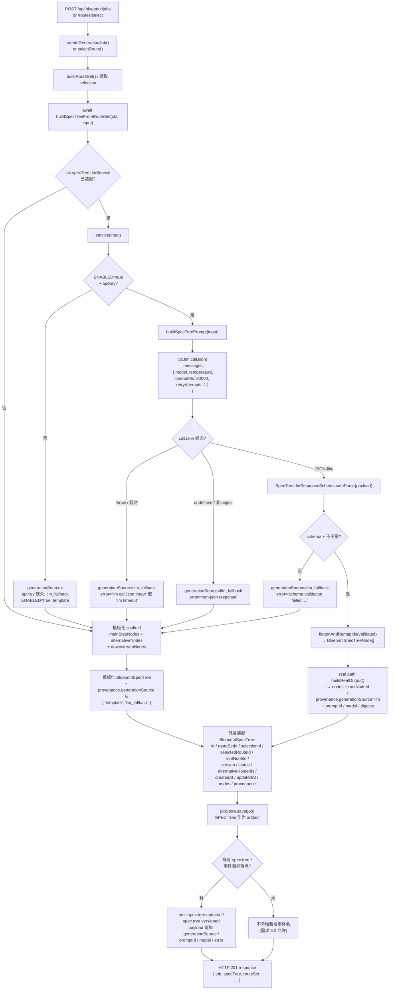
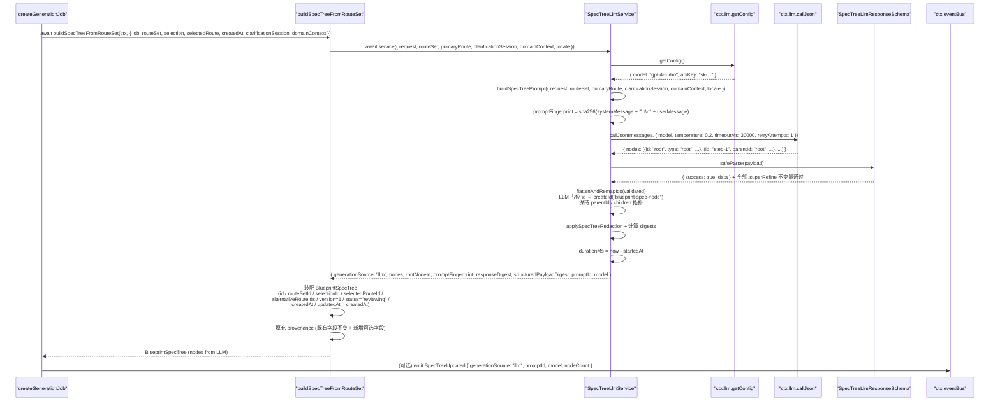
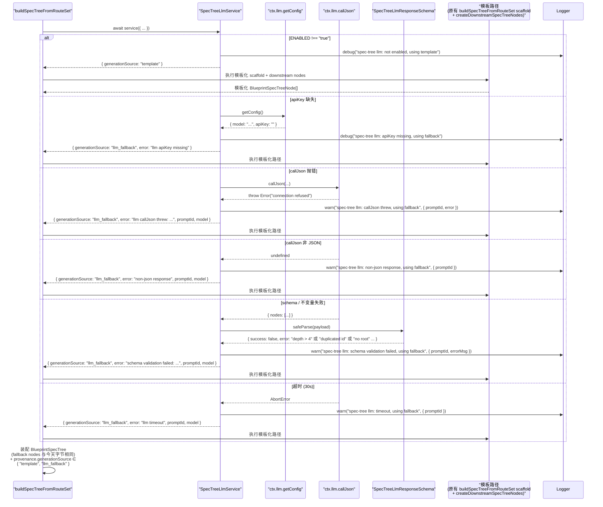

# 设计文档：Autopilot SPEC Tree LLM 驱动生成

## 1. 设计概述

本 spec 把 `/autopilot` 的 **SPEC Tree 生成阶段**从当前 `server/routes/blueprint.ts` 的 `buildSpecTreeFromRouteSet()`（~第 11994 行）+ `createDownstreamSpecTreeNodes()`（~第 12127 行）联合产出的硬编码节点集合，升级为由 `BlueprintServiceContext.llm.callJson` 发起的一次**真实 LLM SPEC Tree 推理**，产出严格 zod schema 校验后的**结构化节点集合**（`roots: Array<{ id, title, summary, type, status, priority, outputs, dependencies, children, routeStepId?, metadata?, children: BlueprintSpecTreeNodeDraft[] }>`），并直接用来构造 `BlueprintSpecTree.nodes` / `rootNodeId` / `alternativeRouteIds`；在 LLM 不可用 / apiKey 缺失 / callJson 抛错 / 非 JSON / schema 不过 / 树深度或节点数量越界 / `id` 重复 / `parentId` 不可解析 / 超时任一情况下，**完全复用**既有 `buildSpecTreeFromRouteSet()` + `createDownstreamSpecTreeNodes()` 作为确定性 fallback 路径。

本 spec 是跟随 `autopilot-routeset-llm-generation` 建立的同一条 LLM 驱动流水线的**下一阶段**，在 4 条 capability-bridge spec（Docker / MCP / aigc-node / role）与 Wave 2 `autopilot-agent-crew-stage-activation` 之后，负责把 RouteSet → SPEC Tree 这一步从"模板派生"真正升级为"LLM 派生"。整体实现模式完全复用 RouteSet spec 已经验证过的主线：`ctx.llm.callJson` → strict zod schema（含 `.superRefine()` 跨字段不变量）→ 成功路径返回 LLM 节点集合 / 失败路径回退到模板 → 在 `BlueprintSpecTree.provenance` 与既有 `spec.tree.*` 事件 payload 上追加 `generationSource` / `promptId` / `model` / `error` 可选字段。

### 1.1 与姊妹 spec 的本质差异

| 维度 | routeset LLM spec | role-bridge spec | **spec-tree LLM（本 spec）** |
| --- | --- | --- | --- |
| 产出 JSON 内容 | `routes: Array<{ id, kind, title, summary, rationale, ..., capabilities, steps }>` | `roles: Array<{ id, label, responsibilities, activationStages, permissions? }>` | **`roots: Array<{ id, title, summary, type, status, priority, outputs, dependencies, children: BlueprintSpecTreeNodeDraft[], metadata? }>`**（嵌套树） |
| 输入依赖 | `intake + clarificationSession + githubUrls` | 多 + `selectedRoute.steps[]` | **多 + `routeSet + primaryRoute`（RouteSet 已完整落地）** |
| 下游消费 | SPEC Tree、Sandbox Derivation、Agent Crew | Wave 2 stage-activation 通过 evidence 检索 | **SPEC Documents、Effect Preview、Prompt Package、Engineering Handoff 全部消费 SPEC Tree** |
| schema 难点 | `kind` 枚举、primary 唯一 | `roles[].id` 唯一（`.superRefine()`） | **节点 `id` 全树唯一、`parentId` 可解析、深度 ≤ 4、节点总数 ∈ [3..50]**（`.superRefine()` 多条不变量） |
| Fallback 数据源 | `buildTemplatedRoutes()`（本 spec 内 helper） | `createRouteGenerationSandboxDerivation()` 模板 invocation | **`buildSpecTreeFromRouteSet()` + `createDownstreamSpecTreeNodes()` 联合产出**（一行不改） |
| 事件 payload | `route.generated` | 复用 `sandbox.job.*` / `capability.*` / `evidence.recorded` | **复用既有 `spec.tree.updated` / `spec.tree.versioned`**（若已 emit；见 D7） |
| 测试 | +2 E2E + 子域单测 | +2 E2E + 5 硬需求单测 | **+2 E2E + ~20-30 co-located 单测（R9.1 + R9.2 四条）** |

### 1.2 最低可接受交付

当 `BlueprintServiceContext.llm.callJson` 可用且返回通过 strict zod 校验的结构化节点集合时：

- `buildSpecTreeFromRouteSet()`（或其下游调用链）最终产出的 `BlueprintSpecTree.nodes` 内容**明显不同**于模板化输出（title / summary / children 结构由 LLM 推导，而不是硬编码 `"SPEC asset tree: ${targetTitle}"` / `"Specification document generation"` / 等固定字符串）
- `BlueprintSpecTree.provenance.generationSource === "llm"`
- `BlueprintSpecTree.provenance.promptId === "blueprint.spec-tree.v1"`
- `BlueprintSpecTree.provenance.model` 等于 `ctx.llm.getConfig().model`
- `BlueprintSpecTree.provenance.responseDigest` / `structuredPayloadDigest` / `promptFingerprint` 匹配 `/^sha256:[a-f0-9]{64}$/`
- `BlueprintSpecTree.provenance.error` 为 `undefined`
- `BlueprintSpecTree.nodes[*]` 所有既有字段（`id` / `parentId` / `title` / `summary` / `type` / `status` / `priority` / `routeId` / `routeStepId` / `dependencies` / `outputs` / `children` / `metadata`）形态完全符合 `BlueprintSpecTreeNode` 既有类型
- 既有 `spec.tree.*` 事件 payload 上追加 `generationSource` / `promptId` / `model` 可选字段（若当前存在 emit 点）

当 LLM 未注入 / apiKey 缺失 / callJson 抛错 / 非 JSON / schema 不过 / 节点树不变量违反 / 超时时：

- `BlueprintSpecTree.nodes` 与今天不走 LLM 的行为**字节级等价**（完全复用 `buildSpecTreeFromRouteSet()` + `createDownstreamSpecTreeNodes()` 的产出）
- `BlueprintSpecTree.provenance.generationSource === "llm_fallback"`（当 LLM 被尝试过时）或 `"template"`（当 LLM 从未被尝试 / apiKey 未配置时）
- `BlueprintSpecTree.provenance.error` 被脱敏后填充（仅 `"llm_fallback"` 情况下）
- 其它 provenance 字段（`jobId` / `projectId` / `sourceId` / `routeSetId` / `routeId` / `selectionId` / `selectedPathId` / `specTreeId` / `targetText` / `githubUrls` / `artifactLinks` / `reusedRoleFindingIds` / `reusedRoleIds` / `reusedEvidenceIds`）与今天**字节相同**

### 1.3 环境变量门禁

- `BLUEPRINT_SPEC_TREE_LLM_ENABLED=true` 开启本 LLM 路径（与 RouteSet / Docker / MCP / aigc / role 桥同模式）
- 未设或设为其它值时，即使 `ctx.llm` 已装配，service 也直接走 fallback，保证默认装配下既有 E2E + 子域单测零感知
- 超时上限通过 `BLUEPRINT_SPEC_TREE_LLM_TIMEOUT_MS` 覆盖，默认 `30000`（需求 2.7）

### 1.4 严格限定范围

本 spec 严格限定在 `buildSpecTreeFromRouteSet()` 的数据派生路径上：

- 新增 `createSpecTreeLlmService(ctx)` 工厂，落地到 `server/routes/blueprint/spec-tree/` 目录，co-located 单元测试同目录
- **不修改** `createRouteGenerationSandboxDerivation()` 外层 orchestration；sandbox evidence 与 role 时间线事件照常产出
- **不修改** `docker-analysis-sandbox` / `mcp-github-source` / `aigc-spec-node` / `role-system-architecture` 任一 capability adapter 的实际行为
- **不修改** RouteSet（已有独立 spec）、SPEC Documents、Effect Preview、Prompt Package、Engineering Handoff 任一阶段的生成路径
- **不修改** `ctx.llm.callJson` 或 `ctx.llm.getConfig` 本身的实现；本 spec 只**消费**它们，不得 `import { callLLMJson }` 或 `import { getAIConfig }`
- **不修改** `shared/blueprint/contracts.ts` 中 `BlueprintSpecTree` / `BlueprintSpecTreeNode` / `BlueprintSpecTreeNodeType` / `BlueprintSpecTreeNodeStatus` 类型定义本身（只读对齐）；仅**追加**可选 provenance 字段
- **不修改** `SpecTreeWorkbenchPanel` 或前端任何 SPEC Tree UI（需求 1.6）；`generationSource` 是否在前端可见属可选后续 UI spec
- **不修改** GitHub Pages 静态预览或浏览器端 runtime（需求 1.7）
- **不新增** `/api/*` 路由；HTTP 契约完全不变
- **不引入** property-based test（需求 9.3 明确锁定）。本轮新增 **2 条 E2E + ~20-30 条 co-located 单测**（最低硬需求：R9.1 + R9.2 四条 = +6 条）
- 既有端到端 E2E 用例（含 RouteSet / 4 条桥 / 其它）与既有子域 co-located 单测全部继续通过，**不重写既有断言**（需求 9.6）

_Requirements: 1.1, 1.2, 1.3, 1.4, 1.5, 1.6, 1.7, 8.1, 8.2, 8.3, 8.4, 8.5, 9.4, 9.5, 9.6, 9.7, 9.8_


## 2. 架构决策（Key Decisions）

本 spec 的 D1-D10 在与 RouteSet / Docker / MCP / aigc-node / role 五条姊妹 spec 同一坐标系下讨论；相同处复用结论并明确说明差异。

### D1：工厂模式 `createSpecTreeLlmService(ctx)`

```ts
export function createSpecTreeLlmService(
  ctx: BlueprintServiceContext
): SpecTreeLlmService;
```

工厂只接收 `BlueprintServiceContext`，从中读取 `ctx.llm.callJson` / `ctx.llm.getConfig` / `ctx.specTreeLlmPolicy` / `ctx.logger` / `ctx.now`。返回的 service 是纯异步函数 `(input) => Promise<SpecTreeLlmServiceOutput>`。

**硬约束**（与五条姊妹 spec 同款 code-review 规则，违反直接拒绝）：

- service 实现文件 SHALL NOT `import { callLLMJson } from "../../core/llm-client.js"`
- service 实现文件 SHALL NOT `import { getAIConfig } from "../../core/ai-config.js"`
- service 实现文件 SHALL NOT 调用模块级 `fetch()` 或 `import` 任何 LLM HTTP 客户端
- service 实现文件 SHALL NOT 硬编码 model 名 / provider 名 / temperature 默认值
- 所有 LLM 能力必须来自 `ctx.llm.callJson` + `ctx.llm.getConfig`

_Requirements: 7.1, 7.2, 7.3, 7.4, 7.5_

### D2：`BlueprintServiceContext` 最轻扩展

新增两个可选字段到 `BlueprintServiceContext` 与 `BlueprintServiceContextDeps`：

```ts
export interface BlueprintServiceContext {
  // ...既有字段（含 llm: { callJson, getConfig } 与 4 条桥字段）...
  /** 本 service 安全 / schema 上界 / 脱敏策略；未注入时使用 createDefaultSpecTreeLlmPolicy() */
  specTreeLlmPolicy?: SpecTreeLlmPolicy;
  /** 本 service 实例本身；便于测试完全注入自定义 service */
  specTreeLlmService?: SpecTreeLlmService;
}
```

**默认装配策略**（与姊妹 spec D2 对齐）：

- 未注入 `specTreeLlmService` → `buildBlueprintServiceContext()` 自动装配 `createSpecTreeLlmService(ctx)`
- 环境变量 `BLUEPRINT_SPEC_TREE_LLM_ENABLED !== "true"` 或 `ctx.llm.getConfig().apiKey` 缺失 → service 内部直接走 fallback，不尝试调用 `callJson`
- `ctx.llm.callJson` 已在主仓 `buildBlueprintServiceContext` 中默认装配，本 spec 不重复装配
- 测试中通过 `buildBlueprintServiceContext({ llm: { callJson: fake, getConfig: () => ({ model, apiKey }) } })` 注入任意 fake

未注入 `specTreeLlmPolicy` 时使用 `createDefaultSpecTreeLlmPolicy()`（见 §4.3）。

_Requirements: 2.1, 7.1, 7.2, 7.3_

### D3：替换点在 `buildSpecTreeFromRouteSet()` 调用链，不改外层 orchestration

`buildSpecTreeFromRouteSet()` 是今天 SPEC Tree 的唯一构造点，目前在 `server/routes/blueprint.ts` 第 ~7414 行被 `createGenerationJob()` 调用（同时也在 `/routes/select` / `/spec-tree/*` 派生入口被复用）。本 spec 的改造方式是把它改为 **async 版本并内嵌 LLM 调用**，在 LLM 成功时用 LLM 节点集合替换模板化节点集合：

```ts
// 旧签名（保持不变）
function buildSpecTreeFromRouteSet(input: {...}): BlueprintSpecTree;

// 新签名
async function buildSpecTreeFromRouteSet(
  ctx: BlueprintServiceContext,
  input: { ..., clarificationSession?, domainContext? }
): Promise<BlueprintSpecTree>;
```

实现内部：

1. 先不变地计算 `rootNodeId` / `targetTitle` / `alternativeRoutes` 等 scaffold
2. 调用 `await ctx.specTreeLlmService?.(...)`
3. 若 service 返回 `generationSource === "llm"` → 用 LLM 产出的 `rootNode + children[]` 替换模板化 `mainStepNodes + alternativeNodes + downstreamNodes`，保留 `alternativeRouteIds` / `provenance` scaffold
4. 若 service 未装配或返回 fallback → 执行今天的模板化代码路径一行不改，并在 `provenance` 上标注 `generationSource === "template"` 或 `"llm_fallback"`

**关键点**：

- **LLM 输出只取代节点部分**；`specTreeId` / `rootNodeId` / `routeSetId` / `selectionId` / `selectedPathId` / `selectedRouteId` / `version` / `status` / `createdAt` / `updatedAt` / `alternativeRouteIds` 由外层构造不变
- **LLM 节点集合经过 normalize 后必须产出 `BlueprintSpecTreeNode[]`**，即需要把 LLM 返回的嵌套树结构 flatten 成平铺数组（但保持 `parentId` / `children` 正确）
- LLM 中返回的 `id` 是 LLM 自行分配的占位符（类似 `"root"` / `"step-1"` / `"spec-doc"`），在 flatten 时需要**重映射为 `createId("blueprint-spec-node")` 产生的稳定 ID**，同时保持 `parentId` / `children` 的拓扑关系；根节点的重映射后 id 写回 `BlueprintSpecTree.rootNodeId`
- `alternativeRouteIds` 仍从 routeSet 中按原有逻辑派生（不由 LLM 决定）

_Requirements: 2.5, 2.6, 5.2, 5.5_

### D4：超时上限锁定为 30 秒

需求 2.7 要求"不大于 30 秒"。本 spec 将**单次 LLM 调用 + zod 校验 + 树不变量检查的总墙钟**锁定为 **30 秒**，通过环境变量 `BLUEPRINT_SPEC_TREE_LLM_TIMEOUT_MS` 可覆盖（默认 `30000`）。与 routeset / 桥 spec 对齐。

实现上通过 `ctx.llm.callJson` 自带的 `timeoutMs` 参数 + `retryAttempts: 1` 传入。`callLLMJson` 实现会在超时到达时抛 `AbortError`，service 捕获后 fallback 并填 `provenance.error = "llm timeout"`。

_Requirements: 2.7, 5.1_

### D5：Prompt ID 锁定为 `blueprint.spec-tree.v1`（需求 3.1）

与 routeset spec 的 `blueprint.routeset.v1` / aigc-node 桥的 `blueprint.aigc-spec-node.v1` / role 桥的 `blueprint.role-architecture.v1` 命名对齐。稳定字符串版本标识，用于 provenance 追溯与回归测试锁定。prompt 结构 / response schema 发生向后不兼容变化时递增到 `v2`；仅字段示例 / 提示语微调不构成 bump。

常量定义位置：`server/routes/blueprint/spec-tree/prompt.ts` 的 `export const SPEC_TREE_PROMPT_ID = "blueprint.spec-tree.v1"`。

_Requirements: 3.1_

### D6：Provenance 扩展策略

SPEC Tree 的真相字段全部挂在 `BlueprintSpecTree.provenance`，不涉及 `BlueprintCapabilityInvocation` / `BlueprintCapabilityEvidence`（那是桥 spec 的真相源）。本 spec 向 `BlueprintSpecTree.provenance` **追加**以下可选字段（全部可选、不改既有字段）：

| 字段 | 类型 | 填充条件 |
| --- | --- | --- |
| `generationSource` | `"llm" \| "llm_fallback" \| "template"` | 总是填充；区分三种路径 |
| `promptId` | `string` | 当 `generationSource` ∈ `{"llm", "llm_fallback"}` 时填充 |
| `model` | `string` | 当 LLM 被调用过时填充（`"llm"` 与大部分 `"llm_fallback"`） |
| `responseDigest` | `string` | Real 路径必然填充，形如 `sha256:...` |
| `structuredPayloadDigest` | `string` | Real 路径必然填充，形如 `sha256:...` |
| `promptFingerprint` | `string` | Real / fallback（LLM 被调用过时）均填充，形如 `sha256:...` |
| `error` | `string` | 仅 `generationSource === "llm_fallback"` 时填充，已脱敏 |

与 RouteSet / aigc-node / role 桥的命名口径严格对齐（需求 4.3）。既有 `provenance` 字段（`jobId` / `projectId` / `sourceId` / `routeSetId` / `routeId` / `selectionId` / `selectedPathId` / `specTreeId` / `targetText` / `githubUrls` / `artifactLinks` / `reusedRoleFindingIds` / `reusedRoleIds` / `reusedEvidenceIds`）**一字段不改**（需求 4.2 / 4.5 / 4.6）。

**Adapter 命名（若在事件或 provenance 中携带）**：

| 路径 | adapter 字符串 | `generationSource` |
| --- | --- | --- |
| LLM 真跑 | `"blueprint.spec-tree.llm"` | `"llm"` |
| 模板化回退 / template | 不携带或保留既有命名 | `"llm_fallback"` / `"template"` |

Real 路径 adapter 不得包含 `.simulated` 子串（需求 4.4）。

_Requirements: 4.1, 4.2, 4.3, 4.4, 4.5, 4.6_

### D7：事件复用既有 `BlueprintEventName`，不新增事件名

本 spec **不新增事件名**。在当前代码基中，`BlueprintEventName.SpecTreeUpdated: "spec.tree.updated"` / `BlueprintEventName.SpecTreeVersioned: "spec.tree.versioned"` 已声明于 `shared/blueprint/events.ts`，但经 grep 确认目前 `server/routes/blueprint.ts` 在 `createGenerationJob()` / `/routes/select` 首次产出 SPEC Tree 时**并未显式 emit** `spec.tree.*` 事件。因此本 spec 的事件策略为：

1. **如果** design / tasks 阶段发现 SPEC Tree 首次产出点自然落在某条已 emit 的事件 payload 上（例如 `JobCompleted` 或 `spec.tree.updated`），则在其 payload 上**追加可选字段** `generationSource` / `promptId` / `model` / `error`（需求 6.1 / 6.3 / 6.4）
2. **如果** 当前仓库在 SPEC Tree 首次产出时既未 emit `spec.*` 事件也无自然 emit 点，则 service **不单独新增事件名**（需求 6.2 明确允许此降级）；SPEC Tree 的 `generationSource` 仅通过 `BlueprintSpecTree.provenance` 暴露

**无论选哪条路径，所有新增字段都是可选字段**（需求 6.5），既有订阅者不会因字段追加而断言失败。所有事件 `type` 仍由 `BlueprintEventName` 常量构造（需求 6.4），实现文件 SHALL NOT 出现裸字符串 `"spec.tree.updated"` 等。

_Requirements: 6.1, 6.2, 6.3, 6.4, 6.5_

### D8：Strict zod schema + `.superRefine()` 跨字段不变量

本 spec 最核心的复杂度不在 LLM 调用，而在 schema 设计。SPEC Tree 与 RouteSet 的关键差异是：RouteSet 是平铺的 `routes: Array<Route>`，而 SPEC Tree 是带父子关系的**嵌套树**。本 spec 用 zod 结合 `.superRefine()` 多条不变量严格校验：

**节点级约束**（单节点字段约束）：

- `id: string`，匹配 `/^[a-z][a-z0-9-]{0,63}$/`（lowercase kebab-case，≤ 64 字符）
- `title: string`，1..120 字符
- `summary: string`，1..400 字符
- `type: BlueprintSpecTreeNodeType` 枚举，受限于 `{ root, route_step, alternative_route, spec_document, effect_preview, prompt_package, engineering_plan }`
- `status: BlueprintSpecTreeNodeStatus` 枚举，受限于 `{ seed, draft, ready, accepted }`
- `priority: number`，整数，`0..999`
- `parentId: string | undefined`（根节点为 undefined；非根必须存在）
- `routeId?: string`，≤ 128 字符
- `routeStepId?: string`，≤ 128 字符
- `dependencies: string[]`，0..10 项，每项 ≤ 64 字符
- `outputs: string[]`，0..10 项，每项 ≤ 200 字符
- `children: string[]`（在 LLM 响应内作为 `id` 引用数组；flatten 时验证与 `parentId` 一致）
- `metadata?: Record<string, string | number | boolean | string[]>`（完全可选；未声明 key 不做约束）

**树级约束**（`.superRefine()` 跨字段不变量）：

- **恰好 1 个 `type === "root"` 节点**
- **所有节点 `id` 在树内唯一**
- **所有非 root 节点的 `parentId` 能在节点集合内解析到**
- **树深度 ≤ 4 层**（root = 第 1 层）
- **节点总数 ∈ [3..50]**（即 `nodes.length >= 3 && nodes.length <= 50`）
- **非 root 节点的 `parentId` 不得指向自己**（无自环）
- **不存在父子循环**（DFS / union-find 验证）

**Schema 结构**（见 §4.4 详细展开）：

```ts
const SpecTreeLlmNodeSchema = z.object({
  id: z.string().regex(/^[a-z][a-z0-9-]{0,63}$/),
  parentId: z.string().regex(/^[a-z][a-z0-9-]{0,63}$/).optional(),
  title: z.string().min(1).max(120),
  summary: z.string().min(1).max(400),
  type: z.enum([
    "root",
    "route_step",
    "alternative_route",
    "spec_document",
    "effect_preview",
    "prompt_package",
    "engineering_plan",
  ]),
  status: z.enum(["seed", "draft", "ready", "accepted"]),
  priority: z.number().int().min(0).max(999),
  routeId: z.string().max(128).optional(),
  routeStepId: z.string().max(128).optional(),
  dependencies: z.array(z.string().max(64)).max(10).default([]),
  outputs: z.array(z.string().min(1).max(200)).max(10).default([]),
  children: z.array(z.string()).max(50).default([]),
  metadata: z.record(z.string(), z.unknown()).optional(),
});

export const SpecTreeLlmResponseSchema = z
  .object({
    nodes: z.array(SpecTreeLlmNodeSchema).min(3).max(50),
  })
  .superRefine((data, ctx) => {
    // 1) exactly one root
    // 2) unique ids
    // 3) parentId resolves
    // 4) depth <= 4
    // 5) no self-parent
    // 6) no parent-child cycle
  });
```

**字段处置策略**：

| 场景 | schema 行为 |
| --- | --- |
| `nodes` 缺失 / 非数组 | fail → fallback |
| `nodes.length < 3` 或 `> 50` | fail → fallback |
| 节点 `id` 不匹配正则 | fail → fallback |
| 节点 `id` 在数组内重复 | fail（`.superRefine()` 触发） → fallback |
| 没有 `type === "root"` 节点 | fail（`.superRefine()`） → fallback |
| 多个 `type === "root"` 节点 | fail（`.superRefine()`） → fallback |
| 非 root 节点 `parentId` 不可解析 | fail（`.superRefine()`） → fallback |
| 树深度 > 4 | fail（`.superRefine()`） → fallback |
| 父子循环 | fail（`.superRefine()`） → fallback |
| 未声明的节点顶层字段 | 静默丢弃（zod 默认 strip） |
| 未声明的顶层响应字段 | 静默丢弃 |

**注意**：`SpecTreeLlmNodeSchema` 使用 `z.object({...}).superRefine(...)` 而非 `.strict()`。未知字段静默丢弃（需求 3.6），与 RouteSet / role 桥 schema 风格对齐。

**不做 coerce / normalize 在 zod 层面**（需求 3.2）：禁止 `z.string().or(z.number()).transform(...)` 这类 zod transform 链。所有字段要么严格匹配，要么 fallback。**但** zod 校验通过后，在 `buildRealOutput` 内部做一次规范化（需求 3.6）：裁剪过长字符串（防御性，schema 已限长）、补齐 `dependencies` / `outputs` / `children` 为空数组、flatten 树结构为 `BlueprintSpecTreeNode[]` 并重映射 `id`。

_Requirements: 3.1, 3.2, 3.3, 3.4, 3.5, 3.6, 5.1_

### D9：脱敏走本 spec 独立的 `applySpecTreeRedaction` 纯函数

**决策**：本 spec 实现独立的轻量 `applySpecTreeRedaction(text, policy)` 纯函数，覆盖：

- API key 正则（`sk-[A-Za-z0-9]{20,}` / `clp_[A-Za-z0-9]{20,}` / `gh[pousr]_[A-Za-z0-9]{36,255}` / `github_pat_[A-Za-z0-9_]{22,255}`）
- Authorization / Bearer / token= / api_key= 等 key-value 对
- 邮箱正则

**关键使用点**（防御性）：

1. `provenance.error`：从 `zod error.message` / LLM 抛错 message / 超时原因派生，进入前过脱敏
2. `logger.warn` meta：任何 `{ promptId, errorMsg }` 字段进入前过脱敏
3. `nodes[*].title` / `nodes[*].summary` / `nodes[*].outputs[]`：**不**强制脱敏原文（下游 SPEC Documents 阶段需要完整字段；schema prompt 侧已约束 LLM 不得返回真实凭据字面量；LLM 响应若被迫包含敏感串仍会落库，但发生概率极低且与 RouteSet / role 桥一致）
4. `promptFingerprint` / `responseDigest` / `structuredPayloadDigest`：SHA-256 of 未脱敏原文（digest 无泄漏风险）

**为什么不把 nodes 原文也脱敏**：与 role 桥 D10 同论据 —— 下游 SPEC Documents / Effect Preview / Prompt Package 需要完整 node 内容；脱敏会破坏产品体验。通过 prompt 约束（见 §4.5）要求 LLM 对敏感标识抽象化，作为风险缓解。

_Requirements: 4.7（节点原文字段非本 spec 重点脱敏对象；参考 role 桥同款权衡）_

### D10：测试默认装配 ≡ 生产行为

核心兼容性保证：**默认测试装配 ≡ 今天的生产行为**（需求 8.6）。

- 既有 E2E **不设** `BLUEPRINT_SPEC_TREE_LLM_ENABLED` 环境变量 → service 早退 → fallback → 输出与今天模板化路径字节级等价
- 即便设了 `ENABLED=true`，既有 E2E **不对 `callLLMJson` 预设针对 SPEC Tree 的 mock**（RouteSet / 桥 spec 只注入各自相关的 LLM mock）→ callJson 返回 undefined → service 档位 3 → fallback → 字节级等价
- 既有 E2E 断言的 SPEC Tree 字段（`rootNodeId`、`nodes[*].type`、下游菜单节点的 `title === "Specification document generation"` 等固定字符串）在 fallback 路径下全部满足
- `BlueprintSpecTree.nodes` 顺序在 fallback 路径下与今天完全相同

唯一需要主动 mock 的只有本 spec 新增的 2 条 E2E（R9.1）与 4 条硬需求单测（R9.2）。

_Requirements: 8.1, 8.3, 8.4, 8.6_


## 3. 架构（High-Level Design）

### 3.1 系统数据流（Mermaid）



### 3.2 Happy path 时序图（real LLM execution）



### 3.3 Fallback 时序图



_Requirements: 2.1, 2.5, 2.6, 3.5, 4.1, 4.5, 4.6, 5.1, 5.2, 5.3, 5.4, 5.5_


## 4. 组件与接口（Low-Level Design）

### 4.1 文件布局

```
server/routes/blueprint/spec-tree/
  ├── service.ts                        # 新增：createSpecTreeLlmService(ctx) 工厂 + 主算法
  ├── service.test.ts                   # 新增：R9.2 四条硬需求 + 补充（not-enabled / timeout / redaction / depth / cycle）
  ├── policy.ts                         # 新增：SpecTreeLlmPolicy + createDefault + applySpecTreeRedaction
  ├── policy.test.ts                    # 新增：policy + redaction 纯函数测试
  ├── prompt.ts                         # 新增：buildSpecTreePrompt + SPEC_TREE_PROMPT_ID
  ├── prompt.test.ts                    # 新增：prompt 确定性 + locale 分支测试
  ├── schema.ts                         # 新增：SpecTreeLlmResponseSchema strict zod + .superRefine 不变量
  ├── schema.test.ts                    # 新增：schema 各种 valid/invalid 分支 + 树不变量
  ├── flatten-and-remap.ts              # 新增：flattenAndRemapIds + 层级 / 拓扑校验辅助
  └── flatten-and-remap.test.ts         # 新增：flatten / remap / cycle 边界测试

server/routes/blueprint/context.ts       # 修改（仅追加两个可选字段与默认装配）：
                                         #   - BlueprintServiceContext 追加:
                                         #       specTreeLlmPolicy?: SpecTreeLlmPolicy
                                         #       specTreeLlmService?: SpecTreeLlmService
                                         #   - BlueprintServiceContextDeps 追加同样字段
                                         #   - buildBlueprintServiceContext 默认装配 createSpecTreeLlmService(ctx)

server/routes/blueprint.ts               # 修改（最小侵入）：
                                         #   - buildSpecTreeFromRouteSet() 改为 async(ctx, input)
                                         #   - 所有调用点（~第 7414 行 createGenerationJob、/routes/select 等）追加 await
                                         #   - input 追加 clarificationSession? / domainContext? 透传
                                         #   - 在模板化 scaffold 之前 await ctx.specTreeLlmService?.(...)
                                         #   - LLM 成功 → 用 LLM nodes 替换 mainStepNodes + alternativeNodes + downstreamNodes
                                         #   - LLM 失败或未装配 → 走今天的模板化路径一行不改
                                         #   - provenance 新字段以可选方式追加
                                         #   - （可选）在既有 SpecTreeUpdated / SpecTreeVersioned emit 点的 payload 上追加可选字段

shared/blueprint/contracts.ts            # 修改（仅追加可选字段）：
                                         #   - BlueprintSpecTree.provenance 追加可选:
                                         #       generationSource?: "llm" | "llm_fallback" | "template"
                                         #       promptId?: string
                                         #       model?: string
                                         #       responseDigest?: string
                                         #       structuredPayloadDigest?: string
                                         #       promptFingerprint?: string
                                         #       error?: string

server/tests/blueprint-routes.test.ts    # 修改（只追加，不改写）：
                                         #   + 2 条新 E2E 用例：
                                         #     (a) Real LLM path
                                         #     (b) Fallback path
```

### 4.2 核心类型定义（`service.ts`）

```ts
import type { BlueprintServiceContext } from "../context.js";
import type {
  BlueprintClarificationSession,
  BlueprintGenerationJob,
  BlueprintGenerationRequest,
  BlueprintRouteCandidate,
  BlueprintRouteSet,
  BlueprintSpecTreeNode,
} from "../../../../shared/blueprint/index.js";

/**
 * service 的单次调用输入。
 * 字段集与 RouteSet / 桥 spec 的 *BridgeInput 同构，重点输入是 routeSet + primaryRoute。
 */
export interface SpecTreeLlmServiceInput {
  jobId: string;
  job: BlueprintGenerationJob;
  request: BlueprintGenerationRequest;
  routeSet: BlueprintRouteSet;
  /** 选中的主路线；LLM 基于该路线的 steps / stages 推导 SPEC Tree */
  primaryRoute: BlueprintRouteCandidate;
  /** Primary 之外的候选路线摘要（供 LLM 选择是否在 tree 中预留 alternative_route 节点） */
  alternativeRoutes: BlueprintRouteCandidate[];
  clarificationSession?: BlueprintClarificationSession;
  /** 可选领域上下文（projectContext / domainNotes 等） */
  domainContext?: {
    projectId?: string;
    sourceId?: string;
    domain?: string;
    notes?: string;
  };
  /** 可选 AIGC-node evidence 摘要（若上游 capability-bridge-aigc-node 已真实执行并落库） */
  aigcSpecNodeEvidence?: {
    subsystemsSummary: string;
    riskNoteCount: number;
  };
  createdAt: string;
  /** 外层预分配的 rootNodeId；service 在 real path 时把 LLM 产出的 root 节点的 id 重映射为此值 */
  rootNodeId: string;
}

/**
 * service 的单次调用输出。
 * Real path: 返回 nodes[] 与 rootNodeId（已完成 flatten + remap）+ 完整 provenance 扩展字段
 * Fallback path: 返回 generationSource / error / 可选 promptId / model；nodes 为 undefined（由外层走模板路径）
 */
export interface SpecTreeLlmServiceOutput {
  generationSource: "llm" | "llm_fallback" | "template";
  /** Real path 下填充；fallback / template 路径下 undefined */
  nodes?: BlueprintSpecTreeNode[];
  /** Real path 下等于外层预分配的 rootNodeId（便于断言） */
  rootNodeId?: string;
  /** Real / fallback 有 LLM 调用时填充 */
  promptId?: string;
  model?: string;
  promptFingerprint?: string;
  /** Real path 必填 */
  responseDigest?: string;
  structuredPayloadDigest?: string;
  /** llm_fallback 路径填充 */
  error?: string;
}

export type SpecTreeLlmService = (
  input: SpecTreeLlmServiceInput
) => Promise<SpecTreeLlmServiceOutput>;

export function createSpecTreeLlmService(
  ctx: BlueprintServiceContext
): SpecTreeLlmService;
```

_Requirements: 2.1, 2.2, 2.3, 2.6, 7.1, 7.2, 7.4_

### 4.3 Policy 类型（`policy.ts`）

```ts
export interface SpecTreeLlmPolicy {
  /** 单次 LLM 调用 + 校验的总墙钟上限；不超过 30_000 */
  maxInvocationTimeoutMs: number;
  /** 温度（保持确定性偏向） */
  temperature: number;
  /** retry attempts 传给 callJson */
  callJsonRetryAttempts: number;
  /** 节点总数上界 */
  maxNodeCount: number;
  /** 节点总数下界 */
  minNodeCount: number;
  /** 树深度上界（root = 第 1 层） */
  maxDepth: number;
  /** 单节点 title 最大长度 */
  maxTitleLength: number;
  /** 单节点 summary 最大长度 */
  maxSummaryLength: number;
  /** 脱敏：key 级敏感关键词（大小写不敏感） */
  redactionKeywords: readonly string[];
  /** 脱敏：email 正则 */
  redactedEmailPattern: RegExp;
  /** 脱敏：通用长字串 API key 正则 */
  redactedApiKeyPattern: RegExp;
  /** 脱敏：GitHub PAT 正则 */
  redactedGithubPatPattern: RegExp;
  /** error message 截断上界 */
  maxErrorLength: number;
}

export function createDefaultSpecTreeLlmPolicy(): SpecTreeLlmPolicy {
  const timeoutOverride = Number.parseInt(
    process.env.BLUEPRINT_SPEC_TREE_LLM_TIMEOUT_MS ?? "",
    10
  );
  return {
    maxInvocationTimeoutMs:
      Number.isFinite(timeoutOverride) && timeoutOverride > 0 && timeoutOverride <= 30_000
        ? timeoutOverride
        : 30_000,
    temperature: 0.2,
    callJsonRetryAttempts: 1,
    maxNodeCount: 50,
    minNodeCount: 3,
    maxDepth: 4,
    maxTitleLength: 120,
    maxSummaryLength: 400,
    redactionKeywords: [
      "authorization",
      "token",
      "api_key",
      "apikey",
      "secret",
      "password",
      "bearer",
      "access_token",
      "x-github-token",
      "openai-api-key",
    ],
    redactedEmailPattern: /[\w.+-]+@[\w.-]+/g,
    redactedApiKeyPattern: /\b(sk-[A-Za-z0-9]{20,}|clp_[A-Za-z0-9]{20,})\b/g,
    redactedGithubPatPattern:
      /\b(gh[pousr]_[A-Za-z0-9]{36,255}|github_pat_[A-Za-z0-9_]{22,255})\b/g,
    maxErrorLength: 400,
  };
}

export function applySpecTreeRedaction(
  value: string,
  policy: SpecTreeLlmPolicy
): string;
```

**环境变量**：`BLUEPRINT_SPEC_TREE_LLM_TIMEOUT_MS` 允许覆盖默认 30s 上限（不超过 30s，否则忽略并 fallback 到 30s）。

_Requirements: 2.7, 3.4, 4.7（error 文本脱敏）_

### 4.4 Response Schema（`schema.ts`）

```ts
import { z } from "zod";

const NODE_ID_PATTERN = /^[a-z][a-z0-9-]{0,63}$/;

const SpecTreeLlmNodeSchema = z.object({
  id: z.string().min(1).max(64).regex(NODE_ID_PATTERN),
  parentId: z.string().min(1).max(64).regex(NODE_ID_PATTERN).optional(),
  title: z.string().min(1).max(120),
  summary: z.string().min(1).max(400),
  type: z.enum([
    "root",
    "route_step",
    "alternative_route",
    "spec_document",
    "effect_preview",
    "prompt_package",
    "engineering_plan",
  ]),
  status: z.enum(["seed", "draft", "ready", "accepted"]),
  priority: z.number().int().min(0).max(999),
  routeId: z.string().max(128).optional(),
  routeStepId: z.string().max(128).optional(),
  dependencies: z.array(z.string().min(1).max(64)).max(10).default([]),
  outputs: z.array(z.string().min(1).max(200)).max(10).default([]),
  children: z.array(z.string().min(1).max(64)).max(50).default([]),
  metadata: z.record(z.string(), z.unknown()).optional(),
});

export const SpecTreeLlmResponseSchema = z
  .object({
    nodes: z.array(SpecTreeLlmNodeSchema).min(3).max(50),
  })
  .superRefine((data, ctx) => {
    const nodes = data.nodes;

    // (a) unique id 检查
    const seen = new Set<string>();
    for (let i = 0; i < nodes.length; i++) {
      if (seen.has(nodes[i].id)) {
        ctx.addIssue({
          code: z.ZodIssueCode.custom,
          path: ["nodes", i, "id"],
          message: `duplicated id="${nodes[i].id}"`,
        });
        return;
      }
      seen.add(nodes[i].id);
    }

    // (b) exactly one root
    const roots = nodes.filter((n) => n.type === "root");
    if (roots.length !== 1) {
      ctx.addIssue({
        code: z.ZodIssueCode.custom,
        path: ["nodes"],
        message: `must have exactly 1 root node, found ${roots.length}`,
      });
      return;
    }
    const rootId = roots[0].id;
    if (roots[0].parentId !== undefined) {
      ctx.addIssue({
        code: z.ZodIssueCode.custom,
        path: ["nodes"],
        message: "root node must not have parentId",
      });
      return;
    }

    // (c) 非 root 必须有 parentId，且可解析
    const nodeMap = new Map(nodes.map((n) => [n.id, n]));
    for (let i = 0; i < nodes.length; i++) {
      const n = nodes[i];
      if (n.type === "root") continue;
      if (!n.parentId) {
        ctx.addIssue({
          code: z.ZodIssueCode.custom,
          path: ["nodes", i, "parentId"],
          message: "non-root node must have parentId",
        });
        return;
      }
      if (!nodeMap.has(n.parentId)) {
        ctx.addIssue({
          code: z.ZodIssueCode.custom,
          path: ["nodes", i, "parentId"],
          message: `parentId="${n.parentId}" does not resolve`,
        });
        return;
      }
      if (n.parentId === n.id) {
        ctx.addIssue({
          code: z.ZodIssueCode.custom,
          path: ["nodes", i, "parentId"],
          message: "node cannot be its own parent",
        });
        return;
      }
    }

    // (d) 无父子循环 + 深度 ≤ 4（BFS / DFS 从 root 向下遍历）
    const childrenIndex = new Map<string, string[]>();
    for (const n of nodes) {
      if (n.type === "root") continue;
      const list = childrenIndex.get(n.parentId!) ?? [];
      list.push(n.id);
      childrenIndex.set(n.parentId!, list);
    }
    const queue: Array<{ id: string; depth: number }> = [{ id: rootId, depth: 1 }];
    const visited = new Set<string>();
    while (queue.length > 0) {
      const { id, depth } = queue.shift()!;
      if (visited.has(id)) {
        ctx.addIssue({
          code: z.ZodIssueCode.custom,
          path: ["nodes"],
          message: `parent-child cycle detected at id="${id}"`,
        });
        return;
      }
      visited.add(id);
      if (depth > 4) {
        ctx.addIssue({
          code: z.ZodIssueCode.custom,
          path: ["nodes"],
          message: `tree depth exceeds 4 at id="${id}"`,
        });
        return;
      }
      for (const childId of childrenIndex.get(id) ?? []) {
        queue.push({ id: childId, depth: depth + 1 });
      }
    }
    // (e) 所有节点都连通于 root（若某节点 parentId 链不走到 root，会在 visited 检查中暴露）
    for (const n of nodes) {
      if (!visited.has(n.id)) {
        ctx.addIssue({
          code: z.ZodIssueCode.custom,
          path: ["nodes"],
          message: `node id="${n.id}" not reachable from root`,
        });
        return;
      }
    }
  });

export type SpecTreeLlmResponse = z.infer<typeof SpecTreeLlmResponseSchema>;
export type SpecTreeLlmNode = z.infer<typeof SpecTreeLlmNodeSchema>;
```

**字段处置策略**：见 §2.D8 已列出的处置矩阵；未声明字段静默丢弃。

_Requirements: 3.1, 3.2, 3.3, 3.4, 3.5_

### 4.5 Prompt 构造（`prompt.ts`）

```ts
export const SPEC_TREE_PROMPT_ID = "blueprint.spec-tree.v1";

export interface SpecTreePromptPayload {
  promptId: string;
  systemMessage: string;
  userMessage: string;
  userPayload: Record<string, unknown>;
  /** SHA-256 hex of systemMessage + "\n\n" + userMessage */
  promptFingerprint: string;
}

export interface BuildSpecTreePromptInput {
  request: BlueprintGenerationRequest;
  routeSet: BlueprintRouteSet;
  primaryRoute: BlueprintRouteCandidate;
  alternativeRoutes: BlueprintRouteCandidate[];
  clarificationSession?: BlueprintClarificationSession;
  domainContext?: {
    projectId?: string;
    sourceId?: string;
    domain?: string;
    notes?: string;
  };
  aigcSpecNodeEvidence?: {
    subsystemsSummary: string;
    riskNoteCount: number;
  };
  locale: "zh-CN" | "en-US";
}

export function buildSpecTreePrompt(
  input: BuildSpecTreePromptInput
): SpecTreePromptPayload;
```

#### systemMessage（locale-aware）

- `locale === "zh-CN"` 时（节选）：
  ```
  你是 /autopilot 管线中的 SPEC Tree 推理器。

  给定用户的目标描述、澄清问答摘要、RouteSet 与所选主路线的 steps / stages 摘要、
  可选领域上下文与可选 AIGC-node 证据，请以 SPEC 资产树（SPEC Tree）的形式组织
  完成该主路线所需的节点蓝图，并以严格 JSON 形式返回。

  约束：
  1. 必须返回合法 JSON，不得包含 Markdown 代码块围栏、不得返回任何解释性前置文字。
  2. JSON 根对象必须包含：
     - "nodes": 数组，长度 3 到 50 项。
  3. 每个节点必须包含 id / title / summary / type / status / priority / dependencies /
     outputs / children；非 root 节点必须有 parentId。
  4. id 匹配 /^[a-z][a-z0-9-]{0,63}$/；全树内唯一。
  5. 恰好存在 1 个 type==="root" 节点；非 root 节点的 parentId 必须能解析到某个节点 id；
     树深度不超过 4 层；不得出现父子循环。
  6. type 取值限定：root / route_step / alternative_route / spec_document /
     effect_preview / prompt_package / engineering_plan。
  7. 不得引用外部 URL、真实邮箱、API 密钥字面量；敏感标识请抽象化。
  8. 节点应围绕所选主路线的 steps / stages 展开；对 alternative routes 可选择性
     生成 alternative_route 节点，不强制生成。
  9. 下游菜单层应产出 spec_document / effect_preview / prompt_package /
     engineering_plan 四类节点的一组或子集，作为后续阶段的承载锚点。
  ```
- 否则（`en-US`）：对应英文版本，约束等价。

#### userMessage

`JSON.stringify(userPayload, null, 2)`；`userPayload` 结构（**确定性**，字段顺序固定）：

```ts
{
  promptId: "blueprint.spec-tree.v1",
  primaryRoute: {
    id: string,
    title: string,
    summary: string,
    rationale: string,
    steps: Array<{ id: string; title: string; description: string; role: string }>,
    stagesSummary: Array<{ stage: string; label: string }>,
    capabilities: Array<{ id: string; label: string }>,
  },
  alternativeRoutes: Array<{ id: string; title: string; summary: string }>,
  intake: {
    targetText: string | undefined,
    githubUrls: string[],
    domainNotes: string | undefined,
  },
  clarification: {
    strategyId: string | undefined,
    templateId: string | undefined,
    answers: Array<{ questionId, answer }>,  // 按 questionId 字典序
  } | undefined,
  projectContext: {...} | undefined,
  aigcSpecNodeEvidence: {...} | undefined,
  outputSchema: {
    nodes: "array[3..50] of { id, parentId?, title, summary, type, status, priority, dependencies, outputs, children, metadata? }",
    "nodes[].id": "matches /^[a-z][a-z0-9-]{0,63}$/, unique, lowercase kebab-case",
    "nodes[].type": "one of: root, route_step, alternative_route, spec_document, effect_preview, prompt_package, engineering_plan",
    constraints: "exactly 1 root; tree depth <= 4; no cycles; all non-root parentId must resolve",
  },
}
```

**确定性保证**：

- `answers` 按 `questionId` 字典序
- `githubUrls` 按输入顺序
- `primaryRoute.steps` 保留原始顺序
- `alternativeRoutes` 按 routeSet 顺序
- `userPayload` 显式字段顺序 → `JSON.stringify` 字节稳定
- 同一组 `(request, routeSet, primaryRoute, clarificationSession, domainContext, aigcSpecNodeEvidence, locale)` → 字节相同 `userMessage` + `promptFingerprint`

_Requirements: 2.2, 3.1, 3.2_

### 4.6 Service 主算法（伪代码）

```ts
export function createSpecTreeLlmService(
  ctx: BlueprintServiceContext
): SpecTreeLlmService {
  const policy = ctx.specTreeLlmPolicy ?? createDefaultSpecTreeLlmPolicy();

  return async function service(input): Promise<SpecTreeLlmServiceOutput> {
    // 1. 早退：未启用 → template
    const enabled = process.env.BLUEPRINT_SPEC_TREE_LLM_ENABLED === "true";
    if (!enabled) {
      ctx.logger.debug("spec-tree llm: not enabled, using template");
      return { generationSource: "template" };
    }

    // 2. 早退：apiKey 缺失 → llm_fallback（需求 8.6 约定：apiKey 缺失也归为 llm_fallback
    //    以便 provenance 上仍保留 promptId / model 追溯；design 阶段锁定此约定）
    const aiConfig = ctx.llm.getConfig();
    if (!aiConfig.apiKey) {
      ctx.logger.debug("spec-tree llm: apiKey missing, using fallback");
      return {
        generationSource: "template",  // 或 "llm_fallback"; 本 design 采 "template"
        error: undefined,              // 不填 error（未真正调用 LLM）
      };
      // 注：需求 4.5 允许"在 LLM 调用前判定无需走 LLM 时标记 template 并省略 promptId/model/error"。
      // 本 spec 选择这一口径以保持 template ↔ 未接通 LLM、llm_fallback ↔ 尝试但失败 的清晰分层。
    }

    // 3. 构造 prompt
    const locale: "zh-CN" | "en-US" =
      input.clarificationSession?.locale === "zh-CN" ? "zh-CN" : "en-US";
    const prompt = buildSpecTreePrompt({
      request: input.request,
      routeSet: input.routeSet,
      primaryRoute: input.primaryRoute,
      alternativeRoutes: input.alternativeRoutes,
      clarificationSession: input.clarificationSession,
      domainContext: input.domainContext,
      aigcSpecNodeEvidence: input.aigcSpecNodeEvidence,
      locale,
    });
    const model = aiConfig.model;

    // 4. 调用 LLM
    const startedAt = ctx.now();
    let rawPayload: unknown;
    try {
      rawPayload = await ctx.llm.callJson<unknown>(
        [
          { role: "system", content: prompt.systemMessage },
          { role: "user", content: prompt.userMessage },
        ],
        {
          model,
          temperature: policy.temperature,
          timeoutMs: policy.maxInvocationTimeoutMs,
          retryAttempts: policy.callJsonRetryAttempts,
          sessionId:
            input.clarificationSession?.id ??
            input.request.clarificationSessionId,
        }
      );
    } catch (error) {
      const errMsg = errorMessage(error);
      const isTimeout = /abort|timeout/i.test(errMsg);
      ctx.logger.warn("spec-tree llm: callJson threw, using fallback", {
        promptId: prompt.promptId,
        error: applySpecTreeRedaction(errMsg, policy),
      });
      return {
        generationSource: "llm_fallback",
        promptId: prompt.promptId,
        model,
        promptFingerprint: prompt.promptFingerprint,
        error: applySpecTreeRedaction(
          isTimeout ? "llm timeout" : `llm callJson threw: ${errMsg}`,
          policy
        ).slice(0, policy.maxErrorLength),
      };
    }

    // 5. 非 JSON / undefined 早退
    if (
      rawPayload === undefined ||
      rawPayload === null ||
      typeof rawPayload !== "object"
    ) {
      ctx.logger.warn("spec-tree llm: non-json response, using fallback", {
        promptId: prompt.promptId,
      });
      return {
        generationSource: "llm_fallback",
        promptId: prompt.promptId,
        model,
        promptFingerprint: prompt.promptFingerprint,
        error: "non-json response",
      };
    }

    // 6. Strict zod 校验 + .superRefine 不变量
    const parsed = SpecTreeLlmResponseSchema.safeParse(rawPayload);
    if (!parsed.success) {
      const errorMsg = parsed.error.message;
      ctx.logger.warn("spec-tree llm: schema validation failed, using fallback", {
        promptId: prompt.promptId,
        errorMsg: applySpecTreeRedaction(errorMsg, policy),
      });
      return {
        generationSource: "llm_fallback",
        promptId: prompt.promptId,
        model,
        promptFingerprint: prompt.promptFingerprint,
        error: applySpecTreeRedaction(
          `schema validation failed: ${errorMsg}`,
          policy
        ).slice(0, policy.maxErrorLength),
      };
    }

    // 7. Happy path: flatten + remap ids → BlueprintSpecTreeNode[]
    const remapped = flattenAndRemapIds(parsed.data, {
      rootNodeId: input.rootNodeId,
      primaryRouteId: input.primaryRoute.id,
    });
    const canonicalJson = JSON.stringify(parsed.data);
    const structuredPayloadDigest = `sha256:${sha256Hex(canonicalJson)}`;
    const responseDigest = `sha256:${sha256Hex(JSON.stringify(rawPayload))}`;

    return {
      generationSource: "llm",
      nodes: remapped.nodes,
      rootNodeId: remapped.rootNodeId,
      promptId: prompt.promptId,
      model,
      promptFingerprint: prompt.promptFingerprint,
      responseDigest,
      structuredPayloadDigest,
    };
  };
}
```

_Requirements: 2.1, 2.5, 2.6, 2.7, 3.5, 3.6, 4.1, 4.5, 5.1_

### 4.7 Flatten 与 id 重映射（`flatten-and-remap.ts`）

```ts
import { createId } from "../../../core/ids.js";
import type { BlueprintSpecTreeNode } from "../../../../shared/blueprint/index.js";
import type { SpecTreeLlmResponse } from "./schema.js";

export interface FlattenAndRemapInput {
  /** 外层预分配的稳定 root node id；LLM 返回的 root 节点的 id 重映射为此值 */
  rootNodeId: string;
  primaryRouteId: string;
}

export interface FlattenAndRemapOutput {
  nodes: BlueprintSpecTreeNode[];
  rootNodeId: string;
}

export function flattenAndRemapIds(
  response: SpecTreeLlmResponse,
  input: FlattenAndRemapInput
): FlattenAndRemapOutput {
  // 1. 建立 LLM id → 稳定 id 的映射
  const idMap = new Map<string, string>();
  for (const node of response.nodes) {
    if (node.type === "root") {
      idMap.set(node.id, input.rootNodeId);
    } else {
      idMap.set(node.id, createId("blueprint-spec-node"));
    }
  }

  // 2. 按原数组顺序产出 BlueprintSpecTreeNode[]
  //    children 字段由 schema 的 children[] 引用转换为稳定 id 数组
  const nodes: BlueprintSpecTreeNode[] = response.nodes.map((n) => {
    const stableId = idMap.get(n.id)!;
    const stableParentId = n.parentId ? idMap.get(n.parentId) : undefined;
    const stableChildren = n.children.map((c) => idMap.get(c)).filter(Boolean) as string[];
    return {
      id: stableId,
      parentId: stableParentId,
      title: n.title,
      summary: n.summary,
      type: n.type,
      status: n.status,
      priority: n.priority,
      routeId: n.routeId,
      routeStepId: n.routeStepId,
      dependencies: n.dependencies ?? [],
      outputs: n.outputs ?? [],
      children: stableChildren,
      metadata: n.metadata as Record<string, string | number | boolean | string[]> | undefined,
    };
  });

  return { nodes, rootNodeId: input.rootNodeId };
}
```

**不变量保证**：schema `.superRefine` 已保证 `parentId` 可解析 + 无循环 + 深度 ≤ 4 + unique id；flatten 只做 id 重映射与字段补齐，不应触发额外失败。测试要求覆盖 "LLM 返回的 children 与 parentId 不一致" 边界（schema 未强约束 children 数组；flatten 时以 parentId 为主、children 数组为辅）。

_Requirements: 2.6, 3.6_

### 4.8 `buildSpecTreeFromRouteSet()` 的改造（`server/routes/blueprint.ts`）

```ts
// 旧签名
function buildSpecTreeFromRouteSet(input: {
  job: BlueprintGenerationJob;
  routeSet: BlueprintRouteSet;
  selection: BlueprintRouteSelection;
  selectedRoute: BlueprintRouteCandidate;
  createdAt: string;
  artifactLinks?: BlueprintGenerationArtifactLink[];
  previousRoleFindings?: BlueprintRoleTimelineEntry[];
}): BlueprintSpecTree;

// 新签名
async function buildSpecTreeFromRouteSet(
  ctx: BlueprintServiceContext,
  input: {
    job: BlueprintGenerationJob;
    routeSet: BlueprintRouteSet;
    selection: BlueprintRouteSelection;
    selectedRoute: BlueprintRouteCandidate;
    createdAt: string;
    artifactLinks?: BlueprintGenerationArtifactLink[];
    previousRoleFindings?: BlueprintRoleTimelineEntry[];
    clarificationSession?: BlueprintClarificationSession;
    domainContext?: { projectId?: string; sourceId?: string; domain?: string; notes?: string };
    aigcSpecNodeEvidence?: { subsystemsSummary: string; riskNoteCount: number };
  }
): Promise<BlueprintSpecTree>;
```

改造后的核心路径：

```ts
async function buildSpecTreeFromRouteSet(ctx, input) {
  const specTreeId = createId("blueprint-spec-tree");
  const rootNodeId = createId("blueprint-spec-node");

  // ⭐ 关键：先尝试 LLM 路径
  const serviceResult = await ctx.specTreeLlmService?.({
    jobId: input.job.id,
    job: input.job,
    request: input.job.request,
    routeSet: input.routeSet,
    primaryRoute: input.selectedRoute,
    alternativeRoutes: input.routeSet.routes.filter(
      (r) => r.id !== input.selectedRoute.id
    ),
    clarificationSession: input.clarificationSession,
    domainContext: input.domainContext,
    aigcSpecNodeEvidence: input.aigcSpecNodeEvidence,
    createdAt: input.createdAt,
    rootNodeId,
  });

  const alternativeRouteIds = input.routeSet.routes
    .filter((r) => r.id !== input.selectedRoute.id)
    .map((r) => r.id);

  let nodes: BlueprintSpecTreeNode[];
  let provenanceExtras: SpecTreeProvenanceExtras;

  if (serviceResult?.generationSource === "llm" && serviceResult.nodes) {
    // 真跑成功 → 用 LLM nodes 替换模板 scaffold
    nodes = serviceResult.nodes;
    provenanceExtras = {
      generationSource: "llm",
      promptId: serviceResult.promptId,
      model: serviceResult.model,
      responseDigest: serviceResult.responseDigest,
      structuredPayloadDigest: serviceResult.structuredPayloadDigest,
      promptFingerprint: serviceResult.promptFingerprint,
    };
  } else {
    // template / llm_fallback → 执行今天的模板化代码一行不改
    // （mainStepNodes + alternativeNodes + downstreamNodes + rootNode 装配）
    nodes = buildTemplateSpecTreeNodes({
      rootNodeId,
      selectedRoute: input.selectedRoute,
      routeSet: input.routeSet,
      selection: input.selection,
      previousRoleFindings: input.previousRoleFindings ?? [],
    });
    provenanceExtras = {
      generationSource: serviceResult?.generationSource ?? "template",
      promptId: serviceResult?.promptId,
      model: serviceResult?.model,
      promptFingerprint: serviceResult?.promptFingerprint,
      error: serviceResult?.error,
    };
  }

  return {
    id: specTreeId,
    routeSetId: input.routeSet.id,
    selectionId: input.selection.id,
    selectedPathId: input.selection.selectedPathId ?? input.selectedRoute.id,
    selectedRouteId: input.selectedRoute.id,
    rootNodeId,
    version: 1,
    status: "reviewing",
    createdAt: input.createdAt,
    updatedAt: input.createdAt,
    alternativeRouteIds,
    nodes,
    provenance: {
      // ...既有字段（jobId / projectId / sourceId / routeSetId / routeId /
      //  selectionId / selectedPathId / specTreeId / targetText / githubUrls /
      //  artifactLinks / reusedRoleFindingIds / reusedRoleIds / reusedEvidenceIds）
      //  完全不变...
      ...provenanceExtras, // ← 新增可选字段追加
    },
  };
}

// 新增内部辅助：把今天 buildSpecTreeFromRouteSet 内部的模板化节点装配提取为独立函数，
// service fallback / template 路径下调用一行不改
function buildTemplateSpecTreeNodes(input: {
  rootNodeId: string;
  selectedRoute: BlueprintRouteCandidate;
  routeSet: BlueprintRouteSet;
  selection: BlueprintRouteSelection;
  previousRoleFindings: BlueprintRoleTimelineEntry[];
}): BlueprintSpecTreeNode[] {
  // 把今天 ~11994-12125 行的 mainStepNodes + alternativeNodes + downstreamNodes + rootNode 装配
  // 整体搬到这里；实现字节不改，仅重构文件位置。
}
```

**向后兼容性保证**：

- `buildTemplateSpecTreeNodes` 是对今天代码的 **纯重构**（extract method），实现字节不变
- fallback 路径下产出的 `BlueprintSpecTree.nodes` 与今天完全一致（需求 5.2 / 5.4 / 5.5）
- 外层调用点（`createGenerationJob` / `/routes/select`）追加 `await`，并透传 `ctx` + `clarificationSession`

_Requirements: 2.5, 5.1, 5.2, 5.3, 5.4, 5.5, 8.1, 8.2, 8.3_

### 4.9 Contract 扩展（`shared/blueprint/contracts.ts`）

```ts
export interface BlueprintSpecTree {
  // ...既有字段不变...
  provenance: {
    // ...既有字段（jobId / projectId / sourceId / routeSetId / routeId /
    //  selectionId / selectedPathId / specTreeId / targetText / githubUrls /
    //  artifactLinks? / reusedRoleFindingIds? / reusedRoleIds? / reusedEvidenceIds?）
    //  全部保持不变...

    // —— 本 spec 新增（全部可选） ——
    generationSource?: "llm" | "llm_fallback" | "template";
    promptId?: string;
    model?: string;
    responseDigest?: string;
    structuredPayloadDigest?: string;
    promptFingerprint?: string;
    error?: string;
  };
}
```

**向后兼容性**：

- 全部新增字段均为可选
- 既有 E2E 与子域单测均不断言这些字段；SDK normalizer 使用 object spread → 新字段自动透传
- 显式字段映射的 normalizer 追加 ~3 行可选字段透传即可（需求 8.4）

_Requirements: 4.1, 4.2, 4.3, 4.4, 4.5, 4.6, 8.2, 8.4_


## 5. Error Handling

本 spec 采用与 RouteSet / Docker / MCP / aigc-node / role 桥完全对齐的 **fail-open 到 fallback** 原则。任何 service 层异常都不会冒泡到 HTTP handler，不会阻塞 `/api/blueprint/jobs` / `/api/blueprint/routes/select` 响应。

### 5.1 六档错误分类表

| 触发源 | 具体条件 | service 行为 | logger 级别 | `provenance.generationSource` | `provenance.error` |
| --- | --- | --- | --- | --- | --- |
| **档位 1：未启用** | `BLUEPRINT_SPEC_TREE_LLM_ENABLED !== "true"` | 早退 template，无日志噪音 | `debug` | `"template"` | undefined |
| **档位 2：apiKey 缺失** | `ctx.llm.getConfig().apiKey` 为空串或 undefined | 早退 template，无日志噪音（需求 4.5 允许不填 error） | `debug` | `"template"` | undefined |
| **档位 3：callJson 抛错 / 非 JSON** | `await ctx.llm.callJson(...)` 抛异常；或返回 `undefined` / `null` / non-object | fallback + 日志 warn | `warn` | `"llm_fallback"` | `"llm callJson threw: ..."`（≤400 字符） / `"non-json response"` |
| **档位 4：schema 基本失败** | 字段缺失 / 类型错 / 长度越界 / 枚举越界 | fallback + 日志 warn | `warn` | `"llm_fallback"` | `"schema validation failed: ..."` |
| **档位 5：schema `.superRefine` 不变量失败** | unique id 失败 / no root / multi root / parentId 不可解析 / 深度 > 4 / 父子循环 / 节点不连通 | fallback + 日志 warn | `warn` | `"llm_fallback"` | `"schema validation failed: ..."` |
| **档位 6：超时** | `callJson` 因 `timeoutMs: 30000` 触发 AbortError | fallback + 日志 warn | `warn` | `"llm_fallback"` | `"llm timeout"` |

**与 role 桥 §5.1 的差异**：

- 本 spec 档位 5 中包含更多树级不变量（深度 / 循环 / 连通性），而不是只有 unique id
- 本 spec 档位 1 与档位 2 均映射到 `"template"`（LLM 未被尝试），而 role 桥统一归为 `"simulated_fallback"`；这是因为 SPEC Tree 的 `generationSource` 枚举与 role 桥的 `executionMode` 枚举是**独立命名空间**（一个挂在 `BlueprintSpecTree.provenance`，一个挂在 `BlueprintCapabilityInvocation.provenance`）

_Requirements: 3.5, 5.1, 5.2, 5.3_

### 5.2 retry 语义

`ctx.llm.callJson` 自身支持 `retryAttempts` 参数。本 spec 将 `retryAttempts` 设为 **1**（与 routeset / 桥 spec 一致）：

- 第 1 次失败（网络抖动 / 429）→ callJson 内部重试 1 次
- 重试成功 → service 进入 real 路径，`provenance.error` 不填充（需求 4.6）
- 重试仍失败 → callJson 抛错 → service 进入档位 3 fallback

**service 层不再叠加额外重试**（理由同 role 桥 §5.3）。

_Requirements: 4.6, 5.1_

### 5.3 HTTP 层错误

`createGenerationJob()` 已由 routeset spec / 桥 spec 改为 `async`。本 spec 把 `buildSpecTreeFromRouteSet()` 也改为 async，不改动 handler 的 `try/catch` 结构。Service 内部已吞下所有 LLM 层错误。

### 5.4 日志与 observability

- 档位 1 / 2 使用 `debug` 级别（默认静默 logger 不输出，避免 CI 日志刷屏）
- 档位 3 / 4 / 5 / 6 使用 `warn` 级别
- 所有 warn 日志 meta 只包含 `{ promptId, error? }` 或 `{ promptId, errorMsg }`（已脱敏）
- 不发出额外的独立 "error event"；`provenance.error` 已足够

### 5.5 正则 ReDoS 防御

脱敏正则与 `NODE_ID_PATTERN` `/^[a-z][a-z0-9-]{0,63}$/` 都有上界量词，无嵌套分组回溯爆炸风险。`schema.test.ts` 补一条"超长 node.id（1000 字符）"的压力测试。policy.test.ts 补一条"长字符串 5MB 脱敏 < 200ms"压力测试。

_Requirements: 4.7, 9.8_


## 6. Testing Strategy

本 spec 采用 **unit + E2E 双层测试**，**不引入 PBT**（需求 9.3 明确锁定）。明确锁定 **"Requirement 9.3 + design §6.1 lock"**：本阶段测试策略为 example-based only；若 tasks 阶段出现任何被标注为 PBT 的任务，必须显式写出要验证的不变量，否则应改为 example-based。

### 6.1 为什么不做 PBT

与 role 桥 §6.1 同理：

1. **Prompt 确定性** → example-based snapshot / 字节对比锁定，不需要 PBT 探索空间
2. **Schema 校验是 strict 的**，zod 已是被属性测试过的库；`.superRefine` 树不变量可用分类代表用例覆盖（无 root / 多 root / 深度=5 / 循环 / 断开节点 / 重复 id）
3. **Fallback 路径调用既有 template helper**，无参数空间需要探索
4. **Flatten + remap id** 是纯函数变换，确定性，用代表性用例覆盖更清晰
5. **Tree 级不变量**（unique / depth / cycle）对应的违反模式有限，枚举示例即可覆盖核心等价类

_Requirement 9.3 + design §6.1 lock: PBT 禁止；仅 example-based test。_

### 6.2 Server E2E 新增用例（`server/tests/blueprint-routes.test.ts`，+2）

既有 E2E 用例原封不动。本 spec 追加 2 条。

#### 6.2.1 Real LLM path（需求 9.1a）

```ts
it("buildSpecTreeFromRouteSet produces LLM-driven nodes when spec-tree llm is enabled", async () => {
  const specsRoot = await mkdtemp(path.join(tmpdir(), "blueprint-spec-"));
  try {
    process.env.BLUEPRINT_SPEC_TREE_LLM_ENABLED = "true";
    llmMocks.callLLMJson.mockImplementation((messages: any) => {
      const joined = JSON.stringify(messages);
      // 同时覆盖 RouteSet + role + aigc + spec-tree 四个 prompt 家族；仅 spec-tree 命中返回真 payload
      if (/RouteSet planner|route planner/i.test(joined)) return Promise.resolve(buildRoutesetFixture());
      if (/Role System Architecture/i.test(joined)) return Promise.resolve(buildRoleFixture());
      if (/AIGC Spec Node/i.test(joined)) return Promise.resolve(buildAigcFixture());
      if (/SPEC Tree|SPEC 资产树/i.test(joined)) {
        return Promise.resolve({
          nodes: [
            {
              id: "root",
              title: "Release dashboard SPEC asset tree",
              summary: "LLM-derived root summarising deploy dashboard plan.",
              type: "root",
              status: "draft",
              priority: 0,
              dependencies: [],
              outputs: ["SPEC tree", "requirements seed", "design seed"],
              children: ["step-1", "step-2", "spec-doc"],
            },
            {
              id: "step-1",
              parentId: "root",
              title: "Collect deploy events",
              summary: "Identify which CI providers export deploy signals.",
              type: "route_step",
              status: "seed",
              priority: 1,
              dependencies: [],
              outputs: ["deploy event schema"],
              children: [],
            },
            {
              id: "step-2",
              parentId: "root",
              title: "Model tenant RBAC boundaries",
              summary: "Tenant scope derived from email domain.",
              type: "route_step",
              status: "seed",
              priority: 2,
              dependencies: ["step-1"],
              outputs: ["RBAC mapping"],
              children: [],
            },
            {
              id: "spec-doc",
              parentId: "root",
              title: "Dashboard requirements draft",
              summary: "SPEC document node seeding requirements.md.",
              type: "spec_document",
              status: "seed",
              priority: 3,
              dependencies: ["step-1", "step-2"],
              outputs: ["requirements.md"],
              children: [],
            },
          ],
        });
      }
      return Promise.resolve(undefined);
    });

    await withServer(specsRoot, async (baseUrl) => {
      const response = await fetch(`${baseUrl}/api/blueprint/jobs`, {
        method: "POST",
        headers: { "Content-Type": "application/json" },
        body: JSON.stringify({
          targetText: "Build a release dashboard.",
          githubUrls: ["https://github.com/example/dashboard"],
        }),
      });
      expect(response.status).toBe(201);
      const created = (await response.json()) as Record<string, any>;

      const specTree = created.specTree ?? created.job?.payload?.specTree;
      expect(specTree).toBeDefined();
      expect(specTree.provenance.generationSource).toBe("llm");
      expect(specTree.provenance.promptId).toBe("blueprint.spec-tree.v1");
      expect(typeof specTree.provenance.model).toBe("string");
      expect(specTree.provenance.responseDigest).toMatch(/^sha256:[a-f0-9]{64}$/);
      expect(specTree.provenance.structuredPayloadDigest).toMatch(/^sha256:[a-f0-9]{64}$/);
      expect(specTree.provenance.promptFingerprint).toMatch(/^sha256:[a-f0-9]{64}$/);
      expect(specTree.provenance.error).toBeUndefined();

      // 验证 nodes 明显来自 LLM（title / summary 与模板字符串不同）
      const titles = specTree.nodes.map((n: any) => n.title);
      expect(titles).toContain("Release dashboard SPEC asset tree");
      expect(titles).toContain("Collect deploy events");
      expect(titles).not.toContain("SPEC asset tree: Unknown");
      expect(titles).not.toContain("Specification document generation");

      // 验证 rootNodeId 被正确重映射
      const rootNode = specTree.nodes.find((n: any) => n.type === "root");
      expect(rootNode.id).toBe(specTree.rootNodeId);
      expect(rootNode.parentId).toBeUndefined();

      // 验证所有非 root 节点 parentId 可解析
      const allIds = new Set(specTree.nodes.map((n: any) => n.id));
      for (const n of specTree.nodes) {
        if (n.type !== "root") {
          expect(allIds.has(n.parentId)).toBe(true);
        }
      }
    });
  } finally {
    delete process.env.BLUEPRINT_SPEC_TREE_LLM_ENABLED;
    await rm(specsRoot, { recursive: true, force: true });
  }
});
```

#### 6.2.2 Fallback path（需求 9.1b）

```ts
it("buildSpecTreeFromRouteSet falls back to template when spec-tree llm call throws", async () => {
  const specsRoot = await mkdtemp(path.join(tmpdir(), "blueprint-spec-"));
  try {
    process.env.BLUEPRINT_SPEC_TREE_LLM_ENABLED = "true";
    llmMocks.callLLMJson.mockImplementation((messages: any) => {
      const joined = JSON.stringify(messages);
      if (/SPEC Tree|SPEC 资产树/i.test(joined)) return Promise.reject(new Error("upstream 503"));
      return Promise.resolve(undefined);
    });

    await withServer(specsRoot, async (baseUrl) => {
      const response = await fetch(`${baseUrl}/api/blueprint/jobs`, {
        method: "POST",
        headers: { "Content-Type": "application/json" },
        body: JSON.stringify({ targetText: "Build a release dashboard." }),
      });
      expect(response.status).toBe(201);
      const created = (await response.json()) as Record<string, any>;
      const specTree = created.specTree ?? created.job?.payload?.specTree;

      expect(specTree.provenance.generationSource).toBe("llm_fallback");
      expect(specTree.provenance.error).toMatch(/upstream 503|llm callJson threw/);

      // Nodes 回退到模板化产出（包含固定下游菜单字符串）
      const titles = specTree.nodes.map((n: any) => n.title);
      expect(titles).toContain("Specification document generation");
      expect(titles).toContain("Effect preview");
      expect(titles).toContain("Implementation prompt package");
      expect(titles).toContain("Engineering landing");

      // Root 使用模板格式字符串
      const rootTitle = specTree.nodes.find((n: any) => n.type === "root")?.title;
      expect(rootTitle).toMatch(/^SPEC asset tree: /);
    });
  } finally {
    delete process.env.BLUEPRINT_SPEC_TREE_LLM_ENABLED;
    await rm(specsRoot, { recursive: true, force: true });
  }
});
```

_Requirements: 9.1_

### 6.3 Co-located 单元测试（硬需求 R9.2 四条）

位于 `server/routes/blueprint/spec-tree/service.test.ts`：

#### 6.3.1 Happy path（R9.2 happy）

- 注入 fake `callJson` 返回合法 4-节点 payload（含 root / 2 route_step / 1 spec_document）
- 断言 `result.generationSource === "llm"`
- 断言 `result.nodes` 长度 = 4
- 断言 `result.rootNodeId === input.rootNodeId`（id 重映射）
- 断言 `result.promptId === "blueprint.spec-tree.v1"`
- 断言 `result.structuredPayloadDigest` 匹配 `/^sha256:[a-f0-9]{64}$/`

#### 6.3.2 Malformed JSON（R9.2 malformed）

- fake `callJson: async () => undefined` / `async () => "garbage string"` / `async () => 42`
- 断言 `result.generationSource === "llm_fallback"`
- 断言 `result.error` 匹配 `/non-json response/`
- 断言 `result.nodes` 为 undefined（外层将走模板路径）

#### 6.3.3 Schema validation fails（R9.2 schema-fail，多子场景）

- 缺 root：`{ nodes: [{id: "a", type: "route_step", parentId: "b", ...}, ...] }` → fallback
- 多 root：两个 `type === "root"` → fallback
- 重复 id：`[{id: "x", ...}, {id: "x", ...}]` → fallback
- parentId 不可解析：`{id: "b", parentId: "missing", ...}` → fallback
- 深度 > 4：构造 5 层链条 → fallback
- 父子循环：`{id: "a", parentId: "b"}, {id: "b", parentId: "a"}` → fallback
- 节点数 < 3：`{ nodes: [{id: "root", type: "root", ...}, {id: "x", parentId: "root", ...}] }` → fallback
- 节点数 > 50：生成 51 节点 → fallback
- id 非小写 kebab（`"ROOT"` / `"root_1"` / `""`）→ fallback

所有断言形式：
- `result.generationSource === "llm_fallback"`
- `result.error` 包含 `"schema validation failed"` 或具体约束描述（`"depth"` / `"duplicated"` / `"cycle"` / `"root"`）

#### 6.3.4 ApiKey missing（R9.2 apiKey-missing）

- callJson spy + fake `getConfig: () => ({ model, apiKey: "" })`
- **需求 9.2 要求 design 阶段锁定此场景的默认口径**：本 spec 锁定为 `generationSource === "template"`（与未启用档位 1 合流）
- 断言 `result.generationSource === "template"`
- 断言 callJson spy **未被调用**
- 断言 `result.error` 为 undefined
- 断言 `result.promptId` 为 undefined
- 断言 `result.model` 为 undefined

_Requirements: 9.2_

### 6.4 其它 co-located 单测（补充覆盖）

#### 6.4.1 Service 补充（`service.test.ts`）

- **Not enabled**：未设环境变量 → `generationSource === "template"` + callJson 未被调用 + `ctx.logger.debug` 被调用
- **Timeout**：fake `callJson: async () => { throw new Error("Request aborted due to timeout") }` → `generationSource === "llm_fallback"` + `error === "llm timeout"`
- **Redaction E2E**：fake `callJson` 抛错 message 包含 `"sk-ABCDEFGHIJKLMNOP1234567890"` → 断言 `result.error` 不含该原文

#### 6.4.2 Schema（`schema.test.ts`，~12 条）

- 合法最小 payload（3 节点：root + 1 子 + 1 下游菜单）通过
- 合法完整 payload（25 节点，深度 3）通过
- `nodes` 缺失 → 失败
- `nodes.length < 3` → 失败
- `nodes.length > 50` → 失败
- `id` 非 kebab-case（大写 / 下划线 / 首字符数字 / 超长 64+1） → 失败
- `id` 在数组内重复 → 失败（`.superRefine`）
- 0 个 root → 失败
- 2 个 root → 失败
- 非 root 无 `parentId` → 失败
- `parentId` 不可解析 → 失败
- 深度 = 5 → 失败
- 父子循环 → 失败
- 未知字段 `author: "alice"` → 通过（zod strip）
- `children` 数组为空与 `children: ["x"]` 但 x 不在 nodes 中 → 取决于实现（建议 flatten 时忽略无效 children，不在 schema 失败）
- 超长 title (121 字符) / summary (401 字符) → 失败

#### 6.4.3 Prompt（`prompt.test.ts`，~8 条）

- 同输入 → `userMessage` 字节相同（determinism）
- `clarificationSession.locale === "zh-CN"` → `systemMessage` 含 CJK
- `locale === "en-US"` → `systemMessage` 以英文开头
- `answers` 按 `questionId` 字典序排序
- `promptId` 常量 === `"blueprint.spec-tree.v1"`
- `promptFingerprint` 与 `sha256(systemMessage + "\n\n" + userMessage)` 一致
- `primaryRoute.steps` 保留 route.steps 原始顺序
- `userPayload.outputSchema` 包含节点 type 枚举提示

#### 6.4.4 Policy & Redaction（`policy.test.ts`，~6 条）

- `applySpecTreeRedaction` 替换 `sk-ABC...` / `ghp_...` / `github_pat_...` / email / Authorization
- `createDefaultSpecTreeLlmPolicy()` 默认 timeout === 30000
- 环境变量 `BLUEPRINT_SPEC_TREE_LLM_TIMEOUT_MS=5000` 会被读取；非法值 / > 30000 回退到 30000
- ReDoS 哨兵：5MB 字符串脱敏 < 200ms

#### 6.4.5 Flatten & remap（`flatten-and-remap.test.ts`，~5 条）

- 4 节点完整 payload → flatten 后 root id === input.rootNodeId
- 非 root id 重映射为 `createId("blueprint-spec-node")` 前缀的稳定 id
- `parentId` 链正确重映射
- `children` 数组正确重映射为稳定 id
- LLM 返回的 `children: ["missing-id"]` → flatten 时过滤掉（不崩溃）

### 6.5 测试清单汇总

| 测试层级 | 文件 | 新增用例数 | 改写既有？ |
| --- | --- | --- | --- |
| E2E | `server/tests/blueprint-routes.test.ts` | **+2**（happy + fallback） | 否 |
| Service 主逻辑 | `service.test.ts` | **4 (R9.2 硬需求)** + ~3 (补充) | 新文件 |
| Schema | `schema.test.ts` | ~12 | 新文件 |
| Prompt | `prompt.test.ts` | ~8 | 新文件 |
| Policy & Redaction | `policy.test.ts` | ~6 | 新文件 |
| Flatten & remap | `flatten-and-remap.test.ts` | ~5 | 新文件 |
| 既有 E2E | 全部 | 0 | 否 |
| 既有子域单测 | 全部 | 0 | 否 |
| SDK smoke | 全部 | 0 | 否 |

总计：**~40** 新增用例（最低硬需求 **+2 E2E + 4 co-located = +6**，即 R9.2 的 4 条 + R9.1 的 2 条），**0** 重写既有用例，**无 PBT**。

_Requirements: 9.1, 9.2, 9.3, 9.6_

### 6.6 既有 E2E + 子域单测为什么继续通过

本 spec 与 RouteSet / 四条桥 spec 使用同一条兼容性论证链：

- 既有 E2E **不设** `BLUEPRINT_SPEC_TREE_LLM_ENABLED` → service 档位 1 早退 → `generationSource === "template"` → 走今天的模板化路径 → 输出字节级等价
- 即便设了 `ENABLED=true`，既有 E2E **不对 `callLLMJson` 为 SPEC Tree prompt 注入 mock** → callJson 返回 undefined → service 档位 3 → fallback → 走模板化路径
- 既有 E2E 断言的 SPEC Tree 字段（`rootNodeId`、固定下游菜单节点 title、`type` 枚举等）在 fallback / template 路径下全部满足
- `BlueprintSpecTree.nodes` 顺序在 fallback / template 路径下与今天完全相同
- `BlueprintSpecTree.provenance` 新增字段均为可选，object-spread normalizer 透明透传

既有子域单测不涉及 SPEC Tree LLM 生成细节，同上论证成立。SDK smoke 断言 normalizer 形状，provenance 追加可选字段对 object spread 透传的 normalizer 完全透明。

_Requirements: 8.1, 8.3, 8.4, 8.5, 8.6_


## 7. Contract（下游消费契约）

与 role 桥 §7 不同，SPEC Tree 的"下游"并不是单独一条 driver spec，而是后续四个独立 spec（SPEC Documents LLM / Effect Preview LLM / Prompt Package LLM / Engineering Handoff LLM）在各自 spec 推进时都需要消费本 spec 落地的 `BlueprintSpecTree`。本章节记录本 spec 向下游提供的**稳定契约**，供后续 spec 引用。

### 7.1 契约主张

当本 service 以 real 路径完成一次调用，且外层 `buildSpecTreeFromRouteSet()` 成功装配时：

**下游 spec 可以直接读取 `BlueprintSpecTree.nodes` 并假设：**

1. 恰好 1 个 `type === "root"` 节点；其 `id === BlueprintSpecTree.rootNodeId`，且 `parentId === undefined`
2. 所有非 root 节点有 `parentId`，且 `parentId` 能在 `nodes` 数组内解析到
3. 树深度 ≤ 4 层（root = 第 1 层）
4. 节点总数在 `[3..50]` 范围内
5. 无父子循环；所有节点从 root 可达
6. `nodes[*].id` 全树唯一，且格式为 `createId("blueprint-spec-node")` 前缀的稳定 id
7. `nodes[*].type` 落入 `BlueprintSpecTreeNodeType` 枚举
8. `nodes[*].status` 落入 `BlueprintSpecTreeNodeStatus` 枚举
9. `provenance.generationSource === "llm"` + `promptId === "blueprint.spec-tree.v1"`

当 service 返回 fallback（`generationSource ∈ {"llm_fallback", "template"}`）时：

**下游 spec 拿到的 SPEC Tree 与今天模板化产出字节相同**（需求 5.4 保证）：

- 包含 root + route_step × N + alternative_route × M + 4 个固定下游菜单节点（`spec_document` / `effect_preview` / `prompt_package` / `engineering_plan`）
- 所有固定字符串（`"SPEC asset tree: ${targetTitle}"` / `"Specification document generation"` / `"Effect preview"` / `"Implementation prompt package"` / `"Engineering landing"`）原样保留

### 7.2 字段保证（稳定契约）

本 spec 承诺下列字段在 `promptId === "blueprint.spec-tree.v1"` 期间稳定不变（bump 到 `v2` 才允许破坏性变更）：

| 字段 | 类型 | 稳定性 |
| --- | --- | --- |
| `BlueprintSpecTree.nodes[*].id` | `string` | 稳定；格式由 `createId("blueprint-spec-node")` 决定 |
| `BlueprintSpecTree.nodes[*].parentId` | `string \| undefined` | 稳定 |
| `BlueprintSpecTree.nodes[*].type` | `BlueprintSpecTreeNodeType` | 稳定 |
| `BlueprintSpecTree.nodes[*].status` | `BlueprintSpecTreeNodeStatus` | 稳定 |
| `BlueprintSpecTree.nodes[*].title` | `string` | 稳定（1..120 字符） |
| `BlueprintSpecTree.nodes[*].summary` | `string` | 稳定（1..400 字符） |
| `BlueprintSpecTree.nodes[*].priority` | `number` | 稳定（0..999） |
| `BlueprintSpecTree.nodes[*].children` | `string[]` | 稳定；引用 `nodes[*].id` |
| `BlueprintSpecTree.nodes[*].dependencies` | `string[]` | 稳定 |
| `BlueprintSpecTree.nodes[*].outputs` | `string[]` | 稳定 |
| `BlueprintSpecTree.provenance.generationSource` | `"llm" \| "llm_fallback" \| "template"` | 稳定 |
| `BlueprintSpecTree.provenance.promptId` | `"blueprint.spec-tree.v1"` | 稳定 |

### 7.3 Schema 版本升级约定

- 新增可选字段 → 兼容变更，不需要 bump
- 新增必填字段 → 兼容变更（下游可忽略），不需要 bump
- 删除既有字段 / 修改字段类型 / 严格化现有约束 → **必须 bump** `v1 → v2`
- 宽松化现有约束（例如 `maxDepth: 4 → 5`） → 兼容变更，但下游消费方可显式校验 `promptId` 判断是否启用新行为

下游 spec 应**显式检查 `provenance.promptId`**。若遇到 `v2`+ 而下游仅支持 `v1`：降级（使用 fallback path 等价语义）+ 告警。

_Requirements: 4.2, 4.3, 4.6_


## 8. Determinism（确定性保证）

本 spec 的确定性锚点与 RouteSet / role 桥对齐：

### 8.1 Prompt 确定性

- `buildSpecTreePrompt()` 构造的 `userPayload` 字段顺序**显式固定**，`JSON.stringify` 字节稳定
- `clarificationSession.answers` 按 `questionId` 字典序排序
- `primaryRoute.steps` 保留 route.steps 原始顺序（不排序）
- `alternativeRoutes` 按 routeSet 原始顺序
- `githubUrls` 按请求输入顺序
- 同一组 `(request, routeSet, primaryRoute, clarificationSession, domainContext, aigcSpecNodeEvidence, locale)` → 字节相同 `userMessage` + 字节相同 `promptFingerprint`

### 8.2 Service 确定性

- 所有 `createId(...)` 调用集中在 `flatten-and-remap.ts`，测试时可注入 fake id generator
- 除 LLM 调用外，service 主路径为纯函数
- Service **不**依赖 `Math.random` / `Date.now()` 直接调用；所有时间读取走 `ctx.now`

### 8.3 Fallback 路径确定性

- `buildTemplateSpecTreeNodes()` 是今天 `buildSpecTreeFromRouteSet()` 模板化部分的纯粹 extract；产出与今天字节相同
- `createDownstreamSpecTreeNodes()` 一行不改
- fallback 路径下 `BlueprintSpecTree.nodes` 顺序与今天完全相同

### 8.4 Digest 可复现

- `structuredPayloadDigest = sha256(JSON.stringify(validated))` — `validated` 是 zod-stripped（未知字段已丢弃）的 canonical 形式
- `responseDigest = sha256(JSON.stringify(rawPayload))` — 未 strip 的原始响应；用于追溯 LLM 原始字节
- `promptFingerprint = sha256(systemMessage + "\n\n" + userMessage)` — 不变

_Requirements: 2.2, 4.1_


## 9. Non-functional Requirements（非功能需求）

### 9.1 向后兼容

- 所有 `BlueprintSpecTree.provenance` 新增字段均为 **可选**；既有 E2E + 子域单测 + SDK smoke 零感知
- `BlueprintSpecTreeNode` 字段完全不改；fallback 路径下输出字节级等价
- 既有 HTTP 契约（URL / 方法 / 请求 / 响应既有字段）完全不变（需求 8.1）
- `server/tests/blueprint-routes.test.ts` 既有 47 条 E2E + 48 条 co-located 子域单测 + 9 条 SDK smoke **不得被改写或删除**（需求 8.3 / 8.5 / 9.6）

### 9.2 性能

- LLM 调用超时 30s（与 RouteSet / 桥 spec 对齐）
- Fallback 路径 < 10ms（纯 JS 对象构造）
- `schema.superRefine` 对 50 节点树的不变量检查 < 5ms（BFS 遍历）
- `flattenAndRemapIds` 对 50 节点 < 3ms

### 9.3 安全与隐私

- API key / PAT / email 走 `applySpecTreeRedaction`（`provenance.error` / logger meta）
- LLM 响应的 `nodes[*].title` / `nodes[*].summary` 不脱敏原文（下游 SPEC Documents 需要完整字段；prompt 约束已要求 LLM 抽象化敏感标识）
- Digest 不泄漏（SHA-256 单向哈希）

### 9.4 可观测性

- Service debug / warn 日志由 `ctx.logger` 统一落地
- Real / fallback / template 三种路径通过 `provenance.generationSource` + `provenance.error` 在 observability 侧可直接查询
- 若 design / tasks 阶段发现 SPEC Tree 首次产出存在自然 emit 事件落点，在其 payload 上追加 `generationSource` 可选字段，进一步提升可观测性

### 9.5 可测试性

- Service 工厂只依赖 `BlueprintServiceContext`；测试中通过 `buildBlueprintServiceContext({ llm: {...} })` 注入任意 fake
- 所有纯函数（`buildSpecTreePrompt` / `applySpecTreeRedaction` / `flattenAndRemapIds` / schema parse）可单独单测
- Service 不依赖 `ctx.jobStore` / `ctx.blueprintStores`（保持最小依赖面；需求 7.5）

_Requirements: 7.4, 7.5, 8.1, 8.2, 8.3, 8.4, 8.5, 8.6, 9.8_


## 10. 实现路线图与手动验证

### 10.1 实现路线图（4 个检查点）

本 spec 的实现按 4 个检查点串行推进，每个检查点结束时都必须有绿色测试作为质量门禁。与 role / aigc-node 桥 spec 的 4 阶段结构对齐。

#### 检查点 A：纯函数 helpers + 单测（低风险，先做）

目标：把所有不依赖 `BlueprintServiceContext` 的纯函数与 schema 先落地并测通，作为后续 service 主体的基础。

1. 新增 `server/routes/blueprint/spec-tree/policy.ts`：`SpecTreeLlmPolicy` + `createDefaultSpecTreeLlmPolicy()` + `applySpecTreeRedaction()`
2. 新增 `server/routes/blueprint/spec-tree/policy.test.ts`：~6 条单测（redaction 分支 / timeout 环境变量 / ReDoS 哨兵）
3. 新增 `server/routes/blueprint/spec-tree/schema.ts`：`SpecTreeLlmResponseSchema` strict zod + `.superRefine` 六条树级不变量
4. 新增 `server/routes/blueprint/spec-tree/schema.test.ts`：~12 条单测（合法 / 各类非法树形态）
5. 新增 `server/routes/blueprint/spec-tree/prompt.ts`：`buildSpecTreePrompt()` + `SPEC_TREE_PROMPT_ID` + `promptFingerprint`
6. 新增 `server/routes/blueprint/spec-tree/prompt.test.ts`：~8 条单测（确定性 / locale / `outputSchema` 字段）
7. 新增 `server/routes/blueprint/spec-tree/flatten-and-remap.ts`：`flattenAndRemapIds()` 纯函数
8. 新增 `server/routes/blueprint/spec-tree/flatten-and-remap.test.ts`：~5 条单测
9. **检查点**：`node --run check` 通过；新增 ~31 条单测全绿

#### 检查点 B：Service 工厂 + 单测（依赖 A）

目标：把 service 主算法落地并测通，**不接线到 `buildSpecTreeFromRouteSet()`**，E2E 仍走今天的模板化路径。

10. 新增 `server/routes/blueprint/spec-tree/service.ts`：`createSpecTreeLlmService(ctx)` 工厂 + 主算法
11. 扩展 `server/routes/blueprint/context.ts`：`BlueprintServiceContext` / `Deps` 追加 `specTreeLlmPolicy?` / `specTreeLlmService?`；`buildBlueprintServiceContext` 默认装配 `createSpecTreeLlmService(ctx)`
12. 新增 `server/routes/blueprint/spec-tree/service.test.ts`：
    - R9.2 四条硬需求（happy / malformed / schema-fail / apiKey-missing）
    - 补充（not-enabled / timeout / redaction E2E）
13. **检查点**：既有所有测试继续通过；新增 ~7 条 service 单测全绿；**E2E 行为零变化**（因 `buildSpecTreeFromRouteSet` 尚未调用 service）

#### 检查点 C：外层 hook 接线 + E2E fallback（依赖 B）

目标：改造 `buildSpecTreeFromRouteSet()` 为 async 并接入 service；E2E 默认走 fallback，结果与今天字节相同。

14. `server/routes/blueprint.ts`：
    - 把 `buildSpecTreeFromRouteSet()` 改为 `async(ctx, input)`
    - 提取 `buildTemplateSpecTreeNodes()` 作为内部辅助（纯 extract，不改行为）
    - 在模板 scaffold 之前 `await ctx.specTreeLlmService?.(...)`
    - LLM 成功 → 用 LLM nodes 替换；LLM 失败 / 未装配 → 走 `buildTemplateSpecTreeNodes`
    - 填充 `provenance` 新增可选字段
    - 所有调用点（`createGenerationJob` 第 ~7414 行、`/routes/select` 派生入口）追加 `await`，并透传 `ctx` + `clarificationSession` + `domainContext`
15. 扩展 `shared/blueprint/contracts.ts`：`BlueprintSpecTree.provenance` 追加 7 个可选字段
16. 跑既有全量 E2E + 子域单测 + SDK smoke；确认零回归（因默认未设 `BLUEPRINT_SPEC_TREE_LLM_ENABLED` → service 档位 1 早退 → template 路径）
17. **检查点**：既有全部测试继续通过；`provenance.generationSource === "template"` 在 fallback E2E 场景下可断言

#### 检查点 D：外层 hook + E2E real（依赖 C）

目标：补齐 2 条 E2E 用例（real + fallback），打通 LLM 驱动的 happy path 端到端证据。

18. `server/tests/blueprint-routes.test.ts`：
    - 追加 E2E 用例 1（real LLM path；断言 `provenance.generationSource === "llm"` + LLM nodes 可见 + rootNodeId 重映射正确）
    - 追加 E2E 用例 2（fallback path；断言 `provenance.generationSource === "llm_fallback"` + `error` 填充 + nodes 回退到模板化）
19. 可选：若 design / tasks 阶段发现自然的 `SpecTreeUpdated` / `SpecTreeVersioned` emit 点，在 payload 上追加可选字段 `generationSource` / `promptId` / `model` / `error`；否则跳过此步（需求 6.2 允许）
20. 跑全量回归：`node --run check` + `node --run test`；确认基线 + 新增全部通过
21. **检查点**：所有测试绿（E2E 新增 2 条 + co-located 新增 ~40 条）；`node --run check` 类型债不扩大

### 10.2 最终检查清单（Manual-Verification Checklist）

完成 spec 后，按以下清单逐项人工核对：

- [ ] `shared/blueprint/contracts.ts` 中 `BlueprintSpecTree.provenance` 追加 7 个可选字段（`generationSource` / `promptId` / `model` / `responseDigest` / `structuredPayloadDigest` / `promptFingerprint` / `error`）；无任何字段被重命名或类型变更
- [ ] `policy.ts` / `schema.ts` / `prompt.ts` / `flatten-and-remap.ts` / `service.ts` 五个文件均落地并通过各自 co-located 子域单测
- [ ] `BlueprintServiceContext` 追加 2 个可选字段（`specTreeLlmPolicy?` / `specTreeLlmService?`）；`buildBlueprintServiceContext` 默认装配 `createSpecTreeLlmService(ctx)`；未装配时保留向后兼容（template 路径）
- [ ] `buildSpecTreeFromRouteSet()` 改为 `async(ctx, input)`；所有调用点已补 `await`
- [ ] `buildTemplateSpecTreeNodes()` 作为纯 extract 落地；模板化路径字节级等价今天
- [ ] 单测清单：R9.2 四条硬需求（happy / malformed / schema-fail / apiKey-missing）+ ~31 条纯函数单测 + ~7 条 service 补充 ≈ **40+** 条 co-located
- [ ] E2E 追加 2 条（real + fallback），既有 E2E 基线数不被重写
- [ ] 禁止：`import { callLLMJson }` / `import { getAIConfig }` / 模块级 `fetch` / 硬编码 model 名 / temperature 默认值 / provider 名
- [ ] `service.ts` / 其它实现文件不 `import` 模块级 eventBus / jobStore 单例
- [ ] 实现文件不出现裸事件字符串 `"spec.tree.updated"` 等；所有事件 type 走 `BlueprintEventName` 常量
- [ ] Real 路径 adapter 字符串（若在事件 / provenance 携带）不含 `.simulated` 子串；推荐 `"blueprint.spec-tree.llm"`
- [ ] Fallback 路径下 `ctx.llm.callJson` 未被调用（档位 1 / 档位 2 场景；可通过 spy 断言）
- [ ] 既有 E2E + 48 条子域 + 9 SDK smoke 在 env 不开的默认装配下继续通过，不改写任何既有断言
- [ ] `BLUEPRINT_SPEC_TREE_LLM_ENABLED=true` 作为独立开关；不复用 role bridge / RouteSet 的环境变量
- [ ] `BLUEPRINT_SPEC_TREE_LLM_TIMEOUT_MS` 环境变量 > 30000 或非法值时回退到 30000
- [ ] `promptId === "blueprint.spec-tree.v1"` 作为 schema 版本锚点；tasks 中任何 schema 变更都需判断是否 bump
- [ ] **Requirement 9.3 + design §6.1 lock**：本阶段测试策略为 example-based only；tasks.md 中不得出现 PBT 任务
- [ ] `node --run check` 未引入新增 TypeScript 错误
- [ ] 代码评审阶段确认 `buildSpecTreeFromRouteSet()` 改造**仅**在 fallback / template 路径下字节级等价今天，而在 real 路径下明显产出不同 nodes 内容
- [ ] 手动场景 1：本地运行 `BLUEPRINT_SPEC_TREE_LLM_ENABLED=true` + 有效 LLM apiKey → `POST /api/blueprint/jobs` → 响应 `specTree.provenance.generationSource === "llm"` + nodes titles 来自 LLM
- [ ] 手动场景 2：本地运行 `BLUEPRINT_SPEC_TREE_LLM_ENABLED=true` + 无 apiKey → 响应 `specTree.provenance.generationSource === "template"` + nodes 使用固定下游菜单字符串
- [ ] 手动场景 3：本地运行 `BLUEPRINT_SPEC_TREE_LLM_ENABLED=true` + mock LLM 抛错 → 响应 `specTree.provenance.generationSource === "llm_fallback"` + `error` 填充
- [ ] 手动场景 4：本地不设 `BLUEPRINT_SPEC_TREE_LLM_ENABLED` → 响应 `specTree.provenance.generationSource === "template"` + 与今天字节相同

---

**本 design 到此结束。tasks.md 将在 spec workflow 推进到 tasks 阶段时另行产出。**
