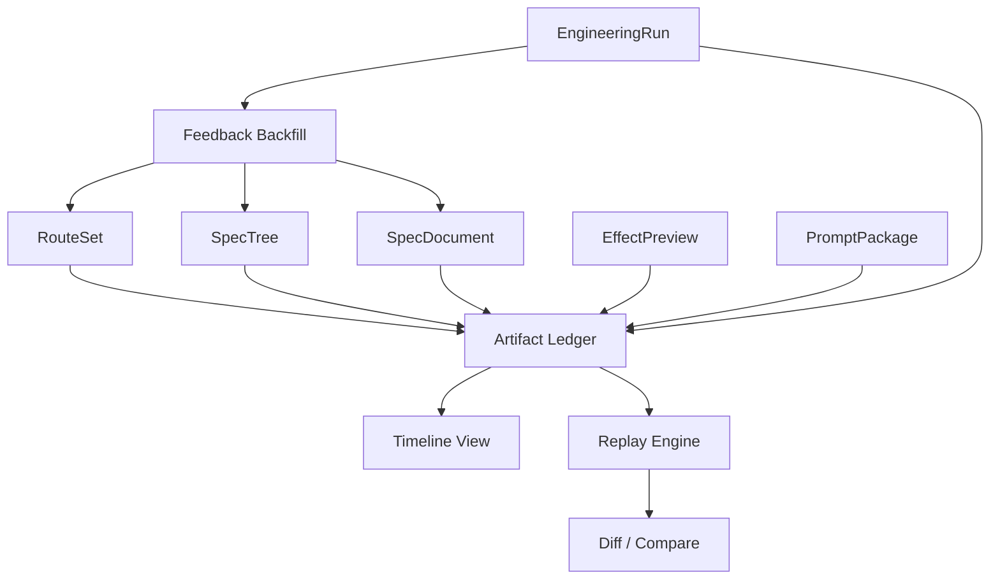

# 设计文档：资产记忆与回放

## 概述

本设计负责把自动驾驶系统中所有中间产物和最终产物都保存下来，并提供回放、比较、回填和时间线能力。

它是整个 SPEC 工作流的“记忆层”，决定系统是否会越用越聪明、越看越清楚。

## 架构

## 核心组件

### Artifact Ledger

负责统一保存各种产物，并记录来源、版本和时间戳。  
它是项目资产的事实来源之一。

### Replay Engine

负责将某次路线生成、文档生成或工程执行重放出来。  
重放时可以按阶段展开，也可以按单个资产查看。

### Diff / Compare

负责比较两个版本之间的差异。  
可以用于路线比较、树比较、文档比较和提示词比较。

### Feedback Backfill

负责把执行结果、日志和失败信息回填到资产链上。  
这是系统持续演化的关键。

## 数据流

1. 任意一次生成或执行写入 Artifact Ledger。  
2. Ledger 建立来源和版本索引。  
3. 前端通过 Timeline 和 Replay 查看历史。  
4. 执行反馈通过 Backfill 进入路线、树和文档。  
5. 下游下一次生成会基于最新资产继续演化。

## 正确性属性

- 任意产物都必须可追溯到来源资产。  
- 任意回放都应可定位到原始版本。  
- 任意回填都不应覆盖历史事实。  

## 测试策略

- 产物保存测试  
- 回放一致性测试  
- 版本比较测试  
- 回填谱系测试
