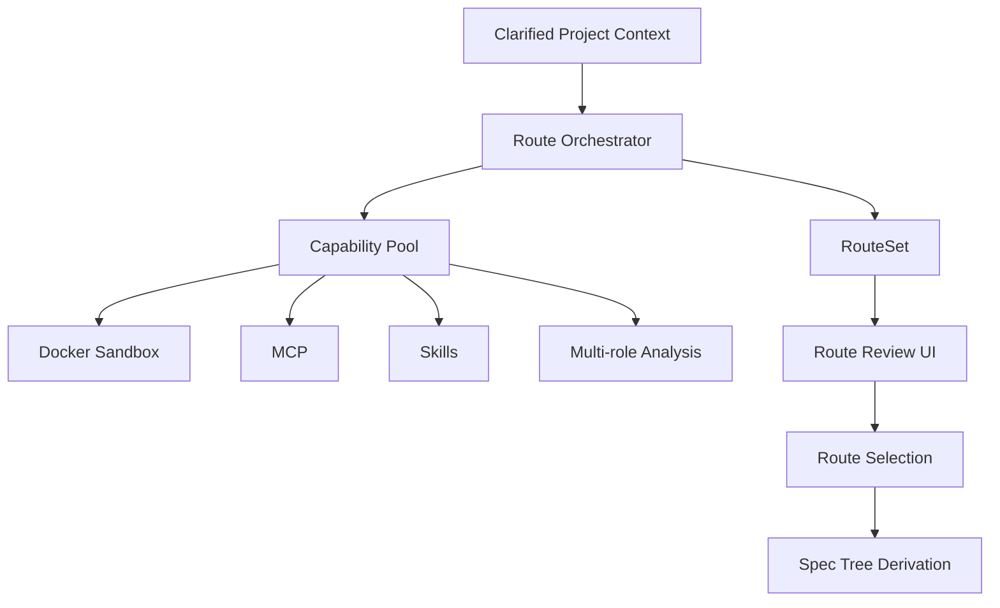

# 设计文档：自动驾驶路线编排

## 概述

本设计负责把澄清完成的项目上下文变成路线集。它是 `/autopilot` 的核心差异化能力，负责先规划主路和次路，再把这份路线资产交给 SPEC 树推导。

## 架构

## 核心组件

### Route Orchestrator

负责协调分析过程，生成主路径和备选路径，并输出统一的 RouteSet。  
它不直接进入代码执行，而是先完成路线推演和风险比较。

### Capability Pool

负责承载 Docker 沙盒、MCP、Skills、多角色分析和其他 AIGC 节点能力。  
不同能力产出的结果需要回收为同一条路线的证据和摘要。

### Route Review UI

负责展示主路径、备选路径、风险、成本和步骤大纲。  
用户可以在这里选择、合并或回退路线。

### RouteSet Asset

负责保存每次自动驾驶的结果，包括路径、证据、选择状态和来源上下文。  
它是后续 SPEC 树推导的直接输入。

## 数据流

1. 澄清后的 Project Context 进入 Route Orchestrator。  
2. Orchestrator 将分析任务分发给 Capability Pool。  
3. 多角色分析结果回收并归并为 RouteCandidates。  
4. Orchestrator 生成 RouteSet 并记录风险、成本和复杂度。  
5. 用户在 Review UI 中确认主路径或次选路径。  
6. 选定结果进入 SPEC Tree Derivation。

## 正确性属性

- 每次路线生成都应至少包含一条主路径。  
- 任意备选路径都必须可追溯到输入上下文和分析证据。  
- 用户选择后的路线应被持久化为项目资产。  

## 测试策略

- 路线生成测试  
- 路线选择与合并测试  
- 能力池回收测试  
- 路线资产持久化测试
