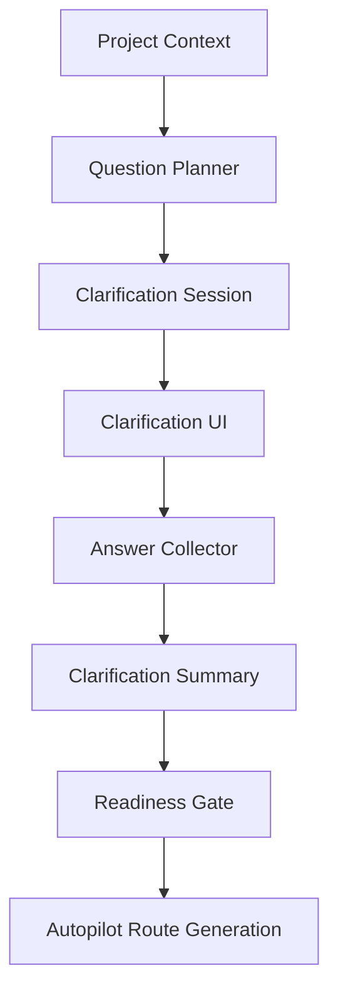

# 设计文档：澄清工作流

## 概述

本设计负责把输入入口推进到可推演状态。澄清工作流连接输入摄取与自动驾驶路线生成，是将“模糊意图”收敛成“明确上下文”的关键闸门。

## 架构

## 核心组件

### Question Planner

根据项目类型、缺失字段和已有上下文生成问题。  
可按“目标、范围、约束、优先级、交付形态、验收标准”几个维度分类。

### Clarification Session

保存问题列表、答案列表、默认假设、轮次和完成状态。  
建议使用项目作用域的会话模型，避免多个项目的澄清互相污染。

### Answer Collector

负责将用户回答写回会话，并同步更新项目资产。  
对于跳过项，记录默认假设或待确认状态。

### Readiness Gate

根据完成度、缺失字段和答案质量判断是否可以进入路线生成。  
这一步要非常保守，宁可继续澄清，也不要过早进入路线阶段。

## 数据流

1. Project Context 进入 Question Planner。  
2. Planner 生成 ClarificationQuestion 列表。  
3. UI 呈现问题并收集答案。  
4. Answer Collector 写入 ClarificationSession。  
5. Summary 生成澄清摘要和准备度信号。  
6. Readiness Gate 决定是否放行到路线生成。

## 正确性属性

- 已明确的问题不应再次重复出现。  
- 跳过的问题必须保留默认假设或待确认状态。  
- 未达到准备度阈值时，不应直接进入路线生成。  

## 测试策略

- 问题生成覆盖测试  
- 多轮回答测试  
- 跳过与默认假设测试  
- 准备度门禁测试  
- 澄清摘要回放测试
