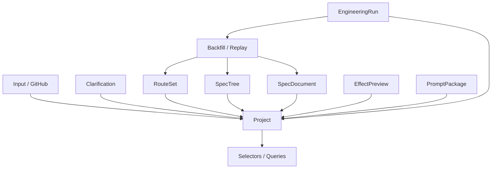

# 设计文档：项目资产底座

## 概述

本设计定义一个统一的项目资产层，作为所有自动驾驶、推导、文档、预演和落地菜单的共同数据基础。  
它与现有的 `project-store.ts` 和 `tasks-store.ts` 思想保持一致，但语义上更强调整个 SPEC 资产链。

## 架构

## 核心组件

### Asset Repository

负责资产持久化、版本索引和查询。  
可以是现有 store 的扩展，也可以是单独的 repository 层。

### Provenance Tracker

记录每个资产来自哪次输入、哪轮澄清、哪条路线和哪次生成。  
这是后续审阅与回放的核心依据。

### Selectors / Queries

负责给前端提供项目视图、当前版本、最新文档、当前预演和执行状态。  
工作台界面只消费这里的派生结果，不直接拼装底层数据。

### Backfill Pipeline

负责把执行结果、日志和 replay 回写到路线、树和文档资产。  
它让系统从“产出文档”变成“持续演化资产”。

## 数据流

1. 入口、澄清和路线生成产生基础资产。  
2. 资产写入 Project 作用域。  
3. 选择和版本信息通过 selectors 暴露给前端。  
4. 执行结果和 replay 通过 backfill pipeline 回写资产。  
5. 后续菜单读取最新版本继续演化。

## 正确性属性

- 任意资产必须能追溯到 projectId。  
- 任意版本化资产都应保留前后版本关系。  
- 任意回写都不应覆盖历史证据。  

## 测试策略

- 资产模型测试  
- 版本链测试  
- 项目作用域查询测试  
- 回写谱系测试
