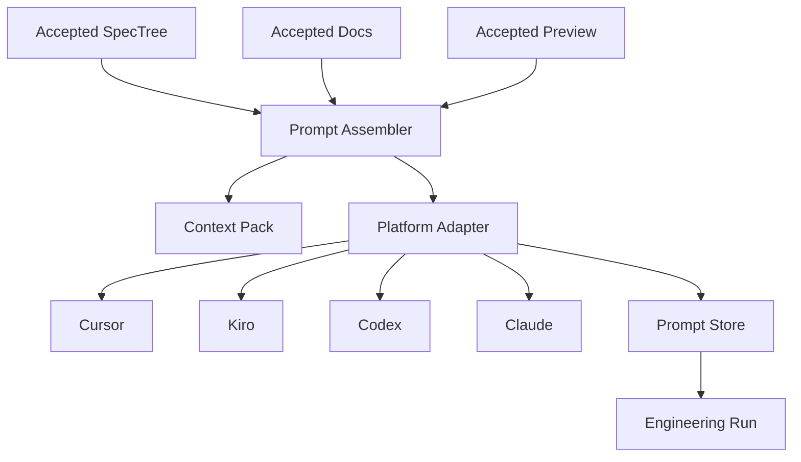

# 设计文档：实现提示词打包

## 概述

本设计负责把确定的 SPEC 资产转换为跨平台实现提示词。  
它消费 accepted 的 SpecTree、SpecDocument 和 EffectPreview，输出可复制、可导出、可执行的 PromptPackage。

## 架构

## 核心组件

### Prompt Assembler

负责从 SPEC 树、规格文档和效果预演中提取上下文，并生成实现目标、约束、文件范围和验收标准。

### Context Pack Builder

负责压缩项目上下文、节点关系、设计说明和预演结果，避免提示词过长但仍保持关键语义。

### Platform Adapter

负责按目标平台输出不同格式。  
例如 Codex 可以偏任务执行，Cursor 可以偏文件范围，Claude 可以偏长上下文推理。

### Prompt Store

负责保存版本、导出状态和执行回填关系。

## 数据流

1. 用户选择节点、子树或整树。  
2. Prompt Assembler 收集 accepted 资产。  
3. Platform Adapter 输出平台格式。  
4. 用户复制或导出 PromptPackage。  
5. 工程落地模块消费 PromptPackage 并回填执行结果。

## 正确性属性

- 任意 PromptPackage 都必须绑定至少一个 SpecNode。  
- PromptPackage 必须声明目标平台和验证计划。  
- 已导出的提示词重新生成时不得覆盖旧版本。  

## 测试策略

- PromptPackage 生成测试  
- 平台适配测试  
- 上下文裁剪测试  
- 验证计划绑定测试
