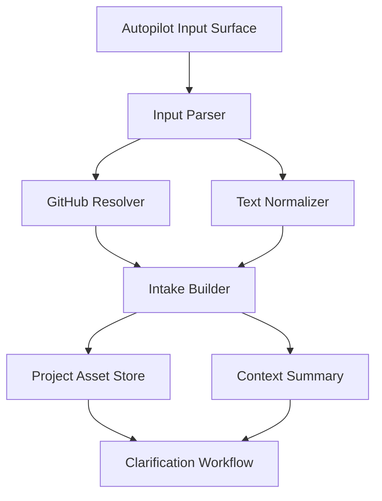

# 设计文档：输入与 GitHub 上下文摄取

## 概述

本设计负责把 `/autopilot` 的第一层输入变成统一的项目入口。前端可以来自当前工作台的文本输入、GitHub 链接列表或已有项目入口；后端则负责解析仓库信息、规范化来源并写入项目资产存储。

这一层不做路线规划，也不做 SPEC 推导，只做上下文收集与归一化。

## 架构

## 核心组件

### Input Parser

负责识别文本、GitHub URL、多个链接、附件和已有项目引用，并输出结构化输入。  
建议与当前 `UnifiedLaunchComposer` 的输入体验兼容，但语义改为项目入口摄取而非立即执行。

### GitHub Resolver

负责拉取或读取仓库元信息，包括仓库名、README、分支、语言分布、目录层级和关键路径。  
当仓库不可访问时，Resolver 只返回失败状态和原因，不阻断后续文本路径。

### Intake Builder

负责把原始输入和 GitHubSource 合并成 `IntakeRecord` 与 `ProjectContext`。  
它会生成统一摘要、来源证据和后续澄清所需的基础字段。

### Project Asset Store

负责保存入口记录、原始来源和解析摘要。  
后续澄清、路线生成、SPEC 树和文档系统都通过 `projectId` 反查这一层的数据。

## 数据流

1. 用户在自动驾驶页输入目标、想法或 GitHub 链接。  
2. Input Parser 输出结构化输入。  
3. GitHub Resolver 解析仓库上下文并记录失败/成功状态。  
4. Intake Builder 生成 IntakeRecord 和 ProjectContext。  
5. Project Asset Store 持久化入口资产。  
6. 系统将 ProjectContext 送入澄清流程。

## 正确性属性

- 任意重复链接都不应生成重复来源资产。  
- 任意一个有效输入会话都应至少生成一个可追踪的 IntakeRecord。  
- 任何仓库解析失败都不应阻断纯文本入口。  

## 测试策略

- 输入类型识别测试  
- GitHub URL 解析测试  
- 多链接去重测试  
- 不可访问仓库降级测试  
- IntakeRecord 持久化测试
