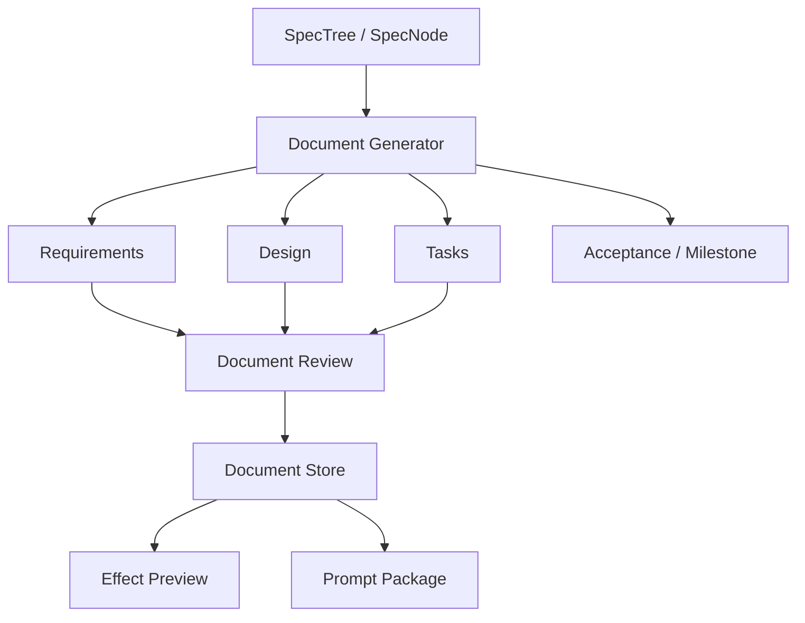

# 设计文档：规格文档生成

## 概述

本设计负责把 SPEC 树节点展开为可审阅的实现文档。它位于 SPEC 树之后、效果预演之前，是“结构资产”走向“实现说明”的桥。

## 架构

## 核心组件

### Document Generator

基于节点类型、节点摘要、依赖、风险和来源路线生成文档。  
不同节点类型可以使用不同模板，例如 page、api、data、workflow、infra。

### Document Store

保存文档版本、状态、来源节点和 diff 信息。  
建议与项目资产底座保持同一套 version/provenance 机制。

### Review Surface

负责显示文档内容、diff、接受状态和重新生成入口。  
用户确认后的文档才应作为下游预演和提示词输入。

## 数据流

1. 用户在规格文档菜单中选择节点或子树。  
2. Document Generator 生成 Requirements、Design、Tasks。  
3. 用户审阅并修改文档。  
4. 系统保存 DocumentVersion。  
5. accepted 文档进入效果预演和提示词生成。

## 正确性属性

- 任意 SpecDocument 都必须绑定至少一个 SpecNode。  
- 重新生成文档不应覆盖用户接受过的历史版本。  
- 下游模块只能消费当前 accepted 或 explicitly selected 的文档版本。  

## 测试策略

- 节点到文档生成测试  
- 文档版本与 diff 测试  
- 文档状态同步测试  
- 下游查询测试
