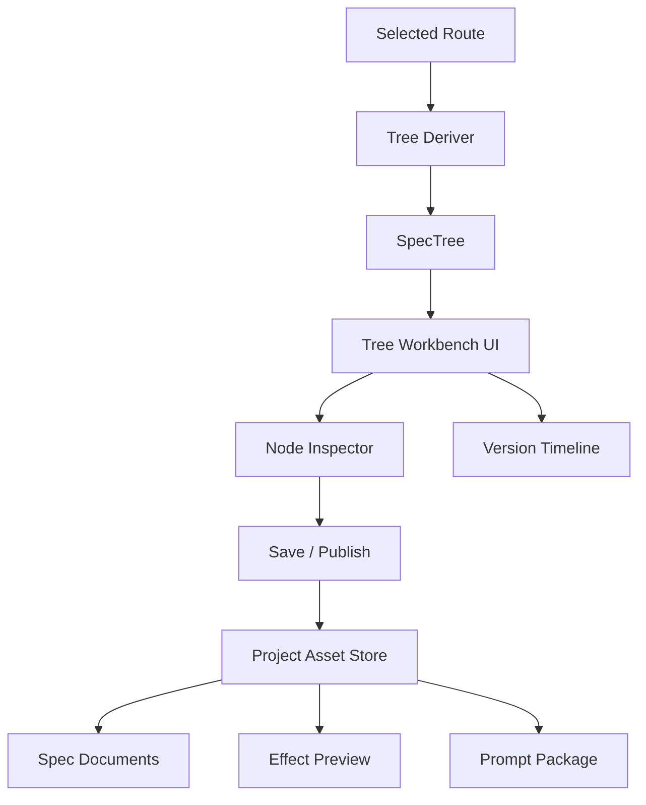

# 设计文档：SPEC 树工作台

## 概述

本设计负责把自动驾驶路线集转换成可编辑的 SPEC 树，并提供节点级编辑、版本管理和保存能力。

它是“路线 -> 资产 -> 文档”的中枢，决定项目的结构是否真正站得住。

## 架构

## 核心组件

### Tree Deriver

负责把路线结构映射为树结构。  
主路径形成主干，次选路径可保留为分支或候选节点。

### Tree Workbench UI

负责展示树形结构、节点关系和版本状态。  
需要支持快速浏览、局部编辑和批量结构调整。

### Node Inspector

负责编辑节点标题、类型、优先级、风险、依赖和说明。  
它是节点级微调的入口。

### Version Timeline

负责展示每个 TreeVersion 的来源、差异和保存时间。  
它让用户对树的演化过程有完整感知。

## 数据流

1. 用户在自动驾驶阶段选定路线。  
2. Tree Deriver 生成初始 SpecTree。  
3. UI 展示树并允许编辑。  
4. 用户修改后生成新的 TreeVersion。  
5. 当前树保存到项目资产存储。  
6. 下游菜单按树版本继续展开。

## 正确性属性

- 任意 SpecNode 都必须可追溯到路线或前一版本。  
- 任意保存都必须产生可比较的版本快照。  
- 任意节点编辑都不应丢失父子关系和依赖信息。  

## 测试策略

- 路线到树的映射测试  
- 节点编辑测试  
- 版本差异测试  
- 树保存与回退测试
