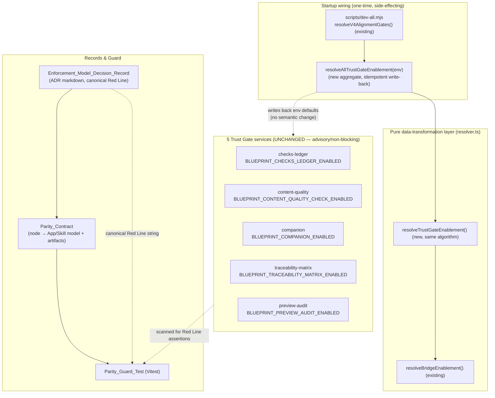
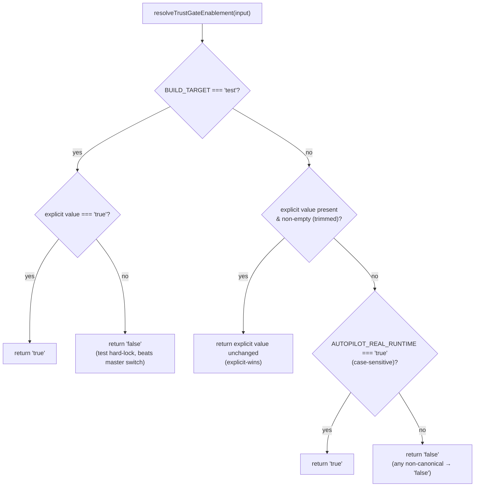

# Design Document

## Overview

This feature closes three gaps between the SlideRule v4 closed-loop diagram and its two parallel
implementations (Track A — the in-app TypeScript "blueprint" pipeline; Track B — the portable
Claude Skill). It does **not** add product capability and it does **not** change runtime behavior of
any existing trust gate. It adds:

1. **`Trust_Gate_Resolver`** — a pure data-transformation layer, added alongside the existing
   `resolveBridgeEnablement` / `resolveAllBridgeEnablement` in
   `server/routes/blueprint/runtime-enablement/resolver.ts`, that resolves the enable/disable
   *default* of the 5 Trust Gates (`BLUEPRINT_CHECKS_LEDGER_ENABLED`,
   `BLUEPRINT_CONTENT_QUALITY_CHECK_ENABLED`, `BLUEPRINT_COMPANION_ENABLED`,
   `BLUEPRINT_TRACEABILITY_MATRIX_ENABLED`, `BLUEPRINT_PREVIEW_AUDIT_ENABLED`) consistently with the
   `AUTOPILOT_REAL_RUNTIME` master switch. It reuses the existing 4-step algorithm verbatim
   (test hard-lock → explicit-wins → master-switch default → unknown) and the idempotent
   env write-back. (Requirement 1.)

2. **`Enforcement_Model_Decision_Record`** — an Architecture Decision Record (ADR) markdown document
   capturing the intentional App=advisory / Skill=hard-gate fork, both rationales, and a single
   canonical, verbatim **Red Line** statement. (Requirement 2.)

3. **`Parity_Contract`** + **`Parity_Guard_Test`** — a document mapping each enforcement-relevant v4
   node to its App vs Skill enforcement model + artifacts, plus an automated Vitest guard that fails
   when the mapping drifts or when the App asserts the Skill's "agent-can't-touch" guarantee.
   (Requirements 3 and 4.)

### Design Principles

- **Reuse, don't reinvent.** The resolver mirrors the proven bridge resolver one-to-one. The same
  4-step algorithm, the same `"true" | "false" | undefined` value space, the same idempotent
  write-back contract. No new branch is introduced for Trust Gates.
- **Resolve defaults only, never change semantics.** The resolver decides whether a gate's *default*
  is `"true"` or `"false"`. It never touches the advisory/non-blocking nature of any gate and never
  introduces auto-blocking. Each gate's service (`checks-ledger`, `content-quality`, `companion`,
  `traceability-matrix`, `preview-audit`) keeps its own `env === "true"` early-exit unchanged and
  keeps recording findings for human review rather than blocking.
- **The Red Line is data, not prose.** The ADR holds one canonical Red Line string. The Parity
  Contract and the Parity Guard Test consume that exact string as a literal pass/fail criterion, so
  the constraint is enforced by CI, not by memory.
- **Pure core, thin wiring.** All decision logic lives in pure functions. The only side effect is the
  idempotent env write-back performed by the aggregate resolver at a startup wiring point analogous
  to `dev-all.mjs`'s `resolveV4AlignmentGates()`.

### Verified Context (treated as fixed)

- The 5 Trust Gates are already ON by default through `scripts/dev-all.mjs`'s
  `resolveV4AlignmentGates()` (`process.env.X ?? "true"`). This spec preserves that behavior.
- The trust UI (`TrustSection` + `ChecksLedgerPanel` / `TraceabilityMatrixPanel` /
  `CompanionFindingsPanel`) is already mounted. This spec does not build trust UI.
- The latent hazard: the 5 gates are **absent** from `BRIDGE_ENABLEMENT_KEYS` and do not honor the
  master switch at the resolver level, so a launch that sets `AUTOPILOT_REAL_RUNTIME=true` but
  bypasses `dev-all.mjs` runs the 6 capability bridges as real while the trust loop stays silently
  off. Requirement 1 fixes exactly this.

## Architecture

### Component Map



### Resolution Flow (Requirement 1)

The new `resolveTrustGateEnablement` is structurally identical to the existing
`resolveBridgeEnablement`. For each of the 5 Trust Gates the aggregate resolver passes a 4-field
input tuple and applies the same precedence ladder:



**One deliberate divergence from the bridge resolver.** The bridge resolver's "unknown" step returns
`undefined` (legacy "flag unset" semantics). The Trust Gate resolver must always resolve to a value
within `{"true", "false"}` (Requirement 1.1, 1.4). So the new resolver collapses the bridge
resolver's Step 3 "master switch" + Step 4 "unknown" into a single rule: **`AUTOPILOT_REAL_RUNTIME`
resolves to `"true"` only when it equals exactly the case-sensitive string `"true"`; every other
value — unset, empty, `"TRUE"`, `"1"`, `"yes"`, garbage — resolves to `"false"`.** This matches the
existing `dev-all.mjs` `?? "true"` opt-out-on default (master set to `"true"` ⇒ on) while guaranteeing
a fully defined output. The explicit-value trimming rule (Requirement 1.2) likewise extends the bridge
resolver's `!== "" ` check to also treat whitespace-only explicit values as "not set".

### Startup Wiring

A wiring point analogous to `dev-all.mjs`'s `resolveV4AlignmentGates()` calls the new aggregate
`resolveAllTrustGateEnablement(process.env)` exactly once at startup, before the blueprint service
context (`buildBlueprintServiceContext`) reads `process.env.BLUEPRINT_*_ENABLED` to decide whether to
wire each gate service. Because the resolver writes resolved defaults back into the env object, the
existing `=== "true"` checks in `context.ts` and in each gate service observe the new defaults with
**no change to gate code**. `dev-all.mjs` continues to inject its own `?? "true"` defaults; when those
are already set, the resolver's explicit-wins path returns them unchanged, so `dev:all` behavior is
preserved exactly (Requirement 1.8).

## Components and Interfaces

### C1. `resolveTrustGateEnablement` (pure function — new, in `resolver.ts`)

Mirrors `resolveBridgeEnablement`. Computes the final `"true" | "false"` decision for a single Trust
Gate from a 4-field input tuple, with no `process.env` reads and no side effects.

```typescript
/** The 5 Trust Gate env flag names. Mirrors BRIDGE_ENABLEMENT_KEYS. */
export const TRUST_GATE_ENABLEMENT_KEYS = [
  "BLUEPRINT_CHECKS_LEDGER_ENABLED",
  "BLUEPRINT_CONTENT_QUALITY_CHECK_ENABLED",
  "BLUEPRINT_COMPANION_ENABLED",
  "BLUEPRINT_TRACEABILITY_MATRIX_ENABLED",
  "BLUEPRINT_PREVIEW_AUDIT_ENABLED",
] as const;

export type TrustGateEnablementKey = (typeof TRUST_GATE_ENABLEMENT_KEYS)[number];

/** Trust Gates always resolve to a defined value (Requirement 1.1). */
export type ResolvedTrustGateValue = "true" | "false";

export interface ResolveTrustGateInput {
  envFlag: TrustGateEnablementKey;
  explicitEnvValue: string | undefined;   // process.env[envFlag]
  masterSwitch: string | undefined;       // process.env.AUTOPILOT_REAL_RUNTIME
  buildTarget: string | undefined;        // process.env.BUILD_TARGET
}

export function resolveTrustGateEnablement(
  input: ResolveTrustGateInput,
): ResolvedTrustGateValue;
```

Algorithm (verbatim mirror of the bridge resolver, with the two divergences noted in Architecture):

1. **Test hard-lock.** If `buildTarget === "test"`: return `"true"` iff the trimmed explicit value is
   exactly `"true"`, else `"false"`. (Requirements 1.5, 1.6.)
2. **Explicit-wins.** If the explicit value is present and non-empty after trimming whitespace, return
   it unchanged. (Requirement 1.2.) Note: a non-canonical explicit value (e.g. `"on"`) is returned
   as-is here — explicit operator intent is never silently overridden. The resolver normalizes only
   *defaults*, not explicit values.
3. **Master-switch default.** Return `"true"` iff `masterSwitch === "true"` (case-sensitive). (Req 1.3.)
4. **Default.** Otherwise return `"false"` — covering unset, empty, and all non-canonical master-switch
   values. (Requirement 1.4.)

> Step 2 returns the explicit value unchanged to honor explicit-wins. The aggregate resolver
> (C2) is what guarantees a `{"true","false"}`-domain *result view* for callers; see C2.

### C2. `resolveAllTrustGateEnablement` (aggregate + idempotent write-back — new)

Mirrors `resolveAllBridgeEnablement`. Resolves all 5 gates in one pass and writes resolved defaults
back into the supplied env object.

```typescript
export interface ResolvedTrustGates {
  checksLedger: ResolvedTrustGateValue;
  contentQuality: ResolvedTrustGateValue;
  companion: ResolvedTrustGateValue;
  traceabilityMatrix: ResolvedTrustGateValue;
  previewAudit: ResolvedTrustGateValue;
}

export function resolveAllTrustGateEnablement(
  env: NodeJS.ProcessEnv,
): ResolvedTrustGates;
```

Behavior:

- For each key, compute the resolved value via `resolveTrustGateEnablement`.
- **Write-back only when needed (idempotency, Requirement 1.7):** assign `env[key] = resolved` only
  when `env[key] !== resolved`. A second call observes the already-written values and performs no
  further writes.
- Returns the aggregate view. Each field is the post-write-back value coerced to
  `ResolvedTrustGateValue`. (An explicit non-canonical value preserved by Step 2 is surfaced as-is in
  the aggregate, matching the bridge resolver's `readResolvedValue` behavior.)

### C3. Startup wiring hook (thin — new)

A small exported helper (e.g. `applyTrustGateDefaults()`), invoked once at server startup adjacent to
the existing bridge wiring, that calls `resolveAllTrustGateEnablement(process.env)`. This is the only
place that performs the side-effecting env write-back, mirroring how `resolveV4AlignmentGates()` is
applied in `dev-all.mjs`. It must run before `buildBlueprintServiceContext` reads the flags.

### C4. `Enforcement_Model_Decision_Record` (ADR markdown — new)

A single version-controlled markdown ADR (e.g.
`.kiro/specs/blueprint-trust-enforcement-model/enforcement-model-decision-record.md`, or a repo
`docs/adr/` entry). Required content (Requirement 2):

- **Decision:** App = advisory/non-blocking enforcement; Skill = hard-gate enforcement; the fork is
  intentional; the App's advisory model is **not a defect to be remediated**. (2.1)
- **App rationale (supervised cockpit):** a human watches the right-rail in real time and is the gate;
  findings are recorded to the checks ledger and surfaced for review, never auto-blocked. (2.2)
- **Skill rationale (unattended agent host):** the enforcer lives outside the agent's control because
  the agent itself may cheat (`gate.py` hard gate + user-run `check_previews_real.py` audit). (2.3)
- **Red Line statement (2.4, 2.5):** a single canonical, verbatim line in a fenced, uniquely
  delimited block that the Parity Guard Test reads unchanged as its literal pass/fail criterion. The
  canonical string is:

  > The App must never claim or imply the Skill's "agent-can't-touch" guarantee.

- The ADR is one committed file (2.6) and is cross-referenced from at least one fixed
  version-controlled entry point (2.7) — the Parity Contract links to it, and the resolver module
  doc-comment references it.

### C5. `Parity_Contract` (document + machine-readable table — new)

A version-controlled document (markdown) backed by a machine-readable mapping (a typed `const`
table the guard test imports, or a fenced JSON block the test parses). Required content
(Requirement 3):

- Enumerates each enforcement-relevant v4 node (3.1): checks ledger, content-quality check,
  companion critic/grounding, traceability matrix, preview/output audit.
- For each node: App enforcement model and Skill enforcement model (3.2).
- For each node whose App/Skill models differ: the reason for divergence (3.3).
- For each node: the App artifact (env flag / route / component) and Skill artifact (script) (3.4).
- Records the canonical Red Line as a property that holds across **all** nodes (3.5), referencing the
  ADR's verbatim string.

### C6. `Parity_Guard_Test` (Vitest — new)

An automated test runnable by the existing Vitest runner (Requirement 4.5). It performs:

- **Mapping-drift check (4.1):** for each node in the Parity Contract, assert the codebase reality
  matches the recorded mapping — App artifact (env flag constant present in
  `TRUST_GATE_ENABLEMENT_KEYS`, route/component exists) and Skill artifact (script file exists under
  `skills/sliderule/**`). A mismatch fails the test.
- **Red Line check (4.2):** scan App trust-surface sources (the 5 gate services and the `trust/`
  right-rail panel text) for assertions/implications of the Skill's hard-gate / "agent-can't-touch"
  guarantee using a denylist derived from the ADR's canonical concepts. Any match fails the test.
- **Pass condition (4.3):** when the mapping matches and no Red Line assertion is found, the test
  passes.
- **Diagnostic reporting (4.4):** on failure, report which node mapping drifted or which Red Line
  assertion was detected (file + matched phrase).

## Data Models

### Trust Gate resolution types

```typescript
// Pure resolver value space — always defined (Requirement 1.1).
type ResolvedTrustGateValue = "true" | "false";

type TrustGateEnablementKey =
  | "BLUEPRINT_CHECKS_LEDGER_ENABLED"
  | "BLUEPRINT_CONTENT_QUALITY_CHECK_ENABLED"
  | "BLUEPRINT_COMPANION_ENABLED"
  | "BLUEPRINT_TRACEABILITY_MATRIX_ENABLED"
  | "BLUEPRINT_PREVIEW_AUDIT_ENABLED";

interface ResolveTrustGateInput {
  envFlag: TrustGateEnablementKey;
  explicitEnvValue: string | undefined;
  masterSwitch: string | undefined;
  buildTarget: string | undefined;
}

interface ResolvedTrustGates {
  checksLedger: ResolvedTrustGateValue;
  contentQuality: ResolvedTrustGateValue;
  companion: ResolvedTrustGateValue;
  traceabilityMatrix: ResolvedTrustGateValue;
  previewAudit: ResolvedTrustGateValue;
}
```

### Parity Contract node model

```typescript
type EnforcementModel = "advisory" | "hard-gate";

interface ParityNode {
  /** Stable id, e.g. "checks-ledger". */
  nodeId: string;
  /** Human label of the v4 diagram node. */
  label: string;
  appModel: EnforcementModel;            // always "advisory" for Track A
  skillModel: EnforcementModel;          // "hard-gate" for enforced Skill nodes
  /** Required when appModel !== skillModel (Requirement 3.3). */
  divergenceReason?: string;
  /** App artifact: env flag, route, or component (Requirement 3.4). */
  appArtifact: { envFlag?: TrustGateEnablementKey; route?: string; component?: string };
  /** Skill artifact: script path under skills/sliderule/** (Requirement 3.4). */
  skillArtifact: { script: string };
}

interface ParityContract {
  /** The canonical Red Line, copied verbatim from the ADR (Requirements 3.5, 2.5). */
  redLine: string;
  nodes: ParityNode[];
}
```

### Concrete node mapping (initial)

| Node | App model | Skill model | App artifact | Skill artifact |
| --- | --- | --- | --- | --- |
| Checks ledger | advisory | hard-gate | `BLUEPRINT_CHECKS_LEDGER_ENABLED`, `checks-ledger/service.ts`, `ChecksLedgerPanel` | `scripts/gate.py` |
| Content-quality check | advisory | hard-gate | `BLUEPRINT_CONTENT_QUALITY_CHECK_ENABLED`, `content-quality/service.ts` | `scripts/check_content_quality.py` |
| Companion critic/grounding | advisory | hard-gate | `BLUEPRINT_COMPANION_ENABLED`, `companion/service.ts`, `CompanionFindingsPanel` | `scripts/check_companion.py` |
| Traceability matrix | advisory | hard-gate | `BLUEPRINT_TRACEABILITY_MATRIX_ENABLED`, `traceability-matrix/service.ts`, `TraceabilityMatrixPanel` | `scripts/validate_spec_tree.py` |
| Preview/output audit | advisory | hard-gate | `BLUEPRINT_PREVIEW_AUDIT_ENABLED`, `preview-audit/service.ts` | `scripts/check_previews_real.py` / `scripts/finalize_previews.py` |

Every node diverges (App advisory vs Skill hard-gate), so every row carries a `divergenceReason`
rooted in the supervised-cockpit vs unattended-agent-host distinction. The `redLine` field holds the
ADR's verbatim string and is asserted to hold across all nodes.

## Correctness Properties

*A property is a characteristic or behavior that should hold true across all valid executions of a
system — essentially, a formal statement about what the system should do. Properties serve as the
bridge between human-readable specifications and machine-verifiable correctness guarantees.*

The `Trust_Gate_Resolver` is a pure data-transformation layer, so property-based testing applies
directly. The guard-test detectors (drift detection, Red Line scanning) and the Parity Contract data
are likewise pure and input-varying. The properties below are derived from the prework analysis. The
generators MUST include adversarial master-switch / explicit-value strings — `"true"`, `"false"`,
`""`, whitespace-only, `"TRUE"`, `"True"`, `"1"`, `"yes"`, random unicode, and `undefined` — to
exercise the case-sensitive and non-canonical paths.

### Property 1: Resolution is total and well-typed

*For any* environment input (any combination of master switch, build target, and the 5 explicit flag
values), the aggregate resolver SHALL return a result containing all 5 Trust Gates, with each
resolved value within the set `{"true", "false"}`.

**Validates: Requirements 1.1**

### Property 2: Explicit per-flag value wins (outside test build)

*For any* Trust Gate, *for any* master switch value, when `BUILD_TARGET` is not `"test"` and the
explicit per-flag value is present and non-empty after trimming whitespace, the resolver SHALL return
that explicit value unchanged; and *for any* whitespace-only or empty explicit value, the resolver
SHALL treat it as unset and fall through to the master-switch default.

**Validates: Requirements 1.2**

### Property 3: Master-switch default resolves true iff exactly "true"

*For any* Trust Gate with no explicit value set and `BUILD_TARGET` not `"test"`, the resolved default
SHALL be `"true"` when `AUTOPILOT_REAL_RUNTIME` equals exactly the case-sensitive string `"true"`, and
SHALL be `"false"` for every other master-switch value including unset, empty, and non-canonical
values such as `"TRUE"`, `"1"`, and `"yes"`.

**Validates: Requirements 1.3, 1.4**

### Property 4: Test build-target hard-lock precedence

*For any* Trust Gate and *for any* master switch value, when `BUILD_TARGET` equals `"test"` the
resolver SHALL resolve to `"true"` if and only if the trimmed explicit value is exactly `"true"`, and
to `"false"` otherwise; this test-lock SHALL hold even when the master switch is `"true"`.

**Validates: Requirements 1.5, 1.6**

### Property 5: Idempotency and no further write-back

*For any* environment input, running the aggregate resolver twice SHALL produce identical resolved
results on both runs, and the environment object after the second run SHALL be byte-for-byte equal to
the environment object after the first run (no further write-backs occur after the first run).

**Validates: Requirements 1.7**

### Property 6: dev:all defaults-to-true preservation

*For any* operator pre-set environment in which each of the 5 Trust Gate flags is either unset or
already `"true"`, the master switch is `"true"`, and `BUILD_TARGET` is not `"test"` (the `dev:all`
launch shape produced by `resolveV4AlignmentGates()`'s `?? "true"` injection), all 5 Trust Gates
SHALL resolve to `"true"`.

**Validates: Requirements 1.8**

### Property 7: Parity Contract Red Line holds across all nodes

*For any* node enumerated in the Parity Contract, the node's App-side description SHALL NOT assert or
imply the Skill's "agent-can't-touch" guarantee, and the Parity Contract's recorded Red Line string
SHALL equal the canonical verbatim Red Line string defined in the Enforcement_Model_Decision_Record.

**Validates: Requirements 3.5, 2.5**

### Property 8: Parity Guard detects drift and Red Line violations and reports them

*For any* codebase-reality mapping compared against the Parity Contract, the guard SHALL fail if and
only if at least one node's mapping differs from the contract or a Red Line assertion is present in
the scanned App trust-surface text; and whenever it fails, the report SHALL name the specific drifted
node id or the matched Red Line phrase.

**Validates: Requirements 4.1, 4.2, 4.3, 4.4**

## Error Handling

The resolver is a pure function with a typed, total output, so its "errors" are degenerate inputs
rather than thrown exceptions:

- **Unset / empty / whitespace-only explicit values** are normalized to "not set" and resolved via the
  master-switch default. The resolver never throws on missing env keys.
- **Non-canonical master-switch values** (`"TRUE"`, `"1"`, `"yes"`, garbage) deterministically resolve
  the default to `"false"`. There is no error path; the value space is closed to `{"true","false"}`.
- **Non-canonical explicit values** are preserved unchanged by the explicit-wins rule (operator intent
  is never silently dropped); the aggregate view surfaces them as-is.
- **Idempotent write-back** never deletes or mutates unrelated env keys; it only assigns a resolved
  default when it differs from the current value, so re-entrancy and double-invocation are safe.

For the records and guard:

- **Missing ADR or Parity Contract file** ⇒ the Parity Guard Test fails with an explicit message
  identifying the missing artifact (this is a correct, intended failure: the records are required).
- **Missing Skill script or App artifact referenced by a node** ⇒ guard fails naming the node and the
  unresolved artifact (mapping drift).
- **Red Line string mismatch** between the contract and the ADR ⇒ guard fails, since the canonical
  string is the single source of truth.

## Testing Strategy

PBT **is** appropriate for the resolver core, the guard detectors, and the Parity Contract invariant,
because these are pure functions with large/adversarial input spaces and universal properties
(totality, precedence, idempotency, detection). PBT is **not** appropriate for the ADR/Parity Contract
content presence checks (fixed documents) or the "executable in the repo test runner" / "does not
introduce auto-blocking" constraints (structural/configuration facts) — those use example-based and
structural tests.

### Property-based tests (library: fast-check + Vitest)

- Implement each of Properties 1–8 with a **single** property-based test.
- Configure a minimum of **100 iterations** per property (`fc.assert(..., { numRuns: 100 })` or
  higher).
- Tag each test with a comment referencing its design property, in the format:
  `// Feature: blueprint-trust-enforcement-model, Property {number}: {property_text}`.
- Generators MUST draw from a shared "env-value vocabulary" arbitrary that mixes canonical values
  (`"true"`, `"false"`), empty/whitespace strings, case variants (`"TRUE"`, `"True"`), numeric/word
  lookalikes (`"1"`, `"yes"`, `"on"`), random strings, and `undefined`, so the case-sensitive and
  non-canonical paths are exercised every run.
- Place resolver property tests in `server/routes/blueprint/runtime-enablement/resolver.test.ts`
  (alongside the existing bridge resolver tests) or a sibling
  `trust-gate-resolver.property.test.ts`.

### Example-based unit tests

- **Resolver branch examples:** concrete cases for each ladder branch (test opt-in `"true"`, test lock
  `"false"`, explicit-wins outside test, master-on default, non-canonical master → `"false"`), as
  readable documentation of the precedence.
- **Requirement 1.9 (structural):** assert the resolver module exposes only the pure resolution API
  and returns the `ResolvedTrustGateValue` union — no blocking/throwing API — confirming defaults-only
  resolution that does not introduce auto-blocking.
- **ADR content (2.1–2.4, 2.6, 2.7):** assert the ADR file exists as a single committed document,
  contains the decision statement, both rationales, the Red Line, exactly one canonical Red Line
  block, and is cross-referenced from a fixed entry point.
- **Parity Contract structure (3.1–3.4):** assert all 5 nodes are enumerated; each has `appModel`,
  `skillModel`, `appArtifact`, and `skillArtifact`; each diverging node has a non-empty
  `divergenceReason`; and each referenced artifact resolves in the codebase.
- **Guard executability (4.5):** the Parity Guard Test runs under the existing Vitest runner (verified
  by the suite executing).

### Integration / smoke

- **Startup wiring smoke:** with a simulated env where `AUTOPILOT_REAL_RUNTIME="true"` and the 5 flags
  unset, invoke the startup hook and assert `process.env` for all 5 flags becomes `"true"` before
  `buildBlueprintServiceContext` reads them — demonstrating the latent-hazard fix end-to-end without
  changing gate semantics.
- **dev:all parity smoke:** assert the resolver applied to the `resolveV4AlignmentGates()` output
  yields all-`"true"`, confirming Requirement 1.8 at the integration boundary.

### Review and Approval

`requirements.md` exists for this requirements-first workflow. After this design is reviewed, if gaps
are identified in the requirements (for example, the exact canonical Red Line wording or the fixed
ADR entry point), I will offer to return to requirements clarification before proceeding to tasks.
