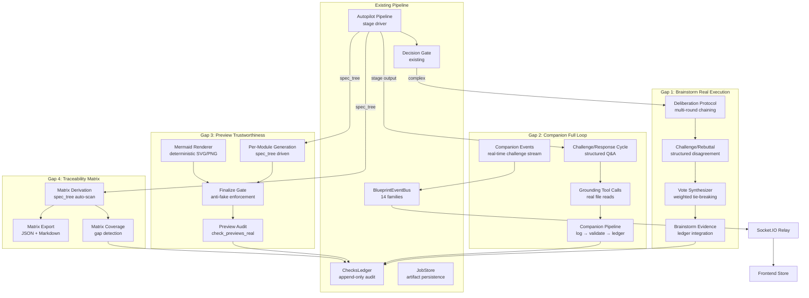
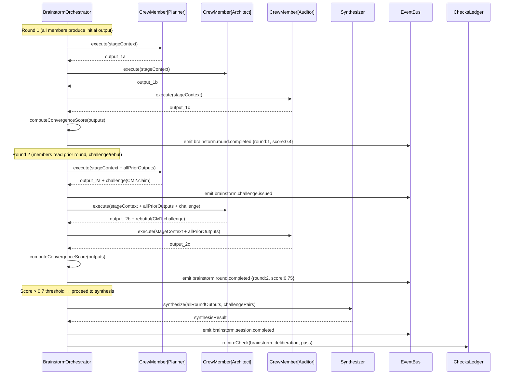
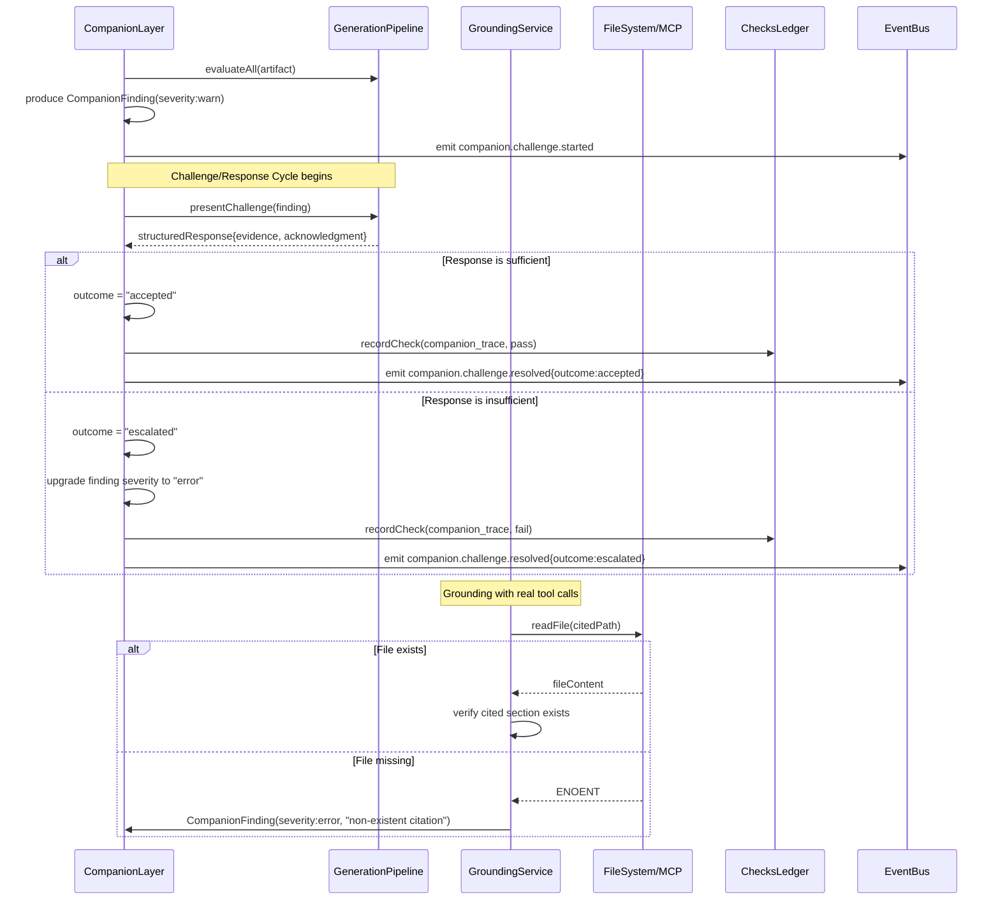
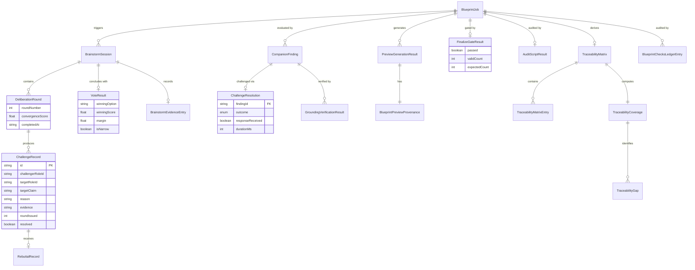
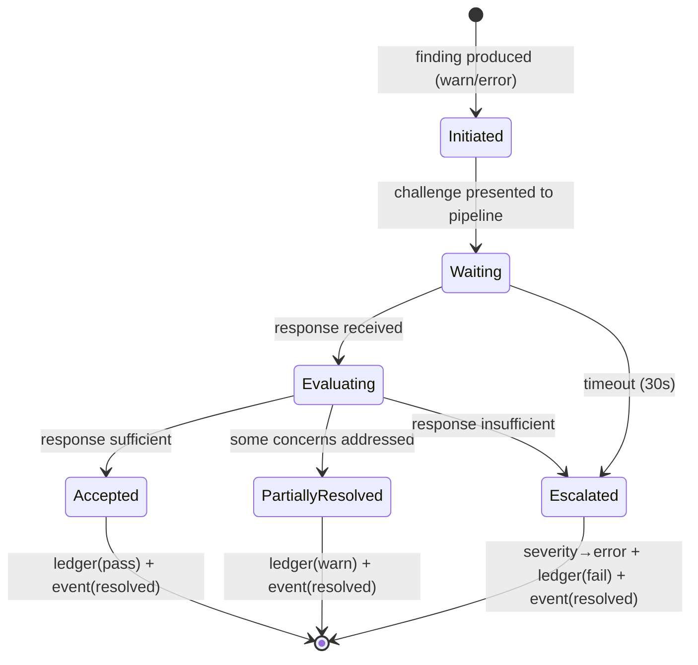
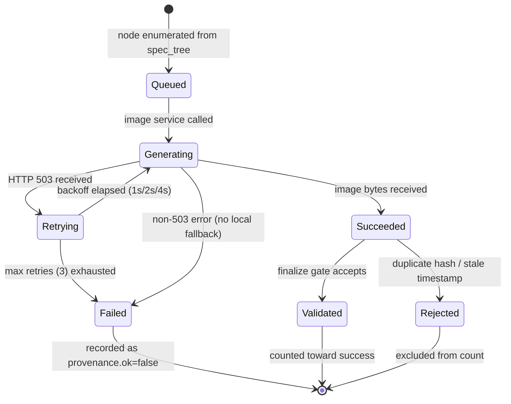
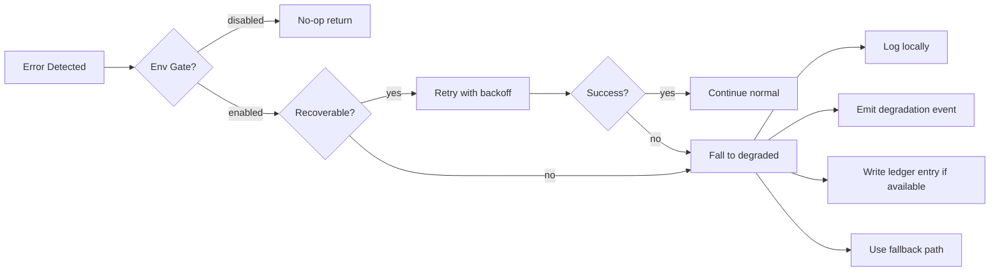

# Design Document: Blueprint v4 Full Loop Completion

## Overview

本设计将 WhyBuddy v4 闭环架构中四个已定义但未端到端接线的子系统推进为完整可运行实现：

1. **Brainstorm Real Execution** — 将多角色头脑风暴从并行独立产出升级为多轮辩论→挑战→投票→综合收敛闭环
2. **Companion Full Loop** — 将伴随层从孤立 findings 升级为结构化质疑/回应/升级闭环，并由真实工具调用支撑
3. **Preview Trustworthiness** — 实现按模块视觉预览生成、确定性 Mermaid 渲染、出图审计、finalize gate 全链路
4. **Traceability Matrix** — 实现从 spec_tree 自动派生需求↔设计↔任务↔证据↔验收用例的五维追溯矩阵

**设计原则：**
- **Compatibility-first**：不修改现有 `BrainstormOrchestrator` / `CompanionLayerService` / `BlueprintEventBus` 的已有接口，通过扩展和组合接入
- **Event-driven**：所有子系统状态变更通过对应事件家族流经统一 `BlueprintEventBus`
- **Graceful degradation**：任何基础设施故障均回退到安全态，不阻塞主管线
- **Checks Ledger as single audit trail**：所有子系统的校验/审计/留痕统一写入 `BlueprintChecksLedgerEntry`
- **Current-path alignment**：Preview 生成编排复用 `server/routes/blueprint/effect-preview/`，审计和 finalize gate 复用 `server/routes/blueprint/preview-audit/`；本设计不引入平行的 `preview-generation/` 目录

**现有代码基准：**
- `server/routes/blueprint/brainstorm/orchestrator.ts` — 已有 `BrainstormOrchestrator` 类（session lifecycle + 4 种 mode 执行）
- `server/routes/blueprint/companion/service.ts` — 已有 `createCompanionLayer()` 工厂（critic + grounding → ledger）
- `shared/blueprint/checks-ledger/types.ts` — 已有 `BlueprintChecksLedgerEntry` / `BlueprintCheckType` / `ChecksLedgerService`
- `shared/blueprint/events.ts` — 已有 `BlueprintGenerationEventType` union + `BlueprintEventName` 常量
- `shared/blueprint/companion/types.ts` — 已有 `CompanionFinding` / `CompanionLayerService`
- `shared/blueprint/traceability-matrix/types.ts` — 已有 `TraceabilityMatrix` / `TraceabilityMatrixEntry`
- `shared/blueprint/preview-audit/types.ts` — 已有 `PreviewAuditService` / `PreviewImageMeta` / `BlueprintPreviewProvenance`

## Architecture

### High-Level System Integration



### Sequence Flow: Multi-Turn Deliberation



### Sequence Flow: Companion Challenge/Response Cycle



## Components and Interfaces

### Gap 1: Brainstorm Real Execution

#### 1.1 Deliberation Protocol Extension

Extends the existing `BrainstormOrchestrator` with multi-round deliberation, convergence scoring, and cross-member referencing.

```typescript
// server/routes/blueprint/brainstorm/deliberation-protocol.ts

export interface DeliberationRound {
  roundNumber: number;
  memberOutputs: Map<BrainstormRoleId, DeliberationOutput>;
  convergenceScore: number;
  challenges: ChallengeRecord[];
  rebuttals: RebuttalRecord[];
  completedAt: string;
}

export interface DeliberationOutput {
  roleId: BrainstormRoleId;
  content: string;
  confidence: number;
  referencedMembers: BrainstormRoleId[]; // who they referenced
  agreementPoints: string[];
  disagreementPoints: string[];
}

export interface ChallengeRecord {
  id: string;
  challengerRoleId: BrainstormRoleId;
  targetRoleId: BrainstormRoleId;
  targetClaim: string;
  reason: string;
  evidence: string;
  roundIssued: number;
  resolved: boolean;
  resolution?: "accepted" | "rebutted" | "unresolved";
}

export interface RebuttalRecord {
  id: string;
  challengeId: string;
  responderRoleId: BrainstormRoleId;
  acknowledgment: string;
  evidence: string;
  revisedPosition?: string;
  confidenceAdjustment: number; // delta from original
}

export interface DeliberationConfig {
  minRounds: number;          // default 2
  maxRounds: number;          // default 5
  convergenceThreshold: number; // default 0.7
  challengeInstructions: boolean; // include challenge prompting
}

export interface DeliberationProtocol {
  executeDeliberation(
    input: {
      session: BrainstormSession;
      stageContext: string;
      executeMember(member: CrewMemberInstance, context: string): Promise<void>;
      emitEvent: EventEmitterFn;
      config?: Partial<DeliberationConfig>;
    },
  ): Promise<DeliberationResult>;
}

export interface DeliberationResult {
  rounds: DeliberationRound[];
  finalConvergenceScore: number;
  consensusAchieved: boolean;
  totalChallenges: number;
  unresolvedChallenges: ChallengeRecord[];
}
```

**Algorithm: Convergence Score Computation**

```
FUNCTION computeConvergenceScore(memberOutputs: Map<RoleId, DeliberationOutput>): number
  outputs = Array.from(memberOutputs.values())
  IF outputs.length < 2: RETURN 1.0  // trivial consensus

  // Pairwise agreement ratio
  totalPairs = 0
  agreementCount = 0

  FOR EACH pair (outputA, outputB) IN combinations(outputs, 2):
    totalPairs += 1
    // Agreement = referenced each other + shared agreement points
    sharedAgreements = intersection(outputA.agreementPoints, outputB.agreementPoints)
    crossReference = outputA.referencedMembers.includes(outputB.roleId)
                  || outputB.referencedMembers.includes(outputA.roleId)
    
    pairScore = (sharedAgreements.length / max(outputA.agreementPoints.length, 1))
              + (crossReference ? 0.3 : 0.0)
              - (hasChallengeBetween(outputA, outputB) ? 0.2 : 0.0)
    
    agreementCount += clamp(pairScore, 0, 1)
  END FOR

  RETURN agreementCount / totalPairs
END FUNCTION
```

#### 1.2 Vote-Based Convergence

```typescript
// server/routes/blueprint/brainstorm/vote-synthesizer.ts

export interface VoteInput {
  roleId: BrainstormRoleId;
  chosenOption: string;
  confidence: number; // 0-1, used as weight
  reasoning: string;
}

export interface VoteResult {
  winningOption: string;
  winningScore: number;
  secondPlaceOption: string | null;
  secondPlaceScore: number;
  margin: number;
  isNarrow: boolean; // margin < 0.15
  votes: VoteInput[];
  minorityReasoning: string[];
}

export interface VoteSynthesizer {
  collectVotes(
    input: {
      session: BrainstormSession;
      stageContext: string;
      executeMember(member: CrewMemberInstance, context: string): Promise<void>;
      discussionHistory?: DeliberationRound[];
    },
  ): Promise<VoteResult>;
}
```

**Algorithm: Weighted Vote Scoring**

```
FUNCTION computeVoteResult(votes: VoteInput[]): VoteResult
  // Group by option
  optionScores = new Map<string, number>()
  FOR EACH vote IN votes:
    current = optionScores.get(vote.chosenOption) ?? 0
    optionScores.set(vote.chosenOption, current + vote.confidence)
  END FOR

  // Sort by score descending
  sorted = Array.from(optionScores.entries()).sort((a,b) => b[1] - a[1])
  
  winner = sorted[0]
  second = sorted[1] ?? [null, 0]
  margin = winner[1] - second[1]
  isNarrow = margin < 0.15

  minorityReasoning = votes
    .filter(v => v.chosenOption !== winner[0])
    .map(v => v.reasoning)

  RETURN { winningOption: winner[0], winningScore: winner[1],
           secondPlaceOption: second[0], secondPlaceScore: second[1],
           margin, isNarrow, votes, minorityReasoning }
END FUNCTION
```

#### 1.3 Brainstorm Evidence Trail

```typescript
// server/routes/blueprint/brainstorm/evidence-trail.ts

export interface BrainstormEvidenceEntry {
  sessionId: string;
  jobId: string;
  totalRoundsExecuted: number;
  finalConvergenceScore: number;
  challengesIssued: number;
  consensusAchieved: boolean;
  roundArtifacts: RoundArtifact[];
}

export interface RoundArtifact {
  roundNumber: number;
  timestamp: string;
  memberInputs: Record<BrainstormRoleId, string>;  // what each member received
  memberOutputs: Record<BrainstormRoleId, string>; // what each member produced
  challenges: ChallengeRecord[];
  rebuttals: RebuttalRecord[];
}

export function writeEvidenceToLedger(
  ctx: BlueprintServiceContext,
  evidence: BrainstormEvidenceEntry,
): void {
  const hasInterMemberReferencing = evidence.totalRoundsExecuted >= 2;
  
  ctx.checksLedger?.recordCheck({
    jobId: evidence.jobId,
    stage: "brainstorm",
    checkType: "brainstorm_deliberation",
    checkName: `brainstorm:evidence:${evidence.sessionId}`,
    status: hasInterMemberReferencing ? "pass" : "fail",
    validator: "brainstorm/orchestrator.ts",
    output: JSON.stringify({
      totalRounds: evidence.totalRoundsExecuted,
      convergenceScore: evidence.finalConvergenceScore,
      challengesIssued: evidence.challengesIssued,
      consensusAchieved: evidence.consensusAchieved,
    }),
    metadata: {
      sessionId: evidence.sessionId,
      roundCount: evidence.totalRoundsExecuted,
      convergenceScore: evidence.finalConvergenceScore,
    },
  });
}
```

### Gap 2: Companion Full Loop

#### 2.1 Challenge/Response Cycle Service

```typescript
// server/routes/blueprint/companion/challenge-response-cycle.ts

export type ChallengeOutcome = "accepted" | "partially_resolved" | "escalated";

export interface ChallengeRequest {
  findingId: string;
  finding: CompanionFinding;
  targetArtifactId: string;
  artifact: unknown;
  responder?: (finding: CompanionFinding, artifact: unknown) => Promise<ChallengeResponse>;
  timeoutMs?: number;
}

export interface ChallengeResponse {
  acknowledgment: string;
  evidence: string;
  explanation?: string; // why finding is invalid (if contesting)
}

export interface ChallengeResolution {
  findingId: string;
  outcome: ChallengeOutcome;
  responseReceived: boolean;
  responseSummary: string;
  durationMs: number;
}

export interface ChallengeResponseCycleConfig {
  timeoutMs: number; // default 30_000
}

export interface ChallengeResponseCycleService {
  initiateChallenge(
    ctx: BlueprintServiceContext,
    request: ChallengeRequest,
  ): Promise<ChallengeResolution>;
}
```

**Algorithm: Challenge/Response Cycle Execution**

```
FUNCTION initiateChallenge(ctx, request):
  startTime = Date.now()
  
  // 1. Emit challenge started event
  emitEvent("companion.challenge.started", {
    jobId: request.finding.targetArtifactId,
    findingId: request.findingId,
    targetArtifactId: request.targetArtifactId,
    challengeSummary: request.finding.findings.join("; "),
  })

  // 2. Present finding to generation pipeline only when an explicit responder is injected.
  // Existing CompanionLayerService has no generation-pipeline response API.
  IF !request.responder:
    outcome = request.finding.severity === "error" ? "escalated" : "partially_resolved"
    resolution = { findingId: request.findingId, outcome,
                   responseReceived: false, responseSummary: "no responder injected",
                   durationMs: Date.now() - startTime }
    recordOutcome(ctx, request.finding, resolution)
    emitResolved(ctx, resolution)
    RETURN resolution

  TRY:
    response = await Promise.race([
      request.responder(request.finding, request.artifact),
      timeout(request.timeoutMs ?? 30_000)
    ])
  CATCH TimeoutError:
    // R5.6: timeout → escalate
    resolution = { findingId: request.findingId, outcome: "escalated",
                   responseReceived: false, responseSummary: "timeout",
                   durationMs: Date.now() - startTime }
    escalateFinding(ctx, request.finding)
    emitResolved(ctx, resolution)
    RETURN resolution

  // 3. Evaluate response quality
  outcome = evaluateResponse(response, request.finding)
  
  // 4. Record to ledger and emit
  IF outcome === "escalated":
    request.finding.severity = "error"  // upgrade
    ctx.checksLedger?.recordCheck({
      jobId: request.finding.targetArtifactId,
      stage: request.finding.stage,
      checkType: "companion_trace",
      checkName: `companion:challenge_escalated:${request.findingId}`,
      status: "fail",
      validator: "companion/challenge-response-cycle.ts",
      output: response.explanation ?? "insufficient evidence",
    })
  ELSE IF outcome === "accepted":
    ctx.checksLedger?.recordCheck({
      jobId: request.finding.targetArtifactId,
      stage: request.finding.stage,
      checkType: "companion_trace", 
      checkName: `companion:challenge_resolved:${request.findingId}`,
      status: "pass",
      validator: "companion/challenge-response-cycle.ts",
      output: response.evidence,
    })

  resolution = { findingId: request.findingId, outcome,
                 responseReceived: true, responseSummary: response.acknowledgment,
                 durationMs: Date.now() - startTime }
  emitResolved(ctx, resolution)
  RETURN resolution
END FUNCTION
```

#### 2.2 Grounding with Real Tool Calls

```typescript
// server/routes/blueprint/companion/grounding-tools.ts

export interface GroundingVerificationResult {
  filesRead: string[];
  missingFiles: string[];
  missingSections: Array<{ filePath: string; sectionRef: string }>;
  degradedReason?: string;
}

export interface VerifyFileCitationsInput {
  ctx: BlueprintServiceContext;
  triggerCtx: CompanionTriggerContext;
  artifact: unknown;
  maxFileReads?: number; // default 10
}

export function verifyFileCitations(input: VerifyFileCitationsInput): Promise<GroundingVerificationResult>;
```

**Algorithm: File Citation Verification**

```
FUNCTION verifyFileCitations(input):
  citations = extractCitations(input.artifact)
  filesRead = 0
  result = { filesRead: [], missingFiles: [], missingSections: [] }

  FOR EACH citation IN citations:
    IF filesRead >= (input.maxFileReads ?? 10):
      BREAK  // R6.6: bound I/O cost

    { filePath, sectionRef } = parseCitation(citation)
    IF isPathTraversal(filePath) OR isOutsideAllowedRepoRoot(filePath):
      result.missingFiles.push(filePath)
      CONTINUE
    
    IF input.ctx.mcpToolAdapter:
      TRY:
        content = await input.ctx.mcpToolAdapter.execute("readFile", { path: filePath })
        filesRead++
        IF content === null:
          result.missingFiles.push(filePath)
        ELSE:
          result.filesRead.push(filePath)
          sectionFound = sectionRef ? content.includes(sectionRef) : true
          IF !sectionFound:
            result.missingSections.push({ filePath, sectionRef })
      CATCH:
        result.missingFiles.push(filePath)
    ELSE IF allowedRepoRoot = deriveAllowedRepoRoot(input.ctx, input.triggerCtx):
      // Same bounded read logic via Node fs, after path normalization under allowedRepoRoot.
      content = safeReadRepoFile(allowedRepoRoot, filePath)
      filesRead++
      IF content === null:
        result.missingFiles.push(filePath)
      ELSE:
        result.filesRead.push(filePath)
        sectionFound = sectionRef ? content.includes(sectionRef) : true
        IF !sectionFound:
          result.missingSections.push({ filePath, sectionRef })
    ELSE:
      // R6.5: degraded mode — cannot verify
      result.degradedReason = "no_repo_access"
      BREAK

  RETURN result
END FUNCTION
```

#### 2.3 Companion Pipeline (companion_log → check → ledger)

```typescript
// server/routes/blueprint/companion/pipeline.ts

export interface CompanionLogEntry {
  findingId: string;
  role: "critic" | "grounding";
  stage: BlueprintGenerationStage;
  severity: CompanionFinding["severity"];
  timestamp: string;
  targetArtifactId: string;
  challengeOutcome?: ChallengeOutcome;
}

export function processCompanionFindingThroughPipeline(
  ctx: BlueprintServiceContext,
  finding: CompanionFinding,
  challengeOutcome?: ChallengeOutcome,
): void {
  // 1. Build log entry
  const logEntry: CompanionLogEntry = {
    findingId: finding.id,
    role: finding.role,
    stage: finding.stage,
    severity: finding.severity,
    timestamp: finding.timestamp,
    targetArtifactId: finding.targetArtifactId,
    challengeOutcome,
  };

  // 2. Validate against CompanionFinding schema
  const validationError = validateCompanionFindingSchema(finding);

  // 3. Write to ledger
  if (validationError) {
    // R7.4: validation failure itself gets recorded
    ctx.checksLedger?.recordCheck({
      jobId: finding.targetArtifactId,
      stage: finding.stage,
      checkType: "companion_trace",
      checkName: `companion:validation_failed:${finding.id}`,
      status: "fail",
      validator: "companion/pipeline.ts",
      output: validationError,
    });
  } else {
    ctx.checksLedger?.recordCheck({
      jobId: finding.targetArtifactId,
      stage: finding.stage,
      checkType: "companion_trace",
      checkName: `companion:${finding.role}:${finding.stage}`,
      status: severityToCheckStatus(finding.severity),
      validator: `companion/${finding.role}.ts`,
      output: JSON.stringify({ findings: finding.findings, citations: finding.citations }),
      metadata: { challengeOutcome },
    });
  }

  // 4. Emit event (R8.5: causal ordering maintained by sequential execution)
  emitEvent("checks.entry.recorded", {
    jobId: finding.targetArtifactId,
    source: "companion",
    findingId: finding.id,
  });
}

// R7.6: Clean evaluation → still record pass
export function recordCleanEvaluation(
  ctx: BlueprintServiceContext,
  jobId: string,
  stage: BlueprintGenerationStage,
): void {
  ctx.checksLedger?.recordCheck({
    jobId,
    stage,
    checkType: "companion_trace",
    checkName: `companion:clean_pass:${stage}`,
    status: "pass",
    validator: "companion/pipeline.ts",
    output: "No findings produced — companion evaluated cleanly",
  });
}
```

### Gap 3: Preview Trustworthiness Layer

#### 3.1 Per-Module Visual Preview Generation

```typescript
// server/routes/blueprint/effect-preview/per-module-generator.ts
// Optional adapter around the existing ImageService.runStageC path,
// not a second preview-generation subsystem. It should be introduced only if
// the current POST /jobs/:jobId/effect-previews route needs a narrower helper.

export interface PreviewGenerationRequest {
  jobId: string;
  specTreeNodes: SpecTreeRequirementNode[];
  imageService: ImageService;
  baseStageCInput: Omit<ImageServiceRunStageCInput, "rasterTargets">;
}

export interface SpecTreeRequirementNode {
  nodeId: string;
  title: string;
  description: string;
  acceptanceCriteria: string[];
}

export interface PreviewGenerationResult {
  nodeId: string;
  success: boolean;
  provenance: BlueprintPreviewProvenance;
  filePath?: string;
  contentHash?: string;
  error?: string;
}

export interface PreviewBatchResult {
  jobId: string;
  totalAttempted: number;
  succeeded: number;
  failed: number;
  retried: number;
  results: PreviewGenerationResult[];
}

export interface PerModulePreviewGenerator {
  generateAll(request: PreviewGenerationRequest): Promise<PreviewBatchResult>;
  generateSingle(node: SpecTreeRequirementNode, request: PreviewGenerationRequest): Promise<PreviewGenerationResult>;
}
```

**Algorithm: Per-Module Generation with 503 Retry**

```
FUNCTION generateAll(request):
  results: PreviewGenerationResult[] = []
  retried = 0

  FOR EACH node IN request.specTreeNodes:
    stageCResult = await request.imageService.runStageC({
      ...request.baseStageCInput,
      rasterTargets: [node.nodeId],
    })
    result = convertStageCResultToPreviewGenerationResult(request.jobId, node.nodeId, stageCResult)
    results.push(result)
    IF result.provenance.retryCount > 0: retried++

    // Emit per-node event (R9.6)
    IF result.success:
      emitEvent("preview.generated", {
        jobId: request.jobId,
        nodeId: node.nodeId,
        source: result.provenance.source,
        timestamp: result.provenance.generatedAt,
      })

  // Emit batch completed event (R9.7)
  batchResult = {
    jobId: request.jobId,
    totalAttempted: results.length,
    succeeded: results.filter(r => r.success).length,
    failed: results.filter(r => !r.success).length,
    retried,
    results
  }
  emitEvent("preview.batch.completed", batchResult)

  // Write summary to ledger (R13.1)
  ctx.checksLedger?.recordCheck({
    jobId: request.jobId,
    stage: "effect_preview",
    checkType: "preview_audit",
    checkName: "preview:generation_summary",
    status: batchResult.failed === 0 ? "pass" : "fail",
    validator: "effect-preview/per-module-generator.ts",
    output: JSON.stringify({ total: batchResult.totalAttempted, succeeded: batchResult.succeeded, failed: batchResult.failed }),
    durationMs: totalDuration,
  })

  RETURN batchResult
END FUNCTION

// Retry behavior remains inside ImageService.runStageC / ImageApiClient.
// The adapter must not duplicate retry loops or bypass ImageService provenance.
```

#### 3.2 Deterministic Mermaid Rendering

```typescript
// server/routes/blueprint/effect-preview/mermaid-renderer.ts

export interface MermaidRenderRequest {
  jobId: string;
  nodeId: string;
  mermaidSource: string;
  outputFormat: "svg" | "png"; // SVG is required; PNG only if a deterministic converter is already available.
}

export interface MermaidRenderResult {
  nodeId: string;
  success: boolean;
  filePath?: string;
  contentHash?: string;
  provenance: BlueprintPreviewProvenance;
  error?: string;
}

export interface MermaidRenderer {
  render(request: MermaidRenderRequest): Promise<MermaidRenderResult>;
  renderBatch(requests: MermaidRenderRequest[]): Promise<MermaidRenderResult[]>;
}
```

**Algorithm: Deterministic Mermaid Rendering**

```
FUNCTION render(request):
  TRY:
    // Validate Mermaid syntax before rendering
    syntaxResult = await mermaid.parse(request.mermaidSource)
    IF !syntaxResult.valid:
      // R10.4: syntax error → ledger fail, skip rendering
      ctx.checksLedger?.recordCheck({
        jobId: request.jobId, stage: "effect_preview",
        checkType: "preview_audit",
        checkName: `preview:mermaid_syntax_error:${request.nodeId}`,
        status: "fail", validator: "effect-preview/mermaid-renderer.ts",
        output: syntaxResult.error,
      })
      RETURN { nodeId: request.nodeId, success: false, error: syntaxResult.error,
               provenance: { source: "fallback", ok: false, errorIndicators: ["syntax_error"], ... } }

    // R10.2: deterministic rendering (same normalized input → same output bytes)
    output = await renderDeterministicMermaid(request.mermaidSource, { format: request.outputFormat })
    output = stripRendererGeneratedIdsAndTimestamps(output)
    filePath = writeToDisk(output, request.nodeId, "mermaid_deterministic")
    
    RETURN {
      nodeId: request.nodeId, success: true,
      filePath, contentHash: sha256(output),
      provenance: { source: "model", ok: true, errorIndicators: [],
                    generatedAt: now(), retryCount: 0,
                    modelUsed: "mermaid-deterministic" }  // R10.3 deterministic renderer identity
    }
  CATCH error:
    RETURN { nodeId: request.nodeId, success: false, error: error.message, ... }
END FUNCTION
```

#### 3.3 Finalize Previews Gate

```typescript
// server/routes/blueprint/preview-audit/finalize-gate.ts

export interface FinalizeGateInput {
  jobId: string;
  currentRunWindow: { start: string; end: string };
  expectedNodeIds: string[];
  previews: PreviewImageMeta[];
}

export interface FinalizeGateResult {
  passed: boolean;
  validCount: number;
  expectedCount: number;
  rejectedDuplicates: string[]; // nodeIds with duplicate content
  rejectedFallbacks: string[];  // nodeIds with fallback provenance or fake-success provenance
  rejectedStale: string[];      // nodeIds not from current run
}

export interface FinalizePreviewsGate {
  evaluate(input: FinalizeGateInput): FinalizeGateResult;
}
```

**Algorithm: Finalize Gate Evaluation**

```
FUNCTION evaluate(input):
  validImages: Set<string> = new Set()
  seenHashes: Map<string, string> = new Map()  // hash → first nodeId
  rejectedDuplicates: string[] = []
  rejectedFallbacks: string[] = []
  rejectedStale: string[] = []

  expected = new Set(input.expectedNodeIds)

  FOR EACH result IN input.previews:
    IF !expected.has(result.nodeId):
      CONTINUE

    // R11.3: Reject failed fallback records and fallback pretending to be success
    IF result.provenance.source === "fallback" && result.provenance.ok === false:
      rejectedFallbacks.push(result.nodeId)
      CONTINUE
    IF result.provenance.source === "fallback" && result.provenance.ok === true:
      rejectedFallbacks.push(result.nodeId)
      CONTINUE
    IF result.provenance.ok === true && result.provenance.errorIndicators.length > 0:
      rejectedFallbacks.push(result.nodeId)
      CONTINUE

    // R11.1: Only count current-run images
    IF !isWithinRunWindow(result.provenance.generatedAt, input.currentRunWindow):
      rejectedStale.push(result.nodeId)
      CONTINUE

    // R11.2: Reject duplicate byte content (SHA-256)
    IF result.contentHash && seenHashes.has(result.contentHash):
      rejectedDuplicates.push(result.nodeId)
      CONTINUE
    IF result.contentHash:
      seenHashes.set(result.contentHash, result.nodeId)

    validImages.add(result.nodeId)

  passed = validImages.size === input.expectedNodeIds.length

  // R11.4/R11.5: Write ledger entry
  ctx.checksLedger?.recordCheck({
    jobId: input.jobId,
    stage: "effect_preview",
    checkType: "preview_audit",
    checkName: "preview:finalize_gate",
    status: passed ? "pass" : "fail",
    validator: "preview-audit/finalize-gate.ts",
    output: JSON.stringify({
      validCount: validImages.size,
      expectedCount: input.expectedNodeIds.length,
      rejectedDuplicates: rejectedDuplicates.length,
      rejectedFallbacks: rejectedFallbacks.length,
      rejectedStale: rejectedStale.length,
    }),
    durationMs,
  })

  // R11.6: Emit gate event
  emitEvent(passed ? "checks.gate.passed" : "checks.gate.failed", {
    jobId: input.jobId,
    gate: "finalize_previews",
    validCount: validImages.size,
    expectedCount: input.expectedNodeIds.length,
  })

  RETURN { passed, validCount: validImages.size, expectedCount: input.expectedNodeIds.length,
           rejectedDuplicates, rejectedFallbacks, rejectedStale }
END FUNCTION
```

#### 3.4 Check Previews Real Audit Script

```text
File: skills/whybuddy/whybuddy/scripts/check_previews_real.py

CLI:
  python skills/whybuddy/whybuddy/scripts/check_previews_real.py \
    --job-id <jobId> \
    --previews-dir <dir> \
    [--ledger-jsonl <path>]

Inputs:
  - image files under --previews-dir
  - adjacent provenance JSON files produced by the effect-preview pipeline

Behavior:
  - scan every preview image and provenance record
  - compute SHA-256 for every image file
  - report fallback_pretending when provenance.source == "fallback" and provenance.ok == true
  - report fake_success when provenance.ok == true and provenance.errorIndicators is non-empty
  - report duplicate_content when two or more images have identical SHA-256 hashes
  - write a preview_audit ledger-compatible JSON/JSONL entry with validator "scripts/check_previews_real.py"
  - emit or persist preview.audit.regenerate_requested requests for violated image/node ids when the local runner has an event sink
  - print a JSON summary to stdout

Exit codes:
  0: no violations
  1: one or more trust violations found
  2: invalid arguments, unreadable files, or malformed provenance JSON

Integrity:
  - commit a SHA-256 manifest for this script
  - add a test/CI assertion that fails when the script content changes without updating the manifest
```

### Gap 4: Traceability Matrix

#### 4.1 Automatic Matrix Derivation

```typescript
// server/routes/blueprint/traceability-matrix/derive.ts

export interface MatrixDerivationInput {
  jobId: string;
  specTree: SpecTreeNode[];
  specDocuments: {
    requirements?: string; // markdown content
    design?: string;
    tasks?: string;
  };
}

export interface DerivedMatrixEntry {
  requirementId: string;
  requirementTitle: string;
  designSections: string[];
  taskIds: string[];
  evidenceSources: string[];
  testCases: string[];
}

export interface MatrixDerivationService {
  derive(input: MatrixDerivationInput): TraceabilityMatrix;
  recompute(jobId: string): TraceabilityMatrix;
}
```

**Algorithm: Matrix Derivation from Spec Tree**

```
FUNCTION derive(input):
  startTime = Date.now()
  entries: DerivedMatrixEntry[] = []
  
  // 1. Enumerate all requirement-type nodes
  requirementNodes = input.specTree.filter(n => n.type === "requirement")
  
  FOR EACH reqNode IN requirementNodes:
    entry: DerivedMatrixEntry = {
      requirementId: reqNode.id,
      requirementTitle: reqNode.title,
      designSections: [],
      taskIds: [],
      evidenceSources: [],
      testCases: [],
    }
    
    // 2. Find linked design sections (child/descendant design-type nodes)
    designDescendants = findDescendants(input.specTree, reqNode.id, "design")
    entry.designSections = designDescendants.map(d => d.title)
    
    // 3. Find linked task items (child/descendant task-type nodes)
    taskDescendants = findDescendants(input.specTree, reqNode.id, "task")
    entry.taskIds = taskDescendants.map(t => t.id)
    
    // 4. Find linked evidence (evidence fields on nodes)
    entry.evidenceSources = collectEvidence(reqNode, input.specTree)
    
    // 5. Parse acceptance criteria from spec documents
    IF input.specDocuments.requirements:
      entry.testCases = extractTestCasesForRequirement(
        input.specDocuments.requirements, reqNode.id)
    
    entries.push(entry)
  
  // 6. Compute coverage (R14.3)
  coverage = computeCoverage(entries)
  
  // 7. Performance guard: should complete < 2s for 200 nodes (R14.6)
  durationMs = Date.now() - startTime
  IF durationMs > 2000:
    ctx.logger.warn("traceability-matrix: derivation exceeded 2s", { durationMs, nodeCount: requirementNodes.length })
  
  matrix: TraceabilityMatrix = {
    jobId: input.jobId,
    generatedAt: new Date().toISOString(),
    entries,
    coverage,
  }
  
  RETURN matrix
END FUNCTION

FUNCTION computeCoverage(entries):
  totalRequirements = entries.length
  coveredByDesign = entries.filter(e => e.designSections.length > 0).length
  coveredByTasks = entries.filter(e => e.taskIds.length > 0).length
  coveredByEvidence = entries.filter(e => e.evidenceSources.length > 0).length
  coveredByTests = entries.filter(e => e.testCases.length > 0).length
  
  fullyCovered = entries.filter(e =>
    e.designSections.length > 0 &&
    e.taskIds.length > 0 &&
    e.evidenceSources.length > 0 &&
    e.testCases.length > 0
  ).length

  // coveragePercent is the percentage of requirements with all four link types.
  coveragePercent = totalRequirements > 0
    ? Math.round((fullyCovered / totalRequirements) * 100)
    : 100

  gaps = entries
    .filter(e => e.designSections.length === 0 || e.taskIds.length === 0 || e.evidenceSources.length === 0 || e.testCases.length === 0)
    .map(e => ({
      requirementId: e.requirementId,
      requirementTitle: e.requirementTitle,
      missingLinks: [
        ...(e.designSections.length === 0 ? ["design"] : []),
        ...(e.taskIds.length === 0 ? ["task"] : []),
        ...(e.evidenceSources.length === 0 ? ["evidence"] : []),
        ...(e.testCases.length === 0 ? ["test"] : []),
      ]
    }))

  RETURN { totalRequirements, coveredByDesign, coveredByTasks, coveredByEvidence, coveredByTests, coveragePercent, gaps }
END FUNCTION
```

#### 4.2 Matrix Export

```typescript
// server/routes/blueprint/traceability-matrix/export.ts

export interface MatrixExportService {
  exportJson(matrix: TraceabilityMatrix): string;
  exportMarkdown(matrix: TraceabilityMatrix): string;
}

FUNCTION exportMarkdown(matrix):
  lines: string[] = []
  
  // Warning header for stale entries (R15.4)
  IF matrix.stale:
    lines.push("> ⚠️ WARNING: Some entries may be outdated due to spec_tree changes.\n")
  
  // Coverage summary (R15.3)
  lines.push("## Coverage Summary\n")
  lines.push(`- Total Requirements: ${matrix.coverage.totalRequirements}`)
  lines.push(`- Coverage: ${matrix.coverage.coveragePercent.toFixed(1)}%`)
  lines.push(`- Gaps: ${matrix.coverage.gaps.length}\n`)
  
  IF matrix.coverage.gaps.length > 0:
    lines.push("### Gap Entries\n")
    FOR EACH gap IN matrix.coverage.gaps:
      lines.push(`- **${gap.requirementId}** (${gap.requirementTitle}): missing ${gap.missingLinks.join(", ")}`)
  
  // Five-column table (R15.2)
  lines.push("\n## Traceability Matrix\n")
  lines.push("| Requirement | Design Section | Task Item | Evidence Source | Acceptance Test |")
  lines.push("|---|---|---|---|---|")
  
  FOR EACH entry IN matrix.entries:
    lines.push(`| ${entry.requirementId}: ${entry.requirementTitle} | ${entry.designSections.join(", ") || "—"} | ${entry.taskIds.join(", ") || "—"} | ${entry.evidenceSources.join(", ") || "—"} | ${entry.testCases.join(", ") || "—"} |`)
  
  RETURN lines.join("\n")
END FUNCTION
```

#### 4.3 Matrix Ledger Integration

```typescript
// server/routes/blueprint/traceability-matrix/ledger-integration.ts

export function recordMatrixToLedger(
  ctx: BlueprintServiceContext,
  matrix: TraceabilityMatrix,
  coverageThreshold: number = 0.8,
): void {
  const coveragePercent = matrix.coverage.coveragePercent / 100;
  
  // R16.2: Status based on threshold
  let status: BlueprintCheckStatus;
  if (coveragePercent >= coverageThreshold) status = "pass";
  else if (coveragePercent >= 0.5) status = "warn";
  else status = "fail";

  // R16.1: Overall coverage entry
  ctx.checksLedger?.recordCheck({
    jobId: matrix.jobId,
    stage: "delivery",
    checkType: "traceability_matrix",
    checkName: "matrix:coverage_check",
    status,
    validator: "traceability-matrix/derive.ts",
    output: JSON.stringify({
      totalRequirements: matrix.coverage.totalRequirements,
      coveragePercent: matrix.coverage.coveragePercent,
      gapCount: matrix.coverage.gaps.length,
      gapRequirementIds: matrix.coverage.gaps.map(g => g.requirementId),
    }),
    durationMs,
  });

  // R16.4: Per-gap entries
  for (const gap of matrix.coverage.gaps) {
    ctx.checksLedger?.recordCheck({
      jobId: matrix.jobId,
      stage: "delivery",
      checkType: "traceability_matrix",
      checkName: `matrix:gap:${gap.requirementId}`,
      status: "warn",
      validator: "traceability-matrix/derive.ts",
      output: JSON.stringify({ missingLinks: gap.missingLinks }),
    });
  }

  // R16.5 / R15.6: Emit events
  emitEvent("checks.entry.recorded", {
    jobId: matrix.jobId,
    source: "traceability_matrix",
    coveragePercent: matrix.coverage.coveragePercent,
  });
  emitEvent("evidence.recorded", {
    jobId: matrix.jobId,
    artifactType: "traceability_matrix",
  });
}
```

### Cross-Cutting: Event Bus Extensions

#### New Event Types (R17)

```typescript
// Extensions to shared/blueprint/events.ts

// New event types to add to BlueprintGenerationEventType union:
export type NewBlueprintEvents =
  // Gap 1: Brainstorm deliberation extensions
  | "brainstorm.round.completed"
  | "brainstorm.challenge.issued"
  | "brainstorm.vote.completed"
  // Gap 2: Companion challenge/response
  | "companion.challenge.started"
  | "companion.challenge.resolved"
  // Gap 3: Preview batch
  | "preview.batch.completed";

// New event payload interfaces:

export interface BrainstormRoundCompletedPayload {
  sessionId: string;
  roundNumber: number;
  participatingRoleIds: BrainstormEventRoleId[];
  convergenceScore: number;
  challengesThisRound: number;
}

export interface BrainstormChallengeIssuedPayload {
  sessionId: string;
  challengerRoleId: BrainstormEventRoleId;
  targetRoleId: BrainstormEventRoleId;
  challengeSummary: string;
  roundNumber: number;
}

export interface BrainstormVoteCompletedPayload {
  sessionId: string;
  voteTally: Record<string, number>; // option → weighted score
  winningOption: string;
  margin: number;
  isNarrow: boolean;
}

export interface CompanionChallengeStartedPayload {
  findingId: string;
  targetArtifactId: string;
  challengeSummary: string;
}

export interface CompanionChallengeResolvedPayload {
  findingId: string;
  outcome: "accepted" | "partially_resolved" | "escalated";
  responseSummary: string;
  durationMs: number;
}

export interface PreviewBatchCompletedPayload {
  jobId: string;
  totalAttempted: number;
  succeeded: number;
  failed: number;
  retried: number;
}
```

#### Event Family Resolution (R17.2/R8.4)

The existing `resolveBlueprintEventFamily` derives event family by prefix, which would otherwise resolve `companion.*` to a non-existent `companion` family. Per R8.4, `companion.*` events must resolve to the existing `checks` family. This requires a special-case addition:

```typescript
// Update to resolveBlueprintEventFamily
export function resolveBlueprintEventFamily(eventType: BlueprintGenerationEventType): BlueprintGenerationEventFamily {
  if (eventType === BlueprintEventName.ReplanTriggered) return "job";
  
  const [family] = eventType.split(".", 1);
  // R8.4: companion.* events resolve to checks family
  if (family === "companion") return "checks";
  
  return family as BlueprintGenerationEventFamily;
}
```

### Cross-Cutting: CheckType Extension (R20)

```typescript
// Extension to shared/blueprint/checks-ledger/types.ts

export type BlueprintCheckType =
  | "schema"
  | "invariant"
  | "content_quality"
  | "test"
  | "merge_gate"
  | "companion_trace"
  | "preview_audit"
  // R20.2: New check types for brainstorm and traceability
  | "brainstorm_deliberation"
  | "traceability_matrix";
```

### Cross-Cutting: Backward Compatibility (R18)

```typescript
// server/routes/blueprint/v4-subsystem-gates.ts

export interface SubsystemGateConfig {
  brainstormEnabled: boolean;       // BLUEPRINT_BRAINSTORM_ENABLED
  companionEnabled: boolean;        // BLUEPRINT_COMPANION_ENABLED
  previewAuditEnabled: boolean;     // BLUEPRINT_PREVIEW_AUDIT_ENABLED
  traceabilityMatrixEnabled: boolean; // BLUEPRINT_TRACEABILITY_MATRIX_ENABLED
  checksLedgerEnabled: boolean;     // BLUEPRINT_CHECKS_LEDGER_ENABLED
}

export function readSubsystemGates(): SubsystemGateConfig {
  return {
    brainstormEnabled: process.env.BLUEPRINT_BRAINSTORM_ENABLED === "true",
    companionEnabled: process.env.BLUEPRINT_COMPANION_ENABLED === "true",
    previewAuditEnabled: process.env.BLUEPRINT_PREVIEW_AUDIT_ENABLED === "true",
    traceabilityMatrixEnabled: process.env.BLUEPRINT_TRACEABILITY_MATRIX_ENABLED === "true",
    checksLedgerEnabled: process.env.BLUEPRINT_CHECKS_LEDGER_ENABLED === "true",
  };
}

// R18.2: When disabled, gracefully no-op
export function withGate<T>(enabled: boolean, fn: () => Promise<T>, fallback: T): Promise<T> {
  if (!enabled) return Promise.resolve(fallback);
  return fn();
}
```

### Cross-Cutting: Graceful Degradation (R19)

```typescript
// server/routes/blueprint/v4-degradation.ts

export interface SubsystemHealth {
  subsystem: string;
  status: "enabled" | "disabled" | "healthy" | "degraded";
  lastError?: string;
  lastErrorAt?: string;
}

// R19.5: Diagnostics endpoint extension
export function getV4SubsystemDiagnostics(): SubsystemHealth[] {
  return [
    { subsystem: "brainstorm_deliberation", status: getBrainstormHealth() },
    { subsystem: "companion_full_loop", status: getCompanionHealth() },
    { subsystem: "preview_trustworthiness", status: getPreviewHealth() },
    { subsystem: "traceability_matrix", status: getMatrixHealth() },
  ];
}
```

## Data Models

### Extended Entity Relationship



### State Machine: Challenge/Response Cycle



### State Machine: Preview Generation Node



### Environment Variables

| Variable | Default | Description |
|----------|---------|-------------|
| `BLUEPRINT_BRAINSTORM_ENABLED` | `"false"` | Master enable for brainstorm orchestrator |
| `BLUEPRINT_COMPANION_ENABLED` | `"false"` | Master enable for companion layer |
| `BLUEPRINT_PREVIEW_AUDIT_ENABLED` | `"false"` | Master enable for preview audit pipeline |
| `BLUEPRINT_TRACEABILITY_MATRIX_ENABLED` | `"false"` | Master enable for traceability matrix |
| `BLUEPRINT_CHECKS_LEDGER_ENABLED` | `"false"` | Master enable for checks ledger writes |
| `BRAINSTORM_MIN_ROUNDS` | `2` | Minimum deliberation rounds before synthesis |
| `BRAINSTORM_MAX_ROUNDS` | `5` | Maximum deliberation rounds before forced synthesis |
| `BRAINSTORM_CONVERGENCE_THRESHOLD` | `0.7` | Convergence score to stop deliberation |
| `COMPANION_CHALLENGE_TIMEOUT_MS` | `30000` | Timeout for challenge/response cycle |
| `COMPANION_MAX_FILE_READS` | `10` | Maximum file reads per grounding evaluation |
| `PREVIEW_MAX_RETRIES` | `3` | Max 503 retries per image |
| `PREVIEW_RETRY_BACKOFF_MS` | `1000,2000,4000` | Exponential backoff schedule |
| `TRACEABILITY_COVERAGE_THRESHOLD` | `0.8` | Coverage % for pass/warn/fail status |


## Gap 1 Frontend — Deliberation Events on the HUD Wall (R21)

> 配套 Requirement 21。后端（R1/R2/R3）已 emit 三个新辩论事件 `brainstorm.round.completed` / `brainstorm.challenge.issued` / `brainstorm.vote.completed` 并经 Socket.IO 中继到 job room（R17.1、R17.6），但前端 `client/src/lib/brainstorm-graph-store.ts` 的 `dispatchBrainstormGraphEvent` switch 目前只消费 7 个既有事件类型。本节定义把这三个事件接进 Wall_Graph（3D HUD "Flow" 大屏）所需的 store 状态、handler、selector 与渲染契约。全部为**纯增量**：既有 7 个 handler、状态字段与 `client/src/lib/blueprint-realtime-store.ts` 的 relay 转发（已对每个 blueprint 事件调用 `dispatchBrainstormGraphEvent(event)`）均不改动。

### Existing baseline (verified, unchanged)

- `client/src/lib/blueprint-realtime-store.ts` — Socket.IO relay 消费方；已对每个 blueprint 事件调用 `dispatchBrainstormGraphEvent(event)`，并已把 `brainstorm.node.*` 映射进 `rolePhases`。本节不修改它（它已转发全部事件）。
- `client/src/lib/brainstorm-graph-store.ts` — 导出 `useBrainstormGraphStore`（Zustand）+ `dispatchBrainstormGraphEvent(event)`。当前 switch 处理：`brainstorm.gate.evaluated`、`session.started`、`session.synthesizing`、`session.completed`、`session.failed`、`node.created`、`node.updated`。状态形态 `{ sessionId, sessionStatus, nodes: BranchNode[], edges: BranchEdge[], sessionMetadata }`，有界队列 `MAX_BRAINSTORM_NODES = 500`（FIFO），并对每个 handler 做 `asRecord(payload)` 防御式解析 + session-id 守卫。

### 21.1 Store state extension (additive)

在既有 `BrainstormGraphState` 上**追加**辩论可视化字段（既有字段不动），并继续遵守有界队列纪律：

```typescript
// client/src/lib/brainstorm-graph-store.ts (additive)
import type { BrainstormRoleId } from "@shared/blueprint/brainstorm-contracts";

/**
 * A directed "challenge" relationship between two role nodes, distinct from the
 * parent→child structural BranchEdge. Rendered with a visually distinct style
 * (e.g. dashed + accent color + challenge badge) on the Wall Graph.
 */
export interface ChallengeEdge {
  /** Role node that issued the challenge. */
  challengerRoleId: BrainstormRoleId;
  /** Role node being challenged. */
  targetRoleId: BrainstormRoleId;
  /** Short human-readable challenge summary surfaced on the edge badge. */
  summary: string;
  /** Round in which the challenge was issued (for ordering / replay). */
  roundNumber: number;
}

/** Surfaced outcome of a completed vote, for the Wall Graph vote panel. */
export interface VoteOutcomeView {
  winningOption: string;
  margin: number;
  isNarrow: boolean;
  /** Minority/dissent reasoning retained for display ONLY when isNarrow is true. */
  minority?: string[];
}

export interface BrainstormGraphState {
  // ── existing fields (unchanged) ─────────────────────────────
  sessionId: string | null;
  sessionStatus: BrainstormSessionStatus;
  nodes: BranchNode[];
  edges: BranchEdge[];
  sessionMetadata: BrainstormSessionMetadata;

  // ── new deliberation-surfacing fields (additive) ────────────
  /** Latest completed round number from brainstorm.round.completed; null before any. */
  currentRound: number | null;
  /** Latest Convergence_Score (0–1) from brainstorm.round.completed; null before any. */
  convergenceScore: number | null;
  /** Challenge relationships, distinct from structural BranchEdge[]. */
  challengeEdges: ChallengeEdge[];
  /** Outcome of the most recent completed vote; null if none. */
  voteOutcome: VoteOutcomeView | null;
}
```

`INITIAL_BRAINSTORM_GRAPH` 追加 `currentRound: null, convergenceScore: null, challengeEdges: [], voteOutcome: null`，并在既有 `handleSessionStarted` / `reset` 中一并重置这些字段（与既有 `nodes: []` / `edges: []` 重置同位置，保持单一会话纪律）。

**有界队列纪律：** `challengeEdges` 同样受界限保护。新增常量 `MAX_CHALLENGE_EDGES = 500`，push 前若超界则 FIFO 丢弃最旧者；任何由 `round.completed` 触发的可选「round-marker 节点」append 复用既有 `handleNodeCreated` 的 `MAX_BRAINSTORM_NODES` FIFO 路径，因此节点总数永不超过 500。

### 21.2 New handlers (additive to the dispatch switch)

在 `dispatchBrainstormGraphEvent` 的 `switch` 中**新增三个 case**，紧随既有 case，不修改任何既有分支。三者均复用既有模式：`asRecord(payload)` 防御式解析 + session-id 守卫（payload.sessionId 必须等于当前 `store.sessionId`，否则忽略）+ 字段类型校验，任何缺失/类型不符一律 early-return，不抛错。

```typescript
// inside dispatchBrainstormGraphEvent switch (additive cases)

case "brainstorm.round.completed": {
  const sessionId = payload.sessionId;
  const roundNumber = payload.roundNumber;
  const convergenceScore = payload.convergenceScore;
  if (typeof sessionId !== "string") return;
  if (store.sessionId && sessionId !== store.sessionId) return; // R21.5 session guard
  if (typeof roundNumber !== "number" || typeof convergenceScore !== "number") return; // R21.7
  store.handleRoundCompleted({
    sessionId,
    roundNumber,
    convergenceScore,
    participatingRoleIds: Array.isArray(payload.participatingRoleIds)
      ? (payload.participatingRoleIds as BrainstormRoleId[])
      : [],
    challengesThisRound:
      typeof payload.challengesThisRound === "number" ? payload.challengesThisRound : 0,
  });
  break;
}

case "brainstorm.challenge.issued": {
  const sessionId = payload.sessionId;
  const challengerRoleId = payload.challengerRoleId;
  const targetRoleId = payload.targetRoleId;
  if (typeof sessionId !== "string") return;
  if (store.sessionId && sessionId !== store.sessionId) return; // R21.5
  if (typeof challengerRoleId !== "string" || typeof targetRoleId !== "string") return; // R21.7
  store.handleChallengeIssued({
    sessionId,
    challengerRoleId: challengerRoleId as BrainstormRoleId,
    targetRoleId: targetRoleId as BrainstormRoleId,
    summary: typeof payload.challengeSummary === "string" ? payload.challengeSummary : "",
    roundNumber: typeof payload.roundNumber === "number" ? payload.roundNumber : 0,
  });
  break;
}

case "brainstorm.vote.completed": {
  const sessionId = payload.sessionId;
  const winningOption = payload.winningOption;
  const margin = payload.margin;
  const isNarrow = payload.isNarrow;
  if (typeof sessionId !== "string") return;
  if (store.sessionId && sessionId !== store.sessionId) return; // R21.5
  if (typeof winningOption !== "string" || typeof margin !== "number" || typeof isNarrow !== "boolean") return; // R21.7
  store.handleVoteCompleted({
    sessionId,
    winningOption,
    margin,
    isNarrow,
    voteTally: asRecord(payload.voteTally) as Record<string, number>,
  });
  break;
}
```

对应的 store actions（行为契约）：

- `handleRoundCompleted` — 设置 `currentRound = roundNumber`、`convergenceScore`；可选地复用 `handleNodeCreated` append 一个轻量 round-marker 节点（`type: "observation"`，title 形如 `Round ${roundNumber} · ${(score*100).toFixed(0)}%`），从而自动受 `MAX_BRAINSTORM_NODES` FIFO 约束（R21.1）。
- `handleChallengeIssued` — 仅当 `challengerRoleId` 与 `targetRoleId` 在当前图中均存在对应 role 节点时，push 一个 `ChallengeEdge`（否则丢弃，避免悬挂边，见 Property 24）；push 前若 `challengeEdges.length >= MAX_CHALLENGE_EDGES` 则 FIFO 丢弃最旧者（R21.2）。
- `handleVoteCompleted` — 设置 `voteOutcome`；当 `isNarrow === true` 时保留 `minority`（来自 `voteTally` 中非 winning 选项的 reasoning），否则 `minority` 省略（R21.3）。

所有 action 沿用既有「session 完成/失败后冻结」与「session-id 不匹配则忽略」的纪律。

### 21.3 Selectors for the Wall Graph view

```typescript
export const selectChallengeEdges = (s: BrainstormGraphState): ChallengeEdge[] => s.challengeEdges;
export const selectVoteOutcome = (s: BrainstormGraphState): VoteOutcomeView | null => s.voteOutcome;
export const selectCurrentRound = (s: BrainstormGraphState): number | null => s.currentRound;
export const selectConvergenceScore = (s: BrainstormGraphState): number | null => s.convergenceScore;
```

这些 selector 与既有 `selectAllNodes` / `selectSessionMetadata` 等并列导出，供 Wall_Graph 组件订阅。

### 21.4 Wall Graph rendering

- **Challenge edges（R21.2）：** 在结构性 `BranchEdge`（parent→child，实线）之外，叠加一层 `ChallengeEdge` 渲染，使用视觉区分样式——虚线 + 强调色（与冷灰主线区分）+ challenge 徽标（hover/点击展开 `summary`）。边的两端定位到 challenger/target 对应 role 节点；若任一端缺失则该边不渲染（store 层已丢弃）。
- **Vote outcome（R21.3）：** 在 Wall_Graph 角落渲染投票结果卡——高亮 `winningOption`，显示 `margin`；当 `isNarrow` 为真时附加「窄幅 / 分歧」指示器并展开 `minority` 列表，使少数意见可见。
- **HUD top-strip（R21.6，可选非阻塞）：** 当顶部 HUD strip 存在时，可显示 `currentRound` 与 `convergenceScore`（如 `Round 2 · 收敛度 75%`）。该读出为可选 surface，`currentRound`/`convergenceScore` 为 `null` 时不渲染该段且不报错。

### 21.5 Payload contracts (match backend events defined elsewhere in this design)

前端字段解析严格对齐后端在本设计其它处定义的事件 payload：

```typescript
interface BrainstormRoundCompletedPayload {
  sessionId: string;
  roundNumber: number;
  participatingRoleIds: BrainstormRoleId[];
  convergenceScore: number; // 0–1
  challengesThisRound: number;
}

interface BrainstormChallengeIssuedPayload {
  sessionId: string;
  challengerRoleId: BrainstormRoleId;
  targetRoleId: BrainstormRoleId;
  challengeSummary: string;
  roundNumber: number;
}

interface BrainstormVoteCompletedPayload {
  sessionId: string;
  voteTally: Record<string, number>;
  winningOption: string;
  margin: number;
  isNarrow: boolean;
}
```

前端把 `challengeSummary` 收敛到 `ChallengeEdge.summary`，把 `voteTally` 中非 winning 选项的 reasoning 收敛到 `VoteOutcomeView.minority`（仅 isNarrow 时）。

### 21.6 Compatibility

- 纯增量：既有 7 个 handler（gate.evaluated / session.started / synthesizing / completed / failed / node.created / node.updated）与其行为完全不变（R21.4）。
- 不改 `blueprint-realtime-store.ts` 的 relay——它已把全部事件转发给 `dispatchBrainstormGraphEvent`（R21.6 baseline）。
- 新增字段在 `INITIAL_BRAINSTORM_GRAPH` 有默认值，既有订阅方读取既有字段不受影响。
- 三个新 case 与既有 case 同构（防御式解析 + session 守卫 + 类型校验），未知/不匹配/畸形事件被静默忽略。

## Correctness Properties

*A property is a characteristic or behavior that should hold true across all valid executions of a system—essentially, a formal statement about what the system should do. Properties serve as the bridge between human-readable specifications and machine-verifiable correctness guarantees.*

### Property 1: Deliberation minimum round enforcement

*For any* Brainstorm_Session with Collaboration_Mode "discussion" and configurable `minRounds` (default 2), the Orchestrator SHALL execute at least `minRounds` Deliberation_Rounds before transitioning to synthesis, regardless of convergence score.

**Validates: Requirements 1.1**

### Property 2: Context chaining completeness

*For any* Deliberation_Round N > 1 in a discussion-mode session, every Crew_Member in round N SHALL receive context containing the complete outputs of all members from rounds 1 through N-1. The context byte-length SHALL be monotonically non-decreasing across rounds.

**Validates: Requirements 1.2, 1.3**

### Property 3: Convergence score bounds and monotonic threshold

*For any* set of Crew_Member outputs in a Deliberation_Round, the computed Convergence_Score SHALL be in the range [0, 1]. *For any* session where the score exceeds the configurable threshold (default 0.7), no further rounds SHALL be executed.

**Validates: Requirements 1.4, 1.5**

### Property 4: Brainstorm round event completeness

*For any* Brainstorm_Session that executes N Deliberation_Rounds, exactly N `brainstorm.round.completed` events SHALL be emitted, each containing the correct round number, participating role IDs, and the computed Convergence_Score. Additionally, for any M challenges issued during the session, exactly M `brainstorm.challenge.issued` events SHALL be emitted.

**Validates: Requirements 1.7, 2.5, 4.4**

### Property 5: Challenge-rebuttal tracking in synthesis context

*For any* set of ChallengeRecords and RebuttalRecords produced during deliberation, the Synthesizer SHALL receive all of them in its input context. *For any* challenge that remains unresolved after 2 consecutive rounds, it SHALL appear as a dissenting opinion in the synthesis output.

**Validates: Requirements 2.3, 2.4**

### Property 6: Vote weighted scoring correctness

*For any* set of VoteInputs, the winning option SHALL be the one with the highest sum of confidence-weighted scores. The margin SHALL equal `winningScore - secondPlaceScore`. The `isNarrow` flag SHALL be `true` if and only if margin < 0.15. All voters in vote mode SHALL receive an identical prompt.

**Validates: Requirements 3.1, 3.2, 3.3**

### Property 7: Brainstorm evidence ledger integrity

*For any* completed Brainstorm_Session, a ledger entry with checkType `"brainstorm_deliberation"` SHALL be written. The entry SHALL have status `"pass"` when at least 2 rounds were executed with inter-member referencing, and `"fail"` when only 1 round or no cross-referencing was detected. The entry SHALL contain sessionId, totalRounds, convergenceScore, and challengesIssued.

**Validates: Requirements 4.1, 4.2, 4.3**

### Property 8: Companion challenge/response cycle outcome-to-ledger mapping

*For any* CompanionFinding with severity "warn" or "error", a Challenge_Response_Cycle SHALL be initiated. *For any* CRC outcome: if "escalated" → finding severity upgraded to "error" AND ledger entry status is "fail"; if "accepted" → ledger entry status is "pass". If the response timeout (30s) is exceeded, the outcome SHALL be "escalated".

**Validates: Requirements 5.1, 5.3, 5.4, 5.5, 5.6**

### Property 9: Companion CRC event bracketing

*For any* Challenge_Response_Cycle, exactly one `companion.challenge.started` event SHALL be emitted before exactly one `companion.challenge.resolved` event (causal ordering). The resolved event SHALL carry the correct outcome. All `companion.*` events SHALL resolve to the `"checks"` event family via `resolveBlueprintEventFamily`.

**Validates: Requirements 8.1, 8.2, 8.4, 8.5**

### Property 10: Grounding file read enforcement and bounding

*For any* artifact with N cited file paths and accessible repository, the Grounding service SHALL attempt to read min(N, 10) files. *For any* cited path that does not exist, severity SHALL be "error". *For any* cited path where the section cannot be found, severity SHALL be "warn". *For any* inaccessible repository, severity SHALL be "info" with degradation note.

**Validates: Requirements 6.1, 6.2, 6.3, 6.5, 6.6**

### Property 11: Companion pipeline ledger completeness

*For any* evaluateAll invocation producing K findings, the system SHALL write K ledger entries with checkType `"companion_trace"` and emit K `checks.entry.recorded` events. *For any* clean evaluation (0 findings), exactly one "pass" entry with checkName containing `"clean_pass"` SHALL be written. *For any* finding that fails schema validation, a "fail" entry describing the error SHALL still be recorded.

**Validates: Requirements 7.1, 7.3, 7.4, 7.5, 7.6**

### Property 12: Preview generation no-fallback invariant

*For any* image generation attempt where the service is permanently unreachable or returns a non-503 error, the result SHALL have `provenance.source = "fallback"` and `provenance.ok = false` (recorded as "failed"). The system SHALL NEVER produce a result with `provenance.source = "fallback"` and `provenance.ok = true` (no placeholder substitution allowed).

**Validates: Requirements 9.5, 19.2**

### Property 13: Preview 503 retry bound

*For any* image generation attempt receiving HTTP 503, the system SHALL retry at most `maxRetries` (default 3) times with exponential backoff delays matching the configured schedule. After all retries are exhausted, the node SHALL be recorded as failed.

**Validates: Requirements 9.4**

### Property 14: Finalize gate anti-duplication and anti-fake logic

*For any* set of preview results, the Finalize_Previews_Gate SHALL: (1) reject images not generated during the current run window, (2) reject images with identical SHA-256 hashes after the first occurrence, (3) reject any result with `provenance.source = "fallback"`, and (4) reject any result with `provenance.ok = true` and non-empty `errorIndicators`. The gate SHALL pass if and only if valid count equals expected node count, writing a corresponding "pass" or "fail" ledger entry and emitting the matching `checks.gate.passed` or `checks.gate.failed` event.

**Validates: Requirements 11.1, 11.2, 11.3, 11.4, 11.5, 11.6**

### Property 15: Preview audit violation detection completeness

*For any* set of preview images with provenance records, the check_previews_real audit SHALL: detect all images with `source = "fallback"` AND `ok = true` as `fallback_pretending` violations; detect all images with `ok = true` AND non-empty `errorIndicators` as `fake_success` violations; detect all image pairs with identical SHA-256 hashes as `duplicate_content` violations.

**Validates: Requirements 12.2, 12.3, 12.4**

### Property 16: Preview pipeline ledger trail completeness

*For any* preview pipeline execution, the Checks_Ledger SHALL contain entries from all three steps (generation_summary, finalize_gate, audit_real) sharing the same `jobId`. Each entry SHALL include a non-negative `durationMs` field.

**Validates: Requirements 13.1, 13.2, 13.3, 13.4, 13.5**

### Property 17: Traceability matrix derivation correctness

*For any* Spec_Tree with R requirement-type nodes, the derived TraceabilityMatrix SHALL contain exactly R entries. Each entry's `designSections` SHALL correspond to descendant design-type nodes, `taskIds` to descendant task-type nodes, and `evidenceSources` to evidence fields. The computed `coveragePercent` SHALL equal `round(fullyCoveredRequirements / totalRequirements * 100)`, where a requirement is fully covered only when design, task, evidence, and acceptance-test links are all present; when `totalRequirements = 0`, `coveragePercent` SHALL be 100.

**Validates: Requirements 14.2, 14.3, 14.4**

### Property 18: Traceability matrix Markdown export structure

*For any* TraceabilityMatrix, the Markdown export SHALL contain a five-column table with headers (Requirement | Design Section | Task Item | Evidence Source | Acceptance Test) and a coverage summary section. *For any* matrix with `stale = true`, the export SHALL include a warning header. *For any* matrix with gap entries, the export SHALL list all gaps.

**Validates: Requirements 15.2, 15.3, 15.4**

### Property 19: Matrix coverage-to-status threshold mapping

*For any* TraceabilityMatrix with coveragePercent C and threshold T (default 80%): if C >= T → status is "pass"; if 50% <= C < T → status is "warn"; if C < 50% → status is "fail". For any matrix with G gaps, exactly G+1 ledger entries SHALL be written (1 coverage_check + G per-gap entries).

**Validates: Requirements 16.1, 16.2, 16.4**

### Property 20: Env gate no-op guarantees

*For any* subsystem with its env gate set to `"false"`, invoking the subsystem's entry point SHALL produce no side effects: no ledger writes, no events emitted, no modifications to the generation pipeline output, and no additional latency to the single-agent path.

**Validates: Requirements 18.2, 18.3**

### Property 21: Checks Ledger schema conformance

*For any* entry written to the Checks_Ledger by any of the four subsystems, the entry SHALL: conform to the `BlueprintChecksLedgerEntry` interface, have a `checkType` value from the extended `BlueprintCheckType` union, include a non-empty `validator` field identifying the producing module, and include a `triggeredAt` timestamp in valid ISO 8601 format.

**Validates: Requirements 20.1, 20.2, 20.4, 20.5**

### Property 22: Degradation non-blocking invariant

*For any* subsystem dependency failure (LLM unreachable, image service down, MCP unavailable, repository inaccessible, ledger unavailable), the overall pipeline SHALL continue execution without hard-failing. A degradation event SHALL be emitted and (if the ledger is available) a degradation entry SHALL be recorded.

**Validates: Requirements 19.1, 19.3, 19.4**

### Property 23: HUD wall bounded-queue invariant preserved across deliberation events

*For any* sequence of brainstorm events of arbitrary length and order — including the three new deliberation events (`brainstorm.round.completed`, `brainstorm.challenge.issued`, `brainstorm.vote.completed`) interleaved with the existing node-producing events — dispatched into the brainstorm-graph-store, after processing the store SHALL satisfy: `nodes.length <= MAX_BRAINSTORM_NODES` (500) and `challengeEdges.length <= MAX_CHALLENGE_EDGES` (500), with oldest-first FIFO eviction once a limit is reached, and `currentRound` / `convergenceScore` SHALL equal the values from the most recent valid `brainstorm.round.completed` for the active session.

**Validates: Requirements 21.1**

### Property 24: Challenge edge references two known role nodes or is dropped

*For any* `brainstorm.challenge.issued` event dispatched into the store, every retained `ChallengeEdge` SHALL have its `challengerRoleId` and `targetRoleId` both corresponding to role nodes present in the current Wall_Graph; if either endpoint role node is absent, the challenge edge SHALL NOT be added (no dangling edges).

**Validates: Requirements 21.2**

### Property 25: Defensive consumption of malformed or session-mismatched events

*For any* of the three new event types carrying an arbitrary (including missing, null, or wrongly-typed) payload, OR carrying a `sessionId` that does not match the store's active session, `dispatchBrainstormGraphEvent` SHALL NOT throw, SHALL leave the existing 7-handler behavior unaffected, and SHALL preserve all store invariants (bounded queues, no dangling challenge edges); a session-mismatched or malformed event SHALL produce no state mutation.

**Validates: Requirements 21.4, 21.5, 21.7**

## Error Handling

### Error Categories and Recovery Strategies

| Error Category | Subsystem | Recovery Strategy |
|---|---|---|
| LLM timeout/unreachable | Brainstorm | Terminate session, emit `brainstorm.degraded`, fall back to single-agent, record in ledger |
| LLM parse failure | Brainstorm | Retry once with stricter prompt; if still fails, use highest-confidence individual output |
| Image service 503 | Preview | Exponential backoff retry (3 attempts: 1s, 2s, 4s); then record as failed |
| Image service non-503 error | Preview | No retry, record as failed immediately |
| Image service permanently down | Preview | Record all nodes as failed, emit degradation event, continue pipeline |
| Repository inaccessible | Companion | Produce degraded "info" finding, do not block pipeline |
| MCP tool adapter error | Companion | Log warning, skip file verification for that citation |
| CRC response timeout (30s) | Companion | Treat as absent response, escalate finding |
| Ledger service unavailable | All | Log locally, continue pipeline, retry ledger write on next opportunity |
| Schema validation failure | Companion | Write "fail" entry to ledger describing the validation error itself |
| Convergence not achieved | Brainstorm | Proceed to synthesis with "non-consensus" notation after max rounds |
| Token budget exceeded | Brainstorm | Stop further member iterations, proceed to synthesis with partial outputs |
| Mermaid syntax error | Preview | Record fail in ledger, skip rendering for that node |
| Matrix derivation > 2s | Matrix | Log performance warning, but do not fail — matrix still returned |

### Degradation Event Flow



## Testing Strategy

### Dual Testing Approach

This feature uses both unit tests and property-based tests:

- **Property-based tests** (fast-check + Vitest, minimum 100 runs): Verify universal correctness properties across randomized inputs
- **Unit tests** (Vitest): Verify specific examples, edge cases, integration points, and mocked external service behaviors

### Property-Based Testing Configuration

- Library: `fast-check` via Vitest
- Minimum iterations: 100 per property
- Tag format: `Feature: blueprint-v4-full-loop-completion, Property {N}: {property_text}`
- Each correctness property maps to exactly one property-based test file

### Test File Organization

```
server/routes/blueprint/brainstorm/__tests__/
  deliberation-protocol.property.test.ts  — Properties 1, 2, 3, 4, 5
  vote-synthesizer.property.test.ts       — Property 6
  evidence-trail.property.test.ts         — Property 7

server/routes/blueprint/companion/__tests__/
  challenge-response-cycle.property.test.ts — Properties 8, 9
  grounding-tools.property.test.ts          — Property 10
  pipeline.property.test.ts                 — Property 11

server/routes/blueprint/effect-preview/__tests__/
  per-module-generator.property.test.ts    — Properties 12, 13
  mermaid-renderer.property.test.ts        — Requirement 10

server/routes/blueprint/preview-audit/__tests__/
  finalize-gate.property.test.ts           — Property 14
  preview-audit.property.test.ts           — Property 15
  pipeline-ledger.property.test.ts         — Property 16

server/routes/blueprint/traceability-matrix/__tests__/
  derive.property.test.ts                  — Property 17
  export.property.test.ts                  — Property 18
  ledger-integration.property.test.ts      — Property 19

server/routes/blueprint/__tests__/
  env-gate-noop.property.test.ts           — Property 20
  ledger-schema-conformance.property.test.ts — Property 21
  degradation-nonblocking.property.test.ts  — Property 22

client/src/lib/__tests__/
  brainstorm-graph-store.deliberation.property.test.ts — Properties 23, 24, 25
```

### Property Test Generator Strategy

Key generators needed:

| Generator | Produces | Used In |
|-----------|----------|---------|
| `arbBrainstormRoleId` | Valid `BrainstormRoleId` values | Properties 1-7 |
| `arbDeliberationOutput` | `DeliberationOutput` with varying agreement points | Properties 1-5 |
| `arbChallengeRecord` | `ChallengeRecord` with realistic claim/evidence | Properties 4, 5 |
| `arbVoteInput` | `VoteInput` with valid confidence [0,1] | Property 6 |
| `arbCompanionFinding` | `CompanionFinding` with varying severities | Properties 8-11 |
| `arbChallengeResponse` | `ChallengeResponse` with varying quality | Property 8 |
| `arbFileCitation` | File path + section reference strings | Property 10 |
| `arbPreviewProvenance` | `BlueprintPreviewProvenance` with various source/ok combinations | Properties 12-16 |
| `arbPreviewGenerationResult` | `PreviewGenerationResult` with valid/invalid provenances | Properties 14, 15 |
| `arbSpecTreeNode` | Spec tree nodes of various types (requirement/design/task) | Properties 17, 18, 19 |
| `arbTraceabilityMatrixEntry` | `TraceabilityMatrixEntry` with partial links | Properties 17-19 |
| `arbLedgerEntry` | `BlueprintChecksLedgerEntry` from various subsystems | Properties 21, 22 |
| `arbBrainstormEventSequence` | Arbitrary-length sequences of brainstorm events (round/challenge/vote interleaved with node events) | Properties 23, 24, 25 |
| `arbMalformedPayload` | Missing / null / wrongly-typed / partial payloads for the 3 new event types | Property 25 |

### Unit Test Coverage

Unit tests complement property tests by covering:

- LLM prompt construction (exact template verification)
- Event payload shape conformance (specific examples)
- Timeout behavior (with `vi.useFakeTimers()`)
- File system access mocking (MCP adapter responses)
- Socket.IO relay integration (event delivery to rooms)
- **R21 frontend consumption (example / regression):** the 7 existing `dispatchBrainstormGraphEvent` handlers behave identically after the additive cases (regression, R21.4); a narrow vote (`isNarrow = true`) retains `minority` while a non-narrow vote does not (R21.3); the optional HUD top-strip renders `currentRound`/`convergenceScore` when present and does not throw when those values are `null` (R21.6); challenge-edge rendering is visually distinct from structural `BranchEdge` (component/snapshot test, R21.2)
- Env gate on/off toggle behavior
- Existing test suite regression (all current tests continue passing)
