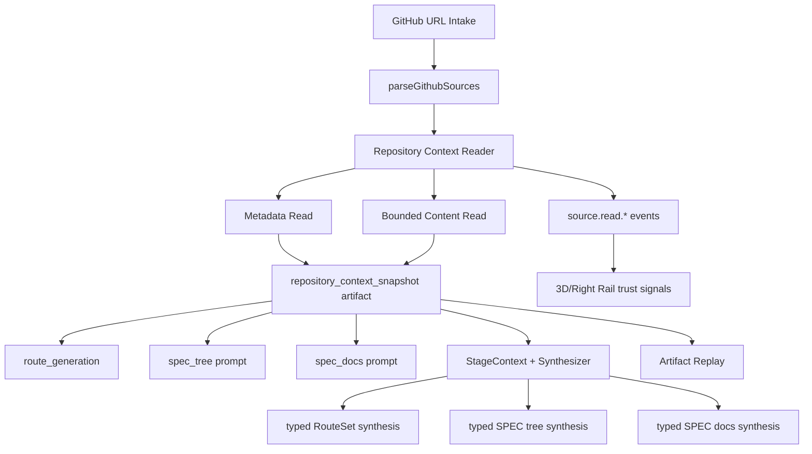

# Design Document: GitHub Repository Context Grounding

## Overview

This design closes the gap between "a GitHub URL exists" and "downstream
stages are grounded in real repository facts." The current pipeline can invoke
`mcp-github-source` during `route_generation`, but the downstream
`spec_tree` and `spec_docs` prompts mostly receive `githubUrls` and short
upstream summaries. The new layer creates a typed Repository Context Snapshot
and injects it into route, tree, document, and brainstorm synthesis inputs.

The design is additive: if repository context is disabled, unavailable, or
degraded, existing generation paths continue unchanged.

## Classification

| Category | Current State | Gap | Target State |
| --- | --- | --- | --- |
| GitHub intake | URLs are normalized and stored as `github_source` artifacts | URL is treated as context | URL becomes an input to a typed source reader |
| GitHub read | `route_generation` can call `mcp-github-source` | Mostly metadata; content is not propagated | Metadata and bounded content become a reusable snapshot |
| SPEC tree | Prompt contains `githubUrls` and route data | No repo file/tree context | Prompt receives repository structure and framework signals |
| SPEC docs | Prompt contains `githubUrls`, node, route, upstream findings | No node-specific repo evidence | Prompt receives related files/components/tests per node |
| Brainstorm | Multi-agent session is visible and can synthesize text | Structured stages need typed artifacts | Stage-specific schemas consume repository grounding |
| UI trust | Events show capabilities and adapters | Users cannot tell metadata vs source-content grounding | UI exposes grounding tier and degradation reason |

## Architecture



## Data Model

```typescript
export type RepositoryContextTier =
  | "disabled"
  | "url_only"
  | "metadata"
  | "content"
  | "degraded"
  | "simulated";

export interface RepositoryContextSnapshot {
  id: string;
  jobId: string;
  sourceUrl: string;
  normalizedUrl: string;
  owner: string;
  repo: string;
  defaultBranch?: string;
  latestCommitSha?: string;
  fetchedAt: string;
  tier: RepositoryContextTier;
  executionPath?: "mcp" | "http" | "simulated";
  metadata?: {
    description?: string;
    homepage?: string;
    topics: string[];
    language?: string;
    license?: string;
    stars?: number;
    forks?: number;
  };
  content?: {
    readmeSummary?: string;
    manifestSummary?: string;
    fileTreeSummary?: string;
    frameworkSignals: string[];
    entrypoints: Array<{ path: string; summary: string }>;
    testSignals: Array<{ path: string; summary: string }>;
    keyFiles: Array<{ path: string; kind: string; digest: string; summary: string }>;
    riskSignals: string[];
  };
  provenance: {
    capabilityInvocationIds: string[];
    capabilityEvidenceIds: string[];
    responseDigests: string[];
    degradedReason?: string;
  };
}
```

The snapshot stores summaries and digests, not unbounded raw file contents.

## Components

### 1. Repository Context Reader

Add a reader behind existing dependency injection. It should reuse the existing
MCP/HTTP bridge policy style rather than importing network clients directly.

Responsibilities:

- Parse the first supported GitHub URL into owner/repo.
- Perform metadata read through MCP first, then HTTP fallback.
- Optionally perform bounded content reads for allowlisted files.
- Produce `RepositoryContextSnapshot`.
- Emit source-read events and degradation events.

### 2. Snapshot Artifact Writer

Persist the snapshot as a `repository_context_snapshot` artifact. Link it to
the existing `github_source`, capability invocation, and evidence artifacts.

The artifact is the cross-stage contract. Downstream stages should read from
the artifact instead of re-calling GitHub.

### 3. Stage Grounding Context Builder

Add a small projection helper:

```typescript
buildGroundingContextForStage(job, stageId, nodeId?)
```

It returns a compact stage-specific view:

- `route_generation`: repo metadata + coarse framework and risk signals.
- `spec_tree`: file-tree summary, entrypoints, framework signals, manifests.
- `spec_docs`: node-specific related files, existing components, tests, gaps.

### 4. Prompt Injection

Extend prompt builders without removing existing fields:

- `buildSpecTreePrompt()` keeps `githubUrls`, adds `repositoryContext`.
- `buildSpecDocumentsPrompt()` keeps `githubUrls`, adds
  `repositoryContextForNode`.
- Brainstorm `StageContext` adds `groundingContextSummary`.

### 5. Stage-Specific Typed Synthesis

Extend brainstorm synthesis so structured stages ask for typed outputs:

- `route_generation`: RouteSet-compatible JSON.
- `spec_tree`: node-array/tree JSON compatible with existing validators.
- `spec_docs`: requirements/design/tasks document JSON or markdown payloads.

Validation failures remain graceful degradation.

### 6. UI and Diagnostics

Expose the tier and degradation reason through events and diagnostics. The UI
can show:

- URL only
- Metadata read
- Source content grounded
- Simulated/fallback
- Degraded reason

This prevents the page from implying source-code grounding when only a URL was
available.

## Error Handling

Repository grounding is non-blocking:

- Disabled: no extra reads, current behavior.
- Metadata read fails: snapshot tier becomes `degraded` or `url_only`.
- Content read fails: keep metadata tier and record degraded content reason.
- Validation fails: skip snapshot injection for that stage and emit degradation.
- Secret detection triggers: redact and store only summaries/digests.

## Rollout

1. Add snapshot data model and artifact writer.
2. Convert the existing `mcp-github-source` result into a metadata snapshot.
3. Add bounded content reads behind a new env flag.
4. Inject snapshot into `spec_tree`.
5. Inject node-specific context into `spec_docs`.
6. Add typed brainstorm synthesis schemas for structured stages.
7. Add UI diagnostics/trust signals.

## Testing Strategy

- Unit tests for URL parsing, snapshot shape, redaction, and tier transitions.
- Property tests for bounded content limits and redaction invariants.
- Integration tests proving `spec_tree` and `spec_docs` prompts include
  repository context when a snapshot exists.
- Degradation tests for disabled, no URL, invalid URL, rate limit, timeout, and
  content-read failure.
- Snapshot replay tests to ensure artifacts can be rendered without secrets.
