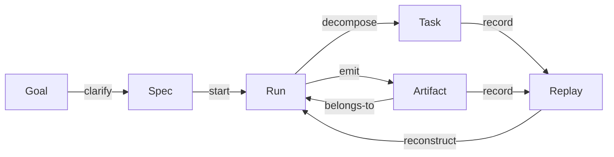

# 02 核心对象模型

_Implements: REQ-2.2, REQ-6.1, REQ-7.2 — Validates: Property 2, Property 7_

## Header

- Frozen HEAD: `d181be2f` (`2026-05-28T02:06:35Z`).
- Source-of-derivation: only rows bucketed `IMPLEMENTED_AND_VALID` in `spec-audit-table.md`. `DESIGNED_NEVER_BUILT`, `PARTIALLY_IMPLEMENTED`, `DRIFTED`, and `DUPLICATE` rows are deliberately excluded so the object model reflects what is actually wired in code, not what has been proposed.
- Companion diagram: `d2-core-object-model.svg` (`manifest: spec-audit-table.md (4+ IMPLEMENTED_AND_VALID rows cited)`).

## The six core objects

The runtime that actually executes today moves six durable objects through a single chain. Their identities are stable across `client/` / `server/` / `shared/` and across the autopilot product surface.

### Goal

A user-stated destination plus its parsed summary. In code this is `MissionGoal` / `MissionDestination` per `shared/mission/contracts.ts` and `shared/mission/autopilot.ts` (`destination-model-and-parser`, `destination-card-and-goal-summary`, both IMPLEMENTED). Goal is the front-end's intent surface and the runtime's planning anchor; it crosses the boundary as a serialized destination card.

### Spec

A `.kiro/specs/<dir>/` triple of `requirements.md` / `design.md` / `tasks.md` (and optionally `bugfix.md`). Spec is the durable contract version of a Goal once it has been clarified. The `289`-row corpus catalogued by `spec-audit-table.md` *is* this object's storage. There is no shared TypeScript contract for Spec because the on-disk markdown layout is the contract; the `project-domain-model` IMPLEMENTED row anchors the in-memory store side (`client/src/lib/project-store.ts`).

### Run

A single executed instance of a Spec (or of an unstructured Goal). In code this is the `Mission` plus its `Workflow` projection, owned by `server/tasks/mission-store.ts` (`mission-runtime`, IMPLEMENTED) and `server/core/workflow-engine.ts` / `server/core/workflow-runtime-engine.ts` (`workflow-engine`, IMPLEMENTED). Run is the boundary object: server-side it is the canonical truth source; client-side it is consumed via `client/src/lib/tasks-store.ts` (`mission-native-projection`, IMPLEMENTED) and Socket.IO event streams.

### Task

A single decomposed step inside a Run. Two views co-exist:

- The on-disk view: a `tasks.md` checkbox (`7,887 / 8,806` checkboxes per `execution-plan.md § 当前维护快照`).
- The runtime view: `MissionTask` per `shared/mission/contracts.ts` and the operator-action model in `server/tasks/mission-operator-service.ts` (`mission-operator-actions`, IMPLEMENTED).

Task is the atomic unit the Replay stream timestamps and the Artifact list attaches to.

### Artifact

A deliverable produced by a Run or a Task — a report, an SVG, an exported file, a workflow output. Owned by `workflow-artifacts-display` (`PARTIALLY_IMPLEMENTED 96%`, last verification gate). On the project-first track Artifact is also addressable via `client/src/lib/project-store.ts` (`project-evidence-artifact-replay`, IMPLEMENTED). Artifact crosses the boundary in two directions: server emits via Mission events, client renders via `ArtifactListBlock` / `ArtifactPreviewDialog`.

### Replay

The append-only event stream that lets a Run be reconstructed step-by-step. Code: `shared/replay/contracts.ts` and the server replay route (`collaboration-replay`, IMPLEMENTED, `89/89` tasks). Replay is also the audit / lineage substrate: every Task transition and every Artifact emission is recorded as a Replay event before it is exposed to the cockpit.

## Relationships

The object graph that holds across all IMPLEMENTED specs cited above:

- Goal → has many Specs. One destination can be clarified into multiple specs over time; clarification is project-scoped per `project-first-spec-roadmap-2026-04-30.md`.
- Spec → has many Runs. A spec is executed (and re-executed) as Mission instances.
- Run → has many Tasks. Decomposition happens at Run start and may be revised mid-run by replan.
- Run → has many Artifacts. Deliverables accumulate as the Run advances.
- Task → has 0..n Replay events. Every state transition records at least one event; long-running tasks record many.
- Artifact → belongs-to Run (and optionally to a specific Task).
- Replay → reconstructs Run state. The stream is the event log; the Run state is its left-fold.

## Lifecycle (Mermaid)

The diagram is small on purpose: every arrow is backed by an IMPLEMENTED row in `spec-audit-table.md`. Arrows that would only exist in `DESIGNED_NEVER_BUILT` specs (e.g., project-level clarification conversation, project cockpit home) are intentionally absent.

## Specs that own each object

| Object | Primary IMPLEMENTED_AND_VALID spec | Canonical code path |
|---|---|---|
| Goal | `destination-model-and-parser` / `destination-card-and-goal-summary` | `shared/mission/autopilot.ts` |
| Spec | `project-domain-model` (in-memory side) | `client/src/lib/project-store.ts` |
| Run | `mission-runtime` + `workflow-engine` + `mission-native-projection` | `server/tasks/mission-store.ts`, `server/core/workflow-engine.ts`, `client/src/lib/tasks-store.ts` |
| Task | `mission-operator-actions` (+ `human-in-the-loop` for approvals) | `server/tasks/mission-operator-service.ts`, `shared/mission/contracts.ts` |
| Artifact | `workflow-artifacts-display` (final-verification gate) + `project-evidence-artifact-replay` | `shared/mission/contracts.ts` (Artifact API), `client/src/lib/project-store.ts` |
| Replay | `collaboration-replay` | `shared/replay/contracts.ts` + server replay route |

Cross-cutting anchors that touch all six objects: `audit-chain` (IMPLEMENTED) attaches a hash chain to Replay events; `data-lineage-tracking` (IMPLEMENTED) attaches a DAG to Run / Artifact transitions.

## Reference

- Companion diagram: [d2-core-object-model.svg](./d2-core-object-model.svg) (`manifest: spec-audit-table.md`)
- Audit table: [spec-audit-table.md](./spec-audit-table.md)
- Steering hint: `.kiro/steering/project-overview.md § 系统架构 / § 核心数据流`
- Q2 traceability: this document is the primary answer to Q2 of the Five_Control_Recovery_Questions; see `00 项目总定义` traceability table.
