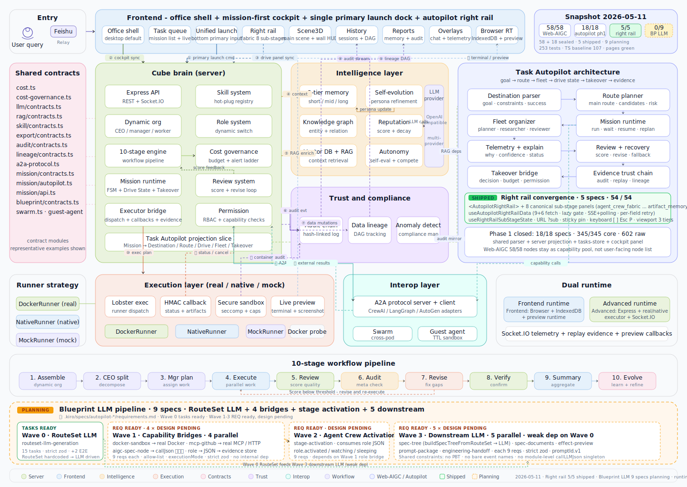

<p align="center">
  
</p>

<h1 align="center">Cube Pets Office</h1>

<p align="center">
  <a href="./README.md"><strong>English</strong></a> |
  <a href="./README.zh-CN.md"><strong>Simplified Chinese</strong></a>
</p>

<p align="center">
  <strong>Task Autopilot / 任务自动驾驶平台 for AI agents</strong><br/>
  Cube Pets Office is a Task Autopilot platform for complex work: enter a destination, inspect the route, let the system execute what is safe, and take over when human judgment is required.
</p>

<p align="center">
  <a href="https://opencroc.github.io/cube-pets-office/"><strong>Live Demo</strong></a>
</p>

<p align="center">
  
  
  
  
  
  
  
</p>

---

## What It Is

Cube Pets Office is evolving from a mission-first task operating system into a Project-first Task Autopilot platform.

It is not a chat playground where the main artifact is an answer. It is not only a workflow builder where users must manually draw every node. It is also not an agent platform whose main value is browsing agent, tool, or plugin catalogs. The product direction is to let a user state a goal, then make the task lifecycle visible and controllable:

- understand the intended destination and missing context
- recommend an executable route instead of exposing every low-level node first
- organize a role-based agent fleet around the route
- run work through the existing mission runtime, workflow engine, and executor stack
- surface drive state, logs, artifacts, evidence, audit records, and replay
- pause for clarification, approval, risk acceptance, budget, permission, or delivery review when needed
- replan when the current route is no longer safe, complete, or useful

The current engineering foundation remains mission-first, but the next product entrypoint is Project-first. A `Project` becomes the user's durable workspace for intent, clarification, specs, routes, execution, artifacts, and evidence. `mission / workflow / runtime / task` continue to be the implementation vocabulary, while `Project / Clarification / Spec / Route / Execution / Evidence` become the next user-facing mainline.

---

## Current Reality

This README intentionally keeps the product story aligned with the codebase and specs that exist today.

What is already present as foundation:

- A mission-first office shell and `/tasks` workbench for launching, monitoring, and reviewing task execution.
- A Node + Express + Socket.IO server that coordinates mission state, workflow progress, events, replay, and APIs.
- A Lobster executor service with `mock`, `native`, and `real` execution modes, including Docker-aware local behavior.
- Human-in-the-loop control paths such as wait/resume, decision handling, approvals, and manual recovery hooks.
- Review, audit, replay, lineage, evidence, and runtime observability concepts across existing specs and mainline integration.
- A Web-AIGC mainline baseline where `58 / 58` specs have been closed and multiple node/route families have been integrated into the server mainline.
- A closed first-phase Task Autopilot baseline: `18` specs, `54` markdown files, `345 / 345` top-level task items, and `602 / 602` raw task checklist items.
- A first implementation slice for Task Autopilot projections: shared Destination parsing contracts, server projection/orchestration fields, client store normalization, and a cockpit-facing `TaskAutopilotPanel`.
- A Project-first architecture track that defines `Project` as the first product object above missions, with clarification, spec, route, execution, and evidence attached to the project context.

What is not being claimed:

- The project is not an open-domain L5 fully autonomous operator.
- The system does not promise to complete every complex task without human review.
- High-risk side effects, permission changes, external writes, budget-sensitive actions, and ambiguous goals still require explicit governance and takeover.
- The new product language does not require an immediate large-scale rename of the existing `mission / workflow / runtime` code.
- The closed first-phase Task Autopilot checklist does not mean open-domain L5 autonomy; it means the product model, spec backlog, and first shared/server/client projection slice now have a traceable baseline for the next runtime deepening work.

---

## From Mission-First To Project-First Autopilot

The previous product center was mission-first:

- A user launches a mission instead of asking for a one-off reply.
- The system tracks workflow stages, runtime state, artifacts, and decisions.
- Replay and audit preserve enough evidence to inspect what happened.
- `/` and `/tasks` are the high-frequency execution surfaces.

Task Autopilot keeps that foundation and adds a clearer product model. The first phase used Destination, Route, Drive State, Fleet, and Takeover to explain task execution. The next phase lifts that model into a Project-first workspace:

```text
Project -> Clarification -> Spec -> Route -> Execution -> Evidence
```

That chain means:

- `Project` is the durable product object the user returns to, not a transient launch form.
- `Clarification` captures missing intent, constraints, permissions, acceptance criteria, and risk boundaries before execution is treated as safe.
- `Spec` turns the clarified project goal into an inspectable contract for scope, deliverables, route constraints, and evidence expectations.
- `Route` is the selected execution plan, including fallback and conservative paths.
- `Execution` still runs through the existing mission, workflow, runtime, and executor stack.
- `Evidence` closes the loop with artifacts, logs, decisions, replay records, and delivery review.

The compatibility mapping remains:

| Mission-first foundation            | Task Autopilot product layer | Meaning                                                   |
| ----------------------------------- | ---------------------------- | --------------------------------------------------------- |
| `mission`                           | `Destination`                | The outcome the user wants to reach                       |
| `workflow`                          | `Route`                      | The planned path toward the destination                   |
| runtime / phase state               | `Drive State`                | The user-readable state of the task journey               |
| agents / skills / nodes / executors | `Fleet`                      | The role-based capability group assembled for the route   |
| HITL / decision / approval          | `Takeover Point`             | A moment where the system gives control back to the user  |
| retry / revision / reroute          | `Replan`                     | A formal route change after risk, failure, or new context |

This is a compatibility-first evolution. The product layer should be implemented through bindings, projections, view models, and server-side aggregation before any deep rename or schema rewrite is considered.

---

## Core Concepts

Task Autopilot is organized around a small set of product objects.

| Concept          | Product meaning                                                                                                                                  | Current implementation anchor                                                      |
| ---------------- | ------------------------------------------------------------------------------------------------------------------------------------------------ | ---------------------------------------------------------------------------------- |
| `Destination`    | A structured form of the user's intended outcome, including goal, constraints, missing information, success criteria, and expected deliverables. | Mission metadata, mission summary, runtime context, workflow config                |
| `Route`          | A recommended executable path with stages, candidate routes, risks, takeover points, expected artifacts, and possible replans.                   | Workflow definition, workflow instance, route family, workflow phase               |
| `Drive State`    | A high-level state machine that explains what the system is doing now.                                                                           | Mission runtime state, workflow state, node state, wait/resume state, review state |
| `Fleet`          | A role-oriented capability group such as Planner, Clarifier, Researcher, Operator, Generator, Reviewer, Auditor, and Coordinator.                | Agents, skills, tools, Web-AIGC nodes, MCP tools, executors, adapters              |
| `Takeover Point` | A user decision point for clarification, route selection, permission, budget, risk acceptance, delivery acceptance, or exception handling.       | HITL, MissionDecision, approval, `WAITING_INPUT`, `resume()`, `escalate()`         |
| `Replan`         | A route-level change caused by new constraints, lower confidence, elevated risk, failed tools, poor intermediate results, or user override.      | Workflow revision, retry/escalate paths, reroute records, runtime events           |
| `Confidence`     | The system's confidence in goal understanding, route feasibility, execution completion, and result quality.                                      | Runtime projection, review signals, evidence completeness, UI explanation layer    |
| `Risk`           | A structured view of ambiguity, missing data, tool failure, permissions, cost, compliance, external side effects, and result quality.            | Runtime governance, audit, permission checks, risk actions, replay evidence        |

The main chain is:

```text
Destination -> Route -> Fleet -> Drive State -> Result
```

Takeover, replan, confidence, risk, evidence, audit, and replay make that chain inspectable rather than a black box.

---

## Triggering Task Autopilot

The smallest useful trigger is a destination-oriented sentence: state the outcome, the constraints, and what a good delivery should look like. The launch surface currently keeps six example chips aligned to the frontend view model:

| Chip | Minimal destination example |
| ---- | --------------------------- |
| Analysis | Analyze this week's support incidents by Friday; deliver root causes, constraints, and success criteria. |
| Generation | Draft a bilingual partner launch brief with a rollout checklist and approval criteria. |
| Implementation | Implement a guarded checkout banner change; keep rollback path and tests explicit. |
| Research | Research three pricing options and summarize evidence, risks, and recommendation. |
| Attachment | Use the attached requirements doc to produce schedule, risk register, and acceptance criteria. |
| Advanced execution | Open the sandbox/browser, verify the payment flow, collect logs, and provide a rollback recommendation. |

The Destination parser/projection layer is intentionally richer than the launch preview and goal card. Parser-facing fields such as `sourceInput`, `normalizedGoal`, structured `constraints`, structured `successCriteria`, `missingInformation`, `suggestedClarifications`, `evidence`, mission/workflow mapping, and version metadata support audit and runtime projection. The frontend summary is lighter: launch preview focuses on `goal`, `deliverable`, `constraints`, `timeline`, `successCriteria`, `missingFields`, `confidence`, `attachmentInfluence`, and `route`; the cockpit goal card focuses on `goal`, `request`, `subGoals`, `constraints`, `successCriteria`, `deliverables`, `fieldSources`, `lockState`, and `routeImpact`. Not every parser field is shown in every card or persisted as a locked goal yet.

On desktop, the cockpit can present the richer three-column structure: Destination/Route on the left, Drive/Fleet/Outputs in the center, and Takeover/Evidence/Cost/Risk on the right when data is available. Tablet and mobile keep the same core objects reachable through two-column, segmented, compressed-card, and bottom-sheet patterns, but they do not show every dense desktop panel at the same time. The GitHub Pages preview remains browser-only and does not include the Node server or executor.

These examples are user-state positioning examples, not backend capability promises. They describe what the user is trying to reach: quick analysis, generated delivery material, implementation with rollback, evidence-backed research, attachment-grounded planning, or guarded advanced execution.

---

## Autopilot Levels

The Task Autopilot specs define L1-L5 as an execution commitment model, not as marketing shorthand. The repository should not be described as globally L5.

| Level | Meaning                                                                                                                                             | Current positioning                                                    |
| ----- | --------------------------------------------------------------------------------------------------------------------------------------------------- | ---------------------------------------------------------------------- |
| `L1`  | Route suggestion level. The system helps interpret the destination and recommend a route, while the user remains in control of execution.           | A practical near-term baseline for productization.                     |
| `L2`  | Partial automatic execution. Low-risk steps may progress automatically, while key decisions require takeover.                                       | A realistic target for current mission-first + HITL foundations.       |
| `L3`  | Standard task automatic closure. Standardized tasks can mostly complete automatically inside bounded risk, review, audit, and recovery constraints. | A near-term design target for selected, well-governed task families.   |
| `L4`  | High automation inside limited task domains. Requires whitelist policies for task domain, permissions, budget, and evidence.                        | Future limited-domain direction, not a blanket current claim.          |
| `L5`  | Open-domain full automation.                                                                                                                        | Research and long-term concept only; not implemented or claimed today. |

The intended implementation model is task-level and phase-level. A mission may start with a target level, then downgrade when it hits risk, missing context, external side effects, or governance boundaries.

---

## Phase-1 Task Autopilot Specs

The first Task Autopilot phase is now closed as a tracked baseline: `18` specs across `54` markdown files. Each spec has:

- `requirements.md`
- `design.md`
- `tasks.md`

As of the 2026-04-26 refresh, the phase-1 tracking view is:

- Specs: `18 / 18`
- Markdown files: `54 / 54`
- Core top-level task items: `345 / 345`
- Raw task checklist items: `602 / 602`
- Progress overview: [`docs/task-autopilot-18-spec-progress-overview-2026-04-24.svg`](./docs/task-autopilot-18-spec-progress-overview-2026-04-24.svg)

The corresponding first implementation slice is intentionally compatibility-first. It adds shared `Destination` parser/projection contracts, server autopilot projection fields, client store normalization, and cockpit-facing destination/route/takeover/evidence presentation without renaming the underlying `mission / workflow / runtime` backbone.

### P0: Product Definition And Object Model

- `task-autopilot-platform-positioning`: defines Task Autopilot as the next product layer above mission-first.
- `task-autopilot-core-concepts`: defines Destination, Route, Drive State, Fleet, Takeover, Replan, Confidence, and Risk.
- `task-autopilot-levels-l1-to-l5`: defines automation levels and prevents overclaiming open-domain autonomy.
- `destination-model-and-parser`: defines how user input becomes a structured destination.
- `route-planner-and-route-model`: defines route sets, candidate routes, stages, risks, and takeover points.
- `mission-model-to-autopilot-model-mapping`: defines the compatibility bridge from `mission / workflow / runtime` to the autopilot product model.

### P1: Cockpit And Operator Experience

- `autopilot-cockpit-information-architecture`: defines the cockpit IA for destination, route, execution, takeover, evidence, and audit.
- `destination-card-and-goal-summary`: defines the destination card and stable goal summary.
- `route-recommendation-and-selection`: defines fastest, safest, and deepest route recommendation semantics.
- `fleet-status-and-live-execution-view`: defines the live fleet execution view above agents, nodes, executors, logs, and artifacts.
- `takeover-panel-and-decision-points`: defines unified takeover experiences for clarification, route confirmation, budget, permission, risk, delivery, and exceptions.
- `drive-state-and-replan-state-machine`: defines the high-level drive states and replan semantics.

### P2: Runtime, Governance, Evidence, And Metrics

- `fleet-organization-and-role-packaging`: defines role packaging and maps agents, skills, nodes, tools, MCP, and executors into fleet roles.
- `autopilot-runtime-orchestration`: defines how Destination, Route, Fleet, and Takeover bind into Mission Runtime, workflow runtime, decisions, and executor signals.
- `autopilot-explainability-and-telemetry`: defines explanations, telemetry signals, confidence, risk, remaining steps, and evidence hints.
- `autopilot-recovery-and-human-takeover-governance`: defines recovery, downgrade, escalation, and human takeover governance.
- `autopilot-evidence-replay-and-trust-chain`: defines the driving timeline, evidence chain, replay chain, and trust chain.
- `task-autopilot-success-metrics`: defines delivery rate, takeover rate, replan rate, deviation rate, completion time, review pass rate, and drill-down evidence.

The next implementation direction is no longer to create more phase-1 Task Autopilot specs. It is to execute the Project-first mainline: project domain state, project-scoped clarification, spec generation/versioning, FSD route planning, project-scoped execution, and evidence/artifact replay that can be reviewed from the project context.

---

## Core Surfaces

- `/` is the default office cockpit. It brings the task queue, 3D office scene, unified launch surface, and right-side context into one desktop shell.
- `/tasks` is the full-screen task workbench for focused execution and monitoring.
- `/tasks/:taskId` keeps deep-linked task detail pages available.
- `/replay/:missionId` is the replay surface for completed runs and evidence review.
- `/debug` remains a lower-frequency internal surface for diagnostics and supporting tools.

The current surface strategy is to keep the office cockpit and `/tasks` as the main operator work areas. Replay, audit, lineage, debug, and lower-level node views remain available without becoming the first thing a user must understand.

---

## Architecture

<p align="center">
  
</p>

<p align="center">
  
</p>

At a high level, the repository is organized around four layers:

- `client/`: React 19 + Vite frontend, including the office shell, task workbench, replay views, 3D scene, launch surfaces, and cockpit components.
- `server/`: Node.js + Express + Socket.IO backend for missions, workflow state, events, replay, Web-AIGC routes, and APIs.
- `services/lobster-executor/`: execution service for mock, native, and real task execution.
- `shared/`: contracts and shared types used across frontend, backend, and executor.

The Task Autopilot architecture should be added as a product/projection layer above these foundations:

```text
Product layer:   Destination / Route / Drive State / Fleet / Takeover / Evidence
Projection layer: bindings, view models, server aggregation, event normalization
Runtime layer:   Mission Runtime / workflow engine / HITL / review / audit / replay
Execution layer: Lobster executor / adapters / tools / Web-AIGC nodes / external services
```

The visual direction follows the same projection model: Destination, Route, Fleet, Drive State, Takeover, and Evidence should read as stable cockpit objects with consistent status color semantics, restrained motion, and reduced-motion fallbacks. Route reveal, route selection glow, drive-state rail advance, takeover alerts, and evidence timeline append should explain progress and risk without implying unsupported autonomy.

The runtime architecture SVG is available here:

- [docs/architecture.svg](./docs/architecture.svg)
- [docs/architecture-runtime-2026-04-21.svg](./docs/architecture-runtime-2026-04-21.svg)

---

## Web-AIGC Mainline

The Web-AIGC spec delivery baseline is closed at `58 / 58` completed specs and `238 / 238` checked top-level tasks, spanning `52` node specs and `6` platform specs. The project has moved from spec-count tracking into mainline integration, runtime hardening, and governance closure.

This matters for Task Autopilot because the Web-AIGC work supplies much of the lower-level route and fleet substrate:

- Built-in adapters, installed extra adapters, wait/resume control flow, and replay/audit observability are already part of the runtime mainline.
- The main server entry mounts multiple Web-AIGC route families, including MCP, Office/content nodes, search and QA, `transaction_flow`, `orchestration_recognition_jump`, and vector update/delete endpoints.
- Runtime coverage includes search/QA adapters, Office/content production nodes such as `ai_ppt`, `excel_read`, `dynamic_chart`, `file_slicing`, `file_generation`, and `file_translation`, plus governed execution paths such as `transaction_flow` and `orchestration_recognition_jump`.

Project-first Autopilot should not expose all of those nodes as the primary product mental model. The 50+ AIGC nodes are internal capabilities inside FSD role packages such as Planner, Clarifier, Researcher, Generator, Operator, Reviewer, and Auditor. Users should choose projects, clarify specs, inspect routes, approve execution, and review evidence; they should not be asked to manage the node catalog as the main flow.

For dated status snapshots and integration planning, see the steering docs linked in the documentation section below.

---

## Runtime Modes

The repo currently has three practical runtime targets:

| Environment                 | Frontend | Server | Executor behavior               |
| --------------------------- | -------- | ------ | ------------------------------- |
| GitHub Pages preview        | Yes      | No     | Browser-only preview runtime    |
| Local with Docker available | Yes      | Yes    | `real` executor mode            |
| Local without Docker        | Yes      | Yes    | `native` executor mode fallback |

Important boundaries:

- GitHub Pages is a static preview target. It does not include the Node server or Lobster Executor.
- `pnpm run dev:all` prefers `real` execution and automatically falls back to `native` when Docker is unavailable.
- If you explicitly set `LOBSTER_EXECUTION_MODE=mock` or `LOBSTER_EXECUTION_MODE=native`, that choice is preserved.

For executor details, see [docs/executor/lobster-executor.md](./docs/executor/lobster-executor.md).

---

## Implementation Direction

The next implementation work should stay incremental and compatibility-first, but the product mainline is now Project-first rather than task-launch-first.

Recommended sequence:

1. Make `Project` the first product object and attach launches, messages, specs, routes, missions, artifacts, and evidence to a project context.
2. Turn clarification into a project-scoped step that resolves missing intent before route selection or execution is treated as committed.
3. Generate and version inspectable `Spec` records from clarified project intent, including scope, constraints, deliverables, acceptance criteria, and evidence expectations.
4. Plan `Route` through FSD role packages, with conservative and fallback paths, while keeping 50+ AIGC nodes internal to those roles instead of exposing them as the user entrypoint.
5. Run `Execution` through the existing mission/workflow/runtime/executor stack and write back project-scoped state rather than creating a parallel runtime.
6. Normalize runtime, decision, audit, replay, artifact, and lineage events into project-scoped `Evidence` that can explain why the route moved the way it did.
7. Add success metrics only where the required source-of-truth data exists, and mark partial or conflicted samples explicitly.

Guardrails:

- Do not turn Task Autopilot into a UI-only rebrand; every visible state should point back to runtime facts or clearly marked inference.
- Do not make tasks, workflows, Docker, browser runtime, native runtime, or node catalogs the first user entrypoint; they are execution carriers below the project mainline.
- Do not force users to manage 50+ nodes as the main flow; package capabilities into FSD roles, route stages, takeover points, and evidence trails.
- Do not hide governance behind "automation"; high-risk actions must remain auditable and interruptible.
- Do not treat replay as the source of truth when mission/runtime/audit facts disagree; replay is primarily a reconstruction and review surface.

---

## Quick Start

This repository uses `pnpm`. If `pnpm` is not installed globally, you can replace commands below with `corepack pnpm`.

### 1. Preview the frontend only

No API key is required for the browser-only preview flow.

```bash
pnpm install --frozen-lockfile
pnpm run dev:frontend
```

Use this when you want to explore the office shell, the 3D scene, and the demo experience quickly.

### 2. Start the full local stack

Create a local environment file first:

```bash
cp .env.example .env
```

PowerShell alternative:

```powershell
Copy-Item .env.example .env
```

Then fill the values you need in `.env` and start the stack:

```bash
pnpm run dev:all
```

Common AI-related variables:

```dotenv
LLM_API_KEY=your_api_key_here
LLM_BASE_URL=https://api.openai.com/v1
LLM_MODEL=gpt-5.4
LLM_WIRE_API=responses
```

### 3. Run services separately

This is useful when you want to debug the frontend, server, and executor independently.

```bash
pnpm run dev:server
pnpm run dev:frontend
```

Start the executor with an explicit mode:

```bash
LOBSTER_EXECUTION_MODE=real pnpm exec tsx services/lobster-executor/src/index.ts
```

PowerShell example:

```powershell
$env:LOBSTER_EXECUTION_MODE='native'
pnpm exec tsx services/lobster-executor/src/index.ts
```

---

## Release Guardrails

Useful commands:

- `pnpm run lint`: check the guarded formatting targets used by release docs and workflows.
- `pnpm run typecheck`: run the TypeScript no-emit check.
- `pnpm run test`: run client, server, and executor test entrypoints.
- `pnpm run build`: build the frontend and server bundle.
- `pnpm run test:guardrails`: run the lighter decision and socket reconnect regression path.
- `pnpm run test:release`: run the pre-release aggregate check.
- `pnpm run build:pages`: build the GitHub Pages artifact.

For release-sensitive changes, the practical minimum is:

```bash
pnpm run lint
pnpm run typecheck
pnpm run test
pnpm run build
```

---

## Repository Layout

```text
cube-pets-office/
|-- client/                    # frontend app: office shell, tasks, replay, 3D scene
|-- server/                    # backend APIs, workflow state, events, replay
|-- shared/                    # shared contracts and types
|-- services/lobster-executor/ # executor service: mock / native / real
|-- docs/                      # architecture, executor notes, reference docs
|-- scripts/                   # local dev, build, smoke, and utility scripts
|-- data/                      # local data and persisted runtime files
`-- .kiro/                     # specs, steering, and execution planning artifacts
```

If you want to start from key entrypoints, read these first:

- [client/src/App.tsx](./client/src/App.tsx)
- [client/src/pages/Home.tsx](./client/src/pages/Home.tsx)
- [client/src/pages/tasks/TasksPage.tsx](./client/src/pages/tasks/TasksPage.tsx)
- [client/src/components/office/OfficeTaskCockpit.tsx](./client/src/components/office/OfficeTaskCockpit.tsx)
- [server/index.ts](./server/index.ts)
- [server/core/workflow-engine.ts](./server/core/workflow-engine.ts)
- [services/lobster-executor/src/index.ts](./services/lobster-executor/src/index.ts)

---

## Documentation

- [ROADMAP.md](./ROADMAP.md)
- [CHANGELOG.md](./CHANGELOG.md)
- [docs/architecture.svg](./docs/architecture.svg)
- [docs/architecture-runtime-2026-04-21.svg](./docs/architecture-runtime-2026-04-21.svg)
- [docs/executor/lobster-executor.md](./docs/executor/lobster-executor.md)
- [.kiro/steering/task-autopilot-spec-roadmap-2026-04-23.md](./.kiro/steering/task-autopilot-spec-roadmap-2026-04-23.md)
- [.kiro/steering/execution-plan.md](./.kiro/steering/execution-plan.md)
- [.kiro/steering/spec-execution-roadmap.md](./.kiro/steering/spec-execution-roadmap.md)
- [.kiro/steering/web-aigc-58-plan-progress-summary-2026-04-22.md](./.kiro/steering/web-aigc-58-plan-progress-summary-2026-04-22.md)
- [.kiro/steering/web-aigc-runtime-mainline-checkpoints-2026-04-23.md](./.kiro/steering/web-aigc-runtime-mainline-checkpoints-2026-04-23.md)
- [.kiro/steering/web-aigc-phase-2-integration-plan.md](./.kiro/steering/web-aigc-phase-2-integration-plan.md)
- [.kiro/steering/web-aigc-next-phase-mainline-plan-2026-04-22.md](./.kiro/steering/web-aigc-next-phase-mainline-plan-2026-04-22.md)
- [.kiro/specs/task-autopilot-platform-positioning/](./.kiro/specs/task-autopilot-platform-positioning/)
- [.kiro/specs/task-autopilot-core-concepts/](./.kiro/specs/task-autopilot-core-concepts/)
- [.kiro/specs/task-autopilot-levels-l1-to-l5/](./.kiro/specs/task-autopilot-levels-l1-to-l5/)
- [.kiro/specs/mission-model-to-autopilot-model-mapping/](./.kiro/specs/mission-model-to-autopilot-model-mapping/)
- [.kiro/specs/](./.kiro/specs/)

`README.md` is kept as stable product documentation for GitHub. Rolling progress, active implementation details, and dated execution notes belong in `ROADMAP.md`, `.kiro/steering/`, and the spec archives.

---

## Friendly Links

- [LINUX DO](https://linux.do/) - Recognized community / 认可社区.

---

## FAQ

### I do not have `pnpm` installed

Use `corepack pnpm` in place of `pnpm`, for example:

```bash
corepack pnpm install --frozen-lockfile
corepack pnpm run test:release
```

### Why is GitHub Pages not the same as `native` mode?

Because GitHub Pages is a static deployment target. It has no local backend process and no local executor. The Pages demo is browser-only preview runtime, not host-process execution.

### Is Task Autopilot already fully implemented?

Not as open-domain L5 autonomy. The mission-first runtime foundation exists, the Web-AIGC mainline is integrated, the first `18` Task Autopilot specs are closed as a tracked baseline, and the first shared/server/client projection slice is in code. The next work is to deepen runtime behavior behind that slice: route planning automation, fleet orchestration, takeover governance, evidence replay, parser versioning, and metrics measured from live mission facts.

### Does Task Autopilot require renaming all existing mission code?

No. The specs explicitly recommend compatibility first. Keep `mission / workflow / runtime / task` as the engineering layer, then add `Destination / Route / Drive State / Fleet / Takeover` as product-facing projections and shared vocabulary.

### What should I run before opening a PR?

At minimum:

```bash
pnpm run lint
pnpm run typecheck
pnpm run test
```

If your change affects packaging, deployment, or end-to-end runtime behavior, also run:

```bash
pnpm run build
pnpm run test:release
```

---

## License

MIT

---

## Star History

[](https://star-history.com/#opencroc/cube-pets-office&Date)
