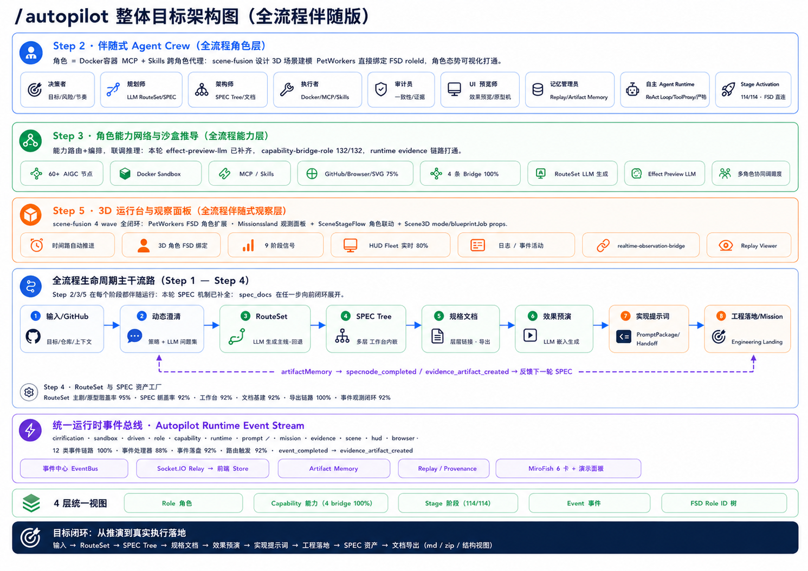
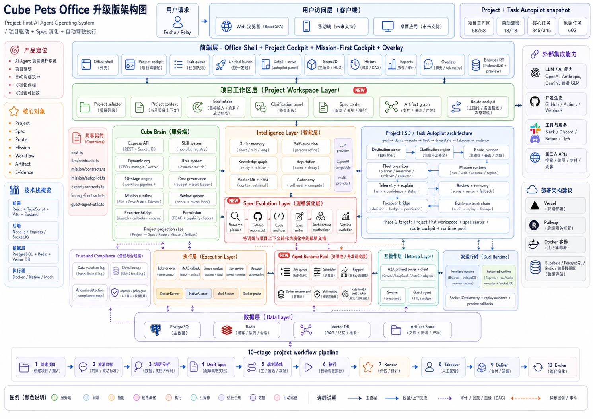

<p align="center">
  
</p>

<h1 align="center">🏢 Cube Pets Office</h1>

<p align="center">
  <strong>Type one idea. Get a complete product spec.<br/>Private deploy · Full observability · Evidence trail.</strong>
</p>

<p align="center">
  <a href="./README.md"><strong>English</strong></a> ·
  <a href="./README.zh-CN.md"><strong>简体中文</strong></a>
</p>

<p align="center">
  <a href="https://opencroc.github.io/cube-pets-office/"></a>
  <a href="./ROADMAP.md"></a>
  <a href="./CONTRIBUTING.md"></a>
</p>

<p align="center">
  
  
  
  
  
  
</p>

---

## ⚡ 30-Second Overview

> **You type one sentence. The system rehearses the entire product for you.**
>
> Spec documents · System architecture · Route planning · Prompt packages · Effect previews
>
> Everything visible. Everything exportable. Everything evidence-backed.

<br/>

<table>
<tr>
<td width="50%">

### 🎯 The Problem

You spend **days** writing PRDs, **weeks** aligning teams, **months** before knowing if the direction is right.

</td>
<td width="50%">

### 💡 The Solution

Type your idea → **5 minutes** → complete rehearsal → decide if it's worth building → not worth it? next idea.

</td>
</tr>
</table>

---

## 🔄 How It Works

```
    ╭──────────────────────────────────────────────────────────╮
    │                                                          │
    │   💬 "AI comic platform"                                 │
    │       │                                                  │
    │       ▼                                                  │
    │   ① 🔍 Smart Clarification                              │
    │       Goals · Constraints · Personas · Success criteria  │
    │       │                                                  │
    │       ▼                                                  │
    │   ② 🗺️ Route Planning                                   │
    │       Main route + Alternatives + Risk + Cost            │
    │       │                                                  │
    │       ▼                                                  │
    │   ③ 🌳 SPEC Tree                                        │
    │       Modular spec node decomposition                    │
    │       │                                                  │
    │       ▼                                                  │
    │   ④ 📄 Spec Documents (streaming)                       │
    │       Requirements / Design / Tasks — live               │
    │       │                                                  │
    │       ▼                                                  │
    │   ⑤ 🎨 Effect Preview                                   │
    │       Architecture + Prompts + Next steps                │
    │       │                                                  │
    │       ▼                                                  │
    │   📦 Export → Markdown / ZIP / Online                    │
    │                                                          │
    ╰──────────────────────────────────────────────────────────╯
```

> 💡 The entire process is **observable in real time**: a 3D office scene shows the agent fleet collaborating, while the right-rail workbench streams generation progress with stage indicators.

---

## 🤖 The FSD Fleet

Seven specialized AI roles collaborate on every rehearsal:

| Role | Responsibility |
|:----:|:--------------|
| 🧠 **Planner** | Breaks the goal into executable routes |
| ❓ **Clarifier** | Fills gaps, resolves ambiguity |
| 🔬 **Researcher** | Gathers context, validates assumptions |
| ✍️ **Generator** | Produces spec documents & artifacts |
| ⚙️ **Operator** | Executes in Docker sandbox when needed |
| 👁️ **Reviewer** | Checks quality, flags issues |
| 📋 **Auditor** | Maintains evidence trail & compliance |

Each role has access to **50+ AIGC capability nodes**, Docker sandbox, MCP tools, Skills, and domain knowledge injection.

---

## ✨ Key Features

<table>
<tr>
<td width="33%" valign="top">

### 👁️ Full Observability
See every step: active roles, invoked capabilities, ReAct cycle stage, produced artifacts. **No black boxes.**

</td>
<td width="33%" valign="top">

### 🗺️ Multi-Route Planning
Quick / Standard / Deep / Conservative routes with risk, cost, and takeover points. **Choose before anything runs.**

</td>
<td width="33%" valign="top">

### 🛑 Human Takeover
Clarification, approval, risk, budget, delivery — all explicit pause points. **Never silently fails.**

</td>
</tr>
<tr>
<td width="33%" valign="top">

### 🔁 Evidence & Replay
Exportable artifacts, audit logs, replay timeline. **Inspect any decision at any moment.**

</td>
<td width="33%" valign="top">

### 🐳 Docker Sandbox
Real code execution in isolated containers with HMAC callbacks and live terminal streaming.

</td>
<td width="33%" valign="top">

### 📦 Export Everything
Markdown, ZIP, or online preview. Every rehearsal is a shareable document package.

</td>
</tr>
</table>

---

## 🚀 Quick Start

```bash
git clone https://github.com/opencroc/cube-pets-office.git && cd cube-pets-office
pnpm install
pnpm run dev:all          # Full stack: frontend + server + executor
```

<details>
<summary>💻 <strong>Browser-only mode</strong> (no server, no .env)</summary>

```bash
pnpm run dev:frontend     # Opens at localhost:5173
```

Or visit the [Live Demo](https://opencroc.github.io/cube-pets-office/) directly on GitHub Pages.

</details>

<details>
<summary>📋 <strong>Requirements</strong></summary>

- Node.js 22+
- pnpm
- Docker (optional, for full executor mode)

</details>

---

## 🖼️ Screenshots

<table>
  <tr>
    <td width="50%"></td>
    <td width="50%"></td>
  </tr>
  <tr>
    <td width="50%"></td>
    <td width="50%"></td>
  </tr>
  <tr>
    <td width="50%"></td>
    <td width="50%"></td>
  </tr>
</table>

---

## 📝 Rehearsal Examples

> Every rehearsal is a shareable piece of content. **50 rehearsals = 50 distribution opportunities.**

| 💬 Input | 📦 Output |
|:---------|:----------|
| "AI comic platform" | 6 SPEC modules · content pipeline · monetization · architecture |
| "Permission management SaaS" | 8 SPEC modules · RBAC · multi-tenant · API contracts |
| "Sentiment analysis tool" | 5 SPEC modules · data pipeline · model selection · alerts |
| "Indie dev bookkeeping app" | 4 SPEC modules · local-first · sync · privacy compliance |
| "Enterprise knowledge base" | 7 SPEC modules · RAG pipeline · permissions · indexing |
| "Cross-border product picker" | 6 SPEC modules · data sources · scoring · competitor analysis |

---

## 🏗️ Architecture

```
┌─────────────────────────────────────────────────────────────────┐
│  🌐 ENTRY          Browser · Feishu Relay · Destination Input   │
├─────────────────────────────────────────────────────────────────┤
│  🖥️ FRONTEND       3D Scene · Task Cockpit · Route View        │
│                    Drive State · Takeover Panel · Replay         │
├─────────────────────────────────────────────────────────────────┤
│  🧠 CUBE BRAIN     10-Stage Workflow · Mission Runtime          │
│                    Dynamic Roles · Cost Governance · Review      │
├─────────────────────────────────────────────────────────────────┤
│  🔮 PROJECTION     Mission→Destination · Workflow→Route         │
│                    State→DriveState · Decision→Takeover          │
├─────────────────────────────────────────────────────────────────┤
│  💡 INTELLIGENCE   3-Level Memory · Knowledge Graph · RAG       │
│                    Self-Evolution · LLM Multi-Provider           │
├─────────────────────────────────────────────────────────────────┤
│  🛡️ TRUST          Hash-Chain Audit · Lineage DAG · Evidence    │
├─────────────────────────────────────────────────────────────────┤
│  ⚙️ EXECUTION      Docker Containers · HMAC · Sandbox · Terminal│
├─────────────────────────────────────────────────────────────────┤
│  🔗 INTEROP        A2A Protocol · Swarm · Guest Agent Market    │
└─────────────────────────────────────────────────────────────────┘
```

---

## 🛠️ Tech Stack

| Layer | Technology |
|:------|:-----------|
| Frontend | React 19 · Vite · TypeScript · Zustand · Three.js (R3F) · Framer Motion |
| Server | Express · Socket.IO · TypeScript |
| AI | OpenAI-compatible API (any provider) |
| Execution | Docker (dockerode) · Browser Runtime · Native Runtime |
| Testing | Vitest · fast-check (PBT) |
| Storage | IndexedDB (browser) · JSON (server) |

---

## 📊 Project Scale

| Metric | Count |
|:-------|------:|
| Project files | 4,707 |
| TypeScript/TSX files | 1,837 |
| Lines of TypeScript | 486,932 |
| Test files | 723 |
| Test cases | 7,771 |
| Spec directories | 273 |
| Spec markdown files | 879 |
| Task checkboxes | 7,093 ✅ / 1,072 ⬜ |

---

## ⚔️ Comparison

| Feature | Dify | n8n | CrewAI | LangGraph | **This** |
|:--------|:---:|:---:|:---:|:---:|:---:|
| Open Source | ✅ | ✅ | ✅ | ✅ | ✅ |
| One sentence → full product | ❌ | ❌ | ❌ | ❌ | ✅ |
| Spec generation (Req+Design+Tasks) | ❌ | ❌ | ❌ | ❌ | ✅ |
| Multi-route planning | ❌ | ❌ | ❌ | ⚠️ | ✅ |
| Multi-role agent fleet | ❌ | ❌ | ✅ | ✅ | ✅ |
| Real-time 3D observability | ❌ | ❌ | ❌ | ❌ | ✅ |
| Human takeover governance | ⚠️ | ⚠️ | ❌ | ❌ | ✅ |
| Replay & audit trail | ❌ | ❌ | ❌ | ❌ | ✅ |
| Docker sandbox | ❌ | ⚠️ | ❌ | ❌ | ✅ |
| Export Markdown/ZIP | ❌ | ❌ | ❌ | ❌ | ✅ |
| Browser-only demo | ❌ | ❌ | ❌ | ❌ | ✅ |

---

## 🤝 Contributing

```
1. Fork & clone → pnpm install
2. pnpm run dev:frontend (UI) or pnpm run dev:all (full stack)
3. Before PR: node --run check && pnpm run test
```

See [CONTRIBUTING.md](./CONTRIBUTING.md) for details.

---

## ⭐ Star History

> Every rehearsal is content that helps others discover possibilities. Star this repo to help more people find it.

[](https://star-history.com/#opencroc/cube-pets-office&Date)

---

<p align="center">
  <a href="./LICENSE"><strong>MIT License</strong></a> · Made with ❤️ by <a href="https://github.com/opencroc">OpenCroc</a>
</p>
