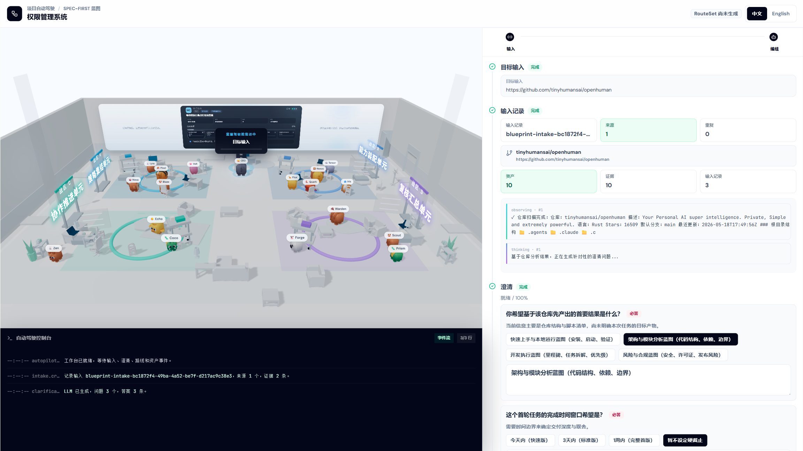
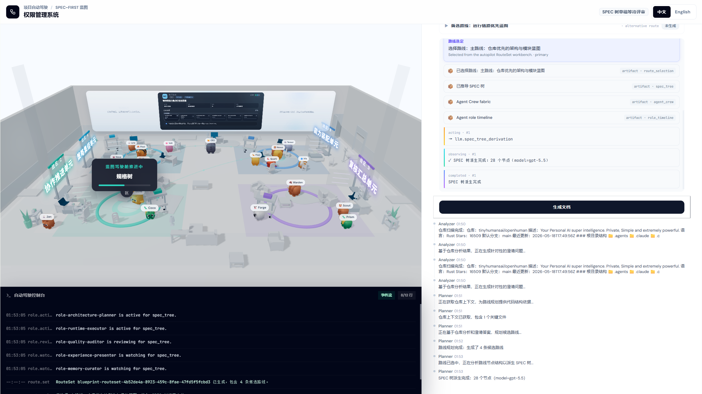
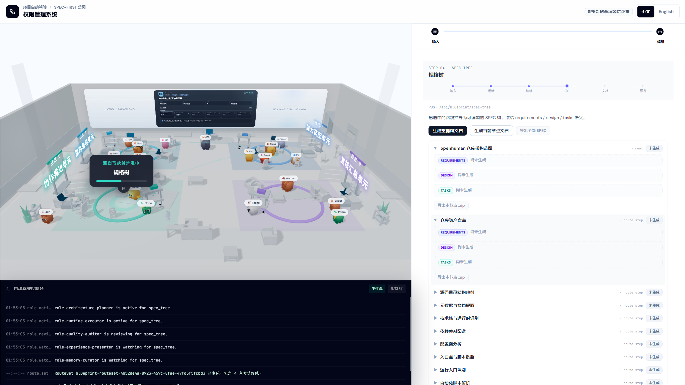

<p align="center">
  
</p>

<h1 align="center">Cube Pets Office</h1>

<p align="center">
  <strong>输入一个想法，推演出一个完整的产品。私有部署、全程可见、证据留痕。</strong>
</p>

<p align="center">
  <a href="./README.md"><strong>English</strong></a> |
  <a href="./README.zh-CN.md"><strong>简体中文</strong></a>
</p>

<p align="center">
  
  
  
  
  
  
</p>

<p align="center">
  <a href="https://opencroc.github.io/cube-pets-office/">在线演示</a> •
  <a href="./ROADMAP.md">路线图</a> •
  <a href="./docs/">文档</a>
</p>

> **早期测试版**：正在积极开发中，可能存在粗糙之处。

访问 [在线演示](https://opencroc.github.io/cube-pets-office/) 或本地运行：

```bash
# 三条命令启动
git clone https://github.com/opencroc/cube-pets-office.git && cd cube-pets-office
pnpm install
pnpm run dev:all        # 全栈：前端 + 服务端 + 执行器
# 或者：pnpm run dev:frontend  (纯浏览器模式，无需 .env)
```

---

## 产品界面一览

| | |
|---|---|
|  |  |
|  |  |

---

# 它是什么？

Cube Pets Office 是一个开源的 **AI 产品预演引擎**。输入一句话想法，它为你推演出完整的产品方案 —— 规格文档、系统架构、路线规划、提示词包、效果预览 —— 全程可见、全部可导出、全部有证据留痕。

- **一句话输入，完整产品输出。** 不用写 PRD，不用画流程图。输入"AI 漫剧平台"，得到一份完整的产品预演：需求文档、设计文档、系统架构、任务拆解、提示词包。每份预演都是可分享的 Markdown 文档包，可直接用于立项评审、博客发布或投资人沟通。

- **[FSD 角色车队](./docs/)**：一组专业化的 AI 角色 —— 规划师、澄清师、研究员、生成器、执行者、审阅者、审计员 —— 在每次预演中协作。每个角色拥有独立的能力范围（50+ AIGC 节点、Docker 沙箱、MCP 工具、Skills）。你可以通过 3D 办公室场景和流式卡片流实时观看它们思考、讨论和产出。

- **[全流程可观测](./docs/)**：右侧工作台展示每一步：哪些角色正在活跃、哪些能力正在被调用、LLM 在 ReAct 循环的哪个阶段（思考 → 选工具 → 执行 → 观察 → 下一步）、已经产出了哪些产物。没有黑盒。

- **[多路线规划与对比](./docs/)**：系统推荐多条可执行路线（快速 / 标准 / 深度 / 保守），每条都有风险评估、成本预估和接管点。你在任何东西运行之前做出选择。

- **[边界处人工接管](./docs/)**：澄清、审批、风险确认、预算确认、交付审查都是明确的接管点。系统会暂停并询问 —— 它永远不会静默失败或失控运行。

- **[证据与回放](./docs/)**：每次预演都产出可导出的产物、审计日志和回放时间线。你可以检查为什么做了某个决策、调用了哪些工具、LLM 在任何时刻在想什么。支持导出为 Markdown、ZIP 或在线浏览。

---

## 工作流程

```
输入想法（一句话）
  ↓
① 智能澄清 — 补全目标、约束、用户画像、成功标准
  ↓
② 路线规划 — 主路线 + 备选路线 + 风险评估 + 成本预估
  ↓
③ SPEC 树 — 拆解为模块化规格文档树
  ↓
④ 规格文档 — 流式生成 requirements / design / tasks（实时可见）
  ↓
⑤ 效果预览 — 系统架构图 + 提示词包 + 可执行的下一步
  ↓
导出 → Markdown / ZIP / 在线预览
```

全程实时可见：3D 场景展示 Agent 车队协作状态，右侧工作台展示流式生成过程与阶段进度指示器。

---

## 预演示例

每一个预演都是一篇可传播的内容。50 个预演 = 50 次传播机会。

| 输入 | 预演产出 |
|------|----------|
| "AI 漫剧平台" | 6 个 SPEC 模块 · 内容生产流水线设计 · 变现模型 · 系统架构 |
| "权限管理 SaaS" | 8 个 SPEC 模块 · RBAC 架构 · 多租户设计 · API 契约 |
| "舆情分析工具" | 5 个 SPEC 模块 · 数据采集管道 · 情感分析模型选型 · 告警规则引擎 |
| "独立开发者记账 App" | 4 个 SPEC 模块 · 本地优先架构 · 同步方案 · 隐私合规 |
| "企业知识库" | 7 个 SPEC 模块 · RAG 管道设计 · 权限模型 · 增量索引策略 |
| "跨境电商选品工具" | 6 个 SPEC 模块 · 数据源集成 · 评分算法 · 竞品分析 |

每份产出都是完整的、可导出的文档包 —— 可用于项目启动、团队对齐、博客内容或视频素材。

---

## 几分钟获得上下文，而不是几周

大多数产品工具从零开始。你花几天写 PRD，花几周对齐团队，花几个月才能看到方向是否正确。

Cube Pets Office 跳过等待。输入你的想法，让 FSD 车队在 5 分钟内完成预演，在投入任何工程资源之前看到全貌。

**传统做法**：想法 → 2 周写 PRD → 1 周画架构 → 3 天对齐 → 发现方向不对 → 重来。

**Cube Pets Office**：想法 → 5 分钟 → 完整预演 → 判断值不值得做 → 不值得就换下一个。

---

## 与其他平台对比

| 特性 | Dify | n8n | CrewAI | LangGraph | **Cube Pets Office** |
|------|:---:|:---:|:---:|:---:|:---:|
| 开源 | ✅ | ✅ | ✅ | ✅ | ✅ MIT |
| 一句话到完整产品 | 🚫 | 🚫 | 🚫 | 🚫 | ✅ |
| SPEC 文档生成 | 🚫 | 🚫 | 🚫 | 🚫 | ✅ 需求 + 设计 + 任务 |
| 路线规划与备选 | 🚫 | 🚫 | 🚫 | ⚠️ | ✅ |
| 多角色 Agent 车队 | 🚫 | 🚫 | ✅ | ✅ | ✅ FSD 7 角色 |
| 实时可观测性 | ⚠️ | ⚠️ | 🚫 | 🚫 | ✅ 3D + 流式 |
| 人工接管治理 | ⚠️ | ⚠️ | 🚫 | 🚫 | ✅ |
| 执行回放与审计 | 🚫 | 🚫 | 🚫 | 🚫 | ✅ |
| Docker 沙箱执行 | 🚫 | ⚠️ | 🚫 | 🚫 | ✅ |
| 50+ AIGC 节点族 | ✅ | ✅ | 🚫 | 🚫 | ✅ 58 份 specs |
| 导出 Markdown/ZIP | 🚫 | 🚫 | 🚫 | 🚫 | ✅ |
| 纯浏览器演示模式 | 🚫 | 🚫 | 🚫 | 🚫 | ✅ GitHub Pages |

---

## 从源码贡献

新贡献者？快速路径：

1. 安装 Node.js 22+、pnpm，可选安装 Docker 以获得完整执行器模式。
2. Fork 并克隆仓库，然后 `pnpm install`。
3. 使用 `pnpm run dev:frontend` 进行纯 UI 开发（无需 `.env`），或 `pnpm run dev:all` 启动全栈。
4. 提交 PR 前：`node --run check`（TypeScript）+ `pnpm run test`（Vitest）。

详见 [CONTRIBUTING.md](./CONTRIBUTING.md)。

---

## 技术栈

| 层 | 技术 |
|----|------|
| 前端 | React 19 + Vite + TypeScript + Zustand + Three.js (R3F) + Framer Motion |
| 服务端 | Express + Socket.IO + TypeScript |
| AI | OpenAI 兼容接口（任意提供商） |
| 执行 | Docker (dockerode) + 浏览器运行时 + 原生运行时 |
| 测试 | Vitest + fast-check (PBT) |
| 存储 | IndexedDB（浏览器端）/ JSON（服务端） |

---

## 项目规模

- **850+ 文件** / ~180,000 行 TypeScript
- **58 份 Web-AIGC specs** 已封板（52 个节点 + 6 个平台族）
- **18 份 Task Autopilot specs** 已封板（345 个顶层任务，602 个原始检查项）
- **12 份前端体验 specs** 用于驾驶舱 UX
- **8 份工作台增强 specs** 用于流式 + 可观测性
- **5,140+ 测试** 覆盖服务端和客户端

---

## 在 GitHub 上给我们 Star

引擎产出的每一份预演都是一篇帮助他人发现可能性的内容。Star 这个仓库，帮助更多人找到它。

[](https://star-history.com/#opencroc/cube-pets-office&Date)

---

## 协议

[MIT](./LICENSE)
