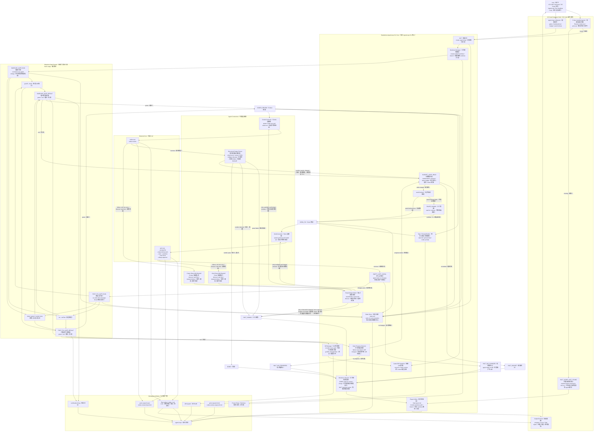

## 当前状态速读

这份文档下面的大图包含 **当前实现** 和 **未来规划** 两层内容。为了避免误读，先看这一段：

- 当前 AgentLoop 是一个 Node.js CLI 编排器，入口主要是 `src/loop.js`。
- 当前已经能跑 gate、记录 `.agent-loop/runs/<runId>/state.json`、写 `final-report.md`。
- 当前已经能在需要修复时 spawn Grok CLI，并把 `grok-request.*`、`grok-output.*`、`diff.*.patch` 落盘。
- 当前已经能在需要审查时 spawn `codex review --uncommitted`。
- 当前 `--skip-review` 时不会要求 Codex；`--auto-fix` 时才要求 Grok。
- 当前 scoped review（Grok review，或 `--scoped-review` 的 Codex）会解析结构化 `verdict`（`pass / needs_changes / blocked`，见 `src/reviewParser.js`）；裸 `codex review --uncommitted` 输出自然语言，仍按退出码判定。
- 当前已实现 “review needs_changes -> 自动回喂修复工人进入下一轮” 的闭环：verdict 优先于退出码（exitCode 0 + needs_changes 不会误判成功）；review-driven fix 与 gate fix 共用 `--max-iterations` 预算，预算耗尽即 `HALT_BUDGET`。
- 当前 **ship / no-ship 的决定权交给 reviewer 本身**：审查对照任务的 `## 成功标准` 判断，小瑕疵记进 summary 但仍 `pass`，只有真阻断才 `needs_changes`，做不出来则 `blocked`（交还人工）。引擎不再用「连续 findings 相同就 halt」这类自作聪明的启发式去二次猜测。
- 当前是 **入口契约**：每个 task 必须有非空 `## 成功标准`（由 spec 派生）；缺失则 `HALT_NO_SUCCESS_CRITERIA`，**不入环**，直接退回补全——不在引擎里给「无标准」开运行时分支。
- 当前迁移任务默认角色分工是：**Grok 做任务内实现，Codex 守硬边界**。Grok 不负责决定是否扩大迁移范围；Codex review 必须审查 allowed files、gate 证据、分层进度口径、是否把 proxy/fallback/smoke 夸大成完整迁移。
- 当前 VS Code 插件薄壳、完整 worktree 生命周期属于设计规划或待补强部分，不要当成已经完整落地。

> 文档/源码编码自检：`node src/check-mojibake.js src test scripts package.json agent_loop_v1.md`（`npm test` 也含 mojibake gate）。读出乱码多半是编辑器编码设置问题，不是文件损坏。

## 常用命令

从 `agent-loop/` 目录执行：

```powershell
npm test
node src/check-mojibake.js src test scripts package.json agent_loop_v1.md

npm run loop -- `
  --cwd C:\Users\wangchunji\Documents\cube-pets-office `
  --fix-cwd C:\Users\wangchunji\Documents\cube-pets-office `
  --task agent-loop/tasks/example.md `
  --gate "npm test" `
  --auto-fix `
  --skip-review `
  --lang zh-CN `
  --max-iterations 1

npm run list-runs -- --cwd . --lang zh-CN --limit 10
npm run list-runs -- --cwd . --json --mode grok-fix --status DONE_FIXED
npm run list-runs -- --cwd . --json --task agent-loop/tasks/migrate-sliderule-gap-ask.md --limit 1
npm run sync:task-status -- --task agent-loop/tasks/migrate-sliderule-gap-ask.md
npm run sync:task-status -- --all --include-migration-status

npm run run-queue
npm run run-queue -- --queue scripts/migration-queue.json

npm run smoke:stub
npm run smoke:live -- --timeout-ms 180000
```

说明：

- `smoke:stub` 用本地假 Grok，验证 AgentLoop 的 gate -> Grok -> diff -> gate 绿链路。
- `smoke:live` 用真实 Grok CLI，只验证 Grok fix 链路；因为它走 `--skip-review`，所以不要求 Codex。
- `list-runs --lang zh-CN` 给人看，第一列是本地时间。
- `list-runs --json` 给脚本用，可配合 `--mode`、`--status`、`--task` 查最近运行。
- `loop` 默认会在结束时自动回写当前 task 的 `## 执行状态`，并尝试同步迁移总表；可用 `--no-sync-task-status` / `--no-sync-migration-status` 关闭。
- `sync:task-status` 默认 `--cwd` 指向 repo 根目录（与 `loop --cwd` 一致）；也可手动回写 `tasks/*.md`，加 `--include-migration-status` 时同步更新迁移总表。
- `run-queue` 按 `scripts/migration-queue.json` 顺序串行跑任务；默认 `--auto-fix --guard-tests --max-iterations 3`，**单个任务失败不会中断后续任务**（continue-on-failure），队列结束后按 `done / task-failed / crashed / quarantined` 汇总并以非零退出码提示仍有失败。队列配置在 `agent-loop/scripts/migration-queue.json`，不在 `tasks/` 下。
- 自动回写失败只会 stderr warning，不会让已经成功的 `DONE_*` run 变成退出码 1。
- `list-runs` 默认按 `Asia/Shanghai` 显示本地时间；也可用 `--time-zone` 或环境变量 `TZ` 覆盖。
- `.agent-loop/runs/<runId>` 里的 `runId` 是机器安全的 UTC 路径名；人看的时间请用 `list-runs`。

## runMode 对照表

| runMode | 含义 | 关键证据 |
|---|---|---|
| `gate-only` | 基线 gate 已经通过，并且跳过 review | `status=DONE_GATE_ONLY`，无 Grok/Codex 产物 |
| `grok-fix` | Grok 运行过，修复后 gate 通过，通常跳过 review | `grok-output.*`、`diff.*.patch`、`status=DONE_FIXED` |
| `codex-review` | 没有 Grok 修复，只跑了 Codex review | `codex-review.exit.json`，无 Grok 轮次 |
| `grok-fix+codex-review` | Grok 修复后又跑了 Codex review | 同时有 Grok 与 Codex 产物 |
| `paused-before-fix` | 基线 gate 后、第一次 Grok 修复前暂停 | `status=PAUSED_BEFORE_FIX` |
| `paused-after-iteration` | 某轮有进展但仍红，暂停等人工继续 | `status=PAUSED_AFTER_ITERATION` |
| `grok-fix-timeout` | Grok 修复阶段超时 | `grokFix.timedOut=true` |
| `halt-human-after-grok` | Grok 跑过，但需要人工接管 | `status=HALT_HUMAN` 且有 `grokFix` |
| `halt-human-after-review` | Codex review 后需要人工接管 | `status=HALT_HUMAN` 且有 `codexReview` |
| `halt-human` | 其它人工接管状态 | `status=HALT_HUMAN` |
| `halt-budget` | 达到最大修复轮次 | `status=HALT_BUDGET` |
| `halt-no-changes` | Grok 运行了但没有产生有效 diff | `status=HALT_NO_CHANGES` |
| `halt-no-progress` | 修复后 gate 仍红且失败数没有改善 | `status=HALT_NO_PROGRESS` |
| `agent-missing` | 必需 agent 缺失 | `status=HALT_AGENT_NOT_FOUND` |

## 当前实现 vs 未来规划

| 能力 | 当前状态 | 说明 |
|---|---|---|
| Gate runner | 已实现 | 支持一个或多个 `--gate`，保存 stdout/stderr/exit 信息 |
| `--lang zh-CN` loop report | 已实现 | `final-report.md` 的标题、状态说明、迭代细节均中文化 |
| `list-runs` 总览 | 已实现 | 支持表格、中文、本地时间、`--json`、`--mode`、`--status`、`--task`、`--time-zone` |
| `sync:task-status` 回写 | 已实现 | `loop` 结束默认自动回写；也可手动从 `.agent-loop/runs` 回写 `tasks/*.md` |
| Grok fix smoke | 已实现 | `smoke:stub` 和 `smoke:live` 可验证 Grok 修复链路 |
| Codex review 调用 | 已实现 | 裸 `codex review --uncommitted` 按 exit code 判定；scoped 模式走 JSON verdict |
| 结构化 verdict parser | 已实现 | `src/reviewParser.js` 解析并归一化 `pass / needs_changes / blocked`，verdict 优先于退出码 |
| review needs_changes -> 修复工人二次修复 | 已实现 | findings 经 `buildAgentReviewFixPrompt` 回喂；与 gate fix 共用 `--max-iterations` 预算，耗尽即 `HALT_BUDGET` |
| reviewer 自主 ship/no-ship | 已实现 | 严重度与放行权交给 reviewer（对照 `## 成功标准`）；引擎只 honor `pass/needs_changes/blocked`，不做 findings 去重启发式 |
| 入口契约：`## 成功标准` 必填 | 已实现 | 缺失即 `HALT_NO_SUCCESS_CRITERIA` 不入环（`src/taskContract.js`）；不给「无标准」开运行时例外 |
| 迁移边界护栏 | 已实现 | fix / review prompt 内置角色分工：Grok 做实现，Codex 审边界；要求分清 Node thin proxy、Python baseline、LLM infra、RAG/vector/evidence、Blueprint/Autopilot 等层级 |
| review-driven fix resume 上下文 | 已实现 | 延后清 `pendingReview` 到迭代记录后；`resolvePendingReview` 回退到 `reviewRounds` 最近 needs_changes；有 resume 重建上下文的专项测试 |
| VS Code Extension Shell | 未来规划/外壳说明 | 当前核心能力在 CLI 内，插件薄壳不要当成已完整交付 |
| 完整隔离 worktree 生命周期 | 部分实现/待补强 | 当前可用 `--fix-cwd` 或相关 worktree 参数，但还需要更多真实场景验证 |

---



可以。你可以先别看那张大图，把它理解成 **一条主链路 + 几个刹车点**。

最核心的执行链路其实是这个：

```text
Probe 检查工具
  → 创建隔离 worktree
  → 先跑一次基线 gate
  → 如果 gate 红，就让 Grok 修
  → Grok 修完后再跑 gate
  → gate 红：判断有没有进展，有进展就下一轮，没进展就停
  → gate 绿：交给 Codex review
  → Codex pass：完成
  → Codex needs_changes：回到下一轮 Grok 修
  → Codex blocked / 输出坏 / 调用失败：停给人
```

换成人话就是：

```text
先确认工具能用；
再复制一个安全工作区；
先看项目原本坏不坏；
坏了让 Grok 修；
修完用测试裁判；
测试过了才让 Codex 做代码审查；
Codex 说还要改，就再让 Grok 改；
只要超预算、没进展、agent 跑挂、输出解析失败，就停给人。
```

---

## 1. 启动阶段：先确认环境能不能跑

第一步不是让 Grok 或 Codex 干活，而是先做 **Probe**。

它会检查：

```text
按本次运行真正需要的 agent 检查：

- 开了 `--auto-fix` 时，需要 `grok.exe`。
- 没开 `--skip-review` 时，需要 `codex.exe`。
- audit-only（`--skip-review` 且没开 `--auto-fix`）时，不要求任何 agent。

如果这里失败，直接停止：

```text
HALT_AGENT_NOT_FOUND
```

原因很简单：当前这次运行真正需要的 agent 没找到，后面不能继续。

---

## 2. 创建隔离 worktree：别污染主项目

Probe 通过后，AgentLoop 不应该直接在你的主工作区里乱改。

它会创建一个隔离环境：

```text
main repo
  ↓
agent-loop worktree / branch
```

后面 Grok 的所有修改、gate 测试、Codex 审查，都在这个 worktree 里发生。

这样即使 Grok 发疯、删文件、乱改，也不会把你的主工作树弄脏。

---

## 3. 基线 gate：先判断项目原本是什么状态

这是很关键的一步。

在 Grok 修改任何东西之前，先跑一次 gate：

```text
git diff --check
tsc --noEmit
vitest / pytest / custom tests
```

这叫：

```text
BASELINE_GATE_RUN
```

它有两个结果。

### 情况 A：基线 gate 是绿的

说明项目当前已经通过客观测试。

这时不应该强行让 Grok 修改代码，而是直接进入：

```text
CODEX_REVIEW
```

也就是让 Codex 做质量审查。

### 情况 B：基线 gate 是红的

说明项目确实有问题。

这时才进入修复循环：

```text
BUDGET_LOOP_HEAD → GROK_FIX
```

---

## 4. Budget 是循环入口：每一轮都先检查预算

只要要进入一轮新的 Grok 修复，都必须先过 Budget。

Budget 检查这些东西：

```text
是否超过 maxIterations
是否超过总时间
是否超过 token / 成本预算
是否超过整体运行限制
```

如果预算没了：

```text
HALT_BUDGET
```

如果预算还够，继续。

这里的关键是：**每一轮都要重新过 Budget，不是只在第一轮检查一次。**

---

## 5. autoContinue：第一版默认人工确认

如果配置是：

```text
autoContinue: false
```

那么每一轮 Grok 修复前都会停一下：

```text
PAUSE_HUMAN
```

意思是：

```text
上一轮报告给你看，你确认后再继续下一轮。
```

如果配置是：

```text
autoContinue: true
```

那就自动进入下一轮。

第一版建议默认 `false`，因为这类 agent loop 前期肯定会有抖动。

---

## 6. Grok 修复阶段：Grok 只负责改代码

进入：

```text
GROK_FIX
```

系统会生成一个 prompt 文件：

```text
.agent-loop/grok-request.1.md
```

里面会包含：

```text
目标是什么
当前 gate 为什么失败
上一轮 Codex 提了什么问题
要求只修 Critical / Important
不要无关重构
不要提交代码
```

然后调用：

```text
grok --prompt-file ... --cwd <worktree> --output-format json --max-turns ...
```

Grok 会在 worktree 里改文件。

---

## 7. Grok 调用失败：不能当成“没问题”

这里有一个重要刹车点。

Grok 可能会：

```text
限流
超时
崩溃
exit code 非 0
输出空
输出垃圾
```

这种情况不能继续当作“Grok 觉得不用改”。

必须进入：

```text
Grok Retry With Backoff
```

如果可重试，就等一下再试。

如果重试耗尽，或者总 timeout budget 不够了，就停：

```text
HALT_HUMAN
```

因为这是 agent 自己跑挂，不是项目已经修好。

---

## 8. Grok 成功但没改文件：单独停止

还有一种情况：

```text
Grok exit 0
但是 git diff 没变化
```

这通常说明：

```text
Grok 没干活
Grok 认为没事
Grok 没理解任务
Grok 被权限/上下文卡住
```

这时直接停：

```text
HALT_NO_CHANGES
```

不要继续空转。

---

## 9. 修完后跑 post-fix gate

如果 Grok 确实产生了 diff，就跑：

```text
POST_FIX_GATE_RUN
```

也就是修复后的 gate：

```text
git diff --check
tsc --noEmit
vitest / pytest / custom tests
```

这一步是硬裁判。

不是 Codex 说好就好，也不是 Grok 说修完就修完。

真正决定有没有修好的，是 gate。

---

## 10. 修复后 gate 还是红：看有没有进展

如果 post-fix gate 还是失败，进入：

```text
Gate Progress Detector
```

它会比较：

```text
这一轮失败数有没有下降
失败类型有没有变化
diff 有没有变化
是不是同一个错误重复出现
```

### 有进展

比如原来 10 个测试失败，现在剩 3 个。

那就回到：

```text
BUDGET_LOOP_HEAD
```

然后下一轮继续 Grok 修。

### 没进展

比如：

```text
diff 和上一轮一样
失败数量没变
错误完全重复
Grok 每轮都在改同一个无效地方
```

就停：

```text
HALT_NO_PROGRESS
```

防止 Grok 和 Codex 互相拉扯、无限烧钱。

---

## 11. 修复后 gate 绿了：才进入 Codex review

如果 gate 通过：

```text
POST_FIX_GATE_RESULT = green
```

这时才进入：

```text
CODEX_REVIEW
```

也就是说：

```text
Gate 是硬裁判；
Codex 是质量审查员。
```

Codex 不负责决定“测试是否通过”。

Codex 负责看：

```text
有没有隐藏风险
有没有错误设计
有没有安全问题
有没有不必要的大改
有没有边界条件漏掉
有没有和目标不一致
```

---

## 12. Codex review 的输出必须结构化解析

Codex 应该被要求输出类似：

```json
{
  "verdict": "pass",
  "critical": [],
  "important": [],
  "minor": [],
  "requiredFixPromptForGrok": ""
}
```

但是现实里它可能会输出：

```text
一段解释 + JSON
Markdown fence 里的 JSON
半截 JSON
格式不合法的 JSON
```

所以要经过：

```text
Structured Output Parser
```

Parser 会尝试：

````text
去掉 ```json fence
抓第一个 JSON object
解析 verdict
````

如果解析失败：

```text
HALT_HUMAN
```

不要猜。

---

## 13. Codex review 有三种主结果

### 结果 A：pass

```text
verdict: pass
```

说明：

```text
gate 通过
Codex 也没发现必须修改的问题
```

进入：

```text
DONE
```

然后生成报告。

---

### 结果 B：needs_changes

```text
verdict: needs_changes
```

说明：

```text
测试虽然过了，但 Codex 认为还有重要问题要改。
```

这时不会让 Codex 自己改，而是把 Codex 的 findings 变成下一轮 Grok prompt：

```text
Codex findings
  → requiredFixPromptForGrok
  → grok-request.N+1.md
  → BUDGET_LOOP_HEAD
  → GROK_FIX
```

也就是说：

```text
Codex 提意见，Grok 执行修改。
```

---

### 结果 C：blocked / parse failed / codex failed

这些都停给人：

```text
HALT_HUMAN
```

包括：

```text
Codex 调用失败
Codex 限流
Codex 超时
Codex 输出无法解析
Codex 说 blocked
```

因为这时候继续自动跑风险很高。

---

## 14. 所有终态都生成报告

不管最后是成功还是失败，都会走：

```text
Report Writer
```

生成：

```text
.agent-loop/final-report.md
```

报告里至少要有：

```text
最终状态：DONE / HALT_BUDGET / HALT_NO_PROGRESS / HALT_HUMAN / HALT_NO_CHANGES
worktree 路径
branch 名
每轮 Grok prompt
每轮 Grok 原始输出
每轮 gate 日志
每轮 diff
每轮 Codex review
为什么停止
下一步建议
```

最重要的是报告必须写清楚：

```text
成果在哪个 worktree / branch 里
```

否则跑完了人不知道去哪里看代码。

---

## 15. 一条完整成功路径长这样

这是最理想的路径：

```text
User 启动
  → Probe 找到 codex.exe / grok.exe
  → 创建 worktree
  → baseline gate 红
  → Budget 通过
  → 人工确认继续
  → Grok 修复
  → Grok 成功并产生 diff
  → post-fix gate 绿
  → Codex review
  → Codex 输出 pass
  → DONE
  → 生成 final-report.md
  → 用户去 worktree 里 review / merge
```

---

## 16. 一条多轮修复路径长这样

更真实的情况可能是：

```text
User 启动
  → Probe 通过
  → 创建 worktree
  → baseline gate 红

第 1 轮：
  → Budget 通过
  → Grok 修
  → gate 还是红
  → 失败数从 12 降到 5
  → 有进展，继续

第 2 轮：
  → Budget 通过
  → Grok 修
  → gate 绿
  → Codex review
  → Codex needs_changes

第 3 轮：
  → Budget 通过
  → Grok 按 Codex 意见修
  → gate 绿
  → Codex review
  → Codex pass

DONE
  → 生成报告
  → 保留 worktree 给人合并
```

---

## 17. 一条失败但安全的路径长这样

比如 Grok 一直没修动：

```text
baseline gate 红
  → Grok 修
  → gate 还是红
  → 失败没减少
  → diff 和上轮差不多
  → GateProgress 判断无进展
  → HALT_NO_PROGRESS
  → 生成报告
  → 保留现场
```

这就是安全的地方：

```text
它不会无限循环；
它会告诉你卡在哪一轮；
它会保留 raw logs 和 diff，方便你人工接手。
```

---

## 最简心智模型

你可以把整个系统理解成四个角色：

```text
Grok = 工人，负责按任务内边界改代码
Gate = 裁判，负责判断客观是否过关
Codex = 审查员，负责指出质量风险和迁移硬边界
AgentLoop = 项目经理，负责编排、记账、停机、写报告
```

执行顺序就是：

```text
项目经理先确认工具和场地
  → 裁判先测一遍原始状态
  → 工人开始修
  → 裁判每轮验收
  → 验收通过后审查员复核
  → 复核通过才算完成
  → 任何异常都停下来交给人
```

一句话版本：

```text
先 Probe，再隔离，再跑基线 gate；红灯让 Grok 修，绿灯让 Codex 审；每轮都过 Budget，每次都存日志；agent 挂、没进展、输出坏、超预算就停给人。
```

## 迁移任务的角色分工

以后做 NodeJS 到 Python 迁移时，不再靠临场经验提醒，而是把经验写进任务和 prompt：

```text
Grok 干活：
  - 只实现当前 task 点名的 capability / endpoint / contract / gate。
  - 只改 allowed files。
  - 不决定“顺手迁更多”。
  - 不把 smoke gate / proxy contract / fallback evidence 说成完整迁移。
  - 边界不清楚就 blocked。

Codex 守边界：
  - 看成功标准是否真的覆盖。
  - 看 gate 证据是否足够。
  - 看 diff 是否越界。
  - 看进度表是否把不同层级混在一起。
  - 对 mcp.call / skill.invoke / orchestrate.plan / real vector retrieval 这类硬边界，优先要求 audit / contract / smoke，而不是放大迁移结论。
```

迁移进度必须分层表达：

```text
整体 Node backend
SlideRule V5 子系统
Node thin proxy
Python V5 baseline
LLM infra
RAG / vector / evidence
Blueprint / Autopilot 主流程
```

所以一句“gate 绿了”只代表当前 task 的 gate 绿了，不代表整个后端迁完；一句“proxy 通了”只代表代理边界通了，不代表业务主流程已迁完。
