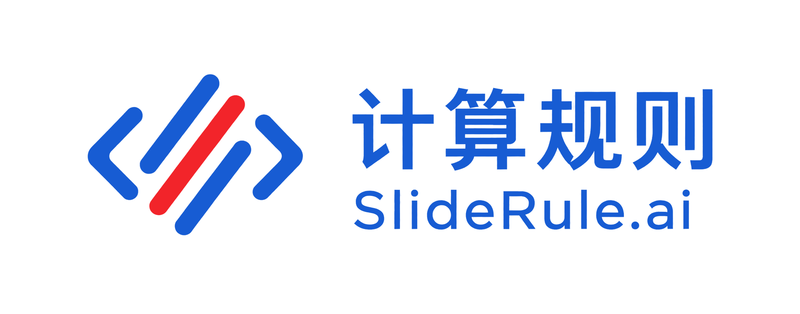

  

# AgentLoop Dashboard

AgentLoop Dashboard is the VS Code control panel for SlideRule migration work. It shows the active task queue, run status, gate evidence, review rounds, diff evidence, and queue landing status in one workspace-native view.

## What It Shows

- Current AgentLoop task queue and attention lanes.
- Active run details, including gate output, latest agent output, and run events.
- Reviewed queue changes that are ready to preview and land back to `main`.

## Usage

Open the AgentLoop activity bar entry in a workspace that contains `agent-loop/package.json`, then use **Run Queue** or **Open Dashboard** from the view title commands.
