# WhyBuddy 闭环总图（改进版 v5 · 完整版 · 全节点保真）

> 与 v4 同等保真度，但结构已翻转：不再有线性主流程脊柱。
> 中心是 `推演调度核 Orchestrator + 常驻推演状态`；旧 S1–S6 阶段全降为能力池里的平权 capability（各自保留内部算法与闸），由调度核按目标双向调用。
> v4 的判断闸 / provenance / 台账 / 状态派生 / 失效重算 / 伴随审查，全部保留并升为骨架与护城河；详见文末「v4 → v5 节点对照表」（逐节点可核对，无遗漏）。
>
> 约定：
> - 粗实线 `==>` = 产物提交主链（任意能力产物必经信任层，过了才进状态）。
> - 细实线 `-->` = 能力内部算法步 / 调度 / 角色编排。
> - `<-->` = 调度核与能力池的双向调用·回灌。
> - `---` = 能力挂在调度总线上（成员关系，无固定顺序）。
> - 虚线 `-.->` = 反馈 / 失效 / 重入 / 运行时 / 派生 / 出图审计。
> - 菱形 `{}` = 二元闸（precondition 或 commit）；六边形 `{{}}` = 调度总线；圆柱 `[()]` = 常驻状态仓。
>
> v5 增量（对应能力池文档 5 处修复）：① 屏幕唯一常驻只剩状态条；② 信任层进运行时（产物带 trustLevel，必经 commit 闸）；③ 失效重入升为一等公民、闭环回 Orchestrator；④ 调度单元 = (capability, role) 对；⑤ GitHub 降级为证据源之一。

```mermaid
flowchart TB

subgraph SURF["00 交互面 / Surface（屏幕）"]
  direction TB
  CHAT["聊天框 = 操纵杆<br/>灌 goal · 提质疑 · 指定关注点"]:::surface
  STATUS["状态条（唯一常驻）<br/>目标 · 结论状态 · 可信度 · 轮次 · 已调用能力"]:::surface
  BOARD["内联临时黑板<br/>讨论 · 图 · 报告段 · 方案 · 预览（可滚走 · 可 pin）"]:::surface
end

subgraph CORE["01 控制平面 / Control Plane（V5 新中心）"]
  direction TB
  ORCH["推演调度核 / Orchestrator<br/>pickNextCapabilities(goal, state, gaps, votes)<br/>orchestrateReasoningTurn(...)"]:::core
  STATE[("常驻推演状态 / Reasoning State<br/>graph · artifacts · evidence · risks · decisions<br/>capabilityRuns · gates · dependencyGraph")]:::state
  GOAL["目标 / 结论状态<br/>clear · needs_refinement · not_recommended"]:::core
end

subgraph ROLES["02 角色与协作 / Roles（视角 · 单一调度）"]
  direction TB
  RL["多角色 / Roles<br/>产品·架构·安全·合规·工程·挑刺·接地·综合·UI"]:::role
  D_GATE{"决策门 / Decision Gate<br/>简单 or 复杂?"}:::gate
  D_SA["单 Agent / Single-Agent"]:::role
  D_BO["头脑风暴 / Brainstorm<br/>讨论·投票·分工·审计"]:::role
  D_SYN["综合器 / Synthesizer<br/>方案·信心分·分歧意见"]:::role
  D_DEG["降级兜底 / Degradation → 单 Agent"]:::fallback
  PAIR["调度单元 = (capability, role) 对<br/>例：risk.analyze × 安全 Agent"]:::role
end

subgraph POOL["03 能力池 / Capability Pool（平权 · 无固定顺序 · 可重复 · 可回溯）"]
  direction TB
  BUS{{"能力调度总线 / Dispatch Bus<br/>调用 ⇄ 回灌"}}:::bus

  C_PARSE["意图理解 / intent.parse<br/>context.collect · source.classify · normalize 去重"]:::cap

  C_EVID["证据检索 / evidence.search<br/>证据 · 约束 · 失败状态"]:::cap
  C_REPO["仓库深度解析 / repo.inspect<br/>文件·符号·接口契约（GitHub 仅其一）"]:::cap
  C_REPO_FALL["仓库降级 / Fallback<br/>权限失败·不可访问"]:::fallback

  C_GAP["澄清·缺失 / gap.ask<br/>阻塞 · 非阻塞"]:::cap
  C_QEXP["扩展·假设 / question.expand · assumption.validate"]:::cap
  G_READY{"就绪度闸 / Readiness<br/>可规划? 继续补充?"}:::gate

  C_RTGEN["路线生成 / route.generate<br/>标准·深度·升级"]:::cap
  C_RTCMP["路线对比 / route.compare<br/>对比·风险·tradeoff·选择"]:::cap
  G_CONFIRM{"轻量确认闸 / Confirm"}:::gate

  C_PROMPT["提示词构造 / prompt.build<br/>成功标准→需求·验收 EARS"]:::cap
  C_REDACT["脱敏 / redaction"]:::cap
  C_LLM["LLM JSON 生成 / callJson<br/>retryAttempts = 1"]:::cap
  G_SCHEMA{"Schema 校验闸"}:::gate
  C_SNORM["归一化 / 稳定 ID 重映射"]:::cap
  G_INV{"不变量守卫闸<br/>唯一根·父可达·深度·无环<br/>需求覆盖·每节点挂证据"}:::gate
  C_SFALL["确定性兜底（已预满足不变量）"]:::fallback
  C_TREE["结构拆解 / structure.decompose → SPEC Tree<br/>Requirements·Design·Tasks·Evidence(带出处)"]:::cap

  C_DOC["文档生成 / document.draft<br/>requirements·design·tasks.md"]:::cap
  C_ACC["验收 / acceptance<br/>证据·用例（EARS）"]:::cap

  C_PREV["效果预演 / scenario.preview<br/>随时·可反向澄清"]:::cap
  C_VISGEN["视觉生成 / 按模块·每需求一页<br/>标『预览·未验证』·防复制·禁兜底·503重试"]:::cap
  C_VISREND["视觉渲染 / 规格树→Mermaid<br/>确定性·不交生图模型"]:::cap

  C_TOOL["工具 / mcp.call · skill.invoke<br/>Docker·MCP·GitHub·Skills"]:::cap
  C_RISK["反驳与风险 / risk.analyze · counter.argue · critique<br/>（旧伴随：挑刺者 / 接地者）"]:::cap
  C_SYN["综合收敛 / synthesis.merge"]:::cap
  C_REP["报告生成 / report.write"]:::cap

  C_PACK["指令包 / prompt.pack · execution.prepare"]:::cap
  C_MATRIX["可追溯矩阵 / traceability<br/>需求↔设计↔任务↔证据↔用例"]:::cap
  C_HAND["交付包 / handoff<br/>md·zip·接口契约草稿·验收用例·未决项·台账"]:::cap
end

subgraph TRUST["04 信任层 / Trust Layer（必经 · 真成功才算数）"]
  direction TB
  T_GATE{"提交闸 / Commit Gate<br/>二元·机械可执行"}:::gate
  T_PROV["provenance<br/>三级：ai_generated→rendered_chart_mcp→rendered_screenshot<br/>源：llm·llm_fallback·template"]:::trust
  T_AUDIT["出图审计 / check_previews_real<br/>揪兜底·假成功·复制充数（用户自跑·agent 改不了）"]:::trust
  T_CONTENT["内容质量校验 / Content Check<br/>规格成立·验收为 EARS"]:::trust
  T_TEST["测试 / Tests<br/>状态·SSR·E2E·截图"]:::trust
  T_MERGE{"合并门 / Merge Gate<br/>自动断言 + 人工目检"}:::gate
  T_LEDGER["校验台账 / Checks Ledger<br/>脚本·退出码·输出·真跑留痕（问责中枢）"]:::ledger
end

subgraph REENTRY["05 失效与重入 / Invalidation & Re-entry（一等公民）"]
  direction TB
  INTERV["用户介入 / UserIntervention<br/>challenge·revise·clarify·expand·preview·generate_plan<br/>targetArtifact / Node / ReportSection"]:::reentry
  RV{"评审 / Review<br/>交付 or 回炉?"}:::gate
  FB["反馈 / Feedback"]:::reentry
  RP{"重规划 / Replan<br/>预算·收敛阈值"}:::gate
  ESC["失败·中止·转人工 / Escalate"]:::fallback
  ITER["用户修改再推演 / Iterate"]:::reentry
  DEP["依赖图 / Dependency Graph<br/>上游变更→下游影响"]:::reentry
  INVAL["失效引擎 / Invalidation"]:::reentry
  STALE["失效索引 / Stale Index<br/>staleSince·reason·fromCapabilityRun"]:::reentry
  RECOMP["重算 + 重新调度 / Recompute & Re-schedule"]:::reentry
end

subgraph RUNTIME["06 运行时 / Runtime（状态常驻 · 画面临时）"]
  direction TB
  JOB["任务仓·产物 / Job·Artifact Store"]:::runtime
  EVT["事件总线 / Event Bus<br/>每次 capabilityRun 落事件"]:::runtime
  SOCK["实时推送 / Socket Relay"]:::runtime
  STORE["实时状态仓 / Realtime Store<br/>按 sessionId 隔离"]:::runtime
  DERIVE["状态派生 / deriveNodeStatus<br/>实时进度 + 已存 → 单一真相"]:::runtime
  ROW["节点行 / Node Row<br/>待生成·生成中·完成·失败·重试成功"]:::runtime
  REPLAY["回放 / Replay"]:::runtime
end

subgraph OUT["07 输出 / Output"]
  direction TB
  REPORT["可行性 / 推演报告（主输出物）<br/>结论·支撑·反证·证据·风险·分歧·收敛·下一步"]:::report
  DONE["交付完成 / Shipped"]:::done
end

subgraph LEGEND["图例 / Legend"]
  direction TB
  LG1["蓝 = 交互面 / 控制平面"]:::surface
  LG2["紫 = 能力池（平权能力）"]:::cap
  LG3["黄 = 二元闸（精度/确认/提交/合并）"]:::gate
  LG4["青 = provenance · 审计 · 台账"]:::trust
  LG5["红 = 失效重入 / 兜底降级"]:::reentry
  LG6["绿 = 报告 / 交付"]:::report
end

%% ===== 操纵面：聊天驱动调度核；状态/节点行渲染临时黑板 =====
CHAT -->|灌 goal / 质疑| ORCH
ORCH -.刷新.-> STATUS
ORCH -.读写.-> GOAL
STATE -.渲染临时黑板.-> BOARD
ROW -.驱动黑板.-> BOARD

%% ===== 控制平面 ⇄ 能力池（双向 · 任意顺序）=====
ORCH <-->|调用 / 回灌| BUS
BUS --- C_PARSE
BUS --- C_EVID
BUS --- C_GAP
BUS --- C_RTGEN
BUS --- C_PROMPT
BUS --- C_DOC
BUS --- C_PREV
BUS --- C_TOOL
BUS --- C_RISK
BUS --- C_SYN
BUS --- C_REP
BUS --- C_PACK

%% ===== 角色：单一调度，以 (capability, role) 对参与 =====
RL --> D_GATE
D_GATE -.简单.-> D_SA
D_GATE -.复杂.-> D_BO
D_BO --> D_SYN
D_GATE -.失败·超时.-> D_DEG
D_DEG -.兜底→单Agent.-> D_SA
ORCH -.选 capability × role.-> PAIR
D_SA -.视角.-> PAIR
D_SYN -.视角.-> PAIR
PAIR -.接入.-> BUS
D_BO -.可回灌路线 / 澄清.-> BUS

%% ===== 能力内部算法：证据 / 仓库 =====
C_EVID --- C_REPO
C_REPO -.权限失败·降级.-> C_REPO_FALL

%% ===== 能力内部算法：澄清 =====
C_GAP --> C_QEXP
C_QEXP --> G_READY
G_READY -.未就绪·回补.-> C_GAP

%% ===== 能力内部算法：路线 =====
C_RTGEN --> C_RTCMP
C_RTCMP --> G_CONFIRM
G_CONFIRM -.退回·调整.-> C_RTCMP

%% ===== 能力内部算法：结构拆解（确定性管线，是该能力自身的算法，非旧脊柱）=====
C_PROMPT --> C_REDACT
C_REDACT --> C_LLM
C_LLM -.超时 / 非JSON · 先重试.-> C_LLM
C_LLM --> G_SCHEMA
G_SCHEMA -.结构通过.-> C_SNORM
G_SCHEMA -.结构失败.-> C_SFALL
C_SNORM --> G_INV
G_INV -.不变量通过.-> C_TREE
G_INV -.不变量失败.-> C_SFALL
C_SFALL --> C_TREE

%% ===== 能力内部算法：文档 / 预演 / 打包（下游 · 真实数据依赖）=====
C_TREE --> C_DOC
C_DOC --> C_ACC
C_TREE -.确定性渲染.-> C_VISREND
C_DOC -.转生图提示词.-> C_VISGEN
C_ACC --> C_PACK
C_TREE -.汇总追溯.-> C_MATRIX

%% ===== 信任层：任意能力产物必经，过了才提交进状态（v5 核心）=====
BUS ==>|产物送审| T_GATE
T_GATE ==>|过| T_PROV
T_PROV ==> T_LEDGER
T_GATE -.未过·打回.-> BUS
C_VISGEN -.出图必审.-> T_AUDIT
T_AUDIT -.结果进台账.-> T_LEDGER
T_AUDIT -.假图·打回重出.-> C_VISGEN
C_TREE -.内容质量校验.-> T_CONTENT
ROW -.-> T_TEST
T_CONTENT -.-> T_MERGE
T_TEST -.-> T_MERGE
G_SCHEMA -.结果.-> T_LEDGER
G_INV -.结果.-> T_LEDGER
T_CONTENT -.结果.-> T_LEDGER
T_TEST -.结果.-> T_LEDGER
T_MERGE -.结果.-> T_LEDGER
T_LEDGER ==>|可信产物提交| STATE

%% ===== 状态 → 输出；下游工程化（可选）=====
STATE ==> REPORT
REPORT -.落地才走 · 可选.-> C_PACK
C_PACK --> C_HAND
C_MATRIX --> C_HAND
C_VISREND -.随交付.-> C_HAND
C_VISGEN -.随交付（标来源）.-> C_HAND
T_LEDGER -.随交付导出.-> C_HAND
C_HAND -.-> T_MERGE
T_MERGE -.放行发布.-> DONE

%% ===== 失效与重入：把"回到第二步"做成主循环的一部分 =====
BOARD -.针对节点 / 段落.-> INTERV
INTERV --> DEP
STATE -.上游 artifact 变更.-> DEP
DEP --> INVAL
INVAL --> STALE
STALE --> RECOMP
RECOMP -->|追加控制信号 · 重新选能力| ORCH
STALE -.同步前端.-> STATE
REPORT --> RV
RV -.通过·交付.-> DONE
RV -.回炉.-> FB
FB --> RP
FB -.上游变更.-> INVAL
RP -.回到澄清/路线/结构 · 经调度核.-> ORCH
RP -.使下游失效.-> INVAL
RP -.超预算·不收敛.-> ESC
C_PREV -.用户不满.-> ITER
ITER --> RP

%% ===== 运行时支撑 =====
STATE -.落盘.-> JOB
JOB -.事件.-> EVT
EVT -.-> SOCK
SOCK -.-> STORE
STORE -.-> DERIVE
JOB -.已存文档.-> DERIVE
DERIVE -.单一真相.-> STATE
DERIVE -.-> ROW
JOB -.-> REPLAY
REPLAY -.按 session 隔离.-> STORE

classDef surface fill:#eff6ff,stroke:#2563eb,color:#0f172a,stroke-width:1.5px;
classDef core fill:#dbeafe,stroke:#1d4ed8,color:#0f172a,stroke-width:2px;
classDef state fill:#e0e7ff,stroke:#4f46e5,color:#0f172a,stroke-width:2px;
classDef role fill:#cffafe,stroke:#0e7490,color:#0f172a,stroke-width:1.5px;
classDef bus fill:#ede9fe,stroke:#7c3aed,color:#0f172a,stroke-width:2px;
classDef cap fill:#f5f3ff,stroke:#7c3aed,color:#111827,stroke-width:1.5px;
classDef gate fill:#fffbeb,stroke:#d97706,color:#0f172a,stroke-width:2px;
classDef trust fill:#ccfbf1,stroke:#0f766e,color:#0f172a,stroke-width:1.5px;
classDef ledger fill:#ccfbf1,stroke:#0f766e,color:#0f172a,stroke-width:2px;
classDef reentry fill:#fff1f2,stroke:#ef4444,color:#0f172a,stroke-width:1.5px;
classDef fallback fill:#fee2e2,stroke:#dc2626,color:#0f172a,stroke-width:1.5px;
classDef runtime fill:#f8fafc,stroke:#64748b,color:#111827,stroke-width:1.5px;
classDef report fill:#dcfce7,stroke:#16a34a,color:#0f172a,stroke-width:2px;
classDef done fill:#dcfce7,stroke:#15803d,color:#0f172a,stroke-width:3px;
```

## v4 → v5 节点对照表（逐节点核对 · 无遗漏）

| v4 子图 | v4 节点 | v5 落点 |
|---------|---------|---------|
| S1 输入 | IN_RAW | C_PARSE |
| | IN_GH（入口闸） | **删除**（GitHub 降级，并入 C_REPO） |
| | IN_INGEST | C_REPO |
| | IN_FALL | C_REPO_FALL |
| | IN_NORM | C_PARSE（normalize） |
| | IN_CTX | STATE + C_PARSE |
| S2 澄清 | CL_GAP | C_GAP |
| | CL_Q | C_QEXP |
| | CL_READY | G_READY |
| | CL_BRIEF | C_GAP 产物 / STATE |
| S3 路线 | RT_GEN | C_RTGEN |
| | RT_CMP | C_RTCMP |
| | RT_SEL | C_RTCMP（选择） |
| | RT_GATE | G_CONFIRM |
| DG 决策 | D_GATE | D_GATE |
| | D_SA | D_SA |
| | D_BO | D_BO |
| | D_ROLES | RL |
| | D_SYN | D_SYN |
| | D_TOOLS | C_TOOL |
| | D_DEG | D_DEG |
| CO 伴随 | CO_CRIT | C_RISK（critique） |
| | CO_GROUND | C_RISK / C_REPO（接地=读真代码） |
| S4 规格树 | SP_PROMPT | C_PROMPT |
| | SP_REDACT | C_REDACT |
| | SP_LLM | C_LLM |
| | SP_SCHEMA | G_SCHEMA |
| | SP_NORM | C_SNORM |
| | SP_INV | G_INV |
| | SP_FALL | C_SFALL |
| | SP_PROV | T_PROV |
| | SP_TREE | C_TREE |
| S5 文档 | SD_GEN / SD_DOCS | C_DOC |
| | SD_ACC | C_ACC |
| S6 预览交付 | EP_PACK | C_PACK |
| | EP_PREV | C_PREV |
| | EP_VIS_GEN | C_VISGEN |
| | EP_VIS_REND | C_VISREND |
| | EP_VIS_AUDIT | T_AUDIT |
| | EP_MATRIX | C_MATRIX |
| | EP_HAND | C_HAND |
| S7 运行时 | WF_JOB | JOB |
| | WF_EVT | EVT |
| | WF_SOCK | SOCK |
| | WF_STORE | STORE |
| | WF_DERIVE | DERIVE |
| | WF_ROW | ROW |
| | WF_REPLAY | REPLAY |
| S8 失效依赖 | DEP | DEP |
| | INV | INVAL |
| | STALE | STALE |
| | RECOMP | RECOMP |
| S9 评审反馈 | RV / FB / RP / ESC / ITER | RV / FB / RP / ESC / ITER |
| QA 质量门 | QA_TEST | T_TEST |
| | QA_CONTENT | T_CONTENT |
| | QA_MERGE | T_MERGE |
| | QA_LEDGER | T_LEDGER |
| 终点 | DONE | DONE |

**v5 新增（v4 没有）**：SURF（CHAT / STATUS / BOARD）、CORE（ORCH / STATE / GOAL）、BUS、PAIR、INTERV、REPORT（主输出物）。

配套运行时 schema、(capability, role) 调度、失效主循环、双向 checklist 见 `WhyBuddyV5CapabilityPool.md`。
