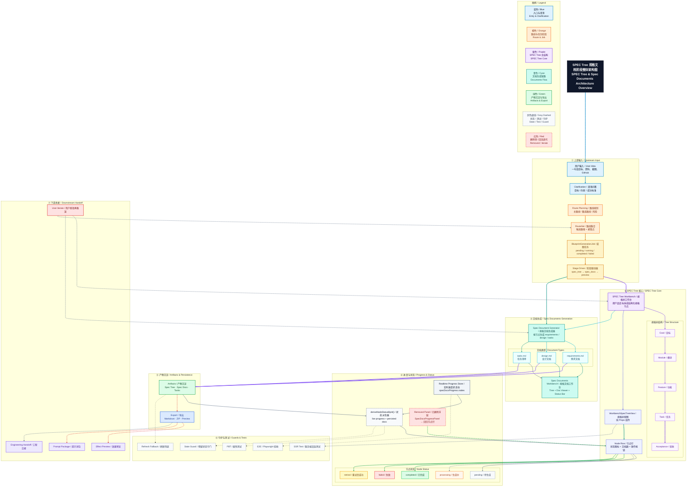

```mermaid
flowchart TB
  %% =========================================================
  %% SPEC Tree 规格文档阶段整体架构图
  %% =========================================================

  TITLE["SPEC Tree 规格文档阶段整体架构图<br/>SPEC Tree & Spec Documents Architecture Overview"]:::title

  %% =========================================================
  %% 1. 上游输入
  %% =========================================================
  subgraph L1["① 上游输入 / Upstream Input"]
    direction LR
    U["用户输入 / User Idea<br/>一句话目标、资料、截图、GitHub"]:::entry
    CLARIFY["Clarification / 澄清问答<br/>目标 / 约束 / 成功标准"]:::entry
    ROUTE["Route Planning / 路线规划<br/>主路线 / 备选路线 / 风险"]:::route
    ROUTESET["RouteSet / 路线集合<br/>候选路径 + 接管点"]:::route
    JOB["BlueprintGenerationJob / 蓝图任务<br/>pending / running / completed / failed"]:::job
    STAGE["Stage Driver / 阶段驱动器<br/>spec_tree → spec_docs → preview"]:::job
  end

  %% =========================================================
  %% 2. SPEC Tree 核心
  %% =========================================================
  subgraph L2["② SPEC Tree 核心 / SPEC Tree Core"]
    direction TB

    TREE["SPEC Tree Workbench / 规格树工作台<br/>把产品目标拆成结构化规格节点"]:::tree

    subgraph TREE_MODEL["规格树结构 / Tree Structure"]
      direction LR
      GOAL["Goal / 目标"]:::treeNode
      MODULE["Module / 模块"]:::treeNode
      FEATURE["Feature / 功能"]:::treeNode
      TASK["Task / 任务"]:::treeNode
      ACCEPT["Acceptance / 验收"]:::treeNode
    end

    TREEVIEW["WorkbenchSpecTreeView / 规格树视图<br/>纯 Props 组件"]:::frontend
    NODEROW["Node Row / 节点行<br/>状态图标 + 文档数 + 操作按钮"]:::frontend
  end

  %% =========================================================
  %% 3. 文档生成
  %% =========================================================
  subgraph L3["③ 文档生成 / Spec Documents Generation"]
    direction TB
    DOCGEN["Spec Document Generator / 规格文档生成器<br/>按节点生成 requirements / design / tasks"]:::docs

    subgraph DOCTYPES["文档类型 / Document Types"]
      direction LR
      REQ["requirements.md<br/>需求文档"]:::docType
      DESIGN["design.md<br/>设计文档"]:::docType
      TASKS["tasks.md<br/>任务清单"]:::docType
    end

    WORKBENCH["Spec Documents Workbench / 规格文档工作台<br/>Tree + Doc Viewer + Status Bar"]:::docs
  end

  %% =========================================================
  %% 4. 进度状态
  %% =========================================================
  subgraph L4["④ 进度与状态 / Progress & Status"]
    direction TB
    STORE["Realtime Progress Store / 实时进度状态仓<br/>specDocsProgress.nodes"]:::store
    DERIVE["deriveNodeStatusById() / 状态派生器<br/>live progress + persisted docs"]:::logic

    subgraph STATUS["节点状态 / Node Status"]
      direction LR
      PENDING["pending / 待生成"]:::pending
      PROCESSING["processing / 生成中"]:::processing
      COMPLETED["completed / 已完成"]:::completed
      FAILED["failed / 失败"]:::failed
      RETRIED["retried / 重试后成功"]:::warning
    end

    REMOVE["Removed Panel / 已删除浮层<br/>SpecDocsProgressPanel → 回归节点行"]:::removed
  end

  %% =========================================================
  %% 5. 产物与沉淀
  %% =========================================================
  subgraph L5["⑤ 产物沉淀 / Artifacts & Persistence"]
    direction LR
    ARTIFACTS["Artifacts / 产物沉淀<br/>Spec Tree · Spec Docs · Tasks"]:::artifact
    EXPORT["Export / 导出<br/>Markdown · ZIP · Preview"]:::output
  end

  %% =========================================================
  %% 6. 质量守护
  %% =========================================================
  subgraph L6["⑥ 守护与测试 / Guards & Tests"]
    direction LR
    PBT["PBT / 属性测试"]:::guard
    SSR["SSR Test / 服务端渲染测试"]:::guard
    E2E["E2E / Playwright 验收"]:::guard
    STALE["Stale Guard / 残留状态守门"]:::guard
    FALLBACK["Refresh Fallback / 刷新兜底"]:::guard
  end

  %% =========================================================
  %% 7. 下游承接
  %% =========================================================
  subgraph L7["⑦ 下游承接 / Downstream Handoff"]
    direction LR
    PREVIEW["Effect Preview / 效果预览"]:::downstream
    PROMPT["Prompt Package / 提示词包"]:::downstream
    HANDOFF["Engineering Handoff / 工程交接"]:::downstream
    ITERATE["User Iterate / 用户修改再推演"]:::iterate
  end

  %% =========================================================
  %% 8. 图例
  %% =========================================================
  subgraph LEGEND["图例 / Legend"]
    direction LR
    LG1["蓝色 / Blue<br/>入口与澄清<br/>Entry & Clarification"]:::entry
    LG2["橙色 / Orange<br/>路线与任务阶段<br/>Route & Job"]:::route
    LG3["紫色 / Purple<br/>SPEC Tree 主结构<br/>SPEC Tree Core"]:::tree
    LG4["青色 / Cyan<br/>文档生成链路<br/>Documents Flow"]:::docs
    LG5["绿色 / Green<br/>产物沉淀与导出<br/>Artifacts & Export"]:::artifact
    LG6["灰色虚线 / Gray Dashed<br/>状态 / 测试 / 守护<br/>State / Test / Guard"]:::guard
    LG7["红色 / Red<br/>删除项 / 回流迭代<br/>Removed / Iterate"]:::removed
  end

  %% =========================================================
  %% 主链路
  %% =========================================================
  TITLE --> U
  U --> CLARIFY
  CLARIFY --> ROUTE
  ROUTE --> ROUTESET
  ROUTESET --> JOB
  JOB --> STAGE

  STAGE --> TREE
  TREE --> GOAL
  GOAL --> MODULE
  MODULE --> FEATURE
  FEATURE --> TASK
  TASK --> ACCEPT
  TREE --> TREEVIEW
  TREEVIEW --> NODEROW

  STAGE --> DOCGEN
  TREE --> DOCGEN
  DOCGEN --> REQ
  DOCGEN --> DESIGN
  DOCGEN --> TASKS
  REQ --> WORKBENCH
  DESIGN --> WORKBENCH
  TASKS --> WORKBENCH

  STORE --> DERIVE
  ARTIFACTS --> DERIVE
  DERIVE --> NODEROW
  NODEROW --> PENDING
  NODEROW --> PROCESSING
  NODEROW --> COMPLETED
  NODEROW --> FAILED
  NODEROW --> RETRIED
  REMOVE -.-> NODEROW

  REQ --> ARTIFACTS
  DESIGN --> ARTIFACTS
  TASKS --> ARTIFACTS
  ARTIFACTS --> EXPORT

  EXPORT --> PREVIEW
  EXPORT --> PROMPT
  EXPORT --> HANDOFF

  ITERATE --> TREE
  ITERATE --> DOCGEN
  ITERATE --> ROUTESET

  TREEVIEW -.-> SSR
  DERIVE -.-> PBT
  STORE -.-> E2E
  DERIVE -.-> STALE
  ARTIFACTS -.-> FALLBACK

  %% =========================================================
  %% 样式定义
  %% =========================================================
  classDef title fill:#0f172a,stroke:#020617,color:#ffffff,stroke-width:2px,font-size:22px,font-weight:bold;

  classDef entry fill:#e0f2fe,stroke:#0284c7,color:#0f172a,stroke-width:2px;
  classDef route fill:#ffedd5,stroke:#f97316,color:#7c2d12,stroke-width:2px;
  classDef job fill:#fef3c7,stroke:#d97706,color:#713f12,stroke-width:2px;

  classDef tree fill:#f3e8ff,stroke:#7c3aed,color:#3b0764,stroke-width:2px;
  classDef treeNode fill:#faf5ff,stroke:#a855f7,color:#581c87,stroke-width:1.5px;

  classDef frontend fill:#eef2ff,stroke:#6366f1,color:#1e1b4b,stroke-width:1.5px;

  classDef docs fill:#ccfbf1,stroke:#0d9488,color:#134e4a,stroke-width:2px;
  classDef docType fill:#ecfeff,stroke:#06b6d4,color:#164e63,stroke-width:1.5px;

  classDef store fill:#f1f5f9,stroke:#64748b,color:#0f172a,stroke-width:2px;
  classDef logic fill:#f8fafc,stroke:#475569,color:#111827,stroke-width:1.5px,stroke-dasharray:5 3;

  classDef pending fill:#f8fafc,stroke:#94a3b8,color:#334155,stroke-width:1.5px;
  classDef processing fill:#fff7ed,stroke:#fb923c,color:#9a3412,stroke-width:2px;
  classDef completed fill:#dcfce7,stroke:#22c55e,color:#14532d,stroke-width:2px;
  classDef failed fill:#fee2e2,stroke:#ef4444,color:#7f1d1d,stroke-width:2px;
  classDef warning fill:#fef9c3,stroke:#f59e0b,color:#713f12,stroke-width:2px;

  classDef removed fill:#fee2e2,stroke:#ef4444,color:#7f1d1d,stroke-width:2px,stroke-dasharray:6 4;
  classDef artifact fill:#dcfce7,stroke:#16a34a,color:#14532d,stroke-width:2px;
  classDef output fill:#dbeafe,stroke:#2563eb,color:#1e3a8a,stroke-width:2px;
  classDef guard fill:#f8fafc,stroke:#64748b,color:#334155,stroke-width:1.5px,stroke-dasharray:5 3;
  classDef downstream fill:#ede9fe,stroke:#8b5cf6,color:#4c1d95,stroke-width:2px;
  classDef iterate fill:#fee2e2,stroke:#dc2626,color:#7f1d1d,stroke-width:2px;

  %% =========================================================
  %% 连线着色（按边的声明顺序编号）
  %% =========================================================

  %% 0-1: 入口与澄清（蓝）
  linkStyle 0 stroke:#0284c7,stroke-width:3px;
  linkStyle 1 stroke:#0284c7,stroke-width:3px;

  %% 2-5: 路线与 Job（橙）
  linkStyle 2 stroke:#f97316,stroke-width:3px;
  linkStyle 3 stroke:#f97316,stroke-width:3px;
  linkStyle 4 stroke:#d97706,stroke-width:3px;
  linkStyle 5 stroke:#d97706,stroke-width:3px;

  %% 6-13: SPEC Tree（紫）
  linkStyle 6 stroke:#7c3aed,stroke-width:3px;
  linkStyle 7 stroke:#7c3aed,stroke-width:2px;
  linkStyle 8 stroke:#7c3aed,stroke-width:2px;
  linkStyle 9 stroke:#7c3aed,stroke-width:2px;
  linkStyle 10 stroke:#7c3aed,stroke-width:2px;
  linkStyle 11 stroke:#7c3aed,stroke-width:3px;
  linkStyle 12 stroke:#6366f1,stroke-width:2px;

  %% 14-20: 文档生成（青）
  linkStyle 13 stroke:#0d9488,stroke-width:3px;
  linkStyle 14 stroke:#0d9488,stroke-width:3px;
  linkStyle 15 stroke:#06b6d4,stroke-width:2px;
  linkStyle 16 stroke:#06b6d4,stroke-width:2px;
  linkStyle 17 stroke:#06b6d4,stroke-width:2px;
  linkStyle 18 stroke:#0d9488,stroke-width:2px;
  linkStyle 19 stroke:#0d9488,stroke-width:2px;
  linkStyle 20 stroke:#0d9488,stroke-width:2px;

  %% 21-26: 状态流（灰）
  linkStyle 21 stroke:#64748b,stroke-width:2px;
  linkStyle 22 stroke:#64748b,stroke-width:2px;
  linkStyle 23 stroke:#64748b,stroke-width:2px;
  linkStyle 24 stroke:#64748b,stroke-width:2px;
  linkStyle 25 stroke:#64748b,stroke-width:2px;
  linkStyle 26 stroke:#64748b,stroke-width:2px,stroke-dasharray:5 3;

  %% 27-30: 产物沉淀（绿）
  linkStyle 27 stroke:#16a34a,stroke-width:2px;
  linkStyle 28 stroke:#16a34a,stroke-width:2px;
  linkStyle 29 stroke:#16a34a,stroke-width:2px;
  linkStyle 30 stroke:#16a34a,stroke-width:3px;

  %% 31-33: 下游承接（紫蓝）
  linkStyle 31 stroke:#8b5cf6,stroke-width:3px;
  linkStyle 32 stroke:#8b5cf6,stroke-width:3px;
  linkStyle 33 stroke:#8b5cf6,stroke-width:3px;

  %% 34-36: 迭代回流（红）
  linkStyle 34 stroke:#dc2626,stroke-width:2px,stroke-dasharray:6 4;
  linkStyle 35 stroke:#dc2626,stroke-width:2px,stroke-dasharray:6 4;
  linkStyle 36 stroke:#dc2626,stroke-width:2px,stroke-dasharray:6 4;

  %% 37-41: 测试与守护（灰虚线）
  linkStyle 37 stroke:#64748b,stroke-width:2px,stroke-dasharray:5 3;
  linkStyle 38 stroke:#64748b,stroke-width:2px,stroke-dasharray:5 3;
  linkStyle 39 stroke:#64748b,stroke-width:2px,stroke-dasharray:5 3;
  linkStyle 40 stroke:#64748b,stroke-width:2px,stroke-dasharray:5 3;
  linkStyle 41 stroke:#64748b,stroke-width:2px,stroke-dasharray:5 3;
```