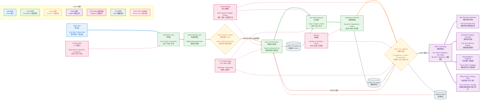

```mermaid
flowchart LR

    %% ======================
    %% Nodes / 节点
    %% ======================

    A["Input Layer<br/>输入层<br/><br/>User Idea / Product Goal<br/>用户想法 / 产品目标"]
    B["Clarification Layer<br/>澄清层<br/><br/>Goal / Scope / Constraints<br/>目标 / 范围 / 约束"]
    C["Route Planning Layer<br/>路线规划层<br/><br/>Multiple Execution Routes<br/>多条执行路线"]
    D{"Route Selection / Merge<br/>路线筛选 / 合并<br/><br/>Select or Merge Best Route<br/>选择或合并最佳路线"}
    E["SPEC Tree Generator<br/>规格树生成器<br/><br/>Route to Structured Tree<br/>路线转结构化规格树"]
    F["Tree Node Expansion<br/>节点展开<br/><br/>Epics / Features / Tasks<br/>主题 / 功能 / 任务"]
    G["Dependency Resolver<br/>依赖解析器<br/><br/>Hierarchy / Dependency / Priority<br/>层级 / 依赖 / 优先级"]
    H{"SPEC Tree Validation<br/>规格树校验<br/><br/>Completeness / Conflict / Missing Nodes<br/>完整性 / 冲突 / 缺失节点"}
    I["SPEC Tree Output<br/>规格树输出<br/><br/>Tree JSON / Markdown / View Model<br/>树 JSON / Markdown / 视图模型"]

    S1["Context Inputs<br/>上下文输入<br/><br/>Requirements / Business / Constraints<br/>需求 / 业务 / 约束"]
    S2["Prompt Strategy<br/>提示词策略<br/><br/>Build / Expand / Validate Prompts<br/>构树 / 展开 / 校验提示词"]
    S3["Rule Set<br/>规则集<br/><br/>Naming / Granularity / Priority<br/>命名 / 粒度 / 优先级"]
    S4["LLM / Agent Engine<br/>LLM / Agent 引擎<br/><br/>Reasoning + Structuring<br/>推理 + 结构化"]

    D1[("SPEC Tree Schema<br/>规格树 Schema")]
    D2[("SPEC Tree State<br/>规格树状态")]
    D3[("Validation Report<br/>校验报告")]

    O1["Spec Document Generator<br/>规格文档生成器<br/><br/>Tree to Full Spec Docs<br/>规格树转完整规格文档"]
    O2["Architecture Diagram Generator<br/>架构图生成器<br/><br/>Tree to Architecture Diagram<br/>规格树转架构图"]
    O3["Task Breakdown / Roadmap<br/>任务拆解 / 路线图<br/><br/>Tree to Tasks / Roadmap<br/>规格树转任务与路线图"]
    O4["Effect Preview / Prompt Pack<br/>效果预览 / 提示词包<br/><br/>Tree to Preview + Prompts<br/>规格树转效果预览与提示词包"]

    %% ======================
    %% Main Flow / 主链路
    %% ======================

    A --> B
    B --> C
    C --> D
    D -->|Selected Route / 选中路线| E
    E --> F
    F --> G
    G --> H
    H -->|Pass / 通过| I
    H -->|Revise / 修正| E

    %% ======================
    %% Support Flow / 支撑链路
    %% ======================

    S1 -.-> B
    S2 -.-> E
    S2 -.-> F
    S2 -.-> H
    S3 -.-> G
    S3 -.-> H
    S4 -.-> E
    S4 -.-> F
    S4 -.-> H

    %% ======================
    %% Data Flow / 数据链路
    %% ======================

    E --> D1
    G --> D2
    H --> D3
    D1 --> F
    D2 --> H
    D3 -.-> E

    %% ======================
    %% Output Flow / 输出链路
    %% ======================

    I --> O1
    I --> O2
    I --> O3
    I --> O4

    %% ======================
    %% Legend / 图例
    %% ======================

    subgraph LEGEND["Legend 图例"]
        L1["Blue 蓝色<br/>Input / 输入"]
        L2["Green 绿色<br/>Processing / 处理转换"]
        L3["Orange 橙色<br/>Decision / 决策校验"]
        L4["Purple 紫色<br/>Output / 输出交付"]
        L5["Pink Dashed 粉色虚线<br/>Support / 支撑能力"]
        L6["Gray 灰色<br/>Data / 数据状态"]
        L7["Red Dashed 红色虚线<br/>Revise Loop / 修正回流"]
    end

    %% ======================
    %% Node Colors / 节点颜色
    %% ======================

    classDef input fill:#E3F2FD,stroke:#1E88E5,stroke-width:2px,color:#0D47A1;
    classDef process fill:#E8F5E9,stroke:#43A047,stroke-width:2px,color:#1B5E20;
    classDef decision fill:#FFF8E1,stroke:#FB8C00,stroke-width:2px,color:#E65100;
    classDef output fill:#F3E5F5,stroke:#8E24AA,stroke-width:2px,color:#4A148C;
    classDef support fill:#FCE4EC,stroke:#D81B60,stroke-width:2px,color:#880E4F;
    classDef data fill:#ECEFF1,stroke:#546E7A,stroke-width:2px,color:#263238;
    classDef loop fill:#FFEBEE,stroke:#E53935,stroke-width:2px,color:#B71C1C;

    class A,L1 input;
    class B,C,E,F,G,L2 process;
    class D,H,L3 decision;
    class I,O1,O2,O3,O4,L4 output;
    class S1,S2,S3,S4,L5 support;
    class D1,D2,D3,L6 data;
    class L7 loop;

    %% ======================
    %% Line Colors / 线条颜色
    %% ======================

    linkStyle 0 stroke:#1E88E5,stroke-width:3px;
    linkStyle 1 stroke:#43A047,stroke-width:3px;
    linkStyle 2 stroke:#43A047,stroke-width:3px;
    linkStyle 3 stroke:#FB8C00,stroke-width:3px;
    linkStyle 4 stroke:#43A047,stroke-width:3px;
    linkStyle 5 stroke:#43A047,stroke-width:3px;
    linkStyle 6 stroke:#FB8C00,stroke-width:3px;
    linkStyle 7 stroke:#8E24AA,stroke-width:3px;
    linkStyle 8 stroke:#E53935,stroke-width:3px,stroke-dasharray:6 4;

    linkStyle 9 stroke:#D81B60,stroke-width:2px,stroke-dasharray:5 5;
    linkStyle 10 stroke:#D81B60,stroke-width:2px,stroke-dasharray:5 5;
    linkStyle 11 stroke:#D81B60,stroke-width:2px,stroke-dasharray:5 5;
    linkStyle 12 stroke:#D81B60,stroke-width:2px,stroke-dasharray:5 5;
    linkStyle 13 stroke:#D81B60,stroke-width:2px,stroke-dasharray:5 5;
    linkStyle 14 stroke:#D81B60,stroke-width:2px,stroke-dasharray:5 5;
    linkStyle 15 stroke:#D81B60,stroke-width:2px,stroke-dasharray:5 5;
    linkStyle 16 stroke:#D81B60,stroke-width:2px,stroke-dasharray:5 5;
    linkStyle 17 stroke:#D81B60,stroke-width:2px,stroke-dasharray:5 5;

    linkStyle 18 stroke:#546E7A,stroke-width:2px;
    linkStyle 19 stroke:#546E7A,stroke-width:2px;
    linkStyle 20 stroke:#546E7A,stroke-width:2px;
    linkStyle 21 stroke:#546E7A,stroke-width:2px;
    linkStyle 22 stroke:#546E7A,stroke-width:2px;
    linkStyle 23 stroke:#E53935,stroke-width:2px,stroke-dasharray:6 4;

    linkStyle 24 stroke:#8E24AA,stroke-width:3px;
    linkStyle 25 stroke:#8E24AA,stroke-width:3px;
    linkStyle 26 stroke:#8E24AA,stroke-width:3px;
    linkStyle 27 stroke:#8E24AA,stroke-width:3px;
```