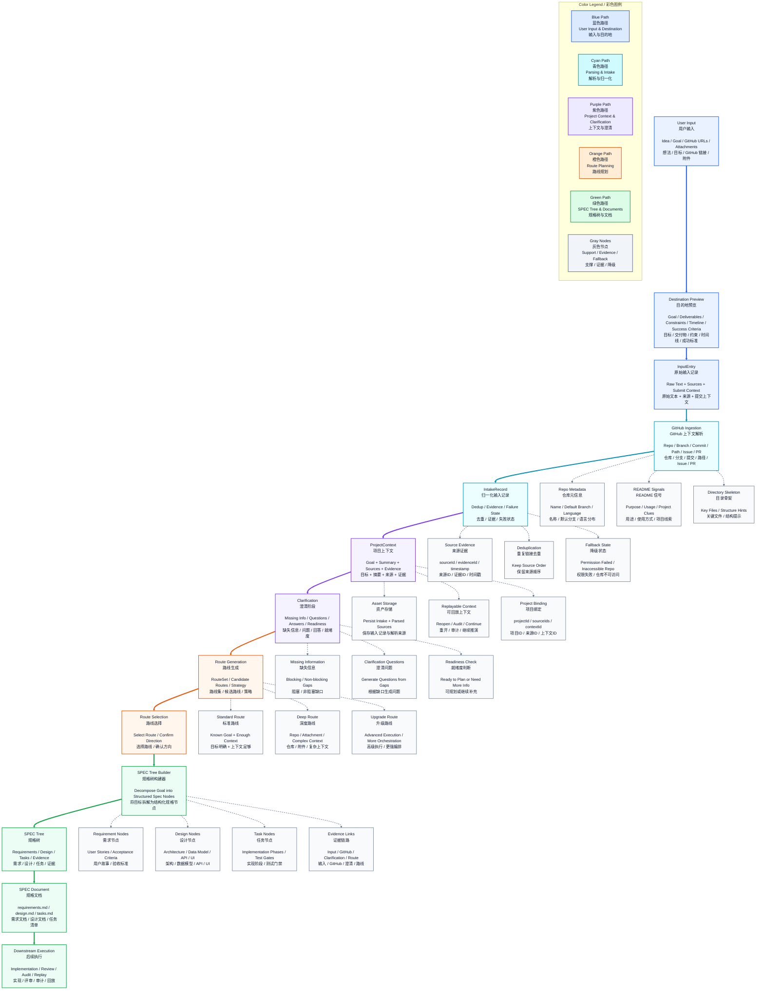

```mermaid
flowchart TB

%% =====================================================
%% SPEC Tree Architecture / 规格树架构图
%% Colored Path + Bilingual + Legend
%% =====================================================

A["User Input<br/>用户输入<br/><br/>Idea / Goal / GitHub URLs / Attachments<br/>想法 / 目标 / GitHub 链接 / 附件"]
B["Destination Preview<br/>目的地预览<br/><br/>Goal / Deliverables / Constraints / Timeline / Success Criteria<br/>目标 / 交付物 / 约束 / 时间线 / 成功标准"]
C["InputEntry<br/>原始输入记录<br/><br/>Raw Text + Sources + Submit Context<br/>原始文本 + 来源 + 提交上下文"]
D["GitHub Ingestion<br/>GitHub 上下文解析<br/><br/>Repo / Branch / Commit / Path / Issue / PR<br/>仓库 / 分支 / 提交 / 路径 / Issue / PR"]
E["IntakeRecord<br/>归一化输入记录<br/><br/>Dedup / Evidence / Failure State<br/>去重 / 证据 / 失败状态"]
F["ProjectContext<br/>项目上下文<br/><br/>Goal + Summary + Sources + Evidence<br/>目标 + 摘要 + 来源 + 证据"]
G["Clarification<br/>澄清阶段<br/><br/>Missing Info / Questions / Answers / Readiness<br/>缺失信息 / 问题 / 回答 / 就绪度"]
H["Route Generation<br/>路线生成<br/><br/>RouteSet / Candidate Routes / Strategy<br/>路线集 / 候选路线 / 策略"]
I["Route Selection<br/>路线选择<br/><br/>Select Route / Confirm Direction<br/>选择路线 / 确认方向"]
J["SPEC Tree Builder<br/>规格树构建器<br/><br/>Decompose Goal into Structured Spec Nodes<br/>将目标拆解为结构化规格节点"]
K["SPEC Tree<br/>规格树<br/><br/>Requirements / Design / Tasks / Evidence<br/>需求 / 设计 / 任务 / 证据"]
L["SPEC Document<br/>规格文档<br/><br/>requirements.md / design.md / tasks.md<br/>需求文档 / 设计文档 / 任务清单"]
M["Downstream Execution<br/>后续执行<br/><br/>Implementation / Review / Audit / Replay<br/>实现 / 评审 / 审计 / 回放"]

%% =====================================================
%% Side detail modules / 侧边能力模块
%% =====================================================

D1["Repo Metadata<br/>仓库元信息<br/><br/>Name / Default Branch / Language<br/>名称 / 默认分支 / 语言分布"]
D2["README Signals<br/>README 信号<br/><br/>Purpose / Usage / Project Clues<br/>用途 / 使用方式 / 项目线索"]
D3["Directory Skeleton<br/>目录骨架<br/><br/>Key Files / Structure Hints<br/>关键文件 / 结构提示"]

E1["Source Evidence<br/>来源证据<br/><br/>sourceId / evidenceId / timestamp<br/>来源ID / 证据ID / 时间戳"]
E2["Deduplication<br/>重复链接去重<br/><br/>Keep Source Order<br/>保留来源顺序"]
E3["Fallback State<br/>降级状态<br/><br/>Permission Failed / Inaccessible Repo<br/>权限失败 / 仓库不可访问"]

F1["Asset Storage<br/>资产存储<br/><br/>Persist Intake + Parsed Sources<br/>保存输入记录与解析来源"]
F2["Replayable Context<br/>可回放上下文<br/><br/>Reopen / Audit / Continue<br/>重开 / 审计 / 继续推演"]
F3["Project Binding<br/>项目绑定<br/><br/>projectId / sourceIds / contextId<br/>项目ID / 来源ID / 上下文ID"]

G1["Missing Information<br/>缺失信息<br/><br/>Blocking / Non-blocking Gaps<br/>阻塞 / 非阻塞缺口"]
G2["Clarification Questions<br/>澄清问题<br/><br/>Generate Questions from Gaps<br/>根据缺口生成问题"]
G3["Readiness Check<br/>就绪度判断<br/><br/>Ready to Plan or Need More Info<br/>可规划或继续补充"]

H1["Standard Route<br/>标准路线<br/><br/>Known Goal + Enough Context<br/>目标明确 + 上下文足够"]
H2["Deep Route<br/>深度路线<br/><br/>Repo / Attachment / Complex Context<br/>仓库 / 附件 / 复杂上下文"]
H3["Upgrade Route<br/>升级路线<br/><br/>Advanced Execution / More Orchestration<br/>高级执行 / 更强编排"]

J1["Requirement Nodes<br/>需求节点<br/><br/>User Stories / Acceptance Criteria<br/>用户故事 / 验收标准"]
J2["Design Nodes<br/>设计节点<br/><br/>Architecture / Data Model / API / UI<br/>架构 / 数据模型 / API / UI"]
J3["Task Nodes<br/>任务节点<br/><br/>Implementation Phases / Test Gates<br/>实现阶段 / 测试门禁"]
J4["Evidence Links<br/>证据链路<br/><br/>Input / GitHub / Clarification / Route<br/>输入 / GitHub / 澄清 / 路线"]

%% =====================================================
%% Main path / 主路径
%% =====================================================

A --> B
B --> C
C --> D
D --> E
E --> F
F --> G
G --> H
H --> I
I --> J
J --> K
K --> L
L --> M

%% =====================================================
%% Detail branches / 细节分支
%% =====================================================

D --> D1
D --> D2
D --> D3

E --> E1
E --> E2
E --> E3

F --> F1
F --> F2
F --> F3

G --> G1
G --> G2
G --> G3

H --> H1
H --> H2
H --> H3

J --> J1
J --> J2
J --> J3
J --> J4

%% =====================================================
%% Legend / 底部彩色图例
%% =====================================================

subgraph LEGEND["Color Legend / 彩色图例"]
direction LR
LG1["Blue Path<br/>蓝色路径<br/>User Input & Destination<br/>输入与目的地"]
LG2["Cyan Path<br/>青色路径<br/>Parsing & Intake<br/>解析与归一化"]
LG3["Purple Path<br/>紫色路径<br/>Project Context & Clarification<br/>上下文与澄清"]
LG4["Orange Path<br/>橙色路径<br/>Route Planning<br/>路线规划"]
LG5["Green Path<br/>绿色路径<br/>SPEC Tree & Documents<br/>规格树与文档"]
LG6["Gray Nodes<br/>灰色节点<br/>Support / Evidence / Fallback<br/>支撑 / 证据 / 降级"]
end

%% =====================================================
%% Node styles / 节点样式
%% =====================================================

classDef input fill:#EAF2FF,stroke:#2563EB,stroke-width:2px,color:#0F172A;
classDef parse fill:#ECFEFF,stroke:#0891B2,stroke-width:2px,color:#0F172A;
classDef context fill:#F5F3FF,stroke:#7C3AED,stroke-width:2px,color:#0F172A;
classDef route fill:#FFF7ED,stroke:#EA580C,stroke-width:2px,color:#0F172A;
classDef spec fill:#ECFDF5,stroke:#16A34A,stroke-width:2px,color:#0F172A;
classDef support fill:#F8FAFC,stroke:#64748B,stroke-width:1.5px,color:#0F172A;
classDef legendBlue fill:#DBEAFE,stroke:#2563EB,stroke-width:2px,color:#0F172A;
classDef legendCyan fill:#CFFAFE,stroke:#0891B2,stroke-width:2px,color:#0F172A;
classDef legendPurple fill:#EDE9FE,stroke:#7C3AED,stroke-width:2px,color:#0F172A;
classDef legendOrange fill:#FFEDD5,stroke:#EA580C,stroke-width:2px,color:#0F172A;
classDef legendGreen fill:#DCFCE7,stroke:#16A34A,stroke-width:2px,color:#0F172A;
classDef legendGray fill:#F1F5F9,stroke:#64748B,stroke-width:2px,color:#0F172A;

class A,B,C input;
class D,E parse;
class F,G context;
class H,I route;
class J,K,L,M spec;
class D1,D2,D3,E1,E2,E3,F1,F2,F3,G1,G2,G3,H1,H2,H3,J1,J2,J3,J4 support;

class LG1 legendBlue;
class LG2 legendCyan;
class LG3 legendPurple;
class LG4 legendOrange;
class LG5 legendGreen;
class LG6 legendGray;

%% =====================================================
%% Colored edge styles / 彩色连线样式
%% 注意：linkStyle 按边出现顺序从 0 开始编号
%% =====================================================

linkStyle 0 stroke:#2563EB,stroke-width:4px;
linkStyle 1 stroke:#2563EB,stroke-width:4px;
linkStyle 2 stroke:#0891B2,stroke-width:4px;
linkStyle 3 stroke:#0891B2,stroke-width:4px;
linkStyle 4 stroke:#7C3AED,stroke-width:4px;
linkStyle 5 stroke:#7C3AED,stroke-width:4px;
linkStyle 6 stroke:#EA580C,stroke-width:4px;
linkStyle 7 stroke:#EA580C,stroke-width:4px;
linkStyle 8 stroke:#16A34A,stroke-width:4px;
linkStyle 9 stroke:#16A34A,stroke-width:4px;
linkStyle 10 stroke:#16A34A,stroke-width:4px;
linkStyle 11 stroke:#16A34A,stroke-width:4px;

linkStyle 12 stroke:#64748B,stroke-width:2px,stroke-dasharray: 4 4;
linkStyle 13 stroke:#64748B,stroke-width:2px,stroke-dasharray: 4 4;
linkStyle 14 stroke:#64748B,stroke-width:2px,stroke-dasharray: 4 4;
linkStyle 15 stroke:#64748B,stroke-width:2px,stroke-dasharray: 4 4;
linkStyle 16 stroke:#64748B,stroke-width:2px,stroke-dasharray: 4 4;
linkStyle 17 stroke:#64748B,stroke-width:2px,stroke-dasharray: 4 4;
linkStyle 18 stroke:#64748B,stroke-width:2px,stroke-dasharray: 4 4;
linkStyle 19 stroke:#64748B,stroke-width:2px,stroke-dasharray: 4 4;
linkStyle 20 stroke:#64748B,stroke-width:2px,stroke-dasharray: 4 4;
linkStyle 21 stroke:#64748B,stroke-width:2px,stroke-dasharray: 4 4;
linkStyle 22 stroke:#64748B,stroke-width:2px,stroke-dasharray: 4 4;
linkStyle 23 stroke:#64748B,stroke-width:2px,stroke-dasharray: 4 4;
linkStyle 24 stroke:#64748B,stroke-width:2px,stroke-dasharray: 4 4;
linkStyle 25 stroke:#64748B,stroke-width:2px,stroke-dasharray: 4 4;
linkStyle 26 stroke:#64748B,stroke-width:2px,stroke-dasharray: 4 4;
linkStyle 27 stroke:#64748B,stroke-width:2px,stroke-dasharray: 4 4;
linkStyle 28 stroke:#64748B,stroke-width:2px,stroke-dasharray: 4 4;
linkStyle 29 stroke:#64748B,stroke-width:2px,stroke-dasharray: 4 4;
linkStyle 30 stroke:#64748B,stroke-width:2px,stroke-dasharray: 4 4;
```