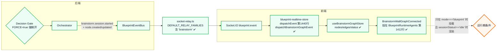

<!--
  LLM 自主决策 —— 实际接线诊断（as-built / 已校正）
  生成：2026-06-08  校正：2026-06-08（第一版结论有误，已重查代码全部更正）
  目的：对照「LLM 自主决策.md」的理想架构，给出当前仓库**真实**接线，
        定位"3D 屏上看不到在辩论"的根因。
-->

# LLM 自主决策 —— 实际接线诊断（as-built，已校正）

## 重要更正

第一版我写"前端没有 brainstormGraph slice、墙面只读 job.artifacts"——**这是错的**，我重查了代码。
真实情况是：**实时辩论链路是全程接通的**，而且有专门的实时墙组件。所以问题不在"没接线"，
而在某个**运行期条件**没满足。下面是校正后的事实。

## 校正后的真实链路（全部已接通 ✅）

逐段已核实（文件/行号）：
- 后端事件家族：`shared/blueprint/events.ts` 有第 13 个家族 `brainstorm`，9+3 条事件齐全。
- 中继放行：`server/routes/blueprint/socket-relay.ts` `DEFAULT_RELAY_FAMILIES` **包含 `"brainstorm"`** ✅。
- 事件适配：`event-emitter-adapter.ts` 给每条 brainstorm 事件打 `family: "brainstorm"` ✅。
- 前端转发：`blueprint-realtime-store.ts` 第 1440 行 `dispatchEvent` 里**调用** `dispatchBrainstormGraphEvent(event)` ✅。
- 实时图 store：`brainstorm-graph-store.ts` 消费 `session.started / node.created / node.updated /
  session.completed / round.completed / challenge.issued / vote.completed` ✅。
- 实时墙组件：`BrainstormWallGraph.tsx` 的 `BrainstormWallGraphConnected` 读 `useBrainstormGraphStore` ✅。
- 已挂载：`BlueprintRuntimeAgents.tsx` 第 1412 行 `<BrainstormWallGraphConnected />` ✅，
  而 `BlueprintRuntimeAgents` 在 `PetWorkers` 里**仅当 `mode === "blueprint"`** 时挂载。

→ 结论：**不是没接线**。是下面某个运行期条件没满足。

## 真正的嫌疑（按可能性排序）

### 嫌疑 1（最可能）：服务端没重启，FORCE 根本没生效 → 压根没辩论
- `BLUEPRINT_BRAINSTORM_FORCE=true` 是这几轮**刚加进 `.env`** 的；`process.env` 只在进程启动时读。
- 如果 `dev:all` 没重启，Decision Gate 还是走老逻辑（多半判 `brainstormNeeded=false`），
  **一个 brainstorm session 都不会起** → `useBrainstormGraphStore.sessionStatus` 一直 `idle`
  → `BrainstormWallGraphConnected` 不渲染任何东西。
- 你截图里右栏在跑 route_generation、执行日志是正常的 `llm.route_generation`，**看不到任何
  brainstorm 痕迹**，高度吻合"session 没起"。
- 验证：重启 `dev:all` 后，开浏览器 DevTools → Network → WS → 看 `blueprint:event` 帧里
  有没有 `brainstorm.session.started` / `brainstorm.node.created`。
- 或：`GET /api/blueprint/diagnostics` 看 `brainstorm.totalSessionsCompleted` 是否 > 0。

### 嫌疑 2：场景不在 blueprint 模式 → 实时墙组件根本没挂载
- `PetWorkers` 只有 `mode === "blueprint"` 才挂 `BlueprintRuntimeAgents`（含实时墙）。
- 其它 mode（mission-first 等）走 `MissionFirstAgents`，**没有** `BrainstormWallGraphConnected`。
- 验证：确认当前 3D 场景是 blueprint 驾驶舱模式。

### 嫌疑 3：客户端没订阅到 job room / session 太快
- 实时墙靠 socket 房间增量事件；它**不从 REST 历史回灌** brainstorm 事件
  （`agentReasoning` slice 有历史回灌，brainstormGraph **没有**）。
- 如果用户进页面晚于 session 完成，事件已过去 → 墙是空的。
- 验证：在辩论进行时盯着 WS 帧是否实时到达。

### 嫌疑 4：pool 调用失败 → session 起了但秒挂、几乎没节点
- orchestrator 用 5-key ouyi 池跑角色；若 key/网络异常，crew member 立即 failMember，
  node.created 很少甚至没有 → 墙上几乎没东西。
- 验证：DevTools WS 里看是否有 `brainstorm.degraded`；后端日志看 pool 调用错误。

### 嫌疑 5：墙面渲染了但视觉上看不出（位置/尺寸/层级）
- `BrainstormWallGraph` 是贴在后墙的 CanvasTexture，远景下小、可能被别的墙面内容盖住。
- 验证：sessionStatus 非 idle 时，确认后墙是否出现 dagre 思维导图纹理。

## 一步到位的验证脚本（不改代码）

1. `pnpm run dev:stop` 然后 `pnpm run dev:all` —— **必须重启**让 FORCE 生效。
2. 浏览器 DevTools：
   - Console 里已有 `[autopilot-debug] blueprint:event ←` 日志（store 自带），
     直接看有没有 `brainstorm.*` 事件流进来。
   - Network → WS 帧同样可查。
3. 跑一个进到 route_generation / spec_tree 的 job，盯 3 秒：
   - 有 `brainstorm.session.started` + 连续 `brainstorm.node.created` → 链路 OK，问题只剩视觉（嫌疑 5）。
   - 完全没有 `brainstorm.*` 帧 → 嫌疑 1（没重启 / FORCE 没生效）或嫌疑 2（非 blueprint 模式）。
4. `GET /api/blueprint/diagnostics`：`brainstorm.totalSessionsCompleted` 和 `pool.keyCount`。

## 给"全屏 2D 精细图"的备注（对照你那张参考图）

实时墙（`BrainstormWallGraph`）走的是 dagre + Canvas2D 贴墙，节点是 `BranchNode`（thinking/
synthesis 等），**不带**参考图那种左上大数字 telemetry 头 + 右下 minimap + 半透明贝塞尔配色。
那张参考图更接近 `BrainstormReasoningGraph`（带 telemetry/consoleLines）的全屏 2D 视图。
两条数据通路目前是分开的：
- 实时墙 = `useBrainstormGraphStore`（BranchNode/Edge，直播）。
- 静态推演图 = `job.artifacts` 的 `brainstorm_reasoning_graph`（BrainstormReasoningGraph，快照）。
要 1:1 那张参考图，建议另做"全屏 2D reasoning 面板"消费 `BrainstormReasoningGraph`，
而不是改实时墙贴图。

---

> 对照：`./LLM 自主决策.md`（理想架构）。本文件为 2026-06-08 校正后的真实接线与运行期排查路径。
> 第一版"无 slice / 未挂载"结论作废。
