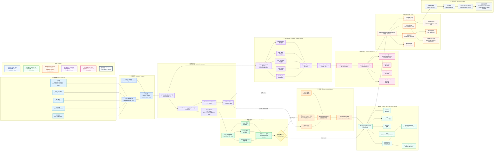

```mermaid
flowchart LR
    %% =========================================================
    %% SPEC Tree / SPEC Documents Architecture
    %% 彩色路径双语完整版 / Bilingual Full Version
    %% =========================================================

    subgraph A["① 上游输入 / Upstream Inputs"]
        A1["用户目标<br/>User Goal / Intake"]
        A2["澄清答案<br/>Clarification Answers"]
        A3["选中路线<br/>Selected Route"]
        A4["SPEC Tree 节点<br/>SPEC Tree Nodes"]
        A5["上游证据<br/>Upstream Evidence<br/>Role Findings / Sandbox / AIGC"]
    end

    subgraph B["② 生成请求 / Generation Request"]
        B1["生成全部规格文档<br/>Generate All Spec Docs"]
        B2["生成单节点文档<br/>Generate Single Node Docs"]
        B3["请求参数<br/>Request Params<br/>nodeId / types / locale"]
    end

    subgraph C["③ 服务编排层 / Service Orchestration"]
        C1["generateSpecDocuments()<br/>规格文档批量入口"]
        C2["createSpecDocumentsLlmService(ctx)<br/>LLM 服务工厂"]
        C3["BlueprintServiceContext<br/>上下文注入"]
        C4["ctx.llm.callJson<br/>LLM JSON 调用"]
        C5["Prompt Builder<br/>提示词构建<br/>node + route + evidence + locale"]
    end

    subgraph D["④ LLM 推理与校验 / LLM Inference & Validation"]
        D1["逐节点逐类型生成<br/>Per Node × Per Type"]
        D2["Requirements 文档<br/>需求文档"]
        D3["Design 文档<br/>设计文档"]
        D4["Tasks 文档<br/>任务文档"]
        D5["严格 Schema 校验<br/>Strict Zod Schema Validation"]
        D6{"校验是否通过？<br/>Schema Valid?"}
    end

    subgraph E["⑤ 回退路径 / Deterministic Fallback"]
        E1["LLM 不可用<br/>LLM unavailable"]
        E2["非 JSON / Schema 失败<br/>Invalid JSON / Schema Failed"]
        E3["超时 / 异常<br/>Timeout / Error"]
        E4["buildSpecDocument()<br/>模板化回退生成"]
        E5["稳定 Markdown 骨架<br/>Stable Markdown Template"]
    end

    subgraph F["⑥ 规格文档产物 / Spec Document Artifacts"]
        F1["BlueprintSpecDocument<br/>规格文档对象"]
        F2["sections<br/>章节结构"]
        F3["body<br/>Markdown 正文"]
        F4["summary<br/>摘要"]
        F5["status<br/>draft / reviewed / versioned"]
        F6["provenance<br/>生成来源记录"]
        F7["generationSource<br/>llm / llm_fallback / template"]
        F8["promptId / model / error<br/>提示词与模型追踪"]
    end

    subgraph G["⑦ 实时进度事件 / Realtime Progress Events"]
        G1["Spec Docs Progress Emitter<br/>规格文档进度发射器"]
        G2["batch_init<br/>批次初始化"]
        G3["node_started<br/>节点开始"]
        G4["node_completed<br/>节点完成"]
        G5["node_failed<br/>节点失败"]
        G6["batch_finished<br/>批次完成"]
        G7["BlueprintEventBus<br/>事件总线"]
        G8["BlueprintSocketRelay<br/>Socket 转发"]
    end

    subgraph H["⑧ 前端状态层 / Frontend State Store"]
        H1["useBlueprintRealtimeStore<br/>实时状态 Store"]
        H2["specDocsProgress Slice<br/>规格文档进度切片"]
        H3["nodes[nodeId].status<br/>pending / processing / completed / failed"]
        H4["wasRetried<br/>重试标记"]
        H5["errorSummary<br/>错误摘要"]
        H6["completedCount / totalCount<br/>完成计数"]
    end

    subgraph I["⑨ Workbench UI 工作台"]
        I1["AutopilotSpecDocumentsWorkbench<br/>规格文档工作台"]
        I2["顶部状态栏<br/>Workbench Status Bar"]
        I3["左侧 SPEC Tree<br/>Spec Tree Panel"]
        I4["中间文档主区<br/>Document Main Area"]
        I5["底部执行步骤<br/>Execution Steps"]
        I6["节点行状态合并<br/>Progress Merged into Tree Row"]
        I7["文档类型卡片<br/>Doc Type Cards"]
        I8["AI 摘要 / 章节 / 引用<br/>AI Summary / Outline / References"]
    end

    subgraph J["⑩ 导出与审阅 / Export & Review"]
        J1["规格文档审阅<br/>Review Spec Docs"]
        J2["版本快照<br/>Version Snapshot"]
        J3["导出 Markdown / JSON<br/>Export Markdown / JSON"]
        J4["后续阶段消费<br/>Downstream Consumption<br/>Prompt Package / Preview / Handoff"]
    end

    A1 --> B1
    A2 --> B1
    A3 --> B1
    A4 --> B1
    A5 --> B1

    B1 --> B3
    B2 --> B3
    B3 --> C1
    C1 --> C2
    C2 --> C3
    C3 --> C4
    C2 --> C5
    C5 --> D1

    D1 --> D2
    D1 --> D3
    D1 --> D4
    D2 --> D5
    D3 --> D5
    D4 --> D5
    D5 --> D6

    D6 -->|通过 / Valid| F1
    F1 --> F2
    F1 --> F3
    F1 --> F4
    F1 --> F5
    F1 --> F6
    F6 --> F7
    F6 --> F8

    D6 -->|失败 / Invalid| E2
    C4 -->|异常 / Error| E3
    C4 -->|不可用 / Unavailable| E1
    E1 --> E4
    E2 --> E4
    E3 --> E4
    E4 --> E5
    E5 --> F1

    C1 --> G1
    G1 --> G2
    G1 --> G3
    G1 --> G4
    G1 --> G5
    G1 --> G6
    G2 --> G7
    G3 --> G7
    G4 --> G7
    G5 --> G7
    G6 --> G7
    G7 --> G8

    G8 --> H1
    H1 --> H2
    H2 --> H3
    H2 --> H4
    H2 --> H5
    H2 --> H6

    F1 --> I1
    H2 --> I1
    I1 --> I2
    I1 --> I3
    I1 --> I4
    I1 --> I5
    I3 --> I6
    I2 --> I7
    I4 --> I8

    I4 --> J1
    J1 --> J2
    J2 --> J3
    J3 --> J4

    subgraph Z["图例 / Legend"]
        direction TB
        Z1["蓝色路径 / Blue Path<br/>主生成链路 / Main Generation Flow"]
        Z2["绿色路径 / Green Path<br/>LLM 成功产物 / Successful LLM Artifact"]
        Z3["橙色虚线路径 / Orange Dashed Path<br/>模板回退 / Fallback Template Flow"]
        Z4["紫色路径 / Purple Path<br/>实时进度事件 / Realtime Progress Events"]
        Z5["粉色路径 / Pink Path<br/>前端状态与 UI / Frontend Store and UI"]
        Z6["灰色路径 / Gray Path<br/>导出 / 审阅 / 下游消费"]
    end

    classDef input fill:#E0F2FE,stroke:#0284C7,stroke-width:1.5px,color:#0F172A;
    classDef request fill:#DBEAFE,stroke:#2563EB,stroke-width:1.5px,color:#0F172A;
    classDef service fill:#EDE9FE,stroke:#7C3AED,stroke-width:1.5px,color:#0F172A;
    classDef llm fill:#DCFCE7,stroke:#16A34A,stroke-width:1.5px,color:#0F172A;
    classDef fallback fill:#FFEDD5,stroke:#F97316,stroke-width:1.5px,color:#0F172A;
    classDef artifact fill:#ECFDF5,stroke:#059669,stroke-width:1.5px,color:#0F172A;
    classDef event fill:#F3E8FF,stroke:#9333EA,stroke-width:1.5px,color:#0F172A;
    classDef store fill:#FCE7F3,stroke:#DB2777,stroke-width:1.5px,color:#0F172A;
    classDef ui fill:#FFF7ED,stroke:#EA580C,stroke-width:1.5px,color:#0F172A;
    classDef export fill:#F1F5F9,stroke:#64748B,stroke-width:1.5px,color:#0F172A;
    classDef decision fill:#FEF9C3,stroke:#CA8A04,stroke-width:2px,color:#0F172A;

    classDef legendBlue fill:#EFF6FF,stroke:#2563EB,stroke-width:4px,color:#1E3A8A;
    classDef legendGreen fill:#F0FDF4,stroke:#16A34A,stroke-width:4px,color:#14532D;
    classDef legendOrange fill:#FFF7ED,stroke:#F97316,stroke-width:4px,color:#7C2D12;
    classDef legendPurple fill:#FAF5FF,stroke:#9333EA,stroke-width:4px,color:#581C87;
    classDef legendPink fill:#FDF2F8,stroke:#DB2777,stroke-width:4px,color:#831843;
    classDef legendGray fill:#F8FAFC,stroke:#64748B,stroke-width:4px,color:#334155;

    class A1,A2,A3,A4,A5 input;
    class B1,B2,B3 request;
    class C1,C2,C3,C4,C5 service;
    class D1,D2,D3,D4,D5 llm;
    class D6 decision;
    class E1,E2,E3,E4,E5 fallback;
    class F1,F2,F3,F4,F5,F6,F7,F8 artifact;
    class G1,G2,G3,G4,G5,G6,G7,G8 event;
    class H1,H2,H3,H4,H5,H6 store;
    class I1,I2,I3,I4,I5,I6,I7,I8 ui;
    class J1,J2,J3,J4 export;

    class Z1 legendBlue;
    class Z2 legendGreen;
    class Z3 legendOrange;
    class Z4 legendPurple;
    class Z5 legendPink;
    class Z6 legendGray;
```