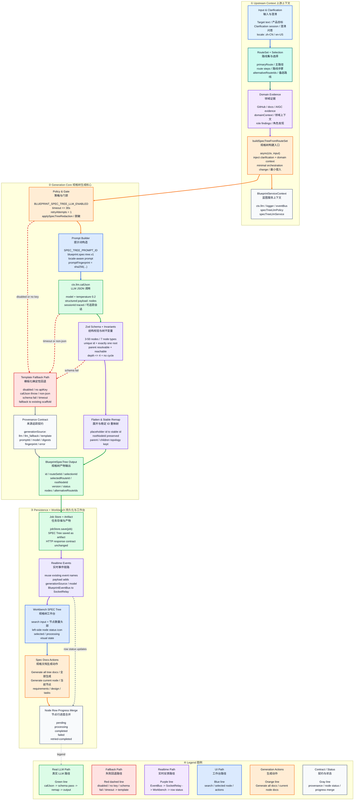

```mermaid
flowchart TB

%% =========================
%% ① Upstream Context
%% =========================
subgraph U["① Upstream Context 上游上下文"]
direction LR

IN["Input & Clarification<br/>输入与澄清<br/><br/>Target text / 产品目标<br/>Clarification session / 澄清问答<br/>locale: zh-CN / en-US"]

RS["RouteSet + Selection<br/>路线集与选择<br/><br/>primaryRoute / 主路径<br/>route steps / 路线步骤<br/>alternativeRouteIds / 备选路线"]

EV["Domain Evidence<br/>领域证据<br/><br/>GitHub / docs / AIGC evidence<br/>domainContext / 领域上下文<br/>role findings / 角色发现"]

BS["buildSpecTreeFromRouteSet<br/>规格树构建入口<br/><br/>async(ctx, input)<br/>inject clarification + domain context<br/>minimal orchestration change / 最小侵入"]

CTX["BlueprintServiceContext<br/>蓝图服务上下文<br/><br/>ctx.llm / logger / eventBus<br/>specTreeLlmPolicy<br/>specTreeLlmService"]

IN --> RS
RS --> EV
EV --> BS
BS --> CTX
end

%% =========================
%% ② Generation Core
%% =========================
subgraph G["② Generation Core 规格树生成核心"]
direction LR

POL["Policy & Gate<br/>策略与门禁<br/><br/>BLUEPRINT_SPEC_TREE_LLM_ENABLED<br/>timeout <= 30s<br/>retryAttempts = 1<br/>applySpecTreeRedaction / 脱敏"]

PRM["Prompt Builder<br/>提示词构造<br/><br/>SPEC_TREE_PROMPT_ID<br/>blueprint.spec-tree.v1<br/>locale-aware prompt<br/>promptFingerprint = sha256(...)"]

LLM["ctx.llm.callJson<br/>LLM JSON 调用<br/><br/>model + temperature 0.2<br/>structured payload: nodes<br/>sessionId traced / 可追踪会话"]

SCH["Zod Schema + Invariants<br/>结构校验与树不变量<br/><br/>3-50 nodes / 7 node types<br/>unique id + exactly one root<br/>parent resolvable + reachable<br/>depth <= 4 + no cycle"]

REMAP["Flatten & Stable Remap<br/>展开与稳定 ID 重映射<br/><br/>placeholder id to stable id<br/>rootNodeId preserved<br/>parent / children topology kept"]

FAL["Template Fallback Path<br/>模板化确定性回退<br/><br/>disabled / no apiKey<br/>callJson throw / non-json<br/>schema fail / timeout<br/>fallback to existing scaffold"]

PROV["Provenance Contract<br/>来源追踪契约<br/><br/>generationSource:<br/>llm / llm_fallback / template<br/>promptId / model / digests<br/>fingerprint / error"]

OUT["BlueprintSpecTree Output<br/>规格树产物输出<br/><br/>id / routeSetId / selectionId<br/>selectedRouteId / rootNodeId<br/>version / status<br/>nodes / alternativeRouteIds"]

POL --> PRM
PRM --> LLM
LLM --> SCH
SCH --> REMAP

POL -. disabled or no key .-> FAL
LLM -. timeout or non-json .-> FAL
SCH -. schema fail .-> FAL

FAL --> PROV
PROV --> OUT
REMAP --> OUT
end

%% =========================
%% ③ Persistence + Workbench
%% =========================
subgraph W["③ Persistence + Workbench 持久化与工作台"]
direction LR

SAVE["Job Store + Artifact<br/>任务存储与产物<br/><br/>jobStore.save(job)<br/>SPEC Tree saved as artifact<br/>HTTP response contract unchanged"]

EVT["Realtime Events<br/>实时事件链路<br/><br/>reuse existing event names<br/>payload adds generationSource / model<br/>BlueprintEventBus to SocketRelay"]

WB["Workbench SPEC Tree<br/>规格树工作台<br/><br/>search input + 节点数量头部<br/>left-side node status icon<br/>selected / processing visual state"]

DOCS["Spec Docs Actions<br/>规格文档生成动作<br/><br/>Generate all tree docs / 全部生成<br/>Generate current node / 当前节点<br/>requirements / design / tasks"]

ROW["Node Row Progress Merge<br/>节点行进度合并<br/><br/>pending<br/>processing<br/>completed<br/>failed<br/>retried-completed"]

SAVE --> EVT
EVT --> WB
WB --> DOCS
DOCS --> ROW
EVT -. row status updates .-> ROW
end

%% =========================
%% Cross Layer Flow
%% =========================
BS --> POL
OUT --> SAVE

%% =========================
%% ④ Legend
%% =========================
subgraph L["④ Legend 图例"]
direction LR

LG1["Real LLM Path<br/>真实 LLM 路径<br/><br/>Green line<br/>callJson -> schema pass -> remap -> output"]

LG2["Fallback Path<br/>失败回退路径<br/><br/>Red dashed line<br/>disabled / no key / schema fail / timeout -> template"]

LG3["Realtime Path<br/>实时反馈路径<br/><br/>Purple line<br/>EventBus -> SocketRelay -> Workbench -> row status"]

LG4["UI Path<br/>工作台路径<br/><br/>Blue line<br/>search / selected node / actions"]

LG5["Generation Actions<br/>生成动作<br/><br/>Orange line<br/>Generate all docs / current node docs"]

LG6["Contract / Status<br/>契约与状态<br/><br/>Gray line<br/>provenance / node status / progress merge"]

end

ROW -. legend .-> LG1

%% =========================
%% Node Styles
%% =========================
classDef input fill:#E0F2FE,stroke:#2563EB,color:#0F172A,stroke-width:2px;
classDef route fill:#CCFBF1,stroke:#0F766E,color:#0F172A,stroke-width:2px;
classDef evidence fill:#F3E8FF,stroke:#7C3AED,color:#0F172A,stroke-width:2px;
classDef action fill:#FFEDD5,stroke:#F97316,color:#0F172A,stroke-width:2px;
classDef context fill:#F8FAFC,stroke:#64748B,color:#0F172A,stroke-width:2px;
classDef llm fill:#DCFCE7,stroke:#16A34A,color:#0F172A,stroke-width:2px;
classDef validate fill:#EDE9FE,stroke:#7C3AED,color:#0F172A,stroke-width:2px;
classDef fallback fill:#FEE2E2,stroke:#DC2626,color:#0F172A,stroke-width:2px;
classDef workbench fill:#DBEAFE,stroke:#2563EB,color:#0F172A,stroke-width:2px;

classDef legendLLM fill:#DCFCE7,stroke:#16A34A,color:#0F172A,stroke-width:2px;
classDef legendFallback fill:#FEE2E2,stroke:#DC2626,color:#0F172A,stroke-width:2px;
classDef legendRealtime fill:#F3E8FF,stroke:#7C3AED,color:#0F172A,stroke-width:2px;
classDef legendUI fill:#DBEAFE,stroke:#2563EB,color:#0F172A,stroke-width:2px;
classDef legendAction fill:#FFEDD5,stroke:#F97316,color:#0F172A,stroke-width:2px;
classDef legendStatus fill:#F8FAFC,stroke:#64748B,color:#0F172A,stroke-width:2px;

class IN input;
class RS route;
class EV evidence;
class BS,DOCS action;
class CTX,PROV,ROW context;
class POL action;
class PRM,WB workbench;
class LLM,OUT,SAVE llm;
class SCH,REMAP,EVT validate;
class FAL fallback;

class LG1 legendLLM;
class LG2 legendFallback;
class LG3 legendRealtime;
class LG4 legendUI;
class LG5 legendAction;
class LG6 legendStatus;

%% =========================
%% Colored Link Styles
%% 注意：linkStyle 按上面连线出现顺序编号
%% =========================

%% Upstream path 上游路径
linkStyle 0 stroke:#2563EB,stroke-width:3px;
linkStyle 1 stroke:#0F766E,stroke-width:3px;
linkStyle 2 stroke:#7C3AED,stroke-width:3px;
linkStyle 3 stroke:#F97316,stroke-width:3px;

%% Generation main path 生成主路径
linkStyle 4 stroke:#F97316,stroke-width:3px;
linkStyle 5 stroke:#2563EB,stroke-width:3px;
linkStyle 6 stroke:#16A34A,stroke-width:3px;
linkStyle 7 stroke:#7C3AED,stroke-width:3px;

%% Fallback dashed path 回退路径
linkStyle 8 stroke:#DC2626,stroke-width:3px,stroke-dasharray: 8 6;
linkStyle 9 stroke:#DC2626,stroke-width:3px,stroke-dasharray: 8 6;
linkStyle 10 stroke:#DC2626,stroke-width:3px,stroke-dasharray: 8 6;

%% Provenance / output contract 契约输出路径
linkStyle 11 stroke:#64748B,stroke-width:3px;
linkStyle 12 stroke:#64748B,stroke-width:3px;
linkStyle 13 stroke:#16A34A,stroke-width:3px;

%% Workbench realtime / UI path 工作台路径
linkStyle 14 stroke:#7C3AED,stroke-width:3px;
linkStyle 15 stroke:#7C3AED,stroke-width:3px;
linkStyle 16 stroke:#2563EB,stroke-width:3px;
linkStyle 17 stroke:#F97316,stroke-width:3px;
linkStyle 18 stroke:#64748B,stroke-width:3px,stroke-dasharray: 6 6;

%% Cross layer path 跨层路径
linkStyle 19 stroke:#F97316,stroke-width:3px;
linkStyle 20 stroke:#16A34A,stroke-width:3px;

%% Legend link 图例连接线
linkStyle 21 stroke:#94A3B8,stroke-width:2px,stroke-dasharray: 4 6;
```