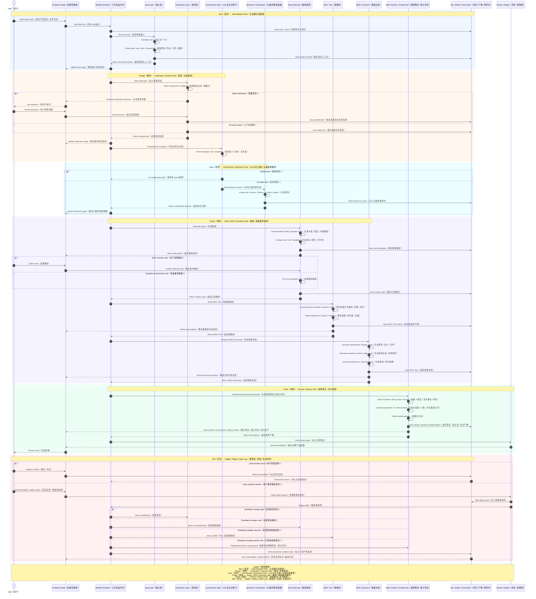

```mermaid
sequenceDiagram
    autonumber

    actor User as User（用户）
    participant UI as Frontend Cockpit（前端驾驶舱）
    participant WF as Workflow Runtime（工作流运行时）
    participant IN as Input Layer（输入层）
    participant CL as Clarification Layer（澄清层）
    participant DG as LLM Decision Gate（LLM 自主决策门）
    participant BO as Brainstorm Orchestrator（头脑风暴调度器）
    participant RT as Route Planning（路线规划）
    participant ST as SPEC Tree（规格树）
    participant SD as SPEC Document（规格文档）
    participant EP as Effect Preview / Prompt Pack（效果预览 / 提示词包）
    participant Store as Job / Artifact / Event Store（任务 / 产物 / 事件仓）
    participant Review as Review / Replan（评审 / 重规划）

    %% =========================
    %% Blue：Main Blueprint Path
    %% =========================
    rect rgb(239, 246, 255)
    Note over User,Store: Blue（蓝色）：Main Blueprint Path（主蓝图生成路径）

    User->>UI: Submit idea / goal（提交产品想法 / 任务目标）
    UI->>WF: Start Skill Run（启动 Skill 运行）
    WF->>Store: Create Job + Event（创建任务与事件）
    WF->>IN: Send raw input（发送原始输入）

    IN->>IN: Normalize input（输入归一化）
    IN->>IN: Extract idea / repo / files / screenshots（提取想法 / 仓库 / 文件 / 截图）
    IN->>Store: Save Project Context（保存项目上下文）
    IN-->>WF: Return structured context（返回结构化上下文）
    WF-->>UI: Update input stage（更新输入阶段状态）
    end

    %% =========================
    %% Orange：Clarification / Decision Path
    %% =========================
    rect rgb(255, 247, 237)
    Note over WF,DG: Orange（橙色）：Clarification / Decision Path（澄清 / 决策路径）

    WF->>CL: Start clarification（进入澄清阶段）
    CL->>CL: Detect missing info / ambiguity（检测缺失信息 / 模糊点）

    alt Need clarification（需要澄清）
        CL-->>UI: Generate clarification questions（生成澄清问题）
        UI-->>User: Ask questions（向用户提问）
        User->>UI: Answer questions（用户回答问题）
        UI->>CL: Submit answers（提交澄清回答）
        CL->>Store: Save clarified brief（保存澄清后的任务简报）
    else Enough context（上下文足够）
        CL->>Store: Save initial brief（保存初始任务简报）
    end

    CL-->>WF: Return clarified brief（返回澄清简报）
    WF-->>UI: Update clarification stage（更新澄清阶段状态）

    WF->>DG: Evaluate task complexity（评估任务复杂度）
    DG->>DG: Check ambiguity / risk / complexity（检查歧义 / 风险 / 复杂度）
    end

    %% =========================
    %% Cyan：LLM Decision / Brainstorm Path
    %% =========================
    rect rgb(236, 254, 255)
    Note over DG,BO: Cyan（青色）：LLM Decision / Brainstorm Path（LLM 自主决策 / 头脑风暴路径）

    alt Simple task（简单任务）
        DG-->>WF: Use single-agent path（使用单 Agent 路径）
    else Complex task（复杂任务）
        DG-->>BO: Start brainstorm session（启动头脑风暴会话）
        BO->>BO: Assign roles: Decider / Planner / Architect / Auditor（分配角色）
        BO->>Store: Write brainstorm events（写入头脑风暴事件）
        BO-->>WF: Return collaborative decision（返回协作决策）
        WF-->>UI: Stream brainstorm graph（推送头脑风暴推理图）
    end
    end

    %% =========================
    %% Purple：Route / SPEC Derivation Path
    %% =========================
    rect rgb(245, 243, 255)
    Note over WF,SD: Purple（紫色）：Route / SPEC Derivation Path（路线 / 规格推导路径）

    WF->>RT: Generate routes（生成路线）
    RT->>RT: Create standard / deep / upgrade routes（生成标准 / 深度 / 升级路线）
    RT->>RT: Compare cost / risk / feasibility（对比成本 / 风险 / 可行性）
    RT->>Store: Save route candidates（保存候选路线）
    RT-->>UI: Show route options（展示路线选项）

    alt User chooses route（用户选择路线）
        User->>UI: Select route（选择路线）
        UI->>RT: Confirm selected route（确认选中路线）
    else Autopilot recommends route（系统推荐路线）
        RT->>RT: Pick recommended route（选择推荐路线）
    end

    RT->>Store: Save chosen route（保存已选路线）
    RT-->>WF: Return chosen route（返回已选路线）

    WF->>ST: Build SPEC Tree（构建规格树）
    ST->>ST: Expand goal into modules / features / tasks（将目标展开为模块 / 功能 / 任务）
    ST->>ST: Attach dependency / priority / evidence（绑定依赖 / 优先级 / 证据）
    ST->>Store: Save SPEC Tree artifact（保存规格树产物）
    ST-->>UI: Stream tree progress（推送规格树生成进度）
    ST-->>WF: Return SPEC Tree（返回规格树）

    WF->>SD: Compose SPEC Document（生成规格文档）
    SD->>SD: Generate requirements / design / tasks（生成需求 / 设计 / 任务）
    SD->>SD: Generate acceptance criteria / edge cases（生成验收标准 / 边界情况）
    SD->>SD: Generate architecture / task breakdown（生成架构 / 任务拆解）
    SD->>Store: Save SPEC docs（保存规格文档）
    SD-->>UI: Stream document progress（推送文档生成进度）
    SD-->>WF: Return SPEC documents（返回规格文档）
    end

    %% =========================
    %% Green：Preview / Delivery Path
    %% =========================
    rect rgb(236, 253, 245)
    Note over WF,Review: Green（绿色）：Preview / Delivery Path（效果预览 / 交付路径）

    WF->>EP: Generate preview and prompt pack（生成效果预览与提示词包）
    EP->>EP: Build UI preview / demo script / mockup（构建 UI 预览 / 演示脚本 / 样机）
    EP->>EP: Generate generation / UI / dev prompts（生成生成类 / UI 类 / 开发类提示词）
    EP->>EP: Build handoff package（构建交付包）
    EP->>Store: Save preview / prompt / handoff artifacts（保存预览 / 提示词 / 交付产物）
    EP-->>UI: Show preview / prompt pack / delivery assets（展示预览 / 提示词包 / 交付资产）
    EP-->>WF: Return final artifacts（返回最终产物）

    WF->>Review: Enter review stage（进入评审阶段）
    Review-->>UI: Show final blueprint（展示完整产品蓝图）
    UI-->>User: Present result（呈现结果）
    end

    %% =========================
    %% Red：Replan / Stale Loop
    %% =========================
    rect rgb(255, 241, 242)
    Note over User,Store: Red（红色）：Replan / Replay / Stale Loop（重规划 / 回放 / 失效闭环）

    alt User accepts result（用户接受结果）
        User->>UI: Approve / Export（确认 / 导出）
        UI->>Store: Mark job completed（标记任务完成）
        Store-->>WF: Persist final version（持久化最终版本）
    else User requests iteration（用户要求继续迭代）
        User->>UI: Submit feedback / replan reason（提交反馈 / 重规划原因）
        UI->>Review: Create replan request（创建重规划请求）
        Review->>Store: Write replan event（写入重规划事件）
        Review->>WF: Trigger replan（触发重规划）

        alt Feedback changes goal（反馈影响目标）
            WF->>CL: Back to clarification（回到澄清）
        else Feedback changes route（反馈影响路线）
            WF->>RT: Back to route planning（回到路线规划）
        else Feedback changes structure（反馈影响规格结构）
            WF->>ST: Back to SPEC Tree（回到规格树）
        else Feedback changes preview only（只影响效果预览）
            WF->>EP: Regenerate preview / prompt pack（重新生成效果预览 / 提示词包）
        end

        WF->>Store: Mark downstream artifacts stale（标记下游产物失效）
        Store-->>UI: Sync stale badges / version history（同步失效标记 / 版本历史）
    end
    end

    %% =========================
    %% Legend
    %% =========================
    rect rgb(248, 250, 252)
    Note over User,Review: Legend（路径图例）<br/>Blue（蓝色）：Main Blueprint Path（主蓝图生成路径）<br/>Orange（橙色）：Clarification / Decision Path（澄清 / 决策路径）<br/>Cyan（青色）：LLM Decision / Brainstorm Path（LLM 自主决策 / 头脑风暴路径）<br/>Purple（紫色）：Route / SPEC Derivation Path（路线 / 规格推导路径）<br/>Green（绿色）：Preview / Delivery Path（效果预览 / 交付路径）<br/>Red（红色）：Replan / Replay / Stale Loop（重规划 / 回放 / 失效闭环）
    end
```