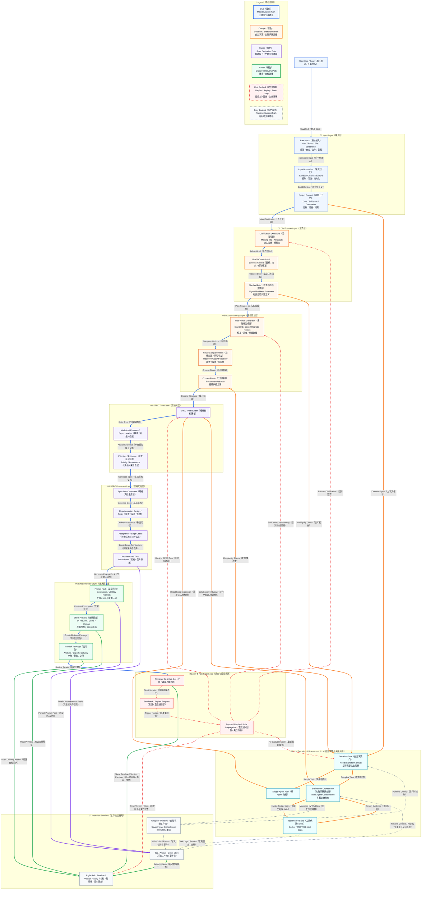

```mermaid
flowchart TB

%% =========================
%% Styles
%% =========================
classDef user fill:#eef6ff,stroke:#2563eb,stroke-width:2px,color:#0f172a;
classDef input fill:#eff6ff,stroke:#2563eb,stroke-width:1.5px,color:#111827;
classDef clarify fill:#fff7ed,stroke:#f97316,stroke-width:1.5px,color:#111827;
classDef route fill:#fff7ed,stroke:#ea580c,stroke-width:1.5px,color:#111827;
classDef spec fill:#f5f3ff,stroke:#7c3aed,stroke-width:1.5px,color:#111827;
classDef preview fill:#ecfdf5,stroke:#16a34a,stroke-width:1.5px,color:#111827;
classDef runtime fill:#f8fafc,stroke:#64748b,stroke-width:1.5px,color:#111827;
classDef decision fill:#ecfeff,stroke:#0891b2,stroke-width:1.5px,color:#111827;
classDef feedback fill:#fff1f2,stroke:#ef4444,stroke-width:1.5px,color:#111827;

classDef legendBlue fill:#eff6ff,stroke:#2563eb,stroke-width:3px,color:#0f172a;
classDef legendOrange fill:#fff7ed,stroke:#f97316,stroke-width:3px,color:#0f172a;
classDef legendPurple fill:#f5f3ff,stroke:#7c3aed,stroke-width:3px,color:#0f172a;
classDef legendGreen fill:#ecfdf5,stroke:#16a34a,stroke-width:3px,color:#0f172a;
classDef legendRed fill:#fff1f2,stroke:#ef4444,stroke-width:3px,color:#0f172a,stroke-dasharray:5 5;
classDef legendGray fill:#f8fafc,stroke:#64748b,stroke-width:2px,color:#0f172a,stroke-dasharray:5 5;

%% =========================
%% User Entry
%% =========================
U["User Idea / Goal（用户想法 / 任务目标）"]:::user

%% =========================
%% 01 Input
%% =========================
subgraph S1["01 Input Layer（输入层）"]
direction TB
IN1["Raw Input（原始输入）<br/>Idea / Repo / File / Screenshot<br/>想法 / 仓库 / 文件 / 截图"]:::input
IN2["Input Normalizer（输入归一化）<br/>Extract / Clean / Structure<br/>提取 / 清洗 / 结构化"]:::input
IN3["Project Context（项目上下文）<br/>Goal / Evidence / Constraints<br/>目标 / 证据 / 约束"]:::input
end

%% =========================
%% 02 Clarification
%% =========================
subgraph S2["02 Clarification Layer（澄清层）"]
direction TB
CL1["Clarification Questions（澄清问题）<br/>Missing Info / Ambiguity<br/>缺失信息 / 模糊点"]:::clarify
CL2["Goal / Constraints / Success Criteria（目标 / 约束 / 成功标准）"]:::clarify
CL3["Clarified Brief（澄清后的任务简报）<br/>Aligned Problem Statement<br/>对齐后的问题定义"]:::clarify
end

%% =========================
%% 03 Route Planning
%% =========================
subgraph S3["03 Route Planning Layer（路线规划层）"]
direction TB
RT1["Multi-Route Generator（多路线生成器）<br/>Standard / Deep / Upgrade Routes<br/>标准 / 深度 / 升级路线"]:::route
RT2["Route Compare / Risk（路线对比 / 风险收益）<br/>Tradeoff / Cost / Feasibility<br/>取舍 / 成本 / 可行性"]:::route
RT3["Chosen Route（已选路线）<br/>Recommended Plan<br/>推荐执行方案"]:::route
end

%% =========================
%% 04 SPEC Tree
%% =========================
subgraph S4["04 SPEC Tree Layer（规格树层）"]
direction TB
SP1["SPEC Tree Builder（规格树构建器）"]:::spec
SP2["Modules / Features / Dependencies（模块 / 功能 / 依赖）"]:::spec
SP3["Priorities / Evidence（优先级 / 证据）<br/>Priority / Provenance<br/>优先级 / 来源依据"]:::spec
end

%% =========================
%% 05 SPEC Document
%% =========================
subgraph S5["05 SPEC Document Layer（规格文档层）"]
direction TB
SD1["Spec Doc Composer（规格文档生成器）"]:::spec
SD2["Requirements / Design / Tasks（需求 / 设计 / 任务）"]:::spec
SD3["Acceptance / Edge Cases（验收标准 / 边界情况）"]:::spec
SD4["Architecture / Task Breakdown（架构 / 任务拆解）"]:::spec
end

%% =========================
%% 06 Effect Preview
%% =========================
subgraph S6["06 Effect Preview Layer（效果预览层）"]
direction TB
EP1["Prompt Pack（提示词包）<br/>Generation / UI / Dev Prompts<br/>生成 / UI / 开发提示词"]:::preview
EP2["Effect Preview（效果预览）<br/>UI Preview / Demo / Mockup<br/>界面预览 / 演示 / 样机"]:::preview
EP3["Handoff Package（交付包）<br/>Artifacts / Export / Delivery<br/>产物 / 导出 / 交付"]:::preview
end

%% =========================
%% 07 Workflow Runtime
%% =========================
subgraph S7["07 Workflow Runtime（工作流运行时）"]
direction TB
WF1["Autopilot Workflow（自动驾驶工作流）<br/>Stage Flow / Orchestration<br/>阶段流转 / 编排"]:::runtime
WF2["Job / Artifact / Event Store（任务 / 产物 / 事件仓）"]:::runtime
WF3["Right Rail / Timeline / Version History（右栏 / 时间线 / 版本历史）"]:::runtime
end

%% =========================
%% 08 LLM Decision / Brainstorm
%% =========================
subgraph S8["08 LLM Decision & Brainstorm（LLM 自主决策与头脑风暴）"]
direction TB
DG["Decision Gate（自主决策门）<br/>Need Brainstorm or Not<br/>是否需要头脑风暴"]:::decision
SA["Single-Agent Path（单 Agent 路径）"]:::decision
BO["Brainstorm Orchestrator（头脑风暴调度器）<br/>Multi-Agent Collaboration<br/>多智能体协作"]:::decision
TP["Tool Proxy / Skills（工具代理 / Skills）<br/>Docker / MCP / GitHub / Skills"]:::decision
end

%% =========================
%% Review / Feedback
%% =========================
subgraph S9["Review & Feedback Loop（评审与反馈闭环）"]
direction TB
RV["Review / Go-or-No-Go（评审 / 做或不做判断）"]:::feedback
FB["Feedback / Replan Request（反馈 / 重规划请求）"]:::feedback
RP["Replan / Replay / Stale Propagation（重规划 / 回放 / 失效传播）"]:::feedback
end

%% =========================
%% Main Blueprint Path
%% Blue：主蓝图生成路径
%% =========================
U -->|"Start Skill（启动 Skill）"| IN1
IN1 -->|"Normalize Input（归一化输入）"| IN2
IN2 -->|"Build Context（构建上下文）"| IN3
IN3 -->|"Ask Clarification（进入澄清）"| CL1
CL1 -->|"Refine Goal（补齐目标）"| CL2
CL2 -->|"Produce Brief（生成任务简报）"| CL3
CL3 -->|"Plan Routes（进入路线规划）"| RT1
RT1 -->|"Compare Options（对比路线）"| RT2
RT2 -->|"Choose Route（选择路线）"| RT3
RT3 -->|"Expand Structure（展开结构）"| SP1
SP1 -->|"Build Tree（生成规格树）"| SP2
SP2 -->|"Attach Evidence（补充优先级与证据）"| SP3
SP3 -->|"Compose Spec（生成规格文档）"| SD1
SD1 -->|"Generate Docs（生成文档）"| SD2
SD2 -->|"Define Acceptance（补充验收）"| SD3
SD3 -->|"Break Down Architecture（拆解架构与任务）"| SD4
SD4 -->|"Generate Prompt Pack（生成提示词包）"| EP1
EP1 -->|"Preview Experience（效果预览）"| EP2
EP2 -->|"Create Delivery Package（形成交付包）"| EP3
EP3 -->|"Review Result（结果评审）"| RV

%% =========================
%% Decision / Brainstorm Path
%% Orange：自主决策 / 头脑风暴路径
%% =========================
IN3 -->|"Context Signal（上下文信号）"| DG
CL3 -->|"Ambiguity Check（歧义检查）"| DG
RT3 -->|"Complexity Check（复杂度检查）"| DG
DG -->|"Simple Task（简单任务）"| SA
DG -->|"Complex Task（复杂任务）"| BO
BO -->|"Invoke Tools / Skills（调用工具与 Skills）"| TP
TP -->|"Return Evidence（返回证据）"| BO
SA -->|"Direct Spec Expansion（直接进入规格树）"| SP1
BO -->|"Collaborative Output（协作产出进入规格树）"| SP1

%% =========================
%% Artifact Output / Runtime Display Path
%% Purple：规格展开 / 产物沉淀路径
%% Green：展示 / 交付路径
%% =========================
SD4 -->|"Persist Architecture & Tasks（沉淀架构与任务）"| WF2
EP1 -->|"Persist Prompt Pack（沉淀提示词包）"| WF2
WF2 -->|"Drive UI State（驱动前端状态）"| WF3
EP2 -->|"Push Preview（推送效果预览）"| WF3
EP3 -->|"Push Delivery Assets（推送交付资产）"| WF3
WF3 -->|"Show Timeline / Version / Preview（展示时间线 / 版本 / 预览）"| RV

%% =========================
%% Replan / Replay / Stale Loop
%% Red Dashed：重规划 / 回放 / 失效闭环
%% =========================
RV -.->|"Need Iteration（需要继续迭代）"| FB
FB -.->|"Trigger Replan（触发重规划）"| RP
RP -.->|"Back to Clarification（回到澄清）"| CL1
RP -.->|"Back to Route Planning（回到路线规划）"| RT1
RP -.->|"Back to SPEC Tree（回到规格树）"| SP1
RP -.->|"Sync Version / Stale（同步版本与失效状态）"| WF3
RP -.->|"Re-evaluate Mode（重新判断模式）"| DG

%% =========================
%% Runtime Support Path
%% Gray Dashed：运行时支撑路径
%% =========================
WF1 -.->|"Write Jobs / Events（写入任务与事件）"| WF2
WF1 -.->|"Runtime Control（运行时控制）"| DG
BO -.->|"Managed by Workflow（由工作流编排）"| WF1
TP -.->|"Tool Logs / Results（工具日志 / 结果）"| WF2
WF2 -.->|"Restore Context / Replay（恢复上下文 / 回放）"| BO

%% =========================
%% Legend（底部彩色图例）
%% =========================
subgraph LEGEND["Legend（路径图例）"]
direction LR
L1["Blue（蓝色）<br/>Main Blueprint Path<br/>主蓝图生成路径"]:::legendBlue
L2["Orange（橙色）<br/>Decision / Brainstorm Path<br/>自主决策 / 头脑风暴路径"]:::legendOrange
L3["Purple（紫色）<br/>Spec Derivation Path<br/>规格展开 / 产物沉淀路径"]:::legendPurple
L4["Green（绿色）<br/>Display / Delivery Path<br/>展示 / 交付路径"]:::legendGreen
L5["Red Dashed（红色虚线）<br/>Replan / Replay / Stale Loop<br/>重规划 / 回放 / 失效闭环"]:::legendRed
L6["Gray Dashed（灰色虚线）<br/>Runtime Support Path<br/>运行时支撑路径"]:::legendGray
end

%% =========================
%% Colored Link Styles
%% =========================

%% Blue：Main Blueprint Path（主蓝图生成路径）
linkStyle 0,1,2,3,4,5,6,7,8,9,10,11,12,13,14,15,16,17,18,19 stroke:#2563eb,stroke-width:3px;

%% Orange：Decision / Brainstorm Path（自主决策 / 头脑风暴路径）
linkStyle 20,21,22,23,24,25,26,27,28 stroke:#f97316,stroke-width:3px;

%% Purple：Spec Derivation Path（规格展开 / 产物沉淀路径）
linkStyle 29,30 stroke:#7c3aed,stroke-width:3px;

%% Green：Display / Delivery Path（展示 / 交付路径）
linkStyle 31,32,33,34 stroke:#16a34a,stroke-width:3px;

%% Red Dashed：Replan / Replay / Stale Loop（重规划 / 回放 / 失效闭环）
linkStyle 35,36,37,38,39,40,41 stroke:#ef4444,stroke-width:3px,stroke-dasharray:5 5;

%% Gray Dashed：Runtime Support Path（运行时支撑路径）
linkStyle 42,43,44,45,46 stroke:#64748b,stroke-width:2px,stroke-dasharray:5 5;
```