# SlideRule Skill 闭环总图（改进版 · 标注本次改动）

> 在合并权威版基础上落地四处改动，全部用 **★ + 青色虚线** 标出：
> ① 覆盖不变量（成功标准 → 多需求） ② EARS 验收 ③ 校验台账 ④ 输入深度接地 + 证据贯穿。
> 约定：实线=主流程；虚线=反馈/失效/运行时；菱形=判断闸；**青色虚线 + ★ = 本次新增**。

```mermaid
flowchart TB

U["用户想法 / User Idea<br/>一句话目标 · 仓库 · 文件 · 截图"]:::entry

subgraph S1["01 输入层 / Input"]
  direction TB
  IN_RAW["原始输入 / Raw Input"]:::input
  IN_GH{"有 GitHub 链接? / Has repo URL?"}:::gate
  IN_INGEST["★ GitHub 深度解析 / Deep Ingestion<br/>文件 · 符号 · 接口契约"]:::input
  IN_FALL["降级状态 / Fallback<br/>权限失败 · 仓库不可访问"]:::fallback
  IN_NORM["归一化 / Normalize<br/>去重 · 证据 · 失败状态"]:::input
  IN_CTX["项目上下文 / Project Context<br/>目标 · 摘要 · 来源 · 证据"]:::input
end

subgraph S2["02 澄清层 / Clarification"]
  direction TB
  CL_GAP["缺失信息 / Missing Info<br/>阻塞 · 非阻塞"]:::clarify
  CL_Q["澄清问题 / Questions"]:::clarify
  CL_READY{"就绪度 / Readiness<br/>可规划? 还是继续补充?"}:::gate
  CL_BRIEF["澄清简报 / Clarified Brief<br/>目标 · 约束 · 成功标准"]:::clarify
end

subgraph S3["03 路线规划 / Route Planning"]
  direction TB
  RT_GEN["多路线生成 / Multi-Route<br/>标准 · 深度 · 升级"]:::route
  RT_CMP["对比 · 风险 / Compare · Risk"]:::route
  RT_SEL["路线选择 / Route Selection"]:::route
  RT_GATE{"轻量确认闸 / Confirm Gate"}:::gate
end

subgraph DG["决策与协作 / Decision and Collaboration"]
  direction TB
  D_GATE{"决策门 / Decision Gate<br/>简单 or 复杂?"}:::decision
  D_SA["单 Agent / Single-Agent"]:::decision
  D_BO["头脑风暴 / Brainstorm<br/>模式: 讨论 · 投票 · 分工 · 审计"]:::decision
  D_ROLES["多角色 / Roles<br/>决策 · 规划 · 架构 · 执行 · 审计 · UI"]:::decision
  D_SYN["综合器 / Synthesizer<br/>方案 · 信心分 · 分歧意见"]:::decision
  D_TOOLS["工具代理 / Tool Proxy<br/>Docker · MCP · GitHub · Skills"]:::tool
  D_DEG["降级兜底 / Degradation"]:::fallback
end

subgraph S4["04 规格树生成核心 / SPEC Tree Generation Core"]
  direction TB
  SP_PROMPT["★ 提示词构造 / Prompt Builder<br/>成功标准→需求 · 验收用 EARS"]:::spec
  SP_REDACT["脱敏 / Redaction"]:::spec
  SP_LLM["LLM JSON 生成 / callJson<br/>retryAttempts = 1"]:::spec
  SP_SCHEMA{"Schema 校验 / Validator"}:::gate
  SP_NORM["归一化 / Normalizer<br/>稳定 ID 重映射"]:::spec
  SP_INV{"★ 不变量守卫 / Invariant Guard<br/>唯一根 · 父可达 · 深度 · 无环<br/>+ 需求覆盖成功标准 · 每节点挂证据"}:::gate
  SP_FALL["确定性兜底 / Deterministic Fallback<br/>已预先满足不变量"]:::fallback
  SP_PROV["来源追踪 / Provenance<br/>llm · llm_fallback · template"]:::spec
  SP_TREE["规格树 / SPEC Tree<br/>Requirements · Design · Tasks · Evidence(带真实出处)"]:::artifact
end

subgraph S5["05 规格文档 / SPEC Document"]
  direction TB
  SD_GEN["文档生成器 / Doc Generator"]:::doc
  SD_DOCS["文档 / Docs<br/>requirements.md · design.md · tasks.md"]:::doc
  SD_ACC["验收 · 证据 / Acceptance · Evidence"]:::doc
end

subgraph S6["06 效果预览与交付 / Preview and Handoff"]
  direction TB
  EP_PACK["提示词包 / Prompt Pack"]:::preview
  EP_PREV["效果预览 / Effect Preview"]:::preview
  EP_HAND["交付包 · 导出 / Handoff · Export<br/>md · zip · online"]:::preview
end

subgraph S7["07 运行时与状态 / Runtime and State"]
  direction TB
  WF_JOB["任务仓 · 产物 / Job · Artifact Store"]:::runtime
  WF_EVT["事件总线 / Event Bus<br/>每阶段产出都落事件"]:::runtime
  WF_SOCK["实时推送 / Socket Relay"]:::runtime
  WF_STORE["实时状态仓 / Realtime Store<br/>按 sessionId 隔离"]:::runtime
  WF_DERIVE["状态派生器 / deriveNodeStatus<br/>实时进度 + 已存文档 → 单一真相"]:::runtime
  WF_ROW["节点行 / Node Row<br/>待生成 · 生成中 · 完成 · 失败 · 重试成功"]:::runtime
  WF_REPLAY["回放 / Replay"]:::runtime
end

subgraph S8["08 失效与依赖 / Invalidation and Dependency"]
  direction TB
  DEP["依赖图 / Dependency Graph<br/>上游变更 → 下游影响"]:::danger
  INV["失效引擎 / Invalidation Engine"]:::danger
  STALE["失效索引 / Stale Index<br/>staleSince · reason · fromStage"]:::danger
  RECOMP["自动重算 / Auto-Recompute<br/>沿依赖链重建下游"]:::danger
end

subgraph S9["评审与反馈闭环 / Review and Feedback"]
  direction TB
  RV{"评审 / Review<br/>交付 or 回炉?"}:::feedback
  FB["反馈 / Feedback"]:::feedback
  RP{"重规划 / Replan<br/>预算 · 收敛阈值"}:::feedback
  ESC["失败 · 中止 · 转人工 / Fail · Abort · Escalate"]:::fallback
  ITER["用户修改再推演 / User Iterate"]:::feedback
end

subgraph QA["质量门 / Quality Gate"]
  direction TB
  QA_TEST["测试 / Tests<br/>状态 · SSR · E2E · 截图"]:::qa
  QA_CONTENT["★ 内容质量校验 / Content Check<br/>规格成立 · 验收为 EARS 句式"]:::qa
  QA_MERGE{"合并门槛 / Merge Gate<br/>自动断言 + 人工目检"}:::gate
  QA_LEDGER["★ 校验台账 / Checks Ledger<br/>脚本 · 退出码 · 输出"]:::ledger
end

DONE["交付完成 / Shipped"]:::artifact

subgraph LEGEND["图例 / Legend （颜色与连线一致）"]
  direction TB
  LG_B["蓝 实线 / Blue<br/>主流程 Main flow"]:::pBlue
  LG_O["橙 实线 / Orange<br/>决策与协作 Decision"]:::pOrange
  LG_P["紫 实线 / Purple<br/>规格树生成核心 SPEC core"]:::pPurple
  LG_G["绿 实线 / Green<br/>产物 · 文档 · 交付 Artifacts"]:::pGreen
  LG_GR["灰 虚线 / Gray dashed<br/>运行时 · 工具 · 支撑 Runtime"]:::pGray
  LG_R["红 虚线 / Red dashed<br/>失效 · 回炉 · 反馈 Loops"]:::pRed
  LG_NEW["★ 青 虚线 / Teal dashed<br/>本次改动 Changed"]:::pLedger
end

%% ===== 蓝色 主流程 (0-14) =====
U --> IN_RAW
IN_RAW --> IN_GH
IN_GH -->|有仓库 / yes| IN_INGEST
IN_GH -->|无仓库·直接跳过 / no| IN_NORM
IN_INGEST --> IN_NORM
IN_NORM --> IN_CTX
IN_CTX --> CL_GAP
CL_GAP --> CL_Q
CL_Q --> CL_READY
CL_READY -->|就绪 / ready| CL_BRIEF
CL_BRIEF --> RT_GEN
RT_GEN --> RT_CMP
RT_CMP --> RT_SEL
RT_SEL --> RT_GATE
RT_GATE -->|确认 / confirm| D_GATE

%% ===== 橙色 决策与协作 (15-20) =====
D_GATE -->|简单 / simple| D_SA
D_GATE -->|复杂 / complex| D_BO
D_BO --> D_ROLES
D_ROLES --> D_SYN
D_SA --> SP_PROMPT
D_SYN --> SP_PROMPT

%% ===== 紫色 规格树生成核心 (21-28) =====
SP_PROMPT --> SP_REDACT
SP_REDACT --> SP_LLM
SP_LLM --> SP_SCHEMA
SP_SCHEMA -->|结构通过| SP_NORM
SP_NORM --> SP_INV
SP_INV -->|不变量通过| SP_PROV
SP_FALL --> SP_PROV
SP_PROV --> SP_TREE

%% ===== 绿色 产物·文档·交付 (29-40) =====
SP_TREE --> SD_GEN
SD_GEN --> SD_DOCS
SD_DOCS --> SD_ACC
SD_ACC --> EP_PACK
SD_DOCS --> EP_PACK
SP_TREE --> EP_PREV
EP_PACK --> EP_HAND
EP_PREV --> EP_HAND
SP_TREE --> WF_JOB
SD_DOCS --> WF_JOB
EP_HAND --> RV
RV -->|通过·交付| DONE

%% ===== 灰色虚线 运行时·工具·支撑 (41-60) =====
D_SA -. 调用工具 .-> D_TOOLS
D_ROLES -. 调用工具 .-> D_TOOLS
D_TOOLS -. 证据返回 .-> D_ROLES
WF_JOB -. 事件 .-> WF_EVT
WF_EVT -.-> WF_SOCK
WF_SOCK -.-> WF_STORE
WF_STORE -.-> WF_DERIVE
WF_JOB -. 已存文档 .-> WF_DERIVE
WF_DERIVE -.-> WF_ROW
WF_JOB -.-> WF_REPLAY
WF_REPLAY -. 按会话隔离 .-> WF_STORE
WF_ROW -. 驱动预览 .-> EP_PREV
WF_ROW -. 失效提示 .-> RV
CL_BRIEF -. 成功标准派生验收 .-> SD_ACC
WF_ROW -.-> QA_TEST
WF_STORE -.-> QA_TEST
SP_TREE -. 内容质量校验 .-> QA_CONTENT
QA_TEST -.-> QA_MERGE
QA_CONTENT -.-> QA_MERGE
QA_MERGE -. 放行发布 .-> DONE

%% ===== 红色虚线 失效·回炉·反馈 (61-92) =====
IN_INGEST -. 权限失败 .-> IN_FALL
IN_FALL -.-> IN_NORM
CL_READY -. 未就绪·回去补充 .-> CL_GAP
RT_GATE -. 调整·退回 .-> RT_SEL
D_GATE -. 失败·超时 .-> D_DEG
D_BO -. 异常 .-> D_DEG
D_TOOLS -. 不可达 .-> D_DEG
D_DEG -. 兜底→单Agent .-> D_SA
D_BO -. 可回灌路线 .-> RT_GEN
D_BO -. 可回灌澄清 .-> CL_GAP
SP_LLM -. 超时·非JSON·先重试 .-> SP_LLM
SP_SCHEMA -. 结构失败 .-> SP_FALL
SP_INV -. 不变量失败 .-> SP_FALL
DEP -. 计算下游影响 .-> INV
INV -.-> STALE
STALE -. 同步前端 .-> WF_STORE
STALE -.-> RECOMP
RECOMP -. 重建规格树 .-> SP_PROMPT
RECOMP -. 重建文档 .-> SD_GEN
RECOMP -. 重建预览 .-> EP_PREV
RV -. 回炉 .-> FB
FB -.-> RP
FB -. 上游变更 .-> INV
RP -. 回到澄清 .-> CL_GAP
RP -. 回到路线 .-> RT_GEN
RP -. 回到规格树 .-> SP_PROMPT
RP -. 重判模式 .-> D_GATE
RP -. 使下游失效 .-> INV
RP -. 超预算·不收敛 .-> ESC
EP_PREV -. 用户不满 .-> ITER
ITER -. 再推演 .-> RP
QA_MERGE -. 不通过·回炉 .-> FB

%% ===== ★ 本次改动 青色虚线 (93-100) =====
CL_BRIEF -. 成功标准派生需求 .-> SP_PROMPT
SP_SCHEMA -. 校验结果 .-> QA_LEDGER
SP_INV -. 校验结果 .-> QA_LEDGER
QA_TEST -. 结果 .-> QA_LEDGER
QA_CONTENT -. 结果 .-> QA_LEDGER
QA_MERGE -. 结果 .-> QA_LEDGER
QA_LEDGER -. 随交付导出 .-> EP_HAND
QA_LEDGER -. 落盘存档 .-> WF_JOB

%% ===== 节点样式（按层）=====
classDef entry fill:#eef6ff,stroke:#2563eb,color:#0f172a,stroke-width:2px;
classDef input fill:#eff6ff,stroke:#2563eb,color:#111827,stroke-width:1.5px;
classDef clarify fill:#fff7ed,stroke:#f97316,color:#111827,stroke-width:1.5px;
classDef route fill:#fff7ed,stroke:#ea580c,color:#111827,stroke-width:1.5px;
classDef decision fill:#ecfeff,stroke:#0891b2,color:#111827,stroke-width:1.5px;
classDef tool fill:#cffafe,stroke:#0e7490,color:#111827,stroke-width:1.5px;
classDef spec fill:#f5f3ff,stroke:#7c3aed,color:#111827,stroke-width:1.5px;
classDef doc fill:#ecfdf5,stroke:#10b981,color:#111827,stroke-width:1.5px;
classDef preview fill:#ecfdf5,stroke:#16a34a,color:#111827,stroke-width:1.5px;
classDef runtime fill:#f8fafc,stroke:#64748b,color:#111827,stroke-width:1.5px;
classDef danger fill:#fff1f2,stroke:#ef4444,color:#111827,stroke-width:1.5px;
classDef feedback fill:#fff1f2,stroke:#ef4444,color:#111827,stroke-width:1.5px;
classDef fallback fill:#fee2e2,stroke:#dc2626,color:#111827,stroke-width:1.5px;
classDef artifact fill:#dcfce7,stroke:#16a34a,color:#111827,stroke-width:2px;
classDef qa fill:#f8fafc,stroke:#475569,color:#111827,stroke-width:1.5px;
classDef gate fill:#fffbeb,stroke:#d97706,color:#111827,stroke-width:2px;
classDef ledger fill:#ccfbf1,stroke:#0f766e,color:#0f172a,stroke-width:2px;

%% ===== 图例样式（描边=对应线色）=====
classDef pBlue fill:#eff6ff,stroke:#2563eb,color:#0f172a,stroke-width:3px;
classDef pOrange fill:#fff7ed,stroke:#ea580c,color:#0f172a,stroke-width:3px;
classDef pPurple fill:#f5f3ff,stroke:#7c3aed,color:#0f172a,stroke-width:3px;
classDef pGreen fill:#ecfdf5,stroke:#16a34a,color:#0f172a,stroke-width:3px;
classDef pGray fill:#f8fafc,stroke:#64748b,color:#0f172a,stroke-width:3px;
classDef pRed fill:#fff1f2,stroke:#ef4444,color:#0f172a,stroke-width:3px;
classDef pLedger fill:#ccfbf1,stroke:#0f766e,color:#0f172a,stroke-width:3px;

%% ===== 连线着色（按声明顺序，分段对应路径）=====
linkStyle 0,1,2,3,4,5,6,7,8,9,10,11,12,13,14 stroke:#2563eb,stroke-width:2.5px;
linkStyle 15,16,17,18,19,20 stroke:#ea580c,stroke-width:2.5px;
linkStyle 21,22,23,24,25,26,27,28 stroke:#7c3aed,stroke-width:2.5px;
linkStyle 29,30,31,32,33,34,35,36,37,38,39,40 stroke:#16a34a,stroke-width:2.5px;
linkStyle 41,42,43,44,45,46,47,48,49,50,51,52,53,54,55,56,57,58,59,60 stroke:#64748b,stroke-width:1.8px,stroke-dasharray:5 4;
linkStyle 61,62,63,64,65,66,67,68,69,70,71,72,73,74,75,76,77,78,79,80,81,82,83,84,85,86,87,88,89,90,91,92 stroke:#ef4444,stroke-width:1.8px,stroke-dasharray:6 4;
linkStyle 93,94,95,96,97,98,99,100 stroke:#0f766e,stroke-width:2.5px,stroke-dasharray:4 3;
```

## 这版改了什么（对应四处发力点）

- **④ 输入深度接地**：`IN_INGEST` 从「repo·readme·目录骨架」升级为「文件·符号·接口契约」；`SP_TREE` 的 Evidence 标成「带真实出处」。
- **① 覆盖不变量**：新增 `CL_BRIEF → SP_PROMPT`（成功标准派生需求）；`SP_INV` 加两条硬规矩「需求覆盖成功标准 · 每节点挂证据」，不满足走已有的 `SP_FALL` 回炉。
- **② EARS 验收**：`SP_PROMPT` 要求验收用 EARS 句式；`QA_CONTENT` 改为核对「验收为 EARS 句式」。
- **③ 校验台账**：新增节点 `QA_LEDGER`，五道闸（Schema/不变量/测试/内容/合并）都把结果写进它，再 `→ 交付包` 和 `→ 任务仓落盘`。

所有新增都在最后一段、青色虚线、节点带 ★，没动原来 0–92 条线的编号和配色，所以你原图的彩色路径不会乱。