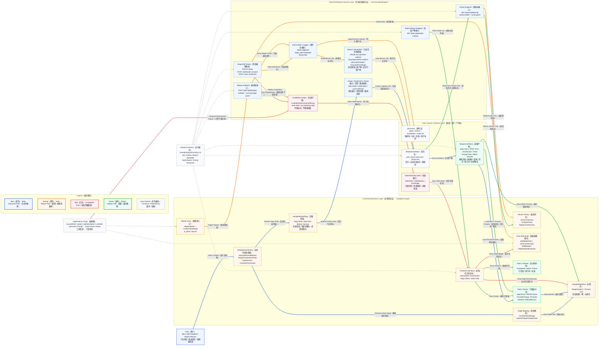

```mermaid
flowchart LR

%% =========================
%% Styles
%% =========================
classDef user fill:#eef6ff,stroke:#2563eb,stroke-width:2px,color:#0f172a;
classDef frontend fill:#fff7ed,stroke:#f59e0b,stroke-width:1.5px,color:#111827;
classDef backend fill:#eff6ff,stroke:#60a5fa,stroke-width:1.5px,color:#111827;
classDef store fill:#f8fafc,stroke:#94a3b8,stroke-width:1.5px,color:#111827;
classDef artifact fill:#ecfdf5,stroke:#22c55e,stroke-width:1.5px,color:#111827;
classDef danger fill:#fff1f2,stroke:#ef4444,stroke-width:1.5px,color:#111827;
classDef contract fill:#f9fafb,stroke:#6b7280,stroke-width:1.5px,color:#111827,stroke-dasharray: 5 5;

%% Legend Styles
classDef legendBlue fill:#eff6ff,stroke:#2563eb,stroke-width:3px,color:#0f172a;
classDef legendOrange fill:#fff7ed,stroke:#f97316,stroke-width:3px,color:#0f172a;
classDef legendRed fill:#fff1f2,stroke:#ef4444,stroke-width:3px,color:#0f172a;
classDef legendGreen fill:#ecfdf5,stroke:#16a34a,stroke-width:3px,color:#0f172a;
classDef legendGray fill:#f9fafb,stroke:#6b7280,stroke-width:2px,color:#0f172a,stroke-dasharray:5 5;

%% =========================
%% Input / Contracts
%% =========================
U["User（用户）<br/>Idea / Edit Feedback / Replan Reason<br/>产品想法 / 修改意见 / 重规划原因"]:::user

CONTRACT["Shared Contracts（共享契约）<br/>shared/blueprint/contracts.ts<br/>Job / Artifact / Branch Metadata<br/>Stale Marker / Family Response"]:::contract

DEP["Dependency Graph（依赖图）<br/>BLUEPRINT_ASSET_DEPENDENCY_GRAPH<br/>Upstream Change → Downstream Impact<br/>上游变更 → 下游影响"]:::contract

%% =========================
%% Frontend
%% =========================
subgraph FE["Frontend Experience Layer（前端体验层） · Autopilot Cockpit"]
direction TB

COORD["AutopilotCoordinator（自动驾驶协调器）<br/>AtomicRefreshMediator<br/>StageTransitionAnimator<br/>ToastQueue / ConsistencyChecker"]:::frontend

ROUTE["AutopilotRoutePage（页面骨架）<br/>Page Shell / Step Rail / Bottom Console<br/>页面骨架 / 顶部步骤轨 / 底部控制台"]:::frontend

STAGE["Stage Mapping（阶段映射）<br/>resolveRailSubStage<br/>mapSubStageToStageIndex"]:::frontend

RIGHT["AutopilotRightRail（右侧栏）<br/>StageViewport + Primary CTA<br/>阶段视图 + 唯一主操作"]:::frontend

VERSION["Version History（版本历史）<br/>VersionTreeView<br/>CompareView<br/>ReplanTimelineView"]:::frontend

INLINE["Inline Edit Mode（局部编辑模式）<br/>EditModeField + InlineConfirmation<br/>StaleBadge / RightRailStaleIndicator"]:::frontend

REPLAN["Replan Entry（重规划入口）<br/>ReplanButton + ConfirmationModal<br/>in_place / branch"]:::frontend

FE_STORE["Frontend Job Store（前端任务状态仓）<br/>activeJobId / branchIndex<br/>stage states / stale index"]:::frontend

TIMELINE["Fabric Timeline（流式时间线）<br/>Completed / Active / Future<br/>已完成 / 进行中 / 未来"]:::artifact

PANEL["Fabric Panels（子面板分流）<br/>AgentCrew / EffectPreview<br/>PromptPackage / Runtime<br/>Handoff / ArtifactMemory"]:::artifact

end

%% =========================
%% Backend
%% =========================
subgraph BE["Backend Blueprint Service Layer（后端蓝图服务层） · server/routes/blueprint"]
direction TB

INTAKE["Intake / Clarification / Route（输入 / 澄清 / 路线选择）<br/>idea intake / clarification / route selection<br/>想法输入 / 澄清回答 / 路线选择"]:::backend

FAMILY["Family Endpoint（家族树接口）<br/>GET /jobs/:jobId/family<br/>family-builder + cycle guard"]:::backend

EDIT["Stage Edit Routes（阶段编辑路由）<br/>PATCH intake<br/>POST clarification answers<br/>POST route reselection"]:::backend

REPLAN_API["Replan Endpoint（重规划接口）<br/>POST /jobs/:jobId/replan<br/>validate + running-stage-guard"]:::backend

STALE_API["Stale Artifacts Endpoint（失效产物接口）<br/>GET /jobs/:jobId/stale-artifacts"]:::backend

LOGGER["Event Writer / Logger（事件记录器）<br/>replan.triggered<br/>stage_edit.invalidated<br/>family.read"]:::backend

BRANCH["Branch Job Builder（分支任务构建器）<br/>rebuild root upstream artifacts<br/>drop downstream artifacts<br/>write parentJobId / branchedFromStage<br/>递归保留上游产物 / 丢弃下游产物"]:::backend

INVALID["Invalidation Engine（失效引擎）<br/>invalidateDownstreamWithLog<br/>mark stale / non-blocking read<br/>写脏标记 / 不阻塞读取"]:::danger

end

%% =========================
%% Data / Events / Artifacts
%% =========================
subgraph DATA["Data / Events / Artifacts Layer（数据 / 事件 / 产物层）"]
direction TB

EVENTS["job.events（事件流）<br/>replan / branch / invalidation / audit trail<br/>重规划 / 分支 / 失效 / 审计轨迹"]:::store

JOBS["BlueprintJobStore（任务仓）<br/>jobs / latest active job / family tree<br/>任务 / 当前活跃任务 / 家族树"]:::store

STALE["staleArtifactIds Index（失效索引）<br/>staleSince / staleReason / fromStage<br/>失效时间 / 失效原因 / 来源阶段"]:::danger

ART["Blueprint Artifacts（蓝图产物）<br/>Spec Docs / SPEC Tree / Architecture / Tasks<br/>Prompt Pack / Effect Preview<br/>规格文档 / 规格树 / 架构 / 任务 / 提示词 / 效果预览"]:::artifact

end

%% =========================
%% Legend
%% =========================
subgraph LEGEND["Legend（路径图例）"]
direction TB

L1["Blue（蓝色）：Main Execution Path（主执行路径）"]:::legendBlue
L2["Orange（橙色）：Edit / Replan Path（编辑 / 重规划路径）"]:::legendOrange
L3["Red（红色）：Invalidation Path（失效传播路径）"]:::legendRed
L4["Green（绿色）：Read / Display Path（读取 / 展示路径）"]:::legendGreen
L5["Gray Dashed（灰色虚线）：Contracts / Dependency（契约 / 依赖）"]:::legendGray

end

%% =========================
%% Main Execution Path
%% 蓝色：主执行路径
%% =========================
U -->|"Enter Cockpit（进入驾驶舱）"| COORD
COORD -->|"Render Page Shell（渲染页面骨架）"| ROUTE
COORD -->|"Resolve Active Stage（解析当前阶段）"| STAGE
STAGE -->|"Drive Right Rail（驱动右栏）"| RIGHT
ROUTE -->|"Submit Product Idea（提交产品想法）"| INTAKE
INTAKE -->|"Create / Update Job（生成或更新任务）"| JOBS
JOBS -->|"Persist Artifacts（归档产物）"| ART
ART -->|"Load Preview Panels（加载预览面板）"| PANEL
PANEL -->|"Show Result（展示结果）"| RIGHT

%% =========================
%% Edit / Replan Path
%% 橙色：编辑 / 重规划路径
%% =========================
INLINE -->|"Submit Edit（提交修改）"| EDIT
REPLAN -->|"Trigger Replan（触发重规划）"| REPLAN_API
EDIT -->|"Write Edit Event（写编辑事件）"| LOGGER
REPLAN_API -->|"Write Replan Event（写重规划事件）"| LOGGER
LOGGER -->|"Append Event Stream（写入事件流）"| EVENTS
LOGGER -->|"Build Branch Job（构建分支任务）"| BRANCH
BRANCH -->|"Save Branch Job（保存分支任务）"| JOBS
VERSION -->|"Read Family Tree（读取家族树）"| FAMILY

%% =========================
%% Invalidation Path
%% 红色：失效传播路径
%% =========================
DEP -->|"Compute Downstream Impact（计算下游影响）"| INVALID
EDIT -->|"Upstream Content Changed（上游内容变更）"| INVALID
REPLAN_API -->|"Replan Invalidates Downstream（重规划使下游失效）"| INVALID
INVALID -->|"Write Stale Marker（写入失效标记）"| STALE
STALE -->|"Sync Stale State（同步失效状态）"| FE_STORE
FE_STORE -->|"Show Stale Badge（显示失效标记）"| INLINE
FE_STORE -->|"Show Right Rail Warning（右栏失效提示）"| RIGHT

%% =========================
%% Read / Display Path
%% 绿色：读取 / 展示路径
%% =========================
JOBS -->|"Read Job / Family Tree（读取任务与家族树）"| FAMILY
FAMILY -->|"Return Version Tree（返回版本树）"| VERSION
STALE_API -->|"Fetch Stale List（读取失效列表）"| FE_STORE
FE_STORE -->|"Drive Timeline（驱动时间线）"| TIMELINE
FE_STORE -->|"Drive Panels（驱动子面板）"| PANEL
ART -->|"Load Docs / Prompt / Preview（读取文档 / 提示词 / 预览）"| PANEL
ART -->|"Show Effect Preview（展示效果预览）"| RIGHT

%% =========================
%% Contract / Dependency Path
%% 灰色虚线：契约 / 依赖
%% =========================
CONTRACT -.-> FAMILY
CONTRACT -.-> EDIT
CONTRACT -.-> REPLAN_API
CONTRACT -.-> STALE_API
CONTRACT -.-> FE_STORE
CONTRACT -.-> JOBS
CONTRACT -.-> ART
DEP -.-> INLINE
DEP -.-> REPLAN

%% =========================
%% Colored Link Styles
%% =========================

%% Blue：Main Execution Path（主执行路径）
linkStyle 0,1,2,3,4,5,6,7,8 stroke:#2563eb,stroke-width:3px;

%% Orange：Edit / Replan Path（编辑 / 重规划路径）
linkStyle 9,10,11,12,13,14,15,16 stroke:#f97316,stroke-width:3px;

%% Red：Invalidation Path（失效传播路径）
linkStyle 17,18,19,20,21,22,23 stroke:#ef4444,stroke-width:3px;

%% Green：Read / Display Path（读取 / 展示路径）
linkStyle 24,25,26,27,28,29,30 stroke:#16a34a,stroke-width:3px;

%% Gray Dashed：Contracts / Dependency（契约 / 依赖）
linkStyle 31,32,33,34,35,36,37,38,39 stroke:#6b7280,stroke-width:1.5px,stroke-dasharray:5 5;
```