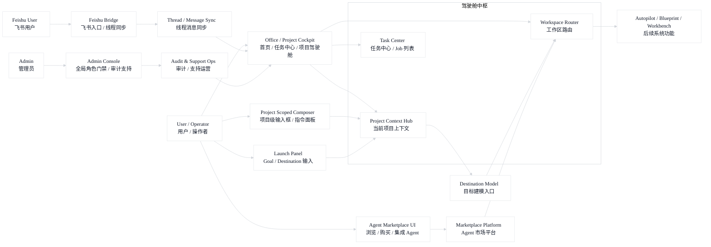

# 01. 用户入口与项目驾驶舱图

```mermaid
%%{init: {'theme':'base','flowchart': {'curve': 'basis', 'htmlLabels': true}, 'themeVariables': {
  'background':'transparent',
  'primaryColor':'#ffffff',
  'primaryTextColor':'#111827',
  'primaryBorderColor':'#e5e7eb',
  'secondaryColor':'#ffffff',
  'tertiaryColor':'#ffffff',
  'lineColor':'#d1d5db',
  'defaultLinkColor':'#d1d5db',
  'clusterBkg':'transparent',
  'clusterBorder':'#d1d5db',
  'mainBkg':'#ffffff',
  'nodeBorder':'#e5e7eb',
  'fontSize':'16px',
  'fontFamily':'Arial, PingFang SC, Microsoft YaHei, sans-serif'
}} }%%
flowchart LR
    U[User / Operator<br/>用户 / 操作者] --> HOME[Office / Project Cockpit<br/>首页 / 任务中心 / 项目驾驶舱]
    U --> COMPOSER[Project Scoped Composer<br/>项目级输入框 / 指令面板]
    U --> LAUNCH[Launch Panel<br/>Goal / Destination 输入]
    U --> MARKET_UI[Agent Marketplace UI<br/>浏览 / 购买 / 集成 Agent]
    FEI[Feishu User<br/>飞书用户] --> FEISHU[Feishu Bridge<br/>飞书入口 / 线程同步]
    ADMIN[Admin<br/>管理员] --> ADMIN_CONSOLE[Admin Console<br/>全局角色门禁 / 审计支持]
    subgraph HUB[驾驶舱中枢]
      PROJECT_CTX[Project Context Hub<br/>当前项目上下文]
      TASK_CENTER[Task Center<br/>任务中心 / Job 列表]
      WORKSPACE[Workspace Router<br/>工作区路由]
    end
    HOME --> PROJECT_CTX
    HOME --> TASK_CENTER
    HOME --> WORKSPACE
    COMPOSER --> PROJECT_CTX
    LAUNCH --> PROJECT_CTX
    PROJECT_CTX --> DEST[Destination Model<br/>目标建模入口]
    MARKET_UI --> MARKET[Marketplace Platform<br/>Agent 市场平台]
    FEISHU --> SYNC[Thread / Message Sync<br/>线程消息同步]
    ADMIN_CONSOLE --> AUDIT[Audit & Support Ops<br/>审计 / 支持运营]
    DEST --> WORKSPACE
    MARKET --> WORKSPACE
    SYNC --> HOME
    AUDIT --> HOME
    WORKSPACE --> NEXT[Autopilot / Blueprint / Workbench<br/>后续系统功能]
```
